# Architecture Decision Records (ADR)

> **Ürün istemcisi güncellemesi (2026-08-11):** Üretici React Native istemcisi emekliye ayrılmış ve `mobile/` kaldırılmıştır. Üreticinin tek istemcisi `frontend` içindeki kurulabilir PWA'dır. Aşağıdaki React Native/FCM kayıtları tarihsel kararlardır; güncel uygulamada PWA, Web Push, SignalR ve tarayıcı çevrimdışı kuyruğu esas alınır. Ayrıntı: [PWA_MOBILE_PARITY.md](./PWA_MOBILE_PARITY.md).

# Agriculture Management System

| Attribute | Value |
|---|---|
| **Document Title** | Architecture Decision Records (ADR) |
| **Version** | 1.0 |
| **Status** | Accepted |
| **Effective Date** | 2026-07-17 |
| **Audience** | Software architects, tech leads, senior engineers, module owners, DevOps/SRE, security officers, QA leads, product owners reviewing technical feasibility, Architecture Board members |
| **Document Ownership** | Architecture Board / Municipality Digital Transformation Engineering |
| **Related Stack** | ASP.NET Core, EF Core, SQL Server, React, React Native, Clean Architecture, Modular Monolith, CQRS, MediatR, Hangfire, SignalR, JWT, FluentValidation, MinIO, Serilog, Seq, FCM |
| **Authoritative Scope** | Permanent architectural reference justifying technology and pattern choices for the Agriculture Management System |

---

## Document Purpose

This document is the **authoritative set of Architecture Decision Records** for the Agriculture Management System. It captures irreversible or costly-to-reverse choices about topology, patterns, platforms, security, data, communication, and deployment. Each ADR records Context, Problem, Options Considered, Advantages, Disadvantages, Final Decision, Consequences, and Future Considerations so that future teams can understand not only *what* was decided but *why* alternatives were rejected.

This ADR set is the permanent architectural reference that **justifies** the technology and pattern choices prescribed by [MODULE_DESIGN.md](./MODULE_DESIGN.md), [AGGREGATE_DESIGN.md](./AGGREGATE_DESIGN.md), and [EVENT_STORMING.md](./EVENT_STORMING.md). Where MODULE_DESIGN states *how* modules are organized, this document states *why* those organizational and technology choices exist and under what conditions they may be superseded.

---

## How ADRs Are Governed

### Numbering

- ADRs are numbered sequentially: `ADR-001`, `ADR-002`, … with zero-padded three-digit identifiers.
- Numbers are never reused. A superseded ADR retains its number with Status set to **Superseded** and a pointer to the replacing ADR.
- New ADRs continue from the next free number (after ADR-020, the next is ADR-021).

### Status Values

| Status | Meaning |
|---|---|
| **Proposed** | Draft under Architecture Board review; not binding for implementation |
| **Accepted** | Binding for design and implementation; deviations require Board approval |
| **Deprecated** | Still valid for legacy paths but must not be used for new work |
| **Superseded** | Replaced by a newer ADR; retained for historical rationale |
| **Rejected** | Explicitly considered and declined; retained to prevent re-litigation |

### New ADR Process

1. **Sponsor** (architect or tech lead) drafts Context, Problem, and Options with municipal operational scenarios.
2. **Impact assessment** covers modules affected (per MODULE_DESIGN), aggregates (per AGGREGATE_DESIGN), events (per EVENT_STORMING), security, ops, and migration cost.
3. **Architecture Board review** (minimum: lead architect, module owner(s), DevOps, security).
4. **Decision recorded** with Status, Date, Consequences, and Future Considerations.
5. **Propagation**: update MODULE_DESIGN / AGGREGATE_DESIGN / EVENT_STORMING / SRS NFR sections if the ADR changes structural or non-functional commitments.
6. **Communication**: announce in engineering channel; update docs/README index if a new ADR file is split out (this repository keeps ADRs in a single ADR.md unless volume requires a `docs/adr/` folder later).

### Superseding

- A superseding ADR must cite the ADR it replaces and state the migration strategy for existing code and data.
- Supersession does not delete history; the original ADR remains in this document with updated Status.
- Temporary exceptions (spikes, PoCs) require a time-boxed Architecture Board note; they do not create Accepted ADRs until promoted.

### Relationship to Product Documents

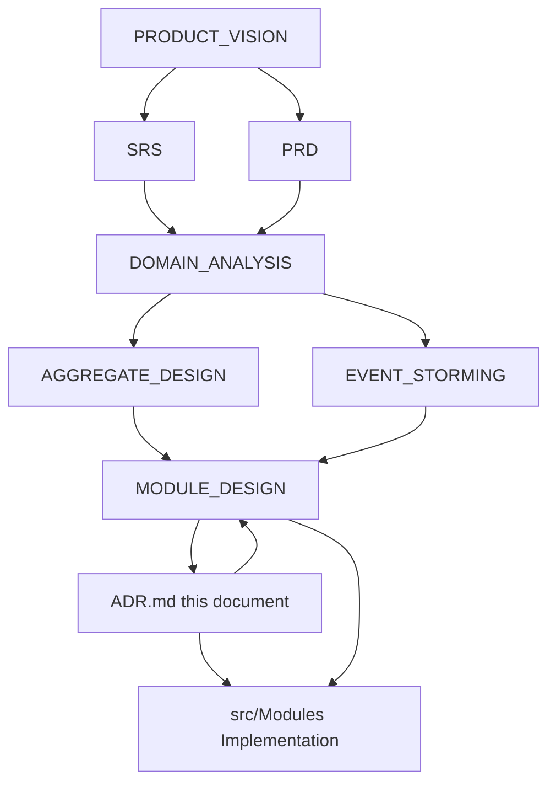

| Document | Responsibility | Relationship to ADR |
|---|---|---|
| PRODUCT_VISION | Why the product exists | Supplies municipal goals and anti-goals that constrain ADR options |
| SRS | Formal functional/non-functional requirements | ADRs must satisfy NFR commitments (security, availability, auditability) |
| PRD | Product behavior and journeys | ADRs must enable PRD journeys without forcing architecture into the product narrative |
| DOMAIN_ANALYSIS | Ubiquitous language and domains | ADRs respect domain boundaries when choosing module and data strategies |
| AGGREGATE_DESIGN | Aggregates, invariants, transaction boundaries | ADRs on EF Core, DB, CQRS, and module communication must preserve aggregate consistency |
| EVENT_STORMING | Commands, events, policies, read models | ADRs on MediatR, Hangfire, SignalR, FCM implement the event-driven business model |
| MODULE_DESIGN | Bounded contexts, folders, contracts, ops | Primary consumer of these ADRs; structural changes require ADR + Board review |
| **ADR (this)** | Why technologies and patterns were chosen | Permanent justification layer; binding once Accepted |

**Reading order for new engineers:** PRODUCT_VISION → SRS/PRD → DOMAIN_ANALYSIS → AGGREGATE_DESIGN → EVENT_STORMING → MODULE_DESIGN → **this ADR document** → implementation against Accepted ADRs only.

---

## Architectural Context Summary

The Agriculture Management System is a **workflow-driven municipal production platform**. Primary risk is correct encoding of sequential production rules (task completion advancing workflow steps, inspection blocking, harvest/delivery constraints, season archival immutability) with municipal auditability—not premature horizontal scale to millions of tenants.

The approved near-term topology is a **modular monolith** hosted on ASP.NET Core, with Clean Architecture per module, CQRS via MediatR, SQL Server + EF Core persistence, Hangfire for background work, SignalR for realtime dashboards, FCM for mobile push, MinIO for object storage, and Serilog + Seq for observability. Clients are React (web) and React Native (mobile).

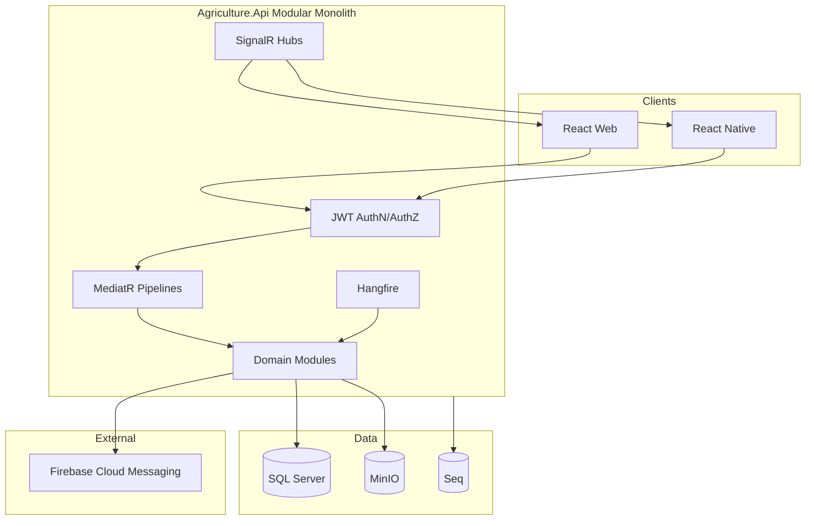

---

# ADR-001 — Modular Monolith vs Microservices

| Field | Value |
|---|---|
| **Title** | Modular Monolith as Primary Deployment Topology |
| **Status** | Accepted |
| **Date** | 2026-07-17 |
| **Deciders** | Architecture Board |
| **Related** | MODULE_DESIGN §1.1, §2.1, §10; AGGREGATE_DESIGN transaction boundaries; EVENT_STORMING policies |

## Context

Municipal digital transformation teams delivering the Agriculture Management System typically begin with one or two feature teams, a single operations unit, and a mandate for auditability, workflow correctness, and predictable release cadence. The business domain spans Producers, Lands, Seasons, Workflows, Tasks, Inspections, Harvest, Delivery, Notifications, Reporting, and Identity. These domains are **process-coupled**: completing a task may advance a workflow step, optionally create an inspection, schedule a notification, and update dashboard read models. Early product risk is incorrect sequential rules—not inability to scale to hyperscale multi-tenant SaaS.

MODULE_DESIGN already states that bounded contexts come first and process boundaries second. Extracting services before contexts stabilize produces a distributed monolith: chatty HTTP, shared tables, unclear ownership, and expensive debugging across network hops. The Architecture Board must record an explicit topology decision so that teams neither drift into accidental microservices nor freeze forever into an unmodular ball of mud.

Operational constraints include municipal data centers or government cloud tenancy, limited SRE headcount, requirement for correlated audit logs across a season lifecycle, and the need to onboard a second municipality later via tenancy hooks without redesigning the entire platform.

## Problem

What deployment and process topology should the system use for the MVP and near-term production phases such that:

1. Workflow invariants spanning multiple aggregates can be enforced with clear transactional or outbox semantics.
2. Team cognitive load and operational surface area remain proportional to team size.
3. Module boundaries remain extractable later when independent scale, release cadence, or regulatory isolation justify microservices.
4. Municipal operators can deploy, backup, restore, and monitor a coherent system without a service mesh on day one.

## Options Considered

### Option A — Modular Monolith (single deployable host, module boundaries in-process)

One ASP.NET Core host (`Agriculture.Api`) composes all modules. Each module owns Domain/Application/Infrastructure layers, schema contribution (schema-per-module), MediatR handlers, Hangfire jobs, and optional SignalR hubs. Inter-module calls use application-layer contracts and domain/integration events—not shared DbContexts or direct table access.

### Option B — Microservices from Day One

Each bounded context is an independently deployable service with its own database, API gateway routing, distributed authentication, and async messaging (e.g., RabbitMQ/Azure Service Bus). Workflow spanning modules uses sagas/process managers.

### Option C — Traditional Layered Monolith (no module boundaries)

Single solution with horizontal layers (UI, BLL, DAL) shared across all domains; entities and DbContext shared freely.

### Option D — Hybrid: Core Monolith + Extracted Notification/Reporting Services Immediately

Keep workflow core in one process; extract Notifications and Reporting as separate services from the first production release.

## Trade-off Analysis

| Criterion | Modular Monolith | Microservices Day One | Layered Monolith | Hybrid Early Extract |
|---|---|---|---|---|
| Workflow transactional honesty | High (in-process + outbox) | Low without mature sagas | Medium (easy but tangled) | Medium (network for side effects) |
| Ops complexity | Low–Medium | High | Low | Medium–High |
| Team size fit (1–2 teams) | Excellent | Poor | Good short-term | Fair |
| Extraction readiness | High if modules enforced | N/A (already extracted) | Low | Partial |
| Debugging season lifecycle | Single correlation | Distributed tracing mandatory | Easy but opaque ownership | Mixed |
| Municipal cost of correctness | Lowest | Highest early | Hidden debt | Medium |

### Why Microservices Day One Was Rejected

Microservices multiply deployments, observability, auth propagation, schema ownership, and failure modes faster than they buy organizational scale for a municipal team. Saga orchestration for “TaskCompleted → WorkflowStepCompleted → InspectionCreated → NotificationScheduled” would dominate delivery before domain language stabilizes. Premature service boundaries freeze incorrect cuts.

### Why Traditional Layered Monolith Was Rejected

Without bounded contexts, colliding terms (“Status,” “Assignment,” “Document”) proliferate. Shared entities weaken aggregate invariants from AGGREGATE_DESIGN. Extraction later becomes a rewrite. MODULE_DESIGN anti-goals explicitly reject an anemic shared dump.

### Why Hybrid Early Extract Was Deferred

Notifications and Reporting are strong extraction candidates (see Future Considerations), but extracting them before contracts, outbox, and idempotent consumers exist creates dual-write and dual-deploy pain without proven scale pressure. The modular monolith can host Hangfire/FCM/SignalR adapters behind ports until metrics justify a cut.

## Advantages of the Chosen Option (Modular Monolith)

1. **Transactional honesty for sequential workflows.** Application-layer orchestration can use a unit of work and outbox without distributed saga infrastructure on day one, preserving invariants such as harvest-only-after-workflow-completion and delivery-quantity ≤ harvest-amount.
2. **Proportional operational surface.** One process, one JWT validation path, one Serilog→Seq correlation chain, one health endpoint surface for municipal ops.
3. **Bounded-context discipline with extractability.** Schema-per-module, public contracts, and integration events make later extraction a deliberate cut (MODULE_DESIGN §10), not an emergency rewrite.
4. **Lower cost of correctness.** Unified debugging of Producer → Season → Workflow → Task → Inspection → Harvest → Delivery journeys.
5. **Tenancy hooks without mesh.** Second municipality onboarding via row filters/schema/host config remains feasible per module.
6. **Developer experience.** Local `docker compose` brings up API + SQL + MinIO + Seq; no local Kubernetes required for feature work.

## Disadvantages of the Chosen Option

1. **Blast radius.** A fatal process crash affects all modules; mitigation requires disciplined health checks, circuit breakers for external I/O, and careful Hangfire isolation.
2. **Independent scale limits.** A reporting-heavy municipality cannot scale Reporting CPU independently without extraction; vertical scale and read replicas are interim answers.
3. **Release coupling.** Modules share a release train unless feature flags and module ownership discipline are enforced; a bad Reporting change can delay a Workflow fix unless trunk-based practices and tests gate merges.
4. **Temptation to violate boundaries.** In-process calls make illicit cross-module DbContext usage easy; governance and code review (ADR-017) are mandatory.
5. **Technology lock-in per process.** All modules share the ASP.NET Core host version and certain middleware policies.

## Final Decision

**Accept the Modular Monolith** as the primary deployment topology for MVP and near-term production. One ASP.NET Core host composes modules defined in MODULE_DESIGN. Microservices are an explicit **later** goal for modules that demonstrate independent scale, release cadence, or regulatory isolation (Reporting analytics warehouse, Notifications fan-out, Communication messaging), subject to extraction prerequisites in MODULE_DESIGN §10 and a future superseding ADR.

## Consequences

### Positive

- Aligns delivery with municipal team size and workflow correctness priority.
- Enables AGGREGATE_DESIGN transaction boundaries without distributed transactions.
- Provides a clear story to stakeholders: “modules now, services when metrics demand.”
- Simplifies CI/CD to a single API artifact plus frontends.

### Negative

- Architecture Board must police module boundaries continuously.
- Performance isolation is weaker until extraction; capacity planning must be proactive.
- Some engineers experienced in microservices may push premature splits; this ADR is the authoritative rebuttal unless evidence changes.

### Long-term Consequences

Over a 5–10 year municipal system lifetime, the modular monolith reduces rewrite risk when identity providers, storage, or notification vendors change—provided Clean Architecture ports are respected (ADR-002). If the product becomes a multi-municipality SaaS with strong tenant isolation and independent module SLAs, expect progressive extraction rather than a big-bang rewrite.

### Maintenance Impact

Module owners maintain their folders and schemas; the host owner maintains composition, middleware, and shared pipeline behaviors. Shared Kernel changes require Board review. Dependency rules in MODULE_DESIGN are enforceable via architecture tests (e.g., NetArchTest).

### Performance Impact

In-process MediatR calls avoid network latency for command chains. Read-heavy dashboards benefit from CQRS read models (ADR-003) inside the same process. Bottlenecks will likely appear first in SQL reporting queries and MinIO/FCM external I/O—not in inter-module RPC.

### Developer Experience

Fast inner loop; single debugger session for end-to-end season flows; clear folder topology. New engineers learn one host, then module by module.

### Operational Impact

Single deployment unit; unified backups of SQL Server; MinIO bucket backup separate; Seq for logs. Runbooks cover process recycle, Hangfire queue depth, and SQL DTU/CPU. No service mesh mandatory.

### Future Migration Strategy

Extraction order (indicative, subject to metrics): (1) Notifications/Communication fan-out, (2) Reporting/analytics warehouse, (3) Identity if federation mandates separate IdP boundary, (4) Harvest/Delivery only if logistics partners require separate SLAs. Prerequisites: stable integration events, outbox/inbox, idempotent consumers, separate schema already enforced, contract tests, independent CI package, observability correlation headers. Migration is strangler-style: introduce remote adapter behind the same application port, dual-run, then cut traffic.

## Future Considerations

- Introduce architecture fitness functions that fail CI on illegal project references.
- Measure module CPU/time via custom metrics before extraction debates.
- Revisit Hybrid extraction for Notifications when FCM/email volume or failure isolation demands it—via a new ADR, not informal drift.
- Multi-tenant municipal SaaS may require per-tenant connection resiliency; still compatible with modular monolith until scale evidence appears.

### Enterprise Best Practices Applied

- Conway’s law alignment with team topology.
- Evolutionary architecture (extract when justified).
- Explicit anti-corruption via contracts rather than shared databases.
- Documented exit ramps to avoid both premature distribution and permanent mud.

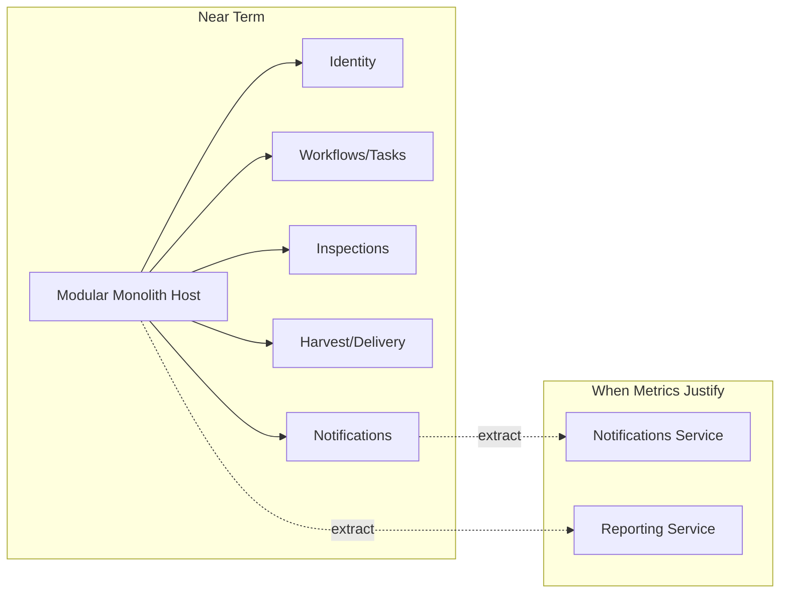

---

# ADR-002 — Clean Architecture

| Field | Value |
|---|---|
| **Title** | Clean Architecture per Module (Dependency Rule) |
| **Status** | Accepted |
| **Date** | 2026-07-17 |
| **Deciders** | Architecture Board |
| **Related** | MODULE_DESIGN §1.2; ADR-001; ADR-006; ADR-017 |

## Context

Municipal systems have long lifetimes. Infrastructure choices—ORMs, notification vendors, object storage, identity providers, UI frameworks—change more often than agricultural production rules (workflow sequencing, inspection blocking, harvest constraints). DOMAIN_ANALYSIS and AGGREGATE_DESIGN encode those rules as the durable core of the product. If domain types depend on ASP.NET, EF Core, Hangfire, or MinIO SDKs, every infrastructure upgrade becomes a domain rewrite risk.

Each module in the modular monolith must therefore isolate business rules from frameworks while remaining pragmatic for a .NET municipal team. Clean Architecture (ports and adapters / hexagonal style) is the established pattern in the .NET ecosystem for this separation, aligning with MODULE_DESIGN’s Domain / Application / Infrastructure / Contracts layering.

## Problem

How should code within each module be layered so that:

1. Domain invariants remain independent of UI, persistence, and messaging technologies.
2. Testing of business rules does not require SQL Server or MinIO.
3. Infrastructure can be replaced (e.g., MinIO → S3-compatible cloud, FCM → alternative push) with adapter swaps.
4. Developers have a clear rule for dependency direction that code review and architecture tests can enforce.

## Options Considered

### Option A — Clean Architecture (Domain ← Application ← Infrastructure; Host as composition root)

Domain contains aggregates, value objects, domain events, domain services, repository *interfaces*. Application contains commands/queries/handlers, validators, policies, DTOs. Infrastructure implements ports (EF repositories, MinIO, FCM, email). Host wires DI. Dependencies point inward.

### Option B — Traditional N-tier (UI → BLL → DAL)

Business logic in BLL referencing DAL entities; controllers call services that call repositories returning EF entities.

### Option C — Vertical Slice without Strict Domain Layer

Organize by feature folders with handlers co-located with EF commands; minimal domain model.

### Option D — Full Hexagonal with Multiple Adapters Mandatory from Day One

Every port has at least two adapters (e.g., SQL + in-memory, MinIO + filesystem) as a project rule.

## Trade-off Analysis

| Criterion | Clean Architecture | N-tier | Vertical Slice Only | Hexagonal Strict Dual Adapters |
|---|---|---|---|---|
| Business independence | High | Low–Medium | Medium | High |
| Testability of rules | High | Medium | Medium | High |
| Ceremony / boilerplate | Medium | Low | Low | High |
| Fit with DDD aggregates | Excellent | Poor | Fair | Excellent |
| Municipal longevity | Strong | Weak | Medium | Strong but costly |

### Why N-tier Was Rejected

EF entities leak into UI; invariants scatter across services; swapping SQL Server becomes a rewrite; contradicts AGGREGATE_DESIGN ownership rules.

### Why Vertical Slice Alone Was Rejected

Slices improve feature locality but without a protected domain model, workflow invariants dilute into handler scripts. The Board accepts vertical slices *inside* Application (command/handler folders) **on top of** a real Domain layer—not instead of it.

### Why Strict Dual Adapters Was Deferred

Valuable for critical ports, but mandating dual adapters for every port slows MVP. In-memory fakes for tests are required; production dual adapters are optional until a migration is planned.

## Advantages of the Chosen Option

1. **Dependency rule:** source code dependencies point only inward; Domain knows nothing of EF/ASP.NET.
2. **Maintainability:** production rules survive framework upgrades.
3. **Testing:** domain unit tests and application handler tests with fakes.
4. **Separation of concerns:** HTTP, persistence, and jobs are adapters.
5. **Business independence:** municipality can change cloud vendor without rewriting Season/Workflow logic.
6. **Aligns with CQRS/MediatR:** Application layer hosts handlers; Infrastructure hosts EF.

## Disadvantages of the Chosen Option

1. More projects/folders per module; onboarding requires learning the dependency rule.
2. Mapping overhead between domain entities and EF configurations / DTOs.
3. Risk of anemic domain if teams push logic into handlers; mitigated by aggregate design reviews.
4. Over-abstraction risk on simple CRUD reference data—mitigated by keeping reference data thin but still inside module boundaries.

## Final Decision

**Adopt Clean Architecture per module** with layers: Domain, Application, Infrastructure, and optional Contracts. The Host is the sole composition root. Domain and Application must not reference Infrastructure or ASP.NET assemblies. Repository interfaces live in Domain (or Application ports as defined in MODULE_DESIGN); implementations live in Infrastructure.

## Consequences

### Positive

- Long-term cost of infrastructure change is localized to adapters.
- Supports ADR-001 extraction: a module’s Domain/Application can move with new Infrastructure adapters.
- Clear review checklist: “Does Domain import EF? Reject.”

### Negative

- Initial scaffold cost; need shared templates for new modules.
- Junior developers may place business rules in Infrastructure “for speed”—training required.

### Long-term / Maintenance / Performance / DX / Ops

Long-term: domain remains the stable core across decade-scale municipal use. Maintenance: module owners own all layers of their module. Performance: mapping costs are negligible vs SQL I/O; avoid chatty mappings in tight loops via purposeful EF projections in query handlers. DX: slightly more files, much clearer places for logic. Ops: no direct operational downside; clearer ownership during incidents (“workflow invariant bug” vs “EF timeout”).

### Future Migration Strategy

When extracting a module to a service, preserve Domain and Application packages; replace Host registration and Infrastructure connection strings; keep Contracts as the published language. If moving to another language (unlikely), Domain rules must be re-specified from AGGREGATE_DESIGN—Clean Architecture does not eliminate that risk across languages but minimizes it within .NET.

## Future Considerations

- Architecture tests in CI for dependency direction.
- Optional second adapters when vendor lock-in risk is high (storage, push).
- Document mapping strategies (manual vs Mapster) in a later ADR if inconsistency appears.

### Enterprise Best Practices

- Ports and adapters; dependency inversion; testability as a first-class requirement; align layers with DDD building blocks.

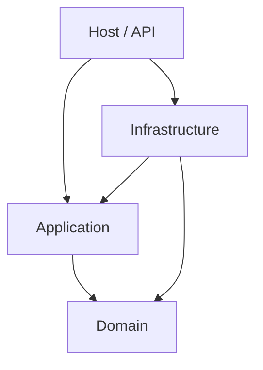

---

# ADR-003 — CQRS

| Field | Value |
|---|---|
| **Title** | CQRS for Command and Query Separation |
| **Status** | Accepted |
| **Date** | 2026-07-17 |
| **Deciders** | Architecture Board |
| **Related** | MODULE_DESIGN §1.2; EVENT_STORMING read models; AGGREGATE_DESIGN; ADR-004; ADR-015 |

## Context

The Agriculture Management System is not a CRUD registry. Screens exist because of business processes: “Today’s Tasks,” Season Timeline, Inspection queues, Permission Matrix, Harvest summaries, Delivery tracking. EVENT_STORMING identifies distinct commands (complete task, create inspection, record harvest) and read models (dashboards, timelines, matrices). Write models must protect invariants; read models must optimize query shapes and authorization filters for municipal roles (officer, inspector, producer, admin).

Inspection and workflow dashboards are read-heavy. Harvest and delivery writes are consistency-sensitive. If a single model serves both, teams either weaken aggregates to please the UI or accept poor dashboard performance and accidental invariant breaks.

## Problem

How should the system separate operations that change state from operations that return information so that:

1. Aggregates remain the authority for invariants on write.
2. Dashboards and lists can be optimized without contaminating write models.
3. Complexity remains justified for a modular monolith (not full event-sourcing everywhere).
4. Future caching (ADR-015) and reporting extraction have clean seams.

## Options Considered

### Option A — CQRS (separate commands/queries; same database initially; distinct models/handlers)

Commands mutate aggregates and raise domain events. Queries use dedicated handlers returning DTOs/read models via EF no-tracking projections or explicit read tables/views. Same SQL Server; no mandatory separate read DB on day one.

### Option B — CRUD services with shared entities for read and write

One service/repository per entity; controllers map entities to UI.

### Option C — Full Event Sourcing + CQRS

Every state change appended as events; read models projected asynchronously from event streams.

### Option D — CQRS with immediate separate read replica / read database

Commands to primary; queries always to read replica or separate read store from day one.

## Trade-off Analysis

| Criterion | CQRS same DB | CRUD shared entities | Event Sourcing | CQRS + separate read DB |
|---|---|---|---|---|
| Invariant protection | High | Low–Medium | High | High |
| Dashboard optimization | High | Low | High (async) | Highest |
| Complexity | Medium | Low | Very High | High |
| Consistency story | Strong on write; read immediate | Immediate | Eventual | Eventual |
| Team readiness | Good | Good | Poor early | Medium |

### Why CRUD Shared Entities Was Rejected

UI DTOs leak into aggregates; query convenience weakens boundaries; contradicts MODULE_DESIGN and AGGREGATE_DESIGN.

### Why Full Event Sourcing Was Rejected

Municipal audit needs are met with domain events + audit tables (ADR-016), not full ES. ES multiplies operational complexity (snapshots, replaying, upcasters) beyond current team readiness and product risk profile.

### Why Separate Read DB Day One Was Rejected

Adds replication lag handling and dual-connection ops before read load justifies it. Same-DB CQRS with projections/no-tracking delivers most benefits; replicas can arrive later under ADR-015/ADR-005 evolution.

## Advantages of the Chosen Option

1. Write models protect invariants; read models optimize “Today’s Tasks,” Season Timeline, Permission Matrix.
2. Prevents UI concerns from shaping aggregate design.
3. Allows different performance strategies: transactional writes vs denormalized reads.
4. Natural fit for MediatR `IRequest` split into commands vs queries.
5. Enables targeted caching of read models later without caching aggregates naively.
6. Aligns handlers with EVENT_STORMING command/read-model vocabulary.

## Disadvantages of the Chosen Option

1. More types (commands, queries, handlers, DTOs) than CRUD.
2. Risk of duplicated mapping logic if discipline slips.
3. Developers may over-build read tables before query pain exists—guidance: start with projections, promote to tables when needed.
4. Eventual consistency appears only when async projections are introduced; until then reads see committed writes in same DB.

## Final Decision

**Adopt CQRS** within the modular monolith: commands and queries are separate application-layer requests with separate handlers and models. Use the same SQL Server initially. Prefer EF Core projections with AsNoTracking for queries. Introduce dedicated read models/tables when profiling justifies them. Do **not** adopt full event sourcing for MVP. Do **not** require a separate read database for MVP.

## Consequences

### Positive

- Clear mental model matching EVENT_STORMING.
- Safer aggregates; faster dashboards over time.
- Extraction of Reporting becomes “move read models,” not “split god services.”

### Negative

- Ceremony; need templates and linting for handler structure.
- Must educate that queries must not mutate state (enforce via pipeline/review).

### Long-term Consequences

As municipalities accumulate seasons of data, read-side optimization becomes critical. CQRS allows partitioning reporting without redesigning write aggregates. If event-driven projections grow, the system can evolve toward async read models without rewriting command handlers.

### Maintenance Impact

Command handlers owned with aggregates; query handlers may be owned by the same module or a Reporting module consuming integration events—per MODULE_DESIGN dependency rules.

### Performance Impact

Writes remain transactional around aggregates. Reads avoid change tracking and over-fetching. Hot paths (task lists per producer per day) can be indexed and projected. Risk: chatty queries if handlers N+1; mitigated by review and profiling.

### Developer Experience

Explicit files for each use case improve navigability once familiar. Pair with MediatR (ADR-004) for discovery.

### Operational Impact

Fewer surprise heavy joins on write connections if reporting queries are isolated and later moved to replicas. Monitoring should tag command vs query durations.

### Future Migration Strategy

1. Same DB projections → 2. SQL views/read tables updated in-process after commit → 3. Outbox-driven async projectors → 4. Read replica binding for query handlers → 5. Extract Reporting service consuming events. Each step is additive; superseding ADR only if ES becomes mandatory for regulatory replay.

## Future Considerations

- Query-side authorization filters standardized per role.
- Materialized read models for Season Timeline when season counts grow.
- Avoid “CQRS theater”: do not duplicate models without benefit.

### Enterprise Best Practices

- Separate responsibilities by reason to change; optimize read and write independently; keep consistency boundaries explicit; evolve toward distribution only with metrics.

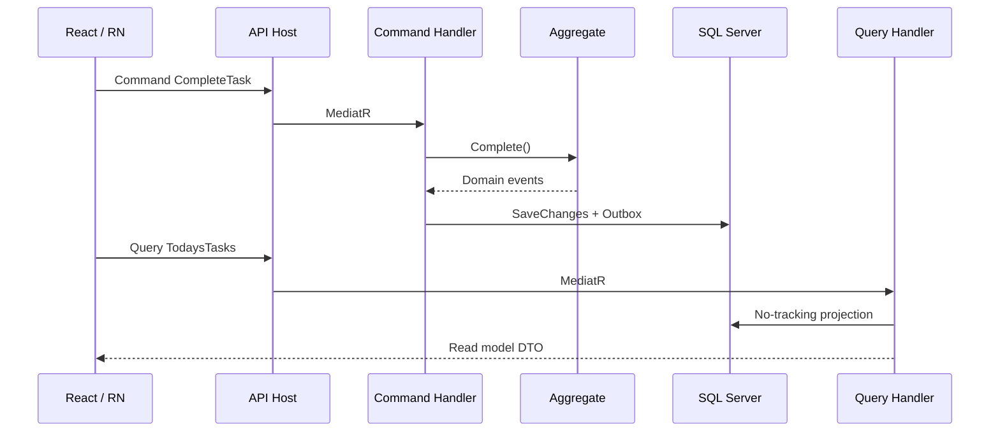

Municipal operational scenario: During peak planting season, officers monitor hundreds of open tasks while producers complete tasks from the field. Commands must not lock read dashboards; queries must not load full aggregate graphs. CQRS prevents the dashboard from calling `CompleteTask` logic paths and prevents completion handlers from returning large UI graphs.

Failure mode addressed: A future developer adding “get aggregate and map to dashboard” inside a command handler creates write/read entanglement—rejected by this ADR and code review checklist.

---

# ADR-004 — MediatR

| Field | Value |
|---|---|
| **Title** | MediatR as In-Process Mediator and Pipeline for Application Use Cases |
| **Status** | Accepted |
| **Date** | 2026-07-17 |
| **Deciders** | Architecture Board |
| **Related** | ADR-002; ADR-003; ADR-018; ADR-019; MODULE_DESIGN §1.2 |

## Context

Cross-cutting concerns—validation, logging, authorization, transactions, performance timing, domain event dispatch after persistence—must not be copy-pasted into every handler. The Application layer exposes many discrete use cases matching EVENT_STORMING commands and queries. An in-process mediator provides a single dispatch point and a pipeline of behaviors, aligning with Clean Architecture while keeping controllers thin.

## Problem

How should the host dispatch application use cases and apply cross-cutting policies consistently across all modules?

## Options Considered

### Option A — MediatR (or maintained fork-compatible mediator) with pipeline behaviors

Controllers/endpoints send `IRequest`; behaviors wrap handlers for validation (FluentValidation), logging (Serilog), authorization, unit-of-work/transaction, and timing.

### Option B — Direct service calls from controllers to application services

Classic `ITaskAppService.CompleteAsync(...)` without a mediator.

### Option C — Custom mediator built in-house

### Option D — Controllers contain orchestration logic

## Trade-off Analysis

MediatR is standard in .NET Clean Architecture templates, well understood, and supports notifications for domain event handlers. Direct services reduce one abstraction but duplicate cross-cutting or force base-class clutter. Custom mediators reinvent packaging and community knowledge. Fat controllers violate Clean Architecture and testing goals.

## Advantages of the Chosen Option

1. Pipeline behaviors: validation, logging, authorization, transactions, performance timing in one place.
2. Thin endpoints; discoverable handlers per use case.
3. `INotification` for in-process domain event handlers after successful persistence.
4. Consistent Result/exception mapping with ADR-018.
5. Module handlers register independently; host composes assemblies.

## Disadvantages of the Chosen Option

1. Indirection can obscure call stacks for newcomers (mitigate with naming and logging).
2. Dependency on a library; monitor maintenance (community forks if needed).
3. Overuse of notifications can create implicit coupling—prefer explicit module contracts for cross-module work (ADR-017).
4. Pipeline order bugs if behaviors are mis-registered.

## Final Decision

**Adopt MediatR** (or Board-approved compatible mediator) for command/query dispatch. Mandatory behaviors: FluentValidation, structured logging with correlation ID, authorization checks where not handled solely by endpoint metadata, and unit-of-work that saves and dispatches domain events after successful commit. Optional: performance timing behavior for slow query detection.

## Consequences

Positive: DRY cross-cutting; consistent audit trail hooks; aligns CQRS. Negative: pipeline complexity; must document behavior order. Long-term: behaviors become the enterprise policy spine. Maintenance: shared behaviors in a BuildingBlocks project; module-specific behaviors rare. Performance: negligible overhead vs I/O. DX: excellent once templates exist. Ops: correlation IDs in Seq via logging behavior. Migration: can replace MediatR with another mediator behind the same handler interfaces if API-compatible; handlers remain valuable assets.

## Future Considerations

- Explicit behavior order diagram in onboarding docs.
- Ban business rules inside behaviors except authorization policy evaluation.
- Consider source-generated dispatch only if reflection cost ever matters (unlikely).

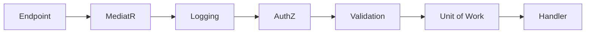

Enterprise best practices: open/closed for cross-cutting; single responsibility handlers; consistent operational policies.

---

# ADR-005 — SQL Server

| Field | Value |
|---|---|
| **Title** | Microsoft SQL Server as System of Record Relational Database |
| **Status** | Accepted |
| **Date** | 2026-07-17 |
| **Deciders** | Architecture Board |
| **Related** | ADR-001; ADR-006; ADR-016; MODULE_DESIGN schema-per-module; AGGREGATE_DESIGN |

## Context

The Agriculture Management System requires a durable, transactional system of record for aggregates defined in AGGREGATE_DESIGN: Users, Producers, Lands, Seasons, Workflows, Tasks, Inspections, Harvests, Deliveries, and related children. Municipal operations demand ACID transactions for workflow step advancement, optimistic concurrency for contested task updates, relational integrity for foreign keys within module schemas, point-in-time backup/restore, and tooling familiar to government IT organizations in .NET ecosystems.

Workflow correctness depends on transactional honesty: completing a task, recording domain events in an outbox, and updating workflow progress must not partially commit. Reporting and dashboards need rich querying with indexes. Soft delete and audit columns (ADR-016) must be first-class. Binary photos and large documents belong in MinIO (ADR-010), not as BLOBs in the primary OLTP database—but metadata and object keys remain in SQL Server.

## Problem

Which relational database engine should serve as the authoritative OLTP store for all module schemas in the modular monolith, balancing municipal procurement realities, .NET alignment, transactional features, operational maturity, and a credible future migration path if cloud or open-source mandates change?

## Options Considered

### Option A — Microsoft SQL Server (including Azure SQL when hosted in Azure)

Enterprise relational engine with deep EF Core support, robust T-SQL, row-version concurrency, partitioning, Always On / geo-replication options, and strong backup tooling.

### Option B — PostgreSQL

Open-source relational engine with excellent JSON support, strong community, lower licensing cost, EF Core provider maturity.

### Option C — MySQL / MariaDB

Widely deployed open-source OLTP; EF Core support; common in LAMP stacks.

### Option D — Cosmos DB or other document database as primary store

Document model for aggregates; secondary indexing for queries.

## Trade-off Analysis

| Criterion | SQL Server | PostgreSQL | MySQL/MariaDB | Document DB Primary |
|---|---|---|---|---|
| .NET / EF Core alignment | Excellent | Excellent | Good | Fair |
| Municipal .NET IT familiarity | High | Medium | Medium | Low |
| ACID + tooling for audit restore | Excellent | Excellent | Good | Varies |
| Licensing cost | Higher (or cloud RU) | Lower | Lower | Cloud variable |
| JSON / GIS flexibility | Good | Excellent | Fair | Native docs |
| Fit to relational aggregates | Excellent | Excellent | Good | Poor for FK-heavy workflows |

### Why PostgreSQL Was Not Chosen (Initially)

PostgreSQL is a credible alternative and remains the primary **migration target** if licensing or open-source mandates require it. It was not selected initially because municipal .NET teams and existing government hosting often standardize on SQL Server/Azure SQL; EF Core + SQL Server operational runbooks are already common; and the Board prioritizes delivery confidence over licensing optimization at MVP. A future ADR may supersede this if procurement mandates change—schema design must avoid proprietary lock-in where practical (see Future Migration).

### Why MySQL Was Rejected

Weaker alignment with typical municipal .NET hosting; fewer advanced concurrency/partitioning practices in-team; no compelling advantage over PostgreSQL if leaving SQL Server.

### Why Document DB as Primary Was Rejected

AGGREGATE_DESIGN and MODULE_DESIGN assume relational integrity, joins for dashboards, and schema-per-module SQL. Document DB as primary forces either duplicated relational projections or weak invariant enforcement across related aggregates. Documents may appear later for specific read models, not as the system of record.

## Advantages of the Chosen Option

1. Strong transactional guarantees for workflow unit-of-work and outbox patterns.
2. Mature indexing, execution plans, and DMVs for performance diagnosis.
3. Rowversion / optimistic concurrency tokens align with ADR-016.
4. Backup/restore, differential backups, and point-in-time recovery suitable for municipal audit expectations.
5. EF Core first-class provider; migrations tooling well understood.
6. Azure SQL path for cloud without rewriting application data access.
7. Security features (TDE, auditing, row-level security) available when tenancy hardens.

## Disadvantages of the Chosen Option

1. Licensing cost on-premises; must track CALs/core licenses or use cloud PaaS.
2. Risk of T-SQL proprietary features creeping in (filtered indexes nuances, proprietary functions)—mitigate with coding standards.
3. Heavier footprint for local developer machines (mitigate with Docker images).
4. Some advanced JSON/GIS scenarios may be more ergonomic in PostgreSQL.

## Final Decision

**Adopt Microsoft SQL Server** (or Azure SQL Database / Azure SQL Managed Instance when cloud-hosted) as the system of record for all modular monolith schemas. Use schema-per-module. Store object binaries in MinIO; store keys and metadata in SQL Server. Prefer ANSI-friendly T-SQL and EF Core migrations over ad-hoc proprietary scripts in application modules.

## Consequences

### Positive

- Predictable transactional backbone for ADR-001/003/006/016/017.
- Operational story clear for municipal DBAs.
- Supports indexes, FKs within module schemas, partitioning strategies later.

### Negative

- License management and patching obligations.
- Migration to PostgreSQL later requires deliberate EF provider testing and SQL dialect review.

### Long-term Consequences

Over a decade, SQL Server will accumulate seasons of production data. Partitioning by Season year, archiving completed seasons to cooler storage/tables, and read replicas for reporting will become necessary. Choosing SQL Server does not prevent warehouse extraction (Reporting module → analytical store); it establishes OLTP excellence first.

### Maintenance Impact

DBA/ops own backups, index maintenance, statistics, compatibility level upgrades. Developers own EF migrations per module. Architecture Board owns cross-schema anti-patterns (no cross-module FKs—ADR-017).

### Performance Impact

Proper indexes on Task(assignee, status, dueDate), Inspection(status), Season(year), and foreign keys within schemas are mandatory. Avoid SELECT *; use CQRS projections. Monitor blocking during peak task completion windows. Consider read replicas before extracting microservices.

### Developer Experience

Dockerized SQL Server for local dev; migrations via EF tools; Seed data for demo municipality. Connection strings via environment variables (ADR-020).

### Operational Impact

Nightly full + frequent log backups; tested restore drills quarterly; Transparent Data Encryption where mandated; agent jobs or Hangfire for index maintenance alerts—not silent decay. Health checks verify DB connectivity.

### Future Migration Strategy

If mandated to PostgreSQL: (1) enforce EF Core LINQ over raw T-SQL now; (2) isolate remaining SQL in Infrastructure; (3) dual-run integration tests on PostgreSQL CI job when migration project starts; (4) use schema conversion tooling + manual review of identity columns, date functions, and filtered indexes; (5) cut over with maintenance window and reverse sync plan. Azure SQL ↔ on-prem SQL remains lower friction than engine change.

Indexes: each module defines indexes with migration review. Transactions: short-lived; no interactive transactions spanning user think-time. Backup: documented RPO/RTO in ops runbook aligned to SRS NFRs.

## Future Considerations

- Row-Level Security for multi-municipality tenancy.
- Temporal tables for selected audit-heavy aggregates if ADR-016 audit tables prove insufficient.
- Partitioning Harvest/Delivery/Task tables by season year when volume thresholds hit.
- Separate reporting database via ETL/CDC when CQRS read load threatens OLTP.

### Enterprise Best Practices

- System of record clarity; avoid multi-primary confusion; backup/restore as a tested capability; least privilege DB users per environment; schema-per-module as extraction seam.

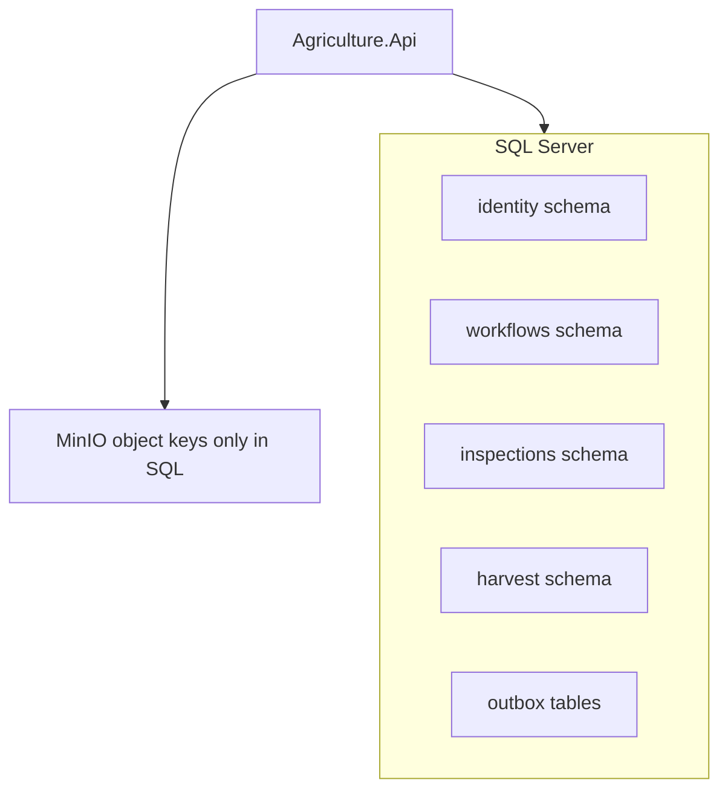

Municipal scenario: After a failed OS patch on the DB host, ops restores to the last log backup. Workflow outbox rows and aggregate state remain consistent because they share transactions. Photos remain in MinIO; metadata re-points correctly if keys survived—object storage backup is a paired concern (ADR-010).

Failure mode: Cross-module hard FKs create restore coupling and block extraction—explicitly forbidden; use identifiers and application contracts instead.

---

# ADR-006 — Entity Framework Core

| Field | Value |
|---|---|
| **Title** | Entity Framework Core as Primary Data Access Technology |
| **Status** | Accepted |
| **Date** | 2026-07-17 |
| **Deciders** | Architecture Board |
| **Related** | ADR-002; ADR-005; ADR-016; ADR-017; AGGREGATE_DESIGN |

## Context

.NET teams need a productive persistence approach that maps aggregates to relational schemas, supports migrations, change tracking for writes, no-tracking projections for CQRS queries, and repository implementations behind Domain ports. EF Core is the default modern ORM for ASP.NET Core and integrates with SQL Server.

## Problem

How should the modular monolith persist and retrieve aggregates and read models without violating Clean Architecture or module DbContext isolation?

## Options Considered

### Option A — EF Core with one DbContext per module (schema-per-module)

### Option B — Dapper (micro-ORM) everywhere

### Option C — EF Core single shared DbContext for all modules

### Option D — NHibernate

## Trade-off Analysis

Per-module DbContexts preserve extraction seams and prevent cross-schema entity graphs. Dapper excels at hand-tuned SQL but increases mapping labor and risks invariant logic in SQL. A shared DbContext recreates the distributed-monolith-in-waiting antipattern. NHibernate is capable but less aligned with current ASP.NET Core templates and hiring profiles.

## Advantages of the Chosen Option

1. Tracking for command-side aggregate updates; AsNoTracking for queries.
2. Migrations per module assembly.
3. LINQ projections for CQRS read models.
4. Interceptors for audit/soft delete (ADR-016).
5. Repository pattern implements Domain ports in Infrastructure.
6. Bulk extensions only where justified (careful with invariant bypass).

## Disadvantages of the Chosen Option

1. N+1 query risks; must train and profile.
2. Change tracker overhead if misused on large reads.
3. Bulk update libraries can skip domain events—policy required.
4. Migration merge conflicts across teams—coordination needed.

## Final Decision

**Adopt EF Core** with **one DbContext per module**, schema-per-module naming, repositories in Infrastructure, no cross-module entity navigation. Commands use tracked aggregates; queries use no-tracking projections. Prefer LINQ; isolate raw SQL. Avoid bulk APIs that bypass aggregates unless an ADR exception is granted for technical migrations.

## Consequences

Positive: productivity, alignment with ADR-002/003/005. Negative: ORM pitfalls. Long-term: upgrade EF Core versions with regression tests. Maintenance: module owners own configurations. Performance: compile queries sparingly; index alignment; split heavy reporting. DX: excellent scaffolding. Ops: migration apply strategy in CI/CD (ADR-020). Migration strategy: EF provider swap if SQL engine changes; keep configurations fluent and non-proprietary.

## Future Considerations

- Compiled models if startup time becomes an issue.
- Separate read DbContext types (same DB) to enforce no-tracking defaults.
- Outbox interceptor integration tests mandatory.

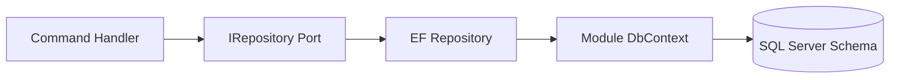

---

# ADR-007 — Hangfire

| Field | Value |
|---|---|
| **Title** | Hangfire for Background Jobs, Retries, and Scheduling |
| **Status** | Accepted |
| **Date** | 2026-07-17 |
| **Deciders** | Architecture Board |
| **Related** | EVENT_STORMING policies; ADR-001; ADR-009; ADR-011 |

## Context

EVENT_STORMING policies require asynchronous work: send notifications after task delays, generate recurring season reports, retry FCM pushes, process outbox messages, schedule inspection reminders, and perform maintenance jobs. The modular monolith needs a durable job mechanism with retries, visibility, and scheduling without building a custom scheduler.

## Problem

What technology should run background and scheduled jobs with reliable retries, dashboards, and error handling inside or beside the modular monolith host?

## Options Considered

### Option A — Hangfire with SQL Server storage

### Option B — Quartz.NET

### Option C — Azure Functions / cloud-native schedulers only

### Option D — Custom hosted services with custom retry tables

## Trade-off Analysis

Hangfire provides dashboard, retries, continuation, cron scheduling, and SQL storage aligned with ADR-005. Quartz is solid but offers less out-of-the-box dashboard UX. Cloud functions couple scheduling to a specific cloud and complicate local municipal on-prem deployments. Custom hosted services reinvent persistence and visibility poorly.

## Advantages of the Chosen Option

1. Background jobs with automatic retries and visibility.
2. Cron scheduling for reminders and report generation.
3. Dashboard for ops/municipal IT to inspect failed jobs.
4. Integrates with ASP.NET Core DI; jobs call MediatR commands.
5. Error handling via failed job queues and alerting hooks to Seq.

## Disadvantages of the Chosen Option

1. Dashboard must be secured (authorize admins only).
2. Storage schema in SQL; capacity planning needed.
3. Risk of embedding business logic in jobs instead of commands—jobs must dispatch commands/notifications.
4. Multi-instance sticky considerations; use SQL storage locking correctly.

## Final Decision

**Adopt Hangfire** with SQL Server storage for background processing and scheduling. Jobs are thin adapters that send MediatR commands or execute Infrastructure gateways (FCM, email). Secure the dashboard. Instrument failures to Serilog/Seq. Idempotent job handlers mandatory for retries.

## Consequences

Positive: durable async policies from EVENT_STORMING. Negative: another subsystem to monitor. Long-term: may extract Notifications workers (ADR-001 migration). Maintenance: package updates; dashboard auth. Performance: queue depth SLOs; avoid huge synchronous work in jobs. DX: easy local debugging with dashboard. Ops: alert on failed retries exhausted. Migration: replace with competing bus consumers later behind same ports.

## Future Considerations

- Outbox processor as Hangfire recurring job vs dedicated background service—choose one pattern and standardize.
- Poison message policy documentation.
- Horizontal scale of Hangfire servers when job volume grows.

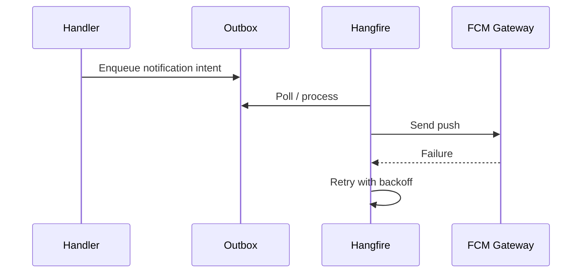

---

# ADR-008 — SignalR

| Field | Value |
|---|---|
| **Title** | SignalR for Realtime Web and Dashboard Notifications |
| **Status** | Accepted |
| **Date** | 2026-07-17 |
| **Deciders** | Architecture Board |
| **Related** | ADR-001; ADR-009; MODULE_DESIGN realtime rules |

## Context

Municipal officers need live updates on dashboards: task completions, inspection results, delayed tasks, season status changes. React web clients benefit from push over WebSockets. Mobile apps primarily use FCM for offline-capable push (ADR-009); SignalR remains valuable for connected web sessions and optionally connected mobile when foregrounded.

## Problem

How should the system deliver near-realtime updates to connected clients without polling overload?

## Options Considered

### Option A — ASP.NET Core SignalR

### Option B — Client polling every N seconds

### Option C — External realtime service (Ably/Pusher)

### Option D — gRPC streaming to browsers

## Trade-off Analysis

SignalR is native to ASP.NET Core, supports WebSockets with fallbacks, scales with Redis backplane later, and fits the modular monolith host. Polling wastes resources and adds latency. External services add cost and data residency review. gRPC streaming is poor for browsers compared to SignalR.

## Advantages of the Chosen Option

1. Realtime dashboard updates for connected officers.
2. Group connections by municipality, season, role.
3. Integrates with JWT auth for hubs.
4. Scales out via Redis backplane when multiple API instances appear (ADR-015/020).

## Disadvantages of the Chosen Option

1. Connection state management complexity.
2. Not a substitute for FCM offline push.
3. Sticky sessions or backplane required for multi-node.
4. Must authorize every subscription carefully (no leaking other producers’ data).

## Final Decision

**Adopt SignalR** for realtime updates to connected web (and optionally foreground mobile) clients. Use JWT-authenticated hubs. Publish messages from application event handlers after successful commits. Use FCM for offline mobile. Plan Redis backplane when scaling host instances horizontally.

## Consequences

Positive: responsive ops dashboards. Negative: scaling and authZ complexity. Long-term: backplane dependency when multi-instance. Maintenance: hub versioning. Performance: avoid broadcasting large payloads; send IDs + refresh hints. DX: strong ASP.NET docs. Ops: monitor connection counts. Migration: hubs can move to a Notifications service later.

## Future Considerations

- Message contracts versioning.
- Rate-limit client events.
- Prefer “invalidate query” signals over pushing full read models.

---

# ADR-009 — Firebase Cloud Messaging (FCM)

| Field | Value |
|---|---|
| **Title** | Firebase Cloud Messaging for Mobile Push Notifications |
| **Status** | Accepted |
| **Date** | 2026-07-17 |
| **Deciders** | Architecture Board |
| **Related** | ADR-007; ADR-008; EVENT_STORMING notification policies |

## Context

Producers and field inspectors use React Native apps, often offline or backgrounded on farms with intermittent connectivity. Task assignments, inspection schedules, and delay warnings must reach devices when SignalR is disconnected. FCM is the industry-standard push channel for Android and, via APNs integration, iOS.

## Problem

How should the platform deliver push notifications to mobile devices reliably, including offline devices, with retries and token lifecycle management?

## Options Considered

### Option A — Firebase Cloud Messaging

### Option B — OneSignal / vendor push abstraction only

### Option C — SMS-only notifications

### Option D — SignalR-only (no push)

## Trade-off Analysis

FCM is direct, cost-effective at municipal scale, and works with React Native. OneSignal adds a vendor layer (useful later as adapter). SMS is expensive and poor for rich deep links. SignalR-only fails offline.

## Advantages of the Chosen Option

1. Reach offline/background devices.
2. Platform retry behaviors; app handles deep links to tasks/inspections.
3. Device token registration stored on User/Producer profiles in SQL.
4. Hangfire retries for send failures and token invalidation handling.

## Disadvantages of the Chosen Option

1. Google dependency; data residency/process review may be required.
2. Token churn; must prune invalid tokens.
3. iOS APNs configuration complexity.
4. Not a guaranteed delivery queue for legal notices—critical legal communications may still need SMS/email redundancy.

## Final Decision

**Adopt FCM** as the primary mobile push channel behind an Application/Infrastructure port (`IPushNotificationSender`). Persist device tokens in Identity module. Use Hangfire for send retries. Keep email/SMS as additional channels where EVENT_STORMING policies require. SignalR remains complementary for realtime web.

## Consequences

Positive: field users reachable. Negative: vendor and privacy assessments. Long-term: port allows replacing FCM. Maintenance: certificate/token ops. Performance: batch where API allows; avoid N sends in request thread. DX: emulator testing limitations—use staging devices. Ops: monitor failure rates in Seq. Migration: swap adapter to alternative push provider without domain changes.

## Future Considerations

- Notification preference center per user.
- Quiet hours for municipal labor rules.
- Dual-channel critical alerts.

---

# ADR-010 — MinIO

| Field | Value |
|---|---|
| **Title** | MinIO as S3-Compatible Object Storage for Photos, Documents, and Binary Artifacts |
| **Status** | Accepted |
| **Date** | 2026-07-17 |
| **Deciders** | Architecture Board |
| **Related** | MODULE_DESIGN anti-goals; AGGREGATE_DESIGN ProducerPhoto/Document; ADR-005 |

## Context

Producers, tasks, inspections, and harvests attach photos and documents. MODULE_DESIGN states the system is not a document CMS; binaries attach to domain objects via object keys owned by the owning module. Storing large BLOBs in SQL Server harms backup size, restore time, and OLTP performance. Municipal deployments may be on-premises without mandatory public cloud; an S3-compatible store that runs in Docker/Kubernetes is required.

## Problem

Where should binary objects be stored, how should access be secured, and how should scalability and backup relate to SQL Server metadata?

## Options Considered

### Option A — MinIO (self-hosted S3-compatible)

### Option B — Azure Blob Storage / AWS S3 only

### Option C — SQL Server BLOBs / FileStream

### Option D — Filesystem shares on the API server

## Trade-off Analysis

MinIO provides S3 API compatibility, on-prem friendliness, and a migration path to cloud S3 later via the same SDK patterns. Cloud-only blob stores may violate on-prem municipal constraints. SQL BLOBs inflate DB backups. Local filesystem shares fail HA and multi-instance hosts.

## Advantages of the Chosen Option

1. Object storage for photos/documents with S3 API.
2. Scalability independent of SQL Server.
3. Bucket-per-environment; prefix-per-module/aggregate.
4. Presigned URLs for upload/download without streaming everything through app memory.
5. Backup/versioning strategies separate from OLTP.
6. Future migration to AWS S3/Azure Blob with adapter changes.

## Disadvantages of the Chosen Option

1. Another cluster to operate (disk, IAM-like keys, TLS).
2. Consistency is dual-write: DB metadata + object; need orphan reconciliation jobs.
3. Security misconfiguration risk (public buckets)—harden defaults.
4. Developers must never store secrets in object metadata casually.

## Final Decision

**Adopt MinIO** as the object store for photos, documents, and export artifacts. SQL Server stores object keys, content types, hashes, sizes, and ownership foreign keys within module schemas. Access via Infrastructure adapters. Hangfire jobs periodically reconcile orphans. Backups of MinIO are mandatory alongside SQL backups.

## Consequences

Positive: lean OLTP; scalable binaries. Negative: dual-system ops. Long-term: cloud S3 swap possible. Maintenance: disk growth alerts. Performance: direct/presigned transfers. DX: docker compose includes MinIO. Ops: bucket policies, encryption at rest. Migration: S3-compatible client limits lock-in.

## Future Considerations

- Virus scanning pipeline for uploads.
- Image thumbnail generation jobs.
- Legal hold/versioning for inspection evidence.

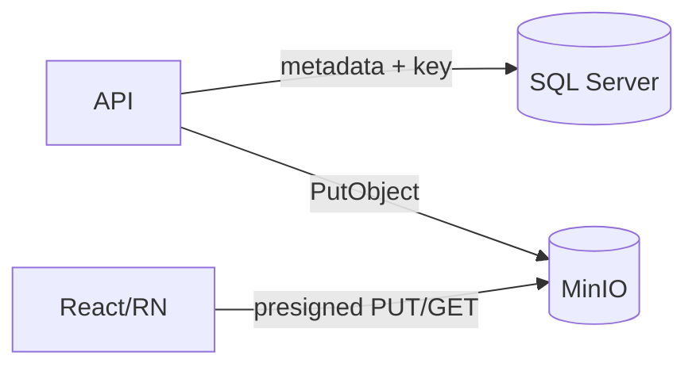

---

# ADR-011 — Serilog

| Field | Value |
|---|---|
| **Title** | Serilog for Structured Application Logging |
| **Status** | Accepted |
| **Date** | 2026-07-17 |
| **Deciders** | Architecture Board |
| **Related** | ADR-012; ADR-004; ADR-018; ADR-020 |

## Context

Municipal production systems require searchable, structured logs with correlation across HTTP requests, MediatR handlers, Hangfire jobs, and SignalR hub methods. Unstructured text logs fail incident response during season peaks. Serilog is the de facto structured logging library for .NET.

## Problem

How should the application emit production-grade structured logs with correlation identifiers and enrichment suitable for Seq and operational diagnostics?

## Options Considered

### Option A — Serilog with enrichers and sinks

### Option B — Microsoft.Extensions.Logging only without structured sinks

### Option C — NLog as primary

### Option D — OpenTelemetry logs only (no Serilog)

## Trade-off Analysis

Serilog offers message templates, enrichers (correlation ID, user id, municipality id), and sinks to Console/Seq/files. MEL alone is an abstraction; Serilog integrates as the provider. NLog is viable but Serilog dominates Clean Architecture .NET samples. OTel is complementary for traces/metrics; logs still need a structured pipeline—Serilog can coexist with OTel later.

## Advantages of the Chosen Option

1. Structured properties for Seq filtering.
2. Correlation ID enrichment across request → handler → job.
3. Production logging levels configurable per environment.
4. Consistent templates across modules.

## Disadvantages of the Chosen Option

1. PII risk if developers log payloads carelessly—policy required.
2. Sink misconfiguration can lose logs or flood disks.
3. Performance if synchronous sinks used incorrectly—prefer async sinks.

## Final Decision

**Adopt Serilog** as the structured logging implementation behind `Microsoft.Extensions.Logging` abstractions. Enrich with CorrelationId, UserId (when authenticated), Municipality/TenantId, and RequestPath. Ship to Console (containers) and Seq (ADR-012). Redact sensitive fields (passwords, tokens, national IDs) via destructuring policies.

## Consequences

Positive: diagnosability. Negative: governance of what is logged. Long-term: foundation for SIEM shipping. Maintenance: package updates. Performance: sampling for high-chat SignalR if needed. DX: excellent. Ops: retention policies. Migration: sinks replaceable.

## Future Considerations

- OpenTelemetry tracing correlation with Serilog.
- Mandatory security audit log stream separate from verbose app logs.

---

# ADR-012 — Seq

| Field | Value |
|---|---|
| **Title** | Seq as Centralized Log Search and Diagnostics Platform |
| **Status** | Accepted |
| **Date** | 2026-07-17 |
| **Deciders** | Architecture Board |
| **Related** | ADR-011; ADR-020 |

## Context

Structured logs need a queryable store with filtering, dashboards, and alerting for municipal IT. Seq integrates tightly with Serilog and is operationally light for modular monolith deployments compared to a full ELK stack for early phases.

## Problem

Where should teams search, filter, and monitor application logs in development, staging, and production?

## Options Considered

### Option A — Seq

### Option B — ELK / OpenSearch stack

### Option C — Cloud-native only (App Insights / CloudWatch)

### Option D — Flat files + grep

## Trade-off Analysis

Seq minimizes ops overhead and maximizes Serilog fidelity. ELK is powerful but heavier. Cloud-native may be mandated later and can be added as an additional sink. Flat files fail multi-instance and collaborative ops.

## Advantages of the Chosen Option

1. Fast log search and filtering by properties.
2. Monitoring signals for error spikes.
3. Correlation-id diagnostics across a season workflow failure.
4. Lightweight Docker deployment for municipal environments.

## Disadvantages of the Chosen Option

1. Licensing for higher production tiers.
2. Not a full APM; traces/metrics may need OTel + Prometheus later.
3. Retention/storage management required.

## Final Decision

**Adopt Seq** as the primary log aggregation and search platform for application diagnostics, fed by Serilog. Retain flexibility to dual-ship to cloud APM when required. Secure Seq UI behind SSO/admin access.

## Consequences

Positive: rapid MTTR. Negative: license/retention ops. Long-term: may coexist with SIEM. Maintenance: backup Seq data if needed for audit. Performance: ingestion capacity planning. DX: local Seq in compose. Ops: alerts on elevated error rates. Migration: Serilog sinks enable dual shipping.

## Future Considerations

- Alert rules for Hangfire failures and Auth anomalies.
- GDPR/KVKV retention schedules for log PII.

---

# ADR-013 — Authentication Strategy

| Field | Value |
|---|---|
| **Title** | JWT Access Tokens with Refresh Tokens, Claims, Roles, and Permission Claims |
| **Status** | Accepted |
| **Date** | 2026-07-17 |
| **Deciders** | Architecture Board |
| **Related** | AGGREGATE_DESIGN User aggregate; ADR-014; MODULE_DESIGN Identity |

## Context

The platform serves municipal admins, agriculture officers, inspectors, and producers via React web and React Native mobile clients. Identity is a first-class bounded context: registration, login, password policies, refresh token rotation, role assignment, and permission overrides live on the User aggregate (AGGREGATE_DESIGN). APIs must authenticate statelessly at scale while supporting revocation and municipal security policies. Session cookies alone are awkward for React Native; opaque server sessions complicate modular monolith horizontal scale. JWT access tokens with server-side refresh token persistence balance stateless API authorization with revocable long-lived sessions.

Municipal constraints include password hashing (never reversible), lockouts after failed attempts, audit of login history, and the ability to deactivate users immediately so they cannot obtain new access tokens—and ideally cannot use refresh tokens after revocation.

## Problem

What authentication mechanism should protect APIs and signal hubs so that:

1. Web and mobile clients authenticate uniformly.
2. Access tokens remain short-lived while UX stays acceptable via refresh.
3. Claims carry role and permission material needed for authorization (ADR-014) without oversizing tokens.
4. Refresh tokens can be revoked, rotated, and audited on the User aggregate.
5. Future external IdP (municipal SSO) can be introduced without rewriting all modules.

## Options Considered

### Option A — JWT access tokens + opaque refresh tokens stored hashed on User aggregate

### Option B — Server-side sessions only (sticky cookies)

### Option C — Mutual TLS client certificates for all users

### Option D — External IdP only from day one (Keycloak/Azure AD) with no local identity store

## Trade-off Analysis

| Criterion | JWT + Refresh | Server Sessions | mTLS for Users | External IdP Only |
|---|---|---|---|---|
| Mobile fit | Excellent | Poor–Fair | Poor UX | Excellent if IdP ready |
| Horizontal scale | Excellent | Needs shared store | Excellent | Excellent |
| Revocation | Refresh revoke + short TTL | Immediate | Cert CRL complexity | IdP dependent |
| Municipal SSO readiness | Adapter later | Harder | N/A | Strong if SSO exists |
| Implementation speed | Fast | Medium | Slow | Blocked if IdP not ready |

### Why Server Sessions Alone Were Rejected

React Native and multi-instance API hosts need shared session stores anyway; JWT access with refresh persistence already provides a controlled server-side lever without cookie domain pain across apps.

### Why mTLS for End Users Was Rejected

Appropriate for service-to-service later, not for producers on personal phones.

### Why External IdP Only Was Deferred

Many municipalities lack a ready OIDC IdP for producers. Local Identity module delivers value now; federation can be added as an alternate login path later without abandoning JWT resource-server patterns.

## Advantages of the Chosen Option

1. Stateless validation of access tokens on API and SignalR.
2. Short-lived access tokens limit replay window.
3. Refresh tokens enable revocation, rotation, and device tracking (LoginHistory/RefreshToken children).
4. Claims include subject, roles, and selected permission codes for ADR-014 policies.
5. Works uniformly for React and React Native.
6. Aligns with ASP.NET Core JWT Bearer middleware.

## Disadvantages of the Chosen Option

1. Token theft risk until expiry—mitigate with short TTL, HTTPS-only, secure storage on mobile.
2. Overlarge tokens if all permissions embedded—mitigate with role claims + permission catalog caching / critical permission claims only.
3. Clock skew issues—synchronize NTP.
4. Blacklisting access tokens is non-trivial; rely on short TTL + refresh revocation for deactivation.

## Final Decision

**Adopt JWT Bearer access tokens** (short TTL, e.g., 10–30 minutes as configured by security policy) **plus refresh tokens** persisted on the User aggregate (hashed at rest, rotatable, revocable). Issue claims for `sub`, roles, municipality/tenant, and necessary permission identifiers. Password hashing via modern algorithm (e.g., ASP.NET Identity PasswordHasher / PBKDF2 or stronger Board-approved). Deactivated users cannot login; refresh tokens revoked on deactivate/password change. Hangfire may clean expired tokens.

## Consequences

### Positive

- Uniform auth for all clients; clear Identity module ownership.
- Supports SignalR JWT auth.
- Enables permission-based authorization strategies.

### Negative

- Careful mobile secure storage required (OS keystore).
- Security testing mandatory (token leakage, fixation, rotation).

### Long-term Consequences

When municipal SSO arrives, Identity becomes a federation broker: external assertions map to local User, still issuing application JWTs for resource APIs—or APIs validate IdP tokens directly via a superseding ADR. Refresh token store remains valuable for application-level session management even with SSO.

### Maintenance Impact

Key rotation runbooks; signing key storage in secret manager; monitor failed logins in Seq for attacks.

### Performance Impact

JWT validation is CPU-light with cached signing keys. Avoid DB hit per request for access token validation; DB hits occur on refresh and on permission reload policies if not embedded.

### Developer Experience

Local bearer tokens for integration tests; test users seeded per role.

### Operational Impact

HTTPS mandatory (ADR-020). Leak response procedures include refresh token mass revocation.

### Future Migration Strategy

1. Add OIDC external login. 2. Optionally switch API to accept IdP tokens with audience checks. 3. Keep permission mapping in Identity. 4. Deprecate local passwords only when all user classes have IdP coverage.

## Future Considerations

- Step-up authentication for destructive admin actions.
- Device binding for refresh tokens.
- MFA for municipal officers.

### Enterprise Best Practices

- Least privilege claims; short-lived access; rotatable refresh; secure password storage; audit login events; separate authentication from authorization policies.

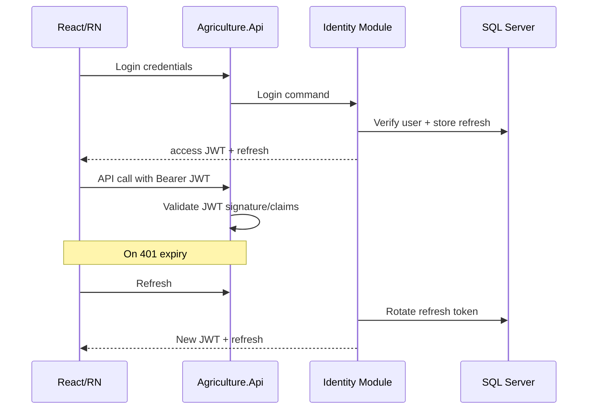

Municipal scenario: An inspector’s phone is lost. Ops revokes all refresh tokens for that user; access tokens expire within minutes; FCM token also removed. Dashboards stop accepting SignalR connections on next reconnect without valid JWT.

Failure mode: Putting mutable authorization decisions solely inside long-lived JWTs without refresh rotation causes stale permissions—mitigated by short TTL and role-change-triggered refresh revocation.

---

# ADR-014 — Authorization Strategy

| Field | Value |
|---|---|
| **Title** | RBAC + Permission-Based Policies with Resource-Based Checks |
| **Status** | Accepted |
| **Date** | 2026-07-17 |
| **Deciders** | Architecture Board |
| **Related** | ADR-013; MODULE_DESIGN Security; PRD roles |

## Context

Roles alone (“Officer,” “Producer,” “Inspector,” “Admin”) are insufficient for municipal nuance: an officer may view all seasons in a municipality but only edit tasks in assigned regions; a producer may see only own lands/tasks; inspectors may complete inspections but not approve harvest exceptions. MODULE_DESIGN and PRD require a permission matrix. Authorization must operate at endpoint policy level and at resource level inside handlers when the resource owner matters.

## Problem

How should authorization be modeled so that role assignment remains usable for admins while fine-grained permissions and resource ownership enforce least privilege?

## Options Considered

### Option A — RBAC + permission claims/policies + resource-based handlers

Roles group permissions; ASP.NET policies check permissions; handlers enforce resource ownership (e.g., ProducerId == token producer).

### Option B — RBAC only (role checks in controllers)

### Option C — ABAC fully dynamic rules engine from day one

### Option D — Hard-coded if-role checks scattered in UI and API

## Trade-off Analysis

Permission-based policies scale as features grow; pure RBAC becomes role explosion. Full ABAC engines are powerful but heavy for MVP. Scattered hard-coding diverges web vs mobile and is untestable.

## Advantages of the Chosen Option

1. Roles for administration UX; permissions for enforcement.
2. Policy-based ASP.NET authorization integrates with MediatR behavior.
3. Resource-based checks protect producer data isolation.
4. Permission overrides on User aggregate supported.
5. Auditable permission matrix read model (EVENT_STORMING).

## Disadvantages of the Chosen Option

1. Permission catalog must be curated—governance required.
2. Risk of missing resource checks on new queries—checklists and tests.
3. Caching permission definitions needs invalidation strategy (ADR-015).

## Final Decision

**Adopt hybrid authorization**: RBAC for assigning bundles of permissions; **permission-based** ASP.NET policies for endpoint/handler access; **resource-based** checks inside application handlers/domain services for ownership and municipality tenancy. Deny by default. UI may hide actions but never replaces server checks.

## Consequences

Positive: least privilege; aligns Identity module. Negative: more tests. Long-term: foundation for multi-tenant isolation. Maintenance: permission registry versioning. Performance: policy handlers should be O(1) claim checks; resource checks use indexed FK lookups. DX: `[Authorize(Policy=\"...\")]` + behavior. Ops: audit denied attempts. Migration: ABAC engine can wrap policies later if regulations demand.

## Future Considerations

- Data classification labels on documents.
- Temporary elevated grants with expiry.
- Cross-municipality admin break-glass with full audit.

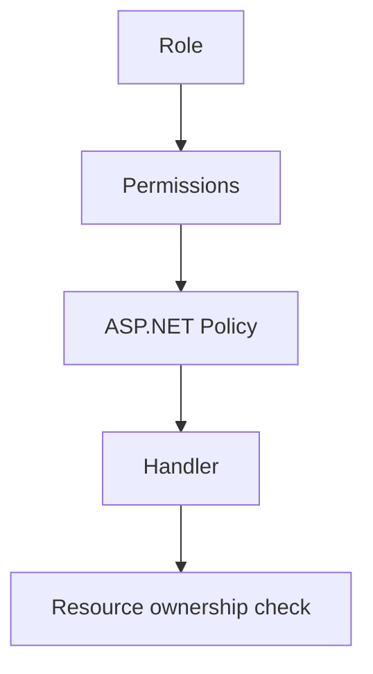

---

# ADR-015 — Caching Strategy

| Field | Value |
|---|---|
| **Title** | Memory Cache Now; Distributed Redis Later for Read Models and Shared State |
| **Status** | Accepted |
| **Date** | 2026-07-17 |
| **Deciders** | Architecture Board |
| **Related** | ADR-003; ADR-008; ADR-001 scaling |

## Context

CQRS read models, permission catalogs, and reference data are read-often. Premature Redis adds ops cost. Single-node memory cache is acceptable initially; multi-instance hosts and SignalR backplanes will need distributed cache.

## Problem

What caching approach should be used now, and what is the approved evolution path?

## Options Considered

### Option A — `IMemoryCache` / hybrid cache for hot read models now; Redis later

### Option B — Redis mandatory from day one

### Option C — No caching until pain is proven, with no plan

### Option D — Cache aggregates in memory for writes

## Trade-off Analysis

Planning without premature infra is key. Redis day one is justified when multi-node is certain; otherwise wait. No plan causes panic caching. Caching aggregates for writes risks invariant violations and stale concurrency tokens—forbidden.

## Advantages of the Chosen Option

1. Immediate wins for permission catalogs and reference data.
2. Clear path to Redis for distributed scenarios and SignalR backplane.
3. Protects write model integrity by caching read models only.

## Disadvantages of the Chosen Option

1. Memory cache not coherent across instances—sticky or accept staleness until Redis.
2. Invalidation complexity on permission changes.
3. Risk of caching PII improperly—policies required.

## Final Decision

**Use in-process memory caching** for selected CQRS read models and reference/permission data in early deployments. **Do not cache aggregates for command decisions.** Introduce **Redis** when (a) API scales to multiple instances, (b) SignalR backplane is required, or (c) measured DB load on hot queries demands distributed cache. Document invalidation on command success for cached keys.

## Consequences

Positive: pragmatic performance. Negative: invalidation bugs. Long-term: Redis as platform service. Maintenance: cache key naming conventions `{module}:{name}:{id}`. Performance: reduce SQL for dashboards. DX: simple APIs. Ops: Redis HA when introduced. Migration: abstract `ICacheService` port now.

## Future Considerations

- Cache-aside vs read-through standards.
- Per-tenant cache key isolation.
- CDN for public static assets unrelated to API cache.

---

# ADR-016 — Database Strategy

| Field | Value |
|---|---|
| **Title** | Soft Delete, Audit Columns, Optimistic Concurrency, Indexes, Foreign Keys, and Partitioning Strategy |
| **Status** | Accepted |
| **Date** | 2026-07-17 |
| **Deciders** | Architecture Board |
| **Related** | ADR-005; ADR-006; AGGREGATE_DESIGN immutability; MODULE_DESIGN |

## Context

Municipal agriculture workflows require strong auditability: who changed a workflow step, when an inspection failed, when a harvest quantity was recorded. Soft delete is preferred for many master data entities (Producer, Land) so historical seasons remain intelligible, while some records become immutable after completion (completed inspections, archived seasons) per AGGREGATE_DESIGN. Concurrent field updates (two officers completing related tasks) require optimistic concurrency rather than pessimistic locks that harm mobile UX. Schema-per-module forbids cross-module foreign keys. As data grows across seasons, partitioning and archival become inevitable.

## Problem

What cross-cutting database design rules should all modules follow for deletion semantics, auditing, concurrency, referential integrity, indexing, and long-term growth?

## Options Considered

### Option A — Soft delete + audit columns + rowversion concurrency + in-module FKs + planned partitioning

### Option B — Hard delete everywhere with audit tables only

### Option C — Pessimistic locking for all writes

### Option D — No cross-cutting standards (each module invents its own)

## Trade-off Analysis

Hard delete complicates reconstructing season history and accidental deletion recovery. Soft delete everywhere without immutability rules creates “zombie” editable records—hence soft delete plus business immutability. Pessimistic locking fights mobile offline/online patterns. No standards guarantee chaos at integration points.

## Advantages of the Chosen Option

1. Soft delete preserves historical references for producers/lands/tasks where required.
2. Audit columns (`CreatedAt/By`, `ModifiedAt/By`) plus optional audit tables for sensitive aggregates.
3. Optimistic concurrency (`RowVersion`) prevents silent overwrites on Task/Inspection/Harvest.
4. Indexes aligned to CQRS query patterns.
5. Foreign keys **within** module schemas enforce local integrity.
6. Partitioning/archival plan by season year prevents unbounded OLTP growth.

## Disadvantages of the Chosen Option

1. Soft delete requires global query filters in EF—and careful IgnoreQueryFilters for admin recovery.
2. Unique indexes must account for soft-deleted rows (filtered unique indexes).
3. Optimistic concurrency forces clients to reload and retry—UX must handle 409 Conflict.
4. Partitioning is operationally non-trivial when finally applied.

## Final Decision

**Standardize database strategy as follows:**

1. **Soft delete** via `IsDeleted` / `DeletedAt` for master and operational entities unless Aggregate Design mandates hard delete or physical purge for privacy.
2. **Immutability** after specific state transitions (archived season, completed inspection evidence) enforced in domain, not only DB.
3. **Audit columns** on all persistent entities; **audit trail tables** for high-sensitivity changes (permissions, harvest quantities, delivery quantities).
4. **Optimistic concurrency** using SQL `rowversion` mapped in EF for contested aggregates.
5. **Foreign keys** only within a module schema; cross-module references store identifiers without FK.
6. **Indexes** reviewed in PR for every new query path; cover status/assignee/date filters.
7. **Partitioning** planned for large tables by season/year when row counts cross Board-defined thresholds; until then, archival jobs may move cold seasons to archive tables/schemas.

## Consequences

### Positive

- Aligns with municipal audit expectations and AGGREGATE_DESIGN.
- Reduces lost-update bugs in field operations.
- Keeps module extraction possible (no cross-schema FKs).

### Negative

- Query filter complexity; reporting must understand soft delete.
- Conflict handling required in APIs (Problem Details 409).

### Long-term Consequences

After several production years, season-based partitioning and archive tiers will dominate DBA work. Audit data may need separate retention policies under personal data regulations. Soft-deleted PII may still require hard purge workflows with legal approval—introduce a “Right to Erasure” procedure ADR when needed.

### Maintenance Impact

EF global filters standardized in BuildingBlocks; module configurations opt in. Index fragmentation maintenance scheduled. Migration reviews check filtered unique indexes for emails/usernames.

### Performance Impact

Soft delete filters add predicates—indexes must include `IsDeleted`. Audit tables grow; archive or partition them. Optimistic concurrency reduces lock waits vs pessimistic strategies.

### Developer Experience

Templates for entities include audit + concurrency + soft delete properties. Integration tests cover conflict paths.

### Operational Impact

Backup size includes soft-deleted rows until purge. Monitoring for table growth per season. Restore tests validate filtered indexes.

### Future Migration Strategy

If moving engines (ADR-005), re-implement rowversion as PostgreSQL `xmin`/explicit concurrency tokens. Soft delete and audit columns are portable. Partitioning syntax differs—keep partitioning as ops scripts in Infrastructure/DB projects, not Domain.

## Future Considerations

- Temporal tables for selected aggregates.
- Asynchronous audit shipping to immutable store.
- Automated season archival Hangfire jobs.

### Enterprise Best Practices

- Consistency of cross-cutting data patterns; explicit concurrency; referential integrity within boundaries; capacity planning before crisis; privacy-aware deletion.

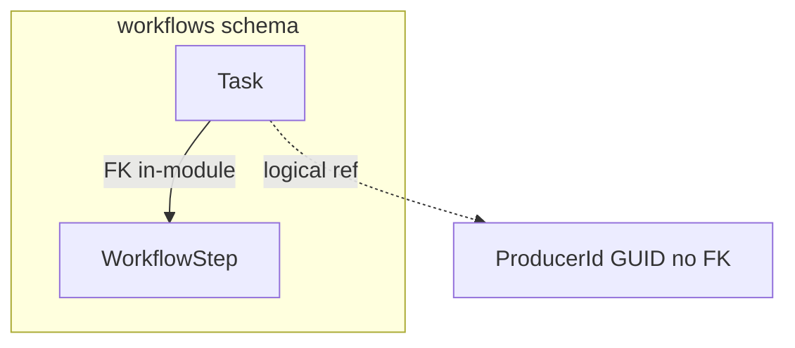

Municipal scenario: Two inspectors attempt to update the same inspection findings offline and sync. Second writer receives concurrency conflict, reloads, merges non-conflicting fields under domain rules, or escalates—data is not silently clobbered.

Failure mode: Unique email index without filter allows one soft-deleted user to block re-registration—filtered unique index required.

---

# ADR-017 — Module Communication

| Field | Value |
|---|---|
| **Title** | Application-Layer Contracts, Domain/Integration Events, Shared Kernel Discipline, No Cross-Module DbContext Access |
| **Status** | Accepted |
| **Date** | 2026-07-17 |
| **Deciders** | Architecture Board |
| **Related** | MODULE_DESIGN dependency rules; ADR-001; ADR-002; ADR-003; EVENT_STORMING |

## Context

The modular monolith’s value collapses if modules share DbContexts, reference each other’s Infrastructure, or mutate foreign aggregates directly. MODULE_DESIGN defines dependency directions and public contracts. EVENT_STORMING shows policies that react across contexts (TaskCompleted → maybe InspectionCreated → NotificationScheduled). Communication patterns must preserve aggregate boundaries (AGGREGATE_DESIGN) while enabling workflows.

## Problem

How may modules collaborate in-process without creating a distributed monolith’s coupling inside a single process?

## Options Considered

### Option A — Public application contracts + domain events + integration events + Shared Kernel limited types; repositories only inside owning module

### Option B — Shared database tables and cross-module EF navigations

### Option C — In-process event bus only (no synchronous contracts)

### Option D — Synchronous MediatR requests across any module freely without published contracts

## Trade-off Analysis

Option A matches MODULE_DESIGN: synchronous contract calls for queries needing immediate consistency within a use case orchestration, events for side effects and decoupling. Shared tables destroy extraction and ownership. Events-only makes simple “resolve producer display name” awkward and eventually consistent everywhere. Free MediatR across modules without contracts recreates spaghetti with invisible dependencies.

## Advantages of the Chosen Option

1. Clear ownership of aggregates and persistence.
2. Domain events for in-module reactions; integration events for cross-module policies via outbox.
3. Application-layer facades/contracts for allowed synchronous queries/commands between modules.
4. Shared Kernel only for truly shared primitives (IDs, Result types, base entity)—not entities/DTOs dump.
5. No cross DbContext joins—enforced by project references and architecture tests.
6. Extraction path: replace in-proc contract with HTTP/gRPC adapter without rewriting Domain.

## Disadvantages of the Chosen Option

1. More ceremony than “just join the tables.”
2. Risk of chatty contract calls—design coarser APIs.
3. Eventual consistency for integration-event policies must be understood by product owners.
4. Shared Kernel expansion pressure—Board gatekeeping required.

## Final Decision

**Modules communicate via:**

1. **Published application contracts** (interfaces in Contracts projects) for approved synchronous interactions.
2. **Domain events** raised by aggregates, handled in-process after successful persistence (same module reactions).
3. **Integration events** via outbox for cross-module and future cross-service policies.
4. **Shared Kernel** limited to cross-cutting primitives explicitly listed in MODULE_DESIGN.
5. **Repositories** accessed only by owning module’s Application/Infrastructure.
6. **Forbidden:** cross-module DbContext usage, cross-schema FKs, referencing another module’s Infrastructure, mutating another module’s entities.

Orchestration of multi-module workflows occurs in the Application layer of the owning process host use case (or a dedicated process manager module if introduced), calling contracts and relying on events for decoupled side effects—not via SQL transactions spanning other modules’ tables (save own aggregates; outbox for others).

## Consequences

### Positive

- Protects ADR-001 extraction strategy.
- Aligns EVENT_STORMING policies with technical mechanisms.
- Forces ubiquitous language translation at boundaries.

### Negative

- Developers tempted to “just this once” join—must fail CI.
- Debugging event chains requires correlation IDs (ADR-011).

### Long-term Consequences

As extraction proceeds, integration events become the lingua franca; synchronous contracts become remote. Teams that cheated with shared tables will be blocked—this ADR prevents that debt.

### Maintenance Impact

Contract versioning rules; consumer-driven tests for events. Module owners publish changelogs for Contracts.

### Performance Impact

In-proc calls are cheap; still avoid N+1 contract chatty loops—use batch contract methods. Outbox processing lag monitored.

### Developer Experience

Clear rules; architecture tests as guardrails; onboarding diagrams from MODULE_DESIGN.

### Operational Impact

Outbox lag alerts; poison integration events handled like Hangfire failures.

### Future Migration Strategy

For each extracted module: (1) keep Contracts package; (2) implement remote adapter; (3) switch DI registration; (4) dual-run; (5) remove in-proc implementation. Shared Kernel may split into NuGet packages published internally.

## Future Considerations

- Formal process manager for long-running season lifecycle if orchestration complexity grows.
- Schema of integration events in a registry.
- Idempotency keys on all cross-module commands.

### Enterprise Best Practices

- Bounded context mapping (customer/supplier, ACL); publish-language; avoid shared database integration style; design for replacement of in-proc with remote.

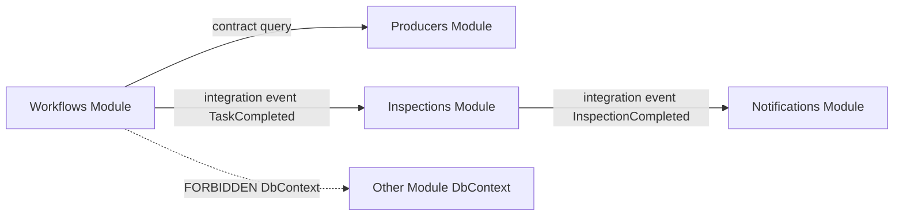

Municipal scenario: Task completion in Workflows raises `TaskCompleted`. Inspections policy may create an inspection via its own command handler consuming the integration event—not by Workflows inserting into Inspections tables. Notifications sends FCM without Workflows referencing FCM SDK.

Failure mode: Circular synchronous contracts between modules cause deadlocks in design—dependency graph in MODULE_DESIGN must remain acyclic for synchronous calls; use events to break cycles.

---

# ADR-018 — Exception Handling

| Field | Value |
|---|---|
| **Title** | Global Exception Middleware with Problem Details and Typed Application Exceptions |
| **Status** | Accepted |
| **Date** | 2026-07-17 |
| **Deciders** | Architecture Board |
| **Related** | ADR-004; ADR-011; ADR-019 |

## Context

Clients need consistent error contracts. Domain rule breaches differ from validation failures and infrastructure outages. Unhandled exceptions must not leak stacks to production clients. RFC 7807 Problem Details is the ASP.NET Core standard for HTTP error payloads.

## Problem

How should exceptions be categorized, translated to HTTP responses, logged, and kept consistent across modules?

## Options Considered

### Option A — Global middleware + Problem Details + typed exceptions (business, validation, concurrency, infrastructure)

### Option B — Return codes only (no exceptions) everywhere

### Option C — Ad-hoc try/catch in each controller

### Option D — Exceptions for control flow including expected validation

## Trade-off Analysis

Typed exceptions mapped centrally give consistency. Pure result codes are valid (especially in Domain) but HTTP layer still needs mapping—many teams use Result in Application and exceptions for unexpected faults; Board allows Result pattern in handlers with middleware for unhandled. Ad-hoc catches diverge. Using exceptions for routine validation is costly—FluentValidation should prevent handler entry (ADR-019).

## Advantages of the Chosen Option

1. Single middleware maps to Problem Details.
2. Business exceptions → 409/422; validation → 400; unauthorized → 401/403; concurrency → 409; infrastructure → 503/500 with correlation ID.
3. Serilog captures exception details with correlation ID; clients receive safe messages.
4. Aligns with MediatR pipeline throwing after failed validation or domain checks.

## Disadvantages of the Chosen Option

1. Taxonomy must be documented and used consistently.
2. Over-catching in handlers can swallow bugs.
3. Mapping tables need maintenance as new exception types appear.

## Final Decision

**Adopt global exception handling middleware** producing **Problem Details**. Classify:

- **Validation exceptions** (FluentValidation) → 400
- **Business rule exceptions** → 422 or 409 as appropriate
- **Concurrency exceptions** → 409
- **Authentication/authorization** → 401/403
- **Infrastructure exceptions** → 503/500, log full detail, client gets generic message + correlation ID

Prefer `Result`/`Error` patterns inside Domain/Application for expected rule failures where teams agree; middleware remains the last-resort translator. Never return raw EF exceptions to clients.

## Consequences

Positive: consistent API; safer production. Negative: discipline required. Long-term: stable client contracts. Maintenance: exception catalog. Performance: negligible. DX: clearer client error handling. Ops: correlate client-reported IDs in Seq. Migration: Problem Details remains even if host changes.

## Future Considerations

- Localization of problem titles for municipal language requirements.
- Security review of error messages to prevent enumeration.

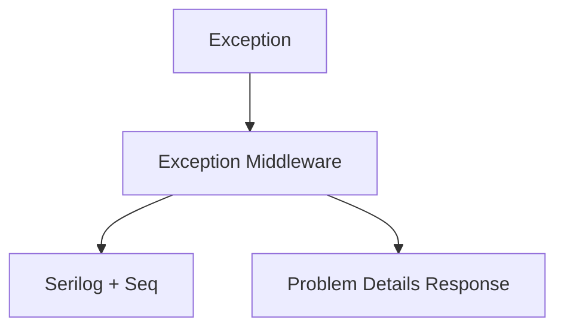

---

# ADR-019 — Validation Strategy

| Field | Value |
|---|---|
| **Title** | FluentValidation in MediatR Pipeline plus Domain Invariants and Business Rules |
| **Status** | Accepted |
| **Date** | 2026-07-17 |
| **Deciders** | Architecture Board |
| **Related** | ADR-004; ADR-002; AGGREGATE_DESIGN |

## Context

Input validation (required fields, formats, ranges) differs from domain invariants (cannot complete harvest before workflow completion). Both are required. FluentValidation integrates with MediatR behaviors; aggregates enforce invariants defensively regardless of caller.

## Problem

Where should validation live so that APIs fail fast on bad input while domain integrity cannot be bypassed by internal callers?

## Options Considered

### Option A — FluentValidation for input + domain invariant methods/guards + application business rule checks

### Option B — DataAnnotations only on DTOs

### Option C — Validation only in UI

### Option D — All rules only in database constraints

## Trade-off Analysis

FluentValidation is expressive and testable. DataAnnotations are limited for complex cross-field rules. UI-only fails API security. DB constraints are a last line, not the business rule home.

## Advantages of the Chosen Option

1. Pipeline behavior runs validators before handlers.
2. Domain remains source of truth for invariants.
3. Clear separation: format/input vs business invariants.
4. Consistent error shaping via ADR-018.

## Disadvantages of the Chosen Option

1. Possible duplication between validators and domain—accept thin duplication for clarity; domain always wins.
2. Developers may put domain rules only in FluentValidation—review rejects this for invariants in AGGREGATE_DESIGN.

## Final Decision

**Adopt FluentValidation** for command/query input validation in MediatR pipeline. **Enforce domain invariants** inside aggregates and domain services. Use application-layer business rules for multi-aggregate checks via contracts. Database constraints (NOT NULL, FK, unique) remain safety nets, not the primary rule engine.

## Consequences

Positive: fail-fast UX; protected invariants. Negative: layered rules need documentation. Long-term: stable against UI changes. Maintenance: validators co-located with commands. Performance: cheap vs DB. DX: strong. Ops: fewer corrupt states. Migration: validators stay with Application layer during extraction.

## Future Considerations

- Code analyzers ensuring every command has a validator.
- Shared validators for Email/Phone value objects.

---

# ADR-020 — Deployment Strategy

| Field | Value |
|---|---|
| **Title** | Dockerized Deployment with Reverse Proxy, HTTPS, Environment Configuration, CI/CD, Health Checks, and Monitoring |
| **Status** | Accepted |
| **Date** | 2026-07-17 |
| **Deciders** | Architecture Board |
| **Related** | ADR-001; ADR-005; ADR-007; ADR-010; ADR-011; ADR-012 |

## Context

The modular monolith must deploy reliably to municipal on-prem or government cloud environments. Stakeholders expect HTTPS, secret management via environment variables or secret stores, automated CI/CD, health probes for orchestration, and monitoring via Seq plus infrastructure metrics. Docker provides environmental parity from developer laptops to servers. A reverse proxy (nginx, Traefik, or cloud load balancer) terminates TLS and routes to the API and static React hosting. React Native apps distribute via stores; their backend is the same API.

## Problem

What deployment and runtime operations strategy should be standard so that environments are reproducible, secrets are not baked into images, health is observable, and releases are auditable?

## Options Considered

### Option A — Docker Compose / Kubernetes-ready containers + reverse proxy + CI/CD pipelines + health checks + Serilog/Seq monitoring

### Option B — IIS-only manual deployments on Windows Server without containers

### Option C — Full Kubernetes with service mesh from day one

### Option D — Serverless container consumption only (no on-prem story)

## Trade-off Analysis

Containers travel from laptop to on-prem to cloud. IIS-only is familiar to some municipal IT but harms parity and Linux hosting options. Service mesh day one exceeds needs of a modular monolith. Serverless-only excludes on-prem mandates. Therefore containers with optional orchestrator, starting with Compose or simple Swarm/K8s later, is the balanced path.

## Advantages of the Chosen Option

1. Docker images for API, and optional containers for SQL (dev), MinIO, Seq, Hangfire dashboard access patterns.
2. Reverse proxy for HTTPS termination and header forwarding.
3. Environment variables / secret mounts for connection strings, JWT signing keys, FCM credentials, MinIO keys.
4. CI/CD builds, tests, migration apply policies, and pushes artifacts.
5. ASP.NET health checks for DB, MinIO, and self.
6. Monitoring via Seq + container metrics; optional Prometheus later.
7. Parity across environments reduces “works on my machine.”

## Disadvantages of the Chosen Option

1. Municipal IT must learn container ops if new to Docker.
2. Persistent volume management for MinIO and Seq.
3. Migration risk on release—needs gated apply.
4. Multi-instance requires sticky sessions or SignalR backplane (ADR-008/015).

## Final Decision

**Deploy the Agriculture.Api modular monolith as a Docker image** behind a **TLS-terminating reverse proxy**. Configure via **environment variables** and mounted secrets—never commit secrets. Run **CI/CD** (build, test, architecture tests, container scan, publish). Apply EF migrations as an explicit release step with backup preceding production apply. Expose **/health** and **/health/ready** checks. Ship logs to **Seq**; monitor Hangfire failures and health endpoints. Frontends: React static assets via CDN/proxy; React Native via store releases pointing to environment API URLs. Scale-out requires Board-approved Redis backplane before multiple sticky-less nodes.

## Consequences

### Positive

- Reproducible environments; clearer ops runbooks; aligns with ADR-001 single deployable.
- Security baseline: HTTPS, secrets hygiene, health probes.

### Negative

- Initial pipeline investment; container registry required.
- Need backup drills for SQL + MinIO together.

### Long-term Consequences

As municipalities multiply, deployment may move to Kubernetes with Helm charts; ADR remains valid with richer orchestration. Extracted services (future) reuse the same CI patterns. Blue/green or canary deployments become feasible once health checks and metrics mature.

### Maintenance Impact

Base image patching cadence; dependency updates in CI; certificate renewal automation on reverse proxy.

### Performance Impact

Container resource limits prevent noisy neighbor issues on shared hosts; horizontal scale planned with cache/backplane. Avoid running Seq and OLTP SQL on the same contended disk without planning.

### Developer Experience

`docker compose up` for dependencies; local API can run in IDE against compose SQL/MinIO/Seq. Feature environments ephemeral if registry allows.

### Operational Impact

Runbooks: deploy, rollback (previous image + DB forward-only migration caution), certificate rotation, secret rotation, Hangfire queue drain, Seq disk full. RPO/RTO documented with SQL and MinIO backup pairs.

### Future Migration Strategy

- Compose → Kubernetes when instance count and HA requirements grow.
- Add CDN for web assets.
- Introduce canary by header routing at reverse proxy.
- When modules extract, reuse pipelines per service; API gateway may appear—superseding deployment ADR sections as needed.

## Future Considerations

- Automated chaos tests for dependency failure (SQL down, MinIO down).
- Policy-as-code for container security contexts.
- Central secret manager (Vault/Azure Key Vault) integration.
- OpenTelemetry collectors alongside Seq.

### Enterprise Best Practices

- Twelve-factor config; immutable artifacts; separate build and release; health/readiness; observability triad path (logs now, metrics/traces next); backup/restore as features; least privilege runtime identities.

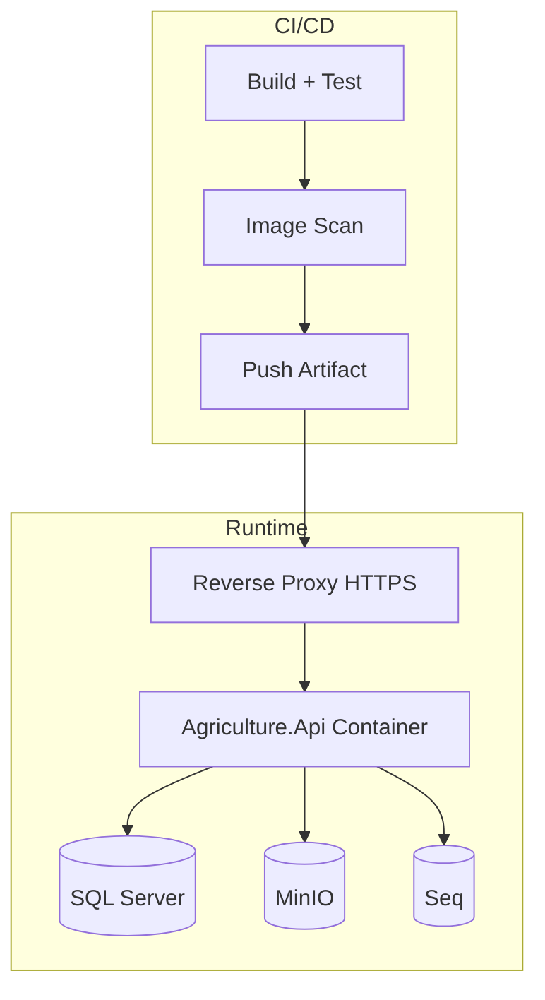

Municipal scenario: Nightly release pipeline builds, runs integration tests against compose, publishes image `agriculture-api:1.4.2`, ops takes SQL backup, applies migrations, rolling-updates container, verifies `/health/ready`, watches Seq for error spikes, and Hangfire for failed retries after deploy.

Failure mode: Applying breaking migrations without backup and without expand/contract pattern causes lengthy outage—release checklist mandates expand/contract for breaking schema changes.

---

---

# Supplemental Deep Dives (Normative Clarifications for ADR-001, 003, 005, 013–017, 020)

The following sections are **normative clarifications** of Accepted ADRs. They do not introduce new ADR numbers; they deepen operational, migration, and failure-mode guidance required for enterprise execution. If conflict arises with an earlier subsection, Architecture Board errata prevail; until then, both apply.

## ADR-001 Clarifications — Team Topology, Scaling, and Extraction Gates

### Team Size and Conway Alignment

Municipal digital transformation organizations commonly staff one product owner, one tech lead/architect, two to six engineers, and a shared DBA/ops function. Under Conway’s law, a microservices topology would invent organizational boundaries the municipality does not have: separate on-call rotations per service, separate release trains, and separate backlog ownership. The modular monolith allows **module ownership** (Identity, Workflows, Inspections, Harvest/Delivery, Notifications) as a soft Conway mapping—code ownership without process isolation tax. When headcount grows past approximately two durable feature teams with independent roadmaps, the Board should re-evaluate extraction readiness for the modules those teams own, not for the entire system at once.

### Scaling Model

Vertical scaling of the API host and SQL Server covers early municipalities. Horizontal scaling of the API is permitted only after: (1) sticky sessions or SignalR Redis backplane, (2) Hangfire SQL storage verified under multi-server, (3) memory cache coherency strategy (ADR-015), (4) load-tested JWT validation and DbContext pooling. Data scaling prefers read replicas and CQRS read optimization before sharding. Sharding by municipality is a last resort requiring a superseding ADR.

### Operational and Deployment Complexity Budget

Accepted complexity for near-term production includes: one API deployment unit, one SQL Server (HA pair optional), one MinIO cluster, one Seq instance, reverse proxy, and CI/CD. Rejected near-term complexity includes: service mesh, per-module Kubernetes deployments, multi-broker event fabrics, and mandatory API gateway product for internal module calls. Complexity may increase only when an Accepted ADR or superseding ADR authorizes it.

### Extraction Gate Checklist (must all pass)

1. Module has zero reverse dependencies violating MODULE_DESIGN graph.
2. Schema contains no cross-module FKs (ADR-016/017).
3. Integration events cover all cross-module policies with consumer tests.
4. Outbox/inbox idempotency proven under kill-9 and duplicate delivery tests.
5. Independent CI package builds and versioning exist.
6. Observability dashboards exist for the module’s golden signals.
7. On-call runbook and SLO draft approved by ops.
8. Dual-run period completed with parity metrics.

Until these gates pass, “we will extract next sprint” is non-compliant with ADR-001.

### Long-term Maintenance of Modularity

Architecture fitness functions run in CI: illegal project references fail the build. Quarterly Architecture Board reviews sample PRs for boundary erosion. Shared Kernel PRs require two module-owner approvals. Technical debt items that couple modules are prioritized above feature work when they block extraction gates for a module already under scale pressure.

---

## ADR-003 Clarifications — Command/Query Performance and Complexity Controls

### Command Path Standards

Commands load the minimum aggregate graph required to enforce invariants, invoke domain methods, collect domain events, and persist through the module unit of work. Commands do not return large read models; they return identifiers, versions (for concurrency), and minimal acknowledgment DTOs. This prevents accidental write-model leakage into UI caches.

### Query Path Standards

Queries never call aggregate methods that mutate state. Queries use `AsNoTracking` projections. For “Today’s Tasks,” project directly to DTO shapes with server-side filtering by assignee, municipality, and date. For Season Timeline, prefer a dedicated read model updated after workflow events when join cost exceeds budgets. Permission Matrix queries read from Identity read models, not by scanning all users repeatedly without indexes.

### Complexity Governor

CQRS complexity is authorized because dashboards and writes differ. The following are **not** authorized without Board approval: per-entity event sourcing, separate physical read database on day one, or dual-write to MongoDB for every aggregate. Teams inventing parallel read stores must file ADR-015/003 supersession proposals with measured p95 query times and cost estimates.

### Failure Modes

- **Stale denormalized read model:** show last-updated timestamp; provide “refresh from write model” admin tool for support.
- **Over-fetching in queries:** detected via EF logging in non-prod; fail review if Include graphs appear in query handlers without justification.
- **Command doing queries for UI convenience:** rejected in code review citing this ADR.

### Municipal Peak Scenario

At harvest season close, officers run concurrent harvest completion commands while dashboards refresh delivery progress. CQRS ensures completion transactions remain short while dashboards hit projected read models or no-tracking queries, reducing lock duration on write rows.

---

## ADR-005 Clarifications — Indexes, Transactions, Backup, and Migration Posture

### Index Governance

Every new list/detail query in PRD journeys must cite supporting indexes in the module’s migration review notes. Mandatory candidates include: Task(AssigneeUserId, Status, DueDate) filtered where not deleted; Inspection(Status, ScheduledDate); Season(MunicipalityId, Year); Harvest(SeasonId); Delivery(HarvestId); User(Email) filtered unique; RefreshToken(UserId, ExpiresAt). Unused indexes are removed deliberately after DMV review—not left forever.

### Transaction Policy

Transactions are short and server-side. Interactive user think-time never holds a transaction. Cross-module consistency uses outbox, not MSDTC or EF multi-context ambient transactions spanning modules. SaveChanges failures roll back aggregate + outbox atomically.

### Backup and Restore

Production requires tested backup: full + log backups meeting SRS RPO. Restore drills quarterly restore to isolated environment and verify: login, open season workflow, MinIO object fetch for a known inspection photo key, and Hangfire storage integrity. MinIO backup is paired; restoring SQL without objects yields broken evidence links—runbooks must sequence both.

### Future Migration to PostgreSQL (Detailed)

Phase 0: ban proprietary T-SQL in modules. Phase 1: add PostgreSQL to CI matrix for Infrastructure tests. Phase 2: convert migrations or regenerate for Npgsql; replace rowversion strategy. Phase 3: performance test task dashboards. Phase 4: staging cutover rehearsal. Phase 5: production maintenance window with fallback snapshot. Licensing savings must exceed migration labor and risk—Board decision.

---

## ADR-013 Clarifications — Claims Design and Token Lifecycle

### Claims Catalog (Initial)

Access tokens carry: `sub` (user id), `unique_name`/`email`, `role` (one or more), `municipality_id` / `tenant_id`, selected `perm` claims for hot-path permissions, `amr` if MFA added later. Oversized permission sets use role + server-side permission resolution cached per ADR-015 rather than embedding hundreds of claims.

### Refresh Rotation

Each refresh presents a single-use token; server rotates to a new token and invalidates the old. Reuse of an already-rotated token triggers family revocation (theft detection). Password change, role change, and explicit logout revoke refresh families.

### Production Logging

Auth failures log reason codes without raw passwords. Successful logins write LoginHistory. Anomalous geo/device changes may later trigger step-up—future ADR.

---

## ADR-014 Clarifications — Policy Catalog and Resource Rules

### Policy Naming

Policies named `Perm.<Module>.<Action>` e.g., `Perm.Tasks.Complete`, `Perm.Inspections.Create`, `Perm.Harvest.Record`. Roles map to permission sets in Identity. Resource rules examples: Producer may complete only tasks assigned to self; Officer may view all tasks in municipality; Inspector may update inspections assigned to self; Admin bypasses resource ownership but still audited.

### Testing

Every new endpoint lists required policy and resource rule in PR checklist. Integration tests include forbidden-role and wrong-owner cases.

---

## ADR-015 Clarifications — Cache Invalidation and Redis Introduction Criteria

Cache keys include municipality/tenant segment. Invalidation on permission grant/revoke is synchronous within Identity command handler. Redis introduction criteria: two or more API replicas in production, or SignalR scale-out, or measured cache hit potential saving >20% DB CPU on hot queries. Until then, single-node memory cache is compliant.

---

## ADR-016 Clarifications — Soft Delete vs Immutability vs Purge

Soft delete ≠ editable forever. Archived Season is soft-present but domain rejects mutations. Completed Inspection evidence is immutable; corrections use compensating entries with audit, not silent edits. Privacy purge hard-deletes or anonymizes PII under legal ticket, recording a purge audit event without restoring original PII.

### Partitioning Thresholds (Indicative)

Board reviews partitioning when Task rows exceed 20–50 million or seasonal growth forecasts show index maintenance windows exceeding approved maintenance budgets. Prefer archive tables first.

---

## ADR-017 Clarifications — Allowed Synchronous vs Event-Driven Interactions

**Synchronous contracts allowed for:** resolving display names, checking producer active status before assignment, permission lookups via Identity contract, idempotency reservation keys.

**Event-driven required for:** creating inspections from task policies, sending notifications, updating reporting projections, fan-out to multiple consumers.

**Forbidden:** Workflows DbContext Include() into Inspections entities; shared “God” DbContext; referencing Infrastructure projects across modules; dumping DTOs into Shared Kernel.

### Shared Kernel Allowlist (Illustrative)

Result/Error types, strongly typed IDs if used, base audit interface shapes, correlation accessor abstractions, common pagination request primitives. **Not allowed:** `TaskDto`, `Producer` entity, permission enum dumping without ownership, EF base configurations that encode another module’s schema.

---

## ADR-020 Clarifications — CI/CD Stages, Health, and HTTPS

### Pipeline Stages

1. Restore + build
2. Unit tests (Domain/Application)
3. Architecture fitness tests
4. Integration tests with compose dependencies
5. Container build + vulnerability scan
6. Publish artifact with git SHA tag
7. Deploy to staging with migrations
8. Smoke: health, login, sample command/query
9. Production deploy with change ticket and backup attestation

### Health Checks

`/health/live` — process up. `/health/ready` — SQL reachable, MinIO reachable (or degraded flag if reads can continue without writes to objects), optional Seq not blocking readiness. Orchestrators restart on failed liveness; stop traffic on failed readiness.

### HTTPS and Headers

TLS 1.2+ only; HSTS at proxy; forward `X-Forwarded-Proto`; secure cookies if any; CORS explicit allowlist for web origins; mobile apps use system TLS trust.

### Environment Variables

`ConnectionStrings__Default`, `Jwt__SigningKey` (or key path), `Minio__Endpoint/AccessKey/Secret`, `Seq__ServerUrl`, `Fcm__CredentialsJson` mount, `Hangfire__DashboardUsers`. Secrets never in image layers.

### Monitoring

Seq dashboards for error rate, auth failures, Hangfire exhausted retries; container CPU/memory; SQL DTU/CPU; MinIO disk. On-call alert routes defined before production go-live.

---

# ADR Index

| ID | Title | Status | Date |
|---|---|---|---|
| ADR-001 | Modular Monolith vs Microservices | Accepted | 2026-07-17 |
| ADR-002 | Clean Architecture | Accepted | 2026-07-17 |
| ADR-003 | CQRS | Accepted | 2026-07-17 |
| ADR-004 | MediatR | Accepted | 2026-07-17 |
| ADR-005 | SQL Server | Accepted | 2026-07-17 |
| ADR-006 | Entity Framework Core | Accepted | 2026-07-17 |
| ADR-007 | Hangfire | Accepted | 2026-07-17 |
| ADR-008 | SignalR | Accepted | 2026-07-17 |
| ADR-009 | Firebase Cloud Messaging | Accepted | 2026-07-17 |
| ADR-010 | MinIO | Accepted | 2026-07-17 |
| ADR-011 | Serilog | Accepted | 2026-07-17 |
| ADR-012 | Seq | Accepted | 2026-07-17 |
| ADR-013 | Authentication Strategy (JWT + Refresh) | Accepted | 2026-07-17 |
| ADR-014 | Authorization Strategy (RBAC + Permissions + Resource) | Accepted | 2026-07-17 |
| ADR-015 | Caching Strategy (Memory → Redis) | Accepted | 2026-07-17 |
| ADR-016 | Database Strategy | Accepted | 2026-07-17 |
| ADR-017 | Module Communication | Accepted | 2026-07-17 |
| ADR-018 | Exception Handling | Accepted | 2026-07-17 |
| ADR-019 | Validation Strategy | Accepted | 2026-07-17 |
| ADR-020 | Deployment Strategy | Accepted | 2026-07-17 |

---

# Decision Dependency Map

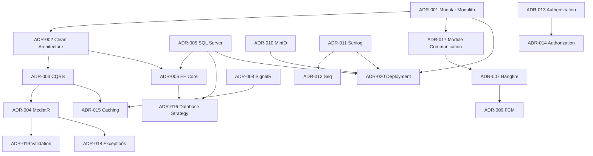

Interpretation: Topology (001) enables Clean Architecture (002) and module communication rules (017). CQRS (003) drives MediatR (004), caching (015), and influences EF usage (006). SQL Server (005) underpins EF (006) and database standards (016). AuthN (013) feeds AuthZ (014). Observability (011→012) and data stores (005, 010) feed deployment (020). Async policies connect module events (017) to Hangfire (007) and FCM (009). SignalR scale-out depends on caching/backplane (015).

---

# Supersession and Change Control Process

1. **Propose** a new ADR (next number) or a revision marked Proposed.
2. **Impact analysis** against MODULE_DESIGN, AGGREGATE_DESIGN, EVENT_STORMING, SRS NFRs, and dependent ADRs in the map above.
3. **Architecture Board decision** → Accepted / Rejected.
4. If replacing a prior decision: set old ADR Status to **Superseded**, cite new ADR ID, publish migration strategy and timeline.
5. **Propagate** documentation updates in the same change set as code enablement where possible.
6. **Communicate** to module owners; update onboarding checklist.
7. **Exceptions** are time-boxed written waivers, not silent deviations; expired waivers become defects.

No Accepted ADR may be ignored because a sprint is short. Temporary spikes use feature branches and never merge boundary violations without Board note.

---

# Appendix — Glossary of Architectural Terms

| Term | Definition in this system |
|---|---|
| **Aggregate** | Cluster of entities/value objects with one root; consistency boundary per AGGREGATE_DESIGN |
| **Aggregate Root** | Sole external entry for modifications to the aggregate |
| **ADR** | Architecture Decision Record documenting a significant, lasting choice |
| **Anti-Corruption Layer** | Adapter translating external models into module language |
| **Bounded Context** | Linguistic and model boundary; mapped to a module |
| **Clean Architecture** | Dependency rule inward toward Domain; ports and adapters |
| **Command** | Intent to change state; CQRS write side |
| **Composition Root** | Host project that wires DI for all modules |
| **Contract** | Published interface/DTO/event schema for inter-module collaboration |
| **Correlation ID** | Identifier linking logs/requests across handlers and jobs |
| **CQRS** | Command Query Responsibility Segregation |
| **Domain Event** | Something that happened in the domain, named in past tense |
| **Integration Event** | Event published across module/service boundaries via outbox |
| **Modular Monolith** | Single deployable unit with strong internal module boundaries |
| **Outbox** | Pattern ensuring reliable event publishing with DB transactions |
| **Problem Details** | RFC 7807 HTTP error response shape |
| **Read Model** | Denormalized or projected data optimized for queries |
| **Refresh Token** | Long-lived credential used to obtain new JWT access tokens |
| **Resource-Based Authorization** | Access decision depending on the target entity ownership/state |
| **Rowversion** | SQL Server concurrency token detecting lost updates |
| **Schema-per-Module** | Each module owns a SQL schema as extraction seam |
| **Shared Kernel** | Small shared set of types carefully governed |
| **Soft Delete** | Logical deletion flag preserving historical rows |
| **Strangler Migration** | Incremental replacement/extraction of a module behind a stable port |
| **Unit of Work** | Atomic commit boundary for tracked changes + outbox |
| **Ubiquitous Language** | Shared domain vocabulary inside a bounded context |

---

# Document Control

| Version | Date | Status | Notes |
|---|---|---|---|
| 1.0 | 2026-07-17 | Accepted | Initial ADR set ADR-001 through ADR-020 |

**End of Architecture Decision Records**
