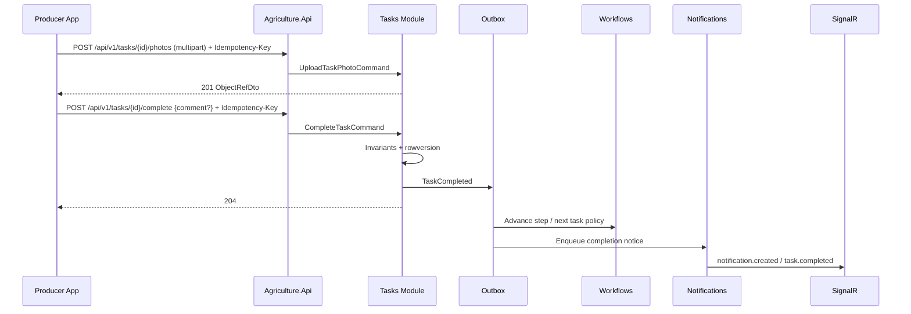
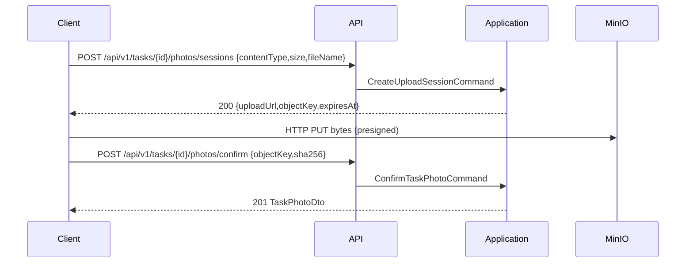
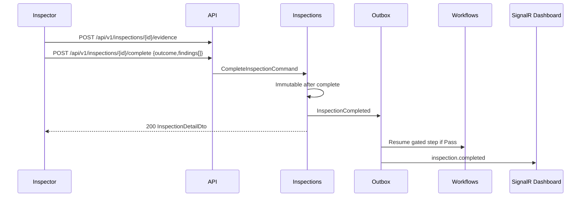
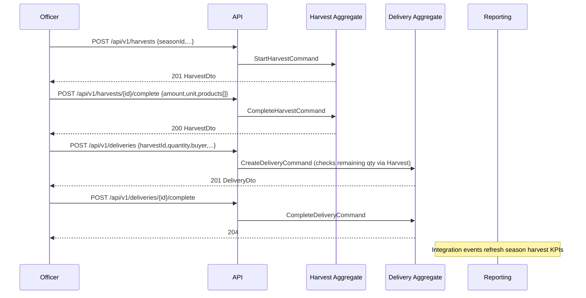

# REST API Contract / API Design Specification

> **Ürün istemcisi güncellemesi (2026-08-11):** Üretici API tüketicisi artık yalnızca `frontend` PWA'dır; `mobile/` kaldırılmıştır. React Native referansları tarihsel bağlamdır. Ayrıntı: [PWA_MOBILE_PARITY.md](./PWA_MOBILE_PARITY.md).

# Agriculture Management System

| Field | Value |
|---|---|
| **Document Title** | REST API Contract / API Design Specification |
| **Document Type** | Normative enterprise API contract (implementation-ready) |
| **Version** | 1.0 |
| **Status** | Approved for implementation alignment |
| **Date** | 2026-07-17 |
| **Primary Audience** | Backend engineers, API consumers (React / React Native), QA automation, security reviewers, municipal integration partners |
| **Host** | `Agriculture.Api` (Modular Monolith composition root) |
| **Style** | REST over HTTPS; thin MVC Controllers → MediatR CQRS; Problem Details (RFC 7807) |
| **Base Path** | `/api/v1` |
| **Must Not Contradict** | PRODUCT_VISION, SRS, PRD, DOMAIN_ANALYSIS, AGGREGATE_DESIGN, EVENT_STORMING, MODULE_DESIGN, ADR, PHYSICAL_ARCHITECTURE, SOLUTION_ARCHITECTURE, BACKEND_ARCHITECTURE |

## Document Control

### Change Control

Breaking changes to routes, status semantics, error codes, or authentication require:

1. Architecture Board review.
2. URL major version bump (`v2`) when municipal clients cannot tolerate additive change.
3. Updates to this contract and OpenAPI artifact together.
4. ADR when the change alters an accepted architectural decision (e.g., auth model, Problem Details shape).

Additive DTO fields, new optional query filters, and new endpoints under existing resource trees are non-breaking when documented and versioned in OpenAPI.

### Relationship to Approved Documents

| Document | Relationship |
|---|---|
| MODULE_DESIGN | Module boundaries, permission strings, command/query catalogs — primary business surface parent |
| AGGREGATE_DESIGN | Invariants and allowed operations mapped to command endpoints |
| EVENT_STORMING | Command names and policies inform action routes (`POST …/complete`) |
| BACKEND_ARCHITECTURE | Controllers, middleware, Problem Details, uploads, SignalR, idempotency — behavioral parent |
| SOLUTION_ARCHITECTURE | Route catalog patterns (`api/v1/...`), Delivery under Harvest module |
| ADR-013 / ADR-014 | JWT + refresh; RBAC + permissions + resource checks |
| ADR-018 | Problem Details mapping |
| ADR-008 / ADR-009 / ADR-010 | SignalR, FCM, MinIO upload contracts |

### Non-Goals

- This document does **not** generate controller source code.
- This document does **not** redefine aggregate invariants (see AGGREGATE_DESIGN).
- This document does **not** specify React/React Native UI layouts.
- Delivery is exposed under `/api/v1/deliveries` while owned by the Harvest module (MODULE_DESIGN §6.8).

---

# 1. Executive Intent

The Agriculture Management System exposes a **single versioned REST API** from one modular monolith host. Clients (municipal React web, producer/inspector React Native) consume HTTPS JSON resources that map one-to-one to application commands and queries. Controllers are protocol adapters only: authenticate, authorize at coarse grain, map HTTP to MediatR, map `Result` to DTOs or RFC 7807 Problem Details.

Municipal officers assign workflows, producers complete evidence-backed tasks, inspectors gate harvest eligibility, and harvest quantities constrain deliveries. The API contract encodes those lifecycle verbs as **explicit action resources** (e.g., `POST /api/v1/tasks/{id}/complete`) rather than arbitrary `PATCH` status writes, aligning with BACKEND_ARCHITECTURE §10.23 and EVENT_STORMING command language.

---

# 2. REST Standards

## 2.1 Protocol and Media Types

| Rule | Normative value |
|---|---|
| Transport | HTTPS only in Staging/Production (ADR-020 / PHYSICAL_ARCHITECTURE) |
| Request body | `application/json` unless multipart upload |
| Response body | `application/json` or `application/problem+json` |
| Character encoding | UTF-8 |
| Property naming | JSON **camelCase** |
| Date/time | ISO-8601 UTC (`2026-07-17T14:30:00Z`) |
| Identifiers | UUID (`guid`) string form unless explicitly opaque (`string`) |
| Money/quantity | Decimal as JSON number; unit as separate string enum/code |
| Nullability | Omit optional nulls preferred; clients must tolerate explicit `null` |
| Boolean | JSON boolean, never `0`/`1` strings |

## 2.2 HTTP Methods

| Method | Use |
|---|---|
| `GET` | Safe, idempotent reads; no side effects beyond audit/access logs |
| `POST` | Creates and **lifecycle actions** (`complete`, `start`, `approve`) |
| `PUT` | Full replace of mutable profile/settings resources |
| `PATCH` | Reserved; not used for status transitions in v1 |
| `DELETE` | Soft-delete/remove of associations where ubiquitous language uses remove (e.g., role remove); hard delete only under Administration policies |

**Normative anti-pattern:** `PATCH /tasks/{id}` with `{ "status": "Completed" }` is **forbidden**. Use `POST /tasks/{id}/complete`.

## 2.3 Resource Naming

- Plural nouns for collections: `producers`, `lands`, `seasons`, `tasks`.
- kebab-case for multi-word path segments: `assign-workflow`, `feature-flags`, `device-tokens`.
- Nested resources only when ownership is clear: `POST /tasks/{id}/photos`.
- Cross-module identity references pass as IDs in bodies, not nested foreign graphs.
- Delivery routes remain top-level `/deliveries` (SAS §22.1) despite Harvest module ownership.

## 2.4 URI Design

```
https://{host}/api/v1/{resource}
https://{host}/api/v1/{resource}/{id}
https://{host}/api/v1/{resource}/{id}/{action}
https://{host}/api/v1/{resource}/{id}/{child-collection}
https://{host}/hubs/{hubName}          # SignalR (not under /api)
https://{host}/health/live|ready       # ops (not versioned business API)
```

Path parameters are always resource identifiers. Filtering, sorting, search, and pagination use **query strings**.

## 2.5 Versioning

- URL segment versioning: `/api/v1`.
- Breaking changes require `/api/v2` and client migration window.
- Additive fields are non-breaking; clients must ignore unknown fields.
- Error `errorCode` renames are breaking — avoid; prefer new codes + deprecation notes.
- OpenAPI `info.version` tracks contract revision independently of URL version when additive.

## 2.6 HATEOAS

v1 does **not** require full HATEOAS. Optional `links` objects may appear on detail DTOs in future minor revisions without requiring clients to depend on them.

## 2.7 Content Negotiation

v1 supports JSON only for business APIs. Export endpoints may return `application/vnd.openxmlformats-officedocument.spreadsheetml.sheet` or `text/csv` with `Content-Disposition` attachment, documented per Reporting routes.

---

# 3. Cross-Cutting Conventions

## 3.1 Pagination

Aligned with MODULE_DESIGN §9.3 and BACKEND_ARCHITECTURE §10.10.

### Offset pagination (admin grids, stable catalogs)

| Query | Type | Default | Max | Notes |
|---|---|---|---|---|
| `page` | int ≥ 1 | `1` | — | 1-based |
| `pageSize` | int ≥ 1 | `20` | `100` | Hard cap enforced by FluentValidation |
| `sort` | string | resource default | — | `field:asc|desc`, comma-separated multi-sort where listed |

**Response envelope (`PagedResult<T>`):**

| Field | Type | Description |
|---|---|---|
| `items` | `T[]` | Page of projections |
| `page` | int | Echo |
| `pageSize` | int | Echo |
| `totalCount` | long | Total matching filter |
| `totalPages` | int | Derived |
| `hasNextPage` | bool | Convenience |
| `hasPreviousPage` | bool | Convenience |

### Cursor pagination (mobile high-churn feeds)

Used for Notifications inbox and Communication messages.

| Query | Type | Notes |
|---|---|---|
| `cursor` | string | Opaque; omit for first page |
| `limit` | int | Default 20, max 100 |

**Response:** `items`, `nextCursor` (nullable), `hasMore`.

## 3.2 Filtering

- Prefer explicit query parameters over free-form expression languages.
- Common patterns: `status`, `seasonId`, `producerId`, `landId`, `from`, `to` (UTC), `q` (search).
- Boolean flags: `includeDeleted=false` (default); `true` requires elevated audit permission.
- Unknown filter keys → `400` validation error (fail closed).

## 3.3 Sorting

- Whitelist sortable fields per endpoint (document in each query).
- Default sorts: typically `createdAt:desc` or domain-specific (`dueDate:asc` for tasks).
- Invalid sort field → `400` with Problem Details field error on `sort`.

## 3.4 Searching

- `q` or dedicated `/search` routes for producer/message search.
- Minimum query length typically 2–3 characters.
- Search is eventually consistent with read models where noted; not a substitute for exact ID GET.

## 3.5 Concurrency

Mutating commands that change hot aggregates accept optional header:

| Header | Description |
|---|---|
| `If-Match` | ETag / rowversion hex from last GET |

On conflict → `409 Conflict` Problem Details with `errorCode` = `*.ConcurrencyConflict`. Clients refresh and retry. Critical for Delivery quantity and Workflow step advancement (BACKEND_ARCHITECTURE §3.26).

## 3.6 Idempotency

| Header | Description |
|---|---|
| `Idempotency-Key` | Client-generated UUID/string (max 128 chars); required recommendation for mobile offline completion and uploads |

Server stores hash of `(userId, route, key)` for a retention window (e.g., 24–72 hours). Duplicate successful completions return **success-equivalent** responses without double-advancing workflow (MODULE_DESIGN / BACKEND_ARCHITECTURE §10.24). Missing key on non-critical POSTs is allowed; for `tasks/{id}/complete`, `inspections/{id}/complete`, and upload completes, clients **SHOULD** send the key.

## 3.7 Correlation IDs

| Header | Direction | Rule |
|---|---|---|
| `X-Correlation-Id` | Request | Client may supply; otherwise server generates UUID |
| `X-Correlation-Id` | Response | Always echoed |
| Problem Details | Body | `correlationId` / `traceId` member |

Correlation Id propagates to Serilog, outbox events, Hangfire jobs, and Seq (ADR-011).

## 3.8 Caching Headers

| Scenario | Headers |
|---|---|
| Mutable business resources | `Cache-Control: no-store` |
| Reference catalogs (roles, permission matrix) | `Cache-Control: private, max-age=60` + `ETag` |
| Presigned download URLs | Short TTL in URL, not HTTP cache of bytes via API |
| Reporting snapshots | `Cache-Control: private, max-age=30` + `X-As-Of` timestamp in body |

Never cache authenticated producer PII at shared CDN without Board approval.

## 3.9 Standard Response Headers

| Header | When |
|---|---|
| `Location` | `201 Created` — URI of new resource |
| `ETag` | Detail GETs of concurrency-sensitive aggregates |
| `X-Correlation-Id` | All responses |
| `X-RateLimit-Limit` / `Remaining` / `Reset` | When rate limiting applies |

## 3.10 Status Code Catalog

| Code | Meaning in this API |
|---|---|
| `200` | Successful GET/PUT/action returning body |
| `201` | Resource created |
| `204` | Successful command with empty body (preferred for many lifecycle POSTs) |
| `400` | Validation failure (FluentValidation) |
| `401` | Missing/invalid/expired JWT |
| `403` | Authenticated but permission/resource check failed |
| `404` | Resource not found **or** hidden by tenant/resource scope (avoid existence leaks where policy requires) |
| `409` | Concurrency conflict or business conflict (duplicate identity number, already completed) |
| `422` | Reserved; prefer `400` with `errorCode` for business rule failures mapped from `Result` — see ADR-018 mapping table |
| `429` | Rate limit exceeded |
| `500` | Unexpected fault (no stack in Production) |
| `503` | Dependency unavailable (MinIO, SQL) when request cannot proceed |

**Business rule failures** typically map to `409` or `400` with stable `errorCode` (e.g., `Harvest.QuantityExceeded`, `Seasons.ActiveSeasonAlreadyExists`). Controllers never return bare strings.

---

# 4. Problem Details (RFC 7807)

Aligned with ADR-018 and BACKEND_ARCHITECTURE §10.6 / §15.

## 4.1 Media Type

`Content-Type: application/problem+json`

## 4.2 Normative Shape

```json
{
  "type": "https://agriculture.local/problems/validation",
  "title": "Validation failed",
  "status": 400,
  "detail": "One or more validation errors occurred.",
  "instance": "/api/v1/tasks/3fa85f64-5717-4562-b3fc-2c963f66afa6/complete",
  "correlationId": "8c2f0c1a-5b3e-4d2a-9f1c-1a2b3c4d5e6f",
  "errorCode": "Validation.Failed",
  "errors": [
    { "field": "comment", "message": "Comment is required when delaying a task.", "code": "NotEmpty" }
  ],
  "extensions": {
    "module": "Tasks",
    "resourceId": "3fa85f64-5717-4562-b3fc-2c963f66afa6"
  }
}
```

## 4.3 Member Rules

| Member | Required | Notes |
|---|---|---|
| `type` | Yes | Stable URI-like identifier under municipal docs base |
| `title` | Yes | Short human summary |
| `status` | Yes | HTTP status |
| `detail` | Recommended | Safe for end users; no secrets |
| `instance` | Recommended | Request path |
| `correlationId` | Yes | Same as header |
| `errorCode` | Yes for business/authZ | Stable machine code |
| `errors` | Validation only | Field-level array |
| Stack traces | Never in Production | |

## 4.4 Mapping from Application Results

| Outcome | HTTP | `errorCode` example |
|---|---|---|
| ValidationException | 400 | `Validation.Failed` |
| Unauthorized (no JWT) | 401 | `Auth.Unauthenticated` |
| Permission denied | 403 | `Auth.Forbidden` |
| Not found | 404 | `Tasks.NotFound` |
| Business rule | 409 | `Workflows.CannotSkipStep` |
| Concurrency | 409 | `*.ConcurrencyConflict` |
| Rate limit | 429 | `RateLimit.Exceeded` |
| Unhandled | 500 | `System.UnexpectedError` |

---

# 5. Authentication

Aligned with ADR-013 and MODULE_DESIGN §8.1.

## 5.1 Scheme

`Authorization: Bearer {accessToken}`

JWT access token validation on all `/api/v1/**` except explicitly anonymous auth endpoints and health probes.

## 5.2 Token Characteristics

| Token | Form | TTL (typical) | Storage |
|---|---|---|---|
| Access | JWT | 10–30 minutes | Client memory / secure storage |
| Refresh | Opaque string | Days (policy) | Hashed on User aggregate |

**Access claims (representative):** `sub` (userId), `roles`, selected `permissions` or permission version, `tenantId`, `producerId` (if linked), `jti`, `exp`, `iat`.

## 5.3 Anonymous Endpoints

- `POST /api/v1/auth/login`
- `POST /api/v1/auth/refresh`
- `POST /api/v1/auth/reset-password/request`
- `POST /api/v1/auth/reset-password/confirm`
- Health endpoints (no business data)

## 5.4 Logout and Revocation

Logout revokes the presented refresh token (and optionally the family). Password change / deactivate revokes all refresh families. Access tokens remain valid until expiry (short TTL).

## 5.5 SignalR Authentication

Hubs under `/hubs/**` accept JWT via query string `access_token` (browser WebSocket limitation) or header where supported; same validation pipeline as HTTP (ADR-008).

---

# 6. Authorization

Aligned with ADR-014 and MODULE_DESIGN §8.2.

## 6.1 Model

1. **Roles** — Admin, Officer, Inspector, Producer (coarse UX grouping).
2. **Permissions** — fine-grained strings from MODULE_DESIGN §6 (`tasks.complete_own`, `harvest.start`, …).
3. **Policies** — ASP.NET policies mapped 1:1 to permissions where practical.
4. **Resource checks** — producer owns task; inspector assigned; tenant isolation via `TenantId` filters.

Authorization is enforced at endpoint policies **and** MediatR `AuthorizationBehavior` (defense in depth). Hangfire/system jobs use explicit system principal or `[AllowSystemJob]` Board-approved markers — never the last interactive user captured in a singleton.

## 6.2 Permission Catalog (Normative Summary)

| Module | Permissions |
|---|---|
| Identity | `identity.users.read\|create\|update\|deactivate`, `identity.roles.manage`, `identity.permissions.manage`, `identity.audit.read` |
| Producers | `producers.read\|create\|update\|deactivate\|assign` |
| Lands | `lands.read\|create\|update\|archive` |
| Seasons | `seasons.read\|create\|start\|pause\|complete\|archive\|assign_workflow` |
| Workflows | `workflows.definitions.manage`, `workflows.runtime.read`, `workflows.runtime.control` |
| Tasks | `tasks.read`, `tasks.assign`, `tasks.complete_own`, `tasks.complete_any`, `tasks.cancel`, `tasks.delay` |
| Inspections | `inspections.read\|create\|assign\|complete\|reject` |
| Harvest/Delivery | `harvest.read\|start\|complete\|cancel`, `delivery.read\|create\|complete\|cancel` |
| Support | `support.programs.manage`, `support.applications.read`, `support.approve`, `support.fulfill` |
| Notifications | `notifications.read_own`, `notifications.templates.manage`, `notifications.admin_view` |
| Communication | `communication.inbox`, `communication.send`, `communication.moderate` |
| Reporting | `reporting.dashboards.view`, `reporting.exports.run`, `reporting.definitions.manage` |
| Administration | `admin.settings.manage`, `admin.audit.read`, `admin.features.manage` |

## 6.3 Tenant Isolation

All queries/commands are tenant-scoped. Cross-tenant ID injection returns `404` or `403` per policy (fail closed).

---

# 7. Rate Limiting

Aligned with MODULE_DESIGN §8.5 and BACKEND_ARCHITECTURE §10.9.

| Partition | Endpoints | Guidance |
|---|---|---|
| IP + username | Login, refresh, password reset | Strict — brute force mitigation |
| User id | Authenticated APIs | Baseline fair use |
| User id | Uploads | Lower ceiling; size also limited |
| User id | Report runs | Concurrent run limits |
| Global | Notification send fan-out (internal) | Budgeted in Notifications |

Exceeded limits → `429` Problem Details + `Retry-After`.

---

# 8. Request Validation

- FluentValidation validators on every command/query (ADR / BAS).
- Pagination bounds validated.
- File uploads: content-type allowlist, max size, optional magic-byte checks; future AV scanner port.
- Path IDs must be valid GUIDs where typed as such.
- Validation failures never hit SQL write paths.

---

# 9. OpenAPI Strategy

| Concern | Decision |
|---|---|
| Spec generation | Swashbuckle/NSwag from Controllers + attributes |
| Environments | Dev/Staging always on; Production optional behind admin auth |
| Security scheme | `bearerAuth` HTTP bearer JWT |
| Tags | Identity, Producers, Lands, Seasons, Workflows, Tasks, Inspections, Harvest, Delivery, Support, Notifications, Communication, Reporting, Administration |
| Contract-first vs code-first | Code-first generation **governed by this markdown contract** as source of truth for product/QA |
| Artifacts | Publish `openapi.v1.json` in CI; breaking-change detection recommended |
| Examples | Include representative success + Problem Details samples per tag |

---

# 10. File Upload APIs (Cross-Cutting)

Aligned with ADR-010 and BACKEND_ARCHITECTURE §14.

## 10.1 Patterns

1. **Multipart command** — `multipart/form-data` to resource child route; handler stores MinIO object + SQL metadata in one application transaction (metadata commit; object put with compensating cleanup job).
2. **Presigned PUT** — client requests upload session; API returns short-lived URL; client uploads directly to MinIO; client confirms with command including object key/hash.

v1 normative default for evidence: **multipart through API** for simpler mobile authZ; presigned allowed for large harvest documents.

## 10.2 Constraints

| Constraint | Typical v1 value |
|---|---|
| Max file size | Configurable (e.g., 10–25 MB photos; larger for exports) |
| Allowed types | `image/jpeg`, `image/png`, `application/pdf` (endpoint-specific) |
| Object key | `{module}/{aggregate}/{id}/{uuid}-{safeFileName}` |
| Buckets | Private; no permanent public ACLs |
| Dedup | Optional SHA-256 + Idempotency-Key |

## 10.3 Download

`GET` metadata returns temporary download URL or streams via authorized API proxy. Never expose permanent MinIO credentials to clients.

---

# 11. Realtime APIs (SignalR Contract Overview)

Aligned with ADR-008 and BACKEND_ARCHITECTURE §10.12.

## 11.1 Hub Endpoints

| Hub path | Purpose |
|---|---|
| `/hubs/notifications` | In-app notification push to `user:{userId}` |
| `/hubs/dashboard` | Officer operational events |
| `/hubs/season` | Season-scoped task/inspection updates |

## 11.2 Groups

`user:{id}`, `role:officer`, `role:inspector`, `season:{seasonId}`, `tenant:{tenantId}`.

Join to `season:{id}` requires `CanUserAccessSeason` contract check (BAS §22).

## 11.3 Server → Client Events (representative)

| Event | Payload (conceptual) | Publishers |
|---|---|---|
| `notification.created` | notification summary | Notifications |
| `task.completed` | taskId, seasonId, status | Tasks |
| `task.overdue` | taskId, dueDate | Tasks jobs |
| `inspection.completed` | inspectionId, outcome | Inspections |
| `inspection.rejected` | inspectionId, reason | Inspections |
| `season.statusChanged` | seasonId, status | Seasons |
| `harvest.completed` | harvestId, seasonId | Harvest |
| `delivery.completed` | deliveryId, harvestId | Harvest |
| `message.received` | conversationId, messageId | Communication |

## 11.4 Client → Server

Hub methods that mutate state **SHOULD** dispatch MediatR commands (thin hubs). Prefer HTTP for writes; hubs primarily push.

## 11.5 Scale

Single host initially; Redis backplane when multiple API instances (ADR-015 / PHYSICAL_ARCHITECTURE). Sticky sessions until backplane.

---

# 12. Notification APIs Strategy

- Business modules never call FCM/SMTP directly; they publish via `INotificationPublisher` (MODULE_DESIGN §6.10).
- User-facing REST covers inbox, read state, device tokens, admin stats, template management.
- Push delivery is asynchronous (Hangfire); HTTP commands that trigger notifications return before send completes.

---

# 13. Webhook Strategy (Future)

**Status:** Deferred — not in v1 municipal MVP surface.

### Future design sketch (non-normative for implementers until ADR)

| Topic | Direction |
|---|---|
| Purpose | Partner systems receive signed HTTP callbacks for `HarvestCompleted`, `SupportApproved`, etc. |
| Registration | `POST /api/v2/admin/webhooks` with URL, secret, event types |
| Delivery | Hangfire retries; signed `X-Signature` HMAC |
| Security | mTLS optional; IP allowlists; secret rotation via Administration |
| Idempotency | EventId header for consumer dedup |

Until adopted, integrations use polling Reporting exports or authenticated partner APIs under Board approval.

---

# 14. Shared DTO Catalog

## 14.1 Common Types

**Error field:** `field` (string), `message` (string), `code` (string, optional).

**MoneyDto:** `amount` (decimal), `currency` (string, ISO 4217; default municipal currency).

**GeoPointDto:** `latitude` (decimal), `longitude` (decimal).

**ObjectRefDto:** `objectKey` (string), `contentType` (string), `sizeBytes` (long), `sha256` (string), `uploadedAt` (datetime).

**AuditStampDto:** `createdAt`, `createdByUserId`, `modifiedAt`, `modifiedByUserId`.

**AuthTokenResponse:** `accessToken`, `accessTokenExpiresAt`, `refreshToken`, `refreshTokenExpiresAt`, `tokenType` (`Bearer`), `user` (`UserSummaryDto`).

**UserSummaryDto:** `id`, `userName`, `email`, `fullName`, `roles[]`, `producerId?`, `tenantId`, `isActive`.

## 14.2 Empty Success

Many lifecycle commands return `204 No Content`. When clients need updated ETag, prefer `200` with `{ "id", "rowVersion", "status" }` — documented per endpoint.

---

# 15. Key Sequence Diagrams

## 15.1 Login and Refresh

```mermaid
sequenceDiagram
  participant App as React/RN Client
  participant API as Agriculture.Api
  participant Id as Identity Module
  participant DB as identity schema

  App->>API: POST /api/v1/auth/login {userName,password,clientId}
  API->>Id: LoginCommand
  Id->>DB: Verify hash, append LoginHistory, store hashed refresh
  Id-->>API: AuthTokenResponse
  API-->>App: 200 AuthTokenResponse + X-Correlation-Id

  Note over App,API: Access token expires
  App->>API: POST /api/v1/auth/refresh {refreshToken,clientId}
  API->>Id: RefreshTokenCommand
  Id->>DB: Rotate refresh (family); detect reuse → revoke family
  Id-->>App: 200 new AuthTokenResponse
```

## 15.2 Task Complete (with evidence)



## 15.3 Photo Upload (presigned variant)



## 15.4 Inspection Complete (gate)



## 15.5 Harvest → Delivery



---

# 16. Health and Ops Endpoints

### 16.1 GET `/health/live`

**Purpose.** Process liveness for orchestrators.  
**Auth.** Anonymous (network-restricted).  
**Response.** `200 { "status": "Healthy" }` if process up.  
**Notes.** Does not check SQL/MinIO.

### 16.2 GET `/health/ready`

**Purpose.** Readiness including SQL Server, MinIO, Hangfire storage.  
**Auth.** Anonymous (network-restricted).  
**Response.** `200` when ready; `503` with dependency details when not.  
**Performance.** Keep lightweight; avoid heavy queries.

---

# 17. Identity / Authentication Module Endpoints

OpenAPI tag: **Identity**. Schema owner: `identity`.

### 17.1 Login

**Purpose.** Authenticate user and issue JWT access token plus opaque refresh token.

| Attribute | Value |
|---|---|
| **Method** | `POST` |
| **Route** | `/api/v1/auth/login` |
| **AuthN** | JWT Bearer unless noted anonymous |

**Request DTO (fields).**
- `userNameOrEmail (string, required)`
- `password (string, required)`
- `clientId (string, required — web|mobile)`
- `deviceId (string, optional — mobile binding)`

**Response DTO (fields).**
- `accessToken`
- `accessTokenExpiresAt`
- `refreshToken`
- `refreshTokenExpiresAt`
- `tokenType`
- `user (UserSummaryDto)`

**Validation Rules.** Credentials required; password min length per policy; clientId allowlisted.

**Authorization Rules.** Anonymous. Rate limited by IP+account.

**Business Rules.** Only active users; password hash verify; append LoginHistory; issue claims; store hashed refresh with family id.

**Possible Errors.** `401 Auth.InvalidCredentials`; `403 Auth.UserDeactivated`; `429 RateLimit.Exceeded`.

**Performance Notes.** Constant-time failure messaging; no user enumeration in detail text where policy requires.

**Future Extensions.** MFA challenge step; external IdP redirect.

---
### 17.2 Refresh Token

**Purpose.** Rotate refresh token and issue a new access/refresh pair.

| Attribute | Value |
|---|---|
| **Method** | `POST` |
| **Route** | `/api/v1/auth/refresh` |
| **AuthN** | JWT Bearer unless noted anonymous |

**Request DTO (fields).**
- `refreshToken (string, required)`
- `clientId (string, required)`
- `deviceId (string, optional)`

**Response DTO (fields).**
- `AuthTokenResponse fields as Login`

**Validation Rules.** refreshToken non-empty; clientId required.

**Authorization Rules.** Anonymous. Rate limited.

**Business Rules.** Validate hash; rotate; reuse detection revokes family; deactivated users fail.

**Possible Errors.** `401 Auth.InvalidRefreshToken`; `401 Auth.RefreshReuseDetected`; `403 Auth.UserDeactivated`.

**Performance Notes.** Indexed lookup by token hash; avoid full table scans.

**Future Extensions.** Device-bound refresh; step-up on suspicious geo.

---
### 17.3 Logout

**Purpose.** Revoke the current refresh token (and optionally the token family).

| Attribute | Value |
|---|---|
| **Method** | `POST` |
| **Route** | `/api/v1/auth/logout` |
| **AuthN** | JWT Bearer unless noted anonymous |

**Request DTO (fields).**
- `refreshToken (string, required)`
- `revokeFamily (bool, default false)`

**Response DTO (fields).**
- `_(empty)_ — 204`

**Validation Rules.** refreshToken required.

**Authorization Rules.** Authenticated JWT preferred; refresh alone may be accepted for cleanup.

**Business Rules.** Revoke stored refresh; raise UserLoggedOut audit event.

**Possible Errors.** `401`; `404 Auth.RefreshTokenNotFound` (may still return 204 to avoid leaks).

**Performance Notes.** Single-row update.

**Future Extensions.** Global logout-all-devices endpoint.

---
### 17.4 Change Password

**Purpose.** Change password for the authenticated user; revoke refresh families.

| Attribute | Value |
|---|---|
| **Method** | `POST` |
| **Route** | `/api/v1/auth/change-password` |
| **AuthN** | JWT Bearer unless noted anonymous |

**Request DTO (fields).**
- `currentPassword (string)`
- `newPassword (string)`

**Response DTO (fields).**
- `_(empty)_ — 204`

**Validation Rules.** Password complexity policy; new ≠ current.

**Authorization Rules.** Authenticated; self only.

**Business Rules.** Verify current; hash new; append PasswordHistory; revoke refresh families.

**Possible Errors.** `400 Validation`; `403 Auth.PasswordMismatch`.

**Performance Notes.** CPU-bound hash; not cacheable.

**Future Extensions.** Forced password expiry policies.

---
### 17.5 Request Password Reset

**Purpose.** Start password reset flow (email/SMS via Notifications).

| Attribute | Value |
|---|---|
| **Method** | `POST` |
| **Route** | `/api/v1/auth/reset-password/request` |
| **AuthN** | JWT Bearer unless noted anonymous |

**Request DTO (fields).**
- `emailOrUserName (string)`

**Response DTO (fields).**
- `_(empty)_ — 202/204 always success-shaped to avoid enumeration`

**Validation Rules.** Identifier format validated lightly.

**Authorization Rules.** Anonymous. Strict rate limit.

**Business Rules.** If user exists, enqueue reset notification with time-limited token.

**Possible Errors.** `429`.

**Performance Notes.** Do not reveal existence.

**Future Extensions.** Captcha / municipal SSO reset.

---
### 17.6 Confirm Password Reset

**Purpose.** Complete password reset with token.

| Attribute | Value |
|---|---|
| **Method** | `POST` |
| **Route** | `/api/v1/auth/reset-password/confirm` |
| **AuthN** | JWT Bearer unless noted anonymous |

**Request DTO (fields).**
- `resetToken (string)`
- `newPassword (string)`

**Response DTO (fields).**
- `_(empty)_ — 204`

**Validation Rules.** Token format; password policy.

**Authorization Rules.** Anonymous. Rate limited.

**Business Rules.** Validate token; set password; revoke refresh families.

**Possible Errors.** `400 Auth.InvalidResetToken`.

**Performance Notes.** One-time token consume.

**Future Extensions.** None.

---
### 17.7 Get My Profile

**Purpose.** Return the authenticated user's profile and effective roles/permissions summary.

| Attribute | Value |
|---|---|
| **Method** | `GET` |
| **Route** | `/api/v1/me` |
| **AuthN** | JWT Bearer unless noted anonymous |

**Request DTO (fields).**
- _(none — path/query only)_

**Response DTO (fields).**
- `id`
- `userName`
- `email`
- `fullName`
- `phone`
- `roles[]`
- `permissions[]`
- `producerId?`
- `tenantId`
- `isActive`
- `audit (AuditStampDto)`

**Validation Rules.** None.

**Authorization Rules.** Authenticated.

**Business Rules.** Reads Identity projections; permissions may come from claims + catalog.

**Possible Errors.** `401`.

**Performance Notes.** Cache-Control private; short TTL optional.

**Future Extensions.** Preference center fields.

---
### 17.8 List Users

**Purpose.** Paged administrative user directory.

| Attribute | Value |
|---|---|
| **Method** | `GET` |
| **Route** | `/api/v1/users?page&pageSize&sort&q&role&isActive` |
| **AuthN** | JWT Bearer unless noted anonymous |

**Request DTO (fields).**
- `page`
- `pageSize`
- `sort (createdAt|userName|email)`
- `q`
- `role`
- `isActive`

**Response DTO (fields).**
- `PagedResult of UserSummaryDto`

**Validation Rules.** pageSize ≤ 100.

**Authorization Rules.** `identity.users.read`.

**Business Rules.** Tenant filtered; soft-deleted excluded by default.

**Possible Errors.** `403`; `400`.

**Performance Notes.** Indexed search on userName/email.

**Future Extensions.** Export CSV under Reporting.

---
### 17.9 Get User By Id

**Purpose.** User detail for administration.

| Attribute | Value |
|---|---|
| **Method** | `GET` |
| **Route** | `/api/v1/users/{userId}` |
| **AuthN** | JWT Bearer unless noted anonymous |

**Request DTO (fields).**
- _(none — path/query only)_

**Response DTO (fields).**
- `UserDetailDto: summary + assignedRoles[] + permissionOverrides[] + lastLoginAt`

**Validation Rules.** userId GUID.

**Authorization Rules.** `identity.users.read` or self.

**Business Rules.** Resource scope: self or admin permission.

**Possible Errors.** `404 Identity.UserNotFound`.

**Performance Notes.** Single keyed read.

**Future Extensions.** Session list.

---
### 17.10 Register User

**Purpose.** Create a platform user (officer/inspector/admin/producer-linked).

| Attribute | Value |
|---|---|
| **Method** | `POST` |
| **Route** | `/api/v1/users` |
| **AuthN** | JWT Bearer unless noted anonymous |

**Request DTO (fields).**
- `userName`
- `email`
- `password (or inviteMode)`
- `fullName`
- `phone?`
- `roleIds[]`
- `producerId?`
- `tenantId?`

**Response DTO (fields).**
- `UserDetailDto`

**Validation Rules.** Unique email/username; password policy; roles exist.

**Authorization Rules.** `identity.users.create`.

**Business Rules.** Raises UserRegistered integration event for Producers linkage policies.

**Possible Errors.** `409 Identity.EmailExists`; `409 Identity.UserNameExists`.

**Performance Notes.** Unique indexes.

**Future Extensions.** Invite-only registration; OIDC provisioning.

---
### 17.11 Update User

**Purpose.** Update mutable profile fields.

| Attribute | Value |
|---|---|
| **Method** | `PUT` |
| **Route** | `/api/v1/users/{userId}` |
| **AuthN** | JWT Bearer unless noted anonymous |

**Request DTO (fields).**
- `email`
- `fullName`
- `phone`
- `address?`

**Response DTO (fields).**
- `UserDetailDto`

**Validation Rules.** Email unique if changed.

**Authorization Rules.** `identity.users.update` or self (limited fields).

**Business Rules.** Cannot update deactivated users' contact for login without reactivate flow.

**Possible Errors.** `404`; `409`.

**Performance Notes.** Optimistic concurrency via If-Match.

**Future Extensions.** None.

---
### 17.12 Deactivate User

**Purpose.** Soft-deactivate user; revoke tokens; prevent login.

| Attribute | Value |
|---|---|
| **Method** | `POST` |
| **Route** | `/api/v1/users/{userId}/deactivate` |
| **AuthN** | JWT Bearer unless noted anonymous |

**Request DTO (fields).**
- `reason (string, optional)`

**Response DTO (fields).**
- `_(empty)_ — 204`

**Validation Rules.** Cannot deactivate last system admin (Administration collaboration).

**Authorization Rules.** `identity.users.deactivate`.

**Business Rules.** Revoke refresh families; emit UserDeactivatedV1.

**Possible Errors.** `409 Identity.LastAdmin`; `404`.

**Performance Notes.** Single transaction.

**Future Extensions.** Scheduled reactivation.

---
### 17.13 Assign Role

**Purpose.** Assign a role to a user.

| Attribute | Value |
|---|---|
| **Method** | `POST` |
| **Route** | `/api/v1/users/{userId}/roles` |
| **AuthN** | JWT Bearer unless noted anonymous |

**Request DTO (fields).**
- `roleId (guid)`

**Response DTO (fields).**
- `UserDetailDto or 204`

**Validation Rules.** Role must exist; no duplicate assignment.

**Authorization Rules.** `identity.roles.manage`.

**Business Rules.** Emit RoleAssigned; may bump permission version / revoke refresh.

**Possible Errors.** `404`; `409 Identity.RoleAlreadyAssigned`.

**Performance Notes.** Small write.

**Future Extensions.** Scoped roles per region.

---
### 17.14 Remove Role

**Purpose.** Remove a role from a user.

| Attribute | Value |
|---|---|
| **Method** | `DELETE` |
| **Route** | `/api/v1/users/{userId}/roles/{roleId}` |
| **AuthN** | JWT Bearer unless noted anonymous |

**Request DTO (fields).**
- _(none — path/query only)_

**Response DTO (fields).**
- `204`

**Validation Rules.** Path IDs valid.

**Authorization Rules.** `identity.roles.manage`.

**Business Rules.** Prevent removing last admin role from last admin user.

**Possible Errors.** `409`; `404`.

**Performance Notes.** Small write.

**Future Extensions.** None.

---
### 17.15 Grant Permission Override

**Purpose.** Grant a user-specific permission override.

| Attribute | Value |
|---|---|
| **Method** | `POST` |
| **Route** | `/api/v1/users/{userId}/permission-overrides` |
| **AuthN** | JWT Bearer unless noted anonymous |

**Request DTO (fields).**
- `permissionCode (string)`
- `expiresAt? (datetime)`

**Response DTO (fields).**
- `PermissionOverrideDto`

**Validation Rules.** permissionCode must exist in catalog.

**Authorization Rules.** `identity.permissions.manage`.

**Business Rules.** Overrides additive; audited.

**Possible Errors.** `400`; `404`.

**Performance Notes.** Invalidate permission cache.

**Future Extensions.** Time-boxed break-glass overrides.

---
### 17.16 Revoke Permission Override

**Purpose.** Revoke a permission override.

| Attribute | Value |
|---|---|
| **Method** | `DELETE` |
| **Route** | `/api/v1/users/{userId}/permission-overrides/{permissionCode}` |
| **AuthN** | JWT Bearer unless noted anonymous |

**Request DTO (fields).**
- _(none — path/query only)_

**Response DTO (fields).**
- `204`

**Validation Rules.** Codes match.

**Authorization Rules.** `identity.permissions.manage`.

**Business Rules.** Audited revocation.

**Possible Errors.** `404`.

**Performance Notes.** Cache invalidation.

**Future Extensions.** None.

---
### 17.17 List Roles

**Purpose.** List roles and their permission grants.

| Attribute | Value |
|---|---|
| **Method** | `GET` |
| **Route** | `/api/v1/roles` |
| **AuthN** | JWT Bearer unless noted anonymous |

**Request DTO (fields).**
- _(none — path/query only)_

**Response DTO (fields).**
- `RoleDto[]: id, name, description, permissions[]`

**Validation Rules.** None.

**Authorization Rules.** `identity.users.read` or `identity.roles.manage`.

**Business Rules.** Seeded catalog + custom roles.

**Possible Errors.** `403`.

**Performance Notes.** Cacheable short TTL + ETag.

**Future Extensions.** Hierarchical roles.

---
### 17.18 Get Permission Matrix

**Purpose.** Read model of roles × permissions for admin UX.

| Attribute | Value |
|---|---|
| **Method** | `GET` |
| **Route** | `/api/v1/permissions/matrix` |
| **AuthN** | JWT Bearer unless noted anonymous |

**Request DTO (fields).**
- _(none — path/query only)_

**Response DTO (fields).**
- `matrix: roles[], permissions[], grants[] {roleId, permissionCode}`

**Validation Rules.** None.

**Authorization Rules.** `identity.permissions.manage` or `identity.users.read`.

**Business Rules.** Projection; not source of write truth.

**Possible Errors.** `403`.

**Performance Notes.** Cache private max-age=60.

**Future Extensions.** Export.

---
### 17.19 Get Login History

**Purpose.** Paged login audit for a user.

| Attribute | Value |
|---|---|
| **Method** | `GET` |
| **Route** | `/api/v1/users/{userId}/login-history?page&pageSize` |
| **AuthN** | JWT Bearer unless noted anonymous |

**Request DTO (fields).**
- `page`
- `pageSize`

**Response DTO (fields).**
- `PagedResult of LoginHistoryDto: id, occurredAt, ip, userAgent, success, failureReason?`

**Validation Rules.** pageSize ≤ 100.

**Authorization Rules.** `identity.audit.read` or self.

**Business Rules.** Append-only history.

**Possible Errors.** `403`; `404`.

**Performance Notes.** Indexed by userId+occurredAt.

**Future Extensions.** Tenant-wide login search in Admin.

---

# 18. Producers Module Endpoints

OpenAPI tag: **Producers**. Schema: `producers`. Assignment ownership: Producer module owns land/season assignment entities (MODULE_DESIGN §6.2–6.3).

### 18.1 Register Producer

**Purpose.** Register a new agricultural producer in the municipal program registry.

| Attribute | Value |
|---|---|
| **Method** | `POST` |
| **Route** | `/api/v1/producers` |
| **AuthN** | JWT Bearer unless noted anonymous |

**Request DTO (fields).**
- `identityNumber (string)`
- `fullName (string)`
- `phone (string)`
- `email? (string)`
- `address (AddressDto)`
- `bankInformation? (BankInformationDto)`
- `linkedUserId? (guid)`

**Response DTO (fields).**
- `ProducerDetailDto: id, identityNumber, fullName, phone, email, address, status, landAssignments[], seasonAssignments[], documents[], contacts[], rowVersion, audit`

**Validation Rules.** Identity number required unique; phone required; area contacts valid formats.

**Authorization Rules.** `producers.create`.

**Business Rules.** IdentityNumber unique invariant; emits ProducerRegistered; may trigger Identity mobile user linkage policy via integration event.

**Possible Errors.** `409 Producers.IdentityNumberAlreadyExists`; `400`; `403`.

**Performance Notes.** Unique index on IdentityNumber; avoid N+1 on create response.

**Future Extensions.** KYC verification workflow; cooperatives.

---
### 18.2 List Producers

**Purpose.** Paged producer directory for officers.

| Attribute | Value |
|---|---|
| **Method** | `GET` |
| **Route** | `/api/v1/producers?page&pageSize&sort&status&q` |
| **AuthN** | JWT Bearer unless noted anonymous |

**Request DTO (fields).**
- `page`
- `pageSize`
- `sort (fullName|identityNumber|createdAt)`
- `status (Active|Inactive)`
- `q`

**Response DTO (fields).**
- `PagedResult of ProducerSummaryDto: id, identityNumber, fullName, phone, status, activeSeasonCount`

**Validation Rules.** pageSize ≤ 100; q min length 2 if provided.

**Authorization Rules.** `producers.read`. Producers see only self via alternate me route or resource filter.

**Business Rules.** Tenant scoped; soft-deleted excluded.

**Possible Errors.** `403`; `400`.

**Performance Notes.** Covering index for list projection.

**Future Extensions.** Geo filter.

---
### 18.3 Search Producers

**Purpose.** Dedicated search for typeahead and mobile lookup.

| Attribute | Value |
|---|---|
| **Method** | `GET` |
| **Route** | `/api/v1/producers/search?q&limit` |
| **AuthN** | JWT Bearer unless noted anonymous |

**Request DTO (fields).**
- `q (required)`
- `limit (default 20, max 50)`

**Response DTO (fields).**
- `ProducerSummaryDto[]`

**Validation Rules.** q length ≥ 2.

**Authorization Rules.** `producers.read`.

**Business Rules.** Matches identityNumber, fullName, phone prefixes.

**Possible Errors.** `400`.

**Performance Notes.** Prefer indexed prefix search; timeout guard.

**Future Extensions.** Fuzzy search.

---
### 18.4 Get Producer

**Purpose.** Producer detail including assignments and document metadata.

| Attribute | Value |
|---|---|
| **Method** | `GET` |
| **Route** | `/api/v1/producers/{producerId}` |
| **AuthN** | JWT Bearer unless noted anonymous |

**Request DTO (fields).**
- _(none — path/query only)_

**Response DTO (fields).**
- `ProducerDetailDto`

**Validation Rules.** GUID path.

**Authorization Rules.** `producers.read` + resource scope (own producerId for Producer role).

**Business Rules.** Histories for support/inspection/harvest are projections when present.

**Possible Errors.** `404 Producers.NotFound`; `403`.

**Performance Notes.** AsNoTracking projection; ETag from rowVersion.

**Future Extensions.** Include history query flags.

---
### 18.5 Update Producer

**Purpose.** Update mutable producer profile fields.

| Attribute | Value |
|---|---|
| **Method** | `PUT` |
| **Route** | `/api/v1/producers/{producerId}` |
| **AuthN** | JWT Bearer unless noted anonymous |

**Request DTO (fields).**
- `fullName`
- `phone`
- `email?`
- `address`
- `bankInformation?`

**Response DTO (fields).**
- `ProducerDetailDto`

**Validation Rules.** Phone/email formats; identityNumber immutable in v1.

**Authorization Rules.** `producers.update` + resource scope.

**Business Rules.** Active producer required for most updates; emits ProducerUpdated.

**Possible Errors.** `404`; `409 ConcurrencyConflict`; `403`.

**Performance Notes.** If-Match recommended.

**Future Extensions.** Partial PATCH for contacts only (already separate).

---
### 18.6 Deactivate Producer

**Purpose.** Deactivate producer; blocks new assignments/season participation.

| Attribute | Value |
|---|---|
| **Method** | `POST` |
| **Route** | `/api/v1/producers/{producerId}/deactivate` |
| **AuthN** | JWT Bearer unless noted anonymous |

**Request DTO (fields).**
- `reason?`

**Response DTO (fields).**
- `204`

**Validation Rules.** Reason max length.

**Authorization Rules.** `producers.deactivate`.

**Business Rules.** Cannot deactivate while mandatory active season participation without officer override policy; emit ProducerDeactivated.

**Possible Errors.** `409 Producers.HasActiveSeason`; `404`.

**Performance Notes.** Single aggregate transaction.

**Future Extensions.** Reactivate command.

---
### 18.7 Assign Land

**Purpose.** Assign a land parcel to a producer (Producer-owned assignment invariant).

| Attribute | Value |
|---|---|
| **Method** | `POST` |
| **Route** | `/api/v1/producers/{producerId}/lands` |
| **AuthN** | JWT Bearer unless noted anonymous |

**Request DTO (fields).**
- `landId (guid)`
- `effectiveFrom? (date)`

**Response DTO (fields).**
- `ProducerLandAssignmentDto`

**Validation Rules.** landId required; ACL check land exists and not archived via ILandDirectory.

**Authorization Rules.** `producers.assign`.

**Business Rules.** No duplicate land assignment; update Lands CurrentProducerId projection via event.

**Possible Errors.** `409 Producers.LandAlreadyAssigned`; `409 Lands.Archived`; `404`.

**Performance Notes.** Contract ACL call must be indexed by id.

**Future Extensions.** Primary vs secondary producer roles.

---
### 18.8 Unassign Land

**Purpose.** Remove producer–land assignment.

| Attribute | Value |
|---|---|
| **Method** | `DELETE` |
| **Route** | `/api/v1/producers/{producerId}/lands/{landId}` |
| **AuthN** | JWT Bearer unless noted anonymous |

**Request DTO (fields).**
- _(none — path/query only)_

**Response DTO (fields).**
- `204`

**Validation Rules.** Path IDs.

**Authorization Rules.** `producers.assign`.

**Business Rules.** Forbidden if active season on that land for producer without completing season.

**Possible Errors.** `409 Producers.ActiveSeasonOnLand`; `404`.

**Performance Notes.** Small write.

**Future Extensions.** None.

---
### 18.9 Assign Season

**Purpose.** Link producer participation to a season.

| Attribute | Value |
|---|---|
| **Method** | `POST` |
| **Route** | `/api/v1/producers/{producerId}/seasons` |
| **AuthN** | JWT Bearer unless noted anonymous |

**Request DTO (fields).**
- `seasonId (guid)`

**Response DTO (fields).**
- `ProducerSeasonAssignmentDto`

**Validation Rules.** Season must be Active/eligible via ISeasonDirectory.

**Authorization Rules.** `producers.assign`.

**Business Rules.** Cannot participate in two active seasons for the same land (AGGREGATE_DESIGN).

**Possible Errors.** `409 Producers.DuplicateActiveSeasonForLand`; `404`.

**Performance Notes.** Unique filtered indexes enforce invariant.

**Future Extensions.** None.

---
### 18.10 Upload Producer Document

**Purpose.** Attach document/photo metadata + binary for producer KYC/program files.

| Attribute | Value |
|---|---|
| **Method** | `POST` |
| **Route** | `/api/v1/producers/{producerId}/documents` |
| **AuthN** | JWT Bearer unless noted anonymous |

**Request DTO (fields).**
- `multipart: file`
- `documentType (string)`
- `description?`

**Response DTO (fields).**
- `ProducerDocumentDto: id, documentType, object (ObjectRefDto), description, uploadedAt`

**Validation Rules.** Allowlisted content types; size limits; Idempotency-Key recommended.

**Authorization Rules.** `producers.update` + resource scope.

**Business Rules.** Object key under producers/{id}/...; virus scan future.

**Possible Errors.** `400 Upload.InvalidType`; `413`; `404`.

**Performance Notes.** Async cleanup of orphans via Hangfire.

**Future Extensions.** Presigned large uploads.

---
### 18.11 Update Contacts

**Purpose.** Replace or upsert producer contact channels.

| Attribute | Value |
|---|---|
| **Method** | `PUT` |
| **Route** | `/api/v1/producers/{producerId}/contacts` |
| **AuthN** | JWT Bearer unless noted anonymous |

**Request DTO (fields).**
- `contacts[]: { type (Phone|Email|Other), value, isPrimary }`

**Response DTO (fields).**
- `ProducerContactDto[]`

**Validation Rules.** At least one primary phone; unique primary per type.

**Authorization Rules.** `producers.update`.

**Business Rules.** Used by Notifications channel resolution.

**Possible Errors.** `400`; `404`.

**Performance Notes.** Small payload.

**Future Extensions.** Preference quiet hours (Notifications).

---
### 18.12 Get Producer Season History

**Purpose.** Read model of producer season participation.

| Attribute | Value |
|---|---|
| **Method** | `GET` |
| **Route** | `/api/v1/producers/{producerId}/season-history?page&pageSize` |
| **AuthN** | JWT Bearer unless noted anonymous |

**Request DTO (fields).**
- `page`
- `pageSize`

**Response DTO (fields).**
- `PagedResult of SeasonParticipationDto: seasonId, landId, status, period, crop?`

**Validation Rules.** Pagination bounds.

**Authorization Rules.** `producers.read` + scope.

**Business Rules.** Projection from events/assignments.

**Possible Errors.** `404`.

**Performance Notes.** Paged; no live multi-schema joins.

**Future Extensions.** None.

---
### 18.13 Get Producer Support Summary

**Purpose.** Read model summarizing support applications/approvals.

| Attribute | Value |
|---|---|
| **Method** | `GET` |
| **Route** | `/api/v1/producers/{producerId}/support-summary` |
| **AuthN** | JWT Bearer unless noted anonymous |

**Request DTO (fields).**
- _(none — path/query only)_

**Response DTO (fields).**
- `SupportSummaryDto: applicationCount, approvedCount, lastDecisionAt, programs[]`

**Validation Rules.** None.

**Authorization Rules.** `producers.read` + scope; or `support.applications.read`.

**Business Rules.** Eventual consistency from Support events.

**Possible Errors.** `404`.

**Performance Notes.** Cached short TTL acceptable.

**Future Extensions.** Deep link to applications.

---

# 19. Lands Module Endpoints

OpenAPI tag: **Lands**. Schema: `lands`.

### 19.1 Register Land

**Purpose.** Register an agricultural parcel.

| Attribute | Value |
|---|---|
| **Method** | `POST` |
| **Route** | `/api/v1/lands` |
| **AuthN** | JWT Bearer unless noted anonymous |

**Request DTO (fields).**
- `parcelNumber (string)`
- `area (decimal)`
- `areaUnit (string)`
- `location (LocationDto)`
- `soilInformation? (SoilInformationDto)`
- `coordinates[]? (GeoPointDto)`
- `primaryProducerId? (guid — projection only)`

**Response DTO (fields).**
- `LandDetailDto`

**Validation Rules.** Parcel unique; area > 0.

**Authorization Rules.** `lands.create`.

**Business Rules.** ParcelNumber unique; emits LandRegistered.

**Possible Errors.** `409 Lands.ParcelNumberExists`; `400`.

**Performance Notes.** Spatial indexes future; v1 store points.

**Future Extensions.** GeoJSON polygons; cadastre import.

---
### 19.2 List Lands

**Purpose.** Paged land registry.

| Attribute | Value |
|---|---|
| **Method** | `GET` |
| **Route** | `/api/v1/lands?page&pageSize&sort&q&isArchived&producerId` |
| **AuthN** | JWT Bearer unless noted anonymous |

**Request DTO (fields).**
- `page`
- `pageSize`
- `sort`
- `q`
- `isArchived`
- `producerId`

**Response DTO (fields).**
- `PagedResult of LandSummaryDto: id, parcelNumber, area, isArchived, currentProducerId?`

**Validation Rules.** pageSize ≤ 100.

**Authorization Rules.** `lands.read`.

**Business Rules.** Archived filterable; default exclude archived.

**Possible Errors.** `403`.

**Performance Notes.** Projection queries.

**Future Extensions.** Bounding-box filter.

---
### 19.3 Get Land

**Purpose.** Land detail with ownership/docs metadata.

| Attribute | Value |
|---|---|
| **Method** | `GET` |
| **Route** | `/api/v1/lands/{landId}` |
| **AuthN** | JWT Bearer unless noted anonymous |

**Request DTO (fields).**
- _(none — path/query only)_

**Response DTO (fields).**
- `LandDetailDto: summary + coordinates[], photos[], documents[], ownershipHistory[], cropHistorySummary`

**Validation Rules.** GUID.

**Authorization Rules.** `lands.read`.

**Business Rules.** Authoritative physical/legal attributes.

**Possible Errors.** `404 Lands.NotFound`.

**Performance Notes.** ETag rowVersion.

**Future Extensions.** None.

---
### 19.4 Update Land

**Purpose.** Update mutable land attributes.

| Attribute | Value |
|---|---|
| **Method** | `PUT` |
| **Route** | `/api/v1/lands/{landId}` |
| **AuthN** | JWT Bearer unless noted anonymous |

**Request DTO (fields).**
- `area`
- `areaUnit`
- `location`
- `soilInformation?`
- `coordinates[]?`

**Response DTO (fields).**
- `LandDetailDto`

**Validation Rules.** area > 0; cannot update archived land.

**Authorization Rules.** `lands.update`.

**Business Rules.** Archived lands immutable for attribute edits.

**Possible Errors.** `409 Lands.Archived`; `409 ConcurrencyConflict`.

**Performance Notes.** If-Match.

**Future Extensions.** None.

---
### 19.5 Archive Land

**Purpose.** Archive land; rejects new seasons via ACL.

| Attribute | Value |
|---|---|
| **Method** | `POST` |
| **Route** | `/api/v1/lands/{landId}/archive` |
| **AuthN** | JWT Bearer unless noted anonymous |

**Request DTO (fields).**
- `reason?`

**Response DTO (fields).**
- `204`

**Validation Rules.** Optional reason.

**Authorization Rules.** `lands.archive`.

**Business Rules.** IsArchived irreversible soft state; CanAcceptNewSeason returns false.

**Possible Errors.** `409 Lands.HasActiveSeason`; `404`.

**Performance Notes.** Check active season via Seasons ACL before archive.

**Future Extensions.** Unarchive under legal policy.

---
### 19.6 Get Land Map Points

**Purpose.** Lightweight coordinates for map widgets.

| Attribute | Value |
|---|---|
| **Method** | `GET` |
| **Route** | `/api/v1/lands/map-points?bbox&limit` |
| **AuthN** | JWT Bearer unless noted anonymous |

**Request DTO (fields).**
- `bbox? (minLat,minLng,maxLat,maxLng)`
- `limit (max 1000)`

**Response DTO (fields).**
- `LandMapPointDto[]: landId, parcelNumber, latitude, longitude, isArchived`

**Validation Rules.** limit capped.

**Authorization Rules.** `lands.read`.

**Business Rules.** Not a GIS platform — points only (PRODUCT_VISION anti-goal).

**Possible Errors.** `400`.

**Performance Notes.** Avoid loading documents; payload slim.

**Future Extensions.** Tile server integration.

---
### 19.7 Get Crop History

**Purpose.** Land-centric crop history records.

| Attribute | Value |
|---|---|
| **Method** | `GET` |
| **Route** | `/api/v1/lands/{landId}/crop-history?page&pageSize` |
| **AuthN** | JWT Bearer unless noted anonymous |

**Request DTO (fields).**
- `page`
- `pageSize`

**Response DTO (fields).**
- `PagedResult of CropHistoryDto`

**Validation Rules.** Pagination.

**Authorization Rules.** `lands.read`.

**Business Rules.** Land-owned history entities.

**Possible Errors.** `404`.

**Performance Notes.** Paged.

**Future Extensions.** Link to seasons.

---
### 19.8 Land Statistics (module-local)

**Purpose.** Simple counts for land registry dashboards.

| Attribute | Value |
|---|---|
| **Method** | `GET` |
| **Route** | `/api/v1/lands/statistics` |
| **AuthN** | JWT Bearer unless noted anonymous |

**Request DTO (fields).**
- _(none — path/query only)_

**Response DTO (fields).**
- `totalLands`
- `activeLands`
- `archivedLands`
- `totalArea`

**Validation Rules.** None.

**Authorization Rules.** `lands.read`.

**Business Rules.** Module-local aggregates; heavy KPIs belong in Reporting.

**Possible Errors.** `403`.

**Performance Notes.** Cacheable 30–60s.

**Future Extensions.** None.

---
### 19.9 Upload Land Photo/Document

**Purpose.** Attach evidence/docs to land.

| Attribute | Value |
|---|---|
| **Method** | `POST` |
| **Route** | `/api/v1/lands/{landId}/photos` |
| **AuthN** | JWT Bearer unless noted anonymous |

**Request DTO (fields).**
- `multipart file`
- `kind (Photo|Document)`
- `caption?`

**Response DTO (fields).**
- `LandMediaDto`

**Validation Rules.** Type/size limits; Idempotency-Key.

**Authorization Rules.** `lands.update`.

**Business Rules.** MinIO key lands/{id}/...

**Possible Errors.** `400`; `413`; `404`.

**Performance Notes.** Orphan cleanup jobs.

**Future Extensions.** Presigned.

---

# 20. Seasons Module Endpoints

OpenAPI tag: **Seasons**. Schema: `seasons`.

### 20.1 Create Season

**Purpose.** Create a production season timebox for a land.

| Attribute | Value |
|---|---|
| **Method** | `POST` |
| **Route** | `/api/v1/seasons` |
| **AuthN** | JWT Bearer unless noted anonymous |

**Request DTO (fields).**
- `landId`
- `name`
- `periodStart`
- `periodEnd`
- `configuration? (SeasonConfigurationDto)`
- `producerId?`

**Response DTO (fields).**
- `SeasonDetailDto`

**Validation Rules.** periodStart < periodEnd; land CanAcceptNewSeason.

**Authorization Rules.** `seasons.create`.

**Business Rules.** Only one active season per land (enforced on Start / unique filtered index); create may be Draft.

**Possible Errors.** `409 Seasons.LandArchived`; `400`.

**Performance Notes.** Indexed landId.

**Future Extensions.** Multi-crop season types.

---
### 20.2 List Seasons

**Purpose.** Paged seasons with filters.

| Attribute | Value |
|---|---|
| **Method** | `GET` |
| **Route** | `/api/v1/seasons?page&pageSize&status&landId&producerId&year` |
| **AuthN** | JWT Bearer unless noted anonymous |

**Request DTO (fields).**
- `page`
- `pageSize`
- `status`
- `landId`
- `producerId`
- `year`

**Response DTO (fields).**
- `PagedResult of SeasonSummaryDto`

**Validation Rules.** Pagination bounds.

**Authorization Rules.** `seasons.read` + scope for producers.

**Business Rules.** Tenant filtered.

**Possible Errors.** `403`.

**Performance Notes.** Projection + indexes on status.

**Future Extensions.** None.

---
### 20.3 Get Season

**Purpose.** Season detail including workflow link.

| Attribute | Value |
|---|---|
| **Method** | `GET` |
| **Route** | `/api/v1/seasons/{seasonId}` |
| **AuthN** | JWT Bearer unless noted anonymous |

**Request DTO (fields).**
- _(none — path/query only)_

**Response DTO (fields).**
- `SeasonDetailDto: id, landId, name, status, period, configuration, workflowLink {definitionId, version, productionWorkflowId?}, rowVersion`

**Validation Rules.** GUID.

**Authorization Rules.** `seasons.read` + CanUserAccessSeason.

**Business Rules.** Completed seasons read-only for clients.

**Possible Errors.** `404 Seasons.NotFound`.

**Performance Notes.** ETag.

**Future Extensions.** None.

---
### 20.4 Start Season

**Purpose.** Transition season to Active; triggers workflow start policies.

| Attribute | Value |
|---|---|
| **Method** | `POST` |
| **Route** | `/api/v1/seasons/{seasonId}/start` |
| **AuthN** | JWT Bearer unless noted anonymous |

**Request DTO (fields).**
- `confirmWorkflowDefinitionId?`

**Response DTO (fields).**
- `SeasonDetailDto or 204`

**Validation Rules.** Season in startable state; land accepts; unique active per land.

**Authorization Rules.** `seasons.start`.

**Business Rules.** Emits SeasonStarted → Workflows generate first tasks (eventual).

**Possible Errors.** `409 Seasons.ActiveSeasonAlreadyExists`; `409 Seasons.InvalidTransition`.

**Performance Notes.** Optimistic concurrency.

**Future Extensions.** None.

---
### 20.5 Pause Season

**Purpose.** Pause an active season.

| Attribute | Value |
|---|---|
| **Method** | `POST` |
| **Route** | `/api/v1/seasons/{seasonId}/pause` |
| **AuthN** | JWT Bearer unless noted anonymous |

**Request DTO (fields).**
- `reason?`

**Response DTO (fields).**
- `204`

**Validation Rules.** Must be Active.

**Authorization Rules.** `seasons.pause`.

**Business Rules.** Pauses task generation policies as configured.

**Possible Errors.** `409 Seasons.InvalidTransition`.

**Performance Notes.** Small write.

**Future Extensions.** None.

---
### 20.6 Complete Season

**Purpose.** Complete season; locks further task creation.

| Attribute | Value |
|---|---|
| **Method** | `POST` |
| **Route** | `/api/v1/seasons/{seasonId}/complete` |
| **AuthN** | JWT Bearer unless noted anonymous |

**Request DTO (fields).**
- `force? (bool — elevated only)`

**Response DTO (fields).**
- `204`

**Validation Rules.** May require no blocking open inspections (IInspectionGate).

**Authorization Rules.** `seasons.complete`.

**Business Rules.** Completed → read-only; notify Reporting.

**Possible Errors.** `409 Seasons.BlockingInspectionOpen`; `409 Seasons.InvalidTransition`.

**Performance Notes.** Gate query indexed by seasonId.

**Future Extensions.** Compensating reopen under audit.

---
### 20.7 Archive Season

**Purpose.** Archive completed season; immutable thereafter.

| Attribute | Value |
|---|---|
| **Method** | `POST` |
| **Route** | `/api/v1/seasons/{seasonId}/archive` |
| **AuthN** | JWT Bearer unless noted anonymous |

**Request DTO (fields).**
- _(none — path/query only)_

**Response DTO (fields).**
- `204`

**Validation Rules.** Must be Completed (policy).

**Authorization Rules.** `seasons.archive`.

**Business Rules.** Archived seasons cannot be modified (AGGREGATE_DESIGN).

**Possible Errors.** `409 Seasons.InvalidTransition`.

**Performance Notes.** Small write.

**Future Extensions.** None.

---
### 20.8 Assign Workflow to Season

**Purpose.** Bind workflow definition/version to season.

| Attribute | Value |
|---|---|
| **Method** | `POST` |
| **Route** | `/api/v1/seasons/{seasonId}/assign-workflow` |
| **AuthN** | JWT Bearer unless noted anonymous |

**Request DTO (fields).**
- `workflowDefinitionId`
- `workflowVersion`

**Response DTO (fields).**
- `SeasonDetailDto`

**Validation Rules.** Definition must be Published; version immutable snapshot.

**Authorization Rules.** `seasons.assign_workflow`.

**Business Rules.** Emits WorkflowAssignedToSeason; runtime start may be separate or coupled on StartSeason.

**Possible Errors.** `409 Workflows.NotPublished`; `404`.

**Performance Notes.** ACL read to Workflows contracts.

**Future Extensions.** None.

---
### 20.9 Season Dashboard

**Purpose.** Officer dashboard projection for a season.

| Attribute | Value |
|---|---|
| **Method** | `GET` |
| **Route** | `/api/v1/seasons/{seasonId}/dashboard` |
| **AuthN** | JWT Bearer unless noted anonymous |

**Request DTO (fields).**
- _(none — path/query only)_

**Response DTO (fields).**
- `SeasonDashboardDto: counts {tasksPending, tasksOverdue, inspectionsOpen, harvestStatus}, lastUpdatedAt`

**Validation Rules.** None.

**Authorization Rules.** `seasons.read`.

**Business Rules.** Read model; may be eventually consistent.

**Possible Errors.** `404`.

**Performance Notes.** Cache private max-age=15–30; SignalR invalidates UI.

**Future Extensions.** Widget layout from Reporting.

---
### 20.10 Season Timeline

**Purpose.** Timeline of season events/tasks for UI.

| Attribute | Value |
|---|---|
| **Method** | `GET` |
| **Route** | `/api/v1/seasons/{seasonId}/timeline` |
| **AuthN** | JWT Bearer unless noted anonymous |

**Request DTO (fields).**
- _(none — path/query only)_

**Response DTO (fields).**
- `SeasonTimelineDto: items[] {occurredAt, type, title, resourceType, resourceId}`

**Validation Rules.** None.

**Authorization Rules.** `seasons.read` — BAS municipal scenario reference route.

**Business Rules.** Projection across events; not live joins of all modules.

**Possible Errors.** `404`.

**Performance Notes.** Materialized timeline preferred at peak.

**Future Extensions.** Cursor pagination for long seasons.

---
### 20.11 Season Status

**Purpose.** Lightweight status probe.

| Attribute | Value |
|---|---|
| **Method** | `GET` |
| **Route** | `/api/v1/seasons/{seasonId}/status` |
| **AuthN** | JWT Bearer unless noted anonymous |

**Request DTO (fields).**
- _(none — path/query only)_

**Response DTO (fields).**
- `seasonId`
- `status`
- `rowVersion`
- `asOf`

**Validation Rules.** None.

**Authorization Rules.** `seasons.read`.

**Business Rules.** Safe for polling when SignalR unavailable.

**Possible Errors.** `404`.

**Performance Notes.** Very cheap keyed read.

**Future Extensions.** None.

---

# 21. Workflows Module Endpoints

OpenAPI tag: **Workflows**. Schema: `workflows`. Definitions vs ProductionWorkflow runtime split per MODULE_DESIGN §6.5.

### 21.1 Create Workflow Definition

**Purpose.** Create a draft production workflow template.

| Attribute | Value |
|---|---|
| **Method** | `POST` |
| **Route** | `/api/v1/workflows` |
| **AuthN** | JWT Bearer |

**Request DTO (fields).**
- `name`
- `workflowType`
- `description?`
- `cropCode?`

**Response DTO (fields).**
- `WorkflowDetailDto: id, name, status(Draft), version(0), steps[], createdAt`

**Validation Rules.** Name required; unique per tenant+type policy.

**Authorization Rules.** `workflows.definitions.manage`.

**Business Rules.** Must later contain ≥1 step before publish.

**Possible Errors.** `409`; `400`.

**Performance Notes.** Small write.

**Future Extensions.** Visual designer export/import.

---
### 21.2 List Workflow Definitions

**Purpose.** Paged workflow templates.

| Attribute | Value |
|---|---|
| **Method** | `GET` |
| **Route** | `/api/v1/workflows?page&pageSize&status&q` |
| **AuthN** | JWT Bearer |

**Request DTO (fields).**
- `page`
- `pageSize`
- `status (Draft|Published|Archived)`
- `q`

**Response DTO (fields).**
- `PagedResult of WorkflowSummaryDto`

**Validation Rules.** Pagination.

**Authorization Rules.** `workflows.definitions.manage` or `workflows.runtime.read`.

**Business Rules.** Archived hidden by default unless status filter.

**Possible Errors.** `403`.

**Performance Notes.** Indexed status.

**Future Extensions.** None.

---
### 21.3 Get Workflow Definition

**Purpose.** Definition detail with steps/rules.

| Attribute | Value |
|---|---|
| **Method** | `GET` |
| **Route** | `/api/v1/workflows/{workflowId}` |
| **AuthN** | JWT Bearer |

**Request DTO (fields).**
- _(none — path/query only)_

**Response DTO (fields).**
- `WorkflowDetailDto: steps[] {id, order, name, gateType, requiresPhoto, requiresInspection}, conditions[], rules[], versions[]`

**Validation Rules.** GUID.

**Authorization Rules.** `workflows.definitions.manage` or runtime read.

**Business Rules.** Published versions immutable.

**Possible Errors.** `404 Workflows.DefinitionNotFound`.

**Performance Notes.** ETag.

**Future Extensions.** None.

---
### 21.4 Add Step

**Purpose.** Add an ordered step to a draft definition.

| Attribute | Value |
|---|---|
| **Method** | `POST` |
| **Route** | `/api/v1/workflows/{workflowId}/steps` |
| **AuthN** | JWT Bearer |

**Request DTO (fields).**
- `name`
- `order`
- `gateType (None|RequiresInspection)`
- `requiresPhoto (bool)`
- `instructions?`

**Response DTO (fields).**
- `StepDto`

**Validation Rules.** Order unique; draft only.

**Authorization Rules.** `workflows.definitions.manage`.

**Business Rules.** Cannot mutate published version — create new version instead (v1 may edit draft only).

**Possible Errors.** `409 Workflows.NotDraft`; `400`.

**Performance Notes.** Small write.

**Future Extensions.** Parallel steps (explicit future).

---
### 21.5 Publish Workflow

**Purpose.** Publish definition version making it assignable.

| Attribute | Value |
|---|---|
| **Method** | `POST` |
| **Route** | `/api/v1/workflows/{workflowId}/publish` |
| **AuthN** | JWT Bearer |

**Request DTO (fields).**
- `versionNotes?`

**Response DTO (fields).**
- `WorkflowDetailDto`

**Validation Rules.** At least one step; strict ordering contiguous.

**Authorization Rules.** `workflows.definitions.manage`.

**Business Rules.** Cannot publish empty; version becomes immutable.

**Possible Errors.** `409 Workflows.EmptyDefinition`; `409 Workflows.InvalidOrdering`.

**Performance Notes.** Single transaction.

**Future Extensions.** A/B experiments.

---
### 21.6 Archive Workflow Definition

**Purpose.** Archive a published definition; cannot start new runtimes.

| Attribute | Value |
|---|---|
| **Method** | `POST` |
| **Route** | `/api/v1/workflows/{workflowId}/archive` |
| **AuthN** | JWT Bearer |

**Request DTO (fields).**
- _(none — path/query only)_

**Response DTO (fields).**
- `204`

**Validation Rules.** None.

**Authorization Rules.** `workflows.definitions.manage`.

**Business Rules.** In-flight production workflows unaffected; new assigns blocked.

**Possible Errors.** `409`.

**Performance Notes.** Small write.

**Future Extensions.** None.

---
### 21.7 Start Production Workflow

**Purpose.** Start runtime workflow instance for a season.

| Attribute | Value |
|---|---|
| **Method** | `POST` |
| **Route** | `/api/v1/production-workflows` |
| **AuthN** | JWT Bearer |

**Request DTO (fields).**
- `seasonId`
- `workflowDefinitionId`
- `workflowVersion`

**Response DTO (fields).**
- `ProductionWorkflowDto: id, seasonId, status, currentStepOrder, definitionId, version`

**Validation Rules.** Season Active; definition Published.

**Authorization Rules.** `workflows.runtime.control`.

**Business Rules.** Emits WorkflowStarted → Tasks generate first tasks (idempotent).

**Possible Errors.** `409 Workflows.AlreadyStarted`; `409 Seasons.NotActive`.

**Performance Notes.** Idempotency-Key recommended.

**Future Extensions.** None.

---
### 21.8 Get Production Workflow Progress

**Purpose.** Runtime progress for dashboards.

| Attribute | Value |
|---|---|
| **Method** | `GET` |
| **Route** | `/api/v1/production-workflows/{productionWorkflowId}/progress` |
| **AuthN** | JWT Bearer |

**Request DTO (fields).**
- _(none — path/query only)_

**Response DTO (fields).**
- `ProgressDto: steps[] {order, name, status, taskId?, inspectionId?}, percentComplete`

**Validation Rules.** GUID.

**Authorization Rules.** `workflows.runtime.read`.

**Business Rules.** Read model.

**Possible Errors.** `404`.

**Performance Notes.** Projection; SignalR updates UI.

**Future Extensions.** None.

---
### 21.9 Complete Workflow Step (runtime)

**Purpose.** Advance a gated/runtime step after prerequisites (normally driven by TaskCompleted policy; exposed for officer control).

| Attribute | Value |
|---|---|
| **Method** | `POST` |
| **Route** | `/api/v1/production-workflows/{productionWorkflowId}/steps/{stepId}/complete` |
| **AuthN** | JWT Bearer |

**Request DTO (fields).**
- `forceReason? (elevated)`

**Response DTO (fields).**
- `ProgressDto or 204`

**Validation Rules.** Cannot skip; inspection gates clear.

**Authorization Rules.** `workflows.runtime.control`.

**Business Rules.** Optimistic concurrency; idempotent; no skip invariant.

**Possible Errors.** `409 Workflows.CannotSkipStep`; `409 Workflows.InspectionGateClosed`; `409 ConcurrencyConflict`.

**Performance Notes.** Hot path — rowversion mandatory.

**Future Extensions.** Parallel gate evaluation.

---
### 21.10 Complete Production Workflow

**Purpose.** Mark runtime workflow completed; enables harvest eligibility.

| Attribute | Value |
|---|---|
| **Method** | `POST` |
| **Route** | `/api/v1/production-workflows/{productionWorkflowId}/complete` |
| **AuthN** | JWT Bearer |

**Request DTO (fields).**
- _(none — path/query only)_

**Response DTO (fields).**
- `204`

**Validation Rules.** All steps complete; gates clear.

**Authorization Rules.** `workflows.runtime.control`.

**Business Rules.** Emits WorkflowCompleted → Harvest eligibility.

**Possible Errors.** `409 Workflows.IncompleteSteps`.

**Performance Notes.** Single transaction + outbox.

**Future Extensions.** None.

---
### 21.11 Cancel Production Workflow

**Purpose.** Cancel runtime workflow.

| Attribute | Value |
|---|---|
| **Method** | `POST` |
| **Route** | `/api/v1/production-workflows/{productionWorkflowId}/cancel` |
| **AuthN** | JWT Bearer |

**Request DTO (fields).**
- `reason`

**Response DTO (fields).**
- `204`

**Validation Rules.** Reason required.

**Authorization Rules.** `workflows.runtime.control`.

**Business Rules.** Cancels open tasks via policies; audited.

**Possible Errors.** `409 Workflows.InvalidTransition`.

**Performance Notes.** Outbox fan-out.

**Future Extensions.** None.

---
### 21.12 Workflow Statistics

**Purpose.** Module-local definition/runtime counts.

| Attribute | Value |
|---|---|
| **Method** | `GET` |
| **Route** | `/api/v1/workflows/statistics` |
| **AuthN** | JWT Bearer |

**Request DTO (fields).**
- _(none — path/query only)_

**Response DTO (fields).**
- `definitionsPublished`
- `runtimesActive`
- `runtimesCompleted`

**Validation Rules.** None.

**Authorization Rules.** `workflows.runtime.read`.

**Business Rules.** Not a substitute for Reporting KPIs.

**Possible Errors.** `403`.

**Performance Notes.** Cacheable.

**Future Extensions.** None.

---

# 22. Tasks Module Endpoints

OpenAPI tag: **Tasks**. Schema: `tasks`. Ubiquitous language “Task” (scaffold may use ProductionTask).

### 22.1 Create Task

**Purpose.** Create an ad-hoc or system task (workflow creation usually via gateway).

| Attribute | Value |
|---|---|
| **Method** | `POST` |
| **Route** | `/api/v1/tasks` |
| **AuthN** | JWT Bearer |

**Request DTO (fields).**
- `seasonId`
- `producerId/assigneeUserId`
- `title`
- `description?`
- `dueDate`
- `priority`
- `productionWorkflowId?`
- `workflowStepId?`
- `requiresPhoto (bool)`

**Response DTO (fields).**
- `TaskDetailDto`

**Validation Rules.** Assignee active; dueDate rules; unique (workflow, step, producer) when from workflow.

**Authorization Rules.** `tasks.assign`.

**Business Rules.** Future steps cannot create early; snapshot gate metadata on task.

**Possible Errors.** `409 Tasks.DuplicateActiveStepTask`; `400`.

**Performance Notes.** Indexed assignee+dueDate.

**Future Extensions.** Checklist sub-items.

---
### 22.2 List Tasks

**Purpose.** General filtered task list.

| Attribute | Value |
|---|---|
| **Method** | `GET` |
| **Route** | `/api/v1/tasks?page&pageSize&status&seasonId&assigneeId&producerId&from&to&sort` |
| **AuthN** | JWT Bearer |

**Request DTO (fields).**
- `page`
- `pageSize`
- `status`
- `seasonId`
- `assigneeId`
- `producerId`
- `from`
- `to`
- `sort (dueDate|priority|createdAt)`

**Response DTO (fields).**
- `PagedResult of TaskSummaryDto: id, title, status, dueDate, priority, seasonId, assigneeId, isOverdue`

**Validation Rules.** pageSize ≤ 100.

**Authorization Rules.** `tasks.read` + resource scope (producers → own).

**Business Rules.** Soft-deleted excluded.

**Possible Errors.** `403`.

**Performance Notes.** Composite indexes (AssigneeId, Status, DueDate).

**Future Extensions.** Saved filters.

---
### 22.3 Get Task

**Purpose.** Task detail with evidence metadata.

| Attribute | Value |
|---|---|
| **Method** | `GET` |
| **Route** | `/api/v1/tasks/{taskId}` |
| **AuthN** | JWT Bearer |

**Request DTO (fields).**
- _(none — path/query only)_

**Response DTO (fields).**
- `TaskDetailDto: summary + photos[], attachments[], comments[], reminderHistory[], requiresPhoto, rowVersion, productionWorkflowId, workflowStepId`

**Validation Rules.** GUID.

**Authorization Rules.** `tasks.read` + ownership/assignment scope.

**Business Rules.** Completed tasks immutable for status.

**Possible Errors.** `404 Tasks.NotFound`.

**Performance Notes.** ETag.

**Future Extensions.** Offline sync envelope.

---
### 22.4 Assign Task

**Purpose.** Assign or reassign task.

| Attribute | Value |
|---|---|
| **Method** | `POST` |
| **Route** | `/api/v1/tasks/{taskId}/assign` |
| **AuthN** | JWT Bearer |

**Request DTO (fields).**
- `assigneeUserId`
- `producerId?`

**Response DTO (fields).**
- `TaskDetailDto`

**Validation Rules.** Assignee must be active.

**Authorization Rules.** `tasks.assign`.

**Business Rules.** Emits TaskAssigned → notification.

**Possible Errors.** `404`; `409 Tasks.InvalidStatus`.

**Performance Notes.** Small write.

**Future Extensions.** None.

---
### 22.5 Start Task

**Purpose.** Mark task InProgress.

| Attribute | Value |
|---|---|
| **Method** | `POST` |
| **Route** | `/api/v1/tasks/{taskId}/start` |
| **AuthN** | JWT Bearer |

**Request DTO (fields).**
- _(none — path/query only)_

**Response DTO (fields).**
- `204`

**Validation Rules.** From Pending/Assigned only.

**Authorization Rules.** `tasks.complete_own` (assignee) or `tasks.assign`.

**Business Rules.** Status transition guarded.

**Possible Errors.** `409 Tasks.InvalidTransition`.

**Performance Notes.** Idempotent if already started.

**Future Extensions.** None.

---
### 22.6 Complete Task

**Purpose.** Complete task with optional comment; drives workflow progression via outbox.

| Attribute | Value |
|---|---|
| **Method** | `POST` |
| **Route** | `/api/v1/tasks/{taskId}/complete` |
| **AuthN** | JWT Bearer |

**Request DTO (fields).**
- `comment?`
- `completedAtClient? (datetime — offline)`
- `clientEvidenceHash?`

**Response DTO (fields).**
- `204 or TaskCompletionResultDto {taskId, status, rowVersion}`

**Validation Rules.** If requiresPhoto, ≥1 photo; Idempotency-Key SHOULD be sent.

**Authorization Rules.** `tasks.complete_own` (resource) or `tasks.complete_any`.

**Business Rules.** Completed cannot return to Pending; duplicate complete success-equivalent; emit TaskCompleted.

**Possible Errors.** `409 Tasks.EvidenceRequired`; `409 Tasks.InvalidTransition`; `409 ConcurrencyConflict`.

**Performance Notes.** Hot path; keep handler thin; push async.

**Future Extensions.** Geo-fenced completion; checklist.

---
### 22.7 Cancel Task

**Purpose.** Cancel task; cannot restart.

| Attribute | Value |
|---|---|
| **Method** | `POST` |
| **Route** | `/api/v1/tasks/{taskId}/cancel` |
| **AuthN** | JWT Bearer |

**Request DTO (fields).**
- `reason`

**Response DTO (fields).**
- `204`

**Validation Rules.** Reason required.

**Authorization Rules.** `tasks.cancel`.

**Business Rules.** Cancelled cannot restart (AGGREGATE_DESIGN).

**Possible Errors.** `409 Tasks.InvalidTransition`.

**Performance Notes.** Outbox policies.

**Future Extensions.** None.

---
### 22.8 Delay Task

**Purpose.** Delay due date with reason.

| Attribute | Value |
|---|---|
| **Method** | `POST` |
| **Route** | `/api/v1/tasks/{taskId}/delay` |
| **AuthN** | JWT Bearer |

**Request DTO (fields).**
- `newDueDate`
- `reason`

**Response DTO (fields).**
- `TaskDetailDto`

**Validation Rules.** newDueDate in future; reason required.

**Authorization Rules.** `tasks.delay`.

**Business Rules.** Emits TaskDelayed; may notify municipality.

**Possible Errors.** `409 Tasks.InvalidTransition`; `400`.

**Performance Notes.** Small write.

**Future Extensions.** None.

---
### 22.9 Upload Task Photo

**Purpose.** Upload evidence photo for a task.

| Attribute | Value |
|---|---|
| **Method** | `POST` |
| **Route** | `/api/v1/tasks/{taskId}/photos` |
| **AuthN** | JWT Bearer |

**Request DTO (fields).**
- `multipart file`
- `caption?`
- `capturedAt?`

**Response DTO (fields).**
- `TaskPhotoDto: id, object (ObjectRefDto), caption, capturedAt`

**Validation Rules.** jpeg/png; size limit; Idempotency-Key recommended.

**Authorization Rules.** `tasks.complete_own` or `tasks.assign` / read+update evidence permission as configured.

**Business Rules.** Metadata in SQL; bytes in MinIO tasks/{taskId}/...

**Possible Errors.** `400 Upload.InvalidType`; `413`; `404`.

**Performance Notes.** Dedup by hash optional; orphan cleanup.

**Future Extensions.** Presigned sessions (see §10).

---
### 22.10 Create Upload Session (optional)

**Purpose.** Obtain presigned PUT for large evidence.

| Attribute | Value |
|---|---|
| **Method** | `POST` |
| **Route** | `/api/v1/tasks/{taskId}/photos/sessions` |
| **AuthN** | JWT Bearer |

**Request DTO (fields).**
- `fileName`
- `contentType`
- `sizeBytes`

**Response DTO (fields).**
- `uploadUrl`
- `objectKey`
- `expiresAt`
- `headers{}`

**Validation Rules.** Allowlisted types; size within limit.

**Authorization Rules.** Same as upload photo.

**Business Rules.** Short-lived URL; confirm required before complete task counts evidence.

**Possible Errors.** `400`; `403`.

**Performance Notes.** No DB blob.

**Future Extensions.** Multipart complete API.

---
### 22.11 Confirm Uploaded Photo

**Purpose.** Confirm presigned upload and attach to task.

| Attribute | Value |
|---|---|
| **Method** | `POST` |
| **Route** | `/api/v1/tasks/{taskId}/photos/confirm` |
| **AuthN** | JWT Bearer |

**Request DTO (fields).**
- `objectKey`
- `sha256`
- `sizeBytes`
- `contentType`
- `caption?`

**Response DTO (fields).**
- `TaskPhotoDto`

**Validation Rules.** objectKey must match session prefix; hash required.

**Authorization Rules.** Same as upload.

**Business Rules.** Verify object exists in MinIO; record metadata.

**Possible Errors.** `409 Upload.ObjectMissing`; `400`.

**Performance Notes.** HeadObject check.

**Future Extensions.** None.

---
### 22.12 Add Comment

**Purpose.** Add comment to task.

| Attribute | Value |
|---|---|
| **Method** | `POST` |
| **Route** | `/api/v1/tasks/{taskId}/comments` |
| **AuthN** | JWT Bearer |

**Request DTO (fields).**
- `text`

**Response DTO (fields).**
- `TaskCommentDto: id, text, authorUserId, createdAt`

**Validation Rules.** Text non-empty; max length.

**Authorization Rules.** `tasks.read` with write comment allowed for participants.

**Business Rules.** Append-only comments.

**Possible Errors.** `404`; `400`.

**Performance Notes.** Small write.

**Future Extensions.** Mentions → Communication.

---
### 22.13 Send Reminder

**Purpose.** Manually trigger reminder (also job-driven).

| Attribute | Value |
|---|---|
| **Method** | `POST` |
| **Route** | `/api/v1/tasks/{taskId}/reminders` |
| **AuthN** | JWT Bearer |

**Request DTO (fields).**
- `channel? (Push|InApp|Email)`

**Response DTO (fields).**
- `204`

**Validation Rules.** Task not completed/cancelled.

**Authorization Rules.** `tasks.assign`.

**Business Rules.** Idempotency per task/day for jobs; enqueue Notifications.

**Possible Errors.** `409 Tasks.InvalidStatus`.

**Performance Notes.** Async send.

**Future Extensions.** None.

---
### 22.14 Today's Tasks

**Purpose.** Mobile/officer today list.

| Attribute | Value |
|---|---|
| **Method** | `GET` |
| **Route** | `/api/v1/tasks/today?assigneeId?` |
| **AuthN** | JWT Bearer |

**Request DTO (fields).**
- `assigneeId? (officers may specify)`

**Response DTO (fields).**
- `TaskSummaryDto[] or PagedResult`

**Validation Rules.** Default assignee = current user.

**Authorization Rules.** `tasks.read` + scope.

**Business Rules.** Due today or overdue open tasks.

**Possible Errors.** `403`.

**Performance Notes.** Indexed query; cache short TTL per user.

**Future Extensions.** None.

---
### 22.15 Pending Tasks

**Purpose.** List pending/in-progress tasks.

| Attribute | Value |
|---|---|
| **Method** | `GET` |
| **Route** | `/api/v1/tasks/pending?page&pageSize&seasonId` |
| **AuthN** | JWT Bearer |

**Request DTO (fields).**
- `page`
- `pageSize`
- `seasonId?`

**Response DTO (fields).**
- `PagedResult of TaskSummaryDto`

**Validation Rules.** Pagination.

**Authorization Rules.** `tasks.read`.

**Business Rules.** Status filter Pending|InProgress.

**Possible Errors.** `403`.

**Performance Notes.** Indexed.

**Future Extensions.** None.

---
### 22.16 Completed Tasks

**Purpose.** List completed tasks.

| Attribute | Value |
|---|---|
| **Method** | `GET` |
| **Route** | `/api/v1/tasks/completed?page&pageSize&seasonId&from&to` |
| **AuthN** | JWT Bearer |

**Request DTO (fields).**
- `page`
- `pageSize`
- `seasonId`
- `from`
- `to`

**Response DTO (fields).**
- `PagedResult of TaskSummaryDto`

**Validation Rules.** Date range optional.

**Authorization Rules.** `tasks.read`.

**Business Rules.** Read-only historical.

**Possible Errors.** `403`.

**Performance Notes.** Range on CompletedAt index.

**Future Extensions.** None.

---
### 22.17 Delayed / Overdue Tasks

**Purpose.** List delayed or overdue tasks for municipal oversight.

| Attribute | Value |
|---|---|
| **Method** | `GET` |
| **Route** | `/api/v1/tasks/delayed?page&pageSize&seasonId` |
| **AuthN** | JWT Bearer |

**Request DTO (fields).**
- `page`
- `pageSize`
- `seasonId`

**Response DTO (fields).**
- `PagedResult of TaskSummaryDto including delayReason?`

**Validation Rules.** Pagination.

**Authorization Rules.** `tasks.read` (officer).

**Business Rules.** May correlate to inspection creation policies.

**Possible Errors.** `403`.

**Performance Notes.** Dashboard critical path — keep lean.

**Future Extensions.** None.

---
### 22.18 Task Timeline

**Purpose.** Evidence and status timeline for a task.

| Attribute | Value |
|---|---|
| **Method** | `GET` |
| **Route** | `/api/v1/tasks/{taskId}/timeline` |
| **AuthN** | JWT Bearer |

**Request DTO (fields).**
- _(none — path/query only)_

**Response DTO (fields).**
- `items[] {occurredAt, type, summary, actorUserId}`

**Validation Rules.** None.

**Authorization Rules.** `tasks.read` + scope.

**Business Rules.** Projection of domain events/comments/photos.

**Possible Errors.** `404`.

**Performance Notes.** Cheap for single task.

**Future Extensions.** None.

---

# 23. Inspections Module Endpoints

OpenAPI tag: **Inspections**. Schema: `inspections`. Blocking gate for workflows/harvest.

### 23.1 Create Inspection

**Purpose.** Schedule/create an inspection for task/workflow/season context.

| Attribute | Value |
|---|---|
| **Method** | `POST` |
| **Route** | `/api/v1/inspections` |
| **AuthN** | JWT Bearer |

**Request DTO (fields).**
- `seasonId`
- `taskId?`
- `productionWorkflowId?`
- `producerId`
- `landId?`
- `scheduledAt?`
- `reason?`

**Response DTO (fields).**
- `InspectionDetailDto`

**Validation Rules.** Must belong to task and/or workflow/season context (AGGREGATE_DESIGN).

**Authorization Rules.** `inspections.create`.

**Business Rules.** Emits InspectionCreated; may notify inspector pool.

**Possible Errors.** `400 Inspections.MissingContext`; `404`.

**Performance Notes.** Indexed season+status.

**Future Extensions.** Checklist templates.

---
### 23.2 List Inspections

**Purpose.** Paged inspections.

| Attribute | Value |
|---|---|
| **Method** | `GET` |
| **Route** | `/api/v1/inspections?page&pageSize&status&seasonId&inspectorId&outcome` |
| **AuthN** | JWT Bearer |

**Request DTO (fields).**
- `page`
- `pageSize`
- `status`
- `seasonId`
- `inspectorId`
- `outcome`

**Response DTO (fields).**
- `PagedResult of InspectionSummaryDto`

**Validation Rules.** Pagination.

**Authorization Rules.** `inspections.read` + scope (inspectors see assigned).

**Business Rules.** Tenant filtered.

**Possible Errors.** `403`.

**Performance Notes.** Indexes (SeasonId, Status), (InspectorId, Status).

**Future Extensions.** None.

---
### 23.3 Get Inspection

**Purpose.** Inspection detail with findings/evidence metadata.

| Attribute | Value |
|---|---|
| **Method** | `GET` |
| **Route** | `/api/v1/inspections/{inspectionId}` |
| **AuthN** | JWT Bearer |

**Request DTO (fields).**
- _(none — path/query only)_

**Response DTO (fields).**
- `InspectionDetailDto: findings[], photos[], documents[], comments[], status, outcome?, rowVersion, completedAt?`

**Validation Rules.** GUID.

**Authorization Rules.** `inspections.read` + scope.

**Business Rules.** Completed inspections immutable.

**Possible Errors.** `404 Inspections.NotFound`.

**Performance Notes.** ETag.

**Future Extensions.** None.

---
### 23.4 Assign Inspector

**Purpose.** Assign inspector to inspection.

| Attribute | Value |
|---|---|
| **Method** | `POST` |
| **Route** | `/api/v1/inspections/{inspectionId}/assign` |
| **AuthN** | JWT Bearer |

**Request DTO (fields).**
- `inspectorUserId`

**Response DTO (fields).**
- `InspectionDetailDto`

**Validation Rules.** Inspector must have inspector role/permission.

**Authorization Rules.** `inspections.assign`.

**Business Rules.** Emits InspectionAssigned → FCM.

**Possible Errors.** `400 Inspections.InspectorRequired`; `404`.

**Performance Notes.** Small write.

**Future Extensions.** Workload balancing.

---
### 23.5 Start Inspection

**Purpose.** Mark inspection in progress.

| Attribute | Value |
|---|---|
| **Method** | `POST` |
| **Route** | `/api/v1/inspections/{inspectionId}/start` |
| **AuthN** | JWT Bearer |

**Request DTO (fields).**
- _(none — path/query only)_

**Response DTO (fields).**
- `204`

**Validation Rules.** Assigned state required.

**Authorization Rules.** `inspections.complete` (assignee) or assign.

**Business Rules.** Status transition.

**Possible Errors.** `409 Inspections.InvalidTransition`.

**Performance Notes.** Idempotent.

**Future Extensions.** GPS check-in future.

---
### 23.6 Upload Evidence

**Purpose.** Upload inspection photo/document evidence.

| Attribute | Value |
|---|---|
| **Method** | `POST` |
| **Route** | `/api/v1/inspections/{inspectionId}/evidence` |
| **AuthN** | JWT Bearer |

**Request DTO (fields).**
- `multipart file`
- `kind (Photo|Document)`
- `caption?`

**Response DTO (fields).**
- `InspectionEvidenceDto`

**Validation Rules.** Type/size; Idempotency-Key.

**Authorization Rules.** `inspections.complete` resource scope.

**Business Rules.** Cannot upload after completion.

**Possible Errors.** `409 Inspections.AlreadyCompleted`; `400`.

**Performance Notes.** MinIO inspections/{id}/...

**Future Extensions.** Presigned.

---
### 23.7 Complete Inspection

**Purpose.** Complete inspection with Pass outcome and findings; unblocks workflow gates.

| Attribute | Value |
|---|---|
| **Method** | `POST` |
| **Route** | `/api/v1/inspections/{inspectionId}/complete` |
| **AuthN** | JWT Bearer |

**Request DTO (fields).**
- `outcome (Pass|Fail)`
- `findings[] {code, severity, text}`
- `summary?`

**Response DTO (fields).**
- `InspectionDetailDto`

**Validation Rules.** Evidence minimums when configured; findings required when policy says; Idempotency-Key SHOULD.

**Authorization Rules.** `inspections.complete` + assigned resource.

**Business Rules.** Cannot edit after completion; Pass → Workflows resume; Fail may still use reject path depending on policy — prefer §23.8 for Reject.

**Possible Errors.** `409 Inspections.EvidenceRequired`; `409 Inspections.AlreadyCompleted`; `409 ConcurrencyConflict`.

**Performance Notes.** Outbox + SignalR dashboard.

**Future Extensions.** Structured checklists.

---
### 23.8 Reject Inspection

**Purpose.** Reject inspection with mandatory reason; keeps gate closed / remediation.

| Attribute | Value |
|---|---|
| **Method** | `POST` |
| **Route** | `/api/v1/inspections/{inspectionId}/reject` |
| **AuthN** | JWT Bearer |

**Request DTO (fields).**
- `reason (required)`
- `findings[]?`

**Response DTO (fields).**
- `InspectionDetailDto`

**Validation Rules.** Reason required (AGGREGATE_DESIGN / MODULE_DESIGN).

**Authorization Rules.** `inspections.reject`.

**Business Rules.** Emits InspectionRejected → remediation task policy; harvest blocked via gate queries.

**Possible Errors.** `409 Inspections.AlreadyCompleted`; `400`.

**Performance Notes.** Critical consistency: gate query-based safety.

**Future Extensions.** None.

---
### 23.9 Open Blocking Inspections for Season

**Purpose.** List inspections that block season/workflow progress.

| Attribute | Value |
|---|---|
| **Method** | `GET` |
| **Route** | `/api/v1/inspections/blocking?seasonId` |
| **AuthN** | JWT Bearer |

**Request DTO (fields).**
- `seasonId (required)`

**Response DTO (fields).**
- `InspectionSummaryDto[]`

**Validation Rules.** seasonId required.

**Authorization Rules.** `inspections.read` or seasons complete permission.

**Business Rules.** Used by CompleteSeason / workflow advance ACLs.

**Possible Errors.** `400`.

**Performance Notes.** Indexed open statuses.

**Future Extensions.** None.

---
### 23.10 Inspector Workload

**Purpose.** Workload view for assignment UX.

| Attribute | Value |
|---|---|
| **Method** | `GET` |
| **Route** | `/api/v1/inspections/workload?from&to` |
| **AuthN** | JWT Bearer |

**Request DTO (fields).**
- `from?`
- `to?`

**Response DTO (fields).**
- `items[] {inspectorUserId, openCount, dueSoonCount}`

**Validation Rules.** Date range optional.

**Authorization Rules.** `inspections.assign`.

**Business Rules.** Read model.

**Possible Errors.** `403`.

**Performance Notes.** Aggregate query cached briefly.

**Future Extensions.** None.

---

# 24. Harvest Module Endpoints (Harvest Aggregate)

OpenAPI tag: **Harvest**. Schemas: `harvest` (and `delivery` in §25). Module owner: Harvest (MODULE_DESIGN §6.8).

### 24.1 Start Harvest

**Purpose.** Begin harvest for an eligible season/workflow.

| Attribute | Value |
|---|---|
| **Method** | `POST` |
| **Route** | `/api/v1/harvests` |
| **AuthN** | JWT Bearer |

**Request DTO (fields).**
- `seasonId`
- `producerId`
- `landId?`
- `harvestDate?`
- `notes?`

**Response DTO (fields).**
- `HarvestDetailDto: id, seasonId, status(Started), amount?, unit?, products[], deliveredAmount, remainingAmount, rowVersion`

**Validation Rules.** Season/workflow eligibility via IHarvestEligibilityService; inspection gates clear.

**Authorization Rules.** `harvest.start`.

**Business Rules.** Harvest cannot begin before workflow completion (AGGREGATE_DESIGN); amount not negative.

**Possible Errors.** `409 Harvest.NotEligible`; `409 Harvest.AlreadyStarted`; `404`.

**Performance Notes.** Eligibility ACL cached briefly.

**Future Extensions.** Quality grades; device scale integration.

---
### 24.2 List Harvests

**Purpose.** Paged harvest records.

| Attribute | Value |
|---|---|
| **Method** | `GET` |
| **Route** | `/api/v1/harvests?page&pageSize&seasonId&status&producerId` |
| **AuthN** | JWT Bearer |

**Request DTO (fields).**
- `page`
- `pageSize`
- `seasonId`
- `status`
- `producerId`

**Response DTO (fields).**
- `PagedResult of HarvestSummaryDto`

**Validation Rules.** Pagination.

**Authorization Rules.** `harvest.read` + scope.

**Business Rules.** Tenant filtered.

**Possible Errors.** `403`.

**Performance Notes.** Index on SeasonId.

**Future Extensions.** None.

---
### 24.3 Get Harvest

**Purpose.** Harvest detail including measurements and delivery totals.

| Attribute | Value |
|---|---|
| **Method** | `GET` |
| **Route** | `/api/v1/harvests/{harvestId}` |
| **AuthN** | JWT Bearer |

**Request DTO (fields).**
- _(none — path/query only)_

**Response DTO (fields).**
- `HarvestDetailDto + photos[] + measurements[]`

**Validation Rules.** GUID.

**Authorization Rules.** `harvest.read`.

**Business Rules.** Completed harvests immutable except delivery amount projection updates.

**Possible Errors.** `404 Harvest.NotFound`.

**Performance Notes.** ETag critical for delivery races.

**Future Extensions.** None.

---
### 24.4 Record Harvest Measurement

**Purpose.** Record intermediate product measurements before complete.

| Attribute | Value |
|---|---|
| **Method** | `POST` |
| **Route** | `/api/v1/harvests/{harvestId}/measurements` |
| **AuthN** | JWT Bearer |

**Request DTO (fields).**
- `productCode`
- `quantity`
- `unit`
- `measuredAt?`

**Response DTO (fields).**
- `HarvestMeasurementDto`

**Validation Rules.** quantity ≥ 0; unit allowlisted.

**Authorization Rules.** `harvest.start` or `harvest.complete`.

**Business Rules.** Cannot record on cancelled/completed without policy.

**Possible Errors.** `409 Harvest.InvalidStatus`; `400`.

**Performance Notes.** Small writes.

**Future Extensions.** IoT scale push.

---
### 24.5 Complete Harvest

**Purpose.** Complete harvest with final amounts/products.

| Attribute | Value |
|---|---|
| **Method** | `POST` |
| **Route** | `/api/v1/harvests/{harvestId}/complete` |
| **AuthN** | JWT Bearer |

**Request DTO (fields).**
- `amount`
- `unit`
- `products[] {productCode, quantity, unit}`
- `photosAlreadyUploaded?`

**Response DTO (fields).**
- `HarvestDetailDto`

**Validation Rules.** amount ≥ 0; Idempotency-Key recommended.

**Authorization Rules.** `harvest.complete`.

**Business Rules.** Emits HarvestCompleted; may suggest delivery; updates remainingAmount.

**Possible Errors.** `409 Harvest.InvalidTransition`; `409 ConcurrencyConflict`.

**Performance Notes.** Outbox to Reporting.

**Future Extensions.** Auto-create draft delivery.

---
### 24.6 Cancel Harvest

**Purpose.** Cancel a harvest in progress.

| Attribute | Value |
|---|---|
| **Method** | `POST` |
| **Route** | `/api/v1/harvests/{harvestId}/cancel` |
| **AuthN** | JWT Bearer |

**Request DTO (fields).**
- `reason`

**Response DTO (fields).**
- `204`

**Validation Rules.** Reason required; no completed deliveries against harvest.

**Authorization Rules.** `harvest.cancel`.

**Business Rules.** Emits HarvestCancelled.

**Possible Errors.** `409 Harvest.HasDeliveries`; `409 Harvest.InvalidTransition`.

**Performance Notes.** Check delivery children.

**Future Extensions.** None.

---
### 24.7 Upload Harvest Photo

**Purpose.** Attach harvest photo evidence.

| Attribute | Value |
|---|---|
| **Method** | `POST` |
| **Route** | `/api/v1/harvests/{harvestId}/photos` |
| **AuthN** | JWT Bearer |

**Request DTO (fields).**
- `multipart file`
- `caption?`

**Response DTO (fields).**
- `HarvestPhotoDto`

**Validation Rules.** Type/size; Idempotency-Key.

**Authorization Rules.** `harvest.start`/`complete`.

**Business Rules.** MinIO harvest/{id}/...

**Possible Errors.** `400`; `413`.

**Performance Notes.** Orphan cleanup.

**Future Extensions.** Presigned.

---
### 24.8 Season Harvest Summary

**Purpose.** Aggregated harvest summary for a season.

| Attribute | Value |
|---|---|
| **Method** | `GET` |
| **Route** | `/api/v1/seasons/{seasonId}/harvest-summary` |
| **AuthN** | JWT Bearer |

**Request DTO (fields).**
- _(none — path/query only)_

**Response DTO (fields).**
- `totalAmount`
- `unit`
- `harvestCount`
- `deliveredAmount`
- `remainingAmount`
- `asOf`

**Validation Rules.** None.

**Authorization Rules.** `harvest.read` or `seasons.read`.

**Business Rules.** Read model / projection.

**Possible Errors.** `404`.

**Performance Notes.** Prefer projected table over live sum at peak.

**Future Extensions.** None.

---

# 25. Delivery Endpoints (Harvest Module — Delivery Aggregate)

OpenAPI tag: **Delivery**. Routes under `/api/v1/deliveries` (SAS §22.1 / BAS §10.1). Quantity cannot exceed remaining harvest amount.

### 25.1 Create Delivery

**Purpose.** Create a delivery against a completed harvest.

| Attribute | Value |
|---|---|
| **Method** | `POST` |
| **Route** | `/api/v1/deliveries` |
| **AuthN** | JWT Bearer |

**Request DTO (fields).**
- `harvestId`
- `quantity`
- `unit`
- `buyer (BuyerDto: name, taxId?)`
- `price? (MoneyDto)`
- `deliveryDate?`
- `notes?`

**Response DTO (fields).**
- `DeliveryDetailDto: id, harvestId, status, quantity, unit, buyer, price, documents[], rowVersion`

**Validation Rules.** quantity > 0; unit matches harvest; harvest must exist and be Completed.

**Authorization Rules.** `delivery.create`.

**Business Rules.** Quantity ≤ remaining undelivered harvest amount; updates Harvest.DeliveredAmount in-module transaction carefully; optimistic concurrency.

**Possible Errors.** `409 Harvest.QuantityExceeded`; `409 Delivery.HarvestNotCompleted`; `409 ConcurrencyConflict`.

**Performance Notes.** Hot path — rowversion on Harvest + Delivery.

**Future Extensions.** Buyer organizations master data.

---
### 25.2 List Deliveries

**Purpose.** Paged deliveries.

| Attribute | Value |
|---|---|
| **Method** | `GET` |
| **Route** | `/api/v1/deliveries?page&pageSize&harvestId&seasonId&status` |
| **AuthN** | JWT Bearer |

**Request DTO (fields).**
- `page`
- `pageSize`
- `harvestId`
- `seasonId`
- `status`

**Response DTO (fields).**
- `PagedResult of DeliverySummaryDto`

**Validation Rules.** Pagination.

**Authorization Rules.** `delivery.read`.

**Business Rules.** Tenant filtered.

**Possible Errors.** `403`.

**Performance Notes.** Index HarvestId, SeasonId.

**Future Extensions.** None.

---
### 25.3 Get Delivery

**Purpose.** Delivery detail with invoice/receipt metadata.

| Attribute | Value |
|---|---|
| **Method** | `GET` |
| **Route** | `/api/v1/deliveries/{deliveryId}` |
| **AuthN** | JWT Bearer |

**Request DTO (fields).**
- _(none — path/query only)_

**Response DTO (fields).**
- `DeliveryDetailDto + invoice? + receipt?`

**Validation Rules.** GUID.

**Authorization Rules.** `delivery.read`.

**Business Rules.** Completed deliveries immutable for quantity.

**Possible Errors.** `404 Delivery.NotFound`.

**Performance Notes.** ETag.

**Future Extensions.** None.

---
### 25.4 Complete Delivery

**Purpose.** Mark delivery completed; contributes to season close-out policies.

| Attribute | Value |
|---|---|
| **Method** | `POST` |
| **Route** | `/api/v1/deliveries/{deliveryId}/complete` |
| **AuthN** | JWT Bearer |

**Request DTO (fields).**
- `receiptNumber?`

**Response DTO (fields).**
- `204`

**Validation Rules.** Idempotency-Key recommended.

**Authorization Rules.** `delivery.complete`.

**Business Rules.** Emits DeliveryCompleted → Reporting/Support eligibility policies.

**Possible Errors.** `409 Delivery.InvalidTransition`; `409 ConcurrencyConflict`.

**Performance Notes.** Outbox async.

**Future Extensions.** Cold-chain events.

---
### 25.5 Cancel Delivery

**Purpose.** Cancel delivery and release reserved/delivered quantity back to harvest remaining.

| Attribute | Value |
|---|---|
| **Method** | `POST` |
| **Route** | `/api/v1/deliveries/{deliveryId}/cancel` |
| **AuthN** | JWT Bearer |

**Request DTO (fields).**
- `reason`

**Response DTO (fields).**
- `204`

**Validation Rules.** Reason required; not allowed after certain fiscal locks (future).

**Authorization Rules.** `delivery.cancel`.

**Business Rules.** Restore harvest remaining via domain service in-module; emit DeliveryCancelled.

**Possible Errors.** `409 Delivery.InvalidTransition`; `409 ConcurrencyConflict`.

**Performance Notes.** Transactional with Harvest projection.

**Future Extensions.** None.

---
### 25.6 Attach Delivery Document

**Purpose.** Attach invoice/receipt/document to delivery.

| Attribute | Value |
|---|---|
| **Method** | `POST` |
| **Route** | `/api/v1/deliveries/{deliveryId}/documents` |
| **AuthN** | JWT Bearer |

**Request DTO (fields).**
- `multipart file`
- `documentType (Invoice|Receipt|Other)`
- `referenceNumber?`

**Response DTO (fields).**
- `DeliveryDocumentDto`

**Validation Rules.** PDF/image allowlist; size limits.

**Authorization Rules.** `delivery.create` or `delivery.complete`.

**Business Rules.** Metadata + MinIO delivery/{id}/...

**Possible Errors.** `400`; `413`; `409 Delivery.AlreadyCompleted` (if policy locks docs).

**Performance Notes.** Orphan cleanup.

**Future Extensions.** E-invoice integration.

---

# 26. Support Module Endpoints

OpenAPI tag: **Support**. Schema: `support`. Use SupportFulfillment naming (not crop Delivery).

### 26.1 Create Support Program

**Purpose.** Create a municipal support program definition.

| Attribute | Value |
|---|---|
| **Method** | `POST` |
| **Route** | `/api/v1/support/programs` |
| **AuthN** | JWT Bearer |

**Request DTO (fields).**
- `name`
- `description?`
- `opensAt`
- `closesAt`
- `eligibilityRules? (object)`
- `budget? (MoneyDto)`

**Response DTO (fields).**
- `SupportProgramDto`

**Validation Rules.** opensAt < closesAt.

**Authorization Rules.** `support.programs.manage`.

**Business Rules.** Draft until published.

**Possible Errors.** `400`.

**Performance Notes.** Small write.

**Future Extensions.** Budget envelopes; multi-level approval.

---
### 26.2 List Support Programs

**Purpose.** List programs.

| Attribute | Value |
|---|---|
| **Method** | `GET` |
| **Route** | `/api/v1/support/programs?page&pageSize&status` |
| **AuthN** | JWT Bearer |

**Request DTO (fields).**
- `page`
- `pageSize`
- `status (Draft|Open|Closed)`

**Response DTO (fields).**
- `PagedResult of SupportProgramDto`

**Validation Rules.** Pagination.

**Authorization Rules.** `support.applications.read` or programs.manage.

**Business Rules.** Producers see Open only.

**Possible Errors.** `403`.

**Performance Notes.** Indexed status.

**Future Extensions.** None.

---
### 26.3 Publish Program

**Purpose.** Open program for applications.

| Attribute | Value |
|---|---|
| **Method** | `POST` |
| **Route** | `/api/v1/support/programs/{programId}/publish` |
| **AuthN** | JWT Bearer |

**Request DTO (fields).**
- _(none — path/query only)_

**Response DTO (fields).**
- `204`

**Validation Rules.** Window valid.

**Authorization Rules.** `support.programs.manage`.

**Business Rules.** Status → Open.

**Possible Errors.** `409 Support.InvalidTransition`.

**Performance Notes.** Small write.

**Future Extensions.** None.

---
### 26.4 Close Program

**Purpose.** Close program to new applications.

| Attribute | Value |
|---|---|
| **Method** | `POST` |
| **Route** | `/api/v1/support/programs/{programId}/close` |
| **AuthN** | JWT Bearer |

**Request DTO (fields).**
- _(none — path/query only)_

**Response DTO (fields).**
- `204`

**Validation Rules.** None.

**Authorization Rules.** `support.programs.manage`.

**Business Rules.** Existing apps remain processable.

**Possible Errors.** `409`.

**Performance Notes.** Small write.

**Future Extensions.** None.

---
### 26.5 Submit Application

**Purpose.** Producer submits support application.

| Attribute | Value |
|---|---|
| **Method** | `POST` |
| **Route** | `/api/v1/support/applications` |
| **AuthN** | JWT Bearer |

**Request DTO (fields).**
- `programId`
- `producerId`
- `justification?`
- `requestedAmount? (MoneyDto)`
- `attachments[]?`

**Response DTO (fields).**
- `SupportApplicationDto: id, programId, producerId, status(Submitted), decisions[]`

**Validation Rules.** Program Open; producer eligibility; duplicate prevention.

**Authorization Rules.** `support.applications.read` with create for self / officer on behalf.

**Business Rules.** Unique (programId, producerId) active application.

**Possible Errors.** `409 Support.DuplicateApplication`; `409 Support.ProgramClosed`; `403`.

**Performance Notes.** Unique index.

**Future Extensions.** None.

---
### 26.6 List Applications

**Purpose.** Paged applications for officers.

| Attribute | Value |
|---|---|
| **Method** | `GET` |
| **Route** | `/api/v1/support/applications?page&pageSize&programId&status&producerId` |
| **AuthN** | JWT Bearer |

**Request DTO (fields).**
- `page`
- `pageSize`
- `programId`
- `status`
- `producerId`

**Response DTO (fields).**
- `PagedResult of SupportApplicationSummaryDto`

**Validation Rules.** Pagination.

**Authorization Rules.** `support.applications.read`.

**Business Rules.** Producers scoped to own.

**Possible Errors.** `403`.

**Performance Notes.** Indexes.

**Future Extensions.** None.

---
### 26.7 Get Application Detail

**Purpose.** Application detail including approval trail.

| Attribute | Value |
|---|---|
| **Method** | `GET` |
| **Route** | `/api/v1/support/applications/{applicationId}` |
| **AuthN** | JWT Bearer |

**Request DTO (fields).**
- _(none — path/query only)_

**Response DTO (fields).**
- `SupportApplicationDto + fulfillments[]`

**Validation Rules.** GUID.

**Authorization Rules.** `support.applications.read` + scope.

**Business Rules.** Audit sensitive.

**Possible Errors.** `404`.

**Performance Notes.** ETag on status.

**Future Extensions.** None.

---
### 26.8 Approve Support

**Purpose.** Approve application (idempotent single-decision).

| Attribute | Value |
|---|---|
| **Method** | `POST` |
| **Route** | `/api/v1/support/applications/{applicationId}/approve` |
| **AuthN** | JWT Bearer |

**Request DTO (fields).**
- `decisionNote?`
- `approvedAmount? (MoneyDto)`

**Response DTO (fields).**
- `SupportApplicationDto`

**Validation Rules.** Application Submitted/UnderReview.

**Authorization Rules.** `support.approve`.

**Business Rules.** Idempotent transition; emit SupportApproved → Notifications + producer projection.

**Possible Errors.** `409 Support.AlreadyDecided`; `409 ConcurrencyConflict`.

**Performance Notes.** Optimistic concurrency.

**Future Extensions.** Multi-level approval chain.

---
### 26.9 Reject Support

**Purpose.** Reject application with reason.

| Attribute | Value |
|---|---|
| **Method** | `POST` |
| **Route** | `/api/v1/support/applications/{applicationId}/reject` |
| **AuthN** | JWT Bearer |

**Request DTO (fields).**
- `reason (required)`

**Response DTO (fields).**
- `SupportApplicationDto`

**Validation Rules.** Reason required.

**Authorization Rules.** `support.approve` (decision permission) / dedicated reject if split — v1 uses `support.approve` for decisions plus audit.

**Business Rules.** Idempotent; emit SupportRejected.

**Possible Errors.** `409 Support.AlreadyDecided`; `400`.

**Performance Notes.** Optimistic concurrency.

**Future Extensions.** None.

---
### 26.10 Record Fulfillment

**Purpose.** Record support fulfillment (aid delivery) — distinct from crop Delivery.

| Attribute | Value |
|---|---|
| **Method** | `POST` |
| **Route** | `/api/v1/support/applications/{applicationId}/fulfillments` |
| **AuthN** | JWT Bearer |

**Request DTO (fields).**
- `fulfilledAt`
- `amount? (MoneyDto)`
- `method (Cash|InKind|Other)`
- `reference?`
- `notes?`

**Response DTO (fields).**
- `SupportFulfillmentDto`

**Validation Rules.** Application Approved.

**Authorization Rules.** `support.fulfill`.

**Business Rules.** Emit SupportFulfilled.

**Possible Errors.** `409 Support.NotApproved`; `400`.

**Performance Notes.** Small write.

**Future Extensions.** Finance system integration.

---

# 27. Notifications Module Endpoints

OpenAPI tag: **Notifications**. Schema: `notifications`. Business modules publish via Contracts; users manage inbox here.

### 27.1 Get My Notifications (Inbox)

**Purpose.** Cursor-paginated in-app notification inbox.

| Attribute | Value |
|---|---|
| **Method** | `GET` |
| **Route** | `/api/v1/notifications/me?cursor&limit&unreadOnly` |
| **AuthN** | JWT Bearer |

**Request DTO (fields).**
- `cursor`
- `limit (≤100)`
- `unreadOnly (bool)`

**Response DTO (fields).**
- `items[] NotificationDto: id, title, body, category, createdAt, readAt?, deepLink?`
- `nextCursor`
- `hasMore`

**Validation Rules.** limit bounds.

**Authorization Rules.** `notifications.read_own`.

**Business Rules.** User scoped only.

**Possible Errors.** `401`.

**Performance Notes.** Index (UserId, CreatedAt desc); cursor pagination.

**Future Extensions.** Preference filters.

---
### 27.2 Mark Notification Read

**Purpose.** Mark one notification read.

| Attribute | Value |
|---|---|
| **Method** | `POST` |
| **Route** | `/api/v1/notifications/{notificationId}/read` |
| **AuthN** | JWT Bearer |

**Request DTO (fields).**
- _(none — path/query only)_

**Response DTO (fields).**
- `204`

**Validation Rules.** Must own notification.

**Authorization Rules.** `notifications.read_own`.

**Business Rules.** Idempotent if already read; emit NotificationRead.

**Possible Errors.** `404` (or 204).

**Performance Notes.** Single row update.

**Future Extensions.** None.

---
### 27.3 Mark All Read

**Purpose.** Mark all inbox items read for current user.

| Attribute | Value |
|---|---|
| **Method** | `POST` |
| **Route** | `/api/v1/notifications/me/read-all` |
| **AuthN** | JWT Bearer |

**Request DTO (fields).**
- `before? (datetime)`

**Response DTO (fields).**
- `204 {markedCount?} optional body 200`

**Validation Rules.** Optional before watermark.

**Authorization Rules.** `notifications.read_own`.

**Business Rules.** Bulk update by userId.

**Possible Errors.** `401`.

**Performance Notes.** Batched SQL; avoid lock escalation.

**Future Extensions.** None.

---
### 27.4 Register Device Token

**Purpose.** Register/update FCM device token for push.

| Attribute | Value |
|---|---|
| **Method** | `POST` |
| **Route** | `/api/v1/notifications/device-tokens` |
| **AuthN** | JWT Bearer |

**Request DTO (fields).**
- `token`
- `platform (iOS|Android|Web)`
- `deviceId?`

**Response DTO (fields).**
- `DeviceTokenDto`

**Validation Rules.** Token non-empty; platform enum.

**Authorization Rules.** `notifications.read_own` (self).

**Business Rules.** Upsert by deviceId; used by FCM adapter (ADR-009).

**Possible Errors.** `400`.

**Performance Notes.** Indexed token hash.

**Future Extensions.** Multi-device management UI.

---
### 27.5 Unregister Device Token

**Purpose.** Remove device token (logout/lost device).

| Attribute | Value |
|---|---|
| **Method** | `DELETE` |
| **Route** | `/api/v1/notifications/device-tokens/{tokenId}` |
| **AuthN** | JWT Bearer |

**Request DTO (fields).**
- _(none — path/query only)_

**Response DTO (fields).**
- `204`

**Validation Rules.** Own tokens only.

**Authorization Rules.** `notifications.read_own`.

**Business Rules.** Stops push fan-out.

**Possible Errors.** `404`.

**Performance Notes.** Small write.

**Future Extensions.** None.

---
### 27.6 Get Notification History (admin/user)

**Purpose.** Historical delivery attempts.

| Attribute | Value |
|---|---|
| **Method** | `GET` |
| **Route** | `/api/v1/notifications/history?page&pageSize&userId?` |
| **AuthN** | JWT Bearer |

**Request DTO (fields).**
- `page`
- `pageSize`
- `userId?`

**Response DTO (fields).**
- `PagedResult of NotificationHistoryDto: channel, status, attemptedAt, error?`

**Validation Rules.** Pagination.

**Authorization Rules.** Own history with read_own; others require `notifications.admin_view`.

**Business Rules.** Audit oriented.

**Possible Errors.** `403`.

**Performance Notes.** Paged.

**Future Extensions.** None.

---
### 27.7 Admin Delivery Stats

**Purpose.** Operational stats for notification pipelines.

| Attribute | Value |
|---|---|
| **Method** | `GET` |
| **Route** | `/api/v1/notifications/admin/delivery-stats?from&to` |
| **AuthN** | JWT Bearer |

**Request DTO (fields).**
- `from`
- `to`

**Response DTO (fields).**
- `sent`
- `failed`
- `pending`
- `byChannel{}`

**Validation Rules.** Date range required max 31 days.

**Authorization Rules.** `notifications.admin_view`.

**Business Rules.** From projected counters / queries.

**Possible Errors.** `403`.

**Performance Notes.** Pre-aggregated preferred.

**Future Extensions.** None.

---
### 27.8 Upsert Template

**Purpose.** Create/update notification template.

| Attribute | Value |
|---|---|
| **Method** | `PUT` |
| **Route** | `/api/v1/notifications/templates/{templateCode}` |
| **AuthN** | JWT Bearer |

**Request DTO (fields).**
- `channel`
- `locale`
- `subject?`
- `bodyTemplate`
- `isActive`

**Response DTO (fields).**
- `NotificationTemplateDto`

**Validation Rules.** templateCode pattern; body length.

**Authorization Rules.** `notifications.templates.manage`.

**Business Rules.** Versioned templates recommended.

**Possible Errors.** `400`.

**Performance Notes.** Cache invalidate.

**Future Extensions.** Localization packs; quiet hours.

---

### 27.9 Internal — Enqueue Notification (Non-Public HTTP)

**Purpose.** Other modules enqueue notifications through `INotificationPublisher` Contracts, **not** a public REST create endpoint for arbitrary clients.  
**Future.** Partner webhook-triggered notifications would be Administration-gated and ADR-approved.  
**Idempotency.** `(causeEventId, userId, templateId)` unique.

---

# 28. Communication (Messaging) Module Endpoints

OpenAPI tag: **Communication**. Schema: `communication`. Distinct from system Notifications.

### 28.1 Start Conversation

**Purpose.** Start a conversation between officers and producers.

| Attribute | Value |
|---|---|
| **Method** | `POST` |
| **Route** | `/api/v1/conversations` |
| **AuthN** | JWT Bearer |

**Request DTO (fields).**
- `participantUserIds[]`
- `subject?`
- `correlation {type: Task|Inspection|Season|None, id?}`

**Response DTO (fields).**
- `ConversationDto: id, subject, participants[], lastMessageAt, status`

**Validation Rules.** ≥2 participants; users exist via Identity directory.

**Authorization Rules.** `communication.send`.

**Business Rules.** Emits ConversationStarted.

**Possible Errors.** `400`; `404`.

**Performance Notes.** Small write.

**Future Extensions.** Broadcast channels.

---
### 28.2 Get Inbox

**Purpose.** List conversations for current user (cursor recommended).

| Attribute | Value |
|---|---|
| **Method** | `GET` |
| **Route** | `/api/v1/conversations?cursor&limit&status` |
| **AuthN** | JWT Bearer |

**Request DTO (fields).**
- `cursor`
- `limit`
- `status (Open|Closed)`

**Response DTO (fields).**
- `items[] ConversationSummaryDto`
- `nextCursor`
- `hasMore`

**Validation Rules.** limit ≤ 100.

**Authorization Rules.** `communication.inbox`.

**Business Rules.** Participant scoped.

**Possible Errors.** `401`.

**Performance Notes.** Index participant+lastMessageAt.

**Future Extensions.** None.

---
### 28.3 Get Conversation

**Purpose.** Conversation with recent messages page.

| Attribute | Value |
|---|---|
| **Method** | `GET` |
| **Route** | `/api/v1/conversations/{conversationId}?messageCursor&messageLimit` |
| **AuthN** | JWT Bearer |

**Request DTO (fields).**
- `messageCursor`
- `messageLimit`

**Response DTO (fields).**
- `ConversationDto + messages page`

**Validation Rules.** Must be participant or moderator.

**Authorization Rules.** `communication.inbox` + resource.

**Business Rules.** Monotonic message sequence.

**Possible Errors.** `404`; `403`.

**Performance Notes.** Message append index.

**Future Extensions.** None.

---
### 28.4 Send Message

**Purpose.** Send a message in a conversation.

| Attribute | Value |
|---|---|
| **Method** | `POST` |
| **Route** | `/api/v1/conversations/{conversationId}/messages` |
| **AuthN** | JWT Bearer |

**Request DTO (fields).**
- `text?`
- `attachmentObjectKeys[]?`

**Response DTO (fields).**
- `MessageDto: id, sequence, text, authorUserId, createdAt, attachments[]`

**Validation Rules.** text or attachment required; max length.

**Authorization Rules.** `communication.send` + participant.

**Business Rules.** Emit MessageSent → Notifications for offline + SignalR for online.

**Possible Errors.** `409 Communication.ConversationClosed`; `400`.

**Performance Notes.** Append-only; optimistic header concurrency.

**Future Extensions.** Voice notes.

---
### 28.5 Add Participant

**Purpose.** Add participant to conversation.

| Attribute | Value |
|---|---|
| **Method** | `POST` |
| **Route** | `/api/v1/conversations/{conversationId}/participants` |
| **AuthN** | JWT Bearer |

**Request DTO (fields).**
- `userId`

**Response DTO (fields).**
- `ConversationDto`

**Validation Rules.** User active.

**Authorization Rules.** `communication.moderate` or starter.

**Business Rules.** Emit ParticipantAdded.

**Possible Errors.** `409`; `404`.

**Performance Notes.** Small write.

**Future Extensions.** None.

---
### 28.6 Close Conversation

**Purpose.** Close conversation to further messages.

| Attribute | Value |
|---|---|
| **Method** | `POST` |
| **Route** | `/api/v1/conversations/{conversationId}/close` |
| **AuthN** | JWT Bearer |

**Request DTO (fields).**
- `reason?`

**Response DTO (fields).**
- `204`

**Validation Rules.** None.

**Authorization Rules.** `communication.moderate`.

**Business Rules.** Status Closed.

**Possible Errors.** `409 Communication.AlreadyClosed`.

**Performance Notes.** Small write.

**Future Extensions.** None.

---
### 28.7 Mark Conversation Read

**Purpose.** Update read receipt watermark.

| Attribute | Value |
|---|---|
| **Method** | `POST` |
| **Route** | `/api/v1/conversations/{conversationId}/read` |
| **AuthN** | JWT Bearer |

**Request DTO (fields).**
- `lastReadMessageId`

**Response DTO (fields).**
- `204`

**Validation Rules.** Message belongs to conversation.

**Authorization Rules.** `communication.inbox`.

**Business Rules.** Per-participant read state.

**Possible Errors.** `400`; `404`.

**Performance Notes.** Hot path for mobile — keep light.

**Future Extensions.** None.

---
### 28.8 Search Messages

**Purpose.** Search messages in accessible conversations.

| Attribute | Value |
|---|---|
| **Method** | `GET` |
| **Route** | `/api/v1/conversations/search?q&limit` |
| **AuthN** | JWT Bearer |

**Request DTO (fields).**
- `q`
- `limit`

**Response DTO (fields).**
- `MessageSearchHitDto[]: conversationId, messageId, snippet, createdAt`

**Validation Rules.** q ≥ 3 chars.

**Authorization Rules.** `communication.inbox`.

**Business Rules.** Scoped to participant conversations.

**Possible Errors.** `400`.

**Performance Notes.** Full-text index future; v1 LIKE with limits.

**Future Extensions.** Elasticsearch later.

---
### 28.9 Upload Message Attachment

**Purpose.** Upload attachment metadata+bytes for messaging.

| Attribute | Value |
|---|---|
| **Method** | `POST` |
| **Route** | `/api/v1/conversations/{conversationId}/attachments` |
| **AuthN** | JWT Bearer |

**Request DTO (fields).**
- `multipart file`

**Response DTO (fields).**
- `ObjectRefDto`

**Validation Rules.** Type/size limits.

**Authorization Rules.** `communication.send`.

**Business Rules.** MinIO communication/{conversationId}/...

**Possible Errors.** `400`; `413`.

**Performance Notes.** Orphan cleanup.

**Future Extensions.** None.

---

# 29. Reporting Module Endpoints

OpenAPI tag: **Reporting**. Schema: `reporting`. **Read-side context** — must not mutate production aggregates (MODULE_DESIGN §6.12). Dashboards display `asOf` timestamps (eventual consistency).

### 29.1 Get Dashboard

**Purpose.** Retrieve a named operational dashboard layout + widget data.

| Attribute | Value |
|---|---|
| **Method** | `GET` |
| **Route** | `/api/v1/reports/dashboards/{dashboardKey}` |
| **AuthN** | JWT Bearer |

**Request DTO (fields).**
- _(none — path/query only)_

**Response DTO (fields).**
- `DashboardDto: key, title, widgets[] {id, type, title, data, asOf}, asOf`

**Validation Rules.** dashboardKey allowlisted.

**Authorization Rules.** `reporting.dashboards.view`.

**Business Rules.** Data from projections; never live multi-schema joins on hot path for heavy KPIs.

**Possible Errors.** `404 Reporting.DashboardNotFound`.

**Performance Notes.** Cache-Control private max-age=30; X-As-Of in body.

**Future Extensions.** Power BI connector; OLAP warehouse.

---
### 29.2 Get KPIs

**Purpose.** Retrieve KPI snapshot set.

| Attribute | Value |
|---|---|
| **Method** | `GET` |
| **Route** | `/api/v1/reports/kpis?seasonId&from&to` |
| **AuthN** | JWT Bearer |

**Request DTO (fields).**
- `seasonId?`
- `from?`
- `to?`

**Response DTO (fields).**
- `KpiSetDto: items[] {code, label, value, unit, trend?, asOf}`

**Validation Rules.** Date range max policy (e.g., 366 days).

**Authorization Rules.** `reporting.dashboards.view`.

**Business Rules.** Eventual; show asOf.

**Possible Errors.** `400`.

**Performance Notes.** Prefer snapshots refreshed by Hangfire.

**Future Extensions.** Benchmarking across municipalities.

---
### 29.3 Create Report Definition

**Purpose.** Define a report template.

| Attribute | Value |
|---|---|
| **Method** | `POST` |
| **Route** | `/api/v1/reports/definitions` |
| **AuthN** | JWT Bearer |

**Request DTO (fields).**
- `name`
- `queryKey`
- `parametersSchema?`
- `outputFormats[] (Csv|Xlsx|Pdf)`

**Response DTO (fields).**
- `ReportDefinitionDto`

**Validation Rules.** queryKey allowlisted server-side (no arbitrary SQL).

**Authorization Rules.** `reporting.definitions.manage`.

**Business Rules.** Definitions never accept raw SQL from clients.

**Possible Errors.** `400 Reporting.InvalidQueryKey`.

**Performance Notes.** Small write.

**Future Extensions.** Visual builder.

---
### 29.4 List Report Definitions

**Purpose.** List available report definitions.

| Attribute | Value |
|---|---|
| **Method** | `GET` |
| **Route** | `/api/v1/reports/definitions?page&pageSize` |
| **AuthN** | JWT Bearer |

**Request DTO (fields).**
- `page`
- `pageSize`

**Response DTO (fields).**
- `PagedResult of ReportDefinitionDto`

**Validation Rules.** Pagination.

**Authorization Rules.** `reporting.exports.run` or definitions.manage.

**Business Rules.** Catalog only.

**Possible Errors.** `403`.

**Performance Notes.** Cacheable.

**Future Extensions.** None.

---
### 29.5 Start Report Run

**Purpose.** Enqueue asynchronous report generation.

| Attribute | Value |
|---|---|
| **Method** | `POST` |
| **Route** | `/api/v1/reports/runs` |
| **AuthN** | JWT Bearer |

**Request DTO (fields).**
- `definitionId`
- `parameters (object)`
- `format (Csv|Xlsx|Pdf)`

**Response DTO (fields).**
- `ReportRunDto: id, status(Queued), createdAt`

**Validation Rules.** Concurrent run limits per user; parameters match schema.

**Authorization Rules.** `reporting.exports.run`.

**Business Rules.** Hangfire executes; artifact to MinIO; emit ReportRunStarted/Completed.

**Possible Errors.** `429 Reporting.TooManyRuns`; `400`.

**Performance Notes.** Do not generate synchronously in HTTP.

**Future Extensions.** Scheduled subscriptions.

---
### 29.6 Get Report Run

**Purpose.** Poll report run status.

| Attribute | Value |
|---|---|
| **Method** | `GET` |
| **Route** | `/api/v1/reports/runs/{runId}` |
| **AuthN** | JWT Bearer |

**Request DTO (fields).**
- _(none — path/query only)_

**Response DTO (fields).**
- `ReportRunDto: id, status, progress?, error?, completedAt?, artifact? (ObjectRefDto)`

**Validation Rules.** GUID.

**Authorization Rules.** `reporting.exports.run` + owner scope.

**Business Rules.** Statuses: Queued|Running|Completed|Failed.

**Possible Errors.** `404`.

**Performance Notes.** Cheap keyed read; SignalR optional completion event.

**Future Extensions.** None.

---
### 29.7 Download Report Artifact

**Purpose.** Download completed report file.

| Attribute | Value |
|---|---|
| **Method** | `GET` |
| **Route** | `/api/v1/reports/runs/{runId}/export` |
| **AuthN** | JWT Bearer |

**Request DTO (fields).**
- _(none — path/query only)_

**Response DTO (fields).**
- `File stream or 302 to short-lived presigned URL`

**Validation Rules.** Run must be Completed.

**Authorization Rules.** `reporting.exports.run` + owner.

**Business Rules.** Private bucket; short-lived URL preferred.

**Possible Errors.** `409 Reporting.NotReady`; `404`.

**Performance Notes.** Streaming; do not buffer entire file in API memory for large exports.

**Future Extensions.** None.

---
### 29.8 Schedule Report

**Purpose.** Create schedule for recurring report runs.

| Attribute | Value |
|---|---|
| **Method** | `POST` |
| **Route** | `/api/v1/reports/schedules` |
| **AuthN** | JWT Bearer |

**Request DTO (fields).**
- `definitionId`
- `cron`
- `parameters`
- `format`
- `recipients[]?`

**Response DTO (fields).**
- `ReportScheduleDto`

**Validation Rules.** Cron validated; recipients emails optional via Notifications.

**Authorization Rules.** `reporting.definitions.manage`.

**Business Rules.** Hangfire recurring job registration.

**Possible Errors.** `400`.

**Performance Notes.** Ops visibility in Hangfire dashboard.

**Future Extensions.** None.

---

# 30. Administration Module Endpoints

OpenAPI tag: **Administration**. Schema: `admin`. Distinct from Identity (MODULE_DESIGN §6.13 / BAS §2.10.18). Route prefix `/api/v1/admin/...`.

### 30.1 Get Tenant Settings

**Purpose.** Read municipal tenant settings.

| Attribute | Value |
|---|---|
| **Method** | `GET` |
| **Route** | `/api/v1/admin/settings` |
| **AuthN** | JWT Bearer |

**Request DTO (fields).**
- _(none — path/query only)_

**Response DTO (fields).**
- `TenantSettingsDto: municipalityName, locale, timezone, currency, contact, rowVersion, ...`

**Validation Rules.** None.

**Authorization Rules.** `admin.settings.manage` or read equivalent — v1: `admin.settings.manage` for write; officers with manage for read in MVP; Board may split later.

**Business Rules.** Tenant scoped.

**Possible Errors.** `403`.

**Performance Notes.** Cache short TTL + invalidate on change.

**Future Extensions.** Config-as-code export.

---
### 30.2 Update Tenant Settings

**Purpose.** Update tenant settings.

| Attribute | Value |
|---|---|
| **Method** | `PUT` |
| **Route** | `/api/v1/admin/settings` |
| **AuthN** | JWT Bearer |

**Request DTO (fields).**
- `municipalityName`
- `locale`
- `timezone`
- `currency`
- `contact?`
- `supportEmail?`

**Response DTO (fields).**
- `TenantSettingsDto`

**Validation Rules.** Timezone IANA; currency ISO.

**Authorization Rules.** `admin.settings.manage`.

**Business Rules.** Optimistic concurrency; emit SettingsChanged; audited.

**Possible Errors.** `409 ConcurrencyConflict`; `400`.

**Performance Notes.** If-Match.

**Future Extensions.** None.

---
### 30.3 Get Feature Flags

**Purpose.** List feature flags.

| Attribute | Value |
|---|---|
| **Method** | `GET` |
| **Route** | `/api/v1/admin/feature-flags` |
| **AuthN** | JWT Bearer |

**Request DTO (fields).**
- _(none — path/query only)_

**Response DTO (fields).**
- `FeatureFlagDto[]: key, enabled, description?, updatedAt`

**Validation Rules.** None.

**Authorization Rules.** `admin.features.manage` or authenticated read of non-sensitive flags — sensitive flags require manage.

**Business Rules.** Used by clients for progressive UX; server remains source of truth via FeatureFlagBehavior.

**Possible Errors.** `403`.

**Performance Notes.** Cache + invalidate on FeatureFlagChanged.

**Future Extensions.** Percentage rollouts.

---
### 30.4 Set Feature Flag

**Purpose.** Enable/disable a feature flag.

| Attribute | Value |
|---|---|
| **Method** | `PUT` |
| **Route** | `/api/v1/admin/feature-flags/{key}` |
| **AuthN** | JWT Bearer |

**Request DTO (fields).**
- `enabled (bool)`
- `description?`

**Response DTO (fields).**
- `FeatureFlagDto`

**Validation Rules.** key pattern `^[a-z0-9._-]+$`.

**Authorization Rules.** `admin.features.manage`.

**Business Rules.** Emit FeatureFlagChanged; audited.

**Possible Errors.** `400`; `404` if unknown locked key policy.

**Performance Notes.** Immediate cache bust.

**Future Extensions.** Targeted cohorts.

---
### 30.5 Announce Maintenance

**Purpose.** Announce maintenance window to clients.

| Attribute | Value |
|---|---|
| **Method** | `POST` |
| **Route** | `/api/v1/admin/maintenance` |
| **AuthN** | JWT Bearer |

**Request DTO (fields).**
- `startsAt`
- `endsAt`
- `message`
- `blockWrites (bool)`

**Response DTO (fields).**
- `MaintenanceAnnouncementDto`

**Validation Rules.** startsAt < endsAt.

**Authorization Rules.** `admin.settings.manage`.

**Business Rules.** Emit MaintenanceAnnounced; clients may show banner; optional write blocking middleware.

**Possible Errors.** `400`.

**Performance Notes.** Small write.

**Future Extensions.** Break-glass workflows.

---
### 30.6 Get Audit Trail

**Purpose.** Browse cross-module audit entries (append-only).

| Attribute | Value |
|---|---|
| **Method** | `GET` |
| **Route** | `/api/v1/admin/audit-trail?page&pageSize&from&to&actorUserId&entityType&entityId&q` |
| **AuthN** | JWT Bearer |

**Request DTO (fields).**
- `page`
- `pageSize`
- `from`
- `to`
- `actorUserId`
- `entityType`
- `entityId`
- `q`

**Response DTO (fields).**
- `PagedResult of AuditEntryDto: id, action, actorUserId, tenantId, entityType, entityId, occurredAt, correlationId, payloadDiff?`

**Validation Rules.** pageSize ≤ 100; date range required or default last 7 days.

**Authorization Rules.** `admin.audit.read`.

**Business Rules.** Immutable store; PII redaction in payloadDiff.

**Possible Errors.** `403`; `400`.

**Performance Notes.** Indexes on occurredAt, entityId; export streaming for large ranges.

**Future Extensions.** SIEM shipping.

---
### 30.7 Get System Health Summary

**Purpose.** Aggregated health for admin UI (not a replacement for /health/ready probes).

| Attribute | Value |
|---|---|
| **Method** | `GET` |
| **Route** | `/api/v1/admin/health-summary` |
| **AuthN** | JWT Bearer |

**Request DTO (fields).**
- _(none — path/query only)_

**Response DTO (fields).**
- `HealthSummaryDto: api, sql, minio, hangfire, seq, asOf`

**Validation Rules.** None.

**Authorization Rules.** `admin.settings.manage` or ops role.

**Business Rules.** Aggregates health check results.

**Possible Errors.** `403`.

**Performance Notes.** Do not hammer dependencies; cache few seconds.

**Future Extensions.** None.

---
### 30.8 Purge Soft-Deleted (policy-bound)

**Purpose.** Hard-purge soft-deleted records under legal/retention policy.

| Attribute | Value |
|---|---|
| **Method** | `POST` |
| **Route** | `/api/v1/admin/purge-soft-deleted` |
| **AuthN** | JWT Bearer |

**Request DTO (fields).**
- `module`
- `olderThan`
- `dryRun (bool)`

**Response DTO (fields).**
- `PurgeResultDto: candidateCount, purgedCount, dryRun`

**Validation Rules.** module allowlisted; olderThan required; dryRun default true.

**Authorization Rules.** `admin.settings.manage` + elevated break-glass if configured.

**Business Rules.** Never purge immutable completed inspections/harvests contrary to retention; audited heavily.

**Possible Errors.** `403`; `400 Admin.ModuleNotAllowed`.

**Performance Notes.** Batch background job — HTTP enqueues only.

**Future Extensions.** Legal hold flags.

---
### 30.9 Rotate Integration Secret (careful)

**Purpose.** Rotate a named integration secret reference (value via secret store, not returned).

| Attribute | Value |
|---|---|
| **Method** | `POST` |
| **Route** | `/api/v1/admin/integration-secrets/{name}/rotate` |
| **AuthN** | JWT Bearer |

**Request DTO (fields).**
- `reason`

**Response DTO (fields).**
- `IntegrationSecretMetaDto: name, rotatedAt, version`

**Validation Rules.** name allowlisted; reason required.

**Authorization Rules.** `admin.settings.manage`.

**Business Rules.** Secret material never logged or returned in Problem Details.

**Possible Errors.** `404`; `403`.

**Performance Notes.** Ops runbook required.

**Future Extensions.** Webhook signing secrets (future).

---

# 31. Error Code Registry (Representative Normative Set)

Clients MAY branch on `errorCode`. Renames are breaking.

| errorCode | Typical HTTP | Module |
|---|---|---|
| `Validation.Failed` | 400 | Cross-cutting |
| `Auth.Unauthenticated` | 401 | Identity |
| `Auth.InvalidCredentials` | 401 | Identity |
| `Auth.InvalidRefreshToken` | 401 | Identity |
| `Auth.RefreshReuseDetected` | 401 | Identity |
| `Auth.UserDeactivated` | 403 | Identity |
| `Auth.Forbidden` | 403 | Cross-cutting |
| `RateLimit.Exceeded` | 429 | Cross-cutting |
| `*.ConcurrencyConflict` | 409 | Cross-cutting |
| `*.NotFound` | 404 | Per module |
| `Producers.IdentityNumberAlreadyExists` | 409 | Producers |
| `Lands.ParcelNumberExists` | 409 | Lands |
| `Lands.Archived` | 409 | Lands |
| `Seasons.ActiveSeasonAlreadyExists` | 409 | Seasons |
| `Seasons.BlockingInspectionOpen` | 409 | Seasons |
| `Workflows.CannotSkipStep` | 409 | Workflows |
| `Workflows.InspectionGateClosed` | 409 | Workflows |
| `Tasks.EvidenceRequired` | 409 | Tasks |
| `Tasks.InvalidTransition` | 409 | Tasks |
| `Inspections.EvidenceRequired` | 409 | Inspections |
| `Inspections.AlreadyCompleted` | 409 | Inspections |
| `Harvest.NotEligible` | 409 | Harvest |
| `Harvest.QuantityExceeded` | 409 | Delivery |
| `Support.DuplicateApplication` | 409 | Support |
| `Support.AlreadyDecided` | 409 | Support |
| `Reporting.TooManyRuns` | 429 | Reporting |
| `Upload.InvalidType` | 400 | Uploads |
| `System.UnexpectedError` | 500 | Cross-cutting |

---

# 32. Alignment Matrix (Approved Docs)

| Concern | Authoritative source | API contract compliance |
|---|---|---|
| Modular monolith + Controllers | ADR-001, SAS, BAS | Single host `/api/v1`; thin controllers |
| CQRS / MediatR | ADR-003/004, BAS | Every endpoint → command/query |
| JWT + refresh | ADR-013 | §5, Identity auth routes |
| RBAC + permissions | ADR-014, MODULE_DESIGN §6 | Permission strings mirrored |
| Problem Details | ADR-018, BAS §10.6 | §4 |
| Schema-per-module | ADR-016, MODULE_DESIGN | No cross-schema leaks in DTOs |
| Harvest includes Delivery | MODULE_DESIGN §6.8 | `/harvests` + `/deliveries` |
| Admin ≠ Identity | MODULE_DESIGN §6.13 | `/admin` vs `/auth` `/users` |
| SignalR + FCM | ADR-008/009 | §11–12 |
| MinIO uploads | ADR-010, BAS §14 | §10 + per-module upload routes |
| Action routes not PATCH status | BAS §10.23 | `POST …/complete` etc. |
| Pagination caps | MODULE_DESIGN §9.3, BAS | pageSize ≤ 100 |
| Idempotency | BAS §10.24 | Idempotency-Key |
| Correlation Id | ADR-011, BAS | X-Correlation-Id |
| Webhooks | Future | §13 deferred |

---

# 33. Implementation Checklist for API Teams

1. Map each route in this contract to a MediatR command/query in the owning module Application project.
2. Declare permission attributes matching §6.2 / MODULE_DESIGN.
3. Add FluentValidation with pagination bounds and upload constraints.
4. Map `Result` failures to Problem Details using §4 and §31.
5. Emit domain/integration events per MODULE_DESIGN; never call foreign DbContexts.
6. Add OpenAPI tags, examples, and security scheme.
7. Cover auth, validation, pagination, and Problem Details shape in `Api.IntegrationTests`.
8. For mobile offline: require Idempotency-Key on complete/upload confirm paths.
9. Ensure SignalR group join checks season access contracts.
10. Never return EF entities; project to DTOs listed herein.

---

# 34. Document History

| Version | Date | Summary |
|---|---|---|
| 1.0 | 2026-07-17 | Initial enterprise REST API Contract aligned to approved architecture set |

---

**End of REST API Contract / API Design Specification**
