# Backend Architecture Specification

> **Ürün istemcisi güncellemesi (2026-08-11):** `mobile/` kaldırılmıştır; üreticinin tek istemcisi `frontend` PWA'dır. Belgedeki React Native/FCM ifadeleri tarihsel tasarım bağlamıdır; güncel istemci Web Push + SignalR kullanır. Ayrıntı: [PWA_MOBILE_PARITY.md](./PWA_MOBILE_PARITY.md).

# Agriculture Management System

| Field | Value |
|-------|-------|
| **Document Title** | Backend Architecture Specification |
| **Document ID** | AGRI-BAS-001 |
| **Version** | 1.0 |
| **Status** | Draft |
| **Classification** | Internal — Engineering / Backend Architecture |
| **Primary Audience** | Backend engineers, module owners, tech leads, senior .NET developers implementing `Agriculture.sln` |
| **Secondary Audience** | Solution architects, security reviewers, QA automation leads, DevOps engineers validating runtime behavior of API/Hangfire/SignalR |
| **Document Owner** | Backend Architecture Board (Agriculture Management System) |
| **Technical Stewards** | Host Owner (`Agriculture.Api`), Shared Kernel Steward, Module Owners (Identity, Producers, Lands, Seasons, Workflows, Tasks, Inspections, Harvest, Support, Notifications, Communication, Reporting, Administration) |
| **Related Stack** | ASP.NET Core, EF Core, SQL Server, Clean Architecture, Modular Monolith, CQRS, MediatR, Hangfire, SignalR, JWT, FluentValidation, MinIO, Serilog, Seq, FCM |
| **Authoritative Solution File** | `Agriculture.sln` |
| **Composition Root Host** | `Agriculture.Api` under `src/Hosts/` |
| **Must Not Contradict** | PRODUCT_VISION, SRS, PRD, DOMAIN_ANALYSIS, AGGREGATE_DESIGN, EVENT_STORMING, MODULE_DESIGN, ADR, PHYSICAL_ARCHITECTURE, SOLUTION_ARCHITECTURE |
| **Clients in Scope of This Document** | React (web) and React Native (mobile) are **clients only** — described solely as consumers of HTTP, SignalR, and upload contracts |

---

## Document Control

### Change Control

| Version | Date | Author Role | Summary |
|---------|------|-------------|---------|
| 1.0 | 2026-07-17 | Principal Backend Architect | Initial Draft — full enterprise backend architecture aligned to MODULE_DESIGN / ADR / PHYSICAL_ARCHITECTURE / SOLUTION_ARCHITECTURE |

Structural changes to layer responsibilities, MediatR pipeline order, DbContext strategy, cross-module interaction patterns, or security token models require:

1. Architecture Decision Record (next free ADR number after ADR-020).
2. Architecture Board review and Accepted status.
3. Updates to MODULE_DESIGN.md and/or SOLUTION_ARCHITECTURE.md when project or contract boundaries change.
4. Updates to this document in the same change set as the ADR.

Additive clarifications (expanded municipal scenarios, additional failure-mode narratives, checklist refinements) may ship as patch revisions (1.1, 1.2) under Document Owner approval without a new ADR, provided no Accepted ADR is contradicted.

### Relationship to Prior Approved Documents

This Backend Architecture Specification (BAS) is the **authoritative behavioral and layering contract for the ASP.NET Core backend**. It sits after domain and module design and beside solution/physical architecture. Where SOLUTION_ARCHITECTURE maps projects and folders, this document maps **runtime request paths, layer contracts, CQRS/MediatR behavior, persistence rules, jobs, SignalR, notifications, uploads, exceptions, logging, security, performance, and testing** that those projects must implement.

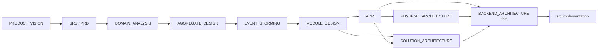

| Document | What it owns | How this BAS uses it |
|----------|--------------|----------------------|
| PRODUCT_VISION | Why the product exists; anti-goals | Constrains backend features that must not appear (no marketplace, no GIS platform core, no IoT hub) |
| SRS / PRD | Requirements and journeys | Backend APIs, jobs, and notifications must enable municipal journeys without inventing parallel domains |
| DOMAIN_ANALYSIS | Ubiquitous language | Handler, aggregate, and event names follow domain language |
| AGGREGATE_DESIGN | Aggregate roots and invariants | Domain layer and transaction boundaries in Application handlers respect aggregate ownership |
| EVENT_STORMING | Commands, events, policies, read models | CQRS commands/queries and cross-module policies mirror storming vocabulary |
| MODULE_DESIGN | Bounded contexts, contracts, schema-per-module | **Primary structural parent** for module set, Contracts, and dependency matrix |
| ADR | Binding technology decisions ADR-001..020 | BAS implements ADR decisions as concrete backend behavior |
| PHYSICAL_ARCHITECTURE | Processes, networks, storage, deploy | BAS maps physical components onto API middleware, Hangfire, SignalR, MinIO, Serilog/Seq without redefining topology |
| SOLUTION_ARCHITECTURE | Projects, folders, namespaces, DI registration shape | BAS assumes `Agriculture.Modules.*` project layout and Host composition root |

### How Backend Teams Use This Document

1. **Implementing a new command or query:** Follow Sections 3–6 for CQRS placement, Section 4 for MediatR pipeline expectations, Section 10 for controller surface, Section 21 Appendix checklist.
2. **Adding persistence:** Follow Section 8 (schema-per-module, no cross-DbContext FKs, soft delete, audit, concurrency) and MODULE_DESIGN schema ownership.
3. **Adding a background job:** Follow Section 11 and PHYSICAL_ARCHITECTURE job families; never put business rules inside Hangfire job classes.
4. **Adding realtime or push:** Follow Sections 12–13; Notifications module owns FCM/SignalR fan-out orchestration.
5. **Adding file upload:** Follow Section 14; MinIO keys owned by the owning module; dual-write consistency with SQL metadata.
6. **Debugging cross-module coupling:** Follow Section 20 and MODULE_DESIGN §4 matrix; use Contracts + events only.
7. **Security changes:** Follow Section 17 and ADR-013/014; do not invent alternate token models.

### Non-Goals of This Document

- This is **not** a tutorial on ASP.NET Core, EF Core, MediatR, or DDD.
- This is **not** a coding style guide for C# syntax (see SOLUTION_ARCHITECTURE coding conventions).
- This is **not** a physical deployment runbook (see PHYSICAL_ARCHITECTURE).
- This is **not** a substitute for AGGREGATE_DESIGN invariants or EVENT_STORMING catalogs.
- This document **does not authorize generating application source** under `src/`, `frontend/`, or `mobile/` as part of documentation workstreams; it specifies backend architecture for implementers.
- React and React Native implementation details are out of scope except as API/SignalR consumers.

### Implementation Without Modification Principle

Backend engineers SHALL treat Accepted ADRs and this Draft BAS (once promoted to Accepted by Architecture Board) as **binding**. Local “improvements” that:

- introduce shared DbContext across modules,
- allow Domain to reference Infrastructure,
- put business logic in Controllers or Hangfire jobs,
- create cross-schema foreign keys,
- bypass FluentValidation pipeline,
- or store JWTs as the sole session without refresh token persistence,

are **architectural defects**, not pragmatic shortcuts. Temporary spikes require time-boxed Architecture Board notes and must not merge to main without remediation or an Accepted ADR supersession.

---

# 1. Overall Backend Design

## 1.1 Philosophy

The Agriculture Management System backend is a **workflow-driven municipal production platform**. Its primary engineering risk is **correct encoding of sequential production rules**—task completion advancing workflow steps, inspection blocking harvest, harvest/delivery quantity constraints, season archival immutability—with **municipal auditability**. Premature horizontal scale to millions of tenants is not the primary risk.

Therefore the backend philosophy is:

1. **Correctness before distribution.** Prefer in-process Modular Monolith (ADR-001) with enforceable module boundaries over premature microservices.
2. **Domain ownership over convenience.** Each aggregate protects its invariants (AGGREGATE_DESIGN). Application handlers orchestrate; they do not become transaction scripts that ignore domain methods.
3. **Explicit write paths, optimized read paths.** CQRS (ADR-003) separates mutation from projection so dashboards and Reporting never weaken write invariants.
4. **Observable municipal operations.** Every command and job must be correlatable in Seq (ADR-011/012) with actor identity, module, and business identifiers.
5. **Extraction-ready modularity without extraction cost today.** Contracts, schema-per-module, and event policies prepare for MODULE_DESIGN §10 extraction without paying distributed-systems tax on day one.

**Municipal operational scenario — philosophy in action:** During peak planting week, officers assign workflows to hundreds of producers. The backend must accept concurrent `AssignWorkflow` and `GenerateTasks` commands without corrupting step order, emit notifications without blocking HTTP responses, and leave an audit trail sufficient for municipal oversight. A “fast CRUD service” that updates `Status` columns from controllers cannot satisfy this. A Modular Monolith with MediatR pipelines, domain aggregates, Hangfire deferred work, and SignalR dashboard refresh can.

## 1.2 Architecture Principles

### P1 — Modular Monolith as the Deployable Unit

One ASP.NET Core process (`Agriculture.Api`) hosts all business modules. Module boundaries are enforced by project references, Contracts-only cross-module coupling, schema-per-module, and Architecture.Tests—not by separate processes on day one (ADR-001, MODULE_DESIGN §2.1).

**Reasoning:** Municipal IT teams operate limited runtime footprint. One process with clear internal seams is operable, testable, and extractable later.

**Forbidden:** Deploying each `Agriculture.Modules.*` as a separate service without Architecture Board extraction gates.

### P2 — Clean Architecture Inside Every Module

Dependency direction: Domain ← Application ← Infrastructure; Host is composition root (ADR-002). Domain never references ASP.NET, EF Core, Hangfire, MinIO, FCM, or SignalR SDKs.

**Reasoning:** Agricultural invariants (inspection pass required before harvest start, delivery cannot exceed harvest remaining quantity) must survive framework upgrades and adapter swaps.

### P3 — CQRS with Shared Database Initially

Commands mutate aggregates; queries return DTOs/projections. Same SQL Server database; distinct handlers and models (ADR-003). Separate read database is deferred.

**Reasoning:** Write-critical paths (workflow advancement, harvest/delivery) need strong consistency; read-heavy dashboards need freedom to denormalize later without forcing Event Sourcing.

### P4 — MediatR as In-Process Application Bus

All controller and job entry points dispatch `ICommand`/`IQuery` through MediatR (ADR-004). Cross-cutting concerns live in pipeline behaviors, not copy-pasted handlers.

### P5 — Schema-per-Module, Identifier References Only

Single SQL Server database; schemas such as `identity`, `producers`, `lands`, `seasons`, `workflows`, `tasks`, `inspections`, `harvest`/`delivery`, `support`, `notifications`, `communication`, `reporting`, `admin` (MODULE_DESIGN §2.5, SOLUTION_ARCHITECTURE §4.15). No cross-schema foreign keys.

### P6 — Contracts for Cross-Module Synchronous Needs; Events for Reactions

Public application contracts in `Agriculture.Modules.{Name}.Contracts` for synchronous queries/commands published to other modules. Domain events → policies → commands for reactions. Integration events for cross-module published language (ADR-017).

### P7 — Controllers Are Thin

Controllers authenticate, authorize at coarse level, map HTTP to MediatR requests, and map Results to Problem Details / DTOs. No business rules in controllers (SOLUTION_ARCHITECTURE §12.2).

### P8 — Jobs Are Thin

Hangfire jobs create scopes, send MediatR commands, and let exceptions bubble for retry. Domain logic remains in Domain/Application (ADR-007).

### P9 — Security Is Layered

JWT access + opaque refresh (ADR-013); RBAC + permission policies + resource handlers (ADR-014); module-scoped permissions; secure MinIO access; secrets outside source control.

### P10 — Observability Is First-Class

Serilog structured logs to Seq; correlation IDs on every request and job; audit events for municipal accountability (ADR-011/012).

## 1.3 Design Principles

### D1 — One Aggregate Root per Transaction for Cross-Module Work

A single MediatR command handler loads and saves **one aggregate root** from its owning module as the consistency boundary, except for explicitly documented in-module dual-aggregate cases (Harvest + Delivery inside Harvest module per AGGREGATE_DESIGN / MODULE_DESIGN §6.8). Cross-module consistency is eventual via events/policies.

**Failure mode if violated:** Distributed transaction scripts across DbContexts causing partial commits and unextractable coupling.

### D2 — Invariants Live in Domain Methods

FluentValidation validates input shape and presence. Domain methods enforce business invariants. Application policies orchestrate reactions. Database constraints are a last line of defense, not the primary rule engine (ADR-019).

### D3 — Idempotency for Jobs and Integrations

Reminder, notification, and synchronization jobs must be safe to retry. Outbox / Hangfire job ids / notification delivery keys prevent duplicate side effects (PHYSICAL_ARCHITECTURE §8.6).

### D4 — Soft Delete and Audit by Default for Municipal Records

Operational entities use soft delete + audit columns + rowversion concurrency (ADR-016). Evidence objects (inspection photos) follow retention and legal-hold rules, not casual hard delete.

### D5 — Prefer Explicit Over Clever

No dynamic SQL string building for authorization; no reflection-based “generic CRUD controller”; no shared “BaseService” that bypasses MediatR. Explicit command types make Architecture.Tests and EVENT_STORMING alignment verifiable.

### D6 — Fail Closed on Authorization

Missing permission denies. Resource-based handlers fail closed when ownership cannot be proven. Silent success on unauthorized mutation is forbidden.

### D7 — Degrade Gracefully on External Dependencies

MinIO, FCM, and Seq failures must not corrupt aggregate state. Uploads may fail after metadata commit only with compensating jobs; FCM failure leaves inbox notification persisted; Seq failure falls back to local sinks (PHYSICAL_ARCHITECTURE degradation matrix).

## 1.4 Dependency Rules (Normative Summary)

Full matrix lives in MODULE_DESIGN §4 and SOLUTION_ARCHITECTURE §6. Backend-critical rules:

| From | May depend on | Must never depend on |
|------|---------------|----------------------|
| Domain | SharedKernel | Application, Infrastructure, Host, other modules’ Domain/Application/Infrastructure, ASP.NET, EF |
| Application | Domain, Application.Abstractions, own Contracts, foreign Contracts (published APIs only) | Infrastructure projects, Host, EF, Hangfire, MinIO SDKs |
| Infrastructure | Application, Domain, SharedKernel, BB Infrastructure | Other modules’ Infrastructure (except via Contracts interfaces implemented locally) |
| Contracts | SharedKernel only (DTOs/interfaces for published surface) | Domain entities, Infrastructure |
| Host (Api) | All module Infrastructure registration extensions, Application.Abstractions | Domain business logic authored in Host |

**Cross-module:** Application of Module A may reference Contracts of Module B. Never reference B’s Domain entities or B’s DbContext.

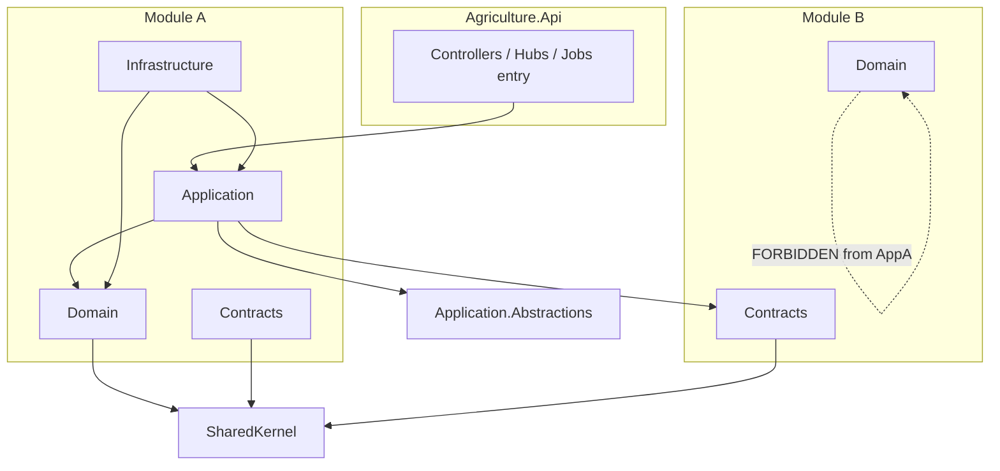

## 1.5 Scalability

Near-term scalability is **vertical scale of API + SQL Server**, with Hangfire workers sharing the process or scaled carefully, and SignalR sticky sessions or future Redis backplane (PHYSICAL_ARCHITECTURE §16, ADR-015).

Backend design contributions to scalability:

- CQRS queries use `AsNoTracking`, projection, and pagination.
- Commands are short transactions on single aggregates.
- Notifications and reminders are asynchronous via Hangfire.
- Reporting runs use dedicated queues and read-optimized projections, not OLTP aggregate graphs.
- Connection pooling and EF retry policies for transient SQL errors.
- Future Redis for hot permission catalogs and SignalR backplane without redesigning Domain.

**Municipal scenario:** Frost warning creates thousands of tasks. HTTP path creates tasks in batches; Hangfire fans out FCM; SignalR updates officer dashboards. API remains responsive because push is not synchronous in the command handler beyond outbox/enqueue.

## 1.6 Maintainability

Maintainability is achieved by:

- Predictable folder/namespace layout (SOLUTION_ARCHITECTURE §4–5).
- One place for each cross-cutting concern (MediatR behaviors).
- Module ownership of migrations and Contracts versioning.
- Architecture.Tests preventing silent coupling regressions.
- ADR-backed decisions reducing re-litigation.

**Forbidden maintainability anti-patterns:** God services, shared static helpers mutating DbContexts, copy-paste authorization checks, undocumented Hangfire jobs without owning module.

## 1.7 Extensibility

New features follow EVENT_STORMING vocabulary: Command → Domain Event → Policy → Integration Event → Read Model update. New modules follow MODULE_DESIGN catalog and SOLUTION_ARCHITECTURE Appendix C checklist. New adapters (SMS, virus scan, Redis) plug into Infrastructure without Domain changes (ports in Application.Abstractions or module Application interfaces).

## 1.8 Modularity

Thirteen business module families (Identity, Producers, Lands, Seasons, Workflows, Tasks, Inspections, Harvest including Delivery, Support, Notifications, Communication, Reporting, Administration) plus Building Blocks and Host. Harvest includes Delivery capability as nested aggregates in one module (MODULE_DESIGN §6.8)—not a separate microservice. Administration is named Administration (schema `admin`), distinct from Identity.

## 1.9 Testability

Domain is pure and unit-testable. Application handlers testable with mocked ports. Infrastructure integration tests against SQL. Architecture tests encode dependency rules. Performance tests target critical query paths. Controllers are thin enough that most logic is tested below HTTP.

## 1.10 Performance

Performance tactics are architectural, not premature micro-optimizations: pagination defaults, projections, no tracking on queries, batch job design, index ownership per module, avoid N+1 via explicit includes only when needed, streaming for large exports, future Redis for hot reads (Section 18).

## 1.11 Security

Defense in depth: TLS at edge (PHYSICAL_ARCHITECTURE), JWT validation, permission policies, resource authorization, validated uploads, MinIO private buckets with authorized access paths, PII redaction in logs, secrets in configuration providers, Data Protection for sensitive payloads at rest where required (Section 17).

## 1.12 Observability

Correlation Id middleware, Serilog enrichers (user id, tenant id, module, request name), Seq dashboards, health checks for SQL/MinIO/Hangfire/Seq, audit trail queries for municipal compliance (Sections 15–16).

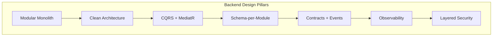

---

# 2. Clean Architecture Layers

## 2.1 Layer Overview

Each business module implements Clean Architecture as four projects (Domain, Application, Infrastructure, Contracts), consuming Shared Kernel and Application.Abstractions. Persistence is an Infrastructure concern (EF Core DbContext per module), not a separate Visual Studio project unless SOLUTION_ARCHITECTURE later splits it—behaviorally it is the Persistence facet of Infrastructure (ADR-006).

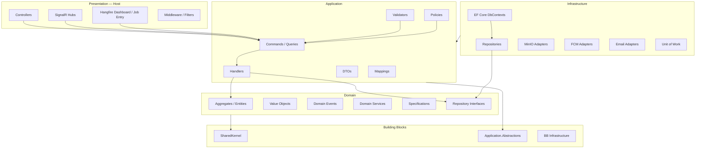

## 2.2 Presentation Layer (Host: `Agriculture.Api`)

### Responsibilities

- HTTP API Controllers (`api/v1/...`) mapping to MediatR.
- SignalR hubs for realtime dashboard updates.
- Middleware: exception handling, correlation id, authentication, rate limiting, request logging.
- Filters for model-state bridging where needed (prefer FluentValidation pipeline).
- Swagger/OpenAPI generation.
- Health check endpoints.
- Hangfire dashboard (secured) and job registration at startup.
- Composition root: `Add{Module}Module()` extensions, MediatR assembly scan, Serilog bootstrap.

### Boundaries

Presentation may reference Application abstractions and module registration extensions. Presentation **must not** contain domain invariant methods, EF queries, or direct MinIO SDK usage except thin upload controllers that still dispatch commands for persistence decisions.

### Allowed Dependencies

- `Agriculture.Application.Abstractions`
- Module Application projects (for MediatR registration / marker types) as prescribed by SOLUTION_ARCHITECTURE
- Module Infrastructure registration extensions
- ASP.NET Core, Hangfire.AspNetCore, SignalR

### Forbidden Dependencies / Practices

- Referencing module Domain entities from Controllers
- Injecting DbContext into Controllers
- Business `if` chains encoding workflow rules in Controllers
- Calling FCM from Controllers (must go Notifications Application)

### Interaction Pattern

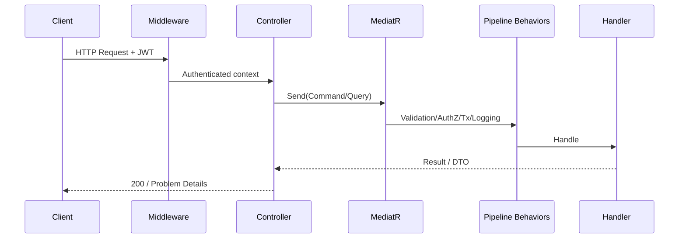

### Municipal Scenario

Officer opens season dashboard. `GET api/v1/seasons/{id}/timeline` hits Seasons query controller → MediatR query → AsNoTracking projections → DTO. Simultaneously SignalR group `season:{id}` receives task completion events. Presentation layer only routes; Seasons/Tasks own data.

### Failure Modes

| Failure | Presentation behavior |
|---------|----------------------|
| Unauthenticated | 401 via JWT middleware |
| Unauthorized | 403 via AuthorizationBehavior / policies |
| Validation | 400 Problem Details from ValidationBehavior |
| Unhandled | 500 Problem Details + Serilog error with CorrelationId |
| Downstream SQL outage | 503 from health-aware handlers / exception middleware mapping |

## 2.3 Application Layer

### Responsibilities

- Define Commands, Queries, Handlers.
- FluentValidation validators for input.
- Authorization attributes/metadata consumed by AuthorizationBehavior.
- Application policies reacting to domain/integration events (same module or via Contracts).
- DTOs and mapping from domain to API contracts (never expose entities).
- Orchestrate repository calls, domain method invocation, and port calls (file storage interfaces, notification publisher interfaces).
- Raise/map integration events after successful commit via UoW/outbox.

### Boundaries

Application depends inward on Domain and outward on ports (interfaces). Implementations of ports live in Infrastructure.

### Allowed / Forbidden

Allowed: Domain, Application.Abstractions, own/foreign Contracts, SharedKernel results/pagination.

Forbidden: EF Core, MinIO client, FirebaseAdmin, Hangfire attributes on handlers (scheduling belongs in Infrastructure/Host), HttpContext access except via `IUserContext` abstraction.

### Interaction

Handlers load aggregates via repository interfaces, call domain methods, persist via UoW behavior, dispatch domain events after success. Queries never call repository `Update` or raise domain events.

## 2.4 Domain Layer

### Responsibilities

- Aggregate roots, entities, value objects.
- Invariants and business rules as methods/guards.
- Domain events collected on aggregate roots.
- Domain services for multi-entity rules that do not fit a single aggregate (sparingly).
- Specifications for query criteria used by repositories.
- Repository interfaces (ports) owned by Domain or Application per module convention—SOLUTION_ARCHITECTURE places repository interfaces consistently; Domain owns aggregate-centric ports.

### Ownership

Module Owner owns Domain types. SharedKernel owns only truly shared primitives (`Entity`, `AggregateRoot`, `Result`, `IDomainEvent`, shared VOs like generic Money if approved—module-specific Money/Quantity stay in module).

### Forbidden

Any framework reference. Any reference to another module’s Domain. Anemic public setters that allow bypassing invariants from Application.

### Municipal Scenario — Domain Ownership

`Harvest.RegisterDelivery(quantity)` refuses when remaining quantity would go negative. Application handler does not “fix” this with an if-check around EF; it calls the domain method and maps domain exceptions/Results to application Results.

## 2.5 Infrastructure Layer

### Responsibilities

- EF Core DbContext, configurations, migrations for module schema.
- Repository implementations.
- Unit of Work / SaveChanges + domain event dispatch / outbox.
- MinIO object storage adapters.
- FCM adapters (Notifications module).
- Email adapters (future SMS).
- Hangfire job classes that send MediatR commands.
- SignalR broadcasters implementing Application ports.
- External HTTP clients for future partners.

### Boundaries

Infrastructure implements Application/Domain ports. It may use EF freely within its schema. It must not expose DbContext to other modules.

### Forbidden

- Cross-module DbContext injection
- Business workflow sequencing encoded only in SQL triggers without Domain
- Catching all exceptions and swallowing them silently

## 2.6 Persistence Facet

Persistence is not a separate Clean Architecture “ring” but a critical Infrastructure facet documented separately in Section 8 because municipal correctness depends on transaction, concurrency, soft delete, audit, and indexing strategies.

**Rules:** one DbContext per module; migrations history table per schema; optimistic concurrency via rowversion; global query filters for soft delete and optional TenantId.

## 2.7 Shared Kernel

### Responsibilities

Primitives: `Entity`, `AggregateRoot`, `AuditableEntity`, `Result`/`Error`, `IDomainEvent`, pagination types, guard helpers, common exceptions hierarchy bases, optional shared VOs approved by Board.

### Forbidden in Shared Kernel

Module entities, module enums that encode workflow states of a single context, MediatR handlers, EF configurations, DTOs for specific APIs, permission string catalogs of a single module (permission constants may live per module Contracts).

**Reasoning:** Shared Kernel dump yards destroy modularity and make extraction impossible (MODULE_DESIGN §3).

## 2.8 Building Blocks (`Application.Abstractions`, `Agriculture.Infrastructure` BB)

### Application.Abstractions

`ICommand`, `IQuery`, `IUserContext`, pipeline behavior interfaces, `IUnitOfWork`, common behaviors (Validation, Logging, Authorization, Transaction, Exception), Result mapping helpers.

### BuildingBlocks Infrastructure

Serilog enrichers shared wiring, EF interceptors shared, MinIO client factory, JWT token service helpers used by Identity Infrastructure—without containing business modules’ rules.

## 2.9 Layer Interaction Summary

| Interaction | Mechanism |
|-------------|-----------|
| HTTP → Application | MediatR send |
| Application → Domain | Method calls on aggregates |
| Application → Persistence | Repository + UoW |
| Domain → Application reaction | Domain events → handlers/policies |
| Application → other module | Contracts interface or integration event |
| Application → MinIO/FCM | Ports implemented in Infrastructure |
| Background → Application | Hangfire → scope → MediatR |
| Realtime → Clients | SignalR hubs + broadcaster ports |

## 2.10 Expanded Layer Boundary Catalog

### 2.10.1 Presentation Detailed Responsibilities

The Presentation layer is the **only** layer allowed to depend on ASP.NET Core MVC/SignalR hosting types. Its job is protocol adaptation:

1. Parse HTTP routes, headers, and multipart bodies into Application request objects.
2. Attach authentication principal already validated by middleware.
3. Dispatch via `ISender`.
4. Translate `Result` / `Result<T>` into HTTP status codes and Problem Details (ADR-018).
5. For SignalR, accept connections, place users into groups (`user:{id}`, `role:officer`, `season:{id}`), and expose hub methods that are likewise thin (prefer sending commands rather than mutating state in hub methods).
6. For Hangfire dashboard, enforce administrative authentication and network restrictions (PHYSICAL_ARCHITECTURE).

**Allowed types in Presentation:** Controllers, Hub classes, Middleware, Filters, Hosted service bootstraps, Swagger configurators, Health check registrations, DI extension calls.

**Forbidden types in Presentation:** Entities, DbContext, FluentValidation validators (validators live with Application), domain services, raw SQL.

**Municipal scenario — multiprotocol day:** An inspector completes an inspection from React Native (HTTP command). Officers watching the web dashboard receive SignalR `InspectionCompleted`. A Hangfire reminder job later notifies the producer if corrective tasks appear. Presentation hosts all three entry protocols but Application owns the meanings.

### 2.10.2 Application Detailed Responsibilities

Application is the **use-case layer**. Each use case is a command or query aligned to EVENT_STORMING.

**Command handler algorithm (normative):**

1. Authorize (usually already done by pipeline; resource checks may remain in handler via `IAuthorizationService` or domain-owned policy services).
2. Load aggregate by id from repository (or create new aggregate via factory).
3. Call domain method with primitive/VO arguments.
4. Add aggregate to repository if new.
5. Return `Result` with id or success; do not call `SaveChanges` if TransactionBehavior owns UoW (SOLUTION_ARCHITECTURE §21.2).
6. Rely on post-commit domain event dispatch for policies.

**Query handler algorithm (normative):**

1. Authorize read scope (municipality/tenant, role).
2. Build EF query with `AsNoTracking`.
3. Project to DTO in the database query (`Select`) where possible.
4. Apply pagination.
5. Return DTO; never call `SaveChanges`.

**Policies:** Application event handlers implement EVENT_STORMING purple policies, e.g., `When TaskCompleted Then AdvanceWorkflowStep`, `When InspectionFailed Then BlockHarvest`. Policies send commands to the same or other modules via Contracts—never by opening foreign DbContexts.

### 2.10.3 Domain Detailed Responsibilities

Domain is the **enterprise heart**. For each aggregate in AGGREGATE_DESIGN:

- Define the aggregate root class with private setters / controlled collections.
- Enforce invariants on every mutating method.
- Record domain events on success paths inside the aggregate.
- Provide factories for complex creation (`SeasonFactory.Create(...)`) when construction invariants are non-trivial.
- Provide specifications for reusable query predicates (`ActiveSeasonForLandSpec`) used by repositories.

**Domain services** are used when a rule naturally involves two aggregates **in the same module** and cannot cleanly sit on one root without awkwardness—still within one transaction only if MODULE_DESIGN allows. Cross-module rules are never Domain services spanning modules; they are Application policies + Contracts.

### 2.10.4 Infrastructure Detailed Responsibilities

Infrastructure translates ports to technologies:

| Port concept | Technology |
|--------------|------------|
| `IProducerRepository` | EF Core `ProducersDbContext` |
| `IObjectStorage` | MinIO SDK |
| `IPushNotificationSender` | Firebase Admin SDK |
| `IRealtimeNotifier` | SignalR `IHubContext` |
| `IEmailSender` | SMTP provider (future) |
| `IClock` / `IGuidGenerator` | System implementations (test seams) |

Infrastructure also owns **EF configurations** (`IEntityTypeConfiguration<>`), **migrations**, and **seed** for reference data that is module-owned (e.g., Administration settings keys).

### 2.10.5 Persistence vs Infrastructure Clarification

Teams sometimes propose a fifth project `*.Persistence`. SOLUTION_ARCHITECTURE allows Persistence as folders inside Infrastructure unless Board splits projects. Behaviorally:

- Persistence code must not be referenced by Application.
- Persistence must not reference other modules’ persistence.
- Naming DbContexts `{Module}DbContext` is mandatory for clarity.

### 2.10.6 Shared Kernel Expansion

Shared Kernel types are versioned carefully. Breaking changes to `Result` or `AggregateRoot` require Board review because all modules compile against them. Additive methods are preferred. Deprecations follow ADR supersession patterns.

**Allowed SharedKernel examples:** `Result`, `Error`, `PagedList<T>`, `IDomainEvent`, `BaseEntity`, `AggregateRoot`, `AuditableEntity`, `Specification<T>`, `Guard`, `Money` only if truly shared and currency rules are municipality-wide identical.

**Forbidden SharedKernel examples:** `TaskStatus` enum (Tasks module), `InspectionResult` enum (Inspections), `ProducerDto`, `JwtOptions` (Infrastructure/Identity), `HangfireJobBase`.

### 2.10.7 Building Blocks Interaction Diagram

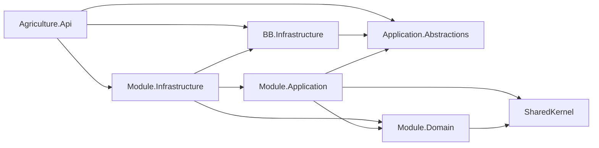

### 2.10.8 Forbidden Dependency Worked Examples

**Example A — Forbidden:** `Tasks.Application` references `Workflows.Infrastructure` to call `WorkflowsDbContext` and update step status when a task completes.

**Replacement:** Tasks raises `TaskCompleted` integration event / policy calls `IWorkflowsContract.AdvanceStepAsync(...)` implemented in Workflows.Application/Infrastructure behind Contracts.

**Example B — Forbidden:** `Harvest.Domain` references `Inspections.Contracts` to check gate status inside `StartHarvest`.

**Replacement:** Application policy or command handler in Harvest checks `IInspectionsGateContract.IsHarvestAllowed(seasonId)` before calling `harvest.Start()`, or Seasons/Workflows gate the command earlier per EVENT_STORMING.

**Example C — Forbidden:** Controller injects `IMinioClient` and writes object keys into SQL via `ProducersDbContext`.

**Replacement:** `UploadProducerPhotoCommand` validated, authorized, handler calls `IObjectStorage` + `Producer` aggregate method to record photo metadata.

### 2.10.9 Layer Testing Boundaries Preview

| Layer | Test type | Doubles |
|-------|-----------|---------|
| Domain | Unit | None or clock |
| Application | Unit | Mock repositories/ports |
| Infrastructure | Integration | Testcontainers SQL / MinIO |
| Presentation | API integration | WebApplicationFactory |
| Cross-cutting | Architecture | NetArchTest / custom |

### 2.10.10 Performance Implications of Layering

Layering does not require chatty remote calls—everything is in-process. Cost is manageable indirection. The expensive mistakes are loading full aggregate graphs for queries and chatty cross-module contract calls in tight loops. Queries should not call Contracts per row; use denormalized read models or join-free projections with cached reference data.

### 2.10.11 Security Implications of Layering

Authorization is enforced in Application pipeline so that Hangfire and future gRPC adapters cannot bypass controller-only checks. Domain remains free of principal details except when an aggregate explicitly records `CompletedByUserId` as data.

### 2.10.12 Observability Implications of Layering

LoggingBehavior wraps all MediatR requests, ensuring Host, Hangfire, and Hub entry points share one telemetry model. Infrastructure adapters log external dependency failures with dependency name and duration.

### 2.10.13 Extensibility via Ports

When SMS is introduced, add `ISmsSender` port and Infrastructure adapter; Notifications Application already routes channels. Domain unchanged. When virus scanning arrives, upload pipeline gains an Infrastructure step behind `IVirusScanner` without Controllers embedding vendor SDKs.

### 2.10.14 Module-Local Clean Architecture Completeness Checklist

For each module, Architecture Board expects:

1. Domain project compiles with zero infrastructure package references.
2. Application project has no EF package reference.
3. Infrastructure registers repositories and DbContext in `Add{Module}Module`.
4. Contracts contain only published interfaces/DTOs/events.
5. Host references Infrastructure registration, not Domain types in Controllers.

### 2.10.15 Presentation Middleware Order (Alignment)

Normative intent (SOLUTION_ARCHITECTURE §12.3 / PHYSICAL_ARCHITECTURE): Exception handling → Correlation Id → Request logging → Authentication → Authorization → Rate limiting → Endpoints. Exact order must be documented in Host `Program` comments and kept consistent with MediatR behavior expectations.

### 2.10.16 Why Persistence Is Called Out Separately

Municipal auditors ask: Who changed harvest quantities? Was soft delete used? Why did concurrent delivery fail? Those answers live in persistence strategies (audit columns, rowversion, filters). Treating Persistence as a first-class Section 8 concern prevents “EF defaults” from becoming accidental architecture.

### 2.10.17 Harvest Module Layer Note

Harvest module Domain contains both Harvest and Delivery aggregates. Application may coordinate both **in one module transaction** when MODULE_DESIGN dual-aggregate pattern applies. This is not a license for cross-module transactions.

### 2.10.18 Administration vs Identity Layer Placement

Identity Domain owns User/Role/Permission authentication aggregates. Administration Domain owns system settings, feature flags, audit export configuration. Presentation exposes both under distinct route prefixes. Confusing them creates circular features (login settings inside User aggregate)—forbidden by MODULE_DESIGN.

### 2.10.19 Reporting Layer Special Case

Reporting Application commands start report runs; Infrastructure may use read-only SQL projections across schemas **without EF navigations to foreign modules**—prefer raw SQL/views owned by Reporting schema that copy needed columns via ETL/projection jobs, or Contracts queries. Cross-schema EF entity mapping of foreign tables is forbidden.

### 2.10.20 Layer Diagram — Request with File Upload

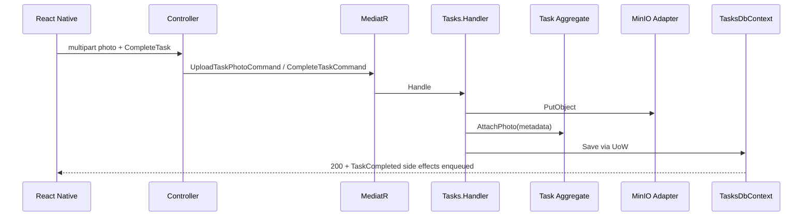

### 2.10.21 Failure Mode — Layer Leakage

If Domain references MinIO and upload fails mid-invariant, aggregates become untestable and municipal business rules become coupled to network I/O. Failures must occur at Infrastructure/Application boundary with compensating actions, not inside Domain entity methods.

### 2.10.22 Summary Table — Clean Architecture Layers

| Layer | Project(s) | Primary types | Technology allowed | Technology forbidden |
|-------|------------|---------------|--------------------|----------------------|
| Presentation | Agriculture.Api | Controllers, Hubs, Middleware | ASP.NET, Hangfire.AspNetCore | EF in controllers |
| Application | Modules.*.Application | Commands, Queries, Handlers, Validators, Policies | MediatR, FluentValidation | EF, MinIO SDK |
| Domain | Modules.*.Domain | Aggregates, VOs, Domain Events | Pure C# | All frameworks |
| Infrastructure | Modules.*.Infrastructure | DbContext, Repos, Adapters, Jobs | EF, MinIO, FCM, Hangfire | Other module DbContexts |
| Contracts | Modules.*.Contracts | Interfaces, DTOs, Integration events | SharedKernel | Domain entities |
| Shared Kernel | Agriculture.SharedKernel | Primitives | Pure C# | Module concepts |
| Abstractions | Application.Abstractions | ICommand, Behaviors, IUserContext | MediatR abstractions | EF |

---

# 3. CQRS Design

## 3.1 Intent

CQRS (ADR-003) separates the backend into **write models** (commands mutating aggregates) and **read models** (queries returning DTOs/projections). The Agriculture Management System uses CQRS **without** mandatory Event Sourcing and **without** a separate read database on day one. Both paths share SQL Server; they differ in handlers, models, validation depth, and side-effect rules.

**Reasoning:** Workflow sequencing, inspection gates, and harvest/delivery constraints are write-critical and consistency-sensitive. Dashboards, Reporting, and mobile list screens are read-heavy and benefit from projections that would be dangerous if applied as mutable aggregate shapes.

## 3.2 Commands

### Definition

A Command is an intention to change system state. Each command maps to an EVENT_STORMING blue card where applicable (`CompleteTask`, `StartHarvest`, `ApproveSupport`, `AssignRole`).

### Shape

Commands implement `ICommand` or `ICommand<TResponse>` from Application.Abstractions. They are immutable records or sealed classes with init-only properties. They carry only data needed to perform the write—ids, primitives, value descriptors—not EF entities.

### Naming

`{Verb}{Noun}Command` — `CompleteTaskCommand`, `RegisterProducerCommand`, `CreateDeliveryCommand`. Handlers: `CompleteTaskCommandHandler`.

### Side Effects

Allowed: aggregate mutation, domain events, outbox integration events, enqueue Hangfire jobs via ports, write audit via AuditableEntity.

Forbidden: returning UI view models with unrelated graphs; calling other modules’ DbContexts; silent catches.

### Transactions

One command → one primary aggregate transaction (exception: Harvest+Delivery in-module dual aggregate pattern). Cross-module effects occur after commit via policies.

### Municipal Scenario

`CompleteTaskCommand` loads Task aggregate, validates completion evidence rules in Domain, marks complete, raises `TaskCompleted`. Policy advances Workflow and may create Inspection. The command handler itself does not open WorkflowsDbContext.

## 3.3 Queries

### Definition

A Query returns data without changing state. Queries implement `IQuery<TResponse>`.

### Naming

`Get{Noun}ByIdQuery`, `List{Noun}Query`, `Search{Noun}Query`, `GetSeasonTimelineQuery`.

### Side Effects

**Forbidden:** SaveChanges, domain events, integration events, Hangfire enqueue (except explicitly audited “report run” commands which are commands, not queries), incrementing counters that affect business state.

### Performance Defaults

`AsNoTracking()`, projection to DTO in LINQ `Select`, pagination required for lists, no lazy loading reliance.

### Municipal Scenario

`ListOverdueTasksQuery` for officer dashboard uses indexed filters on due date and status, projects to `TaskListItemDto`, paginates. It must not load photo blobs from MinIO; it returns object keys or authorized URLs via a separate download path.

## 3.4 Handlers

Handlers are the Application use-case executors. One handler per command/query type. Handlers are `internal` or `public` per module convention but registered via assembly scan. Handlers depend on abstractions: repositories, `IPublisher`, Contracts, `IObjectStorage`, `IUserContext`, `IClock`.

**Handler size rule:** If a handler exceeds orchestrating load→mutate→return, extract Domain methods or Application domain services—do not grow transaction scripts.

## 3.5 Read Models and Write Models

| Aspect | Write model | Read model |
|--------|-------------|------------|
| Source of truth | Aggregate in Domain | Projection/DTO/table in module schema or reporting schema |
| Consistency | Strong in aggregate TX | Eventual OK for denormalized |
| Evolution | Protected by invariants | Can add columns/views freely |
| Consumers | Command handlers | Query handlers, SignalR payloads, Reporting |

Denormalized read models (e.g., `SeasonTimelineEntry`) are updated by policies when events occur. They must be rebuildable from events/logs where feasible for municipal recovery.

## 3.6 Validation in CQRS

Three layers (ADR-019):

1. **FluentValidation** on command/query input (required fields, ranges, formats).
2. **Application checks** (resource exists, Contracts gate).
3. **Domain invariants** (business rules).

ValidationBehavior runs FluentValidation before handlers. Domain failures map to business errors, not 500s.

## 3.7 Pipeline Behaviors (CQRS Cross-Cutting)

All commands/queries pass MediatR pipeline (Section 4): Exception, Logging, Authorization, Validation, Transaction (commands only).

## 3.8 Transactions and CQRS

- Commands: TransactionBehavior begins scope, handler runs, SaveChanges, dispatch domain events, commit.
- Queries: skip TransactionBehavior commit path; no ambient write transaction required.
- Long-running workflows are **not** held open as DB transactions across user think-time; they are state machines in Domain (Workflow/Season status).

## 3.9 Performance Considerations

- Prefer many small commands over mega-commands updating multiple modules.
- Batch administrative imports as special commands with chunking + Hangfire.
- Query endpoints must declare max page size (e.g., 100) to protect SQL.
- Avoid MediatR notification storms that synchronously do heavy work; enqueue jobs for bulk FCM.

## 3.10 Naming and Folder Structure

Per SOLUTION_ARCHITECTURE feature or classic folders:

```text
Application/
  Commands/CompleteTask/CompleteTaskCommand.cs
  Commands/CompleteTask/CompleteTaskCommandHandler.cs
  Commands/CompleteTask/CompleteTaskCommandValidator.cs
  Queries/GetTaskById/GetTaskByIdQuery.cs
  Queries/GetTaskById/GetTaskByIdQueryHandler.cs
  DTOs/TaskDto.cs
  EventHandlers/TaskCompletedPolicy.cs
```

Namespaces match folders under `Agriculture.Modules.Tasks.Application...`.

## 3.11 CQRS Anti-Patterns Rejected

1. `GetOrCreateXQuery` that writes.
2. Shared entity returned from API.
3. Command that returns full dashboard DTO requiring heavy joins—return id + let client query.
4. Generic `UpdateEntityCommand` bypassing Domain.
5. Query handler calling `Complete()` on aggregate “to refresh status.”

## 3.12 CQRS Alignment to EVENT_STORMING

Every EVENT_STORMING command becomes an Application Command type. Every read model becomes a Query + DTO or dedicated projection table. Policies become Application event handlers. External systems (FCM, MinIO) are Infrastructure adapters triggered from Application ports after events.

## 3.13 Write Path Sequence (Detailed)

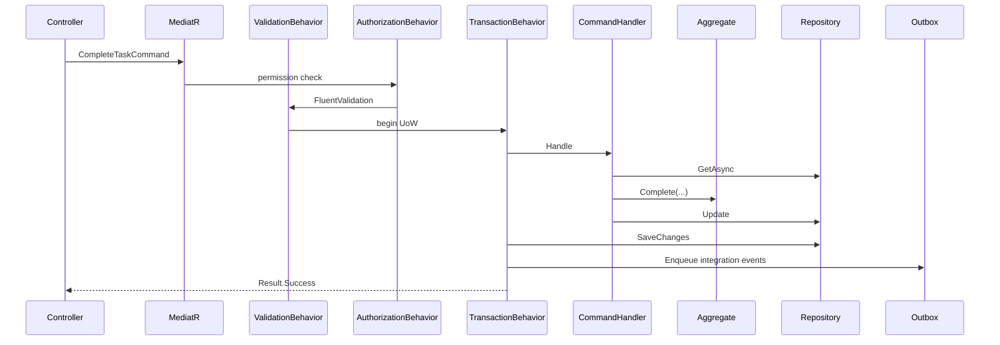

## 3.14 Read Path Sequence (Detailed)

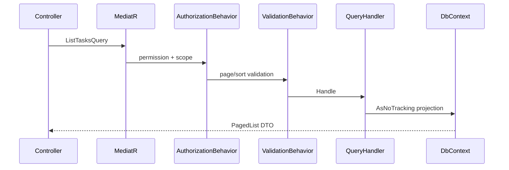

## 3.15 Result Types

Commands return `Result` or `Result<T>` (SharedKernel). Queries return DTOs directly or `Result<TDto>` when not-found should be explicit. Controllers map:

- Success → 200/201/204
- Validation → 400
- Not found → 404
- Conflict/concurrency → 409
- Business rule → 422 or 409 per ADR-018 conventions
- Forbidden → 403

## 3.16 CQRS and Idempotency

Natural keys for imports (`ExternalReferenceId`) and client-generated idempotency keys for mobile offline completion must be supported on selected commands. Handlers detect duplicate completion and return success-equivalent Results without double-advancing workflow (EVENT_STORMING mobile offline edge case in MODULE_DESIGN).

## 3.17 CQRS for Reporting

Reporting “generate report” is a **Command** that creates a ReportRun aggregate and enqueues Hangfire work. Fetching report status/results is a **Query**. Conflating them causes HTTP timeouts on large exports.

## 3.18 CQRS Folder Structure Normative Options

**Option A — Classic:** `Commands/`, `Queries/` roots.

**Option B — Vertical feature folders:** `Features/Tasks/Complete/`.

SOLUTION_ARCHITECTURE allows either per module consistency. Backend Architecture requires **one style per module**, documented in module README owned by Module Owner.

## 3.19 Cross-Module Commands

Module A never sends Module B’s internal command types directly unless published through Contracts as an interface method that Module B implements by sending its own MediatR command internally. This preserves handler pipelines and authorization inside B.

## 3.20 Query Authorization Scoping

List queries must apply tenant/municipality filters and role-based row filters in the query handler or global filters—not only in UI. A producer must never receive another producer’s tasks by manipulating query ids (fail closed).

## 3.21 Expanded Command Catalog Patterns by Module

| Module | Representative commands | Notes |
|--------|------------------------|-------|
| Identity | Login, Refresh, AssignRole | Refresh is write (token rotation) |
| Producers | RegisterProducer, DeactivateProducer | Unique identity number invariant |
| Lands | RegisterLand, ArchiveLand | Archive immutability |
| Seasons | CreateSeason, StartSeason, CompleteSeason, ArchiveSeason | Lifecycle guards |
| Workflows | PublishWorkflow, AssignWorkflow, AdvanceStep | Versioning |
| Tasks | AssignTask, CompleteTask, CancelTask | Photo evidence |
| Inspections | CreateInspection, CompleteInspection | Gate for harvest |
| Harvest | StartHarvest, CompleteHarvest, CreateDelivery, CompleteDelivery | Dual aggregate |
| Support | RequestSupport, ApproveSupport, RejectSupport | |
| Notifications | RegisterDeviceToken, MarkNotificationRead, SendNotification (internal) | |
| Communication | SendMessage, MarkThreadRead | Distinct from Notifications |
| Reporting | StartReportRun | Async |
| Administration | UpdateSystemSetting, ExportAuditLog | Feature flags |

## 3.22 Expanded Query Catalog Patterns

| Module | Representative queries |
|--------|------------------------|
| Tasks | GetTaskById, ListMyTasks, ListOverdueTasks |
| Seasons | GetSeasonTimeline, ListActiveSeasons |
| Reporting | GetReportRun, DownloadReportArtifact |
| Notifications | ListMyInbox |
| Administration | GetSystemSettings |

## 3.23 CQRS Testing Expectations

- Command handler tests assert domain method invoked and Result codes.
- Query handler tests assert SQL projection shape with integration tests.
- Architecture tests assert Queries do not reference `IUnitOfWork.SaveChanges` or repository Add/Update methods if detectable.

## 3.24 Failure Modes Specific to CQRS Misuse

| Misuse | Municipal impact | Detection |
|--------|------------------|-----------|
| Query writes status | Corrupt dashboards during refresh storms | Architecture tests + code review |
| Mega-command across modules | Partial season state | PR checklist |
| Returning entities | Accidental over-posting / cycle serialization | API review |
| Missing pagination | SQL CPU spike at season peak | Performance tests |

## 3.25 CQRS and Soft Delete

Queries exclude soft-deleted rows via global filters unless `IncludeDeleted` administrative query explicitly allowed with permission `admin.audit.read` or module equivalent.

## 3.26 CQRS and Concurrency

Commands that mutate aggregates must load with tracking, apply domain changes, and rely on rowversion. On concurrency conflict, return 409 with Problem Details; clients refresh and retry. Delivery quantity races are protected this way (MODULE_DESIGN edge case).

## 3.27 Summary

CQRS is mandatory for all business modules. Controllers never bypass it. Jobs never bypass it. Hubs should not bypass it for state changes.

---

# 4. MediatR Architecture

## 4.1 Role of MediatR

MediatR (ADR-004) is the in-process application bus. It decouples entry points (Controllers, Hubs, Hangfire jobs) from handlers and enables consistent pipeline behaviors.

## 4.2 Request/Response Flow

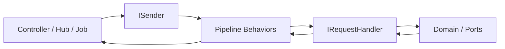

## 4.3 Pipeline Behaviors — Authoritative Order

Per SOLUTION_ARCHITECTURE §21.1 (verify against MediatR version; document actual order in Host comments):

1. **UnhandledExceptionBehavior** — outermost conversion/logging of unexpected exceptions.
2. **LoggingBehavior** — start/stop timing, structured properties.
3. **AuthorizationBehavior** — permission attributes on requests.
4. **ValidationBehavior** — FluentValidation.
5. **TransactionBehavior** — unit of work for commands only; queries skip.

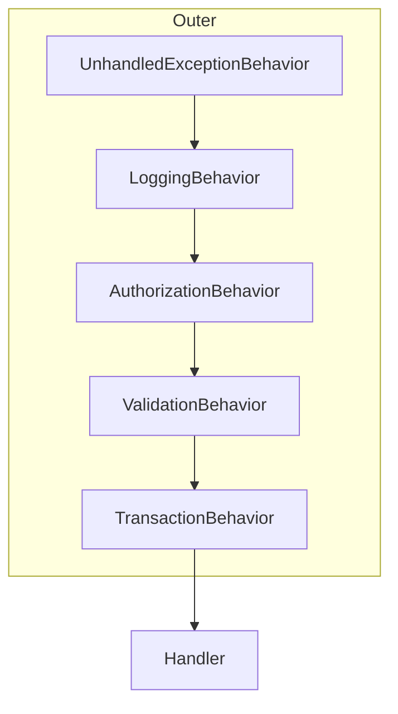

**Reasoning for order:**

- Exception behavior outermost ensures consistent logging if later behaviors throw.
- Logging wraps authorization/validation to measure full pipeline time and log auth failures.
- Authorization before validation avoids leaking validation details to unauthorized callers for sensitive resources (optional hardening; if validation is cheaper and non-sensitive, Board may document swap—but default is AuthZ then Validation as SAS).
- Validation before transaction avoids opening DB transactions for invalid input.
- Transaction innermost around handler so SaveChanges occurs after successful handle.

## 4.4 UnhandledExceptionBehavior

**Responsibilities:** Catch exceptions not converted to `Result` by handlers; log with CorrelationId; rethrow typed exceptions for middleware mapping OR convert to `Result.Failure` if the project standard prefers Result-only—**Backend Architecture aligns with ADR-018**: prefer typed exceptions for unexpected infrastructure faults and `Result` for expected business outcomes. Behavior should not swallow concurrency exceptions without mapping.

**Failure modes:** Swallowing exceptions → silent municipal data loss. Always log and rethrow or map explicitly.

## 4.5 LoggingBehavior

**Responsibilities:** Log request name, user id, tenant id, elapsed ms; enrich Serilog context; mark slow requests above threshold (e.g., 300 ms SRS average guidance from PHYSICAL_ARCHITECTURE annex).

**Forbidden:** Logging raw passwords, tokens, national ids in full—use redaction.

## 4.6 AuthorizationBehavior

**Responsibilities:** Read `[AuthorizePermission("tasks.complete")]` metadata from request; evaluate against `IUserContext` claims; fail closed; support resource-based checks when request includes resource id and handler implements `IResourceAuthorizationRequest`.

**Municipal scenario:** Producer JWT attempting `ApproveSupportCommand` fails at behavior before Support aggregate loads.

## 4.7 ValidationBehavior

**Responsibilities:** Resolve `IValidator<TRequest>` from DI; aggregate errors into ValidationException / Problem Details-compatible structure; short-circuit handler.

**Alignment:** ADR-019 FluentValidation for input; Domain still enforces invariants.

## 4.8 TransactionBehavior

**Responsibilities:** For `ICommand` requests: obtain `IUnitOfWork` for the relevant module context strategy; execute handler; `SaveChangesAsync`; dispatch domain events; commit. For queries: pass-through.

**SAS recommendation:** Handlers do not double-save. Domain event dispatch after successful SaveChanges to ensure events reflect persisted state; outbox rows written in same transaction where used.

**Multi-DbContext note:** A command must not enlist multiple module DbContexts in one business transaction. If a policy needs another module, it runs as a subsequent MediatR command after the first commits.

## 4.9 Optional FeatureFlagBehavior

May short-circuit commands when Administration maintenance mode enabled (SOLUTION_ARCHITECTURE §21.7). Registered only when Administration module present. Place outside TransactionBehavior (before Validation or after Authorization) as documented in Host.

## 4.10 MediatR Registration

Host scans all module Application assemblies via `GetModuleApplicationAssemblies()`. Open generic behaviors registered once. FluentValidation registers validators from same assemblies (Section 9).

## 4.11 Notifications vs Requests

MediatR `INotification` used for in-process domain event fan-out within constraints. Integration events may use outbox dispatcher publishing MediatR notifications or dedicated bus abstraction—ADR-017. Do not use `INotification` to create hidden cross-module coupling without Contracts DTOs.

## 4.12 Hangfire and MediatR

Jobs resolve `ISender` from scope and send commands—ensuring full pipeline runs (auth may use a system principal for job context with careful permission model).

**Job authentication model:** `IUserContext` for jobs is a service account / system user with explicit permissions, or commands are marked `[AllowSystemJob]` with Architecture Board approval. Never run jobs as the last interactive user accidentally captured in singleton.

## 4.13 SignalR and MediatR

Hub methods that change state must send commands. Hub methods that only subscribe to groups may skip MediatR. Broadcasting is Infrastructure implementing `IRealtimeNotifier`, typically called from Application event handlers after commit.

## 4.14 Performance Behavior (Optional)

A dedicated PerformanceBehavior may exist; if LoggingBehavior already times requests, avoid duplicate. Slow query logging belongs in EF interceptors too.

## 4.15 Exception Mapping Collaboration

UnhandledExceptionBehavior + global Exception Middleware collaborate: Behavior logs pipeline context; Middleware maps to Problem Details for HTTP. For Hangfire, exceptions bubble to Hangfire retry without HTTP mapping.

## 4.16 Pipeline Order Reference Card

| Order | Behavior | Commands | Queries | Notes |
|-------|----------|----------|---------|-------|
| 1 | UnhandledException | Yes | Yes | Outer |
| 2 | Logging | Yes | Yes | Timing |
| 3 | Authorization | Yes | Yes | Fail closed |
| 4 | Validation | Yes | Yes | FluentValidation |
| 5 | Transaction | Yes | No | UoW + events |

## 4.17 Worked Example — Complete Task Through Pipeline

1. Officer mobile sends HTTP POST complete with photo metadata already uploaded.
2. Controller sends `CompleteTaskCommand`.
3. Exception behavior begins try.
4. Logging begins timer.
5. Authorization confirms `tasks.complete` and resource access to task id.
6. Validation confirms TaskId present, notes length limits.
7. Transaction begins.
8. Handler loads Task, calls `Complete`, returns success.
9. SaveChanges writes Task + outbox `TaskCompletedV1`.
10. Domain events dispatched → Workflow policy sends `AdvanceStepCommand` (separate pipeline invocation).
11. Logging records 45 ms.
12. Controller returns 204.

If step 8 domain rejects missing photo evidence, Result failure maps to 422; transaction rolls back; no outbox.

## 4.18 Failure Modes

| Failure | Pipeline response |
|---------|-------------------|
| Validator missing for command | Treat as configuration error in Development; fail build via test that every ICommand has validator |
| AuthZ service throws | 500 + log; do not allow |
| SaveChanges concurrency | Map to 409; retry guidance |
| Policy command fails after commit | Compensation / retry via Hangfire; primary aggregate remains correct; monitor outbox |

## 4.19 Testing the Pipeline

Integration tests with WebApplicationFactory assert validation errors never hit SQL (via EF logging). Unit tests for behaviors with mocks. Architecture tests ensure controllers use `ISender` not handlers directly.

## 4.20 MediatR Anti-Patterns

- Injecting `IMediator` into Domain.
- Publishing notifications before SaveChanges for state that might roll back (unless intentional and documented).
- Using MediatR as a general service locator for repositories.
- Circular notification chains without termination conditions (notification storms—MODULE_DESIGN).

## 4.21 Expanded Behavior Responsibility Matrices

### UnhandledExceptionBehavior matrix

| Exception type | Action |
|----------------|--------|
| ValidationException | Rethrow for middleware 400 |
| BusinessRuleException | Rethrow for 422/409 |
| ConcurrencyException | Rethrow for 409 |
| UnauthorizedAccessException | Rethrow for 403 |
| DbUpdateException | Log + map infrastructure |
| Unknown | Log Error + 500 |

### LoggingBehavior fields

`RequestName`, `UserId`, `TenantId`, `CorrelationId`, `ElapsedMs`, `Outcome`, `Module` (parsed from request namespace).

### AuthorizationBehavior sources

Permission attributes, role claims, policy names, resource handlers registered in DI.

### ValidationBehavior sources

All `AbstractValidator<T>` in Application assemblies; include rules for pagination bounds on queries.

### TransactionBehavior sources

`IUnitOfWork` implementations per module; strategy for identifying which UoW applies when multiple registered—typically keyed by module or single ambient adapter that routes by command marker interface `ITasksCommand`.

## 4.22 Marker Interfaces for UoW Routing

```text
ICommand
ITasksModuleRequest
IHarvestModuleRequest
...
```

TransactionBehavior resolves the correct DbContext UoW using marker interfaces to avoid multi-context ambiguity.

## 4.23 Diagram — Nested Policy Command

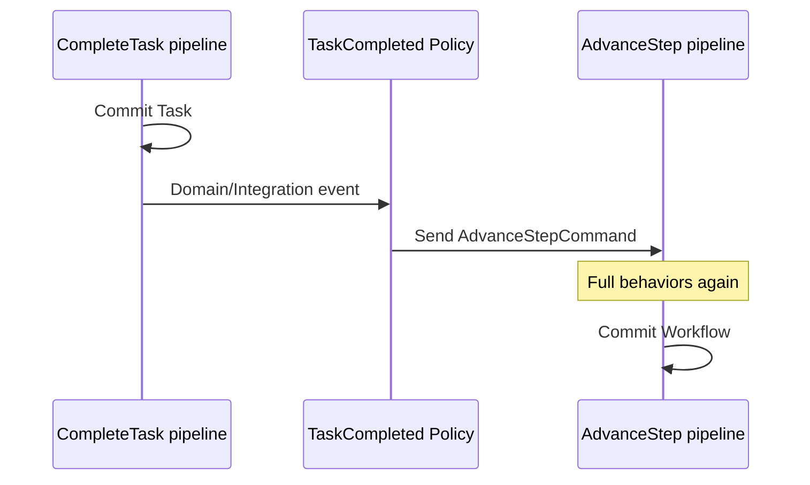

Nested sends are expected. Avoid deep synchronous chains that exceed HTTP timeout; defer heavy fan-out to Hangfire.

## 4.24 Summary

MediatR is mandatory for Application entry. Pipeline order is normative. Behaviors are the home of cross-cutting concerns.

---

# 5. Domain Layer

## 5.1 Purpose

The Domain layer encodes municipal agricultural business meaning. It is independent of delivery mechanisms. AGGREGATE_DESIGN is the authoritative catalog of aggregates; this section specifies how Domain is structured and owned in the backend.

## 5.2 Entities

Entities have identity (`Guid` preferred). They inherit `Entity` / `AuditableEntity` from SharedKernel where applicable. Equality by id. Child entities are accessed only through aggregate roots.

## 5.3 Aggregates and Aggregate Roots

Each aggregate has one root. External modules reference only root ids. Transaction boundary = aggregate (AGGREGATE_DESIGN). Catalog includes User, Producer, Land, Season, Workflow/WorkflowInstance, Task, Inspection, Harvest, Delivery, SupportRequest, Notification, Conversation, ReportRun, SystemSetting, etc., as defined in approved docs.

**Harvest includes Delivery** as dual aggregates in Harvest module—not a separate module.

## 5.4 Value Objects

Immutable, equality by value: Email, PhoneNumber, Address, QuantityWithUnit, IdentityNumber, etc. Validation of format belongs in VO constructors/factories; business combinations belong in aggregates.

## 5.5 Domain Services

Used sparingly for domain rules spanning multiple aggregates **in the same module**. Stateless regarding infrastructure. Named `{Noun}Service` or `{Noun}DomainService` to distinguish from Application services.

## 5.6 Domain Events

Implement `IDomainEvent`. Raised on aggregate methods. Collected on `AggregateRoot`. Cleared after dispatch. Examples: `TaskCompletedDomainEvent`, `InspectionCompletedDomainEvent`, `DeliveryCreatedDomainEvent`.

Naming aligns with EVENT_STORMING orange cards.

## 5.7 Factories

Complex aggregates use factories to enforce creation invariants (e.g., Season requires LandId + ProducerId + date range validity).

## 5.8 Specifications

Encapsulate query predicates for repositories (`ActiveProducerSpec`, `OverdueTaskSpec`). Keep pure; no EF includes inside specs unless using visitor patterns carefully—prefer expression-based specs.

## 5.9 Repository Interfaces

Defined for aggregate roots (`ITaskRepository`, `ISeasonRepository`). Methods express domain language (`GetActiveForProducerAsync`), not generic CRUD only—though base interfaces may exist in SharedKernel.

## 5.10 Business Rules Ownership

| Rule type | Owner |
|-----------|-------|
| Format of email | VO |
| Task cannot complete without required photo | Task aggregate |
| Harvest cannot start if inspection gate closed | Application policy + Inspections Contracts gate / Workflow rules per EVENT_STORMING |
| Delivery quantity ≤ remaining harvest | Harvest/Delivery aggregates coordination in module |
| User soft-deleted cannot login | User aggregate + Identity Application |

## 5.11 Domain Layer Forbidden Patterns

Anemic models with all public setters; domain events raised from Application without aggregate method; static clocks without `IClock` injection at Application boundary when Domain needs time, prefer passing `DateTimeOffset` into methods for purity.

## 5.12 Aggregate Concurrency

Aggregates include rowversion/version property mapped by EF. Domain may expose `Version` for Application to handle conflicts.

## 5.13 Soft Delete in Domain

`Deactivate` / `Delete` methods set flags and raise events; they do not hard-delete. Administrative hard delete is rare and permissioned separately.

## 5.14 Domain Event Catalog Discipline

When adding a domain event, update EVENT_STORMING and module Contracts if it becomes integration-worthy. Not every domain event is an integration event.

## 5.15 Municipal Scenario — Inspection Blocking

Inspection aggregate `Complete(failed)` raises `InspectionCompleted`. Policy prevents Harvest start by updating gate read model / Workflow state. Harvest `Start()` also guards on Application-provided gate check. Defense in depth: Domain may require an explicit `InspectionGateToken` value object issued by Application after Contracts check—optional pattern to keep Domain pure while preventing accidental start.

## 5.16 Domain Testing

Unit tests cover every invariant branch. No TestServer required. Use builders for aggregates.

## 5.17 Domain and Multi-Tenancy

`TenantId` on roots where municipal multi-tenant reuse applies (MODULE_DESIGN). Domain methods should not switch tenants; Application sets tenant on creation from `IUserContext`.

## 5.18 Expanded Aggregate Ownership Table (Backend View)

| Aggregate | Module | Consistency notes |
|-----------|--------|-------------------|
| User | Identity | Refresh tokens child entities |
| Producer | Producers | Land assignment invariants |
| Land | Lands | Archive immutability |
| Season | Seasons | Lifecycle + archive |
| Workflow Definition / Instance | Workflows | Step sequencing |
| Task | Tasks | Completion evidence |
| Inspection | Inspections | Immutable after complete |
| Harvest | Harvest | Quantity tracking |
| Delivery | Harvest | Cannot exceed remaining |
| SupportRequest | Support | Approval references producer id |
| Notification | Notifications | Inbox delivery state |
| Conversation | Communication | Messaging distinct from push |
| ReportRun | Reporting | Async generation |
| SystemSetting | Administration | Not secrets |

## 5.19 Domain Services vs Application Policies

If the rule is “when X happens, do Y in another module,” it is a **Policy** (Application), not Domain Service. If the rule is “within Harvest module, allocate delivery against harvest quantities,” it can be Domain Service or dual-aggregate methods on Harvest root coordinating Delivery entities as permitted by AGGREGATE_DESIGN.

## 5.20 Factories and Guarding Against Primitive Obsession

Factories accept primitives and construct VOs internally, returning `Result<TAggregate>` on failure. This keeps Controllers free of VO knowledge beyond DTOs.

## 5.21 Specification Performance Caution

Specs composed incorrectly can produce untranslatable EF expressions. Infrastructure repository authors must verify SQL translation in integration tests for critical specs.

## 5.22 Domain Events and Idempotency Keys

Events should carry enough data for consumers to be idempotent (`TaskId`, `OccurredOn`, `Sequence`/`Version`). Avoid fat events with full graphs.

## 5.23 Diagram — Aggregate Transaction Boundary

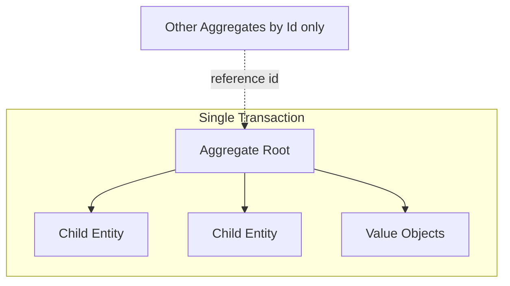

## 5.24 Failure Modes

| Failure | Result |
|---------|--------|
| Bypass Domain via EF property set in Infrastructure | Invariant corruption — forbidden; use domain methods only |
| Large aggregates with hundreds of children loaded always | Performance — use child collections carefully / split |
| Domain calling Contracts | Layer violation |

## 5.25 Summary

Domain owns business truth. Backend Application and Infrastructure exist to protect and persist that truth—not replace it.

---

# 6. Application Layer

## 6.1 Purpose

Application layer defines use cases, orchestrates Domain and ports, enforces authorization metadata, validates input, and maps to DTOs.

## 6.2 Commands and Queries

See Section 3. Application owns the types and handlers.

## 6.3 DTOs

DTOs are Application or Contracts types for API responses. They must not be Domain entities. Mapping can use manual mapping or approved mapper library—prefer explicit mapping for critical municipal fields to avoid accidental exposure.

## 6.4 Interfaces / Ports

`ITaskRepository`, `IObjectStorage`, `IPushNotificationPublisher`, `IRealtimeNotifier`, `IEmailSender`, `IInspectionsGateContract` (foreign), etc. Defined in Application or Contracts; implemented in Infrastructure.

## 6.5 Application Services

Optional facades when multiple handlers share orchestration snippets. Prefer policies and domain methods first. Avoid “Service” classes that become transaction scripts.

## 6.6 Policies

EVENT_STORMING purple policies implemented as:

- `INotificationHandler<TDomainEvent>` or
- Integration event handlers

Examples: on `TaskCompleted` → advance workflow; on `InspectionCompleted` → notify + gate harvest; on `SeasonCompleted` → archive triggers.

Policies send commands; they do not mutate foreign aggregates via DbContext.

## 6.7 Mappings

Keep mapping next to DTOs. Never map password hashes to DTOs. Never map refresh token secrets.

## 6.8 Validators

FluentValidation classes beside commands/queries. Share rule builders for pagination. Include file metadata validation (size, content type) for upload commands.

## 6.9 Authorization in Application

Permission strings like `tasks.complete`, `harvest.start`, `admin.settings.write` (SOLUTION_ARCHITECTURE naming). Resource handlers verify producer ownership / assignment.

## 6.10 Application Events

Distinct from Domain Events: Application may raise integration events after persistence. Naming `TaskCompletedV1` in Contracts.

## 6.11 User Context

`IUserContext` provides UserId, TenantId, permissions, correlation. Scoped lifetime. Jobs use system context explicitly.

## 6.12 Application Layer Folder Ownership

Module Owner. Cross-cutting behaviors live in Application.Abstractions/BB Infrastructure—not copied per module.

## 6.13 Municipal Scenario — Approve Support

`ApproveSupportCommand` validates, authorizes officer permission, loads SupportRequest, calls `Approve`, persists, raises event; Notifications policy sends push to producer; Producers may record support history via Contracts—not by writing ProducersDbContext from Support Infrastructure.

## 6.14 Failure Modes

| Failure | Mitigation |
|---------|------------|
| Fat handlers | Refactor to Domain |
| Policy infinite loops | Event version guards + ignore rules |
| DTO overexposure | Explicit maps + review |

## 6.15 Application Testing

Unit test handlers with mocked ports. Assert Contracts called with expected ids. Assert no SaveChanges if UoW behavior owns it—verify via UoW mock.

## 6.16 Expanded Policy Catalog (Representative)

| Trigger event | Policy action |
|---------------|---------------|
| ProducerRegistered | Notify admins; prepare onboarding tasks optional |
| WorkflowAssigned | GenerateTasks command |
| TaskCompleted | AdvanceWorkflowStep; maybe CreateInspection |
| InspectionCompleted (fail) | Create corrective Task; block harvest gate |
| HarvestCompleted | Allow deliveries; notify logistics roles |
| DeliveryCompleted | Update season progress read model |
| SeasonCompleted | Schedule archive job |
| SupportApproved | Notify producer; write history via Contracts |

## 6.17 Application Error Model

Handlers return `Result` with typed `Error` codes (`Tasks.NotFound`, `Harvest.QuantityExceeded`). Controllers map codes to HTTP. Consistency of error codes documented in Appendix.

## 6.18 Mapping Integration Events

After commit, outbox processor publishes integration events. Application defines mapping from domain events to integration events in Infrastructure or Application mapping classes—Board prefers mapping in Application to keep Contracts language close to use cases, with Infrastructure only serializing/transporting.

## 6.19 Parallel Command Execution

Do not parallelize multiple commands mutating related aggregates without careful concurrency design. Prefer sequential policy commands. Parallelize only independent notifications.

## 6.20 Diagram — Application Inside Module

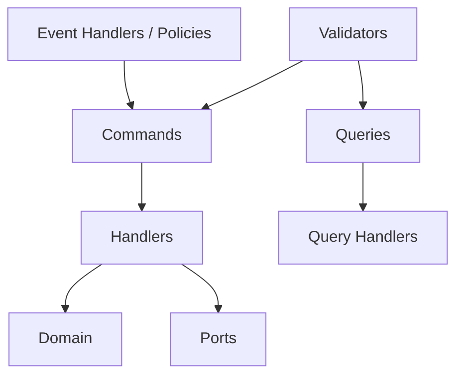

## 6.21 Summary

Application is the choreography layer: explicit, testable, free of framework SDKs, aligned to EVENT_STORMING.

---

# 7. Infrastructure Layer

## 7.1 Purpose

Infrastructure adapts Application/Domain ports to SQL Server, MinIO, Firebase, SignalR, Hangfire, email/SMS, and future Redis. It is where technology lives—and where technology must be prevented from leaking upward.

## 7.2 EF Core

Each module owns `{Module}DbContext` with schema mapping (ADR-006). Configurations use Fluent API. No lazy loading proxies by default (prevent N+1 surprises). Explicit includes in repositories when needed for writes.

**Retry:** Enable transient fault retry in Production.

**Naming:** Tables plural or singular per solution convention—be consistent per MODULE_DESIGN coding conventions in SAS.

## 7.3 Persistence Implementations

Repositories implement domain ports using DbContext. They translate specifications to LINQ. They must not contain business workflow rules (e.g., “if inspection failed, create task”)—that belongs in policies.

## 7.4 Unit of Work

`IUnitOfWork` abstracts `SaveChangesAsync` and domain event dispatch. TransactionBehavior uses it. Outbox integration writes outbox rows in the same SaveChanges when enabled.

## 7.5 MinIO Adapters

Implement `IObjectStorage`: put, get, delete, presign. Bucket catalog per SOLUTION_ARCHITECTURE / PHYSICAL_ARCHITECTURE. Object keys hierarchical: `{module}/{aggregate}/{id}/{filename}`. Metadata stored in SQL; bytes in MinIO.

## 7.6 Firebase / FCM Adapters

Notifications Infrastructure sends pushes via Firebase Admin SDK. Map failures to retryable exceptions for Hangfire. Invalid tokens marked inactive via command.

## 7.7 SignalR Adapters

`IRealtimeNotifier` uses `IHubContext<THub>` to push to groups. Must not be called before commit for state that might roll back—call from event handlers after persistence.

## 7.8 Hangfire Job Classes

Thin classes in Infrastructure/Jobs: create scope, send MediatR command, finish. Schedules registered at Host startup. Queues: `default`, `notifications`, `reports`, `maintenance` (PHYSICAL_ARCHITECTURE).

## 7.9 Email and SMS (Future)

Ports exist early if needed; adapters can be no-op or logging stubs in Development. Production adapters use municipal SMTP / SMS gateway. Same Notifications channel routing patterns.

## 7.10 Caching (Future Redis)

ADR-015: memory/hybrid now; Redis later for SignalR backplane and hot read models. Infrastructure implements `ICache` without Domain awareness of Redis.

## 7.11 External Services

Future partner APIs wrapped behind ports with timeouts, circuit breakers (PHYSICAL_ARCHITECTURE), and correlation propagation.

## 7.12 Infrastructure Registration

Each module exposes `Add{Module}Module(IServiceCollection, IConfiguration)`. Registers DbContext, repositories, adapters, health checks contributions.

## 7.13 Forbidden Infrastructure Practices

- Referencing other module Infrastructure projects
- Exposing DbContext publicly outside assembly
- Running raw SQL that updates foreign schemas
- Embedding JWT secrets in code
- Catch-all `catch (Exception) { return null; }`

## 7.14 Municipal Scenario — Photo Upload Adapter Path

Tasks Infrastructure MinIO adapter stores evidence; SQL stores content type, size, hash, object key. If MinIO succeeds and SQL fails, compensating delete job runs. If SQL succeeds and MinIO fails, command fails and no orphan metadata (order: validate → store object → commit metadata, or use upload session pattern in Section 14).

## 7.15 Diagram — Infrastructure Adapters

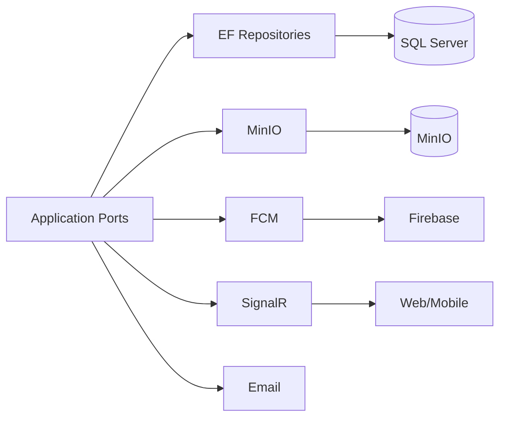

## 7.16 EF Configurations Ownership

Each entity configuration lives in Infrastructure `Persistence/Configurations`. Soft delete, rowversion, indexes declared here. Domain remains unaware of column types beyond necessary.

## 7.17 Migrations

Owned by module Infrastructure. History table in module schema. CI applies migrations as controlled release step (SAS §15.3). Never auto-migrate Production on API startup.

## 7.18 Hangfire Storage

Hangfire tables in `hangfire` schema or dbo as Host concern—not inside business module schemas (SOLUTION_ARCHITECTURE §4.15).

## 7.19 Health Checks from Infrastructure

Modules contribute checks: DbContext can connect; MinIO head bucket; FCM credentials present (not live push each time).

## 7.20 Time and Randomness

`IClock`, `IGuidGenerator` implemented in BB Infrastructure for testability.

## 7.21 Infrastructure Testing

Integration tests with Testcontainers for SQL and MinIO. Contract tests for FCM adapters with fakes. Verify retry semantics.

## 7.22 Expanded Adapter Failure Mapping

| Adapter | Transient failure | Permanent failure |
|---------|-------------------|-------------------|
| SQL | Retry EF policy | Alert ops |
| MinIO | Retry with backoff | Fail command / compensate |
| FCM | Hangfire retry | Disable token |
| SMTP | Retry | Dead letter + inbox still stored |
| SignalR | Log; client reconnects | N/A |

## 7.23 Security in Infrastructure

Connection strings from configuration; MinIO keys from secrets; FCM service account JSON from secret store; no secrets in Serilog.

## 7.24 Performance in Infrastructure

Compiled queries optional for hot paths; bulk extensions for administrative imports; avoid tracking in query repositories.

## 7.25 Dual Persistence Caution

When SQL and MinIO both involved, document ordering and compensation in Section 14. Infrastructure must expose operations that Application can compose safely.

## 7.26 SignalR Scaling Adapter Notes

Single node: in-memory. Multi-node: Redis backplane configuration in Host; adapter code unchanged (PHYSICAL_ARCHITECTURE §16).

## 7.27 Email Template Rendering

If templates required, Infrastructure renders from template ids + tokens; content approved by municipality; Application supplies template key and data dictionary only.

## 7.28 SMS Future Hook

`ISmsSender.SendAsync(phone, templateKey, data)` — same Notifications orchestration.

## 7.29 Caching Adapter Rules

Never cache aggregates for writes. Cache permission catalogs and reference data with explicit TTLs and invalidation on Administration/Identity events.

## 7.30 Summary

Infrastructure is replaceable technology. Ports keep Domain/Application stable when MinIO becomes S3 or FCM vendor changes.

---

# 8. Persistence

## 8.1 DbContext Strategy

- One DbContext per business module.
- Single SQL Server database.
- Schema-per-module.
- Connection string name `AgricultureDatabase` (SAS).
- `MigrationsHistoryTable("__EFMigrationsHistory", schema: "{module}")`.

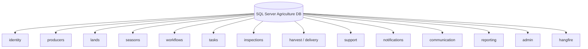

## 8.2 Module Separation

No cross-schema foreign keys. References by GUID. Reporting projections may copy data into `reporting` schema via jobs—not live EF navigations across modules.

## 8.3 Migrations

Module Owner applies migrations in order during release. Breaking changes require expand-contract patterns for zero-downtime where municipal uptime requires it.

## 8.4 Transactions

Ambient transactions via TransactionBehavior + EF. Avoid `TransactionScope` across modules. Explicit transactions only inside Infrastructure when multiple SaveChanges in one module command are required (rare).

## 8.5 Optimistic Concurrency

`rowversion` / `IsRowVersion` on aggregates (ADR-016). On conflict, throw concurrency exception → 409 Problem Details. Critical for Delivery quantity and Workflow step advancement.

## 8.6 Indexes

Owned by module; representative indexes in MODULE_DESIGN / SAS. Examples: Tasks (AssigneeId, Status, DueDate), Seasons (Status, LandId), Notifications (UserId, CreatedAt). Index changes go through PR with query plan notes for hot paths.

## 8.7 Soft Delete

Global query filter `!IsDeleted`. Administrative queries bypass with explicit permission. Soft-deleted producers cannot be assigned new seasons (Domain + Application checks).

## 8.8 Audit

`CreatedAt`, `CreatedBy`, `UpdatedAt`, `UpdatedBy` on AuditableEntity. Municipal audit exports via Administration jobs reading audit fields + audit tables if present.

## 8.9 Global Query Filters

Soft delete + optional TenantId filters. Beware filters interacting with `IgnoreQueryFilters`—only in authorized administrative handlers.

## 8.10 Performance

- AsNoTracking for queries
- Projection
- Avoid SELECT *
- Appropriate indexes
- Partitioning planned later for large history tables (ADR-016)
- Connection pooling monitored

## 8.11 Outbox Tables

Per-module outbox preferred for integration events. Processor publishes after commit. Idempotent consumers.

## 8.12 Read Model Tables

Denormalized tables updated by policies. Rebuild scripts for disaster recovery.

## 8.13 Harvest/Delivery Schema Note

`harvest` and `delivery` schemas may both be owned by HarvestDbContext (SAS §4.15). Still no FKs to other modules.

## 8.14 Persistence Failure Modes

| Failure | Impact | Recovery |
|---------|--------|----------|
| Migration mismatch | API boot fail / runtime errors | Fix forward migration |
| Filter disabled accidentally | Soft-deleted data leaks | Architecture tests |
| Missing rowversion | Silent lost updates on delivery | Code review gate |
| Cross-schema FK added | Extraction broken | Architecture Board reject |

## 8.15 Municipal Scenario — Concurrent Deliveries

Two officers register deliveries against same harvest remaining quantity. Optimistic concurrency ensures one SaveChanges fails; client retries with refreshed remaining quantity; Domain refuses over-allocation.

## 8.16 Persistence Diagram — Command Save

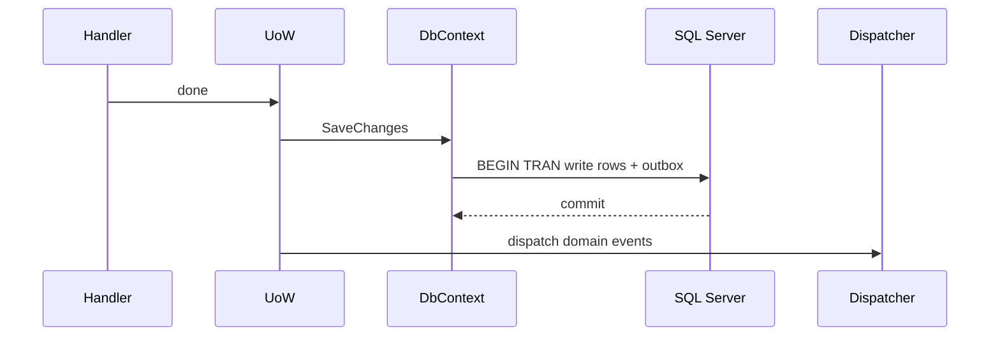

## 8.17 Soft Delete vs Legal Hold

Evidence under legal hold must not be purged by cleanup jobs even if soft-deleted (PHYSICAL_ARCHITECTURE / MODULE_DESIGN edge cases). Persistence flags `LegalHold` override retention jobs.

## 8.18 Multi-Tenant Column Strategy

`TenantId` on roots; repository enforces; query filters apply. Schema-per-tenant deferred.

## 8.19 Backup Alignment

Persistence design assumes SQL backups are primary DR for relational data; MinIO versioning for objects (PHYSICAL_ARCHITECTURE). Do not store only copies of critical evidence in one store without backup policy.

## 8.20 EF Migration Ownership Table

| Module | Schema | DbContext |
|--------|--------|-----------|
| Identity | identity | IdentityDbContext |
| Producers | producers | ProducersDbContext |
| Lands | lands | LandsDbContext |
| Seasons | seasons | SeasonsDbContext |
| Workflows | workflows | WorkflowsDbContext |
| Tasks | tasks | TasksDbContext |
| Inspections | inspections | InspectionsDbContext |
| Harvest | harvest, delivery | HarvestDbContext |
| Support | support | SupportDbContext |
| Notifications | notifications | NotificationsDbContext |
| Communication | communication | CommunicationDbContext |
| Reporting | reporting | ReportingDbContext |
| Administration | admin | AdministrationDbContext |

## 8.21 Persistence Coding Rules

- No database logic as substitute for Domain (triggers that advance workflow—forbidden as sole implementation).
- Constraints welcome as safety net (unique email) but Domain still validates.
- Use UTC for all timestamps.

## 8.22 Streaming and Large Results

Exports use paging or streaming writers in Reporting Infrastructure; never load entire season photo metadata set into memory without chunking.

## 8.23 Persistence Testing

Integration tests verify filters, concurrency tokens, indexes existence via metadata, migration applies cleanly on empty database.

## 8.24 Summary

Persistence protects municipal integrity: schemas, concurrency, audit, soft delete, outbox, and performance tactics are mandatory—not optional EF defaults.

---

# 9. Dependency Injection

## 9.1 Composition Root

`Agriculture.Api` is the sole composition root (ADR-001/002). `Program` calls module registration extensions in deterministic order.

## 9.2 Module Registration Strategy

```text
services.AddSharedKernel();
services.AddApplicationAbstractions();
services.AddBuildingBlocksInfrastructure(config);
services.AddIdentityModule(config);
...
services.AddAdministrationModule(config);
services.AddMediatRPipelines();
services.AddHangfireAgriculture(config);
services.AddSignalRAgriculture(config);
```

Exact method names follow SAS. Modules must be self-contained registrations.

## 9.3 Assembly Scanning

MediatR scans Application assemblies. FluentValidation scans same. Repositories registered explicitly or by convention within module—prefer explicit for clarity in municipal audits of DI graphs.

## 9.4 Lifetimes

| Service | Lifetime |
|---------|----------|
| DbContext | Scoped |
| Repositories | Scoped |
| Handlers | Transient (MediatR default) |
| Behaviors | Transient/Scoped per MediatR needs |
| IUserContext | Scoped |
| MinIO client factory | Singleton with transient operations |
| Hub broadcasters | Scoped |
| Options | Singleton IOptions |

## 9.5 Captive Dependency Watch List

Per SAS §21.6: Singleton depending on DbContext forbidden; Singleton IUserContext forbidden; validators capturing scoped ACL carefully.

## 9.6 Open Generics

Register `IPipelineBehavior<,>` open generics once. Register `IValidator<>` via assembly scan.

## 9.7 Validation + MediatR Registration

Order: register validators before building provider; MediatR behaviors registered in authoritative order (Section 4).

## 9.8 Hangfire Scope

Jobs use `IServiceScopeFactory.CreateScope()` every execution (SAS §21.5).

## 9.9 SignalR DI

Hubs injected with services carefully; prefer sending MediatR; inject `ISender` scoped per Hub connection context as supported by ASP.NET.

## 9.10 Feature Flags

Administration settings injected via `IOptionsMonitor` or Contracts query with caching—avoid reading DbContext in singleton options factories without refresh strategy.

## 9.11 Diagram — DI Registration Flow

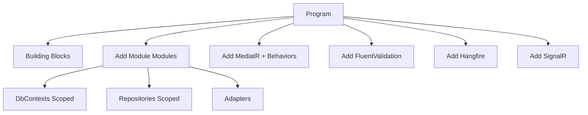

## 9.12 Testing and DI

Tests may use custom composition for unit tests; integration tests use Host builder with Testcontainers. Never copy Production secrets into tests.

## 9.13 Module Registration Completeness Checklist

For each module: DbContext, repos, adapters, health checks, MediatR assembly included, validators included, Contracts implementations registered if module provides Contracts to others.

## 9.14 Failure Modes

| Failure | Symptom |
|---------|---------|
| Forgot assembly in MediatR scan | 500 handler not found |
| Captive dependency | Cross-request user bleed |
| Multiple UoW without markers | Wrong schema SaveChanges |

## 9.15 Summary

DI is governed, explicit, and module-centric. Program.cs remains thin orchestration.

---

# 10. API Layer

## 10.1 Controllers

MVC Controllers (SAS decision vs Minimal APIs). Thin: map HTTP ↔ MediatR. Route patterns `api/v1/{resource}` per SAS §22.1. Delivery routes under `api/v1/deliveries` even though module is Harvest.

## 10.2 Versioning

URL versioning `v1`. Breaking changes require `v2` and ADR if contract breaks municipal clients. Additive fields preferred.

## 10.3 Swagger / OpenAPI

Enabled in Development/Staging; Production optionally behind admin auth. Tags per module. Security scheme JWT bearer.

## 10.4 Filters

Prefer pipeline validation over action filters. Exception filter only if middleware not used—ADR-018 prefers global middleware.

## 10.5 Middlewares

Correlation Id, Exception → Problem Details, Authentication, Authorization, Rate Limiting, Request Logging. Order documented in Host.

## 10.6 Problem Details

RFC 7807 responses with `type`, `title`, `status`, `detail`, `traceId`/`correlationId`, `errors` for validation, `errorCode` for business errors (ADR-018).

## 10.7 Health Checks

`/health/live`, `/health/ready` distinguishing process vs dependencies (SQL, MinIO, Hangfire storage). Used by orchestrators (PHYSICAL_ARCHITECTURE).

## 10.8 AuthN / AuthZ

JWT bearer authentication. Policies map to permissions. `[Authorize]` on controllers plus Application AuthorizationBehavior defense in depth.

## 10.9 Rate Limiting

Protect login, refresh, upload endpoints (PHYSICAL_ARCHITECTURE). Partition by IP + user id where authenticated.

## 10.10 Request/Response/Error Standards

- JSON camelCase
- UTC timestamps ISO-8601
- Pagination query params `page`, `pageSize`, `sort`
- 201 with Location header on creates where applicable
- No stack traces in Production Problem Details

## 10.11 File Upload Endpoints

Multipart endpoints dispatch upload commands; size limits configured in Host Kestrel/FormOptions aligning Section 14.

## 10.12 SignalR Endpoints

Map hubs under `/hubs/...` with JWT auth.

## 10.13 Hangfire Dashboard

Mapped under admin path with restricted auth and network rules.

## 10.14 API Anti-Patterns

Fat controllers; returning entities; catching exceptions per action; bypassing MediatR; ad-hoc XML.

## 10.15 Municipal Scenario — Officer API Day

Login → refresh rotation → list overdue tasks → open task → complete with photo → dashboard SignalR update. All REST commands versioned and audited.

## 10.16 Diagram — Middleware Pipeline

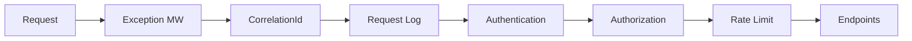

## 10.17 Controller Skeleton Rules

Inject `ISender` only (plus maybe `ILogger`). No DbContext. Map cancellation tokens. Use `CancellationToken` on all async actions.

## 10.18 OpenAPI Tagging

Tags: Identity, Producers, Lands, Seasons, Workflows, Tasks, Inspections, Harvest, Delivery, Support, Notifications, Communication, Reporting, Administration.

## 10.19 Error Response Shape Example (Normative Fields)

`correlationId`, `errorCode`, `title`, `detail`, `errors[]` with `field` and `message`.

## 10.20 API Performance Headers

Optional timing headers only in non-Production or behind flag—avoid leaking internals.

## 10.21 CORS

Configured for React origin; not wildcards in Production (PHYSICAL_ARCHITECTURE).

## 10.22 API Testing

WebApplicationFactory tests for auth, validation, pagination, problem details shape.

## 10.23 Expanded Route Catalog Reasoning

Routes mirror ubiquitous language. `Complete` as POST sub-resource actions (`POST tasks/{id}/complete`) rather than PATCH status enums—aligns with command names and prevents arbitrary status writes.

## 10.24 Idempotency Keys Header

Optional `Idempotency-Key` for mobile offline completion endpoints; Application stores key hash per user to deduplicate.

## 10.25 Summary

API layer is a disciplined protocol adapter over MediatR—never a business rules home.

---

# 11. Background Jobs

## 11.1 Purpose

Hangfire (ADR-007) executes deferred and recurring work: reminders, notifications, archive, retry, cleanup, synchronization, health-related maintenance.

## 11.2 Job Categories

| Category | Examples | Queue |
|----------|----------|-------|
| Reminder | Overdue task reminders | notifications |
| Notification | FCM fan-out batches | notifications |
| Archive | Season archive after complete | maintenance |
| Retry | Outbox republish, failed push | default/notifications |
| Cleanup | Temp uploads, expired tokens | maintenance |
| Synchronization | Reporting projection rebuild | reports |
| Health | Synthetic checks optional | maintenance |

## 11.3 Scheduling

Recurring jobs registered at startup with CRON in configuration. Season peak may adjust reminder frequency via Administration settings—jobs read settings each run.

## 11.4 Retries and Failure Recovery

Hangfire automatic retries with backoff (PHYSICAL_ARCHITECTURE). Poison messages after N attempts → alert + dashboard inspection. Jobs idempotent.

## 11.5 Job Implementation Pattern

1. Create DI scope
2. Resolve ISender
3. Send command
4. Dispose scope
5. Let exceptions bubble

## 11.6 Forbidden

Business invariants only in job code; using singleton DbContext; calling FCM without Notifications module commands; unbounded fan-out without batching.

## 11.7 Municipal Scenario — Reminder Storm

Frost tasks overdue for 500 producers. Recurring job enqueues batched `SendOverdueReminderCommand` chunks of 50 with delays to protect FCM and SQL (MODULE_DESIGN notification storms).

## 11.8 Diagram — Hangfire to Domain

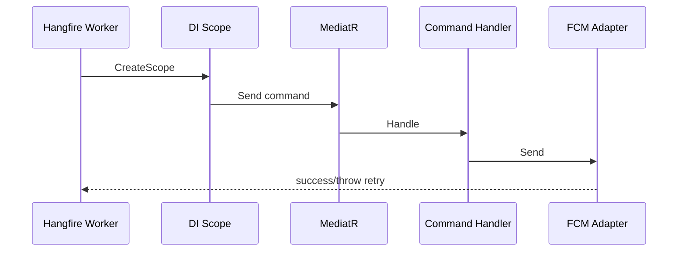

## 11.9 Continuations and Batches

Use Hangfire batches for report generation steps; continuations for cleanup after archive. Document in module Jobs folder.

## 11.10 Dashboard Security

Admin-only; not public internet without VPN (PHYSICAL_ARCHITECTURE).

## 11.11 Interaction with Domain Correctness

Jobs never “fix” data by SQL update. Example: auto-cancel tasks must go through `CancelTaskCommand` respecting invariants.

## 11.12 Outbox vs Hangfire

Outbox ensures reliable publish after commit; Hangfire may process outbox or send notifications. Do not double-send without idempotency keys (PHYSICAL_ARCHITECTURE S8.3).

## 11.13 Job Catalog Expansion

| Job | Module | Command sent | Schedule |
|-----|--------|--------------|----------|
| OverdueTaskSweep | Tasks | MarkOverdue / EnqueueReminders | every 15m |
| RefreshTokenCleanup | Identity | PurgeExpiredRefreshTokens | daily |
| SeasonArchive | Seasons | ArchiveSeason | daily |
| TempUploadCleanup | Tasks/Inspections | CleanupTempObjects | hourly |
| OutboxDispatch | each / host | DispatchOutbox | continuous/frequent |
| ReportRunner | Reporting | ExecuteReportRun | on-demand + queue |
| ProjectionRebuild | Reporting | RebuildSeasonStats | weekly / manual |
| NotificationRetry | Notifications | RetryFailedDeliveries | every 5m |
| HealthSynthetic | Host | optional | 1m |

## 11.14 Cancellation and Shutdown

Jobs respect cancellation tokens for graceful Host shutdown. Long reports checkpoint progress on ReportRun aggregate.

## 11.15 Observability

Serilog enrich Hangfire JobId, Attempt, Queue. Correlate with business ids in command logs.

## 11.16 Failure Modes

| Failure | Recovery |
|---------|----------|
| FCM down | Retry; inbox still has message |
| SQL down | Hangfire retries; API health not ready |
| Poison job | Manual replay after fix |
| Duplicate reminders | Idempotency key per task/day |

## 11.17 Testing Jobs

Unit test that job sends expected command. Integration test Hangfire storage optional; prefer testing commands thoroughly.

## 11.18 Scaling Workers

Additional workers share SQL storage; ensure idempotency. Avoid duplicate recurring registration across nodes via Hangfire’s built-in distributed locks.

## 11.19 Summary

Hangfire is an asynchronous backbone for municipal scale events—thin, idempotent, observable, Domain-respecting.

---

# 12. SignalR

## 12.1 Purpose

SignalR (ADR-008) delivers realtime updates to React web dashboards and React Native clients for operational awareness: task completions, inspection results, season progress, notification badges. It is not a substitute for push notification delivery when the app is backgrounded—that is FCM (Section 13).

## 12.2 Connections

Clients connect to `/hubs/operations` (name illustrative; SAS hub structure authoritative). JWT access token provided via query string or header per ASP.NET SignalR auth patterns; tokens validated identically to HTTP API.

**Connection lifetime:** Clients reconnect automatically; server must tolerate duplicate joins.

## 12.3 Groups

| Group pattern | Purpose |
|---------------|---------|
| `user:{userId}` | Personal notifications / badge |
| `role:officer` | Officer broadcast |
| `season:{seasonId}` | Season dashboard |
| `municipality:{tenantId}` | Tenant-wide operational feed |

Group membership assigned on connect based on claims and authorized resource access. Users must not join arbitrary season groups without authorization check.

## 12.4 Authentication and Authorization

Unauthenticated connections rejected. Hub methods that subscribe to season groups verify permission `seasons.read` and access to that season id. Prefer server-side group management over trusting client-sent group names blindly.

## 12.5 Reconnection

Clients rejoin groups after reconnect. Server may optionally replay recent events from a short buffer—optional; clients can also refresh via HTTP queries on reconnect (recommended simplicity for v1).

## 12.6 Message Flow

```mermaid
sequenceDiagram
  participant App as Application Policy
  participant N as IRealtimeNotifier
  participant Hub as HubContext
  participant Web as React Client
  App->>N: TaskCompletedDto
  N->>Hub: Clients.Group(season:id).SendAsync
  Hub->>Web: TaskCompleted
  Web->>Web: Update dashboard query cache
```

Broadcast **after** successful persistence. Payload is DTO, not entity. Keep payloads small; clients fetch details via queries if needed.

## 12.7 Scaling

Single node: in-memory. Multi-node API: Redis backplane (ADR-015 future) or sticky sessions at reverse proxy (PHYSICAL_ARCHITECTURE §16.3). Backend Architecture requires adapters not to assume single-node affinity for correctness—only for performance.

## 12.8 Hubs vs Commands

State-changing hub methods forbidden without MediatR command. Prefer HTTP for writes; SignalR for pushes.

## 12.9 Failure Modes

| Failure | User impact | Mitigation |
|---------|-------------|------------|
| Hub disconnect | Stale dashboard until reconnect | Client refresh on reconnect |
| Backplane down | Multi-node missed messages | Health alert; fall back sticky |
| Over-broadcast | UI jank | Throttle; send ids only |
| Unauthorized group join | Data leak | Server-side authZ |

## 12.10 Municipal Scenario

During inspection day, officers watch season hub. Each inspection completion updates a kanban column in near realtime while producers receive FCM separately.

## 12.11 Security Considerations

Do not put PII beyond need in broadcast payloads. Do not send tokens. Audit unusual subscription patterns if required.

## 12.12 Testing

Unit test broadcaster with mock HubContext. Integration test auth on hub connect with WebApplicationFactory where feasible.

## 12.13 Expanded Hub Method Conventions

- `JoinSeason(Guid seasonId)`
- `LeaveSeason(Guid seasonId)`
- Server events: `TaskCompleted`, `InspectionCompleted`, `HarvestProgressUpdated`, `NotificationCreated`

## 12.14 Backpressure

If officers leave dashboards open overnight generating noise, consider server-side rate limits per connection for join/leave chatter.

## 12.15 Summary

SignalR is realtime projection transport—authorized, small-payload, post-commit, scale-aware.

---

# 13. Notifications Architecture

## 13.1 Channels

| Channel | Technology | Owner |
|---------|------------|-------|
| Push | FCM | Notifications module |
| Realtime | SignalR | Notifications + Host hubs |
| System / Inbox | SQL notifications schema | Notifications module |
| Reminder | Hangfire → Notifications commands | Tasks/Seasons + Notifications |
| Workflow | Policies enqueue notifications | Workflows/Tasks/Inspections |

Communication module is **messaging threads**, not push (MODULE_DESIGN distinction).

## 13.2 Dual-Channel Model

When a task is assigned: persist inbox notification (source of truth for UX), send FCM for mobile wake-up, send SignalR for online officers/producers. FCM failure must not delete inbox row (PHYSICAL_ARCHITECTURE).

## 13.3 Architecture Flow

```mermaid
flowchart TB
  Event[Domain/Integration Event]
  Policy[Policy Handler]
  Cmd[SendNotificationCommand]
  Inbox[Persist Inbox]
  FCM[FCM Adapter]
  Sig[SignalR Adapter]
  Event --> Policy --> Cmd
  Cmd --> Inbox
  Cmd --> FCM
  Cmd --> Sig
```

## 13.4 Publisher Contract

Other modules call `INotificationsContract.PublishAsync(NotificationMessage)` with template key, recipient user ids, payload data, deep link keys. They never call FCM SDK.

## 13.5 Templates

Template keys owned by Notifications. Data dictionaries validated. Municipal language content configurable via Administration where required.

## 13.6 Device Tokens

Stored in Notifications schema; register/unregister commands from mobile. Invalid tokens deactivated on FCM error responses.

## 13.7 Reminder Notifications

Hangfire sweeps create reminder notification commands with idempotency per `(taskId, reminderDate)`.

## 13.8 Workflow Notifications

Policies translate business events into notification intents without embedding channel logic.

## 13.9 Storm Control

Batching, rate limits, quiet hours (future), preference flags (future-ready per PHYSICAL_ARCHITECTURE).

## 13.10 Municipal Scenario — Frost Warning Blast

Emergency workflow assigns tasks to many producers. Notifications enqueued in batches; officers see SignalR counters; producers receive FCM; inbox retains history for those who open app later.

## 13.11 Failure Modes

| Failure | Behavior |
|---------|----------|
| FCM outage | Inbox + SignalR still work; retry push |
| Template missing | Fail command; log; no silent empty push |
| Preference deny | Skip channel; record reason |

## 13.12 Security

Deep links validated; no sensitive tokens in push body; authorization on inbox queries.

## 13.13 Testing

Contract tests for Publish; fake FCM; assert inbox persistence; idempotency tests.

## 13.14 Expanded Notification Types

TaskAssigned, TaskOverdue, InspectionScheduled, InspectionFailed, SupportApproved, SeasonStarted, HarvestReady, DeliveryScheduled, SystemMaintenance.

## 13.15 Summary

Notifications module is the single sink for user-visible alerts across push, realtime, and inbox.

---

# 14. File Upload Architecture

## 14.1 Purpose

Photos and documents attach to domain objects (tasks, inspections, producers, harvest evidence) via MinIO (ADR-010). SQL stores metadata; MinIO stores bytes.

## 14.2 Validation

- Max size per type (photo vs PDF)
- Allowed content types allow-list
- Filename sanitization
- Magic-byte sniffing recommended beyond client Content-Type
- Authenticated user required
- Resource authorization (can upload to this task?)

FluentValidation + Application checks.

## 14.3 Virus Scan (Future)

Hook `IVirusScanner` after quarantine upload, before promoting to durable bucket (PHYSICAL_ARCHITECTURE). Until implemented, architecture reserves quarantine prefix and job.

## 14.4 Storage

Buckets per SAS/PHYSICAL catalog (e.g., `agriculture-photos`, `agriculture-documents`, `agriculture-exports`, `agriculture-temp`).

## 14.5 Versioning

MinIO versioning enabled where evidence immutability required (inspection). New upload creates new object version/key; Domain records new metadata row; old retained per policy.

## 14.6 Naming

`{tenant}/{module}/{aggregate}/{aggregateId}/{uuid}-{sanitizedName}`

Never use raw user filename alone as object key.

## 14.7 Metadata

SQL: ObjectKey, Bucket, ContentType, Size, Sha256, UploadedBy, UploadedAt, LinkedAggregateId, LegalHold.

## 14.8 Authorization

Upload and download go through API that checks permissions. No permanent public buckets for evidence. Presigned URLs short-lived when used.

## 14.9 Access Patterns

- Mediated upload: client → API → MinIO (default)
- Presigned upload: API issues URL → client PUT → client confirms command (optional flow PHYSICAL_ARCHITECTURE §10.5)

## 14.10 Deletion and Retention

Soft delete metadata; cleanup job removes objects after retention unless LegalHold. Season archive may freeze deletions.

## 14.11 Dual-Write Consistency

Preferred order for mediated upload:

1. Validate + authorize
2. PutObject to MinIO (temp or final)
3. Domain attach metadata + SaveChanges
4. On SQL failure: compensating delete object job
5. On MinIO failure: fail command before commit

```mermaid
sequenceDiagram
  participant C as Client
  participant API as API
  participant App as Handler
  participant M as MinIO
  participant S as SQL
  C->>API: multipart
  API->>App: UploadCommand
  App->>M: PutObject
  App->>S: Save metadata
  alt SQL fails
    App->>M: compensate delete enqueue
  end
```

## 14.12 Municipal Scenario — Inspection in Rain

Inspector uploads evidence on flaky cellular. Client retries with Idempotency-Key; server dedups by hash+task; Domain accepts one evidence set; Hangfire cleans abandoned multipart temp objects (PHYSICAL_ARCHITECTURE S10).

## 14.13 HEIC/HEIF

Accept or transcode policy documented; Infrastructure may convert to JPEG for uniform viewers—Application stores final content type.

## 14.14 Failure Modes

| Failure | Handling |
|---------|----------|
| Oversized file | 413/400 validation |
| Disallowed type | 400 |
| MinIO down | 503; no false success |
| Orphan objects | Cleanup job |
| Unauthorized download | 403 |

## 14.15 Testing

Integration with MinIO testcontainer; verify key format; verify authZ; verify compensation path.

## 14.16 Summary

Uploads are first-class Application commands with strong authZ, metadata integrity, and retention discipline.

---

# 15. Exception Handling

## 15.1 Exception Categories

| Category | Examples | HTTP | Log level |
|----------|----------|------|-----------|
| Validation | FluentValidation failures | 400 | Information |
| Business | Invariant violations, gate closed | 422/409 | Information/Warning |
| Concurrency | DbUpdateConcurrencyException | 409 | Warning |
| Application | Handler preconditions | 400/404 | Information |
| Infrastructure | SQL down, MinIO down | 503/500 | Error |
| Security | AuthZ failures | 401/403 | Warning (security) |
| Unhandled | Unknown bugs | 500 | Error |

ADR-018: Global middleware + Problem Details + typed exceptions. Prefer Result for expected business outcomes; exceptions for unexpected faults and for middleware-mapped domain exceptions where adopted consistently.

## 15.2 Global Middleware

Catches unhandled exceptions at HTTP boundary; maps to Problem Details; includes CorrelationId; does not leak stack traces in Production.

## 15.3 Problem Details Mapping

Map exception types to stable `errorCode` values. Validation exceptions include field errors array.

## 15.4 Logging Collaboration

Middleware logs unhandled; LoggingBehavior logs request outcomes; Infrastructure logs dependency faults. Avoid triple-logging identical errors—use exception logging once at boundary with context.

## 15.5 Correlation Id

Middleware reads incoming `X-Correlation-Id` or creates GUID; pushes to Serilog LogContext; returns in response header and Problem Details.

## 15.6 Hangfire Exceptions

No Problem Details; exceptions trigger retries; final failure logged with JobId + business ids.

## 15.7 Domain Exception Style

Domain may throw `BusinessRuleException` or return Result—**module standard must be consistent**. BAS recommendation: Domain methods return Result or throw domain exceptions that Application maps to Result; Controllers never see Domain exceptions raw if middleware is last resort.

## 15.8 Municipal Scenario

Officer tries to start harvest while inspection gate closed. Business exception/Result → 409/422 with `Harvest.InspectionGateClosed` → UI shows municipal message; Seq shows warning with season id.

## 15.9 Anti-Patterns

Empty catch; returning 200 on failure; exposing SQL messages to clients; using exceptions for normal not-found on hot query paths without care (Result NotFound preferred).

## 15.10 Diagram — Exception Flow

```mermaid
flowchart TB
  H[Handler] -->|Result failure| C[Controller maps Problem Details]
  H -->|throws Business| MW[Exception Middleware]
  H -->|throws Unknown| Beh[UnhandledExceptionBehavior]
  Beh --> MW
  MW --> PD[Problem Details + Log]
```

## 15.11 Security Exception Handling

Do not reveal whether user email exists on login failures (generic message). Log detailed reason server-side only.

## 15.12 Testing

Tests assert status codes and error codes for representative failures per module.

## 15.13 Expanded Error Code Conventions Preview

Format `{Module}.{PascalCaseReason}` — `Tasks.NotFound`, `Tasks.AlreadyCompleted`, `Delivery.QuantityExceeded`, `Identity.InvalidRefreshToken`.

## 15.14 Summary

Exception handling is uniform, correlatable, and safe for municipal users and operators.

---

# 16. Logging

## 16.1 Serilog

Serilog (ADR-011) is the structured logging framework. Host bootstraps Serilog early to capture startup failures.

## 16.2 Structured Logging

Prefer message templates with properties: `Completed task {TaskId} for season {SeasonId} in {ElapsedMs} ms`.

## 16.3 Audit Logging

Security-sensitive and municipal accountability actions write audit entries: login, role assign, support approve, season archive, permission changes. Audit may be Serilog sink + SQL audit tables via Administration.

## 16.4 Performance Logging

Slow requests and slow SQL (EF interceptor) logged as Warning with thresholds.

## 16.5 Security Logging

Auth failures, rate limit trips, forbidden access, token reuse detection—logged with user/IP but redacted secrets.

## 16.6 Correlation and Trace Id

Correlation Id mandatory. Future OpenTelemetry trace ids may coexist; do not remove Correlation Id.

## 16.7 Levels

| Level | Use |
|-------|-----|
| Verbose/Debug | Dev only |
| Information | Successful business events of note |
| Warning | Recoverable anomalies, authZ denies, retries |
| Error | Failed operations needing attention |
| Fatal | Process cannot continue |

## 16.8 Retention

Seq retention per PHYSICAL_ARCHITECTURE / municipal policy. Legal hold exports via Administration.

## 16.9 PII Redaction

National ids, passwords, tokens, precise addresses in logs redacted or hashed.

## 16.10 Seq

ADR-012: primary structured log server. App continues with local sink if Seq unavailable.

## 16.11 Forbidden Practices

Logging JWT access tokens; logging request bodies with photos as base64; unbounded Debug in Production.

## 16.12 Municipal Scenario

Season workflow failure traced by Correlation Id across HTTP command, policy command, and Hangfire notification attempt—operators reconstruct timeline in Seq.

## 16.13 Diagram — Logging Path

```mermaid
flowchart LR
  App[API / Jobs] --> Serilog
  Serilog --> Console
  Serilog --> File
  Serilog --> Seq
```

## 16.14 Enrichers

Machine name, Environment, Application, CorrelationId, UserId, TenantId, RequestName.

## 16.15 Testing

Assert that sensitive data does not appear in log statements via unit tests on redaction helpers where applicable.

## 16.16 Summary

Logging is an operational product feature for municipality trust—not an afterthought Debug.WriteLine.

---

# 17. Security

## 17.1 JWT Access Tokens

ADR-013: short-lived JWT access tokens with claims: `sub`, roles/permissions, tenant, name identifiers needed for authZ. Signed with keys from secret store. Clock skew configured.

## 17.2 Refresh Tokens

Opaque refresh tokens stored hashed on User aggregate. Rotation on use. Revocation on logout/password change/deactivation. Concurrent refresh race handled (PHYSICAL_ARCHITECTURE S9).

## 17.3 Claims and Permissions

Permission claims or role→permission expansion at token issue. Permission naming `module.action` (SAS).

## 17.4 RBAC

Roles assigned in Identity. Built-in municipal roles (Admin, Officer, Inspector, Producer) with permission sets. Custom roles allowed under Administration/Identity rules.

## 17.5 Policy-Based Authorization

ASP.NET policies + Application AuthorizationBehavior. Resource-based handlers for ownership.

## 17.6 Module Auth

Each module defines permissions. Cross-module operations require permissions on the invoked Contracts path as well.

## 17.7 Secure File Access

Downloads require authZ; presigned URLs expire quickly; buckets private.

## 17.8 Secrets

Connection strings, JWT signing keys, MinIO keys, FCM credentials—never in source control. Configuration providers / orchestrator secrets (ADR-020).

## 17.9 Encryption and Data Protection

TLS in transit (PHYSICAL_ARCHITECTURE). ASP.NET Data Protection for cookies/tokens at rest if used. Sensitive fields encrypted if municipal policy requires (document per field).

## 17.10 Hardening

Rate limiting, security headers, CORS lockdown, Hangfire dashboard lock, Swagger lock in Production, SQL parameterization via EF, upload allow-lists.

## 17.11 Threat Scenarios

| Threat | Control |
|--------|---------|
| Stolen access token | Short TTL + HTTPS |
| Stolen refresh | Hash storage + rotation + revoke |
| IDOR on task id | Resource authZ |
| Upload malware | Future AV + type limits |
| Privilege escalation | Permission checks server-side |

## 17.12 Municipal Scenario — Deactivation Mid-Session

User deactivated: refresh fails; access token expires shortly; SignalR auth fails on reconnect; jobs do not run as that user.

## 17.13 Testing

Security tests for anonymous access, wrong role, IDOR attempts, refresh reuse.

## 17.14 Diagram — AuthN Flow

```mermaid
sequenceDiagram
  participant C as Client
  participant API as API
  participant Id as Identity
  C->>API: Login
  API->>Id: LoginCommand
  Id-->>C: access + refresh
  C->>API: API call + Bearer
  API->>API: validate JWT
  C->>API: Refresh
  API->>Id: Rotate refresh
```

## 17.15 Summary

Security is layered across tokens, permissions, resources, files, secrets, and transport—aligned to ADR-013/014 and PHYSICAL_ARCHITECTURE.

---

# 18. Performance

## 18.1 Pagination

All list endpoints paginate with max page size. Default page size municipal-configurable.

## 18.2 Projection

Queries Select DTOs; avoid loading full aggregates for reads.

## 18.3 AsNoTracking

Default for query DbContext usage.

## 18.4 Batching

Hangfire notification and import batches; EF AddRange for admin seeds carefully.

## 18.5 Streaming

Large report downloads stream; avoid buffering entire files in memory.

## 18.6 Pooling

SQL connection pooling monitored; MinIO client reuse via factory.

## 18.7 Memory

Bound photo processing; dispose streams; avoid loading all device tokens without chunking.

## 18.8 Read/Write Optimization

Short write transactions; indexes for write hotspots (concurrency tokens) and read filters; denormalized read models for dashboards.

## 18.9 Future Redis

Hot permission catalogs, SignalR backplane, optional query caching with invalidation (ADR-015). Never cache writes.

## 18.10 Timing Budget

PHYSICAL_ARCHITECTURE annex guidance toward SRS average latency—backend contributes by keeping pipelines thin and queries indexed.

## 18.11 N+1 Prevention

Repository methods explicit; architecture review for loops with await GetById.

## 18.12 Municipal Scenario — Peak Season

Concurrent completions: connection pool sized; Hangfire absorbs notification load; queries paginated; SignalR payloads minimal.

## 18.13 Performance Testing

Baseline critical queries; load test login and task list; track regressions in CI selectively.

## 18.14 Anti-Patterns

Unbounded includes; client-driven sort on non-indexed columns without limits; synchronous remote calls on request path to FCM.

## 18.15 Summary

Performance is designed into CQRS, persistence, and async boundaries—not bolted on with random micro-caches.

---

# 19. Testing

## 19.1 Unit Tests

Domain invariants; Application handlers with mocks; validators; behaviors.

## 19.2 Integration Tests

API + SQL Testcontainers; MinIO; auth flows; migrations apply; concurrency conflict returns 409.

## 19.3 Architecture Tests

Dependency rules: Domain isolation; no cross-module Infrastructure references; Controllers do not reference DbContext; MediatR handlers location.

## 19.4 Performance Tests

Selected endpoints under load; Hangfire backlog behavior; query plan checks for critical indexes.

## 19.5 Testing Boundaries

| Layer | In-process | IO |
|-------|------------|-----|
| Domain | Yes | No |
| Application | Yes with mocks | No |
| Infrastructure | Optional | Yes |
| API | WebApplicationFactory | Yes |

## 19.6 Test Data

Builders per aggregate; avoid sharing mutable statics; tenant ids explicit.

## 19.7 CI Expectations

Unit + architecture every PR; integration on main/nightly if long; no reliance on external FCM.

## 19.8 Municipal Scenario Tests

End-to-end season lifecycle against module boundaries (MODULE_DESIGN appendix storyboard) as integration test suite subset.

## 19.9 Summary

Testing encodes architecture: if a shortcut breaks Architecture.Tests, it does not merge.

---

# 20. Cross-module Backend Interactions

## 20.1 Allowed Mechanisms

1. **Contracts** — synchronous published interfaces.
2. **Domain events → policies → commands** — in-module and carefully mapped integration events.
3. **Integration events via outbox** — cross-module published language.
4. **Shared Kernel** — primitives only.

## 20.2 Forbidden Mechanisms

- Cross DbContext joins / FKs
- Referencing foreign Domain entities
- MediatR sending foreign internal commands without Contracts facade
- Shared static mutable state between modules

## 20.3 Alignment to EVENT_STORMING

Orange events, blue commands, purple policies, green read models map to Domain events, Application commands, Application policies, query projections.

## 20.4 Worked Example — Complete Task Advances Workflow

```mermaid
sequenceDiagram
  participant Tasks
  participant Outbox
  participant WF as Workflows
  participant Notif as Notifications
  Tasks->>Tasks: CompleteTask commit
  Tasks->>Outbox: TaskCompletedV1
  Outbox->>WF: Policy AdvanceStepCommand
  WF->>WF: commit step
  Outbox->>Notif: Publish notification
```

## 20.5 Worked Example — Inspection Blocks Harvest

InspectionCompleted (fail) → gate read model / contract state → Harvest StartHarvestCommand checks `IInspectionsGateContract` → Domain start refused if closed.

## 20.6 Consistency Pattern

Strong consistency inside aggregate; eventual across modules; user-visible lag acceptable for notifications and some dashboard counters; not acceptable for delivery quantity vs harvest remaining (same module).

## 20.7 Failure Modes

| Failure | Risk | Mitigation |
|---------|------|------------|
| Policy fails after commit | Downstream lag | Outbox retry |
| Chatty Contracts in loops | Latency | Batch / read models |
| Duplicate events | Double tasks | Idempotent handlers |

## 20.8 Extraction Readiness

Contracts + outbox + schema separation allow MODULE_DESIGN §10 extraction when gates pass (ADR-001 clarifications).

## 20.9 Summary

Cross-module interaction is explicit, event-aligned, and DbContext-isolated.

---

# 21. Appendices

## Appendix A — Backend Component Catalog

| Component | Location | Responsibility | Owner |
|-----------|----------|----------------|-------|
| Agriculture.Api | src/Hosts | Composition root, HTTP, hubs, middleware | Host Owner |
| SharedKernel | BuildingBlocks | Primitives | SK Steward |
| Application.Abstractions | BuildingBlocks | ICommand/IQuery, behaviors contracts, IUserContext | SK Steward |
| BB Infrastructure | BuildingBlocks | Serilog helpers, shared adapters | SK Steward |
| Identity module | Modules/Identity | AuthN, users, roles, refresh | Identity Owner |
| Producers module | Modules/Producers | Producer registry | Producers Owner |
| Lands module | Modules/Lands | Land parcels | Lands Owner |
| Seasons module | Modules/Seasons | Season lifecycle | Seasons Owner |
| Workflows module | Modules/Workflows | Definitions/instances/steps | Workflows Owner |
| Tasks module | Modules/Tasks | Assignments/completion/evidence | Tasks Owner |
| Inspections module | Modules/Inspections | Findings/gates | Inspections Owner |
| Harvest module | Modules/Harvest | Harvest + Delivery | Harvest Owner |
| Support module | Modules/Support | Support requests | Support Owner |
| Notifications module | Modules/Notifications | Inbox/FCM/realtime publish | Notifications Owner |
| Communication module | Modules/Communication | Messaging threads | Communication Owner |
| Reporting module | Modules/Reporting | Reports/projections | Reporting Owner |
| Administration module | Modules/Administration | Settings/audit export/flags | Administration Owner |
| SQL Server | Physical | Relational persistence | DBA / Ops |
| MinIO | Physical | Object storage | Ops |
| Seq | Physical | Log aggregation | Ops |
| Hangfire | In-process + SQL | Background jobs | Host + Module Owners |
| SignalR | In-process | Realtime | Host + Notifications |
| FCM | External | Push | Notifications |
| React / React Native | Clients | UI only | Frontend teams |

---

## Appendix B — Pipeline Order Reference

### MediatR IPipelineBehavior order (normative intent)

1. UnhandledExceptionBehavior
2. LoggingBehavior
3. AuthorizationBehavior
4. ValidationBehavior
5. TransactionBehavior (commands only)

Optional: FeatureFlagBehavior (placement documented in Host).

### ASP.NET middleware order (normative intent)

1. Exception handling
2. Correlation Id
3. Request logging
4. Authentication
5. Authorization
6. Rate limiting
7. Endpoints (Controllers/Hubs)

Verify against shipped MediatR/ASP.NET versions; document actual order in Host comments; Architecture.Tests may assert middleware registration presence.

---

## Appendix C — Error Code Conventions

### Format

`{Module}.{Reason}` in PascalCase reason segments.

### HTTP mapping guidance

| Family | HTTP |
|--------|------|
| `*.Validation*` / FluentValidation | 400 |
| `*.NotFound` | 404 |
| `*.Conflict` / `*.Already*` / concurrency | 409 |
| `*.Forbidden` / permission | 403 |
| `*.Unauthorized` | 401 |
| Business rule gate | 422 or 409 (pick per module consistency; document) |
| Infrastructure | 503/500 |

### Representative codes

| Code | Meaning |
|------|---------|
| Identity.InvalidCredentials | Login failed (generic client message) |
| Identity.InvalidRefreshToken | Refresh reuse/expiry |
| Identity.UserDeactivated | Login blocked |
| Producers.DuplicateIdentityNumber | Unique invariant |
| Lands.ArchivedImmutable | Mutation blocked |
| Seasons.InvalidLifecycleTransition | Bad state transition |
| Workflows.StepOutOfOrder | Sequencing violation |
| Tasks.AlreadyCompleted | Idempotent/conflict |
| Tasks.EvidenceRequired | Photo/doc missing |
| Inspections.ImmutableWhenCompleted | Post-complete edit |
| Harvest.InspectionGateClosed | Gate block |
| Delivery.QuantityExceeded | Over-allocation |
| Support.ProducerInactive | Approval blocked |
| Notifications.TemplateNotFound | Config error |
| Reporting.RunNotFound | Missing run |
| Administration.SettingImmutableSecret | Secrets not in settings |

Clients display localized municipal messages; codes remain stable for analytics.

---

## Appendix D — Checklist: Adding a New Feature (Command / Event / Policy / Read Model)

Use this checklist for every non-trivial feature. PR must link completed items.

### D.1 Command path

1. Confirm EVENT_STORMING blue card exists or update EVENT_STORMING.
2. Confirm aggregate ownership in AGGREGATE_DESIGN; do not create orphan entities.
3. Add `{Verb}{Noun}Command` + Handler + Validator in owning module Application.
4. Add permission string and Authorization metadata.
5. Implement/extend Domain method enforcing invariants; raise domain event if needed.
6. Add repository methods if required.
7. Ensure TransactionBehavior covers command; no double SaveChanges.
8. Add Controller action thin MediatR send; route follows SAS catalog style.
9. Add unit tests for Domain + Handler; integration test for API happy/validation/authZ paths.
10. Update Swagger tag annotations.

### D.2 Event path

1. Add domain event on aggregate method.
2. Decide if integration event required; if yes, add `Contracts/IntegrationEvents/{Name}V1`.
3. Map domain → integration in Application/Infrastructure outbox write.
4. Ensure consumers idempotent.

### D.3 Policy path

1. Add Application event handler policy matching EVENT_STORMING purple card.
2. Policy sends commands via MediatR or foreign Contracts—never foreign DbContext.
3. Guard against re-entrancy and storms.
4. Add tests simulating event → command.

### D.4 Read model path

1. Define DTO/query or projection table.
2. Query handler AsNoTracking + pagination if list.
3. Update projection via policy when denormalized.
4. Document rebuild strategy if denormalized.
5. Add indexes for filter columns.

### D.5 Cross-cutting

1. Logging properties include business ids.
2. Error codes added to Appendix C list in PR notes.
3. If job needed, add Hangfire thin job + queue selection.
4. If notify needed, publish via Notifications Contracts.
5. If file involved, follow Section 14.
6. Architecture.Tests still green.
7. No contradiction with MODULE_DESIGN dependency matrix.

---

## Appendix E — ADR Cross-References

| ADR | Title | BAS sections primarily implementing it |
|-----|-------|----------------------------------------|
| ADR-001 | Modular Monolith | 1, 9, 20 |
| ADR-002 | Clean Architecture | 2, 5, 6, 7 |
| ADR-003 | CQRS | 3, 18 |
| ADR-004 | MediatR | 4 |
| ADR-005 | SQL Server | 8 |
| ADR-006 | EF Core | 7, 8 |
| ADR-007 | Hangfire | 11 |
| ADR-008 | SignalR | 12 |
| ADR-009 | FCM | 13 |
| ADR-010 | MinIO | 14 |
| ADR-011 | Serilog | 16 |
| ADR-012 | Seq | 16 |
| ADR-013 | Authentication JWT/Refresh | 17, 10 |
| ADR-014 | Authorization RBAC/Policies | 17, 4, 6 |
| ADR-015 | Caching / Redis later | 7, 18 |
| ADR-016 | Database soft delete/audit/concurrency | 8 |
| ADR-017 | Module communication | 20 |
| ADR-018 | Exception handling | 15 |
| ADR-019 | Validation FluentValidation | 3, 4, 6 |
| ADR-020 | Deployment | Referenced; details in PHYSICAL_ARCHITECTURE |

---

## Appendix F — Municipal Operational Scenario Catalog (Backend Lens)

### F.1 Season opening week

Officers create seasons, assign workflows, generate tasks. Backend load: many commands, Hangfire generate-tasks batches, SignalR dashboards, FCM storms controlled by batching. Critical invariants: workflow version immutability after publish; task generation idempotent per step.

### F.2 Inspection day

Inspectors upload evidence under weak networks; CompleteInspection commands; gate updates; officers watch SignalR; producers notified on failure with corrective tasks. Critical: evidence metadata consistency with MinIO; immutable inspection after complete.

### F.3 Harvest and delivery logistics

Harvest start gated; deliveries concurrent; optimistic concurrency; quantity Domain rules; reporting projections lag acceptable by minutes, not incorrect over-delivery.

### F.4 Support approval audit

Approvals must leave audit trail who/when/why; Notifications inform producer; Producers history via Contracts.

### F.5 Identity incident — credential stuffing

Rate limit login; generic errors; security logs; refresh revocation tools in Administration/Identity.

### F.6 Partial outage

MinIO down: uploads fail clearly; existing reads metadata may work; FCM down: inbox remains; SQL down: ready health fails; API may serve static health live only.

### F.7 Archive and legal hold

Season archive job; soft delete retention; legal hold blocks cleanup; audit export job for municipal requests.

### F.8 Mobile offline completion

Idempotency keys; AlreadyCompleted results succeed equivalently; workflow advances once.

### F.9 Multi-tenant mistaken id

Tenant filters prevent cross-municipality reads/writes even if GUID guessed.

### F.10 Notification storm after frost warning

Batching, queues, idempotent reminders, quiet hours future.

---

## Appendix G — Forbidden Backend Practices (Quick Reject List)

1. Business rules in Controllers or Hangfire jobs.
2. DbContext in Controllers or Domain.
3. Cross-schema EF FKs / joins for writes.
4. Shared DbContext for all modules.
5. Returning Domain entities from API.
6. Query handlers that SaveChanges.
7. Calling FCM/MinIO SDKs from non-Infrastructure (except Host wiring).
8. Storing secrets in appsettings committed to git.
9. Permanent public MinIO evidence URLs.
10. Swallowing exceptions.
11. Bypassing FluentValidation pipeline.
12. Inventing a second auth mechanism alongside JWT/refresh without ADR.
13. Coupling Communication module as push replacement.
14. Splitting Delivery into separate deployable without Board extraction process.
15. Renaming Administration to “System” inconsistently with MODULE_DESIGN/SAS.

---

## Appendix H — Allowed Dependency Cheatsheet

| Consumer | Allowed | Forbidden |
|----------|---------|-----------|
| Domain | SharedKernel | Everything else tech/modules |
| Application | Domain, Abstractions, Contracts | EF, SDKs, Host |
| Infrastructure | Application, Domain, BB Infra | Other module Infra |
| Contracts | SharedKernel | Domain entities |
| Api Host | Registration + thin adapters | Domain logic authorship |

---

## Appendix I — Read Model Rebuild Guidance

Denormalized models must document:

1. Source events that update them.
2. Rebuild job command.
3. Consistency expectations (eventual window).
4. Who owns the schema table.

Example: `SeasonProgressReadModel` updated on TaskCompleted, InspectionCompleted, HarvestCompleted; rebuilt by Reporting/Seasons job scanning schemas via Contracts or event replay—not cross-DbContext magic.

---

## Appendix J — Document Maintenance

| Change type | Action |
|-------------|--------|
| New module | ADR + MODULE_DESIGN + SAS + BAS §1/2/8/20 + Appendix A |
| Pipeline order change | ADR + BAS §4 + Appendix B + Host comments |
| New error code family | BAS Appendix C |
| New external system | ADR + BAS §7 ports |
| Contradiction found vs SAS/ADR | Architecture Board triage; fix docs in one PR |

---

## Appendix K — Expanded Failure Mode Matrix (Backend)

| Area | Failure | Detection | User effect | Recovery |
|------|---------|-----------|-------------|----------|
| MediatR | Handler missing | Exception/log | 500 | Fix registration |
| Validation | Invalid page size | 400 | Fix input | Client |
| AuthZ | Missing permission | 403 | Denied | Grant role |
| SQL concurrency | Rowversion | 409 | Retry | Client refresh |
| Outbox stuck | Lag metrics | Stale dashboards | Restart dispatcher / fix consumer |
| Hangfire poison | Failed count | Missing reminders | Manual replay |
| SignalR | Disconnect | Client event | Temporary stale | Reconnect + HTTP refresh |
| FCM | Token invalid | Adapter error | No push | Unregister token |
| MinIO | 503 | Health | Upload blocked | Ops restore |
| Seq | Sink fail | Local logs remain | Ops blind in Seq | Restore Seq |
| Refresh race | One wins | Logs | Re-login rare | Client queue refresh |
| Dual write orphan | Cleanup job | Storage cost | Ops | Job deletes |

---

## Appendix L — Consistency Patterns Used

| Pattern | Where used |
|---------|------------|
| Strong aggregate TX | All command handlers |
| Optimistic concurrency | Delivery, Workflow steps, Task complete |
| Outbox | Integration events |
| Idempotent consumers | Policies, notifications |
| Saga-lite via policies | Task → Workflow → Inspection |
| Soft delete | Municipal records |
| Legal hold override | Evidence |

---

## Appendix M — Mapping to SOLUTION_ARCHITECTURE

| SAS topic | BAS topic |
|-----------|-----------|
| Project layout | Assumed; not redefined |
| DI registration | §9 |
| MediatR behaviors order | §4 |
| API controllers | §10 |
| MinIO keys | §14 |
| Hangfire folders | §11 |
| Coding conventions | Referenced; BAS adds runtime behavior |

---

## Appendix N — Mapping to PHYSICAL_ARCHITECTURE

| Physical topic | BAS topic |
|----------------|-----------|
| Runtime paths | §3–4, 10–14 |
| JWT flows | §17 |
| Upload flows | §14 |
| Notification flows | §13 |
| Failure recovery | §11, 15, Appendix K |
| Performance physical | §18 |

BAS does not redefine ports, Docker topology, or firewall matrices.

---

## Appendix O — Glossary (Backend)

| Term | Meaning |
|------|---------|
| Command | Write intention via MediatR |
| Query | Read intention via MediatR |
| Policy | Event-driven Application reaction |
| Contract | Published cross-module API |
| Outbox | Durable pending integration events |
| Gate | Inspection/workflow condition blocking harvest |
| Inbox | Persisted user notification records |
| UoW | Unit of Work SaveChanges abstraction |
| Rowversion | SQL concurrency token |
| Modular Monolith | Single deployable, modular internals |

---

# 22. Supplemental Deep Dives (Normative Expansions for Word-Complete Specification)

This section expands critical backend concerns with additional technical reasoning, boundaries, and municipal scenarios required for implementation-ready clarity. It does not introduce new stack choices.

## 22.1 Clean Architecture — Additional Boundary Narratives

### Presentation must remain replaceable

If the municipality later exposes a partner API (REST still) or an internal worker-only host, Application commands must remain reachable without Controllers. Therefore every write currently exposed via HTTP must be expressible as a MediatR command usable by Hangfire and future hosts. This is why fat controllers are rejected: they cannot be reused by jobs.

### Domain purity and time

Passing `DateTimeOffset now` into domain methods keeps Domain deterministic in tests. Infrastructure `IClock` supplies time at Application boundary. Domains that call `DateTime.UtcNow` directly create flaky tests and hidden dependencies—discouraged.

### Application orchestration length limits

If completing a task requires more than: load aggregate, maybe call one Contracts gate, call domain method, return—then the design likely needs a Domain service or a policy split. Long orchestrations hide transaction boundaries and cause accidental multi-module writes.

### Infrastructure anti-corruption for FCM

FCM payloads and error codes must be translated into Notifications Domain/Application concepts (`DeliveryAttemptFailed`, `DeviceTokenInvalid`). Do not leak Firebase exception types above Infrastructure.

## 22.2 CQRS — Additional Read Model Strategies

### Immediate read-your-writes

After `CompleteTaskCommand`, mobile may query task detail. Because same database, read-your-writes holds for the Task aggregate. Denormalized season dashboards may lag until policy runs—UI should tolerate brief lag or the policy runs synchronously in-process after commit (acceptable if short).

### Reporting isolation

Reporting queries must not lock OLTP hot rows. Prefer snapshot isolation / read uncommitted only with Board approval; default read committed with NOLOCK avoided unless DBA-approved. Projection tables in `reporting` schema updated asynchronously.

### Search

Producer search remains in Producers queries with indexes. Full-text search future adapter does not change command models.

## 22.3 MediatR — Nested Send Governance

Nested `ISender.Send` inside policies is allowed but governed:

1. Depth should remain small (typically 1–2).
2. Nested commands must be idempotent relative to the triggering event.
3. Nested commands that would expand into large fan-out must enqueue Hangfire instead.
4. LoggingBehavior should log nesting with parent request name for Seq correlation.

## 22.4 Domain — Invariant Defense in Depth Examples

### Task completion evidence

Even if Validator checks photo id present, Domain re-checks evidence collection count/type. Clients and Controllers can be buggy; Domain is last trustworthy line inside the transaction.

### Season lifecycle

`Start`, `Complete`, `Archive` methods encode allowed transitions. Application maps invalid transitions to `Seasons.InvalidLifecycleTransition`. Direct status field updates via EF in Infrastructure are forbidden and detectable in code review.

### User login eligibility

`User.AssertCanLogin()` checks active + not deleted + password rules already satisfied. Identity Application LoginCommand calls it before issuing tokens.

## 22.5 Application — Contracts Usage Patterns

### Synchronous gate check

`StartHarvestHandler` calls `IInspectionsGateContract.IsOpen(seasonId)`. This is a read against Inspections published API. It must be fast and cached if hot. It must not open InspectionsDbContext from Harvest Infrastructure.

### Synchronous command facade

`IWorkflowsContract.AdvanceStepAsync(instanceId, stepKey, causeTaskId)` implemented by Workflows Application sending internal `AdvanceStepCommand` ensuring Workflows pipeline AuthZ runs under system/job principal rules defined by Board.

## 22.6 Infrastructure — EF Interceptors

Optional interceptors:

- Audit field population if not set by handlers (`CreatedBy` from `IUserContext`)
- Soft delete materialization
- Slow query logging
- Outbox discovery after SaveChanges

Interceptors must not call MediatR (risk recursion). Domain event dispatch remains UoW/TransactionBehavior responsibility.

## 22.7 Persistence — Index and Partition Narratives

As seasons accumulate years of tasks and photos metadata, historical partitions or archive tables may be introduced under ADR-016 future considerations. Backend Application queries for active operations should filter `SeasonId` and status to remain on hot indexes. Archive commands move operational burden off hot paths without breaking audit queries that use `IgnoreQueryFilters` under permission.

## 22.8 DI — Module Initialization Order Reasoning

Identity and Administration often register early because other modules’ authorization policies may depend on permission claim formats. Notifications registers adapters before Host maps hubs that call broadcasters. Reporting can register late. Document order in Host to prevent subtle startup bugs.

## 22.9 API — Problem Details Extension Members

Municipal clients benefit from stable extension members:

- `errorCode`
- `correlationId`
- `seasonId` / `taskId` when safe to echo
- `errors` field array for validation

Do not include stack traces, SQL text, or internal file paths.

## 22.10 Background Jobs — Poison Playbook (Backend)

1. Identify job type and parameters in Hangfire dashboard.
2. Inspect Seq logs by JobId / CorrelationId.
3. Fix Domain/Application bug or data.
4. Requeue with same idempotency key expectations.
5. If data corrupt, craft compensating command (never raw SQL unless emergency Board-approved).

## 22.11 SignalR — Authorization Deep Dive

When joining `season:{id}`, server queries Seasons Contracts `CanUserAccessSeason(userId, seasonId)`. Cache results briefly in memory per connection to avoid DB hit spam on reconnect storms. Invalidate on permission change events if feasible; otherwise short TTL.

## 22.12 Notifications — Inbox as Source of Truth

Mobile push is best-effort. UX “mark as read” and history always use inbox queries. FCM data messages may include notification id for deep link into inbox item. If push arrives before inbox visible due to replication lag (same DB—rare), client refreshes inbox.

## 22.13 Upload — Hash Deduplication

Optional Domain/Application dedup by Sha256 within aggregate attachment collection prevents identical photo spam. Cross-user dedup of bytes in MinIO is optional and privacy-sensitive—default off unless Board approves.

## 22.14 Exception Handling — Mapping Table Expansion

| Exception / Result | Status | errorCode example |
|--------------------|--------|-------------------|
| ValidationException | 400 | Validation.Failed |
| NotFound Result | 404 | Tasks.NotFound |
| BusinessRuleException Gate | 409 | Harvest.InspectionGateClosed |
| DbUpdateConcurrencyException | 409 | Concurrency.Conflict |
| UnauthorizedAccessException | 403 | Security.Forbidden |
| OperationCanceledException | 499/400 | Request.Canceled |
| HttpRequestException FCM in HTTP path | 503 | Notifications.DependencyUnavailable |
| Unknown | 500 | System.UnexpectedError |

Prefer not to call FCM in HTTP path; use Hangfire so HTTP rarely sees FCM exceptions.

## 22.15 Logging — Audit Event Schema Guidance

Audit events include: `AuditAction`, `ActorUserId`, `TenantId`, `EntityType`, `EntityId`, `OccurredAt`, `CorrelationId`, `PayloadDiff` (non-sensitive). Stored for municipal export. Separate from debug logs retention.

## 22.16 Security — Permission Catalog Governance

Permission strings are code constants reviewed in PR. Seeding in Identity migrations/Administration. Removing a permission is a breaking change for tokens—force refresh or wait TTL. Document permission changes in release notes.

## 22.17 Performance — Connection Pool Story

Under peak, if pool exhausted, requests fail with timeout—surface as 503, alert ops, scale SQL/API vertically first. Do not open additional ad-hoc SqlConnections in Infrastructure bypassing EF pool without review.

## 22.18 Testing — Architecture Test Examples (Conceptual)

- `Types in Domain cannot reference FluentValidation`
- `Types in Application cannot reference EF Core`
- `Controllers cannot depend on DbContext`
- `Infrastructure of Module A cannot reference Infrastructure of Module B`
- `Every ICommand has a matching IValidator<>` (optional strict mode)

## 22.19 Cross-Module — End-to-End Season Lifecycle Backend Trace

1. RegisterProducer → Producers commit → event notifies.
2. RegisterLand → Lands commit.
3. CreateSeason → Seasons commit referencing producer/land ids.
4. AssignWorkflow → Workflows commit instance.
5. GenerateTasks → Tasks created referencing workflow step ids.
6. CompleteTask → Tasks commit → policy AdvanceStep → maybe CreateInspection.
7. CompleteInspection → gate opens.
8. StartHarvest → gate check → Harvest commit.
9. CreateDelivery → quantity check → commit.
10. CompleteSeason → archive eligibility → job schedules archive.
11. Notifications interleaved via Contracts; SignalR updates officers; Reporting projections update eventually.

Each step is a MediatR command with its own transaction. No distributed transaction spanning all steps—correct for multi-day municipal processes.

## 22.20 Layer Interaction — Query with Permission Catalog Cache (Future Redis)

```mermaid
sequenceDiagram
  participant Q as QueryHandler
  participant Cache as IPermissionCache
  participant Id as Identity Contracts
  participant DB as DbContext
  Q->>Cache: Get permissions
  alt miss
    Cache->>Id: Load
    Id-->>Cache: store TTL
  end
  Q->>DB: AsNoTracking query filtered
  DB-->>Q: DTO
```

Until Redis, memory cache per node acceptable with short TTL; document inconsistency window across nodes.

## 22.21 Persistence — Soft Delete Interaction with Unique Indexes

Unique email/identity numbers must use filtered unique indexes excluding soft-deleted rows OR store normalized unique keys vacated on delete—Board picks pattern per module. Backend must document chosen pattern in module Infrastructure README notes.

## 22.22 API — Versioning Expansion

Additive DTO fields are non-breaking. Renaming/removing fields requires v2. Error code renames are breaking for clients that branch on codes—avoid. Route renames require v2.

## 22.23 Hangfire — Queue Isolation Reasoning

Reports on `reports` queue prevent large exports from starving `notifications` reminders. Priority queues optional. Monitor queue lengths in ops dashboards.

## 22.24 SignalR — Payload Size Budget

Payloads under a few KB; send identifiers + status enums; clients query for details. Prevents mobile radio waste and hub backpressure.

## 22.25 Security — Secure File Access Sequence

```mermaid
sequenceDiagram
  participant C as Client
  participant API as API
  participant App as Query/Command
  participant M as MinIO
  C->>API: GET evidence download
  API->>App: GetEvidenceDownloadQuery
  App->>App: AuthZ resource
  App->>M: Presign GET 60s
  App-->>C: short URL
  C->>M: GET object
```

Alternatively stream via API to hide MinIO entirely—trade bandwidth on API for secrecy of storage topology. BAS allows either; module chooses consistently.

## 22.26 Observability — Correlation Across Outbox

Outbox rows store CorrelationId from the originating request so async consumers log the same id. Operators can see HTTP complete → outbox → policy → notification as one municipal story.

## 22.27 Backend Governance — PR Review Heuristics

Reviewers ask:

1. Which aggregate is the consistency boundary?
2. Which permission guards the command?
3. What event is raised?
4. What policy reacts?
5. Any cross-module DbContext risk?
6. Any upload/MinIO consistency needs?
7. Is the happy path and gate-failure path tested?

If unanswered, PR is not implementation-complete relative to this BAS.

## 22.28 Relationship Statement (Closing for Deep Dives)

These deep dives refine how Accepted ADRs and approved design docs are executed in backend runtime behavior. They do not authorize microservices, Event Sourcing, or shared DbContexts.

---

# 23. Extended Municipal Failure and Recovery Narratives

## 23.1 SQL Failover During Task Completion

Officer completes task when SQL primary fails mid-SaveChanges. Transaction aborts; client receives 503; no domain event; retry after failover succeeds; idempotency prevents double advance if first commit actually succeeded but response lost—handlers detect AlreadyCompleted.

## 23.2 MinIO Outage During Inspection Evidence

Upload command fails; inspection cannot complete if evidence required; officers see clear error; ops restore MinIO; no partial completed inspection without evidence.

## 23.3 FCM Credential Rotation Incident

Pushes fail; Hangfire retries; inbox intact; Notifications Owner rotates credentials via secrets; no code change required if configuration-driven.

## 23.4 SignalR Backplane Misconfiguration on Scale-Out

Users connect to different nodes; miss messages; sticky sessions temporary mitigation; fix Redis backplane; clients refresh on focus.

## 23.5 Hangfire Dashboard Exposed

Security incident playbook: revoke access, rotate admin credentials, audit Hangfire actions, review job replays for malicious parameters.

## 23.6 Seq Unavailable at Season Peak

Local rolling files capture logs; ops restores Seq; shipping resumes; no user-facing outage.

## 23.7 Refresh Token Theft Response

User reports; admin revokes all refresh tokens for user; force password reset; audit login history; short access TTL limits damage window.

## 23.8 Delivery Over-Allocation Attempt

Two concurrent CreateDelivery commands; one fails concurrency or Domain quantity check; UI refreshes remaining; municipal record stays consistent.

## 23.9 Workflow Skip Attempt

Client crafts AdvanceStep with future step key; Domain rejects out-of-order; security log if repeated.

## 23.10 Soft Delete vs Support Approval

Support approval referencing soft-deleted producer fails Application precondition; data integrity preserved.

---

# 24. Extended Performance and Scalability Narratives

## 24.1 Vertical Scaling First

Increase API CPU/RAM and SQL DTUs before redesign. Modular monolith benefits from vertical scale simply.

## 24.2 Horizontal API Scale Checklist

- Stateless API (JWT)
- SignalR sticky or Redis backplane
- Hangfire workers planned
- Central SQL capacity verified
- MinIO reachable from all nodes
- Seq reachable
- Configuration identical

## 24.3 Read Model Evolution Path

Start with live queries; add projection tables when dashboards slow; add Redis when multi-node cache needed; add read replica only with ADR.

## 24.4 Write Path Latency Budget Example

AuthN middleware 5ms; AuthorizationBehavior 5ms; Validation 5ms; Load aggregate 20ms; Domain negligible; SaveChanges 30ms; event dispatch 10ms; response serialize 5ms — total ~80ms happy path local network, leaving headroom for SRS targets under contention.

## 24.5 Batch Import Officers

Administrative producer import uses Hangfire chunk commands of N rows with per-row Results aggregated into import report run—never one giant transaction of thousands of aggregates.

---

# 25. Extended Security Narratives

## 25.1 IDOR Walkthrough

Attacker changes task GUID in complete URL. AuthorizationBehavior/resource handler loads task, checks assignee/officer scope, returns 403. No Domain mutation. Security log warning.

## 25.2 Upload Content-Type Spoofing

Client sends `image/jpeg` but bytes are executable. Magic-byte check rejects; future AV adds defense; object never linked.

## 25.3 JWT Algorithm Confusion

Configuration explicitly sets allowed algorithms; reject `none`; use asymmetric keys if Board upgrades—documented in Identity Infrastructure options binding.

## 25.4 Secrets in Logs Prevention

Destructuring policies exclude properties named Password, RefreshToken, Secret, ConnectionString. Code review greps for Log.*password.

## 25.5 Admin Settings vs Secrets

Administration settings store non-secret feature flags. SMTP passwords live in secret store referenced by key name in settings—not the secret value (MODULE_DESIGN/SAS Administration notes).

---

# 26. Closing Statement

This Backend Architecture Specification defines how the Agriculture Management System backend implements the approved Modular Monolith, Clean Architecture, CQRS, MediatR, Hangfire, SignalR, MinIO, Serilog/Seq, JWT, FCM, and FluentValidation decisions across Presentation, Application, Domain, and Infrastructure—with schema-per-module persistence, Contracts-based cross-module interaction, Controllers as thin adapters, Harvest including Delivery, and Administration as the system administration module.

Backend engineers SHALL implement features by following Sections 1–20 and the Appendices without inventing alternate layering. Conflicts with MODULE_DESIGN, ADR, PHYSICAL_ARCHITECTURE, or SOLUTION_ARCHITECTURE must be escalated to the Architecture Board rather than “fixed” locally in code.

**Document status:** Draft 1.0 — ready for Architecture Board review toward Accepted status.

---

---

# 27. Expanded Technical Annex — Layers, CQRS, Persistence, API, Jobs, Exceptions, Logging, Security, Performance

This annex is normative. It elaborates Sections 2–8, 10–11, and 15–18 with additional technical reasoning, dependency boundaries, failure modes, and municipal operational scenarios so that backend implementation can proceed without ambiguity.

## 27.1 Section 2 Expansion — Clean Architecture Layers

### 27.1.1 Presentation ownership matrix

| Concern | Owned by Presentation? | Notes |
|---------|------------------------|-------|
| Route templates | Yes | Must mirror command language |
| JWT validation wiring | Yes (Host) | Identity supplies token services |
| Permission constants | No | Module Application/Contracts |
| Aggregate invariants | No | Domain |
| EF configurations | No | Infrastructure |
| Problem Details mapping | Yes | Shared mapping helpers allowed in Abstractions |
| Hub group authorization | Yes + Application Contracts | Server-side checks mandatory |
| Hangfire recurring registration | Yes (Host) | Job classes in module Infrastructure |
| Serilog bootstrap | Yes (Host) | Enrichers in BB Infrastructure |

### 27.1.2 Why Application cannot reference EF

If Application references EF, handlers begin returning `IQueryable` to Controllers, leaking persistence and breaking testability. CQRS query handlers would stop projecting intentionally. Module extraction would require rewriting Application. Therefore EF package references in Application projects are Architecture.Tests failures.

### 27.1.3 Why Domain cannot reference Contracts of other modules

Domain purity requires that Harvest aggregate not compile against Inspections Contracts. Otherwise Domain becomes an integration layer and unit tests require stubs of other modules. Gate checks occur in Application before calling `harvest.Start()` or via a Domain-accepted value object issued by Application after the Contracts call.

### 27.1.4 Shared Kernel change control scenario

If SharedKernel `Result` gains breaking members, all modules recompile. Municipal release trains prefer additive methods and obsolete attributes. Backend Architecture requires SharedKernel PRs to include multi-module build verification in CI.

### 27.1.5 Building Blocks vs module Infrastructure

Cross-cutting MinIO client factory may live in BB Infrastructure, but object key policies and bucket choices remain module-owned. BB must not know `TaskPhoto` entity shapes.

### 27.1.6 Layer interaction — authorization deep path

```mermaid
sequenceDiagram
  participant Ctrl as Controller
  participant AuthZ as AuthorizationBehavior
  participant Pol as Permission Policy
  participant H as Handler
  participant Res as Resource Handler
  Ctrl->>AuthZ: Command
  AuthZ->>Pol: tasks.complete?
  Pol-->>AuthZ: yes
  AuthZ->>H: Handle
  H->>Res: owns task?
  Res-->>H: yes
  H-->>Ctrl: Result
```

Coarse permission in pipeline; fine-grained resource checks in handler or dedicated resource authorization request interface.

### 27.1.7 Municipal scenario — layering prevents seasonal regression

A new developer attempts to “speed up” CompleteTask by updating Workflows tables from Tasks Infrastructure. Architecture.Tests fail; PR blocked; season sequencing remains owned by Workflows. Municipal correctness preserved.

### 27.1.8 Failure mode — accidental Host business logic

Host developer adds workflow if-statements in Controller for “urgent frost override.” This bypasses Domain and audit. Forbidden. Correct approach: `OverrideWorkflowGateCommand` in Workflows with Administration permission and full audit event.

### 27.1.9 Persistence facet vs Infrastructure adapters

Repositories and DbContexts are persistence. MinIO/FCM are external adapters. Both live under Infrastructure project folders but must not be confused: persistence failures and object storage failures have different compensation strategies (Section 14 vs Section 8).

### 27.1.10 Testability consequence table

| Violation | Test impact |
|-----------|-------------|
| Domain uses EF | Requires database for invariant tests |
| Application uses MinIO SDK | Requires network for use-case tests |
| Controller uses DbContext | Requires WebHost for trivial reads |
| SharedKernel has Producer entity | All modules coupled; slow CI |

---

## 27.2 Section 3 Expansion — CQRS Design

### 27.2.1 Command purity rules

Commands must not contain:

- EF entities
- `HttpContext`
- Streams without explicit upload command design
- UI localization strings (use error codes)

Commands may contain:

- Guids, strings, numbers, enums (module enums), nested request records for child values
- Idempotency keys
- Optional concurrency token from client

### 27.2.2 Query purity rules

Queries must not:

- Enqueue Hangfire jobs
- Write outbox rows
- Call `Update`/`Add` repositories
- Raise domain events

Queries may:

- Call memory/Redis cache ports
- Call Contracts read methods
- Use secondary read DbContext if introduced later under ADR

### 27.2.3 Naming collisions across modules

`CreateInspectionCommand` lives in Inspections Application namespace. Tasks must not define a conflicting command type that creates inspections via Tasks Domain. Instead Tasks policy calls Inspections Contracts.

### 27.2.4 Folder structure worked example (Tasks)

```text
Agriculture.Modules.Tasks.Application/
  Commands/
    CompleteTask/
      CompleteTaskCommand.cs
      CompleteTaskCommandHandler.cs
      CompleteTaskCommandValidator.cs
    AssignTask/
      ...
  Queries/
    GetTaskById/
      ...
    ListOverdueTasks/
      ...
  DTOs/
    TaskDto.cs
    TaskListItemDto.cs
  Policies/
    TaskCompletedAdvanceWorkflowPolicy.cs
  Authorization/
    TaskResourceAuthorizationHandler.cs
```

### 27.2.5 Validation vs Domain — division of labor examples

| Rule | FluentValidation | Domain |
|------|------------------|--------|
| TaskId not empty | Yes | — |
| Notes max 2000 chars | Yes | Optional reinforce |
| Cannot complete twice | Optional pre-check | **Must** |
| Evidence required by workflow step | Prefetch via Contracts | **Must** enforce |
| Due date format | Yes | — |

### 27.2.6 Transactions — what is not a transaction

A season spanning weeks is not one DB transaction. States on Season/WorkflowInstance aggregates record progress. Commands are short. Attempting ambient transactions across HTTP requests is forbidden and impossible with JWT statelessness.

### 27.2.7 Performance — projection example reasoning

`ListOverdueTasksQuery` should select `Id, Title, DueDate, ProducerNameSnapshot, Status` from Tasks schema. Producer name snapshot may be denormalized on Task read model at assignment time to avoid Contracts per row. If snapshot stale after producer rename, acceptable for list; detail query may refresh via Contracts optionally.

### 27.2.8 Municipal scenario — CQRS during harvest reporting

Officers export harvest totals (Reporting command → async job). Simultaneously producers complete tasks (OLTP commands). CQRS prevents export query design from forcing Task aggregate to hold reporting columns that weaken write model.

### 27.2.9 Failure mode — GetOrCreate anti-pattern

`GetSeasonDashboardQuery` that creates missing read model rows mid-query causes write locks on read endpoints and surprises AuthZ (read permission writes data). Rebuild jobs or explicit commands create read models.

### 27.2.10 CQRS testing matrix expansion

| Test | Asserts |
|------|---------|
| CompleteTask happy | Status completed; event raised |
| CompleteTask twice | Idempotent result; workflow not double-advanced |
| ListOverdue pagination | Page bounds; max size rejection |
| Query no-write | EF log contains no INSERT/UPDATE |

---

## 27.3 Section 4 Expansion — MediatR Pipeline

### 27.3.1 Behavior registration code placement

Open generic behaviors registered in Host or Application.Abstractions extension `AddAgricultureMediatR`. Order of `services.AddTransient(typeof(IPipelineBehavior<,>), typeof(X))` defines outer/inner—must match Appendix B. PR changing order requires BAS update.

### 27.3.2 AuthorizationBehavior failure detail

When permission missing, throw `ForbiddenAccessException` with permission name for logs, but Problem Details client message remains generic “Forbidden” unless municipal UI maps codes.

### 27.3.3 ValidationBehavior aggregation

Multiple validators for one request are supported; aggregate failures into single 400 response. Validators must be side-effect free (no DB writes). DB existence checks may live in validators carefully (read-only) or handlers—prefer handlers for resource existence to keep validators fast; either way document module standard.

### 27.3.4 TransactionBehavior and domain events

Recommended sequence:

1. Handler executes
2. `SaveChangesAsync` persists aggregate + outbox
3. Collect domain events from tracked aggregates
4. Clear events on aggregates
5. Publish MediatR notifications / run policies
6. If policy throws, decide: log and swallow with retry via outbox only for integration; for in-process domain notifications, prefer not to throw after commit—enqueue Hangfire for fragile work

Post-commit policy failures must not roll back already committed aggregates; design policies accordingly.

### 27.3.5 ExceptionBehavior vs Result

Handlers should catch expected Domain failures and return Result. Unexpected NullReference becomes ExceptionBehavior → middleware 500. Do not convert all exceptions to Result.Success false without logging—hides bugs.

### 27.3.6 Municipal scenario — pipeline protects producers

Producer JWT attempts `ApproveSupportCommand`. AuthorizationBehavior denies before Support DbContext opens—reducing attack surface and avoiding data enumeration via validation messages on non-accessible ids when AuthZ runs first.

### 27.3.7 Failure mode — missing TransactionBehavior for commands

Without TransactionBehavior, developers forget SaveChanges; apparent success returns without persistence. Architecture.Tests can assert ICommand handlers do not call SaveChanges directly while behavior registered—or integration tests verify persistence.

### 27.3.8 PerformanceBehavior optional metrics

If used, export to metrics system; avoid double timing with LoggingBehavior by choosing one source of truth for elapsed ms.

---

## 27.4 Section 5 Expansion — Domain Layer

### 27.4.1 Aggregate root checklist

For each root:

1. Private setters
2. Controlled collection mutations
3. Invariant guards on every public mutator
4. Domain events on successful state changes
5. No references to other aggregates’ entities
6. Factory or static create method for construction invariants

### 27.4.2 Value object examples by module

| Module | VOs |
|--------|-----|
| Identity | Email, PhoneNumber, HashedPassword |
| Producers | IdentityNumber, BankInformation |
| Lands | ParcelCode, GeoCoordinate (simple) |
| Harvest | Quantity, Unit |
| Notifications | TemplateKey |

### 27.4.3 Domain service example (Harvest)

`DeliveryAllocationService.Allocate(harvest, deliveryQuantity)` ensures remaining quantity rules when Delivery is separate aggregate in same module—keeps dual-aggregate consistency rules explicit.

### 27.4.4 Specification example

`OverdueTaskSpec` encodes `Status == Open && DueDate < now`. Repository applies spec. Domain remains unaware of SQL.

### 27.4.5 Repository interface style

Prefer:

- `Task<TaskAggregate?> GetByIdAsync(Guid id, CancellationToken ct)`
- `Task AddAsync(TaskAggregate task, CancellationToken ct)`
- `void Update(TaskAggregate task)`

Avoid generic repository exposing `IQueryable` to Application if it enables Controllers to compose queries—Application query handlers may use dedicated read interfaces instead.

### 27.4.6 Municipal scenario — Domain blocks illegal harvest

Inspection failed; Application still mistakenly calls `StartHarvest`. If Domain requires gate token VO, start fails. Defense in depth beyond Contracts check.

### 27.4.7 Failure mode — anemic Domain

Public `Status` setter allows Infrastructure to mark completed without evidence. Code review + analyzers forbidding public setters on aggregates recommended.

---

## 27.5 Section 6 Expansion — Application Layer

### 27.5.1 DTO exposure rules

Never expose: password hashes, refresh token hashes, internal rowversions unless needed for concurrency on clients, MinIO secret keys, FCM server keys.

May expose: public ids, display names, status enums, object keys or download endpoints, timestamps UTC.

### 27.5.2 Policy coding template (conceptual)

On event:

1. Log event receipt with ids
2. Idempotency check (processed event table or natural key)
3. Send command(s)
4. Exit

Do not load foreign aggregates via EF.

### 27.5.3 Mapping strategies

Manual mapping preferred for auth and money/quantity fields. Auto-mappers allowed for large read DTOs if configuration is explicit and tested for non-exposure.

### 27.5.4 Application services vs handlers

Shared file upload orchestration used by Tasks and Inspections might live in BB Application abstraction with module-specific commands still owning authorization—avoid a shared “UploadService” that bypasses module permissions.

### 27.5.5 Municipal scenario — Support approve policy chain

ApproveSupport commit → SupportApprovedV1 → Notifications Publish → optional Producers.AddSupportHistory via Contracts → SignalR officer group update. Each hop idempotent.

### 27.5.6 Failure mode — policy calls Infrastructure SDK

Policy directly uses FirebaseAdmin. Violates Clean Architecture; breaks testability; circumvented Notifications storm control. Rejected in PR.

---

## 27.6 Section 7 Expansion — Infrastructure Layer

### 27.6.1 EF Core configuration standards

- `ToTable("Tasks", "tasks")`
- `Property(x => x.Id).ValueGeneratedNever()` for client GUIDs if used
- Rowversion configured
- Indexes named `IX_Tasks_Assignee_Status_Due`
- Relationships for child entities within aggregate only

### 27.6.2 Repository implementation pitfalls

- Tracking queries for commands; NoTracking for dedicated query repos
- Cancelation token propagation
- Avoid `ToListAsync` then filter in memory for large sets
- Map EF entities to Domain aggregates if separate persistence models used; if Domain types are mapped directly, ensure private fields mapped correctly

### 27.6.3 Unit of Work multi-context caution

Never resolve all DbContexts and save all on each command. Marker interfaces route to one module UoW.

### 27.6.4 MinIO adapter responsibilities

- Create bucket if not exists only in Development (Production buckets provisioned by ops)
- Set content type
- Compute hash while streaming
- Timeouts and retries transient
- Map exceptions to infrastructure exceptions

### 27.6.5 FCM adapter responsibilities

- Build message from template data
- Handle invalid token responses → raise domain/application signal to deactivate
- Respect batch APIs for storms
- Timeout settings

### 27.6.6 SignalR adapter responsibilities

- Null-safe hub context
- Group name formatting helpers
- Fire-and-forget vs awaited send policy (prefer await with timeout for reliability metrics)

### 27.6.7 Hangfire job class example responsibilities

`OverdueTaskReminderJob.Execute()` only creates scope and sends `EnqueueOverdueRemindersCommand`. No SQL.

### 27.6.8 Municipal scenario — Infrastructure failure isolation

FCM adapter throws; Hangfire retries; Tasks module unaffected; producers still see tasks via queries; inbox still written if command ordered inbox-before-FCM.

### 27.6.9 Failure mode — cross-module Infrastructure reference

Harvest Infrastructure references InspectionsDbContext to “speed gate checks.” Blocks extraction; creates hidden coupling; Architecture.Tests must fail build.

---

## 27.7 Section 8 Expansion — Persistence

### 27.7.1 Migration authorship rules

- One migration purpose per file when feasible
- Never edit applied migrations on shared branches; add new migration
- Include both Up and Down where municipal rollback strategy requires
- Seed data minimal; prefer Administration/Identity seed explicit

### 27.7.2 Transaction isolation notes

Default SQL Server Read Committed. Avoid escalating to serializable globally. Critical quantity checks rely on rowversion + Domain, not serializable locks, for throughput.

### 27.7.3 Optimistic concurrency client flow

1. Query returns `version`/`etag`
2. Command includes version
3. EF attaches with original rowversion
4. Conflict → 409 → client re-queries

### 27.7.4 Soft delete query filter pitfalls

`IgnoreQueryFilters` in join-heavy queries can accidentally include deleted children. Prefer explicit repository methods `GetIncludingDeletedAsync` used only by admin handlers.

### 27.7.5 Audit column population

Prefer Application/interceptor using `IUserContext`. System jobs set `CreatedBy = SystemUserId`.

### 27.7.6 Index strategy narrative for Tasks

Composite index `(TenantId, Status, DueDate)` supports overdue lists. `(AssigneeUserId, Status)` supports producer mobile lists. Photo metadata indexed by `TaskId`.

### 27.7.7 Outbox table shape guidance

Columns: Id, Type, Payload, OccurredOn, CorrelationId, ProcessedOn, Attempts. Unique constraints as needed for idempotent insert.

### 27.7.8 Municipal scenario — persistence under archive

Season archive soft-locks mutations via Domain; cleanup jobs skip LegalHold evidence; reporting still reads historical projections.

### 27.7.9 Failure mode — missing filtered unique index

Soft-deleted producer frees identity number incorrectly or blocks reuse incorrectly. Filtered unique index policy must be explicit per module.

### 27.7.10 Persistence performance anti-patterns

- `Select *` into tracked entities for dashboards
- N+1 `Include` chains loading photos bytes paths unnecessarily
- Table scans from missing tenant filter

---

## 27.8 Section 10 Expansion — API Layer

### 27.8.1 Controller responsibilities detailed

1. Bind and basic model-state (optional; FluentValidation primary)
2. Send MediatR request with CancellationToken
3. Map Result to IActionResult
4. Set Location header on creates
5. Never branch on business status enums beyond mapping

### 27.8.2 Versioning policy examples

| Change | Breaking? |
|--------|-----------|
| Add optional response field | No |
| Rename field | Yes → v2 |
| Change errorCode string | Yes for clients branching on codes |
| Add endpoint | No |
| Change auth requirement looser | Security review |

### 27.8.3 Swagger operational rules

Include examples for Problem Details; document pagination; security requirements per operation; hide Hangfire; hide internal admin if needed.

### 27.8.4 Middleware correlation details

Accept `X-Correlation-Id` if valid GUID; else generate. Echo response header. Push to HttpContext.Items and Serilog.

### 27.8.5 Rate limiting partitions

- Login by IP
- Refresh by IP + user
- Upload by user
- Global API by user

Return 429 with Problem Details.

### 27.8.6 Health check semantics

- Live: process up
- Ready: SQL + critical deps
- Dependency degraded: optional detailed JSON for ops only

### 27.8.7 Municipal scenario — API during officer field day

Many mobile clients; JWT refresh; uploads; completes. Rate limits protect login from stuffing without blocking authenticated completes. Correlation ids stitch Seq traces when a complete fails intermittently.

### 27.8.8 Failure mode — Controllers catch all

Developer catches Exception and returns 200 with `{ success:false }` breaking clients and monitoring. Forbidden; use Result + middleware.

### 27.8.9 Request/response standards expansion

- Date: ISO-8601 UTC with `Z`
- Money/quantity: explicit unit fields
- Enums: string enums in JSON for readability
- Null vs absent: prefer omit optional nulls consistently

### 27.8.10 API authorization defense in depth

Even if Controller forgets `[Authorize]`, endpoint routing should require authenticated schemes by default; allow anonymous only for login/refresh/health. Double-check AuthorizationBehavior still enforces permissions on MediatR.

---

## 27.9 Section 11 Expansion — Background Jobs

### 27.9.1 Scheduling configuration ownership

CRON expressions in configuration under `Hangfire:RecurringJobs:*`. Administration feature flags may disable non-critical reminders during maintenance windows—jobs check flags each run.

### 27.9.2 Retry policy guidance

| Job type | Retries | Backoff |
|----------|---------|---------|
| Notifications push | High | Exponential |
| Outbox dispatch | High | Short |
| Reports | Medium | Linear |
| Cleanup | Low | Fixed |
| Archive | Medium | Fixed |

### 27.9.3 Idempotency strategies

- Natural key tables (`TaskReminder(TaskId, Date)`)
- Hangfire JobId stored on notification attempt
- Command-level idempotency keys

### 27.9.4 Cleanup job specifics

Temp uploads older than N hours deleted from MinIO and SQL temp tables. Expired refresh tokens purged. Soft-deleted entities past retention hard-deleted only if legal rules allow.

### 27.9.5 Synchronization job specifics

Reporting projections rebuilt from Contracts pagination scans—slow but correct. Run off-peak.

### 27.9.6 Health-related jobs

Optional synthetic login + query; alert on failure. Must use protected credentials in secrets; never hardcode.

### 27.9.7 Municipal scenario — archive weekend

After harvest season, recurring archive job processes completed seasons in batches; each `ArchiveSeasonCommand` enforces immutability; failures skip and alert without halting entire batch.

### 27.9.8 Failure mode — business rules in job

Job SQL-updates Task status to Overdue directly. Skips Domain events; dashboards inconsistent; Notifications never fire. Forbidden.

### 27.9.9 Worker scaling narrative

Two API nodes both run Hangfire servers—supported if using SQL storage locks. Disable servers on pure web nodes if Board splits roles later (PHYSICAL_ARCHITECTURE).

### 27.9.10 Job observability fields

Always log: JobName, JobId, Attempt, TenantId, BusinessEntityId, ElapsedMs, Outcome.

---

## 27.10 Section 15 Expansion — Exception Handling

### 27.10.1 Business vs validation distinction

Validation: “pageSize must be <= 100”. Business: “delivery quantity exceeds remaining harvest.” Different HTTP codes aid clients.

### 27.10.2 Infrastructure exception wrapping

Adapters catch vendor exceptions and throw `DependencyException("MinIO", ex)` for middleware mapping to 503 without leaking vendor strings.

### 27.10.3 Application exception examples

`NotFoundException`, `ConflictException`, `ForbiddenAccessException` — or Result equivalents. Consistency per solution matters more than which style; BAS allows Result-primary with exceptions for unexpected.

### 27.10.4 Global middleware responsibilities detailed

1. Catch
2. Map
3. Log once at appropriate level
4. Write Problem Details
5. Preserve CorrelationId

### 27.10.5 Municipal scenario — concurrent delivery conflict UX

409 Problem Details with `Delivery.ConcurrencyConflict` prompts officer app to reload harvest remaining quantity and resubmit—prevents silent overwrite.

### 27.10.6 Failure mode — logging sensitive exception data

EF DbUpdateException may contain row data; redact before client mapping; log carefully.

### 27.10.7 Correlation across exceptions

Exception logs must include CorrelationId even when middleware created it after request start—ensure middleware order puts Correlation before Exception or Exception reads/creates id.

---

## 27.11 Section 16 Expansion — Logging

### 27.11.1 Structured property catalog

Standard properties: Application, Environment, CorrelationId, UserId, TenantId, Module, RequestName, EntityId, JobId, Dependency, ElapsedMs, Outcome, ErrorCode.

### 27.11.2 Audit vs operational logs

Audit: who changed what municipal record. Operational: how the system behaved. Different retention and access controls.

### 27.11.3 Performance logging thresholds

Configurable: HTTP warn > 300ms; SQL warn > 200ms; FCM warn > 1s. Tune with municipality.

### 27.11.4 Security logging events

LoginSuccess, LoginFailure, RefreshSuccess, RefreshFailure, PermissionDenied, RateLimited, TokenRevoked.

### 27.11.5 Level guidelines expansion

Information for successful completes of high-value commands (harvest complete). Debug for validator internals only in Dev. Error for failed SaveChanges after retries.

### 27.11.6 Retention and legal hold

Seq retention 30/90/365 days per env/policy. Exported audit for legal cases stored in MinIO exports bucket with Administration job.

### 27.11.7 Municipal scenario — reconstructing a dispute

Producer disputes task rejection. Operators filter Seq by TaskId + CorrelationId; see Complete attempt validation failure EvidenceRequired; photo upload never succeeded due to MinIO timeout—resolves dispute with facts.

### 27.11.8 Failure mode — PII leakage

Logger logs entire command object including national id. Redaction policies + code review required.

---

## 27.12 Section 17 Expansion — Security

### 27.12.1 JWT claim catalog guidance

`sub`, `tid` (tenant), `role` / `roles`, `perm` / `permissions`, `name`, `amr` optional. Keep token small; if permissions many, use role expansion server-side with short-cached permission set.

### 27.12.2 Refresh token storage

Hash with strong algorithm; store only hash; plaintext to client once; rotate; detect reuse → revoke family.

### 27.12.3 RBAC vs resource checks

Role Officer grants `tasks.complete` broadly; resource handler ensures officer assigned to that municipality/season. Both required for field operations.

### 27.12.4 Module auth examples

| Permission | Module |
|------------|--------|
| identity.users.manage | Identity |
| producers.write | Producers |
| seasons.archive | Seasons |
| workflows.publish | Workflows |
| tasks.complete | Tasks |
| inspections.complete | Inspections |
| harvest.start | Harvest |
| delivery.create | Harvest |
| support.approve | Support |
| notifications.read | Notifications |
| communication.send | Communication |
| reporting.run | Reporting |
| admin.settings.write | Administration |

### 27.12.5 Secure file access rules expansion

Presign TTL 60–300 seconds; method-specific GET/PUT; content-type enforced on PUT; audit download of sensitive inspection evidence.

### 27.12.6 Secrets rotation

JWT signing key rotation with overlapping validity; MinIO keys rotation with dual-key period; FCM JSON rotation with restart/config reload.

### 27.12.7 Data Protection

Use ASP.NET Data Protection with shared key ring when multiple nodes encrypt cookies/tokens at rest. Key ring stored in durable protected location (PHYSICAL_ARCHITECTURE alignment).

### 27.12.8 Municipal scenario — insider threat limited by permissions

Officer without `support.approve` cannot approve even with DbContext knowledge—no direct SQL from app. Hangfire dashboard restricted to admins.

### 27.12.9 Failure mode — permission only in UI

Mobile hides button but API lacks AuthZ → IDOR. AuthorizationBehavior mandatory.

---

## 27.13 Section 18 Expansion — Performance

### 27.13.1 Pagination defaults

`pageSize` default 20; max 100; sort allow-list per query to prevent arbitrary column scans.

### 27.13.2 Projection patterns

LINQ `Select` into DTO; avoid AutoMapper `ProjectTo` if it pulls unexpected navigations—verify SQL.

### 27.13.3 AsNoTracking and identity resolution

NoTracking queries cannot update without reattach; keeps read path honest.

### 27.13.4 Batching writes

Admin import chunks of 50–100 aggregates per transaction to bound locks.

### 27.13.5 Streaming exports

`IAsyncEnumerable` or pipe MinIO object through API with limited memory.

### 27.13.6 Pooling and sockets

HttpClientFactory for external calls; MinIO client singleton; never create SqlConnection per call outside EF.

### 27.13.7 Memory pressure from photos

Never load all season photos into memory for zip without streaming archive builder.

### 27.13.8 Read/write optimization summary table

| Tactic | Write path | Read path |
|--------|------------|-----------|
| Short TX | Yes | N/A |
| Rowversion | Yes | Optional etag |
| Indexes | Supporting lookups | Supporting filters |
| Denormalize | Via events | Query speed |
| Cache | No aggregates | Yes catalogs |

### 27.13.9 Future Redis usage map

| Key pattern | Value | TTL | Invalidation |
|-------------|-------|-----|--------------|
| perm:{userId} | permission set | 5m | Role change event |
| season:access:{userId}:{seasonId} | bool | 1m | Assignment change |
| signalr backplane | — | — | — |

### 27.13.10 Municipal scenario — peak complete storm

Hundreds of completes/minute: SQL CPU bound on Task/Workflow updates; mitigate with indexes, short TX, async notifications; scale SQL vertically; consider queueing non-critical SignalR if needed.

### 27.13.11 Failure mode — caching aggregate for write

Stale remaining harvest quantity cached → over-delivery. Forbidden.

### 27.13.12 Performance test gates

P95 task list < target; complete command < target under N concurrent users; no error rate spike; Hangfire queue depth bounded after frost blast simulation.

---

## 27.14 Annex Summary

This annex reinforces Clean Architecture boundaries, CQRS purity, MediatR pipeline governance, Domain ownership, Application policies, Infrastructure adapter isolation, persistence integrity, API discipline, Hangfire thin jobs, uniform exceptions, structured logging, layered security, and performance tactics—each with municipal failure modes and scenarios—without contradicting MODULE_DESIGN, ADR, PHYSICAL_ARCHITECTURE, or SOLUTION_ARCHITECTURE.

---

## 27.15 Final Cross-Check Against Approved Documents

| Concern | Approved source | BAS compliance statement |
|---------|-----------------|--------------------------|
| Modular Monolith host | ADR-001, MODULE_DESIGN §2.1 | Single `Agriculture.Api`; modules in-process |
| Clean Architecture | ADR-002 | Domain ← Application ← Infrastructure |
| CQRS | ADR-003 | Commands/Queries separated; shared DB initially |
| MediatR + behaviors | ADR-004, SAS §21.1 | Order: Exception → Logging → AuthZ → Validation → Transaction |
| SQL Server + EF schema-per-module | ADR-005/006, MODULE_DESIGN §2.5 | One DbContext per module; no cross-schema FKs |
| Hangfire | ADR-007 | Thin jobs → MediatR commands |
| SignalR | ADR-008 | Post-commit realtime DTOs; authZ groups |
| FCM | ADR-009 | Notifications module only |
| MinIO | ADR-010 | Metadata SQL + object store; private buckets |
| Serilog + Seq | ADR-011/012 | Structured logs + correlation |
| JWT + refresh | ADR-013 | Opaque refresh hashed on User |
| RBAC + policies | ADR-014 | Permissions + resource handlers |
| Caching later Redis | ADR-015 | No write caching of aggregates |
| Soft delete/audit/rowversion | ADR-016 | Global filters + concurrency |
| Contracts + events | ADR-017, EVENT_STORMING | No foreign DbContext |
| Problem Details | ADR-018 | Global middleware |
| FluentValidation | ADR-019 | Pipeline ValidationBehavior |
| Controllers not Minimal APIs | SAS §12.2 | Thin MVC Controllers |
| Harvest includes Delivery | MODULE_DESIGN §6.8 | Dual aggregates in Harvest module |
| Administration naming | MODULE_DESIGN §6.13 | Schema `admin`, not Identity |
| Solution name | SAS | `Agriculture.sln` / `Agriculture.Modules.*` |
| Clients | All docs | React / React Native consumers only in this BAS |

Any future deviation requires an Accepted ADR and coordinated documentation updates.

## 27.16 Implementation Kickoff Guidance for Backend Teams

1. Read MODULE_DESIGN module catalog for the owned module.
2. Read AGGREGATE_DESIGN for invariants.
3. Read EVENT_STORMING for commands/events/policies.
4. Scaffold projects per SOLUTION_ARCHITECTURE (outside this documentation task).
5. Implement Domain first with unit tests.
6. Implement Application commands/queries/validators/policies.
7. Implement Infrastructure DbContext/repos/adapters.
8. Wire `Add{Module}Module` and Host routes.
9. Add Hangfire/SignalR/MinIO only through ports.
10. Prove Architecture.Tests and integration tests green before feature merge.

This Backend Architecture Specification is the behavioral contract that makes those steps consistent across all thirteen business modules and the Host.

---

**End of Backend Architecture Specification (AGRI-BAS-001) Version 1.0 Draft**
