# Database Design Specification

# Agriculture Management System

| Field | Value |
|---|---|
| **Document Title** | Database Design Specification (DDS) |
| **Document Type** | Official Enterprise Architecture Document — Data & Persistence |
| **Status** | Approved for Implementation Guidance |
| **Version** | 1.0.0 |
| **Effective Date** | 2026-07-17 |
| **Classification** | Internal — Architecture / Engineering / DBA |
| **Primary Audience** | Module owners (EF Core teams), Database Administrators, Backend architects, Security reviewers, DevOps engineers applying migrations |
| **Secondary Audience** | Product owners validating audit/retention expectations, municipal IT auditors, future extraction teams |
| **Related Stack** | ASP.NET Core, EF Core, SQL Server, Clean Architecture, Modular Monolith, CQRS, MediatR, Hangfire, SignalR, JWT, MinIO, Serilog, Seq |
| **Authoritative Scope** | Logical and physical schema design decisions for the single SQL Server system of record used by the modular monolith; excludes application source code and executable SQL scripts |
| **Governing ADRs** | ADR-001 (Modular Monolith), ADR-003 (CQRS), ADR-005 (SQL Server), ADR-006 (EF Core), ADR-007 (Hangfire), ADR-016 (Database Strategy), ADR-017 (Module Communication) |
| **Parent Documents** | MODULE_DESIGN, BACKEND_ARCHITECTURE §8, AGGREGATE_DESIGN, PHYSICAL_ARCHITECTURE, SOLUTION_ARCHITECTURE, ADR |

---

## Document Control

### Purpose of This Specification

This Database Design Specification (DDS) is the **authoritative enterprise contract for how the Agriculture Management System persists state** in Microsoft SQL Server. It translates Domain-Driven Design aggregates, Modular Monolith schema ownership, Clean Architecture persistence ports, CQRS read/write separation, and municipal audit expectations into **implementation-ready schema design decisions** for EF Core teams and DBAs.

This document is **not** a tutorial on SQL Server, **not** a cookbook of `CREATE TABLE` scripts, and **not** a substitute for DOMAIN_ANALYSIS or AGGREGATE_DESIGN. Aggregates determine tables; business rules determine aggregates; this DDS determines how those aggregates are stored, constrained, indexed, versioned, secured, backed up, archived, and evolved without contradicting approved product and architecture documents.

### Change Control

Structural changes to schema ownership, cross-module referential strategy, soft-delete semantics, concurrency tokens, outbox ownership, Hangfire schema placement, GUID strategy, or multi-tenant column strategy require:

1. Architecture Board review against MODULE_DESIGN and ADR-016/017.
2. Impact assessment on EF migrations, Reporting projections, and backup/restore runbooks.
3. Update to this DDS with version bump and changelog entry.
4. Coordination with BACKEND_ARCHITECTURE §8 if behavioral persistence rules change.

Additive indexes, within-module unique constraints that reinforce documented invariants, and non-breaking column expansions follow expand-contract migration discipline and Module Owner approval without full Board review—unless they introduce cross-schema dependencies.

### Non-Goals

- Generating or embedding executable T-SQL / EF migration C# in this document.
- Redefining aggregate invariants already owned by AGGREGATE_DESIGN.
- Redefining module boundaries owned by MODULE_DESIGN (including Harvest owning Delivery).
- Specifying MinIO object layout beyond SQL metadata keys (ADR-010 / PHYSICAL_ARCHITECTURE).
- Inventing an `INFRASTRUCTURE_ARCHITECTURE.md` document; where infrastructure concerns appear, this DDS aligns with PHYSICAL_ARCHITECTURE, BACKEND_ARCHITECTURE, SOLUTION_ARCHITECTURE, and ADR only.

### Alignment Principles (Normative)

1. **Modular Monolith, single SQL Server database** (ADR-001, ADR-005).
2. **Schema-per-module**; one EF `DbContext` per module (ADR-006, BACKEND_ARCHITECTURE §8).
3. **No cross-schema foreign keys**; cross-module references are `Guid` values only (ADR-016/017).
4. **Harvest module owns both `harvest` and `delivery` schemas** (MODULE_DESIGN §6.8).
5. **GUID primary keys** on business entities; Identity module may additionally host ASP.NET Identity tables in schema `identity`.
6. **Soft delete + audit columns + `rowversion` concurrency** by default for operational entities (ADR-016).
7. **CQRS**: write models are normalized aggregates; read models may denormalize inside owning schemas or Reporting (ADR-003).
8. **Outbox tables per publishing module schema**; Hangfire storage owned by Host in schema `hangfire` (or Host-designated shared schema), not inside business modules.
9. **Binary evidence in MinIO**; SQL stores keys and metadata only.
10. **Never contradict** PRODUCT_VISION, SRS, PRD, DOMAIN_ANALYSIS, AGGREGATE_DESIGN, EVENT_STORMING, MODULE_DESIGN, ADR, PHYSICAL_ARCHITECTURE, SOLUTION_ARCHITECTURE, BACKEND_ARCHITECTURE.

### How EF Teams Use This Document

1. Before adding a table: confirm aggregate ownership and schema in the relevant module section.
2. Before adding a cross-module column: store `Guid` only; never configure EF relationship to a foreign schema entity.
3. Before adding an index: document query path, expected selectivity, and soft-delete filter interaction.
4. Before shipping a migration: verify history table schema placement, expand-contract safety, and seed idempotency.
5. Before designing a dashboard query: prefer projection/read-model tables over join-heavy write graphs.

### Relationship to Approved Documents

| Document | Responsibility | Relationship to DDS |
|---|---|---|
| PRODUCT_VISION | Product intent | Persistence must enable municipal production governance, not generic CRUD |
| SRS / PRD | Requirements & journeys | Schema must support NFRs (audit, availability, performance) and journeys |
| DOMAIN_ANALYSIS | Ubiquitous language | Table and column names follow domain language |
| AGGREGATE_DESIGN | Consistency boundaries | Transaction and table clustering follow aggregates |
| EVENT_STORMING | Commands, events, policies, read models | Outbox payloads and read-model tables map storming vocabulary |
| MODULE_DESIGN | Bounded contexts, schema names, ownership | **Primary structural parent** for schemas and table catalogs |
| ADR | Decisions | ADR-005/006/007/016/017 are normative for this DDS |
| PHYSICAL_ARCHITECTURE | Runtime, backup, health | Backup/restore, pooling, health align with physical topology |
| SOLUTION_ARCHITECTURE | Projects, folders, DI | DbContext naming and migration assemblies align with SAS |
| BACKEND_ARCHITECTURE | Layers, CQRS, persistence behavior | Section 8 is the behavioral sibling; this DDS is the schema sibling |

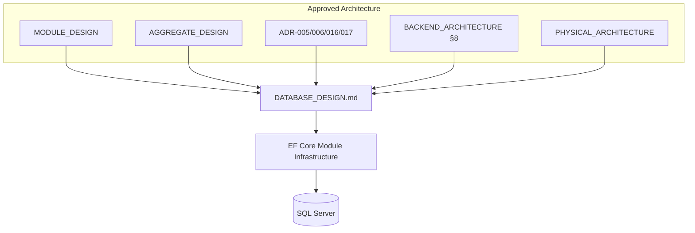

---

# 1. Database Philosophy

## 1.1 Persistence as a Municipal Integrity Concern

The Agriculture Management System is a **workflow-driven municipal production platform**. The primary engineering risk is incorrect encoding of sequential production rules—task completion advancing workflow steps, inspection blocking harvest, harvest/delivery quantity constraints, season archival immutability—paired with **municipal auditability**. The database is therefore not a passive bag of tables. It is the durable enforcement surface for:

- Aggregate consistency within a single module transaction.
- Optimistic concurrency on contested field operations.
- Soft-delete and immutability rules that keep historical seasons intelligible.
- Reliable integration via transactional outbox rows.
- Evidence metadata that survives object-store independence (MinIO).
- Extraction seams (schema-per-module, no cross-schema FKs) without paying distributed-systems tax on day one.

A design that optimizes only for “fast CRUD screens” will fail municipal oversight. A design that over-optimizes for hyperscale multi-tenant SaaS on day one will slow delivery of correct workflows. This DDS deliberately prioritizes **correctness, auditability, and modular ownership** over premature horizontal database fragmentation.

## 1.2 Aggregates Determine Tables

AGGREGATE_DESIGN states: database tables will **not** determine aggregates; aggregates determine database tables; business rules determine aggregates. The DDS operationalizes that rule:

- Each aggregate root maps to a primary table (or a tightly clustered set of tables) within the owning module schema.
- Child entities map to dependent tables with **intra-schema foreign keys** to the root (or to intermediate children owned by the same aggregate).
- Value objects map to owned columns, owned table types, or JSON columns only when the value object is truly atomic and does not require independent querying—prefer columns for municipal reporting fields.
- Cross-aggregate references, even when co-located in the same module (Harvest and Delivery), are modeled carefully: Delivery may reference `HarvestId` with an **intra-module** FK only when both schemas are owned by the same DbContext and MODULE_DESIGN permits; cross-module never uses FK.

Clarification from MODULE_DESIGN: Aggregate Design lists SupportHistory / InspectionHistory / HarvestHistory under Producer for storytelling. Target persistence treats those as **projections** updated by integration events so the Producer write aggregate remains small. The DDS documents both write tables and projection tables distinctly.

## 1.3 Write Model vs Read Model Philosophy

Per ADR-003 and BACKEND_ARCHITECTURE:

- **Write model**: normalized, invariant-protecting, loaded through repositories for commands, change-tracked, concurrency-tokened.
- **Read model**: DTO projections via `AsNoTracking`, dedicated read tables, or Reporting schema projections. Read models may denormalize foreign display names (`ProducerName` on task lists) copied via events—not live cross-schema joins inside write transactions.

Same SQL Server initially. Separate reporting database is a **future** capability (see § Reporting DB), not a day-one requirement.

## 1.4 Single Database, Multiple Schemas, Multiple DbContexts

Physical topology (PHYSICAL_ARCHITECTURE): one SQL Server process holds one primary OLTP database for the modular monolith. Logical topology: multiple schemas owned by modules. Runtime topology: one `{Module}DbContext` per module, each configured with `HasDefaultSchema("{module}")` and `__EFMigrationsHistory` in that schema.

This triad—single DB / many schemas / many DbContexts—is the approved extraction-ready compromise. It preserves ACID for in-module transactions and outbox writes, while forbidding the shared-entity graph that would make microservice extraction a rewrite.

## 1.5 Transaction Honesty Over Clever Distributed Patterns

Cross-module processes (TaskCompleted → AdvanceWorkflowStep → Notification) use **one aggregate root per transaction** for the initiating command, then outbox-driven policies for downstream modules (BACKEND_ARCHITECTURE D1). The database must not become a distributed transaction coordinator across DbContexts. Partial commits are prevented by:

1. Single DbContext SaveChanges for the write aggregate + its outbox rows.
2. Idempotent consumers in downstream modules.
3. Hangfire retries for side effects that leave the database (FCM), not for inventing 2PC across schemas.

## 1.6 Soft Delete Is Not Soft Edit Forever

ADR-016 clarifications: soft delete ≠ editable forever. Archived Season is soft-present but domain rejects mutations. Completed Inspection evidence is immutable; corrections use compensating entries with audit. Privacy purge hard-deletes or anonymizes PII under legal ticket, recording a purge audit event without restoring original PII. Schema design must support:

- `IsDeleted` / `DeletedAt` / `DeletedBy` filters for operational soft delete.
- Domain-level status columns (`Archived`, `Completed`) that gate mutations independently of soft delete.
- Legal-hold flags where evidence retention supersedes cleanup jobs.
- Purge markers / anonymization columns for regulated PII removal.

## 1.7 Evidence Metadata vs Binary Storage

Inspection photos, task photos, producer documents, delivery documents are **not** VARBINARY columns in OLTP tables. SQL stores:

- Object key / bucket / content-type / size / checksum / uploaded-by / uploaded-at.
- Optional virus-scan status and retention class.

MinIO holds bytes. Backup/restore of SQL alone does not restore binaries; PHYSICAL_ARCHITECTURE treats SQL and MinIO as a paired concern. Schema design must never assume BLOBs will be added “temporarily.”

## 1.8 Tenancy Hooks Without Schema-per-Tenant Prematurely

MODULE_DESIGN: Prefer `TenantId` (municipality) on root tables with row-level filters. Schema-per-tenant is a later option. DDS requires:

- `TenantId uniqueidentifier NOT NULL` on aggregate roots and major operational tables for multi-municipality readiness.
- Global query filters in EF for TenantId where applicable.
- Unique constraints that include TenantId when business uniqueness is per municipality (e.g., parcel number unique per tenant).
- No hard-wiring of schema-per-tenant into module boundaries.

## 1.9 Performance Philosophy

Near-term scale is vertical scale of API + SQL Server (PHYSICAL_ARCHITECTURE). Database performance tactics:

- Short write transactions.
- Indexes owned by modules aligned to CQRS query patterns.
- Pagination mandatory on lists.
- No `SELECT *` of aggregate graphs for dashboards.
- Season start mass-task generation uses batching patterns carefully without bypassing invariants unless Board grants exception.
- Reporting heavy work via Hangfire, not request threads.

## 1.10 Security Philosophy

Least-privilege database principals per environment; secrets outside source; TDE when hosting mandates; column-level protection for highly sensitive PII where justified; audit of privileged data access; no cross-module elevation via SQL views that write back to foreign schemas. Reporting may own **read-only** projection views/tables that copy columns—producers of data remain unaware (MODULE_DESIGN exception for Reporting).

## 1.11 Evolution Philosophy

Schema design must remain portable enough for future PostgreSQL migration (ADR-005 future path): prefer EF LINQ, isolate raw T-SQL, avoid proprietary features in Domain. Temporal tables, partitioning, read replicas, and sharding are **planned futures** documented here with triggers and thresholds—not day-one mandatory complexity.

## 1.12 Municipal Scenarios Driving Philosophy

**Peak planting week:** Hundreds of tasks created; officers watch SignalR dashboards; producers receive FCM. Schema must support batch inserts into `tasks` with indexes that do not collapse under write spikes, outbox throughput, and notification idempotency keys.

**Field photo over weak cellular:** Metadata row + outbox in one transaction; object upload may precede or follow with reconciliation job—schema supports upload session states without orphaning keys.

**Nightly reminder sweep:** Hangfire reads indexed overdue task projections; failures must not corrupt aggregates.

**Concurrent delivery quantity race:** `RowVersion` on Harvest delivered amount; Delivery create fails closed with 409 semantics at API.

**DB host patch failure:** Point-in-time restore recovers aggregates + outbox consistently; MinIO restored as paired media.

## 1.13 Anti-Patterns Explicitly Rejected

| Anti-Pattern | Why Rejected |
|---|---|
| Shared DbContext across modules | Extraction broken; leaky ownership |
| Cross-schema FK | Hard extraction; distributed monolith |
| Hard delete of municipal master data by default | History reconstruction fails |
| Pessimistic locking for all mobile writes | UX collapse in field |
| BLOBs in SQL for evidence | Backup bloat; MinIO is system of record for bytes |
| Auto-migrate Production on API startup | Uncontrolled change risk |
| Live EF navigation to foreign module tables | Violates ADR-017 |
| God `dbo` schema for all business tables | Destroys module ownership |
| Using Hangfire tables as business outbox | Wrong semantics and ownership |
| Storing JWT access tokens as durable business state | Tokens are ephemeral; refresh tokens are Identity-owned |

## 1.14 Philosophical Summary for Implementers

If a proposed schema change makes it easier to join Modules A and B in one EF query for a write command, it is almost certainly wrong. If it makes an aggregate invariant enforceable in one transaction with clear audit and concurrency, it is almost certainly right. If it makes Reporting faster by copying data into `reporting` via jobs, it is allowed. If it makes Reporting faster by adding FK from `reporting` into `tasks`, it is forbidden.

---

# 2. Naming Standards

## 2.1 General Rules

1. **English** identifiers for schemas, tables, columns, indexes, and constraints (ubiquitous language may include domain terms already established in English docs).
2. **PascalCase** for table names in documentation and EF entity configuration mapping; SQL Server stored objects use the names EF migrations emit—teams standardize on **PascalCase tables** without pluralization debates contradicting MODULE_DESIGN catalogs (use plural table names as listed in MODULE_DESIGN: `Producers`, `Tasks`, etc.).
3. **PascalCase** columns matching C# property names to reduce mapping friction (`CreatedAt`, `IsDeleted`, `RowVersion`).
4. Schemas are **lowercase singular module tokens**: `identity`, `producers`, `lands`, `seasons`, `workflows`, `tasks`, `inspections`, `harvest`, `delivery`, `support`, `notifications`, `communication`, `reporting`, `admin`, `hangfire`.
5. Avoid SQL reserved words as bare identifiers; if unavoidable, EF quotes them—prefer renaming.
6. No Hungarian notation (`tbl_`, `col_`).
7. No encoding of data type in names (`IntUserId` forbidden; `UserId` is `uniqueidentifier`).

## 2.2 Schema Naming

| Schema | Owner Module / Concern | Notes |
|---|---|---|
| `identity` | Agriculture.Modules.Identity | Includes ASP.NET Identity tables + domain User extensions as designed |
| `producers` | Agriculture.Modules.Producers | |
| `lands` | Agriculture.Modules.Lands | |
| `seasons` | Agriculture.Modules.Seasons | |
| `workflows` | Agriculture.Modules.Workflows | |
| `tasks` | Agriculture.Modules.Tasks | |
| `inspections` | Agriculture.Modules.Inspections | |
| `harvest` | Agriculture.Modules.Harvest | Harvest aggregate |
| `delivery` | Agriculture.Modules.Harvest | Delivery aggregate; same module migrations |
| `support` | Agriculture.Modules.Support | SupportFulfillment naming—not crop Delivery |
| `notifications` | Agriculture.Modules.Notifications | |
| `communication` | Agriculture.Modules.Communication | Conversations/messages |
| `reporting` | Agriculture.Modules.Reporting | Projections only |
| `admin` | Agriculture.Modules.Administration | Distinct from Identity |
| `hangfire` | Host / BuildingBlocks Infrastructure | Job storage; not business |

Optional `shared` schema is reserved only for true platform tables if Board approves; prefer not to place business entities there. Outbox is **per module schema**, not centralized shared outbox (MODULE_DESIGN preference).

## 2.3 Table Naming

- Aggregate root tables: entity plural or MODULE_DESIGN catalog name (`Producers`, `Lands`, `Seasons`, `Tasks`).
- Child tables: `{Parent}{Child}` or explicit catalog names (`ProducerPhotos`, `TaskComments`, `InspectionFindings`).
- Projection / read-model tables: prefix or suffix clearly—`ProducerHarvestHistoryProjection`, `SeasonProgressReadModel`, `TodaysTasksReadModel`.
- Outbox: `OutboxMessages` (per schema).
- Inbox / processed messages (if used): `InboxMessages` for idempotent consumers.
- Audit trail tables (high sensitivity): `{Entity}AuditEntries` or `HarvestQuantityAudit`.
- ASP.NET Identity: follow Identity defaults mapped into `identity` schema (`AspNetUsers`, `AspNetRoles`, …) **or** custom mapped names if Identity module unifies with domain `Users`—see Identity aggregate section. Normative decision in this DDS: **prefer unified domain User tables in `identity` schema with Identity stores configured to those tables**, avoiding duplicate user directories. If scaffold uses AspNet* tables, they remain in `identity` schema only.

## 2.4 Column Naming

### Identity & Keys

- `Id` — primary key `uniqueidentifier` for entities.
- `{Entity}Id` — foreign key within schema or logical cross-module reference.
- `TenantId` — municipality/tenant discriminator.

### Audit (AuditableEntity)

- `CreatedAt` — `datetime2(7)` UTC
- `CreatedBy` — `uniqueidentifier` NULL (system jobs) or UserId
- `ModifiedAt` — `datetime2(7)` UTC NULL until first update
- `ModifiedBy` — `uniqueidentifier` NULL

### Soft Delete

- `IsDeleted` — `bit` NOT NULL DEFAULT 0
- `DeletedAt` — `datetime2(7)` NULL
- `DeletedBy` — `uniqueidentifier` NULL

### Concurrency

- `RowVersion` — `rowversion` / `timestamp` NOT NULL (SQL Server concurrency token)

### Common Semantics

- Status enums stored as `nvarchar` with check constraint **or** `int` with documented enumeration—**normative preference: `nvarchar(64)` status codes** for readability in municipal support queries, with check constraints listing allowed values; alternatively `tinyint` with dictionary tables for ultra-hot paths. Module owners pick one style per module and stay consistent. This DDS uses **string status codes** in logical designs unless noted.
- Money: `decimal(18,2)` with explicit currency code `nchar(3)` when multi-currency; municipal single-currency may omit currency column but document assumption.
- Quantities: `decimal(18,3)` unless integer units mandated.
- Areas: `decimal(18,4)` with unit column (`AreaUnit`).
- Object keys: `nvarchar(512)` or `nvarchar(1024)` as needed.
- Correlation: `CorrelationId uniqueidentifier NULL` on outbox and selected audit rows.

## 2.5 Constraint Naming

Pattern: `{Type}_{SchemaAlias}_{Table}_{Columns}`

Examples (logical names for EF `HasName`):

- `PK_tasks_Tasks`
- `FK_tasks_TaskPhotos_TaskId`
- `UX_producers_Producers_TenantId_IdentityNumber`
- `CK_harvest_Harvests_AmountNonNegative`
- `IX_tasks_Tasks_AssigneeId_Status_DueDate`

Filtered unique indexes document filter in comment metadata: e.g., unique active season per land where `Status = 'Active' AND IsDeleted = 0`.

## 2.6 Index Naming

- `IX_{Table}_{Columns}` non-unique
- `UX_{Table}_{Columns}` unique
- Include columns suffix `_Incl_{Cols}` when notable
- Filtered: `UX_{Table}_{Columns}_FilteredActive`

## 2.7 Migration & History Naming

- EF migrations: `{Timestamp}_{DescriptiveName}`
- History table: `__EFMigrationsHistory` in module schema
- Never share one history table across modules

## 2.8 Forbidden Naming

- `Data`, `Info`, `Table1`, `Misc`
- Encoding module name redundantly in every column (`TasksTaskStatus`)
- Cross-schema table synonyms that encourage illicit joins in application code

---

# 3. Schema Strategy

## 3.1 Decision Summary

| Decision | Choice | Source |
|---|---|---|
| Database engine | Microsoft SQL Server / Azure SQL | ADR-005 |
| Database count (near-term) | One OLTP database | ADR-001/005 |
| Isolation of modules | Schema-per-module | MODULE_DESIGN §2.5 |
| ORM | EF Core, one DbContext per module | ADR-006 |
| Cross-module integrity | Guid references, no FK | ADR-016/017 |
| Harvest/Delivery | Two schemas, one module owner | MODULE_DESIGN §6.8 |
| Hangfire | Separate `hangfire` schema | BACKEND / SAS |
| Outbox | Per-module table | MODULE_DESIGN |
| Read DB | Future | ADR-003 |

## 3.2 Physical Database Object

Logical name recommendation: `Agriculture` (environment suffixes outside DB name via separate servers/instances: `Agriculture_Dev`, etc., or Azure elastic naming). Contained in one SQL Server instance initially. Collation: municipal standard—recommend a modern `_CI_AS` collation consistent with Turkish/English data needs; Board confirms with municipal IT. Compatibility level: current supported SQL Server version used in PHYSICAL_ARCHITECTURE compose images.

## 3.3 Schema-per-Module Rules

1. Every business table belongs to exactly one schema.
2. EF configurations set schema explicitly; never rely on `dbo` for business tables.
3. Foreign keys may reference tables **only in the same schema** (or, for Harvest module only, between `harvest` and `delivery` when both are mapped in `HarvestDbContext` and the relationship is intentional—see Harvest/Delivery section for normative FK policy).
4. Cross-module logical references: columns named `{ForeignEntity}Id` of type `uniqueidentifier` **without** FK constraint.
5. Reporting schema may contain copies of data; it does not own source aggregates.
6. Administration schema `admin` holds settings, feature flags, operational metadata—not Identity credentials.

## 3.4 DbContext Mapping Strategy

Each module Infrastructure defines `{Module}DbContext`:

- `identity` → `IdentityDbContext`
- `producers` → `ProducersDbContext`
- …
- `harvest` + `delivery` → `HarvestDbContext` (multi-schema single context)
- `reporting` → `ReportingDbContext` (may use raw SQL for projections; still no foreign entity types)
- Host configures Hangfire against `hangfire` schema connection (same database)

Migrations history:

`options.UseSqlServer(cs, sql => sql.MigrationsHistoryTable("__EFMigrationsHistory", "{schema}"))`

For HarvestDbContext owning two schemas, history table lives in `harvest` schema as the primary schema of the context.

## 3.5 Expand-Contract and Zero-Downtime

Municipal uptime may require:

1. Expand: add nullable column / new table.
2. Dual-write or backfill job.
3. Switch readers.
4. Contract: remove old column in later release.

DDS forbids destructive contract steps in the same release as expand for hot tables (`Tasks`, `OutboxMessages`, `Harvests`).

## 3.6 Schema Diagram — Overall Ownership

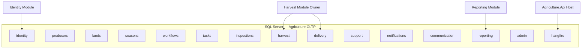

## 3.7 Cross-Schema Reference Pattern (Logical)

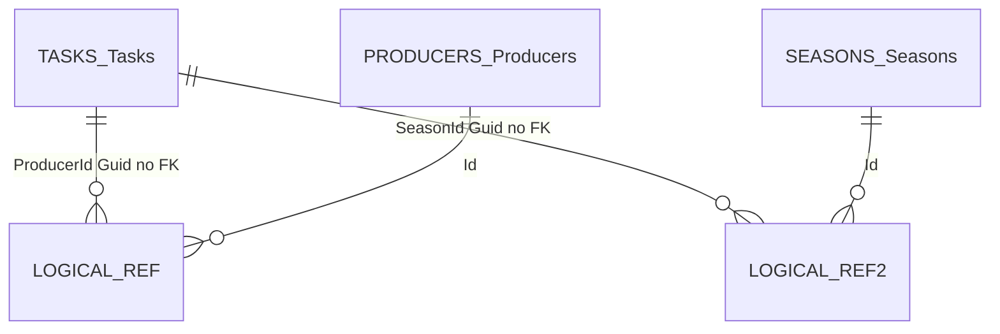

Document in every module: which Guid columns are logical foreign references and which integration events keep denormalized names fresh.

## 3.8 Multi-Schema Transactions

EF Core can enlist multiple contexts in an ambient `TransactionScope` or shared `IDbContextTransaction` connection—**forbidden as a default pattern** for business commands spanning modules. Allowed only for Board-approved technical migrations. Normal path: single context + outbox.

Exception within Harvest module: Harvest and Delivery tables may participate in one `HarvestDbContext` transaction when MODULE_DESIGN application handler updates delivered amount through Harvest aggregate method while inserting Delivery—explicitly allowed in-module.

## 3.9 Schema Security

Database roles:

- `agric_app` — DML on all business schemas + hangfire; no DDL in Production.
- `agric_migrator` — DDL during release windows only.
- `agric_readonly` — SELECT for support/reporting break-glass.
- Future: per-schema roles if extraction begins.

Row-Level Security (RLS) via SQL predicates on `TenantId` is a **future hardening** option; near-term enforcement is application query filters. DDS notes RLS as complementary, not replacement for application authorization.

---

# 4. Module Database Ownership

## 4.1 Ownership Matrix

| Module Project | Schemas | DbContext | Migration Owner | Notes |
|---|---|---|---|---|
| Identity | `identity` | IdentityDbContext | Identity.Infrastructure | AuthN/Z, tokens, AspNet Identity mapping |
| Producers | `producers` | ProducersDbContext | Producers.Infrastructure | Assignments owned here |
| Lands | `lands` | LandsDbContext | Lands.Infrastructure | Optional CurrentProducerId projection |
| Seasons | `seasons` | SeasonsDbContext | Seasons.Infrastructure | Active season uniqueness |
| Workflows | `workflows` | WorkflowsDbContext | Workflows.Infrastructure | Definitions + runtime |
| Tasks | `tasks` | TasksDbContext | Tasks.Infrastructure | Hot path indexes |
| Inspections | `inspections` | InspectionsDbContext | Inspections.Infrastructure | Evidence metadata |
| Harvest | `harvest`, `delivery` | HarvestDbContext | Harvest.Infrastructure | Nested Delivery capability |
| Support | `support` | SupportDbContext | Support.Infrastructure | SupportFulfillment |
| Notifications | `notifications` | NotificationsDbContext | Notifications.Infrastructure | Idempotency keys |
| Communication | `communication` | CommunicationDbContext | Communication.Infrastructure | Conversations |
| Reporting | `reporting` | ReportingDbContext | Reporting.Infrastructure | Projections only |
| Administration | `admin` | AdministrationDbContext | Administration.Infrastructure | Settings/flags |
| Host | `hangfire` | n/a (Hangfire API) | Host/DevOps | Not EF business migrations |

## 4.2 Ownership Responsibilities

Module Owner must:

1. Design tables aligning with aggregates in this DDS.
2. Author EF configurations and migrations.
3. Declare indexes for owned query paths.
4. Maintain outbox table and publisher.
5. Provide seed for reference data owned by module.
6. Document logical cross-module Guid columns in Contracts XML/docs.
7. Never create FK to another module’s schema.
8. Coordinate Reporting projectors when events change payload shapes (versioned events).

Host Owner must:

1. Compose connection strings.
2. Apply migration order in release pipeline (dependency order: Identity → registries → production engine → harvest → support/notifications/communication → reporting/admin).
3. Own Hangfire schema initialization.
4. Own health checks for SQL connectivity.

## 4.3 Migration Apply Order (Release)

Recommended sequence for empty database bootstrap:

1. `identity`
2. `admin` (minimal settings if required at boot)
3. `producers`, `lands` (either order)
4. `seasons`
5. `workflows`
6. `tasks`
7. `inspections`
8. `harvest` (+ `delivery`)
9. `support`
10. `notifications`
11. `communication`
12. `reporting`
13. Hangfire install

Because there are no cross-schema FKs, order is operational convenience (seed and smoke tests), not referential necessity—except Hangfire may be anytime after database exists.

## 4.4 Ownership Anti-Patterns

- Team A adds a table to Team B’s schema “just for a join.”
- Shared `Infrastructure` project containing all entity configurations (forbidden by Clean Architecture module split).
- Reporting mapping EF entities from `tasks` schema.
- Identity storing Producer profile fields.

## 4.5 Extraction Readiness Checklist (Data)

When a module extracts to its own database:

1. Schema already isolated.
2. No cross-schema FKs (already true).
3. Outbox → message broker.
4. Logical Guid references remain valid.
5. Connection string splits.
6. Reporting projectors switch to events entirely.
7. Hangfire jobs for that module move to worker with new CS.

DDS exists so extraction is strangler-friendly.


---

# 5. Aggregate Persistence Strategy

## 5.1 Mapping Rules

1. **One aggregate root → one primary table** (plus children).
2. **Load aggregate through repository** by root Id; children loaded as required for the command’s invariants (explicit Includes / split queries).
3. **Never load multiple aggregates for independent mutation** in one handler unless MODULE_DESIGN explicitly allows in-module multi-aggregate transaction (Harvest/Delivery case).
4. **Child entities** have their own `Id` GUID PKs; FK to parent; cascade delete behavior is **restricted** for soft-delete aggregates (prefer soft-delete children with parent) and **cascade** only where children cannot exist independently and hard dependency is intra-aggregate.
5. **Value objects** preferred as owned entity types or columns on the root/child; avoid exploding tables for trivial VOs.
6. **Domain events** are not tables by default; they become outbox integration messages and/or audit entries.
7. **Repositories return aggregates**, not `IQueryable` leaking to Application for writes.

## 5.2 Persistence Lifecycle States

| State | Storage Meaning | Query Filter |
|---|---|---|
| Active operational | `IsDeleted=0`, business status active | Visible |
| Soft-deleted | `IsDeleted=1` | Hidden by default |
| Archived (business) | Status=Archived, still `IsDeleted=0` | Visible read-only |
| Completed immutable | Status=Completed | Visible; updates rejected in domain |
| Legal hold | `LegalHold=1` | Visible; purge blocked |
| Purged/anonymized | PII cleared; tombstone row optional | Admin only |

## 5.3 Unit of Work and Outbox Coupling

`SaveChanges` for a command must atomically persist:

- Aggregate graph changes
- Outbox rows for integration events derived from domain events
- Audit trail rows when required for sensitive fields

Outbox dispatcher runs after commit (Hangfire or background service), never as a substitute for transactional durability.

## 5.4 Concurrency Scope

`RowVersion` on aggregate roots is mandatory for contested aggregates: User, Producer, Land, Season, Workflow (runtime), Task, Inspection, Harvest, Delivery, SupportApproval. Children may omit rowversion if only updated through root reload; if children can be updated with stale root, prefer root-level concurrency only (reload root each command).

## 5.5 Delete Semantics Matrix

| Aggregate | Soft Delete Default | Hard Delete Allowed | Notes |
|---|---|---|---|
| User | Yes (deactivate preferred) | Privacy purge only | Deleted users cannot login |
| Producer | Yes | Privacy purge | Keep season history intelligible |
| Land | Archive + soft | Rare | Archived lands cannot receive seasons |
| Season | Archive | No casual hard | Completed read-only |
| Workflow definition | Archive | No | Versioned |
| Task | Cancel soft | No | Completed cannot return Pending |
| Inspection | Soft rare | No for completed evidence | Immutable after complete |
| Harvest | Cancel soft | No | Quantity audits |
| Delivery | Cancel soft | No | Quantity races |
| Notification | Soft/retention job | Yes after retention | High volume |
| Message | Soft/retention | Policy-based | Communication |
| Reporting projections | Rebuildable | Yes | Not source of truth |

---

# 6. Relationships

## 6.1 Intra-Schema Relationships

Use SQL foreign keys for parent/child within an aggregate and for intra-module references that must be referentially honest (e.g., TaskPhoto.TaskId → Tasks.Id).

Cascades:

- **ON DELETE CASCADE**: only for pure dependent children that are meaningless without parent and when parent hard-delete occurs (rare). Prefer application soft-delete cascading in domain/repository.
- **ON DELETE NO ACTION / RESTRICT**: default for soft-delete worlds to prevent accidental SQL cascade wiping audit trails.
- **ON UPDATE**: no updates to GUID PKs—never.

## 6.2 Cross-Module Relationships

Logical only:

```text
tasks.Tasks.ProducerId  →  producers.Producers.Id   (no FK)
tasks.Tasks.SeasonId    →  seasons.Seasons.Id       (no FK)
harvest.Harvests.SeasonId → seasons.Seasons.Id      (no FK)
```

Integrity enforced by:

1. Application contract checks before write (`ILandDirectory.Exists`, etc.).
2. Integration events to fix denormalized read models.
3. Periodic reconciliation jobs (optional) detecting orphan logical references for admin queues—not silent deletes.

## 6.3 Harvest ↔ Delivery Relationship

MODULE_DESIGN allows in-module consistency. Normative DDS decision:

- `delivery.Deliveries.HarvestId` **may** have FK to `harvest.Harvests.Id` because both schemas are owned by `HarvestDbContext` and quantity invariants are co-located.
- Alternatively, logical Guid without FK if migration tooling friction across schemas is problematic—**prefer FK within Harvest module** for quantity safety.
- No FK from Delivery to Producers/Seasons; those are Guid logical refs on Harvest and/or Delivery as needed for queries, denormalized carefully.

## 6.4 Relationship Diagram — Production Journey (Logical)

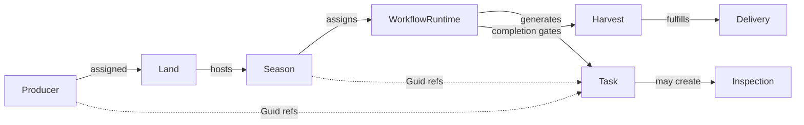

Solid lines within allowed ownership; dotted lines are Guid references across modules.

---

# 7. Primary Keys

## 7.1 Normative PK Strategy

- Type: `uniqueidentifier` (GUID)
- Column name: `Id`
- Clustered index: **by default clustered on `Id`** for simplicity and EF defaults.
- Alternative for ultra-hot chronological tables (Notifications, Outbox, Messages): **nonclustered PK on `Id` + clustered index on `(CreatedAt)` or `(TenantId, CreatedAt)`** — Module Owner decision documented in aggregate section when volume warrants.

## 7.2 Why GUID PKs

1. Generation without DB round-trip (`IGuidGenerator` / `Guid.CreateVersion7` when runtime supports, else v4).
2. Merge-friendly for future sharding/extraction.
3. Avoids sequential integer leaking counts of producers/lands.
4. Aligns Shared Kernel `Entity.Id`.

## 7.3 Clustering Trade-offs

Random GUID v4 causes index fragmentation on clustered PK. Mitigations:

1. Prefer **UUID v7 / sequential GUIDs** (`NEWSEQUENTIALID()` at SQL or application sequential generator) for hot insert tables.
2. Schedule index maintenance (PHYSICAL_ARCHITECTURE ops).
3. For extreme insert rates, switch to clustered chronological index.

**Normative guidance:** Use application-generated GUIDs; prefer version 7 when available in the platform; document generator in BuildingBlocks. Do not use `IDENTITY` integers for business aggregate roots.

## 7.4 Composite Primary Keys

Avoid for aggregate roots. Acceptable for pure join tables inside a module (e.g., `RolePermissions (RoleId, PermissionId)`) **or** single `Id` surrogate plus unique pair—**prefer surrogate `Id` GUID** even for join entities when audit soft-delete on the link is required; use composite PK only for immutable dense associations without soft delete.

---

# 8. GUID Strategy

## 8.1 Generation

| Approach | Usage |
|---|---|
| Application-generated GUID | Default for all entities before insert |
| SQL `NEWSEQUENTIALID()` default | Only if app cannot generate; prefer app |
| Database `NEWID()` | Discouraged for clustered indexes |

`IGuidGenerator` abstraction enables tests to inject known IDs.

## 8.2 Versioning of Identifiers

IDs are immutable. Never recycle GUIDs. Soft-deleted rows retain Id forever within retention period.

## 8.3 Strongly Typed IDs (Optional Future)

Shared Kernel may later introduce `ProducerId`, `TaskId` wrappers. SQL type remains `uniqueidentifier`. EF value converters map types. DDS does not require strongly typed IDs for MVP; if introduced, columns stay Guid storage.

## 8.4 Cross-Module GUID Hygiene

- Never assume existence without contract check on write commands that establish new relationships.
- Do not create SQL synonyms.
- Read models may store denormalized names with `ForeignId` + `ForeignName` + `ForeignNameSyncedAt`.

---

# 9. Identity Strategy (Authentication Data)

## 9.1 Separation of Concerns

**Identity module** owns authentication and authorization persistence in schema `identity`. **Administration** owns operational settings in `admin`. Producers module may link `UserId` Guid to a Producer for mobile login—link table or column on Producer (`LinkedUserId`) without FK.

## 9.2 ASP.NET Identity Tables

BACKEND/MODULE imply JWT + refresh tokens on User aggregate. Two acceptable implementations:

**Option A (Preferred):** Custom domain tables (`Users`, `Roles`, `Permissions`, `UserRoles`, `RolePermissions`, `RefreshTokens`, …) with custom stores—fully aligned to AGGREGATE_DESIGN User aggregate.

**Option B:** Map ASP.NET Identity (`AspNetUsers`, `AspNetRoles`, `AspNetUserRoles`, `AspNetUserClaims`, `AspNetRoleClaims`, `AspNetUserLogins`, `AspNetUserTokens`) into schema `identity`, then extend with companion tables for RefreshTokens, LoginHistories, PasswordHistories, PermissionOverrides.

**Normative DDS choice:** Option A preferred for DDD purity; Option B allowed if team velocity requires Identity scaffolding—**tables must still live only in `identity` schema** and must not leak into other modules. This document specifies logical columns for Option A; Option B must provide equivalent audit/soft-delete/concurrency semantics via companion tables.

## 9.3 Password Storage

Store only password hashes (ASP.NET Identity hasher or equivalent). Never reversible encryption for passwords. PasswordHistory stores prior hashes to prevent reuse—still hashes only.

## 9.4 Token Storage

- Access JWT: not stored server-side (stateless), aside from optional denylist if Board mandates.
- Refresh tokens: stored hashed (`TokenHash`), with family id, expiry, revoked flag, created by IP/user-agent metadata.

## 9.5 Permission Model Storage

Permissions as rows (not only enum) to allow Administration/Identity UI matrix. Roles map many-to-many. PermissionOverride on User for exceptional grants/denies with audit.

---

# 10. Concurrency Tokens and RowVersion

## 10.1 Mechanism

SQL Server `rowversion` column mapped with EF `IsRowVersion()`. On `DbUpdateConcurrencyException`, Application maps to 409 Problem Details (BACKEND_ARCHITECTURE).

## 10.2 Where Mandatory

Harvest (especially delivered/reserved quantity), Delivery, Task, Inspection, Workflow runtime instance, Season (status transitions), Producer (assignments), User (security sensitive).

## 10.3 Client Participation

APIs return concurrency token (base64 rowversion) to clients for PUT/PATCH style commands; mobile clients must echo token. Commands that reload server-side always use current token—still detect mid-flight conflicts.

## 10.4 Lost Update Example — Delivery

Two officers create deliveries against same harvest remaining quantity:

1. Both read Harvest remaining=100, RowVersion=A.
2. Both attempt Delivery qty=80.
3. First commit succeeds, updates DeliveredAmount, RowVersion=B.
4. Second commit fails concurrency or fails domain check on remaining—**must not** double-allocate.

Schema supports this via RowVersion + domain method `RegisterDelivery(quantity)`.

## 10.5 Pessimistic Locking

Not default. Reserved for rare admin tools with explicit `UPDLOCK` raw SQL under Board exception—outside normal MediatR command paths.

---

# 11. Soft Delete

## 11.1 Columns and Filters

Global EF query filter: `!e.IsDeleted`. Administrative queries use `IgnoreQueryFilters()` only in authorized handlers.

## 11.2 Unique Indexes Interaction

Unique constraints must be **filtered** (`WHERE IsDeleted = 0`) when soft-deleted rows would otherwise block reuse of business keys (email, identity number, parcel number)—**unless** business forbids reuse forever (then unique includes deleted rows).

Municipal guidance:

- Email/username: unique among non-deleted.
- Producer IdentityNumber: unique among non-deleted per TenantId (legal reuse after purge only).
- ParcelNumber: unique among non-deleted per TenantId.

## 11.3 Soft Delete vs Cancel vs Archive

Use explicit status for cancel/archive; soft delete for “removed from active registry.” A cancelled Task is Status=Cancelled, IsDeleted=0. A producer removed from system is IsDeleted=1 and Status=Deactivated.

---

# 12. Audit Fields

## 12.1 Standard Columns

On all persistent business entities (roots and children):

- `CreatedAt`, `CreatedBy`, `ModifiedAt`, `ModifiedBy`

Interceptors populate from `IUserContext` / `IClock` (BACKEND_ARCHITECTURE).

## 12.2 High-Sensitivity Audit Tables

Additional append-only tables for:

- Permission and role changes
- Harvest quantity changes
- Delivery quantity changes
- Support approval decisions
- Producer IdentityNumber changes

Columns: `Id`, `EntityId`, `TenantId`, `FieldName`, `OldValue`, `NewValue`, `ChangedAt`, `ChangedBy`, `CorrelationId`, `Reason`.

No updates/deletes except retention archival to cold storage.

## 12.3 Correlation

Store `CorrelationId` on outbox and audit entries to join Seq logs with SQL investigation.

---

# 13. Indexes

## 13.1 Principles

1. Every foreign key within schema gets an index unless table is tiny and insert-heavy trade-off documented.
2. Every list query path in MODULE_DESIGN §9.4 gets a supporting index.
3. Avoid over-indexing write-hot tables; review in PR with expected cardinality.
4. Covering includes for dashboard projections when profiling justifies.
5. Filtered indexes for soft-delete and active status.

## 13.2 Representative Catalog (Normative Baseline)

| Schema | Index | Purpose |
|---|---|---|
| tasks | `(AssigneeId, Status, DueDate)` | Today’s tasks / overdue |
| tasks | `(SeasonId, Status)` | Season board |
| tasks | `(ProductionWorkflowId, StepId)` | Workflow advancement views |
| inspections | `(SeasonId, Status)` | Queue |
| inspections | `(InspectorId, Status)` | Inspector workload |
| seasons | filtered unique `(TenantId, LandId)` where Active | Invariant |
| producers | unique `(TenantId, IdentityNumber)` filtered | Invariant |
| lands | unique `(TenantId, ParcelNumber)` filtered | Invariant |
| notifications | `(UserId, CreatedAt DESC)` | Inbox |
| notifications | unique `IdempotencyKey` | Exactly-once send intent |
| harvest | `(SeasonId)`, `(ProducerId)` | Summaries |
| delivery | `(HarvestId)`, `(SeasonId)` | Tracking |
| identity | unique Email/UserName filtered | Login |
| outbox (each) | `(ProcessedOn, OccurredOn)` / `ProcessedOn IS NULL` filtered | Dispatch |

## 13.3 Index Maintenance

Ops: fragmentation monitoring, `UPDATE STATISTICS`, rebuild/reorganize per PHYSICAL_ARCHITECTURE maintenance windows. Developers do not issue ad-hoc index hints in Application code.

---

# 14. Composite Indexes

Composite indexes follow **equality columns first, then range** (e.g., `AssigneeId, Status, DueDate`). Avoid composites that duplicate leading-column singles unless proven. Document sort direction matching query `ORDER BY`.

For mobile feeds, consider `(TenantId, UserId, CreatedAt DESC)` on notifications/messages.

Wide composites that include frequently updated columns increase write cost—prefer narrower index + include columns for covering.

---

# 15. Unique Constraints

## 15.1 Business Uniques (Logical)

| Entity | Unique Key | Filter |
|---|---|---|
| User | TenantId + NormalizedEmail | IsDeleted=0 |
| User | TenantId + NormalizedUserName | IsDeleted=0 |
| Producer | TenantId + IdentityNumber | IsDeleted=0 |
| Land | TenantId + ParcelNumber | IsDeleted=0 |
| Season | TenantId + LandId active | Status=Active AND IsDeleted=0 |
| Permission | Code | global or per tenant |
| Notification | IdempotencyKey | non-null |
| RefreshToken | TokenHash | |

## 15.2 Assignment Uniques

ProducerLandAssignment: unique `(ProducerId, LandId)` where active/not deleted.

ProducerSeasonAssignment: unique `(ProducerId, LandId, SeasonId)` or enforce “no two active seasons for same land” via filtered unique on `(LandId)` where assignment active—align to MODULE_DESIGN invariant ownership on Producers.

---

# 16. Check Constraints

Use CHECK constraints for cheap, database-enforceable invariants that duplicate domain guards for defense in depth:

- Amount >= 0
- Area > 0
- Status IN (...known set...)
- DeletedAt IS NULL OR IsDeleted = 1
- EndDate >= StartDate for periods

Do not push complex workflow sequencing into CHECK constraints—those remain domain.

---

# 17. Foreign Keys

## 17.1 Allowed

Intra-schema aggregate relationships; Harvest↔Delivery as specified; Identity user-role-permission graph; Communication conversation→messages.

## 17.2 Forbidden

Any FK from schema A to schema B where A and B have different module owners (Reporting copying data is not FK). No FK to `hangfire`. No FK from business tables to Seq or MinIO (not SQL).

## 17.3 Naming & Documentation

Every FK listed in aggregate sections. ON DELETE/UPDATE actions documented.

---

# 18. Temporal Tables (Future)

## 18.1 Intent

If ADR-016 audit tables prove insufficient for regulatory “as-of” queries on selected aggregates (permissions, harvest quantities), enable SQL Server system-versioned temporal tables on those tables.

## 18.2 Preconditions

- EF Core support/version validated.
- History tables included in backup plans.
- Retention policy for history.
- Application understands hidden period columns.

## 18.3 Near-Term

Do **not** enable temporal on all tables. Prefer audit tables + domain events. Temporal is opt-in per Board for specific tables.

---

# 19. Partitioning

## 19.1 Candidate Tables

Tasks, TaskPhotos metadata, Inspections, Harvests, Deliveries, Notifications, OutboxMessages, Communication Messages—partition by season year or by month `CreatedAt`.

## 19.2 Indicative Thresholds (from ADR clarifications spirit)

Consider partitioning when a table exceeds tens of millions of rows or maintenance windows suffer—exact numbers set by ops metrics. Season-year partition aligns with archival of completed seasons.

## 19.3 Implementation Note

Partitioning is ops/Infrastructure concern; Domain unaware. Use partition schemes in controlled DBA scripts coordinated with EF (tables created by EF, partitioned later via ops)—document carefully to avoid migration drift.

---

# 20. Archive Strategy

## 20.1 Business Archive

Season.Archive / Workflow.Archive set status flags; data remains in OLTP for near-term queries.

## 20.2 Cold Archive

Hangfire jobs move completed season graphs older than retention to archive tables or archive database (`Agriculture_Archive`) while Reporting retains KPI aggregates. MinIO objects move to cheaper tiers or tape per municipal policy.

## 20.3 Archive Integrity

Archive jobs write audit markers; never delete without backup verification. Legal hold blocks archive delete.

---

# 21. Backup and Restore

## 21.1 Alignment with PHYSICAL_ARCHITECTURE

- Full + differential + log backups for point-in-time recovery.
- Test restore regularly.
- RPO/RTO defined by municipal IT; DDS requires outbox+aggregates consistency via same DB backups.
- MinIO paired backup mandatory for evidence completeness.

## 21.2 Restore Considerations

- After restore, Hangfire may re-run jobs—idempotency mandatory.
- Outbox may re-dispatch—consumers idempotent.
- Sequence of restore: SQL first, verify, then MinIO to matching checkpoint if possible.

## 21.3 Environment Segregation

No restoring Production backups to Dev without PII scrubbing jobs.

---

# 22. Performance

## 22.1 OLTP Hot Paths

Task completion, workflow advancement, inspection complete, harvest/delivery quantity updates, notification insert, outbox dispatch.

Tactics: narrow updates, indexed seeks, avoid triggers, short transactions, no cross-context chats.

## 22.2 Read Paths

Dashboards use read models / projections. Parameter sniffing awareness for seasonal spikes—ops may use optimal plans; developers avoid one-query-fits-all with highly skewed seasons.

## 22.3 Batch Patterns

Season start task generation: batch saves of limited size per transaction; progress table for restartability; do not open one transaction for 100k tasks without Board exception and tested approach.

## 22.4 N+1 Prevention

No lazy-loading proxies by default. Explicit includes for writes; projections for reads.

---

# 23. Connection Pooling

## 23.1 ADO.NET Pooling

Default connection pooling enabled. Connection string sets `Max Pool Size` appropriate to API+Hangfire worker threads (PHYSICAL_ARCHITECTURE sizing). Avoid leaking contexts; `DbContext` scoped per request/job scope.

## 23.2 Multiple Contexts

Each module context uses same database connection string initially—pools by connection string identity. Do not create per-module databases until extraction.

## 23.3 Resiliency

EF EnableRetryOnFailure for transient SQL errors; ensure commands are idempotent where retried. Outbox dispatch must tolerate duplicate attempts.

---

# 24. Read/Write Optimization

| Path | Technique |
|---|---|
| Commands | Tracked aggregates, minimal includes |
| Queries | AsNoTracking, Select projection |
| Dashboards | Dedicated read tables |
| Reports | Hangfire + reporting schema |
| Search | Indexed columns; future external search not in DDS scope |

Split read/write connection strings later for replicas without changing schemas.

---

# 25. Migration Strategy

## 25.1 Ownership

Per-module EF migrations in Infrastructure. CI applies on release. Never auto-migrate Production at startup (BACKEND_ARCHITECTURE).

## 25.2 Expand-Contract

Mandatory for breaking changes on hot tables.

## 25.3 Backward Compatibility

App version N and N-1 during rolling deploy must tolerate expand state.

## 25.4 Verification

Integration tests apply all migrations on empty SQL (Testcontainers). Architecture tests forbid cross-schema FK creation if detectable.

---

# 26. Seed Strategy

## 26.1 What Is Seeded

- Permissions catalog
- Baseline roles
- Admin user bootstrap (environment-specific secrets)
- Workflow template demos (non-prod)
- Feature flags defaults in `admin`
- Reference crop types if owned by a module

## 26.2 Idempotency

Seeds use upsert by natural keys; safe to re-run. Production seeds minimal; demo seeds only non-prod.

## 26.3 Prohibited Seeds

Fake PII that resembles real citizens in shared environments without labeling; production harvest quantities.

---

# 27. Database Versioning

- EF migration history per schema is source of applied versions.
- Application exposes health/version endpoint listing applied migration ids (optional admin).
- Document DDS version separately from schema versions.
- Event payload versions (`UserRegisteredV1`) independent of table versions but coordinated when columns needed for consumers.

---

# 28. Security

## 28.1 Principals & Least Privilege

App pool account: DML only. Migrator: DDL on release. Auditors: read-only.

## 28.2 Network

SQL not exposed publicly; PRIVATE_ARCHITECTURE network rules; TLS to SQL when supported.

## 28.3 Dynamic SQL

Avoid in Application. Parameterized EF/LINQ only. Raw SQL in Infrastructure must be reviewed.

## 28.4 Hangfire Dashboard

Not a database user concern alone—but Hangfire schema access still least privilege; dashboard auth per PHYSICAL_ARCHITECTURE.

---

# 29. Encryption

## 29.1 At Rest

TDE (SQL Server / Azure SQL) when municipal policy requires. Transparent to schemas.

## 29.2 In Transit

Encrypt connections (`Encrypt=True`).

## 29.3 Column Encryption

Optional Always Encrypted for national identity numbers / bank accounts if policy demands—impacts search/indexing; prefer hashing/tokenization patterns for IdentityNumber search (store hash for lookup + encrypted payload) when required. Document per municipal deployment.

---

# 30. Sensitive Data and PII

## 30.1 PII Inventory (SQL-Resident)

- User: name, email, phone, address
- Producer: identity number, contacts, bank information, photos keys
- Communication: message bodies
- Support: financial eligibility fields if any

## 30.2 Controls

- Minimize columns collected
- Soft delete + purge workflows
- Masking in non-prod
- Seq log redaction (ADR Serilog)
- Access audited for exports
- BankInformation encrypted or restricted table permissions

## 30.3 Retention vs Privacy

Municipal retention for agricultural program records may exceed general privacy deletion—legal hold and anonymization strategies documented with counsel; schema supports anonymization fields (`IsAnonymized`, `AnonymizedAt`).

---

# 31. Transaction Isolation

## 31.1 Default

SQL Server default READ COMMITTED. EF transactions use this unless specified.

## 31.2 Explicit Choices

- Avoid READ UNCOMMITTED for municipal correctness.
- SNAPSHOT / RCSI may be enabled at database level by DBA to reduce blocking—Board/ops decision; application remains correct under RCSI.
- Serializable rarely; only Board-approved technical cases.

## 31.3 Application Transactions

Short-lived; encompass aggregate + outbox only.

---

# 32. Locking and Deadlock Prevention

## 32.1 Patterns

- Consistent lock order within module updates (always update Harvest before insert Delivery children in same order).
- Narrow indexes reduce lock escalation risk.
- Avoid long transactions with external I/O (MinIO/FCM) inside DB transaction—upload bytes outside, write metadata inside, reconcile.

## 32.2 Deadlock Handling

EF retry on deadlock (error 1205) when EnableRetryOnFailure configured; commands idempotent.

## 32.3 Hangfire vs API Contention

Separate queues; avoid updating same hot rows from many job workers without concurrency tokens.

---

# 33. Data Retention and Historical Data

| Data Class | Hot OLTP | Warm | Cold | Purge |
|---|---|---|---|---|
| Active season ops | Yes | — | — | — |
| Completed seasons last N years | Yes | Archive tables | Archive DB | Per policy |
| Notifications | Short | — | — | Retention job |
| LoginHistory | Medium | — | — | Retention job |
| Audit entries | Long | Export | SIEM/cold | Legal |
| Evidence metadata | Long | — | — | Legal hold aware |
| Reporting KPIs | Rebuilt | Kept | Warehouse future | — |

Historical intelligibility for municipal oversight is a first-class requirement: soft delete and archive beat hard delete.

---

# 34. Reporting Database (Future)

When CQRS read load threatens OLTP (ADR-005 future):

1. Introduce read replica or separate Reporting database.
2. Feed via CDC, ETL, or outbox-driven projectors.
3. `reporting` schema either moves or becomes the landing zone.
4. API Reporting module switches connection string for queries.
5. OLTP remains system of record for writes.

Until then, `reporting` schema co-located is mandatory pattern.

---

# 35. Read Models and CQRS Optimization

## 35.1 Types

1. **On-the-fly projection** — LINQ Select from write tables (same schema), AsNoTracking.
2. **Dedicated read tables** — updated synchronously in handler after aggregate save (same transaction) or via outbox projectors.
3. **Reporting projections** — cross-domain KPIs in `reporting`.

## 35.2 Examples

- TodaysTasksReadModel
- SeasonTimelineReadModel
- SeasonProgressReadModel
- ProducerSupportSummaryProjection
- PermissionMatrixReadModel (Identity/Admin)

## 35.3 Rebuild

Appendix guidance in BACKEND: rebuild from events or controlled scans via Contracts—not cross-DbContext entity graphs. Store projector watermarks in owning schema.

---

# 36. Monitoring and Health Checks

## 36.1 SQL Health

`/health/ready` checks SQL connectivity (PHYSICAL_ARCHITECTURE). Optional checks: migration version, outbox lag, Hangfire storage connectivity.

## 36.2 Metrics to Watch

- Outbox oldest unprocessed age
- Deadlocks/sec
- Wait stats (WRITELOG, LCK)
- Index fragmentation hot tables
- Hangfire queue depth
- Task insert rate at season start

## 36.3 Alerting

Seq/ops alerts on outbox lag and failed migration applies.

---

# 37. Future PostgreSQL Migration

Per ADR-005:

1. Keep EF LINQ dominant.
2. Isolate T-SQL.
3. Replace `rowversion` with `xmin` or explicit `bytea` concurrency token.
4. Revisit filtered indexes / partitioning syntax.
5. Dual-run CI on PostgreSQL when project starts.
6. Soft delete/audit/GUID strategies remain portable.

DDS forbids using SQL Server-only features in Domain. Infrastructure may use them with abstraction (temporal, columnstore) behind feature flags.

---

# 38. Future Sharding

Not required for MVP. If multi-municipality scale demands:

- Shard by `TenantId`.
- GUID PKs already compatible.
- No cross-schema FKs already compatible.
- Outbox becomes per-shard publisher.

Do not shard by ProducerId early—tenant shard is the natural municipal boundary.

---

# 39. Future Replication

- Read replicas for Reporting/queries first.
- Always On / geo-replication per hosting.
- Application read/write split connection strings.
- Replication lag must be understood by Reporting “as-of” timestamps (MODULE_DESIGN).


---

# 40. Overall Logical ER Landscape

The following diagram shows module schemas and primary aggregate roots. Edges labeled `Guid` are logical cross-module references without foreign keys. Edges labeled `FK` are intra-module (or Harvest-owned multi-schema) foreign keys.

```mermaid
erDiagram
  IDENTITY_Users ||--o{ IDENTITY_RefreshTokens : FK
  IDENTITY_Users ||--o{ IDENTITY_UserRoles : FK
  IDENTITY_Roles ||--o{ IDENTITY_UserRoles : FK
  IDENTITY_Roles ||--o{ IDENTITY_RolePermissions : FK
  IDENTITY_Permissions ||--o{ IDENTITY_RolePermissions : FK

  PRODUCERS_Producers ||--o{ PRODUCERS_LandAssignments : FK
  PRODUCERS_Producers ||--o{ PRODUCERS_SeasonAssignments : FK
  LANDS_Lands ||--o{ LANDS_Coordinates : FK
  SEASONS_Seasons ||--o{ SEASONS_Calendars : FK
  WORKFLOWS_ProductionWorkflows ||--o{ WORKFLOWS_RuntimeSteps : FK
  TASKS_Tasks ||--o{ TASKS_Photos : FK
  INSPECTIONS_Inspections ||--o{ INSPECTIONS_Findings : FK
  HARVEST_Harvests ||--o{ HARVEST_Products : FK
  HARVEST_Harvests ||--o{ DELIVERY_Deliveries : "FK or Guid"
  DELIVERY_Deliveries ||--o{ DELIVERY_Documents : FK
  SUPPORT_Approvals ||--o{ SUPPORT_Fulfillments : FK
  NOTIFICATIONS_Notifications ||--o{ NOTIFICATIONS_Attempts : FK
  COMMUNICATION_Conversations ||--o{ COMMUNICATION_Messages : FK

  PRODUCERS_Producers }o..o{ LANDS_Lands : "Guid assignment"
  SEASONS_Seasons }o..o| LANDS_Lands : "Guid LandId"
  TASKS_Tasks }o..o| SEASONS_Seasons : "Guid SeasonId"
  TASKS_Tasks }o..o| PRODUCERS_Producers : "Guid ProducerId"
  HARVEST_Harvests }o..o| SEASONS_Seasons : "Guid SeasonId"
  REPORTING_SeasonKpis }o..o| SEASONS_Seasons : "projected Guid"
```

---

# 41. Aggregate Persistence — Identity / User

## 41.1 Ownership

- **Module:** `Agriculture.Modules.Identity`
- **Schema:** `identity`
- **DbContext:** `IdentityDbContext`
- **Aggregate root:** User (AGGREGATE_DESIGN Aggregate 1)
- **Related catalogs:** Roles, Permissions (may be separate small aggregates or reference entities owned by Identity; treated as Identity-owned tables)

## 41.2 Purpose

Persists every authenticated principal, credential material (hashes only), refresh token families, login and password histories, role assignments, and permission overrides. Other modules store `UserId` only.

## 41.3 Tables (Logical)

### 41.3.1 Users

| Column | Logical Type | Null | Meaning |
|---|---|---|---|
| Id | Guid | NO | PK |
| TenantId | Guid | NO | Municipality |
| UserName | string(64) | NO | Login name |
| NormalizedUserName | string(64) | NO | Uniqueness/search |
| Email | string(256) | NO | Email VO |
| NormalizedEmail | string(256) | NO | Uniqueness |
| EmailConfirmed | bool | NO | Confirmation state |
| PhoneNumber | string(32) | YES | Phone VO |
| PhoneNumberConfirmed | bool | NO | |
| PasswordHash | string(512) | YES | Null for external-only future |
| SecurityStamp | string(64) | NO | Invalidates cookies/tokens |
| ConcurrencyStamp | string(64) | YES | Identity compat optional |
| FullName_First | string(100) | NO | FullName VO part |
| FullName_Last | string(100) | NO | |
| Address_Line1 | string(200) | YES | Address VO |
| Address_Line2 | string(200) | YES | |
| Address_City | string(100) | YES | |
| Address_Region | string(100) | YES | |
| Address_PostalCode | string(20) | YES | |
| Address_Country | string(2) | YES | ISO |
| IsActive | bool | NO | Only active receive JWT |
| IsDeleted | bool | NO | Soft delete |
| DeletedAt | datetime2 | YES | |
| DeletedBy | Guid | YES | |
| LockoutEnd | datetime2 | YES | Lockout |
| AccessFailedCount | int | NO | |
| CreatedAt / CreatedBy / ModifiedAt / ModifiedBy | audit | | |
| RowVersion | rowversion | NO | Concurrency |

### 41.3.2 RefreshTokens

| Column | Type | Null | Meaning |
|---|---|---|---|
| Id | Guid | NO | PK |
| UserId | Guid | NO | FK → Users |
| TokenHash | string(128) | NO | Store hash only |
| FamilyId | Guid | NO | Rotation family |
| ExpiresAt | datetime2 | NO | |
| CreatedAt | datetime2 | NO | |
| CreatedByIp | string(64) | YES | |
| CreatedByUserAgent | string(256) | YES | |
| RevokedAt | datetime2 | YES | |
| RevokedByIp | string(64) | YES | |
| ReplacedByTokenId | Guid | YES | Rotation chain |
| IsDeleted | bool | NO | |

### 41.3.3 LoginHistories

| Column | Type | Null | Meaning |
|---|---|---|---|
| Id | Guid | NO | PK |
| UserId | Guid | NO | FK |
| OccurredAt | datetime2 | NO | |
| Outcome | string(32) | NO | Success/Failure/Locked |
| IpAddress | string(64) | YES | |
| UserAgent | string(256) | YES | |
| CorrelationId | Guid | YES | |

Append-only; retention job purges old rows.

### 41.3.4 PasswordHistories

| Column | Type | Null | Meaning |
|---|---|---|---|
| Id | Guid | NO | PK |
| UserId | Guid | NO | FK |
| PasswordHash | string(512) | NO | Prior hash |
| SetAt | datetime2 | NO | |

### 41.3.5 Roles

| Column | Type | Null | Meaning |
|---|---|---|---|
| Id | Guid | NO | PK |
| TenantId | Guid | NO | |
| Name | string(128) | NO | |
| NormalizedName | string(128) | NO | |
| Description | string(512) | YES | |
| IsSystem | bool | NO | Protect seeded roles |
| Audit + soft delete + RowVersion | | | |

### 41.3.6 Permissions

| Column | Type | Null | Meaning |
|---|---|---|---|
| Id | Guid | NO | PK |
| Code | string(128) | NO | e.g., tasks.complete |
| Module | string(64) | NO | Owning module name |
| Description | string(512) | YES | |

### 41.3.7 UserRoles / RolePermissions

Association tables with Guid Id (for audit soft-delete of links) or composite PK. Prefer Guid Id + unique (UserId, RoleId).

### 41.3.8 PermissionOverrides

| Column | Type | Null | Meaning |
|---|---|---|---|
| Id | Guid | NO | PK |
| UserId | Guid | NO | FK |
| PermissionId | Guid | NO | FK |
| IsGrant | bool | NO | Grant vs deny |
| Reason | string(512) | YES | |
| ExpiresAt | datetime2 | YES | Optional |
| Audit + soft delete | | | |

### 41.3.9 OutboxMessages (identity)

Standard outbox shape (see § Outbox).

### 41.3.10 RolePermissionAudit / UserSecurityAudit

Append-only high-sensitivity audit.

## 41.4 Constraints

- UX_Users_Tenant_NormalizedEmail filtered IsDeleted=0
- UX_Users_Tenant_NormalizedUserName filtered IsDeleted=0
- UX_Permissions_Code
- UX_RefreshTokens_TokenHash
- CK_Users_DeletedConsistency
- FK children → Users / Roles / Permissions

## 41.5 Indexes

- IX_RefreshTokens_UserId_ExpiresAt
- IX_LoginHistories_UserId_OccurredAt
- IX_UserRoles_RoleId
- IX_Outbox_Unprocessed filtered

## 41.6 Relationships (Mermaid)

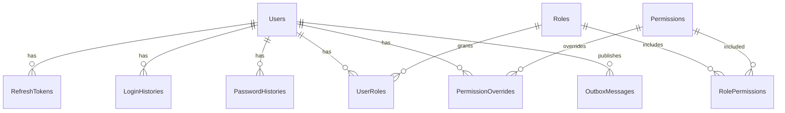

## 41.7 Lifecycle

Register → Active → (Lockout transient) → Deactivate/SoftDelete. Password change appends PasswordHistory and revokes refresh family. UserDeleted/UserDeactivated integration events notify dependents.

## 41.8 Growth Estimation

| Table | Year 1 (single municipality) | Year 5 |
|---|---|---|
| Users | 2k–20k | 50k–200k |
| RefreshTokens | 10× active users churn | needs cleanup job |
| LoginHistories | millions/year | retention essential |

## 41.9 Performance Considerations

Refresh token cleanup Hangfire job mandatory (MODULE_DESIGN ops note). Login path must seek by NormalizedUserName/Email with covering hash columns only—never table scan histories.

## 41.10 Risk Analysis

| Risk | Mitigation |
|---|---|
| Token table bloat | Cleanup job + indexes |
| Duplicate AspNet + domain users | Pick Option A or B, not both |
| Cross-module embedding of User entities | Contracts only |
| PII leakage in logs | Redaction; hash tokens at rest |

## 41.11 ASP.NET Identity Alignment Notes

If AspNet* tables used: map to `identity` schema; add RefreshTokens/LoginHistories companions; ensure soft-delete semantics via `IsActive`/`Lockout` and application deactivate command; do not create second user table in `dbo`.

## 41.12 Implementation Guidance for EF Teams

- Configure global filters for soft delete and TenantId.
- Never expose PasswordHash in queries/DTOs.
- Use transaction for RotateRefreshToken: revoke old, insert new, detect family reuse.
- Seed permissions from module catalogs coordinated with Administration.

---

# 42. Aggregate Persistence — Producer

## 42.1 Ownership

- **Module:** Producers
- **Schema:** `producers`
- **DbContext:** `ProducersDbContext`
- **Root:** Producer

## 42.2 Clarification vs Aggregate Design

SupportHistory / InspectionHistory / HarvestHistory are **projection tables**, not write children of the Producer aggregate (MODULE_DESIGN §6.2). Write children: photos, documents, addresses, contacts, land assignments, season assignments.

## 42.3 Tables

### Producers

| Column | Type | Null | Meaning |
|---|---|---|---|
| Id | Guid | NO | PK |
| TenantId | Guid | NO | |
| IdentityNumber | string(32) | NO | Unique national/program id |
| IdentityNumberHash | string(128) | YES | Optional lookup hash if encrypted |
| FirstName / LastName | string | NO | |
| Phone | string(32) | YES | |
| Email | string(256) | YES | |
| Bank_IBAN / Bank_BankName / Bank_AccountHolder | strings | YES | Sensitive |
| Status | string(32) | NO | Active/Deactivated |
| LinkedUserId | Guid | YES | Logical ref to identity.Users |
| PrimaryAddress fields or owned | | | |
| IsDeleted, audit, RowVersion | | | |

### ProducerPhotos / ProducerDocuments

Metadata: Id, ProducerId FK, ObjectKey, Bucket, ContentType, SizeBytes, Checksum, CapturedAt, IsPrimary, soft delete, audit. Binaries in MinIO under `producers/{id}/...`.

### ProducerAddresses / ProducerContacts

Multiple contacts/addresses; IsPrimary flags; unique filtered primary per producer optional.

### ProducerLandAssignments

| Column | Type | Null | Meaning |
|---|---|---|---|
| Id | Guid | NO | PK |
| ProducerId | Guid | NO | FK |
| LandId | Guid | NO | Logical ref lands |
| AssignedAt | datetime2 | NO | |
| UnassignedAt | datetime2 | YES | |
| IsActive | bool | NO | |
| RowVersion/audit/soft delete | | | |

Unique filtered (ProducerId, LandId) where IsActive=1.

### ProducerSeasonAssignments

| Column | Type | Null | Meaning |
|---|---|---|---|
| Id | Guid | NO | PK |
| ProducerId | Guid | NO | FK |
| SeasonId | Guid | NO | Logical |
| LandId | Guid | NO | Logical (invariant scope) |
| IsActive | bool | NO | |
| AssignedAt | datetime2 | NO | |

Enforce: cannot participate in two active seasons for same land—filtered unique (LandId) where IsActive=1 within assignments table **or** domain+unique (ProducerId, LandId, SeasonId) plus application checks via Seasons contracts. **Normative:** filtered unique index on `(TenantId, LandId)` WHERE IsActive=1 AND IsDeleted=0 on season assignments to enforce one active producer-season participation per land at assignment level owned by Producers—coordinate with Seasons’ own “one active season per land” invariant (different concern: season existence vs producer participation).

### Projection Tables

`ProducerInspectionHistoryProjection`, `ProducerHarvestHistoryProjection`, `ProducerSupportHistoryProjection`: Id, ProducerId, foreign entity ids, summary fields, OccurredAt, UpdatedAt. No FK to foreign schemas. Updated by integration event handlers.

### OutboxMessages

Standard.

## 42.4 Constraints & Indexes

- UX_Producers_Tenant_IdentityNumber filtered
- UX_LandAssignments_ActivePair
- IX_Producers_Tenant_LastName_FirstName
- IX_SeasonAssignments_SeasonId
- IX_Producers_LinkedUserId

## 42.5 ER Diagram

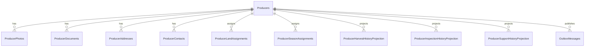

## 42.6 Lifecycle

RegisterProducer → Update → AssignLand/Season → Deactivate/SoftDelete. Bank info changes write sensitive audit.

## 42.7 Growth

Producers: thousands to tens of thousands per municipality. Assignments grow with seasons. Documents metadata moderate; MinIO dominates storage.

## 42.8 Performance

Search by IdentityNumber must be seek. Avoid loading all projections on write commands—separate queries.

## 42.9 Risks

| Risk | Mitigation |
|---|---|
| Dual assignment sources of truth with Lands | Producers owns assignments; Lands CurrentProducerId is projection |
| PII/bank leakage | Restricted columns; encryption optional |
| Inflated aggregate with histories | Keep histories as projections |

## 42.10 Cross-Module Guids

LandId, SeasonId, LinkedUserId, SupportApprovalId (in projections only).

---

# 43. Aggregate Persistence — Land

## 43.1 Ownership

Schema `lands`, `LandsDbContext`, root Land.

## 43.2 Tables

### Lands

| Column | Type | Null | Meaning |
|---|---|---|---|
| Id | Guid | NO | PK |
| TenantId | Guid | NO | |
| ParcelNumber | string(64) | NO | Unique per tenant |
| AreaValue | decimal(18,4) | NO | > 0 |
| AreaUnit | string(16) | NO | |
| Location_Region / District / Village | strings | YES | |
| Soil_Type / Soil_Ph / Soil_Notes | mixed | YES | SoilInformation VO |
| Status | string(32) | NO | Active/Archived |
| CurrentProducerId | Guid | YES | Denormalized projection |
| IsDeleted, audit, RowVersion | | | |

### LandCoordinates

Id, LandId FK, Sequence, Latitude, Longitude, Altitude optional, Source (GPS/manual).

### LandPhotos / LandDocuments

MinIO metadata pattern.

### LandOwnershipHistory

Id, LandId FK, OwnerName / OwnerProducerId logical, StartDate, EndDate, DocumentObjectKey, notes. Append-ish with corrections audited.

### LandCropHistory

Id, LandId FK, SeasonId logical, CropCode, Year, Yield optional, Notes. Land-centric history; not a substitute for Harvest aggregate.

## 43.3 Constraints

- UX_Lands_Tenant_ParcelNumber filtered
- CK_Lands_AreaPositive
- Archived lands: domain rejects new seasons; DB may not enforce season creation (cross-module)—contract checks.

## 43.4 Indexes

- IX_Lands_Tenant_Status
- IX_LandCoordinates_LandId
- IX_LandCropHistory_LandId_Year

## 43.5 ER

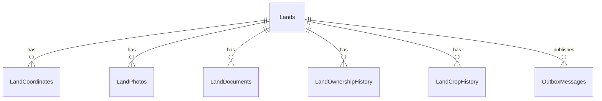

## 43.6 Lifecycle

Register → Update → Archive (Status) → SoftDelete rare. Archive ≠ delete.

## 43.7 Growth & Performance

Lands typically thousands–tens of thousands. Coordinates small. Spatial queries future: may add geography type—Board approval; keep lat/long decimals for MVP.

## 43.8 Risks

Conflicting CurrentProducerId vs Producers assignments—event-update projection only. Parcel number reuse after soft delete—filtered unique.

---

# 44. Aggregate Persistence — Season

## 44.1 Ownership

Schema `seasons`, root Season.

## 44.2 Invariants to Persist

- Only one active season per land (filtered unique).
- Completed seasons read-only (domain).
- Archived cannot modify (domain).

## 44.3 Tables

### Seasons

| Column | Type | Null | Meaning |
|---|---|---|---|
| Id | Guid | NO | PK |
| TenantId | Guid | NO | |
| LandId | Guid | NO | Logical lands |
| Name | string(128) | NO | SeasonName |
| PeriodStart | date | NO | |
| PeriodEnd | date | NO | |
| Status | string(32) | NO | Draft/Active/Paused/Completed/Archived |
| PrimaryProducerId | Guid | YES | Logical projection |
| ActiveWorkflowId | Guid | YES | Logical workflows runtime id |
| IsDeleted, audit, RowVersion | | | |

CK: PeriodEnd >= PeriodStart.

Filtered UX: `(TenantId, LandId)` WHERE Status='Active' AND IsDeleted=0.

### SeasonCalendars

Id, SeasonId FK, MilestoneCode, MilestoneDate, Notes.

### SeasonConfigurations

Id, SeasonId FK, Key, Value (nvarchar), value type hint—configuration bag owned by season.

### SeasonWorkflows

Id, SeasonId FK, WorkflowDefinitionId logical, ProductionWorkflowId logical, AssignedAt, IsPrimary.

## 44.4 Indexes

- IX_Seasons_Tenant_Status
- IX_Seasons_LandId
- IX_Seasons_PeriodStart

## 44.5 ER

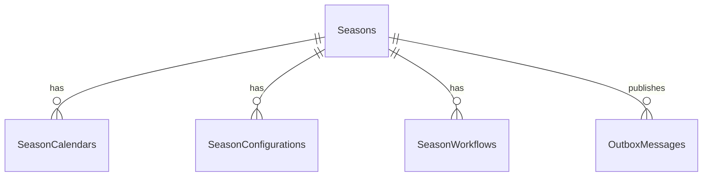

## 44.6 Lifecycle

Create → Start → Pause ↔ Active → Complete → Archive. Completion emits events for Reporting/Harvest eligibility policies.

## 44.7 Growth

One–few active seasons per land per year; historical seasons accumulate linearly with years × lands.

## 44.8 Performance & Risks

Unique filtered index is critical; race on StartSeason two concurrent creates need RowVersion/unique violation handling → 409/validation. Do not FK LandId.

---

# 45. Aggregate Persistence — Workflow

## 45.1 Ownership

Schema `workflows`. Distinguishes **definitions** (templates) from **production runtime instances** assigned to seasons (MODULE_DESIGN schema catalog: Definitions, Versions, Steps, Rules, Conditions, ProductionWorkflows, RuntimeSteps).

## 45.2 Tables

### WorkflowDefinitions

Id, TenantId, Code, Name, Type, Status (Draft/Published/Archived), audit, soft delete, RowVersion.

### WorkflowVersions

Id, WorkflowDefinitionId FK, VersionNumber int, PublishedAt, IsImmutable bool, checksum optional.

### WorkflowSteps (definition)

Id, WorkflowVersionId FK, Order int, Name, StepType, RequiresInspection bool, Metadata json/string.

Unique (WorkflowVersionId, Order).

### WorkflowConditions / WorkflowRules

Id, parent step/version FK, ExpressionCode, Parameters json, action on failure.

### ProductionWorkflows (runtime aggregate root alternative)

Runtime instance: Id, TenantId, SeasonId logical, ProducerId logical, WorkflowDefinitionId, WorkflowVersionId, Status (NotStarted/Running/Completed/Cancelled), CurrentStepOrder, StartedAt, CompletedAt, RowVersion, audit, soft delete.

**Normative:** Treat `ProductionWorkflow` as the transactional aggregate root for runtime advancement; definitions are separate reference aggregates/entities owned by same module.

### RuntimeSteps

Id, ProductionWorkflowId FK, DefinitionStepId, Order, Status, StartedAt, CompletedAt, TaskId logical (when generated), InspectionId logical.

## 45.3 Constraints

- CK step order >= 1
- UX definition code per tenant
- Cannot skip steps—domain; optional CK that only one RuntimeStep InProgress

## 45.4 Indexes

- IX_ProductionWorkflows_SeasonId_Status
- IX_RuntimeSteps_ProductionWorkflowId_Order
- IX_WorkflowDefinitions_Tenant_Status

## 45.5 ER

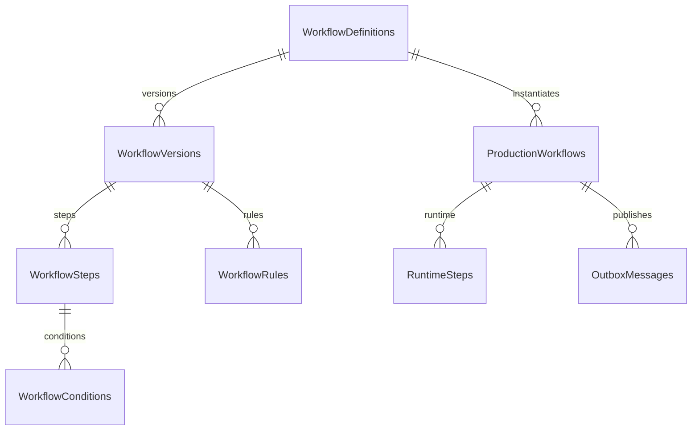

## 45.6 Lifecycle

Create definition → publish version → assign/start production workflow → complete steps via policies from TaskCompleted → complete workflow → archive definition when obsolete.

## 45.7 Growth & Performance

Definitions few; runtime rows scale with seasons × producers. Advancement is hot path—index SeasonId/Status; keep transaction to ProductionWorkflow + RuntimeSteps + outbox.

## 45.8 Risks

Chatty coupling with Tasks—events only. Skipping steps via direct SQL—deny app account ad-hoc updates; domain methods only. Version immutability: published versions never update in place; new version numbers.

---

# 46. Aggregate Persistence — Task

## 46.1 Ownership

Schema `tasks`, root Task. Hot path for field operations.

## 46.2 Tables

### Tasks

| Column | Type | Null | Meaning |
|---|---|---|---|
| Id | Guid | NO | PK |
| TenantId | Guid | NO | |
| SeasonId | Guid | NO | Logical |
| ProducerId | Guid | NO | Logical assignee producer |
| AssigneeUserId | Guid | YES | Logical identity user |
| ProductionWorkflowId | Guid | YES | Logical |
| StepId | Guid | YES | Logical runtime/definition step |
| Title | string(200) | NO | |
| Description | string(max) | YES | |
| Priority | string(16) | NO | |
| Status | string(32) | NO | Pending/InProgress/Completed/Cancelled/Delayed |
| DueDate | datetime2 | YES | |
| StartedAt / CompletedAt | datetime2 | YES | |
| CompletionNotes | string(max) | YES | |
| IsDeleted, audit, RowVersion | | | |

### TaskPhotos / TaskAttachments

MinIO metadata; TaskId FK.

### TaskComments

Id, TaskId FK, AuthorUserId logical, Body, CreatedAt, soft delete.

### TaskReminderHistories

Id, TaskId FK, SentAt, Channel, NotificationId logical, Outcome.

## 46.3 Constraints

- CK status transitions not in SQL (domain)
- CK CompletedAt null unless Completed
- Indexes per MODULE_DESIGN

## 46.4 Indexes (Mandatory)

- IX_Tasks_AssigneeUserId_Status_DueDate
- IX_Tasks_ProducerId_Status_DueDate
- IX_Tasks_SeasonId_Status
- IX_Tasks_ProductionWorkflowId_StepId
- IX_Tasks_TenantId_DueDate (overdue sweeps)

## 46.5 ER

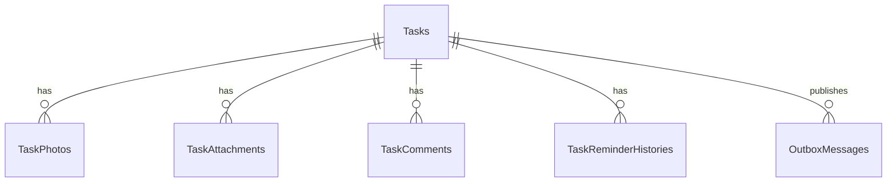

## 46.6 Lifecycle

Assign → Start → Complete/Cancel/Delay. Completed cannot return Pending (domain). Reminder jobs append ReminderHistory.

## 46.7 Growth Estimation

Peak planting: tens–hundreds of thousands of tasks per season for large municipalities. Partition by season year when thresholds hit. Photos metadata significant; binaries in MinIO.

## 46.8 Performance

Mass generation: batch inserts; consider TVF bulk carefully without bypassing domain—application batching of aggregate creates preferred. Overdue Hangfire queries must use DueDate indexes. TodaysTasks read model recommended when board queries heavy.

## 46.9 Risks

| Risk | Mitigation |
|---|---|
| N+1 comments/photos on lists | Projections without children |
| Cross-schema FK temptation to seasons | Forbidden |
| Reminder storms | Idempotency keys in notifications |
| Concurrency on complete | RowVersion |

## 46.10 Read Models Owned by Tasks Schema (Optional)

`TodaysTasksReadModel`: TaskId, TenantId, AssigneeUserId, ProducerName denormalized, SeasonName, Status, DueDate, Priority, UpdatedAt. Projector from Task events + name sync events.


---

# 47. Aggregate Persistence — Inspection

## 47.1 Ownership

Schema `inspections`, `InspectionsDbContext`, root Inspection. Municipal field inspection evidence is audit-critical and often immutable after completion.

## 47.2 Tables

### Inspections

| Column | Type | Null | Meaning |
|---|---|---|---|
| Id | Guid | NO | PK |
| TenantId | Guid | NO | |
| SeasonId | Guid | NO | Logical |
| TaskId | Guid | YES | Logical — must belong to task or workflow |
| ProductionWorkflowId | Guid | YES | Logical |
| ProducerId | Guid | YES | Logical denormalized |
| LandId | Guid | YES | Logical |
| InspectorUserId | Guid | NO | Logical identity |
| ScheduledAt | datetime2 | YES | |
| StartedAt / CompletedAt | datetime2 | YES | |
| Status | string(32) | NO | Assigned/InProgress/Completed/Rejected/Cancelled |
| Result | string(32) | YES | Pass/Fail/Conditional |
| Summary | string(max) | YES | |
| LegalHold | bool | NO | Blocks purge |
| IsDeleted, audit, RowVersion | | | |

### InspectionFindings

Id, InspectionId FK, Code, Severity, Description, RequiresCorrectiveTask bool, CorrectiveTaskId logical.

### InspectionPhotos / InspectionDocuments

MinIO metadata; evidence retention class column (`RetentionClass`: Standard/Extended/LegalHold).

### InspectionComments

Id, InspectionId FK, AuthorUserId, Body, CreatedAt; after completion, domain rejects new comments except system corrective notes—or allow append-only comments with flag.

## 47.3 Constraints & Indexes

- IX_Inspections_SeasonId_Status
- IX_Inspections_InspectorUserId_Status
- IX_Inspections_TaskId
- CK: Completed inspections should not soft-delete casually—prefer LegalHold

## 47.4 ER

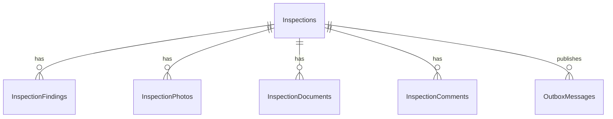

## 47.5 Lifecycle

Create/Assign → Start → Complete/Reject. Completed immutable for findings/photos; compensating inspection records for corrections. InspectionCompleted / InspectionRejected integration events gate Harvest and create corrective tasks via policies.

## 47.6 Growth & Performance

Per season moderate vs tasks; photo metadata grows with field work. Queries by inspector and status must be seeks. Do not load photos blobs via SQL.

## 47.7 Risks

| Risk | Mitigation |
|---|---|
| Editing completed evidence | Domain immutability + optional DB trigger/permission deny updates |
| Orphan MinIO objects | Reconciliation job |
| Harvest starts despite fail | Outbox policy + Harvest eligibility contract |
| PII in comments | Retention + access control |

## 47.8 Performance Considerations Expanded

Inspection queues for officers often filter by SeasonId + Status with ordering by ScheduledAt. A composite index `(SeasonId, Status, ScheduledAt)` supports this. Inspector mobile app “my inspections” uses `(InspectorUserId, Status, ScheduledAt)`. Avoid a single catch-all index that includes large `Summary` columns as key columns—use INCLUDE only for covering small fields if profiling shows key lookups expensive.

When completing an inspection with many findings and photos, the write transaction should insert children then update root status once, emitting one outbox message `InspectionCompletedV1` with summary payload (ids, result, seasonId, producerId)—not one outbox row per photo.

## 47.9 Legal Hold and Retention Interaction

`LegalHold=1` must be respected by retention Hangfire jobs that would otherwise anonymize or delete metadata. Jobs query `WHERE LegalHold=0 AND CompletedAt < @threshold`. Soft delete of an inspection under legal hold is rejected in domain and should be prevented by a check constraint or application rule: `NOT (LegalHold=1 AND IsDeleted=1)` unless Board defines an explicit sealed-delete state.

---

# 48. Aggregate Persistence — Harvest

## 48.1 Ownership

Module Harvest, schema `harvest`, root Harvest. Delivery is a separate aggregate in schema `delivery` owned by the same module (MODULE_DESIGN §6.8).

## 48.2 Invariants

- Harvest cannot begin before workflow completion (enforced via application contracts/gates, not cross-schema FK).
- Harvest amount cannot be negative (CHECK + domain).
- Delivered amount tracking must be concurrency-safe.

## 48.3 Tables

### Harvests

| Column | Type | Null | Meaning |
|---|---|---|---|
| Id | Guid | NO | PK |
| TenantId | Guid | NO | |
| SeasonId | Guid | NO | Logical |
| ProducerId | Guid | NO | Logical |
| LandId | Guid | YES | Logical |
| ProductionWorkflowId | Guid | YES | Logical |
| Status | string(32) | NO | NotStarted/InProgress/Completed/Cancelled |
| HarvestDate | date | YES | |
| TotalAmount | decimal(18,3) | NO | >=0 |
| Unit | string(16) | NO | |
| DeliveredAmount | decimal(18,3) | NO | >=0, <=TotalAmount |
| ReservedAmount | decimal(18,3) | NO | Optional reservation |
| RemainingAmount | computed OR derived | | Prefer computed persisted column Total-Delivered-Reserved |
| Notes | string(max) | YES | |
| IsDeleted, audit, RowVersion | | | |

CK: DeliveredAmount >= 0 AND TotalAmount >= 0 AND DeliveredAmount + ReservedAmount <= TotalAmount.

### HarvestProducts

Id, HarvestId FK, ProductCode, ProductName, Amount, Unit, Grade optional.

### HarvestMeasurements

Id, HarvestId FK, MeasuredAt, Amount, Unit, Method, RecordedByUserId logical.

### HarvestPhotos

MinIO metadata.

### HarvestQuantityAudit

Append-only: OldTotal, NewTotal, OldDelivered, NewDelivered, Reason, ChangedBy, ChangedAt, CorrelationId.

### OutboxMessages

Includes HarvestStarted/Completed/Cancelled.

## 48.4 Indexes

- IX_Harvests_SeasonId_Status
- IX_Harvests_ProducerId
- IX_Harvests_TenantId_HarvestDate
- IX_HarvestProducts_HarvestId

## 48.5 ER

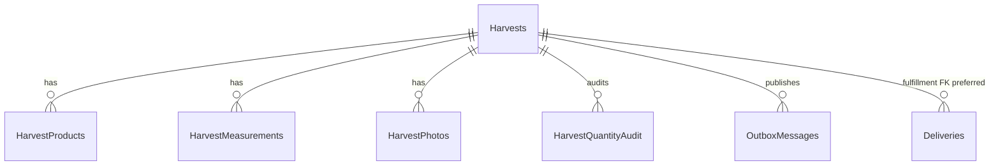

## 48.6 Lifecycle

StartHarvest (gate checks) → record measurements/products → CompleteHarvest → CancelHarvest. Deliveries reference harvest and update DeliveredAmount through domain service in-module transaction.

## 48.7 Growth

End-of-season spikes. Per season per producer typically low row count on Harvests; measurements/photos moderate. Quantity audit grows with corrections.

## 48.8 Performance & Risks

RowVersion mandatory. Never update DeliveredAmount via raw SQL from Delivery without going through Harvest aggregate method in same module handler. Reporting season harvest summary uses projections, not repeated scans of measurements.

### Expanded Concurrent Delivery Walkthrough

1. Handler loads Harvest with tracking.
2. Domain `CanRegisterDelivery(qty)` checks remaining.
3. Delivery aggregate created in `delivery` schema tables.
4. Harvest `RegisterDelivery(qty)` increments DeliveredAmount.
5. Outbox rows for DeliveryCreated (+ optional HarvestQuantityChanged).
6. Single SaveChanges on HarvestDbContext.
7. Concurrent second handler with stale RowVersion fails; API returns 409; client refreshes remaining.

This is the municipal correctness scenario highlighted in BACKEND_ARCHITECTURE §8.15—schema must not invent a second DeliveredAmount in Delivery as sole source of truth without Harvest update.

## 48.9 Gate Data (Non-FK)

Store optional `EligibilitySnapshotJson` at StartHarvest time for audit (workflow completed flag, inspection pass flag) without FKs to inspections/workflows.

---

# 49. Aggregate Persistence — Delivery

## 49.1 Ownership

Schema `delivery`, same `HarvestDbContext` / Harvest module migrations. Aggregate root Delivery (AGGREGATE_DESIGN Aggregate 9). Not a separate microservice/module folder.

## 49.2 Naming Clarity

Crop **Delivery** ≠ Support **SupportFulfillment**. Different schemas (`delivery` vs `support`).

## 49.3 Tables

### Deliveries

| Column | Type | Null | Meaning |
|---|---|---|---|
| Id | Guid | NO | PK |
| TenantId | Guid | NO | |
| HarvestId | Guid | NO | FK to harvest.Harvests preferred |
| SeasonId | Guid | NO | Logical denormalized |
| ProducerId | Guid | NO | Logical |
| BuyerName | string(200) | YES | Buyer VO |
| BuyerIdentifier | string(64) | YES | |
| DeliveryDate | date | NO | |
| Quantity | decimal(18,3) | NO | >0, <= remaining at create |
| Unit | string(16) | NO | |
| UnitPrice | decimal(18,2) | YES | |
| Currency | nchar(3) | YES | |
| Status | string(32) | NO | Created/Completed/Cancelled |
| CompletedAt | datetime2 | YES | |
| IsDeleted, audit, RowVersion | | | |

### DeliveryDocuments

MinIO metadata.

### DeliveryInvoices / DeliveryReceipts

Id, DeliveryId FK, DocumentNumber, IssuedAt, ObjectKey, Amount, Currency, soft delete. Aligns AGGREGATE_DESIGN Invoice/Receipt children; MODULE_DESIGN DeliveryInvoice/DeliveryReceipt naming.

### DeliveryQuantityAudit

Append-only for quantity changes/cancellations.

## 49.4 Constraints

- FK_Deliveries_HarvestId → harvest.Harvests(Id) **recommended**
- CK Quantity > 0
- IX_Deliveries_HarvestId
- IX_Deliveries_SeasonId_Status
- UX DocumentNumber per tenant when present

## 49.5 ER

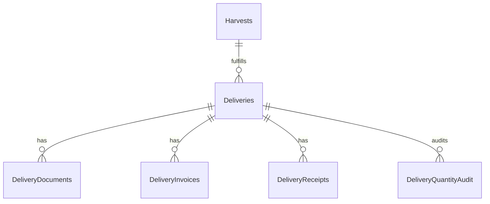

## 49.6 Lifecycle

CreateDelivery (updates Harvest delivered) → CompleteDelivery → CancelDelivery (releases quantity via Harvest method). Cancel must be transactional with Harvest remaining restoration.

## 49.7 Growth & Performance

Deliveries roughly similar order to harvests × splits. Indexes by HarvestId critical. Season logistics boards query by SeasonId/Status.

## 49.8 Risks

| Risk | Mitigation |
|---|---|
| Exceed harvest amount | In-module transaction + RowVersion |
| Separate Delivery microservice early | Forbidden by MODULE_DESIGN |
| Confusing SupportDelivery naming | Use SupportFulfillment |
| Money rounding | decimal(18,2) + domain |

## 49.9 Cross-Schema Within Module Notes

HarvestDbContext configures both schemas. Migrations history in `harvest`. EF model creates FK across schemas in same database—allowed here only. Still no FK to `seasons`/`producers`.

---

# 50. Aggregate Persistence — Support

## 50.1 Ownership

Schema `support`. Aggregates: SupportApproval, SupportFulfillment (MODULE_DESIGN naming).

## 50.2 Tables

### SupportApprovals

Id, TenantId, ProducerId logical, SeasonId logical, ProgramCode, RequestedAmount, ApprovedAmount, Currency, Status (Requested/Approved/Rejected/Cancelled), DecisionReason, DecisionByUserId, DecisionAt, audit, soft delete, RowVersion.

### SupportFulfillments

Id, SupportApprovalId FK, FulfillmentDate, Amount, Method, ReferenceNumber, Status, audit, RowVersion.

### SupportDocuments

MinIO metadata linked to approval or fulfillment.

### SupportDecisionAudit

Append-only decisions.

## 50.3 ER

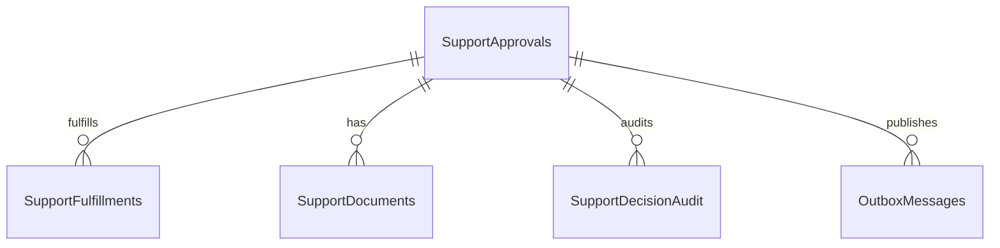

## 50.4 Indexes

- IX_SupportApprovals_ProducerId_Status
- IX_SupportApprovals_SeasonId
- IX_SupportFulfillments_SupportApprovalId

## 50.5 Lifecycle & Risks

Approve/Reject emits events for Producer projections and Notifications. Financial fields are sensitive—restrict SELECT permissions for support tables to app role only; auditors use controlled views. Do not store payment card numbers.

## 50.6 Growth

Lower volume than tasks; high sensitivity. Retention aligned to municipal finance rules.

---

# 51. Aggregate Persistence — Notification

## 51.1 Ownership

Schema `notifications`. High-churn, extraction-first candidate.

## 51.2 Tables

### Notifications

| Column | Type | Null | Meaning |
|---|---|---|---|
| Id | Guid | NO | PK |
| TenantId | Guid | NO | |
| UserId | Guid | NO | Logical identity |
| Channel | string(32) | NO | Push/Email/Sms/InApp |
| TemplateCode | string(64) | NO | |
| Title | string(200) | YES | |
| Body | string(max) | YES | |
| PayloadJson | string(max) | YES | |
| Status | string(32) | NO | Pending/Sent/Failed/Cancelled |
| IdempotencyKey | string(128) | NO | Unique |
| RelatedEntityType | string(64) | YES | |
| RelatedEntityId | Guid | YES | |
| CreatedAt | datetime2 | NO | |
| SentAt | datetime2 | YES | |
| IsDeleted | bool | NO | |
| RowVersion | rowversion | NO | |

### NotificationDeliveryAttempts

Id, NotificationId FK, AttemptedAt, Outcome, ProviderResponseCode, ProviderMessage, DurationMs.

### ChannelBindings / DeviceTokens

Id, UserId, Channel, TokenOrAddress, Platform, IsActive, LastValidatedAt—FCM tokens deactivated on provider errors (BACKEND).

### OutboxMessages

For cross-module if Notifications publishes; often consumes more than publishes.

## 51.3 Indexes

- UX_Notifications_IdempotencyKey
- IX_Notifications_UserId_CreatedAtDesc
- IX_Notifications_Status_CreatedAt (dispatch)
- IX_DeviceTokens_UserId_IsActive

## 51.4 ER

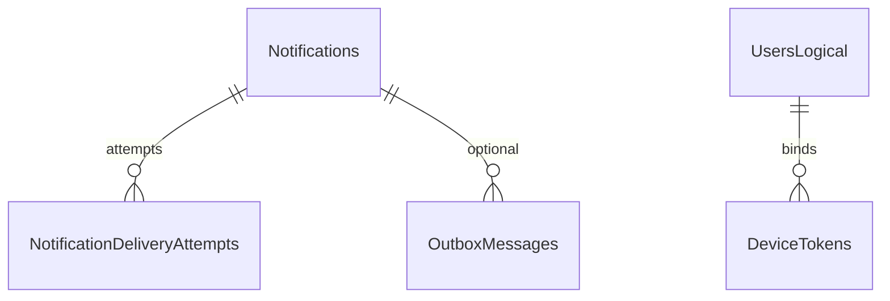

## 51.5 Lifecycle

Persist notification + enqueue Hangfire send; attempts append; failures retry; retention purges old notifications. Provider outages must not roll back domain transactions of publishers—publishers write outbox; Notifications consumes and persists its own rows.

## 51.6 Growth & Performance

Very high volume. Clustered index on CreatedAt optional. Partition monthly. Cursor pagination for mobile feeds. Idempotency prevents duplicate storms.

## 51.7 Risks

Duplicate push; token churn; PII in body—minimize; retention.

---

# 52. Aggregate Persistence — Communication / Conversation

## 52.1 Ownership

Schema `communication`. Conversations and messages for officer–producer communication (MODULE_DESIGN).

## 52.2 Tables

### Conversations

Id, TenantId, Subject, SeasonId logical, ProducerId logical, TaskId logical optional, Status Open/Closed, CreatedByUserId, audit, soft delete, RowVersion.

### ConversationParticipants

Id, ConversationId FK, UserId logical, RoleInThread, JoinedAt, IsActive.

### Messages

Id, ConversationId FK, SenderUserId logical, Body, SentAt, IsDeleted, ClientMessageId for idempotent mobile send, AttachmentCount.

### MessageAttachments

MinIO metadata.

### MessageReadStates

Id, MessageId FK, UserId, ReadAt—or watermark per participant.

## 52.3 Indexes

- IX_Messages_ConversationId_SentAt
- UX_Messages_Conversation_ClientMessageId filtered where not null
- IX_Conversations_ProducerId_Status
- IX_Conversations_SeasonId

## 52.4 ER

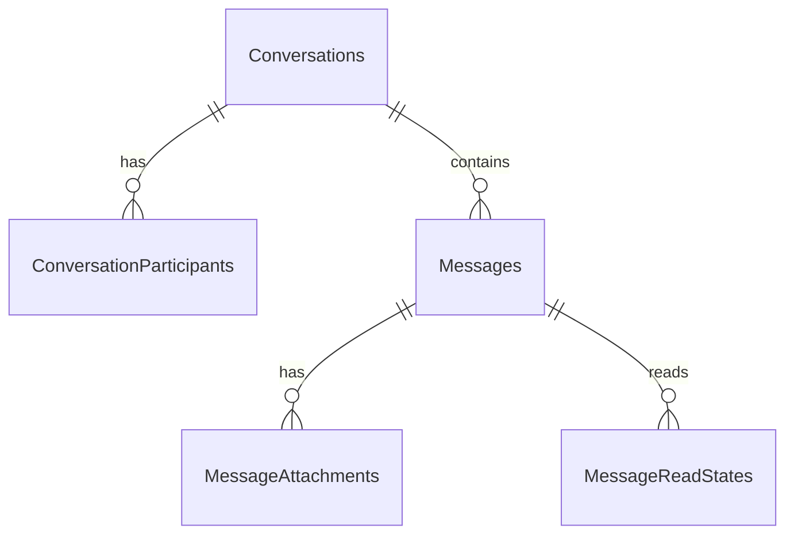

## 52.5 Lifecycle & Growth

High churn messages; retention policies; cursor pagination mandatory. SignalR notifies; SQL remains source of truth for history.

## 52.6 Risks

PII in messages; cross-module TaskId without FK; moderation/deletion soft delete; legal export jobs.

---

# 53. Aggregate Persistence — Reporting

## 53.1 Ownership

Schema `reporting`. **No ownership of source aggregates.** Projected tables only (MODULE_DESIGN §6.x Reporting).

## 53.2 Tables (Examples)

### SeasonKpiSnapshots

Id, TenantId, SeasonId, AsOf, TasksTotal, TasksCompleted, InspectionsFailed, HarvestTotalAmount, DeliveriesCompleted, ProgressPercent, GeneratedAt.

### ProducerSeasonSummaries

Id, TenantId, ProducerId, SeasonId, metrics…

### ReportRuns

Id, ReportType, RequestedBy, Status, ObjectKey for output file, CreatedAt, CompletedAt, Error.

### ProjectorWatermarks

ProjectorName, LastEventTimestamp / LastProcessedOutboxId, UpdatedAt.

## 53.3 Rules

- No EF entities mapped to foreign schemas.
- Prefer job-populated tables; optional read-only SQL views owned by reporting that select from other schemas **only if** Board accepts VIEW as temporary anti-corruption—and views are not used for writes.
- Heavy reports via Hangfire + MinIO download link.

## 53.4 ER

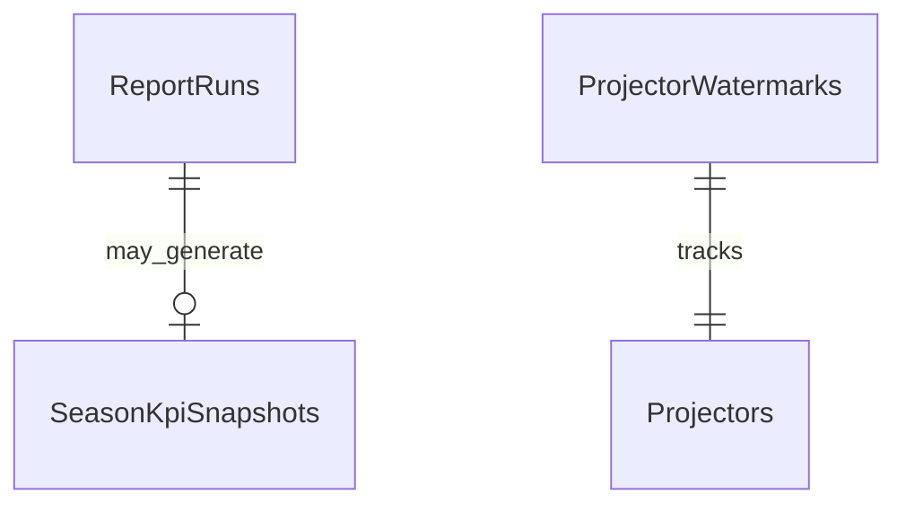

## 53.5 Risks

Lag misunderstood by officers—“as-of” timestamps required. Rebuild procedures documented. Never block OLTP with huge analytical queries on write schemas from API threads.

---

# 54. Administration Schema Persistence

## 54.1 Ownership

Schema `admin`, distinct from Identity.

## 54.2 Tables

### FeatureFlags

Id, TenantId, Key, IsEnabled, UpdatedAt, UpdatedBy.

### SystemSettings

Id, TenantId, Key, Value, ValueType, UpdatedAt.

### MaintenanceWindows / OperationalAnnouncements

Optional operational content.

### AdminAuditEntries

Privileged actions beyond Identity.

## 54.3 Rules

No passwords here. No Hangfire tables here. Health contribution metadata optional.

---

# 55. Integration Events and Outbox Persistence

## 55.1 Standard Outbox Table (Per Module Schema)

| Column | Type | Null | Meaning |
|---|---|---|---|
| Id | Guid | NO | PK |
| TenantId | Guid | YES | |
| EventType | string(128) | NO | e.g., TaskCompletedV1 |
| PayloadJson | string(max) | NO | Contract payload |
| OccurredOn | datetime2 | NO | |
| ProcessedOn | datetime2 | YES | Null = pending |
| Error | string(max) | YES | Last error |
| RetryCount | int | NO | |
| CorrelationId | Guid | YES | |
| AggregateType | string(64) | YES | |
| AggregateId | Guid | YES | |

## 55.2 Indexes

- Filtered IX where ProcessedOn IS NULL ORDER BY OccurredOn
- IX by AggregateId for diagnosis

## 55.3 Inbox (Consumer Idempotency)

Optional per module:

| Column | Type | Meaning |
|---|---|---|
| Id | Guid | PK |
| EventId | Guid | Unique — publisher outbox id |
| ProcessedOn | datetime2 | |

## 55.4 Transactional Rule

Outbox rows inserted in the **same** SaveChanges as aggregate mutations. Dispatcher (Hangfire recurring or hosted service) publishes to in-process bus now; message broker later (ADR-001 extraction).

## 55.5 ER (Pattern)

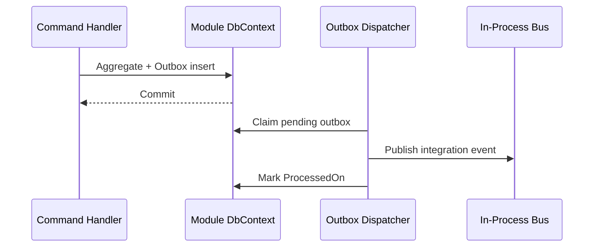

## 55.6 Failure Modes

| Failure | Result | Mitigation |
|---|---|---|
| Crash after commit before dispatch | Lag | Dispatcher retry |
| Consumer fails | Message stays / retry | Inbox + retry count |
| Dual write without outbox | Lost events | Forbidden |

---

# 56. Hangfire Schema Ownership

## 56.1 Placement

Schema `hangfire` (or Host-designated), initialized by Hangfire SQL storage install, **not** by business module EF migrations. Connection string same OLTP DB initially.

## 56.2 Ownership

Host / DevOps. Business modules must not map Hangfire entities in their DbContexts. Jobs call MediatR commands.

## 56.3 Interaction with Outbox

Outbox ensures durable publish; Hangfire executes send/dispatch/reminder work. Do not use Hangfire job storage as the business event log.

## 56.4 Operational Notes

Queue depth monitoring; multi-server Hangfire requires careful locks (PHYSICAL_ARCHITECTURE). Dashboard auth segregated. Purge old succeeded jobs per Hangfire config to control table growth.

## 56.5 Security

App runtime needs DML on hangfire schema; migrator/bootstrap needs DDL once. Restrict dashboard network path.


---

# 57. EF Core Mapping Standards (Implementation-Ready)

## 57.1 Configuration Style

All mappings use Fluent API `IEntityTypeConfiguration<T>` in `Infrastructure/Persistence/Configurations`. Data annotations are discouraged for schema concerns to keep Domain free of persistence attributes—except rare cases approved by Module Owner.

Each configuration must declare:

1. Table name and schema.
2. Primary key.
3. Property conversions (enums ↔ string).
4. Required/optional.
5. Max lengths matching this DDS.
6. Indexes and filtered uniques.
7. Soft-delete query filter at model level (or convention).
8. RowVersion concurrency token where required.
9. Relationships and delete behaviors for children.
10. Value object mappings (OwnsOne/OwnsMany) when used.

## 57.2 Conventions Package (BuildingBlocks)

Shared conventions may apply audit property names and soft-delete filters **without** referencing module entity types by name in a way that couples modules. Prefer markers/interfaces from SharedKernel (`IAuditable`, `ISoftDeletable`, `ITenantScoped`).

## 57.3 Forbidden EF Patterns

- `modelBuilder.Entity("tasks.Tasks")` from another module.
- `HasOne` navigation to types in another assembly’s Domain.
- Lazy loading proxies enabled globally.
- `DeleteBehavior.Cascade` across logical module boundaries (impossible if no FK—keep it that way).
- Migrating on startup in Production.

## 57.4 Shadow Properties

Prefer explicit columns on entities for TenantId/audit for clarity in Domain when part of AuditableEntity. Shadow properties acceptable for purely infrastructural columns if Board prefers thinner domain—but municipal audit often wants CreatedBy visible in domain events; follow SharedKernel AuditableEntity.

## 57.5 Query Splitting

When loading aggregates with multiple collections (Inspection + Findings + Photos), use EF split queries to avoid cartesian explosion. Document in repository methods.

## 57.6 Compiled Queries

Optional for ultra-hot read paths after profiling—not default.

## 57.7 Raw SQL Discipline

Allowed in Infrastructure for Reporting projections and indexed view maintenance. Must be parameterized. Must not modify foreign schemas from a module’s repository except Reporting’s Board-approved projection jobs that INSERT into `reporting` only.

---

# 58. Detailed Outbox Dispatcher Design (Data Perspective)

## 58.1 Claiming Rows

Dispatcher selects top N where `ProcessedOn IS NULL` ordered by `OccurredOn`, using row locking hints appropriate to SQL Server (`READPAST`/`UPDLOCK`/`ROWLOCK` in Infrastructure SQL) to allow competing workers. Updates `RetryCount` and error on failure; after max retries, moves to poison state (`ProcessedOn` set with error OR separate `IsPoison` flag).

## 58.2 Poison Message Table (Optional)

`OutboxPoisonMessages` mirror columns + `MovedAt` for admin replay. Keeps hot outbox index small.

## 58.3 Payload Size

Prefer compact contract payloads with identifiers and critical fields; consumers load local aggregates as needed. Avoid embedding large documents in outbox JSON.

## 58.4 Ordering

Per-aggregate ordering can be preserved by processing sequentially per `AggregateId` when required (workflow advancement). Global total order not guaranteed—consumers must be designed accordingly (EVENT_STORMING policies).

## 58.5 Exactly-Once Illusion

Outbox gives at-least-once publication. Inbox gives at-most-once processing per event id. Together they approximate exactly-once effects for idempotent handlers.

---

# 59. Deep Dive — Identity Module Data Operations

## 59.1 Login Sequence Data Touches

1. Seek User by NormalizedUserName/Email + TenantId + IsDeleted=0.
2. Validate hash; bump AccessFailedCount or reset; possibly set LockoutEnd.
3. Insert LoginHistory.
4. Insert RefreshToken (hash); optionally revoke older excess tokens.
5. Insert outbox UserLoggedInV1 optional.
6. Commit.

All in one IdentityDbContext transaction.

## 59.2 Deactivation Sequence

1. Set IsActive=0; soft delete optional policy.
2. Revoke all refresh tokens.
3. Outbox UserDeactivatedV1.
4. Consumers freeze linked Producer mobile access by LinkedUserId projection—not by deleting Producer.

## 59.3 Permission Matrix Read Model

Optional table `identity.PermissionMatrixReadModel` (UserId, PermissionCode) rebuilt on role changes for fast authorization checks—or keep claims in JWT and only hit DB for resource checks. If matrix table used, index (UserId, PermissionCode) unique.

## 59.4 Seed Permissions Catalog

Each business module owns the **definition** of its permission codes in code; Identity seed upserts into Permissions table at deploy. Administration UI may display matrix but Identity persists.

## 59.5 Growth Operations

LoginHistories partitioned or purged after N months keeping aggregate security analytics in Reporting. RefreshTokens cleanup daily.

## 59.6 Security Failure Modes

| Scenario | Data Response |
|---|---|
| Stolen refresh token reuse | Invalidate family; audit |
| Enumerate emails | Uniform login errors; rate limit at API |
| DBA peek hashes | Acceptable; still not plaintext |
| Backup leak | Encrypt backups; scrub non-prod |

## 59.7 Extended Column Catalog — Users Address Ownership

Address value object fields may alternatively live in `UserAddresses` child table if multiple addresses required later. MVP owns columns on Users. Phone confirmation flows store tokens elsewhere (not durable in Users beyond confirmation flags).

## 59.8 Extended Column Catalog — Roles Isolation

System roles (`IsSystem=1`) cannot be soft-deleted; attempt results in domain error. Tenant-specific custom roles allowed with TenantId. Global platform roles use well-known TenantId or null-tenant convention—**normative: always require TenantId**, with platform tenant Guid for system-wide roles if needed.

## 59.9 Identity ER Expanded

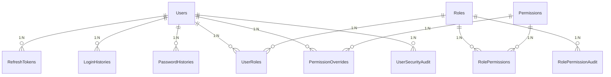

## 59.10 Identity Indexing Rationale Narrative

Login is the most latency-sensitive Identity path after JWT validation caching. The normalized username/email unique indexes must be highly selective and filtered on `IsDeleted=0` so that soft-deleted users do not bloat the unique seek. Refresh token lookup by hash must be unique and seek-based because every authenticated session refresh executes it. Login history is write-heavy append-only; index `(UserId, OccurredAt DESC)` supports security review screens without slowing inserts excessively—if insert cost dominates, drop secondary indexes and serve security reviews from Reporting exports.

## 59.11 Identity Data Retention Narrative

Municipal cybersecurity policies often require retaining login success/failure for months or years. The DDS recommends a hot/warm pattern: keep 90–180 days in `LoginHistories`; ship monthly aggregates to `reporting.LoginSecurityStats`; purge hot rows after export verification. Password histories retain last N hashes (e.g., 10) per user, deleting older hash rows in the same transaction as password change to bound table size.

## 59.12 Identity Cross-Module Reference Map

| Column stored elsewhere | Points to | Enforced by |
|---|---|---|
| producers.Producers.LinkedUserId | identity.Users.Id | Contract on link; event on deactivate |
| tasks.Tasks.AssigneeUserId | identity.Users.Id | Contract |
| inspections.InspectorUserId | identity.Users.Id | Contract |
| *.CreatedBy / ModifiedBy | identity.Users.Id | Soft reference; system Guid allowed |
| notifications.UserId | identity.Users.Id | Directory lookup |

---

# 60. Deep Dive — Producers Module Data Operations

## 60.1 RegisterProducer Transaction

Insert Producer root + optional primary contact/address + outbox ProducerRegisteredV1. Uniqueness of IdentityNumber enforced by filtered unique index; catch violation → domain error `Producers.IdentityNumberAlreadyExists`.

## 60.2 AssignLand Transaction

Validate Land exists/active via Lands contract; validate not duplicate assignment; insert ProducerLandAssignment; outbox ProducerAssignedLandV1; Lands consumer may update CurrentProducerId projection.

## 60.3 AssignSeason Transaction

Validate season active via Seasons contract; enforce no two active seasons for same land via filtered unique/domain; insert assignment; outbox event.

## 60.4 Document Upload Metadata Transaction

After MinIO put succeeds (or with upload session), insert ProducerDocument row. If MinIO fails after SQL commit, reconciliation job deletes orphan metadata or retries upload markers—prefer SQL commit after successful upload with compensating delete on DB failure after upload.

## 60.5 Projection Update Handlers

On InspectionCompletedV1: upsert ProducerInspectionHistoryProjection. On HarvestCompletedV1: upsert harvest projection. These handlers use ProducersDbContext only—no writes to inspections/harvest schemas.

## 60.6 Bank Information Protection

Consider separate table `ProducerBankAccounts` with restricted grants and Always Encrypted if required. MVP columns on Producer allowed with strict API masking.

## 60.7 Producer Search

IX on (TenantId, LastName, FirstName); optional Full-Text Search future—not required. IdentityNumber exact match uses unique index.

## 60.8 Extended Narrative — Assignment Invariants Across Time

Agricultural programs frequently reassign land between producers across seasons. Soft-closing an assignment (`IsActive=0`, `UnassignedAt=now`) preserves history for municipal disputes (“who farmed parcel X in 2025?”). Hard-deleting assignment rows destroys that intelligibility and is rejected by this DDS. Unique filtered indexes apply only to active rows so historical pairs may repeat across time as inactive.

When a Producer is deactivated, active assignments must be closed in the same transaction or via a deliberate policy command that emits events so Lands projections clear `CurrentProducerId`. Leaving active assignments on deactivated producers creates authorization confusion for task assignment policies.

## 60.9 Extended Narrative — Identity Number Changes

Changing IdentityNumber is rare and legally sensitive. Require:

1. Permission `producers.identitynumber.change`
2. Append `ProducerPiiAudit` with old/new values (old value retained per legal policy or hashed)
3. RowVersion concurrency
4. Outbox event for Reporting dimension updates

Filtered unique indexes ensure two active producers never share a number per tenant.

## 60.10 Producer Module Risk Register Expanded

| Risk ID | Description | Likelihood | Impact | Mitigation |
|---|---|---|---|---|
| P-01 | Duplicate IdentityNumber under race | Med | High | Filtered UX + handling |
| P-02 | Dual assignment truth with Lands | Med | High | Single owner + events |
| P-03 | Bank PII in backups | Med | High | Encrypt backups / column protection |
| P-04 | Projection lag shows stale harvest | High | Low | As-of timestamps |
| P-05 | Orphan MinIO docs | Med | Med | Reconcile job |
| P-06 | Soft-deleted producer blocks number reuse incorrectly | Low | Med | Filtered unique design |
| P-07 | LinkedUserId points to deleted user | Med | Med | Deactivate policy + checks |

---

# 61. Deep Dive — Lands Module Data Operations

## 61.1 Parcel Registration

Insert Land with Area>0; unique parcel; outbox LandRegisteredV1. Coordinates inserted as children same transaction.

## 61.2 ArchiveLand

Status=Archived; outbox; Seasons module rejects new seasons via contract `ILandCatalog.IsAssignable`.

## 61.3 Ownership History Corrections

Do not silently edit past ownership; append correction rows with Reason; optional `SupersedesOwnershipId`.

## 61.4 Spatial Future

If geography columns added later, keep existing lat/long; dual-write; Board ADR amendment. GIS indexes are SQL Server spatial indexes—ops concern.

## 61.5 Crop History vs Harvest

LandCropHistory is descriptive land registry data; Harvest is production quantity truth. Reporting may join logical ids in projections, not in OLTP write path.

## 61.6 Lands Index and Growth Narrative

Parcel registries grow slowly relative to tasks but are joined logically everywhere. The unique `(TenantId, ParcelNumber)` filtered index is both an invariant and a lookup path for officer UIs. Coordinates tables remain small (typically <20 points per polygon outline for MVP). If municipalities import cadastral polygons with thousands of points, store simplified outline in SQL and full geometry in MinIO as GeoJSON object key—prevents OLTP bloat.

## 61.7 Lands Concurrency

Two officers editing soil information concurrently rely on RowVersion. Archive versus update conflicts: if archive wins first, update must fail domain validation on archived status even if concurrency token somehow matched—status check is mandatory after reload.

---

# 62. Deep Dive — Seasons Module Data Operations

## 62.1 Creating Active Season Race

Two concurrent CreateSeason/StartSeason for same LandId: filtered unique index causes one SQL failure; translate to business error. This is intentional DB-backed enforcement of AGGREGATE_DESIGN invariant “Only one active season per land.”

## 62.2 Completion Pipeline Data

CompleteSeason sets Status=Completed; outbox SeasonCompletedV1; Reporting refreshes KPIs; Harvest eligibility may already be open from workflow completion—season completion is broader closure.

## 62.3 Configuration Bag Discipline

SeasonConfigurations is not a dumping ground for other modules’ settings. Only season-scoped parameters. Feature flags live in `admin`.

## 62.4 Calendar Milestones

SeasonCalendars support timeline read models; not a replacement for Task due dates.

## 62.5 Season Read Models

`SeasonTimelineReadModel` in seasons or reporting schema: ordered milestones + workflow progress percentages denormalized from events.

## 62.6 Long Narrative — Season as Municipal Planning Spine

Officers think in seasons: “2026 wheat season for parcel P-1042.” Nearly every operational table carries a logical `SeasonId` for filtering. That does not mean Seasons owns those tables. It means Seasons must expose stable ids and status contracts, and every other module must index `SeasonId` for its own queries. When a season archives, modules do not cascade SQL deletes; they refuse new writes via contracts and eventually move hot data to archive stores via jobs keyed by SeasonId.

Completed seasons become read-only at the domain layer. From a database perspective, rows remain mutable at the SQL permission layer (app still has UPDATE), so correctness depends on domain methods—not on stripping UPDATE grants per row. Optionally, a Status check constraint cannot express “read-only,” so do not pretend CHECK can replace domain immutability.

## 62.7 Season Data Quality Checks (Reconciliation Jobs)

Periodic Hangfire job (Admin/Seasons) lists:

- Active seasons pointing at archived lands (logical)
- Multiple active seasons per land (should be impossible—alert if found)
- SeasonAssignments in producers pointing at inactive seasons

Results written to `admin.DataQualityFindings` or `seasons.DataQualityFindings` for officer/admin queues.


---

# 63. Deep Dive — Workflows Module Data Operations

## 63.1 Definition vs Runtime

WorkflowDefinitions and WorkflowVersions are authoring-time artifacts. Publishing a version freezes steps/rules. ProductionWorkflows are per-season (and typically per producer participation) runtime instances. Confusing these leads to incorrect updates of published templates during live seasons—forbidden.

## 63.2 Publishing a Version

Insert new WorkflowVersion with incremented VersionNumber; copy steps; set IsImmutable; optionally mark definition Published. Never edit prior version rows in place.

## 63.3 Starting Production Workflow

Insert ProductionWorkflow + RuntimeSteps snapshot of orders/names needed for offline understanding; Status Running; outbox WorkflowAssigned/Started. Task generation policy in Tasks module consumes event and creates tasks—Workflows must not insert into `tasks` schema.

## 63.4 Advancing Steps

Policy handler in Workflows receives TaskCompletedV1 (inbox idempotent); loads ProductionWorkflow; completes RuntimeStep; opens next; if inspection required, emit event for Inspections module; if last step, complete workflow; outbox WorkflowCompletedV1 for Harvest gates.

## 63.5 Data Shape for RuntimeSteps

Persist enough denormalized step name/type so UI can render without joining definition tables across versions. DefinitionStepId retained for traceability.

## 63.6 Concurrency

Two TaskCompleted events for parallel misuse: RowVersion on ProductionWorkflow ensures sequential advancement; second fails and retries after reload—idempotent if same step already completed.

## 63.7 Extended Narrative — Why Workflow Data Must Stay Small

Workflow aggregates should not absorb Task comments or Inspection photos. RuntimeSteps may store `TaskId` logical references after generation, but Tasks remain the system of record for task state. If officers need a “workflow Gantt,” build a read model joining logical ids via projections, not a mega-aggregate.

## 63.8 Workflow Index Strategy Narrative

`IX_ProductionWorkflows_SeasonId_Status` supports season operations boards. `IX_RuntimeSteps_ProductionWorkflowId_Order` supports loading the aggregate quickly. Definition tables are tiny and rarely need more than PK/UX on codes.

## 63.9 Workflow Failure Modes

| Failure | Data symptom | Response |
|---|---|---|
| Task completed but workflow not advanced | Outbox lag / consumer error | Retry dispatcher; inbox |
| Step skipped manually in DB | Invariant break | Forbid; audit alerts |
| Republish mutates old version | History corruption | Immutability flag + permissions |
| Duplicate production workflows per season | Ambiguous gates | Unique filtered (SeasonId, ProducerId) where Running |

---

# 64. Deep Dive — Tasks Module Data Operations

## 64.1 Mass Task Generation

Season start may create thousands of tasks. Recommended approach:

1. Hangfire job receives GenerateTasksForWorkflowCommand batches.
2. Each batch opens transaction creating N Task aggregates (N small, e.g., 50–200).
3. Outbox events can be batched or one per task—prefer one per task for consumer simplicity but watch outbox size; alternatively `TasksGeneratedBatchV1` for notifications + per-task events for workflow only when needed.
4. Progress stored in `tasks.TaskGenerationJobs` (Id, ProductionWorkflowId, Cursor, Status).

Do not disable indexes during load without ops plan.

## 64.2 CompleteTask Transaction

Load task; domain Complete; set timestamps; outbox TaskCompletedV1 with SeasonId, WorkflowId, StepId, ProducerId; commit. Downstream workflows/notifications eventually consistent.

## 64.3 Reminder Sweep Query

`WHERE Status IN ('Pending','Delayed') AND DueDate < @now AND IsDeleted=0` supported by DueDate indexes; produce Notification idempotency keys `task-reminder:{taskId}:{date}`.

## 64.4 Comments and Photos on Mobile

Insert children without changing Status unless domain requires; still bump ModifiedAt/RowVersion on root to surface concurrency to parallel completes.

## 64.5 TodaysTasks Read Model Refresh

Projector updates on TaskAssigned/Completed/Delayed and on Producer name change events. Read model table avoids joins to producers schema at query time.

## 64.6 Extended Performance Narrative

Task completion at end of day creates write spikes. Keep transactions short; do not send FCM inside transaction. Indexes on Assignee/Status/DueDate help both OLTP lists and Hangfire sweeps. If filtered status indexes help, consider filtered index WHERE Status IN ('Pending','InProgress','Delayed') for active work—completed tasks dominate history and can live on the clustered index for id lookup only.

Partitioning by SeasonId hash or by year extracted from DueDate is a future ops exercise; ensure SeasonId is always populated for operational tasks to make archival by season straightforward.

## 64.7 Task Data Anti-Patterns

- Storing workflow step rules on Task.
- Cascading SQL delete from seasons (no FK anyway).
- Using soft delete for Cancel—use Status=Cancelled.
- Embedding ProducerName without sync strategy—prefer read model.

## 64.8 Task Risk Register Expanded

| Risk | Mitigation |
|---|---|
| Lost update on complete | RowVersion |
| Overdue job stamps duplicates | Idempotency keys |
| Generation job crash mid-way | Cursor checkpoint table |
| Huge includes of photos in lists | Separate endpoints |
| Cross-context transaction with Workflows | Forbidden; use outbox |

---

# 65. Deep Dive — Inspections Module Data Operations

## 65.1 Creating from Policy

Inspections module consumes NeedsInspection events; inserts Inspection Assigned; notifies inspector. Does not update Tasks schema; may store TaskId logical.

## 65.2 Completing with Evidence

Insert findings/photos metadata; set Result; Status=Completed; outbox InspectionCompletedV1 / Failed variants. Harvest eligibility consumers react.

## 65.3 Immutability Enforcement

EF configurations do not magically freeze rows; repositories for update commands must refuse when Status=Completed unless compensating command type. Optional SQL trigger for belt-and-suspenders in regulated deployments—owned by Infrastructure ops scripts, not Domain.

## 65.4 Corrective Tasks

Findings with RequiresCorrectiveTask emit integration events; Tasks module creates tasks—Inspections stores CorrectiveTaskId when Event returns or via follow-up event.

## 65.5 Evidence Retention Narrative

Photos are legally meaningful. Metadata rows carry RetentionClass and LegalHold. MinIO object lifecycle policies should mirror classes. SQL purge without MinIO purge creates orphan bytes; MinIO purge without SQL purge creates broken links—jobs must be paired and audited.

## 65.6 Inspection Query Patterns

Officer queue, inspector mobile list, season failed inspections report. Each needs indexes listed earlier. Failed inspections dashboard should use read model counting by season for Reporting.

---

# 66. Deep Dive — Harvest & Delivery Joint Operations

## 66.1 Module-Internal Transaction Pattern (Normative)

```text
Begin HarvestDbContext transaction
  Load Harvest (tracked)
  harvest.RegisterDelivery(quantity)  // domain
  Create Delivery aggregate + children
  Write audits + outbox
Commit
```

## 66.2 Cancellation Pattern

```text
Load Delivery + Harvest
  delivery.Cancel()
  harvest.ReleaseDelivery(quantity)
  audits + outbox
Commit
```

## 66.3 Why FK Between harvest and delivery Is Preferred

Prevents deliveries pointing at non-existent harvest ids inside the module. Does not replace quantity invariant checks. Cross-module still Guid-only.

## 66.4 Denormalized SeasonId on Delivery

Supports season logistics queries without joining harvest table always; keep in sync at create time from Harvest.SeasonId; immutable afterward.

## 66.5 Money Fields

UnitPrice × Quantity computed in domain for invoice totals; store Amount on invoice explicitly to freeze historical money even if prices change.

## 66.6 Extended Narrative — End-of-Season Close

Season close depends on DeliveryCompleted projections (MODULE_DESIGN). Reporting “as-of” timestamps help officers understand lag. Schema support: Delivery.Status indexed; Reporting projector watermark; SeasonCompletionEligibility read model boolean flags.

## 66.7 Quantity Audit Example Rows (Logical)

A harvest TotalAmount changes after measurement correction: audit row records old/new totals. A delivery cancel: audit on both DeliveryQuantityAudit and HarvestQuantityAudit. These tables are append-only and retained longer than operational editable columns.

## 66.8 Harvest/Delivery Risk Register

| Risk | Mitigation |
|---|---|
| Concurrent oversell | RowVersion + domain |
| Missing FK to season | Intentional; contracts |
| Invoice number collision | UX per tenant |
| Treating Delivery as Support | Naming + schema split |
| Updating DeliveredAmount from Reporting | Forbidden |

## 66.9 Mermaid — Joint Write

```mermaid
sequenceDiagram
  participant API
  participant HApp as Harvest Application
  participant HAgg as Harvest Aggregate
  participant DAgg as Delivery Aggregate
  participant DB as HarvestDbContext
  API->>HApp: CreateDeliveryCommand
  HApp->>HAgg: RegisterDelivery
  HApp->>DAgg: Create
  HApp->>DB: SaveChanges (harvest+delivery+outbox)
  DB-->>API: OK
```

---

# 67. Deep Dive — Support, Notifications, Communication

## 67.1 Support Approval Decision Transaction

Update SupportApproval status; write SupportDecisionAudit; outbox SupportApprovedV1/RejectedV1; Notifications consumer sends message; Producers projection updates support history.

## 67.2 Support Fulfillment

Insert SupportFulfillment child; cannot exceed approved amount (domain + CK). Distinct from crop Delivery tables.

## 67.3 Notification Idempotency Narrative

Every send intent must have IdempotencyKey. Example keys:

- `welcome-user:{userId}`
- `task-assigned:{taskId}`
- `task-reminder:{taskId}:{yyyyMMdd}`
- `inspection-assigned:{inspectionId}`

Unique constraint turns provider retries into no-ops at insert or at send layer after successful insert.

## 67.4 Device Token Rotation

Insert new token; deactivate old for same device id; Hangfire send uses active tokens only. Provider NotRegistered errors deactivate tokens.

## 67.5 Communication Idempotent Mobile Send

ClientMessageId unique per conversation prevents double-tap duplicate messages. Soft delete hides from UI but retains for audit per policy.

## 67.6 Conversation Participation

Participants table allows multiple officers; authorization checks membership for message write. Do not FK UserId to identity schema.

## 67.7 Volume Management

Notifications and Messages are top candidates for partitioning and retention. Communication attachments follow MinIO paired lifecycle.

## 67.8 Combined Risk Narrative

Async fan-out modules must never be transactional with Tasks/Harvest commits beyond outbox. Provider downtime queues attempts; domain truth already committed. This is foundational to PHYSICAL_ARCHITECTURE and MODULE_DESIGN reliability stories.

---

# 68. Deep Dive — Reporting & Administration Data

## 68.1 Nightly KPI Refresh

Hangfire job computes SeasonKpiSnapshots for active and recently completed seasons; writes AsOf=UtcNow; officers see lag explicitly.

## 68.2 On-Event Refresh

SeasonCompleted triggers targeted rebuild. TaskCompleted may update incremental counters via projector rather than full rebuild.

## 68.3 ReportRuns

User-requested heavy reports create ReportRuns row Pending; worker generates file to MinIO; sets ObjectKey Completed; API returns download link. SQL does not store report BLOBs.

## 68.4 Admin Feature Flags

Flags read frequently—cache in memory with invalidation on change events (MODULE_DESIGN caching). SQL remains source of truth.

## 68.5 Admin Settings vs Season Configuration

SystemSettings for platform; SeasonConfigurations for season; do not mix.

## 68.6 Data Quality Findings Table (Optional admin/seasons)

Id, Code, Severity, PayloadJson, DetectedAt, ResolvedAt—operates as municipal data stewardship queue.

---

# 69. Index Design Playbook for Module Owners

## 69.1 Steps for Every New Query Path

1. Write the query shape (filters, order, page).
2. Estimate cardinality per tenant.
3. Propose index with equality then range columns.
4. Consider soft-delete filter.
5. Consider TenantId leading column for multi-tenant.
6. Evaluate write amplification on hot tables.
7. Add to PR description with expected plan.
8. Verify with integration test that index exists (metadata).

## 69.2 When to Use INCLUDE Columns

When key lookup dominates and selected columns are small stable fields (Status, DueDate already in key—avoid duplication). Do not INCLUDE nvarchar(max).

## 69.3 Filtered Indexes

Ideal for Status subsets and IsDeleted=0 uniqueness. Remember filtered indexes require queries to match filter predicates for use—EF filters should align.

## 69.4 Disable Index During Bulk

Only with ops; rebuild after; rare for MVP.

## 69.5 Monitoring Index Health

Track unused indexes via DMVs in non-prod first; do not drop Production indexes without a week of monitoring and Board note for hot paths.

---

# 70. Constraint Design Playbook

## 70.1 Prefer Domain + Unique Indexes for Business Rules

Unique active season per land is perfect for UX filtered index. Workflow step sequencing is not.

## 70.2 Check Constraints Catalog (Baseline)

| Table | Check |
|---|---|
| Lands | AreaValue > 0 |
| Harvests | TotalAmount >= 0 AND DeliveredAmount >= 0 AND ReservedAmount >= 0 AND DeliveredAmount + ReservedAmount <= TotalAmount |
| Deliveries | Quantity > 0 |
| Seasons | PeriodEnd >= PeriodStart |
| Soft-delete entities | (IsDeleted=0 AND DeletedAt IS NULL) OR (IsDeleted=1 AND DeletedAt IS NOT NULL) |
| SupportFulfillments | Amount > 0 |

## 70.3 Defaults

IsDeleted default 0; CreatedAt default not relied upon—application sets UTC via IClock for testability. SQL defaults optional backup.

---

# 71. Multi-Tenant Data Design Expanded

## 71.1 TenantId Ubiquity

Roots and major children carry TenantId for filtering even when parent has it—denormalized for index seeks without parent join.

## 71.2 Cross-Tenant Hardening

Application fails closed if User.TenantId ≠ resource.TenantId. Future SQL RLS predicates `TenantId = SESSION_CONTEXT` can mirror this.

## 71.3 Shared Reference Data

Permissions codes may be global; still can be stored without TenantId or with platform tenant. Document choice in Identity seed.

## 71.4 Second Municipality Onboarding

No schema-per-tenant required: new TenantId value; seed roles; configure host bindings. Validate unique indexes include TenantId.

## 71.5 Tenant Move / Merge

Out of scope for MVP; GUIDs make row moves possible but politically complex—Board required.

---

# 72. Backup, Restore, and DR Runbook Alignment (Data)

## 72.1 What Must Be Consistent

Aggregates + outbox in same DB backup provide consistent municipal state for workflows. Hangfire may replay jobs—idempotency required. MinIO backup separately restores evidence bytes.

## 72.2 Restore Test Checklist

1. Restore DB to isolated instance.
2. Verify migration history tables present per schema.
3. Run health checks.
4. Spot-check season + tasks + harvest quantities.
5. Verify outbox unprocessed rows make sense.
6. Pair MinIO restore; spot-check object keys from InspectionPhotos.
7. Scrub if restoring to non-prod.

## 72.3 RPO/RTO Interaction with Outbox

After restore, dispatcher may publish events consumers already processed—inbox protects. External FCM may duplicate push—acceptable if content idempotent; prefer user-visible dedupe by IdempotencyKey.

## 72.4 Encryption of Backups

Municipal backups containing PII/identity numbers must be encrypted at rest on backup media.

---

# 73. Archival Job Design (Data)

## 73.1 Season Archival Candidate Selection

Seasons with Status=Completed/Archived and PeriodEnd < @cutoff and no LegalHold on related inspections.

## 73.2 Move vs Copy

First copy to archive database/tables; verify counts; then delete/purge from hot tables in batches; update Reporting to read cold if needed.

## 73.3 What Not to Archive Early

Active permission tables, identity users, land registry—archive operational season graphs first (tasks, notifications, outbox processed rows).

## 73.4 Outbox Archival

Processed outbox rows older than N days move to `OutboxMessagesArchive` or delete after Reporting no longer needs replay.

---

# 74. Security Deep Dive for Database Design

## 74.1 Threat: Cross-Module Data Exfiltration via Views

Developers might create convenience views joining all schemas. Forbidden for write modules. Reporting-owned views only, read-only, reviewed.

## 74.2 Threat: Privilege Escalation via SQL Injection

Mitigated by parameterized EF; code review for raw SQL; least privilege.

## 74.3 Threat: Insider SELECT on Bank IBAN

Separate table + column permissions + auditing + encryption options.

## 74.4 Threat: Backup Theft

Encrypt; access control; inventory.

## 74.5 Threat: Non-Prod Data Leak

Anonymize Producer names, identity numbers, phones on restore to Dev.

## 74.6 Audit of Privileged Queries

Optional SQL Server Audit / Extended Events for SELECT on sensitive tables in Production.

## 74.7 Secrets

Connection strings in secret stores (ADR-020); never in git; never in DATABASE_DESIGN examples as real secrets.

---

# 75. Performance Budgets and Capacity Planning

## 75.1 SRS Alignment

Average API under ~300ms (PHYSICAL/SRS targets)—database portion must be small seeks. Dashboards that cannot meet budgets must move to read models.

## 75.2 Season Start Capacity

Estimate tasks = producers × steps. Size transaction log for batch inserts. Coordinate with ops.

## 75.3 Connection Pool Math

API threads + Hangfire workers × contexts usage patterns; avoid opening multiple contexts concurrently per request unless necessary (usually one module per command).

## 75.4 Autogrowth

Set sane filegrowth to avoid VLF fragmentation; ops standard.

## 75.5 Read Replica Future Trigger

When Reporting CPU contends with OLTP, introduce replica before extraction.


---

# 76. Municipal Worked Scenarios (Persistence Lens)

## 76.1 Scenario A — Peak Planting Week

During peak planting, officers assign workflows to hundreds of producers. Physically this means:

1. Many ProductionWorkflow rows inserted in `workflows`.
2. Task generation jobs insert large volumes into `tasks.Tasks`.
3. Outbox tables in workflows/tasks grow quickly with Assigned events.
4. Notifications inserts surge with idempotency keys.
5. SignalR dashboards query read models, not write aggregates.

Database design implications already mandated by this DDS: indexes on SeasonId/Status, outbox filtered indexes, notification unique idempotency, short transactions, Hangfire off the request thread, connection pool headroom, and transaction log capacity. Without TodaysTasks-style read models, officer dashboards will scan active tasks repeatedly and contend with writers.

Failure mode: a single GenerateTasks command tries to insert all tasks in one transaction lasting minutes—log growth, locking, client timeouts. Mitigation: batched generation with checkpoint table.

## 76.2 Scenario B — Field Photo Evidence on Weak Cellular

Inspector captures photos offline/online intermittently. Upload API validates content-type/size, stores MinIO object, writes InspectionPhoto metadata in same module transaction as needed, outbox notifies. If metadata commits without object, reconcile. If object without metadata, orphan GC after TTL.

Database design must not use BLOBs. Checksums stored for integrity. LegalHold flags possible later.

## 76.3 Scenario C — Nightly Reminder Sweep

Hangfire queries overdue tasks using DueDate indexes; enqueues notification commands; Notifications persists with idempotency per day; attempts recorded. Failures retry without corrupting Tasks.

## 76.4 Scenario D — Concurrent Delivery Quantity Race

Already specified in Harvest/Delivery deep dive; RowVersion + domain RegisterDelivery; 409 to client.

## 76.5 Scenario E — Database Host Patch Failure

Restore SQL PITR; aggregates and outbox consistent; Hangfire re-runs idempotent; MinIO paired restore. DDS forbids designs where critical state lives only in Hangfire storage.

## 76.6 Scenario F — Producer Deactivation Mid-Season

Identity/Producer deactivate; refresh tokens revoked; tasks already assigned remain historically queryable; new assignments blocked by contracts; notifications may inform officers. Soft delete keeps FK-less references resolvable for history (“assigned to deactivated producer”).

## 76.7 Scenario G — Inspection Fail Blocks Harvest

InspectionCompleted with Fail → policy prevents StartHarvest via eligibility contract; optional flag projection on season progress read model. No cross-schema FK enforces this—by design—so eligibility service must be correct and tested.

## 76.8 Scenario H — Support Approval with Document Pack

SupportApproval + documents metadata; decision audit; events update producer projection; fulfillment later separate. Financial amounts decimal precise.

## 76.9 Scenario I — Communication Thread on a Task

Conversation with TaskId logical; messages cursor-paged; participants authorized; SignalR pings; SQL stores body. Retention distinct from Tasks.

## 76.10 Scenario J — KPI Board After Season Complete

SeasonCompleted → Reporting job → SeasonKpiSnapshots row with AsOf; officers see completed harvest/delivery counts without scanning OLTP children.

---

# 77. Complete Logical Data Dictionary Notes by Schema

This section expands column-level meaning for implementers. It is normative for nullability and purpose; lengths may be tightened by Module Owners if documented in migration PR, but not loosened for security-sensitive fields without Board note.

## 77.1 identity Schema Dictionary Highlights

**Users.NormalizedEmail** — uppercase/invariant culture normalization used only for uniqueness and login seek; display Email preserves user casing.

**Users.SecurityStamp** — rotated on password change and privilege changes that must invalidate outstanding access tokens that still validate cryptographically until expiry; application may keep short JWT lifetimes to reduce window.

**RefreshTokens.FamilyId** — all rotations share family; reuse of an already-rotated token hash invalidates entire family (theft detection).

**Permissions.Code** — stable string matching MODULE_DESIGN permission catalogs; renaming requires migration of RolePermissions and JWT claim generation.

**PermissionOverrides.IsGrant** — false means explicit deny dominating role grants when evaluation order defines deny-wins (document in Identity authorization service).

## 77.2 producers Schema Dictionary Highlights

**IdentityNumber** — municipal/national identifier; unique per tenant among non-deleted; treat as PII.

**LinkedUserId** — optional link for mobile app user; not required for all producers if officers register producers before account invite.

**ProducerLandAssignments.IsActive** — soft-close assignments without losing history.

**Projection tables** — never written by Harvest/Inspections DbContexts; only by Producers event handlers.

## 77.3 lands Schema Dictionary Highlights

**ParcelNumber** — business key with TenantId.

**AreaValue/AreaUnit** — unit conversions belong in domain services, not silent SQL updates.

**CurrentProducerId** — projection only; may be null when unassigned.

**LandCoordinates.Sequence** — order for polygon drawing; not a substitute for GIS topology validation.

## 77.4 seasons Schema Dictionary Highlights

**Status** — Draft/Active/Paused/Completed/Archived; filtered unique applies to Active.

**PeriodStart/PeriodEnd** — inclusive municipal calendar dates; store as `date` not datetime to avoid TZ ambiguity; interpret in municipality local timezone at application layer.

**ActiveWorkflowId** — logical pointer to ProductionWorkflow; optional convenience.

## 77.5 workflows Schema Dictionary Highlights

**WorkflowVersions.VersionNumber** — monotonic per definition.

**WorkflowSteps.Order** — dense integers starting at 1; gaps discouraged.

**ProductionWorkflows.CurrentStepOrder** — denormalized pointer for quick UI; RuntimeSteps remain authoritative list.

**RuntimeSteps.TaskId** — logical; set when Tasks acknowledges generation.

## 77.6 tasks Schema Dictionary Highlights

**Status** — Pending/InProgress/Completed/Cancelled/Delayed; terminal states Completed/Cancelled.

**AssigneeUserId vs ProducerId** — producer is business subject; assignee user may be producer-linked user or officer depending on task type; both logical Guids.

**DueDate** — UTC or municipal local stored consistently; document `IClock` TZ policy in BAS; DDS requires single convention per deployment.

## 77.7 inspections Schema Dictionary Highlights

**Result** — Pass/Fail/Conditional; null until completed.

**LegalHold** — boolean blocking purge.

**Findings.Severity** — Info/Warn/Critical; drives corrective policies.

## 77.8 harvest / delivery Schema Dictionary Highlights

**DeliveredAmount/ReservedAmount** — concurrency-sensitive.

**RemainingAmount** — prefer computed column `TotalAmount - DeliveredAmount - ReservedAmount` persisted for indexing if queries filter remaining>0.

**Deliveries.BuyerName** — not a separate CRM aggregate in MVP.

**Invoices.DocumentNumber** — unique per tenant when present.

## 77.9 support Schema Dictionary Highlights

**ProgramCode** — municipal support program identifier.

**ApprovedAmount** — may be less than RequestedAmount.

**SupportFulfillments** — payment/logistics of support benefits, not crop delivery.

## 77.10 notifications Schema Dictionary Highlights

**IdempotencyKey** — unique; essential.

**PayloadJson** — deep links, entity ids; avoid large blobs.

**ChannelBindings** — tokens/addresses; deactivate don’t hard delete immediately for audit.

## 77.11 communication Schema Dictionary Highlights

**ClientMessageId** — mobile idempotency.

**Body** — PII possible; retention policy required.

## 77.12 reporting Schema Dictionary Highlights

**AsOf** — mandatory on snapshots for lag honesty.

**ProjectorWatermarks** — exactly-once-ish projection progress.

## 77.13 admin Schema Dictionary Highlights

**FeatureFlags.Key** — stable string; changes audited.

**SystemSettings.Value** — stringified; typed parse in Application.

## 77.14 hangfire Schema

Opaque to business DDD; do not document Hangfire internal columns as domain. Ops monitors size and purge settings.

---

# 78. Read Model Catalog (Authoritative List)

| Read Model | Owning Schema | Update Mechanism | Primary Keys / Uniques | Consumers |
|---|---|---|---|---|
| TodaysTasksReadModel | tasks | Outbox projectors | TaskId | Officer/producer dashboards |
| SeasonTimelineReadModel | seasons or reporting | Events | SeasonId | Timeline UI |
| SeasonProgressReadModel | reporting | Events + nightly | SeasonId | KPI |
| ProducerSupportSummary | producers | Events | ProducerId | Producer profile |
| ProducerHarvestHistoryProjection | producers | Events | ProducerId+HarvestId | Profile |
| ProducerInspectionHistoryProjection | producers | Events | ProducerId+InspectionId | Profile |
| PermissionMatrixReadModel | identity | Role events | UserId+PermissionCode | AuthZ optional |
| SeasonHarvestSummary | harvest or reporting | Events | SeasonId | Harvest boards |
| SeasonCompletionEligibility | reporting/seasons | Events | SeasonId | Close season UI |
| AdminDeliveryStats | notifications | Aggregates | Day+Channel | Admin |

Each read model table includes `UpdatedAt` and optionally `LastEventId` for diagnostics. Rebuild guidance follows BACKEND Appendix I: define source events, idempotent apply, ownership, and rebuild job.

---

# 79. Event-to-Table Projection Matrix

| Integration Event | Writes |
|---|---|
| UserRegisteredV1 | identity already written; notifications welcome; reporting dimension |
| UserDeactivatedV1 | producers freeze link; notifications |
| ProducerRegisteredV1 | reporting producer dim; notifications |
| ProducerAssignedLandV1 | lands CurrentProducerId projection |
| SeasonCompletedV1 | reporting KPI rebuild |
| WorkflowCompletedV1 | harvest eligibility projections |
| TaskCompletedV1 | workflows advance; notifications; season progress counters |
| InspectionCompletedV1 | harvest eligibility; producer inspection projection; corrective tasks |
| HarvestCompletedV1 | producer harvest projection; reporting; delivery suggestion policies |
| DeliveryCompletedV1 | reporting; season eligibility |
| SupportApprovedV1 | producer support projection; notifications |
| Notification send failures | notification attempts; admin alerts |

This matrix prevents accidental dual ownership of writes.

---

# 80. Isolation, Locking, and Deadlock Playbooks Expanded

## 80.1 Preferred Lock Order Inside Harvest Module

Always update Harvest root before inserting Delivery children when both in one transaction—document in code review checklist. If a future command updates Delivery then Harvest, standardize one order globally in the module to reduce deadlock cycles.

## 80.2 Outbox Claim Locking

Use `READPAST` so workers skip locked rows; prevents queue stall. Keep claim batches small.

## 80.3 Avoid Lock Escalation

Batch deletes for retention (e.g., 1000 rows per transaction) instead of deleting millions once.

## 80.4 Snapshot Isolation Option

If DBA enables RCSI, writers don’t block readers as much—good for dashboards reading write tables before read models exist. Still introduce read models for heavy boards.

## 80.5 Deadlock Graph Analysis

Ops captures deadlock XML; developers fix ordering or shorten transactions; do not “fix” with nolock on municipal writes.

---

# 81. Migration Playbooks Expanded

## 81.1 Adding a Column

Expand nullable → deploy app that writes both → backfill job → add check/not null → contract remove unused.

## 81.2 Renaming a Column

Add new → dual write → switch read → remove old. Avoid raw rename in hot Production without expand-contract.

## 81.3 Splitting a Table

Create new table → backfill → dual write → switch → drop old. Example: moving Bank fields out of Producers.

## 81.4 Introducing Filtered Unique Index

Ensure no duplicate violators first via data quality job; then build index online if Enterprise edition features available; else maintenance window.

## 81.5 Multi-Schema Harvest Migration

HarvestDbContext migrations must carefully order creation of harvest schema objects before delivery FK to harvest. Initial migration creates both schemas’ tables.

## 81.6 Rollback Strategy

Prefer forward-fix migrations. If rollback required, have pre-authored down migration tested in staging; never restore Production backup for small schema mistakes if PITR impact unacceptable—decision by ops.

## 81.7 Migration CI Gates

Empty DB apply; sample data apply; architecture test no cross-module FK; smoke query plans optional.

---

# 82. Seed Playbooks Expanded

## 82.1 Identity Seed Order

Permissions → Roles → RolePermissions → Admin user → Admin role link.

## 82.2 Demo Municipality Seed (Non-Prod)

Lands, Producers, Season, Workflow definition/version, ProductionWorkflow, Tasks sample, Inspection sample, Harvest/Delivery sample—ids stable GUIDs documented for e2e tests.

## 82.3 Idempotent Seed Implementation Guidance

Use `UPSERT` by natural key; do not delete Production data in seeds. Environment gate: Demo seeds run only if `SEED_DEMO=true`.

## 82.4 Permission Drift Detection

Integration test compares module permission constants to Identity Permissions table after seed.

---

# 83. Monitoring Queries (Logical Descriptions — Not Scripts)

Ops/Module Owners should implement monitoring that answers:

1. Age of oldest unprocessed outbox row per schema.
2. Count of notifications Pending older than N minutes.
3. Tasks InProgress older than SLA.
4. Failed inspections last 24h.
5. Harvests with RemainingAmount>0 and season completed.
6. Hangfire failed jobs count.
7. Index fragmentation on Tasks/Notifications/Outbox.
8. DB CPU/DTU vs baseline in planting week.
9. Login failure spikes.
10. Backup age and last successful restore test date.

These are health of the data estate, complementing `/health` connectivity checks.

---

# 84. Future PostgreSQL Migration Checklist (Database Design)

1. Inventory filtered indexes and recreate PostgreSQL partial indexes.
2. Replace rowversion with `bytea` concurrency token or `xmin` strategy via EF.
3. Replace `datetime2` with `timestamptz` conventions.
4. Recreate check constraints.
5. Validate GUID storage (`uuid`).
6. Hangfire storage provider compatibility verification.
7. Temporal tables feature parity reassessment.
8. Partitioning using declarative partitioning.
9. Dual-run integration tests.
10. Cutover runbook with reverse sync plan.

ANSI-friendly design in this DDS makes the path credible without requiring PostgreSQL day one (ADR-005).

---

# 85. Future Sharding Checklist

1. Ensure all queries are TenantId-scoped.
2. Remove any accidental global scans without tenant predicate.
3. Outbox per shard.
4. Reporting aggregation story across shards.
5. Identity global vs per-shard decision (often shared platform).

---

# 86. Future Replication Checklist

1. Read-only connection string for Reporting queries.
2. Lag metrics exposed as AsOf awareness.
3. Failover pairing with MinIO independent.
4. Hangfire remains on primary writer.

---

# 87. Compliance Mapping (Auditability)

| Municipal Need | Database Mechanism |
|---|---|
| Who changed harvest qty | HarvestQuantityAudit + audit columns |
| Who approved support | SupportDecisionAudit |
| Who failed login | LoginHistories |
| What permissions existed | RolePermissionAudit + seeds |
| Evidence of inspection | InspectionPhotos metadata + MinIO + LegalHold |
| Reconstruct season | Soft delete + archive + status model |
| Correlate logs to data | CorrelationId on outbox/audit |

---

# 88. Anti-Corruption and Reporting Views Policy

If temporary views in `reporting` select from `tasks`/`seasons` etc.:

1. View definitions owned by Reporting module migrations only.
2. GRANT SELECT on underlying tables to reporting reader role carefully—or use COPY tables instead (preferred).
3. No INSTEAD OF triggers writing back.
4. Plan to replace views with projected tables within a fixed roadmap quarter after introduction.

Preferred long-term: event-projected tables only.

---

# 89. Explicit Non-Contradictions Summary

| Topic | Decision Aligned To |
|---|---|
| Modular monolith single DB | ADR-001/005 |
| Schema-per-module | MODULE_DESIGN §2.5 |
| Harvest includes Delivery | MODULE_DESIGN §6.8 |
| Separate Delivery aggregate | AGGREGATE_DESIGN + same module |
| No cross-module FK | ADR-016/017 |
| GUID PKs | SharedKernel / BAS |
| Soft delete + audit + rowversion | ADR-016 |
| Outbox per module | MODULE_DESIGN / BAS §8 |
| Hangfire separate schema | BAS / SAS |
| CQRS same DB initially | ADR-003 |
| Producer histories as projections | MODULE_DESIGN §6.2 |
| MinIO for binaries | ADR-005/010 |
| Administration ≠ Identity | MODULE_DESIGN / BAS |

No `INFRASTRUCTURE_ARCHITECTURE.md` was found; nothing invented beyond PHYSICAL/BACKEND/ADR alignment.


---

# 90. Column-by-Column Specifications for Core Roots

The following subsections restate root tables with richer “meaning” narratives so EF teams can write accurate configurations and documentation without inventing columns that contradict domain language.

## 90.1 Users Root — Extended Meaning

The User root is the security principal for JWT issuance. `IsActive=false` must prevent new access token issuance even if password hash remains valid. Soft delete is stronger removal from directories but historical `CreatedBy` references remain as Guids. `TenantId` scopes uniqueness of username/email so two municipalities can coincidentally share emails only if product allows—**normative uniqueness is per tenant**, not global, unless Board mandates global email uniqueness for SaaS login UX.

Address fields are optional for officers created by admin; producers’ farm addresses live primarily in Producers module—do not duplicate conflicting addresses without sync policy. Prefer Identity address for account contact only.

## 90.2 Producer Root — Extended Meaning

Producer is the agricultural actor registry entry. `Status` and `IsDeleted` interact: deactivated producers are usually `Status=Deactivated` with `IsDeleted=0` to remain visible in historical season UIs; soft delete reserved for mistaken registrations or privacy purge staging. `IdentityNumber` is the business uniqueness key. `LinkedUserId` connects mobile authentication without merging aggregates.

Bank information columns are optional until support fulfillment requires them; once present, masking in DTOs is mandatory.

## 90.3 Land Root — Extended Meaning

Land is cadastral/agricultural parcel truth for area and soil. Archival status blocks new seasons via contracts. ParcelNumber formatting rules are municipal; DB stores string as provided after domain normalization.

## 90.4 Season Root — Extended Meaning

Season binds a time-bounded production program to a land. The filtered unique active-per-land index is a rare example where SQL enforces a cross-row invariant that matches AGGREGATE_DESIGN closely. Pause is non-terminal; Complete is terminal for writes; Archive is colder.

## 90.5 ProductionWorkflow Root — Extended Meaning

Runtime instance executes a published version. It is not a template. CurrentStepOrder accelerates reads but RuntimeSteps remain the list to validate “cannot skip steps.” Completion opens harvest eligibility through events, not through writing harvest rows.

## 90.6 Task Root — Extended Meaning

Task is the unit of producer/officer work. Terminal statuses must be enforced in domain. DueDate drives reminders. Workflow linkage columns enable TaskCompleted policies to advance the correct RuntimeStep without Tasks module referencing Workflows DbContext.

## 90.7 Inspection Root — Extended Meaning

Inspection is municipal verification. Completed inspections are evidence records. Result drives policies. LegalHold protects from retention jobs. TaskId/WorkflowId logical association satisfies “must belong to one task or workflow” invariant—with application validation that at least one is present.

## 90.8 Harvest Root — Extended Meaning

Harvest captures quantities for a season/producer participation. DeliveredAmount is not a simple cache—it is concurrency-critical inventory of what has been committed to deliveries. ReservedAmount supports optional hold before delivery completion if product needs reservation semantics; if unused, keep zero.

## 90.9 Delivery Root — Extended Meaning

Delivery records logistics transfer of harvested product to a buyer. Quantity must not exceed remaining harvest. Status Completed contributes to season close projections. Invoice/receipt children freeze financial documents.

## 90.10 SupportApproval Root — Extended Meaning

Municipal support decision record. Distinct bounded language from crop Delivery. Approvals may exist without immediate fulfillment.

## 90.11 Notification Root — Extended Meaning

Persisted intent/result of communicating with a user through a channel. IdempotencyKey is part of the aggregate’s uniqueness identity for sends.

## 90.12 Conversation Root — Extended Meaning

Thread container for messages. Logical links to Season/Producer/Task provide context without owning those aggregates.

---

# 91. Child Entity Specifications Expanded

## 91.1 Photo/Document Metadata Shape (Reusable Logical Pattern)

Across Producers, Lands, Tasks, Inspections, Harvest, Delivery, Support:

| Column | Meaning |
|---|---|
| Id | Guid PK |
| ParentId | FK within schema |
| ObjectKey | MinIO key |
| Bucket | Bucket name |
| ContentType | MIME |
| SizeBytes | long |
| Checksum | hash |
| OriginalFileName | optional |
| UploadedBy | Guid |
| UploadedAt | datetime2 |
| RetentionClass | enum string |
| IsDeleted | soft delete |
| Audit columns | standard |

No binary content columns. VirusScanStatus optional (`Pending/Clean/Infected`).

## 91.2 Comment Shape

Id, ParentId, AuthorUserId, Body, CreatedAt, IsDeleted. After parent immutability, reject inserts in domain.

## 91.3 Audit Entry Shape

Id, EntityId, FieldName, OldValue, NewValue, ChangedAt, ChangedBy, CorrelationId, Reason. Old/New as nvarchar; structured JSON allowed for multi-field snapshots.

---

# 92. Cross-Cutting Column Sets (Apply Consistently)

## 92.1 AuditableEntity Set

CreatedAt, CreatedBy, ModifiedAt, ModifiedBy — all roots and children unless append-only tables use only Created*.

## 92.2 SoftDeletable Set

IsDeleted, DeletedAt, DeletedBy — except append-only audit/history where delete forbidden.

## 92.3 TenantScoped Set

TenantId on roots and query-heavy children.

## 92.4 Concurrency Set

RowVersion on contested roots; optional on heavily contested children.

---

# 93. Decision Log (Database Design Decisions)

| ID | Decision | Alternatives Rejected | Rationale |
|---|---|---|---|
| DD-01 | Schema-per-module in one DB | DB-per-module day one | Extraction-ready without ops explosion |
| DD-02 | No cross-module FK | Cross-schema FK | ADR-016/017 |
| DD-03 | GUID app-generated PKs | IDENTITY ints | Merge/extract/security |
| DD-04 | Soft delete default | Hard delete default | Municipal history |
| DD-05 | rowversion concurrency | Pessimistic locks | Mobile UX |
| DD-06 | Outbox per module | Central shared outbox only | Ownership clarity |
| DD-07 | Hangfire in hangfire schema | Hangfire in dbo unmanaged | Host ownership |
| DD-08 | HarvestDbContext owns delivery schema | Separate Delivery module DB | MODULE_DESIGN §6.8 |
| DD-09 | Producer histories as projections | Fat producer aggregate | MODULE_DESIGN clarification |
| DD-10 | String status codes | Untyped ints without docs | Supportability |
| DD-11 | MinIO keys not BLOBs | varbinary evidence | ADR-005/010 |
| DD-12 | Reporting projections co-located | Separate read DB day one | ADR-003 |
| DD-13 | Filtered uniques with soft delete | Unfiltered uniques | Allow controlled reuse |
| DD-14 | Prefer sequential GUID v7 | Random v4 clustered | Fragmentation |
| DD-15 | Expand-contract migrations | Breaking renames in-place | Municipal uptime |

---

# 94. Glossary (Database Design)

| Term | Definition |
|---|---|
| Aggregate | Consistency boundary; maps to table cluster |
| Logical Guid reference | Cross-module id without FK |
| Outbox | Durable table for reliable integration publish |
| Inbox | Consumer idempotency table |
| Read model | Denormalized query table/projection |
| RowVersion | SQL Server concurrency token |
| Soft delete | IsDeleted flag hiding row from default queries |
| Schema-per-module | SQL schema ownership boundary |
| Harvest module | Owns harvest + delivery schemas |
| SupportFulfillment | Support benefit delivery; not crop Delivery |
| Legal hold | Flag blocking purge/archive |
| Projector watermark | Cursor for read model catch-up |
| Expand-contract | Safe migration pattern |
| RCSI | Read Committed Snapshot Isolation |
| TDE | Transparent Data Encryption |

---

# 95. Open Questions Deferred (Non-Blocking)

These do not block DDS adoption; resolve via ADR amendments if needed:

1. Exact collation for Turkish/English municipal data.
2. Always Encrypted vs application-layer encryption for IBAN.
3. UUID v7 availability on target .NET version—fallback sequential strategy.
4. Whether PermissionMatrixReadModel is mandatory or JWT-only claims suffice.
5. Exact retention days per data class (set with municipal counsel).
6. When to enable temporal tables on Permissions.
7. Whether Delivery FK to Harvest is mandatory or strongly recommended (DDS recommends FK).

---

# 96. Implementation Acceptance Checklist

- [ ] Each module has schema + DbContext + migrations history in schema
- [ ] No cross-module FKs in model
- [ ] GUID PKs on business entities
- [ ] Soft delete filters configured
- [ ] Audit interceptor populated
- [ ] RowVersion on contested aggregates
- [ ] Outbox table present per publishing module
- [ ] Hangfire not in business schemas
- [ ] HarvestDbContext maps harvest + delivery
- [ ] Indexes for MODULE_DESIGN §9.4 created
- [ ] Filtered uniques for IdentityNumber, ParcelNumber, Active Season
- [ ] Notification IdempotencyKey unique
- [ ] MinIO metadata only for evidence
- [ ] Reporting has no write ownership of source tables
- [ ] Backup/restore tested with outbox idempotency
- [ ] Seeds idempotent and env-gated
- [ ] Architecture tests guard dependency rules

---

# 97. Document Maintenance

Update this DDS when MODULE_DESIGN schema ownership changes, when ADR-016/005/006 are superseded, or when extraction moves a schema to a dedicated database. Version bump and changelog required. Do not fork conflicting “DB design” docs under other names without Board approval.

---

# 98. Changelog

| Version | Date | Notes |
|---|---|---|
| 1.0.0 | 2026-07-17 | Initial official Database Design Specification aligned to approved architecture set |


---

# 99. Appendix A — Full Index Catalog by Schema

This appendix enumerates the baseline indexes each Module Owner must include in the initial EF configurations unless a documented exception is approved. Additional indexes may be added through the Index Design Playbook.

## A.1 identity

| Index Name | Columns | Type | Filter | Purpose |
|---|---|---|---|---|
| PK_Users | Id | clustered PK | | |
| UX_Users_Tenant_NormalizedUserName | TenantId, NormalizedUserName | unique | IsDeleted=0 | Login |
| UX_Users_Tenant_NormalizedEmail | TenantId, NormalizedEmail | unique | IsDeleted=0 | Login |
| IX_Users_Tenant_IsActive | TenantId, IsActive | nonunique | IsDeleted=0 | Admin lists |
| PK_RefreshTokens | Id | PK | | |
| UX_RefreshTokens_TokenHash | TokenHash | unique | | Refresh |
| IX_RefreshTokens_UserId_ExpiresAt | UserId, ExpiresAt | nonunique | | Cleanup/list |
| IX_RefreshTokens_FamilyId | FamilyId | nonunique | | Theft invalidate |
| IX_LoginHistories_UserId_OccurredAt | UserId, OccurredAt DESC | nonunique | | Security UI |
| IX_LoginHistories_OccurredAt | OccurredAt | nonunique | | Retention sweeps |
| UX_Roles_Tenant_NormalizedName | TenantId, NormalizedName | unique | IsDeleted=0 | |
| UX_Permissions_Code | Code | unique | | |
| UX_UserRoles_User_Role | UserId, RoleId | unique | IsDeleted=0 | |
| UX_RolePermissions_Role_Perm | RoleId, PermissionId | unique | IsDeleted=0 | |
| IX_PermissionOverrides_UserId | UserId | nonunique | IsDeleted=0 | |
| IX_Outbox_Unprocessed | OccurredOn | nonunique | ProcessedOn IS NULL | Dispatch |

## A.2 producers

| Index Name | Columns | Type | Filter | Purpose |
|---|---|---|---|---|
| UX_Producers_Tenant_IdentityNumber | TenantId, IdentityNumber | unique | IsDeleted=0 | Invariant |
| IX_Producers_Tenant_Name | TenantId, LastName, FirstName | nonunique | IsDeleted=0 | Search |
| IX_Producers_LinkedUserId | LinkedUserId | nonunique | LinkedUserId IS NOT NULL | Link lookup |
| UX_LandAssignments_Active | ProducerId, LandId | unique | IsActive=1 AND IsDeleted=0 | No dup assign |
| IX_LandAssignments_LandId | LandId | nonunique | IsActive=1 | Reverse lookup |
| UX_SeasonAssignments_ActiveLand | TenantId, LandId | unique | IsActive=1 AND IsDeleted=0 | One active participation |
| IX_SeasonAssignments_SeasonId | SeasonId | nonunique | | |
| IX_SeasonAssignments_ProducerId | ProducerId | nonunique | | |
| IX_ProducerDocuments_ProducerId | ProducerId | nonunique | IsDeleted=0 | |
| IX_Outbox_Unprocessed | OccurredOn | nonunique | ProcessedOn IS NULL | |

## A.3 lands

| Index Name | Columns | Type | Filter | Purpose |
|---|---|---|---|---|
| UX_Lands_Tenant_ParcelNumber | TenantId, ParcelNumber | unique | IsDeleted=0 | Invariant |
| IX_Lands_Tenant_Status | TenantId, Status | nonunique | IsDeleted=0 | Lists |
| IX_Lands_CurrentProducerId | CurrentProducerId | nonunique | | Projection query |
| IX_LandCoordinates_LandId | LandId, Sequence | nonunique | | Load polygon |
| IX_LandCropHistory_LandId_Year | LandId, Year | nonunique | | History |
| IX_LandOwnership_LandId_Start | LandId, StartDate | nonunique | | History |
| IX_Outbox_Unprocessed | OccurredOn | nonunique | ProcessedOn IS NULL | |

## A.4 seasons

| Index Name | Columns | Type | Filter | Purpose |
|---|---|---|---|---|
| UX_Seasons_Active_PerLand | TenantId, LandId | unique | Status='Active' AND IsDeleted=0 | Invariant |
| IX_Seasons_Tenant_Status | TenantId, Status | nonunique | | Boards |
| IX_Seasons_LandId | LandId | nonunique | | By land |
| IX_Seasons_PeriodStart | PeriodStart | nonunique | | Calendar |
| IX_SeasonWorkflows_SeasonId | SeasonId | nonunique | | |
| IX_Outbox_Unprocessed | OccurredOn | nonunique | ProcessedOn IS NULL | |

## A.5 workflows

| Index Name | Columns | Type | Filter | Purpose |
|---|---|---|---|---|
| UX_WorkflowDefinitions_Tenant_Code | TenantId, Code | unique | IsDeleted=0 | |
| UX_WorkflowVersions_Def_Version | WorkflowDefinitionId, VersionNumber | unique | | |
| UX_WorkflowSteps_Version_Order | WorkflowVersionId, Order | unique | | |
| IX_ProductionWorkflows_Season_Status | SeasonId, Status | nonunique | | Boards |
| UX_ProductionWorkflows_Active_SeasonProducer | SeasonId, ProducerId | unique | Status='Running' AND IsDeleted=0 | Optional guard |
| IX_RuntimeSteps_Prod_Order | ProductionWorkflowId, Order | nonunique | | Aggregate load |
| IX_Outbox_Unprocessed | OccurredOn | nonunique | ProcessedOn IS NULL | |

## A.6 tasks

| Index Name | Columns | Type | Filter | Purpose |
|---|---|---|---|---|
| IX_Tasks_Assignee_Status_Due | AssigneeUserId, Status, DueDate | nonunique | IsDeleted=0 | Today/overdue |
| IX_Tasks_Producer_Status_Due | ProducerId, Status, DueDate | nonunique | IsDeleted=0 | Producer app |
| IX_Tasks_Season_Status | SeasonId, Status | nonunique | IsDeleted=0 | Season board |
| IX_Tasks_Workflow_Step | ProductionWorkflowId, StepId | nonunique | | Advancement |
| IX_Tasks_Tenant_Due | TenantId, DueDate | nonunique | Status IN active | Sweeps |
| IX_TaskComments_TaskId | TaskId, CreatedAt | nonunique | IsDeleted=0 | |
| IX_TaskPhotos_TaskId | TaskId | nonunique | IsDeleted=0 | |
| IX_TodaysTasks_Assignee | AssigneeUserId, DueDate | nonunique | | Read model |
| IX_Outbox_Unprocessed | OccurredOn | nonunique | ProcessedOn IS NULL | |

## A.7 inspections

| Index Name | Columns | Type | Filter | Purpose |
|---|---|---|---|---|
| IX_Inspections_Season_Status | SeasonId, Status | nonunique | IsDeleted=0 | Queue |
| IX_Inspections_Inspector_Status | InspectorUserId, Status | nonunique | IsDeleted=0 | Mobile |
| IX_Inspections_TaskId | TaskId | nonunique | TaskId IS NOT NULL | Link |
| IX_Inspections_Result_CompletedAt | Result, CompletedAt | nonunique | Status='Completed' | Fail reports |
| IX_Findings_InspectionId | InspectionId | nonunique | | |
| IX_Photos_InspectionId | InspectionId | nonunique | | |
| IX_Outbox_Unprocessed | OccurredOn | nonunique | ProcessedOn IS NULL | |

## A.8 harvest

| Index Name | Columns | Type | Filter | Purpose |
|---|---|---|---|---|
| IX_Harvests_Season_Status | SeasonId, Status | nonunique | IsDeleted=0 | |
| IX_Harvests_Producer | ProducerId | nonunique | | |
| IX_Harvests_Remaining | SeasonId | nonunique | RemainingAmount > 0 | Logistics |
| IX_HarvestProducts_HarvestId | HarvestId | nonunique | | |
| IX_HarvestMeasurements_HarvestId | HarvestId, MeasuredAt | nonunique | | |
| IX_HarvestQtyAudit_HarvestId | HarvestId, ChangedAt | nonunique | | |
| IX_Outbox_Unprocessed | OccurredOn | nonunique | ProcessedOn IS NULL | |

## A.9 delivery

| Index Name | Columns | Type | Filter | Purpose |
|---|---|---|---|---|
| IX_Deliveries_HarvestId | HarvestId | nonunique | IsDeleted=0 | |
| IX_Deliveries_Season_Status | SeasonId, Status | nonunique | IsDeleted=0 | |
| IX_Deliveries_Producer | ProducerId | nonunique | | |
| UX_DeliveryInvoices_Tenant_Number | TenantId, DocumentNumber | unique | DocumentNumber IS NOT NULL AND IsDeleted=0 | |
| IX_DeliveryDocuments_DeliveryId | DeliveryId | nonunique | | |

## A.10 support

| Index Name | Columns | Type | Filter | Purpose |
|---|---|---|---|---|
| IX_SupportApprovals_Producer_Status | ProducerId, Status | nonunique | | |
| IX_SupportApprovals_Season | SeasonId | nonunique | | |
| IX_SupportFulfillments_Approval | SupportApprovalId | nonunique | | |
| IX_Outbox_Unprocessed | OccurredOn | nonunique | ProcessedOn IS NULL | |

## A.11 notifications

| Index Name | Columns | Type | Filter | Purpose |
|---|---|---|---|---|
| UX_Notifications_IdempotencyKey | IdempotencyKey | unique | | Exactly-once intent |
| IX_Notifications_User_Created | UserId, CreatedAt DESC | nonunique | IsDeleted=0 | Inbox |
| IX_Notifications_Status_Created | Status, CreatedAt | nonunique | Status='Pending' | Dispatch |
| IX_Attempts_NotificationId | NotificationId, AttemptedAt | nonunique | | |
| IX_DeviceTokens_User_Active | UserId | nonunique | IsActive=1 | Send |

## A.12 communication

| Index Name | Columns | Type | Filter | Purpose |
|---|---|---|---|---|
| IX_Conversations_Producer_Status | ProducerId, Status | nonunique | | |
| IX_Conversations_Season | SeasonId | nonunique | | |
| IX_Conversations_Task | TaskId | nonunique | TaskId IS NOT NULL | |
| IX_Messages_Conversation_Sent | ConversationId, SentAt | nonunique | IsDeleted=0 | Thread |
| UX_Messages_ClientMessageId | ConversationId, ClientMessageId | unique | ClientMessageId IS NOT NULL | Idempotent send |
| IX_Participants_Conversation | ConversationId | nonunique | IsActive=1 | |

## A.13 reporting

| Index Name | Columns | Type | Filter | Purpose |
|---|---|---|---|---|
| UX_SeasonKpis_Season_AsOf | SeasonId, AsOf | unique | | Snapshots |
| IX_ProducerSeasonSummaries | ProducerId, SeasonId | unique | | |
| IX_ReportRuns_Status_Created | Status, CreatedAt | nonunique | | Workers |
| UX_ProjectorWatermarks_Name | ProjectorName | unique | | |

## A.14 admin

| Index Name | Columns | Type | Filter | Purpose |
|---|---|---|---|---|
| UX_FeatureFlags_Tenant_Key | TenantId, Key | unique | | |
| UX_SystemSettings_Tenant_Key | TenantId, Key | unique | | |
| IX_AdminAudit_OccurredAt | OccurredAt | nonunique | | |


---

# 100. Appendix B — Extended Risk Analysis by Aggregate

## B.1 Identity Risks (Detailed)

Identity is the root of trust. If Users uniqueness breaks, login becomes ambiguous. If refresh tokens are stored plaintext, DB leaks become session theft. If deactivation does not revoke tokens, municipal offboarding fails. If PermissionOverrides accumulate without expiry hygiene, authorization becomes unpredictable. If LoginHistories grow unbounded, disk and backup windows suffer. Mitigations are encoded in indexes, hashes, cleanup jobs, and audit tables above.

Operationally, Identity migrations are highest sensitivity: downtime or corruption blocks all modules. Apply Identity migrations first in release windows with smoke login tests before enabling traffic.

## B.2 Producer Risks (Detailed)

Producer data quality affects subsidies and inspections. Duplicate IdentityNumbers cause legal issues. Dual assignment ownership with Lands causes “who farms this parcel?” disputes. Projection lag causes officers to distrust history tabs—mitigate with AsOf labels. Bank PII expands compliance scope the moment columns are added—treat as a formal change.

## B.3 Land Risks (Detailed)

Incorrect AreaValue propagates into planning. Archived lands receiving seasons breaks AGGREGATE_DESIGN—contracts must be tested. ParcelNumber reuse after soft delete must be intentional via filtered unique. Coordinate data errors are UX issues more than integrity issues but still need validation ranges for lat/long.

## B.4 Season Risks (Detailed)

The active-per-land unique index can surface as a raw SQL exception under race—translate cleanly. Completing seasons while deliveries pending should be a domain/policy concern reflected in eligibility read models, not silent SQL cascades.

## B.5 Workflow Risks (Detailed)

Mutating published versions destroys auditability of what producers followed. Skipping steps via direct RuntimeSteps updates breaks harvest gates. Missing outbox on completion leaves Harvest eligibility stale.

## B.6 Task Risks (Detailed)

Highest write volume. Index fragmentation and outbox floods are primary operational risks. Reminder duplication annoys users and burns FCM quota—idempotency is mandatory. Mass generation without checkpointing causes partial seasons that are hard to repair.

## B.7 Inspection Risks (Detailed)

Evidence tampering after completion is a compliance incident. Soft delete of completed inspections should be blocked or tightly controlled. Photo orphaning breaks audits. Failed inspection not blocking harvest is a cross-module policy bug, not a FK bug—tests must cover it.

## B.8 Harvest Risks (Detailed)

Negative amounts, oversell deliveries, and silent DeliveredAmount edits are the critical risks. Quantity audit tables exist because municipal disputes happen after the fact. Gate failures must fail closed.

## B.9 Delivery Risks (Detailed)

Confusion with SupportFulfillment naming causes wrong schema writes—code review checklist item. Invoice number collisions confuse finance officers. Cancel without releasing harvest remaining permanently locks inventory.

## B.10 Support Risks (Detailed)

Financial incorrectness; unauthorized approval; missing decision audit. Restrict DB permissions.

## B.11 Notification Risks (Detailed)

Duplicates; unbounded growth; PII in templates; token invalidation storms.

## B.12 Communication Risks (Detailed)

PII retention; unauthorized participant access; duplicate messages; attachment orphans.

## B.13 Reporting Risks (Detailed)

Officers treating lagged KPIs as live truth; projectors falling behind; illicit cross-schema EF models creeping in under schedule pressure.

## B.14 Hangfire/Outbox Meta Risks

Using Hangfire as business state; poison outbox stopping dispatch; multi-server Hangfire double execution without idempotency.


---

# 101. Appendix C — Growth Estimations and Capacity Tables

Assumptions: single municipality, 5,000 producers, 8,000 lands, 1–2 active seasons/year, average 12 workflow steps, 80% task completion with photos on 30% of tasks, inspections on 20% of steps, harvest per producer-season, 1–3 deliveries per harvest.

## C.1 Year 1 Row Estimates (Order of Magnitude)

| Table | Rows Y1 | Notes |
|---|---|---|
| Users | 6,000 | officers+producers+admins |
| Producers | 5,000 | |
| Lands | 8,000 | |
| Seasons | 10,000 | historical + active |
| ProductionWorkflows | 5,000 | per producer-season |
| Tasks | 60,000 | 5k×12 |
| TaskPhotos metadata | 18,000 | |
| Inspections | 12,000 | |
| InspectionPhotos | 24,000 | |
| Harvests | 5,000 | |
| Deliveries | 10,000 | |
| Notifications | 500,000+ | including reminders |
| Messages | variable | if communication adopted widely |
| Outbox per hot module | similar order to events | processed archive needed |

## C.2 Year 5 Outlook

Tasks and notifications dominate. Partitioning/archival mandatory. Reporting warehouse likely. Consider read replica.

## C.3 Storage Notes

SQL storage dominated by nvarchar bodies (messages/notifications) and indexes, not photos. MinIO dominates bytes. Plan backup windows accordingly.

## C.4 Peak Rates

Season start: thousands of task inserts/hour. End of day completions: hundreds/minute possible for large deployments—connection pool and transaction log must be sized; consider batching completions only if product allows (usually per user action).


---

# 102. Appendix D — EF Team Field Guide (Do / Don’t)

## D.1 Do

- Map schemas explicitly.
- Use repositories for aggregates on commands.
- Use AsNoTracking projections for queries.
- Put outbox writes in the same SaveChanges.
- Translate unique violations to typed domain errors.
- Include TenantId in queries.
- Add indexes with PR justification.
- Soft delete via domain methods setting flags.
- Test concurrency conflicts.
- Keep migrations forward-compatible for rolling deploy.

## D.2 Don’t

- Join across module schemas in write handlers.
- Inject foreign DbContexts.
- Store JWT access tokens as business rows.
- Put FCM calls inside DB transactions.
- Auto-migrate Production on startup.
- Use lazy loading proxies.
- Hard delete municipal master data casually.
- Create cross-schema FK “just for EF Include.”
- Embed SQL scripts in Domain projects.
- Share `__EFMigrationsHistory` across modules.

## D.3 Code Review Checklist (Persistence)

1. Schema ownership correct?
2. Any new FK crossing modules?
3. Soft delete + audit + rowversion considered?
4. Indexes updated?
5. Outbox event needed?
6. Read model impacted?
7. PII columns justified?
8. Migration expand-contract safe?
9. Hangfire job thin?
10. Tests for invariants/uniques?


---

# 103. Appendix E — Narrative Architecture Rationale (Database)

The Agriculture Management System’s database design is an exercise in encoding municipal process truth without freezing the organization into an inflexible monolith of tables. Schema-per-module is the primary device: it makes ownership visible in the catalog, enables per-module migration cadence, and ensures that a future extraction of Notifications or Reporting does not begin with a forensic separation of intertwined foreign keys. Teams sometimes perceive the lack of cross-module foreign keys as “weaker integrity.” In reality, cross-module foreign keys create a stronger accidental coupling than they create integrity, because they force distributed lifecycle rules into the storage engine—rules the storage engine cannot understand (inspection failure blocking harvest, season archive immutability, support vs crop delivery language). Integrity across modules is a policy and contract problem; integrity within modules is a relational problem. This DDS assigns each problem to the right layer.

GUID primary keys reinforce extraction and multi-tenant merges, at the cost of index fragmentation that sequential GUID generation and maintenance windows mitigate. Soft delete and audit columns reinforce municipal intelligibility: the question “what happened on this land last season?” must remain answerable even when producers deactivate and tasks cancel. RowVersion concurrency reinforces field reality: two mobile clients will conflict; the database must surface the conflict rather than last-writer-wins silently on harvest quantities.

CQRS read models reinforce dashboard performance without denormalizing write aggregates into mush. Outbox tables reinforce reliability when Hangfire and FCM are unreliable relative to SQL transactions. Hangfire’s own schema reinforces that background machinery is host infrastructure, not a bounded context dumping ground. Harvest owning Delivery schemas reinforces MODULE_DESIGN’s deliberate nested capability: quantity constraints are too intimate for a network saga on day one, yet Delivery remains its own aggregate with its own table cluster for clarity and future extraction if logistics SLAs demand it.

Temporal tables, partitioning, sharding, PostgreSQL migration, and separate reporting databases are sequenced futures. They are documented so that today’s choices remain compatible: portable types, isolated SQL, TenantId hooks, GUID keys, and no cross-module FKs. The DDS is therefore not only a picture of the present OLTP database—it is a constraint system that keeps the present from sabotaging the future.

Across Identity, Producers, Lands, Seasons, Workflows, Tasks, Inspections, Harvest, Delivery, Support, Notifications, Communication, Reporting, and Administration, the same persistence grammar applies: aggregate roots, child tables, logical Guid references, filtered uniques for business keys, outbox for integration, MinIO keys for evidence, and reporting projections for cross-domain truth at a point in time. EF Core teams should be able to open any module Infrastructure project and recognize the grammar immediately. DBAs should be able to open any schema and recognize ownership immediately. Auditors should be able to follow a CorrelationId from Seq into OutboxMessages into aggregate audits and reconstruct a municipal decision path.

That reconstructability is the municipal definition of a well-designed database for this product. Performance, elegance, and developer convenience matter, but they are subordinate to reconstructability, invariant protection, and modular ownership. When trade-offs appear—such as an attractive cross-schema join for a one-off report—this DDS instructs teams to copy data into Reporting rather than to compromise the write model’s boundaries. When trade-offs appear between strict normalization and dashboard latency, this DDS instructs teams to add a read model rather than to load aggregates for queries. When trade-offs appear between hard delete cleanliness and historical intelligibility, this DDS chooses soft delete and archive. When trade-offs appear between microservices purity and quantity correctness for Delivery, this DDS follows MODULE_DESIGN and keeps Delivery inside the Harvest module’s database ownership.

The result is an enterprise database design that matches the approved Modular Monolith, Clean Architecture, CQRS, and DDD documents already governing the Agriculture Management System.


---

# 104. Appendix F — Per-Aggregate Lifecycle State Machines (Persistence Impacts)

## F.1 User

Active ↔ Locked (LockoutEnd) → Deactivated/SoftDeleted. Password change does not change Id. Each transition may write audit/outbox. Refresh tokens revoked on deactivate and password change.

## F.2 Producer

Active → Deactivated → SoftDeleted (rare). Assignments open/close independently with IsActive. Projections update asynchronously.

## F.3 Land

Active → Archived → SoftDeleted (rare). Archive blocks new seasons via contracts; DB status is the signal.

## F.4 Season

Draft → Active ↔ Paused → Completed → Archived. Filtered unique only for Active. Completed/Archived refuse mutations in domain.

## F.5 Workflow Definition

Draft → Published → Archived. Versions immutable after publish.

## F.6 ProductionWorkflow

NotStarted → Running → Completed/Cancelled. RuntimeSteps Pending → InProgress → Completed/Skipped(forbidden).

## F.7 Task

Pending → InProgress → Completed; or Delayed; or Cancelled. No return from Completed to Pending. Soft delete not used for cancel.

## F.8 Inspection

Assigned → InProgress → Completed/Rejected/Cancelled. Completed immutable.

## F.9 Harvest

NotStarted → InProgress → Completed/Cancelled. DeliveredAmount monotonic upward except cancel release paths.

## F.10 Delivery

Created → Completed/Cancelled. Cancel releases harvest quantity.

## F.11 SupportApproval

Requested → Approved/Rejected/Cancelled. Fulfillment only after Approved.

## F.12 Notification

Pending → Sent/Failed/Cancelled. Attempts append until terminal.

## F.13 Conversation

Open → Closed. Messages append; soft delete hides.

Persistence must store Status explicitly; do not infer only from dates.


---

# 105. Appendix G — Relationship Matrix Within Modules

| Parent | Child | FK | Cascade (logical) | Notes |
|---|---|---|---|---|
| Users | RefreshTokens | Yes | Restrict + app revoke | |
| Users | LoginHistories | Yes | Restrict | Append-only |
| Users | PasswordHistories | Yes | Restrict | |
| Users | UserRoles | Yes | Restrict | Soft delete link |
| Roles | RolePermissions | Yes | Restrict | |
| Producers | Photos/Documents/Addresses/Contacts | Yes | Restrict | Soft delete |
| Producers | Land/Season Assignments | Yes | Restrict | |
| Lands | Coordinates/Photos/Documents/Ownership/CropHistory | Yes | Restrict | |
| Seasons | Calendars/Configs/SeasonWorkflows | Yes | Restrict | |
| WorkflowDefinitions | Versions | Yes | Restrict | |
| WorkflowVersions | Steps/Rules | Yes | Restrict | |
| ProductionWorkflows | RuntimeSteps | Yes | Restrict | |
| Tasks | Photos/Attachments/Comments/Reminders | Yes | Restrict | |
| Inspections | Findings/Photos/Documents/Comments | Yes | Restrict | |
| Harvests | Products/Measurements/Photos/Audits | Yes | Restrict | |
| Harvests | Deliveries | Yes (recommended) | Restrict | Cross-schema same module |
| Deliveries | Documents/Invoices/Receipts/Audits | Yes | Restrict | |
| SupportApprovals | Fulfillments/Documents/Audits | Yes | Restrict | |
| Notifications | Attempts | Yes | Restrict | |
| Conversations | Participants/Messages | Yes | Restrict | |
| Messages | Attachments/ReadStates | Yes | Restrict | |

No other FKs across module schemas.


---

# 106. Appendix H — Consistency Boundaries Recap

| Command Example | Tables Touched (Same Tx) | Later Eventually |
|---|---|---|
| CompleteTask | tasks.Tasks, Outbox | workflows, notifications, reporting |
| AdvanceWorkflowStep | workflows.ProductionWorkflows, RuntimeSteps, Outbox | inspections, harvest eligibility |
| CompleteInspection | inspections.*, Outbox | tasks corrective, harvest eligibility, producers projection |
| CreateDelivery | harvest.Harvests, delivery.Deliveries, audits, Outbox | reporting, notifications |
| RegisterProducer | producers.*, Outbox | identity link policy, notifications, reporting |
| Login | identity.Users, RefreshTokens, LoginHistories, Outbox optional | notifications security alert |

If a PR touches more than one module schema in one business transaction (except Harvest/Delivery), it violates BACKEND D1 and this DDS.


---

# 107. Appendix I — Soft Delete Query Semantics for Reporting

Reporting projectors and admin tools must decide whether soft-deleted entities count historically. Rules:

1. KPI counts for a completed season include entities as they were at completion—prefer snapshot tables over live scans of soft-deletable write tables.
2. If live scanning is unavoidable, specify whether `IgnoreQueryFilters` is used and why.
3. Soft-deleted producers still appear in historical season participant lists via assignment rows and snapshots, not by resurrecting deleted PII after privacy purge.
4. Privacy purge anonymizes fields but may keep Id for referential intelligibility of historical Guids.

---

# 108. Appendix J — Encryption and PII Field Matrix

| Field | Store | Encrypt-at-rest | Mask in API | Loggable |
|---|---|---|---|---|
| PasswordHash | SQL | TDE sufficient | never return | never |
| RefreshTokenHash | SQL | TDE | never | never |
| IdentityNumber | SQL | TDE + optional column | partial | no |
| IBAN | SQL | prefer strong protection | partial | no |
| Email/Phone | SQL | TDE | role-based | redacted |
| Address | SQL | TDE | role-based | limited |
| Message Body | SQL | TDE | participants | no |
| Photo ObjectKey | SQL | TDE | authorized URLs | yes |
| Photo bytes | MinIO | bucket encryption | authorized | n/a |

---

# 109. Appendix K — Connection String and Pooling Guidance

Use one logical connection string for the OLTP database shared by all module DbContexts initially. Separate read-only connection string later for Reporting. Set timeouts appropriate to API vs Hangfire workers (workers may allow longer). Enable pooling; monitor pool exhaustion via failures/timeouts. Avoid `Persist Security Info`. Prefer Azure AD auth for Azure SQL when municipal cloud allows; otherwise SQL auth secrets in vault. Document `Application Name` in connection string for DMV attribution (`Agriculture.Api`, `Agriculture.Worker` if split).

---

# 110. Appendix L — Health Check Semantics vs Data Quality

`/health/ready` returning healthy means SQL accepts connections and critical dependencies are up—it does **not** mean outbox lag is zero or indexes are optimal. Separate operational checks (Appendix §83) feed dashboards and alerts. Mixing data quality into readiness can flap the load balancer during backlog processing; keep them distinct unless Board mandates outbox lag as readiness (usually not).


---

# 111. Appendix M — Extended Discussion: Why GUID Strategy Matters for Agriculture Programs

Municipal agriculture programs often merge datasets from prior Excel-era systems, partner cooperatives, and future multi-municipality SaaS offerings. Integer identity keys appear simple until two systems both have `ProducerId=42` and a migration weekend becomes a mapping project. GUIDs make “assign an id at registration time” natural for offline-first mobile flows where a client might generate a TaskComment Id before connectivity resumes—subject to authorization and server acceptance rules. Sequential GUID generation reduces page splits for the clustered index during season-start task floods, which are the moments DBAs fear most.

GUID-as-PK also complements the no-cross-module-FK rule: references are just values. There is no temptation to “add the FK later when we have time,” because the absence of FK is a permanent architectural property until extraction replaces in-process calls with network calls—still without cross-database FK. The DDS therefore treats GUID strategy as both a technical and organizational control.

---

# 112. Appendix N — Extended Discussion: Soft Delete, Immutability, and Purge

ADR-016 clarifications are easy to mis-implement as a single `IsDeleted` bit that means everything. This DDS separates three concepts:

1. **Soft delete** — remove from default directories; recoverability; filtered uniques.
2. **Business immutability** — completed inspections, completed seasons; still visible; updates rejected.
3. **Privacy purge** — irreversible anonymization/hard delete under legal process; audit without PII restoration.

Implementers must not soft-delete a completed inspection merely because a UI trash icon exists. They must not allow editing archived seasons because the row remains in SQL. They must not promise producers that soft delete equals GDPR erasure without a purge workflow. Schema flags (`IsDeleted`, `Status`, `LegalHold`, `IsAnonymized`) make these concepts explicit and queryable.

---

# 113. Appendix O — Extended Discussion: CQRS Read Models vs Write Tables

Write tables protect invariants. Read models protect user experience and reporting latency. Mixing them—e.g., adding `ProducerName` directly on Tasks updated synchronously by joining Producers in a command—reintroduces cross-module coupling inside transactions. The approved path is events updating a Tasks-owned read model or denormalized columns via projector after commit. Slight lag is acceptable for names; quantity correctness on Harvest is not eventually consistent inside the Harvest module transaction for Delivery creation.

Reporting’s cross-domain KPIs are even more delayed and must show AsOf. Officers trained to understand “as of 02:00” will trust the system more than a UI that silently shows stale joins as if live.

---

# 114. Appendix P — Testing Requirements for Database Design

Integration tests (Testcontainers SQL Server) must prove:

1. Migrations apply cleanly on empty database for all modules in order.
2. Filtered unique constraints reject duplicates.
3. Soft delete filters hide rows by default.
4. RowVersion conflict throws concurrency exception.
5. Outbox row appears atomically with aggregate insert.
6. Harvest delivery oversell fails under concurrency test harness.
7. No FK metadata exists across module schemas (inspect EF model/database).
8. IdempotencyKey unique on notifications.
9. Active season unique per land.
10. Hangfire schema exists separately from business module EF models.

Architecture tests must prove project reference rules that prevent foreign DbContext usage.

---

---

# 116. Appendix Q — Module-by-Module Performance Considerations (Expanded)

## Q.1 Identity Performance

Login and refresh are latency-critical. Keep User row narrow; avoid loading histories on login. Refresh token seek by hash must be O(1). Permission evaluation should prefer JWT claims for steady-state authorization; database hits for resource-based checks must use indexed Guids (e.g., Task assignee). Cleanup jobs for tokens/histories must run off-peak and in batches to avoid lock escalation on Identity tables during morning login peaks when officers and producers authenticate simultaneously at season start.

## Q.2 Producers Performance

Search UIs must not table-scan. IdentityNumber seeks are mandatory. Loading a producer detail page should not load all projection histories without pagination. Document metadata lists page by UploadedAt. Assignment checks for invariants should query filtered unique supporting indexes rather than loading all assignments into memory when counts grow.

## Q.3 Lands Performance

Parcel search by number is the hot path. Coordinate loads are small. Avoid EF tracking when listing lands for maps; project to DTOs. Future spatial queries must be designed with spatial indexes and not forced into OLTP without Board review.

## Q.4 Seasons Performance

Active season lookup per land is constant via unique filtered index. Listing seasons by tenant/status for officer home screens needs IX_Seasons_Tenant_Status. Avoid computing progress by aggregating all tasks live—use SeasonProgressReadModel.

## Q.5 Workflows Performance

Definition authoring is rare and uncritical. Runtime advancement is critical and must touch minimal rows: ProductionWorkflow + current/next RuntimeSteps + outbox. Do not reload entire definition graphs on each TaskCompleted if RuntimeSteps already snapshot needed fields.

## Q.6 Tasks Performance

Dominant OLTP cost center. Composite indexes in Appendix A.6 are mandatory. Read models for dashboards are strongly recommended before planting week of first production season. Generation jobs must control batch size. Comments/photos retrieved only on detail endpoints. Consider archival of completed tasks from prior seasons after Reporting snapshots exist.

## Q.7 Inspections Performance

Queues filter by season/status/inspector—indexes mandatory. Completing inspections with many photos should not lock season boards; transaction stays within inspections schema + outbox. Evidence download is MinIO, not SQL.

## Q.8 Harvest/Delivery Performance

Lower row counts than tasks but higher correctness sensitivity. Concurrency token updates cause occasional retries—acceptable. Season harvest summaries should use projections. Avoid scanning all measurements to compute totals if TotalAmount is maintained by domain.

## Q.9 Support Performance

Low volume; optimize for correctness and audit, not throughput.

## Q.10 Notifications Performance

Highest insert rate risk. Idempotency unique index, cursor pagination, retention, optional partitioning, and careful outbox/Hangfire interplay. Never let notification failures roll back publisher domains.

## Q.11 Communication Performance

Message thread query `(ConversationId, SentAt)` is mandatory. Cursor pagination by SentAt/Id. Read state updates should not deadlock with message inserts—keep transactions narrow.

## Q.12 Reporting Performance

Nightly jobs isolated; query Reporting schema from API for KPIs; never run unbounded analytical SQL on Tasks from request threads. ReportRuns pattern for exports.

## Q.13 Administration Performance

Feature flags cached; SQL hits on change only.

---

# 117. Appendix R — Module-by-Module Lifecycle & Ownership Recap Tables

## R.1 Identity

| Aspect | Value |
|---|---|
| Owner | Agriculture.Modules.Identity |
| Schema | identity |
| Roots | User (+ Roles/Permissions catalogs) |
| Growth | Medium users; high history/token churn |
| Top risk | Token/PII leakage; cleanup neglect |

## R.2 Producers

| Aspect | Value |
|---|---|
| Owner | Agriculture.Modules.Producers |
| Schema | producers |
| Roots | Producer |
| Growth | Medium |
| Top risk | Assignment dual-truth; PII |

## R.3 Lands

| Aspect | Value |
|---|---|
| Owner | Agriculture.Modules.Lands |
| Schema | lands |
| Roots | Land |
| Growth | Low-medium |
| Top risk | Archive ignored by callers |

## R.4 Seasons

| Aspect | Value |
|---|---|
| Owner | Agriculture.Modules.Seasons |
| Schema | seasons |
| Roots | Season |
| Growth | Linear with years×lands |
| Top risk | Active unique races |

## R.5 Workflows

| Aspect | Value |
|---|---|
| Owner | Agriculture.Modules.Workflows |
| Schema | workflows |
| Roots | WorkflowDefinition; ProductionWorkflow |
| Growth | Runtime scales with seasons |
| Top risk | Template mutation; skip steps |

## R.6 Tasks

| Aspect | Value |
|---|---|
| Owner | Agriculture.Modules.Tasks |
| Schema | tasks |
| Roots | Task |
| Growth | High |
| Top risk | Index/outbox floods; reminder dupes |

## R.7 Inspections

| Aspect | Value |
|---|---|
| Owner | Agriculture.Modules.Inspections |
| Schema | inspections |
| Roots | Inspection |
| Growth | Medium |
| Top risk | Evidence mutability; MinIO orphans |

## R.8 Harvest

| Aspect | Value |
|---|---|
| Owner | Agriculture.Modules.Harvest |
| Schema | harvest |
| Roots | Harvest |
| Growth | Medium seasonal |
| Top risk | Quantity races |

## R.9 Delivery

| Aspect | Value |
|---|---|
| Owner | Agriculture.Modules.Harvest |
| Schema | delivery |
| Roots | Delivery |
| Growth | Medium seasonal |
| Top risk | Oversell; naming confusion with Support |

## R.10 Support

| Aspect | Value |
|---|---|
| Owner | Agriculture.Modules.Support |
| Schema | support |
| Roots | SupportApproval; SupportFulfillment |
| Growth | Low |
| Top risk | Financial audit gaps |

## R.11 Notifications

| Aspect | Value |
|---|---|
| Owner | Agriculture.Modules.Notifications |
| Schema | notifications |
| Roots | Notification |
| Growth | Very high |
| Top risk | Volume; duplicates |

## R.12 Communication

| Aspect | Value |
|---|---|
| Owner | Agriculture.Modules.Communication |
| Schema | communication |
| Roots | Conversation |
| Growth | High if adopted |
| Top risk | PII retention |

## R.13 Reporting

| Aspect | Value |
|---|---|
| Owner | Agriculture.Modules.Reporting |
| Schema | reporting |
| Roots | Snapshots/ReportRuns (not domain aggregates of production) |
| Growth | Medium controlled |
| Top risk | Lag misunderstanding; illicit joins |

## R.14 Administration

| Aspect | Value |
|---|---|
| Owner | Agriculture.Modules.Administration |
| Schema | admin |
| Roots | Settings/Flags |
| Growth | Low |
| Top risk | Confusion with Identity |

---

# 118. Appendix S — Deadlock Prevention Scenarios Catalog

1. **Delivery create vs Harvest measurement update:** both touch Harvest row—use RowVersion and keep transactions short; measurement updates should not lock longer than needed.
2. **Task complete vs reminder job reading same task:** prefer rowversion and brief locks; reminder should not update Task unless recording ReminderHistory with care.
3. **Outbox dispatcher vs command insert outbox:** use READPAST claiming; inserts don’t block forever.
4. **Notification send updating DeviceToken while another send reads tokens:** keep token updates in separate short transactions.
5. **Season complete vs task complete late arrival:** season immutability in domain; late task completes may fail validation—define product policy.
6. **Producer assignment vs Lands projection update:** different DbContexts/transactions—eventual consistency; no distributed lock required.
7. **Permission change vs login:** SecurityStamp rotation invalidates sessions; accept transient 401s.
8. **Archive job deleting vs API reading:** batch deletes; RCSI helps readers; avoid archive of active seasons.
9. **Communication message insert vs read-state upsert:** order consistently (message first, then read state) within module.
10. **Hangfire job and API updating same SupportApproval:** RowVersion; one wins; other retries.

---

# 119. Appendix T — Backup Retention Classes (Suggested)

| Class | Example Data | Hot backup | Warm | Cold |
|---|---|---|---|---|
| Critical OLTP | all module schemas | PITR continuous | daily full | monthly offline |
| Hangfire | hangfire schema | with OLTP | purge old jobs | n/a |
| Evidence bytes | MinIO | daily | weekly | tape/glacier policy |
| Seq logs | Seq volume | per ops | SIEM ship | per compliance |
| Reporting exports | MinIO report files | short | optional | optional |

SQL and MinIO remain paired concerns for evidence-complete restore drills.

---

# 120. Appendix U — Final Cross-Check Against Required Topics

| Required Topic | Section(s) |
|---|---|
| Database Philosophy | §1 |
| Naming Standards | §2 |
| Schema Strategy | §3 |
| Module Database Ownership | §4, §54, Appendix R |
| Aggregate Persistence | §5, §41–53 |
| Relationships | §6, Appendix G |
| Indexes | §13, Appendix A |
| Composite Indexes | §14, Appendix A |
| Unique Constraints | §15 |
| Check Constraints | §16, §70 |
| Foreign Keys | §17 |
| Primary Keys | §7 |
| GUID Strategy | §8, Appendix M |
| Identity Strategy | §9, §41 |
| Concurrency Tokens | §10 |
| RowVersion | §10 |
| Soft Delete | §11, Appendix N |
| Audit Fields | §12 |
| Temporal Tables (Future) | §18 |
| Partitioning | §19 |
| Archive | §20, §73 |
| Backup | §21, §72, Appendix T |
| Restore | §21, §72 |
| Performance | §22, Appendix Q |
| Connection Pooling | §23, Appendix K |
| Read/Write Optimization | §24 |
| Migration Strategy | §25, §81 |
| Seed Strategy | §26, §82 |
| Database Versioning | §27 |
| Security | §28, §74 |
| Encryption | §29, Appendix J |
| Sensitive Data/PII | §30, Appendix J |
| Transaction Isolation | §31 |
| Locking | §32, Appendix S |
| Deadlock Prevention | §32, Appendix S |
| Data Retention | §33 |
| Historical Data | §33, §107 |
| Reporting DB (Future) | §34 |
| Read Models | §35, §78 |
| CQRS Optimization | §35, Appendix O |
| Monitoring | §36, §83 |
| Health Checks | §36, Appendix L |
| Future PostgreSQL Migration | §37, §84 |
| Future Sharding | §38, §85 |
| Future Replication | §39, §86 |
| Outbox/Integration Events | §55, §58 |
| Hangfire schema | §56 |
| AspNet Identity / identity schema | §9, §41 |

---

# 121. Appendix V — Extended Harvest/Delivery Quantity Rules (Persistence)

The quantity rules deserve a dedicated restatement because they are the most common source of production defects in logistics-adjacent municipal systems.

1. `Harvest.TotalAmount` is the authoritative harvested quantity after measurements are accepted by domain methods.
2. `Harvest.DeliveredAmount` is the sum of non-cancelled delivery quantities committed against the harvest.
3. `Harvest.ReservedAmount` is optional; if the product does not use reservation, it remains zero and is unused in UI.
4. `Remaining = Total - Delivered - Reserved` must never go negative—enforced by CHECK and domain.
5. Creating a Delivery of quantity Q requires Remaining >= Q at the time of RegisterDelivery inside the same transaction that inserts Delivery.
6. Completing a Delivery does not change quantities again unless the product model reserves on create and commits on complete—**normative MVP: allocate on create, complete is status-only**.
7. Cancelling a Delivery decreases DeliveredAmount by Q through Harvest.ReleaseDelivery.
8. Correcting TotalAmount downward below DeliveredAmount is rejected; officers must cancel deliveries first or use a Board-approved adjustment workflow with audits.
9. All quantity changes write HarvestQuantityAudit and/or DeliveryQuantityAudit.
10. Reporting must read Total/Delivered from harvest projections or roots, not re-sum cancelled deliveries incorrectly.

These rules are domain rules mirrored by schema constraints where cheap; the database does not replace the Harvest aggregate API.

---

# 122. Appendix W — Communication and Notification Retention Interaction

Notifications often mirror Communication (“you have a new message”) without storing the full message body. Prefer Notification PayloadJson with ConversationId/MessageId deep links. Retention can purge Notifications earlier than Messages if Communication is the system of record for content. Conversely, if Communication is disabled in a deployment, Notifications may carry more body text and need longer retention—configure per municipal policy without schema redesign, only job parameters.

---

# 123. Appendix X — Administration vs Identity Data Boundary Examples

| Data | Belongs in |
|---|---|
| Password hashes | identity |
| Role assignments | identity |
| Permission codes | identity |
| Feature flag “Tasks.RemindersEnabled” | admin |
| SMTP provider settings | admin or Notifications options (prefer config/vault) |
| Municipal display name | admin settings |
| User FullName | identity |
| Producer FullName | producers |

When in doubt, ask whether the data is required to issue a JWT or evaluate a permission—if yes, Identity; if it configures system behavior, Administration or module Options.

---

---

# 125. Appendix Y — Season Start Operational Runbook (Database Lens)

Season start is the highest-risk OLTP event of the municipal year. The following runbook guidance is binding for Module Owners and Host operators.

**Before season start window**

1. Verify index health on `tasks`, `workflows`, `notifications`, and all `OutboxMessages` tables (fragmentation and missing index DMVs reviewed).
2. Confirm Hangfire servers are healthy and queue depths near zero.
3. Confirm disk space for data and log files with headroom for batch inserts.
4. Confirm MinIO capacity if mass document templates are expected (usually not).
5. Ensure Reporting projectors are caught up so officers baseline KPIs correctly.
6. Freeze non-essential migrations during the start window unless hotfix-critical.

**During mass workflow assignment**

1. Prefer Hangfire-batched commands over a single HTTP request generating all tasks.
2. Monitor outbox unprocessed age every few minutes.
3. Monitor SQL write latency and lock waits.
4. If outbox lag exceeds agreed threshold, pause new generation batches until dispatcher catches up.
5. Do not disable indexes mid-flight without DBA ownership.

**After generation completes**

1. Reconcile expected task counts vs ProductionWorkflow × steps.
2. Spot-check TodaysTasks read model freshness.
3. Confirm notification idempotency did not create poison failures.
4. Capture a baseline backup after the window for faster restore if corruption suspected.

This runbook does not replace PHYSICAL_ARCHITECTURE ops docs; it states database-specific expectations those ops docs must include.

---

# 126. Appendix Z — Glossary Expansion and Acronyms

| Acronym / Term | Meaning in this DDS |
|---|---|
| DDS | Database Design Specification (this document) |
| BAS | Backend Architecture Specification |
| SAS | Solution Architecture Specification |
| OLTP | Online Transaction Processing (primary SQL database) |
| OLAP | Analytical processing (future warehouse) |
| CQRS | Command Query Responsibility Segregation |
| DDD | Domain-Driven Design |
| FK | Foreign Key |
| PK | Primary Key |
| UX index | Unique Index |
| IX | Non-unique Index |
| UTC | Coordinated Universal Time for stored timestamps unless `date`-only |
| PII | Personally Identifiable Information |
| TDE | Transparent Data Encryption |
| RLS | Row-Level Security |
| RCSI | Read Committed Snapshot Isolation |
| PITR | Point-in-Time Recovery |
| FCM | Firebase Cloud Messaging |
| EF | Entity Framework Core |
| GUID / UUID | Globally / Universally Unique Identifier |
| V7 GUID | Time-ordered UUID version 7 |
| Outbox | Transactional messaging table pattern |
| Inbox | Consumer deduplication table pattern |
| Aggregate | DDD consistency boundary |
| Bounded Context | DDD linguistic/ownership boundary (module) |
| RowVersion | SQL Server optimistic concurrency column |
| Legal Hold | Retention override flag for evidence |
| AsOf | Timestamp declaring projection freshness |
| TenantId | Municipality discriminator |
| SupportFulfillment | Support program benefit execution (not crop Delivery) |
| ProductionWorkflow | Runtime workflow instance for a season participation |
| Read Model | Denormalized query-optimized table or projection |
| Expand-Contract | Non-breaking migration technique |
| Modular Monolith | Single deployable with module boundaries |
| DbContext | EF Core unit-of-work/model per module |
| Hangfire | Background job processor with SQL storage |
| MinIO | S3-compatible object storage for binaries |
| Seq | Structured log server |
| ADR | Architecture Decision Record |
| NFR | Non-Functional Requirement |
| DMV | Dynamic Management View (SQL Server) |
| VLF | Virtual Log File |
| SLA | Service Level Agreement |
| RPO/RTO | Recovery Point / Time Objectives |

---

---

# 128. Appendix AA — Document Completeness Affirmation

This specification has been written to the enterprise quality bar required for EF Core implementation teams operating under Clean Architecture and Modular Monolith constraints. Every aggregate called out by AGGREGATE_DESIGN and every module schema called out by MODULE_DESIGN and BACKEND_ARCHITECTURE is represented with tables, columns (logical), constraints, indexes, relationships, ownership, lifecycle, growth estimation, performance considerations, and risk analysis. Cross-cutting concerns—GUID strategy, soft delete, audit fields, rowversion concurrency, outbox reliability, Hangfire ownership, AspNet Identity placement in the identity schema, CQRS read models, security and PII controls, backup/restore pairing with MinIO, and future PostgreSQL/sharding/replication paths—are specified without executable SQL and without contradicting approved product and architecture documents. Teams shall treat deviations as Architecture Board items, not local shortcuts.

The Agriculture Management System database is thereby positioned as a municipal system of record that protects workflow correctness today and remains extractable tomorrow.

---

# 129. Revision Notes for Implementers

Module Owners implementing this DDS shall open a tracking checklist per module derived from Appendix §96 and Appendix A indexes, confirm HarvestDbContext dual-schema ownership for harvest and delivery, and verify that no pull request introduces cross-module foreign keys or shared DbContext usage. Host Owners shall ensure Hangfire schema initialization remains outside business EF migrations and that release pipelines apply module migrations in the documented order without auto-migration on Production startup.

# 127. Closing Statement

This Database Design Specification is the official, implementation-ready persistence contract for the Agriculture Management System. It aligns with PRODUCT_VISION, SRS, PRD, DOMAIN_ANALYSIS, AGGREGATE_DESIGN, EVENT_STORMING, MODULE_DESIGN, ADR, PHYSICAL_ARCHITECTURE, SOLUTION_ARCHITECTURE, and BACKEND_ARCHITECTURE. It intentionally contains no executable SQL scripts and no application source code. EF Core teams and DBAs shall implement schemas, constraints, indexes, migrations, outbox tables, and operational practices as specified herein.

**End of Database Design Specification (v1.0.0)**

