# Deployment & DevOps Architecture Specification

> **Ürün istemcisi güncellemesi (2026-08-11):** Mağaza dağıtımlı React Native istemci kaldırılmıştır. Üretici deneyimi HTTPS üzerinden servis edilen kurulabilir `frontend` PWA'dır; React Native dağıtım bölümleri tarihsel bağlamdır. Ayrıntı: [PWA_MOBILE_PARITY.md](./PWA_MOBILE_PARITY.md).

# Agriculture Management System

| Attribute | Value |
|---|---|
| **Document Title** | Deployment & DevOps Architecture Specification |
| **Version** | 1.0 |
| **Status** | Draft |
| **Effective Date** | 2026-07-18 |
| **Audience** | DevOps/SRE engineers, platform architects, municipal IT operators, release managers, security officers, Architecture Board, QA leads |
| **Document Ownership** | Architecture Board / Municipality Digital Transformation Engineering — Platform & Operations |
| **Related Stack** | ASP.NET Core modular monolith (`Agriculture.Api`), EF Core, SQL Server, React admin SPA, React Native (future), Hangfire, SignalR, MinIO, Serilog, Seq, NGINX, Docker Compose, GitHub Actions, future Kubernetes |
| **Authoritative Scope** | Packaging, environment strategy, CI/CD, release/rollback, migrations, secrets, reverse proxy/TLS, health/observability, scaling, backup/restore, disaster recovery, and future IaC/Kubernetes for the Agriculture Management System |
| **Governing Decisions** | ADR-001 (Modular Monolith), ADR-005/006/016 (SQL/EF/migrations), ADR-007 (Hangfire), ADR-008/015 (SignalR/cache), ADR-010 (MinIO), ADR-011/012 (Serilog/Seq), ADR-013/014 (authZ), ADR-020 (Dockerized deployment), PHYSICAL_ARCHITECTURE, SECURITY_ARCHITECTURE, DATABASE_DESIGN, SOLUTION_ARCHITECTURE, BACKEND_ARCHITECTURE |

---

## Document Purpose

This document is the **authoritative Deployment & DevOps Architecture Specification** for the Agriculture Management System (AMS). It translates approved product, security, physical, backend, and database architecture into an **implementation-ready operational contract** for how software is built, promoted, configured, observed, scaled, backed up, restored, and recovered across Development, Testing, Staging, and Production.

Where PHYSICAL_ARCHITECTURE answers *where processes run and how they fail*, this specification answers *how releases move from commit to production*, *how environments differ safely*, *how operators prove readiness*, and *how municipal continuity is preserved through planting, inspection, harvest, and archival seasons*.

This is an **official enterprise specification**, not a tutorial. Illustrative Dockerfile, Compose, NGINX, and GitHub Actions fragments appear only as **architecture sketches**; they do not replace repository manifests under `deployment/`, `build/`, or `.github/`, and they must not be treated as executable source of truth over living IaC once those assets exist.

**Governance rule:** If this document appears to conflict with an Accepted ADR, the ADR prevails until Architecture Board issues an erratum or a superseding ADR. If this document conflicts with PHYSICAL_ARCHITECTURE on topology, ports, RTO/RPO, or trust zones, PHYSICAL_ARCHITECTURE prevails for runtime placement; this document elaborates release mechanics consistent with that topology. If this document conflicts with SECURITY_ARCHITECTURE on secrets, TLS, or administrative surface hardening, SECURITY_ARCHITECTURE prevails for control requirements. DATABASE_DESIGN prevails for schema ownership, expand-contract migration discipline, and Hangfire schema placement.

---

## Relationship to Approved Documents

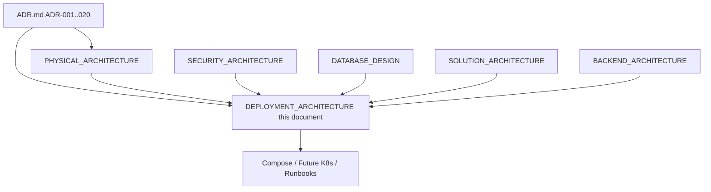

| Document | Owns | This specification consumes |
|---|---|---|
| ADR-001 / ADR-020 | Modular monolith deployable; Docker + reverse proxy + CI/CD + health + Seq | Single API image; Compose now / K8s later; no day-one service mesh |
| PHYSICAL_ARCHITECTURE | Processes, ports, trust zones, Stage 0–4 evolution, RTO/RPO baselines | Topology stages, port matrix, sticky/backplane gates, paired SQL+MinIO DR |
| SECURITY_ARCHITECTURE | Secrets classes, TLS, Hangfire/Seq/MinIO admin hardening | Secret injection, cert lifecycle, no secrets in images/git |
| DATABASE_DESIGN | Schema-per-module, migration order, expand-contract, backup semantics | Migration apply gates, migrator vs runtime identities |
| SOLUTION_ARCHITECTURE | `build/`, `deployment/`, `.github/` layout | Artifact locations and ownership |
| BACKEND_ARCHITECTURE | `/health*`, Hangfire jobs, SignalR hubs, Serilog enrichment | Probe semantics, multi-instance job/hub implications |
| REACT_ARCHITECTURE / REACT_NATIVE_ARCHITECTURE | Client release channels | Static asset publish; store releases vs API promotion |

**Reading order for platform engineers:** ADR-020 → PHYSICAL_ARCHITECTURE §§5–6, 14, 16–19 → SECURITY_ARCHITECTURE §§6, 12 → DATABASE_DESIGN migration/backup sections → **this document** → environment-specific runbooks.

---

## 1. Architectural Posture for Deployment

### 1.1 What We Deploy

AMS near-term production is a **single deployable ASP.NET Core host** (`Agriculture.Api`) composing all business modules (ADR-001). Separate data-plane processes—SQL Server, MinIO, Seq—and an edge reverse proxy (NGINX or equivalent) complete the runtime. React admin is a **separate static artifact** served by the proxy or object storage. React Native is a **store-distributed client** consuming the same HTTPS API and FCM; it is not containerized with the monolith.

**Reasoning:** Municipal ops capacity is small. One release artifact, one JWT validation path, one Serilog→Seq correlation chain, and one health surface minimize operational error while preserving module boundaries in code for future extraction.

### 1.2 Evolution Path (Municipality Single-Server Start → Scale-Out)

Aligned to PHYSICAL_ARCHITECTURE Stage 0–4:

| Stage | Shape | Deploy implication |
|---|---|---|
| **0 — Dev laptop** | `docker compose` SQL + MinIO + Seq; API in IDE or container | Fast feedback; synthetic data; FCM mocked optional |
| **1 — Single-server production** | One host/VM: NGINX + API container + SQL + MinIO + Seq | **Default municipal production start** |
| **2 — HA-leaning Compose** | API replicas only after Redis backplane + Hangfire multi-server validation | Sticky sessions interim or Redis; shared Data Protection keys |
| **3 — Kubernetes** | Same images as Deployments; Ingress TLS; PVCs; managed SQL optional | Orchestration maturity, not microservices |
| **4 — Selective microservices** | Extract Notifications/Reporting per ADR-001 gates | New Deployments; outbox/idempotency proven |

**Normative rule:** Do not horizontally scale API replicas in Production until Board-approved prerequisites in PHYSICAL_ARCHITECTURE §16.2 are met. Vertical scale of API + SQL is the primary near-term capacity lever.

### 1.3 Quality Attributes Owned by DevOps

| Attribute | Deployment contribution | Anchor |
|---|---|---|
| Availability (SRS 99.9%) | Health-gated releases, rollback, backups, DR drills | PHYSICAL §14, §18 |
| Security | TLS at edge, secret injection, admin surface isolation | SECURITY §6; PHYSICAL §12 |
| Correctness | Migration expand-contract; backup-before-migrate | DATABASE_DESIGN; ADR-016 |
| Operability | Compose parity, Seq, Hangfire visibility, immutable digests | ADR-020 |
| Evolutability | Image seams, Helm/Kustomize later, Redis readiness | PHYSICAL Stage 2–3 |

### 1.4 Anti-Goals

1. **Not** day-one Kubernetes + service mesh for a modular monolith (ADR-020 Option C rejected).
2. **Not** IIS-only snowflake as primary strategy (ADR-020).
3. **Not** secrets in git, images, or Compose committed passwords for Production (ADR-020 / SECURITY).
4. **Not** publishing SQL `1433`, MinIO `9000/9001`, Seq, or Kestrel `8080` to the public internet (PHYSICAL §6).
5. **Not** multi-instance API without sticky sessions **or** Redis SignalR backplane (ADR-008/015/020).
6. **Not** treating Hangfire dashboard or Seq UI as public apps (SECURITY / PHYSICAL admin hardening).
7. **Not** rewriting PHYSICAL topology here—this document operationalizes it.

---

## 2. Target Runtime Topology (Stage 1 Baseline)

### 2.1 Conceptual Composition

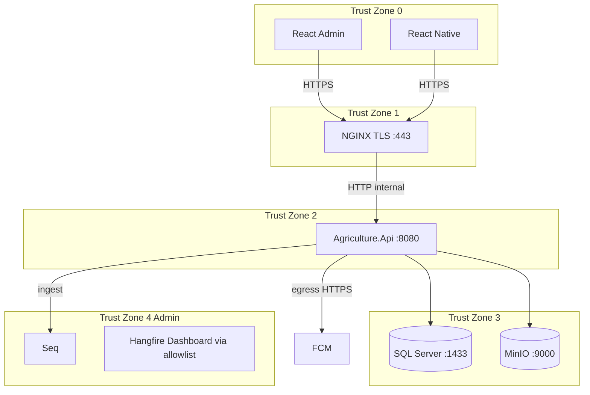

**Reasoning:** Edge terminates TLS; application network never exposes data-plane ports; observability and Hangfire remain VPN/bastion constrained. This matches PHYSICAL trust zones and SECURITY Zero Trust posture (network presence ≠ authorization).

### 2.2 Port Matrix (Normative Summary)

| Component | Port | Exposure |
|---|---|---|
| NGINX | 443 (80 redirect) | Public |
| Agriculture.Api (Kestrel) | 8080 | Internal only |
| SQL Server | 1433 | Internal only |
| MinIO S3 | 9000 | Internal only |
| MinIO Console | 9001 | Admin only |
| Seq | 5341 / 80 / 443 | Admin / internal ingest |
| FCM | 443 egress | Outbound only |

Post-deploy smoke **must** verify: public 443 OK; public 1433/9000/Seq refused (PHYSICAL S6.3).

### 2.3 Repository Layout Anchors (SOLUTION_ARCHITECTURE)

| Path | Purpose |
|---|---|
| `build/docker/Dockerfile.api` | API image build |
| `build/docker/Dockerfile.api.worker` | Optional future `RUN_MODE=worker` |
| `deployment/compose/` | Compose files and overrides |
| `deployment/proxy/` | NGINX (or Traefik) config |
| `deployment/k8s/` | Stage 3 manifests (may start as placeholder) |
| `deployment/env/*.env.example` | Non-secret templates |
| `.github/workflows/` | CI/CD |

Current workspace root `docker-compose.yml` provides **developer dependency** SQL + MinIO; the **target production composition** documented here adds proxy, API, Seq, isolated networks, and secret mounts under `deployment/compose/` without requiring this document to rewrite the living Compose file.

---

## 3. Docker

### 3.1 Role of Docker

Docker is the **standard packaging unit** for `Agriculture.Api` and for dependency services in non-production (and typically Production for MinIO/Seq). ADR-020 selects containers for environmental parity from laptop to municipal on-prem or government cloud.

**Reasoning:** Municipal IT may host on Linux or Windows servers; containers reduce “works on my machine” drift, enable immutable digests for rollback, and provide a clean path to Kubernetes without redesigning the modular monolith.

### 3.2 Image Design Principles

1. **One primary application image** for `Agriculture.Api` hosting HTTP, Hangfire Server (initially in-process), and SignalR.
2. **Optional worker image or same image + `RUN_MODE=worker`** only when Board approves process split without module extraction (PHYSICAL).
3. **Immutable runtime:** configuration and secrets enter via environment variables and mounts—never baked into layers.
4. **Non-root user** in the API image where base image and filesystem permissions allow.
5. **Pinned base images** (digest preferred in Production pipelines) with monthly patch cadence (SECURITY supply-chain guidance).
6. **Health endpoints** always present in the image (`/health/live`, `/health/ready`).
7. **No SQL Server credentials, JWT keys, FCM JSON, or MinIO keys** in Dockerfile `ENV` or `COPY` of secret files.

### 3.3 Illustrative Dockerfile Sketch (Architecture Only)

```dockerfile
# Illustrative — not executable source of truth
FROM mcr.microsoft.com/dotnet/aspnet:8.0 AS runtime
WORKDIR /app
ENV ASPNETCORE_URLS=http://+:8080
EXPOSE 8080
COPY --from=build /out .
USER app
ENTRYPOINT ["dotnet", "Agriculture.Api.dll"]
```

**Reasoning for Kestrel on 8080 HTTP internally:** TLS terminates at NGINX (PHYSICAL §3.1, §12.2). Internal plaintext is acceptable only on a private trusted network with compensating controls; Production may prefer mTLS or TLS to Kestrel when municipal standard requires it (SECURITY §6.1).

### 3.4 Multi-Stage Builds and Supply Chain

CI should:

- Restore and build in a SDK stage; publish only runtime artifacts to the final image.
- Produce SBOM optionally; fail Production promotion on critical CVEs per municipal policy.
- Scan images (e.g., Trivy/Grype) before push to the Production-capable registry tag.

### 3.5 Resource Limits

Compose/K8s must set CPU/memory limits to protect SQL from noisy neighbors. Guidance from PHYSICAL §5.2 (starting points): API 2–4 vCPU / 4–8 GB; SQL higher IOPS and RAM; MinIO/Seq on disks separate from SQL data when feasible.

**Reasoning:** Shared single-server Stage 1 hosts fail first from disk contention (SQL + MinIO + Seq on one volume), not from Docker itself. Disk separation is a deployment requirement, not an application feature.

### 3.6 Restart and Logging Drivers

API containers use `restart: unless-stopped` (Compose) or equivalent. Application logs go to **stdout/stderr → Serilog sinks → Seq**; Docker logging drivers are for host retention fallback, not the municipal system of record for structured diagnostics (ADR-011/012).

---

## 4. Docker Compose

### 4.1 Role of Compose

Docker Compose is the **Stage 0–2 orchestration substrate**: developer parity, CI ephemeral stacks, and first municipal Production topology. Kubernetes is Stage 3—authorized later—not a prerequisite for Production go-live.

**Reasoning:** Compose keeps ops proportional to a modular monolith and a small municipal team while still delivering reproducible networks, volumes, healthchecks, and dependency order.

### 4.2 Target Compose Service Set (Stage 1)

| Service | Role |
|---|---|
| `proxy` | NGINX TLS termination, WebSocket upgrade, static React |
| `api` | `Agriculture.Api` |
| `sqlserver` | System of record (or external managed SQL) |
| `minio` | Object storage |
| `seq` | Log aggregation UI/ingest |
| `redis` | **Absent until Stage 2** multi-instance |

### 4.3 Conceptual Compose Map

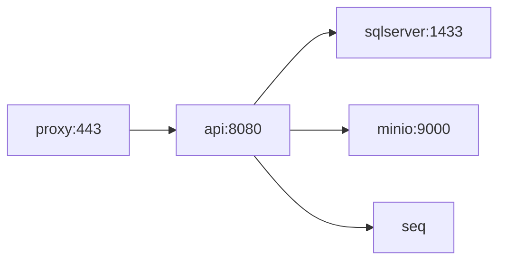

### 4.4 Networks and Volumes

- **Front network:** proxy ↔ api (and optionally proxy ↔ static).
- **Data network:** api ↔ sql, api ↔ minio; no client access.
- **Admin network / VPN path:** Seq UI, MinIO console, Hangfire path allowlist.
- **Volumes:** SQL data/log, MinIO data, Seq retention, optional Data Protection key ring share for multi-instance later.
- **Projects/namespaces:** `agriculture-dev`, `agriculture-test`, `agriculture-staging`, `agriculture-prod` — isolated credentials and buckets (PHYSICAL §5.3).

### 4.5 Healthchecks and Dependency Order

Compose `depends_on` with condition `service_healthy` for SQL before API start. API readiness still owns application-level “safe to take traffic.” SQL healthcheck (as in current root compose) validates engine readiness; API `/health/ready` validates EF connectivity and critical dependencies.

### 4.6 Environment Files

- `*.env.example` committed; real `.env` / secret mounts **never** committed.
- Production Compose must prefer Docker secrets or external secret injection over plaintext shared `.env` on disk (PHYSICAL §19.4).

### 4.7 Dev vs Prod Compose Overrides

| Concern | Development | Production |
|---|---|---|
| API | Often host/IDE | Container only |
| Port publishes | SQL/MinIO may publish for tooling | No public data ports |
| TLS | Optional localhost certs | Mandatory public TLS |
| FCM | Mock | Production credentials |
| Image tags | `dev` / local | Immutable digest |

**Reasoning:** Developer convenience must not leak into Production overrides (classic failure: `-p 1433:1433` left enabled).

### 4.8 Illustrative Service Fragment (Architecture Only)

```yaml
# Illustrative target-state sketch — not a rewrite of living compose
services:
  api:
    image: ghcr.io/org/agriculture-api:${IMAGE_TAG}
    environment:
      ASPNETCORE_ENVIRONMENT: Production
      ConnectionStrings__Agriculture: ${SQL_APP_CONNECTION}
    secrets:
      - jwt_signing_key
    networks: [front, data]
    healthcheck:
      test: ["CMD", "curl", "-f", "http://localhost:8080/health/ready"]
      interval: 10s
      timeout: 5s
      retries: 6
```

---

## 5. Future Kubernetes

### 5.1 When to Enter Stage 3

Authorize Kubernetes when at least one holds: multi-municipality hosting, ops maturity for GitOps, need for stronger scheduling/HA primitives, or government cloud mandates. **Do not** enter Stage 3 to “look modern” while still a single modular monolith without Redis readiness for multi-pod SignalR.

### 5.2 Mapping Compose → Kubernetes

| Compose | Kubernetes |
|---|---|
| `api` service | `Deployment` + `Service` (ClusterIP) |
| `proxy` | `Ingress` (+ optional NGINX Ingress Controller) |
| SQL | Managed SQL preferred; else StatefulSet/external VM |
| MinIO | Operator / StatefulSet + PVC |
| Seq | Deployment + PVC |
| secrets | External Secrets Operator → Vault/Key Vault |
| healthcheck | `livenessProbe` / `readinessProbe` |

### 5.3 Probe Mapping

| Probe | Path | Behavior |
|---|---|---|
| Liveness | `/health/live` | Restart if process wedged |
| Readiness | `/health/ready` | Remove from Service endpoints if SQL down |
| Startup | Optional longer `/health/ready` | Absorb cold start + migration wait |

**Reasoning:** Never gate liveness on Seq or FCM (PHYSICAL §14.1)—that causes restart storms during observability or push outages.

### 5.4 Ingress and SignalR

Ingress must enable WebSocket upgrade, elevated `proxy-read-timeout` for long-lived hubs and uploads, and sticky sessions **or** require Redis backplane before `replicas > 1`.

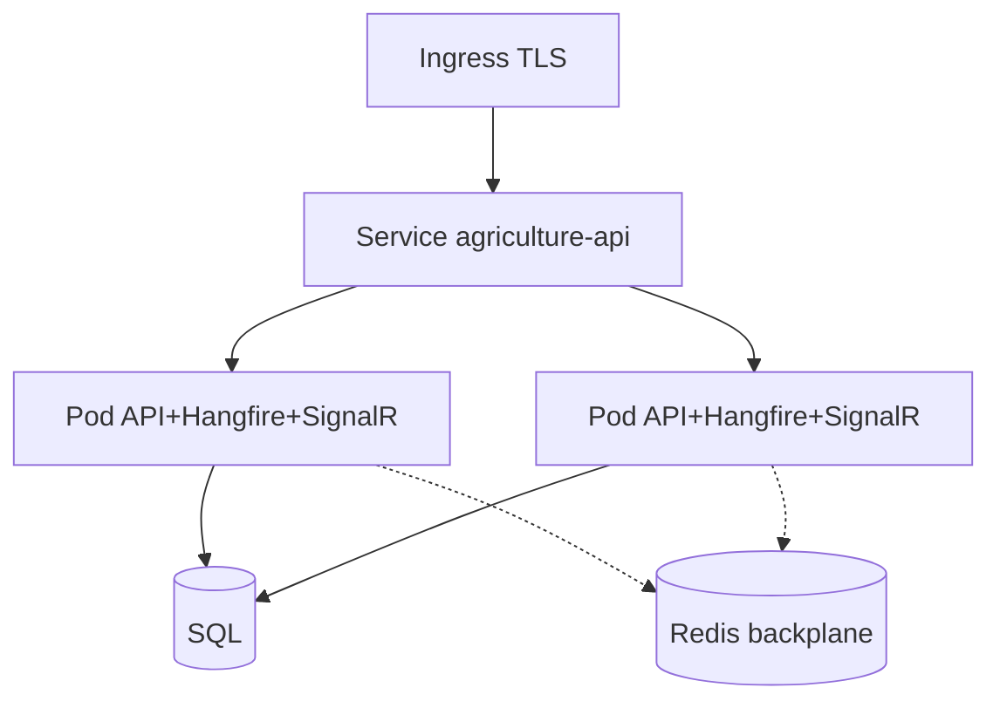

### 5.5 NetworkPolicy

Deny ingress to SQL/MinIO/Seq from non-API identities. Allow API egress to FCM `443`. Admin access to Seq via bastion or VPN ingress only.

### 5.6 HPA Caution

Horizontal Pod Autoscaler is **forbidden** until Redis backplane + Hangfire multi-server validation + shared Data Protection key ring are production-proven. Premature HPA breaks SignalR fan-out and cache coherency (ADR-015).

### 5.7 Microservices on Kubernetes

Stage 4 extraction changes Deployments; Stage 3 hosts the **same monolith image**. Kubernetes is not permission to skip ADR-001 extraction gates.

---

## 6. Reverse Proxy and NGINX

### 6.1 Why NGINX (or Equivalent)

ADR-020 requires a TLS-terminating reverse proxy. NGINX is the reference implementation in this specification; Traefik or a cloud load balancer may substitute if they meet the same responsibilities.

### 6.2 Responsibilities

1. Terminate TLS 1.2+ (prefer 1.3); redirect 80→443.
2. Forward `X-Forwarded-For`, `X-Forwarded-Proto`, `X-Request-ID` / correlation headers.
3. Route `/api`, `/hubs` to API; `try_files` for React static assets.
4. Enable WebSocket upgrade for SignalR.
5. Apply security headers (PHYSICAL §12.6) and optional rate-limit/WAF at edge.
6. Restrict `/hangfire`, Swagger (non-prod), and admin paths by IP allowlist or mutual auth.
7. Access-log redaction for SignalR `access_token` query strings (SECURITY SignalR note).

### 6.3 Illustrative Routing Sketch

```nginx
# Illustrative architecture sketch
upstream agriculture_api {
  server api:8080;
  # Stage 2 sticky example:
  # ip_hash;  # or sticky cookie — prefer Redis backplane long-term
}
server {
  listen 443 ssl http2;
  # ssl_certificate ...;
  location /hubs/ {
    proxy_pass http://agriculture_api;
    proxy_http_version 1.1;
    proxy_set_header Upgrade $http_upgrade;
    proxy_set_header Connection "upgrade";
    proxy_read_timeout 3600s;
  }
  location /api/ {
    proxy_pass http://agriculture_api;
    client_max_body_size 25m; # align upload policy
  }
  location / {
    root /usr/share/nginx/html; # React build
    try_files $uri /index.html;
  }
}
```

**Reasoning for long WebSocket timeouts:** Officer dashboards keep hubs open during season peaks; aggressive timeouts cause reconnect storms (PHYSICAL §6.9).

### 6.4 Upload Timeouts

Field photo uploads over weak cellular need multi-minute `proxy_read_timeout` or clients must use presigned multipart (PHYSICAL S10.1). Misconfigured proxy timeouts create duplicate retries and orphan MinIO objects—reconciled by Hangfire jobs, but avoidable with correct edge config.

### 6.5 Static React Hosting

Prefer serving React from NGINX or CDN with **runtime config** for API base URL (PHYSICAL §19.7) so one static build can map to slots. Do not embed Production secrets in frontend bundles.

---

## 7. HTTPS, SSL/TLS

### 7.1 Normative Requirements

| Path | Requirement |
|---|---|
| Client ↔ NGINX | TLS 1.2+ (prefer 1.3); valid certificates; HSTS |
| NGINX ↔ API | Trusted private network; prefer TLS when mandated |
| API ↔ SQL | `Encrypt=True` / Force Encryption where supported |
| API ↔ MinIO | TLS on object API in Production |
| API ↔ Seq | TLS for ingestion in Production |
| API ↔ FCM | HTTPS egress |

**Reasoning:** SRS mandates HTTPS; field Wi-Fi and cellular are hostile (SECURITY §6.1).

### 7.2 Certificate Lifecycle

1. Prefer automated issuance (ACME) where municipal DNS allows; otherwise enterprise PKI with documented renewal calendar.
2. Alert on cert expiry **30/14/7 days** before failure.
3. Store private keys in secret manager; never in git.
4. Separate certificates per environment hostname.
5. After deploy, synthetic monitor validates public HTTPS (PHYSICAL §14.4).

### 7.3 HSTS and Redirects

HTTP only redirects to HTTPS. HSTS enabled in Production after confirming no legitimate HTTP consumers. Staging may use shorter `max-age` during cutover.

### 7.4 Mutual TLS

End-user mTLS is **rejected** for phones/browsers (ADR-013). Optional mTLS for admin tools or partner integrations is a future Board decision, not MVP.

---

## 8. Environment Strategy

### 8.1 Environment Catalog

| Environment | Purpose | Data | FCM | Promotion |
|---|---|---|---|---|
| **Development** | Feature work | Synthetic/seed | Optional sandbox / mock | Local compose |
| **Testing / CI** | Automated tests | Ephemeral | Mocked gateway | PR pipelines |
| **Staging** | UAT / release candidate | Anonymized subset | Staging apps | Same image digest as candidate |
| **Production** | Live municipality | Real PII/evidence | Production FCM | Promote digest after gates |

### 8.2 Promotion Model (Immutable Digests)

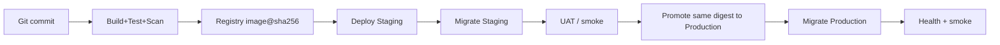

**Reasoning:** “Rebuild for Production” creates unverifiable drift. ADR-020 requires promote-the-digest semantics.

### 8.3 Configuration Differences

Images stay identical; **config and secrets differ**:

| Setting | Dev | Test | Staging | Prod |
|---|---|---|---|---|
| `ASPNETCORE_ENVIRONMENT` | Development | Testing | Staging | Production |
| SQL | Local compose | Ephemeral | Staging server | Prod |
| JWT keys | Dev-only | Ephemeral | Staging | HSM/KMS-backed preferred |
| CORS | localhost | CI hosts | staging domain | municipal domains |
| Log level | Debug | Information | Information | Information/Warning |
| Hangfire workers | Low | Low | Medium | Peak-sized |
| Swagger | On | On | Optional | Off / VPN-only |

### 8.4 Data Isolation Rules

1. Never point non-prod API at Production SQL or MinIO.
2. Staging data anonymized for KVKK alignment (SECURITY).
3. Distinct MinIO bucket prefixes / credentials per environment.
4. Distinct JWT `iss`/`aud` per environment to prevent token reuse across slots (SECURITY).

### 8.5 Client Environment Binding

- React: environment-specific API base URL / runtime config.
- React Native: release-channel remote config; force-update policy for breaking auth/API changes (PHYSICAL §5.6).

---

## 9. Secrets Management

### 9.1 Secret Classes (SECURITY §6.5)

| Class | Examples |
|---|---|
| Cryptographic | JWT signing private keys, Data Protection key ring |
| Data store | SQL connection strings, MinIO access/secret keys |
| Integrations | FCM service account JSON, SMTP/SMS |
| Operational | Seq API keys, Hangfire dashboard credentials |

### 9.2 Normative Rules

1. Never commit secrets to source control or container images.
2. Inject via environment variables, mounted secret files, Docker secrets, or municipal secret manager.
3. `appsettings.{Environment}.json` holds **non-secret** defaults only.
4. Restrict secret read to runtime principal and break-glass operators.
5. Redact secrets in Serilog (ADR-011).
6. Rotate on compromise immediately; audit access.
7. Separate **migrator** SQL identity (DDL) from **runtime** `agric_app` DML identity (PHYSICAL §19.6; DATABASE_DESIGN).

### 9.3 Injection Patterns by Stage

| Stage | Mechanism |
|---|---|
| Dev | User secrets / local `.env` (gitignored) |
| CI | GitHub Actions secrets / OIDC to cloud secret store |
| Staging/Prod Compose | Docker secrets or vault agent render |
| Kubernetes | External Secrets Operator |

### 9.4 Rotation Runbooks (Summary)

- **JWT:** dual-key validation window (SECURITY §6.4.1).
- **MinIO/FCM:** rotate credentials; recycle API; requeue failed jobs carefully (idempotent).
- **Data Protection:** shared persistent key ring required before multi-instance; losing the ring invalidates protected payloads.

### 9.5 CI/CD Secret Hygiene

Workflows must not echo secrets. Prefer OIDC federation to cloud registries/vaults over long-lived PATs when available. Never store Production deploy passwords in workflow YAML (SOLUTION_ARCHITECTURE).

---

## 10. Container Registry and Image Tagging

### 10.1 Registry

Use a private registry (e.g., GHCR, Azure ACR, Harbor). Production hosts pull only from approved registries. Images are part of the DR inventory (PHYSICAL §18.2).

### 10.2 Tagging Scheme

| Tag | Meaning | Mutable? |
|---|---|---|
| `sha-<gitsha>` | Immutable build identity | No |
| `build-<id>` | CI build number | No |
| `semver` e.g. `1.4.2` | Release version | No once published |
| `staging` | Floating pointer to current staging digest | Yes (pointer only) |
| `prod` / `latest` | **Discouraged** as sole deploy reference | Yes — avoid for prod apply |

**Normative Production deploy reference:** digest (`image@sha256:…`) or immutable semver tag verified to that digest.

### 10.3 Retention

Retain images for the rollback window (minimum: last N Production releases + period covering RTO drills). Do not garbage-collect digests still referenced by Production or hot rollback tags.

### 10.4 Signing (Future)

Image signing (cosign/Notary) is a recommended Stage 3 hardening control; not mandatory for Stage 1 go-live but should be planned with supply-chain policy.

---

## 11. CI/CD and GitHub Actions

### 11.1 Role of CI/CD

CI/CD is mandatory (ADR-020): build, test, architecture tests, container scan, publish, and gated deploy. Manual Production FTP/copy is a forbidden anti-pattern.

### 11.2 Pipeline Stages

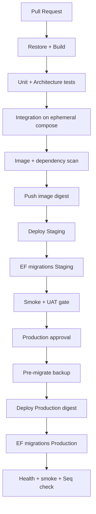

### 11.3 GitHub Actions Responsibilities

| Workflow | Trigger | Duties |
|---|---|---|
| `ci.yml` | PR / main | Build, test, scan, publish candidate |
| `deploy-staging.yml` | Manual or main | Deploy digest to staging |
| `deploy-production.yml` | Manual + approval | Backup gate, migrate, deploy, verify |
| `nightly-dr.yml` optional | Schedule | Backup verification hooks |

### 11.4 Illustrative Workflow Sketch

```yaml
# Illustrative architecture sketch
name: ci
on: [pull_request, push]
jobs:
  build-test:
    runs-on: ubuntu-latest
    steps:
      - uses: actions/checkout@v4
      - name: Setup .NET
        uses: actions/setup-dotnet@v4
      - run: dotnet test --configuration Release
      - name: Build API image
        run: docker build -f build/docker/Dockerfile.api -t agriculture-api:${{ github.sha }} .
      - name: Scan image
        run: echo "run scanner here"
      - name: Push digest
        run: echo "docker push ...@sha256"
```

### 11.5 Required Gates Before Production

1. Tests green (including architecture reference rules ADR-017).
2. Image scan within policy.
3. Staging deploy of **same digest** successful.
4. Staging migrations applied; UAT sign-off for release train.
5. Production backup completed and verified (timestamp recorded).
6. Change ticket / Board approval as municipal policy requires.
7. On-call aware; season-peak freeze calendar respected.

### 11.6 Frontend and Mobile Pipelines

- **React:** build static assets; publish to artifact store or NGINX image layer / object storage; environment config injected at deploy.
- **React Native:** separate store pipeline; API compatibility tested against Staging; coordinated force-update when auth contracts break.

### 11.7 Migration Job in CI

Migrations run as an **explicit job** with migrator connection string—never as a silent side effect of every API pod start in Production (prevents race when scaling). Startup migrate may be allowed in Dev only.

---

## 12. Deployment Pipeline (End-to-End)

### 12.1 Definition

The deployment pipeline is the controlled path from merged commit to Production traffic, including artifact immutability, environment promotion, schema change, health verification, and observability confirmation.

### 12.2 Stage 1 Single-Server Pipeline Detail

1. CI produces `agriculture-api@sha256:…` and React assets `@version`.
2. Staging host pulls digest; NGINX reloads if static assets change.
3. Migrator job applies EF migrations in DATABASE_DESIGN order.
4. API container replaced; readiness must pass.
5. Smoke: login, sample query, SignalR connect, small upload, Hangfire enqueue.
6. Production: declare maintenance window if migration non-online; take SQL backup (+ MinIO snapshot if schema couples to object layout changes).
7. Deploy digest; migrate; verify; clear window.
8. Monitor Seq error rate and Hangfire failures for burn-in period (e.g., 60–120 minutes).

### 12.3 Zero-Downtime Ambition vs Municipal Reality

Expand-contract migrations and rolling/blue-green techniques enable near-zero downtime for API-only changes. **Breaking schema** or single-server SQL restart may require a short maintenance window—communicate via municipal channels. Correctness of workflow sequencing outranks vanity of zero-second cutover.

---

## 13. Release Strategy

### 13.1 Release Train Principles

1. **Small, frequent, reversible** releases preferred over seasonal megareleases—except when agricultural calendar freezes changes during critical harvest windows (Architecture Board + municipal ops).
2. **Feature flags** for progressive delivery of risky UX (PHYSICAL §19.2)—flags are config, not secret.
3. **Calendar awareness:** planting week and frost emergencies are change-risk peaks; prefer config-only or hotfix discipline.
4. **Versioning:** semver for operator communication; digests for machines.
5. **Changelog:** user-visible municipal notes + technical migration notes.

### 13.2 Release Types

| Type | Content | Pipeline |
|---|---|---|
| Standard | Features + online migrations | Full staging promotion |
| Hotfix | Defect fix; minimal schema | Expedited approval; still digest-based |
| Emergency | Security/availability | Break-glass with post-hoc review |
| Data fix | Compensating Hangfire/SQL scripts | DBA + module owner; audited |

### 13.3 Compatibility Windows

Mobile clients may lag store review. API must maintain backward-compatible contracts for the supported mobile N and N-1 releases (REACT_NATIVE_ARCHITECTURE / API_CONTRACT). Breaking changes require force-update coordination.

---

## 14. Blue-Green Deployment

### 14.1 Applicability

Blue-green is the preferred Stage 2+ cutover pattern when two API slots (or two Compose stacks) can share the same SQL/MinIO with expand-contract-safe schema. On Stage 1 single-server, a **logical blue-green** can be approximated by keeping previous container image ready for instant retag/rollback while green becomes primary—full dual slots may be capacity-limited.

### 14.2 Blue-Green Flow

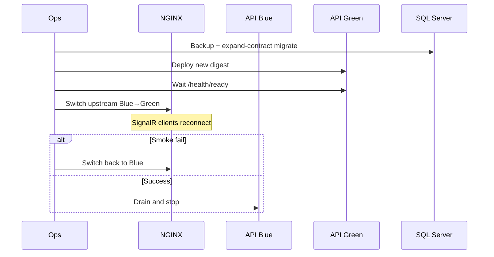

### 14.3 Reasoning and Constraints

- **Shared database:** blue-green does **not** mean two schemas of truth. Migrations must be backward compatible with blue until cutover completes (expand-contract).
- **SignalR:** switching upstream drops WebSocket connections; clients reconnect—acceptable if reconnect/backoff is correct.
- **Hangfire:** both colors must not run conflicting schema assumptions; typically disable Hangfire workers on the idle color or run workers only on active color to avoid double-processing during overlap. Prefer single active Hangfire server set during cutover on Stage 1–2 until procedures mature.
- **MinIO:** shared store; no dual bucket switch required for API-only releases.

### 14.4 When Not to Use Blue-Green

Destructive migrations that blue cannot run against; major Data Protection key ring replacement without shared ring; emergency rollback mid-migrate (use restore playbooks instead).

---

## 15. Rolling Update

### 15.1 Definition

Rolling update replaces API instances gradually behind a load balancer—native to Kubernetes `Deployment` and feasible in Compose with multiple replicas.

### 15.2 Prerequisites (Normative)

Identical to horizontal scale gates (PHYSICAL §16.2):

1. Sticky sessions **or** Redis SignalR backplane.
2. Hangfire multi-server validated.
3. Memory cache coherency strategy.
4. Shared Data Protection keys.
5. Readiness probes removing not-ready pods from rotation.

### 15.3 Rolling Update Flow

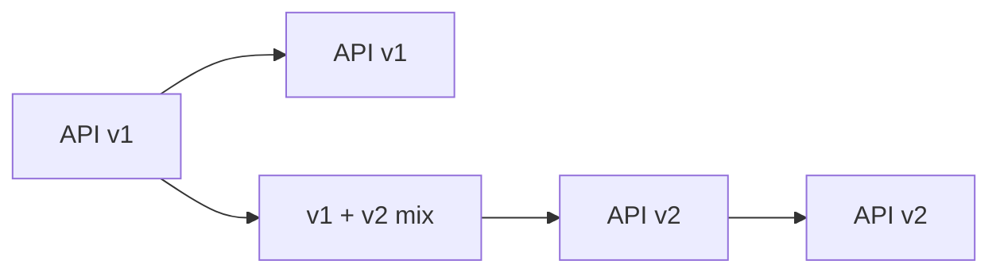

During mix, **both versions must accept the same schema** (expand phase complete; contract phase later).

### 15.4 Drain Semantics

1. Mark instance not-ready (stop new HTTP).
2. Allow SignalR grace period / connection drain.
3. Allow Hangfire in-flight jobs to complete or transfer via SQL storage locks.
4. Terminate process; start new digest.
5. Ready gate before receiving traffic.

### 15.5 Stage 1 Note

Single-server Production typically uses **recreate** or blue-green-lite, not rolling, because one replica cannot roll. Document the chosen strategy per environment in the runbook.

---

## 16. Database Migration

### 16.1 Ownership

Module owners author EF Core migrations per schema; Host/DevOps owns Hangfire schema initialization and **pipeline apply order** (DATABASE_DESIGN §4.3).

### 16.2 Apply Order (Release Convenience)

Identity → registries (Producers, Lands, Seasons, …) → production engine (Workflows, Tasks, Inspections) → Harvest/Delivery → Support/Notifications/Communication → Reporting/Admin → Hangfire install anytime after DB exists.

No cross-schema FKs (ADR-016/017); order is operational for seeds/smoke, not referential necessity.

### 16.3 Expand-Contract Discipline

| Phase | Action | Deployability |
|---|---|---|
| Expand | Additive columns/tables/indexes; dual-write if needed | Old and new API can run |
| Migrate data | Backfill jobs (Hangfire) | Online preferred |
| Contract | Remove obsolete columns after all nodes on new code | Only after bake time |

**Reasoning:** Enables blue-green/rolling without dual-database complexity inappropriate for municipal Stage 1.

### 16.4 Production Migration Procedure

1. Backup SQL (full or verified recent full + logs).
2. Announce window if required.
3. Run migrator identity against Production with recorded migration set.
4. Verify `__EFMigrationsHistory` per module schema.
5. Deploy/activate API digest that requires the new schema.
6. Smoke business paths touching changed modules.
7. On failure: stop deploy; follow rollback (§19)—do not “partially invent” schema fixes in Production without review.

### 16.5 Forbidden Practices

- Auto-migrate on every Production pod start with multiple replicas (race).
- Manual hot-edit of Production schema without migration history.
- Cross-module FKs “just for convenience.”
- Using Hangfire tables as business outbox (DATABASE_DESIGN).

### 16.6 Migrator vs Runtime Identities

| Identity | Rights |
|---|---|
| Migrator | DDL on module schemas |
| `agric_app` | DML on business + hangfire; **no DDL** in Production |

---

## 17. Health Checks

### 17.1 Endpoint Model (PHYSICAL §14.1)

| Endpoint | Meaning | Consumer |
|---|---|---|
| `/health/live` | Process alive | Liveness |
| `/health/ready` | Safe to receive traffic | NGINX/K8s readiness |
| `/health` detail | Dependency breakdown | Operators (admin-only) |

### 17.2 Dependency Readiness Policy

| Dependency | Gate ready? | Notes |
|---|---|---|
| SQL Server | **Yes** — fail closed | No truthful workflow without OLTP |
| MinIO | Default: ready with degraded detail **or** Board-chosen strict | Uploads may feature-flag off |
| Hangfire storage | Warn; HTTP may still serve | |
| Seq | **Never** gate readiness by default | Avoid restart loops |
| FCM | Never gate readiness | Push is async |

### 17.3 Orchestrator Wiring

NGINX `upstream` health or separate sidecar checks must use **ready**, not live. Synthetic external monitors hit public HTTPS `/health/ready` every 1–5 minutes.

### 17.4 Reasoning

Health checks are the difference between “container running” and “municipality can complete a task.” Readiness that ignores SQL creates false green deploys; readiness that requires Seq creates outage amplification.

---

## 18. Monitoring and Observability

### 18.1 Pillars

| Pillar | Tooling |
|---|---|
| Logs | Serilog → Seq (ADR-011/012) |
| Health | `/health*` + synthetic uptime |
| Jobs | Hangfire dashboard + failed job alerts |
| Metrics (future) | Prometheus/OpenTelemetry exporters |
| Traces (future) | OTel → Seq or compatible backend |

### 18.2 Serilog → Seq Operational Contract

1. Every HTTP request and Hangfire job carries **CorrelationId**.
2. Enrich with user id (when authenticated), tenant id, module, request name.
3. PII redaction mandatory (SECURITY / PHYSICAL §13.5).
4. When Seq is down, local sinks continue; API stays ready (PHYSICAL §13.7).
5. Retention and legal hold per municipal policy; Seq disk alerts at 70%/85%.

### 18.3 Alert Guidance (PHYSICAL §14.3)

| Signal | Warning | Critical |
|---|---|---|
| API 5xx rate | >2%/5 min | >5%/5 min |
| Ready failing | 1 min | 3 min |
| SQL CPU | >80% 10 min | >95% 10 min |
| MinIO disk | 70% | 85% |
| Hangfire failures | >10/15 min | >50/15 min |
| FCM failure ratio | >10% | >30% |
| Backup job failure | any miss | sustained miss — **pageable** |

### 18.4 Dashboards (Minimum)

1. Seq signal overview / error spikes.
2. Hangfire queues and failed jobs.
3. Proxy request rates and TLS errors.
4. SQL basic health.
5. Season-peak capacity board (disk, connections, queue depth).

### 18.5 Observability in Releases

Burn-in after Production deploy watches Seq for new exception shapes, Hangfire poison growth, and ready-probe flaps. Rollback decision criteria must be pre-written (§19).

---

## 19. Rollback Strategy

### 19.1 Principles

1. Prefer **application rollback** (redeploy previous digest) when schema is backward compatible.
2. Prefer **forward fix** when contract phase already dropped columns required by old code.
3. Prefer **restore** when data corruption or failed migration leaves schema/data unsafe.
4. Record decision in incident log with digest SHAs and migration history snapshots.

### 19.2 Rollback Flow

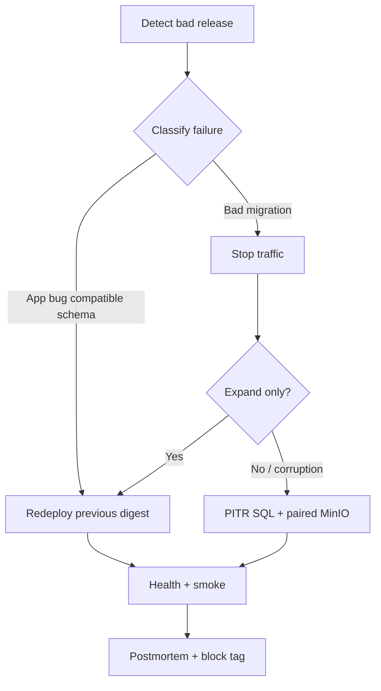

### 19.3 Hangfire/SignalR During Rollback

- Expect SignalR reconnects.
- Failed jobs may retry against restored code—idempotency required (ADR-007).
- After SQL restore, Hangfire may replay side effects; inbox dedupe and idempotency keys protect users (PHYSICAL S18.4).

### 19.4 Rollback Window

Retain previous Production digests and database backups covering at least the RPO/RTO commitments. Do not delete “last known good” until the next release passes burn-in.

---

## 20. Scaling

### 20.1 Vertical First (Stage 1)

Scale API CPU/RAM and SQL SKU/IOPS before adding replicas. Matches ADR-001 municipal reality and PHYSICAL §16.1.

### 20.2 Horizontal API Scale Gates

Authorized only after:

1. Sticky sessions **or** Redis SignalR backplane.
2. Hangfire multi-server validation with SQL storage locking.
3. Cache coherency (short TTL accept or Redis).
4. Shared Data Protection key ring.
5. Load-tested pools (HTTP + SignalR + Hangfire).

### 20.3 SignalR Implications

| Mode | Behavior |
|---|---|
| Single node | In-memory connections; simplest |
| Multi-node sticky | Clients pinned; uneven load; drain complexity |
| Multi-node + Redis | Any node fans out; preferred Stage 2+ |

Without sticky or backplane, officers miss dashboard events—operationally indistinguishable from “app broken.”

### 20.4 Hangfire Implications

- SQL storage coordinates multiple Hangfire servers.
- More replicas increase drain speed but raise SQL load—cap workers.
- Optional pattern: HTTP-only replicas + worker-designated replicas (`RUN_MODE=worker`) when Board approves.
- Queues/SLOs per PHYSICAL S8; poison playbook mandatory.

### 20.5 Data Scale Path

Indexes/CQRS → MinIO report artifacts → read replica → partition by season → extract Reporting/Notifications → shard by municipality (last resort ADR).

### 20.6 Municipality Path Narrative

**Start:** one VM, Compose, vertical headroom testing before planting week.  
**Grow:** split SQL to dedicated host when IO contends with MinIO/Seq.  
**Scale-out:** Redis + two API replicas behind NGINX.  
**Orchestrate:** Kubernetes with same images.  
**Extract:** only with ADR-001 gates.

---

## 21. Backup

### 21.1 Inventory (Aligned to PHYSICAL §18.2)

| Asset | Method | Frequency | Retention guidance |
|---|---|---|---|
| SQL full | Native backup | Daily | 30+ days |
| SQL log | Log backup | Every 5–15 min | Meet ≤15 min RPO |
| SQL diff | Optional | Hours | — |
| MinIO | `mc mirror` / replication / snapshot | Continuous or daily | Versioning + 30+ days |
| Seq | Volume snapshot optional | Daily | Operational |
| Secrets | Vault escrow | On change | Controlled |
| Images | Registry | Each release | Rollback window |

### 21.2 Paired Concern

SQL metadata and MinIO bytes are a **paired backup domain**. Backing up only SQL yields broken evidence links; only MinIO yields orphan binaries without business meaning (ADR-010 / DATABASE_DESIGN).

### 21.3 Encryption and Access

Backup media encrypted; key custody separated where feasible (SECURITY §6.2). Restore environments must not be accidentally internet-exposed.

### 21.4 Monitoring Backups

Backup success is **pageable**. Silent log-backup failure silently destroys RPO (PHYSICAL S18.2).

### 21.5 Pre-Release Backup Gate

Production migration pipeline records a successful backup timestamp before DDL apply.

---

## 22. Restore

### 22.1 Normative Outline (PHYSICAL §18.3)

1. Declare incident; freeze speculative writes if corruption suspected.
2. Provision clean host/volumes.
3. Restore SQL to point in time.
4. Restore MinIO to matching window; plan orphan reconciliation.
5. Deploy last known good API digest.
6. Verify `/health/ready`, Hangfire, login, upload/download sample.
7. Enable traffic; watch Seq.
8. Reconcile outbox/notifications (idempotent re-sends possible).

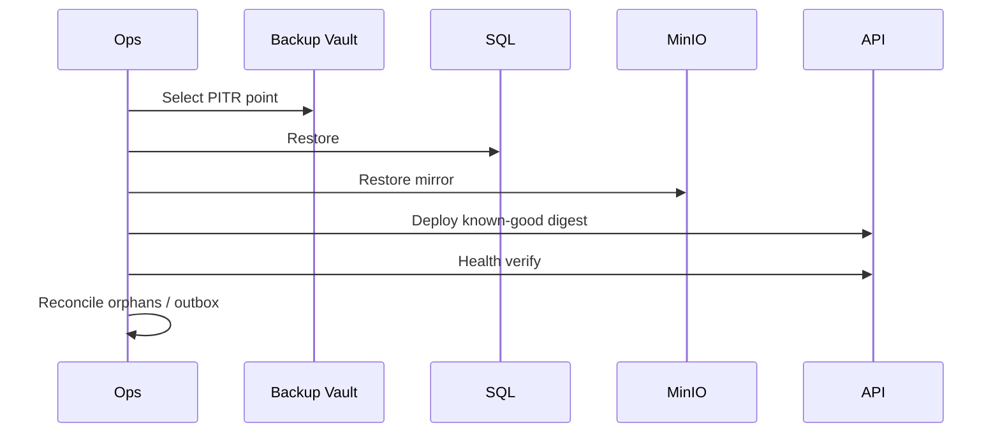

### 22.2 Source-of-Truth on Timestamp Mismatch

If SQL and MinIO restore points cannot match exactly: **SQL wins for business state**; missing objects present as broken media until versioning recovery (PHYSICAL §18.5).

### 22.3 Drill Cadence

Quarterly restore to isolated environment; annual full-site rehearsal if HA funded; results to Architecture Board.

---

## 23. Disaster Recovery

### 23.1 Objectives (PHYSICAL §18.1 — Planning Baselines)

| Metric | Target guidance |
|---|---|
| **RPO** | ≤ 15 minutes SQL; ≤ 24 hours MinIO cold if daily+versioning; prefer ≤15 minutes object replication if funded |
| **RTO** | ≤ 4 hours single-host failure; ≤ 24 hours full site loss without warm standby |
| Availability aspiration | 99.9% SRS (~8.7 h/year) |

Binding contractual SLAs require municipal sign-off. Without warm standby, 24-hour site RTO may be optimistic if hardware procurement delays occur—pre-provision spare capacity.

### 23.2 DR Scenarios

| Scenario | Primary response |
|---|---|
| Single host failure | Restore/rebuild host from backups + registry digests |
| SQL corruption | PITR; paired MinIO check |
| Ransomware | Isolate; immutable offline backups; rotate all secrets; rebuild from known-good images |
| Region/site loss | Warm standby replication if funded; else cold restore within RTO |
| Accidental bucket delete | MinIO versioning / mirror |

### 23.3 DR Flow

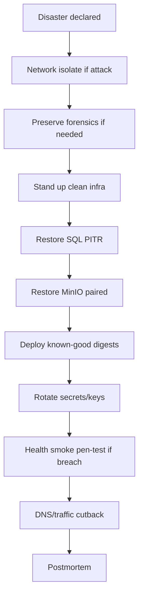

### 23.4 Hangfire and Legal Evidence After DR

- Expect possible duplicate notifications; idempotency and inbox dedupe required.
- Inspection evidence hashes in SQL must still match MinIO object bytes; do not re-encode during restore (PHYSICAL S18.5).

### 23.5 Communication

Municipal communications team uses status templates; engineering reports component facts and restore progress metrics—not speculative ETAs without progress.

---

## 24. Infrastructure as Code (Future)

### 24.1 Direction

Stage 1 may use reviewed Compose files and documented manual host bootstrap. Stage 3+ should adopt **Infrastructure as Code** for reproducibility and auditability:

| Layer | Candidate tooling |
|---|---|
| Cloud/network | Terraform / Bicep / Pulumi |
| Kubernetes apps | Helm or Kustomize |
| Secrets | Vault/Key Vault + External Secrets |
| Policy | OPA/Gatekeeper / admission controls |
| GitOps | Flux or Argo CD |

### 24.2 Principles

1. Declarative desired state in git (no secrets).
2. Separate plan/apply with human approval for Production.
3. Drift detection against live municipal cloud.
4. Same promotion discipline as application digests.
5. IaC does not authorize premature microservices.

### 24.3 What Remains Manual Until IaC Matures

Certificate exception requests, first-time municipal firewall tickets, and break-glass DR may remain runbook-driven—but must be tested and versioned as documentation.

---

## 25. Cross-Cutting Operational Concerns

### 25.1 Season Peak Readiness Checklist

Before planting week / frost season:

1. Disk headroom SQL/MinIO/Seq.
2. Backup success verified; restore drill not stale.
3. TLS certificates valid beyond peak window.
4. FCM credentials validated in Staging.
5. Hangfire worker counts sized; queue SLO alerts routed to on-call.
6. Change freeze policy communicated.
7. Synthetic `/health/ready` monitor green.

### 25.2 Administrative Surface Hardening

Hangfire dashboard, Seq UI, MinIO console, SQL tools: VPN/bastion, MFA, unique accounts, no shared passwords (PHYSICAL §12.14; SECURITY).

### 25.3 Rate Limiting and WAF

Edge rate limits protect login and upload abuse; authenticated quotas protect MinIO from compromised accounts (SECURITY).

### 25.4 Auditability

Deployments record: actor, ticket, digest, migration set, backup timestamp, smoke results. Seq retains operational audit for incident review.

---

## 26. Worked Municipal Scenarios

### 26.1 First Production Go-Live (Stage 1)

Municipality provisions one hardened VM. Ops installs Docker, deploys Compose with proxy/API/SQL/MinIO/Seq on separated disks where possible. CI promotes first digest through Staging. Backup taken. Migrations applied. Officers UAT SignalR dashboards; producers test one upload on cellular. Public port scan confirms only 443 open. RTO/RPO runbooks signed.

### 26.2 Failed Release with Compatible Schema

New digest raises 5xx on CompleteTask. Seq shows null-ref. Ops rolls back to previous digest within minutes; NGINX points to healthy container; SignalR reconnects; Hangfire continues. Migration was expand-only—no restore needed. Postmortem adds regression test.

### 26.3 Failed Migration

Contract migration drops column while old pods remain. Pipeline should have prevented this; if forced, stop traffic, restore SQL to pre-migrate backup, redeploy previous digest, and disable the bad workflow until expand-contract rewrite.

### 26.4 Scale-Out for Conference Peak

Unusual SignalR connection spike. Board approves Redis; two API replicas; sticky disabled; Hangfire servers=2 with worker caps; permission cache moves to Redis. PHYSICAL S16.2 path followed—not ad-hoc second container without backplane.

### 26.5 Ransomware

Offline immutable backups used; clean infra; PITR before infection; MinIO mirror restored; all secrets rotated; known-good digests only; pen-test before DNS cutback (PHYSICAL S18.1).

---

## 27. Compliance Mapping Summary

| Control need | Deployment mechanism |
|---|---|
| HTTPS | NGINX TLS + HSTS |
| Secrets hygiene | Vault/env mounts; no git secrets |
| Audit | Seq + deploy records + SQL audit columns |
| Availability | Health gates, backups, DR drills |
| Privacy (KVKK) | Env data isolation; anonymized staging; encrypted backups |
| Supply chain | Image scan, pinned bases, SBOM optional |

---

## Appendix A — Environment Variable Catalog (Non-Exhaustive)

| Variable / secret | Purpose |
|---|---|
| `ConnectionStrings__Agriculture` | Runtime SQL (DML) |
| `ConnectionStrings__AgricultureMigrations` | Migrator SQL (DDL) |
| `Jwt__*` / mounted key material | Token signing/validation |
| `Minio__*` | Endpoint, bucket, access keys |
| `Seq__ServerUrl` / API key | Log ingest |
| `Fcm__*` / JSON mount | Push credentials |
| `Cors__AllowedOrigins` | Browser origins |
| `Hangfire__WorkerCount` | Job concurrency |
| `ASPNETCORE_ENVIRONMENT` | Hosting environment name |
| `RUN_MODE` | `all` / future `worker` |

Exact names bind via Options validation at startup—fail fast if required secrets missing (PHYSICAL §19.5).

---

## Appendix B — Forbidden Operational Anti-Patterns

1. Deploying untested `latest` to Production.
2. Publishing data-plane ports publicly.
3. Running Production without TLS.
4. Multi-instance API without sticky/Redis.
5. Skipping backup before Production migration.
6. Sharing Production JWT keys with Staging.
7. Treating Seq outage as API outage via readiness coupling.
8. Manual Production schema edits.
9. Storing FCM JSON in the repository.
10. Using SignalR as substitute for FCM offline push.

---

## Appendix C — Mermaid Index

| Diagram | Section |
|---|---|
| Document relationship | Relationship |
| Stage 1 topology | §2 |
| Compose map | §4 |
| K8s multi-pod | §5 |
| Digest promotion | §8 |
| CI/CD pipeline | §11 |
| Blue-green | §14 |
| Rolling update | §15 |
| Rollback | §19 |
| Restore | §22 |
| DR | §23 |

---

## Appendix D — Cross-Reference to ADR and Physical Sections

| Topic | Primary anchors |
|---|---|
| Modular monolith deployable | ADR-001, PHYSICAL §1.2 |
| Docker / CI / health / Seq | ADR-020, PHYSICAL §5, §14 |
| Hangfire multi-server | ADR-007, PHYSICAL §8, §16.4 |
| SignalR sticky/backplane | ADR-008, ADR-015, PHYSICAL §16.3 |
| MinIO paired backup | ADR-010, PHYSICAL §18 |
| Secrets / TLS | SECURITY §6, PHYSICAL §12, §19 |
| Migrations | DATABASE_DESIGN §3–4, ADR-006/016 |
| RTO/RPO | PHYSICAL §18 |

---

## Appendix E — Document Maintenance

| Change type | Action |
|---|---|
| New environment or Stage gate | Update §§1, 5, 8; Board review |
| RTO/RPO contractual change | Align with PHYSICAL §18; municipal sign-off |
| Adoption of Kubernetes/GitOps | Expand §§5, 24; superseding runbooks |
| Extraction of Notifications/Reporting | Stage 4 topology addendum; do not silently fork this doc |
| Registry or CI platform change | Update §§10–11 without altering topology principles |

**Review cadence:** at least each major release train and after any Production incident involving deploy, migrate, or restore.

---

## Document Control

| Version | Date | Author | Notes |
|---|---|---|---|
| 1.0 | 2026-07-18 | Platform Architecture / DevOps | Initial Deployment & DevOps Architecture Specification |

---


---

# Supplemental Deep Dives (Normative Expansions)

The following sections expand each required deployment topic with additional reasoning, municipal scenarios, failure modes, and implementation acceptance criteria. They are **normative** unless marked guidance. They must not contradict §§1–27 or approved architecture documents.

---

## S1. Docker — Deep Dive

### S1.1 Why Containers Are the Packaging Contract

Municipal IT organizations often inherit heterogeneous hosts: Linux VMs in a government cloud, on-prem Windows Server with Hyper-V, or a single physical rack in a city data closet. Without containers, each host accumulates unique install paths for the .NET runtime, SQL client libraries, and certificate stores. That drift is the primary cause of “Staging worked, Production did not” incidents in government systems. Docker makes the **application runtime** a versioned artifact while allowing the **data plane** (SQL, MinIO volumes) to remain host-managed persistent state.

**Reasoning against fat VMs as the unit of deploy:** VM images entangle OS patching with application release cadence. Container images isolate application releases so OS patching can proceed on a different calendar—critical when planting-season freezes application changes but security patching cannot wait.

### S1.2 Image Layers and Cache Strategy in CI

CI should structure Dockerfiles so restore/build layers cache aggressively on `*.csproj` changes but invalidate on source changes. This is an engineering efficiency concern with operational impact: slow pipelines tempt engineers to skip scans or tests. Cache must never include secret-bearing layers.

### S1.3 Base Image Patch Cadence

| Cadence | Action |
|---|---|
| Monthly | Rebuild API image from patched base; run full CI; promote via Staging |
| Critical CVE | Out-of-band hotfix rebuild of same app commit on new base |
| Quarterly | Review base major/minor upgrade with regression suite |

**Acceptance:** Production digests younger than the municipal maximum age policy for base images (recommend ≤ 60 days unless exception logged).

### S1.4 Filesystem and Writable Layers

API containers must treat the container filesystem as ephemeral. Durable state belongs in SQL or MinIO. Temporary upload scratch may use a mounted volume with size quotas and cleanup jobs. Logging to local files inside the container without shipping to Seq creates invisible operational debt when containers recycle.

### S1.5 Security Scanning Thresholds (Guidance)

| Severity | PR gate | Production promote gate |
|---|---|---|
| Critical | Block | Block |
| High | Warn / block per policy | Block unless risk accepted |
| Medium | Report | Track |

Municipal policy may tighten further for internet-facing images.

### S1.6 Docker Socket and Host Privilege Anti-Patterns

Production API containers must not mount the Docker socket, run `--privileged`, or use host networking merely for convenience. Host network mode bypasses Compose network isolation and risks accidental exposure of Kestrel.

---

## S2. Docker Compose — Deep Dive

### S2.1 Compose as the Municipal “Minimum Viable Orchestrator”

Compose provides service DNS names (`api`, `sqlserver`, `minio`, `seq`), restart policies, healthchecks, and dependency ordering without introducing etcd, controllers, or Helm. For a single-municipality Stage 1 deployment, this is proportional. The cost of Kubernetes—node pools, ingress controllers, CSI drivers, RBAC—is justified when ops staffing and multi-host scheduling needs appear, not before.

### S2.2 Target-State Compose vs Current Root File

The repository root `docker-compose.yml` currently focuses on **developer dependencies** (SQL Server + MinIO). The **target Production composition** described in this specification adds NGINX, API, Seq, segmented networks, secrets, and non-published data ports under `deployment/compose/`. Engineers must not assume root compose is Production-complete. Documented target state in this specification governs Production design; living files evolve toward it under DevOps ownership (SOLUTION_ARCHITECTURE).

### S2.3 Project Naming and Collision Avoidance

On shared build agents or bastion hosts, Compose project names (`-p agriculture-staging`) prevent volume/network collisions between environments. Volume names should include environment suffixes to avoid attaching Staging disks to Production by mistake—a class of incident with catastrophic privacy impact.

### S2.4 Override File Strategy

| File | Purpose |
|---|---|
| `docker-compose.yml` | Base services and networks |
| `docker-compose.override.yml` | Local dev conveniences (published ports) — **gitignored or clearly non-prod** |
| `docker-compose.prod.yml` | Production hardening: no public data ports, resource limits, logging |

**Rule:** Production deploy commands must explicitly select production compose files; never rely on implicit override that publishes `1433`.

### S2.5 Update and Rollback with Compose

Typical Stage 1 update:

1. `docker compose pull api` (digest-pinned).
2. Stop Hangfire-heavy work if maintenance required (or accept SQL storage coordination).
3. `docker compose up -d api` with recreate.
4. Verify health.
5. On failure: retag/recreate previous digest.

Compose does not provide Kubernetes-style rolling by default with one replica; operators must understand recreate downtime (seconds to minutes) and communicate accordingly.

### S2.6 Backup Hooks Adjacent to Compose

Backup jobs may run as:

- Host cron invoking `sqlcmd` / `mc mirror`, or
- Sidecar/batch Compose profiles (`docker compose --profile backup run …`), or
- Municipal backup appliance agents on volumes.

Regardless of mechanism, success metrics must enter the same alerting channel as API health.

---

## S3. Future Kubernetes — Deep Dive

### S3.1 Decision Record for Entering Stage 3

Architecture Board authorizes Stage 3 when a written assessment shows at least two of:

1. Need for multi-node scheduling beyond a single Compose host.
2. Staffing for on-call Kubernetes operations (or managed Kubernetes with clear vendor RACI).
3. Requirement for GitOps audit trails mandated by municipal cyber policy.
4. Multi-municipality density on shared platform.

**Non-reasons:** “Everyone uses Kubernetes”; desire to extract microservices early; vanity metrics.

### S3.2 Resource Requests/Limits Guidance

| Workload | Requests (start) | Limits (start) |
|---|---|---|
| API | 500m CPU / 1Gi | 2–4 CPU / 4–8Gi |
| Seq | 250m / 1Gi | 2 CPU / 4Gi |
| MinIO | 250m / 1Gi | 2 CPU / 4Gi |

SQL preferably outside the cluster. Requests must be load-tested; limits prevent noisy neighbor eviction of other municipal workloads on shared clusters.

### S3.3 Pod Disruption Budgets

When replicas ≥ 2 and Redis is live, set PDB to keep at least one ready pod during node drains. With replicas = 1, PDB cannot prevent downtime—honest runbooks beat false HA configuration.

### S3.4 ConfigMaps vs Secrets

Non-secret CORS origins and feature flags → ConfigMaps. Connection strings and keys → Secrets (preferably external). Do not stuff everything into Secrets “just in case”—it reduces audit clarity.

### S3.5 Migration Job as Kubernetes Job

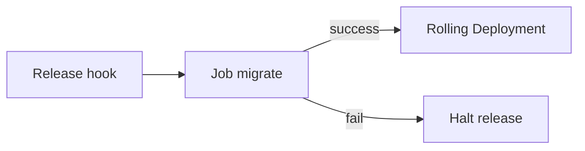

The migrator Job uses the migrator secret; the Deployment uses the app secret. This separation is a security and reliability control, not ceremony.

### S3.6 Ingress Annotations Checklist (SignalR + Uploads)

- WebSocket support enabled.
- Proxy body size aligned to max upload.
- Read timeouts ≥ longest legitimate upload/hub lifetime.
- Sticky session annotation **only** as interim before Redis.
- TLS secret referenced; HTTP disabled or redirected.

---

## S4. NGINX Reverse Proxy — Deep Dive

### S4.1 Why Terminate TLS at the Edge

Centralizing certificates at NGINX simplifies rotation, enables consistent HSTS/security headers, and keeps certificate private keys off application containers. Application teams then reason about HTTP semantics internally while security officers reason about one TLS posture externally.

### S4.2 Header Forwarding Correctness

Incorrect `X-Forwarded-Proto` causes:

- Broken HTTPS redirects,
- Incorrect cookie `Secure` behavior if cookies used,
- Wrong client IP for rate limiting,
- Misleading audit logs.

ASP.NET forwarded-headers middleware must be configured to trust **only** the proxy’s network identity (PHYSICAL failure mode notes).

### S4.3 Path Allowlists for Administrative Surfaces

| Path | Public | Admin VPN |
|---|---|---|
| `/api/v1/*` | Yes (authZ inside) | Yes |
| `/hubs/*` | Yes (JWT) | Yes |
| `/hangfire` | **No** | Yes |
| `/health/ready` | Yes (no sensitive detail) | Yes |
| `/health` detailed | **No** | Yes |
| Swagger | Non-prod only | Optional |

### S4.4 Buffering and Large Uploads

Disable or tune request buffering for large uploads if NGINX would otherwise spool entire bodies to disk under the proxy before API validation. Prefer API-side validation of content-type/size early (PHYSICAL upload flow) and consider presigned MinIO uploads for very large evidence files.

### S4.5 Rate Limiting Zones

Separate zones for:

- Anonymous auth endpoints (login/refresh),
- Authenticated API,
- Upload endpoints,

so a brute-force login storm does not starve authenticated officers during planting week.

### S4.6 Canary via NGINX (Optional Stage 2)

Weighted upstreams can send 5% of traffic to a canary digest when schema-compatible. Canary is optional; blue-green remains the primary documented strategy. Canary + SignalR sticky requires careful affinity so a user is not split across versions mid-session.

---

## S5. HTTPS / SSL / TLS — Deep Dive

### S5.1 Cipher and Protocol Policy

Prefer TLS 1.3; allow TLS 1.2 with modern cipher suites only. Disable TLS 1.0/1.1 and weak ciphers. Document exceptions only for legacy municipal scanners that cannot be upgraded—and track them as risk items.

### S5.2 Certificate Inventory

| Hostname | Environment | Owner | Renew method |
|---|---|---|---|
| `ams.municipality.example` | Production | Municipal IT + DevOps | ACME or enterprise PKI |
| `ams-staging…` | Staging | DevOps | ACME or enterprise PKI |
| Internal SQL TLS | Prod | DBA | Enterprise PKI |

### S5.3 Internal TLS Trade-offs

| Approach | Pros | Cons |
|---|---|---|
| Plain HTTP on private Docker network | Simple | Relies entirely on network controls |
| TLS to Kestrel | Defense in depth | Cert distribution to containers |
| Service mesh mTLS | Strong identity | Stage 3+ complexity; rejected day one |

SECURITY allows trusted private network plaintext with compensating controls—not as an unexamined default when municipal policy requires encryption everywhere.

### S5.4 Mobile Certificate Pinning

Optional Board decision (SECURITY). If enabled, coordinate pin rotation with mobile release trains or risk mass client outage during cert replacement.

---

## S6. Environment Strategy — Deep Dive

### S6.1 Why Four Environments

| Environment | Risk removed |
|---|---|
| Development | Protects shared Staging from broken WIP |
| Testing/CI | Protects humans from flaky merges; enforces architecture tests |
| Staging | Protects Production from unvalidated digests and migration surprises |
| Production | Protects citizens’ agricultural operations and PII |

Collapsing Staging into Production “to save cost” is a recurring municipal anti-pattern that converts every release into a public incident.

### S6.2 Data Refresh into Staging

Refresh procedures must:

1. Restore from Production **backup** into isolated Staging.
2. Run anonymization scripts for PII (national IDs, phones, exact addresses) per KVKK guidance.
3. Rotate all secrets so Production credentials never remain in Staging.
4. Re-issue Staging FCM configuration.
5. Verify MinIO objects are either subset-copied or stubbed—full Production evidence copies may be legally sensitive.

### S6.3 Environment Freeze Calendar

Architecture Board publishes freeze windows (e.g., peak harvest). During freezes:

- Allowed: severity-1 hotfixes, cert renewals, backup fixes.
- Disallowed: features, non-critical dependency bumps, exploratory schema changes.

### S6.4 Configuration Drift Detection

Weekly job compares running container digests and critical env keys (names only, not values) against the last approved release record. Drift without ticket is an incident.

---

## S7. Secrets — Deep Dive

### S7.1 Threat Model for Secrets in Municipal Context

Municipal repositories are often widely readable across IT. CI logs are forwarded to multiple systems. Backup admins may not be application admins. Therefore:

- Git is assumed hostile for secret storage.
- CI logs are assumed leaky.
- Backup operators should not automatically receive JWT signing keys.

### S7.2 Secret Distribution Sequence

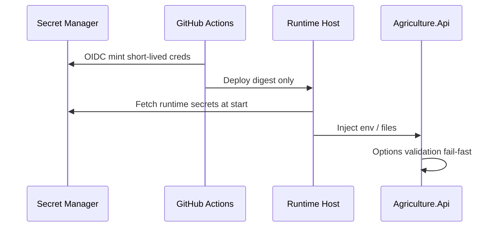

### S7.3 Break-Glass Access

Two-person control for Production secret read where feasible. Every break-glass access audited. After break-glass, evaluate rotation.

### S7.4 Secret Sprawl Control

Central catalog of secret names (not values) owned by Security + DevOps. Module owners request new secrets via change request; they do not invent ad-hoc env vars in Production without registration.

---

## S8. CI/CD and GitHub Actions — Deep Dive

### S8.1 Branching and Protection

| Branch | Policy |
|---|---|
| `main` | Protected; required checks; no direct push |
| `release/*` | Optional release stabilization |
| Feature branches | PR to main with CI green |

### S8.2 Required Checks (Minimum)

1. `dotnet build` + unit tests.
2. Architecture / module reference tests (ADR-017).
3. Integration tests against ephemeral SQL (compose).
4. Container build + vulnerability scan.
5. License/SBOM policy if mandated.

### S8.3 Deployment Environments in GitHub

Use GitHub Environments `staging` and `production` with required reviewers for Production. Environment secrets scoped accordingly—Production secrets never available to PR workflows from forks.

### S8.4 OIDC to Registry

Prefer `job` OIDC federation to GHCR/ACR over long-lived `REGISTRY_PASSWORD` stored in GitHub secrets. Reduces credential leak blast radius when Actions logs or fork PRs are involved.

### S8.5 Pipeline Observability

Failed Production deploys must alert on-call the same way API outages do. A silent failed migrate job is a latent DR event.

### S8.6 Infrastructure Changes in the Same Repo

Compose/NGINX changes follow the same PR review path. Production proxy config changes require Security review when they alter TLS, headers, or path exposure.

---

## S9. Deployment Pipeline — Deep Dive

### S9.1 Definition of Done for a Production Deploy

A deploy is complete only when all are true:

1. Approved digest running.
2. Migrations at expected history set.
3. `/health/ready` green from synthetic monitor.
4. Smoke tests passed (auth, query, hub, upload).
5. Seq receiving logs with new release property (e.g., `ReleaseDigest`).
6. Hangfire servers healthy; no poison spike.
7. Backup gate timestamp recorded in release ticket.

### S9.2 Maintenance Window Decision Tree

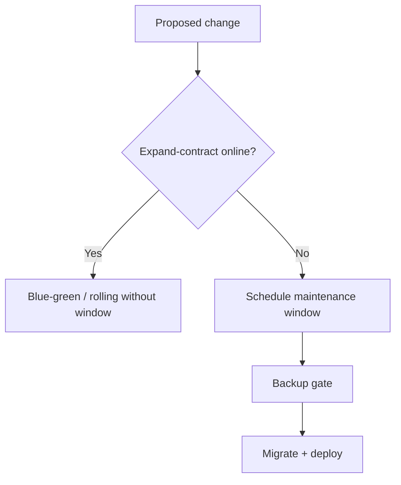

### S9.3 Communication Templates (Guidance)

Operators prepare short status lines:

- “AMS API deploy in progress — brief reconnects possible.”
- “AMS read-only window for database upgrade — uploads paused.”
- “AMS restored — verify pending notifications.”

Engineering supplies facts; communications owns citizen wording.

---

## S10. Blue-Green — Deep Dive

### S10.1 Slot Topology on a Single Host

Even on one VM, operators can run:

- `agriculture_api_blue` and `agriculture_api_green` containers on different internal ports,
- NGINX upstream switched between them,
- Shared SQL/MinIO.

Resource contention is the limit: both slots plus SQL on small hardware may not fit. Capacity planning must reserve headroom for the second slot or accept recreate strategy.

### S10.2 Database Compatibility Matrix

| Migration type | Blue (old) safe? | Green (new) safe? |
|---|---|---|
| Additive nullable column | Yes | Yes |
| Additive non-null with default | Usually yes | Yes |
| Rename column (contract early) | **No** | Yes |
| Drop column | **No** after drop | Yes |
| New table | Yes | Yes |

### S10.3 Hangfire Dual-Color Hazard

If blue and green both run Hangfire servers against the same storage during cutover, jobs execute—usually desirable—but code versions may differ. Policy options:

1. **Active-color workers only** (recommended Stage 1–2).
2. Both colors with strict expand-contract and identical job contracts.
3. Separate worker slot updated after HTTP cutover.

Document the chosen policy in the environment runbook.

### S10.4 Acceptance Test for Blue-Green

Dry-run in Staging monthly: deploy green, switch, smoke, switch back, confirm no schema breakage.

---

## S11. Rolling Update — Deep Dive

### S11.1 Max Unavailable / Max Surge

Guidance for Stage 3 with Redis:

- `maxUnavailable: 0` (or 1 in larger fleets),
- `maxSurge: 1`,
- readiness gates mandatory.

### S11.2 Mixed-Version Invariants

During rolling updates, commands must not rely on behavior that only exists in v2 if v1 still serves traffic. Feature flags gate new behavior after 100% roll complete when necessary.

### S11.3 Connection Draining for SignalR

NGINX/K8s should stop sending **new** connections to a draining pod while allowing existing upgrades to complete within a grace period. Hard kills drop officers mid-dashboard—acceptable rarely, avoid during municipal council demos.

---

## S12. Database Migration — Deep Dive

### S12.1 Migration Artifact Identity

Every release records:

- List of migration IDs applied per module schema,
- Migrator tool version,
- Duration,
- Success/failure,
- Backup LSN / timestamp.

### S12.2 Long-Running Migrations

Index builds and backfills can lock SQL. Patterns:

- Online index operations where SQL edition supports,
- Hangfire backfill in batches with progress in Seq,
- Schedule heavy rebuilds off peak.

### S12.3 Seed Data Policy

Idempotent seeds only. Production seeds limited to reference data approved by municipality—not developer demo farms with real-looking PII.

### S12.4 Hangfire Schema

Host initializes Hangfire schema; not owned by business module migrations (DATABASE_DESIGN). Pipeline ensures Hangfire tables exist before enabling workers.

### S12.5 Failure Mid-Migration

If migrator fails halfway:

1. Do not start new API digest requiring remaining steps.
2. Capture error; restore from pre-migrate backup if transactionality unclear.
3. Fix migration in Staging; ship new digest.
4. Never hand-repair Production to “match” an incomplete migration without DBA + Board.

---

## S13. Backup and Restore — Deep Dive

### S13.1 SQL Backup Chain Integrity

Full + log chain must be unbroken. Monitor for:

- Missed log backups,
- Full backup failures,
- Disk full on backup target,
- Clock skew on retention cleanup deleting too early.

### S13.2 MinIO Mirror Consistency

`mc mirror` is eventually consistent with ongoing writes. For paired DR, prefer:

- Quiesce uploads briefly for cold checkpoints, or
- Continuous versioning + accept reconciliation jobs after restore.

### S13.3 Restore Test Evidence

Quarterly drill produces:

- Time to restore SQL,
- Time to restore MinIO,
- Time to healthy API,
- List of orphan object keys,
- Sign-off by DevOps + DBA.

Store evidence for auditors.

### S13.4 Backup Immutability for Ransomware

| Control | Purpose |
|---|---|
| Offline / object-lock copies | Prevent attacker deletion |
| Separate IAM for backup vault | Reduce domain admin blast radius |
| MFA for vault destructive ops | Human gate |

---

## S14. Health Checks — Deep Dive

### S14.1 Live vs Ready Miswiring Failures

| Miswire | Symptom |
|---|---|
| LB uses live instead of ready | Traffic to pods with SQL down → mass 500s |
| Live requires Seq | Seq outage restarts API forever |
| Ready requires FCM | Push provider outage takes HTTP down |
| No ready check | Deploy succeeds while app cannot serve |

### S14.2 Dependency Timeout Budgets

Health checks must use short timeouts (1–3s) so probes fail fast without exhausting thread pools. Deep diagnostics belong in admin `/health` detail, not in LB probes.

### S14.3 Degraded Mode Signaling

When MinIO is down but SQL is up, ready may remain green while Seq logs `Degraded:Uploads` and a feature flag disables upload endpoints. Officers continue workflow text paths if product policy allows (PHYSICAL degradation matrix).

---

## S15. Monitoring and Observability — Deep Dive

### S15.1 Release Annotation in Seq

Each deploy should emit a Seq signal or log event:

`ApplicationStarting ReleaseDigest=sha256:… Environment=Production`

Dashboards filter errors **after** that timestamp during burn-in.

### S15.2 Correlation Across Hangfire

Outbox rows store CorrelationId from the originating HTTP request. Jobs open a logging scope with that id before FCM send. This is how municipal IT answers “why did producer X not get a push after officer assigned a task?”

### S15.3 Cardinality and Cost Control

Avoid logging full request bodies. Bound collection sizes. Sample verbose levels in Production. Seq disk fill is an availability risk for diagnostics even if API stays up.

### S15.4 Future Metrics

When Prometheus arrives, export:

- HTTP request duration histograms,
- Hangfire queue lengths,
- SignalR connection counts,
- SQL connection pool utilization.

Metrics complement—not replace—Seq structured logs for municipal incident narrative.

---

## S16. Scaling — Hangfire and SignalR Implications (Extended)

### S16.1 Single-Server Capacity Model

On Stage 1, capacity is roughly:

`min(API CPU headroom, SQL IOPS/CPU, MinIO disk bandwidth, Hangfire worker throughput, SignalR connection memory)`

Peak planting week often stresses SQL writes + Hangfire notifications + SignalR fan-out simultaneously. Load tests must combine these—not test HTTP CRUD alone.

### S16.2 Sticky Session Interim Design

If Redis is not yet funded but a second API replica is required for CPU:

1. NGINX `ip_hash` or cookie affinity.
2. Document uneven load risk.
3. Drain procedures for deploys.
4. Accept short permission-cache staleness across nodes.
5. Plan Redis within a dated backlog item—sticky is not the end state (ADR-015).

### S16.3 Worker-Only Replicas

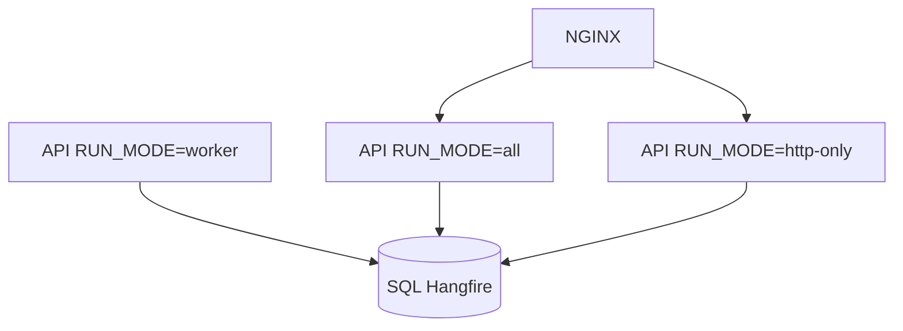

HTTP-only nodes do not compete for job workers; worker nodes do not accept public traffic. Requires Board-approved `RUN_MODE` split and careful health endpoints (workers ready when Hangfire storage up even if unused HTTP ports exist).

### S16.4 Extraction Trigger Reminder

If notification volume threatens HTTP latency, extraction of Notifications is an ADR-001 gated topology change—not a silent Compose tweak. Until then, rate-limit FCM sends and keep inbox persistence as source of truth.

---

## S17. Release, Rollback, and DR — Integrated Narrative

### S17.1 Happy Path Release

Staging digest `sha256:abc` UAT signed → Production backup OK → migrate expand → blue-green switch → smoke OK → burn-in 90 minutes → declare success → schedule contract migration for next train.

### S17.2 Rollback Path

Burn-in shows elevated CompleteTask failures → switch NGINX to previous digest `sha256:def` → verify → leave expand columns in place → forward-fix in next release.

### S17.3 Disaster Path

Host loss → RTO clock starts → restore SQL within RPO → restore MinIO → deploy `sha256:def` → rotate secrets if host compromise suspected → verify → communications update → postmortem including backup alert quality.

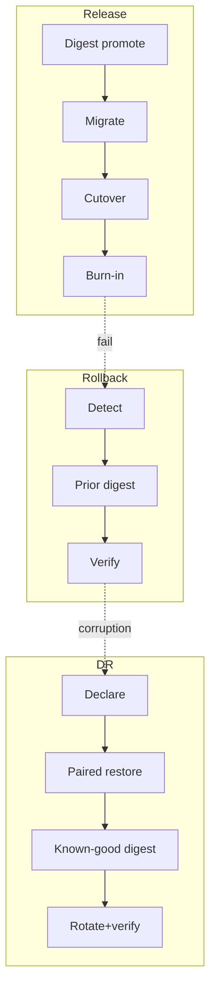

---

## S18. Infrastructure as Code — Deep Dive

### S18.1 Gradual Adoption Plan

| Phase | IaC scope |
|---|---|
| A | Version Compose + NGINX in git (already intended) |
| B | Terraform for cloud VMs, NSGs, DNS, registry |
| C | Helm chart for API/Seq/MinIO; external SQL |
| D | GitOps reconcile; policy-as-code |

Skipping to D without A–C operational mastery recreates the “day-one service mesh” mistake ADR-020 rejected.

### S18.2 Policy as Code Examples

- Deny public NSG to 1433/9000.
- Deny Deployments without readiness probes.
- Deny images tagged only `latest` in Production namespaces.

### S18.3 State and Secrets in Terraform

Remote state encrypted; no secret values in state if avoidable (use secret references). State backends access-controlled like Production.

---

## S19. Acceptance Criteria Checklist (Implementation-Ready)

### S19.1 Stage 1 Production Go-Live Gate

- [ ] API image built from `build/docker/Dockerfile.api` via CI.
- [ ] Registry holds immutable digest; Production references digest.
- [ ] NGINX terminates TLS; HTTP redirects; WebSockets work.
- [ ] Public scan: only 443 open (80 redirect only).
- [ ] SQL/MinIO/Seq not publicly reachable.
- [ ] Secrets injected; none in git.
- [ ] `/health/live` and `/health/ready` wired to orchestrator.
- [ ] Seq receives structured logs with CorrelationId.
- [ ] Hangfire dashboard VPN-only.
- [ ] Backup jobs green for SQL + MinIO; alert pageable.
- [ ] Restore drill completed within last quarter.
- [ ] RTO/RPO acknowledged by municipal IT.
- [ ] Staging promotion path proven with same digest.
- [ ] Smoke tests automated or runbook-scripted.
- [ ] Season peak checklist executed if within 30 days of peak.

### S19.2 Stage 2 Horizontal Scale Gate

- [ ] Redis (or equivalent) SignalR backplane configured and tested.
- [ ] Hangfire multi-server load test passed.
- [ ] Shared Data Protection key ring.
- [ ] Cache coherency strategy documented.
- [ ] Sticky sessions removed or explicitly interim-dated.
- [ ] PDB / drain runbooks practiced in Staging.

### S19.3 Stage 3 Kubernetes Gate

- [ ] Board authorization recorded.
- [ ] Helm/Kustomize charts reviewed.
- [ ] NetworkPolicies deny data-plane exposure.
- [ ] Migrator Job separated from Deployment.
- [ ] Ingress timeouts validated for SignalR/uploads.
- [ ] HPA disabled until Stage 2 gates met inside cluster.

---

## S20. Glossary (Deployment-Specific)

| Term | Meaning |
|---|---|
| Digest | Immutable content-addressed image id (`sha256:…`) |
| Expand-contract | Safe schema evolution enabling mixed-version API |
| Burn-in | Post-deploy observation window before release success declared |
| Paired restore | Coordinated SQL + MinIO recovery |
| Active color | Blue-green slot currently receiving traffic |
| RUN_MODE | Future process split flag for worker vs HTTP hosts |
| Stage 0–4 | PHYSICAL_ARCHITECTURE evolution path |

---

## S21. Traceability Matrix — Required Topics

| Required topic | Primary sections |
|---|---|
| Docker | §3, S1 |
| Docker Compose | §4, S2 |
| Future Kubernetes | §5, S3 |
| NGINX | §6, S4 |
| CI/CD | §11, S8 |
| GitHub Actions | §11, S8 |
| Environment Strategy | §8, S6 |
| Secrets | §9, S7 |
| Monitoring | §18, S15 |
| Scaling | §20, S16 |
| Reverse Proxy | §6, S4 |
| HTTPS | §7, S5 |
| SSL/TLS | §7, S5 |
| Deployment Pipeline | §12, S9 |
| Blue Green Deployment | §14, S10 |
| Rolling Update | §15, S11 |
| Database Migration | §16, S12 |
| Backup | §21, S13 |
| Restore | §22, S13 |
| Health Checks | §17, S14 |
| Observability | §18, S15 |
| Release Strategy | §13, S17 |
| Rollback Strategy | §19, S17 |
| Disaster Recovery | §23, S17 |
| Infrastructure as Code (Future) | §24, S18 |

---

## Closing Statement

This Deployment & DevOps Architecture Specification completes the operational path from Architecture Decision Records and Physical Architecture to **releasable, observable, recoverable municipal production** for the Agriculture Management System. It preserves the approved modular monolith, Docker Compose–first posture, NGINX TLS edge, GitHub Actions promotion of immutable digests, EF migration gates, Serilog/Seq observability, Hangfire/SignalR scale constraints, paired SQL+MinIO backup/restore, and RTO/RPO baselines—while defining a clear road to Kubernetes and Infrastructure as Code without premature complexity.

**End of Deployment & DevOps Architecture Specification**
