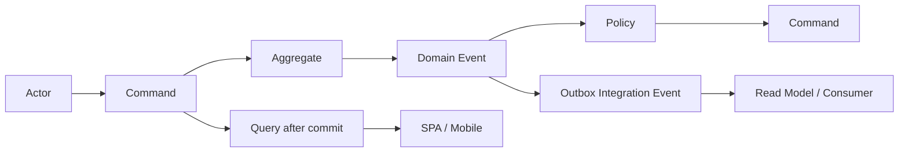
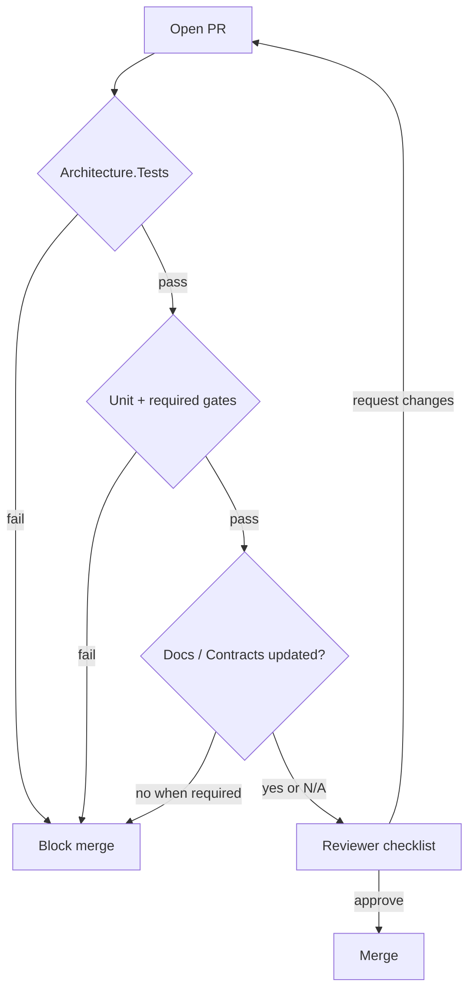

# Engineering Development Handbook

**Product:** Agriculture Management System  
**Document:** Official Engineering Development Handbook  
**Status:** Normative — enforceable for all contributors  
**Audience:** Backend, frontend, mobile, QA, DevOps, and Architecture Board  
**Companion documents:** See [Document precedence](#1-purpose-and-authority)

---

## Table of Contents

1. [Purpose and Authority](#1-purpose-and-authority)
2. [Relationship to ADRs and Architecture Specs](#2-relationship-to-adrs-and-architecture-specs)
3. [When to Update Documentation](#3-when-to-update-documentation)
4. [Definition of Done for a Feature](#4-definition-of-done-for-a-feature)
5. [Naming Standards](#5-naming-standards)
6. [Folder Standards](#6-folder-standards)
7. [SOLID](#7-solid)
8. [DRY](#8-dry)
9. [KISS](#9-kiss)
10. [YAGNI](#10-yagni)
11. [DDD Rules](#11-ddd-rules)
12. [Clean Code](#12-clean-code)
13. [Exception Rules](#13-exception-rules)
14. [Logging Rules](#14-logging-rules)
15. [Validation Rules](#15-validation-rules)
16. [Mapping Rules](#16-mapping-rules)
17. [Repository Rules](#17-repository-rules)
18. [CQRS Rules](#18-cqrs-rules)
19. [MediatR Rules](#19-mediatr-rules)
20. [Performance Rules](#20-performance-rules)
21. [Frontend and Mobile Naming Alignment](#21-frontend-and-mobile-naming-alignment)
22. [Git Commit Standards](#22-git-commit-standards)
23. [Pull Request Standards](#23-pull-request-standards)
24. [Code Review Standards](#24-code-review-standards)
25. [Review Checklist](#25-review-checklist)
26. [Documentation Standards](#26-documentation-standards)
27. [Appendix A — Canonical Trace Example](#appendix-a--canonical-trace-example)
28. [Appendix B — Normative Anti-Patterns](#appendix-b--normative-anti-patterns)
29. [Appendix C — Module-by-Module Naming Map](#appendix-c--module-by-module-naming-map)
30. [Appendix D — Enforcement Scenarios](#appendix-d--enforcement-scenarios)
31. [Appendix E — Testing Expectations for Engineers](#appendix-e--testing-expectations-for-engineers)
32. [Appendix F — Security Practices for Daily Work](#appendix-f--security-practices-for-daily-work)
33. [Appendix G — Cross-Module Communication Playbook](#appendix-g--cross-module-communication-playbook)
34. [Appendix H — Feature Slice Walkthrough](#appendix-h--feature-slice-walkthrough-checklist-form)
35. [Appendix I — Glossary](#appendix-i--glossary-engineering)

---

## 1. Purpose and Authority

This handbook is the **day-to-day engineering rulebook** for the Agriculture Management System. It tells every engineer how to name things, where to put them, how to structure changes, how to review work, and when a feature is done.

It does **not** replace architecture decision records or layer-specific architecture specifications. Those documents remain the source of truth for structural and technology choices. This handbook operationalizes those decisions into enforceable daily practice.

### 1.1 Document precedence

When guidance appears to conflict, apply this order:

1. **Accepted ADRs** (`ADR.md`) — permanent technology and pattern decisions  
2. **SECURITY_ARCHITECTURE**, **DATABASE_DESIGN**, **PHYSICAL_ARCHITECTURE** — trust boundaries, schema, topology (as scoped)  
3. **MODULE_DESIGN**, **SOLUTION_ARCHITECTURE**, **BACKEND_ARCHITECTURE**, **API_CONTRACT**, **TESTING_ARCHITECTURE**, **REACT_ARCHITECTURE**, **REACT_NATIVE_ARCHITECTURE**, **DEPLOYMENT_ARCHITECTURE** — how systems are built  
4. **DOMAIN_ANALYSIS**, **AGGREGATE_DESIGN**, **EVENT_STORMING** — domain model and process vocabulary  
5. **This handbook** — day-to-day practice aligned with the above  
6. **PRODUCT_VISION**, **SRS**, **PRD** — product intent (requirements authority; not implementation mechanics)

**Rule:** If this handbook and an Accepted ADR disagree, the ADR wins. Open a Proposed ADR or a documentation patch; do not “interpret around” Accepted decisions in code.

### 1.2 Normative language

| Term | Meaning |
|------|---------|
| **MUST** | Mandatory. Non-compliance blocks merge. |
| **MUST NOT** | Forbidden. Non-compliance blocks merge. |
| **SHOULD** | Strong default. Deviation requires reviewer justification in the PR. |
| **MAY** | Optional within documented bounds. |
| **Do** / **Don’t** | Practical restatement of MUST/MUST NOT for reviews. |

### 1.3 Scope

This handbook applies to:

- Backend modular monolith under `Agriculture.sln` (`src/`, `tests/`)
- Municipal admin SPA under `frontend/`
- Producer/inspector mobile app under `mobile/`
- CI/CD, migrations, Hangfire jobs, SignalR hubs, and operational scripts that touch application behavior
- Documentation under `docs/`

It does **not** authorize generating large application implementations from documentation alone. Implementation follows Event Storming artifacts, MODULE_DESIGN ownership, and Accepted ADRs.

### 1.4 Roles and accountability

| Role | Handbook duty |
|------|----------------|
| Feature author | Apply naming, folders, DoD, tests, docs updates |
| Reviewer | Enforce checklists; block boundary and security defects |
| Module owner | Approve Contracts changes and cross-module events for their module |
| SharedKernel steward | Approve SharedKernel additions |
| Architecture Board | ADRs, structural exceptions, waivers |
| DevOps | CI gates, expand-contract migrations, secret hygiene |
| QA | Pyramid coverage; refuse Production E2E |

**Reasoning:** Rules without owners become optional. Module ownership from MODULE_DESIGN is also ownership of engineering quality for that bounded context.

**Do:** Tag the module owner on PRs that change Contracts or integration events.  
**Don’t:** Merge cross-module Contracts changes with only a frontend reviewer approval.

### 1.5 Non-goals of this handbook

This handbook does **not**:

- Replace PRODUCT_VISION / SRS / PRD for *what* to build  
- Duplicate full permission matrices (see SECURITY_ARCHITECTURE)  
- Duplicate full route catalogs (see API_CONTRACT)  
- Teach C#, React, or EF Core from scratch  
- Authorize temporary architecture shortcuts  

When you need the exhaustive catalog, follow the link to the authoritative architecture document. When you need the daily rule, stay here.

---

## 2. Relationship to ADRs and Architecture Specs

### 2.1 Division of responsibility

| Artifact | Answers | Cadence |
|----------|---------|---------|
| **Engineering Handbook** (this doc) | How do we work every day? Naming, folders, review, DoD, SOLID/DRY practice | Continuous; patch revisions for clarifications |
| **ADR** | Why did we choose this technology or structural pattern? | When a decision is proposed, accepted, superseded |
| **SOLUTION_ARCHITECTURE** | Projects, namespaces, DI composition, solution layout | Structural changes via ADR |
| **BACKEND_ARCHITECTURE** | Layers, CQRS, MediatR pipeline, persistence, jobs | Structural changes via ADR |
| **MODULE_DESIGN** | Bounded contexts, ownership, Contracts | Module set / boundary changes via ADR |
| **API_CONTRACT** | Routes, DTOs, authZ, Problem Details | Breaking HTTP changes via Board + versioning |
| **Others** | Security, DB, React, RN, testing, deployment | Per their change-control sections |

**Reasoning:** Mixing “why we chose MediatR” with “how to name a command handler” produces unmaintainable documents. ADRs freeze *decisions*; the handbook freezes *habits*. Habits may be refined without reopening every ADR; decisions may not be quietly reversed in a PR description.

### 2.2 When an ADR is required

You **MUST** open a Proposed ADR (next free number after ADR-020 is **ADR-021**; numbers are never reused) before implementing:

- New, merged, or split modules
- SharedKernel expansion with new domain-ish types
- Change to MediatR pipeline order or TransactionBehavior ownership
- Shared `AppDbContext`, cross-schema FKs, or outbox centralization
- Cross-module communication outside Contracts + integration events
- Auth model changes (JWT/refresh, public registration, permission catalog shape)
- Test framework swap (e.g., xUnit ↔ NUnit) or Architecture.Tests quarantine
- SPA/mobile core library or offline sync model changes
- Event transport change (in-process outbox → broker, etc.)
- Microservice extraction from the modular monolith

**Do:** Draft Context, Problem, Options with municipal scenarios; impact modules/aggregates/security/ops; Architecture Board review; Accepted status; propagate to MODULE_DESIGN / SAS / BAS / related specs.  
**Don’t:** Land a “temporary” shared DbContext “just for this sprint” without an ADR. Temporary becomes permanent.

### 2.3 When an ADR is *not* required

Additive clarifications (naming examples, checklist bullets, Mermaid diagrams, non-contradicting tables) **MAY** ship as a documentation patch (e.g., handbook 1.1 → 1.2) under Document Owner approval, provided no Accepted ADR is contradicted.

**Do:** Clarify “WorkTask CLR name vs Task ubiquitous language” in this handbook.  
**Don’t:** Use a “clarification PR” to introduce Minimal APIs as the default host surface when Controllers are the Accepted v1 approach.

---

## 3. When to Update Documentation

Documentation is part of the Definition of Done. Code that contradicts docs is a defect; docs that lag Accepted ADRs are a process failure.

### 3.1 Mandatory documentation updates

| Change type | Documents to update in the same PR (or linked follow-up with Board approval) |
|-------------|-------------------------------------------------------------------------------|
| New aggregate / invariant | AGGREGATE_DESIGN, MODULE_DESIGN ownership, domain tests |
| New command / event / policy / read model | EVENT_STORMING (or feature appendix), MODULE_DESIGN § feature definition |
| New or changed HTTP route / DTO / error code | API_CONTRACT + OpenAPI + SPA Zod/MSW and/or mobile types in same change set |
| New permission string | SECURITY_ARCHITECTURE catalog + API_CONTRACT + MODULE_DESIGN + seed data |
| New Contracts event/ACL | MODULE_DESIGN, publisher Contracts, consumer notes |
| Schema / migration strategy change | DATABASE_DESIGN; destructive hot-path changes also DEPLOYMENT expand-contract notes |
| Structural solution/layout change | ADR + SOLUTION_ARCHITECTURE (+ MODULE_DESIGN if modules change) |
| Security trust-boundary change | ADR + SECURITY_ARCHITECTURE |
| Test gate / project layout change | ADR + TESTING_ARCHITECTURE |
| Handbook practice change that does not alter ADRs | ENGINEERING_HANDBOOK only |

### 3.2 Timing rules

1. **Same PR as code** for API_CONTRACT, permission strings, Contracts event shapes, and OpenAPI/Zod/MSW when the HTTP surface changes.  
2. **Before merge** for EVENT_STORMING Command/Event/Policy/Read Model definition on non-trivial features.  
3. **Before coding** for ADR-required structural work (Board acceptance first).  
4. **Within one release** for operational runbooks and DEPLOYMENT notes when ops behavior changes.

**Do:** Treat “docs in a follow-up PR” as exception requiring an explicit issue link and owner.  
**Don’t:** Merge “temporary” undocumented permission strings used only by one controller.

### 3.3 README index

`docs/README.md` **MUST** link every normative document. Adding a new official handbook or architecture spec without an index link is incomplete delivery.

---

## 4. Definition of Done for a Feature

Event Storming is the vocabulary of delivery. Per EVENT_STORMING final decision and MODULE_DESIGN feature definition, **every non-trivial feature MUST define before implementation:**

1. **Command(s)** — blue cards → Application commands  
2. **Domain Event(s)** — orange cards → domain events (+ Contracts integration events when cross-module)  
3. **Policy(ies)** — purple cards → Application policies / event handlers  
4. **Read Model(s)** — green cards → queries, DTOs, or reporting projections  

### 4.1 Extended feature definition (normative)

A feature proposal **MUST** specify:

1. **Command(s):** intent, actor, preconditions, payload  
2. **Aggregate(s) touched:** invariants impacted; single write owner  
3. **Domain / Integration Event(s):** consumers and outbox requirement  
4. **Policy(ies):** automated reactions; Contracts used (never foreign DbContext)  
5. **Read Model / Query changes:** UI needs; pagination style (page vs cursor)  
6. **Permissions:** catalog strings; resource ownership rules  
7. **Failure modes:** retries, idempotency, user-visible Problem Details `errorCode`  
8. **Module ownership:** single owner; ACL list for sync Contracts  

Multi-write-owner actions **MUST** use explicit choreography via Contracts/events — not hidden cross-module DbContext use.

### 4.2 Implementation DoD (structural slice)

A feature is not done until all applicable items are true:

| # | Criterion |
|---|-----------|
| 1 | Domain changes live in the owning module; invariants enforced on the aggregate |
| 2 | Commands / Queries / Validators / Handlers use correct namespaces and folders |
| 3 | Infrastructure persistence / configs / jobs / storage only in the owning module |
| 4 | Contracts updated if other modules react or query |
| 5 | Thin authorized API controller action (or hub/job) dispatches MediatR only |
| 6 | Domain unit tests for changed invariants; Architecture.Tests pass |
| 7 | Application handler unit tests for mutating commands |
| 8 | Illegal transition matrices covered for Tasks / Inspections / Harvest where applicable |
| 9 | Permissions seeded and documented |
| 10 | Outbox row written in the same transaction when cross-module notification is required |
| 11 | SPA and/or mobile consumers updated when contract changes (types, keys, i18n, MSW) |
| 12 | Docs updated per [§3](#3-when-to-update-documentation) |

### 4.3 Mapping Storming → code (summary)

| Storming | Backend | Client |
|----------|---------|--------|
| Command | `{Verb}{Noun}Command` + Handler + Validator | `use{Verb}{Noun}Mutation` |
| Domain Event | `{PastTense}` on aggregate | N/A (server) |
| Integration Event | `{PastTense}V{n}` in publisher `Contracts.Events` | N/A |
| Policy | `{Event}Policy` / EventHandler | N/A |
| Read Model | Query + DTO / projection | `use{Noun}Query` + feature types |

**Do:** Start coding only after Command/Event/Policy/Read Model are named and owned.  
**Don’t:** Ship a UI button that PATCHes status and invents a read model after the fact.



---

## 5. Naming Standards

Naming is a consistency boundary. Wrong names cause wrong references, wrong schemas, and review thrash. Product prefix is **`Agriculture.*`**. Solution file is **`Agriculture.sln`**.

### 5.1 Solution, projects, and modules

| Artifact | Pattern | Example |
|----------|---------|---------|
| Solution | `Agriculture.sln` | Authoritative |
| Host | `Agriculture.Api` | `src/Hosts/Agriculture.Api` |
| Shared Kernel | `Agriculture.SharedKernel` | BuildingBlocks |
| App abstractions | `Agriculture.Application.Abstractions` | Messaging, behaviors |
| BB Infrastructure | `Agriculture.Infrastructure` | Persistence helpers, auth, storage |
| Module project | `Agriculture.Modules.{Name}.{Layer}` | `Agriculture.Modules.Tasks.Application` |
| Layers | `.Domain`, `.Application`, `.Infrastructure`, `.Contracts` | All four in target architecture |
| Unit tests | `Agriculture.Modules.{Name}.UnitTests` | |
| Integration tests | `Agriculture.Modules.{Name}.IntegrationTests` | |
| Architecture tests | `Agriculture.Architecture.Tests` | Never quarantine |

**Thirteen module families:** Identity, Producers, Lands, Seasons, Workflows, Tasks, Inspections, Harvest (includes Delivery), Support, Notifications, Communication, Reporting, Administration.

**Special cases (MUST):**

- **Delivery** is **not** a sibling module folder. Aggregates, application features, and `delivery` schema live under `Modules/Harvest/`. HTTP routes remain `/api/v1/deliveries`.  
- Ubiquitous language **Task** maps to CLR type **`WorkTask`** (`Entities/WorkTask.cs`) to avoid clash with `System.Threading.Tasks.Task`. Routes remain `/api/tasks`.  
- Crop logistics **Delivery** (`delivery` schema, Harvest module) **MUST NOT** be confused with municipal aid **SupportFulfillment** (`support` schema).

**Do:** Name projects so RootNamespace equals assembly/project name.  
**Don’t:** Invent `Agriculture.Common`, `Agriculture.Utils`, `Agriculture.Data`, `Agriculture.Models`, or `Agriculture.Modules.Shared`.

### 5.2 Namespaces

**Governing principles:**

1. Folder path under the project root **MUST** mirror the namespace.  
2. Project name **MUST** equal the root namespace.  
3. Types **MUST NOT** dump at `Agriculture.Modules.{M}.Domain` root — use category folders.  
4. Namespace renames in **Contracts** are breaking; require Board review.

Canonical patterns:

```text
Agriculture.SharedKernel.{Primitives|Results|Pagination|Guards|Events|Exceptions|Specifications|Enumerations|ValueObjects|Extensions}
Agriculture.Application.Abstractions.{Messaging|Authentication|Behaviors|Data}
Agriculture.Infrastructure.{Persistence|Authentication|Storage|Logging|DependencyInjection}
Agriculture.Modules.{Module}.Domain.{Entities|ValueObjects|Events|Enums|Exceptions|Services|Repositories|Specifications}
Agriculture.Modules.{Module}.Application.{Commands.{Feature}|Queries.{Feature}|DTOs|Validators|Policies|EventHandlers|Abstractions|Mappings|Authorization|Features.{Feature}|DependencyInjection}
Agriculture.Modules.{Module}.Infrastructure.{Persistence|Persistence.Configurations|Persistence.Migrations|Persistence.Outbox|Repositories|Services|Jobs|Storage|Options|DependencyInjection}
Agriculture.Modules.{Module}.Contracts.{Events|Abstractions|Ids}
Agriculture.Api.{Controllers|Controllers.{Module}|Hubs|Middleware|Filters|Auth|Extensions|Configuration|Health}
```

**Forbidden:** `Agriculture.Modules.Tasks.Domain.Producers`; cross-module consumption events under `Application.Events` (use `Contracts.Events`); `Internal` namespaces that hide types other modules must consume via Contracts.

### 5.3 CQRS and Application naming

| Artifact | Pattern | Example |
|----------|---------|---------|
| Command | `{Verb}{Noun}Command` | `CompleteWorkTaskCommand`, `RegisterProducerCommand` |
| Handler | `{Command}Handler` | `CompleteWorkTaskCommandHandler` |
| Query | `{Get\|Search\|List}{Noun}Query` | `GetWorkTaskQuery`, `ListOverdueTasksQuery` |
| Validator | `{Command}Validator` / `{Query}Validator` | `CompleteWorkTaskCommandValidator` |
| DTO | `{Noun}Dto` / `{Noun}Response` | `WorkTaskDto` |
| Policy | `{Event}Policy` | `TaskCompletedPolicy` |
| Module marker | `I{Module}ModuleRequest` | `ITasksModuleRequest` |

**Do:** Keep feature folders aligned with ubiquitous language (`Commands/CompleteWorkTask/`).  
**Don’t:** Create `UpdateEntityCommand`, `SaveStuffCommand`, or DTOs named `ProducerEntityDto`.

### 5.4 Domain and persistence naming

| Artifact | Pattern | Example |
|----------|---------|---------|
| Aggregate | Ubiquitous language noun | `Producer`, `Inspection`, `Harvest` |
| CLR disambiguation | Prefer explicit name | `WorkTask` |
| Domain event | Past tense, unversioned | `TaskCompleted`, `UserRegistered` |
| Domain service | `{Noun}Service` / `{Noun}DomainService` | `WorkflowSequencingService` |
| Repository interface | `I{Noun}Repository` | `IWorkTaskRepository` |
| Repository impl | `{Noun}Repository` | `WorkTaskRepository` |
| EF configuration | `{Noun}Configuration` | `WorkTaskConfiguration` |
| DbContext | `{Module}DbContext` | `TasksDbContext`, `HarvestDbContext` |
| Specification | `{Purpose}{Noun}Spec` | `OverdueTaskSpec` |
| Options | `{Area}Options` | `MinioOptions`, `TasksJobOptions` |

### 5.5 Contracts and integration events

| Artifact | Pattern | Example |
|----------|---------|---------|
| Integration event | `{PastTense}V{n}` in **publisher** Contracts | `TaskCompletedV1` |
| Namespace | `Agriculture.Modules.{Publisher}.Contracts.Events` | Consumers import; never duplicate |
| ACL interface | `I{Capability}` | `IProducerDirectory`, `IWorkflowsContract` |
| Contracts DTO | `{Noun}Summary` etc. | `ProducerSummary` |

**Do:** Version integration events in the type name when the contract shape changes.  
**Don’t:** Redefine `TaskCompletedV1` inside a consumer’s Contracts project.

### 5.6 API, jobs, hubs, permissions

| Artifact | Pattern | Example |
|----------|---------|---------|
| Controller | `{Noun}Controller` | `TasksController`, `DeliveriesController` |
| Folder | `Agriculture.Api/Controllers/{Module}/` | |
| Hub | `{Area}Hub` | `DashboardHub` |
| Job | `{Verb}{Noun}Job` | `SweepOverdueTasksJob` |
| Auth policy name | `Perm.{Area}.{Action}` | `Perm.Tasks.Complete` |
| Permission string | `{module}.{resource}.{action}` | `tasks.complete`, `tasks.complete_own`, `harvest.start` |

OpenAPI tags **MUST** match module vocabulary: Identity, Producers, Lands, Seasons, Workflows, Tasks, Inspections, Harvest, Delivery, Support, Notifications, Communication, Reporting, Administration.

### 5.7 Database naming

| Artifact | Pattern | Notes |
|----------|---------|-------|
| Schemas | lowercase singular tokens | `identity`, `producers`, `tasks`, `harvest`, `delivery`, `admin`, `hangfire` |
| Tables | PascalCase plural | `Producers`, `Tasks`, `OutboxMessages` |
| Columns | PascalCase matching C# | `CreatedAt`, `IsDeleted`, `RowVersion`, `TenantId` |
| Constraints | `{Type}_{SchemaAlias}_{Table}_{Columns}` | `PK_tasks_Tasks` |
| Indexes | `IX_` / `UX_` | |
| Migrations | `{Timestamp}_{DescriptiveName}` | History table per module schema |
| Database | `Agriculture` | Env suffix on server, not in product naming |

**Don’t:** Use `Data`, `Info`, `Table1`, `Misc`, `tbl_`, `col_`, or redundant names like `TasksTaskStatus`.

### 5.8 Frontend and mobile naming

See [§21](#21-frontend-and-mobile-naming-alignment) for full alignment rules. Summary:

- SPA pages: `{Entity}{Purpose}Page.tsx`  
- Mobile screens: `{Purpose}Screen`  
- Hooks: `use{Noun}Query`, `use{Verb}{Noun}Mutation`  
- Feature folders mirror MODULE_DESIGN / API tags (`features/tasks`, `features/deliveries`)

---

## 6. Folder Standards

Folders are architecture made visible. Wrong folders invite wrong references.

### 6.1 Repository layout (authoritative)

```text
/
├── Agriculture.sln
├── src/
│   ├── Hosts/Agriculture.Api/
│   ├── BuildingBlocks/
│   │   ├── Agriculture.SharedKernel/
│   │   ├── Agriculture.Application.Abstractions/
│   │   └── Agriculture.Infrastructure/
│   └── Modules/{Identity|Producers|...|Administration}/
│       ├── Agriculture.Modules.{Name}.Domain/
│       ├── Agriculture.Modules.{Name}.Application/
│       ├── Agriculture.Modules.{Name}.Infrastructure/
│       └── Agriculture.Modules.{Name}.Contracts/
├── tests/
│   ├── Architecture.Tests/
│   ├── Api.IntegrationTests/
│   ├── Performance.Tests/
│   └── Modules.{Name}.UnitTests / IntegrationTests
├── docs/, scripts/, build/, deployment/, .github/
├── frontend/          # NOT in Agriculture.sln
└── mobile/            # NOT in Agriculture.sln
```

**MUST:** Exactly one composition root — `Agriculture.Api`. Modules register via `Add{Name}Module()` extensions.  
**MUST NOT:** Put React/RN inside the solution or inside module folders; create `src/Modules/Delivery`; create a second infrastructure root beside BuildingBlocks; create a shared `Agriculture.Domain` used by all modules.

### 6.2 Standard module interior

```text
Domain/
  Entities/, ValueObjects/, Events/, Enums/, Exceptions/, Services/, Repositories/, Specifications/
Application/
  Commands/{Feature}/, Queries/{Feature}/, DTOs/, Validators/, Policies/, EventHandlers/,
  Abstractions/, Mappings/, Authorization/, Features/ (optional), DependencyInjection/
Infrastructure/
  Persistence/{Name}DbContext.cs, Configurations/, Migrations/, Outbox/
  Repositories/, Services/, Jobs/, Storage/, Options/, DependencyInjection/
Contracts/
  Events/, Abstractions/, Ids/
```

**Option A (normative default):** `Application/Commands/{Feature}/` and `Application/Queries/{Feature}/`.  
**Option B:** `Application/Features/{Feature}/...` — allowed only if Domain layer remains intact and Architecture.Tests still enforce boundaries.

**Do:** Co-locate Command + Handler + Validator in the same feature folder.  
**Don’t:** Dissolve Domain into feature folders; create `Common` / `Helpers` / `Utils` god folders.

### 6.3 Layer placement

| Layer | May reference | Must NOT contain |
|-------|---------------|------------------|
| Domain | SharedKernel only | EF, HTTP, Hangfire, MediatR handlers |
| Application | Own Domain, own Contracts, consumed Contracts, App.Abstractions, SharedKernel | DbContext, MinIO SDK, controllers |
| Infrastructure | Own App/Domain/Contracts, BB.Infrastructure; optional other Contracts | Foreign module Domain/Infrastructure |
| Contracts | SharedKernel (minimal) | DbContext, handlers, concrete repos |
| Api | Module Infrastructure (DI), BB, Contracts | Domain entities returned from controllers |

### 6.4 Schema-per-module folders and ownership

- One SQL Server database `Agriculture`; one `{Module}DbContext` per module.  
- `HarvestDbContext` maps **both** `harvest` and `delivery` schemas.  
- Hangfire uses `hangfire` schema (Host/BuildingBlocks).  
- Outbox lives **per-module schema**, not a centralized shared outbox.  
- Reporting schema holds projections only; **no FK** into foreign module schemas.  
- `admin` schema belongs to Administration (distinct from `identity`).

### 6.5 Frontend folder standards

**SPA (`frontend/src/`):**

```text
app/          # providers, router, layouts
features/     # one folder per MODULE_DESIGN / API tag domain
shared/       # api, auth, config, errors, i18n, permissions, ui, lib, types, hooks, realtime
```

Import direction: `app → features → shared`.  
**Forbidden:** `features/A → features/B`, `shared → features`, `shared → app`.

**Mobile (`mobile/src/`):**

```text
app/, features/, shared/, local/, native/
```

Offline plane: feature-local under `features/{domain}/local/` plus global `src/local/` for SQLite, sync engine, upload queue.

**Do:** Keep `deliveries/` as a SPA feature calling `/deliveries` even though Harvest owns the backend.  
**Don’t:** Put domain widgets in `shared/` to “reuse across features” — extract only true cross-cutting primitives.

---

## 7. SOLID

SOLID is not a slogan. In this codebase it maps to module boundaries, Contracts, and single-aggregate commands.

### 7.1 Single Responsibility Principle (SRP)

**Rule:** A class has one reason to change aligned with ubiquitous language, not with technical layers alone.

**Reasoning:** Controllers that authorize, validate, load aggregates, and send FCM create untestable god objects and bypass MediatR pipeline guarantees (logging, authZ, validation, transaction).

**Do:**

- Controllers: HTTP ↔ `ISender` + Result mapping only  
- Handlers: one use case  
- Aggregates: one consistency boundary  
- Policies: one reaction chain ownership  

**Don’t:**

- Put workflow advancement inside `TasksController`  
- Put MinIO SDK calls inside Domain entities  
- Let Hangfire jobs contain business invariants without sending a command  

### 7.2 Open/Closed Principle (OCP)

**Rule:** Extend behavior via new commands, policies, and Contracts implementations — not by editing every consumer.

**Reasoning:** Integration events and ACL interfaces allow new consumers without modifying publisher Domain.

**Do:** Add `TaskCompletedV1` consumer policy in Workflows/Notifications.  
**Don’t:** Add `if (module == "Workflows")` switches inside Tasks Infrastructure.

### 7.3 Liskov Substitution Principle (LSP)

**Rule:** Implementations of Contracts and repository interfaces must honor documented preconditions and failure modes (`Result` codes, not surprising exceptions).

**Reasoning:** Confused-deputy and broken choreography occur when a Contracts fake returns success while production denies, or when a repository silently no-ops on concurrency conflict.

**Do:** Document `Result` error codes on ACL methods; keep fakes honest in unit tests.  
**Don’t:** Swallow concurrency conflicts and return success from a repository.

### 7.4 Interface Segregation Principle (ISP)

**Rule:** Prefer narrow Contracts (`IProducerDirectory.ExistsAsync`) over fat “module service” interfaces.

**Reasoning:** Fat interfaces force consumers to depend on methods they never call and tempt cross-context leakage.

**Do:** Split read ACL vs command ACL when lifetimes differ.  
**Don’t:** Publish `ITasksModule` with thirty methods spanning complete, assign, sweep, and reporting.

### 7.5 Dependency Inversion Principle (DIP)

**Rule:** Application depends on abstractions (repository interfaces, Contracts, `IObjectStorage`, `IClock`, `IUserContext`). Infrastructure implements them. Domain never depends on Infrastructure.

**Reasoning:** ADR-002 Clean Architecture and Architecture.Tests exist specifically to enforce DIP at compile time.

**Do:** Define `IWorkTaskRepository` in Domain (or Application Abstractions per module standard) and implement in Infrastructure.  
**Don’t:** Inject `TasksDbContext` into Application handlers or controllers.

---

## 8. DRY

DRY means **one authoritative expression of a business rule**, not “copy fewer characters.”

### 8.1 What MUST be single-sourced

| Concern | Authoritative location |
|---------|------------------------|
| Aggregate invariant | Domain aggregate method |
| Permission string | Security catalog + seeds (mirrored, not reinvented, on clients) |
| Integration event shape | Publisher `Contracts.Events` |
| HTTP contract | API_CONTRACT (+ OpenAPI assist) |
| Problem Details mapping | Shared exception/Result → HTTP pipeline |
| Ubiquitous language names | Domain docs + MODULE_DESIGN |

### 8.2 Acceptable duplication

- Query DTOs that resemble command payloads but serve different consumers  
- SPA and mobile type mirrors of API DTOs (generated or hand-maintained with contract tests)  
- Test Arrange blocks that intentionally repeat setup for clarity  

**Reasoning:** Premature abstraction across modules recreates a shared Domain — explicitly forbidden.

**Do:** Duplicate a small DTO shape across Contracts Summary and Application DTO when boundaries demand it.  
**Don’t:** Move Producer rules into SharedKernel “because Tasks and Inspections both need them.”

### 8.3 Forbidden DRY

- Shared DbContext “to avoid repeating EF config”  
- Generic `BaseCrudService<T>` bypassing MediatR  
- Cross-feature React imports “to reuse a table”  
- Copying integration event type definitions into consumer Contracts  

---

## 9. KISS

Keep solutions as simple as the municipal modular monolith allows — and no simpler than boundaries require.

### 9.1 Prefer simple defaults

| Situation | Simple default | Over-engineering to reject |
|-----------|----------------|----------------------------|
| Host APIs | MVC Controllers + MediatR | Minimal API sprawl without ADR |
| Cross-module notify | Outbox integration event | Immediate distributed broker |
| Sync answer needed | Contracts ACL | Shared tables / cross-schema join |
| Client cache | TanStack Query | Custom global store duplicating server state |
| Mobile offline | Durable outbox + SQLite cache | Reimplementing server workflow engine |

**Reasoning:** Complexity compounds across thirteen modules. Extra indirection that does not protect a boundary is cost without benefit.

**Do:** One command, one aggregate, one transaction (Harvest+Delivery dual-aggregate exception documented).  
**Don’t:** Introduce a saga framework for a single in-process policy that sends one Contracts method.

### 9.2 Complexity budget

Before adding a new abstraction, answer:

1. Does an Accepted ADR already prescribe the pattern?  
2. Does Architecture.Tests already forbid the simpler illegal alternative?  
3. Can a Policy + Command express the need?

If yes to (1) or (2), follow the architecture. If (3) works, prefer it.

---

## 10. YAGNI

You Aren’t Gonna Need It — especially microservice extraction, generic frameworks, and speculative SharedKernel growth.

**Minimalist (SDS-R11):** Strengthen YAGNI/KISS for both product UX and architecture — no decorative extras, unused UI modules, or speculative abstractions. Prefer the simplest working path. Keep Hangfire/Seq/MinIO and other Board-accepted stack items; “minimalist” means no *extra* speculative tech, not stripping approved infrastructure. Caching **is** required in V1 (see §20.3) — do not defer all caching until Redis.

### 10.1 Explicitly deferred until ADR

- Separate deployable services per module  
- Event bus (Kafka/Rabbit) replacing in-process outbox  
- Public self-registration  
- GraphQL layer  
- Generic repository exposing `IQueryable` to Application  
- Multi-DbContext ambient `TransactionScope` across modules  

**Reasoning:** ADR-001 Modular Monolith and ADR-017 Contracts exist so we can extract later **without** building extraction machinery now.

**Do:** Design Contracts and schemas so extraction remains possible.  
**Don’t:** Build the extraction in the same PR as a feature.

### 10.2 Feature YAGNI

- Do not add query endpoints “for a future dashboard” without a Read Model card and consumer.  
- Do not add permission strings unused by any action.  
- Do not version `/api/v2` until Board accepts a breaking change plan.

**Do:** Implement the Storming cards for this release.  
**Don’t:** Add “flexible JSON metadata bags” on aggregates to avoid modeling value objects.

---

## 11. DDD Rules

Domain-Driven Design here is operational: aggregates, domain events, policies, and module ownership from MODULE_DESIGN and AGGREGATE_DESIGN.

### 11.1 Aggregates

**MUST:**

- One aggregate root per consistency boundary (AGGREGATE_DESIGN authoritative)  
- External modules reference **root ids only**  
- Child entities mutated only via root methods  
- Repositories load/save **aggregate roots only**  
- Optimistic concurrency via `RowVersion`; map conflicts to HTTP 409  
- Soft delete via domain methods (`Deactivate` / `Delete`); hard delete only rare admin cases  
- Honor immutability after complete/archive where Aggregate Design requires (Inspection, archived Season, completed Harvest)

**Ownership (write side):** User→Identity; Producer→Producers; Land→Lands; Season→Seasons; Workflow→Workflows; Task→Tasks; Inspection→Inspections; Harvest+Delivery→Harvest; SupportRequest→Support; Notification→Notifications; Conversation→Communication; ReportRun→Reporting; SystemSetting→Administration.

**Do:** Enforce invariants inside `WorkTask.Complete(...)`.  
**Don’t:** Set `Status = Completed` from Infrastructure or a raw SQL job.

### 11.2 Domain events

**MUST:**

- Implement `IDomainEvent`; raise inside aggregate methods; collect on `AggregateRoot`  
- Name in past tense aligned with EVENT_STORMING orange cards  
- Carry idempotency data (`TaskId`, `OccurredOn`, version/sequence as applicable)  
- Publish cross-module reactions via Contracts integration events + outbox when Hangfire/SignalR or other modules are involved  

**MUST NOT:** Treat every domain event as an integration event; publish notifications before `SaveChanges` unless explicitly documented and Board-approved.

### 11.3 Policies

Purple Storming cards become Application `Policies` / `EventHandlers` (e.g., `TaskCompletedPolicy`).

**MUST:**

- React by sending commands in the same module or via Contracts into other modules  
- Keep cross-module rules in Policies — not Domain Services spanning modules  

**MUST NOT:** Open a foreign module DbContext from a policy.

Representative chains (illustrative, not exhaustive):

1. SeasonStarted → Workflow → Tasks → Notifications  
2. TaskCompleted → AdvanceWorkflow / CreateInspection → WorkflowCompleted → Harvest  
3. TaskOverdue → Notifications (+ optional Inspection)  
4. InspectionRejected → remediation Task; gate closed  
5. HarvestCompleted → Delivery → Reporting → SeasonCompleted eligibility  

### 11.4 Value objects, factories, domain services

- Value objects: immutable, equality by value (`Email`, `QuantityWithUnit`, `IdentityNumber`)  
- Factories: return `Result<TAggregate>`; construct VOs internally  
- Domain services: `{Noun}DomainService`, same module only, no infrastructure I/O  

**Do:** Put sequencing rules that span multiple aggregates **inside one module** in a domain service or dual-aggregate method (Harvest+Delivery).  
**Don’t:** Create a “FarmOrchestratorDomainService” in SharedKernel.

### 11.5 Ubiquitous language discipline

Code, docs, OpenAPI tags, SPA features, and mobile features **MUST** use the same nouns. When CLR forces a rename (`WorkTask`), document the mapping once and keep API/routes on the ubiquitous term (`tasks`).

---

## 12. Clean Code

Clean code in this system means readable use-case slices with explicit boundaries — not clever one-liners.

### 12.1 Method and type size

**SHOULD:**

- Keep handlers focused on orchestration: load aggregate → call domain → publish/outbox side effects via UoW  
- Keep controllers under thin mapping; no business `if` chains  
- Prefer intention-revealing names over comments that restate the code  

**MUST NOT:**

- Return EF entities from API  
- Catch-all `catch (Exception)` in every action  
- Use magic strings for permissions (use catalog constants)  

### 12.2 Comments and TODOs

**Do:** Comment *why* a dual-aggregate command exists; link ADR or Aggregate Design section.  
**Don’t:** Leave `// TODO: fix auth later` on a shipping permission path. TODOs that affect security **MUST** become issues with owners.

### 12.3 Nullability and Result

Prefer `Result` / `Result<T>` for expected domain/application outcomes. Use nullable reference types consistently. Avoid `null` as a business signal when `Result.Failure` with a stable `errorCode` is clearer.

### 12.4 Formatting and analyzers

Follow solution analyzer / `.editorconfig` rules. Do not disable analyzer rules in a feature PR without Architecture Board note. Architecture.Tests are not optional style — they are merge gates.

### 12.5 Clean code for API and jobs

**Controllers**

- One action ≈ one MediatR send  
- Explicit `[Authorize]` / permission policies on actions  
- Map Result once via shared helpers where available  
- No domain `if` trees deciding workflow advancement  

**Jobs**

- Name `{Verb}{Noun}Job`  
- Create DI scope; send command; dispose scope  
- Log job name + correlation + outcome  
- Treat job schedules as operational config, not business rules  

**Hubs**

- Prefer HTTP for writes; hubs for push  
- If a hub method mutates, it still sends MediatR  
- Authenticate SignalR connections per SECURITY_ARCHITECTURE  

**Reasoning:** Entry points multiply (HTTP, SignalR, Hangfire). Clean code means every entry point is boring and identical in shape so reviewers can spot the rare exception.

**Do:** Copy the controller→sender pattern into jobs and hubs.  
**Don’t:** Invent a parallel “JobService” layer that bypasses MediatR “because background.”

### 12.6 Refactoring rules

Refactors that change namespaces, Contracts, or public HTTP **MUST** follow documentation and versioning rules. Pure internal renames inside a module Application folder are fine when Architecture.Tests stay green and no Contracts surface moves.

**Do:** Separate “behavior change” commits from “rename-only” commits when both appear in one PR story.  
**Don’t:** Rename Contracts events casually mid-sprint without consumer coordination.

---

## 13. Exception Rules

Exception strategy aligns with ADR-018 (Problem Details) and the Result pattern.

### 13.1 Prefer Result for expected failures

| Outcome | Mechanism | Typical HTTP |
|---------|-----------|--------------|
| Validation failure | FluentValidation → pipeline | 400 |
| Business rule violation | `Result` with `errorCode` | 422 |
| Not found | `Result` / query miss | 404 (prefer 404 over 403 for enumeration where API_CONTRACT requires) |
| Forbidden | AuthZ behavior / Result | 403 |
| Concurrency | `*.ConcurrencyConflict` | 409 |
| Unexpected infrastructure fault | Exception → UnhandledExceptionBehavior | 500 (no stack in Production) |

**Stable error code examples:** `Tasks.NotFound`, `Harvest.QuantityExceeded`, `Producers.IdentityNumberAlreadyExists`.

### 13.2 When exceptions are appropriate

- Programmer errors (invalid pipeline configuration)  
- Infrastructure outages (SQL unavailable after retries)  
- Violations that indicate corrupted state rather than user mistake  

**Do:** Let `UnhandledExceptionBehavior` log with correlation id and map to Problem Details.  
**Don’t:** Throw `Exception("fail")` for “producer already exists” — return Result.

### 13.3 Controller and middleware rules

**MUST:**

- Map Result → `ActionResult` / RFC 7807 Problem Details (`type`, `title`, `status`, `detail`, `instance`, `correlationId`, `errorCode`, `errors[]`)  
- Preserve correlation id end-to-end  

**MUST NOT:**

- Expose stack traces in Production Problem Details  
- Catch and swallow exceptions in controllers “to return 200”  
- Invent ad-hoc error JSON shapes per controller  

### 13.4 Domain exceptions

Domain **MAY** use domain-specific exceptions for truly exceptional invariant breaches, but preferred style is `Result` from aggregate methods for expected guard failures. Choose one style per aggregate family and keep it consistent; do not mix silently.

---

## 14. Logging Rules

Logging follows ADR-011 Serilog and ADR-012 Seq, plus SECURITY constraints.

### 14.1 Required context

`LoggingBehavior` **SHOULD** enrich with: `RequestName`, `UserId`, `TenantId`, `CorrelationId`, `ElapsedMs`, `Outcome`, `Module`.

All HTTP requests **MUST** carry a correlation id (middleware). Downstream jobs **MUST** propagate correlation where a parent command exists; Hangfire runs as **system principal**, never the last interactive user.

### 14.2 What MUST NOT be logged

- Passwords, password hashes in clear intent for replay  
- Refresh tokens / access tokens  
- National identity numbers in clear text  
- Full payment or secrets material  
- Permanent MinIO credentials  

**Do:** Log token *presence* or last-four where operationally necessary — never full secrets.  
**Don’t:** Log entire command payloads that embed PII by default; redact.

### 14.3 Log levels

| Level | Use |
|-------|-----|
| Information | Successful command/query completion summaries |
| Warning | Recoverable anomalies, retries, authZ denials of interest |
| Error | Failed commands after validation, infrastructure faults |
| Fatal | Process cannot continue |

**Do:** Prefer structured properties over string interpolation-only messages.  
**Don’t:** Use `Log.Error` for expected validation failures already returned as 400.

### 14.4 Client logging

SPA/mobile **MUST NOT** log tokens or national IDs. Crash reporters **MUST** scrub auth headers. Mobile offline outbox logs **MUST NOT** dump evidence binaries.

---

## 15. Validation Rules

Validation is layered. ADR-019 FluentValidation is mandatory on the MediatR pipeline.

### 15.1 Validation stack (order of authority)

1. **FluentValidation** — input shape, required fields, ranges, format  
2. **Application / AuthorizationBehavior** — permission + resource ownership + tenant  
3. **Domain** — invariants  
4. **Database constraints** — safety net only, not primary business rules  

**Reasoning:** DB constraints catch bugs; they do not replace domain language or produce good UX error codes.

### 15.2 FluentValidation rules

**MUST:**

- One validator per command/query type  
- Register validators so `ValidationBehavior` runs for every MediatR request  
- Keep IO in validators minimal; multi-step ACL checks belong in the handler after authZ  

**MUST NOT:**

- Bypass the pipeline with manual `validator.Validate` only and skip behavior registration  
- Duplicate deep aggregate invariants in FluentValidation when Domain already enforces them (surface checks only)  
- Use FluentValidation as a substitute for permission checks  

### 15.3 Client validation

SPA Zod schemas and mobile validation **assist** UX. They are **never authoritative**. Server MediatR AuthorizationBehavior + Domain remain source of truth.

**Do:** Update Zod/MSW in the same PR as API_CONTRACT changes.  
**Don’t:** Invent client-only required fields that the API rejects or ignores inconsistently.

---

## 16. Mapping Rules

Mapping keeps boundaries honest: Domain stays free of API shapes; Contracts stay free of Infrastructure.

### 16.1 Allowed mappings

| From | To | Where |
|------|----|-------|
| HTTP body | Command / Query | Controller (manual or thin mapper) |
| Aggregate | Domain events | Aggregate methods |
| Domain event | Integration event | Application policy / outbox writer in module |
| Aggregate / projection | DTO | Query handler (prefer SQL projection) |
| Contracts DTO | Application needs | Application ACL adapters |

### 16.2 Forbidden mappings

- Controller mapping EF entities to JSON  
- Domain referencing API DTOs  
- Infrastructure mapping foreign module entities via EF navigations  
- AutoMapper profiles that pull DbContext or HTTP context into Domain  

### 16.3 Tooling

Manual mapping is acceptable and often clearer for Commands. If a mapping library is introduced, it **MUST** be confined to Application/Infrastructure and covered by an ADR if it becomes a cross-cutting standard.

**Do:** Project to `WorkTaskDto` in the query with `AsNoTracking`.  
**Don’t:** Load full aggregate graphs for list screens and map in memory.

### 16.4 API JSON shape

JSON **MUST** be camelCase; dates ISO-8601 UTC; ids UUID strings — per API_CONTRACT. Mapping layers **MUST NOT** silently change these conventions per endpoint.

---

## 17. Repository Rules

Repositories protect aggregates. They are not generic CRUD bags.

### 17.1 DbContext strategy

**MUST:**

- One `{Module}DbContext` per module; schema explicit; never `dbo` for business tables  
- Connection string name: `AgricultureDatabase`  
- Migrations history: `__EFMigrationsHistory` **per module schema**  
- UTC for all timestamps  
- Global query filters for `!IsDeleted` and optional `TenantId`; bypass only with elevated permission + explicit `IgnoreQueryFilters`  
- No lazy loading proxies by default  

**MUST NOT:** Shared `AppDbContext`; cross-schema FK constraints; expose DbContext beyond Infrastructure.

### 17.2 Repository interface design

**Do:** Express domain language — `GetActiveForProducerAsync`, not only `GetById`.  
**Don’t:** `UpdateProperty` APIs that bypass aggregate behavior; expose `IQueryable` to Application as a public abstraction.

Infrastructure repositories translate specifications to LINQ. **MUST NOT** encode business workflow rules in repositories.

### 17.3 Transactions and concurrency

- Ambient transactions via `TransactionBehavior` + EF for commands  
- Handlers **MUST NOT** call `SaveChanges` when UoW/TransactionBehavior owns the unit of work  
- **MUST NOT** enlist multiple module DbContexts in one transaction  
- Optimistic concurrency mandatory on hot aggregates (Delivery, Workflow steps, etc.)  
- Outbox rows **MUST** be written in the same transaction as aggregate save  

### 17.4 Reporting exception

Reporting **MAY** use raw SQL/views in `reporting` schema fed by jobs.  
**MUST NOT:** Map foreign module tables as EF entities in Reporting; create FKs from `reporting` into `tasks`.

### 17.5 Expand-contract

Destructive schema changes on hot tables (`Tasks`, `OutboxMessages`, `Harvests`, etc.) **MUST** follow expand → dual-write/backfill → switch readers → contract. Expand and destructive contract in the same release on hot paths is forbidden.

---

## 18. CQRS Rules

CQRS here is ADR-003: separate models/handlers for writes and reads against the same database — not event sourcing by default.

### 18.1 Commands

**MUST:**

- Mutate a single aggregate root per command (documented Harvest+Delivery dual-aggregate exception only)  
- Be immutable records/sealed types implementing `ICommand` / `ICommand<TResponse>`  
- Return `Result` or `Result<T>`  
- Carry no EF entities  

**MUST NOT:**

- Generic `UpdateEntityCommand`  
- Commands that return full dashboard DTOs as a side channel for UI convenience  
- Multi-module DbContext writes in one command  

### 18.2 Queries

**MUST:**

- Use `AsNoTracking`  
- Project in SQL where feasible  
- Never call `SaveChanges`  
- Never mutate aggregates  

**MUST NOT:** `GetOrCreateXQuery` that writes; query handlers calling `Complete()` on aggregates.

### 18.3 Side effects and events

Domain events raised during command handling are collected and, together with outbox messages, persisted in the command transaction. Cross-module consumers react after commit via outbox processing.

### 18.4 Entry points

All controller actions, state-changing hub methods, and Hangfire jobs **MUST** dispatch via MediatR. No bypass BaseService, dynamic SQL auth, or generic CRUD controller.

---

## 19. MediatR Rules

MediatR (ADR-004) is the application bus inside the modular monolith.

### 19.1 Pipeline order (normative)

1. `UnhandledExceptionBehavior`  
2. `LoggingBehavior`  
3. `AuthorizationBehavior` — e.g. `[AuthorizePermission("tasks.complete")]`  
4. `ValidationBehavior` — FluentValidation  
5. `TransactionBehavior` — **commands only**; queries pass through  

**MUST NOT** reorder without an ADR. **MUST NOT** inject `IMediator` / `ISender` into Domain.

### 19.2 Handler dependencies

Handlers depend on abstractions: repositories, `IPublisher` (or module outbox abstraction), Contracts, `IObjectStorage`, `IUserContext`, `IClock`.

**Do:** Keep handlers orchestration-thin.  
**Don’t:** New up DbContext or HttpClient inside handlers.

### 19.3 Jobs and hubs

Hangfire jobs **MUST**: create a scope → resolve `ISender` → send command.  
**MUST NOT:** Encode invariants only in job code; use singleton DbContext; “fix” data with raw SQL updates; call FCM directly from non-Notifications modules.

SignalR hubs that mutate state **SHOULD** dispatch MediatR; prefer HTTP for writes when practical.

### 19.4 Authorization defense in depth

Endpoint `[Authorize(Policy=...)]` **AND** MediatR `AuthorizationBehavior` **MUST** both apply. UI gates are never authoritative. Deny by default. Cross-tenant: fail closed.

---

## 20. Performance Rules

Performance work must not violate boundaries or correctness (idempotency, concurrency, authZ).

### 20.1 Query performance

**Do:**

- Project DTOs in SQL; avoid N+1  
- Paginate admin lists: `page` (1-based), `pageSize` (default 20, max 100), `sort`  
- Use cursor pagination for mobile feeds (notifications inbox **MUST NOT** invent offset)  
- Index per DATABASE_DESIGN; measure before adding speculative indexes  

**Don’t:**

- Load full aggregates for dashboards  
- Cross-schema joins in module write Infrastructure  
- Disable query filters globally for convenience  

### 20.2 Command performance

- Keep transactions short; no external HTTP inside TransactionBehavior scope when avoidable  
- Upload flows: multipart → upload commands; MinIO via ports; prefer short-lived presigned access  
- Use `Idempotency-Key` on critical mobile complete/upload paths  

### 20.3 Caching

Follow ADR-015 and **SDS-R11**. Cache **WILL** be used in V1 — not future-only. **Default V1:** `IMemoryCache` / ASP.NET memory cache on the API for hot read models (dashboard counters, permission lookups, reference lists) with short TTL. **When horizontal scale (>1 API instance):** introduce Redis as distributed cache behind the same abstractions; do not force Redis on day-one single-server deploy. Invalidate or TTL with explicit ownership on writes. Cache **MUST NOT** become a second write model. Never cache authorization decisions across tenants without keying by tenant and permission version. **MUST NOT** cache highly sensitive PII beyond necessity.

### 20.4 Realtime and background

- SignalR for notifications/dashboard hints — not as system of record  
- Hangfire for sweeps and projection rebuilds — still via commands  
- Load tests (k6) only on dedicated perf environments — never Production  

### 20.5 Frontend/mobile performance

- Virtualize long lists on mobile  
- TanStack Query key factories prevent over-fetch  
- Lazy routes on SPA  
- Offline outbox batching must remain idempotent on the server  

### 20.6 Performance review questions

Before merging a “performance” PR, reviewers **MUST** confirm:

1. Did tenant or soft-delete filters remain intact?  
2. Did authZ remain on the MediatR path?  
3. Are list endpoints paginated within API_CONTRACT limits?  
4. Did we avoid cross-schema joins in module write paths?  
5. Are RowVersion / If-Match still enforced on contested resources?  
6. Are caches keyed by tenant (and permission version when caching authZ-adjacent data)?  

**Do:** Prefer an indexed projection over caching unauthorized aggregates.  
**Don’t:** Remove `AsNoTracking` from queries “to fix a tracking bug” by mutating in a query handler.
---

## 21. Frontend and Mobile Naming Alignment

Clients do **not** implement CQRS internally. They consume REST (and SignalR where specified) using names that mirror Storming and backend commands.

### 21.1 Shared principles

| Principle | Rule |
|-----------|------|
| Feature folders | Mirror MODULE_DESIGN / API_CONTRACT tags |
| Mutations | `useCompleteTaskMutation` ↔ `CompleteWorkTaskCommand` / `POST .../complete` |
| Queries | `useTasksQuery` ↔ read models |
| Permissions | Reuse backend catalog strings — do not invent parallel names |
| Lifecycle | POST action endpoints — **MUST NOT** PATCH status |
| Authority | UI gates never authoritative |
| Contract source | API_CONTRACT human-authoritative; OpenAPI/Zod assistants |

### 21.2 SPA specifics

| Artifact | Pattern |
|----------|---------|
| Page | `{Entity}{Purpose}Page.tsx` — `ProducersListPage` |
| API module | `{domain}.api.ts`, `{domain}.keys.ts`, `{domain}.types.ts` |
| Auth clientId | `web-admin` (or Board-approved) |
| i18n | One namespace per feature |

**MUST NOT:** Cross-feature imports; domain widgets in `shared/`; duplicate fetch authority in route loaders fighting TanStack Query.

### 21.3 Mobile specifics

| Artifact | Pattern |
|----------|---------|
| Screen | `{Purpose}Screen` — `TodayTasksScreen` |
| Auth clientIds | `mobile-producer`, `mobile-inspector` |
| Local plane | `features/{domain}/local/` + `src/local/` |
| Outbox verbs | Storming-aligned — `TaskComplete`, `InspectionComplete`, `PhotoUploadMultipart` |

**MUST:** Record offline mutations in durable outbox **before** UI reports acceptance.  
**MUST NOT:** Infer workflow steps as authority; reimplement harvest math; assume soft-deleted entities are completable; embed MinIO credentials; invent offset pagination for notifications inbox.

### 21.4 Surface split

| Surface | Personas | Scope |
|---------|----------|-------|
| SPA | Administrator, Officer | Dense ops, registry, workflows, reporting, identity admin |
| Mobile | Producer, Inspector | Field tasks, evidence, offline, FCM |
| Either | — | Login only for provisioned accounts — **no public registration** |

---

## 22. Git Commit Standards

Commits are the audit trail for municipal software. They must be reviewable without opening every file.

### 22.1 Message format

Use concise, imperative subject lines (≈72 chars). Body explains **why** when non-obvious.

```text
Complete WorkTask evidence gate in Tasks module

Enforce photo requirement before CompleteWorkTaskCommand succeeds
so Inspections policies never see incomplete evidence events.
```

**SHOULD** prefix with area when helpful: `tasks:`, `api:`, `docs:`, `spa:`, `mobile:`, `ci:`.

### 22.2 Atomicity

**Do:** One logical change per commit when practical (domain + tests; contract + OpenAPI + Zod).  
**Don’t:** Mix unrelated refactors with feature work; commit secrets (`.env`, credentials, private keys).

### 22.3 Forbidden practices

- `git commit --no-verify` unless explicitly authorized for an emergency with Board note  
- Force-push to `main` / protected branches  
- Rewriting published history on shared branches without coordination  
- Empty commits to “trigger CI” without justification  

### 22.4 Docs and generated artifacts

Documentation-only commits are valid and encouraged when they close DoD gaps. Generated OpenAPI checked into repo **MUST** match API_CONTRACT changes in the same PR.

---

## 23. Pull Request Standards

### 23.1 When to open a PR

Every change targeting shared branches goes through PR. Direct push to protected `main` is forbidden.

### 23.2 PR title and body

**Title:** Imperative, scoped — `Add CompleteWorkTask evidence invariant`  
**Body MUST include:**

1. **Summary** — what and why (1–3 bullets)  
2. **Event Storming artifacts** — Command / Event / Policy / Read Model touched  
3. **Module ownership** — owning module; Contracts touched  
4. **Risk** — security, migration, mobile N/N-1 compatibility  
5. **Test plan** — commands run / cases covered  
6. **Docs** — which docs updated (or explicit N/A with reason)  

### 23.3 PR size and structure

**SHOULD** keep PRs reviewable (prefer vertical slices over drive-by refactors).  
If a change is large, split by module boundary or by “Contracts first / consumers second” only when safe for CI.

### 23.4 Required CI gates (normative intent)

Per TESTING_ARCHITECTURE / DEPLOYMENT:

- Build + unit tests  
- **Architecture.Tests** — **MUST NOT** be quarantined or skipped  
- Integration smoke as required by branch policy  
- SPA/mobile unit tests for changed packages  

E2E (Playwright/Detox) runs on Staging/ephemeral — **MUST NOT** run against Production.

### 23.5 Breaking changes

Breaking HTTP requires Board approval, `/api/v2` (or negotiated compatibility window), API_CONTRACT + OpenAPI together, and mobile N and N-1 compatibility per DEPLOYMENT.



---

## 24. Code Review Standards

Code review enforces this handbook and the architecture specs. Review is not optional courtesy.

### 24.1 Reviewer responsibilities

Reviewers **MUST** check:

1. Boundaries — no foreign Domain/Infrastructure references; Controllers do not use DbContext  
2. CQRS — commands vs queries; MediatR entry; pipeline not bypassed  
3. DDD — invariants on aggregates; policies not opening foreign DbContexts  
4. Security — permissions, tenant filters, no secret logging, no public registration  
5. Contracts — events versioned; ACL used for sync needs  
6. Tests — domain tests for invariants; Architecture.Tests green  
7. Docs — API_CONTRACT / permissions / handbook-aligned naming  
8. Clients — feature folder rules; POST lifecycle; query keys; i18n  

### 24.2 Review tone and outcomes

- Prefer actionable comments tied to a rule (“Violates ADR-017 / handbook §18”).  
- Distinguish **blocking** vs **nit**.  
- Approve only when blocking items are resolved or tracked with explicit waiver from Architecture Board.  

### 24.3 Author responsibilities

- Respond to blocking comments; do not resolve conversations without fixing or documenting waiver.  
- Keep discussion in the PR for auditability.  
- Do not demand rubber-stamp review for Architecture.Tests failures.

### 24.4 What reviewers MUST NOT waive casually

- Architecture.Tests failures  
- Cross-module DbContext usage  
- PATCH-for-status lifecycle endpoints  
- Missing FluentValidation on new commands  
- Logging of tokens / national IDs  
- E2E against Production  

---

## 25. Review Checklist

Use this checklist on every PR. Copy into the PR or confirm mentally with explicit “checklist done” for large changes.

### 25.1 Backend checklist

- [ ] Change owned by a single module (or explicit Contracts choreography documented)  
- [ ] Namespaces/folders match §5–§6; no `Common`/`Utils` dumps  
- [ ] Command/Query/Validator/Handler naming correct; WorkTask CLR mapping respected  
- [ ] Controller injects `ISender` only (+ logger); no DbContext  
- [ ] Lifecycle via POST sub-resource, not PATCH status  
- [ ] Result → Problem Details; stable `errorCode`  
- [ ] FluentValidation present; AuthorizationBehavior permission attribute/policy set  
- [ ] Single aggregate write (or Harvest+Delivery exception documented)  
- [ ] Outbox written in same transaction for cross-module events  
- [ ] Integration event in publisher `Contracts.Events` (`...V1`)  
- [ ] No cross-schema FK; schema-per-module preserved  
- [ ] Migrations use per-schema history; expand-contract if destructive on hot tables  
- [ ] Domain unit tests for invariants; handler tests for mutating commands  
- [ ] Architecture.Tests pass locally/CI  
- [ ] Permissions seeded/documented; Hangfire as system principal if jobs added  
- [ ] No secrets in logs or repo  

### 25.2 SPA checklist

- [ ] Lives under correct `features/{name}`  
- [ ] Shared API client; query key factory; permissions from catalog  
- [ ] Problem Details handling  
- [ ] i18n namespace updated  
- [ ] No cross-feature imports  
- [ ] Lazy routes where applicable  
- [ ] POST not PATCH for lifecycle  
- [ ] ETag/If-Match for concurrency-sensitive resources  
- [ ] Zod/MSW updated with contract  
- [ ] Tests for happy path + 403/400 as applicable  

### 25.3 Mobile checklist

- [ ] Feature folder + screen naming  
- [ ] Durable outbox before UI acceptance on mutations  
- [ ] `Idempotency-Key` on complete/upload confirm paths  
- [ ] Cursor pagination for notifications inbox  
- [ ] No embedded MinIO credentials; secure token storage  
- [ ] Does not reimplement server authority for workflow/harvest  
- [ ] Airplane-mode scenario considered for E2E when touching sync  

### 25.4 Docs checklist

- [ ] EVENT_STORMING Command/Event/Policy/Read Model defined for non-trivial features  
- [ ] API_CONTRACT / SECURITY / MODULE_DESIGN updated when applicable  
- [ ] ADR opened when structural  
- [ ] `docs/README.md` linked if new normative doc added  

---

## 26. Documentation Standards

### 26.1 Language and tone

Official docs are **English**, normative, and enforceable. Prefer MUST/MUST NOT over tutorial narrative. Examples are short naming samples and checklists — not large application source dumps.

### 26.2 Structure of normative docs

Each architecture/handbook document **SHOULD** include:

- Status and audience  
- Precedence / relationship to ADRs  
- Explicit Do / Don’t or MUST tables  
- Change-control section  

### 26.3 Linking

- Use relative links within `docs/`  
- Keep `docs/README.md` complete  
- When superseding an ADR, retain the old ADR with pointer — never reuse numbers  

### 26.4 Diagrams

Mermaid **MAY** be used sparingly for review/PR flow, Storming→code mapping, or dependency direction. Diagrams **MUST NOT** contradict Accepted ADRs. Prefer tables for catalogs (permissions, modules).

### 26.5 Code samples in docs

Allowed: signatures, folder trees, naming examples, checklist bullets, short traces.  
Forbidden in handbook PRs: large implementations, exploit payloads, production secrets, full controller bodies that drift from API_CONTRACT.

### 26.6 Ownership

Document Owner (Architecture Board designate) approves patch revisions. Structural changes require ADR + Board. Contributors **MUST NOT** silently edit Accepted ADR decision text to match an already-merged shortcut.

### 26.7 Handbook revision process

1. Propose additive clarification via PR to `docs/ENGINEERING_HANDBOOK.md`.  
2. Verify no contradiction with Accepted ADRs and layer architecture specs.  
3. Update `docs/README.md` only if a new normative doc is introduced (preserve existing links).  
4. Document Owner approves; bump informal patch note in Document Control if used.  
5. If the change alters enforceable practice that conflicts with an ADR → stop and open ADR-021+ instead.  

**Do:** Prefer tightening a Do/Don’t pair over adding vague essays.  
**Don’t:** Delete anti-patterns from Appendix B to make a shortcut look compliant.

---

## Appendix A — Canonical Trace Example

End-to-end naming for the ubiquitous **Task** / CLR **WorkTask** complete flow:

1. Mobile/SPA: `useCompleteTaskMutation` → `POST /api/v1/tasks/{id}/complete` (+ `Idempotency-Key` on mobile)  
2. API: `TasksController.Complete` → `ISender.Send(new CompleteWorkTaskCommand(...))`  
3. Pipeline: Exception → Logging → Authorization (`tasks.complete` / `tasks.complete_own`) → Validation → Transaction  
4. Application: `CompleteWorkTaskCommandValidator` → `CompleteWorkTaskCommandHandler`  
5. Domain: `WorkTask.Complete(...)` raises `TaskCompleted`  
6. Persistence: `TasksDbContext` saves aggregate + `tasks.OutboxMessages` row for `TaskCompletedV1`  
7. Policy consumers: Workflows / Notifications via Contracts — no foreign DbContext  
8. Read model: subsequent `GetWorkTaskQuery` / list queries / reporting projections as designed  

Any PR that breaks a step in this chain without updating Contracts, docs, and tests is incomplete.

---

## Appendix B — Normative Anti-Patterns

The following are **rejected**, not stylistic preferences:

1. Shared `AppDbContext` or cross-module EF navigations  
2. `Modules/Delivery` as a separate module  
3. `Agriculture.Common` / `Utils` / `Helpers` dumping grounds  
4. Controllers or jobs with business invariants and direct DbContext  
5. PATCH status for lifecycle transitions  
6. Query handlers that write  
7. MediatR in Domain  
8. Duplicate integration event types in consumer Contracts  
9. Public self-registration  
10. UI permission gates as sole authZ  
11. Architecture.Tests quarantine  
12. E2E against Production  
13. Logging tokens or national IDs  
14. Cross-schema FK constraints for module coupling  
15. Expanding SharedKernel with bounded-context domain types  

---

## Appendix C — Module-by-Module Naming Map

This appendix restates MODULE_DESIGN ownership in engineer-facing naming form. It is normative for where types live; AGGREGATE_DESIGN remains authoritative for invariants.

### C.1 Identity

| Concern | Name / location |
|---------|-----------------|
| Module projects | `Agriculture.Modules.Identity.*` |
| Schema | `identity` |
| Aggregate examples | `User` (and related Identity aggregates per Aggregate Design) |
| Commands | `RegisterUserCommand` is **not** public self-registration — provisioning only per SECURITY |
| Permissions | `identity.users.read`, `identity.users.create`, … |
| Controllers | `Agriculture.Api.Controllers.Identity` |
| SPA feature | `features/identity` |
| Mobile | Auth feature only; no public registration screens |

**Do:** Treat deactivation, refresh rotation, and permission helpers as first-class Identity tests.  
**Don’t:** Allow anonymous account creation endpoints “for demos.”

### C.2 Producers

| Concern | Name / location |
|---------|-----------------|
| Module | `Agriculture.Modules.Producers.*` |
| Schema | `producers` |
| Aggregate | `Producer` |
| Contracts ACL | `IProducerDirectory` (existence / summary for other modules) |
| Integration events | e.g. producer lifecycle events versioned in Contracts when cross-module |
| SPA | `features/producers` — `ProducersListPage`, `ProducerDetailPage` |

**Do:** Other modules ask Contracts whether a producer exists; they never join `producers` tables.  
**Don’t:** Embed Producer entity configuration inside Tasks Infrastructure.

### C.3 Lands / Seasons / Workflows

- **Lands:** `Agriculture.Modules.Lands.*`, schema `lands`, feature `features/lands`.  
- **Seasons:** `Agriculture.Modules.Seasons.*`, schema `seasons`; SeasonStarted policies typically fan out to Workflows.  
- **Workflows:** `Agriculture.Modules.Workflows.*`; `IWorkflowsContract.AdvanceStepAsync` is the sync gate for task/inspection choreography.  

**Do:** Advance workflow through Contracts after `TaskCompletedV1`, not by Tasks writing workflow tables.  
**Don’t:** Store workflow step authority only on the mobile client.

### C.4 Tasks

| Concern | Rule |
|---------|------|
| Ubiquitous language | Task |
| CLR type | `WorkTask` |
| Routes | `/api/v1/tasks` |
| DbContext | `TasksDbContext`, schema `tasks` |
| Complete command | `CompleteWorkTaskCommand` |
| Domain event | `TaskCompleted` |
| Integration event | `TaskCompletedV1` |
| Job example | `SweepOverdueTasksJob` → sends a command |
| SPA/Mobile | `features/tasks`; hooks `useCompleteTaskMutation`, `useTodayTasksQuery` |

**Do:** Keep overdue sweep logic as a command with domain rules.  
**Don’t:** `UPDATE tasks SET Status=...` from a job.

### C.5 Inspections

Inspections own inspection aggregates and gates. Policies create remediation tasks via Contracts/commands into Tasks — never by opening `TasksDbContext` from Inspections Infrastructure.

**Do:** Cover illegal transition matrices in tests.  
**Don’t:** Let SPA PATCH inspection status.

### C.6 Harvest (includes Delivery)

| Concern | Rule |
|---------|------|
| Module folder | `Modules/Harvest/` only |
| Schemas | `harvest` and `delivery` on `HarvestDbContext` |
| API Delivery | `/api/v1/deliveries`, `DeliveriesController` |
| SPA | `features/harvest` and `features/deliveries` |
| Dual-aggregate | Documented exception for Harvest+Delivery consistency inside this module |

**Do:** Keep Delivery persistence inside Harvest Infrastructure.  
**Don’t:** Create `Agriculture.Modules.Delivery.*` projects.

### C.7 Support vs Delivery (naming hazard)

| Term | Meaning | Schema |
|------|---------|--------|
| Delivery | Crop logistics | `delivery` (Harvest module) |
| Support / SupportFulfillment | Municipal aid fulfillment | `support` |

Confusing these names in PRs is a blocking review defect.

### C.8 Notifications / Communication / Reporting / Administration

- **Notifications:** sink module; many publishers → Notifications; Notifications **MUST NOT** mutate producers/tasks aggregates. FCM stays here (ADR-009).  
- **Communication:** conversations; own schema; Contracts for cross-module notifications if needed.  
- **Reporting:** read-side projections in `reporting`; **MUST NOT** transactional-write foreign aggregates; **MUST NOT** FK into `tasks`.  
- **Administration:** `admin` schema; settings; not a god orchestrator of other modules’ writes.  

---

## Appendix D — Enforcement Scenarios

These scenarios show how handbook rules apply in real reviews. Treat them as normative interpretations.

### D.1 “Just join the tables — it’s one database”

**Proposal:** Tasks query joins `producers.Producers` for display names.  
**Verdict:** **Reject** for write-side Infrastructure and for module queries that create coupling. Use Contracts summaries, denormalized read fields populated via events, or Reporting projections.  
**Reasoning:** Schema-per-module and ADR-017 exist specifically so “one database” does not become “one big ball of mud.” Cross-schema joins for Reporting jobs are a controlled exception inside the reporting plane — not a pattern Tasks may copy.

**Do:** Subscribe to producer integration events to store `ProducerDisplayName` on a task read model if UX requires it.  
**Don’t:** Add EF navigations across schemas.

### D.2 “PATCH is RESTful”

**Proposal:** `PATCH /api/v1/tasks/{id}` with `{ "status": "Completed" }`.  
**Verdict:** **Reject.** API_CONTRACT mandates lifecycle POSTs: `POST /api/v1/tasks/{id}/complete`.  
**Reasoning:** Status transitions carry evidence, concurrency, permissions (`complete_own` vs `complete_any`), and domain events. PATCH invites anemic updates and bypasses named commands.

### D.3 “Shared helper for all modules”

**Proposal:** `Agriculture.SharedKernel.ProducerRules` used by Tasks and Inspections.  
**Verdict:** **Reject** unless the type is a true primitive (e.g., generic Result helpers). Producer rules belong in Producers Domain or are expressed via Contracts answers.  
**Reasoning:** SharedKernel expansion with domain types is MODULE_DESIGN-forbidden and ADR-gated.

### D.4 “Quarantine Architecture.Tests until Monday”

**Verdict:** **Reject.** TESTING_ARCHITECTURE forbids quarantining Architecture.Tests. Fix the reference or revert the illegal project reference.  
**Reasoning:** Architecture.Tests are the compile-time constitution of the modular monolith.

### D.5 “Mobile computes next workflow step offline”

**Proposal:** Mobile SQLite stores step graph and advances locally when offline.  
**Verdict:** **Reject** as authority. Mobile **MAY** cache display of assigned steps; server commands remain authoritative. Outbox records intent (`TaskComplete`); server validates.  
**Reasoning:** RN architecture: SQLite is cache + outbox, never system of record.

### D.6 “Hangfire uses the requesting user’s JWT”

**Verdict:** **Reject.** Jobs run as system principal with explicit permission model for automated actions.  
**Reasoning:** Interactive user context is gone; reusing it creates confused-deputy and audit lies.

### D.7 “One transaction across Tasks and Workflows DbContexts”

**Verdict:** **Reject.** Use outbox + policy/Contracts choreography.  
**Reasoning:** Multi-context ambient transactions across modules violate BACKEND_ARCHITECTURE transaction rules and block future extraction.

### D.8 “Feature done: UI works on my machine”

**Verdict:** Incomplete without Command/Event/Policy/Read Model definition, permissions, tests, and docs updates per §4.  
**Reasoning:** Event Storming Final Decision is part of DoD, not optional ceremony.

### D.9 “Log national ID for support debugging”

**Verdict:** **Reject** clear-text national IDs in logs. Use correlation ids and secure support tooling with access control.  
**Reasoning:** SECURITY / KVKK constraints; handbook logging rules.

### D.10 “Add NUnit for one new test project”

**Verdict:** **Reject** without ADR selecting NUnit. xUnit is mandatory unless ADR changes framework policy. Mixing frameworks without ADR is forbidden.

---

## Appendix E — Testing Expectations for Engineers

This appendix does not replace TESTING_ARCHITECTURE; it states what feature authors **MUST** deliver day to day.

### E.1 Pyramid (engineer view)

| Layer | Tooling | When |
|-------|---------|------|
| Domain unit | xUnit; **no mocks** for aggregates; **no SQL** | Every aggregate change |
| Application unit | Mock repos/Contracts/clock; instantiate validators directly | Every mutating command |
| Architecture | NetArchTest | Every PR — never skip |
| Integration | Testcontainers SQL Server + WebApplicationFactory | Persistence, outbox, Problem Details, uploads |
| Contract | OpenAPI-based default | Critical resources |
| SPA | Vitest + Testing Library; Playwright on Staging | Changed packages / E2E |
| Mobile | Jest + RNTL; Detox/Maestro incl. airplane mode | Sync-sensitive changes |
| Load | k6 on perf env | Capacity work |

### E.2 Naming tests

Examples:

- `CompleteTask_WhenEvidenceMissing_ShouldViolateInvariant`  
- `GetTask_WhenOtherProducer_ShouldReturnForbiddenOrNotFound`  
- `Domain_ShouldNotReference_Infrastructure`  
- `JoinSeason_WhenUnauthorized_ShouldDeny`  

**Do:** Name by behavior and condition.  
**Don’t:** `Test1`, `Works`, `Tmp`.

### E.3 What never to mock

- Domain aggregates under test  
- Architecture rules  
- Natural keys needed for idempotency proofs  
- SQL Server in tests labeled “integration” (use containers; do not fake SQL away)

### E.4 Integration specifics

**MUST:** Apply migrations in fixture startup — never `EnsureCreated` as a migration substitute.  
**MUST:** Assert outbox row on commit when publishing integration events.  
**MUST:** Validate Problem Details shape on failure paths.  
**SHOULD:** Use MinIO container for upload flows.

### E.5 Flaky tests

Quarantine only with owner + expiry. **Architecture.Tests may never quarantine.** Silently ignored flakes are process defects.

### E.6 Definition of Done — testing slice

- Aggregate-owning module: domain unit tests before feature “done”  
- Mutating command: application handler unit tests  
- Tasks/Inspections/Harvest: illegal transition matrices  
- Workflows: assert Contracts called before claiming cross-module success  
- Reporting: assert no writes to foreign production aggregates  
- Identity: password policy, refresh rotation, permission helpers, deactivation  

---

## Appendix F — Security Practices for Daily Work

Engineers implement SECURITY_ARCHITECTURE; they do not reinterpret it per feature.

### F.1 Authentication (ADR-013)

- JWT access + refresh rotation; logout revokes; refresh family reuse detection  
- Claims include `sub`, `tenantId`, `roles`, permissions or permission version, `clientId`  
- ClientIds: `web-admin`, `mobile-producer`, `mobile-inspector`  
- SignalR: JWT via `access_token` query where required; short TTL; HTTPS-only in Staging/Production  
- **MUST NOT** introduce public self-registration  

### F.2 Authorization (ADR-014)

Defense in depth:

1. Endpoint `[Authorize(Policy=...)]`  
2. MediatR `AuthorizationBehavior`  
3. Resource ownership checks  
4. Tenant global filters  

Deny by default. Missing permission = deny. Cross-tenant fail closed; prefer **404 over 403** for enumeration where API_CONTRACT §6.3 dictates. Contracts callees retain their own authZ (confused deputy prevention).

### F.3 Permission catalog discipline

Custom roles compose from the catalog. **MUST NOT** invent ad-hoc permission strings in a single controller. New strings update SECURITY catalog + seeds + API_CONTRACT + MODULE_DESIGN in the same change set.

Examples (non-exhaustive): `identity.users.read`, `tasks.read`, `tasks.assign`, `tasks.complete_own`, `tasks.complete_any`, `tasks.cancel`, `harvest.start`, `admin.settings.write`.

### F.4 Secrets and storage

- MinIO: private buckets; no permanent credentials in client binaries; mediated/short-lived presigned access  
- Rate limiting on login/refresh/upload in Production — **MUST NOT** disable  
- HTTPS only Staging/Production  
- Never commit secrets; never echo secrets in CI logs  

### F.5 Engineer anti-patterns (security)

**Don’t:**

- Treat UI gates as authZ  
- Expose public buckets “temporarily”  
- Replace JWT with a homegrown scheme without ADR  
- Ship exploit payloads in tests or docs  
- Log refresh tokens “just in Seq for a day”  

**Do:**

- Fail closed on tenant mismatch  
- Use Idempotency-Key on sensitive mobile POSTs  
- Review Problem Details for information leakage  

---

## Appendix G — Cross-Module Communication Playbook

### G.1 Decision tree

1. **Need an answer to enforce an invariant now?** → Contracts ACL (sync), e.g. `IProducerDirectory.ExistsAsync`.  
2. **Need to notify others after successful commit?** → Domain event → outbox → `{PastTense}V{n}` integration event.  
3. **Need a dashboard/report?** → Reporting projection / published read model — not live cross-schema writes.  
4. **Need one HTTP UX that spans modules?** → Host controller may send command A then command B; still no Domain coupling.

### G.2 Allowed vs forbidden matrix

| Mechanism | Allowed? |
|-----------|----------|
| Contracts ACL | Yes |
| Integration event via outbox | Yes |
| Host multi-command composition | Yes (rare; still MediatR) |
| Project reference to foreign Domain/Infrastructure | **No** |
| Shared DbContext | **No** |
| Cross-schema FK | **No** |
| Foreign repository call | **No** |
| Duplicate event type in consumer Contracts | **No** |
| Module A sending Module B’s internal command type directly | **No** — B’s Contracts method dispatches B’s own command |

### G.3 Dependency direction (reminder)

- Domain → SharedKernel only  
- Application → own Domain, own Contracts, other Contracts, App.Abstractions, SharedKernel  
- Application ↛ Infrastructure, foreign Domain  
- Infrastructure → own layers + BB.Infrastructure (+ optional other Contracts)  
- Contracts → SharedKernel only  
- Api ↛ Domain (smell if compile requires Domain types in controllers)  
- SharedKernel → nothing in Modules/Api/Infrastructure  

### G.4 Notifications and Reporting special rules

- Notifications is a **sink**: consume many events; do not become the write owner of Tasks/Producers.  
- Reporting is **read-side**: copy via jobs/projections; never EF-map foreign production tables; never FK into foreign schemas.  

### G.5 Versioning integration events

When an event payload changes incompatibly, publish `TaskCompletedV2` (example) and migrate consumers. Do not silently alter `TaskCompletedV1` field meanings. Namespace renames in Contracts are breaking and need Board review.

### G.6 Idempotent consumers

Consumers **MUST** be idempotent. At-least-once delivery from outbox is expected. Use natural keys (`TaskId` + event version/sequence) to ignore duplicates. Mobile at-least-once client delivery relies on server idempotency + domain guards for exactly-once **business** effect.

---

## Extended Practice Notes (normative supplements)

### Naming — additional Do / Don’t

**Do:**

- Align OpenAPI operationIds and tags with controller module folders  
- Prefer `ListOverdueTasksQuery` over `GetTasksQuery` with undocumented filter magic  
- Name options `TasksJobOptions` and bind via the Options pattern in Infrastructure DI  
- Keep auth policy names `Perm.{Area}.{Action}` synchronized with permission strings  

**Don’t:**

- Abbreviate module names inconsistently (`Prod` vs `Producers`)  
- Place cross-module events under `Application.Events`  
- Use `Internal` folders to hide Contracts that other modules must reference  
- Name DTOs after persistence (`ProducerEntityDto`, `TaskTableDto`)  

### Folders — additional Do / Don’t

**Do:**

- Register each module with `Add{Name}Module()` from the composition root  
- Keep Migrations under the owning module Infrastructure  
- Colocate Feature Command/Handler/Validator  

**Don’t:**

- Add `src/BuildingBlocks/Agriculture.Modules.Shared`  
- Put Hangfire job classes that belong to Tasks inside Api project forever without module ownership  
- Create `frontend/src/features/sharedTasksAndInspections` god features  

### SOLID — worked examples

**SRP:** `CompleteWorkTaskCommandHandler` orchestrates; `WorkTask.Complete` enforces evidence; `TaskCompletedPolicy` advances workflow via Contracts. Three types, three reasons to change.  

**OCP:** Adding a new Notifications template for `TaskOverdueV1` should not require editing Tasks Domain.  

**LSP:** A fake `IWorkflowsContract` used in unit tests must fail the same way production would for illegal advances, or tests become lies.  

**ISP:** Prefer `IInspectionsGateContract` over `IInspectionsEverything`.  

**DIP:** Application depends on `IObjectStorage`, not MinIO SDK types.

### DRY — conflict resolution

When two modules need the same rule:

1. Is it a true shared primitive (money format, Result)? → SharedKernel candidate (Steward approval).  
2. Is it Producer knowledge? → Producers Domain + Contracts.  
3. Is it a process reaction? → Policy + events.  
4. Still tempted to share EF entities? → **Stop** — forbidden.

### KISS / YAGNI — municipal reality check

Municipal deployments favor operable modular monoliths over speculative microservices. Complexity that does not reduce incident rate or protect a boundary is rejected in review. Prefer boring Controllers, boring MediatR, boring outbox. **SDS-R11:** Minimalist UX/architecture; V1 memory cache for hot reads; Redis only on multi-instance scale-out.

### DDD — policy writing checklist

When implementing a purple card:

- [ ] Named `{Event}Policy` or clear EventHandler  
- [ ] Trigger event identified (domain vs integration)  
- [ ] Commands emitted listed  
- [ ] Contracts methods listed  
- [ ] Idempotency strategy stated  
- [ ] Failure/retry behavior stated  
- [ ] No foreign DbContext  

### Clean Code — readability bar for handlers

A reviewer should understand a handler in one screen: authorize context already applied → load aggregate → domain call → prepare outbox/integration → return Result. If a handler contains nested workflow across three modules’ types, it is in the wrong layer.

### Exceptions — mapping table for authors

| `errorCode` pattern | HTTP | Notes |
|---------------------|------|-------|
| `*.Validation.*` / FluentValidation | 400 | `errors[]` field details |
| `*.NotFound` | 404 | Prefer over 403 when hiding existence |
| `*.Denied` / authZ | 403 | When disclosure policy allows |
| Business rule codes | 422 | Invariant explained without stack |
| `*.ConcurrencyConflict` | 409 | Honor If-Match / RowVersion |
| Unhandled | 500 | Log + correlation; no stack in Production |

Create → 201 + Location when API_CONTRACT requires; complete → 204 when no body.

### Logging — correlation propagation

HTTP middleware sets correlation id → LoggingBehavior enriches MediatR → outbox/integration consumers **SHOULD** continue the id where instrumentation exists → jobs created from a request **SHOULD** carry it in job args when feasible. Support engineers debug with correlation id first, never with national ID search in Seq.

### Validation — splitting responsibilities

| Check | Layer |
|-------|-------|
| Id format, required photo count on command | FluentValidation |
| Caller may complete own task only | AuthorizationBehavior + resource check |
| Evidence hash matches / state is Completable | Domain |
| Unique constrained columns | DB safety net |

### Mapping — SPA/mobile contract sync

When a DTO field is renamed in API_CONTRACT:

1. Backend command/query DTO updated  
2. OpenAPI updated  
3. SPA Zod + MSW updated same PR  
4. Mobile types + outbox payload version reviewed  
5. i18n labels updated if user-visible  

Skipping client updates is a broken DoD.

### Repository — specification usage

Specifications (`OverdueTaskSpec`) express query intent without leaking IQueryable. Repositories apply specs. Application **MUST NOT** compose arbitrary Expression trees against Infrastructure types.

### CQRS — anti-pattern deep dive

**Anemic complete:** Command sets properties without domain method → **Reject**.  
**Fat query:** Query loads aggregates and calls mutating methods “to ensure consistency” → **Reject**.  
**Chatty command:** Command returns entire admin dashboard DTO → **Reject**; use a follow-up query.  
**Batch god command:** `SynchronizeAllModulesCommand` spanning DbContexts → **Reject**.

### MediatR — behavior ownership

| Behavior | Owns |
|----------|------|
| UnhandledException | Mapping unexpected faults |
| Logging | Timing and outcome |
| Authorization | Permission attributes / policies |
| Validation | FluentValidation |
| Transaction | Command UoW, SaveChanges, domain event collection + outbox |

Authors **MUST NOT** re-implement these concerns inside individual handlers “because it’s faster.”

### Performance — correctness first

A faster wrong answer (stale authZ, lost updates without RowVersion, cross-tenant cache bleed) is a severity-1 defect. Optimize with indexes, projections, and pagination after boundaries are correct. k6 findings feed DATABASE_DESIGN index changes — they do not authorize dropping tenant filters.

### Git / PR — municipal audit expectations

Assume an auditor will read commit history after an incident. Messages like `fix` or `wip` without body are insufficient for production changes touching Identity, Tasks evidence, or Harvest quantities. Prefer explicit subjects.

### Code review — timebox and depth

Reviewers **SHOULD** prioritize boundary and security defects over style nits. Authors **SHOULD** self-checklist §25 before requesting review to avoid burning reviewer time on naming that the handbook already settles.

### Documentation — handbook vs tutorial

This handbook intentionally omits step-by-step “how to create a project in Visual Studio” content. Onboarding tutorials, if created, are non-normative and **MUST NOT** contradict this handbook. If a tutorial disagrees, the handbook and ADRs win.

---

## Appendix H — Feature Slice Walkthrough (Checklist Form)

Use this walkthrough when starting any non-trivial story.

### H.1 Before code

1. Name the Command(s), Domain Event(s), Policy(ies), Read Model(s).  
2. Identify owning module and aggregates.  
3. List permissions and tenant rules.  
4. Decide sync Contracts vs async integration events.  
5. Note mobile offline needs and Idempotency-Key.  
6. Open ADR if structural.  
7. Sketch API routes per API_CONTRACT conventions.  

### H.2 During code

1. Domain invariants + unit tests.  
2. Command/Validator/Handler + application tests.  
3. EF config/migration in owning schema only.  
4. Outbox + Contracts if needed.  
5. Thin controller + auth policies.  
6. SPA/mobile feature slice.  
7. Architecture.Tests green.  

### H.3 Before merge

1. §25 checklists completed.  
2. Docs updated (§3).  
3. CI gates green; no Architecture.Tests skip.  
4. Risk notes for migrations / mobile N-1.  
5. Reviewer approval on boundaries and security.  

### H.4 After merge (ops)

1. Expand-contract phases respected if schema changed.  
2. Seq dashboards still useful (correlation ids present).  
3. Hangfire jobs registered and running as system principal.  
4. Feature flags (if any) documented — flags **MUST NOT** bypass authZ.  

---

## Appendix I — Glossary (Engineering)

| Term | Meaning in this product |
|------|-------------------------|
| Modular monolith | Single deployable `Agriculture.Api` hosting isolated modules (ADR-001) |
| Contracts | Public surface of a module for other modules (`Events`, `Abstractions`, `Ids`) |
| Outbox | Per-module table ensuring integration events commit with aggregates |
| WorkTask | CLR name for ubiquitous language Task |
| Policy | Application reaction to events (Storming purple) |
| Read model | Query side DTO or projection (Storming green) |
| Result | SharedKernel success/failure with stable error codes |
| Problem Details | RFC 7807 error response shape (ADR-018) |
| Architecture.Tests | NetArchTest project enforcing dependency rules |
| Composition root | `Agriculture.Api` DI registration only |
| Schema-per-module | SQL schemas aligned to modules inside one `Agriculture` database |
| Expand-contract | Safe migration pattern for breaking column/table changes |

---

## Document Control

| Field | Value |
|-------|-------|
| Title | Engineering Development Handbook |
| File | `docs/ENGINEERING_HANDBOOK.md` |
| Normative | Yes |
| Supersedes | N/A (initial official handbook) |
| Related | ADR-001…ADR-020; SOLUTION_ARCHITECTURE; BACKEND_ARCHITECTURE; MODULE_DESIGN; API_CONTRACT; TESTING_ARCHITECTURE; SECURITY_ARCHITECTURE; REACT_ARCHITECTURE; REACT_NATIVE_ARCHITECTURE; DATABASE_DESIGN; DEPLOYMENT_ARCHITECTURE; EVENT_STORMING |

**Change policy:** Additive clarifications → patch revision. Structural practice that contradicts Accepted ADRs → Proposed ADR first, then handbook update.

**Maintenance note:** Keep appendices aligned when MODULE_DESIGN module set or ADR index grows (next ADR number is ADR-021). Engineers discovering a handbook gap **SHOULD** open a docs PR rather than inventing local team norms that diverge across modules.

**Acknowledgement of sources:** Normative content in this handbook is derived from Accepted ADRs and the architecture specifications listed above. Where this handbook restates those rules for daily use, the original documents remain authoritative on conflict. The handbook’s unique contribution is enforceable day-to-day practice: naming, folders, review checklists, commit/PR standards, and Feature Definition of Done grounded in Event Storming Command / Event / Policy / Read Model.

---

*End of Engineering Development Handbook*
