# Git & Release Management Specification

> **Ürün istemcisi güncellemesi (2026-08-11):** React Native mağaza sürümü artık yayın kapsamı değildir; `mobile/` kaldırılmıştır. Üretici PWA, `frontend` statik artefaktıyla birlikte sürümlenir. Ayrıntı: [PWA_MOBILE_PARITY.md](./PWA_MOBILE_PARITY.md).

# Agriculture Management System

| Field | Value |
|---|---|
| **Document Title** | Git & Release Management Specification |
| **Version** | 1.0 |
| **Status** | Normative — Official Production Specification |
| **Effective Date** | 2026-07-18 |
| **Primary Audience** | DevOps / Release Engineers, Module Owners, Host Owner, Architecture Board, Municipal IT Change Approvers, Security Reviewers |
| **Secondary Audience** | Feature authors, SPA/Mobile Owners, QA/Test Architecture Owner, DBAs applying migrations, on-call responders |
| **Related Stack** | Git, GitHub (Actions + branch protection + Environments), Docker, private container registry (GHCR/ACR/Harbor), Docker Compose → future Kubernetes, EF Core migrations, Hangfire, SignalR, Serilog/Seq |
| **Authoritative Scope** | Git branching and protection, pull-request validation, release trains, semantic versioning and tagging, CI/CD orchestration for promotion, image registry discipline, deployment cutover patterns, rollback classification, migration gates, release notes, and release-time monitoring/alerting ownership |
| **Governing Decisions** | ADR-001 (Modular Monolith), ADR-007 (Hangfire), ADR-008/015 (SignalR/cache), ADR-016 (Database Strategy), ADR-020 (Dockerized deployment / CI/CD), PHYSICAL_ARCHITECTURE, DEPLOYMENT_ARCHITECTURE, TESTING_ARCHITECTURE, ENGINEERING_HANDBOOK (commit/PR/DoD), SECURITY_ARCHITECTURE, DATABASE_DESIGN (expand-contract / migration order) |
| **Must Not Contradict** | DEPLOYMENT_ARCHITECTURE, TESTING_ARCHITECTURE, ENGINEERING_HANDBOOK, SECURITY_ARCHITECTURE, PHYSICAL_ARCHITECTURE, DATABASE_DESIGN, ADR-020, API_CONTRACT (compatibility windows), SOLUTION_ARCHITECTURE (layout of `.github/`, `build/`, `deployment/`) |
| **Language** | English |
| **Document Class** | Official enterprise specification — not a tutorial |

---

## Document Purpose

This document is the **authoritative Git & Release Management Specification** for the Agriculture Management System (AMS). It defines how source control, pull requests, automated validation, artifact production, environment promotion, production cutover, rollback, and post-release observation are performed for a municipal modular monolith whose failure modes include incorrect harvest eligibility, lost inspection evidence, broken season sequencing, and unauthorized cross-producer data exposure.

Where ENGINEERING_HANDBOOK owns day-to-day **commit message style**, **PR body structure**, **review checklists**, and **Feature Definition of Done**, this specification owns **branch topology**, **protection rules**, **release trains**, **tagging**, **promotion gates**, **who may approve Production**, and **how Git events map to GitHub Actions workflows** defined in DEPLOYMENT_ARCHITECTURE and TESTING_ARCHITECTURE.

Where DEPLOYMENT_ARCHITECTURE owns **runtime packaging, Compose/K8s topology, secrets injection, health probes, blue-green/rolling mechanics, backup/DR**, this specification owns the **Git-centric release contract** that feeds those mechanics: which branch produces which digest, which tag names a release, which approvals unlock Production, and how hotfixes re-enter the train without forking municipal audit history.

This is an **official production-ready specification**, not a tutorial. Short YAML and Mermaid fragments appear only as **illustrative architecture sketches**. Living workflow files under `.github/workflows/` and manifests under `deployment/` remain the executable source of truth once implemented; they **MUST** remain consistent with the normative rules herein.

**Governance rule:** If this document appears to conflict with an Accepted ADR, the ADR prevails until Architecture Board issues an erratum or a superseding ADR. If this document conflicts with DEPLOYMENT_ARCHITECTURE on packaging, health, secrets, blue-green/rolling, or backup/DR, DEPLOYMENT_ARCHITECTURE prevails for runtime mechanics; this document elaborates Git/release orchestration consistent with those mechanics. If this document conflicts with TESTING_ARCHITECTURE on mandatory quality gates, TESTING_ARCHITECTURE prevails for what must be green. If this document conflicts with ENGINEERING_HANDBOOK on commit subject style or PR checklist content, the handbook prevails for authoring habits; this document may refine branch/merge policy without relaxing DoD. If this document conflicts with DATABASE_DESIGN on expand-contract or migration order, DATABASE_DESIGN prevails. If this document conflicts with SECURITY_ARCHITECTURE on secret hygiene, supply-chain scanning, or break-glass, SECURITY_ARCHITECTURE prevails for control requirements.

---

## Relationship to Approved Documents

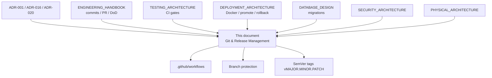

| Document | Owns | This specification elaborates |
|---|---|---|
| ENGINEERING_HANDBOOK §§22–25, §4 | Commit style, PR body, review, DoD | Merge targets, required reviewers by change class, release DoD alignment |
| TESTING_ARCHITECTURE §18 | PR/main/staging quality gates | When gates block merge vs block promotion |
| DEPLOYMENT_ARCHITECTURE §§8–19 | Environments, digests, blue-green/rolling, migrate, rollback, monitor | Git triggers, tag→deploy mapping, approval matrix |
| DATABASE_DESIGN §§3.5, 4 | Expand-contract, schema ownership, migrator identity | Migration gate in release flow |
| SECURITY_ARCHITECTURE | Secrets, CVE policy, Hangfire/Seq hardening | Security scan placement in PR vs release |
| ADR-020 | Docker + CI/CD + health + Seq | Pipeline stage binding to branches/tags |
| PHYSICAL_ARCHITECTURE | Stage 0–4 topology, RTO/RPO | Which cutover pattern is legal per stage |

**Reading order for release engineers:** ENGINEERING_HANDBOOK §§22–25 → TESTING_ARCHITECTURE §18 → ADR-020 clarifications → DEPLOYMENT_ARCHITECTURE §§8–19 → DATABASE_DESIGN migration sections → **this document** → environment runbooks.

---

## Normative Language

| Term | Meaning |
|---|---|
| **MUST** | Absolute requirement. Violation blocks merge, promotion, or Production cutover. |
| **MUST NOT** | Absolute prohibition. |
| **SHOULD** | Strong default. Deviation requires explicit justification in the PR or release ticket. |
| **MAY** | Optional within stated bounds. |
| **Do** / **Don’t** | Review-oriented restatement of MUST/MUST NOT. |

---

## Table of Contents

1. [Architectural Posture for Git & Release](#1-architectural-posture-for-git--release)
2. [Git Strategy](#2-git-strategy)
3. [Branching Strategy](#3-branching-strategy)
4. [Primary Model: AMS GitFlow-Inspired Release Model](#4-primary-model-ams-gitflow-inspired-release-model)
5. [Protected Branches and Required Reviewers](#5-protected-branches-and-required-reviewers)
6. [Feature Branches](#6-feature-branches)
7. [Pull Request Validation](#7-pull-request-validation)
8. [Automated Testing](#8-automated-testing)
9. [Static Code Analysis](#9-static-code-analysis)
10. [Security Scan](#10-security-scan)
11. [Docker Build](#11-docker-build)
12. [Image Registry](#12-image-registry)
13. [Release Flow](#13-release-flow)
14. [Versioning](#14-versioning)
15. [Semantic Versioning](#15-semantic-versioning)
16. [Release Notes](#16-release-notes)
17. [Environment Promotion](#17-environment-promotion)
18. [Deployment](#18-deployment)
19. [Hotfix Path](#19-hotfix-path)
20. [Database Migration](#20-database-migration)
21. [Rollback](#21-rollback)
22. [Monitoring](#22-monitoring)
23. [Alerting](#23-alerting)
24. [Production Approval Authority](#24-production-approval-authority)
25. [Alignment with Handbook Definition of Done](#25-alignment-with-handbook-definition-of-done)
26. [Hangfire and SignalR Release Constraints](#26-hangfire-and-signalr-release-constraints)
27. [Mobile and SPA Release Coordination](#27-mobile-and-spa-release-coordination)
28. [Repository Layout and Workflow Ownership](#28-repository-layout-and-workflow-ownership)
29. [Audit, Compliance, and Municipal Change Control](#29-audit-compliance-and-municipal-change-control)
30. [Anti-Patterns and Forbidden Practices](#30-anti-patterns-and-forbidden-practices)
31. [Change Control for This Specification](#31-change-control-for-this-specification)
32. [Appendices](#32-appendices)

---

## 1. Architectural Posture for Git & Release

### 1.1 What We Release

AMS near-term Production releases a **single deployable ASP.NET Core host** (`Agriculture.Api`) composing all business modules (ADR-001), plus **React admin static assets**, plus **React Native store-distributed clients** that consume the same HTTPS API. Dependency processes (SQL Server, MinIO, Seq, NGINX) are environment-managed per DEPLOYMENT_ARCHITECTURE and PHYSICAL_ARCHITECTURE; they are not versioned as application digests except where base images are pinned.

**Reasoning:** Municipal ops capacity is small. One API image digest, one promotion path, one JWT validation surface, and one Serilog→Seq correlation chain minimize release error while preserving in-code module boundaries for future extraction. Git strategy therefore optimizes for a **single release train** with module ownership inside the monolith—not for per-module independent versioning on day one.

### 1.2 Quality Attributes Owned by Release Management

| Attribute | Release contribution | Sibling authority |
|---|---|---|
| Auditability | Protected history, PR evidence, signed-off tags, release notes | ENGINEERING_HANDBOOK; municipal change tickets |
| Correctness | Migration gates; expand-contract sequencing | DATABASE_DESIGN; ADR-016 |
| Availability | Health-gated cutover; classified rollback | DEPLOYMENT §§17–19; PHYSICAL §14 |
| Security | Scan gates; no secrets in git; digest immutability | SECURITY_ARCHITECTURE; ADR-020 |
| Operability | SemVer for humans; digests for machines; burn-in watch | DEPLOYMENT §13, §18 |
| Compatibility | Mobile N / N-1; API contract windows | API_CONTRACT; REACT_NATIVE_ARCHITECTURE |

### 1.3 Anti-Goals

1. **Not** day-one microservices release trains or per-module container versions (ADR-001 / ADR-020).
2. **Not** rebuilding images “for Production” after Staging validation (digest promotion is mandatory).
3. **Not** auto-migrate on every Production replica start (DEPLOYMENT §11.7 / §16.5).
4. **Not** treating Hangfire dashboard or Seq UI as public release surfaces (SECURITY / PHYSICAL).
5. **Not** multi-instance rolling deploy without Redis SignalR backplane or sticky sessions (PHYSICAL §16.2; DEPLOYMENT §15).
6. **Not** replacing ENGINEERING_HANDBOOK commit/PR authoring rules with a second conflicting style guide.
7. **Not** using Production for exploratory E2E (TESTING_ARCHITECTURE; handbook §23.4).

### 1.4 Evolution Path Binding

| Physical Stage | Git/Release implication |
|---|---|
| **0 — Dev laptop** | Feature branches; local compose; no Production tags |
| **1 — Single-server Production** | Recreate or blue-green-lite; release tags; manual Production approval |
| **2 — HA-leaning Compose** | Blue-green preferred; Hangfire single-active-color during cutover |
| **3 — Kubernetes** | Same images; rolling with prerequisites; GitOps optional later |
| **4 — Extraction** | Still one primary train until Board authorizes independent services |

---

## 2. Git Strategy

### 2.1 Purpose of Git in AMS

Git is the **system of record for source, documentation, and release intent**. Municipal auditors and incident responders must be able to answer, from Git alone: which commit produced Production digest `sha256:…`, who reviewed it, which migrations it contained, which SemVer tag named it, and whether a hotfix diverged from or rejoined the mainline.

**Reasoning:** AMS processes personal data, evidence photos, and harvest quantities that affect municipal aid and compliance. Informal “push to server” workflows destroy accountability. Git strategy is therefore a **control**, not a developer convenience.

### 2.2 Normative Git Rules

1. **Single primary repository** for the modular monolith, SPA, mobile (when in-repo), docs, `build/`, `deployment/`, and `.github/` (SOLUTION_ARCHITECTURE layout). Split repos for mobile **MAY** exist only with Board-approved contract and version coordination rules identical to this document’s SemVer/API compatibility sections.
2. **All shared-branch changes go through pull requests.** Direct push to protected branches is forbidden (ENGINEERING_HANDBOOK §23.1).
3. **History on protected branches is append-only** from the perspective of contributors: no force-push, no history rewrite, no `--no-verify` without Board-noted emergency (handbook §22.3).
4. **Secrets MUST NOT enter Git** (`.env` with credentials, private keys, FCM JSON, JWT signing material). Secret scan is a merge gate (TESTING §18.2; SECURITY).
5. **Docs are first-class:** documentation-only commits that close DoD gaps are valid; new normative docs **MUST** be indexed in `docs/README.md` (handbook §3.3).
6. **Generated OpenAPI** checked into the repository **MUST** match API_CONTRACT changes in the same PR (handbook §22.4).
7. **Commits are the audit trail:** subject lines follow ENGINEERING_HANDBOOK §22.1 (imperative, ≈72 chars; optional area prefix `tasks:`, `api:`, `docs:`, `spa:`, `mobile:`, `ci:`). This specification does not redefine that style; it requires that **release tags and PR titles remain consistent with that audit posture**.

### 2.3 Git Objects That Matter Operationally

| Object | Operational meaning |
|---|---|
| Commit SHA | Immutable source identity for a build |
| PR merge commit | Evidence of review + CI gates |
| Annotated tag `vMAJOR.MINOR.PATCH` | Human release name; points to release commit |
| Image digest `sha256:…` | Machine release identity (DEPLOYMENT §8.2, §10) |
| GitHub Environment deployment record | Who approved Production and when |

**Normative binding:** A Production release **MUST** be expressible as the tuple `(git tag, commit SHA, image digest, migration set applied)`. Missing any element makes the release incomplete for audit.

### 2.4 Working Tree Hygiene

- **Do:** Keep working trees free of ignored secrets; use municipal secret stores for local overrides.
- **Don’t:** Commit `bin/`, `obj/`, `node_modules/`, local SQL dumps with PII, or MinIO evidence exports.
- **MUST:** `.gitignore` covers build outputs and common secret filenames; periodic secret scanning covers history for accidental commits (SECURITY incident path if found).

### 2.5 Submodules and Vendoring

Git submodules for application code are **discouraged** for AMS Stage 1–2. Prefer NuGet/npm packages with pinned versions and Dependabot/Renovate under SECURITY supply-chain policy. If a submodule is unavoidable, Architecture Board **MUST** Accept an ADR describing update and release coupling.

---

## 3. Branching Strategy

### 3.1 Branch Catalog (Normative)

| Branch pattern | Lifetime | Purpose | Protected? |
|---|---|---|---|
| `main` | Permanent | Production-reflecting integration line; always releasable after green CI | Yes |
| `develop` | Permanent | Next-train integration; receives feature merges | Yes |
| `feature/<ticket>-<short-slug>` | Days–weeks | Single feature or tightly scoped fix | No (delete after merge) |
| `bugfix/<ticket>-<short-slug>` | Days | Non-urgent defect targeting `develop` | No |
| `release/vMAJOR.MINOR.PATCH` | Days | Stabilize a release candidate for Staging/UAT | Yes (while open) |
| `hotfix/vMAJOR.MINOR.PATCH` | Hours–days | Production defect/security fix from `main` | Yes (while open) |
| `chore/*`, `docs/*` | Short | Non-product or documentation work | No |

### 3.2 Naming Rules

1. Branch names **MUST** be lowercase kebab-case after the type prefix.
2. Ticket/issue id **SHOULD** appear when a tracker exists: `feature/AMS-142-task-evidence-gate`.
3. Release and hotfix branches **MUST** embed the target SemVer without the leading `v` in the folder segment after type, and tags use the leading `v`: branch `release/v1.4.2` → tag `v1.4.2`.
4. Personal long-lived branches (`john/experiments`) **MUST NOT** be merge targets for Production.

### 3.3 Default Branch

`main` is the **default branch** for the repository (clone default, PR base for hotfixes and docs that must ship independently of the train). Feature work targeting the next train uses `develop` as base.

**Reasoning:** Defaulting to `main` keeps Production-critical hotfixes and security patches on the shortest path. Using `develop` as default tends to bury Production truth and confuses municipal IT who expect “main = what’s live.”

### 3.4 Merge Strategies

| Target | Strategy | Reasoning |
|---|---|---|
| `feature/*` → `develop` | Squash **or** merge commit per team convention; squash **SHOULD** be default for small features | Keeps `develop` readable; handbook prefers atomic logical commits inside the branch before squash |
| `release/*` → `main` | Merge commit (no squash) | Preserves release topology for audit |
| `release/*` → `develop` | Merge commit after `main` | Syncs release fixes back |
| `hotfix/*` → `main` | Merge commit | Audit of Production patch line |
| `hotfix/*` → `develop` (and open `release/*` if any) | Merge commit | Prevents regression reintroduction |

**MUST NOT** rebase protected shared branches after others have based work on them. Feature authors **MAY** rebase their own feature branches onto latest `develop` before opening/updating PRs.

### 3.5 Branch Deletion

Merged feature/bugfix branches **MUST** be deleted after merge. Open release/hotfix branches are deleted after both forward-merge and back-merge complete. Retaining merged branches indefinitely creates false “still in progress” signals.

---

## 4. Primary Model: AMS GitFlow-Inspired Release Model

### 4.1 Decision

**AMS adopts a GitFlow-inspired model as the primary branching and release model**, adapted for a municipal modular monolith on GitHub with immutable container digests.

This is **not** classic 2010 GitFlow cargo-culted without change: there is no mandatory long-lived `support/*` line; environment promotion is digest-based (DEPLOYMENT §8.2); CI is GitHub Actions; Production cutover follows DEPLOYMENT blue-green/rolling/recreate rules by Physical Stage.

### 4.2 Why Not Pure Trunk-Based Development as Primary

Trunk-based development (very short-lived branches, continuous integration to `main`, feature flags for incomplete work) is excellent for large SaaS teams with mature flag platforms and continuous Production deployment. AMS rejects it as the **primary** municipal model for these reasons:

1. **Municipal UAT and change windows** require a stabilized release candidate that can sit on Staging while officers validate planting-season workflows—without freezing all feature development on `main`.
2. **Calendar risk peaks** (planting week, frost emergencies, harvest eligibility deadlines) need an explicit freeze of the release branch while hotfixes still flow.
3. **Ops capacity** is small; digest promotion with human Production approval is already mandated by ADR-020 and DEPLOYMENT. A pure trunk model that implies continuous Production deploys conflicts with that approval culture unless heavily flag-gated.
4. **Migration expand-contract** often spans multiple deploys; release branches make the “which code + which migration set” pairing explicit for auditors.

### 4.3 Why Not Pure GitHub Flow as Primary

GitHub Flow (`main` + feature branches + deploy from `main`) is simpler and **MAY** be used temporarily by a two-person spike team. It is insufficient as the long-term primary model because:

1. It lacks a first-class **release stabilization** branch for Staging/UAT without blocking `main` merges that are not yet in the train.
2. Hotfix vs next-train work contention increases without `develop`/`release/*` separation.
3. Municipal release notes and SemVer tagging map more cleanly to release branches than to “whatever is on main today.”

**GitHub Flow remains an allowed subset** for documentation-only and low-risk chore PRs directly to `main` when no open release train is conflicted—subject to the same protection and CI rules.

### 4.4 Why GitFlow-Inspired Fits Municipality Releases

1. **`develop` absorbs features** while `release/vX.Y.Z` freezes scope for UAT.
2. **`hotfix/vX.Y.Z`** provides an auditable Production patch path that still back-merges.
3. **Tags on `main`** after release merge provide SemVer for operators; digests provide machine identity.
4. Aligns with DEPLOYMENT release types: Standard, Hotfix, Emergency, Data fix (§13.2).

### 4.5 Conceptual Branching Diagram

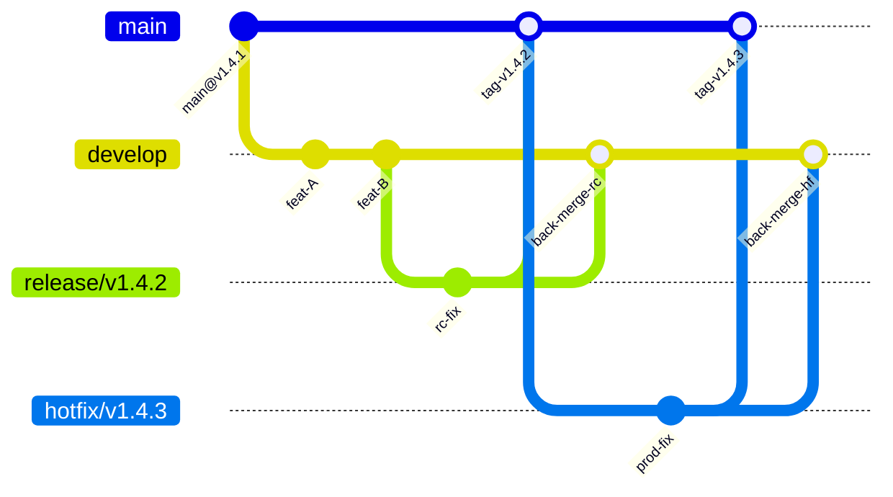

### 4.6 Model Summary Rules

1. Features merge to **`develop`** only (except emergency hotfixes).
2. When the train starts, cut **`release/vMAJOR.MINOR.PATCH`** from `develop`.
3. Only bugfixes, release-note edits, and migration-safe corrections land on the release branch.
4. After Staging gates pass and Production approval is granted, merge release → **`main`**, tag **`vMAJOR.MINOR.PATCH`**, promote the **already-built** digest.
5. Immediately merge release (or `main`) back to **`develop`**.
6. Hotfixes cut from **`main`**, merge to `main` + tag patch, back-merge to `develop` and any open `release/*`.

---

## 5. Protected Branches and Required Reviewers

### 5.1 Protected Branch Set

The following **MUST** be protected in GitHub branch protection (or Rulesets):

- `main`
- `develop`
- `release/*`
- `hotfix/*`

### 5.2 Protection Settings (Normative)

| Setting | `main` | `develop` | `release/*` / `hotfix/*` |
|---|---|---|---|
| Require PR | Yes | Yes | Yes |
| Require status checks | Yes — see §7–§10 | Yes | Yes (release subset allowed) |
| Require up-to-date branch before merge | Yes | Yes | Yes |
| Require review count | ≥ 1 (see matrix) | ≥ 1 | ≥ 1 |
| Dismiss stale reviews on new push | Yes | Yes | Yes |
| Restrict who can push | Release Managers + admins | Engineers + Release Managers | Release Managers + Host Owner |
| Allow force push | **No** | **No** | **No** |
| Allow deletions | Admins only | Admins only | Admins after close |
| Require linear history | Optional | Optional | **No** (merge commits preferred for release topology) |
| Require signed commits | SHOULD when municipal PKI ready | SHOULD | SHOULD |

### 5.3 Required Reviewers by Change Class

| Change class | Minimum reviewers | Must include |
|---|---|---|
| Single-module feature (no Contracts) | 1 | Module Owner or delegate |
| Cross-module / Contracts / integration events | 2 | Owning Module Owner + consumer Module Owner or Host Owner |
| Security-sensitive (authN/Z, permissions, Hangfire dashboard, secrets, MinIO policies) | 2 | Security reviewer + Module/Host Owner |
| EF migrations / schema | 2 | Module Owner + DevOps or DBA |
| CI/CD, Docker, compose, k8s, registry | 2 | DevOps + Host Owner |
| Docs-only normative architecture | 1 | Steward of that doc or Architecture Board delegate |
| Production release PR (`release/*` → `main`) | 2 | Release Manager + Host Owner (or Board delegate) |
| Hotfix PR | 2 | On-call/Release Manager + Module Owner of defect area |

**Do:** Enforce CODEOWNERS for `src/Modules/**`, `build/**`, `deployment/**`, `.github/**`, `docs/**`.  
**Don’t:** Merge Contracts changes with only a frontend reviewer approval (handbook §1.4).

### 5.4 CODEOWNERS Intent

Illustrative ownership (not executable source of truth):

```text
# Illustrative architecture sketch
/docs/DEPLOYMENT_ARCHITECTURE.md    @ams-devops @ams-architecture-board
/docs/GIT_RELEASE_STRATEGY.md        @ams-devops @ams-architecture-board
/build/docker/                       @ams-devops @ams-host-owner
/deployment/                         @ams-devops
/.github/workflows/                  @ams-devops
/src/Modules/Identity/               @ams-identity-owner
/src/Modules/Tasks/                  @ams-tasks-owner
```

### 5.5 Admin Break-Glass

Repository admins **MAY** bypass protection only for documented emergencies (security incident, complete CI outage blocking rollback). Every bypass **MUST** create a follow-up ticket within 24 hours and a Board note. Bypass is not a convenience path for late features.

---

## 6. Feature Branches

### 6.1 Purpose

Feature branches isolate incomplete work from `develop` while preserving continuous integration via draft PRs and required checks. They are the primary unit of delivery aligned to ENGINEERING_HANDBOOK Feature Definition of Done.

### 6.2 Creation Rules

1. Branch from latest **`develop`** (not from stale personal clones of `main` unless hotfix).
2. One feature branch **SHOULD** map to one vertical slice (Command / Event / Policy / Read Model) as defined in handbook §4.
3. Large epics **MUST** be split into reviewable PRs (handbook §23.3): Contracts-first only when safe for CI; otherwise vertical slices per module.

### 6.3 What Belongs on a Feature Branch

| Include | Exclude |
|---|---|
| Domain + Application + Infrastructure for owning module | Unrelated refactors (separate PR) |
| Tests required by DoD | Production secrets |
| API_CONTRACT / OpenAPI / Zod / MSW when HTTP changes | “Temporary” Architecture.Tests disables |
| Expand-phase migrations for the feature | Destructive contract migrations for hot tables in same PR as expand (DATABASE_DESIGN §3.5) |
| Hangfire job registration + system-principal behavior | Interactive-user principal in jobs |

### 6.4 Feature Flag Policy

Risky UX **SHOULD** ship behind feature flags (DEPLOYMENT §13.1; PHYSICAL §19.2). Flags are configuration—not secrets. Flag defaults for Production **MUST** be fail-safe (off for new risky paths until UAT sign-off).

**Reasoning:** GitFlow release branches freeze code; flags freeze behavior. Together they allow code to merge to `develop` without exposing unfinished municipal workflows in Staging/Production.

### 6.5 Draft vs Ready PRs

- **Draft PR:** allowed early for CI signal and design feedback; not mergeable.
- **Ready for review:** author asserts handbook DoD checklist for applicable items; CI green or explained.

### 6.6 Lifetime and Stale Branch Policy

Feature branches older than **14 days** without commits **SHOULD** be reviewed for abandonment. Branches older than **30 days** require Module Owner justification to remain open. Stale branches create merge hell and bypass seasonal security patches.

### 6.7 Feature Branch Flow

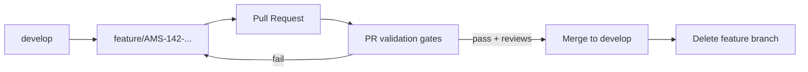

---

## 7. Pull Request Validation

### 7.1 Authority Split

- **ENGINEERING_HANDBOOK §23** defines PR title/body, size, and human checklist.
- **TESTING_ARCHITECTURE §18** defines automated gate catalog.
- **This section** defines when validation blocks **merge** vs when it is advisory, and how validation binds to branch type.

### 7.2 PR Title and Body (Binding Reminder)

Authors **MUST** follow handbook §23.2. Release-management additions for PRs that touch release machinery:

7. **Release impact** — none / standard train / requires migration / requires maintenance window / mobile N-1 risk  
8. **Rollback class anticipated** — app-digest rollback / forward-fix only / restore (see §21)

### 7.3 Required Status Checks for Merge to `develop`

Aligned to TESTING_ARCHITECTURE §18.2 and §18.7:

| Check | Merge gate? |
|---|---|
| Compile `Agriculture.sln` | **MUST** |
| Backend unit tests | **MUST** |
| Architecture.Tests | **MUST** — never quarantine |
| SPA Vitest if frontend changed | **MUST** |
| Mobile Jest if mobile changed | **MUST** |
| Secret scan | **MUST** |
| Lint/typecheck for changed JS/TS | **MUST** |
| Integration smoke (`Smoke` trait) | **SHOULD** required when runners stable; Host Owner exception + 24h full run if skipped (TAS §18.3) |
| Contract/OpenAPI diff policy | **MUST** when API surface changed |
| Container build + scan | **SHOULD** on PR when Dockerfile/build context changed; **MUST** on `main`/`release/*` |

### 7.4 Required Status Checks for Merge to `main`

All `develop` merge gates, plus:

| Check | Merge gate? |
|---|---|
| Release workflow dry-run / image publish to non-prod tag | **MUST** for release/hotfix merges |
| Migration script presence validation (if migrations in diff) | **MUST** |
| No unresolved “Board required” labels | **MUST** |

### 7.5 Human Validation

Reviewers **MUST** apply handbook §§24–25. Release Managers additionally verify:

1. SemVer intent matches change (breaking vs feature vs patch).
2. Expand-contract phases are respected.
3. Hangfire/SignalR notes present when jobs/hubs change.
4. Docs index updated if a new normative doc appears.

### 7.6 PR Validation Flow

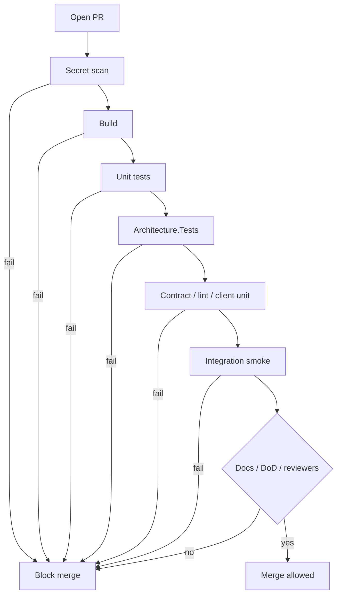

### 7.7 Merge Queue / Serialization

When GitHub Merge Queue is available, `develop` and `main` **SHOULD** use it during peak contribution to prevent “green PR, red main” races. Architecture.Tests and unit tests **MUST** still run on the queued merge commit.

---

## 8. Automated Testing

### 8.1 Role in Release Management

Automated tests are not a QA preference; they are **release controls**. A release candidate that skipped Architecture.Tests or Staging smoke is not a candidate—regardless of schedule pressure.

### 8.2 Test Layers Bound to Git Events

| Git event | Mandatory automated tests | Authority |
|---|---|---|
| PR to `develop`/`main` | Unit + Architecture.Tests + secret scan + changed-client unit | TAS §18.2 |
| PR integration smoke | Auth, one IDOR, one task complete, migrations apply | TAS §18.3 |
| Push/`main` or nightly | Full integration (Testcontainers) | TAS §18.3 |
| Staging deploy | Health, Playwright smoke, mobile E2E smoke, security sampling | TAS §18.4 |
| Nightly | Perf smoke/k6 baseline, mutation soft/hard per TAS §8 | TAS §18.5 |
| Pre-season | Load/stress campaign | TAS; PHYSICAL |

### 8.3 Architecture.Tests as Non-Negotiable Release Gate

Architecture.Tests encode modular monolith boundaries (ADR-001, SOLUTION_ARCHITECTURE, BACKEND). Skipping them to “land the release” is forbidden (handbook §23.4, §24.4). Release Managers **MUST NOT** waive Architecture.Tests failures.

### 8.4 Integration and Migration Tests in CI

Integration fixtures **MUST** apply EF migrations at startup—never `EnsureCreated` as a migration substitute (handbook testing appendix). Release branches that include migrations **MUST** demonstrate smoke migration apply in CI or Staging before Production.

### 8.5 Hangfire and SignalR in Automated Testing

Per TESTING_ARCHITECTURE §§20–21:

- Prefer command-level tests for job payloads; Hangfire SQL storage integration is optional smoke.
- SignalR: JWT connect allowed; unauthorized group join denied.
- Load tests may include Hangfire drain and SignalR fan-out before season peaks.

Release notes **MUST** call out job/hub behavior changes because operators watch Hangfire failures and SignalR reconnect storms during burn-in (§22–§23).

### 8.6 Flaky Test Policy

Flaky tests **MUST** be quarantined only with a tracked defect, owner, and 48-hour (PR-blocking suite) or 7-day (nightly) fix SLA. Silent skips that greenwash CI are treated as process defects.

### 8.7 E2E Against Production

**MUST NOT** run Playwright/Detox E2E against Production (handbook §23.4). Staging and ephemeral environments only.

---

## 9. Static Code Analysis

### 9.1 Purpose

Static analysis catches defect classes that unit tests miss inconsistently: API misuse, nullability holes, analyzer violations, SPA type errors, and style rules that keep Architecture.Tests meaningful.

### 9.2 Backend

1. Solution-level analyzers / `.editorconfig` rules **MUST** run in CI (`dotnet build` with analyzers treated as errors for mandated severities).
2. Disabling analyzer rules in a feature PR **MUST NOT** occur without Architecture Board note (handbook § clean code / analyzers).
3. Nullable reference types and security-relevant analyzers (e.g., CA rules for cryptography misuse where adopted) **SHOULD** be merge-blocking when configured.

### 9.3 Frontend and Mobile

1. ESLint / TypeScript typecheck **MUST** gate changed packages.
2. Format checks **SHOULD** be automated to reduce review noise; formatting-only PRs are allowed but **SHOULD** be separated from behavior changes.

### 9.4 Infrastructure-as-Code and Workflows

YAML workflows and Compose files **SHOULD** be linted (actionlint, compose config validation). Invalid workflows that skip required jobs are release defects.

### 9.5 Reasoning

Municipal review capacity is limited. Static analysis shifts mechanical review to machines so humans focus on domain invariants, authZ, and migration safety—the failure modes that hurt farmers and officers.

---

## 10. Security Scan

### 10.1 Placement in the Pipeline

Aligned to ADR-020, DEPLOYMENT §3.4 / §11, TESTING §18.2, SECURITY supply-chain themes:

| Scan type | When | Gate |
|---|---|---|
| Secret scan (gitleaks/GitHub secret scanning) | Every PR | Block merge on high-confidence secrets |
| Dependency vulnerability (NuGet/npm) | PR + main | Block on critical per municipal policy; high triage SLA |
| Container image scan (Trivy/Grype) | Image build | Block Production promotion on critical CVEs |
| SAST (optional org tool) | PR or nightly | Board-defined severities |
| SBOM generation | Release image | Required for Production promotion when policy mandates |
| DAST / pen-test | Scheduled / pre-season | Not a daily PR gate |

### 10.2 Normative Rules

1. **Critical CVEs** in the Production candidate image **MUST** fail promotion until fixed, waived by Security + Board with expiry, or mitigated with compensating control documented in the release ticket.
2. Scans **MUST NOT** print secrets into CI logs (DEPLOYMENT §9.5).
3. Base images **SHOULD** be pinned by digest for Production pipelines (DEPLOYMENT §3.2).
4. Findings triage ownership: DevOps + security reviewers (TESTING § security notes).

### 10.3 Hangfire / Seq / MinIO Admin Surfaces

Security scans do not replace configuration hardening. Releases that expose Hangfire dashboard or Seq UI beyond VPN/bastion allowlists **MUST** be rejected in review (SECURITY / PHYSICAL admin hardening).

### 10.4 Security Scan in Release Flow

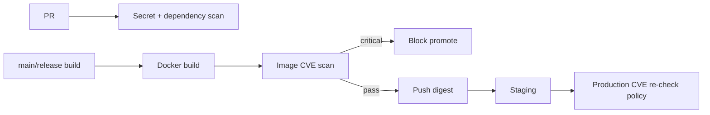

---

## 11. Docker Build

### 11.1 Role

Docker is the **standard packaging unit** for `Agriculture.Api` (ADR-020; DEPLOYMENT §3). Git release management treats the image build as the bridge from commit SHA to immutable digest.

### 11.2 Build Triggers

| Trigger | Action |
|---|---|
| PR changing API/build context | Build (and preferably scan) without pushing Production tags |
| Merge to `develop` | Build + push `sha-<gitsha>` and optional `develop` pointer |
| Merge to `release/*` or tag on `main` | Build + push immutable tags + digest |
| Hotfix merge to `main` | Same as release |

### 11.3 Dockerfile Normative Constraints (Reminder)

From DEPLOYMENT §3.2 — release management enforces via review:

1. One primary application image for HTTP + Hangfire Server (initially in-process) + SignalR.
2. Multi-stage build; SDK not in final image.
3. No secrets in layers.
4. `/health/live` and `/health/ready` present.
5. Kestrel internal port per DEPLOYMENT (TLS at NGINX).

Illustrative CI sketch (architecture only):

```yaml
# Illustrative — not executable source of truth
jobs:
  docker:
    needs: [unit, architecture, smoke]
    steps:
      - run: docker build -f build/docker/Dockerfile.api -t agriculture-api:${GIT_SHA} .
      - run: trivy image --exit-code 1 --severity CRITICAL agriculture-api:${GIT_SHA}
      - run: docker push ghcr.io/org/agriculture-api:${GIT_SHA}
```

### 11.4 Frontend Artifacts

React static assets are built in CI and published as versioned artifacts or layered into the proxy/object-storage deploy path (DEPLOYMENT §11.6). They **MUST** carry the same SemVer (or a documented mapping) as the API release when shipped together.

### 11.5 Build Provenance

CI **SHOULD** attach provenance metadata: git commit, workflow run URL, SBOM hash. Production approval records **MUST** link the workflow run that produced the digest.

---

## 12. Image Registry

### 12.1 Registry Selection

Use a **private** registry (GHCR, Azure ACR, Harbor) per DEPLOYMENT §10.1. Production hosts pull only from approved registries. Images are part of the DR inventory (PHYSICAL §18.2).

### 12.2 Tagging Scheme (Normative)

| Tag | Meaning | Mutable? |
|---|---|---|
| `sha-<gitsha>` | Exact build | No |
| `sha256` digest | Canonical deploy reference | No |
| SemVer `1.4.2` / image tag matching release | Release version | No once published |
| `develop` | Floating latest develop build | Yes (pointer) |
| `staging` | Floating pointer to current Staging digest | Yes (pointer only) |
| `prod` / `production` | Floating pointer to current Production digest | Yes (pointer only); **deploy still uses digest** |

**Normative Production deploy reference:** `image@sha256:…` or immutable SemVer tag verified to equal that digest (DEPLOYMENT §10.2).

### 12.3 Relationship to Git Tags

| Git tag | Image tags expected |
|---|---|
| `v1.4.2` | `1.4.2`, `sha-<commit>`, digest recorded in release notes |
| Hotfix `v1.4.3` | `1.4.3`, new digest |

**MUST NOT** retag an existing SemVer to a different digest after publication. Mistakes require a new patch version.

### 12.4 Retention

Retain images for the rollback window: minimum last **N** Production releases (N ≥ 5 recommended) plus digests needed for RTO drills. Do not garbage-collect digests still referenced by Production or hot rollback tags (DEPLOYMENT §10.3).

### 12.5 Signing

Image signing (cosign/Notary) is recommended Stage 3 hardening; plan with supply-chain policy (DEPLOYMENT §10.4). When enabled, Production pull **MUST** verify signatures.

### 12.6 Registry Access Control

| Role | Pull | Push |
|---|---|---|
| CI identity (OIDC preferred) | Yes | Yes (non-prod + release tags per workflow) |
| Staging hosts | Yes | No |
| Production hosts | Yes (prod-approved repos only) | No |
| Engineers | Yes (non-prod) | No direct; via CI |

---

## 13. Release Flow

### 13.1 End-to-End Release Train

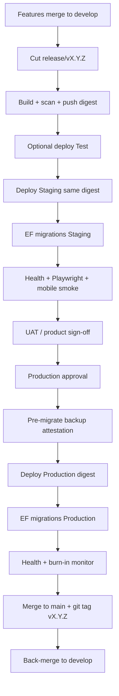

**Note on ordering:** Some teams tag on `main` immediately before Production deploy; others deploy from release branch commit then fast-forward `main`. Both are acceptable **if and only if** the tagged commit SHA equals the digest’s source commit and audit records link them. AMS **SHOULD** prefer: finalize release branch → merge to `main` → tag → Production promote of the digest built from that SHA—unless emergency hotfix requires Production-first with immediate tag.

### 13.2 Binding to DEPLOYMENT Pipeline Stages

ADR-020 clarifications and DEPLOYMENT §11.2 map as follows:

1. Restore + build  
2. Unit tests  
3. Architecture fitness tests  
4. Integration tests  
5. Container build + vulnerability scan  
6. Publish artifact with git SHA / SemVer  
7. Deploy Staging + migrations  
8. Smoke  
9. Production deploy with change ticket + backup attestation  

### 13.3 Release Types (Aligned to DEPLOYMENT §13.2)

| Type | Git path | Pipeline |
|---|---|---|
| Standard | `develop` → `release/vX.Y.Z` → `main` + tag | Full Staging promotion |
| Hotfix | `main` → `hotfix/vX.Y.Z` → `main` + tag | Expedited approval; still digest-based |
| Emergency | Hotfix path + break-glass | Post-hoc Board review mandatory |
| Data fix | Rarely a version bump; audited script/Hangfire under change ticket | DBA + Module Owner; may still tag if app code ships |

### 13.4 Calendar Awareness

Planting week and frost emergencies are change-risk peaks (DEPLOYMENT §13.1). Architecture Board + municipal ops **MAY** declare **release freezes** on `release/*` creation and Production promotion while still allowing hotfixes. Feature merges to `develop` **MAY** continue during freeze unless Board extends freeze to `develop`.

### 13.5 Zero-Downtime Ambition vs Municipal Reality

Expand-contract migrations and blue-green/rolling enable near-zero downtime for API-only changes. Breaking schema or single-server SQL restart may require a maintenance window (DEPLOYMENT §12.3). Release flow **MUST** communicate windows via municipal channels; correctness of workflow sequencing outranks vanity of zero-second cutover.

### 13.6 Release Candidate Immutability

Once a digest is declared the Staging release candidate, **MUST NOT** rebuild from dirty trees for Production. Fixes require a new commit on the release branch and a **new digest**, then Staging re-validation appropriate to the risk (full smoke for functional fixes; abbreviated only for docs-only mistakes with Release Manager justification).

---

## 14. Versioning

### 14.1 Dual Identity Model

AMS uses **two complementary identities**:

1. **Semantic Version** (`MAJOR.MINOR.PATCH`) — for operators, release notes, municipal change tickets, mobile compatibility matrices.  
2. **Content digest** (`sha256:…`) — for deploy, rollback, and verification.

**Reasoning (DEPLOYMENT §13.1):** Humans discuss “1.4.2”; machines pull digests. Confusing them causes “we deployed 1.4.2” debates when two builds claimed the same label.

### 14.2 Version Sources of Truth

| Artifact | Version carrier |
|---|---|
| Git | Annotated tag `vMAJOR.MINOR.PATCH` |
| API image | Matching `MAJOR.MINOR.PATCH` tag + digest |
| React assets | Matching release version in artifact metadata |
| React Native | Store version codes coordinated; API compatibility N/N-1 |
| Migrations | EF migration ids; release notes list applied set |

### 14.3 Pre-release Labels

`v1.5.0-rc.1` **MAY** tag Staging-only candidates. Production **MUST** use final `vMAJOR.MINOR.PATCH` without rc/beta. Floating `latest` **MUST NOT** be used for Production deploys.

### 14.4 Monolith Versioning Scope

Because ADR-001 ships one API host, **modules do not publish independent SemVer** for Production. Module owners still own changelog sections inside the monolith release notes. Future extraction (Stage 4) may introduce service versions only after a superseding ADR.

---

## 15. Semantic Versioning

### 15.1 SemVer Rules for AMS

Given a version `MAJOR.MINOR.PATCH`:

| Bump | When | Examples |
|---|---|---|
| **MAJOR** | Breaking API contract for external clients; incompatible mobile force-upgrade; breaking integration event without dual-publish window | `/api/v2` introduction that retires v1 without overlap; auth scheme break |
| **MINOR** | Backward-compatible functionality; expand-phase migrations; new permissions (additive) | New task query; new optional field |
| **PATCH** | Backward-compatible bug fixes; security patches; hotfix | Null-ref fix; CVE dependency bump |

### 15.2 Tag Naming

- Git tags **MUST** be `vMAJOR.MINOR.PATCH` (leading `v`).
- Example: `v1.4.2`.
- Annotated tags **MUST** be used for releases (message includes summary + digest).
- Lightweight tags **MUST NOT** be used for Production releases.

### 15.3 Compatibility Windows

Mobile clients may lag store review. API **MUST** maintain backward-compatible contracts for supported mobile **N and N-1** (DEPLOYMENT §13.3; API_CONTRACT). Breaking changes require Board approval, versioned routes or negotiated windows, and force-update coordination.

Integration events use `{PastTense}V{n}` naming (handbook); bumping event versions is a **MINOR** if dual-published, **MAJOR** if consumers break without window.

### 15.4 Choosing the Bump — Decision Tree

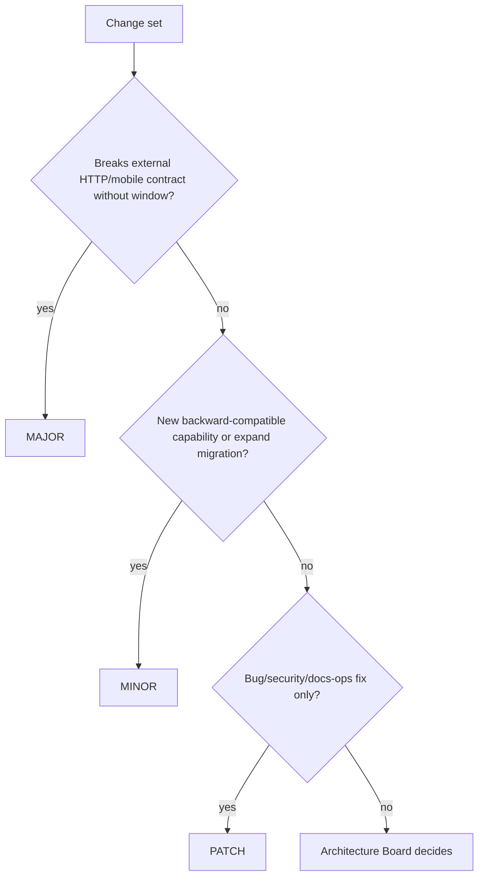

### 15.5 Hotfix Versioning

Hotfixes from `v1.4.2` Production become `v1.4.3` (patch). If a hotfix itself needs an emergency follow-up, continue patch increments. Do not skip to MINOR for a Production-only fix line unless the fix intentionally ships new features (discouraged on hotfix branches).

---

## 16. Release Notes

### 16.1 Audiences

Release notes **MUST** serve three audiences in one artifact (sections clearly separated):

1. **Municipal operators / product** — user-visible behavior, maintenance windows, mobile update guidance.  
2. **Engineers / Module Owners** — module-level changes, Contracts, permissions.  
3. **DevOps / DBA** — digests, migration lists, expand-contract phase, Hangfire job changes, rollback class.

### 16.2 Required Sections

1. Version (`vX.Y.Z`) and date  
2. Git tag and commit SHA  
3. API image digest  
4. SPA asset version  
5. Mobile compatibility (supported N / N-1)  
6. Summary (3–10 bullets)  
7. Breaking changes (or explicit “None”)  
8. Migrations (module schema + migration ids + expand/contract phase)  
9. Security fixes  
10. Known issues  
11. Rollback guidance class (§21)  
12. Approver names / change ticket ids  

### 16.3 Generation

Notes **SHOULD** be drafted on the `release/*` branch and finalized at tag time. Automation **MAY** draft from PR titles; humans **MUST** verify migration and security sections.

### 16.4 Language

English for engineering notes; municipal operator summaries **MAY** be duplicated in the municipality’s official language in a separate bulletin—but the GitHub Release body remains English for engineering audit consistency unless Board mandates bilingual engineering notes.

---

## 17. Environment Promotion

### 17.1 Environment Catalog (DEPLOYMENT §8.1)

| Environment | Purpose | Data | Promotion |
|---|---|---|---|
| **Development** | Engineer feedback | Synthetic | Continuous from feature work / develop |
| **Testing** | CI ephemeral / integration | Ephemeral | Automated |
| **Staging** | UAT / release candidate | Anonymized subset | Same image digest as candidate |
| **Production** | Live municipality | Real PII/evidence | Promote digest after gates |

Namespaces/projects: `agriculture-dev`, `agriculture-test`, `agriculture-staging`, `agriculture-prod` (DEPLOYMENT §4.4; PHYSICAL §5.3).

### 17.2 Promotion Model — Immutable Digests

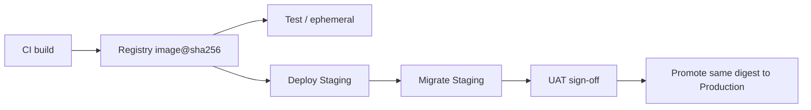

**MUST NOT** rebuild for Production (DEPLOYMENT §8.2). Configuration differs by environment; bits do not.

### 17.3 Configuration Differences (Reminder)

`ASPNETCORE_ENVIRONMENT`, SQL, JWT keys, CORS, FCM, MinIO credentials differ per environment (DEPLOYMENT §8.3). Distinct JWT `iss`/`aud` prevent token reuse across slots (SECURITY).

### 17.4 Promotion Gates Summary

| From → To | Gate |
|---|---|
| Commit → registry digest | CI build + tests + scan |
| Digest → Staging | Deploy workflow; migrator job; health |
| Staging → Production | Staging smoke + UAT + security CVE policy + backup attestation + human approval (§24) |

### 17.5 Data Isolation

No Production data in Dev/Test. Staging anonymized for KVKK alignment. Distinct MinIO credentials/buckets per environment (DEPLOYMENT §8.4).

---

## 18. Deployment

### 18.1 Definition

Deployment is the controlled activation of a **known digest** in an environment, including migration apply (when required), proxy cutover, health verification, and observability confirmation (DEPLOYMENT §12).

### 18.2 Stage 1 Single-Server Procedure (Normative Sequence)

1. CI produces `agriculture-api@sha256:…` and React assets.  
2. Staging pulls digest; migrator applies EF migrations in DATABASE_DESIGN order; smoke.  
3. Production approval recorded.  
4. Declare maintenance window if migration non-online.  
5. Take SQL backup (+ MinIO snapshot if object layout couples).  
6. Deploy digest (recreate or blue-green-lite).  
7. Apply Production migrations with migrator identity.  
8. Verify `/health/ready`; synthetic HTTPS check.  
9. Burn-in monitor 60–120 minutes (DEPLOYMENT §12.2).  

### 18.3 Blue-Green (Stage 2+ Preferred)

Follow DEPLOYMENT §14:

- Shared SQL/MinIO; expand-contract-safe schema only.  
- Deploy green → ready → switch NGINX upstream.  
- SignalR clients reconnect (acceptable).  
- Hangfire: single active color during cutover to avoid double-processing.  
- On smoke fail, switch back to blue.

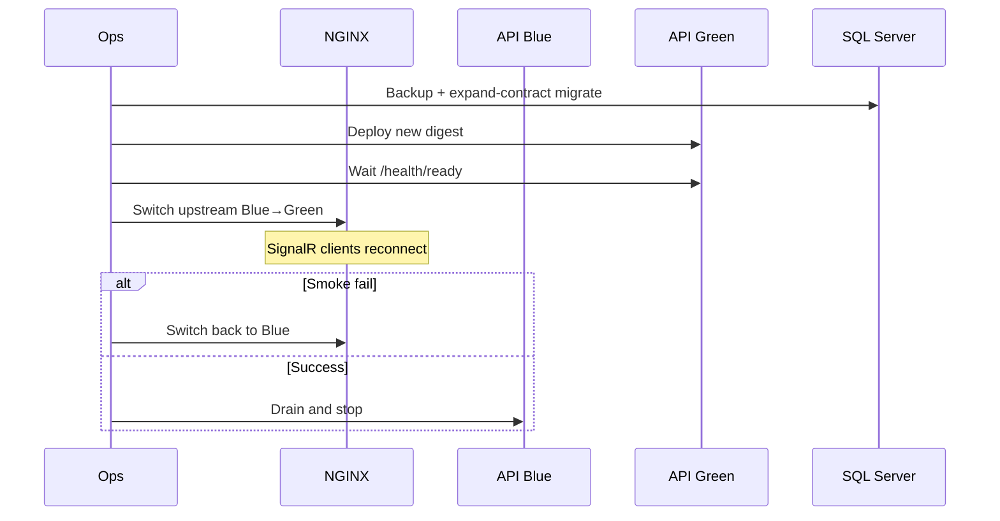

### 18.4 Rolling Update (Kubernetes / Multi-Replica)

Prerequisites identical to horizontal scale gates (DEPLOYMENT §15.2; PHYSICAL §16.2): sticky sessions **or** Redis SignalR backplane; Hangfire multi-server validated; shared Data Protection keys; readiness probes.

During mixed versions, **both** must accept the same schema (expand complete; contract later).

Stage 1 single-server **typically uses recreate or blue-green-lite**, not rolling (DEPLOYMENT §15.5).

### 18.5 Health-Gated Cutover

| Endpoint | Use in deploy |
|---|---|
| `/health/live` | Liveness; restart loops |
| `/health/ready` | Traffic admission (NGINX/K8s) |
| Detail `/health` | Operators only |

Never gate readiness on Seq or FCM by default (DEPLOYMENT §17; ADR-020 clarifications).

### 18.6 GitHub Environments

Use GitHub Environments `staging` and `production` with required reviewers for `production`. Deployment history **MUST** remain enabled for audit.

### 18.7 Illustrative Production Workflow Sketch

```yaml
# Illustrative — not executable source of truth
on:
  workflow_dispatch:
    inputs:
      digest:
        required: true
jobs:
  produce:
    environment: production
    steps:
      - name: Verify digest scanned
      - name: Backup attestation check
      - name: Deploy digest
      - name: Run migrator job
      - name: Verify ready
```

---

## 19. Hotfix Path

### 19.1 When to Hotfix

Use hotfix when Production has a **defect or security issue** that cannot wait for the next standard train, especially during agricultural calendar peaks.

### 19.2 Hotfix Procedure

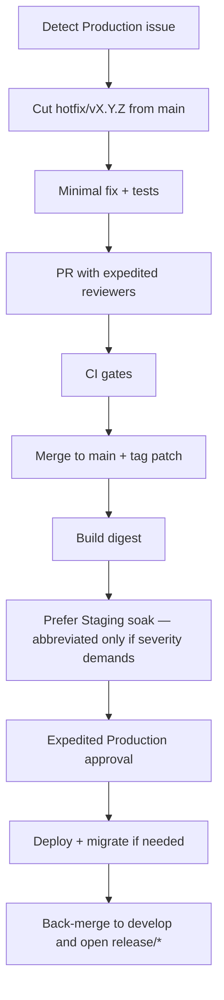

### 19.3 Hotfix Rules

1. **Minimal diff** — no feature hitchhiking.  
2. Still **digest-based**; still no Production secrets in git.  
3. Migrations on hotfix **MUST** be expand-safe or accompanied by explicit rollback/restore plan.  
4. Back-merge **MUST** occur the same day to prevent reintroduction.  
5. Emergency break-glass **MUST** receive post-hoc Board review (DEPLOYMENT Emergency type).  

### 19.4 Hotfix vs Forward Fix

If the defect is already fixed on `develop` but not released, Release Managers **MAY** cherry-pick onto hotfix or accelerate a patch release from a release branch—whichever yields the smaller validated diff.

---

## 20. Database Migration

### 20.1 Authority

DATABASE_DESIGN prevails for schema ownership, expand-contract, and history table placement. DEPLOYMENT §16 prevails for apply procedure and migrator identity. This section binds migrations to **Git release gates**.

### 20.2 Migration Gate in Release Flow

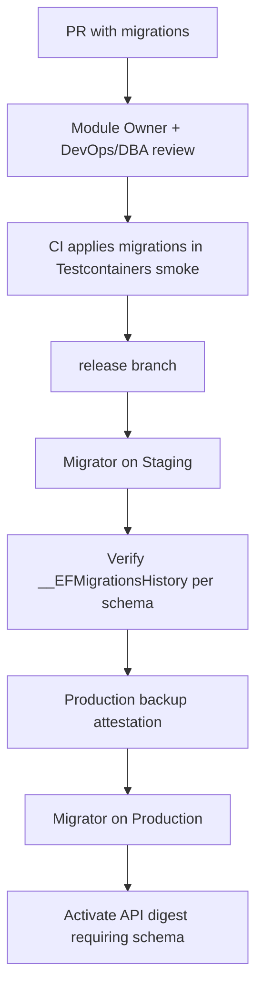

### 20.3 Expand-Contract (Normative)

| Phase | Action | Deployability |
|---|---|---|
| Expand | Additive columns/tables/indexes; dual-write if needed | Old and new API can run |
| Migrate data | Backfill jobs (Hangfire) | Online preferred |
| Contract | Remove obsolete columns after bake time | Only after all nodes on new code |

**MUST NOT** combine expand and destructive contract on hot tables (`Tasks`, `OutboxMessages`, `Harvests`, etc.) in the same release (DATABASE_DESIGN §3.5; handbook §17.5).

### 20.4 Apply Order (Operational Convenience)

Identity → registries (Producers, Lands, Seasons, …) → production engine (Workflows, Tasks, Inspections) → Harvest/Delivery → Support/Notifications/Communication → Reporting/Admin → Hangfire install anytime after DB exists (DEPLOYMENT §16.2). No cross-schema FKs; order is for seeds/smoke, not referential necessity.

### 20.5 Production Migration Procedure (Binding)

1. Backup SQL (full or verified recent full + logs).  
2. Announce window if required.  
3. Run migrator identity; record migration set.  
4. Verify `__EFMigrationsHistory` per module schema.  
5. Deploy/activate API digest that requires the new schema.  
6. Smoke business paths.  
7. On failure: stop deploy; follow rollback §21—do not invent schema fixes in Production without review.  

### 20.6 Migrator vs Runtime Identities

| Identity | Rights |
|---|---|
| Migrator | DDL on module schemas |
| `agric_app` | DML on business + hangfire; **no DDL** in Production |

### 20.7 Forbidden Practices

- Auto-migrate on every Production pod start with multiple replicas.  
- Manual hot-edit of Production schema without migration history.  
- Cross-module FKs.  
- Using Hangfire tables as business outbox.  
- Committing migrations that were produced against the wrong schema history table.  

### 20.8 PR Requirements for Migration Changes

PR body **MUST** state: schemas touched, expand vs contract, backward compatibility with current Production digest, Hangfire backfill job ids if any, and anticipated rollback class.

---

## 21. Rollback

### 21.1 Principles (DEPLOYMENT §19.1)

1. Prefer **application rollback** (redeploy previous digest) when schema is backward compatible.  
2. Prefer **forward fix** when contract phase already dropped columns required by old code.  
3. Prefer **restore** when data corruption or failed migration leaves schema/data unsafe.  
4. Record decision with digest SHAs and migration history snapshots.  

### 21.2 Rollback Classification Flow

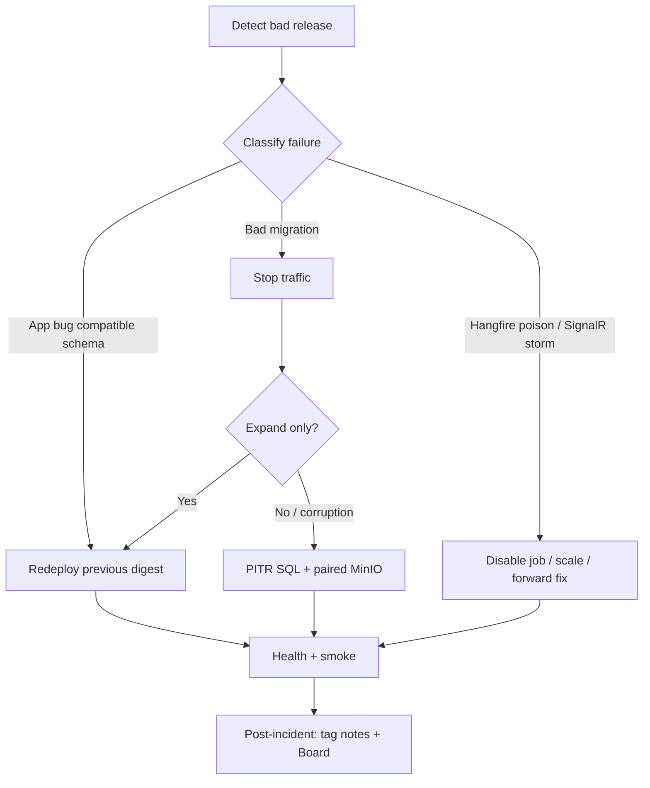

### 21.3 Git Operations During Rollback

- Rollback of **runtime** does **not** rewrite Git history.  
- A forward-fix hotfix **MAY** follow immediately.  
- **MUST NOT** delete Production tags; if a release is revoked, publish a GitHub Release note marking it superseded and ship `vX.Y.Z+1`.  

### 21.4 Hangfire / SignalR Rollback Notes

- After app rollback, verify failed jobs and retry policy; poison jobs may need manual intervention.  
- SignalR clients reconnect after proxy switch; watch connection error rates.  
- Do not run two colors of Hangfire workers with incompatible job serializers.  

### 21.5 Rollback Decision Timebox

During Production burn-in (60–120 minutes), Release Manager + on-call **SHOULD** decide rollback vs forward-fix using pre-written criteria (error budget, ready flaps, Hangfire failure thresholds from §23). Ambiguity defaults to **rollback** when schema is compatible.

---

## 22. Monitoring

### 22.1 Release-Time Monitoring Contract

Monitoring during and after release is mandatory, not optional “if someone remembers.” DEPLOYMENT §18 and ADR-020 define pillars; this section binds them to release roles.

### 22.2 Pillars

| Pillar | Tooling | Release use |
|---|---|---|
| Logs | Serilog → Seq | New exception shapes, correlation ids |
| Health | `/health*` + synthetic uptime | Cutover gate |
| Jobs | Hangfire dashboard + failure metrics | Post-deploy poison detection |
| Metrics (future) | Prometheus/OTel | Capacity during season |
| Traces (future) | OTel | Latency regressions |

### 22.3 Burn-In Watchlist (Minimum)

For 60–120 minutes after Production cutover:

1. API 5xx rate vs baseline  
2. `/health/ready` flaps  
3. Seq error spikes with new `errorCode`s  
4. Hangfire failed/retry exhausted counts  
5. SignalR reconnect/error rates (if hubs changed)  
6. Migration-related SQL errors  
7. MinIO upload failure rates (if evidence paths changed)  
8. Auth failure spikes (if Identity changed)  

### 22.4 Correlation and PII

Every HTTP request and Hangfire job carries **CorrelationId** (DEPLOYMENT §18.2; handbook). PII redaction mandatory. When Seq is down, API stays ready—do not page solely on Seq outage unless logging pipeline SLA says otherwise.

### 22.5 Ownership

| Concern | Owner during release |
|---|---|
| Seq dashboards | DevOps + Host Owner |
| Hangfire | Host Owner + Module Owners for job commands |
| Proxy/TLS | DevOps |
| SQL basic health | DBA / DevOps |
| Season-peak board | DevOps + Architecture Board |

---

## 23. Alerting

### 23.1 Alert Guidance (DEPLOYMENT §18.3)

| Signal | Warning | Critical |
|---|---|---|
| API 5xx rate | >2%/5 min | >5%/5 min |
| Ready failing | 1 min | 3 min |
| SQL CPU | >80% 10 min | >95% 10 min |
| MinIO disk | 70% | 85% |
| Hangfire failures | >10/15 min | >50/15 min |
| FCM failure ratio | >10% | >30% |
| Backup job failure | any miss | sustained miss — **pageable** |
| TLS cert expiry | 30/14/7 days | Expired — pageable |

### 23.2 Release-Specific Alert Policy

1. During burn-in, critical alerts for 5xx and ready **MUST** page the on-call Release contact.  
2. New alert rules shipped in a release **MUST** be documented in release notes.  
3. Alert noise that causes ignore behavior is a defect; tune thresholds quarterly and before season peaks.  

### 23.3 Escalation

| Severity | Response |
|---|---|
| Warning | Ack within 30 minutes during burn-in; next business day otherwise |
| Critical | Ack within 5–15 minutes; rollback decision framework engages |
| Backup miss | Pageable; Production promote blocked until backup posture restored |

### 23.4 Certificate and Synthetic Monitors

After deploy, synthetic monitor validates public HTTPS (DEPLOYMENT §7.2). Cert expiry alerts at 30/14/7 days are standing controls independent of release trains.

---

## 24. Production Approval Authority

### 24.1 Who Can Approve Production Deploy

Production deploy to `agriculture-prod` **MUST** be approved by **two** of the following roles, with at least one from column A:

| Column A (mandatory one) | Column B |
|---|---|
| Release Manager | Host Owner |
| Architecture Board delegate | Municipal IT Change Approver |
| | DevOps lead |

Security-sensitive releases (Identity, permissions, TLS, secret rotation) **MUST** additionally include a **Security reviewer** sign-off (can count as Column B).

### 24.2 What Approvers Attest

Approvers attest that:

1. Staging digest equals Production candidate digest.  
2. Staging smoke/UAT evidence is attached.  
3. Backup attestation exists (or explicit window risk acceptance for non-data releases—rare).  
4. Migration expand-contract phase is understood.  
5. Rollback class is pre-declared.  
6. Calendar freeze status was checked.  

### 24.3 Emergency Approval

For Emergency releases, a single **Release Manager or on-call Host Owner** **MAY** approve under break-glass, with mandatory second signature within **24 hours** and Board review within **5 business days**.

### 24.4 Who Cannot Sole-Approve

Feature authors **MUST NOT** sole-approve their own Production release. Contractors without municipal change authority **MUST NOT** be the only Column A approver.

---

## 25. Alignment with Handbook Definition of Done

### 25.1 Feature DoD Remains Authoritative for Merge

ENGINEERING_HANDBOOK §4 Definition of Done governs whether a **feature PR** may merge. Release management **does not** invent a weaker DoD for “just land it for the train.”

### 25.2 Release DoD (Additional)

A release candidate is done only when:

| # | Criterion |
|---|---|
| 1 | All merged features for the train meet handbook DoD or are flag-guarded off |
| 2 | CI gates green on the release commit |
| 3 | Image scanned; critical CVEs addressed |
| 4 | Staging deployed with **same digest**; migrations applied; history verified |
| 5 | Staging smoke (Playwright + mobile as applicable) green |
| 6 | Release notes complete (§16) |
| 7 | Production approvers identified; backup plan ready |
| 8 | Rollback class documented |
| 9 | Hangfire/SignalR release constraints reviewed if touched (§26) |
| 10 | Mobile N/N-1 compatibility stated |
| 11 | Tag `vMAJOR.MINOR.PATCH` prepared/applied per §15 |
| 12 | `docs/README.md` and normative docs updated for train-scope doc changes |

### 25.3 Mapping Handbook Commit/PR Standards to Release

| Handbook rule | Release implication |
|---|---|
| Imperative commit subjects | Cherry-picks and release fixes remain auditable |
| PR risk section | Feeds release notes + approval attestation |
| Architecture.Tests never skipped | Release Manager cannot waive |
| Docs in same PR | Prevents release notes claiming undocumented API |
| No E2E on Production | Staging evidence only |

---

## 26. Hangfire and SignalR Release Constraints

### 26.1 Hangfire

1. Jobs run as **system principal**, never the last interactive user (handbook; SECURITY; API_CONTRACT).  
2. During blue-green overlap, **only one active Hangfire server set** processes jobs unless multi-server procedures are validated (DEPLOYMENT §14.3).  
3. Releases that change job serialization or arguments **MUST** be backward compatible across the rollback window or disable the job until cutover completes.  
4. Dashboard remains VPN/bastion constrained; releases must not open it publicly.  
5. Post-deploy: watch failed jobs and exhausted retries (alert table §23).  

### 26.2 SignalR

1. Proxy cutover drops WebSockets; clients reconnect—acceptable with backoff (DEPLOYMENT §14.3).  
2. Rolling/multi-instance requires sticky sessions or Redis backplane (ADR-008/015; PHYSICAL).  
3. Hub contract changes follow API_CONTRACT versioning discipline; breaking hub events need compatibility windows.  
4. AuthZ on group join remains server-side; releases that weaken join checks fail security review.  

### 26.3 Combined Diagram — Cutover Care

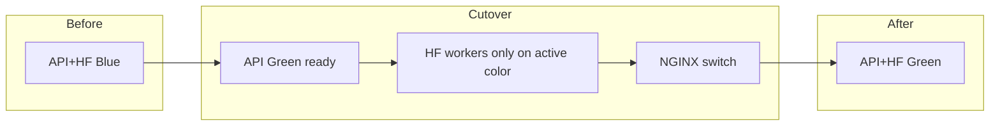

---

## 27. Mobile and SPA Release Coordination

### 27.1 SPA

SPA assets promote with the API train unless Board authorizes decoupled static releases. Environment-specific API base URLs are inject-at-deploy config (DEPLOYMENT §8.5). Cache-busting **MUST** ensure officers do not run stale bundles against new APIs during forced refreshes after cutover.

### 27.2 Mobile

React Native follows store pipelines (DEPLOYMENT §11.6). API compatibility tested against Staging. Force-update when auth contracts break. Release notes **MUST** state whether a store release is required or API remains N/N-1 compatible.

### 27.3 Coordination Rule

If API MINOR adds optional fields, mobile **MAY** lag. If API MAJOR breaks, mobile force-update **MUST** be scheduled before Production API cutover or dual-stack routes maintained.

---

## 28. Repository Layout and Workflow Ownership

### 28.1 Paths (SOLUTION_ARCHITECTURE / DEPLOYMENT)

| Path | Owner | Release relevance |
|---|---|---|
| `.github/workflows/ci.yml` | DevOps + Test Architecture Owner | PR/main gates |
| `.github/workflows/release.yml` | DevOps | Tag, push image, publish notes |
| `.github/workflows/deploy-staging.yml` | DevOps | Staging promote |
| `.github/workflows/deploy-production.yml` | DevOps + approvers | Production promote |
| `build/docker/` | Host Owner + DevOps | Image definition |
| `deployment/compose/` | DevOps | Stage 0–2 runtime |
| `deployment/k8s/` | DevOps | Stage 3 |

### 28.2 Workflow Change Control

Changes to required checks or Production environment protection **MUST** be reviewed by DevOps + Host Owner and **SHOULD** update this document and TESTING/DEPLOYMENT if gate semantics change.

---

## 29. Audit, Compliance, and Municipal Change Control

### 29.1 Audit Trail Minimum

For each Production release, retain:

1. PR links merged into the train  
2. CI workflow run URLs  
3. Image digest and scan report  
4. Staging evidence  
5. Backup attestation  
6. Approver identities and timestamps  
7. Git tag and release notes  
8. Migration history snapshot  

### 29.2 KVKK / Privacy

Staging data anonymization and secret hygiene are SECURITY-owned. Release processes **MUST NOT** copy Production dumps into Dev without anonymization runbooks.

### 29.3 Change Tickets

Where municipal IT requires change tickets, the GitHub Release and Environment deployment **MUST** reference the ticket id. Git remains the engineering system of record; tickets remain the municipal process record.

---

## 30. Anti-Patterns and Forbidden Practices

1. Force-push to `main` / `develop` / open `release/*` / `hotfix/*`.  
2. Deploying a digest that was not the Staging candidate.  
3. Rebuilding “the same version” with different bits.  
4. Retagging published SemVer to a new digest.  
5. Skipping Architecture.Tests or secret scan.  
6. Auto-migrate races on scaled Production.  
7. Expand+contract destructive hot-path in one release.  
8. Sole self-approval of Production.  
9. E2E against Production.  
10. Long-lived feature branches without Module Owner justification.  
11. Hitchhiking features on hotfix branches.  
12. Leaving hotfix unmerged to `develop`.  
13. Public Hangfire/Seq as part of “easier ops.”  
14. Rolling multi-instance without SignalR sticky/backplane readiness.  
15. Committing secrets or disabling secret scan “temporarily.”  

---

## 31. Change Control for This Specification

### 31.1 Amendments

Additive clarifications: PR to `docs/GIT_RELEASE_STRATEGY.md` with DevOps + Architecture Board delegate review.  
Structural changes to primary branching model, Production approval matrix, or SemVer tag policy: Architecture Board decision; update DEPLOYMENT/TESTING cross-links if gate semantics change; consider ADR if technology choice shifts (e.g., mandatory GitOps).

### 31.2 Precedence Reminder

Accepted ADRs > PHYSICAL (topology) / SECURITY (controls) / DATABASE_DESIGN (schema) > DEPLOYMENT (runtime DevOps) / TESTING (gates) / this document (Git/release orchestration) > ENGINEERING_HANDBOOK (daily habits), with the handbook winning on commit/PR authoring style conflicts as stated in Document Purpose.

### 31.3 Index Requirement

`docs/README.md` **MUST** link this document. Removing the link without Board approval is incomplete delivery (handbook §3.3).

---

## 32. Appendices

### Appendix A — Quick Reference: Branch → Environment

| Branch / tag | Typical deploy target |
|---|---|
| `feature/*` | Local / ephemeral preview (optional) |
| `develop` | Development / Testing |
| `release/vX.Y.Z` | Staging (candidate) |
| `vX.Y.Z` on `main` | Production (after approval) |
| `hotfix/vX.Y.Z` | Staging abbreviated → Production |

### Appendix B — Quick Reference: Required Mermaid Flows

This specification’s normative diagrams cover: branching (§4), PR validation (§7), security scan (§10), release flow (§13), SemVer decision (§15), environment promotion (§17), blue-green (§18), hotfix (§19), migration gate (§20), rollback (§21), Hangfire cutover (§26).

### Appendix C — Glossary

| Term | Definition |
|---|---|
| Digest | Immutable content-addressed image id `sha256:…` |
| Release train | Time-boxed set of features stabilized on `release/*` |
| Expand-contract | Safe migration pattern enabling blue/green coexistence |
| Burn-in | Post-Production observation window before declaring success |
| Break-glass | Emergency bypass with mandatory post-hoc review |
| N / N-1 | Current and previous mobile store releases supported by API |

### Appendix D — Role Cheat Sheet

| Role | Git/Release duty |
|---|---|
| Feature author | Feature branches, DoD, PR quality |
| Module Owner | Review module/migration PRs |
| Host Owner | API image, Hangfire/SignalR host concerns, Production co-approval |
| DevOps / Release Manager | Pipelines, registry, promotion, burn-in, rollback leadership |
| Test Architecture Owner | Which CI gates are required |
| Security reviewer | Scan waivers, authN/Z release sign-off |
| DBA | Backup attestation, migration apply support |
| Architecture Board | Freezes, MAJOR bumps, model changes, break-glass review |
| Municipal IT Change Approver | Production change authority where mandated |

### Appendix E — Alignment Checklist for Implementers

When implementing `.github/workflows` and branch protection, verify:

- [ ] `main` and `develop` protected; force-push disabled  
- [ ] Required checks match TESTING §18  
- [ ] CODEOWNERS covers modules, deploy, workflows  
- [ ] Environments `staging` / `production` with reviewers  
- [ ] Image tags include `sha-` and SemVer; Production uses digest  
- [ ] Migrator job separate from API replica start in Production  
- [ ] Release notes template includes digest + migrations + rollback class  
- [ ] Hotfix back-merge checklist exists  
- [ ] Alert routes defined before go-live (ADR-020)  
- [ ] This document linked from `docs/README.md`  

### Appendix F — Worked Scenario Narratives (Normative Expectations)

#### F.1 Standard Minor Release

Officers need a new optional filter on the task dashboard. Module Owner ships feature branch → PR to `develop` with Vitest + Architecture.Tests green → Release Manager cuts `release/v1.5.0` → CI builds digest `sha256:abc…` → Staging migrate (expand-only index) → Playwright smoke → UAT sign-off → dual approval → Production backup → blue-green-lite deploy → burn-in clean → tag `v1.5.0` → back-merge. Release notes list digest, “None” breaking changes, rollback class = app-digest.

#### F.2 Hotfix During Planting Week

Production null-ref blocks task complete. Cut `hotfix/v1.4.3` from `main` → minimal fix + domain test → expedited reviewers → digest → abbreviated Staging → emergency approval → deploy → verify Hangfire reminders still draining → tag `v1.4.3` → back-merge to `develop` same day. No feature flags hitchhiked.

#### F.3 Expand then Contract Across Two Releases

`v1.6.0` expands nullable column + dual-write Hangfire backfill. `v1.7.0` switches readers. `v1.8.0` contracts old column after bake time. Attempting contract in `v1.6.0` fails review against DATABASE_DESIGN §3.5.

#### F.4 Failed Migration

Staging migrate fails history verification. Release stops; Production untouched. Fix on release branch; new digest; Staging re-run. Never “fix forward” on Production schema by hand.

#### F.5 Rolling Prematurely

Team proposes Kubernetes rolling with two API pods without Redis backplane. Rejected: PHYSICAL §16.2 / DEPLOYMENT §15 prerequisites unmet. Stay on recreate/blue-green-lite until Board approves Stage 2 controls.

### Appendix G — Relationship Statement for Auditors

AMS Git & Release Management is designed so that a municipal auditor can select any Production incident timestamp, retrieve the GitHub Environment deployment, read the digest, map it to git tag `vMAJOR.MINOR.PATCH`, open the release notes, list migrations applied, and identify human approvers—without relying on tribal knowledge. That property is intentional and normative.

### Appendix H — Non-Goals Recap

This document does not: teach Git basics; replace DEPLOYMENT runbooks; embed executable Dockerfiles as source of truth; authorize microservices versioning; weaken handbook DoD; or permit Production as a test environment.

---

## Document History

| Version | Date | Author Role | Notes |
|---|---|---|---|
| 1.0 | 2026-07-18 | Principal Release / DevOps Engineer | Initial official Git & Release Management Specification; AMS GitFlow-inspired primary model; aligned to ADR-020, DEPLOYMENT, TESTING, handbook, DATABASE_DESIGN, SECURITY, PHYSICAL |

---

**Maintenance note:** When PHYSICAL Stage changes (e.g., Redis backplane Accepted), update §18 cutover defaults and Appendix E. When TESTING changes required PR checks, update §7 and §8 in the same documentation PR. Next ADR after ADR-020 is **ADR-021** if a future decision supersedes the GitFlow-inspired primary model (e.g., org-wide trunk-based mandate).

**Acknowledgement of sources:** Normative runtime and gate content is derived from Accepted ADRs and the architecture specifications listed in Document Purpose. This document’s unique contribution is the enforceable Git branching, tagging, approval, and promotion contract that connects those specifications into a municipal release system of record.
