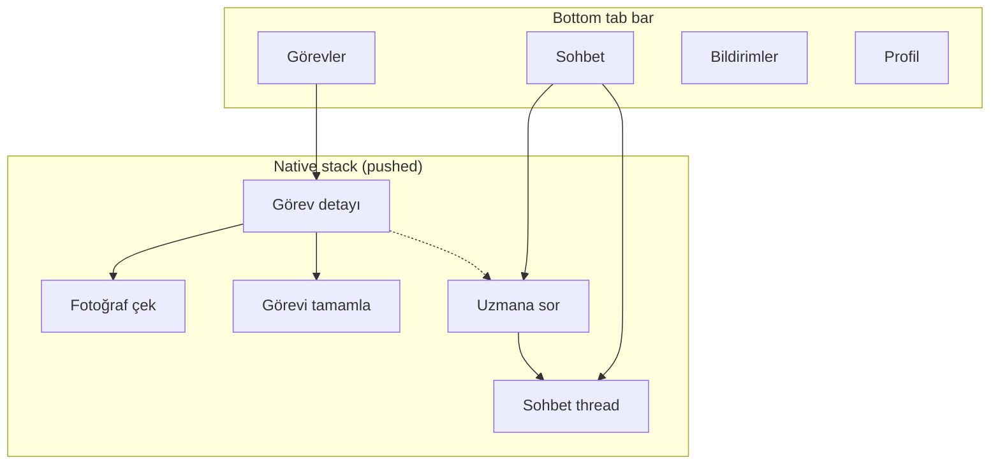
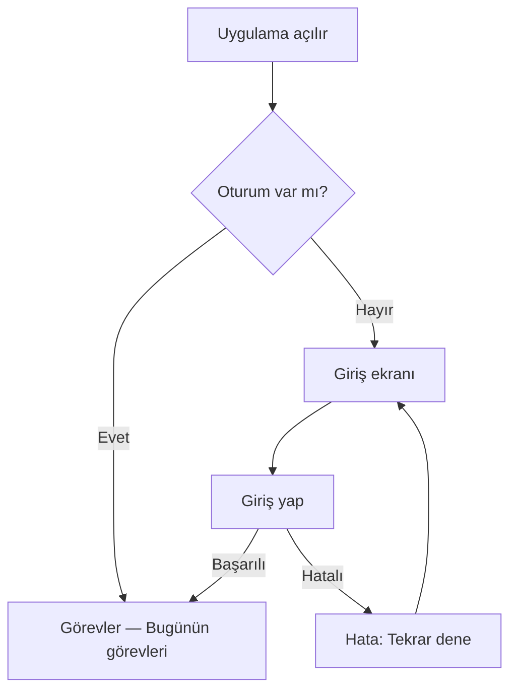
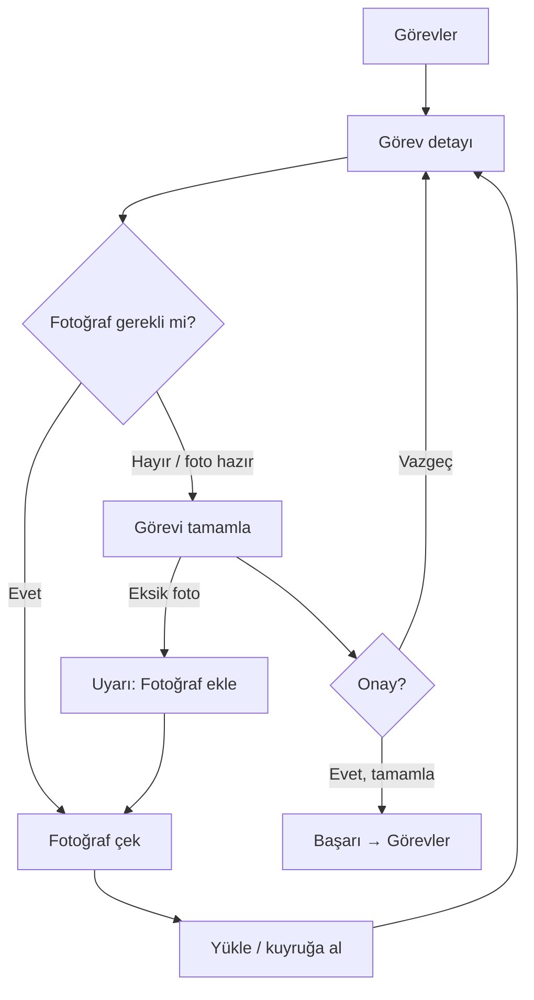
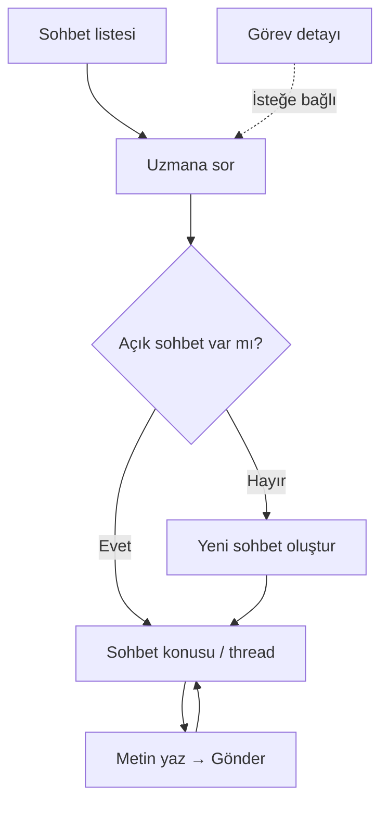

# Producer Mobile UX Design

# Agriculture Management System — Üretici Mobil Uygulama

| Attribute | Value |
|---|---|
| **Document Title** | Producer Mobile UX Design |
| **Version** | 1.1 |
| **Date** | 2026-07-18 |
| **Status** | Implementation-ready UX + Expo producer shell |
| **Locale** | **tr-TR** (Turkish UI from day one — SDS-R09 / SDS-R13) |
| **Audience** | Product, mobile engineers, QA, municipal UX reviewers |
| **Normative parents** | [SOFTWARE_DESIGN_SPECIFICATION.md](./SOFTWARE_DESIGN_SPECIFICATION.md) (SDS-R11/R12/R13), [REACT_NATIVE_ARCHITECTURE.md](./REACT_NATIVE_ARCHITECTURE.md) |
| **Scope** | **Producer** mobile shell only |

---

## 1. Purpose and Principles

This document is the **primary UX source of truth** for the Producer React Native (Expo) app. Architecture/stack details live in `REACT_NATIVE_ARCHITECTURE.md`; screen copy, flows, literacy rules, and visual direction live here.

**Principles (binding):**

| Principle | Norm |
|---|---|
| **Bottom tab bar** | Primary navigation is a **4-tab bottom bar** (not a hamburger menu, not a side drawer) |
| **Premium-minimal** | Calm, refined, spacious; quality from typography, spacing, color, subtle depth — not busy dashboards or gimmicky animation |
| Minimalist | One job per screen; no decorative chrome; no admin grids |
| Low digital literacy | Plain Turkish; short sentences; large primary actions; few options |
| Large tap targets | Primary buttons ≥ 48×48 dp (prefer 56); list rows easy to hit with thumb |
| Mobile-first delivery | Design/build this app **before** Admin / Tarım Uzmanı web (SDS-R13) |
| Chat-like messaging | Conversation list → thread → send text; includes **Uzmana sor** |

**Out of scope for this document (next phase):**

- Administrator web panel
- Tarım Uzmanı (Officer) web panel
- Inspector mobile shell (may reuse patterns later)
- Photo-in-chat, reactions, presence (MAY later)

---

## 2. Navigation Hierarchy (Tabs vs Stack)

### 2.1 Bottom tabs (normative — primary shell)

Exactly **four** destinations. Turkish labels are binding:

| Route key | Tab label | Screen title (in-tab) | Job |
|---|---|---|---|
| `Today` | **Görevler** | Bugünün görevleri | Home — today’s open tasks |
| `Messages` | **Sohbet** | Sohbet | Conversation list + Uzmana sor |
| `Notifications` | **Bildirimler** | Bildirimler | System / reminder inbox |
| `Profile` | **Profil** | Profil | Name, logout, simple help |

Tab bar UX:

- Clean icons + Turkish labels (never icon-only for primary destinations)
- Subtle active state (forest green tint / weight); inactive muted stone
- Respect safe area (home indicator)
- No fifth “more” tab; no nested tab bars

### 2.2 Stack screens (pushed — not tabs)

These **SHALL NOT** appear as tabs. They push over the tab shell from Görevler / Sohbet:

| Route key | Turkish label | Entry |
|---|---|---|
| `Login` | **Giriş** | Unauthenticated (outside tabs) |
| `TaskDetail` | **Görev detayı** | From Görevler list |
| `CapturePhoto` | **Fotoğraf çek** | From görev (required evidence) |
| `UploadPhoto` | **Fotoğraf yükle** | Gallery / retry upload (MAY) |
| `CompleteTask` | **Görevi tamamla** | Confirm completion |
| `ChatThread` | **Sohbet** (thread title = uzman / konu) | From Sohbet list or Uzmana sor |
| `AskExpert` | **Uzmana sor** | Start / open expert conversation |

Optional later (not first UX): geçmiş görevler, destek başvurusu detay, üretim geçmişi.

---

## 3. Premium-Minimal Visual Direction

### 3.1 Intent

Feel **high quality** (calm, refined, spacious) **and** **simple** for low digital literacy. Premium ≠ ornament. Premium = clear hierarchy, generous padding, one primary CTA, restrained color.

Avoid:

- Purple / indigo “AI default” kits
- Terracotta–cream newspaper / broadsheet clichés
- Dense dashboard chrome, stat strips, floating badges on heroes
- Animation overload (prefer subtle press opacity, not bouncing tabs)

### 3.2 Theme tokens (Expo / RN)

Implemented under `mobile/src/theme/`:

| Token group | Direction |
|---|---|
| **Colors** | Deep forest green primary (`#1A4D36`); warm off-white / stone bg (`#F7F6F2`); charcoal text (`#1C2420`); soft sage accents; calm success / warning / overdue |
| **Typography** | Large screen titles (~28); readable body (~17); short Turkish helper lines; bold primary CTAs (~18) |
| **Spacing** | Generous screen padding (~20); roomy list cards; avoid cramped multi-column layouts |
| **Depth** | Hairline borders + very soft shadow on list rows — not multi-layer glow |

### 3.3 Layout norms

- One clear **primary** button per screen (filled, full-width or large bottom bar)
- Secondary actions as outlined / quiet — never compete with primary
- Minimum tap target **48 dp**; prefer **56 dp** for primary CTAs
- Status colors: open (neutral), due soon (amber), overdue (strong), done (success)

---

## 4. Global UX Norms

### 4.1 Language

- All user-visible strings **SHALL** be Turkish (`tr-TR`).
- Prefer everyday words: *Tamamla*, *Gönder*, *Tekrar dene*, *İnternet yok*.
- Avoid jargon (*senkronizasyon*, *payload*, *token*). Use *Kaydediliyor…*, *Gönderiliyor…*.

### 4.2 Feedback

| State | Pattern |
|---|---|
| Loading | Full-screen or inline spinner + short text (*Yükleniyor…*) |
| Success | Brief toast or inline check; then navigate back |
| Error | Plain message + **Tekrar dene**; no raw error codes for producers |
| Offline | Banner: *İnternet yok. İşlemler bağlantı gelince gönderilecek.* |

### 4.3 Empty and Error Copy (canonical)

| Situation | Title | Body | CTA |
|---|---|---|---|
| No tasks today | Bugün görev yok | Yeni görev geldiğinde burada görünecek. | — |
| Task load failed | Görevler yüklenemedi | Bağlantınızı kontrol edin. | Tekrar dene |
| No messages | Henüz sohbet yok | Tarım uzmanına soru sormak için aşağıdaki düğmeyi kullanın. | Uzmana sor |
| No notifications | Bildirim yok | Önemli hatırlatmalar burada görünür. | — |
| Login failed | Giriş yapılamadı | Telefon veya şifre hatalı. Belediyenizle iletişime geçin. | Tekrar dene |
| Photo failed | Fotoğraf kaydedilemedi | Tekrar çekmeyi deneyin. | Tekrar çek |
| Complete blocked | Görev tamamlanamadı | Gerekli fotoğraf eksik veya bağlantı yok. | Fotoğraf ekle / Tekrar dene |
| Session expired | Oturum sona erdi | Lütfen yeniden giriş yapın. | Giriş yap |

---

## 5. Primary Flows

### 5.1 Giriş (Login)

**Goal:** Provisioned producer signs in. No self-registration.

1. App opens → secure session check.
2. If no session → **Giriş**: Telefon / kullanıcı adı + Şifre + **Giriş yap**.
3. Success → **Görevler** tab (Bugünün görevleri).
4. Failure → empty/error copy above; no “Kayıt ol”.
5. Help line (static): *Hesabınız yoksa belediyenizin tarım birimini arayın.*

### 5.2 Görevler (Bugünün görevleri)

**Goal:** See only today’s actionable work.

- List rows: görev adı, kısa durum (*Yapılacak* / *Fotoğraf gerekli* / *Gecikti*), due hint if any.
- Tap row → **Görev detayı** (stack).
- Pull-to-refresh allowed; no filters, search, or multi-column tables.

### 5.3 Görev detayı

**Goal:** Understand what to do; take photo; complete.

Show:

- Görev başlığı + 1–2 cümle açıklama  
- Durum ve son tarih (basit)  
- Primary: **Fotoğraf çek** (if evidence required) or **Görevi tamamla**  
- Secondary: **Uzmana sor** (deep-link into chat with task context **MAY** prefill subject)

### 5.4 Fotoğraf çek / yükle

**Goal:** Capture required evidence with minimal steps.

1. Camera full-screen or large preview.  
2. **Çek** → preview → **Kullan** / **Yeniden çek**.  
3. Upload queue: *Gönderiliyor…* then return to görev detayı with thumbnail.  
4. Gallery pick **MAY** exist as secondary (*Galeriden seç*).  
5. Offline: queue locally; show *Bağlantı gelince yüklenecek.*

### 5.5 Görevi tamamla

**Goal:** Explicit confirm; block if required photo missing.

1. Summary: görev adı + “Fotoğraf eklendi” check.  
2. Primary: **Evet, tamamla**.  
3. Cancel: **Vazgeç**.  
4. Success → back to Görevler (task removed or marked done).

### 5.6 Sohbet / Uzmana sor

**Goal:** Chat-like help with Tarım Uzmanı (SDS-R13).

**Sohbet listesi**

- Rows: uzman / konu, last message preview, time, unread badge.  
- Bottom primary: **Uzmana sor**.

**Uzmana sor**

- Opens existing open conversation with assigned expert **or** starts one.  
- Optional short topic field (one line); default *Genel soru*.  
- Then enter **thread**.

**Thread**

- Chronological messages (producer right/own, uzman left/other — or clear name labels).  
- Composer: text field + **Gönder**.  
- Photo-in-chat **out of scope** for first mobile design (MAY later).  
- Empty thread: *Uzmanınıza yazın. Genelde aynı gün yanıtlanır.* (copy adjustable by municipality).

### 5.7 Bildirimler

- Simple list: title, short body, time.  
- Tap **MAY** deep-link to görev or sohbet.  
- No template admin; read-only for producer.

### 5.8 Profil (basit)

- Ad soyad, iletişim (read-only).  
- **Çıkış yap** (confirm).  
- Optional: uygulama sürümü; *Yardım* = static contact text.  
- No role switcher, no settings labyrinth, no developer API URLs in producer UI.

---

## 6. Mermaid User Flows

### 6.1 Login → Görevler

### 6.2 Task complete with photo

### 6.3 Uzmana sor chat

---

## 7. Chat UX Norms (Normative for V1 Mobile)

| Norm | Detail |
|---|---|
| List | Conversations sorted by last activity; unread clear and large |
| Thread | Single linear timeline (not nested reply trees) |
| Send | Text only for first mobile design |
| Uzmana sor | First-class entry from Sohbet and **MAY** from görev detayı |
| Offline send | Queue outgoing messages; show *Gönderilecek* state |
| Not Notifications | Chat ≠ bildirim listesi; system alerts stay under Bildirimler |

**Explicitly later:** photo/file in chat, typing indicators, read receipts UI polish, reactions.

---

## 8. Accessibility and Literacy Checklist

- [ ] Primary CTA readable at arm’s length outdoors  
- [ ] No icon-only critical actions without Turkish label  
- [ ] Errors blame the system/connection, not the user’s intelligence  
- [ ] Confirm destructive actions (*Çıkış yap*)  
- [ ] Avoid multi-step wizards longer than 3 steps for task complete  
- [ ] Tab bar labels always visible in Turkish  

---

## 9. Relationship to Other Docs

| Doc | Owns |
|---|---|
| **This file** | Producer screen map, tabs vs stack, premium-minimal tokens, Turkish copy, flows, empty/error, chat UX |
| `REACT_NATIVE_ARCHITECTURE.md` | Stack, folders, offline sync, FCM, security storage |
| SDS Part F / SDS-R13 | Mobile-first order; `tr-TR`; chat-like messaging |
| Admin / Officer SPA | **Next phase** — not designed here |

---

## 10. Implementation Notes (`mobile/`)

Expo producer shell:

- Navigation: `@react-navigation/bottom-tabs` (4 tabs) + `@react-navigation/native-stack` for detail / camera / complete / ask / thread.
- Theme: `src/theme/` — `colors`, `typography`, `spacing`.
- Shared UI: `src/components/ui.tsx` — `Screen`, `ScreenHeader`, `PrimaryButton`, `ListCard`, `EmptyState`.
- i18n: Turkish strings inline for V1; no English-first producer chrome.

---

## Maintenance

| Version | Date | Notes |
|---|---|---|
| 1.0 | 2026-07-18 | Initial Producer mobile UX from SDS-R13 stakeholder answers |
| 1.1 | 2026-07-18 | Normative bottom tabs (Görevler / Sohbet / Bildirimler / Profil); premium-minimal visual direction; tabs vs stack hierarchy; Expo theme tokens |

**End of Producer Mobile UX Design v1.1**
