# Bounded Context & Module Design Document

# Agriculture Management System

| Attribute | Value |
|---|---|
| **Document Title** | Bounded Context & Module Design Document |
| **Version** | 1.0 |
| **Status** | Draft |
| **Audience** | Software architects, tech leads, senior engineers, module owners, DevOps, QA leads, product owners reviewing technical feasibility |
| **Document Ownership** | Architecture Board / Municipality Digital Transformation Engineering |
| **Related Stack** | ASP.NET Core, SQL Server, EF Core, Clean Architecture, Modular Monolith, CQRS, MediatR, SignalR, Hangfire, FluentValidation, MinIO, Serilog, Seq, JWT, React, React Native |
| **Authoritative Scope** | Target modular architecture (may prescribe beyond current MVP scaffold under `src/Modules/`) |

---

## How to Use This Document

This document is the **authoritative module and bounded-context design** for the Agriculture Management System. It defines:

1. Which business capabilities belong in which module (bounded context).
2. How modules may depend on each other (and how they must not).
3. What lives in the Shared Kernel versus what must remain module-private.
4. Folder/solution topology, transaction boundaries, consistency boundaries, and extraction roadmap toward microservices.
5. Cross-cutting rules for events, jobs, realtime, security, and performance.

**Reading order for new engineers**

1. Read [PRODUCT_VISION.md](./PRODUCT_VISION.md) for intent and users.
2. Read [SRS.md](./SRS.md) and [PRD.md](./PRD.md) for requirements and acceptance scope.
3. Read [DOMAIN_ANALYSIS.md](./DOMAIN_ANALYSIS.md) for ubiquitous language and domain inventory.
4. Read [AGGREGATE_DESIGN.md](./AGGREGATE_DESIGN.md) for aggregate roots, invariants, and transaction boundaries.
5. Read [EVENT_STORMING.md](./EVENT_STORMING.md) for commands, events, policies, and read models.
6. Read **this document** to map domains onto deployable modules, folders, contracts, and operational rules.
7. Implement only against approved ADRs that refine this document.

**Change control**

- Structural changes (new module, merge/split module, dependency rule change, shared-kernel expansion) require an Architecture Decision Record (ADR) and Architecture Board review.
- Additive changes inside a module (new command, new event, new read model) follow the governance checklist in Section 11.
- This document may prescribe a **more complete target architecture** than the current MVP scaffold. Where scaffold and target diverge, the target in this document wins for planning; migration notes appear in Section 10.

---

## Relationship to Existing Product Documents

| Document | Responsibility | Relationship to Module Design |
|---|---|---|
| PRODUCT_VISION | Why the product exists; municipal digital transformation goals | Supplies anti-goals context and user personas that drive module boundaries |
| SRS | Formal functional/non-functional requirements | Module catalog must cover every SRS capability; NFR sections map to Security/Performance chapters |
| PRD | Product behavior, journeys, acceptance criteria | Commands/queries/events in modules must enable PRD journeys |
| DOMAIN_ANALYSIS | Business domains, entities, domain rules | One-to-one mapping from domain → module (with justified merges such as Harvest+Delivery) |
| AGGREGATE_DESIGN | Aggregate roots, invariants, allowed operations | Module sections reference aggregates; modules never redefine invariants without updating Aggregate Design |
| EVENT_STORMING | Commands, domain events, policies, read models | Module event/command catalogs are the implementation mapping of Event Storming |
| **MODULE_DESIGN (this)** | Bounded contexts, dependencies, folders, contracts, ops | Authoritative for code organization and inter-module communication |

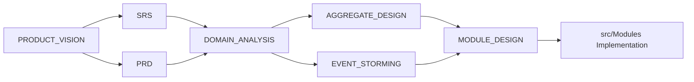

---

# 1. Executive Architectural Intent

## 1.1 Why Modular Monolith Now, Microservices Later

The Agriculture Management System is a **workflow-driven municipal production platform**. Early product risk is not “can we scale to millions of tenants,” but “can we correctly encode sequential production rules, inspection blocking, harvest/delivery constraints, and municipal auditability.” Those rules span Producers, Lands, Seasons, Workflows, Tasks, Inspections, Harvest, and Delivery.

A **modular monolith** is the correct near-term topology for the following reasons:

1. **Transactional honesty for sequential workflows.** Completing a task may need to advance a workflow step, optionally create an inspection, and schedule a notification. In a modular monolith, the application layer can coordinate with clear module APIs while still using a single database transaction or an explicit outbox pattern without distributed saga infrastructure on day one.
2. **Team size and municipal delivery cadence.** Municipal digital transformation teams typically start with one or two feature teams. Microservices multiply operational surface area (deployments, observability, auth propagation, schema ownership) faster than they buy organizational scale.
3. **Bounded contexts first, process boundaries second.** Extracting a service before the bounded context is stable creates a distributed monolith: chatty HTTP, shared tables, and unclear ownership. Modules with schemas, contracts, and event catalogs make extraction a deliberate cut, not an emergency rewrite.
4. **Lower cost of correctness.** Domain invariants (no skipping workflow steps; harvest only after workflow completion; delivery quantity ≤ harvest amount; archived seasons read-only) are cheaper to enforce when deployment and debugging are unified.
5. **Municipal multi-tenant reuse path.** The system is designed so a second municipality can be onboarded later via tenant isolation strategies (schema/row filters/host config). Starting modular keeps tenancy hooks per module without premature service mesh complexity.

**Microservices later** remains an explicit goal for modules that demonstrate independent scale, independent release cadence, or regulatory isolation (for example Reporting analytics warehouse, Notifications fan-out, Communication messaging). Section 10 defines extraction order and prerequisites.

## 1.2 Why Clean Architecture + CQRS + MediatR

### Clean Architecture

Each module is layered:

- **Domain** — aggregates, entities, value objects, domain events, domain services, repository interfaces (ports).
- **Application** — commands, queries, handlers, validators, policies, application services, DTOs, module-facing contracts.
- **Infrastructure** — EF Core mappings, repositories, outbox, MinIO adapters, email/SMS/push gateways, Hangfire job registrations for that module.
- **Contracts (optional project)** — public integration contracts and integration events consumed by other modules.

**Reasoning:** Clean Architecture keeps domain rules independent of ASP.NET, EF Core, SignalR, and Hangfire. Municipal systems have long lifetimes; infrastructure choices change more often than production rules. Isolating the domain reduces rewrite cost when storage, identity providers, or notification vendors change.

### CQRS

Commands mutate aggregates and raise events. Queries read optimized projections or carefully shaped EF queries. They do not share the same models by default.

**Reasoning:**

- Write models protect invariants; read models optimize dashboards (“Today’s Tasks,” Season Timeline, Permission Matrix).
- Inspection and workflow dashboards are read-heavy; harvest/delivery writes are write-critical and consistency-sensitive.
- CQRS prevents UI DTOs from leaking into aggregates and prevents query convenience from weakening aggregate boundaries.

### MediatR

MediatR (or an equivalent in-process mediator) dispatches `ICommand`/`IQuery` to handlers and enables pipeline behaviors: validation (FluentValidation), logging, transaction/unit-of-work, authorization checks, and performance timing.

**Reasoning:** Cross-cutting concerns must not be copy-pasted into every handler. Pipeline behaviors provide a single place for Serilog enrichment, Result mapping, and validation. Domain events collected on aggregates are dispatched after successful persistence via a unit-of-work decorator.

## 1.3 Why DDD Bounded Contexts

The product is **not** a CRUD registry. DOMAIN_ANALYSIS states: every screen exists because of a business process; every entity exists because of a business process. DDD bounded contexts give each process family a linguistic and ownership boundary:

- **Identity** speaks authentication, roles, permissions, refresh tokens.
- **Workflows/Tasks** speak steps, sequencing, assignment, completion, delay.
- **Inspections** speak findings, evidence, pass/fail blocking.
- **Harvest/Delivery** speak quantities, units, buyer, receipt constraints.

Without bounded contexts, teams invent colliding terms (“Status,” “Assignment,” “Document”) with different meanings. With bounded contexts, translation happens at contracts and integration events—not by sharing entity classes across modules.

## 1.4 Anti-Goals (What This System Is Not)

This architecture explicitly rejects the following:

1. **Not a generic farm ERP for private agribusiness chains.** Scope is municipality-mediated production support and oversight.
2. **Not a GIS platform.** Lands may store coordinates and parcel data; deep GIS analysis is an external concern (future adapter), not a core module.
3. **Not a marketplace or e-commerce for crops.** Delivery is municipal/logistics tracking of harvested product, not retail checkout.
4. **Not a real-time IoT sensor hub.** Sensors may appear later as integration sources; they are not first-class aggregates in MVP target.
5. **Not a microservices platform on day one.** No mandatory service mesh, no mandatory event bus product, no mandatory per-module database server.
6. **Not an anemic shared dump.** Shared Kernel must not become a dumping ground for every DTO, enum, or entity “shared for convenience.”
7. **Not a document-only CMS.** Photos and documents attach to domain objects (tasks, inspections, harvests) via MinIO object keys owned by the owning module.
8. **Not unconstrained CRUD.** Soft-deleted or archived seasons, completed inspections, and completed harvests enforce immutability rules from Aggregate Design.

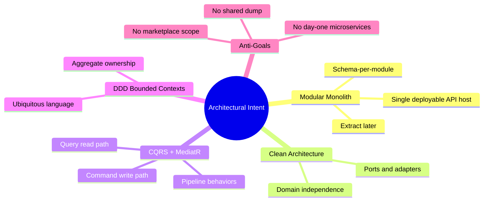

---

# 2. Architectural Style Decisions

## 2.1 Modular Monolith Topology

**Decision:** One ASP.NET Core host (`Agriculture.Api`) composes all modules at startup. Each module registers its own DI, MediatR handlers, EF configurations (or schema contributions), Hangfire jobs, and SignalR hubs (where owned).

**Topology properties**

| Property | Choice | Reasoning |
|---|---|---|
| Process | Single process | Simplifies municipal ops, JWT validation, logging correlation |
| Composition root | Host only | Modules never bootstrap each other |
| Module discovery | Explicit DI registration methods | Avoid magic assembly scanning surprises in production |
| API surface | Controllers/Minimal APIs in Host or thin module endpoints referenced by Host | Keep HTTP transport outside Domain |
| Frontend | Separate React SPA + React Native apps | UI is a client of module APIs, not a module inside the monolith |

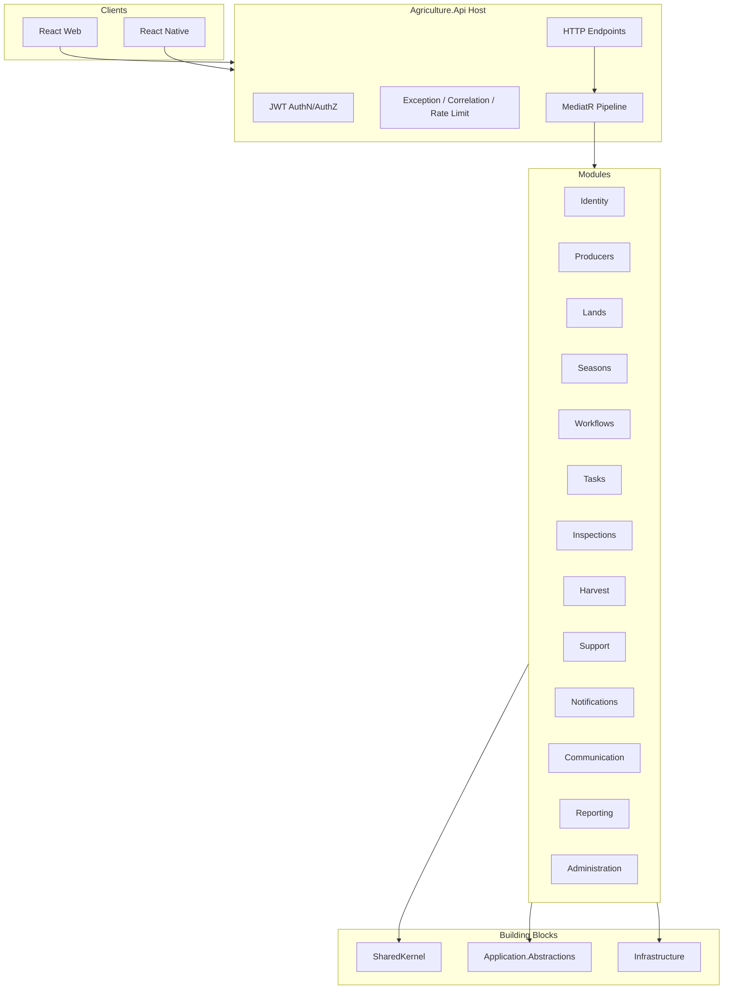

## 2.2 Clean Architecture Layers Per Module

**Standard module projects**

```
Agriculture.Modules.{Name}.Domain
Agriculture.Modules.{Name}.Application
Agriculture.Modules.{Name}.Infrastructure
Agriculture.Modules.{Name}.Contracts   # optional but recommended for public surfaces
```

**Allowed dependencies**

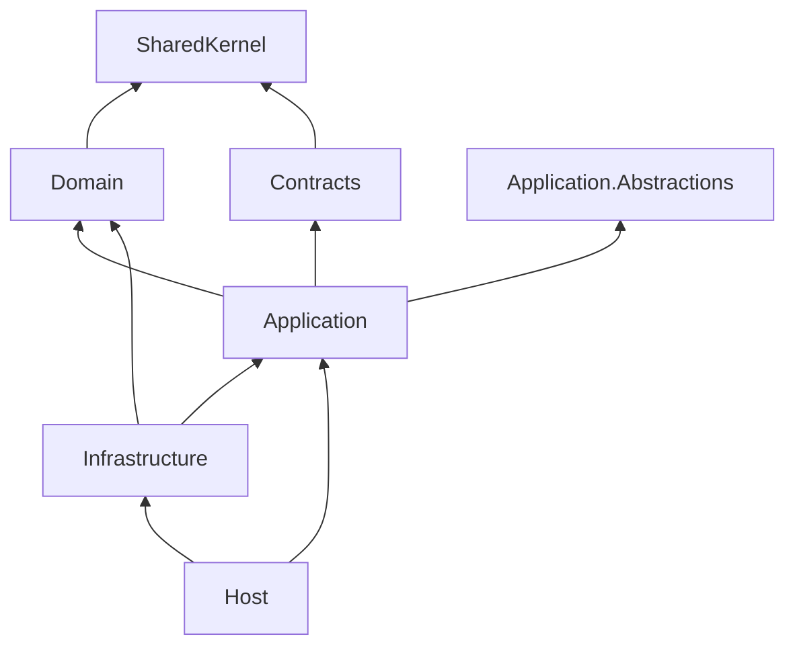

**Forbidden:** Domain → Application, Domain → Infrastructure, Application → another module’s Infrastructure, Domain → another module’s Domain.

## 2.3 CQRS Command/Query Split

| Aspect | Commands | Queries |
|---|---|---|
| Intent | Change state | Return data |
| Return | `Result` / `Result<TId>` / unit | DTO / paged list / projection |
| Side effects | Allowed (via domain + outbox) | Forbidden (no writes, no event raise) |
| Validation | FluentValidation + domain invariants | Input shape validation only |
| Authorization | Permission required for mutation | Permission required for read scope |
| Consistency | Strong within aggregate transaction | Eventual OK for denormalized read models |

**Reasoning:** Mixing reads and writes in “services” reintroduces transaction scripts and blurred invariants. CQRS makes inspection-blocking and workflow sequencing explicit on the write path while allowing Reporting and dashboards to evolve independently.

## 2.4 Domain Events vs Integration Events

| Kind | Scope | Delivery | Consumer | Persistence |
|---|---|---|---|---|
| **Domain Event** | Inside owning module (in-process after commit or within UoW policy) | MediatR notification / internal dispatcher | Same module policies; carefully controlled cross-module handlers via Contracts | Raised on aggregate, cleared after dispatch |
| **Integration Event** | Cross-module / future cross-service | Outbox → in-process bus now; message broker later | Other modules’ application handlers | Stored in outbox table owned by publishing module schema |

**Rules**

1. Aggregates raise **domain events** only (`IDomainEvent`).
2. Application/infrastructure maps selected domain events to **integration events** for other modules.
3. Other modules never reference foreign aggregate types to “handle” behavior; they subscribe to contracts.
4. Integration events are versioned (`ProducerRegisteredV1`) and additive-compatible.

**Reasoning:** Domain events express ubiquitous language inside a context. Integration events are a published language between contexts. Conflating them creates brittle coupling when extracting microservices.

## 2.5 Database Strategy

**Decision for current and near-term target**

- **Single SQL Server database** for the modular monolith.
- **Schema per module** (e.g., `identity`, `producers`, `lands`, `seasons`, `workflows`, `tasks`, `inspections`, `harvest`, `support`, `notifications`, `communication`, `reporting`, `admin`).
- **Migration ownership:** each module’s Infrastructure project owns migrations for its schema (or a coordinated migration assembly per module with clear ownership metadata).
- **No cross-schema foreign keys** between module-owned tables. References are by identifier (GUID) only.
- **Optional shared `dbo`/`shared` schema** only for infrastructure concerns (Hangfire, outbox relay metadata if centralized—prefer per-module outbox).

**Trade-offs**

| Approach | Pros | Cons | Decision |
|---|---|---|---|
| Single DB, shared tables | Simple joins | Destroys boundaries | Rejected |
| Single DB, schemas per module | Clear ownership, extractable | Cross-module joins discouraged | **Accepted** |
| DB per module now | Max isolation | Ops heavy, distributed tx early | Deferred to extraction |
| Shared FK across modules | Referential integrity | Hard extraction, leaky ownership | **Rejected** |

**Multi-tenant municipal implication:** Prefer `TenantId` column on root tables with row-level filters in repositories/query filters. Schema-per-tenant is a later option for large municipalities; do not hard-wire it into module boundaries.

## 2.6 Reasoning Summary for Style Choices

The combination Modular Monolith + Clean Architecture + CQRS + schema-per-module maximizes **correctness of sequential agricultural workflows** while preserving a **credible extraction path**. Every rejected alternative either weakens invariants (shared tables/FKs), increases premature complexity (DB-per-module microservices), or collapses linguistic boundaries (anemic shared models).

---

# 3. Shared Kernel Design

The Shared Kernel is intentionally small. It contains **technical primitives and cross-cutting contracts that do not encode municipality-specific agricultural policy**. If a type requires domain expert vocabulary unique to one context, it does **not** belong here.

Existing scaffold alignment: `Agriculture.SharedKernel` already contains `Entity`, `AggregateRoot`, `AuditableEntity`, `IDomainEvent`, and `Result`/`Error`. This section defines the **complete target Shared Kernel** and companion Building Blocks.

## 3.1 What Belongs in Shared Kernel vs What Must Never Go There

### Belongs (allowed)

- Identity primitives for entities (`Guid` ids, base entity behaviors).
- Audit fields pattern.
- Domain event marker interface.
- Result/Error functional outcome pattern.
- Common pagination request/response shapes (technical, not business).
- Specification base abstractions (optional).
- Guard/assertion utilities that are domain-agnostic.
- Enumeration base pattern (if used).
- Soft-delete marker interface (technical).
- Clock abstraction (`IDateTimeProvider`) if kept purely technical.

### Must NEVER go into Shared Kernel

- `Producer`, `Land`, `Season`, `Workflow`, `Task`, `Inspection`, `Harvest`, `Delivery` types.
- Module-specific enums (`InspectionStatus`, `WorkflowStepType`, `SupportApprovalState`) unless truly universal—and they almost never are.
- Permission constant catalogs for all modules (those live in Identity or per-module permission classes referenced by Identity seeding).
- DTOs for API screens.
- Repository implementations.
- EF `DbContext`.
- Notification templates.
- Report definitions.
- “Common” services that orchestrate multiple modules (`ProductionOrchestrator` in Shared Kernel is an anti-pattern).

**Reasoning:** An anemic shared dump recreates a distributed monolith inside one repo. Extraction becomes impossible because every module compiles against everyone else’s types.

## 3.2 BaseEntity / Entity

**Target responsibilities**

- Identity: `Guid Id` assigned on creation (or strongly typed IDs later).
- Equality by identity for entities.
- Domain event collection: raise, read, clear.
- Protection against public setters that bypass invariants (setters protected).

**Operational implications**

- All persisted domain objects inherit Entity (or AggregateRoot).
- Handlers never new up entities with invalid state; factories/methods enforce invariants.
- Event collection must be cleared only after successful dispatch post-commit (or via outbox write in same transaction).

## 3.3 AggregateRoot

**Target responsibilities**

- Marker specialization of Entity indicating consistency boundary ownership.
- Optional concurrency token exposure (`RowVersion` / `xmin` equivalent mapped in Infrastructure).
- Sole entry point for external modification of the aggregate cluster.

**Rules**

- Repositories load/save aggregate roots only.
- Child entities are reached only through root methods.
- Cross-module references store root ids, never navigate foreign children.

## 3.4 AuditableEntity

**Fields (target)**

- `CreatedAtUtc`, `CreatedBy`
- `ModifiedAtUtc`, `ModifiedBy`
- `IsDeleted`, `DeletedAtUtc`, `DeletedBy` (if soft delete applies)

**Reasoning:** Municipal systems require auditability for support decisions, inspection outcomes, and producer profile changes. Audit fields are technical cross-cutting; **what** is auditable remains a module policy (e.g., completed inspection immutable—soft delete forbidden).

**Edge case:** Some records must be immutable after completion (Inspection completed, Season archived). Soft delete is disabled; archive/cancel transitions replace delete.

## 3.5 Result / Error Patterns

`Result` / `Result<T>` / `Error(Code, Message)` are the standard application return types.

**Conventions**

- Domain methods may return `Result` or throw domain-specific exceptions sparingly; prefer Result for expected business failures.
- Handlers map domain failures to stable error codes (`Producers.IdentityNumberAlreadyExists`).
- API layer maps Result failures to Problem Details without leaking stack traces.
- `Error.None` reserved for success path sentinel.

**Failure modes**

- Unexpected infrastructure failures still throw and are handled by global exception middleware + Serilog/Seq.
- Validation failures from FluentValidation short-circuit before handler execution via pipeline behavior.

## 3.6 Domain Events / IDomainEvent

```text
IDomainEvent
  - OccurredOnUtc
  - (optional) EventId for idempotency
```

**Dispatch policy (target)**

1. Aggregate mutates and raises events in memory.
2. Repository persists aggregate in transaction.
3. Outbox rows written in same transaction for integration events.
4. After commit, in-process domain event handlers run (same module) OR only outbox is used for all handlers (stricter, preferred for extractability).

**Recommendation:** Prefer **outbox for all cross-aggregate reactions**, even in-process, to avoid dual-write bugs when Hangfire/SignalR side effects are involved.

## 3.7 Repository Interfaces (Ports)

Shared Kernel may define:

```text
IRepository<TAggregate> where TAggregate : AggregateRoot
IUnitOfWork
```

Module-specific repositories (`IProducerRepository`) live in the module Application/Domain abstractions, extending or composing the generic port.

**Never in Shared Kernel:** concrete EF repositories.

## 3.8 Specifications

Optional `ISpecification<T>` with criteria, includes, and ordering.

**Use when:** query composition becomes duplicated inside a module.

**Do not use to:** join across module schemas or express cross-context business processes.

## 3.9 Pagination

Shared technical shapes:

- `PagedRequest` (`Page`, `PageSize`, `Sort`, `SortDir`)
- `PagedResult<T>` (`Items`, `TotalCount`, `Page`, `PageSize`)

Module queries wrap these with filter DTOs (`GetTasksQuery` filters by season, status, producer).

**Operational rule:** Default page size caps (e.g., 50) and hard max (e.g., 200) enforced in validation to protect SQL Server.

## 3.10 Response Models

Shared Kernel may include a generic `ApiResponse<T>` **only if** the Host uses a uniform envelope. Prefer Problem Details for errors and raw DTOs for success to avoid over-wrapping.

Module DTOs remain in Application layers.

## 3.11 Common Exceptions

Allowed shared exceptions (technical):

- `NotFoundException`
- `ConflictException` (optimistic concurrency)
- `ForbiddenException`
- `ValidationException` (if not solely FluentValidation)

Module business rule violations should prefer typed `Error` codes over a deep exception hierarchy.

## 3.12 Value Objects (Shared)

Only **truly shared** VOs:

- `Money` (if multiple modules need currency)—otherwise keep in Support/Harvest.
- `DateRange` technical helper—acceptable.
- Email/Phone **patterns** may be duplicated per module or placed in Shared Kernel if identical validation rules are enterprise-standard.

**Caution:** `Address` in Identity vs Producer may diverge (municipal office vs farm address). Prefer per-module VOs unless proven identical.

## 3.13 Enumerations

Shared Kernel may provide an `Enumeration` base class pattern. Module enums stay module-local.

## 3.14 Constants / Utilities / Extensions

Allowed:

- `Guard` clauses
- String normalization helpers that are not business rules
- Collection extensions that are technical

Forbidden:

- `WorkflowConstants.MaxSteps`
- `HarvestUnits` lists
- Permission strings for all modules

## 3.15 Companion Building Blocks (Not Strictly Shared Kernel)

| Project | Role |
|---|---|
| `Agriculture.Application.Abstractions` | `ICommand`, `IQuery`, handlers, behaviors, `IUserContext`, `IUnitOfWork` |
| `Agriculture.Infrastructure` | EF base, authentication user context, shared infra DI |

These are **platform building blocks**, not domain Shared Kernel. Modules may depend on Application.Abstractions from Application projects; Infrastructure building block is referenced by module Infrastructure and Host.

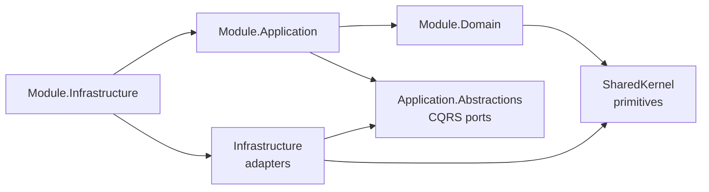

---

# 4. Strict Dependency Rules

## 4.1 Principles

1. **Modules do not reference other modules’ Domain or Infrastructure projects.**
2. **Cross-module calls go through Contracts (interfaces + integration events) or Host-level composition of application commands.**
3. **No circular dependencies** at project reference level or at runtime orchestration level (A waits on B waits on A in the same request without an explicit saga/outbox design).
4. **Database references are logical IDs only**—no FK across schemas.
5. **Read models may denormalize foreign names** (producer name on task list) via integration event handlers, not live joins to foreign schemas in write transactions.

## 4.2 Module-to-Module Allowed / Forbidden Matrix

Legend: **A** = Allowed via Contracts/Integration Events; **Q** = Allowed query-time read of published read model / ACL; **X** = Forbidden; **S** = Same module.

| From \ To | Identity | Producers | Lands | Seasons | Workflows | Tasks | Inspections | Harvest | Support | Notifications | Communication | Reporting | Admin |
|---|---|---|---|---|---|---|---|---|---|---|---|---|---|
| Identity | S | A | X | X | X | X | X | X | X | A | X | X | A |
| Producers | Q | S | A | A | X | X | X | X | A | A | A | X | X |
| Lands | Q | A | S | A | X | X | X | X | X | A | X | X | X |
| Seasons | Q | Q | Q | S | A | X | X | X | X | A | X | X | X |
| Workflows | Q | Q | X | Q | S | A | A | A | X | A | X | X | X |
| Tasks | Q | Q | X | Q | Q | S | A | X | X | A | A | X | X |
| Inspections | Q | Q | Q | Q | Q | Q | S | X | X | A | A | X | X |
| Harvest | Q | Q | Q | Q | Q | X | Q | S | X | A | X | X | X |
| Support | Q | Q | X | Q | X | X | X | X | S | A | A | X | X |
| Notifications | Q | X | X | X | X | X | X | X | X | S | X | X | X |
| Communication | Q | Q | X | X | X | X | X | X | X | A | S | X | X |
| Reporting | Q | Q | Q | Q | Q | Q | Q | Q | Q | X | X | S | X |
| Admin | A | Q | Q | Q | Q | Q | Q | Q | Q | A | Q | Q | S |

**Notes on the matrix**

- **Notifications** is a sink: many modules publish “please notify,” Notifications does not call back into domain modules to mutate them.
- **Reporting** is mostly a reader/projector; it must not become the orchestration brain.
- **Identity** may emit `UserRegistered` so Producers/Admin can link accounts; Producers must not own password hashes.
- **Workflows → Tasks** is a primary coupling: task generation is triggered by workflow policies via integration events/commands, not by Tasks importing Workflow entities.

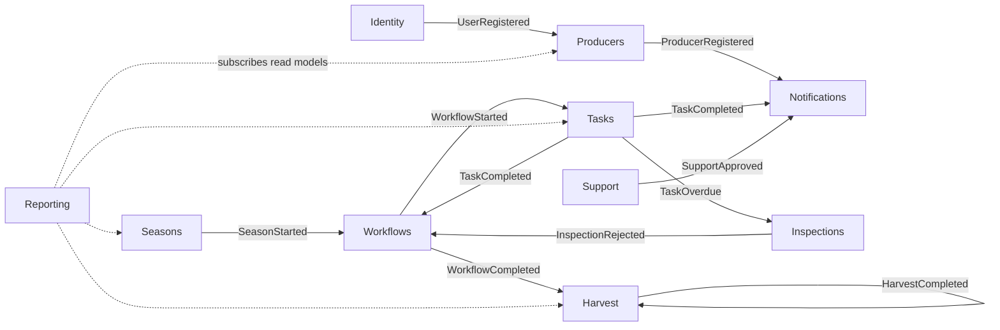

## 4.3 When to Use Domain Events vs Application Services vs Repositories vs Shared Kernel

| Mechanism | Use when | Do not use when |
|---|---|---|
| Domain Event | State change inside an aggregate must notify other parts of the same model or publish integration intent | You need a synchronous query of another module’s data inside invariant checks—use ACL/query service instead |
| Application Service / Handler | Orchestrating one use case across one aggregate (sometimes two via contracts) | Putting business invariants that belong on the aggregate |
| Repository | Load/save aggregate roots | Cross-module data access |
| Shared Kernel | Technical primitive reuse | Sharing Producer DTO “because Tasks need the name” |

## 4.4 Infrastructure Access Rules

**Allowed**

- Module Infrastructure implements ports defined in that module’s Application/Domain.
- Module Infrastructure may use BuildingBlocks Infrastructure utilities (DbContext patterns, MinIO client wrappers).
- Host Infrastructure wiring may register all modules.

**Forbidden**

- `Tasks.Infrastructure` referencing `Workflows.Infrastructure` DbContext.
- Querying another module’s tables via raw SQL “just this once.”
- Sharing EF entity configurations across modules.

**Exception (temporary anti-corruption during MVP):** a read-only database view owned by Reporting may project across schemas **if and only if** Reporting owns the view definition and producers of data remain unaware. Prefer event-projected tables.

## 4.5 Circular Dependency Prevention

**Static prevention**

- Project references form a DAG. Contracts projects depend only on SharedKernel (and maybe Application.Abstractions messaging markers).
- CI analyzer / architecture tests (NetArchTest or custom) enforce:
  - Domain cannot reference Application/Infrastructure.
  - Module A Application cannot reference Module B Application.

**Runtime prevention**

- Request-scoped orchestration must not call Module A → Module B → Module A synchronously for the same unit of work.
- Use eventual consistency: TaskCompleted → Workflow advances → NextTaskGenerated.

**Failure mode:** synchronous cycles create deadlocks and unpredictable partial commits. Detect in code review via sequence diagrams for new policies.

## 4.6 Public API Contracts Between Modules

**Recommended shape**

```text
Agriculture.Modules.{Name}.Contracts
  /Events          Integration events
  /Abstractions    IXxxReadService / IXxxGateway interfaces
  /Ids             Strongly typed IDs if adopted
```

Consuming modules reference **Contracts only**.

**Implementation location:** Infrastructure or Application of the owning module registers the contract implementation in DI.

**Example**

- `IProducerDirectory` in Producers.Contracts provides `ExistsAsync`, `GetSummaryAsync`.
- Tasks Application validates producer existence via `IProducerDirectory`, not `IProducerRepository`.

---

# 5. Complete Folder / Solution Structure

## 5.1 Target Tree

```text
src/
  Hosts/
    Agriculture.Api/                          # Composition root, HTTP, SignalR hubs host, Hangfire dashboard auth
  BuildingBlocks/
    Agriculture.SharedKernel/                 # Entity, AggregateRoot, Result, IDomainEvent, pagination primitives
    Agriculture.Application.Abstractions/     # ICommand, IQuery, behaviors, IUserContext, IUnitOfWork
    Agriculture.Infrastructure/               # Shared EF helpers, auth user context, serilog enrichers hooks
  Modules/
    Identity/
      Agriculture.Modules.Identity.Domain/
      Agriculture.Modules.Identity.Application/
      Agriculture.Modules.Identity.Infrastructure/
      Agriculture.Modules.Identity.Contracts/
    Producers/
      Agriculture.Modules.Producers.Domain/
      Agriculture.Modules.Producers.Application/
      Agriculture.Modules.Producers.Infrastructure/
      Agriculture.Modules.Producers.Contracts/
    Lands/
      ...Domain / Application / Infrastructure / Contracts
    Seasons/
      ...Domain / Application / Infrastructure / Contracts
    Workflows/
      ...Domain / Application / Infrastructure / Contracts
    Tasks/
      ...Domain / Application / Infrastructure / Contracts
    Inspections/
      ...Domain / Application / Infrastructure / Contracts
    Harvest/                                  # Includes Delivery bounded capability (justified in §6.8)
      ...Domain / Application / Infrastructure / Contracts
    Support/
      ...Domain / Application / Infrastructure / Contracts
    Notifications/
      ...Domain / Application / Infrastructure / Contracts
    Communication/
      ...Domain / Application / Infrastructure / Contracts
    Reporting/
      ...Domain / Application / Infrastructure / Contracts
    Administration/
      ...Domain / Application / Infrastructure / Contracts
frontend/                                     # React SPA
mobile/                                       # React Native
tests/
  Architecture.Tests/                         # Dependency rule tests
  Modules.{Name}.UnitTests/
  Modules.{Name}.IntegrationTests/
  Api.IntegrationTests/
docs/                                         # Product + architecture docs
```

**Alignment with current scaffold:** `src/Modules` currently contains Identity, Producers, Lands, Seasons, Workflows, Tasks, Inspections, Harvest, Support, Notifications (each with Domain/Application/Infrastructure). Target adds Contracts projects, Communication, Reporting, Administration modules, and frontend/mobile/tests layout as first-class solution areas.

## 5.2 Namespace Conventions

```text
Agriculture.Modules.{Module}.Domain.{Entities|ValueObjects|Events|Services|Enums|Exceptions}
Agriculture.Modules.{Module}.Application.{Commands|Queries|Abstractions|Policies|DTOs|Validators|EventHandlers}
Agriculture.Modules.{Module}.Infrastructure.{Persistence|Repositories|Outbox|Jobs|Services|Options}
Agriculture.Modules.{Module}.Contracts.{Events|Abstractions}
Agriculture.SharedKernel.{Primitives|Results|Pagination|Guards}
Agriculture.Application.Abstractions.{Messaging|Authentication|Behaviors|Data}
Agriculture.Api.{Controllers|Hubs|Middleware|Extensions}
```

## 5.3 Project Dependency Graph

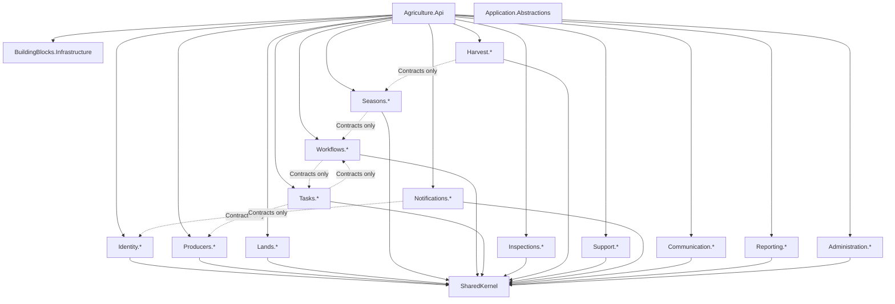

## 5.4 Folder Responsibilities Inside a Module

### Domain

- Aggregate roots and entities
- Value objects
- Domain events
- Domain services (pure policy that does not need IO)
- Enums / state machines
- Repository interfaces (optional location; Application.Abstractions inside module also acceptable)

### Application

- Commands/Queries + Handlers
- FluentValidation validators
- Policy handlers (react to events)
- DTOs / read models definitions
- Mapping profiles if used
- Permission constants local to module (or references to Identity permission names)

### Infrastructure

- `DbContext` or schema configuration contribution
- EF mappings
- Repository implementations
- Outbox store
- Hangfire job classes for module
- External gateways (MinIO object paths for this module, SMS provider adapter usage)

### Contracts

- Integration events
- Read service interfaces for ACLs
- Public command wrappers only if cross-module command invocation is standardized

## 5.5 Host Responsibilities

- Authentication middleware (JWT)
- Authorization policies registration
- Serilog request logging
- Seq sink configuration
- Hangfire server + dashboard protection
- SignalR endpoint mapping
- Swagger/OpenAPI
- Health checks (SQL, MinIO, Hangfire)
- Module DI `AddXxxModule()` extension calls

The Host must remain thin: **no business invariants**.

---

# 6. Module Catalog

Each module section below is normative for target architecture. It expands business responsibility, boundaries, aggregates, application surface, events, policies, permissions, database ownership, interfaces, transaction/consistency/locking strategies, and future expansion.

---

## 6.1 Identity Module

### Business Responsibility

Identity authenticates humans and service accounts, authorizes actions via roles/permissions/claims, manages refresh token lifecycle, password lifecycle, and login audit. It is the security source of truth for “who is acting.”

### Business Boundary

**In:** users, roles, permissions, role-permission grants, refresh tokens, login history, password history, auth challenge outcomes.

**Out:** producer profile data, land parcels, workflow definitions, notification template content (Identity may trigger “send welcome” via event only).

### Aggregate Roots

- **User** (primary) — see AGGREGATE_DESIGN Aggregate 1.

Optional separate aggregates if scale requires:

- **Role** (if roles become complex with hierarchical scopes)
- **Permission** catalog (often reference data seeded, not a heavy aggregate)

### Entities / Child Entities

RefreshToken, LoginHistory, PasswordHistory, AssignedRole, PermissionOverride.

### Value Objects

Email, PhoneNumber, FullName, Address (account address), PasswordHash (wrapper), JwtId/TokenFamilyId.

### Repositories

`IUserRepository`, `IRoleRepository` (if needed), `IRefreshTokenStore` (may be part of User aggregate persistence).

### Application Services / Domain Services

- Domain: password complexity policy evaluation, token family rotation rules.
- Application: `IIdentityService`, `ITokenService`, `IPermissionService` (ports implemented in Infrastructure; ASP.NET Identity may back ApplicationUser as in current scaffold).

### Commands

RegisterUser, UpdateUser, DeactivateUser, AssignRole, RemoveRole, Login, Logout, RefreshToken, ChangePassword, ResetPassword, GrantPermissionOverride, RevokePermissionOverride.

### Queries

GetUserById, GetUsers (paged), GetRoles, GetPermissionMatrix, GetLoginHistory, GetMyProfile.

### DTOs

UserDto, RoleDto, PermissionDto, AuthTokenResponse, LoginHistoryDto.

### Events

**Domain:** UserRegistered, UserUpdated, UserDeactivated, RoleAssigned, RoleRemoved, PasswordChanged, UserLoggedIn, UserLoggedOut, RefreshTokenCreated, RefreshTokenRevoked.

**Integration:** `UserRegisteredV1`, `UserDeactivatedV1`, `RoleAssignedV1` (for Admin/Producers linking).

### Policies

- After UserRegistered → Notifications welcome (integration).
- After PasswordChanged → revoke refresh token family.
- After UserDeactivated → force logout / token revocation; notify dependent modules to freeze linked actors.

### Validators

Unique email/username; password policy; role existence; prevent deactivating last system admin (Administration collaboration).

### Permissions

`identity.users.read|create|update|deactivate`, `identity.roles.manage`, `identity.permissions.manage`, `identity.audit.read`.

### External Dependencies

SQL Server (identity schema), optionally email gateway for reset links (via Notifications), JWT signing keys from configuration, Serilog audit.

### Database Ownership

Schema `identity`: Users, Roles, Permissions, UserRoles, RolePermissions, RefreshTokens, LoginHistories, PasswordHistories, OutboxMessages.

### Public Interfaces

`IUserDirectory` (id exists, display name, isActive), `IPermissionChecker` (optional centralized).

### Internal Interfaces

EF `IdentityDbContext`, JWT generator, password hasher.

### Future Expansion

External IdP (OAuth/OIDC municipal SSO), MFA, device session management, tenant-scoped roles.

### Transaction Boundary

User aggregate + its tokens/history rows in one transaction per command.

### Consistency Boundary

Strong consistency for authz data used in token issuance. Downstream modules may react eventually to deactivation.

### Aggregate Boundary

Other modules store `UserId` only; never embed Identity entities.

### Locking / Concurrency Strategy

Optimistic concurrency on User row version; refresh token rotation uses conditional updates to prevent replay (token family invalidation on reuse detection).

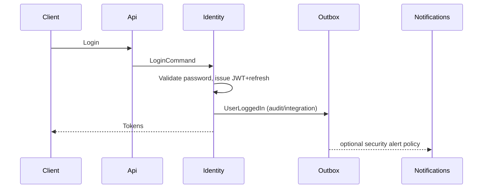

---

## 6.2 Producers Module

### Business Responsibility

Producers is the central business actor registry for agricultural producers participating in municipal programs. It owns profile, documents, contacts, assignment references to lands/seasons, and historical summaries needed for producer-centric views—without owning land geometry or season calendars.

### Business Boundary

**In:** producer registration, profile updates, document metadata, contact channels, soft assignment records (by id) to lands/seasons, support participation references, deactivation.

**Out:** authoritative land parcel geometry (Lands), season lifecycle (Seasons), task execution (Tasks), inspection findings (Inspections), harvest quantities (Harvest).

**Clarification vs Aggregate Design:** Aggregate Design lists SupportHistory/InspectionHistory/HarvestHistory as children for consistency storytelling. In the **module design target**, those histories are preferably **projections** updated by integration events to keep the Producer aggregate small. Producer aggregate retains assignment entities that it must enforce (no duplicate land assignment; no two active seasons for same land).

### Aggregate Roots

Producer.

### Entities

ProducerPhoto, ProducerDocument, ProducerAddress, ProducerContact, ProducerLandAssignment, ProducerSeasonAssignment; projected history tables optional.

### Value Objects

IdentityNumber, Phone, Email, Address, BankInformation.

### Repositories

`IProducerRepository`.

### Application / Domain Services

ProducerRegistrationService (uniqueness), ProducerAssignmentService (assignment invariants using Lands/Seasons ACL checks).

### Commands

RegisterProducer, UpdateProducer, AssignLand, UnassignLand, AssignSeason, DeactivateProducer, UploadProducerDocument, UpdateContact.

### Queries

GetProducer, GetProducers, GetProducerSeasonHistory, GetProducerSupportSummary (read model), SearchProducers.

### DTOs

ProducerDetailDto, ProducerSummaryDto, ProducerDocumentDto.

### Events

ProducerRegistered, ProducerUpdated, ProducerAssignedLand, ProducerAssignedSeason, ProducerDeactivated; integration equivalents for Notifications, Reporting, Communication account provisioning policies.

### Policies

After ProducerRegistered → create mobile login linkage policy (Identity user create command via Host/ACL), welcome notification, initial dashboard projection.

### Validators

Identity number unique; required contacts; cannot assign archived land; cannot assign to inactive season.

### Permissions

`producers.read|create|update|deactivate|assign`.

### External Dependencies

MinIO for photos/documents; Identity contracts for user link; Lands/Seasons contracts for existence/active checks; Notifications.

### Database Ownership

Schema `producers`: Producers, Photos, Documents, Addresses, Contacts, LandAssignments, SeasonAssignments, ProducerProjections_*, Outbox.

### Public Interfaces

`IProducerDirectory`, `IProducerAssignmentQueries`.

### Internal Interfaces

Object storage path builder `producers/{id}/...`.

### Future Expansion

Producer groups/cooperatives, KYC verification workflows, multi-municipality producer portability.

### Transaction / Consistency / Aggregate Boundaries

Assignment commands: single Producer aggregate transaction; validate foreign ids via contracts before mutate. Eventual projections for harvest/inspection history.

### Locking / Concurrency

Optimistic concurrency on Producer; unique indexes on IdentityNumber and active assignment pairs.

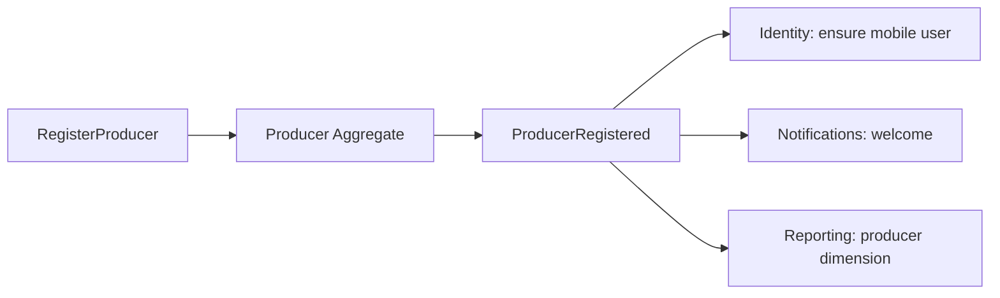

---

## 6.3 Lands Module

### Business Responsibility

Authoritative registry of agricultural parcels: area, soil, coordinates, ownership history, documents, archive state. Lands answers “what land exists and what are its physical/legal attributes?”

### Business Boundary

**In:** land registration/update/archive, coordinates, photos/docs metadata, ownership history, crop history records that are land-centric.

**Out:** season scheduling (Seasons), producer PII (Producers), workflow templates (Workflows).

### Aggregate Roots

Land.

### Entities

LandCoordinate, LandPhoto, LandDocument, LandOwnership, LandCropHistory.

### Value Objects

ParcelNumber, Area, Location, SoilInformation.

### Repositories

`ILandRepository`.

### Commands

RegisterLand, UpdateLand, ArchiveLand, AssignProducerToLand (emits event; Producer module also records assignment—**dual write avoidance:** prefer one owner).

**Assignment ownership decision (normative):** Producer module owns “producer participates on land” assignment invariant; Lands may store current `PrimaryProducerId` as denormalized reference updated via event **or** expose only existence APIs. Do not maintain two conflicting sources of truth. Target: **Producers owns assignment entities**; Lands stores optional `CurrentProducerId` projection.

### Queries

GetLand, GetLands, GetLandMapPoints, GetCropHistory, LandStatistics (module-local).

### Events

LandRegistered, LandUpdated, LandArchived, ProducerAssignedOnLand (if emitted), SeasonLinked (projection).

### Policies

After LandRegistered → initialize empty crop history; optional GIS external push.

### Validators

Parcel unique; area > 0; archived land rejects new season links (enforced when Seasons asks Lands ACL `CanAcceptNewSeason`).

### Permissions

`lands.read|create|update|archive`.

### External Dependencies

MinIO; optional GIS; Producers/Seasons contracts.

### Database Ownership

Schema `lands`.

### Public Interfaces

`ILandDirectory` (`Exists`, `IsArchived`, `GetSummary`, `CanAcceptNewSeason`).

### Future Expansion

Cadastre integration, richer GeoJSON polygons, soil lab results.

### Transaction / Consistency / Locking

Land aggregate optimistic concurrency; archive is irreversible soft state (IsArchived) with strong checks.

---

## 6.4 Seasons Module

### Business Responsibility

Seasons owns the production timebox for a land: create/start/pause/complete/archive, calendar windows, and the link to which workflow definition/version is assigned for that season instance.

### Business Boundary

**In:** season lifecycle, calendar, settings, workflow assignment reference (workflow id + version).

**Out:** workflow step graph execution details (Workflows), task instances (Tasks), harvest records (Harvest).

### Aggregate Roots

Season.

### Entities

SeasonCalendar, SeasonConfiguration, SeasonWorkflowLink.

### Value Objects

SeasonName, SeasonPeriod, SeasonStatus.

### Invariants (from Aggregate Design, enforced here)

Only one active season per land; completed seasons read-only; archived seasons immutable.

### Commands

CreateSeason, StartSeason, PauseSeason, CompleteSeason, ArchiveSeason, AssignWorkflow.

### Queries

GetSeason, GetSeasons, SeasonDashboard, SeasonTimeline, SeasonStatus.

### Events

SeasonCreated, SeasonStarted, SeasonPaused, SeasonCompleted, SeasonArchived, WorkflowAssignedToSeason.

### Policies

After SeasonStarted → request Workflows to start production workflow instance / generate first tasks; notify producer.

After SeasonCompleted → lock further task creation; notify Reporting.

### Validators

Land must accept season; period valid; cannot complete with blocking open inspections (query Inspections ACL)—**consistency note:** may be saga-style check.

### Permissions

`seasons.read|create|start|pause|complete|archive|assign_workflow`.

### External Dependencies

Lands ACL, Workflows ACL/commands, Inspections read ACL, Notifications, Producers directory.

### Database Ownership

Schema `seasons`.

### Public Interfaces

`ISeasonDirectory`, `ISeasonLifecycleGateway`.

### Future Expansion

Multi-crop seasons, overlapping legal seasons with explicit types, climate window recommendations.

### Transaction Boundary

Season aggregate only; starting workflow is integration after commit.

### Consistency Boundary

Lifecycle strong; task generation eventual from Workflows/Tasks.

### Locking / Concurrency

Optimistic concurrency; unique filtered index: one Active season per LandId.

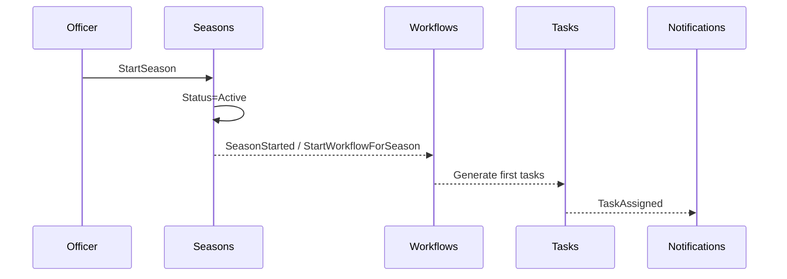

---

## 6.5 Workflows Module

### Business Responsibility

Workflows defines and executes the ordered production process templates and their runtime instances bound to seasons. A workflow consists of ordered steps, conditions, rules, and versions. It is the automation brain that decides which tasks exist next and when harvest may begin.

### Business Boundary

**In:** workflow definitions, versions, steps, conditions/rules, publishing/archiving definitions, runtime workflow instances for seasons, step progression state.

**Out:** task photo/comment content (Tasks), inspection evidence (Inspections), producer PII (Producers).

### Aggregate Roots

- **WorkflowDefinition** (template + versions + steps) — corresponds to AGGREGATE_DESIGN Workflow for design-time.
- **ProductionWorkflow** (runtime instance per season) — recommended split to keep aggregates small.

If MVP keeps a single Workflow aggregate, document clearly that runtime state and definition versioning still obey “no skip steps” invariants.

### Entities

WorkflowStep, WorkflowCondition, WorkflowRule, WorkflowVersion, RuntimeStepState.

### Value Objects

WorkflowStatus, WorkflowType, StepOrder, StepGateType (e.g., RequiresInspection).

### Repositories

`IWorkflowDefinitionRepository`, `IProductionWorkflowRepository`.

### Domain Services

StepSequencingService (next step resolution), WorkflowGateEvaluator (inspection required?).

### Commands

CreateWorkflow, AddStep, PublishWorkflow, ArchiveWorkflow, AssignWorkflowToSeason, StartProductionWorkflow, CompleteWorkflowStep, CompleteProductionWorkflow, CancelProductionWorkflow.

### Queries

GetWorkflowDefinition, GetWorkflows, GetProductionWorkflowProgress, WorkflowStatistics.

### DTOs

WorkflowDetailDto, StepDto, ProgressDto.

### Events

WorkflowCreated, WorkflowPublished, WorkflowAssigned, WorkflowStarted, WorkflowStepCompleted, WorkflowCompleted, WorkflowCancelled, WorkflowArchived.

### Policies

- After WorkflowStarted → generate first tasks (Tasks module).
- After TaskCompleted (incoming integration) → advance step / generate next task / open inspection gate.
- After WorkflowCompleted → start harvest process (Harvest).
- After InspectionRejected (incoming) → block advancement / create remediation step policy.

### Validators

At least one step; strict ordering; cannot publish empty; cannot start archived definition; cannot skip.

### Permissions

`workflows.definitions.manage`, `workflows.runtime.read`, `workflows.runtime.control`.

### External Dependencies

Seasons (season id), Tasks (task generation gateway), Inspections (gate), Harvest (completion trigger), Notifications.

### Database Ownership

Schema `workflows`: Definitions, Versions, Steps, Rules, Conditions, ProductionWorkflows, RuntimeSteps, Outbox.

### Public Interfaces

`IWorkflowRuntimeGateway` (start/advance), `IWorkflowReadModel`.

### Internal Interfaces

Version immutability enforcement after publish.

### Future Expansion

Visual workflow designer, parallel steps (only if municipal process truly needs—default remains sequential), A/B workflow experiments per crop.

### Transaction Boundary

Definition edits: definition aggregate. Runtime advance: production workflow aggregate in one transaction; task creation via outbox after commit.

### Consistency Boundary

Sequential step integrity is strong within ProductionWorkflow. Task existence is eventually consistent but must be idempotent (command ids / step-task unique keys).

### Aggregate Boundary

Tasks store `ProductionWorkflowId` + `WorkflowStepId`, never mutate workflow tables.

### Locking / Concurrency Strategy

Optimistic concurrency on ProductionWorkflow; advancing a step uses version check to prevent double-advance from duplicate TaskCompleted deliveries. Idempotency keys on integration handlers are mandatory.

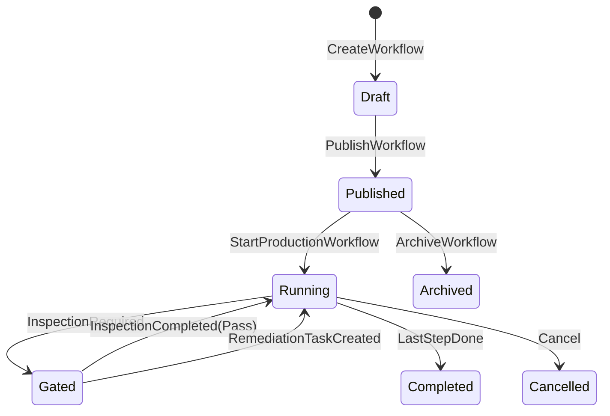

---

## 6.6 Tasks Module

### Business Responsibility

Tasks represents concrete work assigned to producers (and sometimes officers) derived from workflow steps or ad-hoc municipal instructions. Tasks capture execution evidence (photos, comments, attachments), timing (due, delay), and completion that drives workflow progression.

### Business Boundary

**In:** task lifecycle, assignments, evidence metadata, reminders history, delay reasons.

**Out:** workflow definition editing, inspection findings schema, harvest amounts.

### Aggregate Roots

Task (named `ProductionTask` in current scaffold—retain ubiquitous language “Task” in docs/API).

### Entities

TaskPhoto, TaskAttachment, TaskComment, ReminderHistory.

### Value Objects

DueDate, Priority, TaskStatus, CompletionTime.

### Invariants

Completed cannot return to Pending; cancelled cannot restart; future workflow steps cannot create tasks early; evidence rules may require photo before complete.

### Repositories

`ITaskRepository`.

### Commands

CreateTask, AssignTask, StartTask, CompleteTask, CancelTask, DelayTask, UploadPhoto, AddComment, SendReminder (or job-triggered).

### Queries

GetTask, GetTasks, TodaysTasks, PendingTasks, CompletedTasks, DelayedTasks, TaskTimeline.

### Events

TaskCreated, TaskAssigned, TaskStarted, TaskCompleted, TaskCancelled, TaskDelayed, PhotoUploaded, CommentAdded, ReminderSent.

### Policies

- Task due tomorrow → reminder notification.
- Task overdue → push + notify municipality + optionally create inspection.
- TaskCompleted → Workflows advance / next task generation.

### Validators

Assignee must be active producer/user; due date rules; completion requires mandatory attachments when step gate says so (Workflows ACL provides gate metadata at creation time—store on task as snapshot).

### Permissions

`tasks.read`, `tasks.assign`, `tasks.complete_own`, `tasks.complete_any`, `tasks.cancel`, `tasks.delay`.

### External Dependencies

Workflows contracts, Producers/Identity directories, Notifications, Communication (optional thread per task), MinIO, Hangfire for reminders, SignalR for realtime task board updates.

### Database Ownership

Schema `tasks`.

### Public Interfaces

`ITaskLifecycleGateway` (create from workflow), `ITaskReadService`.

### Future Expansion

Offline mobile sync conflict resolution, checklist sub-items, geo-fenced completion.

### Transaction / Consistency / Aggregate

Single task aggregate per command. Workflow advance is reactive. Duplicate CompleteTask is idempotent.

### Locking / Concurrency

RowVersion on Task; unique (ProductionWorkflowId, StepId, ProducerId) where applicable to prevent duplicate active tasks.

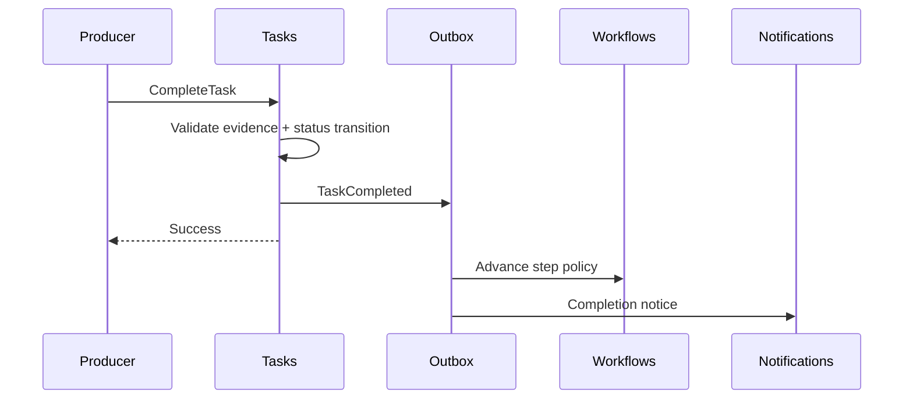

---

## 6.7 Inspections Module

### Business Responsibility

Inspections capture municipality field verification that may **block** workflow progression. Inspections are evidence-heavy and become immutable after completion.

### Business Boundary

**In:** inspection scheduling/assignment, findings, photos/docs, pass/fail/reject outcomes, comments.

**Out:** changing task status directly (emit events; Tasks/Workflows react), editing producer master data.

### Aggregate Roots

Inspection.

### Entities

InspectionFinding, InspectionPhoto, InspectionComment, InspectionDocument.

### Value Objects

InspectionDate, InspectorRef, InspectionStatus, Outcome.

### Invariants

Cannot edit after completion; must belong to a task and/or workflow/season context; rejection must include reason.

### Commands

CreateInspection, AssignInspector, StartInspection, CompleteInspection, RejectInspection, UploadEvidence.

### Queries

GetInspection, GetInspections, OpenBlockingInspectionsForSeason, InspectorWorkload.

### Events

InspectionCreated, InspectionAssigned, InspectionStarted, InspectionCompleted, InspectionRejected.

### Policies

- InspectionCompleted(Pass) → allow Workflows to resume gated step.
- InspectionRejected → create remediation task / block harvest eligibility.
- TaskOverdue policy may CreateInspection.

### Validators

Inspector role required; evidence minimums; cannot complete without findings when configured.

### Permissions

`inspections.read|create|assign|complete|reject`.

### External Dependencies

Tasks/Workflows/Seasons/Producers/Lands directories (context ids), MinIO, Notifications, Communication, SignalR for officer apps.

### Database Ownership

Schema `inspections`.

### Public Interfaces

`IInspectionGate` (`HasBlockingInspection`, `GetOutcome`), used by Seasons/Workflows/Harvest before critical transitions.

### Future Expansion

Structured checklist templates per crop, GPS verification, third-party auditor tenants.

### Transaction / Consistency

Inspection aggregate strong; unblocking workflow eventual via events. **Failure mode:** if event lost, gate query still sees Completed—handlers must be idempotent and gate should be query-based for safety-critical blocks.

### Locking / Concurrency

Optimistic concurrency; completed inspections reject updates with conflict/forbidden.

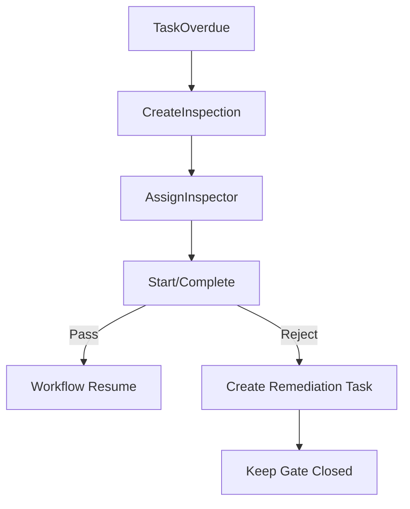

---

## 6.8 Harvest Module (including Delivery)

### Justification: Nested Delivery vs Separate Module

DOMAIN_ANALYSIS lists Harvest and Delivery as separate domains; AGGREGATE_DESIGN defines separate aggregates. **Module design decision: one deployable module `Harvest` owning both Harvest and Delivery aggregates**, with clear internal bounded subcontexts.

**Reasoning**

1. Delivery invariants depend directly on harvest quantities (`Quantity cannot exceed harvest amount`). Co-locating reduces distributed transaction needs.
2. Municipal release cadence for harvest and delivery is identical (season close-out).
3. Extraction later can still split schemas `harvest` and `delivery` inside the module before process split.
4. Current scaffold already has `src/Modules/Harvest` without a separate Delivery folder—target extends Harvest module rather than inventing a premature microservice boundary.

**If team size grows:** split Contracts and schemas first; split host process only when independent scale appears.

### Business Responsibility

Record harvesting activities for a completed (or harvest-eligible) workflow/season, measure products, then manage delivery of harvested product with documents/invoices/receipts under quantity constraints.

### Business Boundary

**In:** harvest start/complete/cancel, products/measurements/photos, delivery create/complete/cancel, invoice/receipt metadata.

**Out:** workflow editing, support payments (Support may reference delivery events but does not own harvest).

### Aggregate Roots

Harvest; Delivery.

### Entities

HarvestProduct, HarvestPhoto, HarvestMeasurement; DeliveryDocument, DeliveryInvoice, DeliveryReceipt.

### Value Objects

HarvestDate, HarvestAmount, HarvestUnit; DeliveryDate, Buyer, Quantity, Price.

### Repositories

`IHarvestRepository`, `IDeliveryRepository`.

### Commands

StartHarvest, CompleteHarvest, CancelHarvest, RecordHarvestMeasurement, CreateDelivery, CompleteDelivery, CancelDelivery, AttachDeliveryDocument.

### Queries

GetHarvest, GetHarvests, GetDelivery, GetDeliveries, SeasonHarvestSummary.

### Events

HarvestStarted, HarvestCompleted, HarvestCancelled, DeliveryCreated, DeliveryCompleted, DeliveryCancelled.

### Policies

- WorkflowCompleted → eligible to StartHarvest (command permitted).
- HarvestCompleted → optionally auto-suggest CreateDelivery.
- DeliveryCompleted → notify Reporting/Support eligibility policies; contribute to SeasonCompleted checks.

### Validators

Harvest cannot begin before workflow completion / inspection gates clear; amounts ≥ 0; delivery quantity ≤ remaining undelivered harvest amount; harvest must exist for delivery.

### Permissions

`harvest.read|start|complete|cancel`, `delivery.read|create|complete|cancel`.

### External Dependencies

Seasons/Workflows/Inspections gates, Producers/Lands directories, MinIO, Notifications, Reporting.

### Database Ownership

Schemas `harvest` and `delivery` (both owned by Harvest module migrations).

### Public Interfaces

`IHarvestEligibilityService`, `IHarvestReadModel`, `IDeliveryReadModel`.

### Future Expansion

Cold-chain tracking, buyer organizations, quality grades, weighing scale device integration.

### Transaction Boundary

Harvest commands touch Harvest aggregate only. Delivery commands touch Delivery aggregate only but **read harvest remaining quantity** via internal module service (same module—allowed). Cross-aggregate consistency for “remaining quantity” uses optimistic checks + unique constraints / transactional snapshot within module DbContext **same schema owner**—acceptable inside module.

### Consistency / Aggregate / Locking

Within-module transactional consistency permitted for Delivery create that decrements reserved quantity projection on Harvest **only through Harvest aggregate method** invoked in the same module application handler (multi-aggregate transaction carefully designed). Prefer: Delivery stores quantity; Harvest maintains `DeliveredAmount` updated in same transaction via domain service in-module.

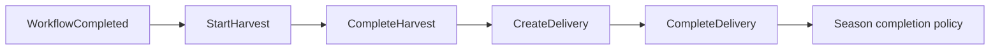

---

## 6.9 Support Module

### Business Responsibility

Manages municipal agricultural support programs, applications, approvals/rejections, and support delivery/fulfillment tracking.

### Business Boundary

**In:** programs, applications, approval workflow, fulfillment records.

**Out:** identity auth, harvest accounting (may read eligibility), general messaging threads (Communication).

### Aggregate Roots

SupportProgram; SupportApplication (recommended separate aggregate for scale).

### Entities

SupportApproval, SupportFulfillment (named SupportDelivery in DOMAIN_ANALYSIS—avoid confusion with crop Delivery; use **SupportFulfillment** in code).

### Commands

CreateSupportProgram, PublishProgram, CloseProgram, SubmitApplication, ApproveSupport, RejectSupport, RecordFulfillment.

### Queries

GetPrograms, GetApplications, GetApplicationDetail, ProducerSupportHistory (also projected to Producers).

### Events

SupportProgramCreated, SupportApplicationSubmitted, SupportApproved, SupportRejected, SupportFulfilled.

### Policies

After SupportApproved → notify producer; update producer projection; maybe unlock specific season benefits.

### Validators

Program open window; producer eligibility rules; duplicate application prevention.

### Permissions

`support.programs.manage`, `support.applications.read`, `support.approve`, `support.fulfill`.

### External Dependencies

Producers directory, Notifications, Communication, Reporting, optional Harvest eligibility reads.

### Database Ownership

Schema `support`.

### Public Interfaces

`ISupportEligibilityReadModel`.

### Future Expansion

Budget envelopes, multi-level approval, integration with municipal finance systems.

### Transaction / Concurrency

Optimistic concurrency on applications; approval is single-decision idempotent transition.

---

## 6.10 Notifications Module

### Business Responsibility

Reliable delivery of user notifications across channels (in-app, push, email, SMS) based on templates and preferences, with history for audit.

### Business Boundary

**In:** notification requests, templates, delivery attempts, read/unread state for in-app.

**Out:** deciding business policy (other modules decide *when*; Notifications decides *how to send*).

### Aggregate Roots

Notification (per user message); NotificationTemplate (reference aggregate/data).

### Entities

NotificationHistory/DeliveryAttempt, ChannelBinding.

### Commands

EnqueueNotification, MarkRead, MarkAllRead, RegisterDeviceToken, UpsertTemplate.

### Queries

GetMyNotifications, GetNotificationHistory, AdminDeliveryStats.

### Events

NotificationEnqueued, NotificationSent, NotificationFailed, NotificationRead.

### Policies

Retry failed sends via Hangfire; escalate permanent failures to Admin alerts.

### Permissions

`notifications.read_own`, `notifications.templates.manage`, `notifications.admin_view`.

### External Dependencies

Identity directory (user/channel endpoints), push provider, SMTP/SMS, SignalR for in-app realtime, Hangfire, Serilog/Seq.

### Database Ownership

Schema `notifications`.

### Public Interfaces

`INotificationPublisher` (Contracts) — primary API for all modules.

### Future Expansion

User preference center, quiet hours, localization packs, digest batching.

### Transaction / Consistency

Enqueue in outbox/transaction with publisher; sending is eventual. **Never** block producer CompleteTask on push provider latency.

### Locking

Idempotency keys per (causeEventId, userId, templateId).

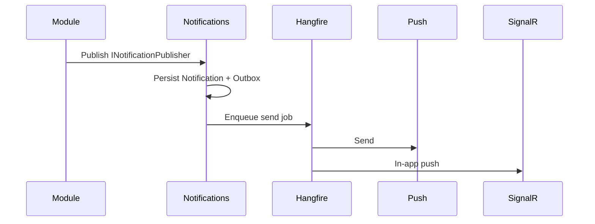

---

## 6.11 Communication (Messaging) Module

### Business Responsibility

Internal messaging between municipality officers and producers: conversations, messages, attachments—distinct from system Notifications.

### Business Boundary

**In:** conversations, messages, participants, attachment metadata, read receipts.

**Out:** notification channel delivery (may request Notifications for “you have a message”).

### Aggregate Roots

Conversation.

### Entities

Message, Attachment, ConversationParticipant.

### Commands

StartConversation, SendMessage, AddParticipant, CloseConversation, MarkConversationRead.

### Queries

GetInbox, GetConversation, SearchMessages.

### Events

ConversationStarted, MessageSent, ParticipantAdded, ConversationClosed.

### Policies

After MessageSent → notify offline participants via Notifications; SignalR to online users.

### Permissions

`communication.inbox`, `communication.send`, `communication.moderate`.

### External Dependencies

Identity/Producers directories, MinIO, Notifications, SignalR.

### Database Ownership

Schema `communication`.

### Public Interfaces

`ICommunicationDeepLink` (open thread related to Task/Inspection ids stored as correlation).

### Future Expansion

Moderation tools, broadcast channels, voice notes.

### Transaction / Concurrency

Conversation aggregate; message append with monotonic sequence; optimistic concurrency on conversation header (lastMessageAt).

---

## 6.12 Reporting Module

### Business Responsibility

Produces operational statistics, dashboards, KPIs, and exportable reports for municipal management. Reporting is a **read-side context** that projects data from integration events and approved read models.

### Business Boundary

**In:** report definitions, dashboard widgets, aggregated facts, scheduled report jobs, export artifacts metadata.

**Out:** mutating production aggregates (forbidden).

### Aggregate Roots

ReportDefinition; possibly Dashboard as entity collection under Administration settings—prefer ReportDefinition + generated ReportRun.

### Entities

ReportRun, Dashboard, StatisticsSnapshot, KPI.

### Commands

CreateReportDefinition, RunReport, ScheduleReport, PublishDashboardLayout (if owned here).

### Queries

GetDashboard, GetKpis, GetReportRun, ExportReport.

### Events

ReportRunStarted, ReportRunCompleted, SnapshotRefreshed.

### Policies

Nightly refresh via Hangfire; after SeasonCompleted refresh season KPIs.

### Permissions

`reporting.dashboards.view`, `reporting.exports.run`, `reporting.definitions.manage`.

### External Dependencies

All module integration events (subscriber), SQL projections, MinIO for export files, Seq for job telemetry.

### Database Ownership

Schema `reporting` (projected tables). **No ownership of source tables.**

### Public Interfaces

None required for write modules; optional `IReportingCatalog` for Admin UI.

### Future Expansion

OLAP warehouse extraction, Power BI connector, tenant-wide benchmarking.

### Consistency

Eventual by design. Dashboards must display “as of” timestamps.

### Performance Notes

Columnstore/indexed projections; avoid live multi-schema joins in request path for heavy KPIs.

---

## 6.13 System Administration Module

### Business Responsibility

Municipality system configuration distinct from end-user Identity: feature flags, tenant settings, lookup catalogs, maintenance windows, audit log browsers that span modules, integration endpoint configuration, and administrative diagnostics.

### Why Separate from Identity

Identity answers authentication/authorization identity questions. Administration answers “how is this municipal deployment configured and operated?” Mixing them creates a god-module and complicates SSO extraction.

### Aggregate Roots

TenantSettings; FeatureFlagSet; AuditBrowse is query-only over appended AuditEntry records (append-only store).

### Commands

UpdateTenantSettings, SetFeatureFlag, AnnounceMaintenance, RotateIntegrationSecret (careful), PurgeSoftDeleted (policy-bound).

### Queries

GetSystemHealthSummary (aggregates health checks), GetAuditTrail, GetFeatureFlags.

### Events

SettingsChanged, FeatureFlagChanged, MaintenanceAnnounced.

### Permissions

`admin.settings.manage`, `admin.audit.read`, `admin.features.manage`.

### External Dependencies

Identity (admin role), all modules’ health contributions, Serilog/Seq, Hangfire monitoring.

### Database Ownership

Schema `admin`.

### Public Interfaces

`IFeatureFlagService`, `ITenantSettings`.

### Future Expansion

Multi-tenant onboarding wizard, config-as-code exports, break-glass access workflows.

### Transaction / Concurrency

Settings optimistic concurrency; audit append-only without updates.

---

# 7. Cross-Cutting Communication Rules

## 7.1 Module Communication

**Default pattern:** Module A completes a command → persists aggregate + outbox integration event → Module B’s handler runs asynchronously (in-process bus today, broker tomorrow).

**Synchronous ACL queries** are allowed for invariant checks that must be correct before commit (e.g., `ILandDirectory.IsArchived`). These queries must be:

- Read-only
- Implemented via Contracts
- Fast (indexed by id)
- Free of business mutation

**Host orchestration** may send sequential commands in one HTTP use case only when a user-facing workflow explicitly requires synchronous multi-step UX (e.g., “Register producer and create user”). Prefer a single command in the owning module that publishes events for the rest.

## 7.2 Application Layer Rules

- Controllers/endpoints translate HTTP ↔ commands/queries only.
- Handlers load aggregates via repositories, call domain methods, save, commit.
- Policies that react to events live in Application as handlers; they issue new commands rather than mutating foreign aggregates directly.
- FluentValidation runs before handlers.
- Authorization attributes/policies run at endpoint and optionally re-checked in handler for defense in depth.

## 7.3 Infrastructure Rules

- EF Core configurations stay in module Infrastructure.
- MinIO object keys are prefixed by module (`tasks/{taskId}/...`).
- Hangfire jobs call application commands/mediatr, not repositories directly (keeps validation/authz path consistent—or use internal trusted principal).
- Serilog enrichers add `module`, `command`, `tenantId`, `userId`, `correlationId`.

## 7.4 Database Rules

- No cross-schema FKs.
- Soft delete filters via EF global query filters where applicable.
- Outbox table per module schema.
- Migrations owned per module; Host applies all at startup or via ops pipeline in deterministic order.

## 7.5 Events Rules

1. Name events in past tense ubiquitous language (`TaskCompleted`).
2. Include `OccurredOnUtc`, `EventId`, `CorrelationId`, `TenantId`, `ActorUserId`.
3. Handlers idempotent.
4. Do not put large blobs in events; put MinIO keys.
5. Version integration events; additive fields only.

## 7.6 Notifications Rules

All modules depend on `INotificationPublisher`. No module sends email/SMS directly except Notifications Infrastructure.

## 7.7 Background Jobs (Hangfire)

**Job categories**

| Category | Examples | Owner Module |
|---|---|---|
| Reminders | Task due soon | Tasks |
| Retries | Push failures | Notifications |
| Projections | KPI refresh | Reporting |
| Maintenance | Token cleanup | Identity |
| Sagas/timeouts | Inspection SLA breach | Inspections |

**Rules**

- Jobs must be idempotent and resumable.
- Dashboard restricted to Admin roles.
- Prefer enqueue from outbox relay for reliability after commit.

## 7.8 Realtime (SignalR)

**Hub ownership**

- Task board updates: Tasks module events → Host hub `TasksHub`.
- Notifications in-app: Notifications → `NotificationsHub`.
- Conversation messages: Communication → `CommunicationsHub`.

Clients authenticate via JWT; groups by `userId`, `municipalityId`, optional `seasonId`.

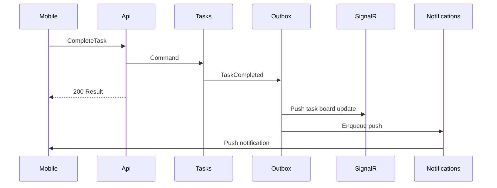

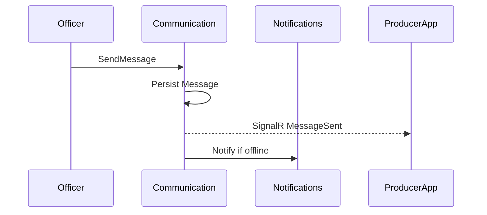

---

# 8. Security Architecture

## 8.1 Authentication (JWT / Refresh)

**Access tokens (JWT)**

- Short-lived (e.g., 15–30 minutes).
- Claims: `sub` (userId), `roles`, selected `permissions` or permission hash version, `tenantId`, `producerId` (if linked), `jti`.
- Signed with asymmetric keys in production (RSA/ECDSA); symmetric only for local dev.

**Refresh tokens**

- Opaque tokens stored hashed in Identity schema.
- Rotating refresh with family id; reuse detection revokes family.
- Bound to device/client id when mobile.

**Flows**

Login → access + refresh; Refresh → new pair; Logout → revoke; Password change → revoke all families.

## 8.2 Authorization

**Layers**

1. **Roles** — coarse (Admin, Officer, Inspector, Producer).
2. **Permissions** — fine-grained strings per module.
3. **Policies** — ASP.NET policies combining permissions + resource checks.
4. **Claims** — optional embedded permissions for performance; refresh on role change via token version claim.

**Resource-based checks**

Producer can complete only own tasks; inspector can complete assigned inspections; officers scoped by municipality/tenant.

## 8.3 Module Security

Each module documents required permissions (Section 6). Endpoints declare policies. Handlers may call `IAuthorizationService` for resource checks.

**Data isolation**

`TenantId` on aggregates; EF query filters; forbid cross-tenant ids in commands.

## 8.4 Audit Logging

- Identity login/logout/password events.
- Admin settings changes.
- Support approve/reject.
- Inspection complete/reject.
- Harvest/delivery completion.

Audit records immutable; available via Administration queries; shipped to Seq for ops.

## 8.5 Rate Limiting Considerations

- Login and refresh endpoints: strict IP+account limits to slow brute force.
- SMS/email send: per-user and global budgets in Notifications.
- Report export: concurrent run limits.
- Mobile sync burst: per-token limits.

**Reasoning:** Municipal apps face both insider misuse and opportunistic internet scanning when exposed.

## 8.6 Soft Delete, Privacy, and Evidence Integrity

- Soft delete for producers/lands where history matters; hard delete only under admin legal policy.
- Completed inspections/harvests are immutable; corrections via compensating records, not silent edits.
- MinIO objects use private buckets; access via short-lived URLs issued after authz.

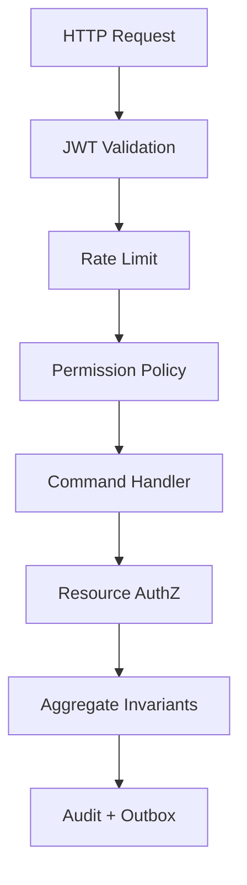

---

# 9. Performance Architecture

## 9.1 Caching (Future)

Candidate caches:

- Permission matrix / feature flags (memory + invalidation on change events).
- Producer/Land summary ACL responses (short TTL).
- Reporting snapshots (already persisted).

Avoid caching mutable aggregates as source of truth.

## 9.2 Read Models

Event-projected tables for:

- Today’s Tasks
- Season Timeline
- Permission Matrix
- Producer History summaries
- KPI dashboards

Write path remains normalized aggregates.

## 9.3 Pagination

All list endpoints paged; cursor pagination for mobile high-churn feeds (messages, notifications); offset pagination acceptable for admin grids with stable sorts.

## 9.4 Indexes (Representative)

| Schema | Index intent |
|---|---|
| tasks | (AssigneeId, Status, DueDate), (SeasonId, Status), (ProductionWorkflowId, StepId) |
| inspections | (SeasonId, Status), (InspectorId, Status) |
| seasons | unique filtered (LandId) where Active |
| producers | unique IdentityNumber |
| notifications | (UserId, CreatedAt desc), (IdempotencyKey) unique |
| harvest/delivery | (SeasonId), (HarvestId) |

## 9.5 Lazy vs Eager Loading

- Commands: load aggregate graph explicitly required for invariants; no lazy IO in domain.
- Queries: dedicated projections; no lazy-loading bombs in APIs (`UseLazyLoadingProxies` discouraged).

## 9.6 CQRS Optimization

- Split DbContext read configurations if needed (no-tracking queries default for queries).
- Heavy reports never run inside API request threads—Hangfire + download link.

## 9.7 Database Performance

- Parameter sniffing awareness for seasonal spikes.
- Timeout budgets; circuit breakers on external push/SMS.
- Connection resiliency in EF.
- Archive completed seasons’ hot data carefully (Reporting keeps aggregates).

**Operational implication:** Season start (mass task generation) must batch inserts and use bulk patterns; avoid N+1 handler fan-out without batching.

---

# 10. Scalability & Microservice Extraction Roadmap

## 10.1 Independence, Cohesion, Coupling

| Module | Cohesion | Coupling | Extraction readiness |
|---|---|---|---|
| Notifications | High | Low inbound mutation | **First** |
| Communication | High | Low | Early |
| Reporting | High | Read-only inbound | Early (as analytics service) |
| Identity | High | Broad read of directory | Careful; often shared platform |
| Tasks | High | Coupled to Workflows | With Workflows or after events mature |
| Workflows | High | Coupled to Tasks/Inspections | Mid |
| Inspections | High | Gated with Workflows | Mid |
| Harvest (+Delivery) | High | Season/Workflow gates | Mid |
| Producers/Lands/Seasons | High together | Core registry | Later as “registry” set |
| Support | Medium | Producers | Mid |
| Administration | Medium | Cross-cutting | Later / remains with Host |

## 10.2 Suggested Extraction Order

1. **Notifications** — clear async boundary, already outbox-driven.
2. **Communication** — realtime scale characteristics differ.
3. **Reporting** — warehouse/OLAP style scaling.
4. **Identity** — only if municipal SSO platform mandates; otherwise keep.
5. **Harvest/Delivery** — if logistics scale independently.
6. **Workflows+Tasks+Inspections** — extract as a “production engine” set together to avoid chatty network sagas.

## 10.3 What Changes on Extraction

| Concern | Modular Monolith | After Extraction |
|---|---|---|
| DB | Schema in shared server | Dedicated database |
| Events | In-process + outbox | Broker (RabbitMQ/Kafka/Azure Service Bus) |
| Contracts | Project references | NuGet contract packages / schema registry |
| Auth | Same JWT | JWT + service-to-service auth |
| Transactions | Optional multi-aggregate in-module | Saga/process manager only |
| Observability | Single Seq stream | Distributed tracing mandatory |

## 10.4 Prerequisites Before Any Extraction

- Architecture tests green on dependency rules.
- Integration events versioned and cataloged.
- Outbox relay proven under failure injection.
- SLA dashboards for consumer lag.
- Contract tests between publisher and consumer.

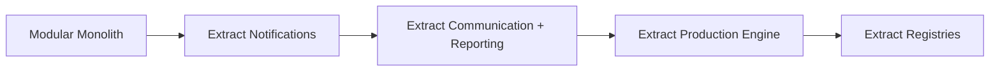

---

# 11. Governance

## 11.1 How New Features Must Be Defined

Every non-trivial feature proposal must specify:

1. **Command(s)** — intent, actor, preconditions, payload.
2. **Aggregate(s)** touched — invariants impacted.
3. **Domain/Integration Event(s)** — consumers.
4. **Policy(ies)** — automated reactions.
5. **Read Model / Query** changes — UI needs.
6. **Permissions** — who may execute.
7. **Failure modes** — retries, idempotency, user-visible errors.
8. **Module ownership** — single owning module; ACLs listed.

If a feature needs multiple write owners in one user action, design an explicit process (event choreography or application saga), not a hidden cross-module DbContext.

## 11.2 Pull Request Checklist (Architecture)

- [ ] No project reference from Module A Application/Domain to Module B Domain/Infrastructure.
- [ ] Cross-module interaction via Contracts/events only.
- [ ] New tables in owning module schema only; no cross-schema FK.
- [ ] Commands return Result; queries are side-effect free.
- [ ] FluentValidation added for new commands.
- [ ] Permissions documented and enforced.
- [ ] Integration events include version + idempotency story.
- [ ] Soft delete/immutability rules respected.
- [ ] Hangfire jobs call application layer.
- [ ] Logging includes correlation id; no secrets logged.
- [ ] Tests: unit for invariants; integration for persistence; architecture test updated if new module.
- [ ] Docs: EVENT_STORMING / AGGREGATE_DESIGN / this MODULE_DESIGN updated when boundaries change.

## 11.3 ADR Policy

Architecture Decision Records are required for:

- New module or module merge/split
- Shared Kernel additions beyond trivial helpers
- Changing event transport
- Introducing cross-schema joins/views outside Reporting
- AuthN/AuthZ major changes
- Multi-tenant strategy changes
- Extracting a microservice

ADR template must include context, decision, status, consequences, and rejected alternatives.

## 11.4 Ubiquitous Language Governance

Terms in DOMAIN_ANALYSIS are binding. Code names may use technical prefixes (`ProductionTask`) but public API and events should prefer ubiquitous language (`TaskCompleted`).

---

# 12. Appendices

## 12.1 Glossary (Ubiquitous Language)

| Term | Meaning |
|---|---|
| Producer | Agricultural producer participating in municipal programs |
| Land | Agricultural parcel tracked by municipality |
| Season | Time-bounded production cycle on a land |
| Workflow | Ordered production process definition/instance |
| Workflow Step | Sequenced unit inside a workflow |
| Task | Concrete assignable work item, usually from a step |
| Inspection | Field verification that may block progression |
| Harvest | Recording of harvested production |
| Delivery | Transfer/logistics record of harvested product |
| Support | Municipal aid program and applications |
| Notification | System-generated alert to a user channel |
| Conversation | Human messaging thread |
| Report | Generated analytical artifact or dashboard KPI set |
| Officer | Municipal staff user |
| Inspector | Officer role focused on inspections |
| Gate | Condition that blocks workflow advancement |
| Outbox | Durable table for reliable event publication |
| ACL | Anti-corruption / published read interface between modules |
| Tenant | Municipality deployment isolation key |

## 12.2 Dependency Matrix (Summary)

See Section 4.2 for the full module-to-module matrix. Additional technical dependencies:

| Project | May depend on |
|---|---|
| *.Domain | SharedKernel |
| *.Application | Domain, Application.Abstractions, own/other Contracts |
| *.Infrastructure | Application, Domain, BuildingBlocks.Infrastructure, EF, Hangfire, MinIO clients |
| *.Contracts | SharedKernel (minimal) |
| Host | All module Infrastructure DI entrypoints |

## 12.3 Event Catalog Summary (from EVENT_STORMING)

This summary maps Event Storming domains to owning modules. Full narrative remains in EVENT_STORMING.md.

| Module | Representative Domain Events |
|---|---|
| Identity | UserRegistered, UserUpdated, UserDeactivated, RoleAssigned, RoleRemoved, UserLoggedIn, UserLoggedOut, PasswordChanged, RefreshTokenCreated, RefreshTokenRevoked |
| Producers | ProducerRegistered, ProducerUpdated, ProducerAssignedLand, ProducerAssignedSeason, ProducerDeactivated, SupportApproved/Rejected (if emitted here historically—prefer Support module ownership of approval events) |
| Lands | LandRegistered, LandUpdated, LandArchived, ProducerAssigned, SeasonAssigned |
| Seasons | SeasonCreated, SeasonStarted, SeasonPaused, SeasonCompleted, SeasonArchived, WorkflowAssigned |
| Workflows | WorkflowCreated, WorkflowPublished, WorkflowAssigned, WorkflowStarted, WorkflowStepCompleted, WorkflowCompleted, WorkflowCancelled |
| Tasks | TaskCreated, TaskAssigned, TaskStarted, TaskCompleted, TaskDelayed, TaskCancelled, PhotoUploaded, CommentAdded, ReminderSent |
| Inspections | InspectionCreated, InspectionAssigned, InspectionStarted, InspectionCompleted, InspectionRejected |
| Harvest | HarvestStarted, HarvestCompleted, HarvestCancelled, DeliveryCreated, DeliveryCompleted, DeliveryCancelled |
| Support | SupportProgramCreated, SupportApplicationSubmitted, SupportApproved, SupportRejected, SupportFulfilled |
| Notifications | NotificationEnqueued, NotificationSent, NotificationFailed, NotificationRead |
| Communication | ConversationStarted, MessageSent, ConversationClosed |
| Reporting | ReportRunCompleted, SnapshotRefreshed |
| Administration | SettingsChanged, FeatureFlagChanged, MaintenanceAnnounced |

**Critical policy chains (operational)**

1. SeasonStarted → Workflow started → first Tasks → Notifications.
2. TaskCompleted → next Task or Inspection gate → WorkflowCompleted → HarvestStarted.
3. TaskOverdue → Notifications + optional InspectionCreated.
4. InspectionRejected → remediation Task + gate remains closed.
5. HarvestCompleted → Delivery → Reporting projections → SeasonCompleted eligibility.

## 12.4 Aggregate Map Summary (from AGGREGATE_DESIGN)

| Aggregate Root | Owning Module | Transaction Boundary |
|---|---|---|
| User | Identity | User + tokens/history |
| Producer | Producers | Producer + assignments/docs |
| Land | Lands | Land + coordinates/docs/ownership |
| Season | Seasons | Season + calendar/config/link |
| Workflow (Definition/Runtime) | Workflows | Definition version or runtime instance |
| Task | Tasks | Task + evidence/reminders |
| Inspection | Inspections | Inspection + findings/evidence |
| Harvest | Harvest module | Harvest + products/measurements |
| Delivery | Harvest module | Delivery + documents/invoice/receipt |
| SupportProgram / SupportApplication | Support | Program or application aggregate |
| Notification | Notifications | Notification + attempts |
| Conversation | Communication | Conversation + messages |
| ReportDefinition / ReportRun | Reporting | Definition or run |
| TenantSettings / FeatureFlagSet | Administration | Settings aggregates |

**Aggregate communication reminder:** aggregates never reference each other by object graph across modules; Application + Events + Repositories mediate; only root ids are stored.

## 12.5 Consistency Patterns Used in This System

| Pattern | Where applied |
|---|---|
| Strong consistency inside aggregate | All write commands |
| Optimistic concurrency | All hot aggregates |
| Transactional outbox | Cross-module reactions |
| Idempotent consumers | All integration handlers |
| Gate queries for safety | Inspections blocking harvest/workflow |
| Eventual projections | Reporting, producer histories, dashboards |
| Snapshotting gate metadata | Task stores step requirements at creation |

## 12.6 Multi-Tenant Municipal Reuse Notes

- Every root table carries `TenantId` (municipality).
- JWT carries tenant; repositories enforce filter.
- Shared Kernel does not encode tenant business rules; modules do.
- File object keys include tenant segment.
- Reporting must never leak cross-tenant aggregates.
- Future: dedicated DB per large tenant without changing module contracts if schemas/contracts remain stable.

## 12.7 Failure Modes Catalog (Selected)

| Scenario | Detection | Mitigation |
|---|---|---|
| Duplicate TaskCompleted delivery | Idempotency key / version check | Ignore second advance |
| Push provider down | Hangfire retry / failed status | In-app notification still stored |
| Producer deactivated mid-season | Policy on UserDeactivated/ProducerDeactivated | Cancel open tasks or reassign per municipal rule |
| Inspection never completed | SLA job | Escalate to Admin + block season complete |
| Delivery quantity race | Concurrency token on Harvest delivered amount | Retry command |
| Partial season start task generation | Batch job checkpoint | Resume generation idempotently |
| Refresh token reuse | Family reuse detection | Revoke family + alert |

## 12.8 Mapping to Current Scaffold vs Target

| Area | Current scaffold | Target (this document) |
|---|---|---|
| Modules present | Identity, Producers, Lands, Seasons, Workflows, Tasks, Inspections, Harvest, Support, Notifications | + Communication, Reporting, Administration |
| Contracts projects | Generally absent | Required for cross-module APIs |
| Delivery | Domain concept; not separate folder | Inside Harvest module with own aggregate/schema |
| SharedKernel | Entity, AggregateRoot, AuditableEntity, Result, IDomainEvent | Expand carefully per Section 3; no domain dump |
| DB | Early shared tendencies possible in MVP | Schema-per-module mandatory for target |
| Events | Domain events emerging | Outbox + integration event catalog mandatory |

Engineers implementing MVP may ship a subset of modules/features, but **must not violate dependency rules** that would block the target.

## 12.9 Document Maintenance

- Version bumps: minor for additive module details; major for boundary changes.
- Status moves Draft → Review → Accepted via Architecture Board.
- Accepted MODULE_DESIGN changes require linked ADR when breaking.

---

## 12.10 Operational Runbooks Implications for Module Design

Although this is not an operations manual, module boundaries create concrete operational duties:

**Identity**
- Key rotation runbooks must invalidate or dual-sign JWTs without downtime.
- Refresh token cleanup Hangfire job must be monitored; table growth otherwise degrades login.
- Deactivation must be tested against open Tasks/Inspections to ensure policies freeze work correctly.

**Producers / Lands / Seasons**
- Bulk onboarding (CSV import) must use module commands in batches with idempotent identity numbers and parcel numbers—never raw SQL inserts that bypass invariants.
- Archiving a land while an active season exists must be rejected at ACL boundary; ops cannot “fix” via DB update.

**Workflows / Tasks / Inspections**
- Mass task generation at season start is the highest write spike. Module design requires batching and idempotent step-task keys so retries are safe.
- Inspection gating must be queryable even if event handlers lag; operations can re-drive outbox without corrupting state.
- SignalR fan-out during peak field hours should degrade gracefully to notifications-only if hub backpressure rises.

**Harvest / Delivery**
- Quantity disputes require compensating deliveries or adjustment records, not silent updates to completed harvests.
- End-of-season close depends on DeliveryCompleted projections; Reporting “as of” timestamps help officers understand lag.

**Notifications / Communication**
- Provider outages must not roll back domain transactions; outbox + Hangfire isolate third-party failure.
- Quiet hours and rate limits are Notifications concerns; other modules must not reimplement SMS sending.

**Reporting / Administration**
- Long exports belong in background jobs with MinIO artifacts.
- Feature flags allow gradual rollout of workflow template changes without redeploying every client.

These operational implications reinforce why the modular monolith keeps a single deployable unit today while forcing schema and contract discipline as if services already existed.

## 12.11 Edge Cases Across Module Boundaries

### Sequential workflow skip attempt
If a client attempts to complete a future step’s task that was incorrectly created, Tasks validation must reject based on snapshot gate + Workflows ACL. Root cause fixes belong in Workflows task generation, not in permissive task completion.

### Inspection blocking during harvest start
Harvest.StartHarvest must call `IInspectionGate` and `IWorkflowRuntimeGateway` eligibility. Relying only on “WorkflowCompleted event was seen” is insufficient under lag or replay.

### Producer participates in two seasons on same land
Producer assignment invariants and Season unique active-land index form a double barrier. Both remain: defense in depth across modules without cross-schema FK.

### Support approval referencing inactive producer
Support approve command checks Producers directory `IsActive`. If producer deactivates after submission, approval fails closed unless Administration defines an override permission with audit.

### Mobile offline completion
Tasks completion from React Native offline queue must carry client-generated idempotency keys. Module design assumes duplicate posts; CompleteTask is safe to retry.

### Multi-tenant mistaken id
All ACL directory lookups are tenant-scoped. A GUID from tenant A must not resolve in tenant B even if somehow leaked—directories return not found.

### Soft delete vs legal hold
Administration legal hold flags can prevent soft-delete purge jobs from physically removing producer documents in MinIO. Modules check `ILegalHoldService` before purge.

### Delivery exceeds harvest due to concurrent requests
Two officers create deliveries concurrently. Harvest aggregate concurrency token causes one transaction to fail; UI retries with refreshed remaining quantity. This is preferred over pessimistic locking for municipal concurrency levels.

### Notification storms
Task reminder jobs must debounce (one reminder per task per day window). Notifications idempotency keys include calendar day component.

### Reporting disagreement with operational screens
When dashboards disagree with Tasks list, trust the operational module query for action; Reporting shows last snapshot time. Do not “fix” by joining live schemas in Reporting request path—repair the projector.

## 12.12 Non-Functional Requirements Traceability (Selected)

| NFR theme | Module design response |
|---|---|
| Traceability of production | Events + audit fields + immutable completed inspections/harvests |
| Real-time visibility | SignalR hubs + notification push + season/task read models |
| Security | JWT/refresh, permissions per module, tenant filters, rate limits |
| Reliability | Outbox, idempotent handlers, Hangfire retries |
| Maintainability | Clean Architecture per module, architecture tests, ADR governance |
| Scalability path | Schema-per-module, contracts, extraction roadmap |
| Auditability | Identity login audit, Admin audit browser, support/inspection decisions |
| Usability for producers | Mobile-friendly task/query models; offline idempotency |
| Municipal reuse | TenantId everywhere; settings in Administration |

## 12.13 Example End-to-End Season Lifecycle Against Module Boundaries

1. **Admin (Identity/Admin)** provisions officer users and permissions.
2. **Officer (Producers)** registers producer → Identity mobile user policy → Notifications welcome.
3. **Officer (Lands)** registers parcel → Lands ACL becomes available to Seasons.
4. **Officer (Seasons)** creates season on land → assigns workflow definition id.
5. **Officer (Seasons)** starts season → Workflows starts production runtime → Tasks generated → Notifications/SignalR.
6. **Producer (Tasks)** completes tasks with photos in MinIO → Workflows advances → optional Inspections.
7. **Inspector (Inspections)** passes gate → Workflows completes → Harvest eligibility opens.
8. **Officer/Producer (Harvest)** records harvest → creates deliveries under quantity rules.
9. **Support** may approve benefits based on projections.
10. **Reporting** shows KPIs eventually; **Administration** audits critical decisions.

At every step, write ownership stays inside one module’s aggregate transaction; cross-module effects travel through contracts and events.

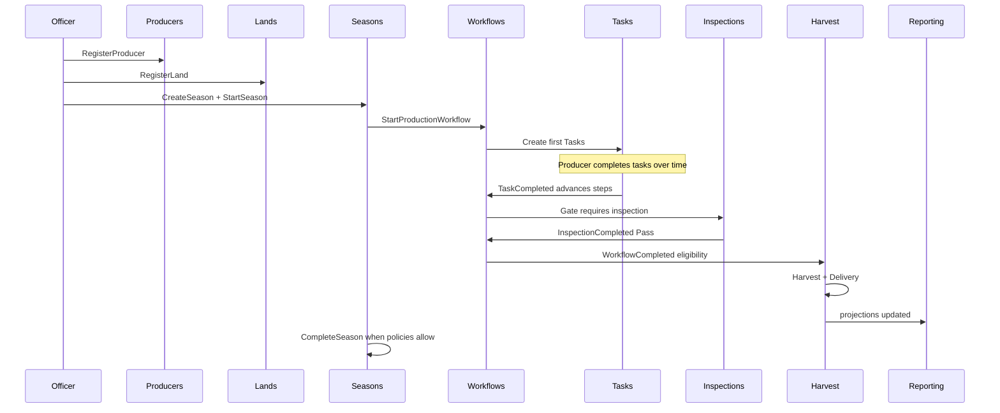

## 12.14 Design Principles Checklist (Quick Reference)

1. One business capability → one module.
2. One aggregate → one transaction.
3. One schema owner → one migration owner.
4. Cross-module → contracts/events, never DbContext sharing.
5. Shared Kernel stays technical and tiny.
6. CQRS keeps dashboards from weakening invariants.
7. Outbox over dual-write side effects.
8. Idempotency everywhere asynchronous.
9. Immutability after completion for legal evidence.
10. Extract services only after boundaries prove stable.

---

## Closing Statement

The Agriculture Management System is a workflow-driven municipal platform. Its architecture prioritizes **correct sequential production invariants**, **clear bounded contexts**, and a **modular monolith** that can evolve into services without rewriting the domain. Clean Architecture, CQRS, MediatR, schema-per-module ownership, and explicit integration events are not ceremonial patterns—they are the operational controls that keep Producers, Lands, Seasons, Workflows, Tasks, Inspections, Harvest/Delivery, Support, Notifications, Communication, Reporting, and Administration coherent as the product grows.

This document is the authoritative Bounded Context & Module Design for planning, implementation governance, and future extraction.

---

**End of Document — Version 1.0 (Draft)**

