# Physical Architecture Specification

# Agriculture Management System

| Attribute | Value |
|---|---|
| **Document Title** | Physical Architecture Specification |
| **Version** | 1.0 |
| **Status** | Draft |
| **Effective Date** | 2026-07-17 |
| **Audience** | Software architects, tech leads, senior engineers, DevOps/SRE, municipal IT operators, security officers, QA leads, Architecture Board members, infrastructure partners |
| **Document Ownership** | Architecture Board / Municipality Digital Transformation Engineering |
| **Related Stack** | ASP.NET Core, EF Core, SQL Server, React, React Native, Clean Architecture, Modular Monolith, CQRS, MediatR, Hangfire, SignalR, JWT, FluentValidation, MinIO, Serilog, Seq, FCM |
| **Authoritative Scope** | Runtime topology, process/host mapping, network, storage, deployment, operations, failure recovery, and disaster recovery for the Agriculture Management System |

---

## Document Purpose

This document is the **authoritative Physical Architecture Specification** for the Agriculture Management System. It translates the approved logical and modular design—documented in PRODUCT_VISION, SRS, PRD, DOMAIN_ANALYSIS, AGGREGATE_DESIGN, EVENT_STORMING, MODULE_DESIGN, and ADR—into concrete runtime processes, hosts, containers, networks, storage volumes, communication paths, security controls, operational procedures, and recovery targets.

Where MODULE_DESIGN answers *how modules are organized in code* and ADR answers *why technologies were chosen*, this specification answers *where those technologies run, how they connect, how they fail, how they are deployed, and how municipal operators keep the system available through planting, inspection, harvest, and archival seasons*.

Physical architecture for this product is not an abstract cloud pattern catalog. It is the binding operational contract between engineering and municipal IT for a **workflow-driven modular monolith** that must remain correct under sequential production rules while remaining operable by a small operations team.

---

## Relationship to Approved Product and Architecture Documents

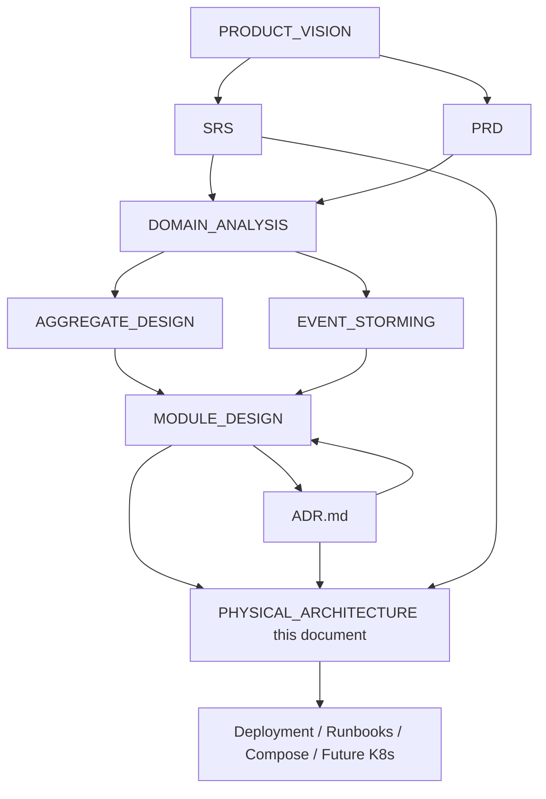

| Document | Responsibility | Relationship to Physical Architecture |
|---|---|---|
| PRODUCT_VISION | Why the product exists; municipal digital transformation goals | Supplies operational context (field producers, officers, inspectors) that drives latency, offline push, and availability expectations |
| SRS | Formal functional and non-functional requirements | Physical design must satisfy NFR commitments: HTTPS, JWT, audit logs, rate limiting, Serilog/Seq, Hangfire, SignalR, MinIO, 99.9% availability target, average API response under 300 ms |
| PRD | Product behavior and journeys | Physical paths must enable login, task completion, photo upload, inspection, harvest/delivery, and notification journeys without inventing new business rules |
| DOMAIN_ANALYSIS | Ubiquitous language and domains | Physical components host domains; naming of buckets, schemas, queues, and hubs follows domain language |
| AGGREGATE_DESIGN | Aggregates, invariants, transaction boundaries | Physical transaction and storage design must preserve aggregate consistency; binaries out of SQL; optimistic concurrency in DB |
| EVENT_STORMING | Commands, events, policies, read models | Physical async paths (Hangfire, outbox, FCM, SignalR) implement policies |
| MODULE_DESIGN | Bounded contexts, folders, contracts, ops | Maps modules onto the single `Agriculture.Api` process; schema-per-module; extraction roadmap constraints |
| ADR.md | Why technologies and patterns were chosen | Binding decisions ADR-001 through ADR-020; this document must not contradict Accepted ADRs |
| **PHYSICAL_ARCHITECTURE (this)** | Where and how the system runs | Authoritative for deployment topology, network, storage, jobs, auth/upload/notification physical flows, DR |

**Governance rule:** If this document appears to conflict with an Accepted ADR, the ADR prevails until Architecture Board issues an erratum or a superseding ADR. If this document conflicts with MODULE_DESIGN module boundaries, MODULE_DESIGN prevails for ownership; physical layout must be adjusted, not module ownership diluted.

**Reading order for new engineers and operators:** PRODUCT_VISION → SRS/PRD → DOMAIN_ANALYSIS → AGGREGATE_DESIGN → EVENT_STORMING → MODULE_DESIGN → ADR → **this Physical Architecture Specification** → environment-specific runbooks.

---

## How to Use This Document for Deployment and Operations

1. **Architects** use Sections 1–4 to validate that proposed hosting changes preserve modular monolith integrity and Clean Architecture layer mapping.
2. **DevOps/SRE** use Sections 5–8, 13–14, and 18–19 as the baseline for Compose/Kubernetes manifests, port matrices, backup jobs, health probes, and secret injection.
3. **Security officers** use Sections 6, 9–12 as the control set for HTTPS termination, JWT lifecycle, object storage isolation, CORS, rate limiting, and audit log retention.
4. **Module owners** use Sections 3–4, 8, 10–11 to understand which process owns Hangfire queues, MinIO prefixes, SignalR hubs, and FCM adapters for their bounded context.
5. **Municipal IT** use Sections 16–18 for capacity planning, failure drills, and RTO/RPO commitments during season peaks.
6. **QA** use sequence diagrams in Sections 4, 9–11 as physical test scenarios for login, refresh, upload, notification, and degradation modes.

This document is **not** a tutorial, blog post, or marketing architecture overview. It is an enterprise specification. Normative language (“must,” “must not,” “shall”) indicates binding physical requirements unless marked as Future or Guidance.

---

# 1. Physical Architecture Intent

## 1.1 What “Physical Architecture” Means for This Project

In this specification, **physical architecture** means the concrete arrangement of:

| Concern | Meaning in Agriculture Management System |
|---|---|
| **Runtime** | Managed runtimes and libraries executing inside processes (ASP.NET Core Kestrel, Hangfire server, SignalR connection manager, EF Core contexts, Serilog sinks) |
| **Process** | OS-level process boundaries—primarily one `Agriculture.Api` modular monolith process composing all modules, plus separate processes for SQL Server, MinIO, Seq, reverse proxy, and optional Redis in the future |
| **Host** | Virtual machines, bare metal municipal servers, or container hosts that run those processes |
| **Network** | Trust boundaries, reverse proxy TLS termination, internal service networks, firewall rules, port exposure, egress to FCM |
| **Storage** | SQL Server data/log files, MinIO object volumes, Seq retention volumes, temporary upload scratch, backup media |
| **Deploy** | Docker images, Compose services, future Kubernetes Deployments/Services/Ingress, CI/CD artifact promotion, migration apply gates |

Physical architecture deliberately **does not** redefine domain aggregates, permission matrices, or workflow sequencing. Those remain owned by AGGREGATE_DESIGN, MODULE_DESIGN, and ADR. Physical architecture implements them with hosts, wires, disks, and operational procedures.

### Distinguishing Logical, Modular, and Physical Views

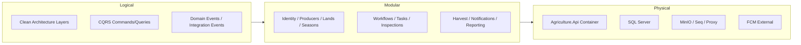

- **Logical view:** layers and request pipelines (ADR-002, ADR-003, ADR-004).
- **Modular view:** bounded contexts and contracts (MODULE_DESIGN, ADR-017).
- **Physical view:** processes, ports, volumes, and failure domains (this document, ADR-020).

A common municipal failure mode is treating physical separation (separate containers) as proof of modularity. The converse is also false: a single process can host well-isolated modules. ADR-001 requires modular isolation in code first; physical extraction of microservices is gated and future-facing.

## 1.2 Alignment with Modular Monolith (ADR-001) and Future Kubernetes/Microservices

### Near-term binding topology

The Approved near-term topology is a **single deployable ASP.NET Core host** (`Agriculture.Api`) composing all modules at startup. Each module registers DI, MediatR handlers, EF configurations (schema-per-module), Hangfire jobs, and optional SignalR hubs. Inter-module collaboration uses application-layer contracts and domain/integration events—not shared DbContexts or cross-schema foreign keys.

Physical implications of ADR-001:

1. **One primary application process** for all business modules reduces municipal ops surface: one JWT validation path, one Serilog→Seq correlation chain, one health endpoint surface, one release artifact.
2. **Separate data-plane processes** (SQL Server, MinIO, Seq) remain outside the application process because they have different scaling, backup, and security characteristics.
3. **External SaaS egress** (FCM) is treated as an untrusted but necessary notification gateway with circuit breaking and Hangfire retries.
4. **Clients** (React SPA, React Native) are not modules inside the monolith; they are separate deployables consuming HTTPS APIs and SignalR.

### Future Kubernetes without contradicting ADR-001

Kubernetes may host the **same modular monolith image** behind Ingress before any microservice extraction. Physical evolution path:

| Stage | Physical shape | Condition to enter |
|---|---|---|
| Stage 0 — Dev laptop | `docker compose` with API + SQL + MinIO + Seq | Default for feature work |
| Stage 1 — Single server / Compose prod | Reverse proxy + API container + SQL + MinIO + Seq | First municipal production |
| Stage 2 — HA Compose / simple orchestrator | API replicas only after Redis backplane + Hangfire multi-server validation | Measured need for HA |
| Stage 3 — Kubernetes | Same containers as Deployments; Ingress TLS; PVCs for MinIO/Seq; managed SQL optional | Multi-municipality or ops maturity |
| Stage 4 — Selective microservices | Extract Notifications/Reporting per ADR-001 gates | Extraction checklist complete |

This document **must not** prescribe day-one service mesh, per-module Deployments, or mandatory API gateway for internal module calls. Those are explicitly rejected near-term complexity in ADR-001 clarifications.

### Extraction readiness and physical seams

When a module is extracted later, physical seams already present in this design become the cut points:

- MinIO bucket prefixes / credentials scoped per module adapter
- Hangfire queues named by module or policy family
- SignalR hubs owned by module and routable later via a Notifications host
- Outbox tables per module schema becoming message-bus publishers
- Seq property enrichment (`Module`, `BoundedContext`) surviving as distributed trace baggage

## 1.3 Anti-Goals of Physical Architecture

This physical design explicitly rejects the following:

1. **Not a day-one microservices platform.** No mandatory service mesh, no mandatory per-module database server process, no mandatory event-bus product for in-process policies.
2. **Not an IIS-only snowflake.** Manual Windows-only deployment without container parity is rejected as the primary strategy (ADR-020), though Windows hosts may still run containers or reverse proxies.
3. **Not serverless-only.** Municipal on-prem mandates require a coherent on-prem story; cloud PaaS is optional, not exclusive.
4. **Not a shared filesystem for binaries.** Photos and documents must not live on the API container local disk as the system of record (ADR-010).
5. **Not SQL BLOBs for producer/inspection evidence.** Binary objects belong in MinIO; SQL stores keys and metadata (ADR-005/010).
6. **Not SignalR as offline mobile push.** FCM is mandatory for backgrounded React Native clients (ADR-008/009).
7. **Not Redis mandatory on day one.** Memory cache now; Redis when multi-instance or SignalR backplane is required (ADR-015).
8. **Not public MinIO buckets.** Object storage must remain private; access via authenticated API mediation or short-lived presigned URLs.
9. **Not secrets in images or source control.** Configuration via environment variables and secret mounts (ADR-020).
10. **Not treating physical HA as a substitute for workflow correctness.** Availability without invariant preservation is a failed municipal system.

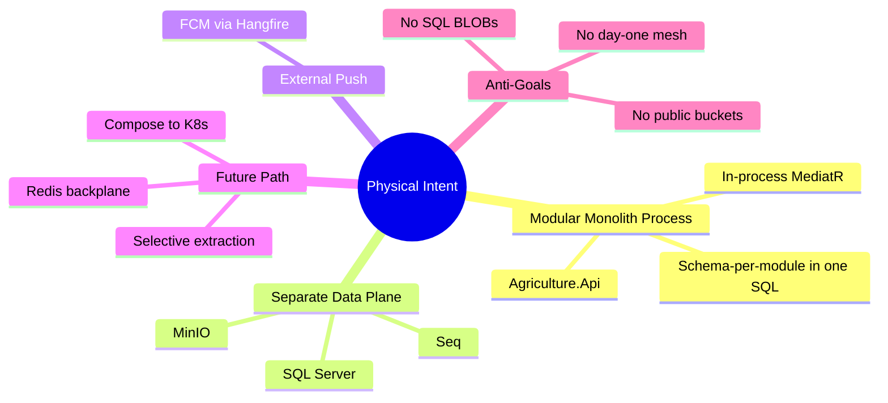

## 1.4 Municipal Operational Scenarios Driving Physical Intent

Physical architecture is validated against recurring municipal scenarios:

**Scenario A — Peak planting week.** Hundreds of tasks created from workflow templates; officers monitor dashboards via SignalR; producers receive FCM assignments; API CPU and SQL write load spike. Physical design must keep command transactions short, Hangfire off the request thread for FCM, and dashboards on CQRS queries with `AsNoTracking`.

**Scenario B — Field photo evidence upload over weak cellular.** React Native uploads inspection or task photos. Physical design must validate content-type/size at API, store objects in MinIO, persist metadata in SQL transactionally with outbox for notifications, and tolerate partial failure with reconciliation jobs.

**Scenario C — Nightly reminder sweep.** Hangfire recurring job finds delayed tasks, enqueues notification commands, retries FCM failures, and logs to Seq. Physical design must isolate job failures from API liveness and provide dashboard visibility for municipal IT.

**Scenario D — Lost inspector phone.** Identity revokes refresh tokens; access JWT expires quickly; SignalR reconnect fails; FCM device token removed. Physical auth model must support immediate session invalidation without restarting the API process.

**Scenario E — Database host patch failure.** Restore SQL from backup; MinIO remains independently available; outbox and aggregates stay consistent because they share transactions. Physical DR must back up SQL and MinIO as a paired concern with defined RPO/RTO.

## 1.5 Quality Attributes Prioritized Physically

| Quality attribute | Physical expression | Primary references |
|---|---|---|
| Correctness | Single process transactions + outbox for side effects | ADR-001, AGGREGATE_DESIGN |
| Availability | Health checks, reverse proxy, retries, graceful degradation | SRS 99.9%, ADR-020 |
| Security | HTTPS, JWT, private networks, secrets, audit | ADR-013/014/020, SRS |
| Performance | Pooling, pagination, compression, CQRS, no BLOB in SQL | SRS <300 ms avg, ADR-003/015 |
| Operability | Compose parity, Seq search, Hangfire dashboard, runbooks | ADR-007/011/012/020 |
| Evolutability | Container seams, module ports, Redis/K8s readiness | ADR-001/015/020 |

---

# 2. Logical-to-Physical Mapping

## 2.1 Mapping Principle

Clean Architecture layers are **logical**. They do not each become a container. In the modular monolith, Domain, Application, and most Infrastructure adapter code execute **inside the same `Agriculture.Api` process**. Physical separation occurs where failure domains, scaling characteristics, or security trust boundaries differ.

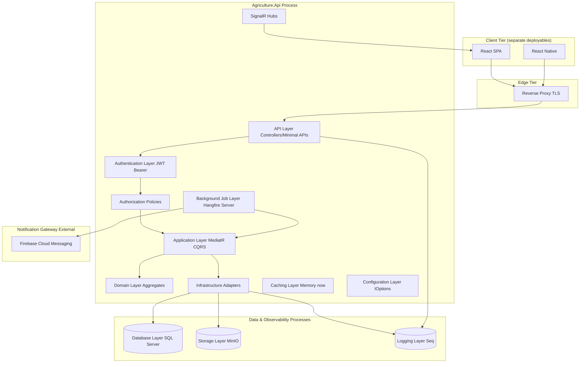

## 2.2 Layer Catalog — Logical Responsibility to Physical Location

### API Layer

**Logical responsibility:** HTTP/HTTPS transport, request deserialization, Problem Details mapping, endpoint metadata for authorization, correlation ID middleware, rate limiting middleware.

**Physical location:** Inside `Agriculture.Api` process, Kestrel listening on an internal port (commonly `8080` in containers), published only through reverse proxy on `443`.

**Must not:** contain domain invariants, open EF transactions directly, call MinIO without Application orchestration, or embed FCM SDK calls in controllers.

**Failure modes:** Kestrel thread starvation under unbounded uploads; reverse proxy misrouting; missing forwarded headers breaking HTTPS redirect and client IP rate limits.

### Application Layer

**Logical responsibility:** Commands, queries, handlers, FluentValidation validators, policies, orchestration across contracts, unit-of-work coordination, domain event dispatch after commit.

**Physical location:** Same process as API; invoked via MediatR from controllers, Hangfire jobs, and sometimes SignalR hub methods (hubs should prefer sending commands rather than mutating aggregates).

**Reasoning:** Keeping Application in-process with Domain preserves transactional honesty for sequential workflows (task completion advancing workflow steps) without distributed sagas on day one.

### Domain Layer

**Logical responsibility:** Aggregates, entities, value objects, domain events, domain services, repository ports.

**Physical location:** Same process; **no network identity**; never deployed alone.

**Reasoning:** Domain is a library boundary, not a host. Physical extraction later moves Domain assemblies with Application into a new service host only after ADR-001 gates pass.

### Infrastructure Layer

**Logical responsibility:** EF Core DbContexts/repositories, MinIO client adapters, FCM gateway, email/SMS adapters, Hangfire job registrations, outbox processors, Serilog enrichers tied to infrastructure.

**Physical location:** Assemblies loaded into `Agriculture.Api`; outbound TCP to SQL, MinIO, Seq, and FCM endpoints.

**Failure modes:** Socket exhaustion to SQL; MinIO credential rotation without recycle; synchronous FCM on request thread (forbidden—use Hangfire).

### Database Layer

**Logical responsibility:** System of record for module schemas, Hangfire storage, outbox tables, refresh token persistence, audit columns.

**Physical location:** Microsoft SQL Server process (container or managed instance), separate from API host disks when possible.

**Ports:** `1433` internal; not exposed publicly.

### Storage Layer (Object)

**Logical responsibility:** Photos, documents, export artifacts.

**Physical location:** MinIO server process with persistent volumes; S3 API typically on `9000`, console on `9001` (console admin-only).

### Notification Layer

**Logical responsibility:** Push to mobile devices; optionally email/SMS; realtime web via SignalR (complementary path).

**Physical location:** FCM is external Google infrastructure; application-side notification orchestration lives in Notifications module Infrastructure + Hangfire inside API process; SignalR hubs inside API process.

### Background Job Layer

**Logical responsibility:** Reminders, notification sends, archive, cleanup, retry, health maintenance, outbox dispatch.

**Physical location:** Hangfire Server hosted in `Agriculture.Api` (same process initially). Future: dedicated worker container sharing the same image with `RUN_MODE=worker` if Board approves process split without module extraction.

### Logging Layer

**Logical responsibility:** Structured log emission and aggregation.

**Physical location:** Serilog runs in-process; Seq runs as separate process receiving ingestion over HTTP.

### Monitoring Layer

**Logical responsibility:** Health probes, Seq signals/alerts, future metrics (Prometheus), Hangfire dashboard, host CPU/memory/disk.

**Physical location:** `/health` and `/health/ready` on API; Seq UI; reverse proxy metrics; host agent optional.

### Configuration Layer

**Logical responsibility:** `IConfiguration` / `IOptions` binding for connection strings, JWT, MinIO, FCM, CORS, feature flags.

**Physical location:** Environment variables and mounted secrets into API container; `appsettings.{Environment}.json` for non-secret defaults only.

### Authentication Layer

**Logical responsibility:** Login, JWT issuance/validation, refresh rotation, password hashing.

**Physical location:** Identity module inside API; JWT Bearer middleware in host pipeline; signing keys from secrets; refresh tokens in SQL `identity` schema.

### Authorization Layer

**Logical responsibility:** RBAC + permission policies + resource-based checks (ADR-014).

**Physical location:** ASP.NET authorization middleware + MediatR pipeline behaviors inside API; permission catalog optionally memory-cached (ADR-015).

### Caching Layer (Future Redis per ADR-015)

**Logical responsibility:** Hot read models, permission catalogs, SignalR backplane later.

**Physical location now:** in-process `IMemoryCache` inside API. **Physical location later:** Redis process/cluster on internal network when multi-instance.

## 2.3 Module-to-Process Mapping

All MODULE_DESIGN modules execute inside `Agriculture.Api`:

Identity, Producers, Lands, Seasons, Workflows, Tasks, Inspections, Harvest (including Delivery), Support, Notifications, and target modules Communication, Reporting, Administration.

There is **no** per-module container in Stages 0–3. Schema-per-module provides the data seam; Contracts and outbox provide the communication seam.

## 2.4 Trade-offs of Collocating Layers in One Process

| Benefit | Cost | Mitigation |
|---|---|---|
| Shared transactions for aggregate + outbox | Blast radius of process crash | Health checks, memory limits, careful dependency isolation |
| Single deploy artifact | Cannot scale Notifications independently yet | Hangfire queues + future worker split / extraction |
| Unified correlation IDs | Noisy neighbor (report query vs task complete) | CQRS, pagination, query timeouts, future read replica |
| Simple municipal ops | Vertical scale ceiling | Stage 2 horizontal with Redis backplane |

---

# 3. Runtime Component Catalog

This section fully documents each runtime component: process model, ports, dependencies, failure modes, and scaling unit.

## 3.1 ASP.NET Core API (`Agriculture.Api`)

### Role

Composition root and primary application runtime for the modular monolith. Hosts HTTP endpoints, JWT authentication/authorization, MediatR pipelines, EF Core, Hangfire server, SignalR hubs, health endpoints, and Serilog.

### Process Model

- Single multi-threaded process (Kestrel + thread pool).
- Request-scoped DI for DbContexts and user ambient context.
- Singleton services for caches, Hangfire, SignalR connection manager.
- One process per container replica.

### Ports

| Port | Protocol | Exposure | Purpose |
|---|---|---|---|
| 8080 (container) / 5000 (dev) | HTTP | Internal only | Kestrel application port |
| 443 via proxy | HTTPS | Public | Client access |
| Hangfire dashboard path | HTTP(S) | Admin network only | Job visibility |

### Dependencies

SQL Server (required for readiness), MinIO (required for upload features; degraded mode may disable uploads), Seq (highly desirable; API must remain up if Seq is down—buffer/console fallback), FCM (optional for web-only periods; required for mobile push SLOs), NTP for JWT clock skew.

### Failure Modes

1. **Unhandled exception storm** — mitigated by ADR-018 exception middleware; process should not crash on domain errors.
2. **Thread pool starvation** from sync-over-async or huge uploads buffered in memory — enforce size limits and streaming.
3. **Memory leak** in SignalR groups or EF change trackers — monitor working set; recycle under orchestrator policy.
4. **Dependency deadlock** if a request thread waits on Hangfire job that needs the same scarce DbContext pool — jobs must use their own scopes.
5. **Crash** — all modules unavailable; reverse proxy returns 502; clients retry; Hangfire resumes from SQL storage after restart.

### Scaling Unit

Vertical: CPU/RAM limits on container. Horizontal: additional API replicas only after Redis backplane (SignalR) and Hangfire multi-server validation (ADR-008/015/020).

### Municipal scenario

During harvest closeout, officers open many dashboard tabs (SignalR) while producers complete tasks. API must prioritize short command transactions; heavy reporting queries must be paginated and preferably off peak via Hangfire-generated artifacts in MinIO.

## 3.2 SQL Server

### Role

System of record for all module schemas, Hangfire tables, outbox, audit data, refresh tokens (ADR-005/007/013/016).

### Process Model

Dedicated database engine process; separate Windows service or Linux container (`mcr.microsoft.com/mssql/server`). Multiple databases optional; default is one database with schema-per-module.

### Ports

`1433/tcp` internal. Must not be published to the internet.

### Dependencies

Persistent volume for data and logs; sufficient IOPS; backup target (disk/NAS/object). Collocation with MinIO on same physical disk is discouraged for production.

### Failure Modes

1. **Disk full** — transactions fail; API readiness fails; alerts must fire before hard full via threshold monitors.
2. **Blocking/deadlocks** during peak task completion — index and short transaction discipline; monitor via DMVs.
3. **Corruption / host loss** — restore from backup; RPO/RTO per Section 18.
4. **Migration failure mid-release** — expand/contract discipline; backup before apply.
5. **Credential leak** — rotate SQL logins; least-privilege app user (DDL only for migration job identity).

### Scaling Unit

Vertical scale primary. Read replica later for reporting. Sharding by municipality only under superseding ADR.

### Schema layout (physical)

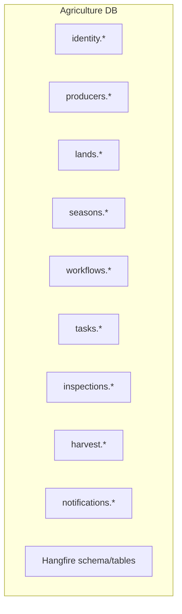

Cross-schema FKs are forbidden (ADR-016/017). Logical references use identifiers.

## 3.3 SignalR

### Role

Realtime updates to connected React dashboards (and optionally foreground mobile): task board invalidations, inspection status, delay warnings, season status (ADR-008).

### Process Model

Runs in-process with API; WebSockets (preferred) with Long Polling fallback. Connection state in memory per node unless Redis backplane configured.

### Ports

Same as API; path typically `/hubs/...` upgraded by reverse proxy with WebSocket support.

### Dependencies

JWT auth for hubs; Application event handlers publish after successful commit; Redis backplane when multi-node.

### Failure Modes

1. **Proxy without WebSocket support** — fallback polling increases load.
2. **Multi-node without backplane** — clients miss messages unless sticky sessions.
3. **Over-broadcast** large payloads — must send IDs + refresh hints, not full read models.
4. **Unauthorized group joins** — hub methods must enforce resource authorization (producer isolation).
5. **Connection storms after outage** — reconnect backoff required on clients.

### Scaling Unit

Connections per node; horizontal with sticky sessions or Redis backplane.

## 3.4 Hangfire

### Role

Background jobs, retries, cron scheduling for reminders, notifications, archive, cleanup, outbox processing (ADR-007).

### Process Model

Hangfire Server inside API process initially; storage in SQL Server; dashboard UI secured for admins.

### Ports

Dashboard via API host path (e.g., `/hangfire`); must be network-restricted and authorized.

### Dependencies

SQL storage; MediatR for command dispatch; FCM/MinIO/email gateways as needed by jobs.

### Failure Modes

1. **Poison messages** exhausting retries — move to failed state; alert Seq; manual replay after fix.
2. **Non-idempotent jobs** duplicating FCM pushes — mandatory idempotency keys.
3. **Dashboard exposed publicly** — critical security failure; restrict by authZ + network.
4. **Queue depth growth** during FCM outage — capacity planning; circuit breaker; degrade non-critical reminders.
5. **Long-running job blocking workers** — separate queues (`critical`, `default`, `maintenance`).

### Scaling Unit

Worker count per process; additional Hangfire servers on API replicas with SQL locking.

## 3.5 Firebase Cloud Messaging (FCM)

### Role

Mobile push for React Native producers/inspectors when offline or backgrounded (ADR-009).

### Process Model

External multi-tenant Google service. Application uses Infrastructure gateway with service account credentials. Sends originate from Hangfire jobs, not request threads.

### Ports

Egress HTTPS to Google endpoints from API/worker network.

### Dependencies

Device tokens stored in Identity; notification intents in Notifications module; Hangfire retries; network egress allowlist.

### Failure Modes

1. **Invalid/expired device tokens** — prune on error responses.
2. **Credential misconfiguration** — all pushes fail; detect via Hangfire failure rate.
3. **Data residency concerns** — privacy assessment; minimize payload (IDs + title, not sensitive PII).
4. **APNs misconfig for iOS** — iOS silent failures; staging device tests mandatory.
5. **Provider outage** — queue and retry; SignalR still serves connected web officers.

### Scaling Unit

External; application scales send concurrency carefully to respect quotas.

## 3.6 MinIO

### Role

S3-compatible object storage for photos, documents, exports (ADR-010).

### Process Model

MinIO server process with one or more disks/volumes; gateway S3 API; optional separate console.

### Ports

`9000` S3 API internal; `9001` console admin-only.

### Dependencies

Persistent volumes; TLS ideally on internal network or mesh; access keys as secrets; lifecycle policies.

### Failure Modes

1. **Disk full** — uploads fail; reconcile with SQL metadata orphans.
2. **Public bucket misconfiguration** — data leak; harden default deny.
3. **Dual-write partial failure** (SQL success, PutObject fail or reverse) — compensating transactions / orphan GC jobs.
4. **Clock skew breaking presigned URLs** — NTP.
5. **Single-node loss without replication** — backup/versioning critical.

### Scaling Unit

Vertical disk; distributed MinIO mode later; or migrate to cloud S3-compatible store via adapter.

## 3.7 Serilog

### Role

Structured logging library in-process (ADR-011).

### Process Model

Not a separate OS process; executes inside API (and any future workers). Async sinks to Console and Seq.

### Failure Modes

1. **Logging PII** — destructuring policies and code review.
2. **Sync sink blocking requests** — use async.
3. **Seq down** — fallback to console; do not crash app.
4. **Log volume explosion** from SignalR chatter — sampling/level overrides.

### Scaling Unit

Per process; volume managed at Seq.

## 3.8 Seq

### Role

Centralized log search, filtering, signals/alerts (ADR-012).

### Process Model

Separate container/process with retention storage.

### Ports

`80`/`443` or `5341` typical ingestion/UI—internal or VPN-only.

### Failure Modes

Disk full; license limits; unauthenticated UI exposure; ingestion backlog.

### Scaling Unit

Vertical storage; retention tiers; dual-ship to SIEM later if mandated.

## 3.9 React Web Client

### Role

SPA for municipal admins, officers, inspectors (browser).

### Process Model

Static assets served via reverse proxy/CDN/nginx; runtime in browser; talks HTTPS + SignalR to API.

### Dependencies

API URL configuration per environment; JWT in memory (prefer) / secure storage patterns; refresh flow.

### Failure Modes

Token storage XSS risk; outdated cached bundle after deploy—cache busting; SignalR reconnect loops.

### Scaling Unit

CDN/static hosting; independent of API scale.

## 3.10 React Native Mobile Client

### Role

Field application for producers and inspectors.

### Process Model

Store-distributed binaries; OS processes on devices; HTTPS API + FCM; optional SignalR when foregrounded.

### Dependencies

Secure token storage (Keychain/Keystore); FCM/APNs setup; deep links to tasks/inspections.

### Failure Modes

Poor connectivity; token theft if insecure storage; outdated app against breaking API—versioning headers.

### Scaling Unit

Per device; backend must absorb reconnect and sync bursts.

## 3.11 JWT Authentication Components

### Role

Access token issuance/validation; claims for roles/permissions/tenant (ADR-013).

### Process Model

In Identity module + host middleware; asymmetric or HMAC signing keys in secrets; short TTL access tokens; refresh in SQL.

### Failure Modes

Clock skew; weak keys; oversized tokens; refresh reuse attacks without rotation detection.

## 3.12 FluentValidation

### Role

Application-level input validation in MediatR pipeline (ADR-019).

### Process Model

In-process validators; fail fast before domain mutation.

### Failure Modes

Validators diverging from domain invariants—domain remains ultimate authority; validation is necessary but not sufficient.

---

# 4. Runtime Communication Paths

## 4.1 Primary Command Path: React → API → Application → Domain → Infrastructure → SQL

Municipal example: Officer assigns a task to a producer for an active season.

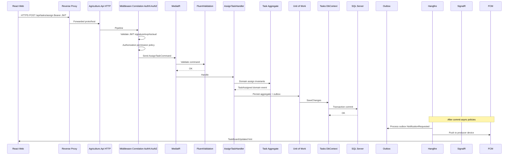

### Step-by-step reasoning

1. **TLS at edge** ensures credentials and personal data are encrypted on municipal and field networks.
2. **JWT validation is CPU-local** (no DB hit) for access tokens, preserving latency budget (SRS average under 300 ms).
3. **Authorization** denies by default; resource checks ensure officers cannot assign across unauthorized municipalities.
4. **FluentValidation** catches malformed IDs and dates before aggregate load.
5. **Domain methods** enforce sequential workflow rules—physical layer must not bypass via raw SQL.
6. **Single transaction** writes Task state and outbox intent to avoid dual-write loss.
7. **Hangfire/SignalR after commit** prevent notifying clients about uncommitted state.

### Failure modes on this path

| Failure | User-visible effect | Physical handling |
|---|---|---|
| JWT expired | 401 | Client refresh flow |
| Permission missing | 403 | Audit log |
| Validation error | 400 Problem Details | No DB write |
| Domain invariant | 409/422 | No notification |
| SQL timeout | 503/500 | Retry idempotent commands carefully |
| FCM down | Task still assigned | Hangfire retries; Seq alert |
| SignalR down | Dashboard stale until refresh | Client polling fallback optional |

## 4.2 Query Path: React → API → MediatR Query → EF AsNoTracking → SQL → DTO

Dashboard “Today’s Tasks” must not load full aggregate graphs or acquire write locks.

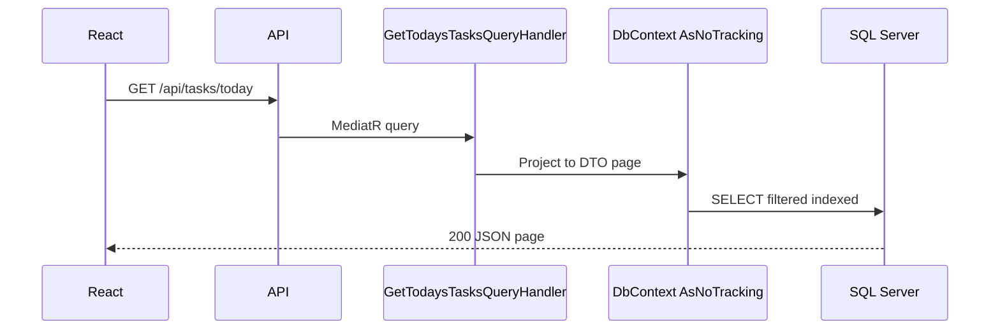

**Trade-off:** Same database as writes (ADR-003) simplifies ops; under peak load, long reporting queries can still contend for IO—mitigate with pagination, indexes, off-peak Hangfire report materialization, future read replica.

## 4.3 SignalR Path

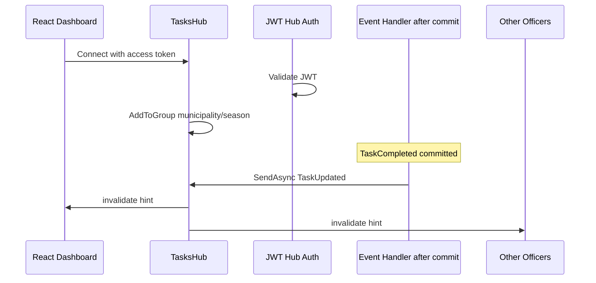

Parallel to FCM: SignalR serves **connected** officers; FCM serves **mobile** producers. Neither replaces the other (ADR-008/009).

## 4.4 Hangfire → FCM Path

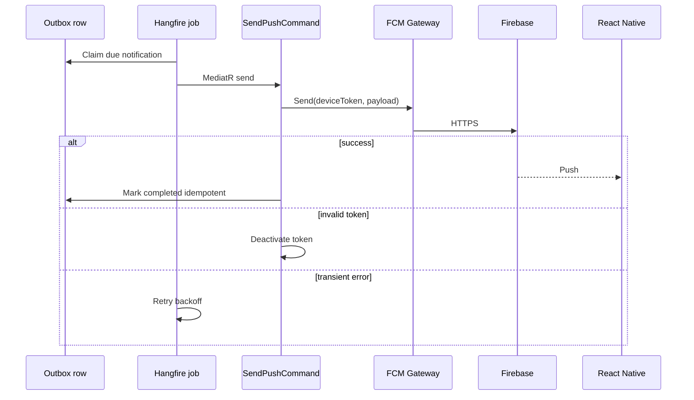

## 4.5 API → MinIO Upload Path (summary; full detail in Section 10)

Client → API validation → MinIO PutObject → SQL metadata commit → optional notification. Presigned URL variant allows client direct PUT to MinIO after API issues short-lived URL.

## 4.6 Serilog → Seq Path

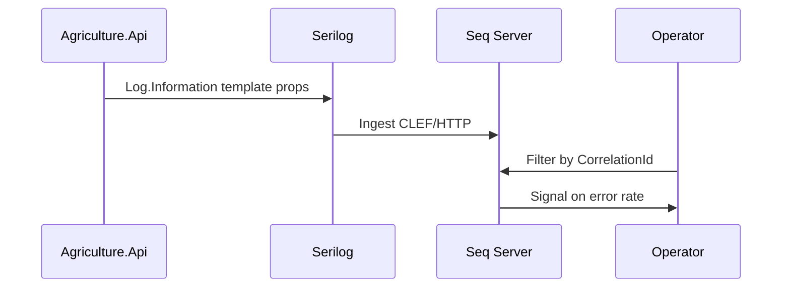

Correlation ID propagates: HTTP middleware → MediatR logging behavior → Hangfire job performance filters → SignalR hub logs.

## 4.7 Inter-module In-Process Communication Path

Per ADR-017, Tasks Application may call Seasons Contracts to verify season is active, but must not query `seasons` schema via Tasks DbContext.

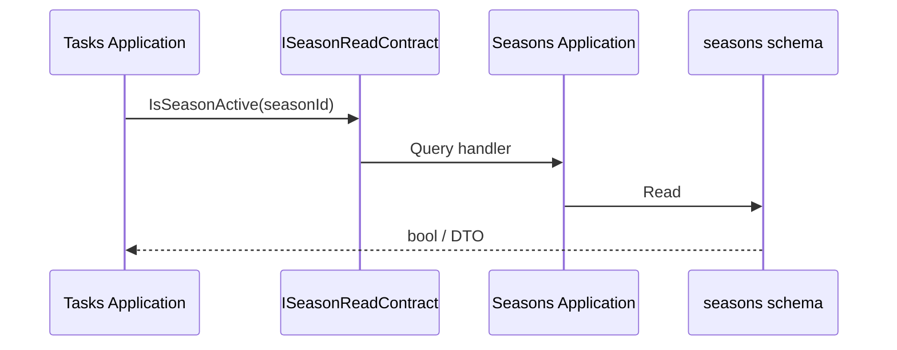

Physically this is a method call on the same machine—low latency—but architecturally it remains a boundary that can become HTTP later.

---

# 5. Deployment Topology

## 5.1 Topology Options Overview

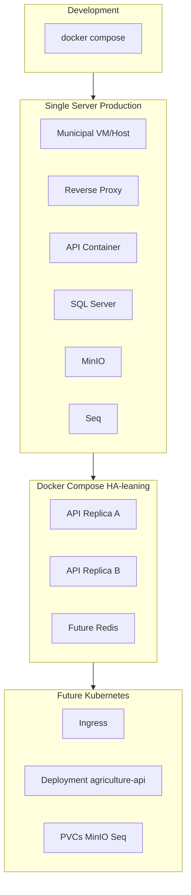

## 5.2 Single Server Topology

Appropriate for first municipal production when producer counts are moderate and ops staff is small.

**Host layout guidance:**

| Component | Recommendation |
|---|---|
| Reverse proxy | Host or container; TLS certificates |
| API | Container with restart policy |
| SQL Server | Container or managed/VM SQL with dedicated disks |
| MinIO | Container with mounted volume on separate disk if possible |
| Seq | Container with retention volume |
| Backups | Nightly SQL + MinIO sync to NAS/offsite |

**Resource sizing guidance (starting point for a mid-size municipality):**

| Component | CPU | RAM | Disk |
|---|---|---|---|
| API | 2–4 vCPU | 4–8 GB | 20 GB container + logs |
| SQL Server | 4 vCPU | 16 GB | 200+ GB SSD data + logs |
| MinIO | 2 vCPU | 4 GB | 500 GB+ depending on photo retention |
| Seq | 2 vCPU | 4 GB | 100 GB retention |
| Proxy | 1 vCPU | 1 GB | minimal |

These are **guidance**, not licenses to skip load testing before season peaks.

## 5.3 Docker and Docker Compose Topology

Per ADR-020, Docker is the standard packaging. Conceptual Compose services:

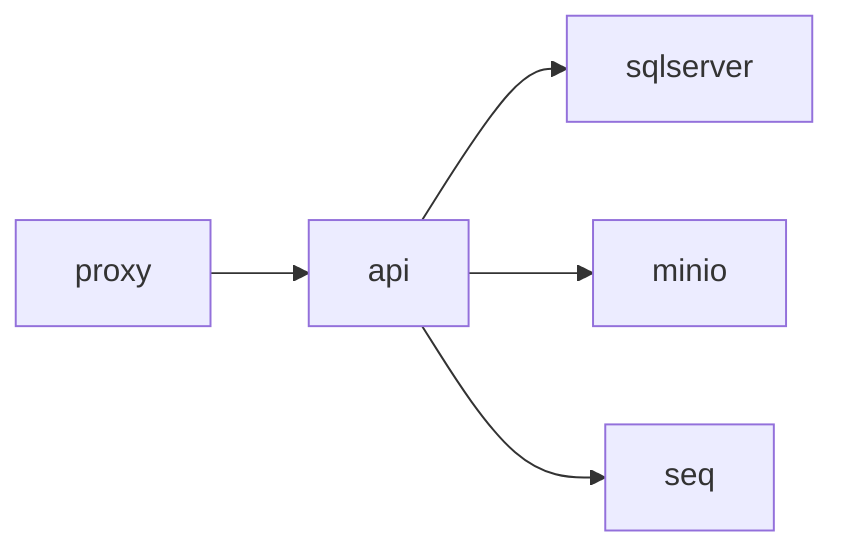

**Environment separation:** distinct Compose projects or namespaces: `agriculture-dev`, `agriculture-test`, `agriculture-staging`, `agriculture-prod` with isolated networks, volumes, credentials, and bucket names. Never share prod SQL with non-prod API.

## 5.4 Future Kubernetes Topology

When Stage 3 is authorized:

- `Deployment` for `agriculture-api` with readiness/liveness probes on `/health/ready` and `/health/live`.
- `Service` ClusterIP for API.
- `Ingress` for TLS and WebSocket timeouts suitable for SignalR.
- `StatefulSet` or operator for MinIO; managed SQL preferred when available.
- `NetworkPolicy` denying direct external access to SQL/MinIO/Seq.
- Horizontal Pod Autoscaler only after Redis backplane.

Microservices extraction remains a **later** change to Deployments, not a prerequisite for Kubernetes.

## 5.5 Environments

| Environment | Purpose | Data rules | External FCM |
|---|---|---|---|
| Development | Feature work | Synthetic/seed | Optional sandbox |
| Testing/CI | Automated tests | Ephemeral | Mocked gateway |
| Staging | Pre-prod UAT | Anonymized subset | FCM staging apps |
| Production | Live municipality | Real PII/evidence | Production FCM |

Promotion path: CI build immutable image → deploy staging → migrate → verify health → promote same digest to production (ADR-020).

## 5.6 Client Deployment Topology

- **React:** build static assets in CI; publish to proxy `try_files` / object storage+CDN; API base URL per environment.
- **React Native:** store releases; remote config for API base URL; force-update policy for breaking auth/API changes.


---

# 6. Network Topology

## 6.1 Design Intent

The network topology for the Agriculture Management System separates **public client ingress**, **application compute**, **data plane**, **observability**, and **external notification egress** into distinct trust zones. Municipal networks frequently combine VPN-administered management planes with internet-facing mobile access for producers. The physical design must allow producers on cellular networks to reach only the reverse-proxy HTTPS endpoint, while SQL Server, MinIO administrative consoles, Seq, and Hangfire dashboards remain unreachable from the public internet.

This section is normative for firewall requests, cloud security groups, and Compose/Kubernetes network policies. It aligns with ADR-020 (HTTPS reverse proxy), ADR-010 (object storage isolation), ADR-005 (database isolation), ADR-013 (JWT over HTTPS), and ADR-009 (controlled egress to FCM).

## 6.2 Trust Boundaries

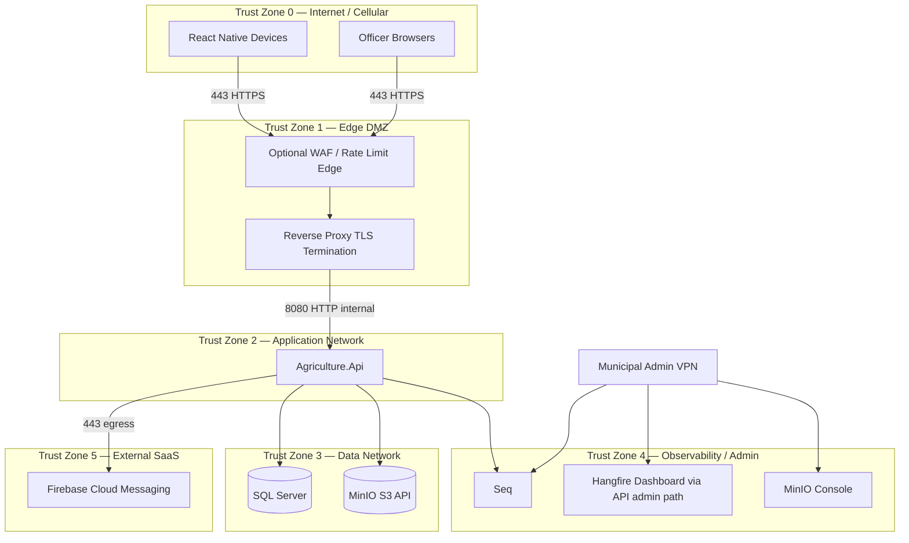

### Boundary rules

1. **Zone 0 → Zone 1 only on 443/tcp** (and 80→443 redirect). No direct client routes to API container ports, SQL, MinIO, or Seq.
2. **Zone 1 → Zone 2** only to the API service port. Proxy performs TLS termination, HSTS, request size limits, and WebSocket upgrade for SignalR.
3. **Zone 2 → Zone 3** allowed for SQL `1433` and MinIO `9000` from API identity only. No lateral movement from Seq to SQL.
4. **Zone 2 → Zone 5** HTTPS egress to FCM endpoints required for mobile push; deny general outbound internet from SQL/MinIO hosts.
5. **Zone 4** reachable from municipal admin VPN or bastion only. Hangfire dashboard and Seq UI must not be anonymously internet-exposed.
6. **Management plane** (SSH/WinRM/Kubernetes API) is out of band and must use MFA bastions; it is not part of the application trust model but must not share credentials with application secrets.

## 6.3 Reverse Proxy Responsibilities

The reverse proxy is the only public process in the application path. Normative responsibilities:

| Responsibility | Reasoning |
|---|---|
| TLS termination with modern ciphers | Centralizes certificate lifecycle; avoids distributing certs into every API replica |
| HTTP→HTTPS redirect | Prevents accidental plaintext credential submission |
| Forwarded headers (`X-Forwarded-For`, `Proto`) | API rate limiting and audit need real client IPs; ASP.NET must be configured to trust proxy hops carefully |
| WebSocket support for SignalR | Without upgrade support, clients fall back to long polling and amplify load |
| Request body size caps | Defense-in-depth against oversized uploads before API memory pressure |
| Static React hosting or routing | Optional; may be split to CDN later |
| Path-based denial for `/hangfire`, `/seq` if mistakenly published | Fail closed |

**Failure mode:** Misconfigured forwarded headers allow IP spoofing that defeats rate limits and pollutes audit logs. Mitigation: known proxy hop count; ignore client-supplied forwarding when not behind trusted proxy.

**Municipal scenario:** An officer works from city hall Wi-Fi while a producer uploads from a village cellular network. Both terminate TLS at the same municipal edge. The proxy logs connection metrics; Seq receives application correlation IDs; firewall sees only 443 inbound.

## 6.4 Firewall and Port Matrix

| Source | Destination | Port | Protocol | Purpose | Public? |
|---|---|---|---|---|---|
| Clients | Reverse Proxy | 443 | TCP HTTPS | API + SignalR + optional static | Yes |
| Clients | Reverse Proxy | 80 | TCP HTTP | Redirect to 443 | Yes (redirect only) |
| Reverse Proxy | API | 8080 | TCP HTTP | Application | No |
| API | SQL Server | 1433 | TCP TDS | OLTP | No |
| API | MinIO | 9000 | TCP HTTPS/HTTP | S3 API | No |
| API | Seq | 5341/80 | TCP HTTP | Log ingest | No |
| API | FCM | 443 | TCP HTTPS | Push egress | Egress only |
| Admin VPN | Seq UI | 80/443 | TCP | Diagnostics | No |
| Admin VPN | MinIO Console | 9001 | TCP | Bucket admin | No |
| Admin VPN | API `/hangfire` | 443 via proxy path allowlist | TCP | Job ops | No |
| CI Runner | Registry / SSH deploy | varies | — | Release | Controlled |

Ports **must not** be published: SQL `1433`, MinIO `9000/9001`, Seq ingestion/UI, Kestrel `8080`, Redis future `6379`, database replica admin ports.

## 6.5 Database Isolation

SQL Server resides on the data network with:

- No public IP.
- Firewall allowlist limited to API subnet / service account identity.
- Separate credentials per environment.
- Optional Always On / failover partner still inside Zone 3.
- TLS between API and SQL where municipal policy requires encryption in transit on the data LAN.

**Reasoning:** Database compromise is catastrophic for municipal PII, land data, and inspection evidence metadata. Network isolation reduces ransomware lateral movement and internet scanning risk.

**Trade-off:** Developers cannot “just connect” from home to prod SQL—this is intentional. Break-glass procedures use bastion + MFA + audited sessions.

## 6.6 Storage Isolation (MinIO)

MinIO S3 API is internal-only. Clients do not receive permanent public object URLs. Access patterns:

1. **Mediated download:** API streams or redirects after authorization check.
2. **Presigned URL:** API issues time-bounded PUT/GET URLs bound to object key; network may allow client→MinIO only if MinIO is published via a dedicated proxy path with authz at issuance time—**default recommendation for municipal on-prem is mediated or presigned via internal hostname not internet-routable**, or via proxy path `/objects/` that validates signatures.

If presigned direct upload is enabled in a DMZ-exposed MinIO, Architecture Board must approve an explicit exception with bucket policies denying list/public-read.

## 6.7 Notification Gateway Egress

Egress to FCM must be explicitly allowed. Some municipal firewalls default-deny outbound. Without egress, Hangfire notification jobs fail while core workflow continues—graceful degradation is acceptable for push, not for SQL.

DNS resolution and NTP egress are also required for JWT validation time and TLS.

## 6.8 Internal Network Segmentation Patterns

### Compose bridge networks

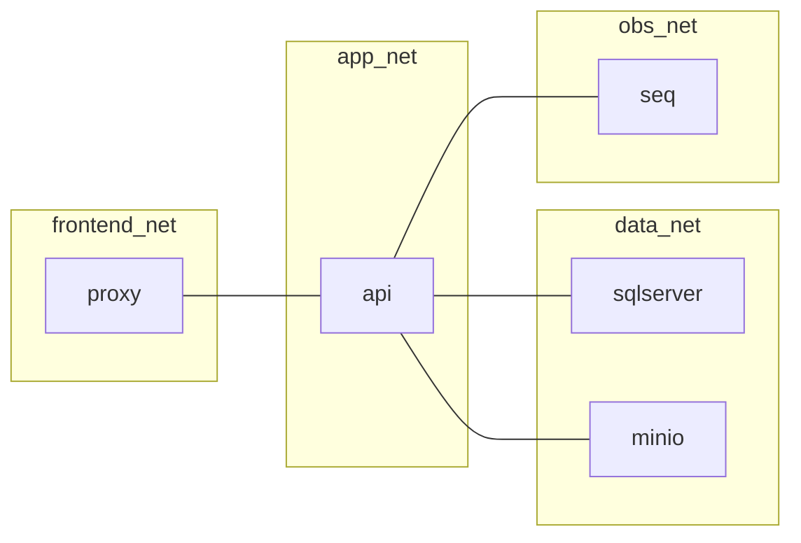

Attach proxy to `frontend_net` + `app_net`. Attach API to `app_net` + `data_net` + `obs_net`. Do not attach SQL to `frontend_net`.

### Future Kubernetes NetworkPolicies

Deny all ingress to SQL/MinIO/Seq pods except from API pods (and backup jobs). Deny egress from SQL pods to internet. Allow API egress to FCM CIDRs or HTTPS worldwide if CIDR lists are impractical—document the choice.

## 6.9 SignalR Network Considerations

- Idle timeouts at proxy must exceed SignalR keep-alive intervals or connections drop falsely.
- Load balancers with multiple API nodes require sticky sessions **or** Redis backplane (ADR-008/015).
- Mobile carriers may interrupt long-lived WebSockets; clients must reconnect with backoff; FCM remains authoritative for offline notification.

## 6.10 CORS and Browser Trust

CORS is a browser-enforced boundary, not a network firewall. Physical deployment must configure allowed origins per environment (staging vs production municipal domains). Native mobile apps are not subject to CORS but remain subject to TLS and JWT.

**Failure mode:** `AllowAnyOrigin` with credentials in production—forbidden.

## 6.11 Network Failure Modes and Municipal Response

| Failure | Impact | Response |
|---|---|---|
| Edge proxy down | Total client outage | Failover proxy / VIP; status page |
| App network partition from SQL | API not ready | Readiness fail; stop routing; alert |
| App cannot reach MinIO | Uploads fail; reads of metadata still work | Degrade upload features; alert |
| Egress to FCM blocked | No mobile push | Fix firewall; Hangfire retries; officers use web |
| Admin VPN down | Ops blind to Seq/Hangfire | Break-glass console access procedure |
| DNS failure | TLS and FCM break | Redundant DNS; local caching caution |

## 6.12 Sequence: Client Request Crossing Trust Zones

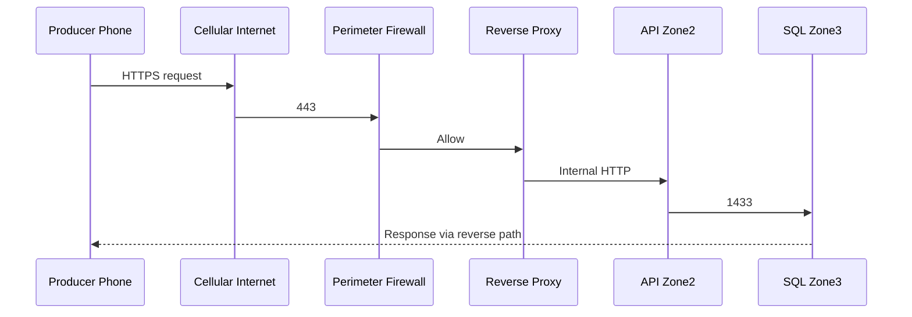

Every hop must be justified. Adding “temporary” public SQL endpoints for vendor convenience is a policy violation.

---

# 7. Storage Architecture

## 7.1 Storage Domains

The system uses multiple physical storage domains with different consistency, backup, and security properties:

| Storage domain | Technology | System of record for | Backup pairing |
|---|---|---|---|
| Database storage | SQL Server files | Aggregates, tokens, outbox, Hangfire, audit | Primary DR focus |
| Object storage | MinIO | Photos, documents, export binaries | Must pair with SQL metadata |
| Log storage | Seq retention + optional file sinks | Diagnostics, security investigation | Retention ≠ legal evidence store |
| Temporary storage | Container ephemeral disk | Multipart scratch, temp exports | Disposable |
| Backup media | NAS/object/tape | Disaster recovery copies | Offline/offsite preferred |

## 7.2 Database Storage Design

### Content

Schema-per-module tables for Identity, Producers, Lands, Seasons, Workflows, Tasks, Inspections, Harvest/Delivery, Notifications, Support, and future modules; Hangfire schema; optional shared infrastructure tables carefully limited.

### Physical file guidance

- Separate data and log volumes for SQL when possible.
- SSD for OLTP latency toward SRS average response targets.
- Plan growth by season: task/inspection rows accumulate; soft-deleted rows remain until purge policy (ADR-016).
- Do not store photo binaries in `varbinary` columns.

### Access patterns

- Command side: indexed point lookups by aggregate ID; short transactions.
- Query side: filtered lists by assignee/status/date with pagination.
- Outbox poller: sequential claim of unprocessed rows.
- Refresh token lookup hashed; avoid full table scans.

### Retention and archival

Archived seasons become immutable per AGGREGATE_DESIGN. Physical archival jobs (Hangfire) may move cold season data to archive tables/filegroups or export packages to MinIO while leaving summary indexes queryable. Legal retention for agricultural subsidy evidence may exceed operational needs—municipal policy overlays technical defaults.

## 7.3 Object Storage — Buckets and Prefixes

Recommended bucket strategy:

| Bucket | Purpose | Access |
|---|---|---|
| `agriculture-{env}-media` | Producer photos, task evidence, inspection photos | Private |
| `agriculture-{env}-documents` | PDFs, land documents, harvest receipts scans | Private |
| `agriculture-{env}-exports` | Generated reports, season archives | Private |
| `agriculture-{env}-temp` | Short-lived multipart/upload staging | Private + lifecycle expire |

Object key prefix convention (normative guidance):

```
{module}/{aggregateType}/{aggregateId}/{yyyy}/{mm}/{uuid}-{safeFileName}
```

Example: `inspections/Inspection/3fa85f64.../2026/07/9c1b...-field-east.jpg`

**Reasoning:** Prefixes enable lifecycle policies, orphan reconciliation by module, and future bucket splits per module without rewriting SQL metadata if keys remain stable.

## 7.4 Photo Storage Specifics

Photos are high-volume during inspections and harvest. Physical rules:

1. Max size enforced at API (e.g., 10–15 MB configurable)—exact limit in security config.
2. Allowed content types: controlled image MIME set; reject `application/octet-stream` unless magic-byte validated.
3. Store content hash (SHA-256) in SQL for integrity and dedup opportunities.
4. Optional future thumbnail generation via Hangfire writing derivative objects with related keys.
5. Virus scan future hook (Section 10) before making object available to other users.

## 7.5 Document Storage Specifics

Documents may include land deeds scans or delivery receipts. Treat as sensitive:

- Same private bucket policies.
- Encryption at rest on MinIO volumes (disk encryption / server-side encryption).
- Download audited in application audit logs (who retrieved which object key).

## 7.6 Log Storage

Seq stores structured events. Physical retention example:

| Environment | Retention | Notes |
|---|---|---|
| Dev | 7 days | Disk thrift |
| Staging | 14–30 days | UAT investigations |
| Production | 30–90 days hot | Longer cold export if SIEM mandates |

Logs are not a substitute for domain audit tables (ADR-016). Security investigations may need both.

## 7.7 Temporary Storage

API containers may use `/tmp` for:

- Brief buffering of uploads before MinIO put (prefer streaming).
- Report generation scratch before MinIO export put.

Ephemeral disk must be sized and monitored; it must not be the durable store. Container recycle deletes temp—acceptable.

## 7.8 Dual-Write Consistency Between SQL and MinIO

The fundamental storage hazard is split brain between metadata and bytes.

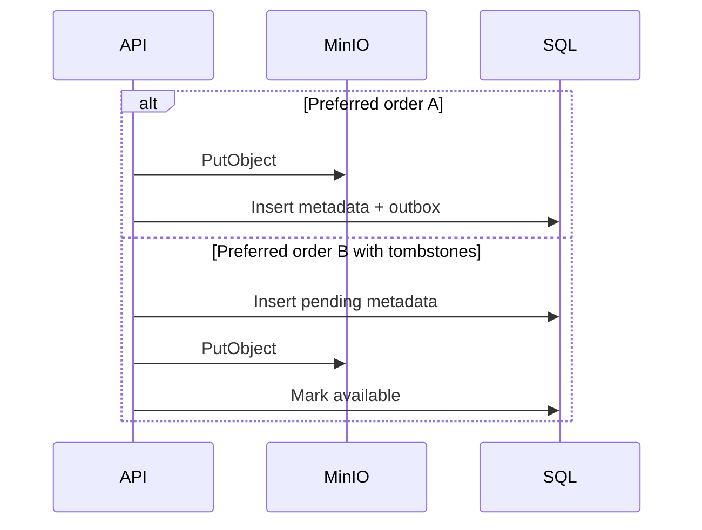

**Recommended approach:** Upload to MinIO first with a key predetermined by API; on success, commit SQL metadata in module transaction; on SQL failure, enqueue orphan deletion job for the object key. Alternatively, mark metadata `Pending` then `Available`. Hangfire reconciliation lists MinIO prefixes vs SQL keys periodically.

**Failure mode:** SQL points to missing object—user sees broken image; API returns 404 and support reconciles. Opposite orphan objects cost disk only—GC jobs reclaim.

## 7.9 Security Controls for Storage

- Bucket default deny public.
- Rotate access keys; store in secrets.
- Separate keys per environment.
- Least privilege: API key can read/write app buckets only; cannot delete backup bucket if separate.
- Versioning enabled on media/documents buckets in production for ransomware/accidental delete recovery.
- Legal hold capability future for contested inspection evidence.

## 7.10 Capacity Planning Narrative

A municipality supporting 2,000 producers, each generating an average of 20 photos per season at 2 MB, yields ~80 GB raw per season before versions and thumbnails. Multi-year retention without lifecycle policies will exhaust disks. Physical architecture therefore requires:

- Annual capacity review before planting season.
- Lifecycle: transition old seasons to cheaper disk or cold bucket.
- Monitoring disk used % with alerts at 70/85/95.

---

# 8. Background Jobs Physical Design

## 8.1 Why Hangfire Is a Physical Concern

Although Hangfire executes inside the API process initially, it is a distinct **runtime role**: it consumes thread pool resources, holds SQL locks on job queues, performs outbound I/O to FCM/MinIO, and can endanger API latency if mis-queued. Physical design therefore specifies queues, worker counts, retry policies, idempotency, dashboards, and failure isolation (ADR-007, EVENT_STORMING policies).

## 8.2 Job Families

| Job family | Examples | Queue | Criticality |
|---|---|---|---|
| Reminder | Task due soon, delayed task escalation | `reminders` | Medium |
| Notification | FCM push, email/SMS send | `notifications` | High for assignments; medium for digests |
| Archive | Season archival packaging, cold data move | `maintenance` | Low urgency, high correctness |
| Cleanup | Expired refresh tokens, orphan MinIO objects, temp exports | `maintenance` | Medium |
| Retry / Outbox | Dispatch integration events, replay failed pushes | `critical` | High |
| Health | Synthetic checks, warmup, metric pulse | `default` | Low |

## 8.3 Queue Topology

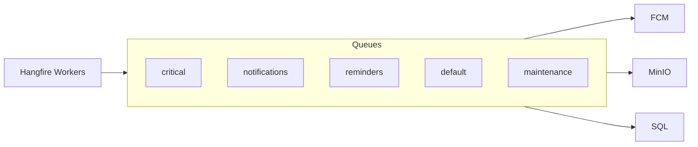

Workers should process `critical` before `maintenance` to prevent archival jobs from starving outbox dispatch during season peaks.

## 8.4 Worker Process Model

**Stage 1:** Hangfire Server hosted in `Agriculture.Api` with limited worker count (e.g., 5–20) sized so API request threads remain available.

**Stage 2 (optional):** Run a second container from the same image with environment `HANGFIRE_SERVER_ENABLED=true` and `HTTP_API_ENABLED=false` (or vice versa) to isolate background CPU from HTTP—**still modular monolith code**, not microservices extraction.

**Multi-instance:** SQL Server storage provides distributed locks; multiple Hangfire servers allowed when horizontal API scale is approved.

## 8.5 Retry and Backoff

Normative guidance:

- Transient FCM/network errors: exponential backoff with jitter; capped retries (e.g., 10).
- Permanent errors (invalid token, validation): fail fast; do not retry endlessly.
- Poison messages: after max attempts, remain in Failed state; Seq alert; operator replay after fix.
- Idempotency key: `NotificationId` / outbox `IdempotencyKey` unique constraint prevents duplicate side effects.

## 8.6 Idempotency Physical Patterns

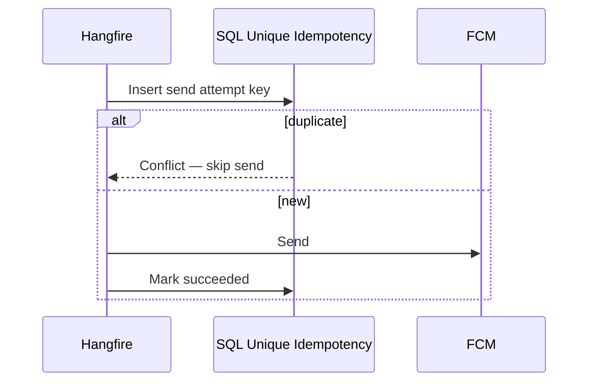

Without idempotency, a worker crash after FCM success but before state update causes duplicate producer notifications—annoying and potentially harmful for legal deadlines.

## 8.7 Recurring Jobs

Examples aligned with EVENT_STORMING:

- Every 15 minutes: scan delayed tasks → enqueue reminders.
- Hourly: process outbox backlog watermark.
- Daily: cleanup expired refresh tokens; delete expired `temp` objects.
- Weekly: orphan MinIO reconciliation report.
- Season end: archive job under operator trigger or scheduled window.

Cron definitions live in Infrastructure registration, configured per environment (more aggressive polling in prod peaks if Board approves).

## 8.8 Dashboard Physical Security

Hangfire dashboard must require authenticated admin principal with permission checks and should be reachable only from admin networks. Exposing dashboard anonymously is a critical incident.

Dashboard uses include: inspect failed notification jobs during FCM outage; requeue after credential rotation; observe queue depth SLOs.

## 8.9 Interaction with Domain Correctness

Jobs **must** dispatch MediatR commands or Infrastructure gateways—not reimplement domain invariants in job classes. Physical smell: SQL updates inside job bypassing aggregates. That violates AGGREGATE_DESIGN and ADR-007.

## 8.10 Municipal Scenario — Reminder Storm

After a holiday, 3,000 delayed tasks become eligible simultaneously. Reminder job enqueues 3,000 notification jobs. Without queue separation and rate limiting toward FCM, the system may trip provider quotas and overload SQL. Physical controls: batch enqueue, rate-limited notification workers, digest collapsing (“you have 5 delayed tasks”) where product policy allows.

## 8.11 Failure Isolation from API Liveness

Hangfire failures must not crash the API process. Unhandled exceptions in jobs are captured by Hangfire. Monitor separately from HTTP p99. Readiness probe should not fail solely because one maintenance job failed; optional separate “jobs healthy” signal for ops dashboards.

---

# 9. Authentication Flow (Complete JWT)

This section expands ADR-013 into a full physical authentication lifecycle for React and React Native clients.

## 9.1 Goals and Constraints

1. Uniform auth for web and mobile.
2. Short-lived access JWT (guidance 10–30 minutes per security policy).
3. Refresh tokens persisted hashed on User aggregate; rotatable; revocable.
4. HTTPS only; no token in URL query strings.
5. Deactivated users cannot refresh.
6. SignalR uses the same access JWT.
7. Clock skew tolerance configured; NTP mandatory on servers.

## 9.2 Login Sequence

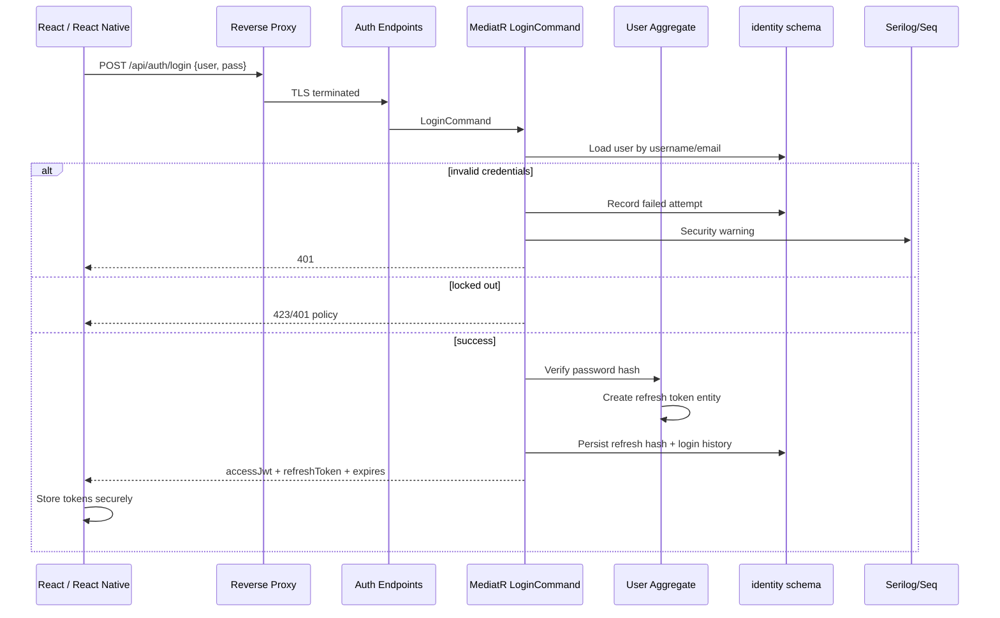

### Physical storage of tokens on clients

| Client | Access token storage | Refresh token storage |
|---|---|---|
| React Web | Memory preferred; if persistence needed, careful XSS controls | HttpOnly Secure SameSite cookie **or** secure storage with strict CSP—Board picks one pattern and documents; never localStorage if XSS risk unmanaged |
| React Native | Memory / secure runtime | OS Keychain / Keystore |

### Password handling

Passwords verified via ASP.NET Identity PasswordHasher (or Board-approved stronger). Plaintext never logged. Timing-safe comparison practices via framework hasher.

## 9.3 Authenticated API Call

```mermaid
sequenceDiagram
  participant C as Client
  participant API as JWT Bearer Middleware
  participant Pol as Authorization Policy
  participant H as Handler

  C->>API: Authorization: Bearer accessJwt
  API->>API: Validate signature, issuer, audience, lifetime (+ clock skew)
  API->>Pol: Permission / role policies
  Pol->>H: Proceed
```

Access token validation **must not** require SQL round-trip on every request. Revocation of access relies on short TTL plus refresh revocation for deactivation scenarios.

## 9.4 Refresh Token Flow

```mermaid
sequenceDiagram
  participant C as Client
  participant API as Refresh Endpoint
  participant Dom as User Aggregate
  participant SQL as SQL

  C->>API: POST /api/auth/refresh {refreshToken}
  API->>SQL: Find user by refresh token hash
  alt not found / expired / revoked
    API-->>C: 401
  else reuse detection (rotated token presented again)
    API->>Dom: Revoke all refresh tokens for user
    API->>SQL: Persist
    API-->>C: 401
    Note over API: Potential theft signal to Seq
  else valid
    API->>Dom: Rotate refresh token
    API->>SQL: Replace hash; issue new access JWT
    API-->>C: new access + new refresh
  end
```

**Rotation reasoning:** Refresh token rotation with reuse detection limits the window of stolen refresh tokens—critical for lost phones (municipal Scenario D).

## 9.5 Logout and Revocation

Logout presents refresh token (and optionally access token) to revoke server-side refresh persistence. Access token remains valid until expiry—acceptable due to short TTL. For emergency revocation (lost device, insider threat):

1. Revoke all refresh tokens for user.
2. Optionally maintain a version claim (`tv` token version) in JWT checked against user security stamp—if adopted, requires stamp read cache strategy.
3. Remove FCM device tokens.
4. SignalR connections fail on next reconnect/reauth.

## 9.6 Clock Skew

Servers and containers must sync time via NTP. JWT validation allows limited clock skew (e.g., 1–2 minutes). Excessive skew causes intermittent 401s that appear as “flaky mobile network” to users—ops must monitor.

## 9.7 Mobile vs Web Differences

| Concern | Web | Mobile |
|---|---|---|
| Transport | Browser HTTPS | Device HTTPS |
| SignalR | Primary realtime | Optional foreground |
| Push | Not primary | FCM mandatory |
| Token theft vector | XSS | Lost device / malware |
| Offline | Limited | Common in fields |

Physical architecture requires both clients share Identity endpoints and claim shapes so authorization policies remain unified (ADR-014).

## 9.8 SignalR Authentication Coupling

Hub connections pass access token via query string or header per ASP.NET SignalR guidance. Prefer header mechanisms where supported; if query string is required for WebSockets, ensure tokens are short-lived and not logged by proxies. Proxy access logs must redact tokens.

## 9.9 Failure Modes

| Failure | Symptom | Mitigation |
|---|---|---|
| Signing key rotated without dual-key accept | Mass 401 | Overlap keys during rotation window |
| Refresh table growth | Slow login | Cleanup job |
| Brute force login | Lockouts / Seq alerts | Rate limit + lockout policy |
| Client stores JWT in insecure storage | Account takeover | Secure storage standards + pentest |
| Long access TTL | Revocation lag | Keep TTL short |

## 9.10 Sequence — Officer Day Start

Officer opens React app → silent refresh if refresh valid → access JWT obtained → dashboard SignalR connects → permission-gated queries execute. If refresh revoked overnight due to password reset, login page shown. Physical systems involved: DNS, proxy TLS, API Identity module, SQL identity schema, Seq login audit.

---

# 10. Upload Flow

## 10.1 Business Context

Producers and inspectors attach photos to tasks and inspections. MODULE_DESIGN and ADR-010 require MinIO object storage with SQL metadata. Physical upload flow must enforce authorization, content safety, size limits, and dual-store consistency.

## 10.2 End-to-End Producer Photo Upload (Mediated)

```mermaid
sequenceDiagram
  participant RN as React Native
  participant RP as Proxy
  participant API as Upload Endpoint
  participant V as Validation
  participant AuthZ as Resource AuthZ
  participant MinIO as MinIO
  participant SQL as SQL
  participant HF as Hangfire
  participant N as Notification optional

  RN->>RP: multipart/form-data photo + taskId
  RP->>API: size-limited body
  API->>AuthZ: Producer owns task / assigned
  API->>V: content-type, extension, size, magic bytes
  alt invalid
    API-->>RN: 400
  else valid
    API->>API: Generate object key
    API->>MinIO: PutObject
    alt MinIO fail
      API-->>RN: 503
    else OK
      API->>SQL: Insert photo metadata on aggregate transaction
      API->>HF: Outbox TaskPhotoAttached
      API-->>RN: 201 metadata DTO
      HF->>N: Optional notify officer via SignalR/FCM
    end
  end
```

## 10.3 Validation Rules (Physical Enforcement Points)

| Check | Enforced at | Reasoning |
|---|---|---|
| AuthN JWT | API middleware | No anonymous uploads |
| AuthZ resource | Application handler | Prevent attaching to others’ tasks |
| Max request size | Proxy + Kestrel + validation | Defense in depth |
| MIME allowlist | Application | Block HTML/SVG active content if not allowed |
| Magic-byte sniff | Application/Infrastructure | Bypass of renamed extensions |
| Image dimensions optional | Application | Extreme decompression bombs |
| Virus scan | Future async pipeline | See below |

Exact numeric limits are configuration values, not domain jokes—ops must set them per environment.

## 10.4 Content-Type and Size

Reject mismatched content-type vs sniffed type. Normalize storage content-type from sniffed result. Size limits protect memory and MinIO disk. For large documents, prefer presigned multipart upload.

## 10.5 Presigned URL Optional Flow

```mermaid
sequenceDiagram
  participant C as Client
  participant API as API
  participant MinIO as MinIO
  participant SQL as SQL

  C->>API: Request upload URL {taskId, contentType, size}
  API->>API: AuthZ + validate policy
  API->>SQL: Insert Pending media row
  API->>MinIO: Generate presigned PUT
  API-->>C: url + objectKey + mediaId
  C->>MinIO: PUT bytes
  C->>API: CompleteUpload mediaId
  API->>MinIO: HeadObject verify size/etag
  API->>SQL: Mark Available
```

**Trade-offs:** Presigned reduces API memory/CPU but requires careful network exposure of MinIO or a signing-aware proxy. Mediated upload is simpler for early municipal deployments.

## 10.6 Virus Scan Future Hook

Physical design reserves a Hangfire job stage:

1. Object lands in `temp` or `quarantine` prefix.
2. Scanner worker (ClamAV or enterprise AV) processes.
3. On clean, move to final prefix and mark Available.
4. On infected, delete object, mark Rejected, notify user.

Until implemented, risk acceptance must be documented by security officers; MIME/size constraints remain mandatory.

## 10.7 Notification After Upload

Officers monitoring inspections may receive SignalR “evidence added” hints; producers may not need push on their own upload. Product policy decides; physical path uses outbox → Hangfire → SignalR/FCM.

## 10.8 Failure Modes

| Failure | Result | Recovery |
|---|---|---|
| MinIO full | 503 | Disk alert; expand volume |
| SQL commit fail after PutObject | Orphan object | GC job |
| CompleteUpload never called | Pending media | Expire pending after TTL |
| Malicious file | Future reject | Quarantine |
| Proxy timeout on slow cellular | Client retry | Idempotent mediaId |

## 10.9 Municipal Scenario — Inspection Evidence in Rain

Inspector captures photos offline; app queues uploads; when connectivity returns, burst of PUTs occurs. API rate limits per user; Hangfire not involved in binary put; SQL receives metadata batch. Ops watches MinIO IO and API upload p95.

---

# 11. Notification Flow

## 11.1 Dual-Channel Model

| Channel | Audience | Online requirement | ADR |
|---|---|---|---|
| FCM | Mobile producers/inspectors | Not required | ADR-009 |
| SignalR | Connected web officers (optional mobile foreground) | Required | ADR-008 |
| Email/SMS | Future/critical legal | Provider dependent | Ports in Infrastructure |

## 11.2 Task Created → Producer Mobile Complete Flow

```mermaid
sequenceDiagram
  participant Officer as React Officer
  participant API as API Command
  participant SQL as SQL
  participant OB as Outbox
  participant HF as Hangfire
  participant GW as FCM Gateway
  participant FCM as Firebase
  participant RN as Producer App
  participant Hub as SignalR
  participant Dash as Officer Dashboard

  Officer->>API: Create/Assign Task
  API->>SQL: Commit Task + Outbox NotificationRequested
  API->>Hub: TaskBoardUpdated
  Hub->>Dash: Live update
  HF->>OB: Claim NotificationRequested
  HF->>GW: SendPush
  GW->>FCM: HTTPS
  FCM->>RN: Push displayed
  RN->>API: User opens task deep link with JWT
```

### Step details

1. **Command commit** establishes source of truth—notifications never precede durable task state.
2. **Outbox** records intent with idempotency key and payload including `UserId`, `DeviceTokens` lookup reference, `TaskId`, template id.
3. **SignalR parallel path** updates dashboards without waiting for FCM.
4. **Hangfire** loads tokens from Identity; skips users without tokens; sends per token or multicast where supported.
5. **React Native** receives notification; deep link opens task query; AuthZ ensures producer can only see own task.

## 11.3 Template and Payload Physical Constraints

Push payloads must be small and avoid sensitive personal data (national IDs, exact land coordinates if policy restricts). Prefer: title/body generic + entity IDs. App fetches details via authenticated API.

## 11.4 Preference and Quiet Hours (Future-ready)

Physical notification sender checks user preferences before send. Quiet hours may defer Hangfire job execution time. Deferral must still be idempotent.

## 11.5 Failure and Degraded Modes

| Condition | Producer experience | Officer experience |
|---|---|---|
| FCM outage | No push; task still assigned | Dashboard live via SignalR |
| SignalR down | Push still works | Manual refresh |
| Both down | In-app inbox on next login | Manual refresh |
| Invalid token | No push until re-register | Unaffected |

## 11.6 Notification Inbox Persistence

Notifications module should persist in-app notification records in SQL so that FCM delivery is not the only history. Physical read path: mobile queries notification list; mark read commands.

## 11.7 Rate and Storm Control

Physical controls to prevent notification storms:

- Collapse multiple events into digests where product allows.
- Per-user rate limits on push.
- Queue depth alerts.
- Circuit breaker on FCM error rates (Section 17).

## 11.8 Security Considerations

- Do not send security tokens in push payloads.
- Authorize SignalR group membership server-side.
- Audit admin broadcast notifications.

## 11.9 Municipal Scenario — Frost Warning Task Blast

Municipality creates urgent tasks for 1,500 producers. Command path bulk-creates tasks via approved batch command (not N+1 HTTP). Outbox writes 1,500 intents. Notification workers drain over minutes with rate limits. Officers watch progress bars on dashboard via SignalR counts. Seq shows send success ratio. Failed tokens cleaned.


---

# 12. Security Physical Controls

## 12.1 Security Intent

Security in the Agriculture Management System is enforced at multiple physical layers: transport, edge, application host, identity store, object store, administrative interfaces, and audit pipelines. This section maps SRS security requirements (HTTPS, JWT, audit logs, rate limiting) and ADR-013/014/020 into concrete controls. It does not replace a formal threat model document, but it is normative for deployment checklists.

Municipal data includes personal data of producers, geospatial land references, inspection evidence, and harvest quantities that may relate to subsidies. Confidentiality, integrity, and accountability are therefore first-class physical properties—not optional hardening.

## 12.2 HTTPS and TLS

**Control:** All external client traffic terminates TLS at the reverse proxy using certificates managed by municipal PKI or ACME. TLS 1.2+ only; strong cipher suites; HSTS enabled on production municipal domains.

**Reasoning:** Field devices on untrusted cellular and café Wi-Fi would otherwise expose JWTs and personal data.

**Physical checks:** Qualys/SSL labs or internal scanner in staging; certificate expiry monitoring 30/14/7 days; automated renewal where possible.

**Failure modes:** Expired cert → total outage; mixed content if React assets loaded over HTTP; TLS inspection middleboxes breaking SignalR—document exceptions.

**Internal TLS:** Prefer encrypted SQL and MinIO connections on untrusted data center segments. On fully isolated VLAN with strict controls, risk acceptance may defer internal TLS—must be recorded.

## 12.3 JWT Physical Controls

- Asymmetric signing keys (RSA/ECDSA) preferred for future multi-service validation; HMAC acceptable for single monolith with strict secret control.
- Keys stored in secret mounts / KMS; never in git.
- Key rotation with overlapping `kid` acceptance window.
- Audience and issuer validated.
- Minimal claims; avoid stuffing entire permission catalog if token size explodes—balance with ADR-014.
- Access TTL short; refresh rotation mandatory.

**Threat:** JWT stolen from device. **Mitigations:** short TTL, HTTPS, secure mobile storage, refresh revocation, optional token version/security stamp.

## 12.4 Refresh Token Controls

- Store only hashes at rest (SHA-256/HMAC of token).
- Bind to user agent/device id when product supports device tracking.
- Revoke on password change, admin deactivate, logout, reuse detection.
- Cleanup job for expired rows (Hangfire maintenance).

## 12.5 Rate Limiting

Physical enforcement points:

1. Reverse proxy / WAF connection and request rate limits per IP.
2. ASP.NET rate limiting middleware per IP and per authenticated user for sensitive endpoints (`/auth/login`, `/auth/refresh`, upload endpoints).
3. Hangfire notification send rate toward FCM.

**Municipal scenario:** Credential stuffing against producer accounts at season start. Login endpoint throttles; Seq shows spike of 401s; automatic temporary IP block at proxy optional.

## 12.6 Security Headers

Proxy or API should emit:

- `Strict-Transport-Security`
- `X-Content-Type-Options: nosniff`
- `Content-Security-Policy` for React host (tight; adjust for SignalR/API domains)
- `Referrer-Policy`
- `Permissions-Policy`
- `Frame-Ancestors` / `X-Frame-Options` denial against clickjacking

API JSON endpoints still benefit from nosniff and cache-control for authenticated responses (`Cache-Control: no-store`).

## 12.7 CORS

Allowlist exact web origins per environment. Disallow wildcard with credentials. Mobile native apps do not use CORS but must still present JWT.

## 12.8 Secrets and Environment Variables

Normative secret classes:

| Secret | Used by | Rotation |
|---|---|---|
| JWT signing key | API | Planned dual-key rotation |
| SQL connection string | API / migrator | On personnel change / leak |
| MinIO access/secret | API | Periodic |
| FCM service account JSON | API worker | On leak; least privilege Google IAM |
| Seq API key | API sink | Periodic |
| Proxy TLS private key | Proxy | Cert renewal |

**Rules:** No secrets in images; no secrets in ADR/docs samples with real values; Compose `env_file` gitignored; production uses orchestrator secret store or Docker secrets / Kubernetes Secrets / Vault / Key Vault (ADR-020 future).

## 12.9 SQL Injection

EF Core parameterized queries are the default. Raw SQL must use parameters. Architecture tests / code review reject string-concatenated SQL. Database account used by runtime API should lack DDL in production if migrations run as separate job identity.

## 12.10 XSS

React’s default escaping reduces risk; dangerous `dangerouslySetInnerHTML` forbidden for user content without sanitizer. CSP as defense in depth. Photo/SVG uploads that could execute in browser must be served with `Content-Disposition: attachment` or sanitized; prefer re-encoding images server-side in future pipeline.

## 12.11 CSRF

SPA Bearer token pattern from non-cookie storage reduces classic CSRF. If refresh tokens are stored in cookies, require `SameSite=strict/lax`, anti-forgery strategies, and careful CORS. Board must pick one session pattern and apply matching CSRF controls.

## 12.12 Object Storage Security

- Private buckets; no public-read ACLs.
- Presigned URLs short TTL (minutes).
- Object keys unguessable UUIDs.
- Authorization check before issuing download.
- Separate credentials per environment.
- Versioning + backup against ransomware.

## 12.13 Audit Logs

Two physical streams:

1. **Domain audit** in SQL (who changed harvest quantity, permission grants)—authoritative for business disputes (ADR-016).
2. **Security/diagnostic logs** in Seq (login failures, 403s, rate limits)—authoritative for incident response timelines.

Correlation IDs link them during investigations.

## 12.14 Administrative Surface Hardening

Hangfire dashboard, Seq UI, MinIO console, SQL management endpoints: VPN/bastion only, MFA for operators, unique accounts, no shared “admin” passwords, session recording where municipal policy requires.

## 12.15 Threat Scenarios and Control Mapping

| Threat | Primary controls |
|---|---|
| Network eavesdropping | HTTPS/TLS |
| Stolen laptop officer | Short JWT TTL, OS disk encryption (endpoint), refresh revoke |
| Stolen producer phone | Refresh revoke, FCM token remove, password reset |
| Ransomware on MinIO disk | Versioning, offline backups, network isolation |
| Insider unauthorized harvest edit | AuthZ permissions, audit tables, immutability rules |
| Malicious upload | MIME/size/magic; future AV |
| Dependency compromise | Container scanning in CI (ADR-020) |

## 12.16 Security Testing Expectations

Physical architecture assumes periodic: dependency scanning, container image scanning, authenticated penetration tests before major season go-lives, backup restore tests (also DR), and review of proxy configs after changes.

---

# 13. Logging Physical Path

## 13.1 Path Overview

```mermaid
flowchart LR
  subgraph Sources
    HTTP[HTTP Middleware]
    Med[MediatR Pipeline]
    HF[Hangfire Jobs]
    Hub[SignalR Hubs]
    EF[EF Interceptors optional]
  end
  Serilog[Serilog in-process]
  Console[Console sink containers]
  Seq[Seq]
  Alert[Seq Signals / Alerts]
  Ops[On-call / Municipal IT]

  HTTP --> Serilog
  Med --> Serilog
  HF --> Serilog
  Hub --> Serilog
  EF --> Serilog
  Serilog --> Console
  Serilog --> Seq
  Seq --> Alert --> Ops
```

## 13.2 Structured Logging Requirements (ADR-011)

Every request/job should enrich:

- `CorrelationId` / `RequestId`
- `UserId` (when authenticated)
- `MunicipalityId` / tenant
- `Module` / bounded context when known
- `RequestPath` / `JobName`
- `Environment`

Message templates use Serilog holes (`{TaskId}`) not string interpolation that breaks indexing.

## 13.3 Correlation ID Propagation

1. Proxy may generate or forward `X-Correlation-ID`.
2. API middleware ensures presence; echoes on response.
3. MediatR logging behavior includes it.
4. EF and HTTP outbound (FCM) include it in diagnostic scopes where possible.
5. Hangfire copies correlation from originating outbox row when processing.
6. Clients should log correlation on error screens for support calls.

## 13.4 Request Tracking Across a Season Workflow Failure

Municipal investigation example: Producer claims task completion “disappeared.” Support obtains approximate time + producer id. Seq query filters `UserId` and `TaskId` across `CompleteTaskCommand`, SQL exceptions, and outbox dispatch. If commit succeeded but SignalR missed, FCM may still show completion acknowledgment notification. Physical logging makes this reconstruction possible without SQL forensic guesswork alone.

## 13.5 PII Redaction

Passwords, refresh tokens, access tokens, national IDs, and raw photo binaries must never appear in logs. Destructurers and explicit logging codes of conduct are mandatory. Violations are security incidents.

## 13.6 Levels and Sampling

| Level | Use |
|---|---|
| Verbose/Debug | Non-prod only |
| Information | Business-significant milestones |
| Warning | Recoverable anomalies, retries |
| Error | Failed operations needing attention |
| Fatal | Process cannot continue |

High-chat SignalR connect/disconnect may be sampled in production.

## 13.7 When Seq Is Unavailable

API must continue serving. Serilog durable buffer or console-only fallback. Alerting on “Seq ingest down” comes from external watchdog if possible. Do not fail health readiness solely because Seq is down—unless municipal policy elevates observability to hard dependency (not default).

## 13.8 Retention and Legal Hold

Log retention is operational. Legal evidence of harvest/inspection belongs in domain audit + MinIO objects. If court orders require log export, ops exports Seq filters to sealed storage.

---

# 14. Monitoring and Health

## 14.1 Health Check Model

ASP.NET health checks expose:

| Endpoint | Meaning | Used by |
|---|---|---|
| `/health/live` | Process alive | Orchestrator liveness |
| `/health/ready` | Safe to receive traffic | Load balancer readiness |
| `/health` (detail admin-only) | Dependency breakdown | Operators |

### Dependency checks

| Dependency | Ready if | Degrade behavior |
|---|---|---|
| SQL Server | Can connect + simple query | Not ready — fail closed |
| MinIO | Can list/head bucket | Ready but feature flag uploads disabled **or** not ready if uploads critical—Board chooses; default: ready with degraded status detail |
| Hangfire storage | SQL Hangfire tables reachable | Warn; API HTTP may still serve |
| SignalR | Self check optional | Rarely gate readiness |
| Seq | Optional | Never gate readiness by default |
| Disk / memory | Thresholds | Not ready if critically exhausted |

```mermaid
flowchart TB
  LB[Load Balancer / Proxy] -->|ready only| API
  API --> SQL
  API --> MinIO
  API -.->|optional| Seq
```

## 14.2 Host Metrics

Monitor CPU, memory working set, disk used on SQL/MinIO/Seq volumes, GC pauses, thread pool queue length, HTTP p95/p99, error rate, Hangfire queue depth, FCM failure ratio, SignalR connection count.

## 14.3 Alert Thresholds (Guidance)

| Signal | Warning | Critical |
|---|---|---|
| API error rate (5xx) | >2% / 5 min | >5% / 5 min |
| Ready probe failing | 1 minute | 3 minutes |
| SQL CPU | >80% 10 min | >95% 10 min |
| MinIO disk | 70% | 85% |
| Seq disk | 70% | 85% |
| Hangfire failed jobs | >10 / 15 min | >50 / 15 min or growth slope |
| FCM failure ratio | >10% | >30% |
| Login failures | anomalous spike | sustained spike |

Thresholds tune per municipality after baselining.

## 14.4 Synthetic Monitoring

External uptime check hits `/health/ready` over public HTTPS every 1–5 minutes from outside the data center to detect proxy/DNS/cert failures that internal probes miss.

## 14.5 Dashboards

Minimum operator views:

1. Seq signal overview.
2. Hangfire queues/failed.
3. Proxy request rates.
4. SQL basic health (agent/DMV exporter future).
5. Season-peak capacity board.

## 14.6 Municipal Peak Runbook Hook

Before planting week, ops verifies: disk headroom, backup success, cert validity, FCM credentials, worker counts, alert routing to on-call phone tree.

---

# 15. Performance Physical Strategies

## 15.1 Alignment to SRS

SRS targets average API response under 300 ms. Physical strategies contribute; they do not replace algorithmic query design.

## 15.2 Connection Pooling

EF Core / SqlClient pooling must remain enabled. Avoid opening manual connections per call. Size pool relative to API thread concurrency and SQL capacity. Failure mode: pool exhaustion under SignalR + HTTP + Hangfire—symptoms are timeouts; fix by reducing concurrency or scaling SQL/API.

## 15.3 AsNoTracking for Queries

CQRS query handlers use `AsNoTracking` projections (ADR-003/006). Prevents change-tracker overhead and accidental writes.

## 15.4 Pagination

All list endpoints require pagination parameters with server-side max page size caps (e.g., 50–100). Unbounded exports go through Hangfire → MinIO file, not HTTP JSON of 100k rows.

## 15.5 Streaming

Uploads/downloads should stream rather than buffer entire files in RAM. Kestrel and HttpClient thresholds configured accordingly.

## 15.6 Compression

Reverse proxy or API response compression for JSON over WAN improves mobile field performance. Avoid compressing already-compressed images.

## 15.7 Future Caching (ADR-015)

Memory cache for permission catalogs and hot reference data now. Redis later for multi-instance and SignalR backplane. **Never cache aggregates for write decisions.**

Cache invalidation on permission change commands is mandatory to prevent authorization lag.

## 15.8 Indexing and Query Plans

Physical DBAs review indexes for assignee/status/dueDate, inspection status, season year. Parameter sniffing issues during seasonal pattern changes need monitoring.

## 15.9 Trade-offs

| Strategy | Benefit | Risk |
|---|---|---|
| Aggressive caching | Faster reads | Stale authZ |
| More Hangfire workers | Faster push drain | SQL contention |
| Larger page sizes | Fewer round trips | Payload latency |
| Read replica | Protect OLTP | Lag complexity |

---

# 16. Scalability

## 16.1 Vertical Scaling (Primary Near-Term)

Scale API CPU/RAM and SQL resources first. Matches ADR-001 guidance for municipal scale and small ops teams.

**When vertical is enough:** single municipality, thousands of producers, seasonal peaks handled with headroom testing.

## 16.2 Horizontal Scaling of API

Authorized only after:

1. Sticky sessions **or** Redis SignalR backplane.
2. Hangfire multi-server validation with SQL storage.
3. Memory cache coherency strategy (accept staleness or move to Redis).
4. Load-tested JWT validation and DbContext pooling.
5. Shared nothing regarding local temp durable state.

```mermaid
flowchart TB
  RP[Reverse Proxy LB]
  API1[API + Hangfire + SignalR]
  API2[API + Hangfire + SignalR]
  Redis[(Redis backplane future)]
  SQL[(SQL Server)]
  RP --> API1
  RP --> API2
  API1 --> SQL
  API2 --> SQL
  API1 -.-> Redis
  API2 -.-> Redis
```

## 16.3 Sticky SignalR vs Backplane Trade-off

| Approach | Pros | Cons |
|---|---|---|
| Sticky sessions | Simple | Uneven load; node drain complexity |
| Redis backplane | Any node can fan out | Redis ops + HA needed |

ADR-008/015 prefer planning Redis when multi-node is certain.

## 16.4 Hangfire Scaling Effects

More API replicas mean more Hangfire servers competing for jobs—desired for drain speed, but worker counts must be coordinated to protect SQL. Optionally run Hangfire only on worker-designated replicas.

## 16.5 Data Scaling Path

1. Indexes + CQRS projections.
2. Report materialization to MinIO.
3. Read replica for Reporting module queries.
4. Partition large tables by season year (ADR-016).
5. Extract Reporting/Notifications services (ADR-001 gates).
6. Sharding by municipality—last resort ADR.

## 16.6 Containerization and Load Balancing

Containers enable horizontal replicas. Load balancer health checks must use readiness. Draining nodes for deploy: stop new sessions, allow SignalR grace period, finish Hangfire jobs or allow other servers to take over.

## 16.7 Future Microservices Impact on Physical Topology

Extraction adds network hops, independent connection pools, distributed auth validation, and possibly an API gateway. Only proceed with outbox/inbox idempotency proven. Physical architecture of the monolith remains the substrate until gates pass.

## 16.8 Municipal Multi-Tenant Path

Second municipality may arrive via tenant_id filters and config isolation before physical isolation. Hard physical isolation (separate DB per tenant) is a commercial/regulatory decision requiring ADR.

---

# 17. Failure Recovery

## 17.1 Principles

1. Fail closed on authenticity/integrity uncertainties.
2. Fail open on non-critical notifications where workflow truth remains in SQL.
3. Prefer idempotent retries.
4. Preserve correlation IDs through recovery.
5. Communicate degraded modes to operators via Seq alerts—not silent feature death.

## 17.2 Database Failure

**Symptoms:** readiness fails; clients see 502/503.

**Recovery:** restart SQL; failover to HA partner if configured; restore from backup if corruption (Section 18). API instances auto-recover when ready.

**Data integrity:** Do not run compensatory scripts that bypass domain invariants without Architecture Board.

## 17.3 MinIO Failure

**Symptoms:** uploads/downloads fail; metadata reads may work.

**Degradation:** disable upload UI via feature flag; allow workflow progression without new photos if business permits; queue is not applicable for user-initiated upload bytes—user retries later.

**Recovery:** restore volumes; run orphan reconciliation; verify bucket policies.

## 17.4 SignalR Failure

**Degradation:** dashboards require manual refresh; FCM still notifies mobile users.

**Recovery:** fix proxy WebSocket settings; scale connections; clear stuck reconnect storms with client backoff.

## 17.5 Firebase/FCM Failure

**Degradation:** mobile push delayed; in-app inbox + web still operate.

**Recovery:** Hangfire retries; validate credentials; check egress firewall; prune tokens after systemic invalids.

## 17.6 Retry Patterns

- HTTP clients: limited retries on idempotent GETs; careful POST retries with idempotency keys.
- Hangfire: exponential backoff.
- EF transient fault retry strategy for SQL failover.

## 17.7 Circuit Breaker

Infrastructure gateways to FCM (and future SMS) should use circuit breakers to avoid cascading thread exhaustion. When open, jobs delay rather than hot-loop errors.

```mermaid
stateDiagram-v2
  [*] --> Closed
  Closed --> Open: failure threshold
  Open --> HalfOpen: timer
  HalfOpen --> Closed: probe success
  HalfOpen --> Open: probe fail
```

## 17.8 Graceful Degradation Matrix

| Dependency down | Commands | Queries | Uploads | Push | Realtime |
|---|---|---|---|---|---|
| SQL | Down | Down | Down | Down | Down |
| MinIO | OK | OK | Down | OK | OK |
| FCM | OK | OK | OK | Degraded | OK |
| SignalR | OK | OK | OK | OK | Degraded |
| Seq | OK | OK | OK | OK | OK |

## 17.9 Process Crash Recovery

Container restart policy brings API back. Hangfire resumes from SQL. SignalR clients reconnect. In-flight non-transactional external calls rely on idempotency. Outbox ensures at-least-once policies.

## 17.10 Municipal Scenario — Partial Outage During Inspection Day

MinIO volume fills at 14:00. Uploads fail; inspectors continue recording textual findings; photos upload after ops expands disk; Hangfire GC not relevant; Seq alerts at 70% should have prevented this—postmortem updates thresholds.

---

# 18. Disaster Recovery

## 18.1 Objectives for Municipality

Disaster recovery protects against host loss, ransomware, data center failure, and catastrophic admin error. Continuity of planting/harvest oversight is a public service concern.

### Target objectives (baseline guidance — confirm with municipality)

| Metric | Target guidance | Notes |
|---|---|---|
| **RPO** (data loss tolerance) | ≤ 15 minutes for SQL; ≤ 24 hours for MinIO cold if versioning+daily backup; prefer ≤ 15 minutes object replication if budget allows | Align to SRS availability spirit |
| **RTO** (time to restore service) | ≤ 4 hours for single-host failure; ≤ 24 hours for full site loss without warm standby | Depends on HA investment |
| Availability aspiration | 99.9% (SRS) | ~8.7 hours downtime/year budget |

These targets are **planning baselines**. Binding contractual SLAs require municipal sign-off.

## 18.2 Backup Inventory

| Asset | Method | Frequency | Retention |
|---|---|---|---|
| SQL full | Native backup | Daily | 30+ days |
| SQL log | Log backup | Every 5–15 min | Align RPO |
| SQL diff | Differential | Every few hours optional | — |
| MinIO | `mc mirror` / replication / snapshot | Continuous or daily | Versioning + 30+ days |
| Seq | Volume snapshot optional | Daily | Operational |
| Secrets | Vault backup / sealed escrow | On change | Controlled |
| Container images | Registry immutability | Each release | Rollback window |
| React/RN artifacts | Registry/store | Each release | — |

## 18.3 Restore Procedures (Normative Outline)

1. Declare incident; freeze speculative writes if corruption suspected.
2. Provision clean host/volumes.
3. Restore SQL to point in time.
4. Restore MinIO to matching time window; accept possible orphan/missing object reconciliation.
5. Deploy last known good API image.
6. Verify `/health/ready`, Hangfire, login, sample upload/download.
7. Enable traffic; monitor Seq error rates.
8. Post-incident reconcile outbox and notifications (may re-send—idempotent).

```mermaid
sequenceDiagram
  participant Ops
  participant Backup
  participant SQL
  participant MinIO
  participant API

  Ops->>Backup: Select PITR point
  Ops->>SQL: Restore
  Ops->>MinIO: Restore mirror
  Ops->>API: Deploy image
  Ops->>API: Health verify
  Ops->>Ops: Reconcile orphans
```

## 18.4 Versioning and Replication

MinIO versioning mitigates accidental deletes. Cross-site replication of SQL and MinIO is the warm DR path for low RTO. Without replication, offline backups define RPO.

## 18.5 Paired Consistency Warning

Restoring SQL without MinIO (or vice versa) yields referential gaps. DR drills must practice **paired restore**. Document the chosen “source of truth” if timestamps cannot match exactly—typically SQL wins for business state; missing objects show as broken media until recovered from versioning.

## 18.6 DR Drill Cadence

Quarterly restore drill to isolated environment. Annual full site failover rehearsal if HA funded. Results reported to Architecture Board.

## 18.7 Ransomware Considerations

Immutable backup copies (write-once / offline) are strongly recommended. Network isolation of backup vault from domain admin credentials reduces blast radius.

## 18.8 Communication Plan

Municipality communications team needs status templates when producers cannot upload evidence during DR. Engineering provides factual component status—not speculative ETAs without restore progress metrics.

---

# 19. Configuration and Secrets Physical Model

## 19.1 Twelve-Factor Alignment (ADR-020)

Configuration is injected at runtime. Images are immutable across environments; only config and secrets change.

## 19.2 Configuration Layers

| Layer | Contents | Example |
|---|---|---|
| `appsettings.json` | Non-secret defaults | Pagination max, feature defaults |
| `appsettings.{Environment}.json` | Env-specific non-secrets | Log levels, CORS origins for known slots |
| Environment variables | Overrides + secrets | Connection strings, keys |
| Mounted secret files | Large secrets | FCM JSON |
| Feature flags | Progressive delivery | `UploadsEnabled` |

## 19.3 Per-Environment Matrix

| Setting | Dev | Staging | Prod |
|---|---|---|---|
| SQL connection | Local compose | Staging server | Prod HA |
| MinIO endpoint | compose | staging | prod |
| JWT key | Dev secret | Staging secret | HSM/KMS backed |
| FCM | Optional mock | Staging apps | Prod apps |
| CORS origins | localhost | staging domain | municipal domains |
| Log level | Debug | Information | Information/Warning |
| Hangfire workers | Low | Medium | Sized to peak |

## 19.4 Docker Secrets / Orchestrator Secrets

Compose production should not rely on plaintext `.env` in shared disks. Prefer Docker secrets or external secret manager. Kubernetes: Secrets or preferably external Secrets Operator synced from Vault/Key Vault.

## 19.5 Options Binding Safety

Use `IOptions` validation at startup for required settings—fail fast if JWT key missing rather than serving insecurely. Startup failure is preferable to silent misconfig.

## 19.6 Migration Job Configuration

Migrator identity may use elevated SQL permissions; runtime API uses least privilege. Physically separate connection strings: `ConnectionStrings__Agriculture` vs `ConnectionStrings__AgricultureMigrations`.

## 19.7 Client Configuration

React build-time vs runtime config: prefer runtime `config.js` generated at deploy for API base URL to reuse one static build across slots when possible. React Native uses release-channel config.

## 19.8 Change Management

Secret rotation runbooks: JWT, SQL, MinIO, FCM. Dual-running keys where possible. Audit who accessed production secrets.

---

# 20. Appendices

## Appendix A — Component Port Matrix

| Component | Port | Proto | Exposure |
|---|---|---|---|
| Reverse Proxy | 443 | HTTPS | Public |
| Reverse Proxy | 80 | HTTP | Public redirect |
| Agriculture.Api Kestrel | 8080 | HTTP | Internal |
| SQL Server | 1433 | TDS | Internal |
| MinIO S3 | 9000 | HTTP/S | Internal |
| MinIO Console | 9001 | HTTP/S | Admin |
| Seq | 5341/80/443 | HTTP/S | Admin / internal ingest |
| Redis (future) | 6379 | Redis | Internal |
| FCM | 443 | HTTPS | Egress |

## Appendix B — Docker Compose Conceptual Map

```mermaid
flowchart TB
  subgraph compose[docker-compose conceptual]
    proxy[proxy:443]
    api[api:8080]
    db[sqlserver:1433]
    minio[minio:9000]
    seq[seq:5341]
  end
  volumes[(named volumes: sqldata miniodata seqdata)]
  secrets[secrets/env]
  proxy --> api
  api --> db
  api --> minio
  api --> seq
  db --> volumes
  minio --> volumes
  seq --> volumes
  secrets --> api
  secrets --> db
  secrets --> minio
```

**Service responsibilities recapitulation:**

- `proxy`: TLS, routing, WebSockets, optional static React.
- `api`: modular monolith including Hangfire + SignalR.
- `sqlserver`: OLTP + Hangfire storage.
- `minio`: object bytes.
- `seq`: log UX and alerts.
- optional future `redis`: cache + SignalR backplane.
- optional `api-worker`: Hangfire-only role split.

## Appendix C — Glossary

| Term | Definition |
|---|---|
| Modular Monolith | Single deployable host composing isolated modules (ADR-001) |
| Clean Architecture | Domain/Application/Infrastructure dependency rule (ADR-002) |
| CQRS | Separate command and query paths (ADR-003) |
| MediatR | In-process mediator and pipeline (ADR-004) |
| Outbox | Durable table of integration intents committed with aggregates |
| Presigned URL | Time-limited S3 URL for direct object access |
| Readiness | Probe indicating dependency readiness for traffic |
| RPO | Recovery Point Objective — max tolerable data loss |
| RTO | Recovery Time Objective — max tolerable downtime |
| Backplane | Distributed pub/sub for SignalR across nodes |
| Trust zone | Network segment with shared risk assumptions |
| Schema-per-module | SQL schemas owned by modules without cross FKs |

## Appendix D — Cross-Reference to ADR Numbers

| ADR | Title | Physical Architecture sections |
|---|---|---|
| ADR-001 | Modular Monolith | 1, 2, 5, 16 |
| ADR-002 | Clean Architecture | 2 |
| ADR-003 | CQRS | 2, 4, 15 |
| ADR-004 | MediatR | 2, 4, 9–11 |
| ADR-005 | SQL Server | 3, 6, 7, 18 |
| ADR-006 | EF Core | 3, 4, 15 |
| ADR-007 | Hangfire | 3, 8, 11, 17 |
| ADR-008 | SignalR | 3, 4, 6, 11, 16 |
| ADR-009 | FCM | 3, 4, 11, 17 |
| ADR-010 | MinIO | 3, 7, 10, 18 |
| ADR-011 | Serilog | 3, 13 |
| ADR-012 | Seq | 3, 13, 14 |
| ADR-013 | Authentication JWT | 9, 12 |
| ADR-014 | Authorization | 2, 9, 12 |
| ADR-015 | Caching / Redis later | 2, 15, 16 |
| ADR-016 | Database strategy | 7, 18 |
| ADR-017 | Module communication | 2, 4 |
| ADR-018 | Exception handling | 4, 17 |
| ADR-019 | Validation | 3, 10 |
| ADR-020 | Deployment | 5, 6, 14, 19 |

## Appendix E — Mapping to Product Documents

| Document | Physical relevance |
|---|---|
| PRODUCT_VISION | Field + municipal users drive mobile push and HTTPS edge |
| SRS | 99.9% availability, <300 ms average, HTTPS, JWT, Serilog, Seq, Hangfire, SignalR, MinIO |
| PRD | Journeys realized by Sections 9–11 flows |
| DOMAIN_ANALYSIS | Naming for buckets, queues, hubs |
| AGGREGATE_DESIGN | Transaction and immutability constraints on storage |
| EVENT_STORMING | Policies implemented by Hangfire/outbox/SignalR/FCM |
| MODULE_DESIGN | Single host composition; extraction roadmap constraints |

## Appendix F — Operational Anti-Patterns (Forbidden)

1. Publishing SQL or MinIO ports to the internet “temporarily.”
2. Running production with `ASPNETCORE_ENVIRONMENT=Development`.
3. Storing secrets in git or image layers.
4. Single backup copy on the same disk as live SQL data.
5. Treating SignalR as sufficient for offline producers.
6. Bypassing MediatR/domain via ad-hoc SQL in Hangfire for business updates.
7. Public MinIO buckets for evidence photos.
8. Horizontal API scale without SignalR stickiness or Redis backplane.
9. Applying irreversible migrations without backup.
10. Disabling TLS to “fix mobile issues” instead of diagnosing cert/proxy chains.

## Appendix G — Season Peak Capacity Checklist

1. Verify SQL disk and log growth projections.
2. Verify MinIO free space ≥ expected photo ingest × 1.5.
3. Load test task completion + dashboard query mix.
4. Confirm Hangfire worker counts and FCM quotas.
5. Confirm alert routes staffed during peak weeks.
6. Confirm cert expiry beyond peak window.
7. Confirm backup jobs succeeding and last drill date.
8. Confirm feature flags for degradation (disable noncritical reports first).

## Appendix H — End-to-End Physical Storyboard (Planting to Archive)

```mermaid
flowchart TB
  A[Login JWT Section 9] --> B[Season/Workflow setup Commands]
  B --> C[Task assign Notify Section 11]
  C --> D[Producer photo Upload Section 10]
  D --> E[Inspection evidence MinIO+SQL]
  E --> F[Harvest/Delivery commands]
  F --> G[Hangfire archive jobs Section 8]
  G --> H[Backups DR Section 18]
  H --> I[Seq audit investigation Section 13]
```

This storyboard is the acceptance spine for physical readiness reviews: if any box lacks a deployed component, named owner, and runbook, the environment is not production-ready.

## Appendix I — Document Maintenance

| Change type | Action |
|---|---|
| New Accepted ADR affecting runtime | Update this document in same change set |
| Port change | Update Appendix A and firewall requests |
| New external dependency | Add component catalog entry + failure modes |
| RTO/RPO contractual change | Update Section 18 with municipality sign-off |
| Microservice extraction executed | Add new topology section; do not silently rewrite ADR-001 intent |

**Status:** Draft 1.0 — Architecture Board review required before Status becomes Accepted.

---

## Document Control

| Version | Date | Author | Notes |
|---|---|---|---|
| 1.0 | 2026-07-17 | Architecture Board / Digital Transformation Engineering | Initial Physical Architecture Specification aligned to ADR-001…020, MODULE_DESIGN, SRS NFRs |

**End of Physical Architecture Specification**


---

# Supplemental Deep Dives (Normative Expansions)

The following deep dives expand Sections 3–11, 12, and 16–18 with additional technical reasoning, municipal operational scenarios, sequence detail, and trade-offs. They are **normative** parts of this specification. If overlap exists with earlier sections, both apply; where numeric examples differ, the more conservative production guidance prevails until Architecture Board errata.

---

## S3. Runtime Component Catalog — Extended Failure and Scaling Analysis

### S3.1 Agriculture.Api under Seasonal Concurrency

During peak planting, the API simultaneously serves: (a) officer dashboard queries refreshed every few seconds or via SignalR invalidation, (b) producer mobile commands completing tasks on intermittent networks with client-side retries, (c) Hangfire workers draining notification backlogs, and (d) occasional report exports. The physical risk is not primarily CPU arithmetic—it is **thread pool and connection pool contention** coupled with **GC pressure** from large JSON payloads.

**Technical reasoning:** ASP.NET Core uses the .NET thread pool for request execution. Blocking calls (synchronous IO to MinIO or FCM on request threads) reduce available workers and inflate latency for unrelated endpoints. Therefore all external IO in request paths must be async, and FCM must remain on Hangfire. EF Core DbContexts are scoped per request; creating additional contexts incorrectly inside singletons causes threading bugs that appear only under load.

**Scaling unit detail:** One API container with 4 vCPU / 8 GB RAM is a reasonable starting production unit for a mid-size municipality. Vertical scale to 8 vCPU / 16 GB is preferred before horizontal scale because it avoids SignalR backplane complexity. When CPU sustained >70% for 30 minutes during peak with p95 > SRS budget, investigate query plans before adding replicas—horizontal scale amplifies bad queries.

**Municipal scenario:** On Monday 08:00 after weekend rains, 400 producers open the app. Notification digests and task lists spike read traffic. Officers open the season board. Without pagination caps, a single “export all tasks” click from an admin account can monopolize SQL IO. Physical control: max page size + export-via-Hangfire only.

**Trade-off:** Collocating Hangfire in the API process reduces ops surface but means a pathological job can steal CPU from HTTP. Mitigation: queue priorities, worker caps, and optional worker-only replica later.

### S3.2 SQL Server Extended Catalog Notes

SQL Server physically owns durability for workflow correctness. The outbox pattern only works if outbox rows and aggregate rows commit atomically. That requirement forbids “fire FCM then write SQL” on the request thread.

**Failure mode — log disk full:** When the transaction log volume fills, all writes halt. Read-only queries may continue briefly. Ready probe fails. Recovery: free log via backup/truncate per recovery model; expand disk; root-cause uncommitted long transactions (forbidden interactive transactions).

**Failure mode — plan regression:** After statistics update or data skew at season end, a previously fast dashboard query may scan. Physical response: Query Store (where licensed/edition allows), forced plans carefully, index adjustments via module migrations—not hotfixes in production SSMS that drift from EF migrations.

**Scaling unit:** Scale CPU/memory/IOPS vertically; add read replica when Reporting queries threaten OLTP. Do not place tempdb on slow disks.

### S3.3 SignalR Extended Notes

Each connection holds memory and upgrade state. Approximate planning: tens of thousands of concurrent connections need deliberate hosting; municipal officer counts are usually far smaller (tens to low hundreds concurrent). Still, browsers may open multiple tabs, multiplying connections per officer.

**Trade-off — message content:** Pushing full DTO graphs over SignalR seems convenient but couples hub contracts to read model evolution and wastes bandwidth. Prefer `{"type":"TasksChanged","seasonId":"..."}` invalidation messages.

**Failure mode — authorization hole:** A hub method that accepts arbitrary `producerId` group names without AuthZ leaks events across producers. Physical review checklist for every hub method is mandatory.

### S3.4 Hangfire Extended Notes

Hangfire SQL storage tables grow with history. Physical maintenance: configure history retention; purge old succeeded jobs; monitor table size. Dashboard filters by queue during incidents.

**Idempotency example:** `SendTaskAssignedPushJob(notificationId)` attempts insert into `notifications.SendLog(notificationId)` with unique constraint. Second execution catches conflict and exits successfully without calling FCM.

### S3.5 MinIO Extended Notes

Erasure coding / distributed mode is optional later. Early production often uses single-node MinIO with robust backup. Trade-off: simpler ops vs lower durability. Compensated by frequent mirrors to backup NAS and versioning.

**Access key compromise scenario:** Attacker with keys can read evidence photos. Response: rotate keys, audit MinIO access logs if enabled, review bucket policies, force credential update in secret store, recycle API containers.

### S3.6 Seq and Serilog Extended Notes

Seq ingestion spikes when log level left at Debug in production. Physical guard: environment-specific minimum levels; override per namespace (`Microsoft.EntityFrameworkCore` Warning in prod).

**Trade-off:** Logging every EF SQL statement in prod aids debugging but destroys performance and risks PII in parameters—forbidden in production defaults.

### S3.7 Client Components Extended Notes

React Native on Android and iOS have different background notification behaviors. Physical QA matrix must include both OS families for FCM deep links after token refresh and after app kill.

React web must handle API version skew after rolling deploy: brief mixed old/new clients; avoid breaking JSON contracts within a release train; use additive fields.

---

## S4. Runtime Communication Paths — Extended Sequences

### S4.1 Complete Task Command with Inspection Policy Side Effects

EVENT_STORMING policies may create inspections when tasks of certain types complete. Physical sequence:

```mermaid
sequenceDiagram
  participant RN as Producer App
  participant API as API
  participant Tasks as Tasks Module
  participant SQL as SQL Transaction
  participant OB as Outbox
  participant HF as Hangfire
  participant Insp as Inspections Module
  participant Hub as SignalR
  participant FCM as FCM

  RN->>API: CompleteTaskCommand
  API->>Tasks: Handler loads Task aggregate
  Tasks->>Tasks: Domain Complete invariants
  Tasks->>SQL: Save Task + domain events + outbox Integration events
  SQL-->>API: Committed
  API-->>RN: 200 with version
  HF->>OB: Dispatch TaskCompletedIntegration
  HF->>Insp: CreateInspectionCommand via contract/handler
  Insp->>SQL: Insert Inspection
  HF->>Hub: Boards invalidate
  HF->>FCM: Notify inspector assigned
```

**Reasoning for async inspection creation:** Keeps producer complete transaction short (latency + lock duration). Eventual consistency window must be accepted by product owners: briefly, task is complete while inspection row not yet visible. Dashboards show “inspection pending creation” via outbox monitoring if delays exceed SLO.

**Failure mode:** Hangfire down after commit—task complete persisted; inspection creation delayed until Hangfire recovers. This is preferable to losing the completion or dual-writing without outbox.

### S4.2 Query Path with Permission Catalog Cache

```mermaid
sequenceDiagram
  participant Web as React
  participant API as API
  participant AuthZ as Policy
  participant Cache as IMemoryCache
  participant SQL as SQL

  Web->>API: GET season timeline
  API->>AuthZ: Check permission
  AuthZ->>Cache: Permission catalog
  alt miss
    Cache->>SQL: Load catalog
  end
  API->>SQL: AsNoTracking timeline query
  API-->>Web: DTO page
```

On permission update command, cache key invalidated. Multi-node without Redis may serve stale allow/deny for cache TTL—keep TTL short (minutes) until Redis introduced.

### S4.3 Serilog Enrichment Through Hangfire

When a web request enqueues outbox work, store `CorrelationId` on the outbox row. Hangfire job opens a diagnostic logging scope with that correlation before sending FCM. Seq then shows a single timeline from HTTP POST to push attempt.

---

## S5. Deployment Topology — Environment Hardening Narratives

### S5.1 Development

Developers run `docker compose` for SQL, MinIO, Seq. API may run in IDE for breakpoints. Hangfire dashboard accessible locally. FCM mocked. **Must not** point dev API at prod SQL.

### S5.2 Testing / CI

Ephemeral compose stack; integration tests apply migrations; architecture tests enforce project references (ADR-017). Containers scanned. Tests mock FCM gateway.

### S5.3 Staging

Production-like sizing at reduced scale; anonymized data; real FCM staging projects; officers UAT SignalR and mobile. Restore drills may target staging.

### S5.4 Production

Change control; backup before migrate; immutable image digests; limited human SSH; secrets from vault; monitoring staffed.

**Trade-off:** Fully identical staging vs cost—staging may share smaller SQL SKU but must not skip TLS, authZ, or backup configuration patterns.

### S5.5 Single Server vs Split Hosts

Single server Compose is valid initially. Split SQL to dedicated host when IO contention with MinIO/Seq appears. Physical diagram updates required when split occurs; connection strings and firewall rules change together.

---

## S6. Network Topology — Additional Scenarios

### S6.1 Officer Work-from-Home VPN Split Tunnel

If officers use VPN only for admin tools but access the app over internet HTTPS, Zone 0 path still applies for API. Hangfire/Seq remain VPN-only. Misconfiguration that places Seq on public DNS is an incident.

### S6.2 Partner Integration Future Egress/Ingress

Future GIS or SMS providers add egress allowlists. Any inbound partner webhooks require signed requests at proxy and separate rate limits—out of MVP scope but network design should reserve a `/integrations` path with stricter WAF rules.

### S6.3 Port Matrix Operational Verification

After each deploy, automated smoke test from CI or ops jump host verifies: public 443 OK; public 1433 refused; public 9000 refused; public Seq refused. This prevents accidental `-p 1433:1433` in production Compose overrides.

---

## S7. Storage Architecture — Retention and Legal Scenarios

### S7.1 Inspection Evidence Retention

Inspection photos may be required years later for dispute resolution. Lifecycle policies must not silently delete within legal retention without municipal counsel approval. Technical default: keep evidence for N seasons configured by policy; archival to cold bucket permitted if metadata remains queryable.

### S7.2 Soft-Deleted Producer Media

When a producer is soft-deleted, objects may remain until hard-erase workflow executes under privacy request. Physical job `HardEraseProducerMedia` deletes MinIO keys after legal approval flag; SQL anonymizes.

### S7.3 Export Packages

Season archive job writes zip/tar to `exports` bucket and records hash in SQL. Officers download via authorized API. This reduces OLTP load for historical browsing.

### S7.4 Temporary Multipart Abandonment

Abandoned multipart uploads consume MinIO space. Lifecycle rule aborts incomplete uploads after 7 days.

---

## S8. Background Jobs — Queue SLOs and Poison Handling

### S8.1 Suggested SLOs

| Queue | Depth warning | Oldest job age warning |
|---|---|---|
| critical | >100 | >2 min |
| notifications | >1000 | >10 min |
| reminders | >2000 | >30 min |
| maintenance | >100 | >24 h |

### S8.2 Poison Message Playbook

1. Identify failed job in Hangfire.
2. Inspect exception in Seq via correlation.
3. Fix root cause (token, bug, data).
4. Redeploy if needed.
5. Requeue or run compensating command.
6. Document in incident log.

Do not infinite-requeue without fix—thundering herd.

### S8.3 Outbox vs Hangfire Scheduling Duality

Board standardizes: either Hangfire recurring polls outbox **or** a hosted service polls outbox and Hangfire only runs notification sends. Dual pollers without leasing cause duplicate dispatches—idempotency still required, but prefer single dispatcher pattern documented in ops runbook.

---

## S9. Authentication — Extended Mobile/Web Edge Cases

### S9.1 Simultaneous Refresh Race

React StrictMode or two tabs may refresh concurrently. Server rotation can invalidate one leg. Clients must serialize refresh (single-flight) and share tokens across tabs via secure mechanisms if cookie pattern not used.

### S9.2 Password Change

Password change revokes all refresh tokens; optionally increments security stamp. Mobile apps must re-login. Seq audit records initiator.

### S9.3 Deactivation Mid-Session

Access token remains until expiry (e.g., 15 minutes). Acceptable risk; for higher sensitivity, implement stamp validation cache with short TTL.

### S9.4 Clock Skew Field Story

A device with wrong date fails JWT `nbf`/`exp`. Support playbook: check device time before escalating to API outage claims.

### S9.5 Complete Logout Sequence

```mermaid
sequenceDiagram
  participant C as Client
  participant API as API
  participant SQL as SQL
  participant Hub as SignalR

  C->>API: Logout refreshToken
  API->>SQL: Revoke refresh
  API->>SQL: Remove optional FCM device
  C->>Hub: Stop connection
  C->>C: Clear secure storage
```

---

## S10. Upload Flow — Content Safety and Cellular Reality

### S10.1 Slow Upload Timeouts

Proxy `proxy_read_timeout` and client timeouts must allow multi-minute uploads on poor networks or clients should use chunked/presigned multipart. Otherwise users see false failures and retry duplicates—mitigate with resumable media IDs.

### S10.2 HEIC/HEIF from iPhones

Content-type allowlists must explicitly include formats product supports, or client re-encodes to JPEG before upload. Rejecting unexplained binary reduces malware risk but increases support load—document supported types in PRD-facing help.

### S10.3 Hash Collision and Dedup

SHA-256 hashes allow optional dedup of identical evidence. Dedup must not cross authorization boundaries incorrectly (same hash different producers still need separate authorization metadata).

### S10.4 Future AV Pipeline Sequence

```mermaid
sequenceDiagram
  participant API
  participant MinIO
  participant HF as Hangfire AV Job
  participant AV as Virus Scanner
  participant SQL

  API->>MinIO: Put quarantine/key
  API->>SQL: Media PendingScan
  HF->>MinIO: Fetch object
  HF->>AV: Scan
  alt clean
    HF->>MinIO: Move to final prefix
    HF->>SQL: Available
  else infected
    HF->>MinIO: Delete
    HF->>SQL: Rejected
  end
```

---

## S11. Notification Flow — Officer and Producer Parallelism

### S11.1 Why Parallel SignalR and FCM

Officers rarely depend on FCM for desk workflows; producers rarely keep SignalR connected in background. Parallelism is intentional specialization, not redundancy theater. Critical workflows still persist in SQL inboxes.

### S11.2 Bulk Assignment Storm Controls

Batch command writes many tasks and outbox rows in chunks/transactions sized to avoid lock escalation. Notification workers rate-limit sends. Dashboard shows progress counters via SignalR from projection updates.

### S11.3 Deep Link Security

FCM payload contains `taskId` only. App opens link, authenticates, queries task. Server AuthZ prevents IDOR even if notification is forwarded.

### S11.4 Inspector Assignment Notification

```mermaid
sequenceDiagram
  participant Pol as Policy Handler
  participant HF as Hangfire
  participant FCM as FCM
  participant InspApp as Inspector App
  participant Hub as SignalR Officers

  Pol->>HF: NotifyInspectorAssigned
  HF->>FCM: Push
  FCM->>InspApp: Alert
  Pol->>Hub: InspectionCreated hint
```

---

## S12. Security Controls — Extended Hardening

### S12.1 Supply Chain

CI must produce SBOMs optionally; pin base images; patch base images monthly; block critical CVEs from prod deploy per municipal policy.

### S12.2 Backup Confidentiality

Backup media contain PII and evidence. Encrypt backups at rest; restrict who can restore; test that restored environments are not accidentally internet-exposed.

### S12.3 Rate Limiting Authenticated Abuse

Authenticated users can still abuse upload endpoints. Per-user quotas (count/bytes per day) protect MinIO disks from compromised accounts.

### S12.4 CSRF Deep Dive if Cookie Refresh Chosen

If refresh token cookie is adopted for React:

- `Secure; HttpOnly; SameSite=strict`
- CSRF token for refresh and state-changing calls or SameSite strict with careful subdomain design
- Separate cookie names per environment

Bearer-only SPA pattern avoids much CSRF complexity at the cost of XSS impact on tokens held in memory/JS-accessible storage—CSP becomes critical.

### S12.5 SQL Injection Defense in Depth

Even with EF, forbid dynamic ORDER BY from raw client strings without allowlists. Export APIs must not concatenate filters into SQL.

---

## S16. Scalability — Worked Examples

### S16.1 Vertical Scaling Worked Example

Observed: p95 CompleteTask 450 ms (>300 ms average budget pressure), SQL CPU 85%, API CPU 40%. Action: optimize query/index first; if SQL CPU remains high after indexing, scale SQL SKU; API scale not indicated.

### S16.2 Horizontal Scaling Worked Example

Observed: SignalR connections 5,000 across municipality conference event (unusual), API memory high, CPU high. Actions: add Redis backplane; two API replicas behind LB; sticky off; verify Hangfire servers=2 with worker caps; memory cache permissions moved to Redis or accept short TTL divergence.

### S16.3 Extraction Trigger Example

Notifications send volume causes FCM-related memory spikes impacting HTTP. Extraction gates reviewed: contracts stable, outbox tested, CI independent. Physical result: new `agriculture-notifications` Deployment consumes outbox via DB or message bus; API stops hosting notification workers. Requires superseding deployment topology update—not ad-hoc.

---

## S17. Failure Recovery — Extended Playbooks

### S17.1 SQL Failover Playbook

1. Alert: SQL unreachable.
2. Proxy serves 503 from failed readiness.
3. Ops confirms failover partner healthy or restores.
4. Verify migrations not mid-apply.
5. Confirm API ready; flush any stuck Hangfire.
6. Check Seq for spike of DbExceptions ending.
7. Spot-check task complete and login.

### S17.2 MinIO Outage Playbook

1. Disable uploads via config flag if prolonged.
2. Communicate to field staff: textual completion allowed if product policy permits.
3. Restore MinIO; run reconciliation.
4. Re-enable uploads.

### S17.3 FCM Credential Rotation Incident

1. Pushes fail with auth errors.
2. Install new secret; recycle pods.
3. Requeue failed notification jobs carefully (idempotent).
4. Verify staging first next time—process update.

### S17.4 Circuit Breaker and User Experience

When FCM circuit open, mark notification as delayed; officers still see assignment on web; producers see on next app open via inbox sync query.

---

## S18. Disaster Recovery — Extended Municipal Narrative

### S18.1 Ransomware Day Storyboard

Night: MinIO and SQL disks encrypted by attacker with stolen domain admin credentials.

Response:

1. Isolate network segments.
2. Preserve evidence for forensics.
3. Stand up clean infrastructure from offline backups (immutable).
4. Restore SQL PITR before infection timestamp if known.
5. Restore MinIO from offline mirror.
6. Rotate all secrets/passwords/keys.
7. Rebuild API from known-good registry digests.
8. Penetrate test before DNS cutback.
9. Postmortem: remove backup admin credential overlap; enforce MFA; immutable backups.

**RTO reality:** Without warm standby, 24 hours may be optimistic if hardware procurement delays occur—municipal DR funding should pre-provision spare capacity.

### S18.2 Partial Data Loss Acceptance

If log backups fail silently for 2 hours and disaster hits, RPO becomes 2 hours. Physical control: monitor backup job success as a **pageable** alert, not email-only.

### S18.3 Cross-Region Future

Government cloud regions may offer asynchronous replica. Trade-off: cost vs RTO. Physical architecture remains valid with added replica endpoints and firewall rules.

### S18.4 DR and Hangfire

After restore, Hangfire may replay jobs that already sent FCM before disaster if clocks/state mismatch. Idempotency keys and user-visible dedupe in inbox are mandatory for acceptable DR behavior.

### S18.5 DR and Legal Evidence

Court-requested inspection photo must be producible with hash verification from SQL metadata matching MinIO object. DR procedures must not re-encode images in ways that change hashes without recording a new chain-of-custody event.

---

## S3–S11 Integration Scenario: “First Frost Emergency”

Municipality declares emergency frost protection tasks at 21:00.

1. **Auth:** Officers already have JWTs; some refresh.
2. **Commands:** Bulk create tasks for 1,200 producers in chunks of 100 transactions.
3. **Network:** HTTPS edge absorbs mobile reconnects as push arrives.
4. **Jobs:** Outbox → notifications queue rate-limited to protect FCM.
5. **SignalR:** Operations center map updates live.
6. **Uploads:** Producers upload frost cloth photos overnight; MinIO disk monitored.
7. **Security:** Rate limits prevent scrapers harvesting emergency endpoints.
8. **Logging:** Correlation across bulk operation id in Seq.
9. **Failure:** If FCM throttles, inbox still holds messages; morning app open syncs.
10. **DR posture:** Nightly backups already completed at 20:00; emergency changes after backup increase RPO awareness until next log backup—ops may trigger ad-hoc SQL backup before bulk if change is massive.

This scenario is the acceptance test for physical readiness before winter operations.

---

## S12 Additional: Defense Layers Summary Diagram

```mermaid
flowchart TB
  subgraph Edge
    TLS[TLS]
    WAF[Rate limits / WAF]
    HDR[Security headers]
  end
  subgraph App
    JWT[JWT AuthN]
    POL[AuthZ policies]
    VAL[FluentValidation]
    DOM[Domain invariants]
  end
  subgraph Data
    SQLSEC[SQL least privilege]
    OBJ[Private MinIO]
    AUD[Audit tables]
  end
  subgraph Ops
    SEQ[Seq alerts]
    BAK[Encrypted backups]
  end
  Edge --> App --> Data
  App --> Ops
```

Every layer assumes the inner layers may be bypassed by mistake; defense in depth is mandatory for municipal deployment sign-off.

---

## Closing Statement

This Physical Architecture Specification completes the path from municipal product intent to operable runtime topology for the Agriculture Management System. It preserves the Approved modular monolith, Clean Architecture, CQRS/MediatR, Hangfire, SignalR, MinIO, Serilog/Seq, JWT, and FCM decisions recorded in ADR-001 through ADR-020, and provides the deployment, network, storage, security, and recovery detail required for engineering and municipal IT to run the system through planting, inspection, harvest, and archival seasons without contradicting MODULE_DESIGN ownership boundaries.

**End of Supplemental Deep Dives**


---

## Supplemental Operational Annex — Extended Reasoning for Sections 3–11, 16–18

### Annex A — Process Isolation vs Module Isolation (Clarifying Confusion)

Municipal stakeholders sometimes equate “Docker service” with “bounded context.” This annex restates the physical truth: **Identity, Producers, Lands, Seasons, Workflows, Tasks, Inspections, Harvest, Notifications, and related modules share one `Agriculture.Api` process** by ADR-001 and MODULE_DESIGN. Process isolation exists for SQL Server, MinIO, Seq, and the reverse proxy because those components have different lifecycle, privilege, and failure characteristics—not because they are business modules.

If operators split “Tasks API” and “Inspections API” into two containers without contracts, outbox, and Board-approved extraction gates, they create an accidental distributed system that still shares one database schemas incorrectly—the worst of both worlds. Physical architecture forbids that split until ADR-001 extraction checklist items all pass.

**Trade-off restated:** One business process maximizes transactional honesty for sequential agricultural workflows; multiple infrastructure processes maximize durable storage and observability isolation.

### Annex B — End-to-End Timing Budget Toward SRS 300 ms Average

The SRS average API response target of under 300 ms is an aggregate goal across typical interactive endpoints—not a hard ceiling for every upload or report. Physical timing budget for a typical authenticated query:

| Segment | Budget guidance |
|---|---|
| TLS + proxy | 5–20 ms local; higher on cellular |
| JWT validate | <1 ms after key warm |
| AuthZ policy | <1–5 ms (more if cache miss loads permissions) |
| MediatR + validation | 1–5 ms |
| EF query + SQL | 20–150 ms typical if indexed |
| Serialization | 1–10 ms |
| Contingency | remainder |

Commands that mutate aggregates and write outbox may run 50–250 ms typically. Uploads and exports are exempt from the interactive average and must be measured separately. Physical performance work prioritizes SQL indexing, payload size, and eliminating sync IO—before buying larger VMs.

### Annex C — Hangfire Worker Capacity Planning Narrative

Assume notification payload processing averages 150 ms of wall time including FCM RTT. One worker theoretically handles ~6.6 sends/second. For a burst of 1,200 assignment pushes desired within 5 minutes (300 seconds), required throughput is 4 sends/second—within one worker’s capacity. However, real FCM latency tails and SQL claim overhead mean planning with 3–5 workers for headroom, plus rate limits to avoid provider throttling. Physical architecture therefore sizes workers from **measured** p95 send latency in staging under production-like credentials, not from marketing throughput claims.

If bursts grow to 20,000 pushes, either extend allowed drain time, raise workers carefully, batch digests, or extract a notifications worker fleet—revisit Section 16.

### Annex D — SignalR Connection Lifecycle Detail

```mermaid
sequenceDiagram
  participant Browser
  participant Proxy
  participant Hub
  participant Auth

  Browser->>Proxy: Negotiate
  Proxy->>Hub: Forward
  Hub->>Auth: Validate JWT
  Auth-->>Hub: Claims principal
  Browser->>Proxy: WebSocket upgrade
  Proxy->>Hub: Persistent connection
  loop Keepalive
    Hub-->>Browser: ping/pong
  end
  Note over Browser,Hub: On token near expiry, client refreshes JWT and reconnects
```

Physical implication: access token expiry forces reconnect storms if all officer tokens were issued in the same minute (e.g., after morning login wave). Staggered refresh and reconnect jitter on clients reduce thundering herds. Proxy idle timeouts must exceed keepalive period.

### Annex E — MinIO Bucket Policy Conceptual Statements

Normative intent (implement with MinIO policy JSON in ops repo, not in Domain code):

- Deny `s3:GetObject` for principal `*` on media buckets.
- Allow application service account `s3:PutObject`, `s3:GetObject`, `s3:DeleteObject`, `s3:ListBucket` limited to application prefixes.
- Deny `s3:PutBucketPolicy` for application account.
- Separate backup account with read-only + replication rights.

### Annex F — Refresh Token Storage Schema Physical Concerns

Refresh tokens hashed at rest still require indexed lookup by hash. Use fixed-time comparison where applicable. Store creation time, last used, user agent hash, device id, and revocation reason. Physical cleanup job deletes expired revoked tokens to keep Identity schema lean. Excessively long retention of revoked tokens wastes space; excessively short retention harms forensic investigation—municipal security picks retention (e.g., 90 days of revoked token metadata).

### Annex G — Upload Quarantine Disk Accounting

If AV quarantine is enabled, disk calculation must include quarantine duration × ingest rate. Example: 10,000 photos/day × 2 MB × 2 days quarantine ≈ 40 GB extra headroom. Alerts must include quarantine prefix usage, not only final media prefix.

### Annex H — Notification Inbox as Source of Truth for Delivery UX

FCM does not guarantee on-device delivery observability back to the municipality. SQL-persisted notification inbox records are the physical source for “what the system attempted to tell the user.” Push is a best-effort accelerator. Support staff should inspect inbox and Hangfire send logs, not ask “did Firebase receive it” as the first debugging step.

### Annex I — Horizontal Scale Decision Tree

```mermaid
flowchart TD
  Start[Latency or CPU pain] --> Measure{Measure bottleneck}
  Measure -->|SQL| SQLScale[Indexes / SQL vertical / replica]
  Measure -->|API CPU| VertAPI[Vertical API]
  Measure -->|SignalR mem| Sig{Multi-node needed?}
  Sig -->|No| VertAPI
  Sig -->|Yes| Redis[Redis backplane + API replicas]
  Measure -->|Push backlog| HF[Hangfire workers / queue split]
  Redis --> Gates[Confirm Hangfire multi-server + cache strategy]
  Gates --> Done[Horizontal topology approved]
```

Skipping measurement and jumping to Kubernetes replicas is a rejected anti-pattern under this specification.

### Annex J — Backup Verification Query Set

After every DR drill, ops executes a verification pack:

1. Login as seed admin and producer.
2. Complete a task in a non-prod restored copy.
3. Upload a photo; download it; compare hash to SQL.
4. Enqueue a notification job; observe Hangfire success against mocked FCM.
5. Open Seq; confirm new correlation IDs ingest.
6. Confirm Hangfire dashboard authorized access still works.
7. Confirm public ports still refuse SQL/MinIO.

Failure of any step means drill fails even if “SQL restored successfully.”

### Annex K — Failure Injection Practice (Non-Production)

Staging should periodically inject:

- SQL pause for 60 seconds.
- MinIO stop.
- FCM gateway mock 500s.
- Seq stop.
- Proxy WebSocket disable.

Observe readiness, degradation flags, Hangfire retries, and client UX. Capture results in ops wiki. This hardens Section 17 assumptions with evidence.

### Annex L — Word on Future Redis Physical Placement

When introduced per ADR-015/008, Redis occupies the data-adjacent internal network, not the public edge. It requires persistence decision (RDB/AOF) for cache-only vs backplane needs; SignalR backplane can tolerate reboot with connection resets, while treating Redis as sole session store for critical auth data is out of scope—refresh tokens remain in SQL. Redis AUTH and protected mode on; no public exposure.

### Annex M — Municipal Staffing Model for Physical Ops

Minimum production staffing assumptions:

- Primary on-call engineer reachable during season peaks.
- Secondary escalation to DBA-capable role for SQL restores.
- Security contact for credential leaks.
- Vendor contact for hosting/network.

The modular monolith reduces required on-call count versus microservices, which is an explicit ADR-001 benefit reflected physically as one primary pageable service (`agriculture-api`) plus data plane alerts (SQL disk, MinIO disk).

### Annex N — Configuration Drift Control

Drift between staging and production (CORS origins, body size limits, Hangfire worker counts, feature flags) causes “works in staging” failures. Physical control: render effective configuration (secrets redacted) at `/diagnostics/config` admin-only endpoint or emit on startup logs; store desired config in versioned ops repo; apply via CD.

### Annex O — Final Cross-Check Against Anti-Goals

Before declaring an environment production-ready, confirm none of the following crept in:

1. Public MinIO bucket for convenience of mobile team.
2. SQL published to 0.0.0.0 for vendor report tool.
3. Redis mandated without multi-node need.
4. Second API “for notifications only” sharing DbContext across modules without contracts.
5. Long-lived JWTs “to stop refresh bugs.”
6. Skipping paired MinIO backup because “photos are less important.”
7. Hangfire dashboard anonymous on LAN.
8. Log level Debug in production.
9. Single backup retained on same RAID as live data.
10. Ignoring SignalR sticky/backplane when setting replica count to 2+.

Any yes answer blocks go-live under this specification.

---

**Document complete.** This Physical Architecture Specification, including primary Sections 1–20 and normative supplements, is the authoritative runtime and operations architecture for the Agriculture Management System Version 1.0 Draft.

