# React Architecture Specification

# Agriculture Management System — Municipal Admin / Web Client

| Field | Value |
|-------|-------|
| **Document Title** | React Architecture Specification |
| **Document ID** | AGRI-RAS-001 |
| **Version** | 1.0 |
| **Status** | Approved for implementation alignment (target architecture) |
| **Date** | 2026-07-18 |
| **Classification** | Internal — Engineering / Frontend Architecture |
| **Primary Audience** | Frontend architects, React tech leads, senior frontend engineers, UX engineering leads, municipal IT web owners, QA automation for SPA |
| **Secondary Audience** | Backend API owners (contract consumers), security reviewers, DevOps (static deploy), product owners (scope of admin surfaces only) |
| **Document Owner** | Frontend Architecture Board (Agriculture Management System) |
| **Technical Stewards** | Admin SPA Owner (`frontend/`), Shared UI Steward, Feature Owners (one per domain feature folder) |
| **Related Stack** | React 19, Vite, TypeScript, React Router, TanStack Query, React Hook Form, Zod, SignalR client, JWT + refresh (API_CONTRACT), Problem Details (RFC 7807) |
| **Repository Path** | `frontend/` (outside `Agriculture.sln`; SOLUTION_ARCHITECTURE §1.1) |
| **API Base** | `/api/v1` (API_CONTRACT); SignalR `/hubs/**` |
| **Must Not Contradict** | PRODUCT_VISION, SRS, PRD, DOMAIN_ANALYSIS, AGGREGATE_DESIGN, EVENT_STORMING, MODULE_DESIGN, ADR, PHYSICAL_ARCHITECTURE, SOLUTION_ARCHITECTURE, BACKEND_ARCHITECTURE, API_CONTRACT, DATABASE_DESIGN |

---

## Document Control

### Change Control

Structural changes to SPA layering, auth session strategy, permission model mirroring, feature folder ownership, or recommended core libraries require:

1. Architecture Decision Record (next free ADR number after ADR-020, or a frontend-scoped ADR series if Board establishes one).
2. Frontend Architecture Board review and Accepted status.
3. Updates to this document in the same change set as the ADR.
4. Cross-check against API_CONTRACT when routes, auth, or Problem Details semantics change.

Additive guidance (clarifying naming, expanding tables, additional Mermaid diagrams) may ship as patch revisions (1.1, 1.2) under Document Owner approval without a new ADR, provided no Accepted ADR or normative API contract is contradicted.

### Relationship to Approved Documents

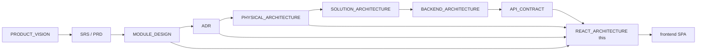

| Document | What it owns | How this RAS uses it |
|----------|--------------|----------------------|
| PRODUCT_VISION | Municipal platform intent; producers primarily mobile | Constrains SPA to municipality admin/officer surfaces; producers remain React Native |
| SRS / PRD | Requirements and journeys | Admin journeys map to routes and feature modules |
| MODULE_DESIGN | Bounded contexts, permissions, ubiquitous language | Feature folders and permission constants mirror module language |
| ADR-008 / 013 / 014 / 018 | SignalR, JWT+refresh, RBAC+permissions, Problem Details | Normative client behaviors for realtime, session, authZ UX, errors |
| PHYSICAL_ARCHITECTURE | SPA static hosting, CORS, CDN, config.js | Deployment and runtime config strategy |
| SOLUTION_ARCHITECTURE | `frontend/` outside .NET solution | Confirms client is not a module inside the monolith |
| BACKEND_ARCHITECTURE | API behaviors, hubs, uploads | Client adapters must match host semantics |
| API_CONTRACT | Routes, DTOs, auth, pagination, error codes | **Primary HTTP parent** for the SPA API layer |

### How Developers Use This Document

1. **Evolving the existing Vite scaffold:** Treat current `frontend/` pages as a temporary exploration surface; migrate toward the folder and feature model in Sections 4–5 without a big-bang rewrite unless Board approves.
2. **Adding a domain feature:** Locate the feature in Section 5; place routes, queries, mutations, forms, and permission gates in the prescribed tree; consume only `/api/v1` resources owned by that domain.
3. **Auth or token changes:** Follow Section 9; do not invent alternate session stores that contradict ADR-013 / API_CONTRACT §5.
4. **Grid, modal, or form patterns:** Use Sections 15–18 and component sections; prefer shared primitives over one-off page widgets.
5. **Deploy and config:** Section 28 and PHYSICAL_ARCHITECTURE remain authoritative for static hosting and environment injection.

### Non-Goals of This Document

- This is **not** a React tutorial, Hooks primer, or TypeScript course.
- This is **not** a substitute for API_CONTRACT route catalogs or MODULE_DESIGN invariants.
- This document **does not** authorize generating application source under `frontend/` as part of documentation workstreams; it specifies target architecture for implementers.
- This document **does not** design the React Native producer/inspector apps (separate mobile architecture when authored).
- Delivery remains API-exposed under `/api/v1/deliveries` while Harvest owns the capability (API_CONTRACT / MODULE_DESIGN §6.8); the SPA may host a Delivery feature folder that calls those routes.

---

# 1. Executive Intent

## 1.1 What the React Admin Client Is

The Agriculture Management System **municipal admin / web client** is a **React Single-Page Application (SPA)** consumed by municipal administrators, agriculture officers, and (selectively) inspectors in a browser. It is the operational cockpit for producer registry, land parcels, seasons, workflow assignment, task oversight, inspection coordination, harvest and delivery monitoring, support programs, notifications administration, reporting dashboards, and system administration.

It is **not** the primary producer work surface. PRODUCT_VISION and API_CONTRACT state that producers primarily interact through the **React Native** mobile application. The SPA must not grow producer field-completion UX that duplicates mobile evidence capture as a first-class product path, except for limited officer-assisted overrides explicitly authorized by product and permission catalogs (e.g., `tasks.complete_any`).

## 1.2 Client Boundary (Normative)

| Concern | React SPA (`frontend/`) | React Native (`mobile/`) |
|---------|-------------------------|--------------------------|
| Primary personas | Administrator, Officer; Inspector (optional read/ops) | Producer; Inspector (field) |
| Primary channels | HTTPS REST + SignalR | HTTPS REST + FCM (+ optional SignalR when foregrounded) |
| Offline | Soft degradation; not a field-offline product | Offline-capable task/evidence flows |
| Auth clientId | `web-admin` (or Board-approved constant) | `mobile-producer` / `mobile-inspector` |
| Token storage | Memory access token + carefully constrained refresh strategy (Section 9) | Secure device storage |
| Push | In-app + SignalR; browser notifications optional later | FCM (ADR-009) |

**Reasoning:** Separating deployables and UX mandates prevents the admin SPA from becoming a second mobile app in a browser, keeps bundle size and accessibility focused on dense municipal grids, and aligns PHYSICAL_ARCHITECTURE’s distinct static hosting vs mobile stores.

## 1.3 Implementation-Ready Goal

When this document is followed, a team can:

- Evolve the existing Vite + React Router scaffold into a feature-based enterprise SPA without contradicting backend contracts.
- Place every new screen, query, mutation, and permission gate in a predictable folder.
- Implement JWT login, refresh rotation, logout, and 401 recovery exactly as API_CONTRACT §5 describes.
- Map UI capabilities to MODULE_DESIGN / API_CONTRACT permission strings (not invent parallel permission names).
- Consume Problem Details (`application/problem+json`) uniformly.
- Deploy static assets per PHYSICAL_ARCHITECTURE (reverse proxy / CDN, runtime config).
- Add SignalR dashboard subscriptions without coupling domain features to hub transport details.

## 1.4 Alignment with Modular Monolith

The SPA is a **thin presentation + orchestration client**. Domain invariants, CQRS handlers, schema ownership, Hangfire, and outbox live on the server (BACKEND_ARCHITECTURE, MODULE_DESIGN). The client:

- Speaks **commands and queries as HTTP resources** (action POSTs such as `POST /tasks/{id}/complete`, never status PATCH anti-patterns forbidden by API_CONTRACT §2.2).
- Mirrors **bounded contexts as feature folders**, not as a second modular monolith in TypeScript.
- Never embeds business rules that the API already enforces as the sole source of truth; client validation exists for UX speed and accessibility, not authority.

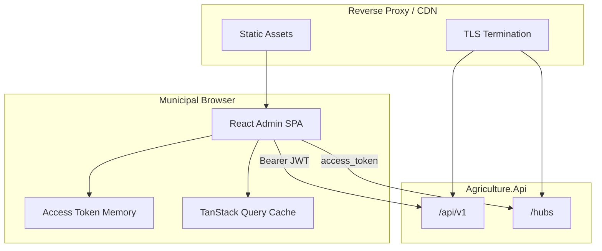

## 1.5 Success Criteria

| Criterion | Observable evidence |
|-----------|---------------------|
| Contract fidelity | All admin reads/writes go through typed API clients for `/api/v1`; Problem Details parsed centrally |
| Feature ownership | Each MODULE_DESIGN context has a clear `features/{name}` home (or an explicit shared home) |
| Auth correctness | Refresh rotation, logout revoke, and 401 single-flight refresh match API_CONTRACT |
| AuthZ UX | Buttons/routes gated by permission strings; server remains authoritative |
| Operability | Runtime config for API base URL; correlation id on requests; deploy cache-busting |
| Accessibility | Keyboard and screen-reader paths for primary admin grids and dialogs |
| Performance | Route-level code splitting; query cache prevents redundant list thrash |

## 1.6 Anti-Patterns Explicitly Rejected

1. **God `pages/` dumping ground** without feature boundaries — rejected as the long-term model (scaffold may start there; target is feature-based).
2. **Redux for all server state** when TanStack Query already owns server cache — rejected for default CRUD/list/detail.
3. **Storing access JWT in `localStorage` without Board threat review** — strongly discouraged; prefer memory + refresh strategy in Section 9.
4. **Client-only authorization** (hiding buttons without server enforcement) presented as secure — rejected; UI gates are UX only.
5. **Inventing permission strings** not in API_CONTRACT / MODULE_DESIGN — rejected.
6. **PATCH status transitions** — rejected (API_CONTRACT forbids).
7. **Coupling producer mobile offline sync into admin SPA** — rejected.
8. **Shared “utils” junk drawers** that accumulate domain DTOs — rejected; prefer `shared/` with clear categories and feature-local helpers.

---

# 2. Technology Choices (Recommended Stack)

Prior ADRs lock **React** for web and **React Native** for mobile. This specification fills frontend library choices that those ADRs intentionally left open, without contradicting them.

## 2.1 Core Runtime

| Choice | Recommendation | Reasoning |
|--------|----------------|-----------|
| Language | TypeScript (strict) | Municipal auditability, DTO alignment with OpenAPI, safer refactors across features |
| UI library | React 19 (align with scaffold) | Concurrent features; matches existing `frontend/package.json` |
| Bundler / Dev | Vite | Fast HMR; static output fits PHYSICAL_ARCHITECTURE SPA hosting; already in scaffold |
| Routing | React Router (Data APIs / v7 as scaffolded) | Industry standard for SPAs; nested layouts; lazy routes |
| Server state | TanStack Query (React Query) v5+ | Canonical cache, retries, deduplication for `/api/v1` lists/details |
| Client session UI state | React Context + small stores (or Zustand if Board prefers) | Auth session and theme are cross-cutting; avoid Redux boilerplate unless complexity explains it |
| Forms | React Hook Form | Performant large admin forms; integrates with Zod resolvers |
| Schema validation | Zod | Shared client schemas for forms + runtime DTO guards at boundaries |
| HTTP | `fetch` wrapper (or ky/axios with Board approval) | Centralize Bearer, correlation id, Problem Details; prefer thin wrapper over heavy SDK |
| Realtime | `@microsoft/signalr` | ADR-008; JWT via `access_token` query for hubs (API_CONTRACT §5.5) |
| Styling | CSS Modules or design-token CSS variables + limited utility layer | Avoid purple-default AI aesthetics; municipal brand tokens; dark mode via tokens |
| Component primitives | Headless (Radix/React Aria) + project styling **or** Board-approved design system | Accessibility-first dialogs/menus; do not lock domain logic into a heavy themeable kit without review |
| Dates | date-fns or Temporal polyfill (Board pick one) | ISO-8601 UTC from API; display in municipal locale |
| i18n | i18next + react-i18next (or FormatJS) | Turkish municipal default + English ops; Section 21 |
| Lint / format | oxlint (scaffold) + Prettier (recommended) | Keep scaffold lint; add format consistency |
| Unit test | Vitest + Testing Library | Vite-native; component behavior tests |
| E2E | Playwright | Admin journey coverage against staging |

**Reasoning for not choosing Next.js by default:** PHYSICAL_ARCHITECTURE treats the admin client as a **static SPA** behind reverse proxy/CDN with runtime `config.js`. SSR/ISR adds hosting complexity without a content-marketing SEO requirement for an authenticated municipal back-office. A future ADR may revisit if public anonymous pages appear.

**Reasoning for TanStack Query over RTK Query:** Stack does not mandate Redux. TanStack Query is purpose-built for server cache, pairs cleanly with feature folders, and avoids forcing global store taxonomy onto every list page.

**Reasoning for Zod + React Hook Form:** API_CONTRACT validation is authoritative on the server (FluentValidation). Client schemas improve UX (inline errors, disable submit) and can mirror field names from Problem Details `errors[].field`. Zod also documents expected DTO shapes at the TypeScript boundary.

## 2.2 Version Policy

- Prefer current major versions already present in scaffold (React 19, Vite 8, React Router 7) unless security advisories force change.
- Pin dependency ranges in lockfile; renovate/dependabot under municipal change windows.
- OpenAPI-driven type generation (optional later) must not silently diverge from API_CONTRACT normative prose — contract doc remains human-authoritative.

## 2.3 Scaffold Evolution Policy

The repository already contains a Vite React scaffold with flat `pages/` (Dashboard, Producers, Lands, Seasons, Workflows, Tasks, Inspections) and a simple `AuthContext`. That scaffold is a **starting point**, not the target architecture.

| Phase | Allowed work |
|-------|----------------|
| Now | Keep scaffold compiling; avoid inventing parallel apps |
| Near-term | Introduce `src/app`, `src/features`, `src/shared`, TanStack Query, API client, permission gates |
| Mid-term | Migrate pages into features; add remaining API modules (Harvest, Delivery, Support, Notifications, Reporting, Administration, Identity admin) |
| Explicit non-goal | Documentation workstreams rewriting `frontend/src` |

---

# 3. System Context and Personas

## 3.1 Personas on the SPA

| Persona | Role claim (API_CONTRACT) | SPA expectations |
|---------|---------------------------|------------------|
| Administrator | Admin | Full administration, identity, feature flags, audit, reporting exports |
| Agriculture Officer | Officer | Day-to-day producer/land/season/workflow/task/support operations |
| Inspector | Inspector | Primarily field via mobile; SPA may expose workload queues, assignment views, read-only season context when product enables |
| Producer | Producer | **Out of primary SPA scope**; if a producer JWT reaches the SPA, show restricted denial and direct to mobile |

**Reasoning:** PRODUCT_VISION separates municipal monitoring from producer mobile completion. Exposing full producer task completion UI in the SPA would dilute accessibility, offline, and camera evidence requirements owned by mobile.

## 3.2 Tenant and Municipality Scope

All API calls are tenant-scoped (API_CONTRACT §6.3). The SPA:

- Never offers a “pick any tenant” control unless Administration explicitly provides multi-tenant ops under Board policy.
- Treats `tenantId` from `/auth/me` (or login `user`) as ambient context for display only; server filters remain authoritative.
- Surfaces `404`/`403` Problem Details without attempting to probe cross-tenant existence.

---

# 4. Folder Structure

## 4.1 Target Repository Layout (Frontend)

```text
frontend/
  public/
    favicon.svg
    config.template.js          # optional template for deploy-time config
  src/
    app/                        # application shell: providers, router, layouts
      providers/
      router/
      layouts/
      styles/
    features/                   # domain features (MODULE_DESIGN language)
      auth/
      dashboard/
      identity/
      producers/
      lands/
      seasons/
      workflows/
      tasks/
      inspections/
      harvest/
      deliveries/               # API /deliveries; Harvest-owned capability
      support/
      notifications/
      communication/            # if admin moderation surfaces exist
      reporting/
      administration/
    shared/                     # cross-feature primitives (no domain ownership leakage)
      api/
      auth/
      config/
      errors/
      i18n/
      permissions/
      ui/
      lib/
      types/
      hooks/
      realtime/
    test/                       # shared test utils (or colocated __tests__)
    main.tsx
    vite-env.d.ts
  index.html
  package.json
  tsconfig.json
  vite.config.ts
  playwright.config.ts          # when E2E added
  README.md                     # engineer onboarding for SPA only
```

## 4.2 Reasoning for This Tree

| Decision | Reasoning |
|----------|-----------|
| `app/` vs `features/` | Separates shell concerns (router, providers) from business capabilities so module owners do not edit bootstrap for routine features |
| `features/{domain}` | Mirrors MODULE_DESIGN ubiquitous language and API_CONTRACT tags; reduces cross-feature import sprawl |
| `shared/api` | Single HTTP/Problem Details/correlation implementation prevents divergent Bearer handling |
| `shared/ui` | Design-system primitives without knowing Producers vs Lands |
| `deliveries/` feature name | Matches user-facing resource `/deliveries` while docs note Harvest ownership — avoids lying about API paths |
| No `components/` at root for domain widgets | Root components become junk drawers; domain widgets live under features |

## 4.3 Import Direction Rules

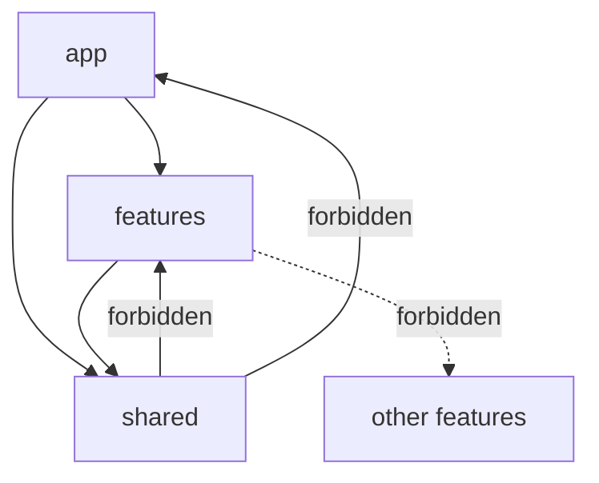

**Normative rules:**

1. `features/A` must not import from `features/B` except via `shared` or explicit thin `shared` facades (preferred: navigate by id, refetch).
2. Cross-feature UX (e.g., “open producer from task row”) uses routing + query keys, not deep imports of another feature’s internal components.
3. `shared` never imports `features` or `app`.
4. Public surface of a feature may expose a small `index.ts` barrel for routes registration only — avoid mega-barrels that defeat tree shaking.

**Reasoning:** Mirrors modular monolith Contracts-only coupling at the UI layer without pretending TypeScript folders are deployable services.

## 4.4 Per-Feature Internal Structure

```text
features/producers/
  routes.tsx                 # route objects / lazy elements
  pages/
    ProducersListPage.tsx
    ProducerDetailPage.tsx
    ProducerCreatePage.tsx
  components/                # feature-local UI
  api/
    producers.api.ts         # functions calling shared http client
    producers.keys.ts        # TanStack Query key factory
    producers.types.ts       # DTOs / zod schemas for this feature
  hooks/
    useProducersQuery.ts
    useProducerMutation.ts
  model/                     # optional view-models / mappers
  permissions.ts             # re-exports / local constants referencing shared catalog
  index.ts                   # route export only
```

**Reasoning:** Colocating API keys, hooks, and pages keeps change sets reviewable when API_CONTRACT Producers section changes.

---

# 5. Feature-Based Architecture

## 5.1 Mapping Features to API_CONTRACT Modules

| Feature folder | Primary `/api/v1` resources | Typical SPA capabilities |
|----------------|----------------------------|---------------------------|
| `auth` | `/auth/login`, `/auth/refresh`, `/auth/logout`, `/auth/me`, password flows | Login, session bootstrap, password change |
| `identity` | `/users`, roles, permissions admin | User admin, role assignment |
| `dashboard` | Reporting KPIs + SignalR topics | Season pulse, delayed tasks, inspection blockers |
| `producers` | `/producers` | Registry CRUD, search, deactivate, assign |
| `lands` | `/lands` | Parcel registry, archive |
| `seasons` | `/seasons` | Lifecycle start/pause/complete/archive, assign workflow |
| `workflows` | `/workflows` | Definition manage; runtime read/control |
| `tasks` | `/tasks` | Officer oversight, assign, cancel, delay; rare complete_any |
| `inspections` | `/inspections` | Create/assign/complete/reject oversight |
| `harvest` | `/harvests` (per contract naming) | Start/complete/cancel monitoring |
| `deliveries` | `/deliveries` | Create/complete/cancel; concurrency via ETag |
| `support` | support programs/applications | Approve/fulfill queues |
| `notifications` | inbox admin + templates | `notifications.admin_view`, templates.manage |
| `communication` | moderation / officer messaging if exposed | Moderate/send as permitted |
| `reporting` | dashboards, exports | View dashboards; run exports |
| `administration` | settings, feature flags, audit | `admin.*` permissions |

## 5.2 Feature Ownership Model

| Role | Owns | Does not own |
|------|------|--------------|
| Feature Owner | Screens, query keys, feature components, local copy | Shared HTTP client internals; other features’ pages |
| Shared UI Steward | `shared/ui`, theme tokens, table/modal primitives | Domain DTO semantics |
| Auth Steward | Session, refresh single-flight, route guards | Per-feature business forms |
| SPA Owner | Router composition, providers, deploy config contract | Backend schemas |

## 5.3 Vertical Slices vs Horizontal Layers

The SPA uses **vertical feature slices** with a thin horizontal shared platform:

- Horizontal: HTTP, auth session, permissions evaluation helpers, design tokens, i18n, error boundary shell, SignalR connection manager.
- Vertical: each domain feature owns its routes and server interactions.

**Reasoning:** Horizontal-only `services/` + `components/` + `pages/` layers caused the classic “change producers touches five unrelated folders” problem. Vertical slices localize API_CONTRACT churn.

## 5.4 Shared Kernel Discipline (Frontend Analogy)

`shared/` is analogous to backend Shared Kernel: **primitives only**. Allowed: HTTP types, `ProblemDetails` parser, `Permission` string union sourced from catalog, pagination helpers, date formatting, UI Button/Dialog/DataTable. Forbidden: `ProducerForm` in shared, `TaskStatusBadge` if it encodes Tasks ubiquitous language — those stay in features (or a carefully named `shared/ui/status` only if multiple features need identical presentation and Board accepts coupling).

---

# 6. Routing

## 6.1 Router Responsibilities

React Router owns:

- URL ↔ screen mapping for bookmarkable admin entities (`/producers/:id`).
- Nested layout routes (shell chrome vs auth layout).
- Lazy route elements for code splitting (Section 25–26).
- Loaders **only** when they do not duplicate TanStack Query responsibilities; prefer Query for API data to keep cache coherent.

**Reasoning:** Mixing React Router loaders and TanStack Query for the same resource without a strict rule creates double-fetch and cache divergence. Default rule: **TanStack Query fetches domain data; Router handles navigation and guards.**

## 6.2 Target Route Map (Illustrative)

```text
/login
/forgot-password
/reset-password
/                           → AppShell
  /dashboard
  /producers
  /producers/new
  /producers/:producerId
  /lands
  /lands/:landId
  /seasons
  /seasons/:seasonId
  /workflows
  /workflows/:workflowId
  /tasks
  /tasks/:taskId
  /inspections
  /inspections/:inspectionId
  /harvest
  /harvest/:harvestId
  /deliveries
  /deliveries/:deliveryId
  /support
  /notifications
  /reporting
  /admin/users
  /admin/roles
  /admin/settings
  /admin/feature-flags
  /admin/audit
  /account/password
```

Exact path segments should stay plural nouns aligned with API resources where practical for operator mental model.

## 6.3 Route Guards

```mermaid
flowchart TD
  Nav[Navigation] --> Authed{Access token / session?}
  Authed -->|no| Login[/login]
  Authed -->|yes| Me{ /auth/me hydrated?}
  Me -->|no| Bootstrap[Bootstrap session]
  Bootstrap --> Role{Producer-only?}
  Role -->|yes| Denied[Restricted screen]
  Role -->|no| Perm{Route permission?}
  Perm -->|fail| Forbidden[403 page]
  Perm -->|pass| Page[Feature page]
```

Guards evaluate:

1. Authentication presence (session).
2. Optional role gate (block Producer-primary accounts).
3. Permission gate for route module (e.g., `producers.read` for `/producers`).
4. Feature flag gate from Administration when applicable.

**Reasoning:** Defense in depth mirrors API policies; users should not land on empty error-prone forms they cannot submit.

## 6.4 Deep Linking and Return URLs

After login, redirect to safe internal `returnUrl` only (same-origin path whitelist). Reject open redirects.

## 6.5 Routing Diagram (Shell)

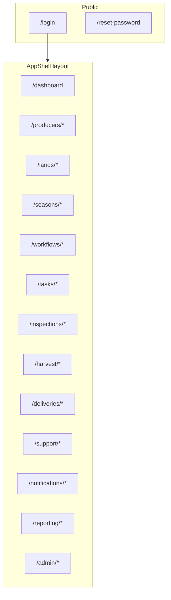

---

# 7. State Management

## 7.1 State Categories

| Category | Examples | Home |
|----------|----------|------|
| Server state | Producer lists, task details, report snapshots | TanStack Query cache |
| Session state | Access token, user summary, permissions, refresh orchestration | `shared/auth` session module |
| Ephemeral UI state | Modal open, table column visibility, wizard step | Component state or feature store |
| Cross-cutting preferences | Theme, locale, density | Persisted preference store (localStorage ok for non-secrets) |
| Realtime overlays | Live task completion toasts, dashboard counters | SignalR handlers → Query invalidation / optimistic patches |

## 7.2 Decision: No Default Global Redux

**Decision:** Do not adopt Redux Toolkit as the default application state container.

**Reasoning:** Most admin state is remote and cacheable. Redux shines for complex client-only workflows; municipal admin workflows are predominantly server-authoritative lifecycles (season start, inspection complete). Introducing Redux for lists duplicates TanStack Query and increases boilerplate. If a feature later needs a complex multi-step client wizard with undo, a feature-local store (Zustand or Redux slice) may be introduced without making Redux global dogma.

## 7.3 URL as State

Filters that users bookmark (`status`, `seasonId`, `q`, `page`) belong in the **URL query string**, synchronized to TanStack Query keys.

**Reasoning:** Officers share links during planting week; URL state survives refresh; aligns with API query parameters (`page`, `pageSize`, `sort`, `q`).

## 7.4 Derived State

Prefer deriving view models in selectors/mappers from query data rather than storing duplicates. Example: “overdue” badge computed from `dueDate` + status, unless Reporting provides a dedicated read model.

---

# 8. TanStack Query

## 8.1 Role

TanStack Query is the **system of record in the browser** for server data: caching, deduplication, background refresh, mutation lifecycle, and retry policy aligned with idempotent GETs.

## 8.2 Query Key Factory Convention

```text
producersKeys.all → ['producers']
producersKeys.lists → ['producers', 'list']
producersKeys.list(filters) → ['producers', 'list', filters]
producersKeys.details → ['producers', 'detail']
producersKeys.detail(id) → ['producers', 'detail', id]
```

**Reasoning:** Hierarchical keys enable precise invalidation (`invalidateQueries({ queryKey: producersKeys.lists })`) after creates without wiping unrelated detail cache unnecessarily—or wipe both when Board prefers simplicity.

## 8.3 Defaults (Normative Starting Point)

| Option | Suggested default | Reasoning |
|--------|-------------------|-----------|
| `staleTime` | 30_000 ms for lists; 60_000 for reference catalogs | API catalogs may send `Cache-Control: private, max-age=60` |
| `gcTime` | 5–15 minutes | Memory vs revisit cost for admin sessions |
| `retry` | 1–2 for GET; 0 for mutations unless idempotent + Idempotency-Key | Avoid duplicate POSTs |
| `refetchOnWindowFocus` | true for dashboards; consider false for huge exports pages | Officers alt-tab during calls |
| `networkMode` | online | SPA is not offline-first |

## 8.4 Mutations and Invalidation

After successful lifecycle commands (`POST .../complete`, season start, delivery complete):

1. Invalidate affected list keys.
2. Invalidate detail key for the entity.
3. Invalidate related dashboards/reporting keys when SignalR is not yet connected.
4. Apply optimistic updates **only** when rollback is safe and UX critically needs snappiness; prefer invalidation for municipal correctness.

**Reasoning:** Lifecycle actions can trigger server policies and integration events; optimistic UI that assumes success risks lying about harvest eligibility.

## 8.5 Pagination

Offset pagination (`page`, `pageSize`, `totalCount`) maps to list queries returning `PagedResult<T>` (API_CONTRACT §3.1). Use `placeholderData: keepPreviousData` (or `placeholderData` prior data) for smooth page flips.

Cursor pagination is primarily mobile inbox; if admin notifications use cursor, mirror `cursor`/`limit` exactly.

## 8.6 Query Cache Diagram

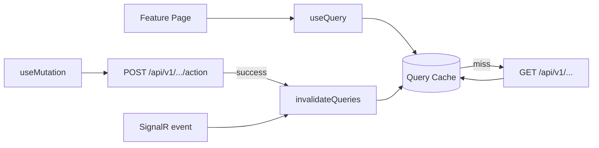

## 8.7 Prefetching

On row hover or “next page” intent, prefetch detail or next page when network budget allows. Do not prefetch entire seasons’ task graphs eagerly.

---

# 9. Authentication Flow

Aligned with ADR-013 and API_CONTRACT §5.

## 9.1 Tokens

| Token | Client handling |
|-------|-----------------|
| Access JWT | Prefer **in-memory** only; attach as `Authorization: Bearer` |
| Refresh | Opaque; persist using Board-approved strategy (see 9.3); send to `/auth/refresh` with `clientId` |
| `clientId` | Stable web client identifier (e.g., `web-admin`) required by login/refresh contracts |

## 9.2 Login Sequence

```mermaid
sequenceDiagram
  participant U as Officer
  participant SPA as React SPA
  participant API as Agriculture.Api

  U->>SPA: Submit credentials
  SPA->>API: POST /api/v1/auth/login {userName,password,clientId}
  API-->>SPA: AuthTokenResponse
  SPA->>SPA: Store access in memory; store refresh per policy
  SPA->>API: GET /api/v1/auth/me
  API-->>SPA: User + roles + permissions[]
  SPA->>SPA: Hydrate permission set; enter AppShell
```

## 9.3 Refresh Rotation and Single-Flight

API_CONTRACT requires refresh rotation with reuse detection (family revoke). The SPA must:

1. On `401` from API (expired access), attempt **one** refresh.
2. Queue concurrent requests behind a **single-flight** refresh promise.
3. Retry original requests with new access token on success.
4. On refresh failure or reuse detection failure, clear session and route to `/login`.
5. Never enter an infinite 401↔refresh loop.

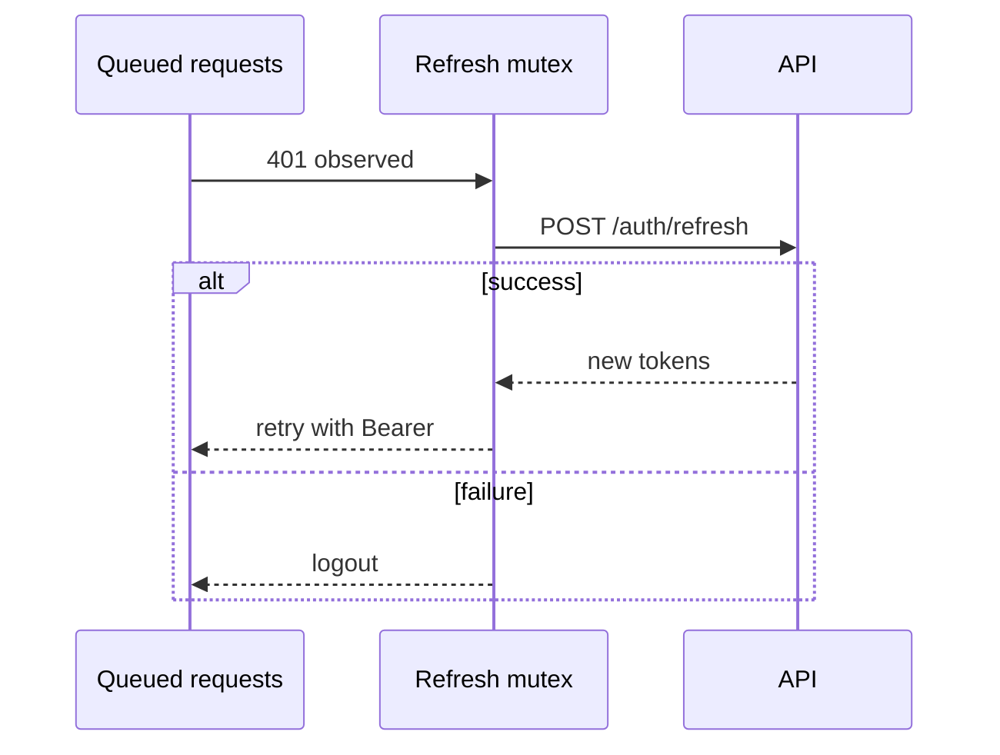

## 9.4 Logout

Call `POST /api/v1/auth/logout` with refresh token (API_CONTRACT), clear memory, clear refresh storage, disconnect SignalR, clear TanStack Query cache (privacy), navigate to login.

## 9.5 Password Flows

Support change-password (authenticated) and reset-password request/confirm (anonymous) per API_CONTRACT. After password change, expect refresh families revoked — force re-login.

## 9.6 SignalR Auth

When connecting hubs, provide access token via factory; API_CONTRACT §5.5 allows `access_token` query string for browser WebSockets. Refresh should reconnect hubs with new token.

## 9.7 Storage Threat Reasoning

| Approach | Pros | Cons | Guidance |
|----------|------|------|----------|
| Memory access + httpOnly cookie refresh | Refresh less XSS-exposable | Requires cookie CSRF strategy; CORS credentials | Board may adopt with PHYSICAL_ARCHITECTURE CSRF notes |
| Memory access + sessionStorage refresh | Survives refresh within tab | XSS can read; tab-scoped | Acceptable interim with strict CSP |
| localStorage both tokens | Simple | XSS steals long-lived refresh | Discouraged for production municipal |

PHYSICAL_ARCHITECTURE notes Bearer SPA patterns and CSP criticality. This RAS recommends **memory access token + Board-approved refresh persistence**, CSP, and short access TTL (10–30 minutes) as primary mitigations.

## 9.8 Bootstrap on App Load

If refresh material exists, attempt refresh or `/auth/me` before rendering protected routes to avoid login flicker. Show a minimal boot splash, not the full shell.

---

# 10. Authorization

Aligned with ADR-014, MODULE_DESIGN §8.2, API_CONTRACT §6.

## 10.1 Model Mirrored in the SPA

1. **Roles** — Admin, Officer, Inspector, Producer (coarse UX).
2. **Permissions** — fine-grained strings from the normative catalog.
3. **UI policies** — route/component gates map 1:1 to permission strings.
4. **Resource checks** — server-side; SPA may hide actions but must handle `403` gracefully.

## 10.2 Permission Catalog (Client Constant Source)

The SPA maintains a typed permission catalog **copied from** API_CONTRACT §6.2 / MODULE_DESIGN — not reinvented:

- Identity: `identity.users.read`, `identity.users.create`, …
- Producers: `producers.read`, `producers.create`, `producers.update`, `producers.deactivate`, `producers.assign`
- Lands: `lands.read`, `lands.create`, `lands.update`, `lands.archive`
- Seasons: `seasons.read`, `seasons.create`, `seasons.start`, `seasons.pause`, `seasons.complete`, `seasons.archive`, `seasons.assign_workflow`
- Workflows: `workflows.definitions.manage`, `workflows.runtime.read`, `workflows.runtime.control`
- Tasks: `tasks.read`, `tasks.assign`, `tasks.complete_own`, `tasks.complete_any`, `tasks.cancel`, `tasks.delay`
- Inspections: `inspections.read`, `inspections.create`, `inspections.assign`, `inspections.complete`, `inspections.reject`
- Harvest/Delivery: `harvest.read`, `harvest.start`, `harvest.complete`, `harvest.cancel`, `delivery.read`, `delivery.create`, `delivery.complete`, `delivery.cancel`
- Support: `support.programs.manage`, `support.applications.read`, `support.approve`, `support.fulfill`
- Notifications: `notifications.read_own`, `notifications.templates.manage`, `notifications.admin_view`
- Communication: `communication.inbox`, `communication.send`, `communication.moderate`
- Reporting: `reporting.dashboards.view`, `reporting.exports.run`, `reporting.definitions.manage`
- Administration: `admin.settings.manage`, `admin.audit.read`, `admin.features.manage`

**Reasoning:** Divergent string literals cause “UI says allowed, API says 403” defects that waste planting-week support time.

## 10.3 Evaluation Helpers

Provide pure functions:

- `hasPermission(user, permission)`
- `hasAnyPermission(user, permissions[])`
- `hasAllPermissions(user, permissions[])`
- `hasRole(user, role)`

Permissions come from `/auth/me` (`permissions[]`) and/or JWT claims. Prefer `/auth/me` as hydration source after login for freshness; JWT may embed subset or version claim (MODULE_DESIGN §8.2).

## 10.4 Permission Components

See Section 19. Pattern: declarative `<RequirePermission permission="producers.create">` wrapping buttons and route elements. When denied, either hide (default for toolbars) or show disabled with tooltip (when discoverability matters). Never fake success.

## 10.5 Stale Permissions

On role change, server revokes refresh families (ADR-013 failure-mode notes). SPA still must:

- Periodically re-fetch `/auth/me` on focus for long sessions, or
- React to a SignalR security event if provided later, or
- Rely on short access TTL + failed API calls to force re-auth.

## 10.6 Producer Accounts on Admin Host

If `roles` contain only Producer, render a dedicated “use the mobile application” message. Do not mount admin shell navigation.

---

# 11. Layout System

## 11.1 Layouts

| Layout | Use |
|--------|-----|
| `AuthLayout` | Login, reset password — minimal chrome, brand present, no sidebar |
| `AppShellLayout` | Authenticated admin — sidebar/nav, top bar, content outlet, notification bell |
| `BlankLayout` | Rare print/export preview |

## 11.2 App Shell Structure

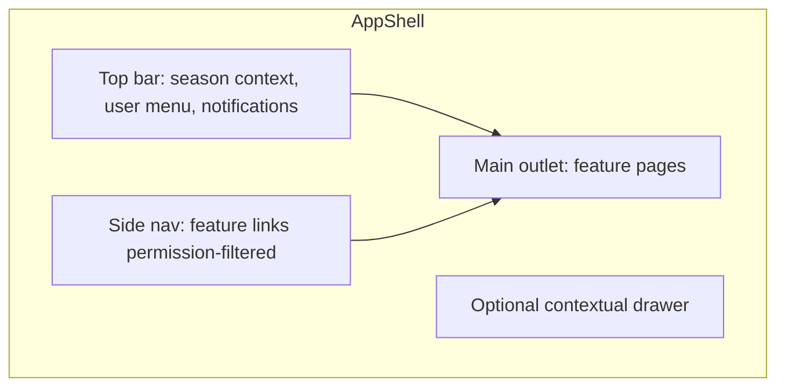

## 11.3 Navigation Information Architecture

Group nav by operator mental model, aligned to domains:

1. Overview (Dashboard)
2. Registry (Producers, Lands)
3. Production (Seasons, Workflows, Tasks, Inspections)
4. Output (Harvest, Deliveries)
5. Programs (Support)
6. Insights (Reporting)
7. System (Notifications admin, Communication moderation, Administration, Identity)

Hide items lacking read permission.

## 11.4 Season Context

Many admin views are season-scoped. Provide a shell-level **active season** selector stored in URL or preference, passed as default filter to child features.

**Reasoning:** Officers live inside an active planting season; forcing every page to re-select season increases error rates.

## 11.5 Responsive Behavior

Admin is desktop-first (dense tables) but must remain usable on tablet for hallway/warehouse terminals: collapsible sidebar, responsive table → card fallback for critical queues only.

## 11.6 Layout Density

Support comfortable vs compact density tokens for power users during harvest peaks without adding a second theme system.

---

# 12. Theme

## 12.1 Design Tokens

Define CSS variables for:

- Color roles: `canvas`, `surface`, `border`, `text`, `text-muted`, `primary`, `danger`, `warning`, `success`
- Elevation (use sparingly; prefer borders over multi-shadow stacks)
- Radii, spacing scale, font families
- Focus ring tokens (accessibility)

**Reasoning:** Tokenized themes enable dark mode and municipal branding without rewriting components. Avoid generic “AI purple gradient” defaults; municipal agriculture branding should use Board-approved palette (earth/leaf accents are product choices, not mandated here beyond rejecting purple-on-white cliché as default).

## 12.2 Typography

Select purposeful fonts via municipal brand guidelines. Do not ship Inter/Roboto/Arial as the intentional brand voice if brand fonts exist; fall back systematically.

## 12.3 Brand in Shell

Product name must be clear in the shell header. Auth layout should present municipal/product identity prominently (PRODUCT_VISION municipal platform).

## 12.4 Chart and Map Colors

Reporting charts use tokenized categorical palettes with color-blind safe defaults.

---

# 13. Dark Mode

## 13.1 Strategy

Implement dark mode via **CSS variable swaps** on `data-theme="light|dark"` (or `class`) at the document root, not via duplicate component trees.

## 13.2 Preference Cascade

1. User preference in settings (persisted).
2. Else system `prefers-color-scheme`.
3. Else municipal default (typically light for office printing habits — Board configurable).

## 13.3 Constraints

- Do not animate entire theme toggles in a way that thrash layout.
- Ensure charts and map tiles have dark-aware variants.
- Maintain WCAG contrast for both themes.
- Persist preference as non-secret local data.

**Reasoning:** Officers work long sessions; dark mode reduces glare for night harvest ops monitoring without requiring a separate CSS codebase.

---

# 14. Error Handling

## 14.1 Problem Details as Normative Client Errors

All non-2xx JSON errors from `/api/v1` SHOULD be parsed as RFC 7807 Problem Details (`type`, `title`, `status`, `detail`, `instance`, `correlationId`, `errorCode`, `errors[]`) per API_CONTRACT §4.

Central parser produces a typed `AppError`:

- `kind`: `validation` | `auth` | `forbidden` | `notFound` | `conflict` | `rateLimit` | `server` | `network` | `unknown`
- `errorCode`, `correlationId`, field errors map

## 14.2 Mapping HTTP Status

| Status | SPA behavior |
|--------|----------------|
| 400 | Bind field errors to form; toast summary |
| 401 | Refresh single-flight or logout |
| 403 | Forbidden page or inline alert |
| 404 | Not found page or empty detail |
| 409 | Conflict UI; offer reload (ETag concurrency) |
| 429 | Honor `Retry-After`; backoff messaging |
| 500/503 | Generic safe message + correlation id for support |
| Network fail | Offline/network banner |

## 14.3 Correlation Id

Send `X-Correlation-Id` on requests (generate UUID if absent); display on error dialogs so municipal IT can search Seq (ADR-011 / PHYSICAL_ARCHITECTURE observability).

## 14.4 User-Visible Copy

Prefer `detail` when safe; map known `errorCode` values to i18n messages for stable UX when `detail` is English-only from server.

## 14.5 Boundary vs Query Errors

- **Error boundaries** catch render/runtime exceptions.
- **Query/mutation errors** are expected control flow — display in feature UI, not as boundary crashes.

---

# 15. Forms

## 15.1 Standard Stack

React Hook Form + Zod resolver for create/edit and lifecycle confirmation forms.

## 15.2 Form Patterns

| Pattern | Use |
|---------|-----|
| Create page / drawer | Producers, lands, inspections |
| Edit page | Profile-like resources with PUT |
| Confirm dialog form | Lifecycle actions needing comment/reason (delay task) |
| Wizard | Rare; season setup if product requires multi-step |

## 15.3 Server Authority

Disable submit while mutation pending. On 400, map `errors[].field` to RHF `setError`. On 409 concurrency, reload entity ETag and ask user to review.

## 15.4 Action Posts vs Forms

Lifecycle buttons (`Start Season`, `Complete Inspection`) are mutations with optional confirmation modal forms — not free-form PATCH editors of status fields.

## 15.5 Drafts

Local draft autosave is optional for long Support notes; never treat local draft as server truth.

---

# 16. Validation

## 16.1 Layers

1. **HTML constraints** — basic required/maxLength for accessibility.
2. **Zod schemas** — client synchronous validation.
3. **FluentValidation on server** — authoritative (API_CONTRACT §8).

## 16.2 Schema Ownership

Place Zod schemas in `features/{domain}/api/*.types.ts` or `model/schemas.ts`. Shared primitives (UUID, non-empty string, pageSize max 100) live in `shared/lib/validation`.

## 16.3 Parity Guidance

Keep field names aligned with API DTO camelCase. When OpenAPI generation exists, prefer generating types and hand-writing Zod only where UX needs tighter pre-checks — or generate Zod if toolchain supports.

## 16.4 File Uploads

Respect content-type allowlists and size limits from API_CONTRACT upload rules. Show progress; use `Idempotency-Key` for complete-upload style calls when contract requires.

---

# 17. API Layer

## 17.1 Responsibilities

`shared/api` provides:

- Base URL resolution from runtime config (PHYSICAL_ARCHITECTURE `config.js` preference).
- `fetch` wrapper with JSON defaults.
- Authorization header injection.
- Correlation id injection.
- Problem Details parsing.
- Upload helpers (multipart).
- Optional ETag `If-Match` support for concurrency-sensitive resources (deliveries, workflow steps).

## 17.2 Feature API Modules

Feature `*.api.ts` functions are thin:

- Accept domain parameters.
- Call shared client with path under `/api/v1/...`.
- Return typed DTOs.
- Throw `AppError` on failure.

No feature may call `fetch('https://...')` directly.

## 17.3 Idempotency

For critical POSTs (`tasks/{id}/complete` if used from SPA, inspection complete, upload completes), generate `Idempotency-Key` (UUID) per user intent and reuse on retry.

## 17.4 OpenAPI Consumption

Optional pipeline: download OpenAPI from Staging → generate TypeScript types. Human API_CONTRACT remains normative on conflict until Board reconciles.

## 17.5 Versioning

Prefix all business calls with `/api/v1`. Do not silently call `/api/v2` until migration program exists.

## 17.6 Anti-Corruption at Boundary

Map DTOs to view models only when UI needs reshape. Do not create a second domain model layer that re-implements aggregate invariants.

---

# 18. Caching

## 18.1 Layers

| Layer | Mechanism |
|-------|-----------|
| HTTP | Respect `Cache-Control` for catalogs; default business GETs are `no-store` — rely on TanStack Query |
| TanStack Query | Primary SPA cache |
| Runtime config | Cached in memory after load |
| Static assets | Hashed filenames via Vite; CDN long-cache |
| Auth | Access token not in durable cache |

## 18.2 Invalidation Triggers

- Mutations success
- SignalR domain events
- Manual refresh controls on dashboards
- Season context switches (invalidate season-scoped queries)

## 18.3 Security of Cache

On logout, `queryClient.clear()`. Do not persist Query cache to localStorage for PII-bearing admin data without Board approval.

## 18.4 Reporting Snapshots

Reporting endpoints may include `X-As-Of` semantics (API_CONTRACT). Display “as of” timestamps so officers do not mistake near-real-time SignalR counters with export snapshots.

---

# 19. Component Library and Reusable Components

## 19.1 Layering

```text
shared/ui/
  primitives/     # Button, Input, Select, Checkbox, Link
  overlays/       # Dialog, Drawer, Popover, Tooltip
  feedback/       # Spinner, Skeleton, Alert, Toast viewport
  data/           # DataTable, Pagination, EmptyState
  layout/         # PageHeader, Stack, Inline, Divider
  charts/         # thin wrappers over chart lib
```

## 19.2 Headless + Tokens Reasoning

Prefer headless accessible primitives styled with tokens over monolithic UI kits that dictate purple themes and round pills. If the municipality already standardizes on a kit, adapt via theme — do not fight an existing design system.

## 19.3 Reusable Non-Domain Components

- `PageHeader` — title, description, primary/secondary actions slot
- `FilterBar` — search + chips bound to URL params
- `ConfirmActionModal` — danger/primary lifecycle confirm
- `ProblemAlert` — renders AppError with correlation id
- `PermissionGate` — Section 19.5
- `EntityLink` — router link helper

## 19.4 Domain Components Stay in Features

`ProducerStatusBadge`, `TaskDueChip`, `InspectionOutcomeTag` live in their features. Promote to shared only after 3+ features need identical semantics and Board accepts coupling.

---

# 20. Table Components

## 20.1 Role of DataTable

Admin grids are the primary work surface. `DataTable` must support:

- Column definitions (header, cell renderer, width, sortable flag)
- Server-side sort via `sort=field:asc|desc` (API_CONTRACT §3.3)
- Server-side pagination via `PagedResult`
- Row selection for bulk actions **only when API supports bulk** (do not invent bulk endpoints)
- Loading skeletons and empty states
- Column visibility preferences (local)
- Keyboard navigation for row focus

## 20.2 Performance

Virtualize only when pages routinely exceed ~100 DOM rows; prefer server pageSize ≤ 100 (API max).

## 20.3 Row Actions

Actions menu items wrapped in permission gates; destructive actions require confirm modal.

## 20.4 Export

Tables do not silently CSV-scrape DOM. Use Reporting export endpoints when officers need files (`reporting.exports.run`).

---

# 21. Modal Components

## 21.1 Types

| Modal | Use |
|-------|-----|
| Dialog | Short confirmations, small forms |
| Drawer | Create/edit without leaving list context |
| Full page | Complex entities (prefer route) |

## 21.2 Accessibility Rules

- Focus trap while open
- Escape closes when safe (not while submitting)
- Return focus to invoker
- `aria-labelledby` / `aria-describedby`
- Do not stack unlimited modals; prefer replace or route

## 21.3 State Ownership

Modal open state is local or controlled by feature page; entity data still from Query cache by id.

---

# 22. Permission Components

## 22.1 Building Blocks

- `RequirePermission` — children if allowed
- `RequireAnyPermission` / `RequireAllPermissions`
- `RequireRole` — coarse gates only
- `PermissionButton` — button that disappears or disables

## 22.2 Fail Modes

| Mode | When |
|------|------|
| `hide` | Toolbar clutter reduction (default) |
| `disable` | Education: show why locked |
| `fallback` | Custom message |

## 22.3 Reasoning

Declarative gates prevent scattered `if (user.permissions.includes(...))` typos and ease audits of which screens check which permissions.

---

# 23. Notification Components

## 23.1 Channels in Admin SPA

| Channel | Mechanism |
|---------|-----------|
| Toast / inline alerts | Mutation outcomes, SignalR events |
| Notification center | API Notifications inbox (`notifications.admin_view` / read_own as applicable) |
| Browser Notification API | Optional future; requires permission prompt strategy |
| Email/SMS | Server-side only (Notifications module); SPA configures templates |

## 23.2 Toast Guidelines

- Success toasts for explicit user actions
- Errors prefer inline near form; toast for background failures
- Deduplicate identical SignalR storms

## 23.3 SignalR → UI

SignalR messages should **invalidate or patch queries**, then optionally toast. Do not maintain a parallel handwritten global “live array” that diverges from Query cache.

---

# 24. Localization

## 24.1 Requirements

Municipal Turkey deployments typically need **Turkish** UI; engineering/ops may need **English**. Use i18n framework with:

- Namespace per feature (`producers.json`, `tasks.json`, `common.json`)
- ICU message format for plurals
- Locale-aware number/date formatting over manual strings

## 24.2 Source of Truth for Errors

Map `errorCode` → i18n keys; fall back to server `detail`.

## 24.3 RTL

Not required for v1 Turkish/English; keep layout logical properties (`margin-inline`) to reduce future cost.

## 24.4 Reasoning

Hard-coded Turkish-only strings block reuse across municipalities (PRODUCT_VISION reusable platform). Hard-coded English-only strings fail field officer adoption.

---

# 25. Accessibility

## 25.1 Target

Aim for **WCAG 2.2 AA** on primary admin flows: login, navigation, tables, forms, dialogs, errors.

## 25.2 Normative Practices

- Semantic HTML landmarks (`main`, `nav`, `header`)
- Visible focus rings using theme tokens
- Do not rely on color alone for status (include text/icon)
- Label every input; associate errors with `aria-describedby`
- Announce toast via live regions
- Provide skip link to main content
- Ensure modal focus traps
- Hit targets adequate for tablet users

## 25.3 Testing

Include axe-core in CI for smoke routes; manual keyboard pass per release train for new features.

## 25.4 Reasoning

Municipal systems must serve diverse staff abilities; accessibility is compliance and operational resilience, not polish.

---

# 26. Performance Optimization

## 26.1 Budgets (Starting Guidance)

| Metric | Target guidance |
|--------|-----------------|
| Initial JS (gzip) for shell | Keep lean; push features to async chunks |
| TTI on municipal broadband | Interactive shell under a few seconds on reference laptop |
| List interaction | Pagination/filter under perceived 100–200ms when cached |

Exact numeric SLOs may live in a performance ADR later.

## 26.2 Techniques

- Route-level lazy loading (Section 27)
- Vendor chunk splitting (Section 28)
- Avoid giant barrel exports
- Memoize heavy chart data transforms only when profiling justifies
- Prefer CSS for transitions; limit JS animation on large tables
- Debounce search `q` inputs (API min length 2–3)
- Virtualize exceptional long lists only

## 26.3 Images and Icons

Use SVG sprites/system icons; optimize any municipal logos; do not ship unoptimized photo backgrounds in admin shell.

## 26.4 React 19 Considerations

Follow team guidance on React Compiler if adopted; do not blanket `useMemo`/`useCallback` without evidence.

---

# 27. Lazy Loading

## 27.1 Route Lazy Loading

Every feature route element should be `React.lazy` / `import()` boundary so visiting `/login` does not download Reporting charts.

## 27.2 Component Lazy Loading

Heavy optional surfaces (map of lands, large chart packs, PDF preview) lazy-load on demand.

## 27.3 Reasoning

Admin users often work within one domain for hours; shipping all domains upfront wastes bandwidth on constrained municipal networks.

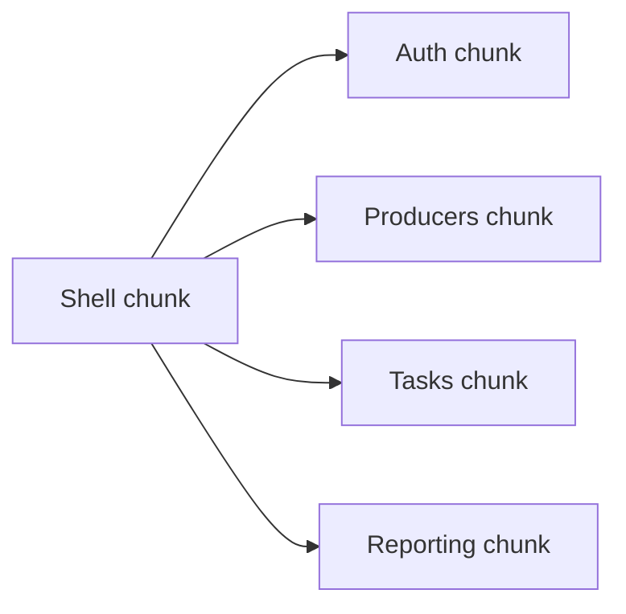

---

# 28. Bundle Splitting

## 28.1 Vite Strategy

- Entry: `main.tsx`
- Async route chunks per feature
- Manual `manualChunks` for stable vendors: `react`, `react-router`, `@tanstack/query`, `signalr`, form/zod stacks

## 28.2 Cache Busting

Content-hashed assets; `index.html` short cache; aligns PHYSICAL_ARCHITECTURE warning about outdated cached bundles after deploy.

## 28.3 Analyzing

Run bundle visualizer in CI occasionally; fail build on unexpected chunk size regressions beyond Board threshold.

---

# 29. Error Boundaries

## 29.1 Placement

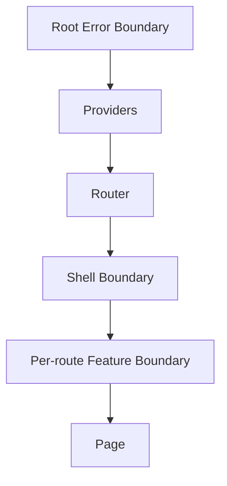

## 29.2 Behavior

- Root boundary: catastrophic fail — recovery = reload
- Feature boundary: show feature error panel with correlation id if available; rest of shell remains
- Do not swallow auth errors in boundaries

## 29.3 Logging

Report boundary errors to an ops sink when available (Seq via backend hop or approved browser telemetry). Include release version from runtime config.

---

# 30. Testing Strategy

## 30.1 Test Pyramid

| Layer | Tool | Intent |
|-------|------|--------|
| Unit | Vitest | Permission helpers, Problem Details parser, key factories, zod schemas |
| Component | Testing Library | Forms, gates, table pagination controls |
| Integration | Vitest + MSW | Feature pages with mocked `/api/v1` |
| E2E | Playwright | Login, producer create, season start, permission denial |
| Visual (optional) | Chromatic/Playwright screenshots | Design regressions for shell |

## 30.2 Contract Tests

Where feasible, validate client DTOs against OpenAPI examples for critical resources. Still treat API_CONTRACT as human normative.

## 30.3 Auth Testing

Mock refresh single-flight race (multiple 401s → one refresh). This is a high-value regression test.

## 30.4 Accessibility Tests

Automated axe checks on login and shell; keyboard E2E for dialogs.

## 30.5 What Not to Test

Do not screenshot every pixel of every grid; do not duplicate backend invariant tests in the SPA.

---

# 31. Deployment Strategy

Aligned with PHYSICAL_ARCHITECTURE.

## 31.1 Artifact

CI builds static files (`vite build`) → publish to:

- Reverse proxy `try_files` for SPA fallback, or
- Object storage + CDN

API remains separate deployable (`Agriculture.Api`).

## 31.2 Environment Configuration

Prefer **runtime** `config.js` (or equivalent) injected at deploy for:

- `apiBaseUrl`
- `signalRBaseUrl`
- `environment` name
- `sentryDsn` / telemetry flags (if any)
- Feature-flag bootstrap overrides (rare)

**Reasoning:** PHYSICAL_ARCHITECTURE recommends runtime config so one static build promotes across slots.

## 31.3 Security Headers

Ensure hosting sets CSP, `X-Content-Type-Options`, frame protections per municipal hardening guide. CSP is critical for Bearer token XSS mitigation.

## 31.4 CORS

SPA origin must be allowlisted on API. Credentials mode only if cookie refresh strategy adopted.

## 31.5 Release Train

1. Build immutable artifact with version meta.
2. Deploy Staging; run Playwright smoke.
3. Promote same artifact to Production.
4. Smoke public HTTPS; confirm API connectivity and login.

## 31.6 Rollback

Static hosting rollback = previous artifact. Coordinate with API compatibility (additive contracts within release train).

## 31.7 Observability

Surface client version in UI “About” and error reports. Propagate correlation ids to Seq via API.

---

# 32. Future PWA

## 32.1 Status

**Not a v1 requirement.** Admin SPA is online-first.

## 32.2 Possible Future Scope

- Installability for warehouse kiosks
- Limited offline shell caching (not producer evidence offline — that remains mobile)
- Background sync carefully constrained to non-critical reads

## 32.3 Risks

- Stale shell after deploys (service worker cache) — needs skipWaiting strategy
- Accidental caching of authenticated API responses — **forbidden** without Board review
- Overlap with React Native offline product

## 32.4 Gate to Adopt

Require ADR covering service worker security, update UX, and explicit non-goals relative to mobile offline.

---

# 33. Realtime (SignalR) Architecture for Admin

## 33.1 Connection Manager

`shared/realtime` owns a singleton connection lifecycle tied to auth session:

- Connect after login/bootstrap
- Reconnect with backoff
- Provide token factory
- Expose typed subscriptions to features

## 33.2 Feature Usage

Dashboard and queue pages subscribe to topics relevant to seasons/tasks/inspections. Features translate events into `queryClient.invalidateQueries`.

## 33.3 Reasoning

Centralizing transport prevents each feature from opening duplicate sockets (browser limits / server fan-out cost).

---

# 34. Security Considerations (SPA-Specific)

## 34.1 XSS

Primary threat to Bearer tokens. Mitigations: CSP, strict React escaping defaults, sanitize any rich text, avoid `dangerouslySetInnerHTML` unless reviewed.

## 34.2 CSRF

Bearer header pattern reduces classic CSRF. Cookie refresh requires CSRF strategy (PHYSICAL_ARCHITECTURE).

## 34.3 Clickjacking

Frame denial headers at host.

## 34.4 Dependency Risk

Lockfile + CI audit; municipal CVE policy.

## 34.5 Secrets

No API keys in frontend bundles. MinIO credentials never shipped; only short-lived URLs from API.

## 34.6 Admin Session Hygiene

Idle timeout UX optional; server refresh revocation remains authoritative for stolen sessions.

---

# 35. Observability and Supportability

- Display `correlationId` on errors
- “Copy diagnostics” bundles user id (non-secret), tenant, client version, route, correlation id
- Integrate with municipal helpdesk runbooks
- Feature flags remotely disable noisy UI experiments

---

# 36. Cross-Feature Journeys (Admin)

Illustrative officer journeys the architecture must enable without cross-feature imports:

1. **Register producer → assign land → create season → assign workflow → monitor tasks.**
2. **Inspection blocking harvest → complete inspection → harvest opens → create delivery within quantity.**
3. **Support application approve → fulfill → notify producer (server Notifications).**
4. **Reporting export for municipal board meeting.**

Navigation uses routes and IDs; each step’s data comes from its feature API module.

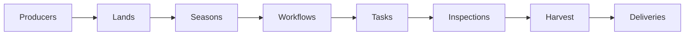

---

# 37. Alignment Matrix (Decisions ↔ Docs)

| RAS decision | Authoritative parent |
|--------------|----------------------|
| SPA separate from .NET solution | SOLUTION_ARCHITECTURE §1.1 |
| Static hosting / runtime config | PHYSICAL_ARCHITECTURE |
| JWT + refresh + clientId | ADR-013, API_CONTRACT §5 |
| Permission strings | ADR-014, API_CONTRACT §6, MODULE_DESIGN |
| Problem Details parsing | ADR-018, API_CONTRACT §4 |
| Action POST lifecycles | API_CONTRACT §2.2 |
| SignalR admin dashboards | ADR-008 |
| Producers primarily mobile | PRODUCT_VISION |
| Delivery routes under `/deliveries` | MODULE_DESIGN §6.8, API_CONTRACT |
| Pagination envelopes | API_CONTRACT §3.1 |

---

# 38. Migration Plan from Current Scaffold

Existing scaffold characteristics: React Router routes, `AuthContext` token, flat pages for subset of modules, basic layout CSS, Vite tooling.

| Step | Outcome |
|------|---------|
| 1 | Introduce `shared/api` + Problem Details; point existing pages at it |
| 2 | Introduce TanStack Query provider; migrate one list page (Producers) |
| 3 | Expand auth to refresh single-flight + `/auth/me` permissions |
| 4 | Create `features/*` and move pages incrementally |
| 5 | Add missing features (Harvest, Deliveries, Support, Reporting, Admin) |
| 6 | Add SignalR dashboard |
| 7 | Harden CSP, runtime config, Playwright smokes |

**Do not** rewrite all pages in one PR; migrate by feature ownership boundaries.

---

# 39. Coding Conventions (SPA)

- TypeScript `strict` true
- Named exports preferred for components
- File names: `PascalCase` for components, `camelCase` for hooks/functions
- Query keys always via factories
- No default exports except `main` / route lazy boundaries if required by tooling
- Prefer function components
- sidestep `any`; use `unknown` + narrow at boundaries
- ESLint/oxlint rules forbid importing features from features

---

# 40. Appendix A — Recommended Dependency Set (Non-Normative Versions)

Exact versions float with security patches; categories are normative recommendations:

- `react`, `react-dom`
- `react-router-dom`
- `@tanstack/react-query`
- `react-hook-form`, `@hookform/resolvers`, `zod`
- `@microsoft/signalr`
- `i18next`, `react-i18next`
- Headless UI primitives package (Board pick)
- `vitest`, `@testing-library/react`, `msw`, `@playwright/test`

---

# 41. Appendix B — Permission Gate Examples (Pseudo-Structure)

```text
<RequirePermission permission="seasons.start">
  <PermissionButton onClick={openStartSeasonModal} />
</RequirePermission>
```

Pseudo only — not application source.

---

# 42. Appendix C — HTTP Client Responsibilities Checklist

- [ ] Reads `apiBaseUrl` from runtime config
- [ ] Sets `Authorization` when session has access token
- [ ] Sets `X-Correlation-Id`
- [ ] Sets `Idempotency-Key` when caller provides
- [ ] Sets `If-Match` when caller provides ETag
- [ ] Parses `application/problem+json`
- [ ] Surfaces rate limit headers to UX when present
- [ ] Participates in 401 refresh single-flight
- [ ] Never logs tokens

---

# 43. Appendix D — Feature Folder Checklist (New Module Surface)

When API_CONTRACT adds admin-visible resources:

1. Create `features/{name}` with api/keys/pages/routes
2. Register routes in `app/router`
3. Add nav item with permission
4. Add i18n namespace
5. Add MSW handlers for tests
6. Document query keys
7. Confirm no cross-feature imports
8. Add Playwright smoke if journey-critical

---

# 44. Appendix E — Glossary (SPA)

| Term | Meaning |
|------|---------|
| Shell | Authenticated chrome layout |
| Feature | Vertical slice aligned to bounded context / API tag |
| Gate | Permission/role route or component guard |
| AppError | Normalized client error from Problem Details or network |
| Single-flight refresh | One shared refresh promise for concurrent 401s |
| Season context | Shell-selected season influencing default filters |

---

# 45. Closing

This React Architecture Specification defines the **target enterprise architecture** for the Agriculture Management System municipal admin SPA. It extends ADR/API/physical decisions into folder structure, state, authN/authZ UX, data caching, component systems, accessibility, testing, and deployment — without generating `frontend/` source and without contradicting approved backend contracts.

Producers continue on React Native; the SPA remains the municipality’s operational web client. Implementers evolve the Vite scaffold toward this model feature by feature, keeping `/api/v1`, JWT refresh, permission catalogs, and Problem Details as non-negotiable boundaries.

---


# 46. Feature Module Deep Dive — Admin Surfaces vs API

This section expands each feature folder into implementation-ready UI responsibilities, query/mutation expectations, and permission gating, cross-referenced to API_CONTRACT resource modules. It does not redefine routes or DTOs; it translates contract surfaces into SPA architecture obligations.

## 46.1 Auth Feature

**Purpose.** Own session lifecycle UX and password recovery without becoming Identity administration.

**Screens.** Login; forgot/reset password; change password; session bootstrap splash; forced re-auth interstitial.

**Queries/Mutations.** `login`, `refresh`, `logout`, `me`, `changePassword`, `resetRequest`, `resetConfirm` — exactly API_CONTRACT auth routes. No alternate “session” endpoints.

**State.** Session module is the only writer of access tokens. Features read `useSession()` / `usePermissions()`.

**Reasoning.** Centralizing auth prevents divergent refresh implementations (the most common SPA security bug). Password reset remains anonymous and must not mount AppShell chrome that assumes `/auth/me` succeeded.

**Edge cases.** Rate limit `429` on login → show cooldown using `Retry-After`. Deactivated user → map `errorCode` to clear message. Refresh reuse detection → full logout and security notice (“session revoked; sign in again”).

## 46.2 Identity Administration Feature

**Purpose.** Municipal IT and administrators manage users, roles, and permission grants (`identity.*` permissions).

**Screens.** Users list/detail/create/deactivate; role matrix; permission catalog view; login audit read if exposed.

**Tables.** Server-paginated users with `q`, role filters, active/inactive. Sort whitelist only.

**Reasoning.** Identity is a bounded context (MODULE_DESIGN). Keeping it separate from `administration` settings avoids mixing credential ops with feature flags. The SPA must never display raw password hashes or refresh token values.

**AuthZ.** `identity.users.read` for list; create/update/deactivate permissions independently gated. Self-service profile edits may use weaker self scope — still handle `403` if server denies.

## 46.3 Dashboard Feature

**Purpose.** Season pulse for officers: delayed tasks, open blocking inspections, harvest eligibility hints, support queue depth — composed from Reporting read models and/or lightweight aggregate queries plus SignalR invalidation.

**Reasoning.** Dashboard is a composition root for **read models**, not a place to embed command forms for every domain. Deep links navigate into owning features. This prevents the dashboard from importing every feature’s internal components (violating Section 4.3).

**Caching.** Short `staleTime`; SignalR events invalidate KPI query keys. Display last updated time.

## 46.4 Producers Feature

**Purpose.** Producer registry CRUD, search, deactivate, assignment relationships as allowed by `producers.*`.

**List.** Offset pagination; `q` search with debounce; status filters; columns for identity number, contact, active state — matching projection fields from API, not inventing columns the API does not return.

**Detail.** Tabs for profile, lands association summary (IDs + navigate), season history (read model), support summary if contract provides.

**Commands.** Create/update via forms; deactivate with confirm modal and audit-aware copy; never hard-delete in UI unless Administration legal policy endpoint exists.

**Reasoning.** Producers are foundational registry data (DOMAIN_ANALYSIS / MODULE_DESIGN). Officers spend significant time here during intake seasons; table performance and search UX matter more than decorative cards.

## 46.5 Lands Feature

**Purpose.** Parcel registry: create/update/archive; geospatial display optional lazy module.

**Reasoning.** Lands couple to producers by ID references. The SPA shows producer name via list join DTO if API provides it; otherwise secondary query by `producerId` with careful waterfall avoidance (prefer API list projections).

**Archive.** Soft archive flows with confirm; archived entities hidden by default filter (`includeDeleted` elevated permission only).

## 46.6 Seasons Feature

**Purpose.** Season lifecycle is the temporal backbone of production (EVENT_STORMING). SPA exposes start/pause/complete/archive and assign-workflow actions as **explicit buttons** calling action routes — not status dropdowns.

**Season context integration.** Selecting a season in shell updates URL search param consumed by Tasks/Inspections/Harvest filters.

**Reasoning.** Wrong-season task views cause operational errors; shell context reduces mistakes while still allowing cross-season audit via explicit filters.

**Concurrency.** If season transitions become contested, honor `409` and reload.

## 46.7 Workflows Feature

**Purpose.** Definitions management (`workflows.definitions.manage`) and runtime visibility/control (`workflows.runtime.*`).

**UI split.** Definition editor (admin/officer specialists) vs runtime inspector (step state, blockers). Do not build a generic BPMN product; stay within MODULE_DESIGN workflow semantics.

**Reasoning.** Workflow complexity can explode SPA scope. Architecture mandates thin clients over runtime projections; advanced visual designers are a future ADR.

## 46.8 Tasks Feature

**Purpose.** Officer oversight of task queues: assign, cancel, delay, read evidence metadata; `tasks.complete_any` only for assisted completion under policy.

**Not in scope as primary UX.** Producer photo capture offline flows — mobile.

**List filters.** `status`, `seasonId`, `producerId`, `dueDate` range, assignee. Default sort `dueDate:asc` when API default agrees.

**Delay/complete modals.** Comment required when API validation requires — mirror with Zod and server field errors.

**Reasoning.** Tasks are high churn (DATABASE_DESIGN operational notes). Query keys must include all filters; SignalR completion events invalidate lists to keep dashboards honest.

## 46.9 Inspections Feature

**Purpose.** Create/assign/complete/reject oversight; inspector workload views for supervisors.

**Gate messaging.** When inspections block harvest, UI should deep-link and explain blocker using read-model fields — not hardcode domain rules beyond displaying server-provided reasons.

**Evidence.** Show thumbnails via authorized download URLs; never embed permanent MinIO credentials (API_CONTRACT uploads).

## 46.10 Harvest Feature

**Purpose.** Monitor harvest start/complete/cancel; eligibility messaging when inspections incomplete (server error codes).

**Reasoning.** Harvest quantities constrain deliveries; SPA must display quantities with units exactly as API decimal+unit pairs, avoiding float display bugs (format with careful decimal libraries).

## 46.11 Deliveries Feature

**Purpose.** `/api/v1/deliveries` operations despite Harvest module ownership.

**Concurrency.** Always round-trip ETag: GET detail → mutate with `If-Match` → on `409`, force refresh and user review. This is a **normative SPA obligation** for delivery quantity safety (API_CONTRACT §3.5).

**Reasoning.** Silent retries without ETag risk double-shipping or quantity overrun perceptions; architecture makes ETag handling part of the shared API client capability used by this feature.

## 46.12 Support Feature

**Purpose.** Program management and application approve/fulfill queues (`support.*`).

**Reasoning.** Approval is audit-sensitive (MODULE_DESIGN security). Confirm modals must capture decision context; display correlation id on failure for dispute resolution.

## 46.13 Notifications Feature (Admin)

**Purpose.** Template management, admin view of delivery stats, and optionally personal inbox for officers (`notifications.read_own` vs `admin_view`).

**Reasoning.** FCM is mobile; SPA focuses on template correctness and operational visibility, not reimplementing push infrastructure.

## 46.14 Communication Feature

**Purpose.** If officers moderate or send messages via web, host under `communication` with permission gates. Cursor pagination if contract uses it for message history.

**Reasoning.** Keep separate from Notifications to preserve MODULE_DESIGN boundaries (inbox/chat vs push templates).

## 46.15 Reporting Feature

**Purpose.** Dashboards and exports (`reporting.dashboards.view`, `reporting.exports.run`, definitions manage for specialists).

**Exports.** Trigger export run → poll or download when ready; do not block UI thread. Respect concurrent run limits (`429`).

**Reasoning.** Exports can be heavy (Hangfire-backed). SPA architecture treats them as asynchronous jobs with status UI, not synchronous `fetch` blobs for huge datasets unless contract returns immediate files.

## 46.16 Administration Feature

**Purpose.** Settings, feature flags, audit read (`admin.*`). Distinct from Identity.

**Feature flags.** Client reads flags to toggle nav/experimental UI; server still enforces. Flags must default safe (features off when unknown).

**Reasoning.** Mixing admin settings into each feature creates inconsistent flag evaluation. Central administration feature owns flag console; `shared` may host `useFeatureFlag`.

---

# 47. Detailed Authentication & Session Architecture

## 47.1 Session Module API (Contract Names)

The session module exposes conceptual operations (names illustrative for implementers):

- `signIn(credentials)`
- `signOut()`
- `ensureFreshAccessToken()`
- `getAccessToken()`
- `getUser()`
- `getPermissions()`
- `subscribe(listener)`

## 47.2 Boot State Machine

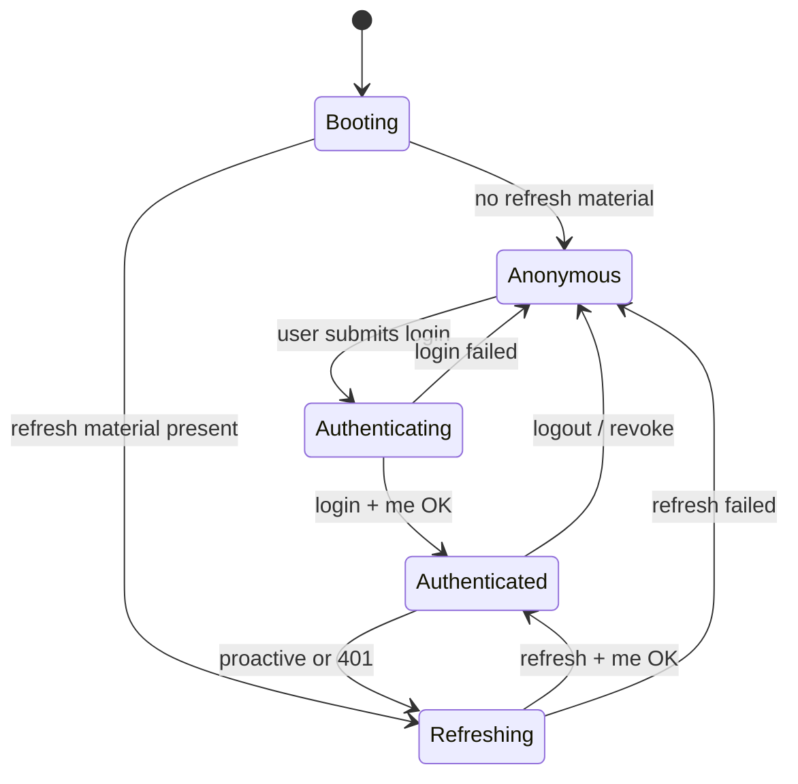

**Reasoning.** Explicit states prevent UI flicker and double-login races when multiple tabs load.

## 47.3 Multi-Tab Considerations

Options:

1. **BroadcastChannel / storage events** to sync logout across tabs.
2. Independent refresh per tab with refresh rotation family — riskier under reuse detection.

**Recommendation.** Prefer logout broadcast; serialize refresh with a leader tab election if refresh is persisted, or keep refresh in a single tab sessionStorage model. Board must pick one and document in a short ADR addendum if multi-tab is mandatory for municipal offices.

## 47.4 Proactive Refresh

Schedule refresh ~1 minute before access expiry using `accessTokenExpiresAt` from `AuthTokenResponse`. Clears many 401 storms during dashboard SignalR use.

**Reasoning.** Reactive-only refresh works but causes burst failures when many queries expire simultaneously at staleTime boundaries.

## 47.5 clientId Discipline

Login and refresh bodies include `clientId`. The SPA uses a dedicated web client id so Identity can distinguish mobile vs web refresh policies and device binding later (API_CONTRACT future extensions).

---

# 48. Detailed Authorization UX Patterns

## 48.1 Progressive Disclosure

Navigation shows only readable modules. Within a page, write actions appear only with write permissions. This reduces cognitive load for inspectors who may have read-heavy grants.

## 48.2 Explaining Denials

When an officer can see an entity but not act (resource check), prefer server `403` detail: “Not assigned inspector” rather than generic forbidden. Map `errorCode` to i18n.

## 48.3 Dual Control / Sensitive Actions

Deactivate producer, approve large support, manage roles: require typed confirm (name confirmation) in addition to permission gate. This is UX risk reduction, not a substitute for server authZ.

## 48.4 Audit Visibility

Where `admin.audit.read` or identity audit exists, link from sensitive entity timelines. Do not invent client-side audit logs.

---

# 49. Forms, Wizards, and Lifecycle Action UX

## 49.1 Lifecycle Action Checklist

For every action button corresponding to `POST /resource/{id}/{action}`:

1. Permission gate
2. Confirm modal if irreversible or audit-sensitive
3. Optional comment fields validated by Zod matching server rules
4. Mutation with pending state
5. Invalidation of detail+list+dashboard keys
6. Toast or inline success
7. Error mapping including `409` business conflicts (`Seasons.ActiveSeasonAlreadyExists`, `Harvest.QuantityExceeded`, etc.)

## 49.2 Why Not Editable Status Fields

Officers coming from spreadsheet culture may expect a status dropdown. Architecture forbids it because API_CONTRACT and domain invariants require explicit commands with side effects (notifications, workflow advancement, outbox events). The SPA teaches correct verbs via labeled actions.

## 49.3 Complex Forms

Producer create may include nested address fields. Use RHF field arrays sparingly; prefer flat DTO-aligned shapes. Split into sections with one submit.

## 49.4 Upload UX

Multipart through API (normative default for evidence). Show progress; allow cancel if `AbortController` supported; on success attach returned metadata to entity query cache.

---

# 50. Table Architecture Deep Dive

## 50.1 Column Definition Contract

Each feature defines columns as data, not JSX sprawl:

- `id`, `headerKey` (i18n), `accessor`, `sortableField` (API sort token or null), `cell`, `minWidth`, `align`

## 50.2 Filter Synchronization Algorithm

1. Read URL search params on render.
2. Build filters object.
3. Pass to `useQuery(keys.list(filters))`.
4. On control change, write URL (`replace` for page changes, `push` for meaningful filter changes — Board pick; recommend `replace` for page, `push` for filter apply).

## 50.3 Empty, Loading, Error, Forbidden

Four distinct UI states — do not reuse a single “No data” for errors. Forbidden lists show permission explanation.

## 50.4 Bulk Actions Policy

Only implement bulk UI when API supports bulk commands. Pseudo-bulk (loop N POSTs) requires Board exception due to partial failure complexity and rate limits.

---

# 51. Modal and Drawer Governance

## 51.1 When to Prefer Routes over Modals

Prefer routes for entity create/edit when:

- Forms are long
- Users need bookmarking
- Deep links from notifications point to the form

Prefer drawers when:

- Quick create from list
- Context comparison with list remains valuable

## 51.2 Stacking Policy

Maximum one primary modal and one nested confirm. Third level → route redesign.

## 51.3 Unsaved Changes

Prompt on close when RHF `isDirty`; also intercept in-app navigation via router blocker APIs.

---

# 52. Theming, Brand, and Municipal White-Label Hooks

## 52.1 Brand Tokens

`administration` settings may eventually return municipal display name and logo URL. Shell reads these into theme context. Until API provides them, use build-time defaults.

## 52.2 Avoiding Generic AI Visual Defaults

Architecture requires intentional municipal visual direction via tokens. Implementers must not ship stock purple gradients, glow effects, or emoji-heavy nav as the product look (consistent with frontend design governance for branded surfaces). Admin density still allows calm surfaces; brand appears in shell and auth.

## 52.3 Print Styles

Reporting pages may offer print CSS for meeting packets; hide nav/shell via `@media print`.

---

# 53. Dark Mode Implementation Notes

## 53.1 Chart Libraries

Initialize chart color palettes from computed CSS variables at render to stay theme-accurate.

## 53.2 Maps

If lands map tiles are light-only, provide a legend and accept limited dark mismatch or switch tile set — document in feature README.

## 53.3 Third-Party Embeds

Avoid embedding external admin tools that ignore theme.

---

# 54. Error Handling Playbooks

## 54.1 Validation Playbook

Show field errors; focus first invalid field; keep user input.

## 54.2 Conflict Playbook

Show difference when API returns current state; provide Reload action; for deliveries, block further submit until ETag refreshed.

## 54.3 Rate Limit Playbook

Disable submit; countdown using `Retry-After`; do not spin silent retries that amplify limits.

## 54.4 Server Error Playbook

Apologize without leaking stacks; show correlation id; offer retry for idempotent GET; for POST, caution retry unless Idempotency-Key used.

---

# 55. Caching Strategy Beyond TanStack Query

## 55.1 Permission Catalog Cache

Roles/permission matrix endpoints may send `max-age=60`. TanStack `staleTime` should approximate this to avoid hammering Identity.

## 55.2 Presigned URLs

Treat as short-lived; do not put into long-lived Query cache without TTL matching URL expiry. Prefer refetch metadata when opening evidence viewers.

## 55.3 Service Worker Exclusion

Future PWA must exclude `/api/v1/**` from Cache Storage unless explicitly designed with auth-aware strategies (default deny).

---

# 56. Component Library Governance

## 56.1 Contribution Rules

- New primitive requires Shared UI Steward review
- Must include accessibility story or Testing Library case
- Must use tokens, not hard-coded hex in components
- Must not import features

## 56.2 Breaking Changes

Semantic versioning within monorepo via changelog in `shared/ui`. Rename props with codemods when possible.

## 56.3 Do Not Rebuild Native Controls Poorly

Prefer native `select`/`dialog` patterns via headless libraries over custom div-based widgets lacking keyboard support.

---

# 57. Notification Center UX Architecture

## 57.1 Inbox Model

Poll or SignalR-invalidate notifications list. Mark read mutations. Badge count from dedicated summary query to avoid downloading full inbox.

## 57.2 Deep Links

Notification payloads should include resource type/id for router navigation. Unknown types show generic detail.

## 57.3 Noise Control

User preference for toast verbosity (errors only vs all successes) stored locally.

---

# 58. Localization Architecture Deep Dive

## 58.1 Namespace Split

- `common` — buttons, pagination, errors shell
- `auth`
- one namespace per feature
- `errorCodes` — map of API `errorCode` to messages

## 58.2 Date/Time Policy

API is UTC ISO-8601. Display in municipal timezone setting (browser or admin setting). Store/edit in UTC. Show timezone abbreviation in dense ops screens to avoid harvest-day confusion.

## 58.3 Number/Unit Policy

Quantities: format decimals without inventing rounding beyond API precision. Units translated separately from numeric magnitude.

## 58.4 Pseudo-LOC Testing

Occasionally test long German-like pseudo strings to catch truncation in tables.

---

# 59. Accessibility Deep Dive

## 59.1 Keyboard Map (Normative Expectations)

- `/` or focused search in filter bars
- `Esc` closes dialogs
- Arrow keys in menus
- Enter activates primary buttons
- Skip link to `#main`

## 59.2 Screen Reader Labels

Icon-only buttons require `aria-label`. Sortable column headers announce sort state.

## 59.3 Motion

Respect `prefers-reduced-motion` for non-essential animations (shell transitions, toast slide-ins). Keep functional state changes instant.

## 59.4 Contrast

Token pairs validated for AA. Status colors accompanied by text labels.

---

# 60. Performance Budgets and Profiling Practice

## 60.1 Profiling Ritual

Before harvest peak releases, profile:

- Producers list with max pageSize
- Dashboard with SignalR connected
- Reporting chart page

Use React Profiler and browser performance panel; record findings in release notes if regressions found.

## 60.2 Network Waterfalls

Avoid request waterfalls: producer detail should not sequentially request five dependent endpoints if API offers a richer detail DTO. When unavoidable, use `useQueries` and skeletons.

## 60.3 Re-render Control

Prefer colocating state; use composition over prop drilling through shell. Context split: auth context separate from theme context to avoid full-tree rerenders on token refresh if practical.

---

# 61. Lazy Loading and Suspense UX

## 61.1 Suspense Fallbacks

Route-level Suspense shows shell-consistent page skeleton, not a blank white screen. Feature-level Suspense for charts shows chart skeleton only.

## 61.2 Error + Lazy Failure

Chunk load failures (stale deploy) show “New version available — reload” recovery, critical for municipal proxy caches (PHYSICAL_ARCHITECTURE stale bundle risk).

---

# 62. Bundle Splitting Policy Details

## 62.1 Vendor Stability

Keep React and Query in stable vendor chunks so feature deploys cache-hit vendors.

## 62.2 Feature Grouping

Do not merge all features into one `pages` chunk “for simplicity.” That defeats lazy loading.

## 62.3 Locale Splitting

Load non-default language packs asynchronously on locale switch.

---

# 63. Error Boundary Taxonomy

| Boundary | Catches | Recovery |
|----------|---------|----------|
| Root | Provider/render fatals | Full reload |
| Router | Unknown route issues | Navigate home |
| Feature | Feature render bugs | Retry feature reset keys |
| Widget | Chart/map failures | Replace with inline error, keep page |

Boundaries log to telemetry with feature name tags.

---

# 64. Testing Strategy Deep Dive

## 64.1 MSW Handler Ownership

Handlers live beside features (`features/producers/api/producers.msw.ts`) and use realistic Problem Details fixtures.

## 64.2 Permission Matrix Tests

Table-driven tests: given permissions set, expect nav link visibility matrix. Prevents regressions when adding routes.

## 64.3 E2E Environments

Playwright against Staging with seeded users per role (Admin, Officer, Inspector). Never against Production.

## 64.4 Flakiness Control

Await query success indicators; avoid arbitrary sleeps. Reset DB seed per suite where municipal staging allows.

## 64.5 Security Tests

Ensure tokens not written to `localStorage` if policy forbids; grep CI check for disallowed patterns.

---

# 65. Deployment Strategy Deep Dive

## 65.1 CI Pipeline Stages

1. Install locked deps
2. Typecheck
3. Unit/component tests
4. Build
5. Bundle size check
6. Publish artifact
7. Staging deploy + Playwright smoke
8. Promote

## 65.2 SPA Fallback

Reverse proxy must serve `index.html` for client routes without breaking `/api` and `/hubs` proxied to API.

## 65.3 Config Injection Example (Conceptual)

Deploy writes `config.js` with `window.__AGRI_CONFIG__ = { apiBaseUrl, ... }`. App reads at boot. No rebuild for environment URL changes.

## 65.4 Cache Headers

- `index.html`: `no-cache` or short max-age
- hashed assets: long max-age immutable
- `config.js`: no-cache

## 65.5 Coordination with API Migrations

Frontend deploy independent, but release trains should ensure API additive compatibility. If API requires breaking change, use `/api/v2` migration program with dual-run SPA feature flags.

---

# 66. Future PWA — Expanded Decision Record Seed

## 66.1 Motivations

- Kiosk install on municipal intranet
- Faster repeat open via shell cache

## 66.2 Non-Motivations

- Replacing React Native offline task completion
- Caching producer PII in CDN/service worker

## 66.3 Required Controls Before Adoption

- Update prompt UX mandatory
- API network-only default
- Audit of cache keys
- Threat model review with Security
- ADR Accepted

---

# 67. SignalR Topic Ownership Guidelines

| Concern | Owner |
|---------|-------|
| Connection lifecycle | `shared/realtime` |
| Event type constants | shared or generated from contract |
| Invalidation mapping | feature that owns affected queries |
| Dashboard fan-in | dashboard feature composes multiple mappings |

Avoid features calling `connection.on` for unrelated domains.

---

# 68. Security Threat Scenarios (SPA)

## 68.1 XSS Steals Refresh

Impact high if refresh in JS-readable storage. Mitigation: CSP, minimize `dangerouslySetInnerHTML`, consider httpOnly cookie refresh with CSRF tokens if Board elevates threat response.

## 68.2 CSRF with Cookie Refresh

If cookie strategy adopted, require anti-forgery for refresh/login as PHYSICAL_ARCHITECTURE describes.

## 68.3 Open Redirect after Login

Validate `returnUrl` is relative path starting with `/` and not `//evil`.

## 68.4 Token Leak via Query String

Except SignalR `access_token` requirement, never put JWT in URLs for REST. Avoid logging hub URLs with tokens.

## 68.5 Dependency Confusion / Typosquat

Use private registry policies where municipal IT requires; pin versions.

---

# 69. Operability: Support Bundle and Diagnostics

Provide an authenticated diagnostics panel (Admin only) showing:

- Client version
- API base URL (not secrets)
- Feature flag snapshot
- SignalR state
- Last correlation id
- Permission count (not full dump in screenshots if sensitive)

Copy-to-clipboard for tickets.

---

# 70. Anti-Corruption and Ubiquitous Language in UI Copy

UI labels must follow ubiquitous language from DOMAIN_ANALYSIS: Season, Workflow, Task, Inspection, Harvest, Delivery, Support — not invent synonyms like “Job” for Task or “Farm” for Land unless product explicitly localizes that way in i18n.

**Reasoning.** Officers trained on domain language in training materials; UI synonyms create support noise and mistranslations.

---

# 71. Relationship to Backend CQRS

The SPA does not implement CQRS internally. It **consumes** CQRS results via REST. Naming mutations `useCompleteTaskMutation` mirrors commands; queries `useTasksQuery` mirror read models. This naming alignment helps full-stack reviews against EVENT_STORMING catalogs.

---

# 72. Explicit Out-of-Scope UI

- Producer mobile evidence camera flows
- Offline task sync engines
- Hangfire dashboard (ops tool; not product SPA unless Board wraps it)
- Seq UI embedding
- MinIO console embedding
- Direct SQL tools

---

# 73. Acceptance Checklist for Feature PRs

- [ ] Lives under correct `features/{name}`
- [ ] Uses shared API client
- [ ] Query keys factory updated
- [ ] Permissions gated
- [ ] Problem Details handled
- [ ] i18n keys added
- [ ] No cross-feature imports
- [ ] Lazy route registered
- [ ] Tests for happy path + 403/400
- [ ] Lifecycle actions are POSTs not PATCH status
- [ ] ETag used if delivery/concurrency-sensitive
- [ ] Docs cross-links updated if contract changed

---

# 74. Risks and Mitigations Summary

| Risk | Mitigation |
|------|------------|
| Scaffold inertia (flat pages) | Incremental migration plan Section 38 |
| Auth refresh races | Single-flight mutex + tests |
| Permission drift | Typed catalog + CI string checks vs docs |
| Bundle bloat | Lazy routes + size budgets |
| Stale deploys | hashed assets + chunk error reload prompt |
| Cross-feature coupling | import lint rules |
| Over-optimism in UI | Prefer invalidation over optimistic writes |
| PWA caching PII | Default deny; ADR gate |

---

# 75. Conclusion of Expanded Sections

Sections 46–74 deepen the specification from structural decisions into feature-level obligations, session state machines, table/filter algorithms, security scenarios, and operability practices. Together with Sections 1–45, they form the complete React Architecture Specification for the municipal admin SPA, remaining subordinate to API_CONTRACT and sibling architecture documents.


## Document History

| Version | Date | Author Role | Summary |
|---------|------|-------------|---------|
| 1.0 | 2026-07-18 | Principal Frontend Architect | Initial React Architecture Specification — target SPA architecture aligned to approved docs |
