# React Native Architecture Specification

> **Geçiş notu (2026-08-11):** React Native istemci artık ürün hedefi değildir. Üretici deneyimi `frontend` içindeki PWA'ya taşınmış, eşitlik doğrulanmış ve `mobile/` kaldırılmıştır. Bu belge yalnızca tarihsel referanstır; güncel istemci kararlarında [PWA_MOBILE_PARITY.md](./PWA_MOBILE_PARITY.md) esas alınır.

# Agriculture Management System — Producer & Inspector Mobile Client

| Field | Value |
|-------|-------|
| **Document Title** | React Native Architecture Specification |
| **Document ID** | AGRI-RNAS-001 |
| **Version** | 1.1 |
| **Status** | Approved for implementation alignment (target architecture) |
| **Date** | 2026-07-18 |
| **Classification** | Internal — Engineering / Mobile Architecture |
| **Primary Audience** | Mobile architects, React Native tech leads, senior mobile engineers, field UX leads, municipal IT mobile owners, QA for iOS/Android |
| **Secondary Audience** | Backend API owners (contract consumers), security reviewers, DevOps (store release / OTA policy), product owners (producer & inspector field scope) |
| **Document Owner** | Mobile Architecture Board (Agriculture Management System) |
| **Technical Stewards** | Mobile App Owner (`mobile/`), Offline Sync Steward, Push/FCM Steward, Feature Owners (one per domain feature folder) |
| **Related Stack** | React Native (New Architecture preferred), TypeScript, React Navigation, TanStack Query, SQLite (WatermelonDB or expo-sqlite / OP-SQLite Board pick), secure storage (Keychain/Keystore), FCM (+ APNs), optional `@microsoft/signalr`, JWT + refresh (API_CONTRACT), Problem Details (RFC 7807) |
| **Repository Path** | `mobile/` (outside `Agriculture.sln`; SOLUTION_ARCHITECTURE §1.1; parallel to `frontend/`) |
| **API Base** | `/api/v1` (API_CONTRACT); SignalR `/hubs/**` (optional foreground); FCM for background push (ADR-009) |
| **Must Not Contradict** | PRODUCT_VISION, SRS, PRD, DOMAIN_ANALYSIS, AGGREGATE_DESIGN, EVENT_STORMING, MODULE_DESIGN, ADR, PHYSICAL_ARCHITECTURE, SOLUTION_ARCHITECTURE, BACKEND_ARCHITECTURE, API_CONTRACT, DATABASE_DESIGN, REACT_ARCHITECTURE |

---

## Document Control

### Change Control

Structural changes to offline sync model, secure token strategy, SQLite schema ownership, upload queue semantics, permission gating model, navigation IA, or recommended core libraries require:

1. Architecture Decision Record (next free ADR number after ADR-020, or a mobile-scoped ADR series if Board establishes one).
2. Mobile Architecture Board review and Accepted status.
3. Updates to this document in the same change set as the ADR.
4. Cross-check against API_CONTRACT when routes, auth, uploads, device tokens, or Problem Details semantics change.
5. Cross-check against REACT_ARCHITECTURE when client boundary tables change (admin SPA vs mobile).

Additive guidance (clarifying naming, expanding tables, additional Mermaid diagrams) may ship as patch revisions (1.1, 1.2) under Document Owner approval without a new ADR, provided no Accepted ADR or normative API contract is contradicted.

### Relationship to Approved Documents

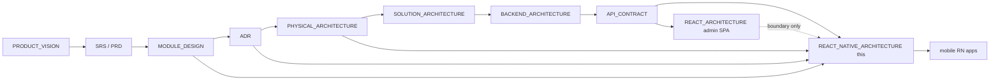

| Document | What it owns | How this RNAS uses it |
|----------|--------------|----------------------|
| PRODUCT_VISION | Producers primarily mobile; simplicity / limited digital literacy | Constrains UX density, IA, and “one job per screen”; rejects admin-grid patterns on mobile |
| SRS / PRD | Requirements; no public registration; GPS optional on inspections | Normative feature scope and auth provisioning model |
| MODULE_DESIGN | Bounded contexts, permissions, ubiquitous language | Feature folders and permission constants mirror module language |
| EVENT_STORMING | Commands, policies, notifications | Offline command queue verbs match storming language (`CompleteTask`, `UploadEvidence`) |
| ADR-008 / 009 / 010 / 013 / 014 / 018 | SignalR, FCM, MinIO, JWT+refresh, RBAC, Problem Details | Normative client behaviors for realtime, push, uploads, session, authZ UX, errors |
| PHYSICAL_ARCHITECTURE | RN process model, FCM egress, deep links, sync burst absorption | Deployment, store distribution, failure modes |
| SOLUTION_ARCHITECTURE | `mobile/` outside .NET solution | Confirms client is not a module inside the monolith |
| BACKEND_ARCHITECTURE | API behaviors, hubs, uploads, idempotency | Client adapters must match host semantics |
| API_CONTRACT | Routes, DTOs, auth, pagination, error codes, upload patterns | **Primary HTTP parent** for the mobile API layer |
| REACT_ARCHITECTURE | Admin SPA boundaries and anti-patterns | Defines complementary client; **shared contract, separate codebase, distinct UX** |
| DATABASE_DESIGN | Server schemas / outbox | Mobile SQLite is a **cache + outbox**, never a second system of record |
| **MOBILE_UX_DESIGN** | **Producer screen map, Turkish copy, flows, empty/error, chat UX** | **Primary UX source** for Producer shell (SDS-R13). This RNAS owns stack/offline/sync — not screen copy. |

### How Developers Use This Document

1. **Producer UX first:** Read [`MOBILE_UX_DESIGN.md`](./MOBILE_UX_DESIGN.md) for screens and flows; implement IA and copy from there. Admin / Tarım Uzmanı web is **next phase**.
2. **Bootstrapping `mobile/`:** Follow Sections 2–5 for stack, folder model, and navigation shells; do not copy admin SPA folder semantics wholesale.
3. **Adding a domain feature:** Locate the feature in Section 6; place screens, queries, mutations, SQLite tables, and permission gates in the prescribed tree; consume only `/api/v1` resources owned by that domain (and Identity/Notifications cross-cuts). Align Producer screens with MOBILE_UX_DESIGN.
4. **Auth or token changes:** Follow Section 9; never invent alternate session stores that contradict ADR-013 / API_CONTRACT §5 / §17.
5. **Offline writes:** Follow Sections 10–12; always emit `Idempotency-Key` for complete/upload confirm paths (API_CONTRACT §3.6).
6. **Push / deep links:** Follow Sections 13–14; register device tokens via `/api/v1/notifications/device-tokens`.
7. **Camera / GPS / uploads:** Follow Sections 15–17; MinIO credentials never ship in the app binary.
8. **Future scanners / GIS:** Follow Section 28; feature-flagged seams only until ADRs accept scope.

### Non-Goals of This Document

- This is **not** a React Native tutorial, Hooks primer, or TypeScript course.
- This is **not** a substitute for API_CONTRACT route catalogs or MODULE_DESIGN invariants.
- This document **does not** authorize generating application source under `mobile/` as part of documentation workstreams; it specifies target architecture for implementers.
- This document **does not** redesign the React admin SPA (see REACT_ARCHITECTURE.md); Admin / Tarım Uzmanı web UX is **next phase** after Producer mobile (SDS-R13).
- Producer **screen copy and flows** are owned by [`MOBILE_UX_DESIGN.md`](./MOBILE_UX_DESIGN.md), not this architecture doc.
- This document **does not** authorize public self-registration (SRS: no public registration).
- Delivery/Harvest officer workflows remain primarily admin SPA; mobile may show read-only harvest eligibility or producer-facing support status when product enables, without owning municipal fulfillment UX.

---

# 1. Executive Intent

## 1.1 What the React Native Client Is

The Agriculture Management System **producer and inspector mobile client** is a **React Native application** (single codebase targeting iOS and Android) consumed by:

- **Producers** — primary field users who view today’s tasks, complete evidence-backed work, upload photos, receive notifications, and request support (PRODUCT_VISION §6 / §12).
- **Inspectors** — field users who view assigned inspections, capture evidence (photos + optional GPS), and complete inspection reports (SRS Inspection; MODULE_DESIGN Inspections).

It is the **field work surface** for evidence capture under intermittent connectivity. It is **not** the municipal operational cockpit. Dense grids, registry CRUD, workflow template editing, reporting exports, role administration, and notification template management belong to the React SPA (`frontend/`) per REACT_ARCHITECTURE.

## 1.2 Client Boundary vs Admin React SPA (Normative)

| Concern | React SPA (`frontend/`) — REACT_ARCHITECTURE | React Native (`mobile/`) — this document |
|---------|-----------------------------------------------|------------------------------------------|
| Primary personas | Administrator, Officer; Inspector (optional read/ops) | Producer; Inspector (field) |
| Primary channels | HTTPS REST + SignalR | HTTPS REST + FCM (+ optional SignalR when foregrounded) |
| Offline | Soft degradation; not a field-offline product | **Offline-first** for task/inspection evidence flows |
| Auth `clientId` | `web-admin` (or Board-approved constant) | `mobile-producer` / `mobile-inspector` |
| Token storage | Memory access token + constrained refresh strategy | **Secure device storage** (Keychain / Keystore) |
| Push | In-app + SignalR; browser notifications optional later | **FCM** (ADR-009) via device tokens |
| UX principle | Dense operational grids, filters, multi-panel ops | **Simplicity**; limited digital literacy (PRODUCT_VISION) |
| Codebase | Separate `frontend/` | Separate `mobile/` — **no shared UI package required in v1** |
| Contract | Shared `/api/v1` + Problem Details | Shared `/api/v1` + Problem Details |
| Registration | Officers provision users in admin | **No public registration**; login only for provisioned accounts |

**Reasoning:** Separating deployables prevents the admin SPA from absorbing camera/offline/GPS complexity and prevents the mobile app from absorbing municipal grid density. PHYSICAL_ARCHITECTURE treats SPA static hosting and store-distributed binaries as distinct process models. Shared TypeScript DTO packages are optional later; **API_CONTRACT remains the human-authoritative boundary**.

## 1.3 Implementation-Ready Goal

When this document is followed, a team can:

- Scaffold `mobile/` as a feature-based React Native app without contradicting backend contracts.
- Place every screen, query, mutation, SQLite table, sync job, and permission gate in a predictable folder.
- Implement JWT login, refresh rotation, logout, lost-device revocation, and 401 single-flight refresh exactly as API_CONTRACT §5 / §17 describe.
- Map UI capabilities to MODULE_DESIGN / API_CONTRACT permission strings (not invent parallel permission names).
- Operate **offline-first** with a durable outbox, upload queue, and conflict policy aligned with server idempotency and concurrency.
- Register FCM tokens, handle notification deep links, and optionally connect SignalR when foregrounded.
- Capture camera evidence and optional GPS, upload via API-mediated MinIO paths, and complete tasks/inspections with `Idempotency-Key`.
- Meet accessibility, battery, and network-recovery expectations for farm-field conditions.
- Leave seams for future barcode/QR scanners and GIS without premature product scope.

## 1.4 Alignment with Modular Monolith

The mobile client is a **thin presentation + local orchestration client**. Domain invariants, CQRS handlers, schema ownership, Hangfire, outbox, FCM send, and MinIO orchestration live on the server (BACKEND_ARCHITECTURE, MODULE_DESIGN). The client:

- Speaks **commands and queries as HTTP resources** (action POSTs such as `POST /tasks/{id}/complete`, never status PATCH anti-patterns forbidden by API_CONTRACT §2.2).
- Mirrors **bounded contexts as feature folders**, not as a second modular monolith in TypeScript.
- Maintains a **local SQLite projection + command outbox** that is subordinate to the server system of record.
- Never embeds business rules that the API already enforces as the sole source of truth; client validation exists for UX speed, accessibility, and offline draft integrity—not authority.

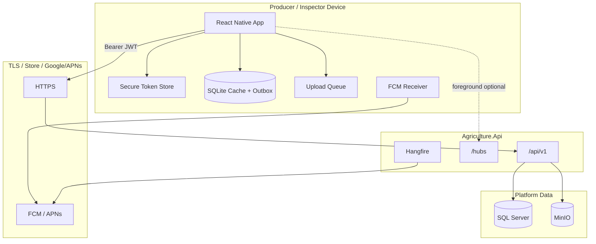

## 1.5 Success Criteria

| Criterion | Observable evidence |
|-----------|---------------------|
| Contract fidelity | All reads/writes go through typed API clients for `/api/v1`; Problem Details parsed centrally |
| Offline task completion | Producer can complete photo-required task without network; sync succeeds once with no double-complete |
| Auth correctness | Refresh rotation, logout revoke, reuse detection handling, secure storage match API_CONTRACT |
| AuthZ UX | Screens/actions gated by permission strings + role shell; server remains authoritative |
| Push reachability | Device token registered; deep link opens correct task/inspection |
| Evidence integrity | Photos hashed/queued; MinIO via API; no permanent credentials in binary |
| Accessibility | Large tap targets, readable typography, screen-reader labels on primary flows |
| Battery / network | Background sync bounded; GPS on-demand; retry with backoff |
| Literacy UX | “Today” home; one primary CTA per task; no admin filters-first IA |

## 1.6 Anti-Patterns Explicitly Rejected

1. **Treating mobile as a shrunk admin SPA** — rejected; PRODUCT_VISION simplicity principle.
2. **Online-only task completion** as the product default — rejected; field connectivity is intermittent (PHYSICAL_ARCHITECTURE Scenario B).
3. **Storing refresh/access tokens in AsyncStorage plaintext** — rejected; use Keychain/Keystore (or Board-approved secure store).
4. **Client-only authorization** presented as secure — rejected; UI gates are UX only.
5. **Inventing permission strings** not in API_CONTRACT / MODULE_DESIGN — rejected.
6. **PATCH status transitions** — rejected (API_CONTRACT forbids).
7. **Shipping MinIO access keys** in the app — rejected (ADR-010 / API_CONTRACT §10).
8. **Using SignalR as the sole mobile notification channel** — rejected (ADR-008/009); FCM is mandatory for background.
9. **Public self-registration screens** — rejected (SRS).
10. **Sharing a single app binary UX that dumps Admin+Producer+Inspector into one dense shell** — rejected; use role-based navigation shells within one codebase.
11. **SQLite as authoritative business ledger** — rejected; server SQL + domain aggregates remain SoR.
12. **Silent data loss on conflict** — rejected; conflict policy must surface or auto-resolve per Section 12.

---

# 2. Technology Choices (Recommended Stack)

Prior ADRs lock **React Native** for mobile. This specification fills library choices that those ADRs intentionally left open, without contradicting them.

## 2.1 Core Runtime

| Choice | Recommendation | Reasoning |
|--------|----------------|-----------|
| Language | TypeScript (strict) | Municipal auditability; DTO alignment with OpenAPI; safer refactors |
| UI framework | React Native (New Architecture / Fabric+TurboModules preferred for mid-term) | ADR stack lock; performance for lists + camera previews |
| Bootstrap | Expo Dev Client **or** bare RN — Board picks one before first store build | Expo accelerates permissions/camera/notifications; bare if municipal MDM/native modules demand it. Either way, production builds must support FCM + secure storage + background tasks |
| Navigation | React Navigation (native stack + bottom tabs) | De facto standard; deep linking first-class; matches PHYSICAL_ARCHITECTURE deep-link needs |
| Server state (online) | **TanStack Query v5+** | Same mental model as admin SPA; cache, retries, dedupe for `/api/v1`; pairs with offline hydrate from SQLite |
| Local durable state | **SQLite** via WatermelonDB **or** `op-sqlite` / `expo-sqlite` + thin repository layer | Offline-first requires relational local store; AsyncStorage alone is insufficient for outbox/queues |
| Client UI session | React Context + small stores (Zustand optional) | Auth session, sync status banner, permission set; avoid Redux unless complexity explains it |
| Forms | React Hook Form + Zod | Consistent with admin SPA validation ergonomics; large tap-friendly field components |
| HTTP | `fetch` wrapper (or ky/axios with Board approval) | Centralize Bearer, correlation id, Idempotency-Key, Problem Details |
| Realtime | `@microsoft/signalr` **optional when app active** | ADR-008; not a substitute for FCM |
| Push | `@react-native-firebase/messaging` or Expo Notifications + FCM | ADR-009; register via API device-tokens |
| Secure storage | `react-native-keychain` / Expo SecureStore | PHYSICAL_ARCHITECTURE dependency |
| Camera | `react-native-vision-camera` or Expo Camera (Board pick) | Evidence capture; future barcode/QR plugins |
| Location | `react-native-geolocation-service` / Expo Location | Optional GPS on inspections (SRS) |
| Image pipeline | Local file URI + resize/compress before queue | Battery + upload size; API max size constraints |
| Dates | date-fns or Temporal polyfill (one Board pick) | ISO-8601 UTC from API; display municipal locale |
| i18n | i18next + react-i18next | Turkish municipal default + English ops |
| Lint / format | ESLint + Prettier (align with mobile tooling) | Consistency |
| Unit test | Jest + Testing Library RN | Component + sync unit tests |
| E2E | Detox or Maestro | Offline complete → online sync journeys |
| OTA updates | Expo Updates or CodePush **only with Board security policy** | Never ship secret changes via OTA; native module bumps require store release |

**Reasoning for TanStack Query on mobile (not “only SQLite”):** Online reads still benefit from request deduplication, stale-while-revalidate, and mutation lifecycle. SQLite is the **durable offline source**; TanStack Query is the **online orchestration cache** that hydrates from and writes through sync adapters. Rejecting Query entirely would reinvent retries and invalidation poorly. Rejecting SQLite would fail offline-first.

**Reasoning for not choosing Redux Toolkit Offline by default:** Municipal offline needs are domain-specific (photo queues, idempotent completes, conflict UX). A thin custom outbox aligned to API_CONTRACT verbs is clearer than forcing all state through Redux Offline middleware.

**Reasoning for not choosing Next.js / Capacitor / PWA as producer primary:** PRODUCT_VISION and ADRs lock React Native; camera, background push, and store distribution are first-class.

## 2.2 Version Policy

- Prefer current stable RN major supported by municipal MDM and store policies.
- Pin lockfile; renovate under change windows.
- OpenAPI-driven types optional; API_CONTRACT prose remains authoritative.
- Native dependency upgrades require regression on camera, secure storage, FCM, and background sync.

## 2.3 Single Codebase, Dual Shells

v1 ships **one React Native codebase** with **role-based navigation shells**:

| Shell | Roles | Home emphasis |
|-------|-------|---------------|
| Producer shell | Producer | Today’s tasks, notifications, support |
| Inspector shell | Inspector | Assigned inspections, evidence, complete |
| Mixed / elevated | Rare Officer-on-mobile (if product enables) | Explicitly limited; prefer SPA for ops |

**Reasoning:** One binary reduces store ops cost; shells prevent Producer users from seeing Inspector IA. If `roles` contain only Producer, never mount inspector queues. If an Admin JWT somehow authenticates, show “use the administration web application” (mirror of REACT_ARCHITECTURE producer-on-SPA denial).

## 2.4 Repository Layout (Target)

```
mobile/
  app.json / app.config.ts          # if Expo
  package.json
  src/
    app/                            # providers, navigation roots, bootstrap
    features/                       # vertical slices
    shared/                         # http, auth primitives, ui kit, i18n, permissions
    local/                          # sqlite schema, repositories, sync engine, queues
    native/                         # thin wrappers: camera, gps, push, biometrics
  assets/
  docs/                             # mobile-only runbooks (optional)
```

**Reasoning:** Mirrors REACT_ARCHITECTURE feature verticals while adding a first-class `local/` plane required by offline-first—something the admin SPA deliberately rejects.

---

# 3. System Context and Personas

## 3.1 Personas on Mobile

| Persona | Role claim | Mobile expectations |
|---------|------------|---------------------|
| Producer | Producer | Today tasks, start/complete, photos, inbox, support apply/status, profile/password |
| Inspector | Inspector | Assigned inspections, start/complete/reject flows as permitted, evidence + optional GPS |
| Officer / Admin | Officer / Admin | **Out of primary mobile scope**; if authenticated, redirect messaging to SPA |
| Unprovisioned public | — | **No registration**; login failure + contact municipality messaging |

**Reasoning:** SRS forbids public registration. Identity accounts are provisioned by municipal officers (MODULE_DESIGN Identity → Producers linkage policies).

## 3.2 Primary Field Journeys

1. **Producer completes today’s photo task offline** → queues photo + complete → sync on reconnect → FCM confirmation optional.
2. **Producer receives FCM assignment** → deep link → task detail → start → photo → complete.
3. **Inspector completes field inspection** → evidence uploads → complete with findings → season gate advances server-side.
4. **Producer requests support** → create application → track status via inbox / pull-to-refresh.
5. **Lost phone** → refresh revoked server-side; local secure store cleared on next failed refresh; device token deleted.

## 3.3 Non-Functional Context (Physical)

PHYSICAL_ARCHITECTURE Scenario B (weak cellular photo upload) and Scenario D (lost inspector phone) are **normative design drivers** for upload queue resilience and session revocation handling.

---

# 4. Folder / Feature Structure

## 4.1 Feature Map (v1 Mobile Surface)

| Feature folder | API_CONTRACT focus | Producer | Inspector |
|----------------|--------------------|----------|-----------|
| `auth` | `/auth/login|refresh|logout|change-password|me` | ✓ | ✓ |
| `today` / `tasks` | `/tasks/today`, `/tasks/{id}`, start/complete/photos | ✓ primary | limited if assigned |
| `inspections` | `/inspections/**` evidence/complete | read related if product enables | ✓ primary |
| `notifications` | `/notifications/me`, read, device-tokens | ✓ | ✓ |
| `support` | `/support/programs`, `/support/applications` | ✓ apply/read own | usually no |
| `profile` | `/auth/me`, change-password | ✓ | ✓ |
| `sync` | local outbox UI / conflict center | ✓ | ✓ |
| `seasonContext` | read-only season summary if exposed | light | light |

**Explicitly deferred / SPA-owned on mobile v1:** producer registry CRUD, land geometry editors, workflow template designers, reporting exports, notification template admin, harvest/delivery fulfillment ops, identity role management.

## 4.2 Feature Slice Template

```
features/tasks/
  screens/
    TodayTasksScreen
    TaskDetailScreen
    TaskCompleteScreen
  components/
    TaskDueBanner
    PhotoEvidenceList
  api/
    tasks.api.ts
    tasks.keys.ts
    tasks.types.ts
  hooks/
    useTodayTasksQuery.ts
    useCompleteTaskMutation.ts
  local/
    tasks.repo.ts          # SQLite projections
    tasks.outbox.ts        # offline commands
  permissions.ts           # re-exports catalog strings used here
  index.ts                 # public screen exports only
```

**Reasoning:** Colocation keeps API_CONTRACT churn reviewable. `local/` subfolder makes offline coupling visible in code review.

## 4.3 Shared Kernel Rules

`shared/` may contain: HTTP client, Problem Details parser, Permission string union, design tokens, Button/ListRow/EmptyState, i18n, correlation id helper, secure storage adapter interfaces.

`shared/` must **not** contain: `CompleteTaskForm`, `InspectionFindingsEditor`, or domain outbox serializers—those stay in features/`local`.

## 4.4 Local Plane Rules

`local/` owns:

- SQLite migrations and schema versioning
- Sync engine orchestration
- Upload queue worker
- Network reachability bridge
- Conflict journal

Features call repositories; features do not open raw SQL ad hoc.

---

# 5. Navigation Architecture

## 5.1 Information Architecture Principles

1. **One job per screen** — PRODUCT_VISION simplicity.
2. **Home = work now** — Producer lands on Today; Inspector lands on Assigned Inspections.
3. **Max 3–4 bottom tabs** — avoid admin sidebar density.
4. **Detail → action** — Task detail exposes Start / Add photo / Complete as large primary actions.
5. **Sync status always glanceable** — non-blocking banner when pending outbox > 0 or offline.

## 5.2 Producer Tab Shell (Normative)

| Tab | Route root | Purpose |
|-----|------------|---------|
| Today | `TodayStack` | Due/overdue/in-progress tasks |
| Inbox | `NotificationsStack` | Cursor inbox + deep link targets |
| Support | `SupportStack` | Programs & my applications |
| Me | `ProfileStack` | Profile, password, logout, app version |

## 5.3 Inspector Tab Shell (Normative)

| Tab | Route root | Purpose |
|-----|------------|---------|
| Inspections | `InspectionsStack` | Assigned / open workload |
| Inbox | `NotificationsStack` | Same inbox module |
| Me | `ProfileStack` | Profile, password, logout |

## 5.4 Auth Gate Flow

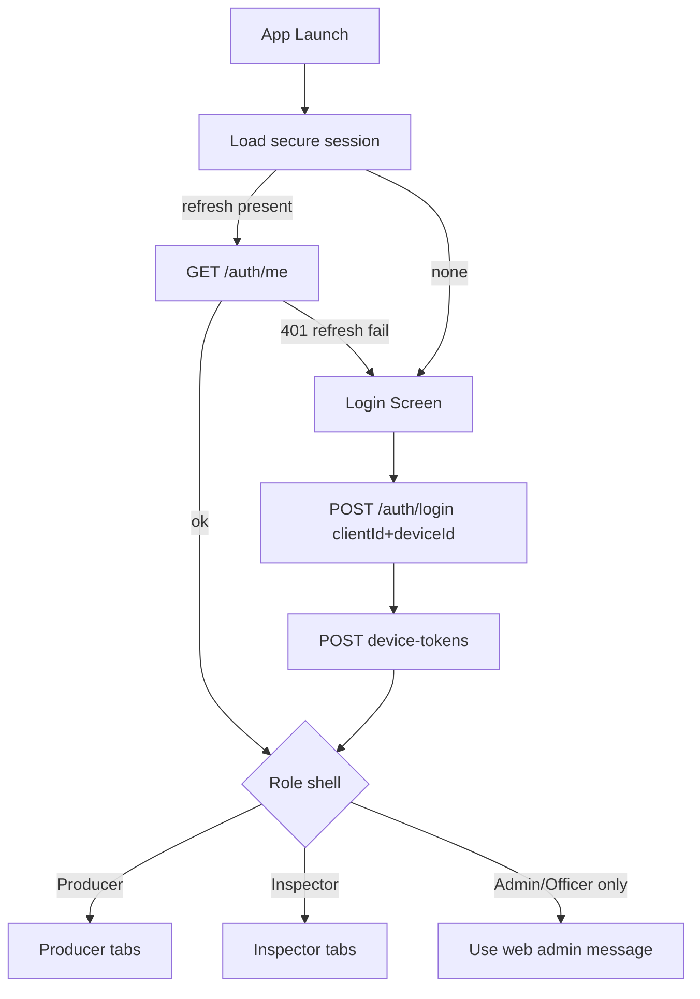

**Reasoning:** Registering FCM after auth ties push to the active user (API_CONTRACT §27.4). `deviceId` supports future refresh binding (API_CONTRACT login/refresh).

## 5.5 Deep Link Route Table (Preview — detail in §14)

| Link | Target |
|------|--------|
| `agri://tasks/{taskId}` | TaskDetail |
| `agri://inspections/{inspectionId}` | InspectionDetail |
| `agri://notifications/{notificationId}` | Notification detail → entity |
| `https://{municipal-host}/m/tasks/{taskId}` | Universal / App Link equivalent |

---

# 6. State Management Architecture

## 6.1 State Planes

| Plane | Examples | Owner |
|-------|----------|-------|
| Secure session | refresh token, access token memory cache, deviceId | `shared/auth` + Keychain |
| Server cache (online) | Task detail fetched moments ago | TanStack Query |
| Durable projection | Today tasks list, inspection summaries | SQLite |
| Durable outbox | Pending `CompleteTask`, `ConfirmPhoto` | SQLite outbox tables |
| Ephemeral UI | Modal open, camera preview | Component / small store |
| Sync meta | lastSyncAt, backoff, conflict count | SQLite + SyncStatusContext |

## 6.2 TanStack Query on Mobile — Normative Policy

| Setting | Recommendation | Reasoning |
|---------|----------------|-----------|
| `networkMode` | `offlineFirst` where queries can serve SQLite fallback | Aligns with offline-first product |
| `staleTime` | Short for today list (30–60s); longer for static program text | Field lists change via FCM/SignalR |
| `retry` | Bounded exponential; do not retry 401/403/404 blindly | Problem Details semantics |
| Mutations | Prefer **outbox write** then sync worker for offline-capable commands | Prevents lost taps |
| Invalidation | On sync success + SignalR events + FCM data messages | Keep UI honest |

**Query key factories** mirror REACT_ARCHITECTURE style:

```
tasksKeys.all → ['tasks']
tasksKeys.today → ['tasks','today']
tasksKeys.detail(id) → ['tasks','detail', id]
```

## 6.3 Why Not “Query Only” or “SQLite Only”

- **Query only** fails when the OS kills the app mid-upload or the network drops after photo capture.
- **SQLite only** without Query loses online dedupe, background refetch on focus, and familiar mutation tooling shared with web engineers.

**Decision:** Dual-plane with a clear write path: UI → outbox (durable) → sync engine → API → SQLite projection update → Query invalidation.

## 6.4 Optimistic UI Rules

Allowed: mark task “Completing…” locally when outbox accepts command.

Forbidden: invent server statuses not in API_CONTRACT enums; hide conflicts forever.

---

# 7. Caching Strategy

## 7.1 Cache Layers

1. **Memory (TanStack Query)** — hot screens.
2. **SQLite projections** — cold start offline.
3. **Filesystem** — photo blobs pending upload (not in SQL BLOB columns for large files).
4. **HTTP cache** — generally **disabled** for authenticated mutable resources; prefer explicit ETag/rowVersion only if API adds them later.

## 7.2 What to Cache Locally (v1)

| Entity | Cache | TTL / invalidation |
|--------|-------|--------------------|
| Today tasks | Full projection for assignee | On sync pull; FCM task events |
| Task detail + photo metadata | Per opened task | On open + after upload |
| Inspections assigned | List + detail | On sync pull |
| Notifications inbox (recent page) | Cursor window | On open + push |
| Support programs (published) | List | Daily / pull |
| Own support applications | List + detail | After mutate sync |
| Permissions / me | Secure + memory | Login / refresh / forced re-me |

## 7.3 What Not to Cache

- Admin reporting datasets
- Other producers’ PII beyond what API returns for the signed-in user
- MinIO objects long-term after successful upload confirm (delete local file after ack)
- Permanent download URLs (always treat as short-lived)

## 7.4 Cache Eviction & Disk Budgets

| Budget | Guidance |
|--------|----------|
| Pending photos | Cap queue (e.g., 50 items or 500 MB — Board configure) with user-visible blocking message |
| Synced photo thumbnails | LRU eviction |
| Inbox | Keep last N (e.g., 200) locally |

**Reasoning:** Farm devices may be low storage; unbounded queues cause silent failure.

---

# 8. SQLite Architecture

## 8.1 Role of SQLite

SQLite is the **device-local durability layer** for:

- Read projections (offline UI)
- Command outbox (offline writes)
- Upload queue metadata
- Sync checkpoints / cursors
- Conflict journal entries

It is **not** the municipal system of record. Server SQL Server schemas (DATABASE_DESIGN) remain authoritative.

## 8.2 Suggested Logical Tables (Interface Names)

| Table | Purpose |
|-------|---------|
| `meta_kv` | schemaVersion, lastPullAt, deviceId |
| `task_projection` | TaskSummary/Detail fields needed offline |
| `inspection_projection` | Inspection summaries/details |
| `notification_projection` | Inbox items |
| `support_program_projection` | Published programs |
| `support_application_projection` | Own applications |
| `outbox_command` | id, type, payloadJson, idempotencyKey, status, attempts, nextAttemptAt, lastError |
| `upload_item` | id, localUri, sha256, targetRoute, taskOrInspectionId, status, attempts |
| `conflict_journal` | id, entityType, entityId, serverRowVersion, clientPayload, detectedAt, resolution |
| `sync_run` | diagnostics for support |

Exact DDL is an implementation concern; names above are architectural interfaces.

## 8.3 Migration Policy

- Monotonic `schemaVersion`
- Migrations run before UI hydrate
- Destructive resets require re-login + full pull; never silently drop outbox with pending commands without user consent

## 8.4 Encryption

Prefer SQLCipher or OS file protection **if** municipal security review requires at-rest encryption beyond photo file sandbox. Tokens remain in Keychain/Keystore regardless.

**Reasoning:** Projections may include producer-adjacent identifiers; defense in depth for lost devices (PHYSICAL_ARCHITECTURE Scenario D).

---

# 9. Authentication Architecture

## 9.1 Normative Protocol

Aligned with ADR-013 and API_CONTRACT §5 / §17:

1. `POST /api/v1/auth/login` with `userNameOrEmail`, `password`, `clientId`, optional `deviceId`
2. Store **refresh token** in secure storage; keep **access token** in memory (optionally mirrored in secure storage if process death UX requires—Board threat review)
3. `POST /api/v1/auth/refresh` with rotation; handle reuse detection as full logout
4. `POST /api/v1/auth/logout` revoke refresh; delete device token; clear SQLite projections on privacy policy
5. `GET /api/v1/auth/me` hydrate permissions/roles

### clientId Values

| App mode | clientId |
|----------|----------|
| Producer shell | `mobile-producer` |
| Inspector shell | `mobile-inspector` |

Allowlist must match Identity configuration (API_CONTRACT: clientId allowlisted). Do not reuse `web-admin`.

### Auth Sequence

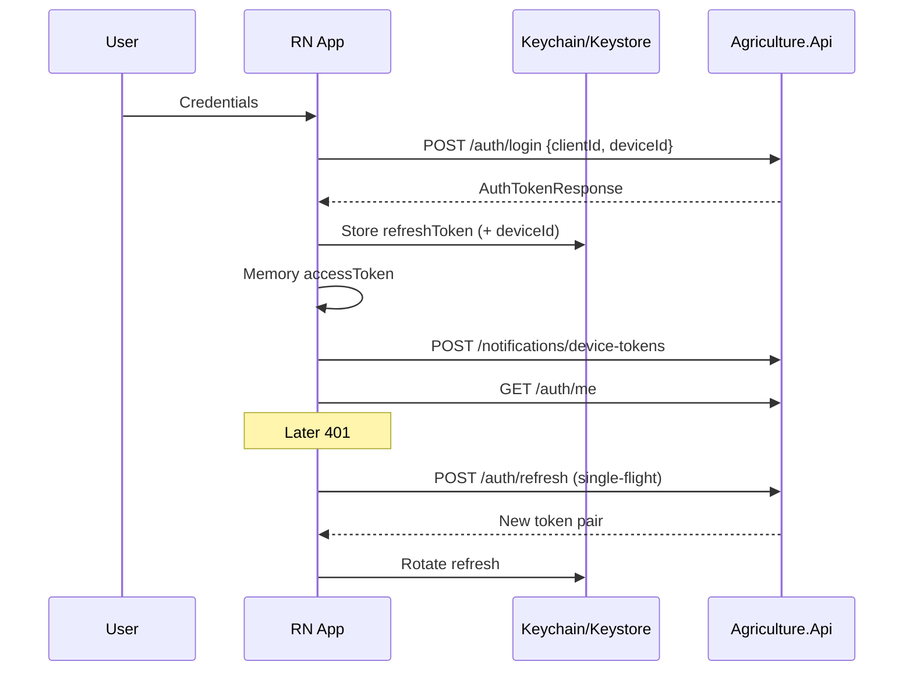

## 9.2 Secure Token Storage

| Item | Storage | Reasoning |
|------|---------|-----------|
| refreshToken | Keychain/Keystore | Long-lived; theft = account session |
| accessToken | Memory preferred; secure optional | Short TTL; reduce XSS-equivalent surface in RN is different but minimize disk |
| deviceId | Secure or identifier-for-vendor with policy | Binding for refresh (future) |
| biometric unlock gate | Optional OS biometrics before revealing session | Lost device mitigation UX |

**Never:** commit tokens to SQLite projections, logs, Sentry breadcrumbs, or analytics.

## 9.3 Single-Flight Refresh

On HTTP 401:

1. Pause callers
2. One refresh in flight
3. Retry original requests once
4. On refresh failure (`Auth.InvalidRefreshToken` / `Auth.RefreshReuseDetected`) → hard logout

**Reasoning:** Prevents refresh storms on today-list fan-out; matches REACT_ARCHITECTURE admin policy adapted to mobile.

## 9.4 Password & Provisioning

- Change password: `POST /auth/change-password` → expect refresh family revoke → re-login
- Reset password: request/confirm endpoints exist for provisioned users; mobile may deep-link from email if municipality enables
- **No sign-up screen**

## 9.5 Session Threats

| Threat | Mitigation |
|--------|------------|
| Lost phone | Server revoke refresh; delete device token; short access TTL |
| Refresh reuse | Server revokes family; app hard logout |
| Jailbreak/root | Detect optionally; warn; do not claim hard security |
| Backup extraction | Exclude secure store from plaintext backups where OS allows |

---

# 10. Offline-First Architecture

## 10.1 Definition (Normative)

**Offline-first** for this product means:

- The producer can open Today, view cached tasks, capture photos, and enqueue completion **without network**.
- The inspector can open assigned inspections, capture evidence, and enqueue completion **without network**.
- When network returns, a background/foreground sync worker drains outbox and upload queue **idempotently**.
- The UI always shows honest sync state (pending / syncing / conflict / failed).

It does **not** mean offline creation of municipal registry entities (producers, lands, seasons, workflows).

## 10.2 Offline Capability Matrix

| Action | Offline allowed? | Mechanism |
|--------|------------------|-----------|
| View today tasks | Yes | SQLite projection |
| Start task | Yes (queue) | outbox `TaskStart` → `POST /tasks/{id}/start` |
| Add photo | Yes (queue) | upload_item + later multipart/presign |
| Complete task | Yes (queue) | outbox `TaskComplete` + Idempotency-Key |
| View notifications | Cached window | Pull when online |
| Mark notification read | Queue | outbox |
| Create support application | Prefer online; queue draft if Board enables | Validate heavily on sync |
| Complete inspection | Yes (queue) | outbox + evidence uploads first |
| Login / refresh | Requires network | No offline auth invent |

## 10.3 Offline Sync Overview Diagram

```mermaid
flowchart TB
  subgraph UI["UI Layer"]
    Screen[Task / Inspection Screens]
  end

  subgraph Local["Local Plane"]
    Proj[(Projections)]
    Outbox[(Outbox Commands)]
    Uploads[(Upload Queue)]
  end

  subgraph Workers["Sync Workers"]
    Net[Network Monitor]
    UpWorker[Upload Worker]
    CmdWorker[Command Worker]
    PullWorker[Pull Worker]
  end

  subgraph Server["Agriculture.Api"]
    API["/api/v1"]
  end

  Screen --> Proj
  Screen -->|user action| Outbox
  Screen -->|capture| Uploads
  Net --> UpWorker
  Net --> CmdWorker
  Net --> PullWorker
  UpWorker -->|multipart / confirm| API
  CmdWorker -->|Idempotency-Key| API
  PullWorker -->|GET today/detail| API
  API --> Proj
```

## 10.4 Connectivity Model

Use OS reachability + failed request signals. Distinguish:

- **Offline** — no route
- **Degraded** — reachable but high failure rate / captive portal
- **Online** — successful API health or authenticated call

Sync workers run in **degraded** with tighter backoff.

## 10.5 Cold Start Behavior

1. Show last projection immediately (no blank spinner forever)
2. If secure session exists, attempt refresh
3. Kick pull + outbox drain
4. Banner: “Showing data as of {lastPullAt}” when offline

**Reasoning:** Limited digital literacy users interpret blank screens as “broken,” not “loading.”

---

# 11. Synchronization Architecture

## 11.1 Sync Modes

| Mode | When | Behavior |
|------|------|----------|
| Foreground pull | App active / tab focus | Refresh today + open detail |
| Foreground push | After local enqueue | Attempt immediate drain |
| Background sync | OS background fetch / RN background task | Bounded drain; respect battery §22 |
| Push-triggered sync | FCM data message | Invalidate + pull entity |

## 11.2 Pull Strategy

1. `GET /tasks/today` (producer) or inspections list (inspector)
2. For dirty/open entities, `GET /tasks/{id}` / `GET /inspections/{id}`
3. `GET /notifications/me?cursor&limit`
4. Upsert projections; delete tombstones if API indicates cancellation

Prefer **server-wins for projections**; **client-outbox for pending commands** until ack.

## 11.3 Push (Outbox Drain) Strategy

Ordered per aggregate:

1. Upload all pending photos for task/inspection
2. Confirm uploads if using sessions pattern
3. Execute lifecycle commands (`start`, then `complete`)
4. Mark outbox row `Succeeded` / retain `Failed` with errorCode

**Reasoning:** API_CONTRACT requires photos before complete when `requiresPhoto`.

## 11.4 Idempotency

Every outbox command stores a stable `idempotencyKey` (UUID) created at enqueue time—not at send time.

Send header `Idempotency-Key` on:

- `POST /tasks/{id}/complete`
- `POST /tasks/{id}/photos` and/or confirm
- `POST /inspections/{id}/complete`
- evidence uploads
- other API_CONTRACT “SHOULD” paths

**Reasoning:** API_CONTRACT §3.6 explicitly calls out mobile offline completion.

## 11.5 Sync Run Diagnostics

Persist last sync errors for “Help” screens and municipal support without shipping PII to third parties unless policy allows.

---

# 12. Conflict Resolution for Offline Writes

## 12.1 Conflict Classes

| Class | Example | Resolution |
|-------|---------|------------|
| Idempotent replay | Double complete same key | Treat 200 success-equivalent as success; clear outbox |
| State conflict | Task already completed by officer `complete_any` | Map Problem Details; mark local complete; clear outbox; toast explanation |
| Concurrency | `*.ConcurrencyConflict` 409 | Re-pull entity; if command still valid, new attempt **with same idempotency key only if server semantics allow**; else new key after user confirm |
| AuthZ | 403 not assignee | Fail outbox; user must contact officer |
| Validation | Missing photo | Block complete until upload succeeds |
| Photo orphan | Uploaded bytes but confirm failed | Retry confirm; Hangfire server reconciliation exists—client still retries |

## 12.2 Conflict UX Principles

- Prefer **plain language**: “This task was already completed. We updated your list.”
- Provide a **Sync / Conflicts** screen listing failed items with Retry
- Never delete user-captured photos until server confirm **or** user explicitly discards

## 12.3 RowVersion Handling

When TaskDetail includes `rowVersion` (API_CONTRACT), include it on commands if/when API requires; otherwise rely on action endpoints’ server-side checks. Do not invent PATCH-with-rowVersion status writes.

## 12.4 Conflict Decision Flow

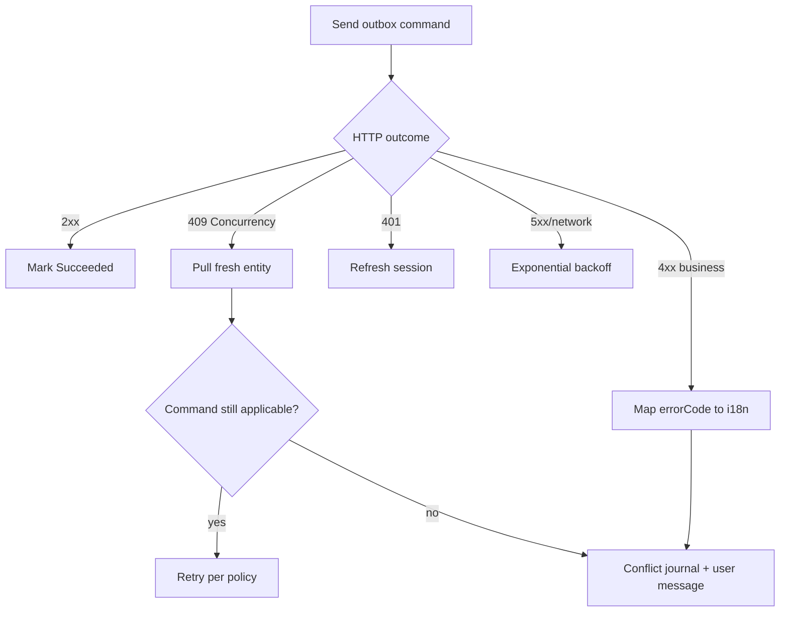

---

# 13. Push Notifications Architecture

## 13.1 Channel Split (Normative)

| Channel | Use |
|---------|-----|
| **FCM** | Background/killed delivery; assignment, reminders, inspection schedule (ADR-009) |
| **SignalR `/hubs/notifications`** | Optional foreground instant inbox bump (ADR-008) |
| **In-app inbox REST** | Source of truth for read state (`/notifications/me`) |

SignalR must not replace FCM.

## 13.2 Device Token Lifecycle

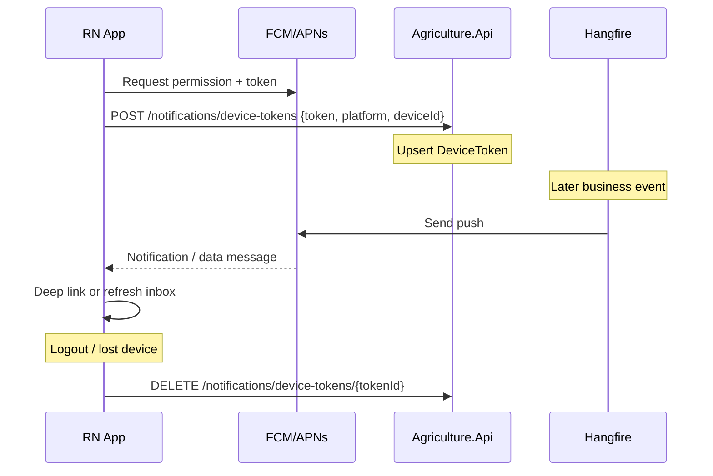

## 13.3 Permission UX

- Request notification permission **after** first successful login, with one-sentence value prop (“Get told when a new task is assigned”).
- If denied, app remains usable; show soft prompt in Me tab.
- Mirror OS settings deep link.

## 13.4 Payload Handling

Prefer data messages carrying: `notificationId`, `entityType`, `entityId`, `deepLink`.

On receive:

1. Upsert inbox projection if payload includes summary
2. Invalidate Query keys
3. If user taps → navigate deep link (§14)
4. Do not execute privileged commands from push alone

## 13.5 Alignment with API_CONTRACT Notifications

| Endpoint | Mobile use |
|----------|------------|
| `GET /notifications/me` | Inbox |
| `POST /notifications/{id}/read` | Mark read |
| `POST /notifications/me/read-all` | Mark all |
| `POST /notifications/device-tokens` | Register |
| `DELETE /notifications/device-tokens/{tokenId}` | Unregister |
| Admin templates/stats | **SPA only** |

---

# 14. Deep Linking Architecture

## 14.1 Goals

- FCM taps open the correct task/inspection
- Email/password reset links open confirm flow when enabled
- Universal Links / App Links for municipal domain `/m/...`

## 14.2 Resolution Pipeline

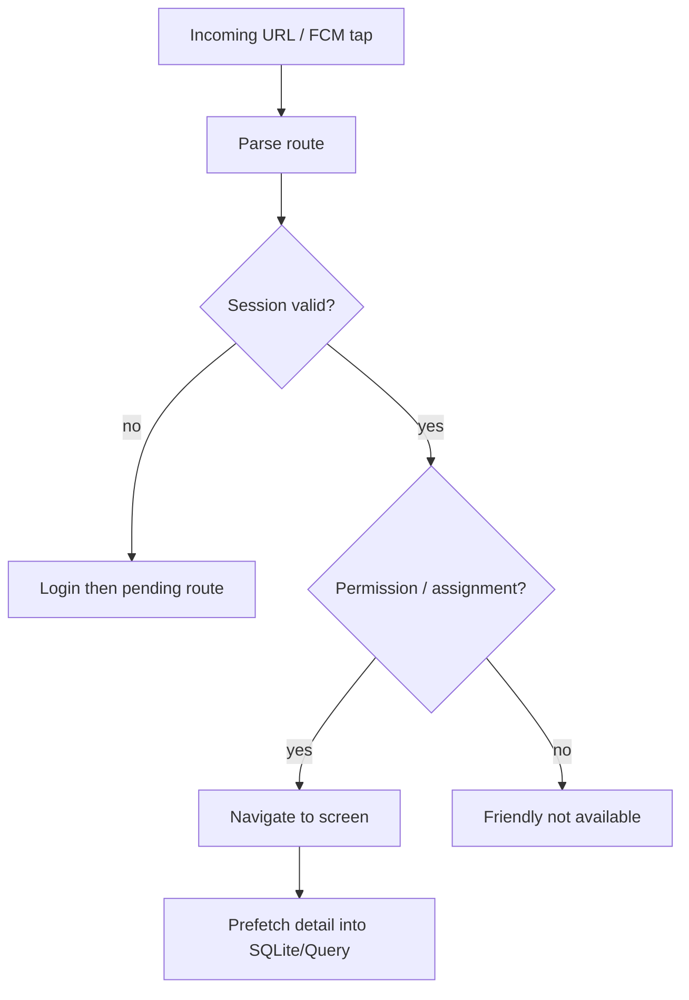

## 14.3 Security Rules

- Ignore unknown hosts
- Do not trust push-provided status fields; always fetch entity
- Pending deep link stored in memory until auth completes; clear on logout

## 14.4 Reasoning

PHYSICAL_ARCHITECTURE lists deep links as a mobile dependency. Coordinating FCM + navigation prevents “notification opens blank home,” a common literacy/trust failure.

---

# 15. Camera Architecture

## 15.1 Purpose

Evidence photos for tasks (`requiresPhoto`) and inspection evidence — core PRODUCT_VISION / SRS flows.

## 15.2 Capture Pipeline

1. Request camera permission with plain rationale
2. Open camera UI (rear default)
3. Capture JPEG
4. Optional crop (minimal; avoid complex editors)
5. Resize/compress to API limits (e.g., edge ≤ 2000px, quality target under max MB)
6. Compute SHA-256
7. Persist file in app sandbox
8. Enqueue `upload_item`
9. Show thumbnail in evidence list immediately

## 15.3 Decisions & Reasoning

| Decision | Reasoning |
|----------|-----------|
| Prefer camera capture over gallery for evidence | Stronger authenticity for municipal audit; gallery allowed as accessibility fallback with warning |
| Compress before queue | PHYSICAL_ARCHITECTURE weak cellular scenario |
| Hash local file | Confirm endpoint / dedup alignment |
| No filters/beautify | Evidence integrity |

## 15.4 Permission Denial

If camera denied: explain, link to settings, allow gallery fallback if product policy accepts; if `requiresPhoto` and no path, block complete with clear message.

## 15.5 Future Scanner Seam

Camera module must expose a **plugin boundary** for barcode/QR (§28) without rewriting evidence capture.

---

# 16. GPS Architecture

## 16.1 Scope

SRS: inspection GPS **optional**. v1:

- Capture coordinates at inspection start/complete or evidence moment when permission granted
- Attach to evidence metadata or complete payload **only if API_CONTRACT fields exist / Board extends DTO**
- Do not continuous-track producers (battery + privacy)

## 16.2 Decision Rules

| Decision | Reasoning |
|----------|-----------|
| On-demand fix | Battery optimization §22 |
| Timeout ~10–15s then continue without GPS | Field UX must not block completion forever |
| Accuracy display coarse | Literacy; avoid raw scary precision theater |
| Never silent background tracking in v1 | Privacy / store policy |

## 16.3 Permissions

OS location permission separate from camera. Explain “used to record where the inspection happened.”

## 16.4 Future GIS

Store WGS84 points locally; future map screens consume same coordinates (§28.3). Do not embed full GIS engine in v1.

---

# 17. Photo Upload Architecture

## 17.1 Normative Upload Pattern

API_CONTRACT §10:

- **v1 default for evidence:** multipart through API (`POST /tasks/{id}/photos`, `POST /inspections/{id}/evidence`)
- **Presigned PUT:** allowed for large artifacts; sessions + confirm routes exist for tasks

Mobile upload worker prefers multipart for authZ simplicity on weak networks; may switch to sessions when size exceeds threshold.

## 17.2 Upload Queue Diagram

```mermaid
sequenceDiagram
  participant Cam as Camera
  participant Q as Upload Queue
  participant API as Agriculture.Api
  participant MinIO as MinIO

  Cam->>Q: Enqueue localUri + sha256 + Idempotency-Key
  Q->>API: POST /tasks/{id}/photos multipart Bearer
  Note over API: Validate type/size; store metadata; put object
  API->>MinIO: PutObject mediated
  API-->>Q: 201 PhotoDto
  Q->>Q: Mark uploaded; keep until task complete ack
  Note over Q: Alternative large file path
  Q->>API: POST /photos/sessions
  API-->>Q: uploadUrl + objectKey
  Q->>MinIO: HTTP PUT bytes
  Q->>API: POST /photos/confirm {objectKey,sha256}
```

## 17.3 Queue Policies

| Policy | Value / rule |
|--------|----------------|
| Concurrency | 1–2 uploads (battery + radio) |
| Retry | Exponential backoff; cap attempts; surface failure |
| Order | FIFO per parent entity |
| Deletion | Delete local file only after confirm/success and parent command policy allows |
| Auth | Refresh before large upload if access near expiry |
| Credentials | **Never** embed MinIO keys |

## 17.4 Failure Modes

| Failure | Client behavior |
|---------|-----------------|
| 413 / type reject | Fail item; user must recapture smaller/different |
| 401 | Refresh; retry |
| 409 / conflict | Re-pull; reconcile |
| Network drop mid-body | Retry whole upload with same Idempotency-Key |
| Server 503 MinIO | Backoff; banner “Uploads paused” |

## 17.5 Alignment Notes

Officers viewing evidence use SPA with temporary download URLs. Mobile should likewise use authorized GET URLs when showing historical photos; cache thumbnails carefully.

---

# 18. Task Management Architecture

## 18.1 Producer Task Loop

Aligned with EVENT_STORMING / API_CONTRACT Tasks:

1. List `GET /tasks/today`
2. Open `GET /tasks/{taskId}`
3. Optional `POST /tasks/{taskId}/start`
4. Upload photos if required
5. `POST /tasks/{taskId}/complete` with Idempotency-Key
6. Server advances workflow; notifications/SignalR/FCM fan-out elsewhere

## 18.2 Mobile UX Rules

- Today list sorted by due urgency
- Overdue visually distinct but not shame-oriented
- Detail shows: title, due, instructions, requiresPhoto badge, evidence thumbnails, primary CTA
- Comments: support `POST /tasks/{id}/comments` if product enables; keep secondary

## 18.3 Permissions

| Action | Permission |
|--------|------------|
| Read own today | `tasks.read` (scoped) |
| Complete own | `tasks.complete_own` |
| Complete any | `tasks.complete_any` (generally SPA/officer; hide on producer shell) |
| Cancel / delay | Typically officer; not producer primary |

UI gates hide actions; server enforces assignment.

## 18.4 Offline Task Completion Ordering

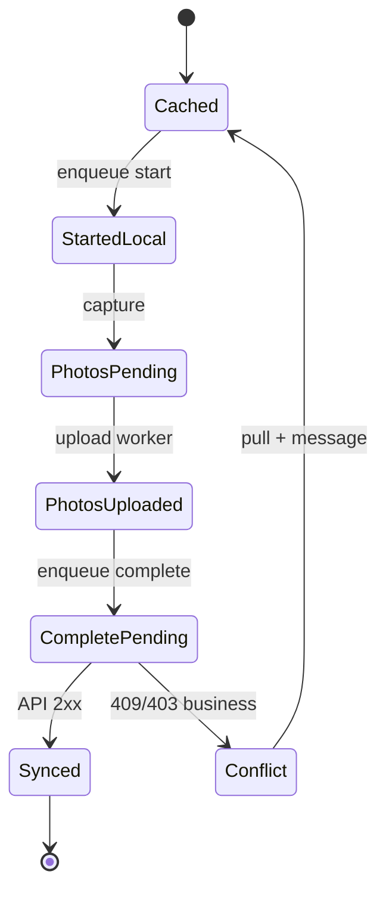

## 18.5 What Mobile Does Not Own

Workflow template editing, bulk assign, reminder administration — SPA / Hangfire.

---

# 19. Inspection Field Architecture

## 19.1 Inspector Loop

1. List assigned inspections
2. Open detail (season/land context summaries as API provides)
3. Start inspection when endpoint used
4. Upload evidence
5. Complete with outcome + findings **or** reject per permissions
6. Optional GPS snapshot

## 19.2 Permissions

`inspections.read|create|assign|complete|reject` — mobile primarily read/complete/reject for assignee; create/assign remain SPA-oriented unless product explicitly enables.

## 19.3 Evidence Minimums

Honor server validation (API_CONTRACT). Client prechecks for literacy UX but server is authority.

## 19.4 Blocking Semantics

Mobile does not compute harvest eligibility. It may show informational banners if API returns gate hints; Harvest module remains server-side (MODULE_DESIGN).

---

# 20. Support Flows (Producer)

## 20.1 Endpoints Used

| Endpoint | Use |
|----------|-----|
| `GET /support/programs` | Browse published programs |
| `POST /support/applications` | Apply |
| `GET /support/applications` (filtered own) | Track |
| `GET /support/applications/{id}` | Detail |
| approve/reject/fulfill | **SPA / officers only** |

## 20.2 UX

Simple program cards → apply form → status timeline. Avoid admin fulfillment screens.

## 20.3 Offline

Draft applications may be stored locally; submit requires validation on sync. Prefer online submit in v1 if conflict risk is high—Board flag.

---

# 21. Realtime Updates Architecture

## 21.1 When to Use SignalR on Mobile

| Condition | Behavior |
|-----------|----------|
| App foreground + online | Optional connect to `/hubs/notifications` and maybe `/hubs/season` if authorized |
| Background | Disconnect; rely on FCM |
| Battery low / OS constrained | Prefer disconnect |

## 21.2 Event Handling

On `notification.created`, `task.completed`, `inspection.completed`, etc.:

- Invalidate TanStack Query keys
- Upsert SQLite projections
- Optional lightweight toast (do not spam)

Do not maintain a parallel handwritten global array that diverges from Query/SQLite.

## 21.3 Auth to Hubs

JWT via supported transport (`access_token` query where required)—same as API_CONTRACT §5.5 / ADR-008. Refresh reconnect carefully; avoid reconnect storms.

## 21.4 Reasoning

ADR-008: SignalR complementary; FCM primary for offline mobile. This keeps radio use proportional.

---

# 22. Background Sync & Battery Optimization

## 22.1 Background Work Budget

| Work | Allowed | Limits |
|------|---------|--------|
| Drain upload queue | Yes | Time-boxed (e.g., 20–30s OS budget) |
| Drain outbox commands | Yes | After uploads for same entity |
| Full historical pull | No in background | Foreground only |
| Continuous GPS | No | — |
| SignalR in background | No | — |

## 22.2 Battery Levers

1. Batch uploads; low concurrency
2. Compress images
3. Exponential backoff with jitter
4. Pause sync on low battery / power saver if OS signals
5. Prefer Wi-Fi for large bursts when configured (optional user setting)
6. Avoid wake locks except during active upload chunk

## 22.3 OS Integration

- iOS: background fetch / processing tasks — best-effort; never promise instant sync
- Android: WorkManager-equivalent via RN libraries — respect Doze

**Reasoning:** Field users blame apps that drain batteries overnight; trust is product-critical under limited digital literacy.

---

# 23. Network Recovery Architecture

## 23.1 Detection

Combine NetInfo + request failure classification (DNS, timeout, 502/503).

## 23.2 Recovery Sequence

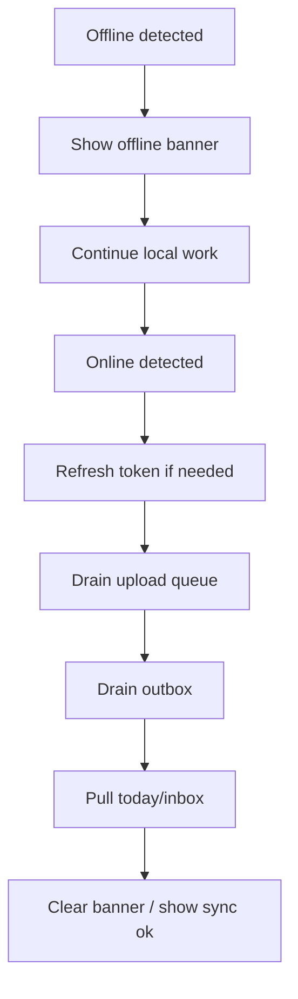

## 23.3 User Messaging

- Offline: “No connection. You can still complete tasks. We will send them when you are back online.”
- Syncing: “Sending your work…”
- Failed: “Could not send {n} items. Tap to retry.”

Avoid technical jargon (HTTP codes) in primary UI; keep codes in diagnostics.

---

# 24. Permission Management (OS + App RBAC)

## 24.1 OS Permissions

| Permission | Features | UX |
|------------|----------|----|
| Camera | Tasks, inspections | Rationale before prompt |
| Photo library | Fallback evidence | Optional |
| Notifications | FCM | Post-login value prop |
| Location | Optional inspection GPS | On-demand |
| (Future) Bluetooth | Sensors — out of scope v1 | — |

Track permission state in profile; re-prompt sparingly.

## 24.2 App RBAC

Mirror MODULE_DESIGN / API_CONTRACT permission catalogs:

- Roles: Admin, Officer, Inspector, Producer (coarse shell)
- Permissions: fine-grained button/route gates
- Resource checks: server 403 “not assigned” mapped to friendly text

Hydrate from `/auth/me` (`permissions[]`). Prefer me over solely decoding JWT for freshness (same as REACT_ARCHITECTURE guidance).

## 24.3 Declarative Gating

Pattern: `<RequirePermission permission="tasks.complete_own">` wrapping CTAs. Hide by default for literacy clarity; do not show endless disabled controls.

## 24.4 Reasoning

ADR-014: UI gates are UX; server is authoritative. Lost phone + stolen JWT still constrained by short TTL + revoke.

---

# 25. Error Handling Architecture

## 25.1 Problem Details

Central parser for `application/problem+json` (ADR-018 / API_CONTRACT):

- Map `errorCode` → i18n
- Surface `errors[].field` on forms
- Attach `correlationId` / `traceId` to diagnostics

## 25.2 Error Boundaries

- Root boundary: recoverable restart + sync-safe message
- Feature boundaries: replace screen body, keep tabs

## 25.3 Classification

| Class | UX |
|-------|-----|
| Network | Banner + retry |
| Auth | Login |
| Validation | Inline |
| Business rule | Dialog plain language |
| Conflict | Sync center |
| Unknown | Apologize + correlation id for support |

## 25.4 Logging

Serilog/Seq are server-side. Mobile: structured logs to municipal-approved crash system; scrub tokens/PII.

---

# 26. Accessibility Architecture

## 26.1 Product Constraint

PRODUCT_VISION: simple enough for limited digital literacy. Accessibility is not optional polish—it is core UX.

## 26.2 Requirements

| Area | Rule |
|------|------|
| Tap targets | ≥ 44×44 pt |
| Font | Dynamic type / scalable; avoid tiny legal text as only instructions |
| Contrast | WCAG AA-ish municipal standard |
| Screen readers | Label all icons; announce sync status changes |
| Motion | Respect reduce-motion; use purposeful motion sparingly |
| Language | Short sentences; one primary action |
| Color | Do not encode overdue only by color |

## 26.3 Literacy Patterns

- Prefer “Take photo” over “Attach evidence asset”
- Confirm screens with large success check after complete
- Avoid multi-select bulk tools on producer shell

---

# 27. Security Architecture (Mobile-Specific)

## 27.1 Secrets

- No API keys for MinIO/FCM server keys in binary
- FCM sender configuration per platform guidelines only
- Runtime config for API base URL (environment builds)

## 27.2 Transport

HTTPS only; certificate pinning optional under municipal ADR (careful with MITM enterprise proxies).

## 27.3 Privacy

- Clear projections on logout when policy requires
- Photo sandbox not shared to public gallery by default
- Analytics opt-in if used

## 27.4 Threat Alignment

PHYSICAL_ARCHITECTURE Scenario D (lost phone) drives revoke + token delete + short JWT TTL reliance.

---

# 28. Future Capabilities (Seams Only)

## 28.1 Future Barcode Scanner

**Intent:** Scan municipal asset tags / input bags / warehouse labels.

**Architecture seam:**

- `native/scanner/BarcodeScannerPort`
- Feature flag `ff.barcodeScanner`
- Camera module shares session with evidence mode OR dedicated scan screen
- Map scan results to future API resources via ADR—**do not invent endpoints in app**

**Reasoning:** Avoid baking a scanner vendor into task evidence code paths.

## 28.2 Future QR Scanner

**Intent:** QR deep links to tasks/lands/support programs; possibly officer-generated onboarding codes (still not public registration).

**Architecture seam:**

- Same scanner port with `codeType: qr`
- QR payloads must be signed/allowlisted URLs under municipal host
- Reject arbitrary URLs (open redirect / phishing)

## 28.3 Future GIS Integration

**Intent:** Map parcels, navigate to land, show inspection pins.

**Architecture seam:**

- `features/maps` lazy-loaded
- Consume Lands coordinates from API when exposed
- Prefer platform map SDK behind port (`MapPort`) for Google/Apple swap
- Offline map tiles are a separate ADR (storage + licensing)

**Non-goals v1:** full GIS editing, topology validation (server/Lands module).

---

# 29. Testing Strategy

| Layer | Focus |
|-------|-------|
| Unit | Outbox ordering, idempotency key stability, Problem Details mapping |
| Component | Today list empty/offline/pending states |
| Integration | Sync worker against mock API |
| E2E | Login → offline complete → online sync → inbox deep link |
| Device farm | Camera permissions, FCM on real devices |
| Security | Secure storage, logout wipe, proxy inspection |

Detox/Maestro scripts must include **airplane mode** scenarios—the product differentiator vs SPA.

---

# 30. Observability & Operations

## 30.1 Client Telemetry (Policy-Gated)

- Sync success/failure counts
- Upload bytes / duration
- Crash-free sessions
- Permission denial rates

No plaintext tokens. Correlate with server using optional `X-Correlation-Id` mirroring admin SPA practice.

## 30.2 Release Ops

- Store release train separate from `frontend/` static deploy
- Force-update gate if API breaks older clients (Administration feature flags)
- PHYSICAL_ARCHITECTURE versioning headers awareness

## 30.3 Support Runbook Hooks

In-app “Send diagnostics” exporting sync_run + conflict_journal **with user consent**.

---

# 31. Alignment Matrices

## 31.1 API_CONTRACT → Mobile Features

| API area | Mobile feature | Notes |
|----------|----------------|-------|
| Auth §17 | `auth` | clientId mobile-*; deviceId |
| Tasks §… | `tasks` | today/start/complete/photos |
| Inspections | `inspections` | evidence/complete |
| Notifications §27 | `notifications` | me + device-tokens |
| Support §… | `support` | programs + applications |
| Uploads §10 | upload queue | multipart default |
| SignalR §11 | realtime optional | foreground |
| Reporting / Admin | — | SPA |
| Identity admin users | — | SPA; no public register |

## 31.2 ADR Mapping

| ADR | Mobile implication |
|-----|--------------------|
| ADR-008 SignalR | Optional foreground |
| ADR-009 FCM | Mandatory push path |
| ADR-010 MinIO | Via API; no keys |
| ADR-013 JWT+refresh | Secure storage + rotation |
| ADR-014 RBAC | Gates + server authority |
| ADR-018 Problem Details | Central parser |

## 31.3 REACT_ARCHITECTURE Boundary Checklist

- Separate repo folder `mobile/` vs `frontend/`
- Shared contract, not shared Redux/Query cache
- Distinct UX principles documented here
- No coupling of producer offline sync into admin SPA (REACT_ARCHITECTURE anti-pattern #7)

---

# 32. Implementation Phases (Suggested)

| Phase | Deliverable |
|-------|-------------|
| 0 | `mobile/` bootstrap, auth secure storage, /auth/me shells |
| 1 | Today tasks online-only vertical |
| 2 | Camera + multipart upload |
| 3 | SQLite projections + outbox complete |
| 4 | Upload queue + airplane-mode E2E |
| 5 | FCM device tokens + deep links |
| 6 | Inspections shell |
| 7 | Support apply/status |
| 8 | Optional SignalR foreground |
| 9 | Accessibility hardening + battery pass |
| 10 | Scanner/GIS seams documented behind flags |

Documentation workstreams do **not** generate application source; implementers execute phases.

---

# 33. Anti-Corruption Rules Summary

1. Server domain language wins (ubiquitous language from MODULE_DESIGN).
2. Action resources win over status PATCH.
3. Idempotency keys are client-generated at intent time.
4. Projections are disposable; outbox is sacred until ack.
5. FCM for reachability; SignalR for liveliness; REST for truth.
6. SPA for municipal density; RN for field simplicity.

---

# 34. Detailed Subsystem: Sync Engine Interfaces

## 34.1 Interface Names (Implementation-Ready)

| Interface | Responsibility |
|-----------|----------------|
| `INetworkStatus` | online/degraded/offline stream |
| `ISecureSessionStore` | refresh/access/deviceId |
| `IApiClient` | fetch wrapper + auth + problem details |
| `IProjectionRepository` | upsert/read SQLite projections |
| `IOutboxRepository` | enqueue/ack/fail commands |
| `IUploadQueue` | enqueue/drain photo items |
| `ISyncEngine` | orchestrate pull/push |
| `IConflictJournal` | persist unresolved conflicts |
| `IPushTokenRegistry` | register/unregister device tokens |
| `IDeepLinkRouter` | parse and navigate |
| `ICameraCapture` | capture → file URI |
| `ILocationFix` | optional coordinates |
| `IPermissionService` | OS + app permission facades |

## 34.2 Outbox Command Types (v1)

`TaskStart`, `TaskComplete`, `TaskCommentAdd`, `InspectionStart`, `InspectionComplete`, `InspectionReject`, `NotificationMarkRead`, `NotificationMarkAllRead`, `SupportApplicationSubmit` (if enabled), `PhotoUploadMultipart`, `PhotoUploadConfirm`.

Payloads must align with API_CONTRACT DTOs; unknown types fail closed.

## 34.3 Worker Pseudopolicy (Not Source Code)

- Wake on: network regain, app foreground, FCM sync ping, manual retry
- Lock: single worker mutex
- Transactionality: mark `InFlight` before send; revert to `Pending` on crash
- Poison messages: after N attempts move to `Dead` + conflict journal

---

# 35. Detailed Subsystem: Producer Today Experience

## 35.1 Screen Composition Budget

First viewport after login (Producer):

- Brand/app name modest
- Greeting / date
- Sync chip
- List of today’s tasks (primary)
- No admin KPI strips, no multi-widget dashboard

**Reasoning:** PRODUCT_VISION simplicity; aligns with field literacy—not REACT_ARCHITECTURE dashboard density.

## 35.2 Empty States

- No tasks: “You have no tasks today.” + illustration optional
- Offline empty cache: “Connect once to download your tasks.”

## 35.3 Completion Success

Full-screen or clear banner success; then return to Today with item removed/updated. Celebrate lightly without gamification noise.

---

# 36. Detailed Subsystem: Inspector Field Experience

## 36.1 Workload List

Show due date, land/producer labels as API returns, blocking badge if provided.

## 36.2 Findings UX

Structured findings per API DTO—not freeform-only if contract requires structured items. Large inputs; voice-to-text OS features welcome where available.

## 36.3 Reject vs Complete

Separate flows with confirmation to prevent accidental reject (high impact on harvest gates).

---

# 37. Internationalization & Locale

- Default Turkish for municipal producers; English available for ops testing
- Dates in local timezone display; API stores UTC
- Measure units as API provides; do not hardcode contradictory units

---

# 38. Design System Notes (Mobile)

- Large primary buttons; generous spacing
- Avoid dense tables; use rows
- Cards only when they group an actionable unit (task row) — not decorative hero cards
- Motion: screen transitions + sync pulse + success check (2–3 intentional motions)
- Avoid purple-default / generic AI aesthetic; municipal brand tokens

---

# 39. Compliance with No Public Registration

Login screen links: “Need an account? Contact your municipality agriculture office.”

No social signup, no anonymous browse of tasks.

Password reset allowed for provisioned accounts only.

---

# 40. Cross-Client Consistency Rules

| Topic | Rule |
|-------|------|
| DTO field names | Match API_CONTRACT |
| errorCode | Shared i18n keys where possible between SPA and RN |
| Permission strings | Identical catalogs |
| Pagination | Tasks lists page/pageSize; notifications cursor/limit |
| Uploads | Same content-type allowlists |
| clientId | Distinct per client class |

---

# 41. Risk Register (Architecture)

| Risk | Mitigation |
|------|------------|
| Double complete under flaky net | Idempotency-Key + server success-equivalent |
| Disk full mid-evidence | Budget caps + user prompt |
| FCM delivery gaps | Inbox pull on foreground; do not rely solely on push |
| Secure storage bugs on OEM Android | Vendor test matrix; fallback re-login |
| Overbuilt GIS early | Seams only §28 |
| Treating RN like SPA | Boundary table §1.2 enforced in review |

---

# 42. Glossary (Mobile)

| Term | Meaning |
|------|---------|
| Projection | Local SQLite read model copied from API |
| Outbox | Durable queue of commands awaiting API ack |
| Upload item | Local photo file + metadata awaiting MinIO-backed API accept |
| Shell | Role-based root navigator |
| Drain | Worker process sending queued work |
| Hard logout | Clear session + tokens + stop push |

---

# 43. Mermaid: End-to-End Producer Offline Complete

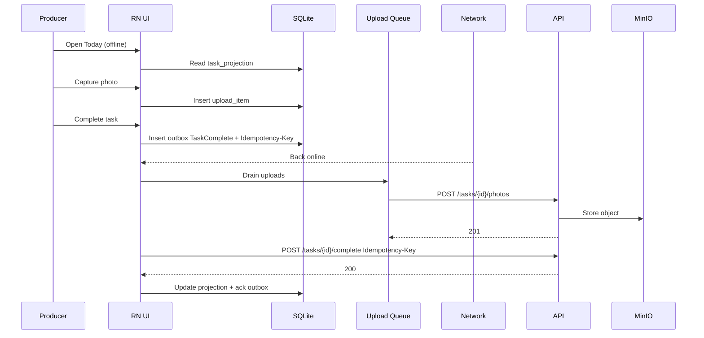

---

# 44. Mermaid: Lost Device Revocation

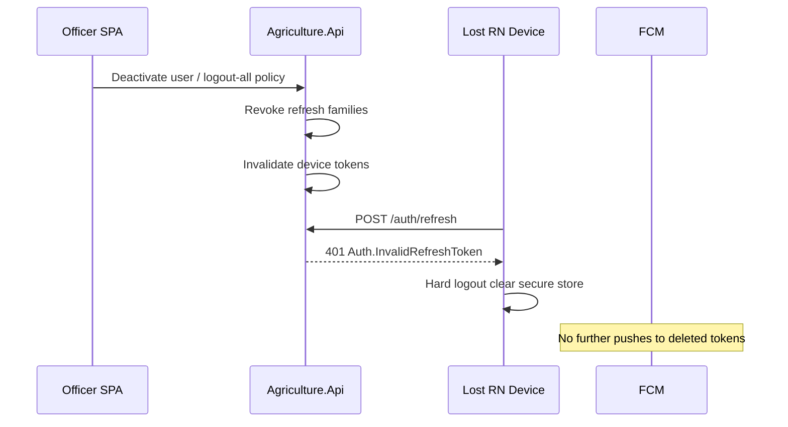

---

# 45. Quality Gates Before Store Submit

1. Airplane-mode complete + photo E2E green
2. Refresh reuse detection forces logout
3. Device token register/unregister verified on staging
4. No secrets in binary scan
5. Accessibility pass on Today + Complete
6. Battery idle drain within municipal threshold
7. Force-upgrade path tested
8. Deep link from FCM tap verified iOS+Android

---

# 46. Document Traceability Statement

This React Native Architecture Specification is subordinate to PRODUCT_VISION, SRS, MODULE_DESIGN, ADR (especially 008/009/010/013/014/018), PHYSICAL_ARCHITECTURE, BACKEND_ARCHITECTURE, API_CONTRACT, and complementary to REACT_ARCHITECTURE. In conflict, **server contracts and Accepted ADRs win**; this document must be patched.

Producers continue primarily on React Native; inspectors use mobile for field evidence; the SPA remains the municipality’s operational web client. Implementers build `mobile/` toward this model feature by feature, keeping `/api/v1`, JWT refresh, permission catalogs, FCM, MinIO-via-API, Problem Details, and offline idempotency as non-negotiable boundaries.

---

# 47. Appendix A — Recommended Dependency Categories (Non-Normative Versions)

| Category | Examples | Notes |
|----------|----------|-------|
| Navigation | `@react-navigation/native`, native-stack, bottom-tabs | Deep linking config required |
| Query | `@tanstack/react-query` | offlineFirst networkMode |
| SQLite | WatermelonDB / op-sqlite / expo-sqlite | Board picks one |
| Secure store | react-native-keychain / expo-secure-store | Mandatory |
| Push | RNFB messaging / expo-notifications | FCM |
| SignalR | `@microsoft/signalr` | Optional |
| Camera | vision-camera / expo-camera | Evidence |
| Location | geolocation-service / expo-location | Optional GPS |
| Forms | react-hook-form, zod | Validation UX |
| i18n | i18next | TR default |
| NetInfo | `@react-native-community/netinfo` | Recovery |

Exact versions pinned at implementation time.

---

# 48. Appendix B — Permission String Quick Reference (Mobile-Relevant)

From MODULE_DESIGN / API_CONTRACT catalogs (non-exhaustive):

- `tasks.read`, `tasks.complete_own`, `tasks.complete_any`, `tasks.cancel`, `tasks.delay`
- `inspections.read`, `inspections.complete`, `inspections.reject`, `inspections.assign`
- `notifications.read_own`
- `support.applications.read` (and apply path as contract defines for producers)
- Identity self: change-password via authenticated auth routes

Do not invent `mobile.tasks.write` style parallel catalogs.

---

# 49. Appendix C — Explicit Non-Goals Recap

- Weather / IoT (PRODUCT_VISION out of scope)
- Public registration
- Admin reporting on mobile
- Offline workflow redesign
- Shipping exploit tooling or MinIO credentials
- Replacing Hangfire/FCM server pipelines with client-side spam loops

---

# 50. Closing

The mobile client succeeds when a producer with limited digital literacy can finish today’s required photo task in a field with poor signal—and when the municipality still receives exactly one authoritative completion with durable evidence in MinIO and SQL. Every architectural choice in this specification exists to make that outcome routine, auditable, and operable alongside the React admin SPA under a single API contract.


---

# 51. Extended Decision Records (Mobile Board Pre-ADRs)

The following decisions are **normative within this document** until promoted or superseded by formal ADRs. They exist so implementers are not blocked waiting for ADR numbering while remaining consistent with Accepted platform ADRs.

## 51.1 Dual-Plane State Is Mandatory for Field Writes

**Decision.** Any user intent that mutates server state while offline-capable (task start/complete, photo upload, inspection complete, notification read) MUST be recorded in the durable outbox/upload queue before the UI reports acceptance.

**Alternatives considered.** (A) TanStack Query mutations only; (B) Redux Offline; (C) “save draft in AsyncStorage JSON.”

**Reasoning.** (A) loses durability across process death. (B) obscures domain verbs that must match API_CONTRACT action resources. (C) lacks queryability, ordering, and poison-message handling. SQLite outbox tables provide inspectable municipal support diagnostics and deterministic drain order.

## 51.2 Multipart Evidence Default; Presigned as Escape Hatch

**Decision.** Default mobile evidence uploads use multipart API routes. Switch to presigned session/confirm when compressed size exceeds a Board-configured threshold (e.g., 8 MB) or when API returns guidance.

**Reasoning.** API_CONTRACT §10 states multipart is the v1 normative default for simpler mobile authZ. Presigned helps weak-proxy environments and large files but splits failure domains (PUT to MinIO vs confirm). The upload worker abstracts both behind `IUploadQueue`.

## 51.3 Producer Shell Forbids Admin Navigation Patterns

**Decision.** No global left drawer of ten modules; no multi-column filters; no bulk selection toolbars on Producer shell.

**Reasoning.** PRODUCT_VISION simplicity and limited digital literacy. REACT_ARCHITECTURE correctly optimizes for officer density; copying it would violate the client boundary table.

## 51.4 Background Sync Is Best-Effort, Foreground Sync Is Guaranteed UX

**Decision.** The product promises that returning to the app online will drain queues; it does not promise iOS/Android background delivery SLAs equal to Hangfire.

**Reasoning.** OS background limits are outside municipal control. FCM wakes + foreground drain meet field reality. Documenting this prevents false SLOs in procurement.

## 51.5 One Codebase, Two Shells, Not Two Apps (v1)

**Decision.** Ship one binary with role-based shells unless store/MDM constraints force split later.

**Reasoning.** Shared offline engine, camera, and auth amortize cost. Split apps remain a future ADR if inspector MDM policies diverge severely.

---

# 52. HTTP Client Architecture (Mobile)

## 52.1 Responsibilities

The shared `IApiClient` MUST:

1. Attach `Authorization: Bearer {accessToken}` for authenticated routes.
2. Attach `X-Correlation-Id` (generate UUID per logical user action; reuse across retries of same action).
3. Attach `Idempotency-Key` when the caller supplies one (outbox always does for mutating offline commands).
4. Parse `application/problem+json` into a typed `ProblemDetails` model.
5. Translate network failures into a closed error taxonomy (`NetworkUnavailable`, `Timeout`, `TlsFailure`, `Unknown`).
6. Participate in single-flight 401 refresh.
7. Never log bodies containing passwords, tokens, or raw image bytes.

## 52.2 Base URL Configuration

| Environment | Source |
|-------------|--------|
| Dev | Local/dev API from build config |
| Staging | Staging host |
| Production | Municipal host |

Align with PHYSICAL_ARCHITECTURE reverse proxy paths: API under `/api/v1`, hubs under `/hubs`. Do not hardcode MinIO endpoints for business uploads.

## 52.3 Timeout Policy

| Call type | Suggested timeout | Reasoning |
|-----------|-------------------|-----------|
| Auth login/refresh | 15–20s | Users wait; avoid infinite spinner |
| JSON GET lists | 20–30s | Cellular variability |
| Multipart upload | 120s+ scalable with size | Large photos on 3G |
| Presigned PUT | Independent client timeout | Separate host |

## 52.4 Pagination Alignment

- Tasks pending/completed/delayed: `page` + `pageSize` as API_CONTRACT.
- Notifications inbox: **cursor** + `limit` — mobile MUST NOT invent offset pagination for inbox.
- Today endpoint: treat as primary producer feed; cache entire payload projection.

---

# 53. Local Data Lifecycle & Privacy

## 53.1 On Login

1. Ensure migrations applied.
2. Pull today/inspections/inbox windows.
3. Register FCM token.
4. Record `lastPullAt`.

## 53.2 On Logout

1. `POST /auth/logout` with refresh token (best effort).
2. `DELETE` device token when tokenId known.
3. Clear secure session.
4. Delete or encrypt-wipe projections, outbox, upload files per municipal privacy policy.
5. Disconnect SignalR.
6. Clear TanStack Query cache.

**Reasoning.** Shared device scenarios (family phone) are plausible for producers; leftover tasks from prior user are unacceptable.

## 53.3 On User Switch (Same Device)

Treat as logout + login. Do not attempt multi-account projection partitioning in v1 unless Board explicitly funds it.

## 53.4 Photo File Lifecycle States

`Captured → Queued → Uploading → Uploaded → (ParentCommandAcked) → DeletedLocally`

If parent command fails permanently, retain files until user discards or support resolves—never auto-delete evidence of failed municipal work without disclosure.

---

# 54. Performance Architecture

## 54.1 List Virtualization

Today and inspection lists MUST use virtualized lists. Task rows should avoid decoding full-resolution images; thumbnails only.

## 54.2 App Start Budget

| Milestone | Target guidance |
|-----------|-----------------|
| First paint shell | Fast; show cached Today even if stale |
| Session restore | Secure store read + memory hydrate |
| Initial pull | Asynchronous; do not block first paint |

## 54.3 Image Decode

Decode off UI thread where libraries allow; cap concurrent decodes.

## 54.4 Sync Backpressure

If outbox depth exceeds threshold, show “Sending many items…” and keep UI interactive. Do not spawn unbounded parallel HTTP.

**Reasoning.** PHYSICAL_ARCHITECTURE notes backend must absorb reconnect/sync bursts; clients must also self-limit to be good citizens during planting-week peaks (Scenario A).

---

# 55. Accessibility Extended Requirements

## 55.1 Focus Order

Complete flow order: instructions → evidence list → add photo → comment (optional) → primary complete button. Do not place destructive actions adjacent to primary without confirmation.

## 55.2 Screen Reader Announcements

Announce: offline/online transitions; “photo added”; “task sent”; “could not send, pending retry.”

## 55.3 Cognitive Load

One sentence helper under primary CTA maximum. Prefer progressive disclosure for rare actions (delay is not a producer primary).

## 55.4 Low Vision

Support OS bold text and larger sizes; re-test Today list at largest accessibility sizes for truncation vs wrap policy (prefer wrap for titles).

---

# 56. Inspector GPS Evidence Policy (Detail)

## 56.1 Capture Moments

| Moment | Policy |
|--------|--------|
| Inspection start | Optional fix; store locally |
| Each evidence photo | Optional attach EXIF GPS if permitted by privacy policy; prefer explicit app-level coordinate field over silent EXIF if municipal counsel prefers |
| Inspection complete | Include last known fix if API DTO supports |

## 56.2 Accuracy & Integrity

- Record `accuracyMeters` when OS provides it
- Record `capturedAt` device time + server ack time separately
- Do not pretend GPS proves presence legally without counsel policy; treat as operational aid

## 56.3 Denial Path

If location denied, inspection still completable (SRS optional). Show “Location not recorded.”

---

# 57. Notification Inbox Architecture (Detail)

## 57.1 Read Model

Inbox UI binds to `notification_projection` first, then reconciles with `GET /notifications/me`.

## 57.2 Read State

Optimistic mark-read locally; outbox sync to `POST /notifications/{id}/read`. If server 404, drop local row.

## 57.3 Unread Badge

Tab badge from local unread count; correct on pull. Do not use FCM badge numbers as sole source of truth.

## 57.4 Admin Templates

Not rendered on mobile. If a producer somehow receives a deep link to template admin, deny.

---

# 58. Support Feature Architecture (Detail)

## 58.1 Producer Journey

1. Browse published programs (`GET /support/programs`)
2. Open program detail (eligibility text as API returns)
3. Submit application (`POST /support/applications`) with Idempotency-Key
4. Track status until officer approve/reject/fulfill on server
5. Receive FCM on status change; deep link to application detail

## 58.2 What Not to Build on Mobile

- Program publish/close
- Approve/reject/fulfillment entry
- Cross-producer application queues

Those remain SPA-aligned with `support.programs.manage`, `support.approve`, `support.fulfill`.

## 58.3 Reasoning

Support is high-empathy UX for producers; stuffing officer fulfillment into the same shell recreates literacy and authZ mistakes.

---

# 59. Relationship to EVENT_STORMING Commands

Mobile outbox verb names SHOULD trace to EVENT_STORMING language where possible:

| Storming-style command | Mobile outbox type | HTTP |
|------------------------|--------------------|------|
| CompleteTask | `TaskComplete` | `POST /tasks/{id}/complete` |
| StartTask | `TaskStart` | `POST /tasks/{id}/start` |
| UploadTaskPhoto | `PhotoUploadMultipart` / confirm | photos routes |
| CompleteInspection | `InspectionComplete` | `POST /inspections/{id}/complete` |
| RejectInspection | `InspectionReject` | reject route |
| MarkNotificationRead | `NotificationMarkRead` | read route |

**Reasoning.** Keeping client verbs aligned with storming/command language reduces translation bugs between mobile and backend handler names.

---

# 60. Modular Monolith Client Anti-Corruption Layer

## 60.1 DTO Mapping

Feature `*.types.ts` may define view models distinct from wire DTOs (e.g., combining due labels). Mapping belongs at API adapter boundary.

## 60.2 Forbidden Knowledge

Mobile MUST NOT:

- Infer next workflow step locally as authority
- Reimplement harvest eligibility math
- Assume soft-deleted entities remain completable

Server Problem Details communicate rule failures.

## 60.3 Allowed Client Validations

- Required photo before enabling Complete button when `requiresPhoto` true on projection
- Max comment length mirroring API
- Image type/size before enqueue

These improve literacy UX; they are not security.

---

# 61. Disaster & Edge Scenarios (Client Playbooks)

## 61.1 App Killed Mid-Upload

On next launch, upload_item in `Uploading` reverts to `Pending` and retries with same Idempotency-Key.

## 61.2 Clock Skew

If JWT appears expired immediately, attempt refresh once; if systemic, show “Check device date/time.”

## 61.3 Captive Portal

Reachability true but API TLS fails: classify degraded; do not mark uploads succeeded.

## 61.4 Storage Permission Revoked Mid-Queue

Fail queue with actionable settings link; retain metadata.

## 61.5 Server Maintenance 503

Backoff; banner; continue local capture.

## 61.6 Token Family Revoked Remotely

Hard logout; preserve locally captured unsynced evidence in a **quarantine** requiring re-login as same user to resume—Board privacy review must confirm quarantine vs wipe. Default recommendation: quarantine encrypted until same `userId` logs in; wipe if different user logs in.

---

# 62. Store Listing & Platform Compliance Architecture

## 62.1 Permission Strings

Camera/location/notification purpose strings must match actual use (evidence, optional inspection location, task alerts).

## 62.2 Background Modes

Declare only modes actually used; unjustified background location will fail review and violate §16.

## 62.3 Data Safety Forms

Account for photos, approximate location (if used), tokens—coordinate with municipal privacy officer.

## 62.4 Third-Party SDK Minimization

Prefer fewer SDKs: FCM, maps (future), crash reporting. Each SDK is a privacy review.

---

# 63. Comparison Table: Admin SPA vs Mobile (Extended)

| Dimension | Admin SPA | Mobile RN |
|-----------|-----------|-----------|
| Primary NFR | Throughput of officer ops | Reliability under intermittent network |
| State default | TanStack Query online | SQLite + Query + outbox |
| Push | SignalR (+ optional browser later) | FCM mandatory |
| Evidence | View/download | Capture/upload |
| IA | Many routes / modules | Few tabs |
| clientId | `web-admin` | `mobile-producer` / `mobile-inspector` |
| Registration | Officers create users | Login only |
| Deploy | Static CDN/proxy | App stores + optional OTA policy |
| Offline | Soft degrade | First-class |
| GPS | Rare | Optional inspection |
| Camera | Rare | Central |
| Literacy bar | Trained staff | Limited digital literacy |

---

# 64. Sync Semantics: Exactly-Once Effect, At-Least-Once Delivery

Mobile MUST assume **at-least-once** delivery of outbox commands to the API. Exactly-once **business effect** is achieved by server idempotency keys and domain guards—not by client attempting perfect single send.

**Reasoning.** This matches BACKEND_ARCHITECTURE / API_CONTRACT idempotency posture and prevents teams from building fragile “only send once” client logic that breaks on retries.

---

# 65. Versioning & Force Update

## 65.1 Client Headers

Send app version and platform headers (as PHYSICAL_ARCHITECTURE / API evolve). Example conceptual headers: `X-App-Version`, `X-App-Platform`.

## 65.2 Force Update Gate

On launch, optional `GET` configuration/feature flag endpoint (Administration) may return `minMobileVersion`. If below, block app with store link.

**Reasoning.** Breaking API changes should be rare under `/api/v1`, but native clients lag stores; force update is the safety valve.

---

# 66. Team Ownership Model

| Steward | Owns |
|---------|------|
| Mobile App Owner | Navigation shells, release train |
| Offline Sync Steward | SQLite schema, outbox, upload queue |
| Push Steward | FCM, device tokens, deep links |
| Tasks Feature Owner | Today/complete UX + adapters |
| Inspections Feature Owner | Field inspection UX + adapters |
| Shared UI Steward | Design tokens, accessibility primitives |

PRs crossing steward boundaries require dual review.

---

# 67. Acceptance Criteria Traceability (Architecture → Product)

| Product success criterion (Vision) | Architecture support |
|------------------------------------|----------------------|
| Producers complete every assigned task from mobile | Offline-first tasks + camera + upload + complete |
| Inspections fully digital | Inspector shell + evidence + complete APIs |
| Production history never lost | Server SoR + idempotent sync + MinIO evidence |
| Real-time admin monitoring | Mobile completions emit server events → SPA SignalR |
| Simplicity for limited literacy | Shell IA, language, a11y, one CTA |

---

# 68. Final Normative Checklist for Implementers

Before marking a mobile epic “done,” verify:

1. No public registration UI.
2. `clientId` is mobile-specific.
3. Refresh tokens only in secure storage.
4. Outbox + Idempotency-Key on complete/upload.
5. FCM token register/unregister paired with login/logout.
6. SignalR not relied on for background.
7. MinIO credentials absent.
8. Problem Details centrally mapped.
9. Permission strings from catalog only.
10. Producer UX passes literacy review (product + UX) against [`MOBILE_UX_DESIGN.md`](./MOBILE_UX_DESIGN.md).
11. Airplane-mode E2E green.
12. Docs cross-links in `docs/README.md` present.
13. No contradiction with REACT_ARCHITECTURE boundary table.
14. Future scanner/GIS only behind ports/flags.
15. UI locale `tr-TR` from day one; chat is conversation list + thread + send text (SDS-R13).

---

# 69. Closing Addendum

This specification is intentionally long because field-offline systems fail in the seams: permission prompts, queue ordering, token rotation, push deep links, and conflict language. Municipal agriculture digitization succeeds only when those seams are designed once, shared across producer and inspector shells, and kept subordinate to the modular monolith’s API contract. The React admin SPA and the React Native client are complementary halves of one platform—not competing apps—and this document is the mobile half’s architectural constitution. **Producer screen copy and flows are owned by [`MOBILE_UX_DESIGN.md`](./MOBILE_UX_DESIGN.md)** (SDS-R13 mobile-first).
