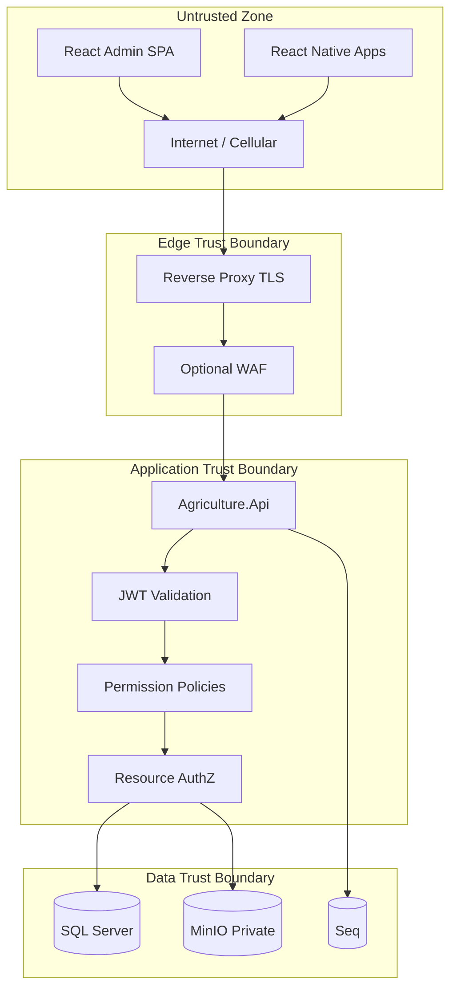
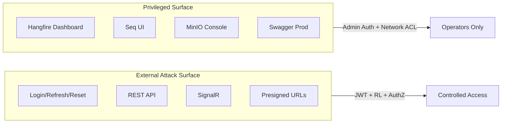
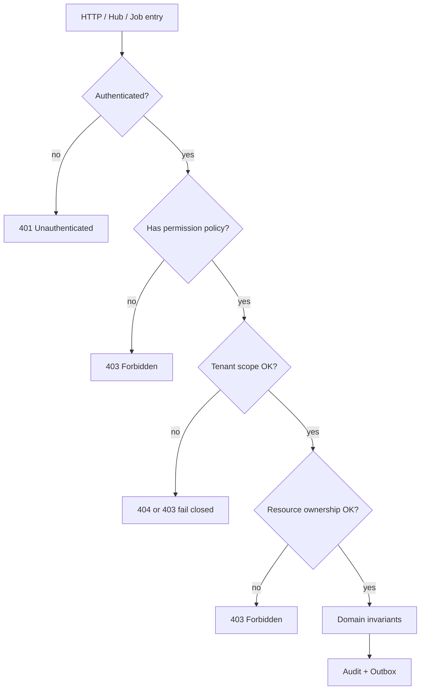
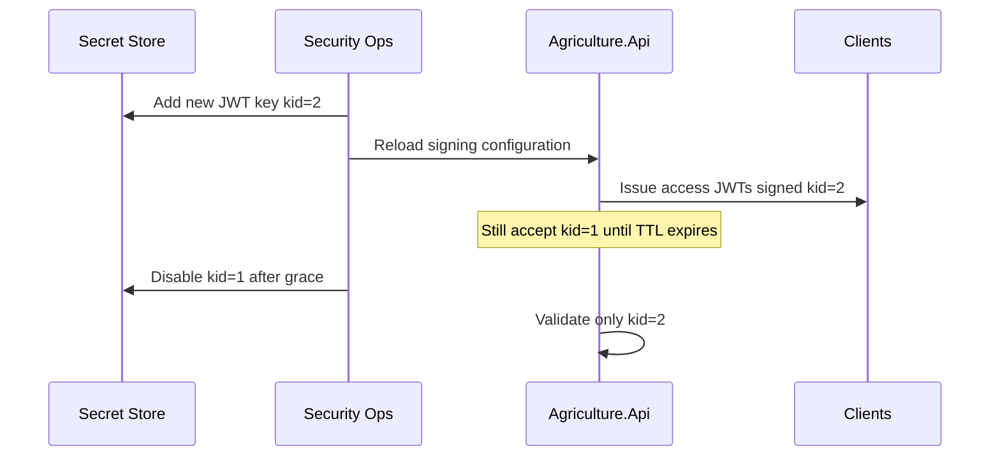
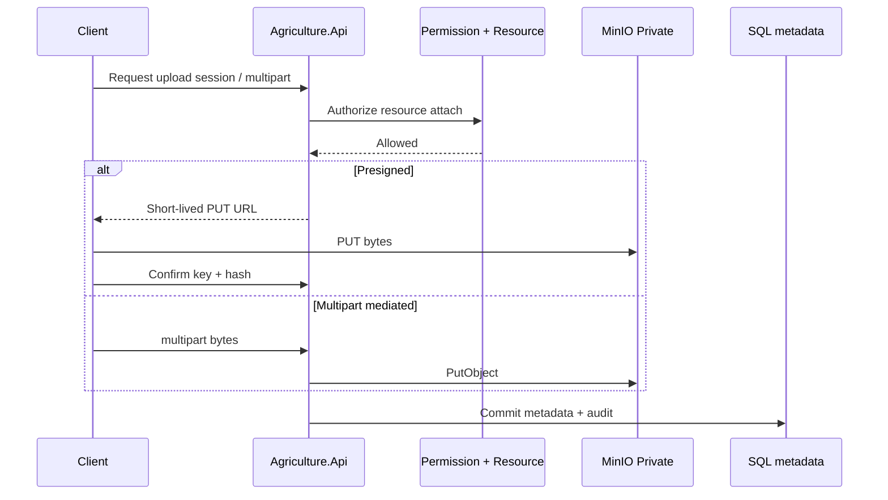
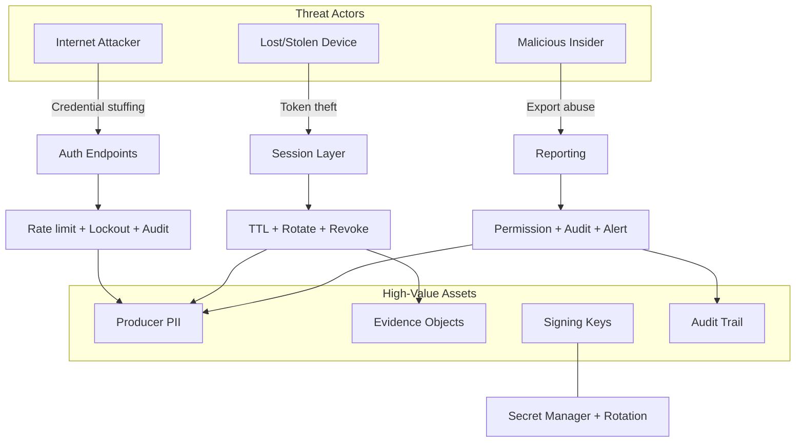
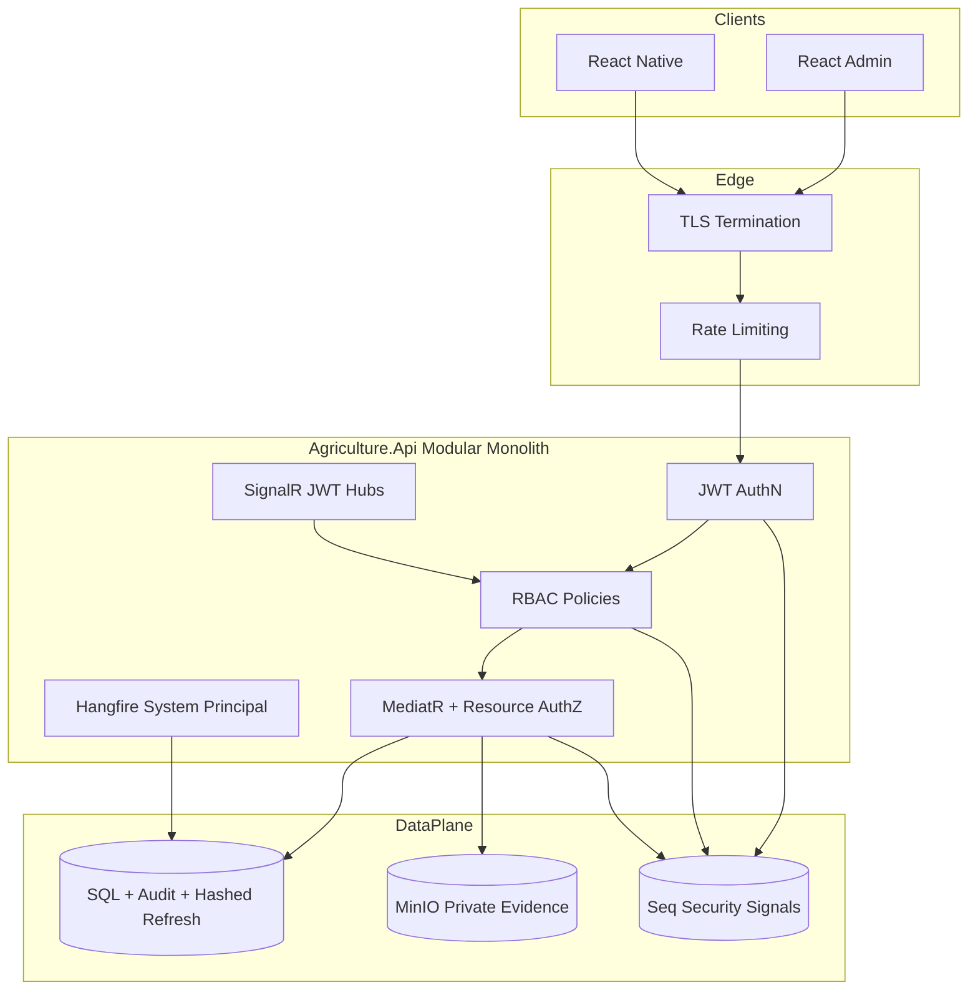
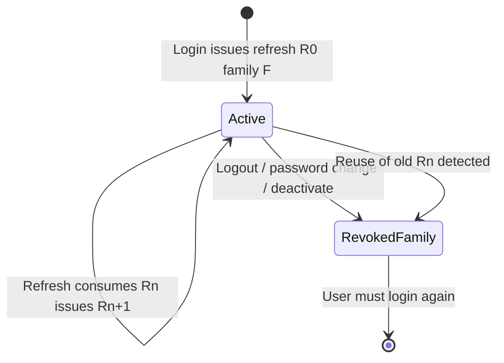
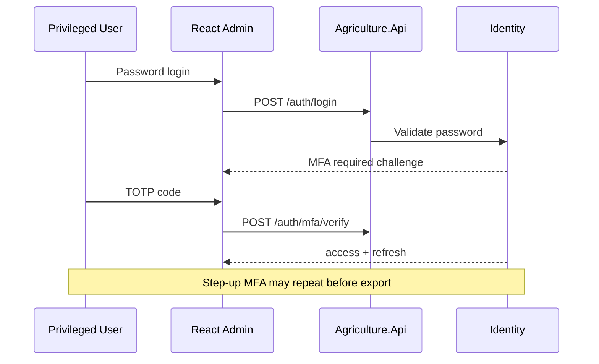

# Security Architecture Specification

# Agriculture Management System

| Field | Value |
|---|---|
| **Document Title** | Security Architecture Specification (SAS) |
| **System** | Agriculture Management System (AMS) |
| **Version** | 1.0 |
| **Status** | Approved for Implementation Planning |
| **Date** | 2026-07-18 |
| **Classification** | Internal — Municipal Confidential |
| **Primary Audience** | Security architects, Architecture Board, Identity module owners, DevOps/SRE, municipal IT security officers, compliance (KVKK) officers, QA security leads |
| **Secondary Audience** | Backend/frontend/mobile engineers implementing controls; product owners validating privacy commitments |
| **Related Stack** | ASP.NET Core, EF Core, SQL Server, React, React Native, Modular Monolith, CQRS, MediatR, Hangfire, SignalR, JWT, ASP.NET Identity, MinIO, Serilog, Seq, FCM |
| **Authoritative Scope** | Enterprise security architecture: Zero Trust posture, authentication/authorization, cryptography, secrets, privacy (KVKK primary / GDPR secondary), threat modeling, monitoring, and incident response for AMS |
| **Normative Alignment** | Must not contradict ADR (esp. ADR-013/014/010/011/012/016/020), API_CONTRACT, BACKEND_ARCHITECTURE §17, PHYSICAL_ARCHITECTURE §§6/9–12, DATABASE_DESIGN §1.10, MODULE_DESIGN §8, PRODUCT_VISION, SRS |

---

## Document Control

### Change Control

Structural changes to token models, permission catalogs, trust boundaries, encryption mandates, or KVKK processing bases require:

1. Impact assessment against Identity, Producers, Inspections, MinIO evidence, and audit retention.
2. Architecture Board review (lead architect, Identity owner, security officer, DevOps).
3. Updates to ADR when a decision supersedes ADR-013/014 or related ADRs.
4. Synchronized updates to API_CONTRACT auth sections and MODULE_DESIGN §8 when permission strings change.

### Non-Goals

- This document does **not** generate application source code, exploits, or penetration-test payloads.
- This document does **not** redefine domain aggregates, workflow sequencing, or physical host topology already owned by AGGREGATE_DESIGN, MODULE_DESIGN, and PHYSICAL_ARCHITECTURE.
- This document does **not** replace legal opinions; KVKK/GDPR sections are architectural controls that must be validated by municipal counsel.
- React Native detailed client architecture, if authored separately, remains subordinate to token storage and transport rules herein.

### Implementation Without Modification Principle

Implementers must not:

- introduce public self-registration,
- replace JWT+refresh with session-only auth without a superseding ADR,
- expose permanent MinIO credentials or public buckets,
- treat UI permission gates as authoritative authorization,
- log passwords, refresh tokens, national identity numbers in clear text,
- or disable rate limiting on login/refresh in Production.

---

# 1. Executive Summary

## 1.1 Purpose

The Agriculture Management System is a **municipality-scale, workflow-driven agricultural production platform** operated for Turkish municipal agricultural support and oversight. It processes personal data of producers, inspectors, and municipal staff; stores field evidence (photos/documents); and maintains auditable production histories that municipal leadership relies on for transparency and program integrity.

This Security Architecture Specification defines the **authoritative security design** that implementers, operators, and auditors must follow. It translates approved product and architecture decisions into a coherent control system spanning web (React admin), mobile (React Native for producers and inspectors), the ASP.NET Core modular monolith API, Hangfire background work, SignalR realtime hubs, FCM push, MinIO object storage, SQL Server persistence, and Serilog→Seq observability.

## 1.2 Security Mission

Protect municipal agricultural operations so that:

1. Only municipality-provisioned identities can authenticate.
2. Every action is authorized by **roles + permissions + resource ownership** (ADR-014).
3. Personal data is processed under **KVKK** as the primary legal regime, with GDPR considerations when EU data subjects appear.
4. Evidence integrity and audit trails remain trustworthy for municipal oversight.
5. Compromise of a single client device, token, or credential has **bounded blast radius** through short-lived access tokens, refresh revocation, tenant isolation, and private object storage.

## 1.3 Binding Architectural Anchors

| Anchor | Security implication |
|---|---|
| Modular Monolith (ADR-001) | One JWT validation path, one permission catalog, one audit correlation chain |
| Clean Architecture (ADR-002) | Security ports in Application; secrets/adapters in Infrastructure; Domain free of crypto SDKs |
| JWT + refresh (ADR-013) | Stateless access validation; revocable long-lived sessions |
| RBAC + permissions + resource checks (ADR-014) | Least privilege without premature ABAC engine |
| MinIO private buckets (ADR-010) | No public evidence; mediated or short-lived presigned access |
| Soft delete + audit (ADR-016) | Municipal accountability and privacy purge paths |
| Serilog + Seq (ADR-011/012) | Security monitoring and investigation |
| HTTPS everywhere (PHYSICAL_ARCHITECTURE / SRS) | Encryption in transit as non-negotiable |

## 1.4 Roles in Scope

Normative coarse roles (API_CONTRACT §6.1 / MODULE_DESIGN §8.2):

| Role | Primary client | Security posture summary |
|---|---|---|
| **Administrator** | React SPA | Highest privilege; identity, settings, audit, feature flags; MFA-ready (future) |
| **Agriculture Officer** | React SPA | Operational CRUD across producers/lands/seasons/workflows/tasks/support; tenant-scoped |
| **Inspector** | React Native (primary); SPA optional | Field evidence; assigned inspections; limited admin surfaces |
| **Producer** | React Native | Own tasks, lands, harvest inputs, notifications; strict resource isolation |

**User provisioning rule (normative):** There is **no public registration**. Municipal administrators (or approved officers with `identity.users.create`) create users. Producer mobile accounts are linked through Identity after Producer registration policies (MODULE_DESIGN §6.1–6.2).

## 1.5 Document Map

| Section | Topic |
|---|---|
| 2 | Security principles & Zero Trust |
| 3 | Trust boundaries & attack surface |
| 4 | Authentication (JWT, refresh, claims, passwords) |
| 5 | Authorization (RBAC, policies, permission matrix, ABAC future) |
| 6 | Cryptography, hashing, key rotation, secrets |
| 7 | Secure APIs, web, mobile, Hangfire, SignalR, FCM |
| 8 | Secure file access (MinIO) & storage |
| 9 | OWASP Top 10 & classic web/API threats |
| 10 | Rate limiting & brute force |
| 11 | Audit logging & security monitoring |
| 12 | Data privacy, KVKK, GDPR |
| 13 | Threat modeling |
| 14 | Incident response |
| 15 | Future MFA & roadmap |
| 16 | Compliance control summary & acceptance criteria |

---

# 2. Security Principles and Zero Trust

## 2.1 Defense in Depth

AMS does not rely on a single perimeter. Controls are layered:

1. **Network edge** — reverse proxy TLS termination, optional WAF, CORS lockdown, security headers (PHYSICAL_ARCHITECTURE).
2. **Identity** — municipality-created users, password hashing (ASP.NET Identity), lockouts, login audit.
3. **Session** — short-lived JWT access + hashed rotatable refresh.
4. **Authorization** — permission policies + resource ownership + tenant filters.
5. **Application** — FluentValidation, MediatR AuthorizationBehavior, domain invariants.
6. **Data** — schema-per-module ownership, soft delete, audit columns, private MinIO.
7. **Operations** — Serilog/Seq, Hangfire dashboard lock, secret injection, backup encryption.

**Reasoning:** Municipal systems face internet scanners, lost field devices, insider misuse, and supply-chain misconfiguration. A single firewall or “trusted LAN” assumption fails when officers work remotely and producers use personal phones over cellular networks.

## 2.2 Zero Trust Posture for AMS

### 2.2.1 Definition Adopted

For AMS, Zero Trust means:

- **Never trust the network location alone.** Being on the municipal VPN or office Wi-Fi does not grant API access without valid credentials and tokens.
- **Authenticate every request.** REST, SignalR, and (where applicable) Hangfire dashboard access require verified identity.
- **Authorize every action.** Coarse role is insufficient; permission and resource checks are mandatory (ADR-014).
- **Assume breach.** Short token TTL, refresh family revocation, least privilege, and audit enable containment.
- **Verify continuously.** Token expiry, permission version claims, and deactivation mid-session invalidate capability without process restart (PHYSICAL_ARCHITECTURE Scenario D; BACKEND_ARCHITECTURE §17.12).

### 2.2.2 What Zero Trust Does *Not* Mean for AMS

- It does **not** require a service mesh on day one (ADR-001 rejects premature microservices ops).
- It does **not** require mTLS for end-user phones (ADR-013 rejected mTLS for users).
- It does **not** require an external IdP before go-live (local Identity is accepted; federation is future).
- It does **not** replace resource-based checks with network segmentation alone.

### 2.2.3 Zero Trust Control Mapping

| Zero Trust tenet | AMS control |
|---|---|
| Explicit verification | JWT signature, `iss`/`aud`/`exp`, active user check on refresh |
| Least privilege | Permission catalog; deny by default; producer scoped to own resources |
| Assume breach | Refresh rotation + reuse detection; private MinIO; PII redaction in logs |
| Device awareness (progressive) | `clientId` on login/refresh; future device-bound refresh; lost-phone revoke runbook |
| Continuous evaluation | Short access TTL; role-change revokes refresh families |

### 2.2.4 Reasoning for Progressive Zero Trust

Full enterprise Zero Trust (continuous device posture, microsegmentation, per-workload identity) exceeds near-term municipal ops capacity. AMS adopts a **progressive Zero Trust** that is implementation-ready: strong identity, short sessions, explicit authZ, private data plane, and monitoring—without blocking delivery of agricultural workflows.



**Reasoning for diagram:** Explicit trust boundaries prevent the common municipal mistake of treating “internal Docker network” as equivalent to authorization.

---

# 3. Trust Boundaries and Attack Surface Analysis

## 3.1 Trust Boundaries

| Boundary | Inside | Outside | Crossing controls |
|---|---|---|---|
| TB-1 Client ↔ Edge | Reverse proxy | Browsers, mobile OS, public network | TLS 1.2+, HSTS, cert management |
| TB-2 Edge ↔ API | Kestrel / API process | Proxy | Forwarded headers, rate-limit client IP correctness |
| TB-3 API ↔ SQL | SQL Server | API | Private network, least-privilege DB principal, TDE when mandated |
| TB-4 API ↔ MinIO | Object store | API / optional presigned clients | Private buckets, short-lived URLs, no public ACLs |
| TB-5 API ↔ Seq | Log store | API | Auth to Seq UI; redact PII before ship |
| TB-6 API ↔ FCM | Google push | API via Hangfire | Service account secrets; no secrets in push payload |
| TB-7 Admin tools | Hangfire dashboard, Swagger, MinIO console | Operators | Network allowlists + strong auth |
| TB-8 Module schemas | Each module’s data | Other modules | No cross-schema FKs; Contracts-only; tenant filters |

## 3.2 Attack Surface Inventory

### 3.2.1 External Attack Surface

| Surface | Exposure | Primary risks | Residual risk after controls |
|---|---|---|---|
| `POST /api/v1/auth/login` | Public HTTPS | Credential stuffing, brute force | Rate limits, lockout, audit, no user enumeration leakage beyond policy |
| `POST /api/v1/auth/refresh` | Public HTTPS | Stolen refresh replay | Hash storage, rotation, reuse→family revoke |
| Password reset endpoints | Public HTTPS | Token guessing, email flooding | One-time tokens, rate limits, short TTL |
| Authenticated REST `/api/v1/**` | Authenticated | IDOR, injection, abuse | JWT + policies + resource checks + validation |
| SignalR `/hubs/**` | Authenticated | Group joining abuse, token in query string | JWT validation; authorize group join; short TTL |
| Presigned MinIO URLs | Time-limited public URL | URL leakage, SSRF to MinIO if misissued | Short expiry; scoped object key; authZ before issue |
| Static React SPA assets | Public CDN/host | XSS supply via compromised deploy | CSP, SRI where applicable, deploy integrity |
| Mobile apps | App stores / sideload | Token theft from device, reverse engineering | OS secure storage; certificate pinning optional Board decision |

### 3.2.2 Internal / Privileged Attack Surface

| Surface | Risk if exposed | Control |
|---|---|---|
| Hangfire dashboard | Job replay, secret leakage in args | Admin auth + network restriction (BACKEND §10.13) |
| Seq UI | Log PII exposure | Access control; retention; redaction |
| MinIO console (`9001`) | Bucket takeover | Admin network only; never public |
| SQL Server | Full data compromise | Private net; no public 1433; backups encrypted |
| OpenAPI in Production | Recon aid | Optional behind admin auth (API_CONTRACT §9) |
| Feature flags / admin settings | Integrity of workflows | `admin.*` permissions + audit |

### 3.2.3 Cross-Cutting Component Surfaces

**Hangfire:** Jobs must run as system principal, not “last interactive user” captured in a singleton (API_CONTRACT §6.1). Job arguments must not embed raw PII unnecessarily; correlation IDs link to audit.

**SignalR:** JWT via `access_token` query for browsers is an accepted ASP.NET limitation (API_CONTRACT §5.5). Mitigate with short access TTL, HTTPS-only, and avoiding long-lived tokens in query logs (proxy access log redaction guidance).

**FCM:** Push payloads must not contain passwords, JWTs, or national IDs. Deep links must be validated in-app against authenticated session.

## 3.3 Attack Surface Reduction Principles

1. Minimize anonymous endpoints (API_CONTRACT §5.3 is exhaustive for auth anonymity plus health).
2. Fail closed on missing authZ (BACKEND D6).
3. Prefer 404 over 403 for cross-tenant ID enumeration where policy dictates (API_CONTRACT §6.3).
4. Disable or lock diagnostic surfaces in Production.
5. Separate admin network paths from producer mobile paths where municipal network design allows.



---

# 4. Authentication Architecture

## 4.1 Authentication Strategy Overview

Per **ADR-013** and **API_CONTRACT §5** / **MODULE_DESIGN §8.1**:

- **Access token:** JWT Bearer, TTL typically **10–30 minutes** (security policy configurable; MODULE_DESIGN cites 15–30 as example band).
- **Refresh token:** opaque string, persisted **hashed** on the User aggregate, rotatable, revocable, family-tracked with **reuse detection**.
- **Password storage:** ASP.NET Identity `PasswordHasher` (PBKDF2 or Board-approved stronger algorithm); never reversible encryption of passwords.
- **Clients:** React (`web-admin` or Board-approved `clientId`) and React Native (`mobile-producer`, `mobile-inspector`).

**Reasoning:** Uniform auth for web and mobile avoids divergent session models. Short-lived JWT limits replay after device loss; refresh persistence gives municipal ops a revocation lever without maintaining sticky sessions for every API replica.

## 4.2 No Public Registration

AMS rejects open self-signup. Municipal officers create producers in the Producers module; Identity user creation is an authorized administrative/policy path (`identity.users.create` or Host ACL after `ProducerRegistered`).

**Reasoning:** Public registration would invite fraudulent producer identities into municipal support programs, expand abuse of notification channels, and complicate KVKK accountability for “who collected this data.” Municipality-created users preserve a clear controller–processor accountability chain.

## 4.3 JWT Access Tokens

### 4.3.1 Validation Requirements

Every `/api/v1/**` request (except anonymous auth and health) must present `Authorization: Bearer {accessToken}`. Middleware validates:

| Check | Requirement |
|---|---|
| Signature | Valid with current signing key(s); support key rollover (kid) |
| `exp` | Not expired (clock skew via NTP — PHYSICAL_ARCHITECTURE) |
| `iss` / `aud` | Match environment configuration |
| `sub` | Present; maps to user id |
| Algorithm | Deny `alg=none`; allowlist algorithms |

Access token validation is **CPU-local** (no DB hit per request) to preserve SRS latency targets (BACKEND §17.1; PHYSICAL_ARCHITECTURE).

### 4.3.2 Claims Model

Representative claims (API_CONTRACT §5.2; MODULE_DESIGN §8.1):

| Claim | Purpose | Reasoning |
|---|---|---|
| `sub` | User id | Stable subject for audit and ownership |
| `roles` | Coarse role set | UX + coarse gates; not sole enforcement |
| `permissions` or permission version | Fine-grained authZ | Avoid oversized tokens via version + cache when needed |
| `tenantId` | Municipality isolation | Multi-municipality hooks without schema-per-tenant yet |
| `producerId` | Linked producer (if any) | Resource checks for producer actions |
| `jti` | Token id | Future denylist / forensic correlation |
| `iat` / `exp` | Lifetime | Short replay window |
| `clientId` (optional claim or companion) | Channel awareness | Distinguishes web vs mobile policies |

**Reasoning for permission version claim:** Embedding every permission string can bloat JWTs and force frequent re-issue. A version/hash with server-side catalog expansion (memory cache per ADR-015) balances performance and freshness; critical permissions may still be embedded.

### 4.3.3 Token Theft Mitigations

| Threat | Control |
|---|---|
| XSS steals SPA access token | Prefer **in-memory** access token (REACT_ARCHITECTURE); CSP; short TTL |
| Mobile malware steals token | OS secure storage for refresh; access in memory where practical |
| Network eavesdropping | HTTPS only |
| Stolen token until expiry | 10–30 min TTL; revoke refresh to stop renewal; deactivate user |

## 4.4 Refresh Tokens

### 4.4.1 Properties

| Property | Normative rule |
|---|---|
| Form | Opaque high-entropy string |
| Storage at rest | **Hashed** in Identity schema (never store plaintext) |
| Rotation | New refresh on each successful refresh; old invalidated |
| Family | Tokens share family id; **reuse of rotated token revokes entire family** |
| Binding | Bound to `clientId`; mobile may bind device identifier when available |
| Revocation triggers | Logout, password change, deactivation, role privilege change (policy), suspected reuse |

**Reasoning:** Opaque hashed refresh tokens give server-side control that pure JWT refresh cannot. Rotation + reuse detection converts a stolen refresh into a detectable event (family revoke), aligning with PHYSICAL_ARCHITECTURE “lost inspector phone” scenario.

### 4.4.2 Refresh Flow Semantics

1. Client sends `{ refreshToken, clientId }` to `POST /api/v1/auth/refresh`.
2. Identity verifies hash, expiry, client binding, user active state.
3. On success: rotate refresh, issue new access JWT.
4. On reuse detection: revoke family, audit security event, return failure (force re-login).
5. Concurrent refresh races handled per PHYSICAL_ARCHITECTURE S9 / BACKEND §17.2 (single winner; others fail safely).

### 4.4.3 Client Responsibilities

**Web (React):** Single-flight refresh mutex on 401; no infinite 401↔refresh loops; clear TanStack Query cache on logout (privacy).

**Mobile (React Native):** Store refresh in secure device storage (Keychain/Keystore); never log tokens; clear on logout/revoke.

```mermaid
sequenceDiagram
  participant App as React / RN
  participant API as Agriculture.Api
  participant Id as Identity Module
  participant DB as SQL identity schema

  App->>API: POST /auth/login {userName,password,clientId}
  API->>Id: LoginCommand
  Id->>DB: Verify password hash; LoginHistory; store hashed refresh
  Id-->>App: access JWT + refresh + user summary
  App->>API: API call Authorization Bearer access
  API->>API: Validate JWT signature/claims
  Note over App,API: Access expired → 401
  App->>API: POST /auth/refresh {refreshToken,clientId}
  Id->>DB: Rotate refresh family; detect reuse
  Id-->>App: New access + refresh
  App->>API: POST /auth/logout {refreshToken}
  Id->>DB: Revoke refresh family
```

## 4.5 Password Hashing (ASP.NET Identity)

### 4.5.1 Algorithm

Use ASP.NET Identity `IPasswordHasher<TUser>` with the framework’s current recommended algorithm (PBKDF2-HMAC-SHA256 by default in modern Identity; Board may approve Argon2id via compatible hasher if municipal crypto policy requires).

**Normative rules:**

- Never store plaintext or reversible password encryption.
- Never log password values or password hashes in application logs.
- Password history may be retained as hashes only to prevent reuse (Identity module).
- Iteration counts / work factors must meet municipal crypto baselines and be revisitable via hasher versioning.

**Reasoning:** ASP.NET Identity is already the persistence/auth integration path for the Identity module (DATABASE_DESIGN). Using its hasher avoids custom crypto and inherits upgrade paths for algorithm versioning.

### 4.5.2 Password Policy (Baseline)

Exact policy is Administration/Identity configurable; security baseline:

| Control | Baseline |
|---|---|
| Minimum length | Municipal policy (recommend ≥ 10; prefer ≥ 12 for admins) |
| Complexity | Block known-breached passwords where feasible (future HIBP-style port) |
| Lockout | After N failed attempts (Identity lockout) |
| Change | Authenticated change-password; revoke all refresh families |
| Reset | One-time token via Notifications channel; rate limited |

## 4.6 Login, Logout, Deactivation

| Event | Security effect |
|---|---|
| Successful login | Issue tokens; append LoginHistory; Seq audit |
| Failed login | Increment failures; rate limit; audit without revealing whether username exists beyond approved UX |
| Logout | Revoke presented refresh (and optionally family) |
| Password change | Revoke **all** refresh families |
| User deactivate | Block login; revoke refresh; access dies at TTL; SignalR reconnect fails |
| Role/permission privilege change | Revoke refresh families so new access tokens pick up authZ |

**Reasoning:** Access JWT blacklisting is non-trivial at scale; AMS deliberately relies on short TTL + refresh revocation (ADR-013 disadvantages accepted with mitigations).

## 4.7 SignalR Authentication

Hubs under `/hubs/**` use the same JWT validation pipeline as HTTP. Browsers may pass JWT as `access_token` query parameter (API_CONTRACT §5.5; ADR-008).

**Additional rules:**

- Authorize hub method invocations and group joins (season/user groups).
- Do not trust client-supplied group names without server-side entitlement checks.
- On token expiry, client refreshes and reconnects; server must not keep unauthorized connections.

**Reasoning:** Realtime dashboards are high-value reconnaissance if they leak other producers’ task completions.

## 4.8 Hangfire and System Principals

Background jobs authenticate as an explicit **system principal** or Board-approved `[AllowSystemJob]` markers—never ambient HttpContext user from a previous request (API_CONTRACT §6.1).

**Reasoning:** Accidental privilege carry-over from an admin’s interactive session into a recurring job is a classic modular monolith failure mode.

---

# 5. Authorization Architecture

## 5.1 Hybrid Model (ADR-014)

Authorization is hybrid:

1. **RBAC** — roles bundle permissions for admin UX.
2. **Permission-based policies** — ASP.NET policies map 1:1 to permission strings where practical.
3. **Resource-based checks** — handlers enforce ownership (producer owns task; inspector assigned; tenant match).
4. **Deny by default** — missing permission denies; UI hiding is never authoritative.

Defense in depth: endpoint `[Authorize(Policy=...)]` **and** MediatR `AuthorizationBehavior` (API_CONTRACT §6.1; BACKEND §10.8).

## 5.2 Roles

| Role | Typical assignment | Must not |
|---|---|---|
| Administrator | Municipal IT / system admins | Be the only identity for day-to-day farm ops (separation of duties) |
| Officer | Agriculture directorate staff | Complete producer-only tasks without `tasks.complete_any` |
| Inspector | Field inspectors | Approve support or manage identity unless granted |
| Producer | Linked producer users | Access admin SPA shell (REACT_ARCHITECTURE §10.6) |

Custom roles are allowed under Identity/Administration governance but must compose from the normative permission catalog—not invent ad-hoc string names.

## 5.3 Policies

### 5.3.1 Policy Design Rules

| Rule | Reasoning |
|---|---|
| One permission ↔ one policy name where practical | Predictable OpenAPI and test matrices |
| Policies fail closed | Aligns BACKEND D6 |
| Resource requirements expressed in handlers | Avoids stuffing all ownership rules into JWT |
| Cross-module Contracts calls retain callee authZ | Prevents confused deputy via internal calls |

### 5.3.2 Policy Evaluation Order



## 5.4 Permission Catalog (Normative)

Aligned with API_CONTRACT §6.2 and MODULE_DESIGN §6:

### Identity
`identity.users.read`, `identity.users.create`, `identity.users.update`, `identity.users.deactivate`, `identity.roles.manage`, `identity.permissions.manage`, `identity.audit.read`

### Producers
`producers.read`, `producers.create`, `producers.update`, `producers.deactivate`, `producers.assign`

### Lands
`lands.read`, `lands.create`, `lands.update`, `lands.archive`

### Seasons
`seasons.read`, `seasons.create`, `seasons.start`, `seasons.pause`, `seasons.complete`, `seasons.archive`, `seasons.assign_workflow`

### Workflows
`workflows.definitions.manage`, `workflows.runtime.read`, `workflows.runtime.control`

### Tasks
`tasks.read`, `tasks.assign`, `tasks.complete_own`, `tasks.complete_any`, `tasks.cancel`, `tasks.delay`

### Inspections
`inspections.read`, `inspections.create`, `inspections.assign`, `inspections.complete`, `inspections.reject`

### Harvest / Delivery
`harvest.read`, `harvest.start`, `harvest.complete`, `harvest.cancel`, `delivery.read`, `delivery.create`, `delivery.complete`, `delivery.cancel`

### Support
`support.programs.manage`, `support.applications.read`, `support.approve`, `support.fulfill`

### Notifications
`notifications.read_own`, `notifications.templates.manage`, `notifications.admin_view`

### Communication
`communication.inbox`, `communication.send`, `communication.moderate`

### Reporting
`reporting.dashboards.view`, `reporting.exports.run`, `reporting.definitions.manage`

### Administration
`admin.settings.manage`, `admin.audit.read`, `admin.features.manage`

**Governance:** Permission strings are product contracts. Clients copy the catalog; they do not invent parallel names (REACT_ARCHITECTURE).

## 5.5 Permission Matrix (Role × Module Permissions)

The following matrix is the **baseline municipal grant set**. Administrators may narrow further; widening beyond “Administrator” requires Architecture Board + KVKK impact review for sensitive permissions (identity, audit export, support approve).

Legend: **F** = full module permissions listed above; **R** = read-oriented subset; **O** = own-resource only; **—** = none by default; **P** = partial as noted.

| Permission area | Administrator | Officer | Inspector | Producer |
|---|---|---|---|---|
| Identity users/roles/permissions | F | — (optional read if Board) | — | — |
| Identity audit read | F | — | — | — |
| Producers | F | F | R (context) | O (self profile read/update limited) |
| Lands | F | F | R | O (assigned lands read) |
| Seasons | F | F | R | O (participating seasons read) |
| Workflows definitions | F | manage if delegated | — | — |
| Workflows runtime | F | F | R | R own |
| Tasks read/assign/cancel/delay | F | F | R assigned context | R own |
| `tasks.complete_own` | F | optional | — | **Yes** |
| `tasks.complete_any` | F | Yes (assisted override) | — | — |
| Inspections | F | create/assign/read | read + complete/reject assigned | R own-related |
| Harvest/Delivery | F | F | R | O participate |
| Support | F | programs/applications/approve/fulfill as job role | — | apply/read own |
| Notifications admin/templates | F | templates if delegated | — | `read_own` |
| Communication | F | send/moderate | inbox/send field | inbox/send |
| Reporting | F | dashboards/exports | limited dashboards | — |
| Administration settings/features | F | — | — | — |
| `admin.audit.read` | F | optional | — | — |

### 5.5.1 Matrix Reasoning

- **Producer least privilege** prevents lateral movement across other farms’ tasks—critical for IDOR resistance and KVKK minimization.
- **`tasks.complete_any`** is deliberately separate from `complete_own` so officer-assisted completion is auditable and rare.
- **Inspector** focuses on evidence and outcomes, not identity administration or support approval (separation of duties).
- **Administrator** holds break-glass capability; operational day-to-day should use Officer accounts.

### 5.5.2 Resource Rules (Normative Examples)

| Actor | Action | Resource rule |
|---|---|---|
| Producer | Complete task | Task.Assignee/ProducerId == token producerId; status allows completion |
| Inspector | Complete inspection | Inspection assigned to inspector; evidence minimums met |
| Officer | List producers | TenantId == token tenantId |
| Any | Cross-tenant id in route | Fail closed (403/404 per API_CONTRACT §6.3) |

## 5.6 RBAC Administration

- Role assignment is an Identity command requiring `identity.roles.manage`.
- Permission grants to roles require `identity.permissions.manage`.
- User-level permission overrides are supported by User aggregate (ADR-014) but must be audited and time-bound where possible (future enhancement).
- Seeding creates baseline role→permission rows; Production changes are audited.

**Reasoning:** RBAC keeps municipal admin UX understandable (“make this user an Officer”) while permissions prevent role explosion (“OfficerWhoCanOnlyViewNorthDistrict” proliferating as code-checked roles).

## 5.7 ABAC (Future)

### 5.7.1 Why Not Day One

Full attribute-based access control engines (dynamic rules over environment, device posture, document classification, time-of-day) were rejected for MVP in ADR-014 Option C: heavy ops and governance cost before agricultural workflows stabilize.

### 5.7.2 Evolutionary Path

When regulations or multi-municipality SaaS demand it, ABAC can **wrap** existing policies:

| Attribute class | Example future rules |
|---|---|
| Subject | role, clearance, department |
| Resource | data classification, season status, legal hold |
| Action | export vs view |
| Environment | MFA completed, corporate device, geo |

Until then, resource-based handlers + tenant filters are the AMS “lightweight ABAC.”

**Reasoning:** Documenting ABAC as future prevents teams from inventing incompatible mini-engines per module.

---

# 6. Cryptography, Key Rotation, and Secrets Management

## 6.1 Encryption in Transit

| Path | Requirement |
|---|---|
| Client ↔ Reverse proxy | TLS 1.2+ (prefer TLS 1.3); valid certificates; HSTS |
| Proxy ↔ API (internal) | Encrypted or trusted private network per municipal standard; prefer TLS |
| API ↔ SQL | Encrypt connection (`Encrypt=True` / Force Encryption) where platform supports |
| API ↔ MinIO | TLS on object API in Production |
| API ↔ Seq | TLS for ingestion in Production |
| API ↔ FCM | HTTPS egress |

**Reasoning:** Field networks and municipal Wi-Fi are hostile; SRS mandates HTTPS. Internal plaintext is only acceptable behind documented compensating network controls—not as default.

## 6.2 Encryption at Rest

| Store | Control |
|---|---|
| SQL Server | Transparent Data Encryption (TDE) when hosting mandates (ADR-005 / DATABASE_DESIGN §1.10) |
| MinIO | Server-side encryption / volume encryption; bucket private |
| Backups | Encrypted backup media; key custody separate from backup operators where feasible |
| Seq retention volumes | Disk encryption; access-controlled UI |
| Mobile device | OS device encryption assumed; app uses secure storage APIs |
| ASP.NET Data Protection | Protects keys for any server-side protected payloads (BACKEND §17.9) |

**Column-level encryption:** Reserved for highly sensitive PII fields when municipal policy requires, documented per field (DATABASE_DESIGN). Prefer minimization and access control before ubiquitous column encryption (complexity vs benefit).

## 6.3 Hashing Beyond Passwords

| Data | Hashing use |
|---|---|
| Refresh tokens | One-way hash at rest |
| Upload content | Store content hash in SQL metadata for integrity (ADR-010) |
| Password history | Hashes only |
| National IDs in logs | Never; redact or tokenize |

## 6.4 Key Rotation

### 6.4.1 JWT Signing Keys

| Step | Action |
|---|---|
| 1 | Generate new asymmetric key pair (Production: RSA/ECDSA per MODULE_DESIGN §8.1) |
| 2 | Publish new public key with new `kid`; keep prior key for validation until TTL window elapses |
| 3 | Sign new access tokens with new key |
| 4 | After max access TTL + skew, retire old validation key |
| 5 | Audit rotation event; store keys in secret manager only |

Symmetric HMAC is **local development only**.

### 6.4.2 Data Protection Keys

Rotate ASP.NET Data Protection keys via shared persistent key ring when multiple API instances appear; never lose the ring across deployments without accepting protected-payload invalidation.

### 6.4.3 MinIO and FCM Credentials

Rotate access keys / service account JSON on a scheduled cadence and on personnel offboarding. API recycle or hot reload per PHYSICAL_ARCHITECTURE failure notes.

### 6.4.4 Diagram — Key Rotation



**Reasoning:** Overlapping validation windows prevent mass logout during rotation while ensuring stolen old keys eventually die.

## 6.5 Secrets Management

### 6.5.1 Secret Classes

| Secret | Examples |
|---|---|
| Cryptographic | JWT signing private keys, Data Protection keys |
| Data store | SQL connection strings, MinIO access/secret keys |
| Integrations | FCM service account, SMTP/SMS gateways |
| Operational | Seq API keys, Hangfire dashboard credentials if separate |

### 6.5.2 Normative Rules (ADR-020 / PHYSICAL_ARCHITECTURE)

1. **Never** commit secrets to source control or container images.
2. Inject via environment variables / mounted secret files / municipal secret manager.
3. `appsettings.{Environment}.json` holds **non-secret** defaults only.
4. Restrict secret read access to runtime principal and break-glass operators.
5. Redact secrets in Serilog destructuring policies (ADR-011).
6. Rotate on compromise suspicion immediately; follow incident response (§14).

**Reasoning:** Municipal code repositories are often widely readable inside IT; secrets in git are a recurring breach pattern.

---

# 7. Secure Clients and Cross-Cutting Components

## 7.1 Secure APIs

### 7.1.1 Baseline API Security Controls

| Control | Implementation anchor |
|---|---|
| HTTPS only | PHYSICAL_ARCHITECTURE edge |
| JWT Bearer | API_CONTRACT §5 |
| Permission policies | API_CONTRACT §6 |
| FluentValidation | API_CONTRACT §8 |
| Problem Details without stack traces in Prod | API_CONTRACT §4 / BACKEND |
| Correlation IDs | API_CONTRACT §3.7 |
| Rate limiting headers | API_CONTRACT §3.9 / §7 |
| Idempotency for unsafe retries | API_CONTRACT §3.6 |
| Pagination bounds | Prevent unbounded exfiltration queries |

### 7.1.2 Secure API Design Rules

1. Commands express intent (`POST .../complete`) rather than arbitrary status PATCH (BACKEND §10.23)—reduces unauthorized state transitions.
2. Controllers are thin; authZ still declared at endpoint and enforced in Application.
3. Never return entities with password hashes, refresh tokens, or internal secrets.
4. Export endpoints require `reporting.exports.run` and are audited; prefer Hangfire-generated artifacts in MinIO over huge synchronous downloads.

## 7.2 Secure Web (React Admin)

| Topic | Rule | Reasoning |
|---|---|---|
| Access token storage | Memory preferred | XSS blast radius |
| Refresh storage | Board-approved; avoid localStorage for both tokens in Production | REACT_ARCHITECTURE §9 |
| CSP | Strict CSP; no inline scripts without nonces | XSS mitigation |
| CORS | Explicit municipal admin origins; no `*` in Production | BACKEND §10.21 |
| Permission UI | Hide/disable actions; server authoritative | ADR-014 |
| Producer JWT on admin host | Deny admin shell; direct to mobile | REACT_ARCHITECTURE §10.6 |
| Logout | Revoke refresh; clear caches | Privacy |

## 7.3 Secure Mobile (React Native)

| Topic | Rule | Reasoning |
|---|---|---|
| Refresh token | OS secure storage (Keychain/Keystore) | Device loss / malware |
| Photos | App sandbox; upload via authenticated API or short-lived presigned PUT | Evidence leakage |
| Screenshots / app switcher | Consider FLAG_SECURE for sensitive PII screens where OS allows (policy) | Shoulder surfing |
| Certificate pinning | Optional Board decision for high-threat deployments | Breaks MITM tooling; ops cost |
| FCM | Register device tokens in Identity; prune invalid; no secrets in notifications | ADR-009 |
| Offline caches | Encrypt or minimize PII at rest on device; wipe on logout | KVKK minimization |

**Lost device runbook:** Deactivate or revoke refresh families; remove FCM device token; access JWT expires within TTL; force password reset if compromise suspected.

## 7.4 Hangfire Security

| Control | Detail |
|---|---|
| Dashboard auth | Restricted to administrators; network ACL |
| Job principal | System identity |
| Arguments | Avoid embedding secrets; prefer ids |
| Queues | Separate critical/default/maintenance to protect auth jobs from report starvation |
| Retries | Idempotent notification/send paths |

## 7.5 SignalR Security

Covered in §4.7; additionally rate-limit client chatter (BACKEND §12.11) and send IDs + refresh hints rather than large PII payloads over the wire.

## 7.6 FCM Security

| Control | Detail |
|---|---|
| Credentials | Secret store only |
| Payload | No JWTs/passwords/national IDs |
| Deep links | Validate against session authZ |
| Fan-out | Hangfire budgets / rate limits (API_CONTRACT §7) |

---

# 8. Secure File Access and Storage (MinIO)

## 8.1 Principles (ADR-010)

1. Buckets are **private**; never public-read for evidence.
2. SQL stores object keys, content types, sizes, hashes, ownership—not binaries.
3. Clients never receive long-lived MinIO credentials.
4. Access paths: (a) multipart through API (v1 default for evidence), or (b) short-lived **presigned** PUT/GET after authZ (API_CONTRACT §10).

## 8.2 Upload Security Controls

| Control | Requirement |
|---|---|
| AuthN/AuthZ | Must be allowed to attach to target resource (task/inspection/producer doc) |
| Content-type allowlist | Images/documents per module policy |
| Max size | Kestrel/FormOptions + API validation |
| Magic-byte checks | Recommended; AV scanner port future |
| Key layout | `{module}/{aggregate}/{id}/{filename}` hierarchical |
| Consistency | Compensating Hangfire jobs for orphan objects (BACKEND §14) |

## 8.3 Download Security Controls

- Authorize before issuing download URL or proxy stream.
- Presigned GET TTL measured in minutes (or less for highly sensitive).
- Legal hold / immutable inspection evidence: versioning; no casual overwrite (MODULE_DESIGN §8.6).

## 8.4 Threats Specific to Object Storage

| Threat | Control |
|---|---|
| Guessable object keys | AuthZ gate; unguessable ids; private bucket |
| Presigned URL leak | Short TTL; HTTPS; avoid logging full URL |
| Orphan PII objects | Reconciliation jobs; retention policy |
| SSRF forcing API to fetch hostile URLs into MinIO | Do not accept arbitrary client URLs as upload sources |



---

# 9. OWASP Top 10 Mapping and Classic Threats

This section maps **OWASP Top 10 (2021)** categories to AMS controls. It is analytical guidance for architects and testers—not a penetration-test playbook and not exploit instructions.

## 9.1 A01 Broken Access Control

**Risk in AMS:** IDOR on task/inspection/producer ids; SignalR group joining; report exports; MinIO key access.

**Controls:** ADR-014 permission policies; resource ownership; tenant filters; fail closed; automated IDOR tests (BACKEND §17.13); UI never sole control.

## 9.2 A02 Cryptographic Failures

**Risk:** Passwords stored poorly; TLS missing; secrets in repo; PII in logs.

**Controls:** ASP.NET Identity hashing; HTTPS; TDE/volume encryption; secret manager; Serilog redaction; private MinIO.

## 9.3 A03 Injection

**Risk:** SQL injection via dynamic queries; command injection in jobs; log injection.

**Controls:** EF Core parameterized queries; ban string-concat SQL for authZ; FluentValidation; structured logging; avoid shelling out with user input.

### SQL Injection (Dedicated)

| Practice | Normative |
|---|---|
| Default data access | EF Core LINQ / parameterized raw SQL only when justified |
| Forbidden | Assembling SQL with user strings for filters/auth |
| Defense in depth | Least-privilege DB principal; disable dangerous xp procedures on SQL hosts per DBA baseline |
| Testing | Security tests attempt filter injection on search endpoints |

**Reasoning:** Municipal search boxes (`q=`) are classic injection entry points; CQRS queries must still parameterize.

## 9.4 A04 Insecure Design

**Risk:** Public registration; long-lived JWT without refresh revoke; public buckets.

**Controls:** This SAS + ADRs encode secure design; threat modeling §13; deny-by-default authZ; no public registration.

## 9.5 A05 Security Misconfiguration

**Risk:** Open Hangfire/Swagger/MinIO console; wildcard CORS; verbose errors.

**Controls:** Production lockdown checklist; Problem Details without stacks; CORS allowlists; dashboard ACLs; security headers (CSP, X-Content-Type-Options, Frame-Options/CSP frame-ancestors, Referrer-Policy).

## 9.6 A06 Vulnerable and Outdated Components

**Risk:** Unpatched ASP.NET/React/MinIO.

**Controls:** Dependency scanning in CI; scheduled patch windows; Architecture Board for major upgrades.

## 9.7 A07 Identification and Authentication Failures

**Risk:** Brute force; credential stuffing; weak passwords; session fixation via refresh reuse.

**Controls:** Rate limits §10; lockouts; refresh rotation/reuse detection; password policy; no public signup.

## 9.8 A08 Software and Data Integrity Failures

**Risk:** Unsigned deployments; tampered evidence; poisoned CI.

**Controls:** Controlled deploy pipeline; MinIO checksums/versioning for evidence; unsigned client-side script blocked by CSP.

## 9.9 A09 Security Logging and Monitoring Failures

**Risk:** Missing login audit; no alert on refresh reuse.

**Controls:** LoginHistory; security event stream to Seq; audit tables (ADR-016); monitoring §11.

## 9.10 A10 Server-Side Request Forgery (SSRF)

**Risk:** Features that fetch user-supplied URLs (webhooks, thumbnail fetchers, import-from-URL).

**Controls:** AMS v1 does not require arbitrary URL fetch for core flows. If added, allowlist schemes/hosts; block link-local/metadata IPs; never return raw internal responses to clients.

### SSRF (Dedicated)

| Control | Detail |
|---|---|
| Default | Prefer client upload to API/MinIO over server fetch-from-URL |
| If URL import exists | Allowlist; DNS rebinding protections; network egress controls |
| Metadata endpoints | Block access to cloud metadata addresses from app egress policy |

## 9.11 XSS (Cross-Site Scripting)

| Surface | Control |
|---|---|
| React admin | Default JSX escaping; CSP; sanitize only where `dangerouslySetInnerHTML` unavoidable (prefer avoid) |
| Communication messages | Store as text; encode on render; moderate permission for HTML if ever enabled |
| SignalR payloads | Treat as untrusted data in UI |
| Stolen token via XSS | Memory access token + short TTL + CSP |

**Reasoning:** Admin SPA XSS is high impact because officers see cross-producer data.

## 9.12 CSRF (Cross-Site Request Forgery)

Bearer-token APIs are less CSRF-prone than cookie session APIs because browsers do not auto-attach Authorization headers. However:

| If refresh stored in cookie (future Board option) | Require CSRF tokens / SameSite strict + anti-forgery |
| Current Bearer SPA pattern | Still lock CORS; avoid cookie auth for API without CSRF plan |
| Cookie-based ancillary | Follow PHYSICAL_ARCHITECTURE CSRF notes |

**Reasoning:** REACT_ARCHITECTURE documents optional httpOnly cookie refresh requiring CSRF strategy—Board must not enable cookies without that package.

## 9.13 IDOR (Insecure Direct Object Reference)

IDOR is the primary authorization failure mode for AMS because almost every route carries GUIDs (`/tasks/{id}`, `/inspections/{id}`).

| Control layer | Mechanism |
|---|---|
| Permission | Can call the action at all |
| Tenant | Resource.TenantId matches |
| Ownership/assignment | Producer/inspector relationship |
| Testing | Automated attempts with alternate user tokens |
| Response | Prefer not to leak existence across tenants |

**Reasoning:** GUID obscurity is **not** a control—resource authZ is mandatory (BACKEND threat table §17.11).

## 9.14 Additional API Abuses

| Abuse | Control |
|---|---|
| Mass assignment | Explicit DTOs; never bind entities |
| Verbose orphans | Soft delete filters; elevated permission for `includeDeleted` |
| Bulk export | Permission + audit + rate limit |
| Replay | Idempotency keys; short JWT TTL |

---

# 10. Brute Force Protection and Rate Limiting

## 10.1 Goals

Protect authentication endpoints from password guessing and protect authenticated APIs from abuse that degrades municipal operations during planting week peaks—without blocking legitimate bursty mobile sync.

## 10.2 Rate Limiting Partitions (API_CONTRACT §7)

| Partition | Endpoints | Guidance |
|---|---|---|
| IP + username | Login, refresh, password reset | Strict — brute force mitigation |
| User id | Authenticated APIs | Baseline fair use |
| User id | Uploads | Lower ceiling; size limited |
| User id | Report runs | Concurrent run limits |
| Global | Notification fan-out internal | Budgeted in Notifications |

Exceeded → `429` Problem Details + `Retry-After` + rate limit headers.

## 10.3 Brute Force Controls Beyond Rate Limits

| Control | Detail |
|---|---|
| Account lockout | ASP.NET Identity lockout after N failures |
| Progressive delays | Optional Board policy |
| Monitoring | Seq alerts on elevated failed logins per IP/account |
| Credential stuffing | Future breached-password checks; monitor multi-account failures from one IP |
| Admin notification | Alert security contacts on sustained attacks |

## 10.4 Reasoning

Municipal apps exposed on the internet face continuous scanning. Login without strict limits would eventually yield compromised officer accounts with broad producer PII access—an unacceptable KVKK incident class.

---

# 11. Audit Logs and Security Monitoring

## 11.1 Audit Logging (MODULE_DESIGN §8.4 / ADR-016)

### 11.1.1 What Must Be Audited

| Category | Examples |
|---|---|
| Authentication | Login success/failure, logout, refresh reuse detection, password change/reset |
| Identity administration | User create/deactivate, role/permission changes |
| Sensitive business | Support approve/reject, inspection complete/reject, harvest/delivery completion |
| Administration | Settings, feature flags |
| Privacy | PII export, privacy purge/anonymization tickets |
| File access | Evidence download issuance (metadata) |

### 11.1.2 Audit Properties

- Append-oriented / immutable operationally (corrections via compensating records).
- Include actor user id, tenant id, timestamp UTC, correlation id, action, resource type/id, outcome.
- Available via `admin.audit.read` / `identity.audit.read` as appropriate.
- Shipped/correlated with Seq for ops without replacing authoritative SQL audit where required.

**Reasoning:** Municipal oversight and KVKK accountability require reconstructing who did what to whose data.

## 11.2 Application Logging vs Audit

| Stream | Purpose | Sensitivity handling |
|---|---|---|
| Serilog diagnostics | MTTR, performance | Redact PII/secrets (ADR-011) |
| Security audit | Compliance, forensics | Controlled access; retention policy |
| Domain events / outbox | Workflow integration | Not a substitute for security audit |

## 11.3 Security Monitoring

### 11.3.1 Signals (Seq / future SIEM)

| Signal | Why |
|---|---|
| Spike in 401/403 | Attack or misconfiguration |
| Refresh reuse detection | Stolen token indicator |
| Lockouts | Brute force |
| Burst 429 on login | Active guessing |
| Sudden export volume | Insider misuse |
| MinIO access errors surge | Credential/rotation issues |
| Hangfire auth job failures | Identity subsystem stress |

### 11.3.2 Dashboards and Alerts

Municipal IT should maintain Seq signals for the above with paging for sustained thresholds. Correlate with `X-Correlation-Id` from client error dialogs (REACT_ARCHITECTURE).

### 11.3.3 Health vs Security

`/health/live` and `/health/ready` must not expose secrets or detailed dependency versions useful to attackers beyond necessity. Ready checks may confirm SQL/MinIO/Hangfire without dumping connection strings.

---

# 12. Data Privacy, KVKK, and GDPR

## 12.1 Data Privacy Architecture Principles

1. **Lawful basis first** — collect only what municipal agricultural programs require.
2. **Purpose limitation** — production monitoring, support programs, inspections—not secondary marketing.
3. **Minimization** — DTOs exclude unnecessary PII; logs redact; push payloads minimal.
4. **Access control** — permission + resource + tenant.
5. **Retention & deletion** — soft delete for operations; hard delete/anonymize under legal purge (DATABASE_DESIGN §1.6).
6. **Transparency** — municipal privacy notices; in-app disclosures where required.
7. **Integrity** — evidence versioning; audit trails.
8. **Accountability** — records of processing; admin audit of exports.

## 12.2 Personal Data Categories in AMS (Indicative)

| Category | Examples | Sensitivity |
|---|---|---|
| Identity account | username, email, phone, roles | Medium |
| Producer profile | name, national id/tax id if collected, address, contacts | High |
| Location | land parcels, GPS on evidence (if enabled) | High |
| Evidence | task/inspection photos | High |
| Communications | messages between officers and producers | Medium–High |
| Device | FCM tokens, clientId, device ids | Medium |

Exact fields follow domain docs; security design assumes national identifiers may exist and must be protected accordingly.

## 12.3 KVKK Compliance (Primary)

AMS is designed for **Turkey-relevant** deployments. **KVKK (Law No. 6698 on the Protection of Personal Data)** is the **primary** privacy regime for architectural controls.

### 12.3.1 Roles under KVKK (Architectural View)

| Role | Typical AMS mapping |
|---|---|
| Data controller (Veri sorumlusu) | Municipality operating AMS |
| Data processor (Veri işleyen) | Vendors hosting SQL/MinIO/FCM if processing on behalf of municipality |
| Data subject (İlgili kişi) | Producers, inspectors, officers as individuals |

Architecture must enable the controller to fulfill obligations; legal classification is confirmed by counsel.

### 12.3.2 Key KVKK-Aligned Technical Measures

| KVKK concern | AMS technical measure |
|---|---|
| Lawful processing | Municipality-created accounts; purpose-bound modules |
| Explicit consent / legal basis tracking | Administration settings + process records (legal templates outside code) |
| General disclosure obligation | Privacy notice links in clients; admin-configurable |
| Data security (Art. 12 measures class) | TLS, hashing, access control, logging, backups, MinIO private |
| Access / correction | Authenticated profile update paths; officer-assisted corrections audited |
| Deletion / anonymization | Privacy purge workflow: hard-delete/anonymize PII; retain non-personal audit tombstones (DATABASE_DESIGN) |
| Transfer abroad | If MinIO/SQL/FCM regions imply transfer, document and apply legal safeguards; prefer in-country hosting when mandated |
| VERBIS / inventory | Maintain personal data inventory mapped to schemas/modules (Reporting/Admin assist) |
| Breach notification readiness | Incident response §14 with detection via Seq |

### 12.3.3 KVKK and Agricultural Evidence

Inspection and task photos may depict individuals or homesteads. Treat as personal data when identifiable. Apply:

- private storage,
- authorized download only,
- retention aligned to program rules,
- immutability for completed inspections with compensating corrections.

### 12.3.4 Reasoning

Building KVKK controls into Identity, audit, storage, and purge paths is cheaper and safer than bolting privacy onto a CRUD system after municipal go-live.

## 12.4 GDPR Considerations (Secondary)

If AMS processes data of individuals in the EU/EEA (e.g., EU-based inspectors, cross-border programs), GDPR applies **in addition** where legally triggered. Architectural readiness:

| GDPR theme | AMS readiness |
|---|---|
| Lawful basis documentation | Same admin/process layer as KVKK, extended |
| DPIA | Trigger for large-scale monitoring / vulnerable subjects — procedural |
| Data subject rights | Export (`reporting.exports`) with authZ; erasure via purge workflow |
| DPA / SCCs | Vendor contracts for FCM and any EU-cloud hosting |
| Privacy by design | Already mandated by least privilege, minimization, encryption |

**Normative statement:** KVKK remains primary for Turkish municipal deployments; GDPR modules are activated by Board when EU data subjects are in scope—not ignored, not assumed identical in every procedural detail.

## 12.5 Cross-Border and Subprocessors

| Subprocessor class | Examples | Security expectation |
|---|---|---|
| Hosting | Municipal DC / government cloud | Contracts + encryption + access control |
| Push | FCM | Minimal payload; token lifecycle |
| Email/SMS | Gateways | Rate limits; template hygiene |

---

# 13. Threat Modeling

## 13.1 Methodology

AMS threat modeling uses a pragmatic **STRIDE-per-element** approach over the trust boundary diagram (§2–3), refreshed when ADRs affecting auth, storage, or tenancy change.

| STRIDE | AMS examples | Primary mitigations |
|---|---|---|
| Spoofing | Stolen credentials/tokens | MFA future; TLS; JWT validation; refresh revoke |
| Tampering | Altered harvest quantities; swapped evidence | Rowversion concurrency; authZ; MinIO hashes/versioning; audit |
| Repudiation | Denied approval of support | Immutable audit; LoginHistory |
| Information disclosure | IDOR; log PII; public MinIO | Resource authZ; redaction; private buckets |
| Denial of service | Login floods; huge uploads; report bombs | Rate limits; size limits; Hangfire isolation |
| Elevation of privilege | Producer→admin; policy bypass | Server-side permissions; Architecture.Tests; no UI-only authZ |

## 13.2 High-Value Assets

1. Officer/Admin credentials and refresh tokens  
2. Producer PII (identity numbers, contacts, addresses)  
3. Inspection evidence authenticity  
4. Support program approval integrity  
5. JWT signing keys and cloud credentials  
6. Audit log integrity  

## 13.3 Key Threat Scenarios (Analytical)

| ID | Scenario | Impact | Mitigations |
|---|---|---|---|
| T-01 | Lost inspector phone | Field session abuse | Refresh revoke; short JWT TTL; FCM token remove |
| T-02 | Malicious producer guesses other task GUIDs | Cross-farm data access | Resource authZ; tenant filters; tests |
| T-03 | XSS in admin SPA | Mass PII theft | CSP; memory tokens; short TTL |
| T-04 | Insider officer bulk export | Privacy incident | `reporting.exports.run` + audit + alerts |
| T-05 | Refresh token theft + reuse | Account takeover attempt | Rotation; family revoke; Seq alert |
| T-06 | MinIO credential leak | Evidence exfiltration | Secret rotation; private network; no public buckets |
| T-07 | Hangfire dashboard open | Job manipulation | Auth + network ACL |
| T-08 | SSRF via future URL import | Cloud metadata theft | Allowlists; egress policy |
| T-09 | Privilege via SignalR group join | Dashboard data leak | Authorize joins |
| T-10 | Deactivation lag | Fired staff retains access | Revoke refresh; short TTL (BACKEND §17.12) |



## 13.4 Abuse Cases for QA

Security acceptance tests should include (without publishing exploit payloads): anonymous access denied; wrong role denied; cross-user resource access denied; refresh reuse rejected; oversized upload rejected; Hangfire dashboard unauthorized denied.

---

# 14. Incident Response

## 14.1 Objectives

Detect, contain, eradicate, and recover from security incidents affecting AMS confidentiality, integrity, or availability—while meeting KVKK breach-handling expectations under municipal procedure.

## 14.2 Severity Classes (Operational)

| Class | Examples | Initial response |
|---|---|---|
| S1 Critical | JWT signing key leak; mass PII export; ransomware on SQL/MinIO | Immediate containment; executive + KVKK notify path |
| S2 High | Confirmed account takeover; refresh family attacks; public bucket misconfig | Revoke sessions; rotate secrets; patch config |
| S3 Medium | Localized brute force; single-user compromise | Lock user; force reset; monitor |
| S4 Low | Policy violations; scanning noise | Ticket + tune alerts |

## 14.3 Containment Playbooks (Design-Level)

### 14.3.1 Suspected Account Compromise

1. Deactivate or force logout: revoke all refresh families.  
2. Invalidate FCM device tokens for user.  
3. Force password reset through out-of-band verification.  
4. Review audit for actions in window; CorrelationIds in Seq.  
5. Preserve logs for forensics (do not hastily delete).  

### 14.3.2 Suspected Key or Secret Leak

1. Rotate JWT keys (overlapping validation).  
2. Rotate SQL/MinIO/FCM secrets.  
3. Recycle API instances if secrets loaded only at startup.  
4. Audit whether forged tokens were issued (`kid`, unusual `sub` patterns).  

### 14.3.3 Evidence Tampering Suspicion

1. Freeze affected object versions (legal hold).  
2. Compare SQL content hashes to MinIO objects.  
3. Review inspection completion audits and actor identities.  

## 14.4 Communication and Legal

Security ops escalate to municipal data protection contact for KVKK assessment. Technical timelines (detection→containment) should be measurable via Seq alert timestamps.

## 14.5 Recovery and Post-Incident

- Restore from encrypted backups if integrity lost (SQL + MinIO paired DR — PHYSICAL_ARCHITECTURE).  
- Post-incident review updates this SAS / runbooks.  
- Add detection rules for novel TTPs observed.  

---

# 15. Future MFA and Security Roadmap

## 15.1 Future MFA (ADR-013 Future Considerations)

Multi-factor authentication is **approved as a future enhancement**, prioritized for:

1. Administrator accounts  
2. Officers performing support approvals / identity administration  
3. Step-up MFA for destructive admin actions  

### 15.1.1 Target Design Sketch (Non-Blocking for v1)

| Element | Direction |
|---|---|
| Factors | TOTP authenticator apps and/or municipal SSO MFA when IdP arrives |
| Enrollment | Admin-enforced for privileged roles |
| Step-up | Re-auth or MFA challenge before `identity.*` destructive ops and large exports |
| Recovery | Break-glass codes held by municipal IT under dual control |
| Mobile | App-based TOTP or push approve; SMS only if Board accepts SIM-swap risk |

**Reasoning:** MFA materially reduces credential-stuffing impact on high-privilege municipal accounts. Deferring full MFA avoids blocking producer mobile adoption while documenting the destination architecture.

## 15.2 Federation / SSO

When municipal OIDC IdP is ready: Identity becomes federation broker; application JWTs remain for APIs (ADR-013 migration strategy). Permission mapping stays in AMS Identity.

## 15.3 Device Binding and Continuous Access Evaluation

Bind refresh tokens to device identifiers; evaluate risky geolocation (future); integrate mobile device management for officer phones if municipality mandates.

## 15.4 ABAC and Data Classification

Label documents/evidence; encode export rules; temporary elevated grants with expiry (ADR-014 future).

## 15.5 AV Scanning and Malware

Port for antivirus scanning on uploads; quarantine bucket pattern.

## 15.6 SIEM Integration

Dual-ship security events from Serilog to municipal SIEM alongside Seq (ADR-012 long-term).

---

# 16. Control Summary, Acceptance Criteria, and Governance

## 16.1 Control Summary Matrix

| Domain | Normative control |
|---|---|
| Zero Trust (progressive) | Authenticate/authorize every request; assume breach |
| AuthN | JWT + hashed rotating refresh; no public registration |
| AuthZ | RBAC + permissions + resource + tenant |
| Crypto transit | HTTPS/TLS |
| Crypto rest | TDE/volume encryption as mandated; private MinIO |
| Passwords | ASP.NET Identity hasher |
| Keys | Rotation with kid overlap; secret manager |
| Files | Private buckets; mediated/presigned short TTL |
| OWASP | Mapped controls §9 |
| Abuse | Rate limits + lockout |
| Privacy | KVKK primary; GDPR secondary readiness |
| Monitor | Serilog/Seq + audit SQL |
| IR | Playbooks §14 |
| MFA | Roadmap §15 |

## 16.2 Implementation Acceptance Criteria (Security)

A release is security-acceptable only if:

1. Anonymous surface matches API_CONTRACT §5.3.  
2. Permission catalog matches MODULE_DESIGN / API_CONTRACT; tests cover deny paths.  
3. IDOR tests pass for tasks, inspections, producers.  
4. Refresh reuse revokes family.  
5. Deactivated users cannot refresh.  
6. MinIO buckets are private in all deployed environments.  
7. Secrets absent from git and images.  
8. Hangfire dashboard and Prod Swagger locked.  
9. Login endpoints rate-limited.  
10. PII redaction policies active in Serilog.  
11. Audit events exist for login and sensitive business actions.  
12. Mobile refresh uses secure storage; web access token not casually in localStorage without Board exception.  

## 16.3 Relationship to Other Documents

| Document | Relationship |
|---|---|
| ADR-013/014 | AuthN/AuthZ decisions this SAS elaborates |
| API_CONTRACT | Wire-level auth and permission strings |
| BACKEND_ARCHITECTURE §17 | Runtime enforcement behaviors |
| PHYSICAL_ARCHITECTURE | TLS, networks, secrets injection, DR |
| DATABASE_DESIGN | Audit columns, purge, TDE |
| MODULE_DESIGN §8 | Module security summary |
| REACT_ARCHITECTURE | SPA token/CSP/permission UX |
| SRS / PRODUCT_VISION | NFR and municipal purpose |

## 16.4 Diagram — End-to-End Security Overlay



---

# 17. Municipal Scenarios (Security View)

## 17.1 Peak Planting Week

High login and API volume. Rate limits must protect auth without blocking officers. Prefer fair-use authenticated limits higher than login limits. SignalR fan-out sends identifiers, not full PII blobs.

## 17.2 Field Photo over Weak Cellular

Multipart or presigned upload still requires prior authZ. Failed uploads must not leave authorized orphan metadata without reconciliation. Photos remain private.

## 17.3 Lost Inspector Phone

Ops revokes refresh families; JWT expires within minutes; FCM token removed; dashboards reject SignalR reconnect—matches PHYSICAL_ARCHITECTURE Scenario D.

## 17.4 Support Approval Dispute

Immutable audit of approver, timestamps, and prior application state satisfies municipal repudiation resistance.

## 17.5 Privacy Purge Request

Under legal ticket: anonymize/hard-delete producer PII; retain tombstone audit that purge occurred without restoring original PII (DATABASE_DESIGN §1.6).

---

# 18. Secure Development and Verification Expectations

## 18.1 Secure SDLC Hooks

| Phase | Expectation |
|---|---|
| Design | New endpoints declare permissions; threat note for IDOR |
| Implementation | No secrets in code; FluentValidation; resource checks |
| Review | AuthZ checklist; no cross-module DbContext |
| Test | Security test suite §13.4 |
| Deploy | Secret injection verified; dashboards locked |
| Operate | Seq alerts; access reviews of Admin role quarterly |

## 18.2 Forbidden Security Anti-Patterns

- Public self-registration  
- Long-lived access JWT (hours/days) without Board exception  
- localStorage storing refresh + access as default Production pattern  
- Public MinIO buckets “for convenience”  
- Trusting only SPA route guards  
- Logging Authorization headers or passwords  
- Using Hangfire dashboard as anonymous ops tool  
- Disabling TLS in Production  
- Returning stack traces to clients in Production  

---

# 19. Glossary

| Term | Meaning |
|---|---|
| AMS | Agriculture Management System |
| Access token | Short-lived JWT used as Bearer credential |
| Refresh token | Opaque revocable credential for obtaining new access tokens |
| Permission | Fine-grained authZ string (`tasks.complete_own`) |
| Policy | ASP.NET authorization policy typically mapped to a permission |
| Resource authZ | Ownership/assignment/tenant check on a concrete entity |
| KVKK | Turkish Personal Data Protection Law 6698 |
| Presigned URL | Time-limited MinIO URL issued after AMS authZ |
| Family (refresh) | Rotation lineage; reuse invalidates all members |
| Progressive Zero Trust | AMS Zero Trust subset feasible for municipal modular monolith |

---

# 20. Document Approval

| Role | Responsibility |
|---|---|
| Lead Architect | Technical consistency with ADR/API/Backend |
| Security Officer | Control completeness; IR readiness |
| Identity Module Owner | AuthN/AuthZ implementability |
| KVKK / Compliance Contact | Privacy alignment (legal validation) |
| DevOps | Secrets, TLS, monitoring operability |
| Architecture Board | Final acceptance |

---

*End of Security Architecture Specification — Agriculture Management System v1.0*


---

# 21. Deep Dive — Zero Trust Implementation Guidance

## 21.1 Progressive Zero Trust Workstreams

Zero Trust for AMS is delivered as workstreams that map to municipal delivery capacity rather than as a single product purchase.

### Workstream A — Identity-Centric Access

Every human and every interactive client proves identity before receiving data. Municipality-created users eliminate anonymous producer onboarding abuse. JWT validation at the API edge means network location never substitutes for identity. Hangfire system principals are explicit identities for machines, preventing “ambient admin” execution.

**Reasoning:** Many municipal breaches begin with shared Excel passwords or open VPN assumptions. Identity-centric access forces accountability onto named users and auditable sessions.

### Workstream B — Explicit Authorization

Permission strings and resource checks encode least privilege. A producer JWT that reaches an officer endpoint fails closed. Cross-tenant identifiers fail closed. SignalR group membership is an authorization decision, not a client suggestion.

**Reasoning:** Broken access control (OWASP A01) is the highest-likelihood failure for GUID-centric agricultural APIs. Explicit authorization is the primary Zero Trust enforcement point inside the modular monolith.

### Workstream C — Assume Breach Containment

Short access TTL, refresh family revocation, private object storage, and secret rotation runbooks ensure that a single compromised laptop or phone does not imply durable enterprise compromise.

**Reasoning:** Field inspectors lose phones; officers leave browsers unlocked. Containment design must be routine, not heroic.

### Workstream D — Visibility

Serilog→Seq plus SQL audit provide continuous verification signals. Refresh reuse is treated as a security event, not a benign race, when detected after rotation.

**Reasoning:** Without visibility, Zero Trust collapses into “we issued JWTs once.”

## 21.2 Trust Evaluation Points (Policy Enforcement Points)

| Enforcement point | Evaluates | Fails closed behavior |
|---|---|---|
| Reverse proxy | TLS, optionally IP allowlists for admin tools | Connection refused / HTTPS redirect |
| JWT middleware | Signature, lifetime, issuer, audience | 401 |
| Rate limiter | Abuse budgets | 429 |
| Permission policy | Coarse capability | 403 |
| Resource handler | Ownership/assignment/tenant | 403/404 |
| Domain aggregate | Business invariant | Domain error → Problem Details |
| MinIO adapter | Private access / presign scope | Deny object IO |

**Reasoning:** Listing enforcement points prevents teams from “adding security” only at the controller attribute layer while leaving query handlers open.

## 21.3 Non-Human Identities

AMS distinguishes:

1. **Interactive users** — officers, admins, inspectors, producers.  
2. **System job principal** — Hangfire and internal processors.  
3. **Future service identities** — if modules extract to services, mTLS or workload identity may appear under a superseding ADR.

Interactive user tokens must never be reused as job credentials. Job principals must not be entitled to interactive UI login.

---

# 22. Deep Dive — JWT Engineering Decisions

## 22.1 Why JWT Access Tokens Fit the Modular Monolith

The modular monolith may scale to multiple API instances behind a reverse proxy before Redis appears (PHYSICAL_ARCHITECTURE). Stateless JWT validation avoids sticky session affinity for REST authorization. SignalR may still need sticky sessions or a Redis backplane for connection routing, but authentication remains JWT-uniform.

**Reasoning:** Separating auth validation scalability from realtime connection scalability keeps ADR-013 stable when ops add replicas.

## 22.2 Claim Size and Permission Embedding Strategy

Three approved patterns (choose one per environment via Identity configuration, document in ops runbook):

| Pattern | Pros | Cons | When |
|---|---|---|---|
| Embed full permission set | No catalog lookup | Large tokens; frequent re-issue | Small catalogs / early pilots |
| Embed roles + permission version | Compact; fast policy with cache | Cache invalidation complexity | Default municipal Production |
| Embed critical permissions only | Balance | Must not forget critical checks | Hybrid |

Whatever pattern is chosen, **resource checks remain mandatory**—claims never prove “this task belongs to me.”

## 22.3 Audience and Issuer Discipline

Each environment (`Development`, `Staging`, `Production`) must use distinct `iss`/`aud` values and distinct signing keys. Tokens from Staging must not validate in Production.

**Reasoning:** Environment confusion is a common municipal IT failure when the same mobile build is pointed at the wrong API by misconfiguration.

## 22.4 Clock Skew and NTP

JWT `exp` validation requires roughly synchronized clocks. PHYSICAL_ARCHITECTURE already lists NTP as a dependency for JWT. Security ops should alert on systematic skew-related 401 spikes.

## 22.5 Logout Semantics and Access Token Residual Life

Logout revokes refresh immediately but access tokens may remain valid until expiry. This is an accepted trade-off (API_CONTRACT §5.4). Residual risk is bounded by TTL (10–30 minutes). For Administrators, Board may optionally shorten TTL further.

**Reasoning:** Distributed access denylists add latency and ops cost disproportionate to municipal scale when TTL is short.

---

# 23. Deep Dive — Refresh Token Security Lifecycle

## 23.1 Hashing and Storage

Refresh tokens are high-entropy secrets. Storing them hashed means a SQL backup leak does not immediately yield usable refresh material. Hashing algorithm should be a one-way function suitable for high-entropy secrets (e.g., SHA-256 of token with server-side pepper stored in secret manager, or a slow hash if Board prefers—pepper+SHA-256 is common for random tokens). Exact algorithm is an Identity Infrastructure detail; the SAS mandates **non-reversible storage** and **pepper outside the database**.

**Reasoning:** Password hashing (salted slow hash) differs from refresh hashing (high entropy). Using bcrypt on refresh tokens is acceptable but often unnecessary; using plaintext is never acceptable.

## 23.2 Rotation Family and Reuse Detection



When an attacker steals Rn and the legitimate client already rotated to Rn+1, attacker presentation of Rn triggers family revoke—also logging out the legitimate client. That UX pain is intentional: it surfaces compromise.

**Reasoning:** Silent acceptance of refresh reuse would allow undetected account takeover.

## 23.3 ClientId Binding

`clientId` values are allowlisted (`web-admin`, `mobile-producer`, `mobile-inspector`, …). A refresh issued to mobile must not refresh via a foreign clientId. This slows token exfiltration into alien clients and supports channel-specific policies (e.g., stricter geo checks later).

## 23.4 Concurrent Refresh Races

Mobile apps and SPAs may fire parallel requests that each attempt refresh on 401. Clients must single-flight. Servers must ensure only one rotation wins; losers receive failure that clients treat as “retry once with newest token or re-login,” never as infinite loops.

## 23.5 Cleanup Jobs

Hangfire may purge expired refresh token rows. Purge must not remove audit records of security events. Retention of hashed tokens after expiry may be shortened to reduce backup PII-adjacent residue, subject to forensic needs.

---

# 24. Deep Dive — Claims, Policies, and MediatR

## 24.1 Claims as Authorization Inputs, Not Business Data

Claims may carry `producerId` for convenience, but Producers module remains authoritative for producer profile state. If a producer is deactivated in Producers while Identity user still has a live access token, resource checks and/or refresh revocation must fail closed on privileged actions.

**Reasoning:** Duplicating business state into JWT creates stale-read hazards; claims are session hints plus authZ material.

## 24.2 Policy Registration Discipline

Each permission string in the catalog gets a policy registration in the host composition root. Architecture tests should fail CI if an endpoint uses a policy name absent from the catalog—or if a new MODULE_DESIGN permission lacks a policy.

## 24.3 MediatR AuthorizationBehavior

Even if a controller forgets an attribute, AuthorizationBehavior enforces handler metadata requirements. This doubles the gate for command/query handlers.

**Reasoning:** Thin controllers are good; forgetful controllers are inevitable. Pipeline defense is municipal-grade pragmatism.

## 24.4 Query-Side Authorization

CQRS queries are not exempt. `GetTask` and list queries apply the same tenant and ownership filters. Returning “not found” for unauthorized cross-tenant access reduces enumeration.

---

# 25. Deep Dive — Permission Matrix Operations

## 25.1 Baseline Role Templates

Identity seeding installs baseline templates matching §5.5. Municipal Administrators may clone templates (e.g., “Officer — Read Only”) by composing permissions without code changes.

## 25.2 Separation of Duties Examples

| Duty A | Duty B | Why separate |
|---|---|---|
| `support.approve` | `identity.users.create` | Prevent creating fake producers then approving own support |
| `inspections.complete` | `harvest.complete` bypass without gate | Inspections gate harvest; same person should not casually override without `workflows.runtime.control` / admin policy |
| `reporting.exports.run` | Day-to-day `producers.update` | Reduce casual bulk exfiltration by wide officer roles if Board splits |

Exact SoD rules are municipal policy; AMS provides permission granularity to express them.

## 25.3 Producer Self-Service Boundaries

Producers may update limited contact fields and complete own tasks. They must not deactivate themselves in ways that break municipal registry integrity without officer workflow. National identity corrections require officer paths with audit.

## 25.4 Inspector Boundaries

Inspectors upload evidence and complete assigned inspections. They do not manage workflow definitions or identity. SPA access, if enabled, is read/ops queue oriented (REACT_ARCHITECTURE).

## 25.5 Administrator Break-Glass

Administrator is powerful by design. Mitigations: fewer Admin accounts; future MFA; mandatory audit for Admin actions; quarterly access review.

---

# 26. Deep Dive — RBAC vs ABAC Decision Record Expansion

## 26.1 Why RBAC Remains the Assignment UX

Municipal IT staff understand roles. “Assign Inspector role” matches hiring. Pure permission assignment for every user does not.

## 26.2 Why Permissions Remain the Enforcement Unit

Features grow faster than roles. Encoding `if (Officer)` in controllers caused role explosion historically. Permissions stabilize API_CONTRACT.

## 26.3 Why Resource Checks Are Mandatory Now

Permissions answer “can complete tasks?” Resource checks answer “can complete **this** task?” Without the second, IDOR remains.

## 26.4 ABAC Introduction Criteria

Introduce a formal ABAC engine only when at least two of the following hold:

1. Multi-municipality SaaS with delegated admin across tenants requiring policy-as-data.  
2. Document classification labels mandated by regulation.  
3. Time-bounded elevation and geo/MFA attributes required for privileged exports.  
4. Role explosion exceeds governance capacity despite permissions.

Until then, extend resource handlers and permission catalog.

---

# 27. Deep Dive — Encryption and Data-at-Rest Strategy

## 27.1 Threats Encryption Addresses

| Threat | Control |
|---|---|
| Wire sniffing on cellular | TLS |
| Stolen disk / improper decommission | TDE / volume encryption |
| Stolen backup tape/cartridge | Backup encryption |
| Malicious co-tenant on shared host | Host hardening + encryption + IAM |

Encryption does **not** stop authorized officer misuse; that requires authZ and audit.

## 27.2 Field-Level Encryption Selection Guide

Encrypt at column level when:

- data is highly sensitive (national id), AND  
- searchable use cases can tolerate deterministic encryption or tokenization, AND  
- key custody is operationally ready.

Otherwise prefer access control + minimization. Misapplied field encryption breaks search and creates key-management outages.

## 27.3 Mobile Photo At Rest

Photos exist in: device camera roll/app sandbox, in-transit TLS, MinIO at rest. Security policy should encourage upload-then-delete local copies for inspection evidence when municipal policy requires, acknowledging UX constraints offline.

---

# 28. Deep Dive — Password Hashing Operations

## 28.1 Hasher Versioning

ASP.NET Identity embeds format markers in password hashes enabling algorithm upgrades. On login, rehash if work factor outdated.

## 28.2 Password Reset Token Security

Reset tokens are single-use, short-lived, rate-limited, and delivered through Notifications channels. Tokens stored hashed. Confirmation endpoint is anonymous but strictly throttled (API_CONTRACT §5.3).

## 28.3 Preventing User Enumeration

Error messages on login and reset should not authoritative reveal whether an account exists, within UX constraints approved by product. Timing attack full mitigation is best-effort; rate limits remain primary.

---

# 29. Deep Dive — Key Rotation Runbooks (Operational Detail)

## 29.1 JWT Signing Key Rotation Checklist

1. Announce maintenance window if mobile clients are sensitive to mid-session failures (usually unnecessary if overlap works).  
2. Generate key in secret manager; never on laptop clipboard long-term.  
3. Deploy configuration including both `kid=old` and `kid=new` validation.  
4. Switch signing to `kid=new`.  
5. Monitor 401 rates.  
6. After `max(access TTL) + skew + safety margin`, remove `kid=old`.  
7. Record rotation in admin audit / change ticket.  

## 29.2 Emergency Rotation (Compromise)

Same as above but skip delay on removing old key as soon as overlap minimum passes; mass revoke refresh tokens optionally force global re-login.

## 29.3 MinIO Key Rotation

Create new access key; update API secrets; verify Put/Get; disable old key; reconcile failed jobs.

## 29.4 FCM Credential Rotation

Replace service account; restart workers if required; watch Hangfire failure rates (PHYSICAL_ARCHITECTURE).

---

# 30. Deep Dive — Secrets Management Lifecycle

## 30.1 Secret Creation

Generated by crypto-safe generators; stored only in approved secret store; ACL’d to production runtime identity.

## 30.2 Secret Distribution

Orchestrator injects at deploy; developers use local user-secrets or `.env` gitignored files for Development only.

## 30.3 Secret Detection

CI secret scanning blocks commits matching high-entropy patterns and known provider formats.

## 30.4 Secret Destruction

On rotation, old secrets disabled; backup copies of config follow municipal media destruction policy.

---

# 31. Deep Dive — OWASP Top 10 Municipal Narratives

## 31.1 Broken Access Control Narrative

An officer URL for producer A is shared with producer B. Without resource authZ, producer B would see foreign lands. AMS denies.

## 31.2 Cryptographic Failures Narrative

A database backup is misplaced. TDE/backup encryption and hashed refresh/passwords limit damage versus plaintext passwords of legacy Excel processes AMS replaces.

## 31.3 Injection Narrative

Search query `q` on producers must never become raw SQL. EF parameterization + validation preserve integrity of registry.

## 31.4 Insecure Design Narrative

Public registration would allow subsidy fraud. AMS designs registration as administrative.

## 31.5 Misconfiguration Narrative

MinIO console on public internet would expose evidence. PHYSICAL_ARCHITECTURE forbids it; this SAS restates as security acceptance criterion.

## 31.6 Vulnerable Components Narrative

Unpatched SignalR or Kestrel vulnerabilities require patch SLAs—security is not only application code.

## 31.7 Auth Failures Narrative

Credential stuffing against `/auth/login` is expected; rate limits + lockout + monitoring are mandatory.

## 31.8 Integrity Failures Narrative

Inspection photo replacement without versioning would undermine enforcement. MinIO versioning + SQL metadata history protect integrity.

## 31.9 Logging Failures Narrative

Without LoginHistory, KVKK investigations cannot establish access patterns.

## 31.10 SSRF Narrative

A hypothetical “import land map from URL” feature could hit cloud metadata. Design preference: upload file, don’t fetch URL.

---

# 32. Deep Dive — XSS, CSRF, SSRF, IDOR Control Patterns

## 32.1 XSS Control Pattern

1. Prefer React text children.  
2. CSP blocks unexpected script origins.  
3. Communication module treats message bodies as untrusted.  
4. Admin markdown rendering, if introduced, uses vetted sanitizer allowlists.  
5. Tokens prefer memory to reduce theft usefulness.

## 32.2 CSRF Control Pattern

Bearer header auth is primary. If Board adopts cookie-stored refresh:

- `SameSite=strict` or `lax` with careful refresh paths,  
- anti-forgery tokens on refresh cookie flows,  
- CORS credentials explicit.  

Do not mix cookie session auth for API without this package.

## 32.3 SSRF Control Pattern

Default deny outbound fetch. Egress firewall allowlists FCM/SMTP only. No user-driven generic HTTP client in Application layer.

## 32.4 IDOR Control Pattern

Every handler loads resource by id **and** asserts tenancy/ownership in the same use case. Central `IAuthorizationService` resource handlers recommended for repeated patterns (task ownership, inspection assignment). Automated tests attempt cross-user access for each new GUID route.

---

# 33. Deep Dive — Brute Force and Rate Limiting Tuning

## 33.1 Login Limits (Illustrative Baselines)

Exact numbers are ops-tuned; illustrative starting points:

| Key | Window | Limit |
|---|---|---|
| IP | 1 minute | Low tens of attempts |
| IP + username | 15 minutes | Single-digit to low tens |
| Username global | 1 hour | Lockout threshold alignment |

Authenticated API limits are higher to survive planting week.

## 33.2 Upload Limits

Concurrent upload caps prevent MinIO/API saturation. Size caps prevent disk DoS.

## 33.3 Reporting Limits

One heavy export at a time per user unless Admin. Enforced in Application + Hangfire.

## 33.4 False Positive Handling

Officers behind shared NAT may share IP. Prefer IP+username for auth endpoints and user id for authenticated API to reduce collective lockout.

---

# 34. Deep Dive — Audit Log Content Standards

## 34.1 Mandatory Fields

`timestamp`, `tenantId`, `actorUserId`, `actorRoles` (optional snapshot), `action`, `resourceType`, `resourceId`, `outcome`, `correlationId`, `clientId`, `ip` (where available), `userAgent` (hashed or truncated if storage-sensitive).

## 34.2 Prohibited Fields

Passwords, raw refresh tokens, full national ids in free-text detail (use masked forms if needed), Authorization headers.

## 34.3 Retention

Security audit retention follows municipal legal policy (often years). Seq diagnostic retention may be shorter; do not rely on Seq alone for long-term legal audit if SQL audit exists.

## 34.4 Integrity

Prefer append-only tables; restrict UPDATE/DELETE privileges on audit tables from application principals where DBA practice allows. Soft-delete does not apply to audit rows.

---

# 35. Deep Dive — Security Monitoring Use Cases

## 35.1 Detection Use Cases

| Use case | Data source | Response |
|---|---|---|
| Password spray | Failed logins many usernames one IP | Block IP at proxy; alert |
| Refresh reuse | Identity security event | Revoke family; contact user |
| Privilege probing | Burst 403 on admin permissions | Review actor; possibly lock |
| Exfiltration | Large exports atypical for role | Suspend export permission; investigate |
| Supply config drift | Public MinIO policy check job | Page on-call |

## 35.2 Monitoring for Hangfire, SignalR, FCM

| Component | Monitor |
|---|---|
| Hangfire | Failed job rates; dashboard auth failures |
| SignalR | Unusual join denials; connection spikes |
| FCM | Token invalidation storms; credential errors |

---

# 36. Deep Dive — KVKK Technical Controls Catalog

## 36.1 Organizational vs Technical

This SAS specifies **technical** measures. Organizational measures (VERBIS registration, policies, DPIA-like assessments, processor contracts) remain municipal responsibilities enabled by technical hooks.

## 36.2 Technical Measures Catalog

| ID | Measure | AMS feature |
|---|---|---|
| K1 | Access control | RBAC+permissions+resource |
| K2 | Encryption transit | TLS |
| K3 | Encryption rest | TDE/volumes/MinIO |
| K4 | Logging | Audit + Seq |
| K5 | Minimization | DTO discipline; push payload rules |
| K6 | Retention | Soft delete + purge workflow |
| K7 | Backup security | Encrypted backups; paired SQL/MinIO |
| K8 | Testing | Security acceptance tests |
| K9 | Secure development | SDLC hooks §18 |
| K10 | Breach readiness | IR §14 |

## 36.3 Data Subject Request Technical Path

1. Verify requester identity via municipal procedure (out of band).  
2. Officer/Admin with permission executes export or purge commands.  
3. Actions audited.  
4. MinIO objects included in purge scope for producer evidence when legally required.  
5. Downstream projections anonymized via integration events/jobs.

## 36.4 Lawful Basis and Consent Flags (Future-Ready)

Administration module may store processing purpose flags per tenant. Producers enrollment into programs implies municipal public-interest / contractual bases more often than marketing consent—legal confirms. Architecture avoids hard-coding a single basis enumeration that conflicts with counsel guidance.

---

# 37. Deep Dive — GDPR Readiness Checklist (Secondary)

When EU subjects are in scope:

1. Confirm lawful bases per processing activity.  
2. Update notices and contracts.  
3. Ensure export completeness for subject access.  
4. Ensure erasure propagation to MinIO and projections.  
5. Document FCM as subprocessor.  
6. Assess transfer mechanisms if hosting outside EU.  
7. Review retention schedules against storage limitation.  

AMS already provides technical primitives (export permission, purge, audit, encryption); GDPR adds procedural intensity.

---

# 38. Deep Dive — Secure File Access Edge Cases

## 38.1 Orphan Objects

If MinIO Put succeeds and SQL commit fails, compensating delete runs. If SQL commit succeeds and object missing, repair job or fail download gracefully—never serve another tenant’s object.

## 38.2 Key Guessing

Keys include GUIDs; still private. AuthZ before presign remains mandatory.

## 38.3 Content-Type Confusion

Allowlists prevent uploading HTML as “image” to create stored XSS via downloaded content-types. Serve with safe content-types; prefer download endpoints with `Content-Disposition: attachment` for non-image documents.

## 38.4 Large Harvest Documents

Presigned PUT allowed for large files (API_CONTRACT §10) after authZ session creation; confirm step validates hash and size.

---

# 39. Deep Dive — Secure API Patterns Library

## 39.1 Command Authorization Attribute Pattern

Handlers declare required permission; resource validators run after load.

## 39.2 List Endpoint Pattern

Filter by tenant in query before pagination; never page then filter in memory (information leak + DoS).

## 39.3 Export Pattern

Enqueue Hangfire job; write artifact to MinIO; notify user; download via authorized short URL; audit.

## 39.4 Admin Dual Control (Future)

For mass purge or global feature flag kills, require two Admin approvals—roadmap item.

---

# 40. Deep Dive — Secure Mobile Storage

## 40.1 Token Storage

| Item | Storage |
|---|---|
| Access JWT | Memory when practical; secure storage acceptable if OS-backed and TTL short |
| Refresh | OS secure storage mandatory for Production |
| Producer cached lists | Prefer re-fetch; if offline cache, minimize PII fields |

## 40.2 Photo Storage

App-private directories; avoid world-readable storage; delete after successful upload when policy requires; handle upload retries without duplicating evidence beyond idempotency keys.

## 40.3 Jailbreak / Root Detection (Optional)

Board may require warnings or restricted mode on compromised devices for inspectors handling sensitive evidence.

---

# 41. Deep Dive — Threat Modeling Workshops

## 41.1 Cadence

Conduct threat modeling when:

- adding anonymous endpoints,  
- adding export features,  
- enabling cookie refresh,  
- onboarding second municipality tenant,  
- introducing MFA/SSO.  

## 41.2 Outputs

Updated threat scenarios table; new tests; possible ADR amendments.

## 41.3 Participants

Identity owner, module owner of change, security officer, QA.

---

# 42. Deep Dive — Attack Surface Reduction Backlog

| Item | Status posture |
|---|---|
| Lock Swagger in Production | Required |
| Lock Hangfire dashboard | Required |
| Remove default MinIO console exposure | Required |
| Reduce SignalR query-string token residual logging | Required guidance to proxy teams |
| MFA for Admins | Future |
| AV scan uploads | Future |
| Device-bound refresh | Future |

---

# 43. Deep Dive — Incident Response Roles

| Role | Duty |
|---|---|
| On-call DevOps | Contain infra; rotate secrets |
| Identity owner | Revoke sessions; force resets |
| Security officer | Classify severity; lead IR |
| KVKK contact | Legal notification decisions |
| Module owner | Assess business data impact |
| Communications | Municipal internal messaging |

## 43.1 Evidence Preservation

Snapshot relevant Seq queries, audit rows, and configuration versions before aggressive log rotation during incidents.

## 43.2 Re-Entry Criteria

Systems return to normal only after: secrets rotated if needed, vulnerability mitigated, monitoring confirms clean baseline, and stakeholders approve.

---

# 44. Deep Dive — Future MFA Flows



v1 may return a structured error indicating MFA is not yet enabled; clients should not assume password-only forever.

---

# 45. Cross-Cutting Security Requirements Traceability

| Requirement source | SAS coverage |
|---|---|
| SRS HTTPS/JWT/audit/rate limit | §§6,4,11,10 |
| ADR-013 JWT+refresh | §§4,22,23 |
| ADR-014 RBAC+permissions | §§5,24–26 |
| ADR-010 MinIO | §§8,38 |
| ADR-011/012 Serilog/Seq | §§11,35 |
| MODULE_DESIGN §8 | Throughout; matrix §5 |
| API_CONTRACT authz | §§4–5,7,10 |
| PHYSICAL_ARCHITECTURE trust | §§2–3,6,14 |
| PRODUCT_VISION municipal platform | §§1,12,17 |
| KVKK | §12,36 |
| GDPR | §12.4,37 |

---

# 46. Final Normative Statements (Quick Reference)

1. AMS is a modular monolith with layered security—not a trusted-network app.  
2. Users are municipality-created; no public registration.  
3. Authentication is JWT access + opaque hashed rotating refresh.  
4. Authorization is RBAC + permissions + resource + tenant; deny by default.  
5. HTTPS is mandatory; secrets never in source.  
6. MinIO is private; evidence access is authorized and time-bounded.  
7. Passwords use ASP.NET Identity hashing.  
8. Rate limiting protects auth and abuse-prone endpoints.  
9. Audit + Seq provide accountability and detection.  
10. KVKK is the primary privacy regime; GDPR is secondary readiness.  
11. Hangfire, SignalR, and FCM obey the same identity and least-privilege ethics.  
12. MFA, ABAC engines, and SSO federation are planned evolutions without contradicting v1.  

---

*End of expanded Security Architecture Specification sections — Agriculture Management System v1.0*


---

# 47. Security Testing Strategy (Non-Exploit)

## 47.1 Purpose

Security testing for AMS validates that controls in this specification hold under negative cases. Tests assert denials, lockouts, and redactions—they do not publish weaponized payloads or exploit proof-of-concept code.

## 47.2 Test Layers

| Layer | Examples | Owner |
|---|---|---|
| Unit | Permission evaluator deny/allow; password hasher verify | Identity |
| Application | Handler resource authZ; tenant filter | Module owners |
| API integration | Anonymous 401; wrong role 403; cross-user GUID 403/404 | QA + Identity |
| Pipeline | Refresh reuse → family revoke; deactivated user cannot refresh | Identity |
| Upload | Oversized rejected; disallowed content-type rejected; unauthorized attach denied | Tasks/Inspections |
| Realtime | Unauthorized SignalR group join denied | Notifications/Host |
| Jobs | Hangfire dashboard unauthorized; job does not inherit interactive user | DevOps + Host |
| Privacy | Logs do not contain password/refresh/national id clear text (scanner assertions) | Platform |

## 47.3 Regression Gates

CI must fail when a new `/api/v1` controller action lacks an explicit allow-anonymous justification or authorize metadata. Architecture.Tests may enforce controller conventions already used for modular boundaries.

## 47.4 Manual Municipal Acceptance

Before Production cutover, security officer walks the acceptance criteria in §16.2 with evidence screenshots from Staging (dashboard locks, TLS, private MinIO policy, sample audit rows)—still without running external attack tooling against Production without authorization.

---

# 48. Multi-Municipality Tenancy Security Hooks

## 48.1 Current State

DATABASE_DESIGN and MODULE_DESIGN prefer `TenantId` on roots with row-level filters rather than schema-per-tenant. Security architecture treats tenant isolation as **mandatory fail-closed** even for the first municipality (single tenant id still filters).

**Reasoning:** Shipping without tenant filters makes the second municipality onboarding a breach-class rewrite. Installing filters early is cheaper.

## 48.2 Cross-Tenant Admin

Future break-glass cross-municipality admin requires:

- distinct permission (not reused officer permissions),  
- step-up MFA (when available),  
- full audit,  
- time-bounded grant.  

Until then, operators use separate deployments or carefully seeded tenant contexts—not ad-hoc id switching in clients.

## 48.3 Reporting Across Tenants

Reporting projections remain tenant-scoped unless a Board-approved super-dashboard exists with explicit permission and anonymization rules.

---

# 49. Secure Configuration Baseline (Production Checklist)

| # | Check | Pass criteria |
|---|---|---|
| 1 | TLS certificate valid | Clients trust chain; HSTS enabled |
| 2 | JWT keys from secret store | Not in image layers |
| 3 | SQL not public | Firewall / private network |
| 4 | MinIO private | Bucket policy denies anonymous |
| 5 | MinIO console restricted | Admin network only |
| 6 | Hangfire dashboard auth | Admin only |
| 7 | Swagger | Off or admin-auth in Production |
| 8 | CORS | Explicit origins |
| 9 | Rate limits | Enabled on auth endpoints |
| 10 | Seq access control | Authenticated operators |
| 11 | Backups encrypted | Documented restore test |
| 12 | Redaction policies | Verified with canary secret strings in staging logs |
| 13 | Health endpoints | No secrets in payloads |
| 14 | FCM credentials | Present only via secrets |
| 15 | NTP | Hosts synchronized |

---

# 50. Alignment Affirmations (Non-Contradiction Statement)

This Security Architecture Specification intentionally **affirms** and elaborates—without replacing—the following accepted decisions:

- Modular monolith deployable unit with one JWT validation path (ADR-001).  
- JWT Bearer access tokens with opaque hashed refresh rotation and reuse detection (ADR-013, API_CONTRACT §5, MODULE_DESIGN §8.1).  
- Hybrid RBAC + permission policies + resource checks; ABAC deferred (ADR-014).  
- Permission catalog strings identical to API_CONTRACT §6.2 / MODULE_DESIGN §6.  
- Roles Admin, Officer, Inspector, Producer.  
- No public registration; municipality-created users.  
- HTTPS mandatory; rate limiting on auth and abuse-prone routes.  
- Private MinIO with mediated or short-lived presigned access (ADR-010).  
- Serilog structured logs to Seq with PII/secret redaction (ADR-011/012).  
- Soft delete + audit columns; privacy purge paths (ADR-016, DATABASE_DESIGN).  
- Hangfire secured dashboard; jobs as system principal.  
- SignalR JWT auth including `access_token` query for browsers.  
- FCM without sensitive payloads; device token lifecycle in Identity.  
- ASP.NET Identity password hashing.  
- KVKK primary privacy regime for Turkish municipal deployments; GDPR secondary considerations.

Any future change that conflicts with these affirmations requires Architecture Board process and ADR amendment—not silent drift in application code.

---

*Document complete — Security Architecture Specification v1.0 for the Agriculture Management System.*


---

# 51. Appendix — Component Security Responsibility Matrix

| Component | Confidentiality | Integrity | Availability | Primary steward |
|---|---|---|---|---|
| React Admin SPA | Token handling; CSP; no PII in analytics without approval | UI must not invent permissions | Static hosting CDN resilience | Frontend |
| React Native | Secure storage; minimized offline PII | Evidence capture authenticity | Offline queues with authZ on sync | Mobile |
| Agriculture.Api | JWT validation; authZ; redaction | Command invariants; concurrency | Health probes; graceful degradation | Host + modules |
| Identity module | Password/refresh hashes; login audit | Role/permission truth | Lockout without total DoS if tuned | Identity owner |
| SQL Server | TDE/ACLs; least privilege | Constraints; backups | HA/restore drills | DBA/DevOps |
| MinIO | Private buckets; encryption | Hashes/versioning | Disk capacity alerts; paired backup | DevOps + module adapters |
| Hangfire | Dashboard lock; safe args | Idempotent jobs | Queue depth SLOs | Host/DevOps |
| SignalR | JWT; group authZ | Event after commit only | Backplane when scaled | Host/Notifications |
| FCM | Secret credentials; minimal payloads | Deep link validation | Retry/backoff via Hangfire | Notifications |
| Seq | Access control; retention | Immutable-ish ingestion | Disk for retention | DevOps/SecOps |

**Reasoning:** Explicit stewardship prevents “security is everyone’s job” from becoming nobody’s backlog item during municipal release pressure.

## 51.1 RACI for Security Changes

| Change type | Responsible | Accountable | Consulted | Informed |
|---|---|---|---|---|
| New permission string | Module owner | Architecture Board | Security officer, API steward | Frontend/mobile |
| Auth endpoint change | Identity owner | Architecture Board | Security, mobile, web | All engineers |
| MinIO policy change | DevOps | Security officer | Module owners with uploads | On-call |
| KVKK purge feature | Administration/Identity | Compliance + Board | Legal, DBA | Support officers |
| MFA introduction | Identity owner | Architecture Board | Security, UX | All users via change mgmt |

---

# 52. Appendix — Mapping Required Topics to Sections

| Required topic | Primary sections |
|---|---|
| Zero Trust | §2, §21 |
| JWT | §4.3, §22 |
| Refresh Tokens | §4.4, §23 |
| Claims | §4.3.2, §24 |
| Policies | §5.3, §24 |
| Permission Matrix | §5.4–5.5, §25 |
| RBAC | §5.2, §5.6, §26 |
| ABAC (Future) | §5.7, §26.4 |
| Encryption | §6.1–6.2, §27 |
| Hashing (passwords) | §4.5, §28 |
| Key Rotation | §6.4, §29 |
| Secrets management | §6.5, §30 |
| OWASP Top 10 | §9, §31 |
| SQL Injection | §9.3 |
| XSS | §9.11, §32.1 |
| CSRF | §9.12, §32.2 |
| SSRF | §9.10, §32.3 |
| IDOR | §9.13, §32.4 |
| Brute Force Protection | §10.3, §33 |
| Rate Limiting | §10, §33 |
| Audit Logs | §11.1, §34 |
| Data Privacy | §12.1–12.2 |
| KVKK Compliance | §12.3, §36 |
| GDPR Considerations | §12.4, §37 |
| Secure File Access (MinIO) | §8, §38 |
| Secure APIs | §7.1, §39 |
| Secure Storage (mobile) | §7.3, §40 |
| Threat Modeling | §13, §41 |
| Attack Surface Analysis | §3, §42 |
| Security Monitoring | §11.2–11.3, §35 |
| Incident Response | §14, §43 |
| Future MFA | §15, §44 |

This appendix exists so auditors and implementers can navigate the specification without missing a mandated topic.

---

*End of Security Architecture Specification — Agriculture Management System v1.0 (complete).*
