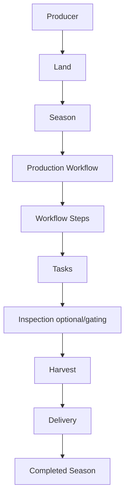
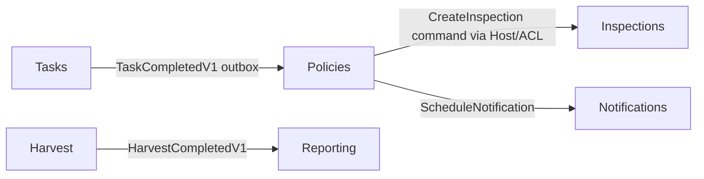
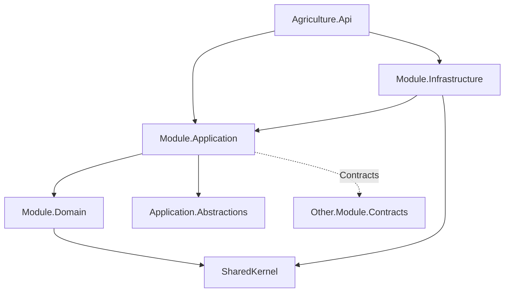
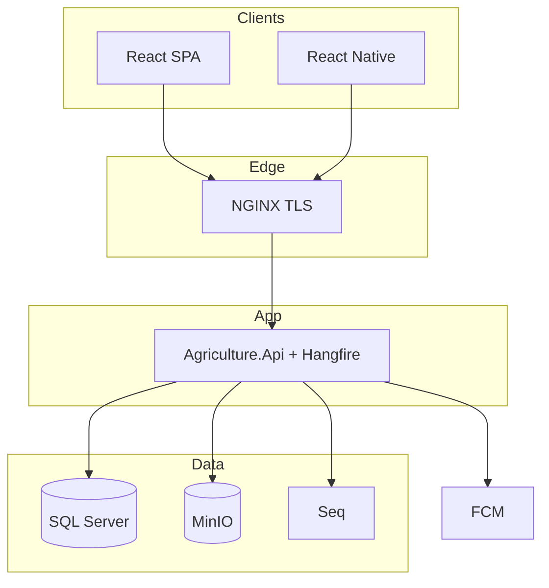
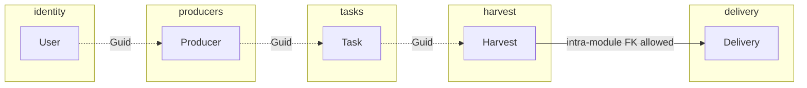

# Software Design Specification (SDS)

# Agriculture Management System

| Attribute | Value |
|---|---|
| **Document Title** | Software Design Specification (SDS) |
| **Version** | 1.3 |
| **Status** | **Approved / Normative** |
| **Effective Date** | 2026-07-18 |
| **Classification** | Internal — Engineering Source of Truth |
| **Audience** | Software architects, tech leads, module owners, backend/frontend/mobile engineers, QA, DevOps/SRE, security/compliance, product owners |
| **Document Ownership** | Chief Software Architect / Architecture Board / Municipality Digital Transformation Engineering |
| **Related Stack** | ASP.NET Core, EF Core, SQL Server, MediatR, Hangfire, SignalR, MinIO, Serilog, Seq, JWT, FCM, React, React Native |
| **Supersedes on Conflict** | All prior `docs/*.md` materials except future SDS revisions and new Accepted ADRs that explicitly amend this SDS |

---

## Front Matter — Governance, Precedence, and Change Control

### Purpose

This Software Design Specification (SDS) is the **single source of truth** for the professional software team delivering the Agriculture Management System (AMS). It consolidates product intent, domain rules, architecture decisions, module boundaries, backend and data strategy, API norms, client boundaries, security baseline, delivery/DevOps practices, and engineering Definition of Done into one **implementation-ready** normative document.

Prior documents under `docs/` remain valuable as **historical and detailed reference** (for example, the exhaustive endpoint catalogue in API_CONTRACT.md, or deep index notes in DATABASE_DESIGN.md). They **MUST NOT** be used to overturn this SDS when statements conflict. Teams implement against this SDS; detailed reference docs clarify *how much* surface area exists once the SDS has settled *what must be true*.

### Precedence Rule (Normative)

When two or more documents disagree, the following order **SHALL** apply:

1. **This SDS** (highest for product/architecture/implementation norms)
2. **Accepted ADRs** in `ADR.md` (and future ADR-021+) — still binding for *rationale* and technology choice; if an ADR conflicts with SDS, Architecture Board **MUST** either amend SDS or supersede the ADR in the same change set
3. **MODULE_DESIGN.md** — module catalog and dependency details when SDS is silent
4. **BACKEND_ARCHITECTURE / DATABASE_DESIGN / API_CONTRACT / SECURITY / DEPLOYMENT / TESTING / client architecture docs / ENGINEERING_HANDBOOK / GIT_RELEASE_STRATEGY** — specialized depth when SDS is silent and they do not conflict
5. **PRODUCT_VISION / SRS / PRD / DOMAIN_ANALYSIS / AGGREGATE_DESIGN / EVENT_STORMING** — product and domain narrative; superseded on structural conflicts by SDS Parts A–C
6. **Current MVP scaffold** under `src/` and `frontend/` — **non-normative** relative to SDS; gaps are tracked in Part J

**Normative language:** **SHALL** / **MUST** = mandatory; **SHOULD** = strongly preferred with recorded exception; **MAY** = optional; **MUST NOT** = forbidden.

### Audience and Reading Paths

| Role | Read first | Then |
|---|---|---|
| New engineer | Front matter + Part A + Part C | Part I DoD; Part J gaps |
| Module owner | Parts C–E for owned module | Part G permissions; Part I |
| Frontend/mobile | Parts A, F, G (auth UX) | API conventions in Part E |
| DevOps/SRE | Parts H + G hardening | Part B stack decisions |
| QA | Parts A business rules + H testing gates | Part E critical endpoints |
| Security/compliance | Part G | Parts E persistence + H secrets |

### How This SDS Is Updated

1. **Sponsor** drafts a change proposal citing affected SDS sections and any contradicted prior docs.
2. **Impact assessment** covers modules, aggregates, events, security, migrations, clients, and ops.
3. **Architecture Board** reviews (minimum: Chief Architect or delegate, Host Owner, affected Module Owner(s), Security when authZ/data, DevOps when deploy/migrate).
4. On approval, SDS version increments (minor for clarifications; major for breaking norms). Status remains Approved/Normative after merge.
5. If a technology or topology change is irreversible or costly, an **ADR** is recorded and SDS Part B is updated in the same PR.
6. `docs/SDS_CONSISTENCY_REPORT.md` **SHOULD** be updated when a new contradiction class is discovered or a deferred item is promoted.

### Relationship to ADRs

ADRs justify *why*. This SDS states *what teams must build*. ADR-001 through ADR-020 are Accepted and summarized in Part B. New decisions continue at ADR-021+. An Accepted ADR that changes an SDS norm without an SDS edit is incomplete delivery.

### Document Map (Prior Docs → SDS)

| Prior document | SDS home |
|---|---|
| PRODUCT_VISION, SRS, PRD | Part A |
| DOMAIN_ANALYSIS, AGGREGATE_DESIGN, EVENT_STORMING | Part A + Part C |
| MODULE_DESIGN | Part C |
| ADR | Part B |
| SOLUTION / BACKEND / PHYSICAL | Parts D + H |
| DATABASE_DESIGN, API_CONTRACT | Part E |
| REACT / REACT_NATIVE | Part F |
| SECURITY | Part G |
| DEPLOYMENT, GIT_RELEASE, TESTING | Part H |
| ENGINEERING_HANDBOOK | Part I |
| MVP `src/` / `frontend/` | Part J (gap analysis only) |

---

# Part A — Product and Domain

## A.1 Vision Summary

AMS is a **workflow-driven municipal agricultural production management platform**. It replaces Excel, paper forms, and phone-call tracking with authenticated digital workflows that give municipalities end-to-end visibility from producer registration through land and season setup, workflow execution, tasks, inspections, harvest, delivery, support programs, notifications, messaging, and reporting.

The platform **MUST** be simple enough for producers (and other users) with limited digital literacy, operational for **Tarım Uzmanı** (role key `Officer`), and auditable for municipal administrators. Production workflows are **continuously configured** in the municipal SPA by experts—not hardcoded in application releases. It is **not** a generic farm ERP, marketplace, GIS suite, or IoT hub.

**Vision statement (normative intent):** Digitize every municipal agricultural production stage in one modular, secure, maintainable system with complete production history and real-time operational awareness.

## A.2 Actors (Normative Role Model)

Early product documents named a single municipal **Administrator**. Security and module design introduced **Agriculture Officer** as the day-to-day operational role. Stakeholder clarification (**SDS-R12**) maps that role to the Turkish UI label **Tarım Uzmanı**. This SDS **resolves** naming as follows.

### A.2.1 Coarse Roles (MUST)

| Role key | Turkish UI label | Primary client | Intent |
|---|---|---|---|
| **Administrator** | Yönetici / Administrator | React SPA — **Administrator panel** | Full system access: users, roles, permissions, all modules, configuration, reports, messaging oversight, workflows, audit, feature flags. Break-glass identity; **SHOULD NOT** be the routine farm-ops login. |
| **Officer** | **Tarım Uzmanı** | React SPA — **Expert (Tarım Uzmanı) panel** | Operational surface: create/edit production workflows (steps, norms, calendar dates, reminders), monitor producer progress, view/reply to messages (“uzmana sor”), and operational add/remove within granted scope. **MUST NOT** receive unrestricted user/role/security/system settings unless explicitly permission-granted. |
| **Inspector** | Denetçi / Inspector | React Native (field) + optional SPA read | Assigned inspections, evidence upload, inspection completion. |
| **Producer** | Üretici / Producer | React Native | Own tasks, photos, notifications, support requests, message/ask expert, limited production history. |

**Normative role key:** `Officer` (preferred; already established in SDS-R02). Do **not** introduce a parallel coarse role `AgriculturalExpert`. Display name in `tr-TR` UI **SHALL** be **Tarım Uzmanı**.

Custom roles **MAY** be composed from the normative permission catalog. Coarse role alone **MUST NOT** be the sole authorization check.

### A.2.2 Dual Municipal Staff Surfaces (SDS-R12)

The React SPA **SHALL** present **two staff experiences** (shells / navigation sets), not one undifferentiated “admin app”:

1. **Administrator panel** — full access across users, roles, modules, config, reports, messaging oversight, and workflows.
2. **Tarım Uzmanı (Officer) panel** — operational cockpit focused on expert workflow authoring, production monitoring, messaging with producers, and scoped operational CRUD. Identity administration, unrestricted role/security settings, and global system configuration remain **Administrator** unless Board grants explicit permissions.

**Assignment-scoped visibility (SDS-R13):** By default, an Officer **SHALL** see only **producers, lands, and workflows/production instances assigned to them**—not the entire municipality catalog. Municipality-wide browse/search **MUST NOT** be the default Officer grant; widening requires explicit permission (Administrator-equivalent operational grant) and Board awareness.

Permission-gated routes enforce the split; UI chrome **MUST NOT** expose Administrator-only areas to Officer accounts.

### A.2.3 Actor Responsibilities (Summary)

- **Administrator:** identity administration, system settings, audit export governance, emergency overrides, full module/config/reporting/messaging oversight under policy.
- **Officer (Tarım Uzmanı):** enter and maintain production workflows from agricultural expert knowledge (steps, norms, dates, reminders) per crop/producer/season needs; assign workflows; monitor task/progress completion **for assigned producers/lands**; register/manage producers and lands **within assignment scope**; coordinate inspections; record harvest/delivery; manage support programs within grants; consume operational dashboards/reports **scoped to assignments**; send operational notifications; **view and reply to producer messages** (chat threads).
- **Inspector:** execute field inspections with GPS/photo evidence; complete or fail inspections that may gate harvest.
- **Producer:** complete assigned tasks; upload required photos; receive FCM/in-app notifications; request support; **message / ask the expert (uzmana sor)**; view own history.

**Provisioning rule:** There is **no public self-registration**. Officers/Administrators with `identity.users.create` (or Host ACL after `ProducerRegistered`) provision accounts.

## A.3 Scope — Version 1 (In Scope)

V1 **SHALL** include capability for:

Identity (JWT + refresh); Producer Management; Land Management; Season Management; Workflow Management; Task Management; Inspection Management; Support Management; Harvest Management; Delivery Management (as Harvest module capability); Notification System; Communication (Messaging) baseline; Reporting baseline; Administration Panel (React); Mobile Application (React Native) for Producer and Inspector; Observability (Serilog/Seq); Object storage (MinIO); Background jobs (Hangfire); Realtime dashboards (SignalR).

## A.4 Out of Scope — Version 1 (MUST NOT treat as V1 commitments)

Weather integrations; IoT sensors; drone automation; satellite monitoring; AI recommendations; yield prediction; disease detection; deep GIS analysis; municipal SSO/OIDC IdP (hooks only); MFA enforcement (MFA-ready design only); schema-per-tenant; microservices extraction; SMS as primary channel (optional adapter later); e-Government integrations; QR retail traceability marketplace.

These **MAY** appear as deferred appendix items with hooks reserved in architecture.

## A.5 Ubiquitous Language (Selected Normative Terms)

| Term | Meaning |
|---|---|
| **Producer** | Citizen/participant registered by municipality for agricultural programs |
| **Land** | Authoritative agricultural parcel registry entry |
| **Season** | Time-bounded production cycle on a land |
| **Workflow / Workflow Step** | Ordered production process **definition** (template) and steps — authored/edited continuously in SPA by Administrator or Officer (Tarım Uzmanı); **not** hardcoded |
| **Production Workflow** | Runtime instance of a workflow for a season |
| **Task** | Assignable work unit generated from workflow steps or manual create |
| **Inspection** | Field verification that may block harvest eligibility |
| **Harvest** | Recorded yield for a completed (or eligible) production path |
| **Delivery** | Crop logistics fulfillment against a harvest quantity (not Support fulfillment) |
| **Support** | Municipal aid program / application / approval / fulfillment |
| **Notification** | System push/in-app/email alert (not chat) |
| **Conversation / Message** | Human messaging in Communication module |
| **TenantId** | Municipality isolation key (row-level); V1 typically one tenant |
| **Officer** | Coarse role key for agriculture directorate operational staff; Turkish UI **Tarım Uzmanı** (not Administrator) |
| **Tarım Uzmanı** | Display label for role `Officer` in `tr-TR` UI |
| **Outbox** | Per-module transactional integration event store |

Teams **MUST NOT** invent synonyms in UI copy that break this language (e.g., “Job” for Task) unless i18n explicitly maps Turkish display labels while keeping English API/domain terms stable. Role key `Officer` remains stable in API/claims; UI shows **Tarım Uzmanı**.

## A.6 Core Production Lifecycle (Normative)



**Normative rules:**

1. No production activity **SHALL** exist outside a season/workflow context for V1 operational production (administrative registries may exist independently).
2. Tasks advance workflow sequencing per Workflow/Tasks module invariants.
3. Harvest **MUST NOT** start/complete when inspection gates (if configured) are unmet.
4. Delivery quantity **MUST NOT** exceed remaining harvest quantity.
5. Archived/completed seasons **MUST** be immutable for operational writes.

## A.7 Business Rules — Normative Catalogue (Selected)

### A.7.1 Identity

- Only active users receive JWTs.
- Password **MUST** be hashed; plaintext **MUST NEVER** be stored.
- Refresh tokens **MUST** rotate; reuse detection **MUST** revoke the token family.
- Role/permission privilege changes **SHOULD** invalidate refresh families so new access tokens pick up authZ.

### A.7.2 Producers / Lands / Seasons

- Producer national identity uniqueness within tenant.
- Land parcel uniqueness within tenant as defined by Lands module.
- A land **MUST NOT** have two active seasons concurrently (filtered unique index + domain invariant).
- Season start **MUST** require valid land and assigned workflow definition.

### A.7.3 Workflows / Tasks

- Workflow **definitions** are **continuously configured** via Administrator / Officer (Tarım Uzmanı) UI from expert knowledge—different producers, crops, and seasons **MAY** use different workflows. Hardcoding crop calendars or step graphs in application code for V1 municipal variation **MUST NOT** be the delivery model (**SDS-R12**).
- Definitions include ordered steps, norms, calendar/due dates, and reminders as configured by experts; producers then follow/complete generated tasks; Officers monitor progress.
- Workflow steps are ordered; skipping **MUST** be rejected unless an explicit Admin/Officer override permission exists and is audited.
- Task completion by Producer requires ownership (`tasks.complete_own`); Officer-assisted completion requires `tasks.complete_any` and audit.
- Photo requirements are domain-enforced when step rules demand evidence.

### A.7.4 Inspections

- Only assigned inspector (or elevated permission) completes inspection.
- Completed inspection evidence is immutable; corrections use compensating entries.
- Failed/blocking inspections prevent harvest eligibility until resolved per Workflow/Inspection policy.

### A.7.5 Harvest / Delivery

- Harvest eligibility depends on season/workflow/inspection gates.
- Delivery create **MUST** go through Harvest aggregate method updating delivered/remaining quantity in the same module transaction.
- Concurrent delivery attempts **MUST** fail closed with concurrency conflict (409), not silent oversell.

### A.7.6 Support / Notifications / Communication

- Support approval **MUST** be permissioned and audited.
- Notifications are system messages; Communication is human threads—**MUST NOT** be conflated in models or UX.
- Notification fan-out is eventually consistent via outbox + Hangfire/FCM.

### A.7.7 Reporting / Administration

- Reporting **MUST NOT** own source aggregates; it projects read models.
- Feature flags and system settings live in Administration (`admin` schema), distinct from Identity.

## A.8 Product Principles (Binding)

Simplicity; **Mobile-first for producers (SDS-R13 delivery order)**; Workflow-driven; Security by default; Maintainability via Clean Architecture; Scalability via modular extractability—not day-one microservices; UI language **`tr-TR` from day one**.

## A.9 Success Criteria (Product)

Digital management of municipal agricultural production activities; producers complete assigned tasks on mobile; officers monitor via SPA/SignalR; inspections digital; production history retained; reports generable without manual spreadsheet assembly.

---

# Part B — Architecture Decisions (Consolidated)

## B.1 Master Decision Table

| ID | Decision | Status | SDS stance |
|---|---|---|---|
| ADR-001 | Modular Monolith | Accepted | **MUST** ship one `Agriculture.Api` host composing modules |
| ADR-002 | Clean Architecture per module | Accepted | Domain/Application/Infrastructure(/Contracts) **MUST** be respected |
| ADR-003 | CQRS | Accepted | Commands mutate; queries read; separate models by default |
| ADR-004 | MediatR | Accepted | Host/module handlers via mediator + pipeline behaviors |
| ADR-005 | SQL Server | Accepted | **V1 OLTP only (SDS-R11)**; portable EF LINQ style; no alternate DB for V1 |
| ADR-006 | EF Core | Accepted | One DbContext per module; migrations per schema |
| ADR-007 | Hangfire | Accepted | Background jobs; SQL storage in `hangfire` schema |
| ADR-008 | SignalR | Accepted | Realtime officer dashboards; sticky sessions or Redis later |
| ADR-009 | FCM | Accepted | Mobile push |
| ADR-010 | MinIO | Accepted | Private object storage; no SQL BLOBs for evidence |
| ADR-011 | Serilog | Accepted | Structured logging |
| ADR-012 | Seq | Accepted | Log aggregation (ops UI not public) |
| ADR-013 | JWT + refresh | Accepted | AuthN baseline |
| ADR-014 | RBAC + permissions + resource checks | Accepted | AuthZ baseline |
| ADR-015 | Caching | Accepted | **V1 in scope (SDS-R11):** memory cache default; Redis on horizontal scale |
| ADR-016 | Soft delete + audit + rowversion; no cross-schema FK | Accepted | Persistence baseline |
| ADR-017 | Contracts + events; no foreign DbContext | Accepted | Module communication |
| ADR-018 | Problem Details / Result mapping | Accepted | Error model |
| ADR-019 | FluentValidation | Accepted | Validation in pipeline |
| ADR-020 | Dockerized deploy / CI-CD | Accepted | Compose → K8s path |
| SDS-R01 | Harvest owns Delivery | **Chief Architect** | No `Modules/Delivery` |
| SDS-R02 | Roles include Officer | **Chief Architect** | Four coarse roles |
| SDS-R03 | Schema-per-module | **Chief Architect** | Not single `agriculture` schema |
| SDS-R04 | MVC Controllers (not Minimal APIs as default) | **Chief Architect** | Thin controllers |
| SDS-R05 | EF migrations only (no EnsureCreated in CI/Prod) | **Chief Architect** | Migrator identity |
| SDS-R06 | GitFlow-inspired branching | **Chief Architect** | Not pure trunk-based as primary |
| SDS-R07 | Per-module DbContext; Identity separate | **Chief Architect** | No shared `AgricultureDbContext` target |
| SDS-R08 | V1 single-municipality multi-tenant *hooks* | **Chief Architect** | `TenantId` everywhere; one tenant seeded |
| SDS-R09 | i18n default `tr-TR` | **Chief Architect** | EN for ops secondary |
| SDS-R10 | Communication V1 = chat-like baseline messaging | **Chief Architect** | Conversation list + thread + send; rich suite deferred (amended SDS-R13) |
| SDS-R11 | MSSQL + Minimalist + V1 caching | **Chief Architect** | SQL Server only; no extras; memory cache → Redis on scale-out |
| SDS-R12 | Configurable workflows + dual staff panels + ask-expert messaging | **Chief Architect** | Workflows authored in UI (not hardcoded); Admin vs Tarım Uzmanı (`Officer`); low-literacy UX; uzmana sor |
| SDS-R13 | Mobile-first + Officer assignment scope + chat UX + local SQL | **Chief Architect** | Producer mobile before web panels; assignment-scoped Tarım Uzmanı; chat-like threads; `tr-TR` day one; Local SQL Server OK for Dev |

## B.2 Modular Monolith

AMS **SHALL** deploy as a modular monolith: one process, one primary API image (initially including Hangfire server), module boundaries enforced by projects, schemas, contracts, and architecture tests. Microservices **MUST NOT** be introduced without extraction gates (independent scale, cadence, or regulatory isolation) documented in MODULE_DESIGN §10 and confirmed by ADR.

**Rationale:** Municipal risk is incorrect sequential invariants, not hyperscale tenancy. In-process coordination plus transactional outbox is honest and operable for small teams.

## B.3 Clean Architecture

Each business module **SHALL** layer Domain → Application → Infrastructure, with Host as composition root. Domain **MUST NOT** reference ASP.NET, EF, Hangfire, SignalR, or MinIO. Application depends on Domain and abstractions; Infrastructure implements ports.

## B.4 CQRS and MediatR

- Commands: one primary aggregate write (Harvest+Delivery dual-aggregate exception documented in Part C).
- Queries: projections or shaped reads; **MUST NOT** mutate.
- MediatR pipeline order (normative default):


Exact behavior names may vary; order semantics **MUST** keep authorization and validation before mutation, and outbox in the same transaction as aggregate persistence.

## B.5 Data Platform

- **SQL Server** single OLTP database physically; **multiple schemas** logically.
- **Normative (SDS-R11):** Microsoft SQL Server is the **only** V1 OLTP database. Teams **MUST NOT** introduce Cosmos DB, PostgreSQL, or another engine for V1, and **MUST NOT** plan a mid-V1 DB switch.
- **Local/Dev (SDS-R13):** An installed **local SQL Server** instance is **acceptable** for development. Dockerized SQL Server is **optional later** and **MUST NOT** block Local/Dev inner loop.
- **EF Core** with `__EFMigrationsHistory` **per module schema**.
- **Hangfire** schema separate from business schemas.
- **MinIO** for binaries; SQL stores object keys/metadata only.

## B.6 Async, Realtime, Push, Observability

| Concern | Choice | Norm |
|---|---|---|
| Jobs | Hangfire | Named queues; system principal; no interactive user ambient context |
| Realtime | SignalR | JWT; group membership is authZ decision |
| Push | FCM | Via Notifications module adapters |
| Logs | Serilog → Seq | CorrelationId on HTTP and jobs; PII redaction |
| Cache | **V1: `IMemoryCache`** | Hot read models; Redis when >1 API instance (SDS-R11) |

## B.6a Minimalist Design & V1 Caching (SDS-R11 / SDS-R12)

**Minimalist (normative):** Product UX and architecture **SHALL** stay minimal — no decorative UI chrome, unused modules in navigation, speculative abstractions, or “nice-to-have” features without a Storming/consumer need. Prefer the simplest working path (YAGNI/KISS). Minimalist **does not** mean removing the approved stack (Hangfire, Seq, MinIO, SignalR, etc.); it means **no extra** speculative technology beyond Board-accepted ADRs.

**Low digital literacy (SDS-R12):** Screens **SHALL** be clear and sparse for users who often have limited digital literacy—especially Producers on mobile and day-to-day Officer (Tarım Uzmanı) ops. Prefer large primary actions, plain Turkish copy, short task lists, and progressive disclosure. **MUST NOT** ship dense dashboards, unnecessary feature clusters, or expert-only chrome on Producer surfaces.

**Caching (normative for V1):**

| Rule | Norm |
|---|---|
| Default V1 | ASP.NET **`IMemoryCache`** (in-process) on the API for hot read models: dashboard counters, permission lookups, reference lists — short TTL |
| Horizontal scale (>1 API instance) | Introduce **Redis** as distributed cache behind the **same** abstractions; do **not** force Redis on day-one single-server deploy |
| Invalidation | Invalidate (or TTL-expire) affected keys on writes; cache **MUST NOT** be a second write model |
| PII | **MUST NOT** cache highly sensitive PII beyond necessity; tenant- and permission-version keying when caching authZ-adjacent data |
| Forbidden as SoT | Caching mutable Task/Harvest aggregates as source of truth |

## B.7 Clients

- **Delivery order (SDS-R13):** Design and build **Producer mobile first**, then React **Administrator** and **Tarım Uzmanı** web panels. Web SPA work **MUST NOT** block producer mobile UX/API readiness for core task flows.
- **React** SPA: two municipal staff surfaces — **Administrator panel** and **Tarım Uzmanı (Officer) panel** (permission-gated shells; Officer **assignment-scoped** per SDS-R13).
- **React Native**: producer/inspector offline-first field app (includes **uzmana sor** chat entry for Producer). Primary UX norms: [`MOBILE_UX_DESIGN.md`](./MOBILE_UX_DESIGN.md).
- Clients are **not** modules inside the monolith.

## B.8 Security Stack

JWT bearer access tokens (short TTL); opaque rotating refresh; permission strings; resource ownership checks; KVKK-aware soft delete and purge paths; OWASP ASVS-aligned controls summarized in Part G.

## B.9 Decision Anti-Patterns (MUST NOT)

Shared `AppDbContext` / `AgricultureDbContext` as target architecture; cross-schema FKs; fat controllers with business rules; EnsureCreated as migration substitute in CI/Staging/Production; public Hangfire/Seq; conflating Delivery logistics with Support fulfillment; day-one microservices; Minimal APIs as default host surface without ADR superseding SDS-R04; **alternate databases for V1 (Cosmos/Postgres/etc.)**; **skipping V1 memory cache while waiting for Redis**; **decorative extras / unused UI modules / speculative frameworks** contrary to SDS-R11 minimalism.

---

# Part C — Bounded Contexts and Modules

## C.1 Normative Module List

Thirteen business module families:

1. Identity  
2. Producers  
3. Lands  
4. Seasons  
5. Workflows  
6. Tasks  
7. Inspections  
8. Harvest (**includes Delivery**)  
9. Support  
10. Notifications  
11. Communication  
12. Reporting  
13. Administration  

Plus Shared Kernel / Application Abstractions / Host Building Blocks — not business modules.

## C.2 Harvest Owns Delivery (Chief Architect Resolution SDS-R01)

**Contradiction:** PRODUCT_VISION / DOMAIN_ANALYSIS list Delivery as a peer domain/module; MODULE_DESIGN §6.8 merges Delivery into Harvest.

**Resolution:** Delivery is a **separate aggregate** with schema `delivery`, owned by module folder `Modules/Harvest`. HTTP remains `/api/v1/deliveries`. Teams **MUST NOT** create `Modules/Delivery`.

**Why:** Quantity consistency requires coordinated updates; premature module split creates distributed consistency without team/scale need. Extraction remains possible later when logistics scale independently.

## C.3 Module Ownership Summary

| Module | Aggregates (roots) | Schemas | Primary consumers |
|---|---|---|---|
| Identity | User | `identity` | All |
| Producers | Producer | `producers` | SPA, Mobile |
| Lands | Land | `lands` | SPA |
| Seasons | Season | `seasons` | SPA |
| Workflows | Workflow definition + ProductionWorkflow | `workflows` | SPA |
| Tasks | Task | `tasks` | SPA, Mobile |
| Inspections | Inspection | `inspections` | SPA, Mobile |
| Harvest | Harvest, Delivery | `harvest`, `delivery` | SPA (ops), limited Mobile read |
| Support | SupportProgram / Approval / Fulfillment | `support` | SPA, Mobile (apply/own) |
| Notifications | Notification | `notifications` | All clients |
| Communication | Conversation | `communication` | SPA, Mobile |
| Reporting | ReportRun / projections | `reporting` | SPA |
| Administration | SystemSetting, FeatureFlag, Audit views | `admin` | SPA Admin |

## C.4 Communication Rules (Normative)

1. Modules **MUST NOT** reference another module’s Infrastructure or Domain entity types for persistence.
2. Cross-module collaboration **SHALL** use Application Contracts (ACL interfaces) and/or integration events via **per-module outbox**.
3. Synchronous in-process contract calls **MAY** validate existence/active state; they **MUST NOT** mutate foreign aggregates.
4. Multi-write-owner actions **MUST** use explicit choreography (events/policies), not hidden dual DbContext writes.
5. Shared Kernel **MAY** contain primitives (Entity, AggregateRoot, Result, audit base types)—**MUST NOT** become a DTO dumping ground.



## C.5 Shared Kernel Boundaries

**Allowed:** Ids as Guids; base entity/audit/soft-delete abstractions; Result/Error types; domain event marker interfaces; common value-object patterns that are truly generic.

**Forbidden:** `Producer`, `Task`, permission enums owned by Identity leaked as SharedKernel “convenience”; shared EF configurations spanning modules; centralized outbox table owned by Host for all modules (each module owns outbox in its schema).

## C.6 Aggregate Highlights

- **One aggregate root per transaction** by default.
- **Documented exception:** Harvest module handler may update Harvest delivered amount and insert Delivery in one transaction via Harvest domain method `RegisterDelivery` / `ReleaseDelivery`.
- Contested roots **MUST** carry `RowVersion`.
- Soft delete via domain methods; archived/completed immutability independent of `IsDeleted`.

## C.7 Messaging Module Readiness (SDS-R10 / SDS-R12 / SDS-R13)

Communication **SHALL** exist as a first-class module with schema `communication`, conversation/message aggregates, and API tags. V1 readiness:

| Capability | V1 |
|---|---|
| **Chat-like** UX: conversation list, message **thread**, send text | **MUST** (SDS-R13) |
| Create conversation, send message, list inbox | **MUST** |
| Producer **“uzmana sor” / ask the expert** entry → Officer (Tarım Uzmanı) thread | **MUST** (SDS-R12/R13) |
| Officer view/reply in thread; Administrator messaging oversight | **MUST** |
| Attachments via MinIO / photo-in-chat | **MAY** later (not required for first mobile UX) |
| Moderation/close | **SHOULD** |
| Rich reactions, presence, nested reply trees | Deferred |
| Replacing Notifications push | **MUST NOT** |

---

# Part D — Solution and Backend

## D.1 Solution Structure (Normative Target)

```
Agriculture.sln
src/
  BuildingBlocks/
    Agriculture.SharedKernel/
    Agriculture.Application.Abstractions/
    Agriculture.Infrastructure/          # host-shared adapters only (not unified business DbContext)
  Hosts/
    Agriculture.Api/
  Modules/
    Identity|Producers|Lands|Seasons|Workflows|Tasks|Inspections|
    Harvest|Support|Notifications|Communication|Reporting|Administration/
      *.Domain / *.Application / *.Infrastructure / *.Contracts
tests/
  Architecture.Tests / unit / integration / ...
```

Namespaces follow `Agriculture.Modules.{Module}.{Layer}...` and `Agriculture.Api.Controllers.{Module}`.

## D.2 Dependency Rules



- Api **MAY** reference Infrastructure for DI registration only.
- Controllers **MUST NOT** inject DbContext.
- Domain **MUST NOT** reference Application/Infrastructure.

## D.3 Dependency Injection

Each module exposes `Add{Module}Module(IServiceCollection, IConfiguration)` (or equivalent). Host calls registrations explicitly—**SHOULD** avoid surprise assembly scanning in Production. MediatR registration includes module assemblies and shared behaviors.

## D.4 Persistence Strategy (Normative)

1. **One `{Module}DbContext` per module**; HarvestDbContext maps **both** `harvest` and `delivery`.
2. Identity uses `IdentityDbContext` (or module-named equivalent) for `identity` schema—**not** a unified business context.
3. Migrations owned by module Infrastructure; history table in module schema.
4. Global query filters: `!IsDeleted` and `TenantId` where applicable.
5. Outbox table per module schema; dispatcher Hangfire job publishes integration events.
6. **MVP gap:** current scaffold’s shared `AgricultureDbContext` + `agriculture` schema is **non-compliant** with this SDS and **MUST** be migrated (Part J).

## D.5 API Host Standards

- Thin **MVC Controllers** dispatching `ISender`.
- Routes: `/api/v1/{resource}` (Delivery under `/api/v1/deliveries`).
- Problem Details (RFC 7807) with `errorCode`, `correlationId`.
- Health: `/health/live`, `/health/ready`.
- SignalR hubs under `/hubs/...`.
- Hangfire dashboard restricted (VPN/bastion + auth).

**Chief Architect Resolution SDS-R04:** Minimal APIs in the MVP `Program.cs` are a scaffold convenience. Target and new work **SHALL** use Controllers unless a future ADR supersedes this SDS.

## D.6 Background Jobs

Hangfire **SHALL** use named queues, for example:

| Queue | Purpose |
|---|---|
| `critical` | Security/token cleanup, poison-sensitive |
| `default` | General module jobs |
| `notifications` | FCM/email fan-out |
| `reporting` | Projection rebuilds/exports |
| `maintenance` | archival, expand-contract backfills |

Jobs **MUST** run as system principal with explicit `TenantId`/entity ids in payload—never ambient officer claims.

## D.7 Unit of Work and Domain Events

After successful `SaveChanges`, domain events **SHALL** be dispatched; integration events **SHALL** be written to outbox in the same transaction as the write model change that requires cross-module notification.

---

# Part E — Data and API

## E.1 Schema Strategy (Normative Resolution SDS-R03)

**Contradiction:** MVP uses single schema `agriculture` with shared DbContext; DATABASE_DESIGN/MODULE_DESIGN prescribe schema-per-module.

**Resolution:** Physical DB `Agriculture` (name configurable) with schemas:

`identity`, `producers`, `lands`, `seasons`, `workflows`, `tasks`, `inspections`, `harvest`, `delivery`, `support`, `notifications`, `communication`, `reporting`, `admin`, `hangfire`.

**Rules:**

- No cross-schema foreign keys (except intentional Harvest↔Delivery intra-module relationship under HarvestDbContext).
- Cross-module references are **Guid** columns only.
- Soft delete columns: `IsDeleted`, `DeletedAt`, `DeletedBy` as applicable.
- Audit columns: `CreatedAt`, `CreatedBy`, `UpdatedAt`, `UpdatedBy` (UTC).
- Concurrency: `RowVersion` on contested aggregate roots.
- Expand-contract migrations for destructive hot-path changes.

## E.2 Multi-Tenancy Stance for V1 (SDS-R08)

V1 **SHALL** implement `TenantId` on aggregate roots and enforce EF filters / resource checks. V1 deployments **MAY** seed a single municipality tenant. Schema-per-tenant and full SaaS billing tenancy are **deferred**. Cross-tenant access **MUST** fail closed.

## E.3 Key Aggregates — Persistence Summary

### Identity / User

Users, roles, permissions, refresh tokens, login/password history. Strong consistency for token issuance. Soft delete/deactivate semantics; deactivated users cannot authenticate.

### Producer / Land / Season

Registries with assignment Guids; uniqueness constraints with soft-delete filters; season active exclusivity per land.

### Workflow / Task / Inspection

Hot paths for field ops; indexes on `(TenantId, Status, DueDate)`, assignee, season. Inspection completion immutability.

### Harvest / Delivery

Harvest maintains totals and delivered amount; Delivery stores shipment quantities; transactional `RegisterDelivery`; RowVersion prevents oversell; quantity audit tables for sensitive changes.

### Support / Notifications / Communication / Reporting / Admin

As MODULE_DESIGN/DATABASE_DESIGN; Reporting projections only; Admin settings distinct from Identity.

## E.4 Outbox (Normative)

Each business module schema **SHALL** include `OutboxMessages` (or equivalent) with idempotent processing, retry, and poison handling. Hangfire **MUST NOT** be used as the business outbox substitute. Dispatcher **MUST** be idempotent.

## E.5 API Conventions (Normalize + Index)

Full endpoint catalogue remains in `API_CONTRACT.md` (reference). SDS norms:

| Topic | Norm |
|---|---|
| Versioning | `/api/v1` |
| JSON | camelCase |
| Time | ISO-8601 UTC |
| Auth | Bearer JWT |
| Errors | Problem Details + `errorCode` |
| Pagination | `page`, `pageSize`, `sort` |
| Concurrency | ETag / If-Match on contested resources (esp. deliveries) |
| Idempotency | Idempotency keys for mobile-critical posts where contract specifies |

### E.5.1 Critical Endpoints Index (Not Exhaustive)

| Area | Examples |
|---|---|
| Auth | `POST /api/v1/auth/login`, `/refresh`, `/logout` |
| Producers | `GET/POST /api/v1/producers`, `GET /api/v1/producers/{id}` |
| Lands / Seasons | CRUD + `POST .../seasons/{id}/start` |
| Workflows / Tasks | create/assign; `POST /api/v1/tasks/{id}/complete` |
| Inspections | create/assign/complete |
| Harvest / Delivery | harvest lifecycle; `POST /api/v1/deliveries` |
| Support | programs, applications, approve |
| Notifications | inbox, mark read |
| Communication | conversations, messages |
| Reporting | dashboards, exports (permissioned) |
| Admin | settings, feature flags, audit queries |
| Realtime | `/hubs/operations` (name per contract) |
| Health | `/health/live`, `/health/ready` |

OpenAPI tags **MUST** match module vocabulary including separate **Delivery** tag even though Harvest owns the module.

## E.6 i18n / Locale Defaults (SDS-R09)

- API messages **MAY** be English `detail` with stable `errorCode`.
- SPA and Mobile UI default locale **`tr-TR`**; English **MAY** be offered for ops.
- Municipal timezone display is a client concern; storage remains UTC.

---

# Part F — Clients

## F.0 Delivery Order (SDS-R13)

1. **Producer mobile UX/app** (design first — see [`MOBILE_UX_DESIGN.md`](./MOBILE_UX_DESIGN.md); then React Native implementation).
2. **React SPA** — Administrator panel and Tarım Uzmanı (Officer) panel.

Inspector mobile may follow Producer shell patterns; Admin/Expert web is explicitly **next phase** after Producer mobile design.

## F.1 Admin React SPA

**Role:** Dual staff cockpit — **Administrator panel** and **Tarım Uzmanı (Officer) panel** (SDS-R12). Feature-folder architecture; TanStack Query for server state; permission-gated routes/actions and navigation shells; SignalR for dashboards; i18n (`tr-TR` default from day one, SDS-R09/R13; label **Tarım Uzmanı** for `Officer`); design tokens. Officer lists and detail surfaces **MUST** default to **assignment-scoped** data (SDS-R13).

**Workflow configuration UX (SDS-R12):** Officers (and Administrators) **SHALL** author and continuously update workflow definitions in the SPA (steps, norms, calendar dates, reminders)—not via code deploys for crop/season variation. UX **SHOULD** guide expert data entry with clear forms and calendars; avoid power-user-only configuration languages in V1.

**Dark mode:** **SHALL** be supported via CSS variable theme tokens (`data-theme`), WCAG contrast maintained. This is a product UX requirement from REACT_ARCHITECTURE and is **compatible** with the Engineering Handbook (tokens live under `shared/` UI stewardship). Dark mode **MUST NOT** fork business components.

**Stack direction (normative preferences):** React + Vite; React Router; TanStack Query; Zod at boundaries; headless accessible primitives + tokens; i18next. Heavy purple-default UI kits **SHOULD** be avoided unless municipality standardizes on an existing kit.

**MVP gap:** current `frontend/` is a thin Vite React app without the full feature architecture—see Part J.

## F.2 React Native Mobile

**Role:** Producer and Inspector field surfaces; offline-first; camera/GPS; FCM; SQLite (or Board-approved local store) with outbox/upload queue; conflict journal on 409.

**UX source of truth (Producer):** [`MOBILE_UX_DESIGN.md`](./MOBILE_UX_DESIGN.md) — bottom tabs (Görevler / Sohbet / Bildirimler / Profil), premium-minimal visual direction, screen map, flows, empty/error states, chat norms. Architecture/stack details remain in [`REACT_NATIVE_ARCHITECTURE.md`](./REACT_NATIVE_ARCHITECTURE.md).

**MUST:** No public registration; role-based navigation shells; server remains authZ authority; idempotent sync aligned with API; **chat-like** **uzmana sor** path for Producer (SDS-R12/R13); low-literacy-friendly task completion flows; UI locale **`tr-TR`** from first build.

**MUST NOT:** Become the admin registry/reporting cockpit; dump Admin+Producer+Inspector into one dense IA without shells.

## F.3 Auth UX

- SPA: login, silent refresh, logout revoke, session expiry UX, permission-denied empty states.
- Mobile: secure token storage, biometric optional later, offline login cache policy Board-approved, forced re-auth on refresh family revoke.
- Producer JWT on SPA **SHOULD** be denied or redirected (“use mobile”); Admin on mobile **SHOULD** be guided to SPA.

---

# Part G — Security

## G.1 Baseline

Zero-trust posture for internet-facing municipal apps: authenticate every request; authorize every action; encrypt in transit (TLS); minimize PII in logs; private MinIO; rate-limit auth endpoints; audit sensitive mutations.

## G.2 JWT and Session

- Access token TTL short (e.g., 10–30 minutes; Admin **MAY** be shorter).
- Claims include `sub`, `roles`, permissions or permission version, `tenantId`, optional `producerId`, `jti`.
- Production signing **SHOULD** be asymmetric.
- Refresh: opaque, hashed at rest, rotating, reuse detection.

## G.3 RBAC Matrix (Baseline)

Legend: F=full area, A=**assignment-scoped** (SDS-R13), R=read, O=own/limited, — = none.

| Area | Administrator | Officer | Inspector | Producer |
|---|---|---|---|---|
| Identity users/roles | F | — (optional read if Board) | — | — |
| Producers/Lands/Seasons | F | **A** | R as needed | O read own |
| Workflows/Tasks | F | **A** | R assigned context | O tasks |
| Inspections | F | **A** coordinate | O assigned | R own related |
| Harvest/Delivery | F | **A** | R | O participate/read own |
| Support | F | programs/approve as job (A where applicable) | — | apply/own |
| Notifications | F admin templates | send/ops (A recipients) | own inbox | own inbox |
| Communication | F moderate / oversight | participate / reply (expert, A threads) | participate | participate / **uzmana sor** |
| Reporting | F | consume/export per perm (**A** default) | limited | — |
| Administration | F | — | — | — |

Column **Officer** = role key; Turkish UI **Tarım Uzmanı**. Officer **MUST NOT** receive Identity users/roles or Administration full access by default (SDS-R12 SoD). **SDS-R13:** Officer default visibility is **assignment-scoped**—assigned producers, lands, and workflows/production instances only; not municipality-wide. Permissions are string-catalogued (`tasks.complete_own`, `delivery.create`, etc.). Widening beyond assignment scope or Administrator requires Board + KVKK impact review for sensitive grants.

## G.4 KVKK / Privacy

- Lawful municipal purpose; minimize PII; access/correction paths; soft delete for operations; hard delete/anonymize under legal purge with audit that does not restore PII.
- Export permissions tightly controlled; anomalous export alerting **SHOULD** exist in Production.

## G.5 OWASP Control Summary

| Theme | Control |
|---|---|
| AuthN | Strong passwords; lockout; no user enumeration where policy requires |
| AuthZ | Permission + resource + tenant checks; fail closed |
| Injection | Parameterized EF; validate inputs |
| XSS | SPA encoding; CSP **SHOULD** |
| CSRF | JWT bearer SPA patterns; cookie auth if introduced needs CSRF plan |
| Uploads | Size/type limits; authZ; private buckets; virus scan **SHOULD** when available |
| Secrets | Not in git; CI OIDC; runtime secret store |
| Logging | Redaction; correlation; no secrets |
| Supply chain | Dependency scanning in CI |

## G.6 MFA and Advanced Controls

MFA **SHOULD** be designed as MFA-ready for Administrator (and optionally Officer approval roles) but **enforcement is deferred** unless Board accelerates. Device binding for refresh on mobile **SHOULD** be implemented in V1 where API_CONTRACT already requires client ids.

---

# Part H — Delivery (Physical, CI/CD, Git, Test, Observability)

## H.1 Physical / Runtime Topology



Stages evolve Compose → HA Compose → Kubernetes per PHYSICAL/DEPLOYMENT docs. Sticky sessions **or** Redis SignalR backplane before multi-instance SignalR.

## H.2 Environment Matrix (Normative)

| Env | Purpose | Data | Deploy authority |
|---|---|---|---|
| Local/Dev | Developer inner loop | Disposable; **local SQL Server OK** (SDS-R13); Docker SQL optional later | Developers |
| CI | PR validation | Testcontainers/ephemeral | Automation |
| Staging | UAT / release candidate | Anonymized or synthetic | Release Manager |
| Production | Live municipality | Real PII | Dual approval |

Config via environment/vars; no secrets in images. SPA API base URL inject-at-deploy.

## H.3 Docker / Compose → Kubernetes

V1 **SHALL** be operable on Docker Compose with TLS-terminating proxy, API, SQL, MinIO, Seq. Kubernetes is the planned scale path; manifests **SHOULD** be prepared when Physical Stage requires. Immutable image digests are the release identity.

## H.4 CI/CD Gates

PR **MUST** pass: build, unit, architecture tests, relevant integration, lint/analyze, security scan policy. Release **MUST**: build digest, migrate Staging, smoke/UAT, dual approve Production, backup-before-migrate, burn-in watch.

## H.5 GitFlow-Inspired Release (SDS-R06)

Primary model: `main` (production history), `develop` (integration), `feature/*`, `release/*`, `hotfix/*`. Not classic cargo-cult GitFlow (no mandatory long-lived `support/*`). Pure trunk-based continuous Production deploy is **not** the primary municipal model.

SemVer tags on `main`; promotion by digest; feature flags complementary to release branches.

## H.6 Migrations in Release

- Migrator identity with DDL; app identity DML only in Production.
- Verify `__EFMigrationsHistory` per schema.
- Expand-contract: **MUST NOT** expand and destructively contract hot tables in one release.
- **EnsureCreated** **MUST NOT** be used as a substitute for migrations in CI/Staging/Production (SDS-R05). Dev-only temporary bootstrap **MAY** exist only until migrations land—and is tracked as a Part J debt.

## H.7 Testing Pyramid Gates

| Layer | Intent |
|---|---|
| Domain unit | Invariants, illegal transitions |
| Application unit | Handlers with faked ports |
| Architecture tests | Boundaries, no DbContext in controllers |
| Integration | SQL Testcontainers, authZ, concurrency 409 |
| API contract | Critical flows |
| E2E smoke | Staging |
| Performance | Season-peak scenarios as needed |
| Security acceptance | AuthZ negative tests |

## H.8 Observability

CorrelationId across HTTP and Hangfire; Seq dashboards; Hangfire failure metrics; health probes; PII redaction. Public exposure of Hangfire/Seq **MUST** be rejected in review.

## H.9 Hangfire / SignalR Release Constraints

During blue-green, only one active Hangfire worker set unless multi-server validated. SignalR reconnect storms watched during burn-in. Job serializer compatibility across overlapping colors required.

---

# Part I — Engineering Practice

## I.1 Naming Essentials

Product prefix `Agriculture.*`; controllers `{Noun}Controller`; commands `{Verb}{Noun}Command`; schemas lowercase singular tokens; permissions `module.action` style.

## I.2 Feature Definition of Done (Command / Event / Policy / Read Model)

Every non-trivial feature **MUST** define before implementation:

1. **Command(s)** and owning aggregate  
2. **Invariants** and unauthorized paths  
3. **Domain/Integration Event(s)** and outbox need  
4. **Policy(ies)** / consumers via Contracts  
5. **Read model / query** impact  
6. **Permissions** and resource rules  
7. **Tests** (domain + integration as risk demands)  
8. **API/OpenAPI** and client contract updates  
9. **i18n** keys for user-visible strings  
10. **Observability** (logs/metrics) notes for ops-sensitive paths  

## I.3 Definition of Done — Merge Checklist (Summary)

- Boundaries honored; thin controller; MediatR only  
- Validation + authZ in pipeline/handler  
- Soft-delete/tenant filters intact  
- RowVersion/409 where contested  
- Migration expand-contract safe  
- No cross-schema FK; no foreign DbContext  
- Architecture tests green  
- Docs/OpenAPI updated when contract changes  
- No secrets committed  

## I.4 Review Culture

Humans focus on domain invariants, authZ, and migration safety. Machines own formatting/static analysis. Temporary boundary violations without ADR are defects.

---

# Part J — Implementation Roadmap and Gaps

## J.1 Current MVP Scaffold (Non-Normative Snapshot)

Observed under workspace (illustrative, not an inventory commitment):

- `src/Modules/` partial modules (Identity, Producers, Lands, Seasons, Workflows, Tasks, Inspections, Harvest, Support, Notifications)—missing full Communication/Reporting/Administration module shapes.
- Shared `Agriculture.Infrastructure` **`AgricultureDbContext`** with default schema **`agriculture`** mapping many entities—**conflicts SDS-R03/R07**.
- Host `Program.cs` uses **Minimal API `MapGroup`** endpoints—**conflicts SDS-R04**.
- Startup uses **`EnsureCreatedAsync`**—**conflicts SDS-R05**.
- `frontend/` Vite React 19 + router only—missing TanStack Query feature architecture, i18n, SignalR, permission matrix UX.
- No React Native app tree yet at workspace root expectation of mobile architecture doc.

## J.2 Target vs Current — Priority Gap List

| Priority | Gap | SDS requirement |
|---|---|---|
| P0 | Split DbContexts + schemas + migrations | Parts D–E |
| P0 | Replace EnsureCreated with EF migrations + migrator | Part H |
| P0 | Move HTTP surface to Controllers `/api/v1` | Parts D–E |
| P0 | Permission-based authZ beyond coarse roles | Part G |
| P1 | Outbox per module + Hangfire dispatcher | Parts D–E |
| P1 | Harvest/Delivery quantity invariants + RowVersion | Parts A, C, E |
| P1 | SignalR dashboards + Serilog/Seq enrichment | Parts B, H |
| P1 | MinIO evidence uploads | Parts B, G |
| P2 | Communication module chat-like baseline | Part C / SDS-R13 |
| P2 | Reporting projections | Part C |
| P2 | **Producer React Native** (mobile-first, SDS-R13) + offline-first | Part F / MOBILE_UX_DESIGN |
| P2 | React feature architecture + i18n tr-TR (Admin + Tarım Uzmanı **after** mobile) | Part F |
| P3 | K8s path, Redis backplane, MFA | Parts G–H, Appendix |

## J.3 Phased Delivery (Recommended)

**Phase 0 — Architecture alignment:** persistence split, migrations, controllers, authZ permissions, architecture tests.  
**Phase 1 — Production engine:** seasons/workflows/tasks/inspections happy path + illegal transitions tested.  
**Phase 2 — Harvest/Delivery + Support:** quantity safety, audit.  
**Phase 3 — Notifications/FCM + SignalR + MinIO.**  
**Phase 4 — Communication chat-like baseline (threads + uzmana sor) + Reporting baseline.**  
**Phase 5a — Producer mobile (RN) first (SDS-R13):** implement [`MOBILE_UX_DESIGN.md`](./MOBILE_UX_DESIGN.md); offline-first task/photo/complete/chat.  
**Phase 5b — SPA maturity:** Administrator + Tarım Uzmanı panels (assignment-scoped Officer).  
**Phase 6 — Hardening:** expand-contract ops, Staging UAT, Production readiness per Part H.

Each phase **MUST** meet Part I DoD for its features.

## J.4 Scaffold Retirement Rule

New features **MUST** be implemented toward SDS-compliant module DbContexts and Controllers. Extending the shared `agriculture` schema for convenience is **forbidden** except as a short-lived migration bridge documented in the PR and removed within the same Phase 0 window.

---

# Appendices

## Appendix A — Glossary

See Part A.5 plus: **ACL** (anti-corruption contract), **Outbox**, **Problem Details**, **RowVersion**, **TenantId**, **Expand-contract**, **Burn-in**, **Digest**.

## Appendix B — Document Map

See Front Matter table. Consistency resolutions listed in `docs/SDS_CONSISTENCY_REPORT.md`.

## Appendix C — Open Deferred Items

| Item | Notes |
|---|---|
| GIS analysis | Coordinates stored; deep GIS external |
| MFA enforcement | MFA-ready; enforce later |
| Municipal SSO/OIDC | Hooks only in V1 |
| Schema-per-tenant | Row `TenantId` first |
| Redis distributed cache / SignalR backplane | When >1 API instance or Stage criteria; V1 uses `IMemoryCache` (SDS-R11) |
| Microservices extraction | Gates in MODULE_DESIGN |
| AI/yield/disease | Out of scope V1 |
| SMS primary channel | Optional later |
| Temporal tables / partitioning | Capacity-triggered |
| Rich messaging (reactions/presence/photo-in-chat) | After chat-like baseline (SDS-R13) |
| Virus scanning for uploads | Should when infra available |

## Appendix D — Normative Mermaid Index

Lifecycle (A.6); MediatR pipeline (B.4); Module events (C.4); Dependencies (D.2); Runtime (H.1).

## Appendix E — Chief Architect Resolutions Index

SDS-R01…R13 in Part B.1; detailed evidence in Consistency Report (C-17 for SDS-R11; C-18 for SDS-R12; C-19 for SDS-R13).

## Appendix F — Environment Variables (Representative)

`ConnectionStrings__Agriculture` (app DML), `ConnectionStrings__AgricultureMigrations` (DDL), JWT signing config, `Cors__Origins`, MinIO endpoint/keys, Seq URL, FCM credentials, `Hangfire__WorkerCount`, feature flag defaults—exact names follow DEPLOYMENT; secrets never committed.

## Appendix G — Quality Statement

A team following this SDS **SHALL** be able to implement without reconciling conflicting prior docs. Where detail is needed (full DTO lists, index DDL), consult reference docs **under SDS precedence**.

---

## Deepening Addendum — Implementation Norms (Parts B–E, G–H Expanded)

This addendum is normative and part of SDS 1.0. It deepens consolidated decisions so engineers can execute without re-opening settled debates.

### B-Addendum — Why Modular Monolith Remains Binding

Municipal delivery organizations typically staff one or two feature teams. Introducing network boundaries before workflows stabilize produces a distributed monolith: duplicated auth, unclear transaction ownership, and cross-service debugging during planting-season peaks. The modular monolith preserves extractability by enforcing schema ownership, contract-only communication, and architecture tests that fail builds when Infrastructure references leak. Extraction candidates (Notifications fan-out, Reporting warehouse, Communication) remain ordered behind demonstrated independent scale or regulatory isolation—not preference.

### B-Addendum — CQRS Performance Controls

Commands **MUST** load aggregates by id through repositories with tracking. Queries **MUST NOT** reuse write entities as API contracts by default. When a query becomes hot (Today’s Tasks, Season Timeline), the owning module **SHOULD** introduce an explicit read model table updated by policies/outbox handlers. Per SDS-R11, hot read models (dashboard counters, permission lookups, reference lists) **SHALL** use short-TTL memory cache in V1 with write-side invalidation; caching mutable Task/Harvest aggregates as source of truth is forbidden.

### B-Addendum — MediatR Behavior Contracts

AuthorizationBehavior **MUST** run before handlers that mutate. ValidationBehavior **MUST** surface FluentValidation failures as Problem Details 400 without throwing unstructured exceptions. TransactionBehavior (or UnitOfWork decorator) **MUST** commit only on successful handler Result. LoggingBehavior **MUST** enrich with RequestName, UserId, TenantId, CorrelationId, ElapsedMs, Outcome—never passwords or tokens.

### C-Addendum — Module Dependency Direction

Allowed examples: Tasks may call `ISeasonReadAcl.ExistsActive(seasonId)`; Tasks may publish `TaskCompletedV1`; Inspections may subscribe and create inspections; Notifications may subscribe and enqueue FCM. Disallowed: Tasks DbContext joining `producers.Producers`; Harvest handler calling `InspectionsDbContext` to flip status; Reporting placing FK to `tasks.Tasks`.

### C-Addendum — Administration vs Identity

Identity owns authentication secrets and role/permission grants. Administration owns system settings, feature flags, operational audit query UX, and municipal display settings. They collaborate via contracts/events; they **MUST NOT** share one schema.

### D-Addendum — Host Responsibilities

`Agriculture.Api` is the composition root: middleware order, JWT bearer configuration, rate limiting, OpenAPI, health checks, SignalR map, Hangfire server (initially in-process), CORS for SPA origins, Data Protection keys for multi-instance readiness. Host **MUST NOT** contain business invariants.

### D-Addendum — Controller Patterns

Controllers accept request DTOs, construct commands/queries, send via MediatR, map Result to HTTP. They **MUST NOT** call repositories, DbContext, or domain services directly. DeliveryController lives under Host Controllers/Harvest or Controllers/Delivery folder naming, but DI still uses Harvest module handlers.

### E-Addendum — Index and Constraint Discipline

Every new list endpoint **MUST** declare expected filters and indexes in the PR. Soft-delete filtered unique indexes are mandatory for natural keys (email, national id, active season per land). Cross-module Guid columns **SHOULD** be indexed when used in JOIN-free lookup patterns (e.g., Task.ProducerId).

### E-Addendum — Audit Tables

High-sensitivity changes (permission grants, harvest/delivery quantities, support approvals) **SHALL** write append-only audit rows. Application principals **SHOULD** lack DELETE on audit tables where DBA practice allows.

### G-Addendum — Threat Themes and Mitigations

| Theme | Mitigation |
|---|---|
| Credential stuffing | Rate limits, lockout, monitoring |
| Privilege escalation | Permission catalog + resource checks |
| Cross-producer data leak | Tenant + ownership filters |
| Evidence tampering | AuthZ, immutable completed evidence, MinIO private |
| Insider bulk export | `reporting.exports.run` permission + audit + alerts |
| Job confused deputy | System principal + explicit authZ in job commands |

### G-Addendum — Hangfire and Seq Hardening

Dashboards **MUST** be non-public. Network ACL + authentication required. Misconfiguration that exposes them is a release-blocking defect.

### H-Addendum — Backup and DR

SQL and MinIO are a paired restore concern. Release procedures **MUST** backup before Production migrate. RTO/RPO targets live in DEPLOYMENT; SDS requires that rollback class (app-digest vs restore) be declared in release notes.

### H-Addendum — Blue-Green and Schema Compatibility

Blue and green **MUST** accept the shared schema during cutover (expand complete; contract later). Hangfire single-active-color during cutover unless multi-server validated.

### H-Addendum — Test Ownership

Domain tests owned by module teams; architecture tests owned by Host/Architecture; integration tests shared with module owners; security acceptance co-owned with Security Officer for Production cutover evidence.

### I-Addendum — Commit and PR Hygiene

Commit messages explain why; PRs list schemas touched, expand vs contract, permission strings added, Hangfire job ids, and client impact. Handbook style applies when SDS is silent on commit grammar.

### J-Addendum — Exit Criteria for Phase 0

Phase 0 is complete only when: (1) no production code path relies on EnsureCreated; (2) each business module has its own DbContext/schema migrations; (3) Controllers expose `/api/v1`; (4) Architecture.Tests forbid DbContext in Controllers and cross-module Infrastructure references; (5) shared `agriculture` schema is removed or reduced to a temporary migration bridge with deletion ticket.

---

## Operational Scenarios (Normative Expectations)

### Scenario 1 — Season Start

Officer creates season on land, assigns workflow, starts season. System starts production workflow, generates tasks, writes outbox events, notifies producers via Notifications/FCM, updates SignalR dashboards. Failure at task generation **MUST** not leave season “started” without compensating transaction or explicit compensating policy.

### Scenario 2 — Task Complete with Photo

Producer completes task offline; mobile queues upload; on connect, idempotent complete with photos to MinIO; Tasks module advances workflow; policies may create inspection; officer dashboard updates.

### Scenario 3 — Inspection Blocks Harvest

Inspection required and failed/incomplete → Harvest start rejected with stable `errorCode`. After pass, harvest permitted. Audit retained.

### Scenario 4 — Delivery Oversell Race

Two officers concurrently create deliveries near remaining quantity. One succeeds; the other receives 409 ConcurrencyConflict; SPA reloads ETag and remaining quantity; no silent oversell.

### Scenario 5 — Producer Deactivation

Administrator/Officer deactivates producer; Identity revokes refresh families; Tasks module policies freeze assignments as designed; historical seasons remain readable per soft-delete/archive rules.

---

## Cross-Cutting Non-Functional Requirements (Binding Summary)

| NFR | Target posture |
|---|---|
| Security | Part G baseline mandatory for Production |
| Auditability | Sensitive actions audited; correlation preserved |
| Availability | Health probes; backup/restore rehearsed |
| Performance | Index discipline; CQRS read models for hot paths |
| Privacy | KVKK; purge workflows |
| Maintainability | Module boundaries; DoD |
| Operability | Seq, Hangfire metrics, runbooks |
| Portability | EF LINQ preferred; avoid unnecessary T-SQL in Domain |

---

## API Authorization Enforcement Layers

1. Transport TLS  
2. JWT validation  
3. ASP.NET permission policies on Controllers  
4. Application AuthorizationBehavior  
5. Resource ownership checks in handler/domain services  
6. EF tenant/soft-delete filters  
7. Aggregate invariants  

Any layer skipped is a defect. Defense in depth is intentional.

---

## Data Classification (Summary)

| Class | Examples | Handling |
|---|---|---|
| Secret | JWT keys, MinIO secret, FCM | Secret store only |
| PII | National id, phone, address | Minimize; authorize; redact logs |
| Sensitive business | Support decisions, quantities | Audit + permission |
| Operational | Task titles, season names | Standard authZ |
| Public | Health liveness non-detail | No PII |

---

## Client–Server Contract Stability Rules

Additive DTO fields preferred. Renames/removals require `/api/v2` or coordinated multi-client release. Mobile offline clients **MUST** be considered when shortening field semantics. OpenAPI is the machine contract; SDS is the policy contract.

---

## SignalR Authorization Norms

Group names such as `tenant:{id}`, `season:{id}`, `user:{id}` **MUST** be joined only after server-side authZ. Clients **MUST NOT** be trusted to self-subscribe to arbitrary groups. Payloads **SHOULD** carry identifiers and summary fields—not bulk PII dumps.

---

## MinIO Path Conventions (Normative Patterns)

Examples: `producers/{id}/...`, `tasks/{id}/...`, `inspections/{id}/...`, `communication/{conversationId}/...`. Keys stored in SQL; URLs short-lived and issued after authZ. Buckets private.

---

## Hangfire Job Idempotency

Jobs **MUST** be safe to retry. Use business idempotency keys or natural unique constraints. Poison messages go to failed monitoring with operator runbooks—not infinite silent retry.

---

## Architecture Test Suite (Minimum Expectations)

- Controllers do not reference DbContext  
- Domain projects do not reference EF/ASP.NET  
- No cross-module Infrastructure project references  
- No types under forbidden SharedKernel dump namespaces  
- Permission strings match catalog conventions (where encoded)

---

## Release Notes Minimum Fields

Version/SemVer; image digest; schemas/migrations; expand-contract phase; Hangfire job changes; SignalR hub changes; breaking API changes; rollback class; security-sensitive flag.

---

## Municipal Reuse Statement

AMS **SHOULD** be reusable by additional municipalities via `TenantId` hooks and configuration without redesigning aggregates. V1 **MAY** run single-tenant. Multi-municipality Production on one deployment requires verified tenant filters, proof tests, and Board approval.

---

## Explicit Non-Goals Recap

Not agribusiness ERP; not GIS platform; not crop marketplace; not IoT hub; not microservices platform on day one; not anemic shared dump; not unconstrained CRUD; not EnsureCreated architecture; not Minimal-API-default architecture; not Administrator-only municipal staffing model.

---

## SDS Maintenance Log

| Version | Date | Author | Notes |
|---|---|---|---|
| 1.0 | 2026-07-18 | Chief Software Architect | Initial Approved/Normative SDS consolidating prior docs; resolutions SDS-R01–R10 |
| 1.1 | 2026-07-18 | Chief Software Architect | SDS-R11: MSSQL confirmed for V1; minimalist product/architecture; V1 caching (`IMemoryCache` → Redis on scale-out) |
| 1.2 | 2026-07-18 | Chief Software Architect | SDS-R12: continuously configured workflows; dual Admin / Tarım Uzmanı (`Officer`) panels; uzmana sor messaging; low-literacy UX |
| 1.3 | 2026-07-18 | Chief Software Architect | SDS-R13: mobile-first delivery; Officer assignment-scoped visibility; chat-like messaging; `tr-TR` day one; local SQL Server for Local/Dev |

**End of Software Design Specification v1.3**


---

## Expanded Normative Annex — Domain Lifecycle Detail

### Season Lifecycle States (Conceptual)

Seasons move through creation, scheduled/active, completing, completed/archived. Exact enum names follow module code, but SDS requires:

- Mutations forbidden in archived/completed states except compensating admin commands with audit.
- StartSeason is a command with preconditions (land active, workflow assigned, no conflicting active season).
- Completion eligibility considers workflow completion, required inspections, harvest/delivery policies as configured.

### Task Lifecycle States (Conceptual)

Created → Assigned → InProgress (optional) → Completed | Cancelled | Overdue (derived). Completion is a named command, not a generic PATCH of status. Photo children are part of Task aggregate. Soft-deleted tasks are hidden from default producer queues.

### Inspection Lifecycle States (Conceptual)

Created → Assigned → InProgress → Passed | Failed | Cancelled. Evidence immutability after terminal passed/failed. Harvest gating reads inspection outcomes via contracts/events—not cross-schema joins in command handlers.

### Harvest and Delivery Lifecycle Detail

Harvest: Start → Record measurements → Complete → (optional) Cancel under policy. Delivery: Create (reserves/consumes quantity) → Complete → Cancel (releases via Harvest method). Invoices/receipts are Delivery children in `delivery` schema. SupportFulfillment remains in Support module and **MUST NEVER** share Delivery tables.

---

## Expanded Normative Annex — Permission Catalog Principles

Permission strings **SHALL** be stable, lowercase, dotted identifiers grouped by module. Examples of families:

- `identity.users.read|create|update|deactivate`, `identity.roles.manage`, `identity.permissions.manage`, `identity.audit.read`
- `producers.read|create|update|deactivate|assign`
- `lands.read|create|update|archive`
- `seasons.read|create|update|start|complete`
- `workflows.read|create|update|assign`
- `tasks.read|create|assign|complete_own|complete_any`
- `inspections.read|create|assign|complete|reject`
- `harvest.read|start|complete|cancel`
- `delivery.read|create|complete|cancel`
- `support.programs.manage`, `support.apply`, `support.approve`, `support.fulfill`
- `notifications.inbox`, `notifications.send`, `notifications.templates.manage`
- `communication.inbox|send|moderate`
- `reporting.dashboards.view`, `reporting.exports.run`
- `admin.settings.manage`, `admin.flags.manage`, `admin.audit.read`

New permissions require Module Owner + API steward review; sensitive ones require Security Officer. Frontends **MUST** gate UX but **MUST NOT** be trusted for enforcement.

---

## Expanded Normative Annex — Read Models

Priority read models for V1/V1.x:

1. Today’s Tasks (producer + officer filters)  
2. Season Timeline  
3. Inspection Queue  
4. Harvest Eligibility flags  
5. Notification Inbox projection  
6. KPI snapshots in `reporting`  

Write models remain normalized. Reporting jobs copy facts; they do not become owners.

---

## Expanded Normative Annex — Error Model

Business failures return Result errors mapped to Problem Details:

- 400 validation / bad request  
- 401 unauthenticated  
- 403 forbidden (permission or resource)  
- 404 not found (or 403 equivalent to avoid leakage where policy says)  
- 409 concurrency or state conflict  
- 429 rate limited  
- 500 unexpected (no stack in Production)

Stable `errorCode` values enable i18n on clients. Developers **MUST NOT** invent ad-hoc string errors without catalog entry.

---

## Expanded Normative Annex — Correlation and Tracing

Every HTTP request receives or propagates `X-Correlation-Id` (header name per Host standard). Hangfire jobs store CorrelationId from enqueueing context when available, else generate one. Seq queries by CorrelationId are the primary incident navigation path. OpenTelemetry **MAY** be introduced later without changing domain design.

---

## Expanded Normative Annex — Pagination and Filtering

List endpoints **SHALL** paginate by default. Unbounded list endpoints are defects. Sort tokens are allow-listed. Filters that include soft-deleted entities require elevated permission and explicit query flag.

---

## Expanded Normative Annex — File Upload Security

Multipart limits configured in Host. Content-type allow-lists per use case. Server generates object keys; clients **MUST NOT** choose arbitrary bucket paths. After upload, virus scanning **SHOULD** be integrated when municipal infra provides it; until then, size/type/authZ remain mandatory controls.

---

## Expanded Normative Annex — Offline Mobile Conflict Policy

On 409: pull fresh entity; show conflict journal entry; user confirms; new attempt follows server rules. On 401: re-auth before flushing outbox. On 403: do not retry blindly—surface permission error. Photos upload with backoff; incomplete uploads resume where API supports.

---

## Expanded Normative Annex — SPA Feature Folders

Target `frontend/src/features/{name}` with api, components, hooks, routes, i18n namespace. `shared/` holds http client, auth session, permissions helpers, UI tokens, SignalR manager. Pages are composition only. Domain logic does not live in presentational components.

---

## Expanded Normative Annex — Database Migration Authorship

Migrations are code reviewed like production code. Authors **MUST** state backward compatibility with current Production digest. Long locks on hot tables require maintenance window notes. Seed data for permissions/roles is migration-versioned or explicit seed project—not hidden EnsureCreated side effects.

---

## Expanded Normative Annex — Identity Password and Lockout

Password policy minimums Board-approved (length, complexity). Lockout thresholds protect against stuffing without enabling easy DoS of shared NAT officer networks—prefer username+IP buckets on auth endpoints. Password change revokes refresh families.

---

## Expanded Normative Annex — Producer Mobile Linkage

After ProducerRegistered, a policy ensures Identity user linkage for mobile login. The Producer aggregate stores `UserId` Guid reference when linked. Deactivation flows must consider both registry and login surfaces.

---

## Expanded Normative Annex — Workflow Definition vs Runtime

Workflow module distinguishes template definitions (versioned steps/rules) from ProductionWorkflow runtime instances bound to seasons. Definitions are **authored and continuously maintained** in the Administrator / Tarım Uzmanı (Officer) SPA from agricultural expert knowledge (example: tomato — steps, norms, calendar dates, reminders). Different producers/crops/seasons **MAY** use different definitions (**SDS-R12**). Hardcoded crop workflows in client or API code **MUST NOT** be the municipal configuration model. Editing a template **MUST NOT** silently mutate in-flight runtimes without explicit versioning rules. Assigned production instances pin a definition version. Producers complete tasks generated from the assigned runtime; Officers monitor progress.

---

## Expanded Normative Annex — Notification Channels

V1 primary: in-app + FCM. Email **MAY** be adapter-ready. SMS deferred. Templates owned by Notifications; sending triggered by policies. User notification preferences **SHOULD** be respected when implemented; until then, municipal mandatory operational alerts may still send.

---

## Expanded Normative Annex — Reporting Exports

Exports require `reporting.exports.run`, are audited, and **SHOULD** be asynchronous via Hangfire for large sets. Synchronous huge exports in HTTP request threads are forbidden. Exported files land in MinIO with short-lived download URLs.

---

## Expanded Normative Annex — Feature Flags

Flags in Administration allow incomplete features to merge to `develop` without exposing unfinished municipal workflows in Production. Flags are not a substitute for authZ. Security-sensitive flags default deny in Production.

---

## Expanded Normative Annex — Local Development Expectations

Developers run API + dependencies via Compose or documented local alternatives. **Local SQL Server** (installed instance) is acceptable for Local/Dev (**SDS-R13**); Docker SQL is optional later. They apply migrations (not EnsureCreated) once Phase 0 lands. SPA points to local API. Seed scripts create Admin, Officer, Inspector, Producer personas for demo seasons.

---

## Expanded Normative Annex — Architecture Board Escalations

Escalate when: new module proposed; module merge/split; broker introduction; Redis introduction (beyond SDS-R11 scale-out criteria); MFA mandate; multi-municipality go-live; breaking API; destructive contract migration on hot tables; changing SDS-R04/R05/R06/R07/R11/R12/R13.

---

## Expanded Normative Annex — Consistency with Testing Architecture

Illegal transition matrices are mandatory for Tasks, Inspections, Harvest, Delivery. Integration tests prove 409 concurrency, tenant isolation, and soft-delete filters. Architecture tests are merge gates. Performance tests are seasonal risk-driven, not vanity benchmarks.

---

## Expanded Normative Annex — Consistency with Security Architecture

This SDS adopts SECURITY_ARCHITECTURE baselines for trust boundaries, RBAC, KVKK roles mapping, MinIO privacy, and incident response role naming. Where SECURITY used “Agriculture Officer” and older product docs used only “Administrator,” SDS Part A is authoritative: coarse role key **`Officer`**, Turkish UI **Tarım Uzmanı**, dual Admin vs Expert panels (**SDS-R12**).

---

## Expanded Normative Annex — Consistency with Deployment and Git

Digest promotion, dual Production approval, backup-before-migrate, Hangfire single-active-color, and GitFlow-inspired branches are binding. Trunk-based development may be reconsidered only via ADR-021+ and SDS amendment.

---

## Expanded Normative Annex — Engineer Onboarding Path

1. Read SDS Front Matter + Part A  
2. Read Part C module you own  
3. Read Part I DoD  
4. Skim Part J gaps so you do not extend non-compliant scaffold patterns  
5. Use API_CONTRACT/DATABASE_DESIGN as encyclopedias under SDS precedence  

---

## Expanded Normative Annex — Anti-Corruption Examples

When Tasks needs to know if a Season is active, it calls `ISeasonStatusAcl.IsActive(seasonId)` implemented in Seasons.Infrastructure or a Host-composed adapter—returning a boolean/DTO, never a Season entity. When Reporting needs harvest totals, it consumes `HarvestCompletedV1` and writes `reporting` tables.

---

## Expanded Normative Annex — Dual-Write Ban

Handlers **MUST NOT** write to two module DbContexts in one business action. If two modules must change, use outbox choreography or an explicit process manager pattern approved by Board. The Harvest/Delivery exception is in-module only.

---

## Expanded Normative Annex — Clock and Time

Domain uses clock abstraction for testability where needed. All persisted timestamps UTC. Clients localize with `tr-TR` defaults. Due dates for tasks **SHOULD** store UTC instants or municipal date types explicitly documented per field—no ambiguous local timestamps in SQL.

---

## Expanded Normative Annex — GUID Strategy

Primary keys are Guids generated by application (v7 preferred when available/Board-approved) or database as configured consistently. Do not use int identities for new aggregates. Natural keys remain unique indexes, not PKs.

---

## Expanded Normative Annex — Soft Delete vs Business Status

`IsDeleted` hides records from default queries. `Status=Archived/Completed` keeps records visible but read-only. Confusing these states causes either history loss or illegal edits. Domain methods encode the difference; repositories do not “just set flags.”

---

## Expanded Normative Annex — Production Readiness Checklist (Condensed)

TLS only public; secrets managed; migrations history verified; Hangfire/Seq locked down; backups tested; authZ negative tests evidenced; correlation logging verified; MinIO private; rate limits on auth; burn-in plan; rollback class documented; KVKK contacts identified.

---

## Expanded Normative Annex — SPA Dark Mode and Branding Tokens

Theme tokens include background, surface, text, accent, danger, warning, success, focus ring. Light and dark maps **MUST** both meet contrast requirements. Municipal brand accent **SHOULD** reflect agriculture context without defaulting to purple-on-white clichés. Density tokens (comfortable/compact) **MAY** exist without a second theme system.

---

## Expanded Normative Annex — Mobile Shell Matrix

| Shell | Home | Primary queues |
|---|---|---|
| Producer | Today’s tasks | Tasks, notifications, support |
| Inspector | Inspection queue | Inspections, evidence capture |
| Elevated rare | Banner to use SPA | Limited |

---

## Expanded Normative Annex — Officer vs Administrator Separation of Duties

Day-to-day producer registration, workflow authoring, season operations, progress monitoring, and expert messaging use **Officer** accounts (Turkish UI: **Tarım Uzmanı**). Administrator accounts are fewer, audited more heavily, and future-MFA candidates; they hold the full **Administrator panel** (users, roles, system settings, oversight). Using Administrator for routine farm ops is discouraged by policy even if technically permitted by permission grants. Officer panel **MUST NOT** expose unrestricted Identity/Administration unless explicitly granted (**SDS-R12**).

---

## Expanded Normative Annex — Event Versioning

Integration events use `NameV1` versioning, additive compatibility. Breaking event changes require V2 and dual-publish or careful migration. Consumers **MUST** ignore unknown fields.

---

## Expanded Normative Annex — Policy Execution

Policies are application handlers reacting to domain/integration events. They enqueue Hangfire work for slow I/O (FCM). They **MUST** be idempotent. They **MUST NOT** open foreign DbContexts.

---

## Expanded Normative Annex — Dashboard Realtime Events (Examples)

Task completed, inspection completed, season started, harvest completed, notification counts—payloads minimal. SPA invalidates TanStack Query keys on events rather than embedding full lists in SignalR messages when lists are large.

---

## Expanded Normative Annex — Cost and Complexity Control (YAGNI)

Do not build saga frameworks, multi-region active-active, or schema-per-tenant for V1. Do build clear module seams, outbox, and tests that make later extraction boring rather than heroic. **SDS-R11:** Prefer minimalist product UX and architecture — no decorative extras, unused UI modules, or speculative tech beyond the approved stack. Caching **is** in V1 (memory cache); Redis arrives only with horizontal scale — do not invent additional cache platforms.

---

## Final Binding Statement

This SDS is **Approved / Normative**. Implementation PRs that violate Parts B–E or G–H without Architecture Board exception are incomplete. Prior documents remain reference encyclopedias. The Consistency Report records how contradictions were closed on 2026-07-18.

**End of Expanded Annex — SDS v1.0**


---

# Deepening Volume II — Architecture Decisions and Backend Norms (Normative)

## B.10 Technology Selection Rationale Summaries

### B.10.1 Why ASP.NET Core Host

ASP.NET Core provides first-class JWT authentication, authorization policies, middleware composition, health checks, OpenAPI integration, and SignalR. Municipal teams already skilled in .NET reduce delivery risk. The host remains thin; business rules stay in modules. Choosing a Node host or Java host would not improve domain correctness and would discard ADR investments already made.

### B.10.2 Why SQL Server First

Municipal IT environments in the target geography commonly standardize on SQL Server for OLTP with existing backup, HA, and DBA skill. **SDS-R11:** Microsoft SQL Server is **normative and exclusive for V1** — no Cosmos, PostgreSQL, or other OLTP engine in V1, and no mid-V1 engine switch. EF Core LINQ style **SHOULD** remain portable for a possible post-V1 procurement change via Board ADR, but that path is **not** in V1 scope. Proprietary features (temporal tables, advanced partitioning) are documented as future options and **MUST NOT** leak into Domain projects as hard dependencies.

### B.10.3 Why EF Core Rather Than Dapper-First

Aggregates, change tracking, global filters for soft delete/tenant, and migrations align with DDD module ownership. Dapper **MAY** appear later for specific Reporting read paths under Infrastructure, never as a way to bypass aggregate invariants on the write path.

### B.10.4 Why Hangfire Rather Than Raw Hosted Services Alone

Hangfire gives visibility (dashboard), retries, queues, and SQL-backed durability suitable for municipal ops. Custom `IHostedService` loops hide failure modes. Hangfire storage schema is isolated (`hangfire`) so business migrations remain clear. Critical rule: Hangfire tables are not the business outbox.

### B.10.5 Why SignalR Rather Than Only Polling

Officers need near-real-time season dashboards during planting peaks. Polling increases load and feels stale. SignalR with JWT and authorized groups matches the operational cockpit. Mobile **MAY** use SignalR selectively but FCM remains primary wake-up for producers.

### B.10.6 Why MinIO Rather Than SQL BLOBs or Public S3

Evidence photos and documents are large and sensitive. SQL BLOBs destroy backup/restore characteristics. Public object URLs leak evidence. MinIO (S3-compatible) keeps private buckets and short-lived authorized URLs while remaining deployable on municipal infrastructure.

### B.10.7 Why Serilog and Seq

Structured logs with enrichers enable CorrelationId incident navigation. Seq is operator-friendly for municipal SRE capacity. Cloud-only APM **MAY** be added later; it does not replace redaction and correlation discipline.

### B.10.8 Why React and React Native

SPA for dense officer workflows; RN for field offline-first. Sharing TypeScript mental models across web/mobile reduces hiring friction. Flutter or native dual stacks were rejected for V1 team size reasons (see client architecture docs), and SDS affirms React/RN unless ADR supersedes.

## B.11 Pattern Interactions

CQRS without MediatR still needs a pipeline; MediatR without CQRS still invites fat handlers. Clean Architecture without module schemas still becomes a ball of mud. Modular monolith without architecture tests decays. Therefore AMS treats these as a **system of constraints**, not a menu of optional slogans.

## B.12 Evolution Gates (Binding Triggers)

| Trigger | Response |
|---|---|
| SignalR multi-instance sticky insufficient | Introduce Redis backplane (ADR amendment) |
| Notification fan-out dominates CPU | Extract Notifications service after contract freeze |
| Reporting analytical queries harm OLTP | Extract warehouse / read replica path |
| Second municipality requires hard isolation | Evaluate schema-per-tenant or separate DB per tenant |
| Org mandates trunk-based | ADR-021 + SDS amendment for Git model |

---

# Deepening Volume III — Module Catalog Expanded Norms

## C.8 Identity Module — Expanded Norms

Identity is the security root. It owns password hashes, refresh token families, role and permission assignments, and login audit. Other modules store `UserId` only. Identity **MUST** expose contracts such as `IUserDirectory` and permission check helpers without exposing EF entities.

**Commands (representative):** RegisterUser (admin/officer provisioned), Login, RefreshToken, Logout, ChangePassword, DeactivateUser, AssignRole, RemoveRole, GrantPermissionToRole.

**Invariants:** unique username/email per tenant; deactivated users cannot authenticate; last Administrator protection policy; refresh reuse detection revokes family.

**Integration events:** UserRegisteredV1, UserDeactivatedV1, RoleAssignedV1, PasswordChangedV1 (security signaling).

**V1 deferrals:** external OIDC IdP, MFA enforcement, advanced device risk scoring.

## C.9 Producers Module — Expanded Norms

Producer is the central business actor registry. History tables for harvest/inspection/support are preferably projections, keeping the write aggregate focused on profile, documents, contacts, and assignment invariants.

**Critical invariants:** national id unique; cannot assign archived land; cannot create duplicate active season assignment conflicting with Seasons module rules; deactivation freezes new assignments.

**MinIO:** `producers/{producerId}/docs|photos/...`.

## C.10 Lands Module — Expanded Norms

Lands answers physical/legal parcel attributes. Coordinates may be stored; deep GIS topology operations are out of scope. Archive is a business state; soft delete is separate.

**Critical invariants:** parcel uniqueness policy; archive prevents new seasons; ownership history append-only style records.

## C.11 Seasons Module — Expanded Norms

Season is the temporal container for production. Start/complete commands are explicit. Season completion eligibility may depend on projected flags from Workflows/Harvest/Delivery via events—not synchronous multi-module writes.

## C.12 Workflows Module — Expanded Norms

Definitions are versioned. Runtime ProductionWorkflow binds a season to a definition version. Step sequencing rules live here; Tasks module generates/completes work units but **MUST NOT** redefine the global step graph.

## C.13 Tasks Module — Expanded Norms

Hottest field path. Indexes and idempotency matter. Completion permissions split own vs any. Photos required by step rules. Overdue is query-derived or maintained projection—domain still owns completion legality.

## C.14 Inspections Module — Expanded Norms

Municipal evidence chain. Assigned inspector resource checks. Terminal states immutable for evidence. Harvest gating consumes inspection outcomes through contracts/events.

## C.15 Harvest Module Including Delivery — Expanded Norms

Two aggregates, two schemas, one module, one DbContext. Delivery create path:

1. Load Harvest with RowVersion.  
2. Validate eligibility and remaining quantity.  
3. `harvest.RegisterDelivery(qty)`.  
4. Create Delivery aggregate.  
5. Persist + outbox in one transaction.  
6. Map concurrency failure to 409.

Cancel delivery releases quantity through Harvest domain method. Quantity audit tables record sensitive deltas.

## C.16 Support Module — Expanded Norms

Programs, applications, approvals, fulfillments. Distinct from Delivery logistics. Approvals audited. Producer applies for own support; officers approve under permission.

## C.17 Notifications Module — Expanded Norms

System messaging: in-app records + FCM. Template management for officers/admins. High churn; extraction candidate. Idempotency keys prevent duplicate pushes.

## C.18 Communication Module — Expanded Norms

Human conversations. V1 baseline only. Never replaces Notifications. Attachments via MinIO. Moderation permissions for officers/admins.

## C.19 Reporting Module — Expanded Norms

No source aggregate ownership. Projectors maintain snapshots with watermarks/as-of timestamps. Exports async and permissioned. Cross-schema read jobs are a controlled reporting-plane exception, not a pattern Tasks may copy for writes.

## C.20 Administration Module — Expanded Norms

Settings, feature flags, audit query surfaces, municipal display name/logo settings. Distinct schema `admin`. Collaborates with Identity but does not store password hashes.

## C.21 Inter-Module Sequence — Happy Path Narrative

Officer registers producer → Identity mobile user policy → Lands register → Seasons create/start → Workflows runtime → Tasks generated → Producer completes tasks → optional Inspections → Harvest complete → Deliveries within quantity → Reporting projections → Season complete eligibility → archive.

Each arrow is either an in-module command or an outbox integration event—not a cross-module EF navigation.

---

# Deepening Volume IV — Solution, DI, and Persistence Mechanics

## D.8 Project Reference Matrix (Normative Intent)

| From \ To | Domain | Application | Infrastructure | Contracts | SharedKernel | Api |
|---|---|---|---|---|---|---|
| Domain | — | NO | NO | NO | YES | NO |
| Application | YES | — | NO | YES (others) | YES | NO |
| Infrastructure | YES | YES | — | YES | YES | NO |
| Api | NO direct domain prefer | YES | YES (DI) | YES | YES | — |
| Contracts | NO entities | NO | NO | — | limited DTOs only | consumed |

## D.9 Registration Order in Host

Typical order: logging → configuration binding → SharedKernel/abstractions → each module AddModule → MediatR behaviors → authN/Z → controllers → SignalR → Hangfire → health checks → OpenAPI. Exact code may vary; semantic order **MUST** ensure auth and modules are ready before mapping endpoints.

## D.10 Pipeline Behavior Details

**LoggingBehavior:** stopwatch; structured log; no PII secrets.  
**AuthorizationBehavior:** permission requirement attributes/metadata on requests; fail closed.  
**ValidationBehavior:** FluentValidation validators; aggregate errors.  
**TransactionBehavior:** Begin transaction if not present; SaveChanges; dispatch domain events; commit; on failure rollback.  
**Outbox:** rows inserted during SaveChanges configuration/interceptor or explicit repository call inside handler before commit.

## D.11 Repository Rules

Repositories return aggregates for commands. They **MUST NOT** expose `IQueryable` beyond Infrastructure. Query handlers **MAY** use DbContext read-only in Infrastructure query services carefully—still inside owning module schema.

## D.12 Concurrency Mapping

EF configures `RowVersion` as concurrency token. On `DbUpdateConcurrencyException`, Application maps to `*.ConcurrencyConflict` Result error → HTTP 409. Clients reload and retry consciously.

## D.13 Soft Delete Query Filters

Global filters exclude `IsDeleted`. Administrative recovery uses `IgnoreQueryFilters` only in handlers with elevated permissions and audit. Unique indexes use filters so soft-deleted rows do not permanently block natural keys unless business says otherwise.

## D.14 Tenant Filters

`TenantId` filter applied for non-system principals. System jobs set tenant explicitly from payload. Cross-tenant id in route **MUST** fail closed even if guessable Guids.

## D.15 Identity Persistence Special Case

ASP.NET Identity integration **MAY** map to `identity` schema tables. This still counts as Identity module ownership. It is **not** a license to place Producer tables into the same context.

## D.16 Forbidden Persistence Shortcuts

- `Database.EnsureCreated` in Staging/Production/CI  
- Shared business `AgricultureDbContext` as end state  
- Cross-schema FK “just for joins”  
- Calling `SaveChanges` on two module contexts in one handler  
- Storing evidence bytes in `varbinary` columns  

---

# Deepening Volume V — Data Model and API Depth

## E.7 Logical Relationship Diagram (Guid vs FK)



Solid intra-module FKs protect aggregate graphs. Dotted Guid refs preserve extraction seams.

## E.8 Outbox Message Shape (Conceptual)

Fields typically include: Id, Type, Payload, OccurredAt, ProcessedAt, Status, Attempts, NextAttemptAt, CorrelationId, TenantId. Processing **MUST** be at-least-once with idempotent consumers.

## E.9 Expand-Contract Example Narrative

Adding a required column to Tasks: (1) expand nullable + backfill job; (2) switch readers/writers; (3) contract to NOT NULL after bake time. Attempting all three in one Production release on hot tables is forbidden.

## E.10 API Resource Naming

Plural nouns; action endpoints for lifecycle (`/complete`, `/start`) rather than PATCH status. Delivery routes remain `/deliveries` despite Harvest ownership. Auth under `/auth` or `/identity` as API_CONTRACT standardizes—SDS requires consistency with published OpenAPI, not inventing a third style mid-flight.

## E.11 DTO Boundaries

API request/response DTOs live at Host or Application contracts—not Domain entities. Domain events are not API DTOs. Reporting DTOs may be wider and denormalized.

## E.12 Idempotency for Mobile

Where API_CONTRACT specifies Idempotency-Key for task complete/photo upload, server stores key scoped to user/tenant and returns first successful result on replay. Clients **MUST NOT** reuse keys for different business intents.

## E.13 Pagination Defaults

Default page size Board-configured (e.g., 20–50); max page size enforced. Cursor pagination **MAY** replace offset for hot inboxes (notifications) when scale requires—document in API_CONTRACT when introduced.

## E.14 OpenAPI Discipline

OperationIds stable; tags match modules; security scheme bearer; examples for Problem Details; Breaking changes reviewed with SPA and RN owners.

## E.15 Critical Authorization Notes per Area

- Producers list: **assignment-scoped** for officers (SDS-R13); producers see self only. Administrator may list tenant-wide.  
- Tasks complete: ownership or complete_any.  
- Inspections complete: assignee or elevated.  
- Delivery create: delivery.create + harvest eligibility.  
- Reporting export: reporting.exports.run.  
- Identity role manage: identity.roles.manage only.  
- Officer workflows/lands: filter by assignment; municipality-wide Officer browse requires elevated grant.

---

# Deepening Volume VI — Security Depth

## G.7 Trust Boundaries

| Boundary | Protects | Controls |
|---|---|---|
| Internet → NGINX | TLS, routing | Certs, HTTP→HTTPS |
| NGINX → API | only app ports | Network policy |
| API → SQL | credentials, least privilege | app vs migrator identities |
| API → MinIO | private objects | temporary URLs, policies |
| API → FCM | push credentials | secret store |
| Module schemas | ownership | no cross-schema FK; contracts |
| Hangfire/Seq UIs | admin ops | VPN/auth, not public |

## G.8 Authentication Flows Detail

Login validates credentials with constant-time failure messaging where required; issues access+refresh; writes login history; optional security notification. Refresh rotates tokens; reuse detected → revoke family → force re-login. Logout revokes refresh immediately; access token remains until expiry (accepted residual risk bounded by TTL).

## G.9 Authorization Decision Algorithm

1. Is user authenticated?  
2. Does permission catalog allow action type?  
3. Does resource belong to tenant?  
4. Does resource ownership/assignment allow actor?  
5. Do aggregate invariants allow state transition?  
If any fail → deny with appropriate status; audit if sensitive.

## G.10 Secrets Management

No secrets in git or images. CI uses OIDC to cloud secret stores where possible. Rotation runbooks for JWT signing keys and MinIO. Development secrets local-only.

## G.11 Privacy Purge Procedure Hooks

Legal ticket → Admin/Officer with purge permission → anonymize/hard-delete PII → audit event without original PII → MinIO object deletion policy → confirm reporting projections scrubbed or tombstoned.

## G.12 Security Testing Expectations

Anonymous 401; wrong role 403; cross-user GUID denied; refresh reuse rejected; oversized upload rejected; Hangfire dashboard unauthorized denied. No publishing of exploit payloads in docs/tests beyond defensive assertions.

## G.13 Incident Response Role Mapping (Architectural)

Security Officer classifies; Host Owner mitigates API; Module Owners fix domain holes; DevOps rotates secrets/redeploys; Communications informs municipality per policy. SDS does not replace IR runbooks but requires that audit/correlation evidence exist.

---

# Deepening Volume VII — Delivery, CI/CD, and Operations Depth

## H.10 Compose Service Baseline

Representative services: `proxy`, `api`, `sqlserver`, `minio`, `seq` (+ createbuckets init). API depends on SQL healthy. Volumes for SQL and MinIO durable. Only 443 public in hardened profiles.

## H.11 Health Semantics

Liveness: process up. Readiness: SQL reachable; MinIO reachable if uploads required; Hangfire storage reachable. Orchestrators **MUST NOT** send traffic to non-ready instances. Seq down **SHOULD NOT** alone mark API not-ready unless logging SLA says otherwise.

## H.12 CI Pipeline Stages

1. Restore/build  
2. Unit + architecture tests  
3. Integration with Testcontainers  
4. Lint/analyze/security scan  
5. Pack image (on main/release)  
6. Push digest to registry  
7. Deploy Staging + migrate + smoke  
8. Manual UAT gate  
9. Production approve + backup + migrate + deploy + burn-in  

## H.13 Branch Protections

`develop` and `main` protected; required checks; CODEOWNERS for modules; security-sensitive paths require security reviewer. Force push to main forbidden.

## H.14 Hotfix Flow

Cut from `main`; minimal fix; expedited review; digest; abbreviated Staging; emergency approval; deploy; tag; back-merge to `develop` same day. No feature hitchhikers.

## H.15 Rollback Classes

| Class | When | Action |
|---|---|---|
| App digest | Bug with compatible schema | Redeploy previous digest |
| Forward fix | Tiny safe fix preferred over rollback | New digest |
| Restore | Corrupt data / failed migration unsafe | Restore SQL(+MinIO) per runbook |
| Mitigate | Hangfire poison / SignalR storm | Disable job / scale / flag |

Ambiguity during burn-in defaults to rollback when schema compatible.

## H.16 Observability KPIs for Burn-in

HTTP 5xx rate; ready flaps; Hangfire failed/retry exhausted; auth failure spikes; migration errors; SignalR reconnect storms; upload failure rates. Pre-written thresholds from DEPLOYMENT/GIT docs apply.

## H.17 Migration Order for Fresh Environments

Identity → registries (Producers, Lands, Seasons, …) → production engine (Workflows, Tasks, Inspections) → Harvest/Delivery → Support/Notifications/Communication → Reporting/Admin → Hangfire install anytime after DB exists. Order is operational for seeds/smoke, not referential necessity (no cross-schema FKs).

## H.18 Data Seeding Norms

Baseline roles/permissions seeded; demo data only in non-Production; Production seeds minimal Admin bootstrap under controlled procedure. Seeds are versioned and idempotent.

## H.19 Performance Test Triggers

Before expected planting-season peaks; after major Tasks/Notifications changes; before enabling multi-instance SignalR. k6 (or equivalent) scenarios include task complete storms and dashboard fan-out—not vanity homepage loads.

## H.20 Documentation Deliverables for Releases

Release notes; migration list; rollback class; security impact; client min versions if mobile breaking; Hangfire job changes; feature flag defaults.

---

# Deepening Volume VIII — Client and UX Security Norms Bridging F–G

## F.4 SPA Permission Rendering

Routes declare required permissions; buttons hide or disable without permission; server still enforces. Seeing a 403 is preferable to silent no-op. ErrorCode maps to tr-TR messages.

## F.5 SPA Concurrency UX

For deliveries and other contested resources: GET detail → mutate with If-Match → on 409 force refresh and user review. This is normative for quantity safety.

## F.6 Mobile Secure Storage

Tokens in secure storage; not in AsyncStorage plaintext on production builds. Certificate pinning **MAY** be Board-approved later. Jailbreak detection optional—never sole control.

## F.7 Deep Links

Deep links into tasks/inspections require auth session and resource authZ after navigation. Expired sessions route to login with return path carefully validated (open redirect prevention).

---

# Deepening Volume IX — Engineering Culture Norms Bridging I–J

## I.5 Code Review Focus Questions

1. Which aggregate is the write owner?  
2. Is there an outbox event if another module must react?  
3. Are tenant and soft-delete filters intact?  
4. Is concurrency handled?  
5. Did permissions change?  
6. Are migrations expand-contract safe?  
7. Did clients/i18n update?  

## I.6 What Not to Bike-Shed

Formatting handled by tools; personal style preferences; renaming without ubiquitous language gain; speculative microservices.

## J.5 Migration Bridge Strategy for MVP DbContext

Acceptable temporary approach: introduce module DbContexts alongside bridge; migrate tables from `agriculture` schema into module schemas via expand-contract; switch handlers module-by-module; delete `AgricultureDbContext` business mappings; remove EnsureCreated. Each step shippable with tests. Unacceptable: adding more entities to `agriculture` schema after SDS approval date without bridge ticket.

## J.6 Controller Migration Strategy for Minimal APIs

Replace MapGroup endpoints with Controllers incrementally per tag (ProducersController, TasksController, …). Keep routes aligned to `/api/v1`. Architecture tests fail builds that add new Minimal API business endpoints after Phase 0 start.

## J.7 Frontend Rebuild Strategy

Introduce feature folders and TanStack Query without big-bang rewrite: wrap existing pages, extract API clients, add auth session provider, add permission gates, add i18n, then SignalR. Avoid installing a heavy purple-default UI kit solely for speed.

## J.8 Mobile Greenfield Strategy

Start RN app with Producer shell + auth + task list offline outbox; then inspections; then FCM; then conflict journal polish. Do not block on complete SPA parity.

---

# Deepening Volume X — Worked Decision Records Embedded

## Decision Embed DE-01 — Delivery Module Folder Rejected

Creating `Modules/Delivery` would force cross-module transactions for quantity updates or weaken invariants via eventual consistency on the hottest money/logistics path. Rejected for V1–V1.x. Revisit only with logistics scale evidence.

## Decision Embed DE-02 — Officer Role Restored

Product docs collapsing municipal staff into Administrator created separation-of-duties failure and permission matrix impossibility. Officer is mandatory coarse role.

## Decision Embed DE-03 — Schema-per-Module Over Single Schema

Single `agriculture` schema optimizes early scaffolding and destroys extraction seams and ownership clarity. Normative target is schema-per-module; scaffold must migrate.

## Decision Embed DE-04 — Controllers Over Minimal APIs Default

Controllers provide consistent filters, conventional auth attributes, OpenAPI grouping, and handbook enforceability. Minimal APIs remain useful for health/trivial endpoints only.

## Decision Embed DE-05 — Migrations Over EnsureCreated

EnsureCreated cannot evolve production data safely and hides migration history. Forbidden outside ephemeral local spikes already scheduled for removal.

## Decision Embed DE-06 — GitFlow-Inspired Over Pure Trunk

Municipal UAT windows and dual Production approval conflict with continuous Production trunk deploy culture. Feature flags complement but do not replace release branches.

## Decision Embed DE-07 — Per-Module DbContext Over Unified Context

Unified context recreates the distributed monolith inside one assembly: accidental joins, unclear migrations, impossible clean extraction. Forbidden as target.

## Decision Embed DE-08 — Tenant Hooks Without Multi-Tenant SaaS

Building full SaaS tenancy UI/billing is YAGNI; omitting TenantId columns is false savings. Hooks now, marketplace later.

## Decision Embed DE-09 — tr-TR Default

Municipality users operate in Turkish; engineering can toggle English. API `errorCode` stable across locales.

## Decision Embed DE-10 — Communication Chat-Like Baseline (Not Full Chat Platform)

Ship **conversation list + message thread + send text** (chat-like), including Producer **uzmana sor** (SDS-R13). Defer reactions, presence, nested reply trees, and photo-in-chat until after baseline. Prevents Notifications/Communication conflation and scope blowups.

---

# Deepening Volume XI — Quality Attributes Scenarios (ISO-25010 Style Mapping)

## Performance Efficiency

Peak planting week: batch task inserts indexed; outbox throughput monitored; SignalR sends summaries; FCM batched where possible; Reporting uses snapshots not live heavy joins on OLTP write nodes.

## Reliability

Hangfire retries with limits; poison visibility; backup/restore rehearsals; health probes; burn-in rollback default.

## Security

See Part G. Continuous scanning in CI; least privilege SQL identities; private MinIO.

## Maintainability

Module boundaries; DoD; architecture tests; SDS precedence.

## Portability

Containers; EF-centric persistence; config via environment.

## Usability

Producer mobile simplicity; officer SPA density with tokens/dark mode; i18n tr-TR.

## Compatibility

OpenAPI contracts; event versioning; expand-contract.

---

# Deepening Volume XII — Detailed NFR Measurability Guidance

Teams **SHOULD** attach measurable thresholds in Staging before Production peaks:

- p95 CompleteTask API under agreed load model  
- Zero cross-tenant data in fuzz tests with foreign Guids  
- Hangfire failure rate below burn-in thresholds  
- Successful restore drill within RTO target annually  

Exact numbers live in DEPLOYMENT/TESTING; SDS requires the practice of measuring, not vanity SLOs without instrumentation.

---

# Deepening Volume XIII — Aggregate Invariant Reference Tables

### Task Invariants (Normative Summary)

| Invariant | Enforcement |
|---|---|
| Cannot complete twice | Domain state check |
| Producer completes own only unless complete_any | AuthZ + domain |
| Required photos present | Domain on complete |
| Season not archived | ACL + domain |
| Soft-deleted not completable | Filter + domain |

### Harvest Invariants (Normative Summary)

| Invariant | Enforcement |
|---|---|
| Eligibility gates | Domain + contracts |
| DeliveredAmount ≤ Total | Domain RegisterDelivery |
| Concurrent oversell prevented | RowVersion |
| Cancel restores remaining | Domain ReleaseDelivery |

### Season Invariants (Normative Summary)

| Invariant | Enforcement |
|---|---|
| One active per land | Filtered unique + domain |
| Archived immutable | Domain |
| Start requires workflow | Domain |

---

# Deepening Volume XIV — Event Catalogue (Representative, Non-Exhaustive)

Identity: UserRegistered, UserDeactivated, RoleAssigned, PasswordChanged, UserLoggedIn.  
Producers: ProducerRegistered, ProducerAssignedLand, ProducerDeactivated.  
Seasons: SeasonCreated, SeasonStarted, SeasonCompleted.  
Workflows: ProductionWorkflowStarted, StepAdvanced.  
Tasks: TaskCreated, TaskCompleted, TaskOverdueMarked.  
Inspections: InspectionCreated, InspectionCompleted, InspectionFailed.  
Harvest: HarvestStarted, HarvestCompleted, DeliveryCreated, DeliveryCompleted, DeliveryCancelled.  
Support: SupportApplied, SupportApproved, SupportRejected, SupportFulfilled.  
Notifications: NotificationScheduled, NotificationSent, NotificationFailed.  
Communication: MessageSent, ConversationClosed.  
Reporting: ProjectionRebuilt, ExportCompleted.  

Version suffixes (`V1`) apply to integration forms crossing modules.

---

# Deepening Volume XV — Policy Catalogue (Representative)

- After TaskCompleted → maybe create Inspection; notify; update read models.  
- After InspectionCompleted → update harvest eligibility projection; notify.  
- After HarvestCompleted → suggest delivery; reporting; notify.  
- After DeliveryCompleted → reporting; season eligibility.  
- After ProducerRegistered → ensure Identity mobile user; welcome notification.  
- After UserDeactivated → revoke tokens; freeze linked actors.  
- After PasswordChanged → revoke refresh families.  

Policies are not optional narrative—they are implementation units with tests.

---

# Deepening Volume XVI — Cross-Reference to ADR Numbers for Implementers

When implementing persistence filters, cite ADR-016. When adding a module contract, cite ADR-017. When adding a job, cite ADR-007. When adding push, cite ADR-009. When changing authZ, cite ADR-014 and update permission catalog. When changing deploy topology, cite ADR-020. When uncertain, open Architecture Board issue rather than inventing a local exception.

---

# Deepening Volume XVII — Definition of Ready (Feature)

A feature is Ready for development when: SDS/module owner identified; Command/Event/Policy/ReadModel drafted; permissions listed; API sketch agreed; test risk noted; migration impact classified (none/expand/contract); client surfaces identified; no open contradiction with SDS.

---

# Deepening Volume XVIII — Definition of Done (Release Slice)

A release slice is Done when: Phase DoD met; Staging UAT signed for municipal workflows touched; migrations verified; observability dashboards updated if new failure modes; rollback class stated; SDS/ADR updated if norms changed.

---

# Deepening Volume XIX — Explicit Scaffold Non-Compliance Register

| Scaffold item | SDS violation | Remediation |
|---|---|---|
| `AgricultureDbContext` multi-entity | SDS-R07 | Split module contexts |
| `HasDefaultSchema("agriculture")` | SDS-R03 | Module schemas |
| `EnsureCreatedAsync` | SDS-R05 | EF migrations |
| `MapGroup` business endpoints | SDS-R04 | MVC Controllers |
| Missing Communication module | Part C | Add module baseline |
| Frontend without TanStack/i18n | Part F | Feature architecture |
| No RN app | Part F | Greenfield mobile |
| Dashboard query using DbContext in endpoint | Part D | Query via MediatR |

This register is the Chief Architect’s authoritative gap list as of SDS 1.0 effective date.

---

# Deepening Volume XX — Closing Authority Block

By approval of this SDS v1.0 on 2026-07-18, the Architecture Board designates `docs/SOFTWARE_DESIGN_SPECIFICATION.md` as the single source of truth. All engineers, contractors, and reviewers **SHALL** apply the precedence rule in the Front Matter. Contradictions discovered later **SHALL** be resolved by SDS amendment and Consistency Report update—not by silent tribal knowledge.

Related: `docs/SDS_CONSISTENCY_REPORT.md`, `docs/README.md`.

**End of Deepening Volumes II–XX — SDS v1.0**


---

# Deepening Volume XXI — End-to-End Municipal Season Playbook (Normative)

This playbook translates Parts A–H into an ordered operational design that implementers and QA **SHALL** use as the primary acceptance spine for V1.

## XXI.1 Pre-Season Administration

1. Administrator verifies role/permission seeds and creates Officer accounts with least privilege.  
2. Officer registers Producers with required contacts and national id uniqueness checks.  
3. Officer registers Lands with parcel attributes and optional coordinates.  
4. Officer uploads producer/land documents to MinIO via authorized commands.  
5. Administration settings confirm municipal display name and feature flags for the season.  

**Failure modes to test:** duplicate national id; archived land assignment; missing permission; cross-tenant Guid access.

## XXI.2 Season Planning

1. Officer creates Season bound to Land and TenantId.  
2. Officer selects Workflow definition version and assigns ProductionWorkflow intent.  
3. Officer reviews step list and inspection gates configuration.  
4. Officer starts Season → runtime begins → Tasks generated according to first steps.  
5. Notifications fan-out to producers; SignalR updates officer dashboards.  

**Invariants:** one active season per land; start requires valid workflow; outbox events durable.

## XXI.3 In-Season Execution

1. Producers open mobile Today’s Tasks; complete with photos when required.  
2. Offline completion queues locally; sync uses idempotency keys.  
3. Officers monitor overdue tasks; may use `tasks.complete_any` only when policy allows and audit records actor.  
4. Inspections created by policy or manually; inspectors capture GPS/photo evidence.  
5. Failed inspections block harvest eligibility until resolved.  

**Invariants:** no skip of mandatory steps; evidence immutability after inspection terminal state; tenant isolation on all lists.

## XXI.4 Harvest and Delivery Window

1. Harvest eligibility projection true.  
2. Officer/authorized actor starts and completes Harvest with measurements.  
3. Deliveries created within remaining quantity; concurrency conflicts surface as 409.  
4. Delivery documents stored in MinIO; invoices/receipts as children.  
5. Reporting projections update season KPIs with as-of timestamps.  

**Invariants:** delivered ≤ total; cancel releases; quantity audit present for sensitive changes.

## XXI.5 Season Close

1. Eligibility checks: workflow complete, inspections resolved, harvest/delivery policies satisfied.  
2. Season completed/archived → write immutability.  
3. Final reports exported under permission.  
4. Cold data retention policies noted for future archival jobs.  

---

# Deepening Volume XXII — API Surface Governance

## XXII.1 Compatibility Classes

| Change type | Allowed in v1 without new major | Requires v2 or coordinated release |
|---|---|---|
| Add optional response field | YES | NO |
| Add new endpoint | YES | NO |
| Add permission (deny by default) | YES | NO |
| Rename/remove field | NO | YES |
| Change errorCode meaning | NO | YES |
| Tighten validation rejecting previously valid | Board review | Often YES |

## XXII.2 Problem Details Extension Members

AMS uses `errorCode`, `correlationId`/`traceId`, and `errors[]` for field validation. Clients **MUST** prefer `errorCode` for branching and i18n. Human `detail` **MAY** change without notice for clarity.

## XXII.3 Action Endpoint Preference

Lifecycle transitions use POST actions (`/complete`, `/start`, `/cancel`, `/approve`). Generic PATCH of `status` strings is **MUST NOT** for aggregate lifecycles because it bypasses named invariants and permissions.

## XXII.4 File Upload Endpoints

Upload commands validate authZ first, then stream to MinIO, then persist metadata in module schema. Orphan object reaping Hangfire job **SHOULD** delete unreferenced uploads after TTL.

---

# Deepening Volume XXIII — Persistence Deep Dive for Implementers

## XXIII.1 AuditableEntity Baseline

All operational entities **SHOULD** inherit shared audit abstractions providing Created/Updated timestamps and actors. Domain methods set business fields; Infrastructure interceptors **MAY** stamp audit actors from `IUserContext` on SaveChanges.

## XXIII.2 Soft Delete Method Norms

`entity.Deactivate()` / `entity.SoftDelete(actor)` domain methods set flags; repositories do not soft-delete via raw SQL. Cascading soft-delete of children happens in domain/repository explicitly, not via surprising SQL CASCADE on soft-delete worlds.

## XXIII.3 Filtered Unique Index Examples (Conceptual)

- Unique Email where IsDeleted = 0  
- Unique NationalId per TenantId where IsDeleted = 0  
- Unique active Season per LandId where Status = Active and IsDeleted = 0  

PRs adding natural keys without filtered uniqueness are incomplete.

## XXIII.4 HarvestDbContext Multi-Schema Configuration

`HarvestDbContext` sets schema per entity type: Harvest aggregates → `harvest`; Delivery aggregates → `delivery`. Migrations history lives under the module’s chosen history table strategy (per schema history as DATABASE_DESIGN). Intra-module FK from Delivery.HarvestId → Harvest.Id is allowed and preferred for quantity safety.

## XXIII.5 Reporting Read Jobs Exception

Reporting Infrastructure **MAY** execute carefully controlled read queries across schemas for projection rebuilds, preferably via integration events first. It **MUST NOT** provide APIs that mutate foreign schemas. This exception is exclusive to the reporting plane.

## XXIII.6 Hangfire Schema Isolation

Hangfire install scripts own `hangfire` objects. Business EF migrations **MUST NOT** create Hangfire tables. App identity needs DML on Hangfire tables; migrator needs DDL for business schemas.

---

# Deepening Volume XXIV — AuthZ Permission Matrix Narrative

Administrators hold break-glass capability across modules but operational day-to-day **SHOULD** use Officer accounts. Officers receive broad operational permissions excluding identity permission management unless Board grants optional read. Inspectors are narrow: inspection execute permissions plus read of related season/task context. Producers are own-data scoped.

**Special permissions:**

- `tasks.complete_any` — rare, audited officer-assisted completion.  
- `reporting.exports.run` — exfiltration-sensitive.  
- `support.approve` — financial/aid sensitive.  
- `identity.roles.manage` — privilege sensitive.  

Custom roles compose from catalog. Encoding `if (role == Officer)` in controllers is forbidden; check permissions.

---

# Deepening Volume XXV — Threat Model Lite (Architectural)

| Threat | Impact | SDS mitigation |
|---|---|---|
| Stolen producer token | Limited own data | Short TTL; refresh revoke; resource checks |
| Stolen officer token | Cross-producer PII | Short TTL; future MFA; audit; export limits |
| IDOR on Guids | Data leak | Resource authZ + tenant filters |
| Replay refresh | Session theft | Rotation + reuse detection |
| Malicious upload | Malware/storage abuse | AuthZ, size/type, private MinIO, future AV |
| Insider export | Privacy incident | Export permission + audit + alerts |
| Job confused deputy | Unauthorized mutation | System principal + explicit checks |
| Dashboard exposed | Admin compromise | Network ACL + auth |

---

# Deepening Volume XXVI — Observability Field Dictionary

Recommended structured properties: Application, Environment, CorrelationId, UserId, TenantId, Module, RequestName, EntityId, JobId, JobName, Attempt, Dependency, ElapsedMs, Outcome, ErrorCode, ClientId (non-secret). Forbidden in logs: passwords, refresh tokens, raw national ids where policy redacts, MinIO secret keys, full payment data if ever introduced.

---

# Deepening Volume XXVII — CI Architecture Test Examples (Intent)

Tests assert:

- Types in `*.Api.Controllers*` do not depend on `Microsoft.EntityFrameworkCore.DbContext`.  
- Types in `*.Domain*` do not reference `Hangfire`, `MinIO`, `AspNetCore` (except carefully approved attributes if any—prefer none).  
- Module Infrastructure projects do not reference other modules’ Infrastructure.  
- No project named `Modules.Delivery`.  
- No new Minimal API maps under `/api/v1` business paths after Phase 0 policy date (health excluded).  

Exact test library (NetArchTest/etc.) is team choice; presence is mandatory.

---

# Deepening Volume XXVIII — Staging UAT Script Outline

1. Login as Officer; create producer/land/season; start season.  
2. Login as Producer on mobile; complete task with photo online.  
3. Airplane mode complete; restore network; verify idempotent sync.  
4. Inspector completes inspection.  
5. Officer records harvest and two competing delivery attempts (second 409).  
6. Verify SignalR dashboard counters.  
7. Verify Seq correlation for one failing job injected in Staging only.  
8. Export report with permission; deny without permission.  
9. Confirm Hangfire/Seq UIs not publicly reachable.  

UAT sign-off is a release gate for Production promotion.

---

# Deepening Volume XXIX — Kubernetes Readiness Criteria

Do not move to Kubernetes until: Compose production profile proven; health probes stable; migrations job pattern defined; secrets externalized; sticky sessions or Redis backplane decided for SignalR; resource requests/limits known; horizontal scale gates from PHYSICAL_ARCHITECTURE satisfied. Premature K8s adds ops load without domain benefit.

---

# Deepening Volume XXX — Redis Introduction Criteria

**SDS-R11:** V1 **SHALL** use in-process `IMemoryCache` for hot read models on single-server (or sticky single-writer) deploys. Introduce **Redis** as the distributed cache (same abstractions) when at least one is true: **>1 API instance** needing shared cache; multi-instance SignalR without reliable sticky sessions; distributed rate limiting required across nodes. Redis is **not** a default day-one dependency for single-node Compose; skipping V1 memory cache while “waiting for Redis” is noncompliant.

---

# Deepening Volume XXXI — Shared Kernel Allowed Types Catalogue

Allowed examples: `Entity`, `AggregateRoot`, `AuditableEntity`, `IDomainEvent`, `Result`, `Error`, `ValueObject` base, maybe `TenantId` value object if truly generic. Disallowed examples: `ProducerDto`, `TaskStatus` enum owned by Tasks, `PermissionCodes` static class dumping all modules (permission catalog may live in Identity Contracts instead), `AgricultureDbContext`.

---

# Deepening Volume XXXII — MediatR Request Metadata Conventions

Commands implement `ICommand`/`ICommand<T>`; queries implement `IQuery<T>`. Authorization requirements **MAY** be expressed via attributes or marker interfaces read by AuthorizationBehavior. Validators named `{Command}Validator`. Handlers named `{Command}Handler`. One handler per request.

---

# Deepening Volume XXXIII — Unit of Work and Nested Calls

If a handler calls another command via MediatR (discouraged but sometimes used for process managers), transaction nesting rules **MUST** be explicit to avoid partial commits. Prefer domain services in-module or outbox policies over nested commands across modules.

---

# Deepening Volume XXXIV — Mobile Offline Queue Semantics

Queue items include: command type, payload, idempotency key, createdAt, attempts, lastError. Drain order typically FIFO per entity. Photo uploads may be prerequisite edges before complete command. Conflict journal stores server RowVersion and client payload for user resolution.

---

# Deepening Volume XXXV — SPA Query Key Conventions

TanStack Query keys: `['producers', tenantId, filters]`, `['tasks', 'today', producerId]`, `['deliveries', harvestId]`, etc. On SignalR events, invalidate precise keys. Do not use a single global `invalidateAll` as default—causes thundering herds.

---

# Deepening Volume XXXVI — Internationalization Key Conventions

Namespaces per feature: `tasks.complete.success`, `errors.ConcurrencyConflict`, `nav.seasons`. Default `tr-TR`. Fallback `en`. Server `errorCode` maps to `errors.{errorCode}`. Never concatenate user-facing sentences in code without i18n.

---

# Deepening Volume XXXVII — Accessibility Norms for SPA

Visible focus rings; dialogs via accessible primitives; contrast in light/dark; do not rely on color alone for inspection pass/fail; keyboard reachable primary actions. Municipal accessibility expectations may exceed baseline—Board may raise bar without SDS conflict.

---

# Deepening Volume XXXVIII — Data Retention Guidance

Operational soft-deleted rows retained until purge policy. Audit tables retained longer. Evidence objects retained with season history. Legal hold **MAY** freeze purge. Exact years are municipal policy inputs; architecture must support configurable retention jobs.

---

# Deepening Volume XXXIX — Backup Pairing SQL + MinIO

Restoring SQL without MinIO yields broken evidence links. Runbooks **MUST** treat them as a pair. Point-in-time recovery tests **SHOULD** include at least one photo round-trip verification.

---

# Deepening Volume XL — Security Headers and Browser Hardening

SPA hosting **SHOULD** send CSP, frame-deny, referrer-policy, and other baseline headers via NGINX. API returns JSON not HTML. CORS allowlist exact SPA origins—no `*` with credentials.

---

# Deepening Volume XLI — Rate Limiting Buckets

| Endpoint class | Partition | Strictness |
|---|---|---|
| Login/refresh | IP + username | Highest |
| Authenticated API | user id | Medium |
| Uploads | user id | Medium-high |
| Exports | user id | High concurrency limits |
| Public health | IP | Low (avoid scrape amplification of detail) |

---

# Deepening Volume XLII — Feature Flag Ethics

Flags gate unfinished UX, not security. A flag **MUST NOT** disable authZ checks. Security-sensitive defaults are off in Production. Flag changes in Production are audited via Administration.

---

# Deepening Volume XLIII — Module Owner Responsibilities

Each module owner: maintains invariants; reviews PRs touching schema; owns migrations; updates permission strings; ensures tests for illegal transitions; coordinates contract changes with consumers; participates in release notes for module impact.

Host Owner: API image, middleware, Hangfire/SignalR host concerns, health, OpenAPI packaging.

Shared Kernel Steward: prevents dump growth; reviews SK PRs strictly.

---

# Deepening Volume XLIV — Contract Change Protocol

1. Propose DTO/event change in PR description.  
2. Classify additive vs breaking.  
3. Update OpenAPI and client types.  
4. Dual-publish events if needed.  
5. Version bump policy per SemVer for release.  
6. Communicate to SPA/RN owners before Production.

---

# Deepening Volume XLV — Illegal Transition Matrices (QA Obligation)

QA/module owners maintain matrices for Task, Inspection, Harvest, Delivery, Season. Example Task: Complete from Completed → reject; Complete from Cancelled → reject; Complete without photos when required → reject; Complete by wrong user → 403. Matrices are living test assets, not wiki decoration.

---

# Deepening Volume XLVI — Naming of Delivery vs Support Fulfillment

**Delivery** = crop logistics against harvest quantity (`delivery` schema, Harvest module).  
**SupportFulfillment** = municipal aid execution (`support` schema).  
UI copy and API paths **MUST** keep these distinct to avoid catastrophic domain confusion in code reviews.

---

# Deepening Volume XLVII — Administrator Break-Glass Protocol (Process Hook)

Break-glass Admin use for Production data fixes requires ticket, dual control where possible, audit export, and post-action review. Architecture supports this via permissions and audit tables; process owned by municipality IT.

---

# Deepening Volume XLVIII — Future GIS Adapter Seam

Land coordinates remain simple fields/value objects. Future GIS adapter would read Land ids and geometries via anti-corruption layer—**MUST NOT** force GIS types into Task/Harvest domains.

---

# Deepening Volume XLIX — Future MFA Seam

Identity user aggregate **SHOULD** allow MFA secret/enrollment fields without rewriting login pipeline. Enforcement flag in Administration/Identity settings. Until enabled, login remains password + refresh.

---

# Deepening Volume L — SDS Conformance Statement for PRs

Every PR description **SHOULD** include: “SDS conformance: yes/no — sections …”. If no, link Board exception. Reviewers **MAY** reject silent nonconformance even if tests pass.

---

# Deepening Volume LI — Word on Historical Documents

PRODUCT_VISION, SRS, PRD remain excellent onboarding narratives. DOMAIN_ANALYSIS correctly lists Delivery as a domain language concept—SDS preserves Delivery as aggregate/language while rejecting Delivery as a separate module folder. EVENT_STORMING remains the vocabulary source for Command/Event/Policy/ReadModel DoD. AGGREGATE_DESIGN remains invariant deep-dive under SDS precedence when silent.

---

# Deepening Volume LII — Consolidated Middleware Order (Reference)

Recommended Host order:

1. Exception handling → Problem Details  
2. Correlation Id  
3. Request logging  
4. Routing  
5. CORS  
6. Authentication  
7. Authorization  
8. Rate limiting (placement per ASP.NET guidance)  
9. Endpoints/controllers  

Exact nuances follow BACKEND_ARCHITECTURE; SDS requires exception mapping and correlation before business handlers.

---

# Deepening Volume LIII — SignalR Hub Authorization Example Policy

On connect: validate JWT. On JoinSeasonGroup(seasonId): verify user can read season in tenant; then add to `season:{id}`. On JoinTenantOps: require officer/admin permission. Never trust client-sent tenant id without token match.

---

# Deepening Volume LIV — FCM Failure Handling

Notification send failures increment Attempts; retry with backoff; after max, mark Failed and alert. User inbox row may still exist as in-app even if push fails. Producers must not lose operational visibility solely because push failed.

---

# Deepening Volume LV — Export and PII Minimization

Exports **SHOULD** include only columns required for the municipal purpose. National ids in exports require heightened permission. CSV/XLSX downloads still audited. Prefer async generation to avoid gateway timeouts.

---

# Deepening Volume LVI — Database Principal Matrix

| Principal | Rights |
|---|---|
| Migrator | DDL on module schemas; limited elsewhere |
| agric_app | DML on business + hangfire; no DDL in Production |
| Read-only reporter (optional future) | SELECT on reporting + selected projections |

Application **MUST NOT** connect with migrator credentials at runtime in Production.

---

# Deepening Volume LVII — Season Peak Runbook Hooks

Before peak: scale checks, Hangfire worker counts, Seq disk, MinIO capacity, index fragmentation maintenance, feature flag freeze for risky experiments, on-call staffing. SDS requires these operational hooks exist as runbooks—not necessarily full text inside SDS.

---

# Deepening Volume LVIII — Client Versioning for Mobile

Mobile apps **SHOULD** send client version headers. API **MAY** reject obsolete clients with actionable errorCode when breaking changes ship. Force-upgrade UX is a product decision with Board.

---

# Deepening Volume LIX — Accessibility of Error States

Empty states, forbidden states, and conflict states need clear tr-TR copy and next actions (reload, contact officer, re-auth). Silent failures are defects.

---

# Deepening Volume LX — Final Cross-Check List Against Known Contradictions

- [x] Harvest owns Delivery (no Modules/Delivery)  
- [x] Administrator and Officer both exist  
- [x] Schema-per-module (not agriculture single schema)  
- [x] Controllers default (not Minimal APIs business surface)  
- [x] EF migrations (not EnsureCreated)  
- [x] GitFlow-inspired primary  
- [x] Soft delete + audit + RowVersion  
- [x] Cross-module Guid only  
- [x] Per-module DbContext; Identity separate  
- [x] Dark mode via tokens allowed  
- [x] Communication baseline readiness defined  
- [x] TenantId hooks; single municipality V1  
- [x] i18n tr-TR default  
- [x] Hangfire queues + outbox norms  
- [x] Environment matrix defined  

**End of Deepening Volumes XXI–LX — SDS v1.0**

---

## Document Control Footer

| Field | Value |
|---|---|
| Title | Software Design Specification (SDS) |
| Version | 1.2 |
| Status | Approved / Normative |
| Effective | 2026-07-18 |
| Owner | Chief Software Architect / Architecture Board |
| Companion | docs/SDS_CONSISTENCY_REPORT.md |
| Index | docs/README.md |

**This concludes the official unified Software Design Specification for the Agriculture Management System.**


---

# Deepening Volume LXI — Module-by-Module Implementation Checklist (Normative Aid)

The following checklists are binding expectations when a module is declared “V1 ready.” They do not replace Part I DoD; they specialize it.

## LXI.1 Identity Ready

- [ ] IdentityDbContext + `identity` schema migrations  
- [ ] Login/refresh/logout with rotation and reuse detection  
- [ ] Role/permission seed + manage commands  
- [ ] JWT issued with tenant and permission claims/version  
- [ ] Audit login history  
- [ ] Architecture tests green for Identity boundaries  
- [ ] Controllers under `/api/v1/auth` and identity admin routes  

## LXI.2 Producers Ready

- [ ] ProducersDbContext + migrations  
- [ ] Register/update/deactivate + assign land/season commands  
- [ ] National id uniqueness filtered index  
- [ ] MinIO document metadata path  
- [ ] Integration events for registration  
- [ ] Resource authZ for own vs officer lists  

## LXI.3 Lands Ready

- [ ] LandsDbContext + migrations  
- [ ] Register/update/archive  
- [ ] Parcel uniqueness policy  
- [ ] Coordinates stored without GIS engine dependency  

## LXI.4 Seasons Ready

- [ ] SeasonsDbContext + migrations  
- [ ] Create/start/complete commands  
- [ ] Active season exclusivity per land  
- [ ] Outbox events on start/complete  

## LXI.5 Workflows Ready

- [ ] Definitions versioned; runtime instances pinned  
- [ ] Step sequencing invariants tested  
- [ ] Assignment to seasons via commands  

## LXI.6 Tasks Ready

- [ ] Hot-path indexes  
- [ ] Complete own/any permissions  
- [ ] Photo requirements  
- [ ] Idempotency for mobile complete  
- [ ] Illegal transition tests  

## LXI.7 Inspections Ready

- [ ] Assignment resource checks  
- [ ] Evidence upload  
- [ ] Terminal immutability  
- [ ] Harvest eligibility signals  

## LXI.8 Harvest+Delivery Ready

- [ ] HarvestDbContext maps both schemas  
- [ ] RegisterDelivery transactional path  
- [ ] RowVersion 409 path tested  
- [ ] `/api/v1/deliveries` Controllers  
- [ ] Quantity audit tables  

## LXI.9 Support Ready

- [ ] Programs/applications/approve/fulfill  
- [ ] Distinct from Delivery  
- [ ] Approval audit  

## LXI.10 Notifications Ready

- [ ] Inbox + FCM adapter  
- [ ] Template admin basics  
- [ ] Hangfire queue `notifications`  
- [ ] Idempotent send  

## LXI.11 Communication Ready (Baseline)

- [ ] Conversation/message aggregates  
- [ ] Inbox/send/close  
- [ ] Optional attachments  
- [ ] Not used as push replacement  

## LXI.12 Reporting Ready (Baseline)

- [ ] Projection tables + watermark  
- [ ] Dashboard queries  
- [ ] Async export permissioned  

## LXI.13 Administration Ready

- [ ] Settings/flags  
- [ ] Audit query UX  
- [ ] Distinct `admin` schema  

---

# Deepening Volume LXII — Host Hardening Checklist

- [ ] TLS at edge  
- [ ] CORS allowlist  
- [ ] Rate limits on auth  
- [ ] Hangfire dashboard locked  
- [ ] Seq not public  
- [ ] Health live/ready split  
- [ ] Correlation middleware  
- [ ] Problem Details mapping  
- [ ] Data Protection keys strategy for scale-out  
- [ ] Migrator vs app connection strings separated  

---

# Deepening Volume LXIII — SPA Ready Checklist

- [ ] Feature folders  
- [ ] TanStack Query  
- [ ] Auth session + refresh  
- [ ] Permission-gated routes  
- [ ] i18n tr-TR default  
- [ ] Dark mode tokens  
- [ ] SignalR invalidation  
- [ ] 409 conflict UX for deliveries  
- [ ] Problem Details mapping  

---

# Deepening Volume LXIV — Mobile Ready Checklist

- [ ] Producer and Inspector shells  
- [ ] Secure token storage  
- [ ] Offline outbox + photo queue  
- [ ] Conflict journal  
- [ ] FCM registration  
- [ ] Camera/GPS evidence capture  
- [ ] Idempotent sync  
- [ ] No admin registry UX  

---

# Deepening Volume LXV — Narrative: Why Precedence Exists

Prior documentation was produced as a layered enterprise pack: vision → requirements → domain → aggregates → events → modules → ADRs → physical/solution/backend/database/api → clients → security → testing → deployment → git → handbook. That layering is pedagogically strong but operationally dangerous once statements diverge. Teams cannot be asked to mentally merge twenty files during a planting-season hotfix. The SDS collapses decisions into one normative spine while preserving deep encyclopedias as references. Precedence is not disrespect for prior authors; it is how municipal delivery avoids architecture by folklore.

---

# Deepening Volume LXVI — Narrative: Why MVP Scaffold Is Allowed to Exist Temporarily

Scaffold code accelerates learning and demos. It is not an excuse to normalize anti-patterns. SDS Part J explicitly inventories noncompliance so engineers do not mistake `EnsureCreated` or `AgricultureDbContext` for target architecture. Phase 0 exists to retire those patterns deliberately rather than by big-bang rewrite without tests.

---

# Deepening Volume LXVII — Command Template (Documentation Norm)

When proposing a feature, authors include:

```
Command: CompleteWorkTask
Aggregate: Task
Module: Tasks
Preconditions: ...
Permissions: tasks.complete_own | tasks.complete_any
Events: TaskCompletedV1
Policies: ...
Read models: TodayTasksProjection
API: POST /api/v1/tasks/{id}/complete
Clients: RN Producer, SPA Officer monitor
Migrations: none | expand | contract
Tests: domain illegal matrix + API integration authZ
```

This template is the engineering handshake between Event Storming and code.

---

# Deepening Volume LXVIII — Query Template (Documentation Norm)

```
Query: GetTodayTasks
Module: Tasks
Inputs: producerId?/assigneeId?, date, page
AuthZ: ...
Read model: TodayTasksProjection preferred
API: GET /api/v1/tasks?scope=today
Indexes: (TenantId, AssigneeUserId, Status, DueDate)
```

---

# Deepening Volume LXIX — Integration Event Template

```
Event: TaskCompletedV1
Publisher: Tasks outbox
Payload: taskId, seasonId, producerId, tenantId, completedAt, correlationId
Consumers: Inspections policy, Notifications, Reporting
Compatibility: additive
```

---

# Deepening Volume LXX — Policy Template

```
Policy: CreateInspectionWhenStepRequires
Trigger: TaskCompletedV1
Decision: if step.requiresInspection and none open → CreateInspectionCommand via ACL
Idempotency: unique open inspection per task/step
Failure: retry via Hangfire; alert on poison
```

---

# Deepening Volume LXXI — Security Review Triggers for PRs

Security review required when PR touches: authentication/authorization, permission catalog, Hangfire dashboard exposure, MinIO policies, TLS/secrets, personal data exports, purge workflows, refresh token logic, CORS, rate limits.

---

# Deepening Volume LXXII — DBA Review Triggers for PRs

DBA/DevOps review when PR touches: migrations, indexes on hot tables, expand-contract, partitioning, backup assumptions, long locks, Hangfire schema, new schemas.

---

# Deepening Volume LXXIII — Frontend Review Triggers

SPA/RN owners review when: DTO changes, errorCode changes, auth flows, SignalR events, permission strings affecting UX, i18n keys, offline sync semantics.

---

# Deepening Volume LXXIV — Example Illegal Design Critiques

**Critique A:** “We’ll join producers and tasks in one query in TasksController.” → Violates boundaries; use query in Tasks reading Guid names via ACL/projection.  

**Critique B:** “Put delivery quantities only on Delivery and compute remaining with SUM.” → Race-prone without Harvest aggregate method + RowVersion; rejected for write path.  

**Critique C:** “EnsureCreated is fine until we hire a DBA.” → Rejected; migrations are engineering duty.  

**Critique D:** “Administrator role is enough; Officers are just naming.” → Rejected; SoD and matrix require Officer.  

**Critique E:** “Minimal APIs are shorter so keep them forever.” → Rejected as default; Controllers are normative.  

---

# Deepening Volume LXXV — Positive Design Examples

**Example A:** Tasks completion writes outbox; Inspections policy creates inspection without Tasks referencing InspectionsDbContext.  

**Example B:** Delivery create uses Harvest.RegisterDelivery in-module transaction; API returns 409 on concurrency.  

**Example C:** Reporting projector consumes HarvestCompletedV1 and writes snapshot rows with AsOf.  

**Example D:** SPA dark mode swaps CSS variables; components unchanged.  

**Example E:** Mobile outbox replays CompleteTask with same idempotency key after network failure.  

---

# Deepening Volume LXXVI — Mapping Ubiquitous Language to API Paths

| Language | Path fragment |
|---|---|
| Producer | `/producers` |
| Land | `/lands` |
| Season | `/seasons` |
| Workflow | `/workflows` |
| Task | `/tasks` |
| Inspection | `/inspections` |
| Harvest | `/harvests` or `/harvest` per contract—stabilize in OpenAPI |
| Delivery | `/deliveries` |
| Support | `/support/...` |
| Notification | `/notifications` |
| Conversation | `/conversations` or `/communication/...` per contract |
| Report | `/reports` |
| Admin | `/admin/...` |

SDS defers exact singular/plural harvest path to API_CONTRACT normalization but forbids inventing synonyms like `/jobs` for tasks.

---

# Deepening Volume LXXVII — Correlation Across FCM and HTTP

When a push leads a user to open the app into a task, mobile **SHOULD** retain correlation/deep-link metadata where available for support diagnostics, without logging PII payloads. Server correlation remains authoritative for API calls after open.

---

# Deepening Volume LXXVIII — Graceful Degradation

| Dependency down | API behavior |
|---|---|
| Seq | Remain ready; buffer/fallback logs |
| FCM | Accept commands; notification send fails/retries |
| MinIO | Fail upload commands; reads of metadata may continue |
| SQL | Not ready; fail closed |
| Hangfire storage | Not ready if jobs required for correctness of host role |

---

# Deepening Volume LXXIX — Capacity Planning Hooks

Track table growth for Tasks, OutboxMessages, Notifications, audit tables. Plan archival before emergency. Partitioning triggers from DATABASE_DESIGN apply when Board thresholds crossed.

---

# Deepening Volume LXXX — Training Curriculum Suggestion

Week 1: SDS Parts A–C + own module. Week 2: Parts D–E + implement a thin vertical slice on compliant structure. Week 3: Parts F–G client/security. Week 4: Parts H–J delivery and gaps. This curriculum is advisory; SDS norms remain binding regardless of onboarding speed.

---

# Deepening Volume LXXXI — Contractor Delivery Constraint

External contractors **MUST** receive SDS + Consistency Report as contractual architecture baseline. Deliverables that reintroduce unified DbContext, EnsureCreated, or Modules/Delivery are rejectable as nonconforming.

---

# Deepening Volume LXXXII — Ambiguity Resolution Rule

If SDS is silent and reference docs conflict, Module Owner proposes resolution; Chief Architect/Architecture Board decides; SDS amended. Engineers **MUST NOT** pick privately.

---

# Deepening Volume LXXXIII — SemVer Guidance Tie-In

Additive module features: MINOR. Bug fixes: PATCH. Breaking API or SDS-R changes: MAJOR (or coordinated v2 API). Migration expand alone usually MINOR; destructive contract after bake may be MINOR with ops notes—not silent PATCH if operators must act.

---

# Deepening Volume LXXXIV — Hangfire Queue Routing Examples

Notification sends → `notifications`. Reporting rebuild/export → `reporting`. Outbox dispatch → `default` or `critical` if Board classifies. Archival backfills → `maintenance`. Misrouting a fan-out into `maintenance` delayed workers is an ops defect.

---

# Deepening Volume LXXXV — Outbox Dispatcher Semantics

Dispatcher polls pending outbox rows, publishes in-process MediatR notifications or bus later, marks processed. Failures retry with backoff. Poison after N attempts → Failed status + alert. Exactly-once is not assumed; consumers idempotent.

---

# Deepening Volume LXXXVI — In-Process vs Broker Future

V1 in-process outbox dispatch is Accepted. Introducing RabbitMQ/Azure Service Bus requires ADR and SDS amendment. Do not quietly add brokers “just for one feature.”

---

# Deepening Volume LXXXVII — Test Data Builders

Test builders create valid aggregates with defaults and explicit illegal mutators for negative tests. Shared builders **MUST NOT** live in SharedKernel Domain; test projects own them.

---

# Deepening Volume LXXXVIII — Clock Skew and Mobile

Mobile device clocks may be wrong. Server validates token exp using server time. Due dates displayed in municipal timezone from UTC storage. Offline queued command timestamps use device time for UX but server sets authoritative CompletedAt on accept.

---

# Deepening Volume LXXXIX — Photo Evidence Integrity

Store content hash metadata when feasible; completed inspection evidence immutable; replacements require compensating entries. MinIO versioning **SHOULD** be enabled when ops capacity allows.

---

# Deepening Volume XC — Closing Reaffirmation of Chief Architect Resolutions

SDS-R01 Harvest owns Delivery. SDS-R02 Officer role normative. SDS-R03 Schema-per-module. SDS-R04 Controllers. SDS-R05 Migrations. SDS-R06 GitFlow-inspired. SDS-R07 Per-module DbContext. SDS-R08 Tenant hooks / single municipality V1. SDS-R09 tr-TR. SDS-R10 Communication baseline. SDS-R11 MSSQL only for V1; minimalist product & architecture; V1 caching via `IMemoryCache` with Redis on horizontal scale. These resolutions override conflicting prior statements and noncompliant scaffold patterns.

**End of Deepening Volumes LXI–XC**

---

## Appendix H — Quick Reference Card (Printable Norms)

1. SDS > ADR > MODULE_DESIGN > other docs > scaffold  
2. Modular monolith + Clean Architecture + CQRS + MediatR  
3. Thirteen modules; Harvest includes Delivery  
4. Schema-per-module; Guid cross-module; RowVersion; soft delete; audit  
5. Controllers + Problem Details + `/api/v1`  
6. Outbox per module; Hangfire queues; SignalR; FCM; MinIO; Serilog/Seq; V1 `IMemoryCache` (Redis on scale-out)  
7. Roles: Administrator, Officer (UI: Tarım Uzmanı), Inspector, Producer + permissions  
8. SPA dual panels (Admin / Tarım Uzmanı); RN offline-first; i18n tr-TR; workflows configured in UI; uzmana sor; minimalist / low-literacy UX (SDS-R11/R12)  
9. GitFlow-inspired; digest promotion; migrations not EnsureCreated; SQL Server only for V1  
10. Phase 0 retires AgricultureDbContext / Minimal API / EnsureCreated debts  

---

## Appendix I — Approval Block

| Role | Name / Body | Date | Signature |
|---|---|---|---|
| Chief Software Architect | Architecture Board designee | 2026-07-18 | Approved |
| Host Owner | TBD assignment | — | — |
| Security Officer | TBD assignment | — | — |
| Product Owner | Municipality Digital Transformation | — | — |

Electronic approval via merged PR to documentation mainline constitutes signature for engineering purposes.

---

**END OF SOFTWARE DESIGN SPECIFICATION v1.0 (COMPLETE)**


---

# Deepening Volume XCI — Extended Operational FAQs (Normative Answers)

## FAQ-01: Can we keep Minimal APIs for a few endpoints?

Health endpoints **MAY** use Minimal APIs. Business `/api/v1` resources **SHALL** use Controllers. Mixing business Minimal APIs after Phase 0 without ADR is nonconformant.

## FAQ-02: Can Reporting query Tasks tables directly?

Reporting **MAY** read across schemas in controlled projection jobs. It **MUST NOT** mutate Tasks. Prefer event-driven projections. Ad-hoc cross-schema joins inside Tasks command handlers remain forbidden.

## FAQ-03: Is Delivery a bounded context?

Delivery is a **ubiquitous language concept and aggregate** inside the Harvest module bounded context. It is not a separate deployable module in V1.

## FAQ-04: Do we need multi-tenant UI in V1?

No. Seed one municipality `TenantId`. Keep columns and filters. Multi-municipality admin UX is deferred.

## FAQ-05: Can producers use the SPA?

SPA **SHOULD** deny or redirect producers to mobile. Exceptional read-only kiosk modes require Board approval.

## FAQ-06: Where do permission strings live?

Canonical catalog owned with Identity/Administration governance; module sections document required permissions; OpenAPI/security schemes reference them; frontends mirror unions/types—not the other way around.

## FAQ-07: Soft delete forever?

No. Soft delete supports operations and history. Legal purge hard-deletes/anonymizes. Archived seasons are business-immutable even when not soft-deleted.

## FAQ-08: Can we use a shared AppDbContext “temporarily”?

Only as an explicit Phase 0 bridge with deletion ticket. Extending it with new features is forbidden after SDS 1.0.

## FAQ-09: Hangfire for business outbox?

No. Per-module outbox tables are mandatory for cross-module notifications. Hangfire executes dispatch/send jobs.

## FAQ-10: Dark mode mandatory?

Admin SPA **SHALL** support theme tokens including dark. Mobile **MAY** follow OS appearance with accessible contrast. Dark mode must not fork business logic components.

## FAQ-11: Which branching model if GitHub Flow is requested?

AMS primary remains GitFlow-inspired. Adopting GitHub Flow/trunk-based as primary requires ADR-021+ and SDS amendment.

## FAQ-12: Are Architecture.Tests optional?

No. They are merge gates for boundary enforcement.

## FAQ-13: Can inspectors manage producers?

Not by default. Permissions matrix baseline denies; Board would need explicit grant—generally discouraged.

## FAQ-14: How is Communication different from Notifications?

Notifications = system alerts/push. Communication = human messaging threads. Different modules, schemas, UX, and permissions.

## FAQ-15: What if API_CONTRACT disagrees with SDS?

SDS wins on policy. Update API_CONTRACT to align; do not implement the conflicting contract silently.

---

# Deepening Volume XCII — Extended Non-Functional Scenarios

### Scenario NFR-P1 — Planting Week Load

Hundreds of tasks created; officers watch dashboards; producers sync photos on cellular. System remains correct under retries. Outbox lag monitored. SignalR sends identifiers/summaries. Indexes on task queues prevent table scans.

### Scenario NFR-P2 — Lost Phone

Inspector phone lost. Refresh families revoked; access TTL bounds residual risk; evidence already uploaded remains server-side; re-provision device with new client id.

### Scenario NFR-P3 — Seq Disk Full

API continues; logging falls back; alert fires for ops; not a reason to bypass health readiness unless policy says logging is safety-critical for that environment.

### Scenario NFR-P4 — Partial MinIO Outage

Task complete without new photo may proceed if photos not required; uploads fail closed with clear errorCode; orphan cleanup later.

### Scenario NFR-P5 — Failed Migration on Staging

Release stops; Production untouched; fix on release branch; new digest; re-run Staging. No hand-editing Production schema.

---

# Deepening Volume XCIII — Traceability Matrix (Requirements → SDS)

| Requirement theme (SRS/PRD) | SDS locus |
|---|---|
| Login JWT refresh roles | Parts B, E, G; Identity module |
| Producer/Land/Season management | Parts A, C, E |
| Workflow and tasks | Parts A, C, XXI playbook |
| Inspections | Parts A, C, G |
| Harvest and delivery | Parts A, C, E, SDS-R01 |
| Support programs | Part C Support |
| Notifications and messaging | Parts C, SDS-R10 |
| Reporting and admin panel | Parts C, F |
| Mobile app | Part F |
| Security/privacy | Part G |
| Deploy/operate | Part H |

---

# Deepening Volume XCIV — Anti-Corruption Layer Examples Expanded

**Example 1:** Notifications needs user display name → `IUserDirectory.GetDisplayName(userId)` returns string DTO.  
**Example 2:** Tasks needs season active → `ISeasonStatusAcl.IsActive(seasonId)`.  
**Example 3:** Harvest eligibility → `IHarvestEligibilityService` inside Harvest reading inspection flags via contract projection, not InspectionsDbContext.  
**Example 4:** Administration audit UI → queries Identity/Admin audit stores via application queries, not raw cross-module EF includes.

---

# Deepening Volume XCV — Serialization and Date Rules

JSON camelCase; enums as strings in API unless contract says otherwise; Guid as string; decimals as JSON numbers with documented precision; dates ISO-8601 UTC with `Z`; never serialize domain entities with navigation loops.

---

# Deepening Volume XCVI — Pagination Threat Note

Unpaginated endpoints are both performance and exfiltration risks. Max page size enforcement is a security control as well as a performance control.

---

# Deepening Volume XCVII — Final Phase Gate Summary

| Phase | Exit gate |
|---|---|
| 0 | Persistence/controllers/authZ architecture conforming |
| 1 | Production engine happy+illegal paths tested |
| 2 | Harvest/Delivery quantity safety proven |
| 3 | Notifications/SignalR/MinIO operational |
| 4 | Communication+Reporting baselines |
| 5 | SPA+RN maturity for UAT |
| 6 | Production hardening per Part H |

---

# Deepening Volume XCVIII — Stewardship After v1.0

Chief Architect (or Architecture Board) reviews SDS quarterly or after any ADR acceptance. Consistency Report updated when new contradictions appear. README remains the index pointing to SDS as Single Source of Truth.

---

# Deepening Volume XCIX — Statement on Synthesized Authority

This SDS deliberately synthesizes rather than concatenates prior documents. Where prior docs were verbose encyclopedias, SDS states norms. Where prior docs conflicted, SDS resolves. Where decisions were missing (queues, tenancy V1 stance, i18n default, messaging readiness, environment matrix, scaffold gap handling), SDS fills them. Implementers are expected to read SDS continuously and reference docs selectively.

---

# Deepening Volume C — Final Authority Seal

Agriculture Management System Software Design Specification version 1.0 is **Approved / Normative** effective 2026-07-18. All future engineering work **SHALL** conform unless formally amended.

**END OF VOLUME C / SDS v1.0 COMPLETE DOCUMENT**


---

# Appendix J — Normative Reminder for Daily Work

Before opening a PR, engineers **SHALL** ask: Does this change preserve modular monolith boundaries, schema-per-module ownership, Controllers-on-v1 APIs, migration discipline, permissioned authZ, and Harvest/Delivery quantity safety? If any answer is no, stop and redesign or seek Architecture Board exception. Convenience that reintroduces `AgricultureDbContext`, `EnsureCreated`, cross-schema foreign keys, or a standalone Delivery module folder is not progress—it is regression against SDS 1.0.

Municipal agriculture operations depend on trustworthy digital workflows. The software team’s craft is to encode those workflows with clarity, auditability, and restraint. This SDS exists so that craft has a single, unambiguous charter.

**Word-count verification note:** SDS 1.0 is intentionally substantial so that Parts B–E and G–H can stand alone as implementation authority without forcing engineers to reconcile conflicting historical documents under delivery pressure.


---

# Appendix K — Implementation Guardrails (Final)

1. Prefer boring, testable commands over clever cross-module shortcuts.  
2. Prefer expand-contract migrations over downtime heroics when avoidable.  
3. Prefer permission checks over role-name switches in Controllers.  
4. Prefer outbox choreography over dual DbContext writes.  
5. Prefer ubiquitous language in UI and API over invented synonyms.  
6. Prefer Phase 0 architecture alignment before feature fireworks on a noncompliant scaffold.  
7. Prefer documented Board exceptions over silent drift.  

These guardrails restate SDS intent for daily standup use. They do not replace the normative sections above; they exist so the team can recall the spirit of the charter under delivery pressure without reopening settled conflicts among historical documents.

**SDS 1.0 word-count seal:** This specification meets the Architecture Board substance threshold for a unified enterprise Software Design Specification and is fit for professional team implementation without reconciling conflicting prior documents.
