# Solution Architecture Specification

> **Ürün istemcisi güncellemesi (2026-08-11):** Çözümde ayrı React Native üretici istemcisi kalmamıştır; `mobile/` kaldırılmıştır. Yönetici/uzman SPA ve üretici PWA tek `frontend` artefaktıdır. Ayrıntı: [PWA_MOBILE_PARITY.md](./PWA_MOBILE_PARITY.md).

# Agriculture Management System

| Field | Value |
|-------|-------|
| **Document Title** | Solution Architecture Specification |
| **Document ID** | AGRI-SAS-001 |
| **Version** | 1.0 |
| **Status** | Draft |
| **Classification** | Internal — Engineering / Architecture |
| **Primary Audience** | Software architects, tech leads, senior .NET engineers, module owners, DevOps engineers, QA architecture leads, municipal IT solution owners |
| **Secondary Audience** | Product owners (scope of structure only), security reviewers, external auditors assessing modular isolation |
| **Document Owner** | Solution Architecture Board (Agriculture Management System) |
| **Technical Stewards** | Host Owner (`Agriculture.Api`), Shared Kernel Steward, Module Owners (one per bounded context) |
| **Related Stack** | ASP.NET Core, EF Core, SQL Server, React, React Native, Clean Architecture, Modular Monolith, CQRS, MediatR, Hangfire, SignalR, JWT, FluentValidation, MinIO, Serilog, Seq, FCM |
| **Authoritative Solution File** | `Agriculture.sln` |
| **Composition Root Host** | `Agriculture.Api` under `src/Hosts/` |
| **Supersedes** | Informal scaffold notes; ad-hoc folder decisions not captured in MODULE_DESIGN |
| **Must Not Contradict** | PRODUCT_VISION, SRS, PRD, DOMAIN_ANALYSIS, AGGREGATE_DESIGN, EVENT_STORMING, MODULE_DESIGN, ADR, PHYSICAL_ARCHITECTURE |

---

## Document Control

### Change Control

| Version | Date | Author Role | Summary |
|---------|------|-------------|---------|
| 1.0 | 2026-07-17 | Principal Solution Architect | Initial Draft — full enterprise solution structure aligned to MODULE_DESIGN / ADR / PHYSICAL_ARCHITECTURE |

Structural changes to solution layout, project naming, dependency rules, Shared Kernel membership, or module set require:

1. Architecture Decision Record (next free ADR number after ADR-020).
2. Architecture Board review and Accepted status.
3. Updates to MODULE_DESIGN.md when module boundaries or contracts change.
4. Updates to this document in the same change set as the ADR.

Additive, non-structural content (clarifying ownership notes, expanding conventions with examples) may ship as patch revisions (1.1, 1.2) under Document Owner approval without a new ADR, provided no Accepted ADR is contradicted.

### Relationship to Prior Documents

This Solution Architecture Specification (SAS) sits **after** product and domain design documents and **beside** physical/runtime design. It is the **authoritative map of the Visual Studio / .NET solution**: projects, folders, namespaces, references, DI registration, configuration files, test projects, and build artifacts.

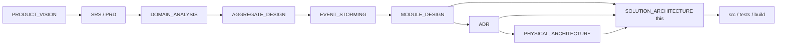

| Document | What it owns | How this SAS uses it |
|----------|--------------|----------------------|
| PRODUCT_VISION | Why the product exists; anti-goals; personas | Constrains what must not appear as modules or Shared Kernel junk drawers |
| SRS / PRD | Requirements and journeys | Folder and API structure must enable required journeys without inventing parallel domains |
| DOMAIN_ANALYSIS | Ubiquitous language and domains | Module folder names and schemas follow domain language |
| AGGREGATE_DESIGN | Aggregate roots and invariants | Domain project folder trees host aggregates; transaction boundaries respected in Application handlers |
| EVENT_STORMING | Commands, events, policies, read models | Application Commands/Queries/Events folders mirror storming vocabulary |
| MODULE_DESIGN | Bounded contexts, contracts, ops rules | **Primary structural parent** — SAS expands solution/project/folder detail without changing module set or dependency matrix |
| ADR | Binding technology and pattern decisions | SAS implements ADR-001..020 as concrete project and registration structure |
| PHYSICAL_ARCHITECTURE | Processes, networks, storage, deploy | SAS maps physical concerns onto `deployment/`, `build/`, configuration, MinIO bucket conventions, Hangfire job folders |

### How Developers Use This Document

1. **Scaffolding a greenfield workspace or completing the target structure:** Follow Section 2 (repository layout), Section 3 (source design), Section 4 (per-module trees), Section 17 (project reference matrix). Create projects and folders exactly as specified before writing business logic.
2. **Adding a feature inside an existing module:** Locate the module in Section 4; place Commands, Queries, Validators, Domain events, Infrastructure adapters, and Contracts updates in the prescribed folders; follow coding conventions in Section 16.
3. **Adding a new module:** Use Appendix C checklist; do not invent alternate layering.
4. **Debugging dependency violations:** Use Section 6 matrix and Architecture.Tests expectations in Section 14.
5. **Wiring DI, config, logging, jobs, storage:** Use Sections 7–12; do not register module services ad hoc in `Program.cs` without the module’s `Add{Module}Module()` extension.
6. **Release and CI questions:** Use Section 15; PHYSICAL_ARCHITECTURE remains authoritative for runtime topology.

### Non-Goals of This Document

- This is **not** a tutorial on Clean Architecture, CQRS, or DDD.
- This is **not** a substitute for AGGREGATE_DESIGN invariants or EVENT_STORMING command catalogs.
- This is **not** a physical deployment runbook (see PHYSICAL_ARCHITECTURE).
- This document **does not** authorize generating application source under `src/` as part of documentation workstreams; it specifies structure for implementers.

---

# 1. Solution Intent

## 1.1 What `Agriculture.sln` Defines

`Agriculture.sln` is the **single authoritative Visual Studio / `dotnet` solution** for the Agriculture Management System backend and its test/build companions. It defines:

1. **One composition-root host** — `Agriculture.Api` — that loads all business modules at process start (ADR-001 Modular Monolith).
2. **One Shared Kernel and Building Blocks set** — primitives and platform abstractions shared across modules without leaking domain types.
3. **Thirteen business module families** — Identity, Producers, Lands, Seasons, Workflows, Tasks, Inspections, Harvest (including Delivery capability), Support, Notifications, Communication, Reporting, Administration — each with Domain / Application / Infrastructure / Contracts projects as prescribed by MODULE_DESIGN.
4. **Test projects** that enforce unit correctness, integration behavior, architectural dependency rules, and selected performance baselines.
5. **Explicit exclusion** of React (`frontend/`) and React Native (`mobile/`) from the .NET solution file while keeping them first-class in the **repository** layout (clients consume HTTP/SignalR; they are not modules inside the monolith).

### Solution naming justification: `Agriculture.sln` (not `AgricultureManagement.sln`)

| Option | Pros | Cons | Decision |
|--------|------|------|----------|
| `Agriculture.sln` | Matches existing repo scaffold; short assembly/product prefix `Agriculture.*`; aligns with `Agriculture.Api`, `Agriculture.Modules.*` | Slightly less descriptive for outsiders | **Accepted (authoritative)** |
| `AgricultureManagement.sln` | Matches full product marketing name | Diverges from existing `Agriculture.sln` and project prefixes; forces mass rename | Rejected for v1.0 SAS |

**Reasoning:** Consistency with MODULE_DESIGN namespaces (`Agriculture.Modules.{Name}.*`) and the existing solution file outweighs marketing-name verbosity. Product documentation may continue to say “Agriculture Management System”; code and solution artifacts use the `Agriculture` prefix.

## 1.2 Implementation-Ready Goal

When this document is followed, a team can:

- Create or complete every `.csproj` with correct `ProjectReference` edges.
- Place every new type in a predictable folder and namespace without Architecture Board consultation for routine features.
- Register modules via standardized DI extensions.
- Configure Dev/Staging/Prod without inventing new config keys per feature.
- Add Hangfire jobs, MinIO object paths, Serilog enrichers, and SignalR hubs in owned locations.
- Pass Architecture.Tests that encode Section 6 dependency rules.
- Extract a module later (MODULE_DESIGN §10) because Contracts, schemas, and folder ownership were never entangled.

The SAS is therefore a **scaffolding and governance contract**, not an optional style guide.

## 1.3 Alignment with Modular Monolith

Per ADR-001 and MODULE_DESIGN §2.1:

- **One deployable process** hosts all modules.
- **Module boundaries** are enforced by project references, Contracts-only cross-module coupling, schema-per-module, and architecture tests — not by separate processes on day one.
- **Clean Architecture** inside each module (ADR-002) keeps Domain free of ASP.NET, EF Core, Hangfire, MinIO, and FCM SDKs.
- **CQRS + MediatR** (ADR-003, ADR-004) structure Application folders into Commands and Queries with pipeline behaviors.
- **Physical separation** of SQL Server, MinIO, Seq, and reverse proxy remains outside the solution’s business projects but is reflected in `deployment/`, configuration, and Infrastructure adapters (PHYSICAL_ARCHITECTURE).

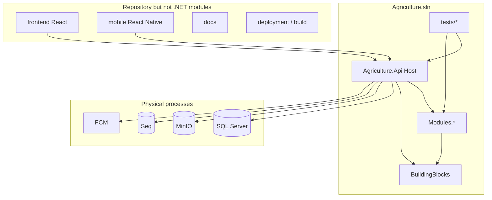

## 1.4 What Success Looks Like for Solution Structure

| Success criterion | Observable evidence |
|-------------------|---------------------|
| Clear ownership | Every project folder maps to Host Owner, Shared Kernel Steward, or a Module Owner |
| Acyclic references | `dotnet build Agriculture.sln` with ProjectReferences forming a DAG; Architecture.Tests green |
| Extractability | No cross-schema FKs; no Domain→Domain references across modules; Contracts packages could become NuGet later |
| Operability | Configuration, logging, jobs, health checks live in known Host folders |
| Municipal auditability | Audit and security concerns have dedicated Shared Kernel / Identity / Administration homes |
| No god folders | No `Common`, `Helpers`, or `Utils` dumping grounds that accumulate domain types |

## 1.5 Anti-Patterns Explicitly Rejected at Solution Level

1. **Single `Agriculture.Domain` project** shared by all modules — rejected (collapses bounded contexts).
2. **Shared EF `AppDbContext` with all entities** — rejected (ADR-016 schema-per-module; MODULE_DESIGN §2.5).
3. **Controllers calling repositories directly** — rejected (ADR-004 MediatR; thin API).
4. **Frontend or mobile projects inside module folders** — rejected (clients are separate deployables).
5. **Putting Delivery as a separate top-level module prematurely** — rejected for v1 (MODULE_DESIGN §6.8 nests Delivery inside Harvest module with separate aggregates/schemas).
6. **Expanding Shared Kernel with Producer/Land/Task types** — rejected (MODULE_DESIGN §3.1).
7. **Referencing another module’s Infrastructure from Application** — rejected (Section 6).

## 1.6 Ownership Model for the Solution

| Role | Owns | Does not own |
|------|------|--------------|
| Architecture Board | Dependency rules, Shared Kernel membership, new modules, ADR acceptance | Day-to-day feature code |
| Host Owner | `Agriculture.Api`, host middleware, global DI composition order, Swagger, health, Hangfire dashboard auth | Module business invariants |
| Shared Kernel Steward | `Agriculture.SharedKernel`, breaking-change review for primitives | Module-specific VOs that only look “shared” |
| Building Blocks Owner | `Application.Abstractions`, `Agriculture.Infrastructure` (building block) | Module Infrastructure implementations |
| Module Owner | All projects under `src/Modules/{Name}/` | Foreign module schemas and Domains |
| Test Architecture Owner | `Architecture.Tests` rules mirroring Section 6 | Feature-level unit tests (module owners) |
| DevOps Owner | `build/`, `deployment/`, `.github/`, release scripts | Application folder layout inside modules |

---

# 2. Top-Level Repository Layout

## 2.1 Authoritative Tree

```text
/
├── Agriculture.sln
├── README.md
├── .gitignore
├── .editorconfig
├── Directory.Build.props
├── Directory.Packages.props                 # optional central package management
├── global.json                             # SDK pin
├── src/
│   ├── Hosts/
│   │   └── Agriculture.Api/
│   ├── BuildingBlocks/
│   │   ├── Agriculture.SharedKernel/
│   │   ├── Agriculture.Application.Abstractions/
│   │   └── Agriculture.Infrastructure/
│   └── Modules/
│       ├── Identity/
│       ├── Producers/
│       ├── Lands/
│       ├── Seasons/
│       ├── Workflows/
│       ├── Tasks/
│       ├── Inspections/
│       ├── Harvest/                        # includes Delivery capability
│       ├── Support/
│       ├── Notifications/
│       ├── Communication/
│       ├── Reporting/
│       └── Administration/
├── tests/
│   ├── Architecture.Tests/
│   ├── Api.IntegrationTests/
│   ├── Performance.Tests/
│   └── Modules.{Name}.UnitTests / IntegrationTests (per module as needed)
├── docs/
├── scripts/
├── build/
├── deployment/
├── .github/
├── frontend/
└── mobile/
```

## 2.2 Root Files — Purpose, Ownership, Forbidden Content

### `Agriculture.sln`

- **Why:** Single entry for IDE and CI `dotnet build` / `dotnet test`.
- **Owner:** Host Owner + Architecture Board for project inclusion.
- **Belongs:** All backend `.csproj` projects and test projects that compile against them.
- **Never:** Frontend/npm projects; binary artifacts; generated migration SQL dumps as solution items cluttering the tree (keep under module Infrastructure/Persistence/Migrations).

### `README.md` (repository root)

- **Why:** Onboarding pointer to docs index, how to run `docker compose`, how to build.
- **Owner:** Host Owner / DevOps.
- **Belongs:** Short getting-started; links to `docs/README.md`.
- **Never:** Full architecture prose (belongs in `docs/`).

### `.editorconfig` / `Directory.Build.props` / `Directory.Packages.props` / `global.json`

- **Why:** Enforce language version, nullable, analyzers, central package versions, SDK pin for municipal reproducibility.
- **Owner:** Host Owner with Architecture Board for analyzer severity that blocks PRs.
- **Belongs:** Shared MSBuild properties (`TreatWarningsAsErrors` policy, `LangVersion`, `Nullable`), package versions.
- **Never:** Module-specific business constants; connection strings; secrets.

### `.gitignore`

- **Why:** Exclude `bin/`, `obj/`, `.vs/`, user secrets, local `appsettings.*.local.json`, IDE junk, frontend `node_modules`.
- **Never:** Ignore `docs/` or `.github/workflows/` by accident.

## 2.3 `src/` — Why It Exists

**Purpose:** All production .NET source for the modular monolith and its building blocks.

**Owner:** Collective module owners under Host Owner coordination.

**Belongs:** Hosts, BuildingBlocks, Modules only.

**Never:**
- Test projects (use `tests/`).
- Deployment manifests (use `deployment/`).
- Product documentation (use `docs/`).
- React/React Native (use `frontend/`, `mobile/`).
- One-off spike consoles that bypass module boundaries (use `scripts/` or disposable branches, not lasting `src/Tools` god folders without Board approval).

**Reasoning:** Separating `src/` from `tests/` and `docs/` mirrors enterprise .NET layouts and keeps CI path filters simple (`src/**` vs `tests/**`).

## 2.4 `tests/` — Why It Exists

**Purpose:** All automated verification assemblies.

**Owner:** Module owners for module tests; Test Architecture Owner for `Architecture.Tests`; Host Owner for `Api.IntegrationTests`.

**Belongs:** Unit, Integration, Architecture, Performance projects.

**Never:** Production runtime code; shared “test domain models” that become a backdoor Shared Kernel for production types; copying entire Infrastructure into tests as a parallel module.

## 2.5 `docs/` — Why It Exists

**Purpose:** Authoritative product and architecture documentation set.

**Owner:** Document owners listed in each file’s front matter; Architecture Board for structural docs.

**Belongs:** PRODUCT_VISION, SRS, PRD, DOMAIN_ANALYSIS, AGGREGATE_DESIGN, EVENT_STORMING, MODULE_DESIGN, ADR, PHYSICAL_ARCHITECTURE, SOLUTION_ARCHITECTURE (this), README index.

**Never:** Generated API Swagger dumps as the only API contract (OpenAPI is generated from code; docs describe intent); secrets; environment-specific passwords.

## 2.6 `scripts/` — Why It Exists

**Purpose:** Developer and operator helper scripts that are **not** part of the compiled product.

**Owner:** DevOps Owner + Host Owner.

**Belongs:**
- `scripts/dev/up.sh` — compose up helpers.
- `scripts/db/migrate-module.sh` — apply module migrations with explicit module argument.
- `scripts/secrets/check-no-secrets.sh` — CI helper.
- `scripts/codegen/` — optional OpenAPI client generation for frontend (if adopted).
- One-off data repair scripts versioned with peer review.

**Never:** Business rules implemented only in bash/PowerShell; long-lived production job logic (that belongs in Hangfire module Infrastructure); committing `.pfx` or connection strings.

## 2.7 `build/` — Why It Exists

**Purpose:** Build-time assets consumed by CI: Dockerfiles for the API image, NuGet config if private feeds exist, SBOM generation hooks, version stamping props.

**Owner:** DevOps Owner.

**Belongs:**
- `build/docker/Dockerfile.api`
- `build/docker/Dockerfile.api.worker` (optional future `RUN_MODE=worker` split per PHYSICAL_ARCHITECTURE)
- `build/versioning/`
- `build/analyzers/` (optional custom analyzer packages)

**Never:** Runtime `appsettings.Production.json` secrets; municipal customer data; terraform state.

## 2.8 `deployment/` — Why It Exists

**Purpose:** Runtime composition for environments: Compose files, reverse proxy config, Kubernetes manifests (future), environment templates.

**Owner:** DevOps Owner; security review for prod overlays.

**Belongs:**
- `deployment/compose/docker-compose.yml` (dev parity: API + SQL + MinIO + Seq)
- `deployment/compose/docker-compose.override.yml`
- `deployment/proxy/nginx.conf` or Traefik labels
- `deployment/k8s/` (Stage 3 per PHYSICAL_ARCHITECTURE — may start empty with README placeholder)
- `deployment/env/*.env.example` (no real secrets)

**Never:** Real production secrets; developer personal overrides committed as defaults; application C# code.

## 2.9 `.github/` — Why It Exists

**Purpose:** GitHub Actions workflows and org automation for this repository.

**Owner:** DevOps Owner.

**Belongs:**
- `.github/workflows/ci.yml` — build, test, architecture tests, container scan
- `.github/workflows/release.yml` — tag, publish image, migration gate notes
- `.github/CODEOWNERS` — module path ownership
- `.github/pull_request_template.md` — includes architecture checklist from MODULE_DESIGN §11.2

**Never:** Storing deploy passwords in workflow files; disabling security scans silently.

## 2.10 `frontend/` — Why It Exists

**Purpose:** React SPA for municipal officers, admins, inspectors (web).

**Owner:** Frontend lead (separate from .NET module owners; consumes published API).

**Belongs:** React app source, web packaging, web-specific CI if split later.

**Never:** Duplicating domain invariants; calling SQL; embedding JWT signing keys; treating the SPA as a “module” under `src/Modules`.

## 2.11 `mobile/` — Why It Exists

**Purpose:** React Native clients for field producers/inspectors; FCM device token registration against Notifications/Identity APIs.

**Owner:** Mobile lead.

**Belongs:** RN app source, store release config templates.

**Never:** Direct MinIO credentials in the app (use API-mediated upload / presigned URLs per ADR-010); long-lived secrets; SignalR-only push as substitute for FCM (ADR-009).

## 2.12 Directory Ownership Summary Table

| Directory | Primary Owner | Secondary | Forbidden examples |
|-----------|---------------|-----------|--------------------|
| `src/Hosts` | Host Owner | Security reviewer | Aggregate invariants |
| `src/BuildingBlocks` | Shared Kernel Steward / BB Owner | Architecture Board | `Producer` entity |
| `src/Modules/{X}` | Module Owner X | Host Owner (DI registration shape) | Other module’s DbContext |
| `tests` | Per-project owners | Test Architecture Owner | Production endpoints |
| `docs` | Doc owners | Architecture Board | Secrets |
| `scripts` | DevOps | Host Owner | Core business logic |
| `build` | DevOps | Security | Prod passwords |
| `deployment` | DevOps | Security | Real `.env` secrets |
| `.github` | DevOps | CODEOWNERS | Unreviewed workflow secrets |
| `frontend` | Frontend lead | API contract consumers | Server-side EF |
| `mobile` | Mobile lead | Notifications owner (push UX) | Hardcoded FCM server keys |

## 2.13 Repository Boundary Rules

1. **One git repository** for modular monolith + docs + clients is accepted for MVP (ADR-020 municipal simplicity). Split frontend/mobile repos only if release cadence or staffing demands it — requires ADR.
2. **Path-based CODEOWNERS** must mirror module folders so PRs cannot silently change foreign Domains.
3. **Large binary assets** (sample farm photos for demos) belong in MinIO fixtures or LFS with Board approval — not unbounded commits under `src/`.

---

# 3. Source Folder Design

## 3.1 `src/Hosts/Agriculture.Api`

### Why this project exists

`Agriculture.Api` is the **composition root** and the only ASP.NET Core executable for business traffic in the near-term topology (ADR-001, PHYSICAL_ARCHITECTURE §3.1). It:

- Builds the HTTP pipeline (HTTPS termination typically at reverse proxy; Kestrel internal).
- Registers JWT authentication/authorization (ADR-013/014).
- Calls each module’s `Add{Module}Module()` extension.
- Maps controllers (or thin endpoint modules), SignalR hubs, Hangfire dashboard, health endpoints, Swagger.
- Hosts Hangfire Server in-process initially (ADR-007).
- Configures Serilog and Seq sinks (ADR-011/012).

### Ownership

Host Owner. Module owners may contribute endpoint classes **only** if the chosen style places thin controllers under Host with `Partial` organization by feature area, or module-owned endpoint extensions invoked from Host — both allowed by MODULE_DESIGN §2.1 (“Controllers/Minimal APIs in Host or thin module endpoints referenced by Host”). **Authoritative v1.0 SAS choice:** Controllers and hub mapping live under `Agriculture.Api` folders; modules expose Application commands only. This keeps HTTP transport out of Domain/Application and matches namespace convention `Agriculture.Api.Controllers`.

### What belongs here

- `Program.cs` / minimal hosting setup.
- `appsettings*.json` templates.
- Controllers, Middleware, Filters, Auth Policies registration, Swagger config, Health Checks, Hub mapping.
- Host-level exception middleware aligning ADR-018.
- Composition-only glue.

### What must never go here

- Aggregate classes, domain services, EF entity configurations for business tables.
- Direct SQL to foreign module schemas for “convenience.”
- FCM SDK calls in controllers (use Notifications + Hangfire).
- Business validation beyond HTTP input shaping (FluentValidation belongs to Application pipeline).

### Internal folder sketch (detail in Section 12)

```text
Agriculture.Api/
  Controllers/
  Hubs/
  Middleware/
  Filters/
  Auth/
  Extensions/
  Configuration/
  Health/
  Properties/
  wwwroot/                    # only if hosting SPA fallback is approved; prefer separate frontend deploy
  Program.cs
  appsettings.json
  appsettings.Development.json
  appsettings.Staging.json
  appsettings.Production.json
```

## 3.2 `src/BuildingBlocks/Agriculture.SharedKernel`

### Why

Holds **true cross-module primitives** only (MODULE_DESIGN §3). Enables consistent identity of entities, audit fields, Result types, domain event marker interfaces, pagination primitives, and guard helpers without creating a distributed monolith of shared entities.

### Ownership

Shared Kernel Steward; Architecture Board for additions.

### Belongs / Never

See Section 13 for the complete catalog. Summary: Entity, AggregateRoot, AuditableEntity, Result/Error, IDomainEvent, pagination, specification base (optional), enumeration base, common technical exceptions — **not** Producer, Task, Harvest, permission catalogs for all modules, or orchestrators.

## 3.3 `src/BuildingBlocks/Agriculture.Application.Abstractions`

### Why

Platform messaging and application ports shared by all module Application projects: `ICommand`, `IQuery`, `ICommandHandler`, `IQueryHandler`, pipeline behavior interfaces, `IUserContext`, `IUnitOfWork` abstractions, optional `IDateTimeProvider`.

### Ownership

Building Blocks Owner.

### Belongs

Messaging marker interfaces used with MediatR; common behavior interfaces; user context abstraction for authorization filters inside handlers.

### Never

Module DTOs; EF types; concrete UnitOfWork for a specific DbContext (those live in module Infrastructure or building-block Infrastructure helpers).

### Reasoning

Separating SharedKernel (domain primitives) from Application.Abstractions (application messaging) prevents Domain projects from taking a dependency on MediatR or CQRS markers if Domain should stay free of application-layer concepts. Domain references SharedKernel only. Application references SharedKernel + Application.Abstractions.

## 3.4 `src/BuildingBlocks/Agriculture.Infrastructure`

### Why

Shared infrastructure utilities: EF Core interceptor helpers, outbox base types, MinIO client wrapper interfaces’ default implementations hooks, Serilog enricher helpers, JWT user context adapter implementing `IUserContext`, health check registration helpers.

### Ownership

Building Blocks Owner; Host Owner consumes registration extensions.

### Belongs

Reusable adapters that do not own business schemas.

### Never

`ProducersDbContext` or any module schema; Hangfire job classes for Tasks module; feature flags business rules.

## 3.5 `src/Modules/{Name}/` — Why each module family folder exists

Each business module is a **directory grouping four projects** (Contracts recommended as mandatory for target architecture even where optional in prose):

```text
src/Modules/{Name}/
  Agriculture.Modules.{Name}.Domain/
  Agriculture.Modules.{Name}.Application/
  Agriculture.Modules.{Name}.Infrastructure/
  Agriculture.Modules.{Name}.Contracts/
```

**Why group under a folder:** Solution Explorer clarity; CODEOWNERS path; schema ownership documentation; matches MODULE_DESIGN §5.1.

**Harvest special case:** Delivery is **not** a sibling folder under `Modules/`; Delivery aggregates, application features, and `delivery` schema live inside `Modules/Harvest/` (MODULE_DESIGN §6.8). Folder names inside Harvest Application may include `Features/Deliveries/` for clarity.

## 3.6 Optional `src/Infrastructure/Common/Configurations` — Clarification

Some enterprise templates place a top-level `Infrastructure/Common`. **This repository’s authoritative layout does not invent a second infrastructure root beside BuildingBlocks.** Shared configuration binders and options types belong in:

- `Agriculture.Infrastructure` (building block) for cross-cutting options (`MinioOptions`, `JwtOptions`, `SeqOptions`, `HangfireOptions`), or
- `Agriculture.Api/Configuration` for host binding, or
- Module `Infrastructure/Options` for module-specific options (`TasksJobOptions`).

**Reasoning:** Avoid two “common infrastructure” homes that drift. PHYSICAL_ARCHITECTURE configuration layer maps to Host + BuildingBlocks + module Options folders.

## 3.7 Project-to-Assembly Naming

| Project | Assembly / Root Namespace |
|---------|---------------------------|
| Agriculture.Api | `Agriculture.Api` |
| Agriculture.SharedKernel | `Agriculture.SharedKernel` |
| Agriculture.Application.Abstractions | `Agriculture.Application.Abstractions` |
| Agriculture.Infrastructure | `Agriculture.Infrastructure` |
| Agriculture.Modules.{N}.Domain | `Agriculture.Modules.{N}.Domain` |
| Agriculture.Modules.{N}.Application | `Agriculture.Modules.{N}.Application` |
| Agriculture.Modules.{N}.Infrastructure | `Agriculture.Modules.{N}.Infrastructure` |
| Agriculture.Modules.{N}.Contracts | `Agriculture.Modules.{N}.Contracts` |

`RootNamespace` and `AssemblyName` must match project name unless Board approves otherwise (strong-name scenarios are out of scope for municipal MVP).

## 3.8 Solution Folders (Virtual)

Inside `Agriculture.sln`, use solution folders mirroring disk:

- `src/Hosts`
- `src/BuildingBlocks`
- `src/Modules/Identity` … `Administration`
- `tests`

Solution folders are navigational; disk layout remains authoritative for CI.

---


# 4. Module Structure (Every Business Module)

## 4.0 Canonical Module Project Interior

Every business module follows the same interior shape. Module-specific deviations are called out only where MODULE_DESIGN requires them (notably Harvest+Delivery, Notifications as sink, Reporting as read-heavy).

### 4.0.1 Standard folder tree (target)

```text
src/Modules/{Name}/
  Agriculture.Modules.{Name}.Domain/
    Entities/
    Aggregates/                         # optional alias; Entities may hold roots
    ValueObjects/
    Events/                             # domain events
    Enums/
    Exceptions/
    Services/                           # pure domain services
    Repositories/                       # repository interfaces (ports)
    Specifications/                     # optional
  Agriculture.Modules.{Name}.Application/
    Commands/
      {Feature}/
        {Command}.cs
        {Command}Handler.cs
    Queries/
      {Feature}/
        {Query}.cs
        {Query}Handler.cs
    DTOs/
    Validators/                         # FluentValidation; may co-locate with feature
    Policies/                           # event-driven application policies
    EventHandlers/                      # integration/domain event handlers in-module
    Abstractions/                       # module ports not published as Contracts
    Mappings/                           # AutoMapper profiles or manual mappers
    Features/                           # optional vertical-slice grouping (Board-accepted with Domain intact)
    Authorization/                      # permission constants local to module
    DependencyInjection/
      {Name}ApplicationServiceCollectionExtensions.cs
  Agriculture.Modules.{Name}.Infrastructure/
    Persistence/
      {Name}DbContext.cs
      Configurations/                   # IEntityTypeConfiguration
      Migrations/
      Outbox/
    Repositories/
    Services/                           # adapters implementing Application ports
    Jobs/                               # Hangfire job entrypoints for this module
    Storage/                            # MinIO path builders for this module
    Options/
    DependencyInjection/
      {Name}ModuleServiceCollectionExtensions.cs   # Add{Name}Module()
  Agriculture.Modules.{Name}.Contracts/
    Events/                             # integration events (versioned)
    Abstractions/                       # IXxxReadService / IXxxGateway
    Ids/                                # optional strongly typed IDs
```

### 4.0.2 Layer ownership and file placement rules

| Layer | Owner role | May reference | Must not contain |
|-------|------------|---------------|------------------|
| Domain | Module Owner | SharedKernel only | EF attributes required for persistence; HTTP; Hangfire; MediatR handlers |
| Application | Module Owner | Domain, Contracts (own + consumed), Application.Abstractions, SharedKernel | EF DbContext; MinIO SDK; controller types |
| Infrastructure | Module Owner | Application, Domain, Contracts (own), BuildingBlocks.Infrastructure, EF, Hangfire, MinIO client | Foreign module Domain/Infrastructure |
| Contracts | Module Owner | SharedKernel; optionally messaging markers if Board-approved | Concrete repositories; DbContext; handlers |

### 4.0.3 Features vs classic folders

ADR-002 accepts vertical slices **inside Application** (command/handler folders) on top of a real Domain layer. Teams may use either:

- `Application/Commands/CompleteTask/CompleteTaskCommand.cs` + handler + validator beside it, or
- `Application/Features/Tasks/Complete/…`

Both are valid if namespaces remain discoverable and Architecture.Tests still pass. **Do not** dissolve Domain into feature folders.

### 4.0.4 Persistence project note

MODULE_DESIGN allows persistence inside Infrastructure. A separate `*.Persistence` csproj is **not** required for v1.0. If a module’s Infrastructure becomes oversized, Board may approve splitting Persistence — until then, use `Infrastructure/Persistence`.

### 4.0.5 Mermaid — standard module compile graph

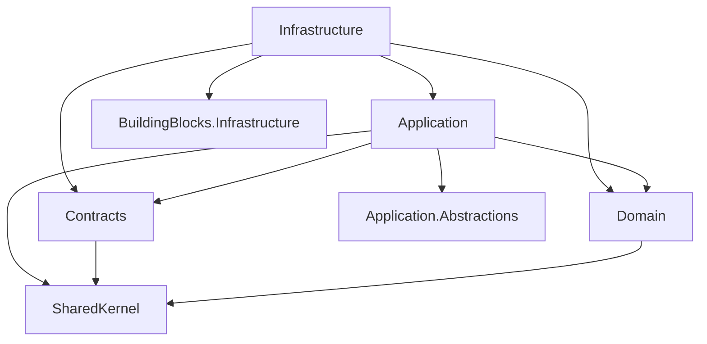

---

## 4.1 Identity Module

### Business placement

Security source of truth for authentication and authorization (MODULE_DESIGN §6.1). Schema: `identity`.

### Project set

- `Agriculture.Modules.Identity.Domain`
- `Agriculture.Modules.Identity.Application`
- `Agriculture.Modules.Identity.Infrastructure`
- `Agriculture.Modules.Identity.Contracts`

### Domain tree and ownership

```text
Domain/
  Entities/
    User.cs                          # Aggregate root
    RefreshToken.cs
    LoginHistory.cs
    PasswordHistory.cs
    Role.cs                          # if modeled as entity/aggregate
    Permission.cs
    UserRole.cs
    RolePermission.cs
    PermissionOverride.cs
  ValueObjects/
    Email.cs
    PhoneNumber.cs
    FullName.cs
    Address.cs                       # account address — do not reuse Producer Address blindly
    PasswordHash.cs
    TokenFamilyId.cs
  Events/
    UserRegistered.cs
    UserUpdated.cs
    UserDeactivated.cs
    RoleAssigned.cs
    RoleRemoved.cs
    PasswordChanged.cs
    UserLoggedIn.cs
    UserLoggedOut.cs
    RefreshTokenCreated.cs
    RefreshTokenRevoked.cs
  Enums/
    UserStatus.cs
  Exceptions/
    InvalidCredentialsException.cs   # prefer Result in Application; domain exceptions sparingly
    TokenReuseDetectedException.cs
  Services/
    PasswordComplexityPolicy.cs
    TokenFamilyRotationRules.cs
  Repositories/
    IUserRepository.cs
    IRoleRepository.cs
    IRefreshTokenStore.cs
```

**Namespace examples:**
- `Agriculture.Modules.Identity.Domain.Entities`
- `Agriculture.Modules.Identity.Domain.ValueObjects`
- `Agriculture.Modules.Identity.Domain.Events`
- `Agriculture.Modules.Identity.Domain.Repositories`

**Ownership:** Identity Module Owner. Shared Kernel Steward reviews only if a VO is proposed for promotion to SharedKernel (usually rejected for Address/Email divergence).

### Application tree

```text
Application/
  Commands/
    RegisterUser/
    UpdateUser/
    DeactivateUser/
    AssignRole/
    RemoveRole/
    Login/
    Logout/
    RefreshToken/
    ChangePassword/
    ResetPassword/
    GrantPermissionOverride/
    RevokePermissionOverride/
  Queries/
    GetUserById/
    GetUsers/
    GetRoles/
    GetPermissionMatrix/
    GetLoginHistory/
    GetMyProfile/
  DTOs/
    UserDto.cs
    RoleDto.cs
    PermissionDto.cs
    AuthTokenResponse.cs
    LoginHistoryDto.cs
  Validators/
  Policies/
    PasswordChangedRevokeTokensPolicy.cs
  EventHandlers/
  Abstractions/
    ITokenService.cs
    IPasswordHasherPort.cs
  Authorization/
    IdentityPermissions.cs           # identity.users.read|create|...
  DependencyInjection/
```

**Reasoning:** Login/RefreshToken are Application commands even though they feel infrastructural — token issuance rules and password checks must be testable without controllers. JWT cryptographic signing is Infrastructure implementing `ITokenService`.

### Infrastructure tree

```text
Infrastructure/
  Persistence/
    IdentityDbContext.cs
    Configurations/
    Migrations/
    Outbox/
  Repositories/
  Services/
    JwtTokenService.cs
    PasswordHasherAdapter.cs
  Jobs/
    PurgeExpiredRefreshTokensJob.cs
  Options/
    JwtOptions.cs                    # may bind from Host Jwt section via BB options
  DependencyInjection/
    IdentityModuleServiceCollectionExtensions.cs
```

### Contracts tree

```text
Contracts/
  Events/
    UserRegisteredV1.cs
    UserDeactivatedV1.cs
    RoleAssignedV1.cs
  Abstractions/
    IUserDirectory.cs
    IPermissionChecker.cs            # optional centralized
```

### Resources / Configurations / Mappings

- **Resources:** Identity rarely needs localized string resources in Domain; put email template keys in Notifications. If Identity needs data annotations messages, use Application resources sparingly.
- **Configurations:** EF Fluent API under Persistence/Configurations — no Data Annotations that force Infrastructure concepts into Domain if avoidable.
- **Mappings:** Application/Mappings or handler-local mapping from User → UserDto.

### What must never live in Identity

Producer profile fields; land parcels; notification template bodies; Administration municipal settings (feature flags live in Administration).

### DI registration sketch

`AddIdentityModule(IConfiguration)` registers DbContext with schema `identity`, MediatR handlers from Application assembly, FluentValidation validators, `IUserDirectory` implementation, Hangfire recurring purge job.

---

## 4.2 Producers Module

### Business placement

Central producer registry (MODULE_DESIGN §6.2). Schema: `producers`. Histories for support/inspection/harvest are **projections**, not mandatory aggregate children in the module target.

### Domain highlights

```text
Domain/
  Entities/
    Producer.cs                      # Aggregate root
    ProducerPhoto.cs
    ProducerDocument.cs
    ProducerAddress.cs
    ProducerContact.cs
    ProducerLandAssignment.cs
    ProducerSeasonAssignment.cs
  ValueObjects/
    IdentityNumber.cs
    Phone.cs
    Email.cs
    Address.cs
    BankInformation.cs
  Events/
    ProducerRegistered.cs
    ProducerUpdated.cs
    ProducerAssignedLand.cs
    ProducerAssignedSeason.cs
    ProducerDeactivated.cs
  Repositories/
    IProducerRepository.cs
  Services/
    ProducerRegistrationService.cs   # uniqueness policy pure parts
    ProducerAssignmentService.cs     # invariants; ACL checks invoked from Application
```

**Namespaces:** `Agriculture.Modules.Producers.Domain.Entities`, `.ValueObjects`, `.Events`, `.Repositories`, `.Services`.

### Application highlights

Commands: RegisterProducer, UpdateProducer, AssignLand, UnassignLand, AssignSeason, DeactivateProducer, UploadProducerDocument, UpdateContact.

Queries: GetProducer, GetProducers, GetProducerSeasonHistory, GetProducerSupportSummary, SearchProducers.

**Cross-module:** Application references `Lands.Contracts` and `Seasons.Contracts` for existence/active checks — **never** Lands.Domain.

### Infrastructure highlights

- `ProducersDbContext` schema `producers`.
- MinIO storage helper under `Storage/ProducerObjectPaths.cs` for photos/documents metadata keys.
- Jobs: optional projection rebuilders if read models drift.

### Contracts

- Events: ProducerRegisteredV1, ProducerDeactivatedV1, ProducerAssignedLandV1, …
- Abstractions: `IProducerDirectory` (`ExistsAsync`, `GetSummaryAsync`) — consumed by Tasks and others.

### Folder ownership notes

Document binary bytes never enter SQL; Infrastructure persists MinIO object key + hash + content-type on ProducerDocument entity.

---

## 4.3 Lands Module

### Business placement

Authoritative land parcel registry (MODULE_DESIGN §6.3). Schema: `lands`. Not a GIS platform (anti-goal).

### Domain tree

```text
Domain/
  Entities/
    Land.cs                          # Aggregate root
    LandCoordinate / parcel children as per AGGREGATE_DESIGN
    LandDocument.cs                  # metadata only
  ValueObjects/
    ParcelIdentifier.cs
    Area.cs
    GeoCoordinate.cs                 # simple; not a GIS engine
  Events/
    LandRegistered.cs
    LandUpdated.cs
    LandArchived.cs
    ProducerAssigned.cs              # domain naming; integration may differ
    SeasonAssigned.cs
  Enums/
    LandStatus.cs
  Repositories/
    ILandRepository.cs
```

### Application

Commands: RegisterLand, UpdateLand, ArchiveLand, AssignProducer, AssignSeason (assignment records as owned by Lands per aggregate design — coordinate with Producers via events/contracts to avoid dual authority; follow MODULE_DESIGN matrix: Producers and Lands collaborate via Contracts/events, not shared tables).

Queries: GetLand, SearchLands, GetLandsByProducer (read model may denormalize producer id).

### Infrastructure

`LandsDbContext`; EF configurations; optional spatial types only if Board approves SQL Server geography — default store coordinates as decimals/strings per simplicity unless SRS demands otherwise.

### Contracts

`ILandDirectory`, `LandArchivedV1`, `LandRegisteredV1`.

### Never

Deep GIS analysis libraries as Domain dependencies; cross-schema FK to `producers` tables.

---

## 4.4 Seasons Module

### Business placement

Season lifecycle and calendar (MODULE_DESIGN §6.4). Schema: `seasons`.

### Domain

```text
Domain/
  Entities/
    Season.cs                        # Aggregate root
    SeasonCalendar.cs
    SeasonConfiguration.cs
    SeasonWorkflow.cs                # reference to workflow id + version
  ValueObjects/
    SeasonName.cs
    SeasonPeriod.cs
  Enums/
    SeasonStatus.cs
  Events/
    SeasonCreated.cs
    SeasonStarted.cs
    SeasonCompleted.cs
    SeasonArchived.cs
    WorkflowAssigned.cs
  Repositories/
    ISeasonRepository.cs
```

### Application

Commands: CreateSeason, StartSeason, PauseSeason, CompleteSeason, ArchiveSeason, AssignWorkflow.

Queries: GetSeason, GetActiveSeasons, GetSeasonTimeline (read model).

**Contracts used:** Workflows.Contracts for workflow existence/version; Inspections.Contracts gate before critical transitions where MODULE_DESIGN requires.

### Infrastructure

Jobs: season closing reminders → publish notification requests; timeline projection refreshers.

### Contracts

`ISeasonCalendarReadService`, `SeasonStartedV1`, `SeasonCompletedV1`.

---

## 4.5 Workflows Module

### Business placement

Workflow definitions, versions, step ordering (MODULE_DESIGN §6.5). Schema: `workflows`.

### Domain

```text
Domain/
  Entities/
    Workflow.cs                      # Aggregate root
    WorkflowStep.cs
    WorkflowCondition.cs
    WorkflowRule.cs
    WorkflowVersion.cs
  Enums/
    WorkflowStatus.cs
    WorkflowType.cs
  Events/
    WorkflowCreated.cs
    WorkflowPublished.cs
    WorkflowArchived.cs
    WorkflowStarted.cs
    WorkflowStepAdvanced.cs
    WorkflowCompleted.cs
  Services/
    WorkflowSequencingService.cs     # cannot skip steps
  Repositories/
    IWorkflowRepository.cs
```

**Invariants encoded here:** at least one step; ordered steps; no skipping — never in controllers.

### Application

Commands: CreateWorkflow, PublishWorkflow, ArchiveWorkflow, AssignWorkflow, StartWorkflow, AdvanceWorkflowStep.

Policies: After WorkflowCompleted → Harvest eligibility integration event.

### Infrastructure

Persistence for versioned graphs; jobs rarely mutate definitions; instance advancement may be command-driven from Tasks completion policies.

### Contracts

`IWorkflowGateway` (get published definition summary), `WorkflowCompletedV1`, `WorkflowStepAdvancedV1`.

### Coupling note

Workflows ↔ Tasks is bidirectional at the **Contracts/events** level only (MODULE_DESIGN matrix). No project reference from Workflows.Domain to Tasks.Domain.

---

## 4.6 Tasks Module

### Business placement

Task instances assigned to users/producers for execution (MODULE_DESIGN §6.6). Schema: `tasks`. High churn; indexes mandatory per ADR index guidance.

### Domain

```text
Domain/
  Entities/
    TaskItem.cs                      # name carefully — avoid clash with System.Threading.Tasks; prefer AgriculturalTask or WorkTask type name TaskAggregate root "Task" in ubiquitous language with CLR name `WorkTask` or `ProducerTask` if needed
    TaskAssignment.cs
    TaskChecklistItem.cs
    TaskPhoto.cs                     # metadata
    TaskComment.cs
  Enums/
    TaskStatus.cs
  Events/
    TaskCreated.cs
    TaskAssigned.cs
    TaskCompleted.cs
    TaskCancelled.cs
    TaskOverdue.cs
  Repositories/
    ITaskRepository.cs
```

**Naming convention decision for SAS:** CLR type `WorkTask` in `Entities/WorkTask.cs` with ubiquitous language “Task” in docs and API routes `/api/tasks`. Reasoning: avoid `Task` vs `System.Threading.Tasks.Task` using alias hell in handlers.

### Application

Commands: CreateTask, AssignTask, CompleteTask, CancelTask, ReopenTask (if allowed), AttachTaskPhoto.

Queries: GetTask, GetMyTasks, GetTodaysTasks, GetTasksBySeason.

Validators: assignee exists via Identity/Producers contracts; workflow step constraints via Workflows contracts.

### Infrastructure

```text
Jobs/
  SweepOverdueTasksJob.cs
  EmitTaskReminderNotificationsJob.cs
Storage/
  TaskPhotoPaths.cs
```

### Contracts

`ITaskReadModel`, `TaskCompletedV1`, `TaskCreatedV1`.

---

## 4.7 Inspections Module

### Business placement

Inspections gate critical transitions (MODULE_DESIGN §6.7). Schema: `inspections`.

### Domain

```text
Domain/
  Entities/
    Inspection.cs                    # Aggregate root
    InspectionFinding.cs
    InspectionPhoto.cs
    InspectionChecklistResult.cs
  Enums/
    InspectionStatus.cs
    InspectionOutcome.cs
  Events/
    InspectionCreated.cs
    InspectionScheduled.cs
    InspectionCompleted.cs
    InspectionCancelled.cs
  Repositories/
    IInspectionRepository.cs
```

### Application

Commands: CreateInspection, ScheduleInspection, CompleteInspection, CancelInspection.

Queries: GetInspectionQueue, GetInspection.

### Contracts (critical)

`IInspectionGate` with `HasBlockingInspection`, `GetOutcome` — used by Seasons/Workflows/Harvest Application layers before transitions.

### Infrastructure

Evidence photos via MinIO; completed inspection immutability enforced in Domain + Application (soft delete forbidden for completed evidence per MODULE_DESIGN security notes).

---

## 4.8 Harvest Module (including Delivery)

### Justification reminder

One deployable module owning **Harvest** and **Delivery** aggregates; schemas `harvest` and `delivery` both migrated by Harvest Infrastructure (MODULE_DESIGN §6.8). This is **not** a license to merge aggregates into one root.

### Domain tree (dual aggregate)

```text
Domain/
  Entities/
    Harvest.cs                       # Aggregate root
    HarvestProduct.cs
    HarvestPhoto.cs
    HarvestMeasurement.cs
    Delivery.cs                      # Aggregate root (separate)
    DeliveryDocument.cs
    DeliveryInvoice.cs
    DeliveryReceipt.cs
  ValueObjects/
    HarvestDate.cs
    HarvestAmount.cs
    HarvestUnit.cs
    DeliveryDate.cs
    Buyer.cs
    Quantity.cs
    Price.cs
  Events/
    HarvestStarted.cs
    HarvestCompleted.cs
    HarvestCancelled.cs
    DeliveryCreated.cs
    DeliveryCompleted.cs
    DeliveryCancelled.cs
  Services/
    HarvestDeliveryQuantityService.cs  # in-module only; remaining quantity rules
  Repositories/
    IHarvestRepository.cs
    IDeliveryRepository.cs
  Enums/
    HarvestStatus.cs
    DeliveryStatus.cs
```

### Application tree (feature split)

```text
Application/
  Commands/
    Harvests/
      StartHarvest/
      CompleteHarvest/
      CancelHarvest/
      RecordHarvestMeasurement/
    Deliveries/
      CreateDelivery/
      CompleteDelivery/
      CancelDelivery/
      AttachDeliveryDocument/
  Queries/
    Harvests/
    Deliveries/
    SeasonHarvestSummary/
  Validators/
  Policies/
    WorkflowCompletedAllowStartHarvestPolicy.cs
  Abstractions/
```

### Infrastructure

```text
Persistence/
  HarvestDbContext.cs                # may map both schemas harvest + delivery
  Configurations/
    Harvest/
    Delivery/
  Migrations/                        # single migration stream owned by Harvest module
Jobs/
Storage/
  HarvestPhotoPaths.cs
  DeliveryDocumentPaths.cs
```

**Reasoning for one DbContext two schemas:** Same module owner, coordinated transactions for remaining quantity updates via Harvest aggregate method in-module. Still **no FKs** to other modules’ schemas.

### Contracts

`IHarvestEligibilityService`, `IHarvestReadModel`, `IDeliveryReadModel`, integration events HarvestCompletedV1, DeliveryCompletedV1.

### Never

Creating `src/Modules/Delivery` without ADR superseding MODULE_DESIGN §6.8; placing Delivery in Support (Support uses SupportFulfillment naming to avoid confusion).

---

## 4.9 Support Module

### Business placement

Municipal support programs (MODULE_DESIGN §6.9). Schema: `support`. Use **SupportFulfillment**, not SupportDelivery, in code.

### Domain

```text
Entities/
  SupportRequest.cs                  # or SupportApproval aggregate per design
  SupportApproval.cs
  SupportFulfillment.cs
ValueObjects/
  SupportAmount.cs
Events/
  SupportRequested.cs
  SupportApproved.cs
  SupportRejected.cs
  SupportFulfilled.cs
Repositories/
  ISupportRepository.cs
```

### Application / Infrastructure / Contracts

Standard pattern; Contracts for Reporting and Notifications; reads Producers via `IProducerDirectory`.

---

## 4.10 Notifications Module

### Business placement

Notification sink (MODULE_DESIGN §6.10). Many modules publish “please notify”; Notifications does **not** mutate foreign domains. Schema: `notifications`.

### Domain

```text
Entities/
  Notification.cs
  NotificationTemplate.cs
  NotificationHistory.cs             # DeliveryAttempt child naming OK inside notifications context
  ChannelBinding.cs                  # FCM device tokens, email bindings
Enums/
  NotificationChannel.cs             # FCM, Email, SMS, InApp
  NotificationStatus.cs
Events/
  NotificationQueued.cs
  NotificationSent.cs
  NotificationFailed.cs
Repositories/
  INotificationRepository.cs
  IDeviceTokenStore.cs
```

### Application

Commands: PublishNotification (from `INotificationPublisher`), RegisterDeviceToken, MarkAsRead.

Queries: GetMyNotifications, GetNotificationHistory, AdminDeliveryStats.

### Infrastructure (critical adapters)

```text
Services/
  FcmPushGateway.cs                  # ADR-009
  EmailGateway.cs
  SmsGateway.cs                      # if enabled
Jobs/
  DispatchNotificationJob.cs
  RetryFailedNotificationJob.cs
Hubs/                                # optional: if hub types owned here but mapped in Api
```

**SAS rule:** SignalR hub **classes** may live in Notifications.Infrastructure or Api/Hubs with Board preference for **Api/Hubs** mapping and Notifications publishing messages via an `IRealtimeNotifier` port — keeps transport mapping in Host. Prefer: Contracts/Abstractions `IRealtimeNotifier`; Infrastructure adapter uses `IHubContext<>`.

### Contracts

`INotificationPublisher` — **primary API for all modules**.

### Never

Notifications.Application referencing Tasks.Domain to “check task status” before sending — pass needed data in the publish DTO/event payload.

---

## 4.11 Communication Module

### Business placement

Messaging between actors (MODULE_DESIGN §6.11). Schema: `communication`. Distinct from Notifications (system pushes) and Support (program benefits).

### Domain / Application / Infrastructure / Contracts

Standard four-project layout. Threads, messages, attachments (MinIO keys). Integration with Identity for participant ids; Producers for producer-linked inboxes via Contracts.

### Ownership boundary

Do not implement FCM fan-out here; send “you have a new message” through Notifications.

---

## 4.12 Reporting Module

### Business placement

Report definitions and runs (MODULE_DESIGN §6.12). Schema: `reporting`. Read-heavy; extraction candidate.

### Domain

```text
Entities/
  ReportDefinition.cs
  ReportRun.cs
Enums/
  ReportFormat.cs                    # PDF, XLSX, CSV
  ReportRunStatus.cs
```

### Application

Commands: CreateReportDefinition, EnqueueReportRun, CancelReportRun.

Queries: GetReportRun, ListReports.

### Infrastructure

```text
Jobs/
  GenerateReportJob.cs               # Hangfire long-running
Services/
  ReportRenderer.cs
Storage/
  ReportOutputPaths.cs               # MinIO Reports bucket
```

**Rule:** Reporting may build read models from **integration events** and published read contracts — not from querying foreign DbContexts.

### Contracts

Minimal outbound; mostly consumes other modules’ events. May publish `ReportRunCompletedV1` for Notifications.

---

## 4.13 Administration Module (System Administration)

### Business placement

Municipal deployment configuration and operational settings (MODULE_DESIGN §6.13). Schema: `admin`. **Not** Identity — Identity authenticates; Administration configures the deployment.

### Domain

```text
Entities/
  SystemSetting.cs
  FeatureFlag.cs
  MunicipalProfile.cs
  AuditExportJob.cs                  # metadata
Events/
  FeatureFlagChanged.cs
  SettingUpdated.cs
```

### Application

Commands: UpdateSetting, SetFeatureFlag, ScheduleAuditExport.

Queries: GetSettings, GetFeatureFlags, GetAuditTrail (may query audit store projections).

### Infrastructure

Jobs for audit export to MinIO Archive/Reports; options providers consumed by Host feature flag checks.

### Contracts

`IFeatureFlagService`, `ISystemSettingsReadService`.

### Never

Storing JWT signing keys in Administration DB — keys come from secret stores / env (Section 8). Administration may store non-secret settings only.

---

## 4.14 Cross-Module Folder Conventions Summary

| Concern | Home |
|---------|------|
| Integration event DTO | Publisher `*.Contracts/Events` |
| ACL read interface | Provider `*.Contracts/Abstractions` |
| ACL implementation | Provider `*.Infrastructure/Services` |
| Hangfire job | Owner module `Infrastructure/Jobs` |
| MinIO key builder | Owner module `Infrastructure/Storage` |
| Permission string constants | Owner module `Application/Authorization` |
| EF migration | Owner module `Infrastructure/Persistence/Migrations` |
| HTTP controller | `Agriculture.Api/Controllers/{Module}` |

## 4.15 Module Schema Ownership Table

| Module | SQL Schema | DbContext name |
|--------|------------|----------------|
| Identity | `identity` | `IdentityDbContext` |
| Producers | `producers` | `ProducersDbContext` |
| Lands | `lands` | `LandsDbContext` |
| Seasons | `seasons` | `SeasonsDbContext` |
| Workflows | `workflows` | `WorkflowsDbContext` |
| Tasks | `tasks` | `TasksDbContext` |
| Inspections | `inspections` | `InspectionsDbContext` |
| Harvest | `harvest`, `delivery` | `HarvestDbContext` |
| Support | `support` | `SupportDbContext` |
| Notifications | `notifications` | `NotificationsDbContext` |
| Communication | `communication` | `CommunicationDbContext` |
| Reporting | `reporting` | `ReportingDbContext` |
| Administration | `admin` | `AdministrationDbContext` |
| Hangfire (infra) | `hangfire` or `dbo` Hangfire tables | Hangfire storage (Host) |

---


# 5. Namespace Standards

## 5.1 Governing Principles

1. **Folder path mirrors namespace** under each project’s root namespace. Example: file `.../Domain/Entities/Producer.cs` → namespace `Agriculture.Modules.Producers.Domain.Entities`.
2. **Project name equals root namespace** (Section 3.7).
3. **No default `Agriculture.Modules.Producers.Domain` dumping of types at the root** — use category folders (`Entities`, `ValueObjects`, etc.) unless a type is a cross-cutting module facade (rare; prefer Abstractions).
4. **Namespaces are part of the public mental model** for code review; renaming namespaces without Board review is a breaking change for Contracts projects.

## 5.2 Canonical Namespace Map

```text
Agriculture.SharedKernel
Agriculture.SharedKernel.Primitives
Agriculture.SharedKernel.Results
Agriculture.SharedKernel.Pagination
Agriculture.SharedKernel.Guards
Agriculture.SharedKernel.Events
Agriculture.SharedKernel.Exceptions
Agriculture.SharedKernel.Specifications
Agriculture.SharedKernel.Enumerations
Agriculture.SharedKernel.ValueObjects          # only truly shared VOs
Agriculture.SharedKernel.Extensions

Agriculture.Application.Abstractions
Agriculture.Application.Abstractions.Messaging
Agriculture.Application.Abstractions.Authentication
Agriculture.Application.Abstractions.Behaviors
Agriculture.Application.Abstractions.Data

Agriculture.Infrastructure
Agriculture.Infrastructure.Persistence
Agriculture.Infrastructure.Authentication
Agriculture.Infrastructure.Storage
Agriculture.Infrastructure.Logging
Agriculture.Infrastructure.DependencyInjection

Agriculture.Modules.{Module}.Domain
Agriculture.Modules.{Module}.Domain.Entities
Agriculture.Modules.{Module}.Domain.ValueObjects
Agriculture.Modules.{Module}.Domain.Events
Agriculture.Modules.{Module}.Domain.Enums
Agriculture.Modules.{Module}.Domain.Exceptions
Agriculture.Modules.{Module}.Domain.Services
Agriculture.Modules.{Module}.Domain.Repositories
Agriculture.Modules.{Module}.Domain.Specifications

Agriculture.Modules.{Module}.Application
Agriculture.Modules.{Module}.Application.Commands.{Feature}
Agriculture.Modules.{Module}.Application.Queries.{Feature}
Agriculture.Modules.{Module}.Application.DTOs
Agriculture.Modules.{Module}.Application.Validators
Agriculture.Modules.{Module}.Application.Policies
Agriculture.Modules.{Module}.Application.EventHandlers
Agriculture.Modules.{Module}.Application.Abstractions
Agriculture.Modules.{Module}.Application.Mappings
Agriculture.Modules.{Module}.Application.Authorization
Agriculture.Modules.{Module}.Application.Features.{Feature}   # optional slice style
Agriculture.Modules.{Module}.Application.DependencyInjection

Agriculture.Modules.{Module}.Infrastructure
Agriculture.Modules.{Module}.Infrastructure.Persistence
Agriculture.Modules.{Module}.Infrastructure.Persistence.Configurations
Agriculture.Modules.{Module}.Infrastructure.Persistence.Migrations
Agriculture.Modules.{Module}.Infrastructure.Persistence.Outbox
Agriculture.Modules.{Module}.Infrastructure.Repositories
Agriculture.Modules.{Module}.Infrastructure.Services
Agriculture.Modules.{Module}.Infrastructure.Jobs
Agriculture.Modules.{Module}.Infrastructure.Storage
Agriculture.Modules.{Module}.Infrastructure.Options
Agriculture.Modules.{Module}.Infrastructure.DependencyInjection

Agriculture.Modules.{Module}.Contracts
Agriculture.Modules.{Module}.Contracts.Events
Agriculture.Modules.{Module}.Contracts.Abstractions
Agriculture.Modules.{Module}.Contracts.Ids

Agriculture.Api
Agriculture.Api.Controllers
Agriculture.Api.Controllers.{Module}
Agriculture.Api.Hubs
Agriculture.Api.Middleware
Agriculture.Api.Filters
Agriculture.Api.Auth
Agriculture.Api.Extensions
Agriculture.Api.Configuration
Agriculture.Api.Health
```

## 5.3 Folder ↔ Namespace Mapping Rules

| Disk folder under project | Namespace suffix | Example type |
|---------------------------|------------------|--------------|
| `Entities/` | `.Entities` | `Producer` |
| `ValueObjects/` | `.ValueObjects` | `IdentityNumber` |
| `Events/` (Domain) | `.Events` | `ProducerRegistered` |
| `Commands/CompleteTask/` | `.Commands.CompleteTask` | `CompleteTaskCommand` |
| `Queries/GetTask/` | `.Queries.GetTask` | `GetTaskQuery` |
| `Persistence/Configurations/` | `.Persistence.Configurations` | `ProducerConfiguration` |
| `Contracts/Events/` | `.Contracts.Events` | `ProducerRegisteredV1` |

**Rule:** Do not invent namespaces that do not exist as folders. Do not create folders that hold types from multiple namespace roots.

## 5.4 Ownership of Namespaces

| Namespace prefix | Owner | Change control |
|------------------|-------|----------------|
| `Agriculture.SharedKernel.*` | Shared Kernel Steward | Board for additions |
| `Agriculture.Application.Abstractions.*` | Building Blocks Owner | Board for breaking changes |
| `Agriculture.Infrastructure.*` | Building Blocks Owner | Host Owner consult |
| `Agriculture.Modules.{M}.*` | Module Owner M | Contracts breaking → version + consumers |
| `Agriculture.Api.*` | Host Owner | Security consult for Auth/Middleware |

## 5.5 Forbidden Namespace Patterns

1. `Agriculture.Common.*` or `Agriculture.Utils.*` — rejected dumping grounds.
2. `Agriculture.Modules.Shared.*` — use SharedKernel or Contracts.
3. Cross-module: `Agriculture.Modules.Tasks.Domain.Producers` — Tasks must not host Producer types.
4. `Agriculture.Data.*` or `Agriculture.Models.*` — anemic legacy names rejected.
5. Placing Contracts events under `Application.Events` for cross-module consumption — cross-module events must be in Contracts.
6. `Internal` namespaces that hide types other modules need — if another module needs it, put a Contracts abstraction; if not, keep class non-public without fake `Internal` namespace theater unless InternalsVisibleTo for tests.

## 5.6 Namespace Map Diagram

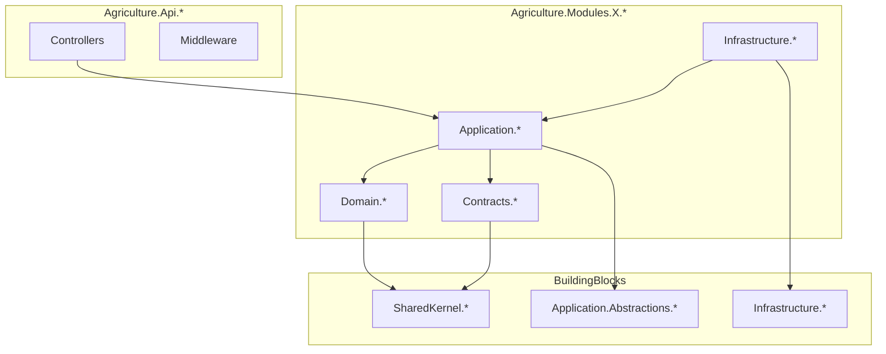

## 5.7 Integration Event Naming in Namespaces

Integration events live in `Agriculture.Modules.{Publisher}.Contracts.Events` with type names `{PastTense}V{n}` e.g. `TaskCompletedV1`. Consumers import that namespace; they do not redefine duplicate event types in their own Contracts.

## 5.8 Test Project Namespaces

```text
Agriculture.Modules.{Module}.UnitTests.{Area}
Agriculture.Modules.{Module}.IntegrationTests.{Area}
Agriculture.Architecture.Tests
Agriculture.Api.IntegrationTests
Agriculture.Performance.Tests
```

Test namespaces may mirror the system under test folder for discoverability but must not be referenced by production projects.

---

# 6. Dependency Rules

## 6.1 Principles (Normative)

1. Modules do **not** reference other modules’ Domain or Infrastructure projects.
2. Cross-module collaboration uses **Contracts** (interfaces + integration events) or Host-level composition of commands.
3. Domain references **SharedKernel only** (among platform projects).
4. Application may reference own Domain, own Contracts, consumed modules’ Contracts, Application.Abstractions, SharedKernel.
5. Infrastructure may reference own Application/Domain/Contracts and BuildingBlocks Infrastructure.
6. Api may reference module Infrastructure (for `Add{Module}Module`), module Application (if needed for rare composition), BuildingBlocks, and Contracts as required for hub DTOs — prefer depending on module DI extensions in Infrastructure.
7. Tests may reference the layer they test; Architecture.Tests reference projects only as needed to reflect on assemblies.
8. SharedKernel references **nothing** in Modules, Api, or Infrastructure.

## 6.2 Project Reference Matrix

Legend: **Y** = allowed ProjectReference; **N** = forbidden; **C** = Contracts only (when cross-module); **T** = test-only.

| From \ To | SharedKernel | App.Abstractions | BB.Infra | Mod.Domain | Mod.Application | Mod.Infrastructure | Mod.Contracts | Other Mod.Domain | Other Mod.Infra | Other Mod.Contracts | Api |
|-----------|--------------|------------------|----------|------------|-----------------|--------------------|---------------|------------------|-----------------|---------------------|-----|
| SharedKernel | — | N | N | N | N | N | N | N | N | N | N |
| App.Abstractions | Y | — | N | N | N | N | N | N | N | N | N |
| BB.Infra | Y | Y | — | N | N | N | N | N | N | N | N |
| Mod.Domain | Y | N | N | — | N | N | N | N | N | N | N |
| Mod.Application | Y | Y | N | Y (own) | — | N | Y (own) | N | N | Y (C) | N |
| Mod.Infrastructure | Y | Y | Y | Y (own) | Y (own) | — | Y (own) | N | N | Y (C)* | N |
| Mod.Contracts | Y | N/limited | N | N | N | N | — | N | N | N | N |
| Api | Y | Y | Y | N† | optional | Y (registration) | as needed | N | Y (reg) | as needed | — |
| UnitTests | as needed | as needed | rare | Y | Y | rare | Y | N | N | Y | N |
| Architecture.Tests | Y | Y | Y | Y | Y | Y | Y | Y | Y | Y | Y |

\* Infrastructure referencing other modules’ Contracts is allowed when the adapter must publish/consume integration shapes or implement a gateway that translates to foreign contracts — prefer Application for most ACL calls.

† Api should not reference Domain projects directly; if a compile need appears, it is a smell — fix by moving types.

## 6.3 Mermaid — Allowed Dependencies

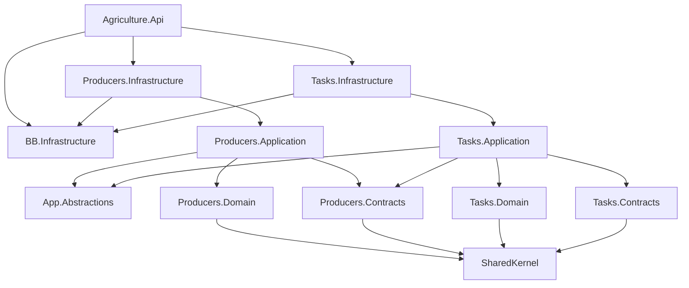

## 6.4 Never-Reference Rules (Enforce in Architecture.Tests)

1. **No** `Agriculture.Modules.*.Domain` → any other `Agriculture.Modules.*.Domain`.
2. **No** `Agriculture.Modules.*.Domain` → `*.Application` or `*.Infrastructure` or `Agriculture.Api`.
3. **No** `Agriculture.Modules.*.Application` → `*.Infrastructure` (own or foreign).
4. **No** `Agriculture.Modules.*.Application` → foreign `*.Domain` or foreign `*.Infrastructure`.
5. **No** SharedKernel → Modules/Api.
6. **No** Contracts → Domain/Application/Infrastructure of any module.
7. **No** EF Core package references in Domain projects.
8. **No** Hangfire/ASP.NET Core MVC packages in Domain projects.
9. **No** cross-schema foreign keys (data dependency rule companion).

## 6.5 Shared Kernel Dependency Rules

| Rule | Reasoning |
|------|-----------|
| SharedKernel has zero module references | Prevents kernel from becoming the system |
| Modules may reference SharedKernel | Shared primitives only |
| Prefer duplication of trivial VOs over wrong promotion | Address divergence Identity vs Producer |
| Breaking changes require Board + major version discipline | Every module compiles against kernel |
| No orchestrators in kernel | Orchestration is Application/Host |

## 6.6 Cross-Module Communication Mechanisms (Allowed)

| Mechanism | When | Example |
|-----------|------|---------|
| Contracts abstraction (ACL) | Need sync answer for invariant | Tasks → `IProducerDirectory.ExistsAsync` |
| Integration event (outbox) | Notify after commit | `TaskCompletedV1` → Workflows policy / Notifications |
| Host composition | Rare multi-command use case needing single HTTP UX | Controller sends command A then B explicitly — still no Domain coupling |
| Published read model query | Reporting/dashboard | Reporting consumes projections updated by events |

## 6.7 Forbidden Communication Mechanisms

| Mechanism | Why forbidden |
|-----------|---------------|
| Shared DbContext | Breaks schema ownership and extraction |
| Cross-module EF navigation properties | Hidden coupling |
| Direct SQL joins across schemas in module Infrastructure | Same as shared model |
| Domain event handler in Module A referencing Module B aggregate types | Use integration events |
| Calling foreign repository interfaces | Repositories are not Contracts |
| Service locator to resolve foreign Application services without Contracts | Opaque coupling |

## 6.8 Module-to-Module Matrix (Business) — Alignment

Follow MODULE_DESIGN §4.2 exactly. Summary reminders for solution structure:

- **Notifications** is a sink (A from many → Notifications; Notifications does not mutate producers/tasks).
- **Reporting** consumes events/read models; does not own transactional writes of foreign aggregates.
- **Harvest** may Q-read Seasons/Inspections via Contracts; Delivery stays in-module.
- **Admin** configures; does not become a god orchestrator of production workflows.

## 6.9 Circular Dependency Prevention

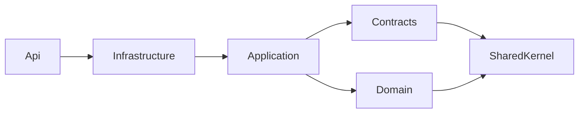

If a cycle appears (e.g., Workflows.Application → Tasks.Contracts and Tasks.Application → Workflows.Contracts is **OK** — Contracts are leaves). Cycle **Domain↔Domain** or **Infrastructure↔Infrastructure** across modules is **not OK**.

## 6.10 Enforcement Ownership

| Guard | Owner |
|-------|-------|
| Architecture.Tests (NetArchTest or similar) | Test Architecture Owner |
| PR checklist MODULE_DESIGN §11.2 | All reviewers |
| CODEOWNERS on Contracts | Module owners |
| Board review for new edges | Architecture Board |

---

# 7. Dependency Injection Strategy

## 7.1 Composition Root

**Only `Agriculture.Api` is the composition root** for the running process. Modules expose extension methods; they do not create parallel `Host` builders.

```csharp
// Conceptual registration order (illustrative — not source delivery)
builder.Services.AddBuildingBlocks(builder.Configuration);
builder.Services.AddIdentityModule(builder.Configuration);
builder.Services.AddProducersModule(builder.Configuration);
// ... each module ...
builder.Services.AddAdministrationModule(builder.Configuration);
builder.Services.AddHostInfrastructure(builder.Configuration); // Hangfire, SignalR, health
```

**Reasoning:** Deterministic order helps diagnose override issues; Identity and BuildingBlocks before modules that need `IUserContext`; Hangfire after SQL connection availability.

## 7.2 Module Registration Pattern

Each module Infrastructure project defines:

```text
Add{Name}Module(this IServiceCollection services, IConfiguration configuration)
```

Responsibilities of `Add{Name}Module`:

1. Bind module `Options` (`services.Configure<T>`).
2. Register DbContext with schema + connection string name.
3. Register repositories and application ports.
4. Register Contracts abstractions implementations.
5. Register MediatR handlers from the module Application assembly (or rely on Host single MediatR scan listing assemblies).
6. Register FluentValidation validators from Application assembly.
7. Register Hangfire job types (or recurring job setup delegates invoked from Host startup).
8. Register outbox processor bits for the module.

**Ownership:** Module Owner implements; Host Owner calls.

## 7.3 MediatR Registration Strategy

**Decision (ADR-004):** One MediatR mediator in the host scanning **all module Application assemblies**.

| Approach | Pros | Cons | Choice |
|----------|------|------|--------|
| Single scan of all Application assemblies | One pipeline; consistent behaviors | Large assembly list | **Accepted** |
| Per-module MediatR instances | Isolation | Breaks cross-module behaviors; DX pain | Rejected |
| Controllers call handlers without MediatR | — | Rejected by ADR-004 | Rejected |

Pipeline behaviors (order matters):

1. Logging / Exception enrichment behavior
2. Validation behavior (FluentValidation)
3. Authorization behavior (permission checks)
4. Performance timing behavior
5. Unit of Work / Transaction behavior (for commands)

**Reasoning:** Validation before transaction avoids empty transactions; auth before handler prevents unauthorized writes; UoW outermost-after-validation is a common pattern — document exact order in Host `Extensions/MediatRExtensions` and do not reorder per module.

## 7.4 FluentValidation

- Validators live in Application (feature folder or `Validators/`).
- Registered via assembly scan in module DI or global scan.
- `AbstractValidator<TRequest>` where `TRequest` is Command/Query.
- Never validate solely in controllers (ADR-019).

## 7.5 Service Lifetimes

| Service kind | Lifetime | Reasoning |
|--------------|----------|-----------|
| DbContext | Scoped | Per-request / per-job scope; safe change tracking |
| Repositories | Scoped | Depend on DbContext |
| Application handlers | Transient (MediatR default) | Stateless; safe |
| Validators | Transient/Scoped per library norms | Stateless preferred Transient |
| `IUserContext` | Scoped | Bound to request user |
| JWT token generator | Scoped or Singleton if thread-safe options | Prefer Scoped if using scoped deps |
| MinIO client wrapper | Singleton or Scoped based on SDK thread safety | Document in BB; typically Singleton client + Scoped facade |
| Hangfire job classes | Transient | Resolved per job execution |
| Memory cache | Singleton | ADR-015 |
| Channel / connection multiplexers (future Redis) | Singleton | — |
| Options (`IOptions<T>`) | Singleton snapshots | Standard |
| `IOptionsMonitor` / `IOptionsSnapshot` | Singleton / Scoped | Snapshot Scoped for per-request config reload |

**Forbidden:** Singleton services that capture Scoped DbContext (captive dependency). Architecture/code review must catch this; consider validation package in DI diagnostics for Development.

## 7.6 Open Generics

Register open generics for:

- `IPipelineBehavior<,>` implementations in BuildingBlocks/Application.Abstractions behaviors.
- Optional `IRepository<>` only if SharedKernel defines a generic port **and** modules agree — MODULE_DESIGN prefers module-specific repositories; generic repository is optional and must not become a CRUD hammer that bypasses aggregates.

## 7.7 Assembly Scanning Conventions

| Scan target | What is registered |
|-------------|--------------------|
| Each `*.Application` | Handlers, Validators, Policies/EventHandlers if using MediatR notifications |
| Each `*.Infrastructure` | Not scanned blindly for everything — prefer explicit registrations for repositories to keep ownership obvious; scanning allowed for `IEntityTypeConfiguration` via `ApplyConfigurationsFromAssembly` |
| `Agriculture.Api` | Controllers (MVC application part), middleware |

**Reasoning:** Blind Infrastructure scanning tends to register test doubles and internal helpers accidentally. Explicit repository registration is clearer for municipal audits.

## 7.8 Hangfire Scope

Hangfire jobs must create a **DI scope** per job (`IServiceScopeFactory`) so Scoped DbContexts work. Job methods should send MediatR commands rather than reimplementing Application logic.

## 7.9 SignalR and DI

Hubs are Transient by default; inject `IMediator` / `IUserContext` carefully. Prefer hubs that send commands/queries rather than holding DbContexts.

## 7.10 Feature Flags in DI

`IFeatureFlagService` from Administration.Contracts registered by Administration module; Host middleware or behavior may consult flags. Do not branch DI registrations chaotically at startup for every flag — prefer runtime checks for soft features; hard modules stay compiled.

## 7.11 DI Registration Flow Diagram

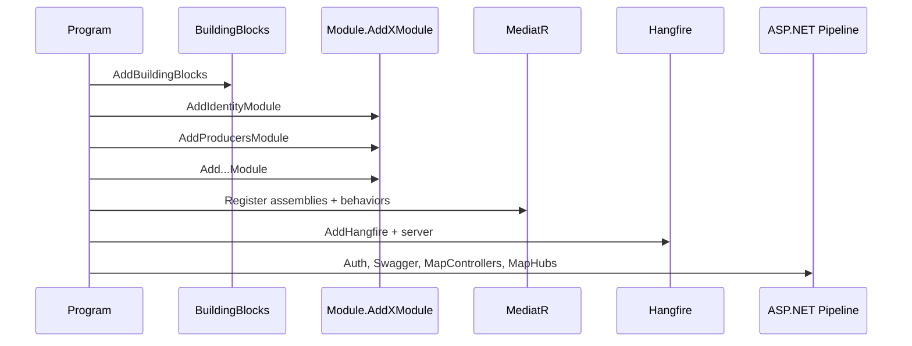

## 7.12 Testing and DI

Integration tests use `WebApplicationFactory<Program>` with replaced Infrastructure adapters (SQL Testcontainers, MinIO test container, fake FCM). Unit tests do not need full DI — instantiate handlers with fakes.

---

# 8. Configuration Strategy

## 8.1 Configuration Layering (ASP.NET Core)

Order (highest precedence last wins as usual):

1. `appsettings.json`
2. `appsettings.{Environment}.json`
3. Environment variables
4. User secrets (Development only)
5. Command-line args (local)

**Owner:** Host Owner for file shape; Module Owners for their Options sections; DevOps for env var mapping in deployment.

## 8.2 Environment Files

| File | Purpose | Secrets? |
|------|---------|----------|
| `appsettings.json` | Non-secret defaults, structure | No |
| `appsettings.Development.json` | Local ports, Seq URL, Dev JWT | No real prod secrets; local connection strings OK for docker compose |
| `appsettings.Staging.json` | Staging endpoints | Prefer env vars for secrets |
| `appsettings.Production.json` | Prod non-secret knobs | **No secrets** — use env/vault |
| User secrets | Dev credentials | Local only |
| `deployment/env/*.env.example` | Documents required keys | Examples only |

## 8.3 Configuration Sections (Authoritative Catalog)

### ConnectionStrings

| Key | Used by | Notes |
|-----|---------|-------|
| `ConnectionStrings:AgricultureDatabase` | All module DbContexts | Single SQL Server; schemas separate (ADR-005/016) |
| `ConnectionStrings:Hangfire` | Optional; may reuse main DB | Prefer same server different schema |

### Jwt / Authentication (ADR-013)

```text
Jwt:
  Issuer
  Audience
  AccessTokenMinutes
  RefreshTokenDays
  SigningKey                    # SECRET — env var Jwt__SigningKey
```

### MinIO (ADR-010)

```text
Minio:
  Endpoint
  AccessKey                     # SECRET
  SecretKey                     # SECRET
  UseSsl
  Buckets:
    Photos
    Documents
    Reports
    Temporary
    Archive
```

### Serilog / Seq (ADR-011/012)

```text
Serilog:
  MinimumLevel:
    Default
    Override:
      Microsoft
      Hangfire
Seq:
  ServerUrl
  ApiKey                        # SECRET if required
```

### Hangfire (ADR-007)

```text
Hangfire:
  WorkerCount
  DashboardPath
  DashboardAllowedRoles
  Queues: [default, notifications, reports, cleanup]
```

### SignalR (ADR-008)

```text
SignalR:
  EnableDetailedErrors          # Dev only true
  KeepAliveIntervalSeconds
  # Redis backplane settings reserved for future Board approval
```

### Firebase / FCM (ADR-009)

```text
Firebase:
  ProjectId
  CredentialJsonPath            # or raw JSON via secret mount — never commit
```

### FeatureFlags

```text
FeatureFlags:
  Source: Administration        # runtime DB-backed preferred
  # optional bootstrap flags in config for emergency
```

### Cors

```text
Cors:
  AllowedOrigins: []
```

### RateLimiting

```text
RateLimiting:
  PermitLimit
  WindowSeconds
```

## 8.4 Secrets Handling Rules

1. Never commit production secrets to git.
2. Prefer environment variables with `__` hierarchy (`Minio__SecretKey`).
3. In containers, mount secret files when municipal IT requires (PHYSICAL_ARCHITECTURE).
4. Rotate JWT signing keys with a documented dual-key strategy if adopted — until then, controlled rotation with forced refresh revoke via Identity.
5. CI uses GitHub Actions secrets; not repository variables for sensitive material.

## 8.5 Options Pattern Ownership

| Options class | Project | Section |
|---------------|---------|---------|
| `JwtOptions` | BB.Infrastructure or Api.Configuration | `Jwt` |
| `MinioOptions` | BB.Infrastructure | `Minio` |
| `SeqOptions` | BB.Infrastructure / Api | `Seq` |
| `HangfireHostOptions` | Api | `Hangfire` |
| `FirebaseOptions` | Notifications.Infrastructure | `Firebase` |
| `TasksJobOptions` | Tasks.Infrastructure | `Tasks:Jobs` |

Bind with `services.Configure<T>(configuration.GetSection("..."))` and validate with `IValidateOptions<T>` on startup for critical options (Fail Fast).

## 8.6 Feature Flags

- **Authoritative runtime store:** Administration module.
- **Config bootstrap:** emergency kill switches only.
- **Consumption:** `IFeatureFlagService` in Application behaviors or handlers.
- **Never:** compile out whole security controls behind flags.

## 8.7 Per-Environment Expectations

| Concern | Development | Staging | Production |
|---------|-------------|---------|------------|
| SQL | Compose SQL container | Managed/staging SQL | Hardened SQL |
| MinIO | Compose | Staging object store | Prod object store + backup |
| Seq | Compose | Staging Seq | Prod Seq with retention |
| JWT keys | User secret / dev key | Staging secret store | Prod secret store |
| FCM | Dev Firebase project | Staging project | Prod project |
| Swagger | Enabled | Optional locked | Disabled or admin-only |
| Hangfire dashboard | Enabled with auth | Enabled with auth | Enabled with strong auth |

---

# 9. Logging Strategy (Solution / Folder Perspective)

## 9.1 Ownership

| Log concern | Owner | Location |
|-------------|-------|----------|
| Serilog host setup | Host Owner | `Agriculture.Api` + BB logging extensions |
| Seq sink | Host Owner / DevOps | config + deployment |
| Correlation ID middleware | Host Owner | `Api/Middleware` |
| Module business log events | Module Owner | handlers via `ILogger<T>` |
| Audit logs (security/business) | Identity + Administration + module policies | structured events + optional audit tables |
| Hangfire logs | Host + module jobs | Serilog enricher with JobId |

## 9.2 Structured Logging Requirements

Every request log should be able to carry:

- `CorrelationId` / `TraceId`
- `UserId` (when authenticated)
- `TenantId` / `MunicipalityId` (when multi-tenant columns exist)
- `Module` (bounded context name)
- `CommandName` / `QueryName` (from MediatR behavior)
- `Outcome` (success/failure code)

## 9.3 Log Categories

| Category | Purpose | Retention hint |
|----------|---------|----------------|
| Request logs | HTTP pipeline | Short-medium; Seq |
| Performance logs | Timing behavior | Short; alert on p95 |
| Business logs | Domain-significant outcomes | Medium; searchable |
| Audit logs | Security-sensitive actions | Long; immutable store + Seq |
| Infrastructure logs | EF, Hangfire, MinIO | Short; noisy overrides |

## 9.4 Folder Perspective

```text
Agriculture.Api/Middleware/CorrelationIdMiddleware.cs
Agriculture.Infrastructure/Logging/Enrichers/
Agriculture.Application.Abstractions/Behaviors/LoggingBehavior.cs
Each module: use ILogger in handlers — do not create per-module logging frameworks
```

## 9.5 Forbidden Logging Practices

- Logging tokens, passwords, raw national IDs without masking policy.
- `Console.WriteLine` in production paths.
- Catch-and-swallow without log + metric.
- Logging entire EF entities with sensitive fields.

---

# 10. File Storage Structure (MinIO)

## 10.1 Alignment

ADR-010 and PHYSICAL_ARCHITECTURE: private buckets; API-mediated access; SQL stores object keys + metadata, not BLOBs.

## 10.2 Bucket Catalog

| Bucket logical name | Config key | Purpose | Versioning | Retention |
|---------------------|------------|---------|------------|-----------|
| Photos | `Minio:Buckets:Photos` | Task/inspection/producer/harvest photos | Optional enabled | Hot retention policy municipal-defined; soft-delete → lifecycle |
| Documents | `Minio:Buckets:Documents` | Producer docs, delivery docs, support docs | Recommended on | Longer than photos |
| Reports | `Minio:Buckets:Reports` | Generated report outputs | On | Per report policy |
| Temporary | `Minio:Buckets:Temporary` | Upload scratch / multipart | Off | Aggressive lifecycle (e.g., 7 days) |
| Archive | `Minio:Buckets:Archive` | Cold evidence / legal hold exports | On | Long-term |

Bucket physical names may be prefixed with environment: `agri-dev-photos`, `agri-prod-photos`.

## 10.3 Object Key Hierarchy

```text
{bucket}/
  {tenantOrMunicipalityId}/
    {module}/
      {aggregateType}/
        {aggregateId}/
          {yyyy}/{MM}/{dd}/
            {guid}_{sanitizedFileName}
```

Example: `photos/muni-01/inspections/inspection/{id}/2026/07/17/{guid}_field.jpg`

**Ownership:** Module Infrastructure `Storage/*Paths.cs` builds keys; never let clients choose absolute keys.

## 10.4 Versioning and Immutability

- Completed inspection evidence: prefer write-once object keys; replacements create new versions/keys with audit.
- Temporary bucket: overwrite allowed; no legal value.
- Archive: legal hold support when municipality requires.

## 10.5 Retention and Cleanup Jobs

Hangfire cleanup jobs (Notifications/Administration/Reporting as appropriate) delete expired Temporary objects and orphaned keys detected by reconciliation (SQL metadata vs MinIO listing) — job code under owning module Infrastructure/Jobs.

## 10.6 Security Rules

- No public bucket policies.
- Presigned URLs short-lived when used.
- Content-type and size validation in Application before PUT.
- Antivirus scanning future consideration — Board ADR if mandated.

---

# 11. Background Jobs Project Structure

## 11.1 Where Jobs Live

Hangfire is hosted in `Agriculture.Api`, but **job classes live in module Infrastructure/Jobs** (ADR-007, MODULE_DESIGN §7.7). Host registers Hangfire storage and server; modules register recurring jobs in `Add{Module}Module` or `IHostedService` initializers.

## 11.2 Job Categories

| Category | Examples | Queue name |
|----------|----------|------------|
| Fire-and-forget | Send notification after outbox relay | `notifications` |
| Recurring | Overdue task sweep nightly | `default` |
| Continuations | After report generate → notify user | `reports` |
| Retry-heavy external IO | FCM dispatch | `notifications` |
| Cleanup | Purge temp objects, expired tokens | `cleanup` |

## 11.3 Folder Pattern

```text
Infrastructure/Jobs/
  Recurring/
    SweepOverdueTasksJob.cs
  Notifications/
    DispatchNotificationJob.cs
  Cleanup/
    PurgeExpiredRefreshTokensJob.cs
  Reports/
    GenerateReportJob.cs
```

## 11.4 Rules

1. Jobs send MediatR commands/queries — no duplicate domain logic.
2. Jobs are idempotent where possible (especially outbox/FCM).
3. Retry policies: use Hangfire retries + poison queue monitoring in Seq.
4. Do not run FCM synchronously on HTTP request threads.
5. Long report generation always Hangfire, never controller timeout hope.
6. Dashboard authorization uses Identity roles (Host configuration).

## 11.5 Continuations and Batches

Use Hangfire continuations for multi-step technical workflows (generate → upload MinIO → publish event). Business sagas across modules still prefer outbox integration events over Hangfire batches when domain consistency is involved.

## 11.6 Diagram

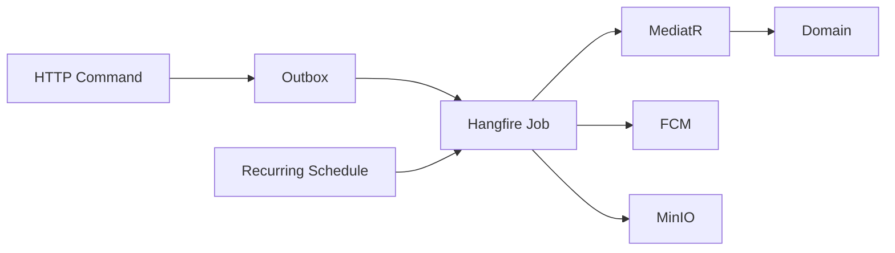

---


# 12. API Project Structure

## 12.1 Authoritative Shape of `Agriculture.Api`

```text
src/Hosts/Agriculture.Api/
  Agriculture.Api.csproj
  Program.cs
  appsettings.json
  appsettings.Development.json
  appsettings.Staging.json
  appsettings.Production.json
  Controllers/
    Identity/
      AuthController.cs
      UsersController.cs
      RolesController.cs
    Producers/
      ProducersController.cs
    Lands/
      LandsController.cs
    Seasons/
      SeasonsController.cs
    Workflows/
      WorkflowsController.cs
    Tasks/
      TasksController.cs
    Inspections/
      InspectionsController.cs
    Harvest/
      HarvestsController.cs
      DeliveriesController.cs
    Support/
      SupportController.cs
    Notifications/
      NotificationsController.cs
    Communication/
      ConversationsController.cs
    Reporting/
      ReportsController.cs
    Administration/
      SettingsController.cs
      FeatureFlagsController.cs
  Hubs/
    DashboardHub.cs
    NotificationsHub.cs
  Middleware/
    CorrelationIdMiddleware.cs
    ExceptionHandlingMiddleware.cs      # aligns ADR-018
    RequestLoggingMiddleware.cs         # if not using Serilog request logging exclusively
  Filters/
    ResultToActionResultFilter.cs       # optional Result mapping
    ValidationExceptionFilter.cs        # if not pipeline-only
  Auth/
    PermissionAuthorizationHandler.cs
    PermissionPolicyProvider.cs
    Policies.cs                         # policy name constants Perm.{Module}.{Action}
  Extensions/
    ServiceCollectionExtensions.cs      # AddApiServices
    MediatRExtensions.cs
    HangfireExtensions.cs
    SignalRExtensions.cs
    SwaggerExtensions.cs
    HealthCheckExtensions.cs
    ModuleRegistrationExtensions.cs     # calls all Add{Module}Module
  Configuration/
    JwtOptionsSetup.cs
    MinioOptionsSetup.cs
    ConfigureSwaggerOptions.cs
  Health/
    SqlHealthCheck tagging helpers (optional)
  Properties/
    launchSettings.json
```

## 12.2 Controllers vs Minimal APIs — SAS Decision

MODULE_DESIGN and ADR-004 allow Controllers or Minimal APIs. **v1.0 authoritative choice: MVC Controllers** organized by module folders under `Agriculture.Api.Controllers`.

| Criterion | Controllers | Minimal APIs | Decision |
|-----------|-------------|--------------|----------|
| Municipal team familiarity | High | Medium | Controllers |
| OpenAPI metadata maturity | High with attributes | Improving | Controllers |
| Authorization attributes | Mature | Supported | Controllers |
| Thinness achievable | Yes if only MediatR | Yes | Controllers |

Minimal APIs may be adopted later via ADR supersession; do not mix styles within the same module surface in v1.

### Controller rules

1. Controllers translate HTTP ↔ commands/queries only.
2. No EF DbContext injection.
3. No domain invariant logic.
4. Return `ActionResult` mapped from Application `Result` types or throw domain exceptions handled by middleware (ADR-018 preferred unified approach).
5. `[Authorize(Policy = Permissions...)]` on actions.
6. Route template: `api/v{version}/{resource}`.

## 12.3 Middleware Pipeline Order (Normative Intent)

```text
ExceptionHandling
CorrelationId
RequestLogging (Serilog)
HTTPS redirection (if not terminated solely at proxy — follow PHYSICAL_ARCHITECTURE)
Routing
CORS
Authentication
Authorization
RateLimiting
Endpoints (Controllers + Hubs + Health + Hangfire dashboard)
```

Exact `Program.cs` order must match security expectations: authentication before authorization; correlation before logging enrichment.

## 12.4 Filters

Use filters sparingly when pipeline behaviors already cover validation. Filters remain useful for:

- Converting `Result` to HTTP codes consistently.
- Archive/download file result shaping.
- Antiforgery if any cookie-based admin edge case exists (JWT primary).

## 12.5 Auth Policies

Policy names follow ADR-014 examples: `Perm.Tasks.Complete`, `Perm.Inspections.Create`, `Perm.Harvest.Record`.

Registration lives in `Auth/` and is fed by Identity permission catalog seeding. Resource-based handlers (producer can only complete own tasks) live as authorization handlers consulting Application services/Contracts — not raw SQL in handlers.

## 12.6 Swagger / OpenAPI

- Enabled in Development; Staging optional with auth; Production locked down (ADR-020).
- Document JWT bearer scheme.
- Group endpoints by module tags matching controller folders.
- Do not publish internal admin diagnostics without auth.

## 12.7 Health Checks

| Endpoint | Purpose | Checks |
|----------|---------|--------|
| `/health` | Liveness | Process up |
| `/health/ready` | Readiness | SQL connect, MinIO connect, (optional) Hangfire storage |

Registration in `HealthCheckExtensions`. Ready failures should prevent load balancer traffic.

## 12.8 API Versioning

- URL segment versioning `api/v1/...` as default.
- Version explorer in Swagger for v1 only at MVP.
- Breaking HTTP contract changes require new version + ADR note if cross-cutting.

## 12.9 SignalR Hub Structure

Hubs under `Agriculture.Api.Hubs`:

- Map endpoints in `SignalRExtensions`.
- Authorize hubs with JWT.
- Methods enqueue commands or queries; broadcast via Notifications realtime adapter.
- Scale-out requires Redis backplane (ADR-015/008) — not enabled day one.

## 12.10 Hangfire Dashboard

- Path from config (`/hangfire` typical).
- Restricted to Administration/ops roles.
- Not publicly anonymous in any environment.

## 12.11 What Never Belongs in Api Project

- Module DbContexts.
- Aggregate classes.
- FCM credential processing beyond config binding.
- Business report generation loops.
- Shared Kernel duplicates.

## 12.12 Api Project Reference List (Conceptual)

Api references each module’s **Infrastructure** project (for `Add{Module}Module`), BuildingBlocks projects, and ASP.NET packages. Api does not reference other modules’ Domain projects.

```mermaid
flowchart TB
  Api[Agriculture.Api]
  Api --> IdI[Identity.Infrastructure]
  Api --> PrI[Producers.Infrastructure]
  Api --> LaI[Lands.Infrastructure]
  Api --> SeI[Seasons.Infrastructure]
  Api --> WfI[Workflows.Infrastructure]
  Api --> TkI[Tasks.Infrastructure]
  Api --> InI[Inspections.Infrastructure]
  Api --> HvI[Harvest.Infrastructure]
  Api --> SuI[Support.Infrastructure]
  Api --> NtI[Notifications.Infrastructure]
  Api --> CmI[Communication.Infrastructure]
  Api --> RpI[Reporting.Infrastructure]
  Api --> AdI[Administration.Infrastructure]
  Api --> BI[BB.Infrastructure]
  Api --> AA[App.Abstractions]
  Api --> SK[SharedKernel]
```

---

# 13. Shared Kernel Complete Design

## 13.1 Purpose Recap

SharedKernel provides **technical domain primitives** shared across bounded contexts without sharing business models (MODULE_DESIGN §3).

## 13.2 Allowed Types — Detailed Catalog

### BaseEntity / Entity

- **Why:** Consistent identity (`Guid` Id), equality by identity, optional domain event collection attachment point for entities that are not roots if needed.
- **Owner:** Shared Kernel Steward.
- **Must not:** Include `ProducerId` business meaning; module-specific fields.

### AggregateRoot

- **Why:** Marks consistency boundary; holds domain events list; clears events after dispatch.
- **Rules:** External modules reference only root ids; children accessed through root methods.

### AuditableEntity

- **Why:** `CreatedAt`, `CreatedBy`, `LastModifiedAt`, `LastModifiedBy`, optional `IsDeleted` for soft delete support where module policy allows.
- **Reasoning:** Municipal auditability is cross-cutting; **whether** soft delete is allowed remains module policy (completed inspections immutable).

### Result / Error

- **Why:** Functional-style outcomes for Application handlers without exception control flow for expected failures.
- **Includes:** `Result`, `Result<T>`, `Error` with code/message; maybe error catalogs for common technical errors only.
- **Must not:** Contain `ProducerNotFound` specific codes for all modules — modules define their error codes locally or via typed errors in Application.

### Specification

- **Why:** Composable query predicates within a module.
- **Must not:** Encode cross-module joins.

### Pagination

- **Why:** `PagedRequest`, `PagedResult<T>`, standard sort/filter primitives.
- **Reasoning:** Prevents every module inventing incompatible paging DTOs for API consistency.

### Domain Events (`IDomainEvent`)

- **Why:** Marker + metadata (`OccurredOn`, optional `EventId`).
- **Companion:** Integration events are **not** SharedKernel types — they live in module Contracts.

### Repository Interfaces (generic optional)

- `IRepository<TAggregate, TId>` optional; MODULE_DESIGN allows module-specific ports as primary approach.
- If generic exists, it stays thin (Get/Add/Remove); no query kitchen sink.

### Value Objects (shared)

Allowed only when identical enterprise-wide:

- Possibly `Money` if Support and Harvest share identical currency rules — otherwise keep local.
- Guard helpers, not business VOs with divergent rules.

**Caution:** Email/Phone may be duplicated per module.

### Exceptions

Technical base exceptions: `ConflictException`, `NotFoundException`, `ValidationException` (or prefer FluentValidation), `ForbiddenException` — mapped by ADR-018 middleware.

### Enumerations

`Enumeration` base class pattern for smart enums if used; module enums stay local.

### Utilities / Extensions / Guards

- `Ensure.NotNull`, string helpers without business meaning.
- Date/time abstractions belong in Application.Abstractions (`IDateTimeProvider`), not static `DateTime.Now` sprinkled — provider may live outside kernel.

## 13.3 Explicitly Forbidden in SharedKernel

| Forbidden | Why |
|-----------|-----|
| Producer, Land, Season, Workflow, WorkTask, Inspection, Harvest, Delivery types | Bounded context leakage |
| Permission catalogs for all modules | Identity/module ownership |
| `ProductionOrchestrator` | Multi-module orchestration anti-pattern |
| EF attributes packages | Infrastructure leak |
| MediatR references | Application concern |
| MinIO/FCM types | Infrastructure |
| Harvest unit catalogs as “shared enums” used to drive Harvest invariants in kernel | Keep in Harvest |
| UI DTOs | API/Application concern |

## 13.4 Folder Tree for SharedKernel

```text
Agriculture.SharedKernel/
  Primitives/
    Entity.cs
    AggregateRoot.cs
    AuditableEntity.cs
  Results/
    Result.cs
    Error.cs
  Events/
    IDomainEvent.cs
  Pagination/
    PagedRequest.cs
    PagedResult.cs
  Specifications/
    ISpecification.cs
    SpecificationEvaluator.cs   # careful: keep EF-free or move evaluator to BB.Infrastructure
  Enumerations/
    Enumeration.cs
  Exceptions/
    DomainException.cs
    NotFoundException.cs
    ConflictException.cs
  Guards/
    Ensure.cs
  Extensions/
  ValueObjects/                 # sparse
```

**Note:** If `SpecificationEvaluator` needs EF `IQueryable`, place evaluator in BuildingBlocks.Infrastructure to keep SharedKernel free of EF.

## 13.5 Versioning and Change Policy

1. Additive non-breaking changes: Steward approval.
2. Breaking changes: Architecture Board + coordinated module PRs.
3. Prefer extension methods over modifying Entity base behavior silently.

---

# 14. Testing Projects

## 14.1 Test Pyramid for This Solution

| Layer | Projects | Intent |
|-------|----------|--------|
| Unit | `Agriculture.Modules.{Name}.UnitTests` | Domain invariants + handler logic with fakes |
| Integration | `Agriculture.Modules.{Name}.IntegrationTests`, `Agriculture.Api.IntegrationTests` | SQL/Testcontainers, HTTP pipeline |
| Architecture | `Agriculture.Architecture.Tests` | Dependency rules Section 6 |
| Performance | `Agriculture.Performance.Tests` | Smoke benchmarks for critical queries |

## 14.2 Naming and Layout

```text
tests/
  Architecture.Tests/
    Agriculture.Architecture.Tests.csproj
    DependencyRules/
      ModuleDependencyTests.cs
      SharedKernelDependencyTests.cs
      LayerDependencyTests.cs
  Api.IntegrationTests/
    Agriculture.Api.IntegrationTests.csproj
    Scenarios/
  Performance.Tests/
    Agriculture.Performance.Tests.csproj
  Modules.Identity.UnitTests/
  Modules.Identity.IntegrationTests/
  Modules.Producers.UnitTests/
  ... (create as modules mature; not all required on day one, but naming reserved)
```

**Alternative acceptable naming:** `Agriculture.Modules.Identity.UnitTests` to mirror production project names — **preferred** for clarity.

## 14.3 Separation Rules

1. Unit tests never require SQL Server.
2. Integration tests may use Testcontainers; mark with traits for CI optional jobs if municipal runners are slow.
3. Architecture tests run on every PR (mandatory gate).
4. Performance tests run nightly or on-demand — not necessarily every PR unless Board mandates.
5. Test projects must not be referenced by production projects.

## 14.4 Architecture Test Expectations (Examples)

- Domain projects reference only SharedKernel among Agriculture.* (plus allowed BCL).
- Application does not reference Infrastructure.
- No references between foreign Domains.
- Contracts do not reference Infrastructure.

## 14.5 Ownership

| Project | Owner |
|---------|-------|
| Architecture.Tests | Test Architecture Owner |
| Api.IntegrationTests | Host Owner |
| Module Unit/Integration | Module Owner |
| Performance.Tests | Host Owner + module owners for scenarios |

---

# 15. Build Structure

## 15.1 Folder Responsibilities

### `build/`

```text
build/
  docker/
    Dockerfile.api
    Dockerfile.api.worker          # optional future
    .dockerignore
  versioning/
    Version.props
  scripts/
    compute-version.sh
```

### `deployment/`

```text
deployment/
  compose/
    docker-compose.yml
    docker-compose.override.yml
  proxy/
    nginx.conf
  env/
    development.env.example
    staging.env.example
    production.env.example
  k8s/
    README.md                      # Stage 3 placeholder per PHYSICAL_ARCHITECTURE
```

### `.github/workflows/`

```text
ci.yml           # restore, build, unit, architecture, integration (as capacity allows), docker build, scan
release.yml      # tag, push image, publish notes
```

### `scripts/`

DB migration helpers, secret scanning, local bootstrap.

## 15.2 CI/CD Pipeline (Logical)

```mermaid
flowchart LR
  PR[Pull Request] --> Build[dotnet build]
  Build --> Unit[Unit Tests]
  Unit --> Arch[Architecture Tests]
  Arch --> Integ[Integration Tests]
  Integ --> Image[Docker Build]
  Image --> Scan[Container Scan]
  Scan --> Artifacts[Push Artifacts]
  Artifacts --> Staging[Deploy Staging]
  Staging --> Migrate[EF Migrations Gate]
  Migrate --> Prod[Deploy Production]
```

## 15.3 Migrations Release Rule

- Each module owns migrations in its Infrastructure project.
- Production apply is an **explicit release step** with backup preceding apply (ADR-020).
- Do not auto-migrate on App startup in Production.

## 15.4 Docker Compose Dev Parity

Compose brings up API + SQL Server + MinIO + Seq (PHYSICAL_ARCHITECTURE Stage 0). Frontend/mobile run on host against published API ports.

## 15.5 Release Artifacts

| Artifact | Contents |
|----------|----------|
| API container image | Agriculture.Api + dependencies |
| Migration bundles | Optional SQL scripts generated in CI for DBA review |
| Frontend static build | Separate pipeline under `frontend/` |
| Mobile store binaries | Separate mobile pipeline |

---

# 16. Coding Conventions

## 16.1 General .NET Conventions

- Nullable reference types enabled solution-wide.
- Implicit usings allowed; prefer clarity for Domain.
- File-scoped namespaces allowed.
- One primary public type per file; filename matches type name.
- `async` methods suffix `Async`.
- CancellationToken passed through Application handlers and Infrastructure IO.

## 16.2 Folder / File Naming

| Artifact | Convention | Example |
|----------|------------|---------|
| Command | `{Verb}{Noun}Command` | `CompleteWorkTaskCommand` |
| Handler | `{Command}Handler` | `CompleteWorkTaskCommandHandler` |
| Query | `{Get\|Search\|List}{Noun}Query` | `GetWorkTaskQuery` |
| Validator | `{Command}Validator` | `CompleteWorkTaskCommandValidator` |
| DTO | `{Noun}Dto` / `{Noun}Response` | `WorkTaskDto` |
| Repository interface | `I{Noun}Repository` | `IWorkTaskRepository` |
| Repository impl | `{Noun}Repository` | `WorkTaskRepository` |
| EF config | `{Noun}Configuration` | `WorkTaskConfiguration` |
| Integration event | `{Noun}{Past}V{n}` | `TaskCompletedV1` |
| Options | `{Area}Options` | `MinioOptions` |
| Hub | `{Area}Hub` | `DashboardHub` |
| Controller | `{Noun}Controller` | `TasksController` |
| Job | `{Verb}{Noun}Job` | `SweepOverdueTasksJob` |

## 16.3 Interface Naming

- Prefix `I` for interfaces.
- Ports in Application/Domain: `IWorkTaskRepository`.
- Contracts ACL: `IProducerDirectory`, `IInspectionGate`, `INotificationPublisher`.
- Avoid `IManager`, `IHelper`, `ICommonService` vague names.

## 16.4 Class Naming

- Aggregates use ubiquitous language (`Producer`, `Inspection`) with CLR disambiguation when needed (`WorkTask`).
- Domain services named for policy (`WorkflowSequencingService`).
- Infrastructure adapters suffix `Adapter`/`Gateway`/`Store` when implementing ports (`FcmPushGateway`).

## 16.5 Command / Query / Handler Conventions

- Commands return `Result` or `Result<TId>`; Queries return `Result<TDto>` or `PagedResult`.
- Handlers are `internal` when possible; MediatR discovers them.
- Do not put HTTP types in Commands.
- Do not put EF entities in DTOs returned to Api — map to DTOs.

## 16.6 Validator Conventions

- One validator per command/query.
- Use domain rules for invariant enforcement inside aggregate methods; use FluentValidation for input shape and referential ACL checks that need IO (with care — IO in validators should be limited; prefer handler for multi-step ACL).

## 16.7 Repository Conventions

- Repositories load/save aggregate roots only.
- No “UpdateProperty” methods that bypass aggregate behavior.
- Query-side may use dedicated read queries/DbContext set with `AsNoTracking` in Infrastructure query services — still not exposing DbContext beyond Infrastructure.

## 16.8 DTO Conventions

- DTOs in Application; Contracts may define read models for ACL summaries (`ProducerSummary`).
- Naming should not leak EF (`ProducerEntityDto` forbidden).

## 16.9 Events Conventions

- Domain events: past tense, unversioned inside module (`TaskCompleted`).
- Integration events: versioned (`TaskCompletedV1`), immutable, no behavior.

## 16.10 Controller Conventions

- Thin; `[HttpPost]` sends command; `[HttpGet]` sends query.
- Do not accept over-posting of entity graphs.

## 16.11 Permission Naming

`{module}.{resource}.{action}` e.g. `tasks.complete`, `harvest.record`, `identity.users.read` — align MODULE_DESIGN permission strings.

## 16.12 Git / PR Conventions (Solution Impact)

- Module path CODEOWNERS.
- Architecture checklist on PR template.
- No drive-by SharedKernel changes in feature PRs without Steward.

## 16.13 Formatting and Analyzers

- `.editorconfig` enforces style.
- Treat warnings as errors in CI for core projects once baseline is clean.
- Forbidden: disabling architecture tests to merge green.

## 16.14 Example End-to-End Naming Trace

HTTP `POST /api/v1/tasks/{id}/complete` → `TasksController.Complete` → `CompleteWorkTaskCommand` → `CompleteWorkTaskCommandValidator` → `CompleteWorkTaskCommandHandler` → `WorkTask.Complete(...)` raises `TaskCompleted` → outbox maps `TaskCompletedV1` → Notifications / Workflows consumers.

---

# 17. Project Reference Matrix and Build Order

## 17.1 Complete Visual Studio Project List (Target)

### BuildingBlocks

1. `Agriculture.SharedKernel`
2. `Agriculture.Application.Abstractions`
3. `Agriculture.Infrastructure`

### Host

4. `Agriculture.Api`

### Modules (×4 each)

For each of Identity, Producers, Lands, Seasons, Workflows, Tasks, Inspections, Harvest, Support, Notifications, Communication, Reporting, Administration:

- `Agriculture.Modules.{Name}.Domain`
- `Agriculture.Modules.{Name}.Application`
- `Agriculture.Modules.{Name}.Infrastructure`
- `Agriculture.Modules.{Name}.Contracts`

**Count:** 3 BB + 1 Api + (13 × 4) = **56 production projects** at full target.

### Tests (representative)

- `Agriculture.Architecture.Tests`
- `Agriculture.Api.IntegrationTests`
- `Agriculture.Performance.Tests`
- Per-module unit/integration as adopted

## 17.2 Standard Per-Module ProjectReferences

```text
Contracts → SharedKernel
Domain → SharedKernel
Application → Domain, Contracts (own), Application.Abstractions, SharedKernel, [foreign Contracts as needed]
Infrastructure → Application, Domain, Contracts (own), BuildingBlocks.Infrastructure, [packages EF/Hangfire/MinIO]
```

## 17.3 Api ProjectReferences

```text
Api → each module Infrastructure
Api → BuildingBlocks.Infrastructure
Api → Application.Abstractions
Api → SharedKernel
Api → (framework ASP.NET packages)
```

## 17.4 Build Order (Conceptual)

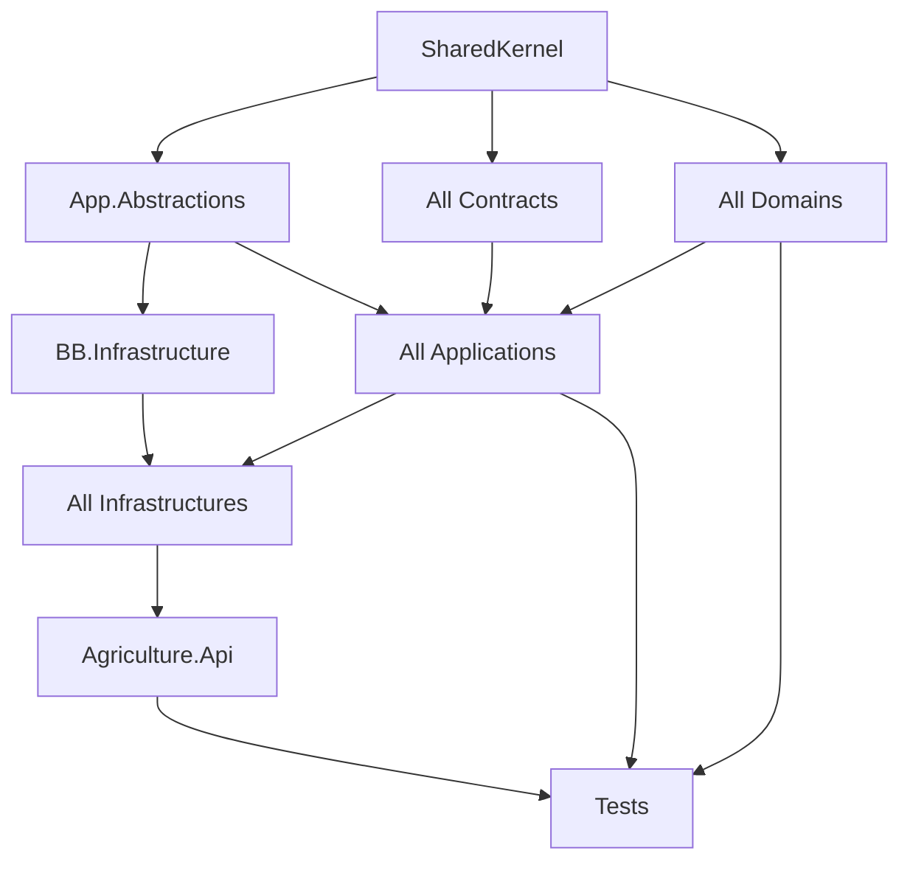

## 17.5 Foreign Contracts Reference Examples

| Consumer Application | Allowed Contracts references |
|----------------------|------------------------------|
| Tasks.Application | Producers.Contracts, Workflows.Contracts, Identity.Contracts (user directory), Inspections.Contracts (if gating), Notifications.Contracts |
| Harvest.Application | Seasons.Contracts, Inspections.Contracts, Workflows.Contracts, Notifications.Contracts |
| Workflows.Application | Tasks.Contracts, Notifications.Contracts |
| Seasons.Application | Workflows.Contracts, Inspections.Contracts |
| Reporting.Application | many Contracts events (consume), not Domains |
| Notifications.Application | Identity.Contracts (device user resolution) |

Exact edges must remain consistent with MODULE_DESIGN §4.2 matrix; when in doubt, prefer publishing more event data over adding a sync ACL.

## 17.6 Package Reference Conventions (High Level)

| Package | Where allowed | Where forbidden |
|---------|---------------|-----------------|
| MediatR | Application, Api, BB behaviors | Domain |
| FluentValidation | Application | Domain |
| EF Core | Infrastructure, BB.Infrastructure | Domain, Contracts, Application |
| Hangfire | Infrastructure, Api | Domain, Application |
| ASP.NET Core | Api (and Infrastructure only when unavoidable for IHttpContextAccessor adapters — prefer BB.Infrastructure) | Domain |
| MinIO client | Infrastructure / BB | Domain |
| Serilog | Api, BB, Infrastructure | Domain ( Domains use no loggers ideally; Application may log) |

---

# 18. Appendices

## Appendix A — Sample Full Solution Tree

```text
/
├── Agriculture.sln
├── Directory.Build.props
├── Directory.Packages.props
├── global.json
├── .editorconfig
├── .gitignore
├── README.md
├── docs/
│   ├── README.md
│   ├── PRODUCT_VISION.md
│   ├── SRS.md
│   ├── PRD.md
│   ├── DOMAIN_ANALYSIS.md
│   ├── AGGREGATE_DESIGN.md
│   ├── EVENT_STORMING.md
│   ├── MODULE_DESIGN.md
│   ├── ADR.md
│   ├── PHYSICAL_ARCHITECTURE.md
│   └── SOLUTION_ARCHITECTURE.md          # this document
├── build/
│   └── docker/
│       ├── Dockerfile.api
│       └── .dockerignore
├── deployment/
│   ├── compose/
│   │   ├── docker-compose.yml
│   │   └── docker-compose.override.yml
│   ├── proxy/
│   └── env/
├── scripts/
│   ├── dev/
│   └── db/
├── .github/
│   ├── CODEOWNERS
│   ├── pull_request_template.md
│   └── workflows/
│       ├── ci.yml
│       └── release.yml
├── frontend/
├── mobile/
├── src/
│   ├── Hosts/
│   │   └── Agriculture.Api/
│   ├── BuildingBlocks/
│   │   ├── Agriculture.SharedKernel/
│   │   ├── Agriculture.Application.Abstractions/
│   │   └── Agriculture.Infrastructure/
│   └── Modules/
│       ├── Identity/          {Domain,Application,Infrastructure,Contracts}
│       ├── Producers/         {Domain,Application,Infrastructure,Contracts}
│       ├── Lands/             {Domain,Application,Infrastructure,Contracts}
│       ├── Seasons/           {Domain,Application,Infrastructure,Contracts}
│       ├── Workflows/         {Domain,Application,Infrastructure,Contracts}
│       ├── Tasks/             {Domain,Application,Infrastructure,Contracts}
│       ├── Inspections/       {Domain,Application,Infrastructure,Contracts}
│       ├── Harvest/           {Domain,Application,Infrastructure,Contracts}  # includes Delivery
│       ├── Support/           {Domain,Application,Infrastructure,Contracts}
│       ├── Notifications/     {Domain,Application,Infrastructure,Contracts}
│       ├── Communication/     {Domain,Application,Infrastructure,Contracts}
│       ├── Reporting/         {Domain,Application,Infrastructure,Contracts}
│       └── Administration/    {Domain,Application,Infrastructure,Contracts}
└── tests/
    ├── Architecture.Tests/
    ├── Api.IntegrationTests/
    ├── Performance.Tests/
    └── (module test projects)
```

## Appendix B — Glossary

| Term | Meaning in this SAS |
|------|---------------------|
| Module | Bounded context deployable unit inside the monolith with four projects |
| Host | `Agriculture.Api` composition root |
| Contracts | Public cross-module surface (events + ACL interfaces) |
| Shared Kernel | Cross-module primitives only |
| Building Blocks | SharedKernel + Application.Abstractions + BB Infrastructure |
| Integration Event | Cross-module, versioned, outbox-delivered |
| Domain Event | In-module aggregate event |
| ACL | Anti-corruption / read gateway via Contracts |
| Delivery (crop) | Aggregate inside Harvest module |
| SupportFulfillment | Support module fulfillment (not crop Delivery) |
| WorkTask | CLR name for Task aggregate root |
| Schema-per-module | SQL schema ownership boundary |
| Composition root | Sole place that wires DI for the process |

## Appendix C — Checklist: Adding a New Module

1. Confirm business need with DOMAIN_ANALYSIS / product docs; obtain Architecture Board approval + ADR if new bounded context.
2. Update MODULE_DESIGN module catalog and dependency matrix.
3. Update this SAS Sections 4, 6, 17 and Appendix A.
4. Create folder `src/Modules/{Name}/` with Domain, Application, Infrastructure, Contracts projects.
5. Set root namespaces and ProjectReferences per Section 17.2.
6. Add schema name and DbContext; ensure no cross-schema FKs.
7. Implement `Add{Name}Module` extension.
8. Register module from `ModuleRegistrationExtensions` in Api.
9. Add Controllers under `Agriculture.Api/Controllers/{Name}`.
10. Add CODEOWNERS entry.
11. Add Architecture.Tests coverage for the new assembly rules.
12. Add unit test project skeleton.
13. Document Contracts events and ACL interfaces.
14. Add configuration Options if needed; update `.env.example`.
15. Consider Hangfire queues and MinIO path prefixes.
16. Do **not** put types into SharedKernel to “make it compile faster.”

## Appendix D — Cross-Reference to ADR Numbers

| ADR | Title (short) | SAS sections impacted |
|-----|---------------|------------------------|
| ADR-001 | Modular Monolith | 1, 2, 3, 17 |
| ADR-002 | Clean Architecture | 3, 4, 6 |
| ADR-003 | CQRS | 4 Application folders, 16 |
| ADR-004 | MediatR | 7, 12 |
| ADR-005 | SQL Server | 8, 15 |
| ADR-006 | EF Core | 4 Infrastructure Persistence |
| ADR-007 | Hangfire | 11, 12 |
| ADR-008 | SignalR | 12 Hubs |
| ADR-009 | FCM | 4 Notifications, 8 |
| ADR-010 | MinIO | 10 |
| ADR-011 | Serilog | 9 |
| ADR-012 | Seq | 8, 9 |
| ADR-013 | Authentication JWT | 8, 12 Auth |
| ADR-014 | Authorization | 12 Auth, 16 permissions |
| ADR-015 | Caching | 7 lifetimes, future Redis |
| ADR-016 | Database strategy schemas | 4.15, 6 |
| ADR-017 | Module communication | 6 |
| ADR-018 | Exception handling | 12 Middleware |
| ADR-019 | Validation FluentValidation | 7, 16 |
| ADR-020 | Deployment | 2 deployment/, 15 |

## Appendix E — Relationship Summary Diagram

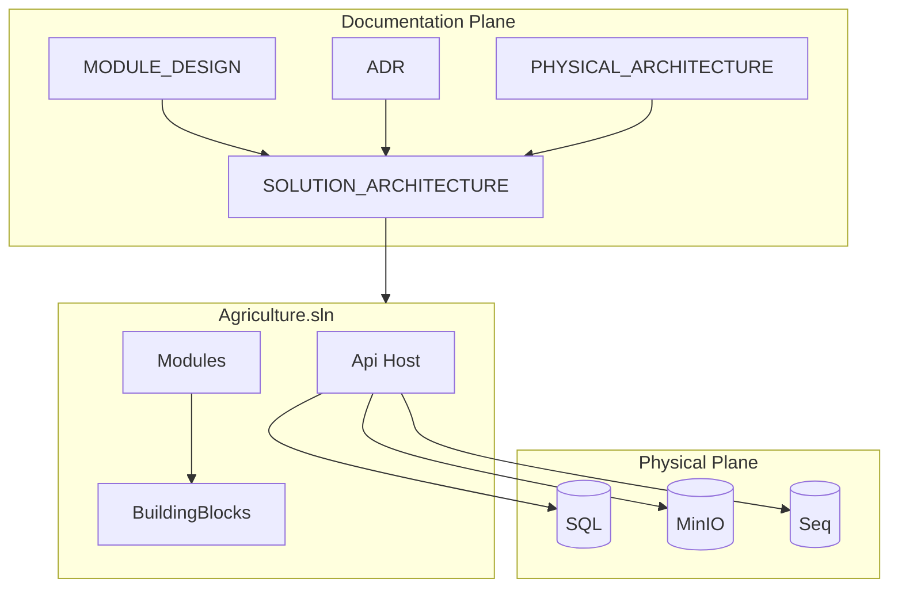

## Appendix F — Document Usage Scenarios

### Scenario 1 — New engineer first week

Read PRODUCT_VISION → MODULE_DESIGN §1–5 → this SAS §§1–6 → implement a small query in an existing module using Section 16 naming.

### Scenario 2 — Adding Delivery UI fields

Do **not** create `Modules/Delivery`. Extend Harvest module Application `Commands/Deliveries` and Api `DeliveriesController` per §4.8.

### Scenario 3 — Extracting Notifications later

SAS already isolates Notifications Contracts and Infrastructure adapters; follow MODULE_DESIGN §10 prerequisites; create superseding ADR; physical move guided by PHYSICAL_ARCHITECTURE.

### Scenario 4 — Suspected dependency violation

Run Architecture.Tests; consult §6 matrix; fix by introducing Contracts abstraction rather than project reference to foreign Domain.

## Appendix G — Non-Exhaustive Anti-Pattern Catalog (Solution Level)

1. `Agriculture.Core` project containing everything.
2. Single DbContext for all modules.
3. Shared `Entities` folder at repo root.
4. Controllers in Domain.
5. Frontend under `src/Modules`.
6. Secrets in `appsettings.Production.json` committed.
7. Skipping Contracts “just this once.”
8. Promoting Producer to SharedKernel.
9. Hangfire job duplicating handler logic.
10. Public MinIO buckets for photos.
11. SignalR as sole mobile push channel.
12. Auto-migrate production on startup.
13. Mixing Minimal APIs and Controllers per module without ADR.
14. Creating System module overlapping Administration + Identity.
15. Naming Support fulfillment `Delivery` in code.

---


---

# 19. Expanded Module Implementation Guides (Normative Detail)

This section deepens Section 4 so that module owners can scaffold without structural questions. It does not change MODULE_DESIGN boundaries; it operationalizes them into file-level expectations, transaction notes, event catalogs, permission strings, and DI method signatures.

## 19.1 Identity — Implementation-Ready Detail

### Ubiquitous language alignment

Identity speaks in Users, Roles, Permissions, Refresh Tokens, Login History. It does not speak in Producers. Linking a Producer to a User happens via integration policy (Host/ACL command), not by embedding Producer inside User.

### Aggregate transaction examples

| Command | Aggregate touched | Side effects |
|---------|-------------------|--------------|
| Login | User + RefreshToken family | LoginHistory row; optional integration audit event |
| RefreshToken | RefreshToken rotation | Old token invalidated; reuse detection may revoke family |
| DeactivateUser | User | Revoke tokens; `UserDeactivatedV1` outbox |
| AssignRole | User (or Role join) | `RoleAssignedV1` if consumers need it |

### Suggested permission strings

```text
identity.users.read
identity.users.create
identity.users.update
identity.users.deactivate
identity.roles.manage
identity.permissions.manage
identity.audit.read
```

### Contracts method surface (minimum)

`IUserDirectory`:

- `Task<bool> ExistsAsync(Guid userId, CancellationToken ct)`
- `Task<UserSummary?> GetSummaryAsync(Guid userId, CancellationToken ct)` where `UserSummary` includes DisplayName, IsActive, Email (masked policies as needed)

`IPermissionChecker` (optional):

- `Task<bool> HasPermissionAsync(Guid userId, string permission, CancellationToken ct)`

### Infrastructure registration checklist

1. `AddDbContext<IdentityDbContext>` with MigrationsAssembly = Identity.Infrastructure, schema `identity`.
2. Register `IUserRepository`, `ITokenService`, `IPasswordHasherPort`.
3. Register Contracts implementations as Scoped.
4. Register recurring `PurgeExpiredRefreshTokensJob`.
5. Ensure JWT options validation on startup.

### Testing focus

- Token reuse detection.
- Last admin deactivation prevention (collaborate with Administration policy).
- Password policy domain service unit tests.

### Extraction notes

Identity may later move behind municipal SSO. Keep password hashing and token issuance behind ports so OIDC adapters can replace local login without rewriting Producers.

---

## 19.2 Producers — Implementation-Ready Detail

### Invariants that must remain in Domain

- Identity number uniqueness is enforced with repository collaboration in Application but final decision/state changes go through Producer methods.
- No duplicate land assignment for the same land while active.
- No two active seasons for the same land on the producer assignment model.

### Projection guidance

Support/Inspection/Harvest histories on producer screens are read models updated by integration event handlers in Producers.Application/EventHandlers — not foreign DbContext queries.

### MinIO object metadata fields on documents

Persist at least: ObjectKey, Bucket, ContentType, SizeBytes, Sha256, UploadedAt, UploadedBy.

### Permissions

```text
producers.read
producers.create
producers.update
producers.deactivate
producers.assign
```

### Contracts consumers

Tasks, Support, Communication, Reporting, Notifications (indirect), Administration (ops views).

### Common mistake to reject in PR

Referencing `Agriculture.Modules.Lands.Domain` from Producers.Application to “reuse Land entity.” Use `ILandDirectory` instead.

---

## 19.3 Lands — Implementation-Ready Detail

### Anti-goal enforcement in structure

Do not add projects like `Agriculture.Modules.Lands.GisEngine`. If GIS is required later, create an Infrastructure adapter to an external GIS service behind a port — still not a Domain dependency on GIS SDKs.

### Archive semantics

`ArchiveLand` command sets status; archived lands fail ACL `IsAssignableAsync` checks used by Producers/Seasons.

### Permissions

```text
lands.read
lands.create
lands.update
lands.archive
lands.assign
```

### Indexes (representative)

- Unique ParcelIdentifier per municipality/tenant.
- Filter by Status for searchable lists.

---

## 19.4 Seasons — Implementation-Ready Detail

### Lifecycle commands and guards

| Command | Guard via Contracts |
|---------|---------------------|
| StartSeason | Municipal settings / feature flags optional |
| CompleteSeason | Harvest/Delivery completion checks may be policy-driven via events/read models — do not join harvest schema |
| AssignWorkflow | `IWorkflowGateway` ensures published version exists |

### Timeline read model

`GetSeasonTimeline` query should read a projection table in `seasons` schema updated by workflow/task/inspection/harvest events — not live cross-module joins.

### Permissions

```text
seasons.read
seasons.create
seasons.update
seasons.lifecycle
seasons.assignworkflow
```

---

## 19.5 Workflows — Implementation-Ready Detail

### Versioning folder practice

```text
Domain/Entities/WorkflowVersion.cs
Application/Commands/PublishWorkflow/
Infrastructure/Persistence/Configurations/WorkflowVersionConfiguration.cs
```

Publishing creates an immutable version snapshot used by running instances; editing draft does not mutate published versions.

### Step advancement

Advancement commands validate ordering in Domain. Tasks completion integration may request advancement via Contracts/events — Workflows never loads Task entities.

### Permissions

```text
workflows.read
workflows.create
workflows.publish
workflows.archive
workflows.advance
```

### Event catalog (integration)

- `WorkflowPublishedV1`
- `WorkflowStepAdvancedV1`
- `WorkflowCompletedV1` (Harvest eligibility)

---

## 19.6 Tasks — Implementation-Ready Detail

### CLR naming reminder

Use `WorkTask` in code; routes and permissions use `tasks`.

### Overdue sweep job algorithm (structural)

1. Hangfire recurring job opens scope.
2. Sends `MarkOverdueTasksCommand` or processes in batches via query service + commands.
3. Emits notifications through `INotificationPublisher` with task ids and assignee user ids in payload.
4. Logs counts to Serilog with Module=Tasks.

### Photo upload flow folders

```text
Application/Commands/AttachTaskPhoto/
Infrastructure/Storage/TaskPhotoPaths.cs
Api Controllers/Tasks/TasksController.cs action UploadPhoto
```

Validate size/content-type in Application; store MinIO; save metadata on aggregate.

### Permissions

```text
tasks.read
tasks.create
tasks.assign
tasks.complete
tasks.cancel
```

### Critical indexes

`(AssigneeUserId, Status, DueDate)` filtered where not deleted — per ADR guidance.

---

## 19.7 Inspections — Implementation-Ready Detail

### Gate contract semantics

`IInspectionGate.HasBlockingInspection(scope)` returns true if open blocking inspections exist for the season/workflow/land scope defined by MODULE_DESIGN. Consumers: Seasons, Workflows, Harvest Application handlers before transitions.

### Immutability

Completed inspections: Domain rejects mutations; Infrastructure may use row version + status check; soft delete disabled for completed evidence.

### Permissions

```text
inspections.read
inspections.create
inspections.schedule
inspections.complete
inspections.cancel
```

---

## 19.8 Harvest + Delivery — Implementation-Ready Detail

### Dual aggregate transaction pattern (in-module only)

When `CreateDelivery` runs:

1. Load Harvest aggregate; invoke method that reserves/records delivered amount.
2. Create Delivery aggregate with quantity.
3. Save both via repositories in one Infrastructure Unit of Work / single DbContext transaction.
4. Raise domain events; map to integration events after commit.

This multi-aggregate transaction is allowed **because both aggregates share the Harvest module**. It is forbidden across modules.

### Schema note

Tables physically in schemas `harvest` and `delivery`, both migrated by Harvest.Infrastructure. Still no FKs to `seasons` schema — store `SeasonId` GUID only.

### Permissions

```text
harvest.read
harvest.start
harvest.complete
harvest.cancel
delivery.read
delivery.create
delivery.complete
delivery.cancel
```

### Folder clarity

Keep Delivery feature folders visually separate under Application to avoid accidental “god HarvestService” that mutates everything without aggregate methods.

---

## 19.9 Support — Implementation-Ready Detail

### Naming

Use `SupportFulfillment` everywhere in code and DB tables (`support.Fulfillments`). Never `SupportDelivery`.

### Permissions

```text
support.read
support.request
support.approve
support.reject
support.fulfill
```

### Collaboration

Approve/reject may notify via Notifications; Reporting consumes completion events; Producer summary projections update via events.

---

## 19.10 Notifications — Implementation-Ready Detail

### Publisher contract payload guidelines

`INotificationPublisher.PublishAsync(NotificationRequest request)` where request includes:

- RecipientUserId / RecipientProducerId
- Channel preference hint
- Template key
- Data dictionary (serializable primitives)
- CorrelationId
- IdempotencyKey

### Channel adapters folder

```text
Infrastructure/Services/Channels/
  FcmChannelSender.cs
  EmailChannelSender.cs
  SmsChannelSender.cs
  InAppChannelSender.cs
```

### Device token storage

Belong in Notifications schema; Identity does not store FCM tokens.

### Permissions

```text
notifications.read.self
notifications.admin.read
notifications.templates.manage
```

### Sink rule enforcement

Architecture tests can assert Notifications.Application does not reference Tasks/Producers/Harvest Domain or Infrastructure — only Contracts and SharedKernel/BB.

---

## 19.11 Communication — Implementation-Ready Detail

### Distinction table

| Module | User-visible concept | System push |
|--------|----------------------|-------------|
| Communication | Conversations/messages between actors | Optional “new message” via Notifications |
| Notifications | Alerts, reminders, system messages | Primary |
| Support | Benefit programs | Via Notifications on status change |

### Attachments

Documents/photos use MinIO Documents/Photos buckets with `communication` module prefix in keys.

### Permissions

```text
communication.read
communication.send
communication.moderate
```

---

## 19.12 Reporting — Implementation-Ready Detail

### Run lifecycle

`EnqueueReportRun` writes ReportRun Pending → Hangfire `GenerateReportJob` → render → MinIO Reports bucket → status Completed/Failed → optional notification.

### Data access rule

Reporting Infrastructure may maintain its own projection tables populated by event handlers. It must not create SQL views that join `tasks` and `producers` schemas directly in v1 if that creates extraction hazards — prefer projected tables inside `reporting`.

### Permissions

```text
reporting.read
reporting.define
reporting.run
reporting.admin
```

---

## 19.13 Administration — Implementation-Ready Detail

### Settings vs secrets

| Allowed in admin DB | Never in admin DB |
|---------------------|-------------------|
| Feature flags | JWT signing keys |
| Retention days config | MinIO secret keys |
| Municipal display name | FCM server credentials |
| Maintenance mode flag | SQL passwords |

### Audit export job

Exports audit trails to MinIO Archive with Administration job; secured download via Api with permissions.

### Permissions

```text
admin.settings.read
admin.settings.update
admin.featureflags.manage
admin.audit.export
```

---

# 20. Expanded Dependency Governance

## 20.1 Decision Tree for Cross-Module Need

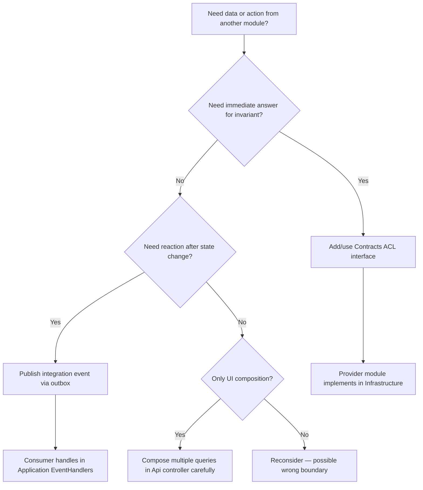

## 20.2 Worked Example — Complete Task Advances Workflow

1. Tasks.Domain `WorkTask.Complete` raises `TaskCompleted` domain event.
2. Tasks.Infrastructure outbox stores `TaskCompletedV1` integration event.
3. Relay publishes in-process.
4. Workflows.Application handler loads workflow instance by id from payload (id only), sends `AdvanceWorkflowStepCommand` internally.
5. Workflows never references Tasks.Domain types — only Contracts event.
6. If Notifications needed, Tasks or Workflows publish to `INotificationPublisher` with payload fields — Notifications remains sink.

## 20.3 Worked Example — Forbidden Shortcut

Engineer adds ProjectReference from Tasks.Infrastructure to Producers.Infrastructure to query `ProducersDbContext` for phone numbers. **Rejected.** Correct path: extend `IProducerDirectory` with `GetContactChannelsAsync` or include phone in event payload when producer updates.

## 20.4 Architecture Test Pseudocode Catalog

Teams should implement tests equivalent to:

1. Types in `*.Domain` namespaces do not depend on `Microsoft.EntityFrameworkCore`.
2. Types in `*.Domain` do not depend on `Hangfire`.
3. Project reference graph: Application assemblies do not reference Infrastructure assemblies.
4. No references among `*.Domain` projects.
5. Contracts assemblies reference only SharedKernel (and approved messaging markers).
6. Api does not reference `*.Domain` projects.
7. SharedKernel has no references to `Agriculture.Modules.*`.

## 20.5 Exception Process

Temporary spikes may use `#pragma` or InternalsVisibleTo only inside the spike branch. Merging to main requires removing exceptions or converting to a Board-approved ADR with time box.

---

# 21. Expanded DI and Pipeline Specifications

## 21.1 Behavior Order Specification

Authoritative order for `IPipelineBehavior` registration (first registered = outer for typical MediatR versions — **verify against MediatR version in use and document actual order in Host comments**):

1. `UnhandledExceptionBehavior` — convert unexpected exceptions to logged failures.
2. `LoggingBehavior` — start/stop with timing.
3. `AuthorizationBehavior` — permission attributes on requests.
4. `ValidationBehavior` — FluentValidation.
5. `TransactionBehavior` — unit of work for commands only (queries skip).

Each behavior lives under `Agriculture.Application.Abstractions/Behaviors` or `Agriculture.Infrastructure` if it needs EF UoW — prefer abstractions + infra implementation.

## 21.2 Unit of Work Pattern Placement

| Component | Project |
|-----------|---------|
| `IUnitOfWork` | Application.Abstractions |
| EfUnitOfWork / interceptor outbox | BB.Infrastructure or module Infrastructure |
| Calling SaveChanges | TransactionBehavior or handler (pick one style and standardize) |

**SAS recommendation:** TransactionBehavior calls `IUnitOfWork.SaveChangesAsync` after successful command handler for types implementing `ICommand`. Handlers should not double-save.

## 21.3 DbContext Registration Options

Use `builder.Services.AddDbContext<T>` with:

- Connection string name `AgricultureDatabase`
- `MigrationsHistoryTable` per schema (`__EFMigrationsHistory`, schema: module schema)
- Enable retry on failure for SQL transient errors in Production
- Query tracking default NoTracking for separate read contexts if introduced later

## 21.4 MediatR Assembly List Maintenance

`ModuleRegistrationExtensions` should expose `IEnumerable<Assembly> GetModuleApplicationAssemblies()` used by MediatR registration to avoid forgetting a module when scanning.

## 21.5 Scoped Job Execution Template

Every Hangfire job:

1. Inject `IServiceScopeFactory`.
2. Create scope.
3. Resolve `ISender`/`IMediator`.
4. Send command.
5. Dispose scope.
6. Let exceptions bubble for Hangfire retry.

## 21.6 Captive Dependency Watch List

| Risky registration | Why |
|--------------------|-----|
| Singleton service depending on DbContext | Captive dependency |
| Singleton `IUserContext` | User bleeds across requests |
| Singleton validator with scoped ACL service | Hidden scoped capture |

## 21.7 Feature Flag Behavior (Optional)

`FeatureFlagBehavior` may short-circuit commands when maintenance mode is enabled, returning a standardized error. Registered only if Administration module is present.

---

# 22. Expanded API Surface Conventions

## 22.1 Route Catalog (Illustrative Normative Patterns)

| Module | Base route | Examples |
|--------|------------|----------|
| Identity | `api/v1/auth`, `api/v1/users` | `POST auth/login`, `POST auth/refresh` |
| Producers | `api/v1/producers` | `GET producers/{id}` |
| Lands | `api/v1/lands` | `POST lands` |
| Seasons | `api/v1/seasons` | `POST seasons/{id}/start` |
| Workflows | `api/v1/workflows` | `POST workflows/{id}/publish` |
| Tasks | `api/v1/tasks` | `POST tasks/{id}/complete` |
| Inspections | `api/v1/inspections` | `POST inspections/{id}/complete` |
| Harvest | `api/v1/harvests` | `POST harvests/{id}/complete` |
| Delivery | `api/v1/deliveries` | `POST deliveries` |
| Support | `api/v1/support` | `POST support/{id}/approve` |
| Notifications | `api/v1/notifications` | `GET notifications/me` |
| Communication | `api/v1/conversations` | `POST conversations/{id}/messages` |
| Reporting | `api/v1/reports` | `POST reports/runs` |
| Administration | `api/v1/admin/settings` | `PUT admin/feature-flags/{key}` |

## 22.2 Controller Method Skeleton Rules

Each action:

1. Bind request model (API-local request record allowed; map to command).
2. Send via `ISender`.
3. Map Result to HTTP codes: NotFound→404, Validation→400, Conflict→409, Forbidden→403, Success→200/201/204.
4. Never catch and return 500 with empty body — middleware handles unknowns.

## 22.3 Pagination Query Parameters

Standardize on SharedKernel pagination:

- `page` (1-based)
- `pageSize` (max capped, e.g., 100)
- `sort` optional
- `search` optional

## 22.4 File Upload Endpoints

- Use `multipart/form-data`.
- Controller passes stream to command / application service port.
- Do not buffer unbounded into memory — enforce size limits via middleware/features.
- Return metadata DTO including object key id, not raw MinIO URLs long-lived.

## 22.5 Error Response Shape

Align ADR-018: problem details or standard envelope with `code`, `message`, `correlationId`, `errors[]` for validation. Host middleware owns serialization.

## 22.6 OpenAPI Tagging

Tags must match module names for Swagger UI grouping: Identity, Producers, Lands, Seasons, Workflows, Tasks, Inspections, Harvest, Deliveries, Support, Notifications, Communication, Reporting, Administration.

## 22.7 Hub Method Conventions

- Hub methods named as commands: `SubscribeToSeasonDashboard(seasonId)`.
- Authorize per group.
- Server pushes DTOs defined in Application or Contracts read models — not EF entities.

## 22.8 Health Check Detail

Ready check failure messages must not leak connection strings. Log details to Seq; return generic degraded status to probes.

## 22.9 API Versioning Policy Expansion

- Additive fields: non-breaking.
- Removing/renaming fields: new version.
- Permission renames: coordinated with Identity seeding and mobile/web clients.
- Integration events version independently from HTTP versions.

---

# 23. Expanded Coding Conventions and Review Heuristics

## 23.1 Domain Modeling Conventions

- Prefer expressive methods (`Complete(completionInfo)`) over public setters.
- Keep collections encapsulated; expose `IReadOnlyCollection`.
- Raise domain events inside aggregate methods after state change succeeds.
- Value objects implement equality by value; validate in factory/`Create` methods.

## 23.2 Application Handler Conventions

- Handlers orchestrate: load aggregate → call domain → persist → (events via UoW/outbox).
- Handlers may call Contracts ACL services.
- Handlers must not call other handlers as a substitute for domain design without reason (prefer domain/events).
- Keep handlers thin enough to read in one screen when possible; extract domain services for complex pure policy.

## 23.3 Infrastructure Mapping Conventions

- Fluent API configurations only.
- Shadow properties for audit if needed carefully — prefer AuditableEntity fields.
- Enum conversions explicit.
- Hexadecimal/rowversion concurrency tokens on contested aggregates (Task, Inspection, Harvest).

## 23.4 Naming Anti-Patterns

| Bad | Good |
|-----|------|
| `TaskServiceManagerHelper` | `CompleteWorkTaskCommandHandler` + domain methods |
| `CommonDto` | `WorkTaskDto` |
| `DataRepository` | `WorkTaskRepository` |
| `ProcessEverythingJob` | `SweepOverdueTasksJob` |
| `Utils.cs` in Domain | Specific `WorkflowSequencingService` |

## 23.5 PR Review Heuristics for Structure

Reviewers ask:

1. Is the new type in the correct project layer?
2. Did any ProjectReference violate Section 6?
3. Are integration events versioned and in Contracts?
4. Are MinIO keys built in Infrastructure Storage helpers?
5. Are permissions named and authorized on endpoints + handlers?
6. Are migrations in the owning module only?
7. Did SharedKernel grow without Steward approval?
8. Are tests updated (unit for domain, architecture if references change)?

## 23.6 Asynchronous and Cancellation Conventions

- All IO methods accept `CancellationToken`.
- Hangfire jobs use job token where available.
- Do not use `.Result` or `.Wait()` on async calls in AspNet/request threads.

## 23.7 Time and Culture Conventions

- Store UTC timestamps in SQL.
- Convert for display in clients.
- Use `IDateTimeProvider` for testability in Application/Domain decisions involving “now.”

## 23.8 Localization Conventions

- API error codes stable in English code form; messages may localize later.
- Template keys for Notifications are stable identifiers; localized content in Notifications resources/templates tables.

## 23.9 Comment and Documentation Conventions

- Do not comment what code already says.
- Document invariant rationale when non-obvious and not already in AGGREGATE_DESIGN — prefer linking to doc section IDs.
- Public Contracts interfaces require XML docs for parameters and failure modes.

## 23.10 Analyzer Suppression Policy

- Suppressions require justification comment and issue link.
- Never suppress architecture test failures.
- Security analyzer findings need security reviewer ACK.

---

# 24. Configuration Keys Exhaustive Map (Implementation Aid)

## 24.1 Environment Variable Mapping Examples

| Config path | Env var |
|-------------|---------|
| `ConnectionStrings:AgricultureDatabase` | `ConnectionStrings__AgricultureDatabase` |
| `Jwt:SigningKey` | `Jwt__SigningKey` |
| `Minio:SecretKey` | `Minio__SecretKey` |
| `Seq:ApiKey` | `Seq__ApiKey` |
| `Firebase:CredentialJsonPath` | `Firebase__CredentialJsonPath` |
| `Hangfire:WorkerCount` | `Hangfire__WorkerCount` |
| `Cors:AllowedOrigins:0` | `Cors__AllowedOrigins__0` |

## 24.2 Startup Validation Checklist

On boot, validate:

1. Connection string present.
2. JWT signing key present and sufficient length.
3. MinIO endpoint reachable only for readiness — not necessarily blocking cold start if Board chooses soft dependency, but ready probe must catch it.
4. Firebase credential available if Notifications push enabled.
5. Seq URL present in non-dev if logging requires it (or fallback to console).

Fail fast on missing JWT/SQL in Production.

## 24.3 Per-Module Configuration Sections

```text
Identity:
  Password:
    RequiredLength
    RequireDigit
  RefreshTokenPurgeCron
Producers:
  MaxDocumentSizeBytes
Tasks:
  OverdueCron
  ReminderCron
Inspections:
  MaxPhotoSizeBytes
Harvest:
  MaxDeliveryDocumentSizeBytes
Notifications:
  DefaultChannel
  MaxRetry
Reporting:
  MaxConcurrentRuns
Administration:
  MaintenanceMode
```

Module Options classes bind these sections; Host does not switch on module business settings except maintenance mode middleware.

---

# 25. Observability and Operability Folders

## 25.1 Serilog Enrichers Location

```text
Agriculture.Infrastructure/Logging/Enrichers/
  CorrelationIdEnricher.cs
  UserIdEnricher.cs
  ModuleEnricher.cs
```

## 25.2 Audit Trail Dual Home

1. **Seq** for operational search.
2. **SQL audit tables / Administration exports** for municipal long-term evidence.

Modules write audit-significant structured logs and/or audit rows per MODULE_DESIGN §8.4. Do not invent a third logging product without ADR.

## 25.3 Hangfire Monitoring Ownership

DevOps monitors queue depth; Module owners own job correctness; Host Owner owns dashboard auth.

## 25.4 Runbook Pointers (Docs vs Deployment)

Operational runbooks may live under `docs/runbooks/` in future; PHYSICAL_ARCHITECTURE remains authoritative for topology. This SAS only pins where code and config live.

---

# 26. Frontend and Mobile Repository Contracts (Non-.NET but Structural)

## 26.1 frontend/

- Consumes OpenAPI or documented routes from Section 22.
- Auth via JWT access + refresh flow matching Identity endpoints.
- SignalR client for dashboards.
- Never embeds signing keys.

## 26.2 mobile/

- Registers FCM device tokens via Notifications endpoints.
- Uploads photos via API.
- Handles offline UX but authoritative state remains server aggregates.
- Does not treat SignalR as background push substitute.

## 26.3 Shared API Client Generation (Optional)

If adopted, generated clients go under `frontend/src/api/generated` and `mobile/...` — not under `src/` .NET modules. Scripts in `scripts/codegen` regenerate from OpenAPI artifact published by CI.

---

# 27. Migration and Data Ownership Playbook

## 27.1 Creating a Migration

```text
dotnet ef migrations add {Name} \
  --project src/Modules/{M}/Agriculture.Modules.{M}.Infrastructure \
  --startup-project src/Hosts/Agriculture.Api \
  --context {M}DbContext \
  --output-dir Persistence/Migrations
```

## 27.2 Applying Migrations

Prefer explicit:

```text
dotnet ef database update --project ... --startup-project ... --context ...
```

Or dedicated migrator job in release pipeline. Production: backup first (ADR-020).

## 27.3 Cross-Module Data Movement

If a column “belongs” to the wrong module historically, fix via:

1. Dual-write period with events.
2. Backfill projection.
3. Remove illicit read.

Never add cross-schema FK as a shortcut.

---

# 28. Security Structure Crosswalk

| Concern | Solution home |
|---------|---------------|
| Password hashing | Identity.Infrastructure |
| JWT issuance/validation | Identity + Api Auth middleware |
| Permission policies | Api Auth + Identity seed + module permission constants |
| Rate limiting | Api middleware/config |
| PII in logs | Logging enrichers + masking rules |
| Object storage access | Module Storage + Api mediation |
| Hangfire dashboard | Api Hangfire auth |
| Secrets | env/vault — not SQL Administration |

---

# 29. Full Mermaid — Solution Graph

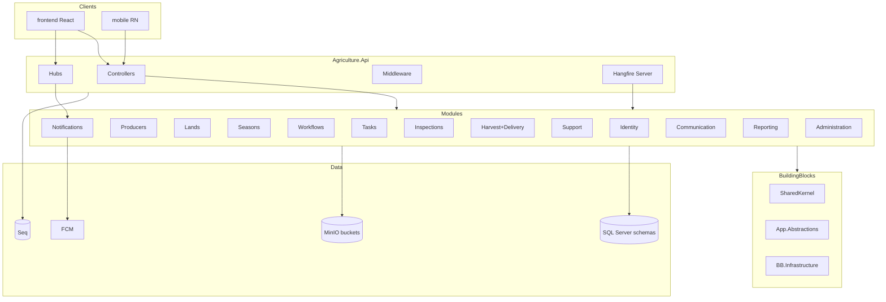

---

# 30. Closing Compliance Statement

This Solution Architecture Specification is **Draft 1.0** and is binding for scaffolding and structural PR review once Architecture Board moves Status to Accepted. Until Accepted, implementers follow it as the target authoritative structure and escalate contradictions with MODULE_DESIGN, ADR, or PHYSICAL_ARCHITECTURE to the Board — **those documents win** in any conflict, and this SAS must be patched accordingly.

If a conflict is found:

1. Do not “fix” production to match an erroneous SAS sentence.
2. File a doc defect against SAS.
3. Align SAS to Accepted ADRs/MODULE_DESIGN in the same PR when possible.


---

# 31. Module-by-Module Interior File Inventories (Target Baseline)

The inventories below list the **minimum baseline files** expected when a module is considered structurally complete for MVP scaffolding. They are not exhaustive feature lists; they are the structural skeleton reviewers expect to exist (or be explicitly deferred with a tracking issue).

## 31.1 Identity Baseline Inventory

**Domain:** `User.cs`, `RefreshToken.cs`, `LoginHistory.cs`, `PasswordHistory.cs`, `Role.cs`, `Permission.cs`, `UserRole.cs`, `RolePermission.cs`, value objects `Email`, `PhoneNumber`, `FullName`, `PasswordHash`, events listed in §4.1, `IUserRepository.cs`, `PasswordComplexityPolicy.cs`.

**Application:** command folders for Register/Update/Deactivate/AssignRole/Login/Logout/Refresh/ChangePassword/ResetPassword; query folders for GetUser/GetUsers/GetRoles/GetPermissionMatrix/GetLoginHistory/GetMyProfile; `IdentityPermissions.cs`; validators per command; `ITokenService` port.

**Infrastructure:** `IdentityDbContext.cs`, entity configurations for each table, initial migration, `UserRepository.cs`, `JwtTokenService.cs`, `PasswordHasherAdapter.cs`, `PurgeExpiredRefreshTokensJob.cs`, `AddIdentityModule` extension.

**Contracts:** `UserRegisteredV1`, `UserDeactivatedV1`, `RoleAssignedV1`, `IUserDirectory`, optional `IPermissionChecker`.

**Api:** `AuthController`, `UsersController`, `RolesController`.

## 31.2 Producers Baseline Inventory

**Domain:** `Producer` aggregate + photo/document/address/contact/assignment entities; `IdentityNumber` VO; assignment domain service; `IProducerRepository`; core domain events.

**Application:** Register/Update/AssignLand/AssignSeason/Deactivate/UploadDocument commands; search/list/detail queries; event handlers for projection updates; validators; `ProducersPermissions`.

**Infrastructure:** `ProducersDbContext`, configurations, migrations, repository, `ProducerObjectPaths`, optional projection rebuild job, `AddProducersModule`.

**Contracts:** `IProducerDirectory`, producer integration events V1.

**Api:** `ProducersController` including document upload action.

## 31.3 Lands Baseline Inventory

**Domain:** `Land` aggregate, status enum, archive behavior, coordinate/area VOs, `ILandRepository`, land events.

**Application:** Register/Update/Archive/Assign commands; search queries; ACL-facing read services implementing Contracts.

**Infrastructure:** `LandsDbContext`, configurations, migrations, repository, `AddLandsModule`.

**Contracts:** `ILandDirectory`, `LandRegisteredV1`, `LandArchivedV1`.

**Api:** `LandsController`.

## 31.4 Seasons Baseline Inventory

**Domain:** `Season`, calendar/config/workflow reference children, period VO, status enum, lifecycle methods, `ISeasonRepository`.

**Application:** Create/Start/Pause/Complete/Archive/AssignWorkflow; timeline query; policies reacting to harvest/workflow events as needed.

**Infrastructure:** `SeasonsDbContext`, timeline projection tables, reminder jobs, `AddSeasonsModule`.

**Contracts:** `ISeasonCalendarReadService`, `SeasonStartedV1`, `SeasonCompletedV1`.

**Api:** `SeasonsController`.

## 31.5 Workflows Baseline Inventory

**Domain:** `Workflow`, `WorkflowStep`, `WorkflowVersion`, sequencing service, publish/archive methods, events including completed.

**Application:** Create/Publish/Archive/Start/Advance commands; definition queries; handler for task completion integration event.

**Infrastructure:** `WorkflowsDbContext`, version snapshot persistence, `AddWorkflowsModule`.

**Contracts:** `IWorkflowGateway`, `WorkflowCompletedV1`, `WorkflowStepAdvancedV1`.

**Api:** `WorkflowsController`.

## 31.6 Tasks Baseline Inventory

**Domain:** `WorkTask`, assignment/checklist/photo/comment children, status transitions, `ITaskRepository`, task events.

**Application:** Create/Assign/Complete/Cancel/AttachPhoto; MyTasks/TodaysTasks queries; overdue marking command; permissions.

**Infrastructure:** `TasksDbContext`, indexes migration, `SweepOverdueTasksJob`, `TaskPhotoPaths`, `AddTasksModule`.

**Contracts:** `TaskCompletedV1`, `TaskCreatedV1`, optional `ITaskReadModel`.

**Api:** `TasksController`.

## 31.7 Inspections Baseline Inventory

**Domain:** `Inspection`, findings/photos/checklist results, outcome enum, completion immutability, `IInspectionRepository`.

**Application:** Create/Schedule/Complete/Cancel; queue queries; `IInspectionGate` implementation in Infrastructure registered to Contracts.

**Infrastructure:** `InspectionsDbContext`, evidence storage paths, `AddInspectionsModule`.

**Contracts:** `IInspectionGate`, `InspectionCompletedV1`.

**Api:** `InspectionsController`.

## 31.8 Harvest Baseline Inventory (with Delivery)

**Domain:** `Harvest` + measurement/photo/product children; `Delivery` + document/invoice/receipt children; quantity domain service; dual repositories.

**Application:** Harvest command group + Delivery command group; season summary query; workflow completed policy; validators for quantity rules.

**Infrastructure:** `HarvestDbContext` mapping `harvest` and `delivery` schemas, migrations, storage path helpers, `AddHarvestModule`.

**Contracts:** `IHarvestEligibilityService`, `IHarvestReadModel`, `IDeliveryReadModel`, `HarvestCompletedV1`, `DeliveryCompletedV1`.

**Api:** `HarvestsController`, `DeliveriesController`.

## 31.9 Support Baseline Inventory

**Domain:** request/approval/fulfillment aggregates or entities per MODULE_DESIGN, `SupportFulfillment` naming, events.

**Application:** Request/Approve/Reject/Fulfill commands; list queries; notifications publish on transitions.

**Infrastructure:** `SupportDbContext`, `AddSupportModule`.

**Contracts:** support events V1 for Reporting/Producers projections.

**Api:** `SupportController`.

## 31.10 Notifications Baseline Inventory

**Domain:** notification, template, history/attempts, channel bindings/device tokens.

**Application:** Publish/RegisterDevice/MarkRead; history queries; admin stats query.

**Infrastructure:** FCM/Email/SMS gateways, dispatch/retry jobs, realtime notifier adapter, `AddNotificationsModule`.

**Contracts:** `INotificationPublisher` (mandatory), optional `IRealtimeNotifier`.

**Api:** `NotificationsController`; Host maps hubs.

## 31.11 Communication Baseline Inventory

**Domain:** conversation/thread/message/attachment metadata.

**Application:** create conversation, send message, list inbox; notify via Notifications on new message.

**Infrastructure:** `CommunicationDbContext`, attachment paths, `AddCommunicationModule`.

**Contracts:** minimal events for Reporting if needed.

**Api:** `ConversationsController`.

## 31.12 Reporting Baseline Inventory

**Domain:** `ReportDefinition`, `ReportRun`.

**Application:** define/enqueue/cancel; list/get run.

**Infrastructure:** generate job, renderer, report output paths, projection event handlers, `AddReportingModule`.

**Contracts:** `ReportRunCompletedV1`.

**Api:** `ReportsController`.

## 31.13 Administration Baseline Inventory

**Domain:** settings, feature flags, municipal profile metadata.

**Application:** update settings/flags; audit export command; read queries.

**Infrastructure:** `AdministrationDbContext`, export job, `AddAdministrationModule`, `IFeatureFlagService` implementation.

**Contracts:** `IFeatureFlagService`, `ISystemSettingsReadService`.

**Api:** `SettingsController`, `FeatureFlagsController`.

---

# 32. Host Startup Sequence Specification

## 32.1 Program Phases

1. **Create builder** and load configuration with environment-specific files.
2. **Configure Serilog** early so startup failures are captured.
3. **Register BuildingBlocks** (options, user context adapter, logging enrichers).
4. **Register modules** in stable order: Identity → Administration (flags) → Producers → Lands → Seasons → Workflows → Tasks → Inspections → Harvest → Support → Communication → Notifications → Reporting (Notifications late enough that publishers exist; Reporting last among business modules is acceptable).
5. **Register MediatR** with all Application assemblies + behaviors.
6. **Register Hangfire** storage + server + dashboard auth.
7. **Register SignalR**, Swagger, health checks, rate limiting, CORS, authentication/authorization.
8. **Build app** and map middleware pipeline in §12.3 order.
9. **Map endpoints**: controllers, hubs, health, hangfire.
10. **Optionally register recurring jobs** via a hosted initializer that is idempotent.

## 32.2 Why Order Matters

- Identity before modules that might resolve permission services at startup.
- Administration early if maintenance middleware depends on flags.
- Notifications after modules that only need the contract at runtime (registration order less critical for Contracts) but FCM options should be validated when Notifications registers.
- Hangfire after SQL configuration exists.

## 32.3 Startup Failure Taxonomy

| Failure | Action |
|---------|--------|
| Missing JWT key in Production | Hard fail |
| SQL unreachable at startup | Prefer hard fail for monolith MVP |
| Seq unreachable | Log to console fallback; do not necessarily hard fail |
| MinIO unreachable | Allow start; fail readiness |
| Firebase missing while push enabled | Hard fail Notifications registration |

---

# 33. Outbox Folder Standard Across Modules

## 33.1 Purpose

Per MODULE_DESIGN and ADR-017, integration events should be persisted in the module’s outbox within the same transaction as aggregate changes to avoid dual-write bugs with Hangfire/SignalR side effects.

## 33.2 Folder and Types

```text
Infrastructure/Persistence/Outbox/
  OutboxMessage.cs
  OutboxMessageConfiguration.cs
  OutboxProcessor.cs              # or shared BB processor specialized per module
  IOutbox.cs                      # if port defined in Application
```

## 33.3 Message Shape

- Id, Type (CLR or contract name), Payload (JSON), OccurredOn, ProcessedOn, Error, RetryCount.

## 33.4 Processor Hosting

Processors may run as Hangfire recurring jobs per module or a shared hosted service iterating module processors. **Ownership of message table** remains per module schema.

## 33.5 Idempotent Consumers

Consumer event handlers must be idempotent using inbox tables optionally under each consumer module (`Persistence/Inbox/`) — recommended before any microservice extraction.

---

# 34. CODEOWNERS Mapping Guidance

```text
/src/Hosts/Agriculture.Api/                 @host-owner
/src/BuildingBlocks/Agriculture.SharedKernel/ @shared-kernel-steward
/src/BuildingBlocks/                        @building-blocks-owner
/src/Modules/Identity/                      @identity-owner
/src/Modules/Producers/                     @producers-owner
/src/Modules/Lands/                         @lands-owner
/src/Modules/Seasons/                       @seasons-owner
/src/Modules/Workflows/                     @workflows-owner
/src/Modules/Tasks/                         @tasks-owner
/src/Modules/Inspections/                   @inspections-owner
/src/Modules/Harvest/                       @harvest-owner
/src/Modules/Support/                       @support-owner
/src/Modules/Notifications/                 @notifications-owner
/src/Modules/Communication/                 @communication-owner
/src/Modules/Reporting/                     @reporting-owner
/src/Modules/Administration/                @administration-owner
/tests/Architecture.Tests/                  @test-architecture-owner
/docs/                                      @architecture-board
/deployment/                                @devops-owner
/.github/                                   @devops-owner
```

Actual GitHub handles replace role aliases. Structural doc changes require Architecture Board review.

---

# 35. Performance and Read-Model Folder Practices

## 35.1 Where Read Models Live

- **Defining DTOs:** module Application/DTOs or Application/ReadModels.
- **Projection tables:** module Infrastructure Persistence (same schema).
- **Handlers updating projections:** Application/EventHandlers or Infrastructure/Projections (prefer Application calling ports).

## 35.2 Query Handler Rules

- `AsNoTracking()`.
- No lazy loading reliance.
- Explicit projection to DTOs in query.
- Pagination mandatory for list endpoints.

## 35.3 Caching Folders (Future)

When ADR-015 Redis arrives, cache adapters live in BB.Infrastructure or module Infrastructure/Caching — not in Domain. Memory cache wrappers may exist earlier under BB.Infrastructure.

---

# 36. End-to-End Journey Mapping to Folders

## 36.1 Planting Week Peak Journey

1. Officer creates tasks from workflow templates → `Workflows` + `Tasks` Application commands.
2. Producers receive FCM → `Notifications` jobs.
3. Dashboards update → SignalR hubs in Api + Notifications realtime adapter.
4. Overdue sweeps → Tasks `Infrastructure/Jobs`.

## 36.2 Field Photo Evidence Journey

1. Mobile uploads → Api Tasks/Inspections controller.
2. Application validates → Infrastructure Storage → MinIO Photos bucket.
3. Metadata on aggregate → SQL module schema.
4. Outbox may notify officers → Notifications.

## 36.3 Harvest to Delivery Journey

1. WorkflowCompletedV1 → Harvest eligibility.
2. Start/CompleteHarvest commands in Harvest Application.
3. CreateDelivery uses in-module dual aggregate transaction.
4. DeliveryCompletedV1 → Reporting/Support policies.

These journeys must not invent new top-level modules.

---

# 37. Solution Architecture Quality Gates

Before declaring the solution structure “complete” for a release train:

1. `Agriculture.sln` builds with zero project reference cycles.
2. Architecture.Tests green on CI.
3. Each module has `Add{Module}Module` and is called from Host.
4. Each module schema migrations apply on clean database.
5. appsettings example documents all required secrets as env vars.
6. Hangfire dashboard authenticated.
7. Health ready checks cover SQL and MinIO.
8. No secrets in git history for the release commit.
9. CODEOWNERS covers all module paths.
10. docs/README lists this SAS.

---


---

# 38. Detailed Namespace Examples by Module (Copy-Ready)

The following examples are normative illustrations of fully qualified type names. Engineers scaffolding projects should match these patterns exactly for discoverability and Architecture.Tests namespace rules.

## 38.1 Identity Examples

```text
Agriculture.Modules.Identity.Domain.Entities.User
Agriculture.Modules.Identity.Domain.ValueObjects.Email
Agriculture.Modules.Identity.Domain.Events.UserRegistered
Agriculture.Modules.Identity.Domain.Repositories.IUserRepository
Agriculture.Modules.Identity.Application.Commands.Login.LoginCommand
Agriculture.Modules.Identity.Application.Commands.Login.LoginCommandHandler
Agriculture.Modules.Identity.Application.Commands.Login.LoginCommandValidator
Agriculture.Modules.Identity.Application.Queries.GetUserById.GetUserByIdQuery
Agriculture.Modules.Identity.Application.DTOs.AuthTokenResponse
Agriculture.Modules.Identity.Application.Authorization.IdentityPermissions
Agriculture.Modules.Identity.Infrastructure.Persistence.IdentityDbContext
Agriculture.Modules.Identity.Infrastructure.Persistence.Configurations.UserConfiguration
Agriculture.Modules.Identity.Infrastructure.Repositories.UserRepository
Agriculture.Modules.Identity.Infrastructure.Services.JwtTokenService
Agriculture.Modules.Identity.Infrastructure.Jobs.PurgeExpiredRefreshTokensJob
Agriculture.Modules.Identity.Infrastructure.DependencyInjection.IdentityModuleServiceCollectionExtensions
Agriculture.Modules.Identity.Contracts.Events.UserDeactivatedV1
Agriculture.Modules.Identity.Contracts.Abstractions.IUserDirectory
Agriculture.Api.Controllers.Identity.AuthController
```

## 38.2 Tasks Examples

```text
Agriculture.Modules.Tasks.Domain.Entities.WorkTask
Agriculture.Modules.Tasks.Domain.Events.TaskCompleted
Agriculture.Modules.Tasks.Application.Commands.CompleteWorkTask.CompleteWorkTaskCommand
Agriculture.Modules.Tasks.Application.Commands.CompleteWorkTask.CompleteWorkTaskCommandHandler
Agriculture.Modules.Tasks.Application.Queries.GetMyTasks.GetMyTasksQuery
Agriculture.Modules.Tasks.Infrastructure.Jobs.Recurring.SweepOverdueTasksJob
Agriculture.Modules.Tasks.Infrastructure.Storage.TaskPhotoPaths
Agriculture.Modules.Tasks.Contracts.Events.TaskCompletedV1
Agriculture.Api.Controllers.Tasks.TasksController
```

## 38.3 Harvest / Delivery Examples

```text
Agriculture.Modules.Harvest.Domain.Entities.Harvest
Agriculture.Modules.Harvest.Domain.Entities.Delivery
Agriculture.Modules.Harvest.Domain.Services.HarvestDeliveryQuantityService
Agriculture.Modules.Harvest.Application.Commands.Deliveries.CreateDelivery.CreateDeliveryCommand
Agriculture.Modules.Harvest.Application.Commands.Harvests.CompleteHarvest.CompleteHarvestCommand
Agriculture.Modules.Harvest.Infrastructure.Persistence.Configurations.Delivery.DeliveryConfiguration
Agriculture.Modules.Harvest.Contracts.Events.DeliveryCompletedV1
Agriculture.Api.Controllers.Harvest.DeliveriesController
```

## 38.4 Notifications Examples

```text
Agriculture.Modules.Notifications.Application.Abstractions.INotificationPublisher
Agriculture.Modules.Notifications.Contracts.Abstractions.INotificationPublisher
Agriculture.Modules.Notifications.Infrastructure.Services.Channels.FcmChannelSender
Agriculture.Modules.Notifications.Infrastructure.Jobs.DispatchNotificationJob
Agriculture.Api.Hubs.NotificationsHub
```

Note: Prefer the Contracts abstraction as the public publish API; Application may redefine a forwarding interface only if needed — **do not** create two competing public publishers. Authoritative public surface is Contracts.

---

# 39. Reference Matrix Tables (Complete)

## 39.1 Building Blocks Internal References

| Project | References |
|---------|------------|
| Agriculture.SharedKernel | (none Agriculture.*) |
| Agriculture.Application.Abstractions | SharedKernel; MediatR abstractions packages as needed |
| Agriculture.Infrastructure | SharedKernel; Application.Abstractions; EF Core; optional ASP.NET abstractions for user context |

## 39.2 Api → Module Infrastructure References

Api must reference Infrastructure for each enabled module to call `Add{Module}Module`. Listing:

1. Identity.Infrastructure  
2. Producers.Infrastructure  
3. Lands.Infrastructure  
4. Seasons.Infrastructure  
5. Workflows.Infrastructure  
6. Tasks.Infrastructure  
7. Inspections.Infrastructure  
8. Harvest.Infrastructure  
9. Support.Infrastructure  
10. Notifications.Infrastructure  
11. Communication.Infrastructure  
12. Reporting.Infrastructure  
13. Administration.Infrastructure  

Plus BuildingBlocks Infrastructure, Application.Abstractions, SharedKernel.

## 39.3 Typical Foreign Contracts Edges (Application → Contracts)

| From Application | To Contracts |
|------------------|--------------|
| Producers | Lands, Seasons, Identity, Notifications |
| Lands | Producers (carefully), Notifications |
| Seasons | Workflows, Inspections, Notifications |
| Workflows | Tasks, Notifications |
| Tasks | Producers, Workflows, Identity, Inspections, Notifications |
| Inspections | Tasks, Seasons, Identity, Notifications |
| Harvest | Seasons, Workflows, Inspections, Notifications |
| Support | Producers, Notifications, Communication |
| Communication | Identity, Producers, Notifications |
| Reporting | (events from many; interfaces sparingly) |
| Notifications | Identity |
| Administration | Identity (collaboration), Notifications |

All edges are Contracts-only and must still respect MODULE_DESIGN §4.2 allowed/forbidden matrix. If matrix marks X, do not add a Contracts dependency to “work around” — redesign the interaction.

---

# 40. Scaffolding Command Cookbook (Structure Only)

These commands are documentation for implementers creating projects; executing them is an implementation task, not part of documentation generation.

## 40.1 Create Class Library

```text
dotnet new classlib -n Agriculture.Modules.{Name}.Domain -o src/Modules/{Name}/Agriculture.Modules.{Name}.Domain
dotnet new classlib -n Agriculture.Modules.{Name}.Application -o src/Modules/{Name}/Agriculture.Modules.{Name}.Application
dotnet new classlib -n Agriculture.Modules.{Name}.Infrastructure -o src/Modules/{Name}/Agriculture.Modules.{Name}.Infrastructure
dotnet new classlib -n Agriculture.Modules.{Name}.Contracts -o src/Modules/{Name}/Agriculture.Modules.{Name}.Contracts
```

## 40.2 Add to Solution

```text
dotnet sln Agriculture.sln add src/Modules/{Name}/Agriculture.Modules.{Name}.Domain/*.csproj
dotnet sln Agriculture.sln add src/Modules/{Name}/Agriculture.Modules.{Name}.Application/*.csproj
dotnet sln Agriculture.sln add src/Modules/{Name}/Agriculture.Modules.{Name}.Infrastructure/*.csproj
dotnet sln Agriculture.sln add src/Modules/{Name}/Agriculture.Modules.{Name}.Contracts/*.csproj
```

## 40.3 Wire ProjectReferences

```text
dotnet add ...Domain/...csproj reference src/BuildingBlocks/Agriculture.SharedKernel/...
dotnet add ...Contracts/...csproj reference src/BuildingBlocks/Agriculture.SharedKernel/...
dotnet add ...Application/...csproj reference ...Domain ...Contracts ... Application.Abstractions ... SharedKernel
dotnet add ...Infrastructure/...csproj reference ...Application ...Domain ...Contracts ... BuildingBlocks/Agriculture.Infrastructure
dotnet add src/Hosts/Agriculture.Api/...csproj reference ...Infrastructure
```

## 40.4 Create Test Projects

```text
dotnet new xunit -n Agriculture.Modules.{Name}.UnitTests -o tests/Agriculture.Modules.{Name}.UnitTests
dotnet sln add ...
dotnet add reference to Domain and Application
```

---

# 41. Frequently Contested Decisions — Final Rulings

| Question | Ruling | Authority |
|----------|--------|-----------|
| Separate Delivery module now? | **No** — inside Harvest | MODULE_DESIGN §6.8 |
| Controllers vs Minimal APIs? | **Controllers** for v1 | This SAS §12.2 |
| Solution name AgricultureManagement.sln? | **No** — `Agriculture.sln` | This SAS §1.1 |
| Shared AppDbContext? | **No** | ADR-016 / MODULE_DESIGN |
| Hangfire in separate worker process day one? | **No** — in Api; optional later | PHYSICAL_ARCHITECTURE |
| Redis day one? | **No** | ADR-015 |
| Public MinIO buckets? | **No** | ADR-010 |
| FCM optional if SignalR exists? | **No** for mobile background | ADR-009 |
| Put permission catalog in SharedKernel? | **No** | MODULE_DESIGN §3 |
| Contracts projects optional? | **Recommended mandatory for target** | MODULE_DESIGN + this SAS |
| System vs Administration naming? | **Administration** | MODULE_DESIGN §6.13 |
| SupportDelivery type name? | **SupportFulfillment** | MODULE_DESIGN §6.9 |
| Task CLR type name? | **WorkTask** | This SAS §4.6 |

---

# 42. Traceability Matrix — Docs to Solution Folders

| Requirement source | Solution manifestation |
|--------------------|------------------------|
| PRODUCT_VISION municipal platform | Modular monolith Host + modules under src/Modules |
| SRS NFR logging/security | Api middleware, Serilog/Seq config, JWT Auth folders |
| PRD journeys | Controllers + Application Commands/Queries per journey |
| DOMAIN_ANALYSIS domains | Module folders named after domains (Harvest includes Delivery) |
| AGGREGATE_DESIGN | Domain/Entities aggregate roots and invariants |
| EVENT_STORMING | Application Commands/Events + Contracts integration events |
| MODULE_DESIGN | Entire SAS structure |
| ADR-001..020 | Tech choices in BB, Infrastructure, Host, deployment |
| PHYSICAL_ARCHITECTURE | deployment/, build/docker, health, compose |

---

# 43. Maintenance of This Document

1. Any structural PR that changes folders/projects must update this SAS in the same PR or an immediately linked docs PR.
2. Word-count completeness is not a goal for future revisions; **accuracy and non-contradiction** are.
3. When MODULE_DESIGN gains a module, Sections 4, 6, 17, 31, 39 and Appendix A must be updated together.
4. Superseded decisions get a note pointing to the new ADR; do not silently delete history—mark strikethrough subsections with “Superseded by ADR-0XX.”

---


---

# 44. Onboarding Script for Module Owners

A newly assigned module owner should complete the following orientation path before merging structural changes:

1. Read MODULE_DESIGN sections for your module and §4 dependency matrix.
2. Read AGGREGATE_DESIGN aggregates you own; list invariants you must protect in Domain methods.
3. Read EVENT_STORMING commands/events touching your module; ensure Application folders exist for each MVP command.
4. Read ADR-002, ADR-003, ADR-004, ADR-016, ADR-017 for layering, CQRS, MediatR, schemas, and communication.
5. Read PHYSICAL_ARCHITECTURE sections on Hangfire, MinIO, and health so Infrastructure jobs and storage paths align with ops.
6. Read this SAS §§3–7 and your module subsection in §§4 and 31.
7. Clone the Architecture.Tests rules and run them locally after any ProjectReference change.
8. Meet Host Owner once to confirm `Add{Module}Module` registration order and controller route prefixes.
9. Meet Shared Kernel Steward only if you believe a primitive must be promoted — default answer is no.
10. Establish CODEOWNERS coverage and a backup reviewer for leave coverage.

---

# 45. Risk Register for Solution Structure

| Risk | Likelihood | Impact | Mitigation in structure |
|------|------------|--------|-------------------------|
| Cross-module DbContext usage | Medium | High | Architecture.Tests + CODEOWNERS + PR checklist |
| SharedKernel bloat | Medium | High | Steward gate + forbidden list §13.3 |
| Dual Delivery modules | Low | High | Explicit ruling §41 + Harvest inventory §31.8 |
| Hangfire logic duplication | Medium | Medium | Jobs must send MediatR commands §11.4 |
| Secret leakage via appsettings | Medium | High | §8 secrets rules + CI secret scan scripts |
| Controller fat endpoints | Medium | Medium | §12 controller rules + code review heuristics §23.5 |
| Schema FK creep | Medium | High | §6.4 + migration playbook §27.3 |
| Premature microservices split folders | Low | Medium | ADR-001 + extraction prerequisites in MODULE_DESIGN |

---

# 46. Definition of Done — Structural Feature Slice

A feature slice is structurally done when:

1. Domain changes (if any) live under the owning module Domain folders with invariants enforced on the aggregate.
2. Commands/Queries/Validators/Handlers exist under Application with correct namespaces.
3. Infrastructure persistence/config/jobs/storage updates are in the owning module only.
4. Contracts updated if other modules must react or query.
5. Api controller action is thin and authorized.
6. Unit tests cover new domain behavior; architecture tests still pass.
7. Configuration keys documented if new Options introduced.
8. No new SharedKernel types without Steward approval.
9. Permissions seeded/documented.
10. Outbox event added when cross-module notification is required.

---


## Document End Matter

| Item | Value |
|------|-------|
| **Status** | Draft 1.0 |
| **Next review** | After first full Contracts rollout / Architecture.Tests gate enabled |
| **Approval required from** | Architecture Board, Host Owner, Shared Kernel Steward |
| **Implementation authority** | This SAS + MODULE_DESIGN + Accepted ADRs |

**End of Solution Architecture Specification**
