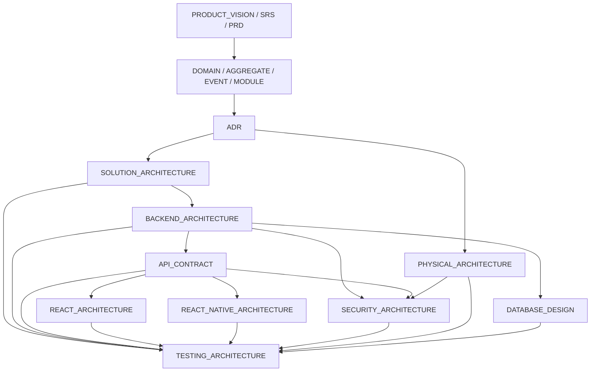
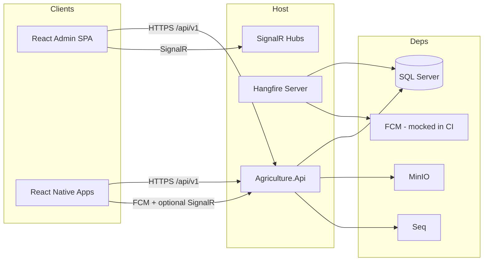
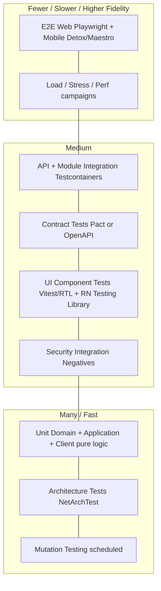
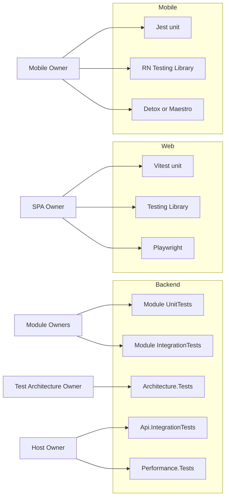
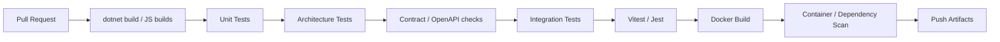
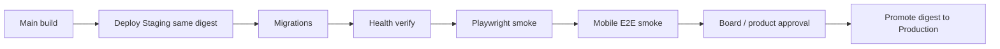
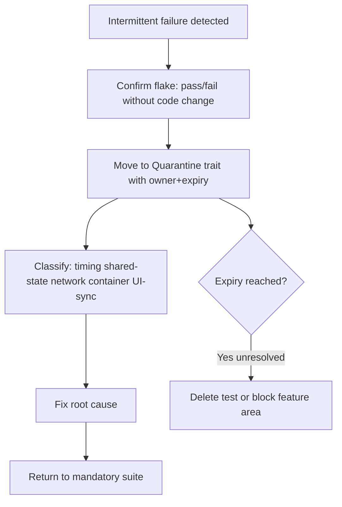

# Testing Architecture Specification

# Agriculture Management System

| Field | Value |
|-------|-------|
| **Document Title** | Testing Architecture Specification |
| **Document ID** | AGRI-TAS-001 |
| **Version** | 1.0 |
| **Status** | Draft |
| **Classification** | Internal — Engineering / QA / Architecture |
| **Primary Audience** | QA architects, test leads, module owners, Host Owner, SPA Owner, Mobile Owner, DevOps/CI owners, Architecture Board |
| **Secondary Audience** | Product owners (acceptance scope), security reviewers, municipal IT auditors assessing quality gates |
| **Document Owner** | Test Architecture Owner (Agriculture Management System) |
| **Technical Stewards** | Test Architecture Owner (`Agriculture.Architecture.Tests`), Host Owner (`Api.IntegrationTests`, `Performance.Tests`), Module Owners (unit/integration per module), SPA Owner (Vitest/Playwright), Mobile Owner (Jest/Detox|Maestro) |
| **Related Stack** | ASP.NET Core modular monolith, xUnit, NetArchTest, Testcontainers (SQL Server), WebApplicationFactory, Vitest, Playwright, Jest, Detox/Maestro, Pact or OpenAPI contract tests, k6 (primary) / JMeter (alternate), Hangfire, SignalR, MinIO, FCM (mocked in CI) |
| **Authoritative Solution File** | `Agriculture.sln` (test projects under `tests/` per SOLUTION_ARCHITECTURE §14) |
| **Composition Root Host** | `Agriculture.Api` under `src/Hosts/` |
| **Supersedes** | Informal testing notes; ad-hoc CI gates not captured in SOLUTION_ARCHITECTURE / BACKEND_ARCHITECTURE |
| **Must Not Contradict** | PRODUCT_VISION, SRS, PRD, DOMAIN_ANALYSIS, AGGREGATE_DESIGN, EVENT_STORMING, MODULE_DESIGN, ADR, PHYSICAL_ARCHITECTURE, SOLUTION_ARCHITECTURE, BACKEND_ARCHITECTURE, DATABASE_DESIGN, API_CONTRACT, REACT_ARCHITECTURE, REACT_NATIVE_ARCHITECTURE, SECURITY_ARCHITECTURE |

---

## Document Control

### Change Control

| Version | Date | Author Role | Summary |
|---------|------|-------------|---------|
| 1.0 | 2026-07-18 | Principal QA / Test Architect | Initial Draft — enterprise testing architecture aligned to approved solution, backend, API, client, security, and physical specifications |

Structural changes to test project layout, mandatory quality gates, framework selection (unit/E2E/load/contract), or ownership of Architecture.Tests require:

1. Architecture Decision Record (next free ADR number after the last Accepted ADR).
2. Architecture Board review and Accepted status.
3. Updates to SOLUTION_ARCHITECTURE.md when test project names or CI stage order change.
4. Updates to this document in the same change set as the ADR.

Additive, non-structural content (clarifying ownership notes, expanding matrices, additional Mermaid diagrams, naming examples) may ship as patch revisions (1.1, 1.2) under Document Owner approval without a new ADR, provided no Accepted ADR or normative architecture document is contradicted.

### Relationship to Prior Documents

This Testing Architecture Specification (TAS) sits **after** solution, backend, API, client, security, and physical design documents. It is the **authoritative map of how quality is proven** for the Agriculture Management System: test layers, ownership, tools, environments, CI gates, coverage policy, and non-goals for automation.



**Normative precedence when documents overlap on testing:**

| Concern | Authoritative document | This TAS role |
|---------|------------------------|---------------|
| Test project names and `tests/` layout | SOLUTION_ARCHITECTURE §14 | Elaborates strategy, gates, ownership |
| Layer testing boundaries (Domain/App/Infra/API) | BACKEND_ARCHITECTURE §19 and per-layer testing subsections | Unifies into pyramid and CI |
| REST/SignalR contract shapes | API_CONTRACT | Defines contract-testing approach |
| SPA test tools | REACT_ARCHITECTURE §30 / §64 | Binds Playwright/Vitest into system pyramid |
| Mobile offline/E2E tools | REACT_NATIVE_ARCHITECTURE §29 | Binds Detox/Maestro and sync tests |
| Security negative cases | SECURITY_ARCHITECTURE §47 | Maps security tests into layers/gates |
| Environments and promotion | PHYSICAL_ARCHITECTURE §5.5 | Defines test vs staging vs CI |
| Dependency rules under test | SOLUTION_ARCHITECTURE §6 / Architecture.Tests | Encodes NetArchTest expectations |

This document does **not** generate application source code, full test class implementations, exploit payloads, or penetration-test playbooks. Short naming examples and conceptual assertions are permitted.

---

# 1. Purpose, Scope, and Non-Goals

## 1.1 Purpose

The Agriculture Management System (AMS) is a municipal modular monolith serving officers (React admin SPA), producers and inspectors (React Native offline-first clients), and a single ASP.NET Core API hosting Identity, Producers, Lands, Seasons, Workflows, Tasks, Inspections, Harvest, Delivery, Support, Notifications, Communication, Reporting, and Administration modules. Quality failures are not merely defects: they become incorrect harvest eligibility, cross-producer data exposure, lost offline evidence, or broken season sequencing.

This specification defines an **implementation-ready testing architecture** that:

1. Proves domain invariants and CQRS handler behavior at unit speed.
2. Proves persistence, HTTP pipeline, authN/authZ, migrations, and concurrency with real SQL Server via Testcontainers.
3. Proves modular dependency rules continuously via Architecture.Tests.
4. Proves API–client compatibility via contract testing without duplicating backend invariant tests in UIs.
5. Proves municipal journeys end-to-end on web and mobile, including offline sync.
6. Proves performance, load, and stress characteristics before season peaks.
7. Proves security controls via negative automated cases aligned to SECURITY_ARCHITECTURE §47.
8. Encodes quality gates in GitHub Actions so architectural shortcuts cannot merge.

## 1.2 Scope

| In scope | Out of scope |
|----------|--------------|
| All automated test layers for backend, SPA, mobile | Full source listings of test classes |
| Tool selection with justification | Choosing vendor-specific municipal pen-test firms |
| CI stage order and quality gates | Production traffic generation against live farmers |
| Test data, mocking, flaky policy | Replacing API_CONTRACT as DTO source of truth |
| Hangfire, SignalR, MinIO, FCM test approaches | Microservices extraction testing (deferred) |
| Environments: local, CI/test, staging | Production exploratory chaos without Board approval |

## 1.3 Non-Goals

- Tutorial guidance for writing a first xUnit test.
- Duplicating DATABASE_DESIGN schema definitions inside tests as alternate truth.
- Using UI tests as the primary place to assert aggregate invariants.
- Calling external production FCM, MinIO, or Seq from CI unit/integration jobs.
- Shipping mutation testing as a PR-blocking gate on day one (see §8 — scheduled/deepening gate).

## 1.4 Success Criteria for This Architecture

1. Architecture.Tests and unit tests are mandatory green on every pull request.
2. Integration tests using Testcontainers SQL Server are runnable in CI (every PR when capacity allows; otherwise main/nightly with PR smoke subset — see §18).
3. SPA Playwright and mobile Detox/Maestro smokes run against Staging (never Production).
4. Contract tests prevent silent OpenAPI/client drift for critical resources.
5. Security acceptance matrix from SECURITY_ARCHITECTURE §47 is automated where feasible.
6. Load/stress campaigns complete before declared season peaks (PHYSICAL_ARCHITECTURE guidance).
7. Flaky tests are quarantined with owner and expiry — never silently ignored.

---

# 2. Guiding Principles

## 2.1 Test the Product Differentiator Where It Lives

| Differentiator | Primary proof location | Why |
|----------------|------------------------|-----|
| Domain invariants (harvest gates, quantities, soft delete) | Domain unit tests | Pure, fastest, BACKEND §19.1 |
| Cross-module Contracts-only coupling | Architecture.Tests | Compile-time + NetArchTest |
| Tenant/IDOR fail-closed | API integration + security tests | SECURITY §47 |
| Offline complete → online sync | Mobile E2E (airplane mode) | REACT_NATIVE §29 |
| Admin season lifecycle UX | Playwright on Staging | REACT §30 / §64 |
| Season peak capacity | k6 load + stress suites | PHYSICAL performance guidance |

## 2.2 Prefer Fast Feedback; Escalate Fidelity Only When Necessary

Unit tests must never require SQL Server (SOLUTION_ARCHITECTURE §14.3). Integration tests earn the right to real IO. E2E tests earn the right to real browsers/devices. Load tests earn the right to dedicated environments. Violating this order produces slow, flaky suites that teams learn to skip — an architectural failure, not a tooling failure.

## 2.3 Do Not Duplicate Truth

- Aggregates: Domain tests own invariants.
- Persistence mapping: Infrastructure/integration tests own SQL translation and migrations.
- HTTP shapes: API_CONTRACT + OpenAPI + contract tests own wire compatibility.
- SPA rendering: Vitest/Testing Library own presentation; Playwright owns journeys.
- Mobile sync: unit tests own outbox/idempotency; E2E owns airplane-mode journeys.

## 2.4 Fail Closed in Tests as in Production

Security and tenancy tests assert **denials** (401/403/404 policies as specified). Tests must not “soft pass” when an unauthorized producer can read another farm’s task. SECURITY_ARCHITECTURE forbids publishing exploit payloads; automated tests use controlled alternate tokens and GUIDs, not weaponized scripts.

## 2.5 Architecture Is Executable

If a shortcut would break Architecture.Tests, it does not merge (BACKEND_ARCHITECTURE §19.9). Testing encodes architecture; architecture is not aspirational documentation.

## 2.6 Municipal Seasonality

AMS load is seasonal. Performance, load, and stress testing are planned against municipal calendars, not only against sprint ceremonies. PHYSICAL_ARCHITECTURE explicitly warns that numeric limits are configuration — ops must validate them with tests before peaks.

---

# 3. System Under Test Overview

## 3.1 Deployable Units Under Test



## 3.2 Test Project Map (Normative Names)

Aligned to SOLUTION_ARCHITECTURE §14:

```text
tests/
  Architecture.Tests/                 # Agriculture.Architecture.Tests
  Api.IntegrationTests/               # Agriculture.Api.IntegrationTests
  Performance.Tests/                  # Agriculture.Performance.Tests
  Modules.{Name}.UnitTests/           # preferred: Agriculture.Modules.{Name}.UnitTests
  Modules.{Name}.IntegrationTests/    # preferred: Agriculture.Modules.{Name}.IntegrationTests
```

Frontend and mobile tests live with their packages (`frontend/`, `mobile/`) per REACT_ARCHITECTURE and REACT_NATIVE_ARCHITECTURE — they are part of the system pyramid even though they are not `.csproj` entries in `Agriculture.sln`.

## 3.3 Framework Recommendation — Backend Unit/Integration Runner

| Option | Decision | Reasoning |
|--------|----------|-----------|
| **xUnit** | **Recommended default** | Dominant in modern ASP.NET samples; first-class `IClassFixture` / `ICollectionFixture` for Testcontainers and `WebApplicationFactory`; parallelization defaults align with CI throughput; Microsoft testing docs and community ASP.NET Core testing patterns assume xUnit. |
| NUnit | Acceptable alternate if Board standardizes org-wide | Attribute model and `[TestCase]` richness are excellent; migration cost is the only reason not to dual-support. If municipal org already standardizes NUnit, Architecture Board may Accept NUnit via ADR — then this TAS is amended. **Do not mix xUnit and NUnit within the same solution without ADR.** |
| MSTest | Not preferred | Works, but weaker ecosystem fit for WebApplicationFactory fixtures and NetArchTest samples in this stack. |

**Decision for AMS:** Adopt **xUnit** for all `tests/**/*.csproj` unless an ADR explicitly selects NUnit. Naming examples in this document use xUnit conventions (`Fact`/`Theory` conceptually referenced only — no full class bodies).

---

# 4. The Test Pyramid

## 4.1 Conceptual Pyramid



## 4.2 Quantitative Guidance (Targets, Not Dogma)

| Layer | Relative volume | Typical runtime budget (PR) | Blocking gate |
|-------|-----------------|----------------------------|---------------|
| Unit (backend + web + mobile pure) | ~60–70% of automated cases | ≤ 5–8 min total | Yes |
| Architecture | Small suite, high value | ≤ 2 min | Yes — every PR |
| Integration (module + API) | ~15–25% | ≤ 15–25 min (or smoke on PR) | Yes (full or smoke policy §18) |
| Contract | Thin critical set | ≤ 5 min | Yes for critical resources |
| UI component | Moderate | ≤ 5–10 min | Yes for changed packages |
| E2E smoke | Thin | Staging post-deploy | Yes for release; optional PR against ephemeral |
| Load/Stress | Campaigns | Nightly / pre-season | Release gate for peak readiness |
| Mutation | Deepening | Nightly/weekly | Soft gate → harden later |

**Reasoning:** Municipal teams cannot wait 90 minutes for feedback on a permission string change. The pyramid protects velocity while forcing expensive fidelity where bugs actually hide (SQL, authZ, offline sync).

## 4.3 Anti-Patterns Against the Pyramid

| Anti-pattern | Failure mode | Corrective |
|--------------|--------------|------------|
| Only Playwright for business rules | Slow, flaky, opaque failures | Move invariants to Domain unit tests |
| Integration tests that mock DbContext extensively | False confidence on SQL translation | Use Testcontainers for persistence paths |
| Architecture tests skipped “temporarily” | Modular monolith decays | Never optional on PR |
| E2E against Production | Data corruption / KVKK risk | Staging only |
| Load tests on shared Staging during UAT | Contaminates UAT | Dedicated perf slot or isolated env |

## 4.4 Pyramid Ownership Boundaries



---

# 5. Unit Testing

## 5.1 Definition

Unit tests verify a single unit of behavior in isolation from real SQL Server, MinIO, FCM, network, and wall-clock Hangfire storage. Domain tests use no mocks for aggregates (construct and assert). Application tests use test doubles for ports (repositories, Contracts, clock, identity accessors).

## 5.2 Backend Unit Testing

### 5.2.1 Domain Layer

**Purpose:** Prove ubiquitous-language invariants from AGGREGATE_DESIGN and DOMAIN_ANALYSIS.

**Examples of intent (names only):**

- `HarvestAmount_CannotExceedRemaining_Rejects`
- `Task_Complete_RequiresEvidenceWhenPolicyRequires`
- `Inspection_Fail_BlocksHarvestEligibility`

**Rules:**

1. No EF Core, no MediatR, no ASP.NET types in Domain unit tests.
2. Prefer builders/factories in test projects for aggregate construction — not production service locators.
3. Assert domain events raised where EVENT_STORMING expects them; do not assert outbox rows here.

**Reasoning:** Domain purity is the modular monolith’s primary extraction and correctness lever (BACKEND_ARCHITECTURE). If Domain tests need Infrastructure, the production reference graph is already wrong — Architecture.Tests should fail first.

### 5.2.2 Application Layer

**Purpose:** Prove command/query handlers, FluentValidation validators, and pipeline behaviors with mocked ports.

**Mock ports, not cousins:**

| Mock / fake | Do not mock |
|-------------|-------------|
| `ITaskRepository` (port) | Aggregate methods under test |
| `IWorkflowsContract` | FluentValidation rules themselves when testing validators in isolation — instantiate validators directly |
| `IUnitOfWork` | MediatR in handler unit tests if handler is invoked directly |
| `IClock` / time provider | JWT cryptographic correctness (use integration for token round-trips) |
| `IRealtimeNotifier` | Domain event registration inside aggregate |

**Reasoning (BACKEND §19.5):** Application is in-process with mocks; IO belongs to integration.

### 5.2.3 Infrastructure Unit Testing (Narrow)

Most Infrastructure is integration-tested. Narrow unit tests are allowed for:

- Pure mappers (entity ↔ domain).
- Idempotency key formatting helpers.
- Retry policy classification (transient vs poison) using fake HttpMessageHandler for FCM adapter **without** calling Google.

### 5.2.4 Presentation (Controllers) Unit Testing

Controllers should remain thin (BACKEND). Prefer API integration tests over controller unit tests. If a controller contains branching beyond send/map, that is an architecture smell — fix the controller, do not build a large controller unit suite.

## 5.3 Frontend (React Admin) Unit Testing

Aligned to REACT_ARCHITECTURE §30:

| Focus | Tool |
|-------|------|
| Permission helpers, route gates | Vitest |
| Problem Details parser | Vitest |
| Query key factories | Vitest |
| Zod schemas mirroring contract expectations | Vitest |

**Do not** re-test harvest quantity math in the SPA. Server is authoritative.

## 5.4 Mobile Unit Testing

Aligned to REACT_NATIVE_ARCHITECTURE §29:

| Focus | Tool |
|-------|------|
| Outbox ordering | Jest |
| Idempotency key stability | Jest |
| Problem Details mapping | Jest |
| Sync conflict journal reducers | Jest |

## 5.5 Ownership — Unit

| Surface | Owner | Reviewer |
|---------|-------|----------|
| Module Domain/Application unit | Module Owner | Peer module owner |
| Shared Kernel helpers | Shared Kernel Steward | Test Architecture Owner |
| SPA unit | SPA Owner | Feature engineer |
| Mobile unit | Mobile Owner | Feature engineer |

## 5.6 What Unit Tests Must Not Do

1. Start SQL Server or Testcontainers.
2. Call real MinIO, Seq, or FCM.
3. Sleep for timing assertions as primary strategy (use fake clock).
4. Assert log text as business outcome (prefer structured testable return/error types).
5. Share mutable static fixture state across tests (BACKEND §19.6).

---

# 6. Integration Testing

## 6.1 Definition

Integration tests verify multiple real components collaborating: EF Core + SQL Server, ASP.NET pipeline + auth, MinIO containers, migrations, concurrency tokens, and module database schemas.

## 6.2 SQL Server via Testcontainers

**Normative approach:** Use **Testcontainers** with a SQL Server image for module and API integration tests (SOLUTION_ARCHITECTURE §14.3, BACKEND §19.2, §7.21).

**Reasoning:**

| Approach | Verdict |
|----------|---------|
| In-memory EF provider | Rejected for persistence truth — diverges from SQL Server T-SQL, indexes, filtered queries |
| Local installed SQL only | Acceptable for developers; insufficient alone for CI reproducibility |
| Shared Staging DB for integration | Rejected — non-hermetic, KVKK risk, flaky |
| **Testcontainers SQL Server** | **Selected** — ephemeral, version-pinned, CI-friendly, matches production engine family |

**Rules:**

1. Apply migrations in test fixture startup; never assume empty model equals migrated model.
2. Prefer one container per test collection (xUnit collection fixture) to balance speed vs isolation.
3. Reset data between tests via transaction rollback **or** respawn/truncate strategies documented per suite — choose one per project and stay consistent.
4. Explicit `TenantId` on all seeded roots (BACKEND §19.6).

## 6.3 Module Integration Tests

`Agriculture.Modules.{Name}.IntegrationTests` prove:

- Repository SQL translation for critical specifications.
- Unique indexes and concurrency (409 paths where API maps them).
- Soft-delete filters.
- Outbox row write on commit for integration events.

They may host a partial composition root for the module under test; full HTTP is optional here.

## 6.4 API Integration Tests

`Agriculture.Api.IntegrationTests` use `WebApplicationFactory<Program>` (SOLUTION_ARCHITECTURE §7.12) with:

- Testcontainers SQL Server connection string override.
- MinIO test container where upload flows are under test.
- Fake FCM gateway (no external Google).
- Seeded users/roles/permissions for Admin, Officer, Inspector, Producer.

**Minimum scenario families:**

1. Auth: login, refresh, refresh reuse detection, deactivated user.
2. Authorization: anonymous 401; wrong permission 403; cross-user GUID deny.
3. Validation: Problem Details shape (ADR-018 / API_CONTRACT).
4. Concurrency: conflicting updates → 409.
5. Uploads: oversized / disallowed content-type rejected.
6. Municipal storyboard subset (BACKEND §19.8) — season lifecycle across module boundaries.

## 6.5 MinIO Integration

Use a MinIO container for upload initiate/complete flows. Assert object key patterns and ACL mediation — clients never receive long-lived god keys (ADR-010, SECURITY_ARCHITECTURE).

## 6.6 What Integration Tests Must Not Do

1. Depend on developer laptop SQL named instances without container fallback in CI.
2. Call production or shared Staging databases.
3. Require real FCM delivery receipts.
4. Skip migrations “to save time.”
5. Use Production secrets (BACKEND §9.12).

## 6.7 Ownership — Integration

| Project | Owner |
|---------|-------|
| Module IntegrationTests | Module Owner |
| Api.IntegrationTests | Host Owner |
| Upload/MinIO scenarios | Tasks/Inspections owners + Host |
| Auth scenarios | Identity Owner + Host |

---

# 7. Architecture Testing

## 7.1 Definition

Architecture tests are automated assertions over compiled assemblies that encode SOLUTION_ARCHITECTURE §6 dependency rules and BACKEND layering rules. They are **mandatory on every PR** (SOLUTION_ARCHITECTURE §14.3).

## 7.2 Tooling — NetArchTest (Recommended)

| Option | Decision | Reasoning |
|--------|----------|-----------|
| **NetArchTest** | **Recommended** | Fluent, .NET-native, low ceremony; maps cleanly to “Domain must not reference Infrastructure” style rules already named in SAS §14.4 |
| Custom reflection harness | Acceptable supplement | For conventions NetArchTest expresses poorly (e.g., controller attribute presence) |
| ArchUnitNET | Acceptable alternate | Similar goals; do not dual-run two frameworks without ADR |

## 7.3 Rule Catalog (Normative Intent)

Aligned to SOLUTION_ARCHITECTURE §14.4 and BACKEND Architecture.Tests expectations:

1. Domain projects reference only SharedKernel among Agriculture.* (plus allowed BCL).
2. Application does not reference Infrastructure.
3. No references between foreign Domain projects.
4. Contracts do not reference Infrastructure.
5. Controllers do not reference DbContext / EF types.
6. Controllers use `ISender` (or approved mediator abstraction), not handlers directly.
7. No cross-module Infrastructure project references.
8. Permission policy names used by endpoints exist in the catalog (SECURITY §47.3 / policy catalog alignment).
9. `/api/v1` controller actions have explicit Authorize metadata or documented AllowAnonymous justification.

**Conceptual test names (examples only):**

- `Domain_DoesNotReference_Infrastructure`
- `Application_DoesNotReference_Infrastructure`
- `Controllers_DoNotReference_DbContext`
- `Modules_DoNotReference_ForeignInfrastructure`

## 7.4 Ownership

| Item | Owner |
|------|-------|
| `Agriculture.Architecture.Tests` | Test Architecture Owner |
| New rule proposals | Architecture Board via ADR if contested |
| Module-specific convention tests | Module Owner may contribute under TAO review |

## 7.5 Failure Policy

Architecture test failure is a **merge blocker** with no “waive until Friday” path. Temporary exemptions require Architecture Board written exception with expiry date tracked in the ADR/exception log — not commented-out tests.

## 7.6 Reasoning — Why Architecture Tests Exist Here

The AMS is intentionally a modular monolith (ADR-001). Without executable boundaries, teams will reach for cross-schema EF joins “just this once,” destroying extraction options and season sequencing ownership (Workflows). Architecture tests are cheaper than microservice splits and more reliable than code review alone.

---

# 8. Mutation Testing

## 8.1 Definition

Mutation testing introduces small code mutations (negated conditions, return value changes) and checks whether the existing test suite kills those mutants. It measures **test effectiveness**, not line coverage.

## 8.2 Scope for AMS

| Area | Mutation priority | Reasoning |
|------|-------------------|-----------|
| Domain aggregates (Tasks, Inspections, Harvest, Delivery) | High | Incorrect harvest eligibility is a product-critical failure |
| Permission evaluators / resource authZ helpers | High | Security fail-closed |
| Offline sync idempotency helpers (mobile pure JS/TS) | High | Duplicate completes / lost evidence |
| Application handlers | Medium | Covered partly by integration |
| Controllers | Low | Thin; prefer not to invest |
| Generated code | Exclude | Noise |

## 8.3 Tooling Guidance

| Stack | Typical tools | Notes |
|-------|---------------|-------|
| .NET | Stryker.NET | Fits xUnit; run on selected projects |
| TS/JS | StrykerJS (optional) | Only for critical pure modules |

## 8.4 Cadence and Gates

- **Not a day-one PR blocker** (avoids CI time explosion).
- Nightly/weekly on Domain projects and Identity authZ helpers.
- Quality signal: mutation score thresholds agreed by Board (e.g., Domain ≥ configured target).
- Failures open defects assigned to Module Owner; repeated low scores block feature expansion in that module until remediated.

## 8.5 Reasoning

Coverage can be satisfied by tautological asserts. Mutation testing catches tests that execute code without asserting behavior — especially dangerous in Domain where “green” unit tests may not protect invariants.

## 8.6 Ownership

Test Architecture Owner defines score policy; Module Owners kill mutants in their Domain.

---

# 9. Performance Testing

## 9.1 Definition

Performance testing validates **latency, throughput, and resource efficiency** of critical paths under expected load — distinct from breaking-point stress and sustained peak load campaigns (see §10–§11).

## 9.2 Project Placement

`Agriculture.Performance.Tests` (SOLUTION_ARCHITECTURE §14) hosts smoke benchmarks and scripted critical-query checks. Full season-peak campaigns may live as k6/JMeter projects under `tests/perf/` or `perf/` as Board prefers — still owned with Performance.Tests stewardship.

## 9.3 Critical Paths (Minimum)

Aligned to BACKEND §19.4 and municipal journeys:

1. Officer today/task list queries with realistic indexes (DATABASE_DESIGN).
2. Producer task complete + evidence metadata path.
3. Inspection complete gating harvest eligibility.
4. Reporting dashboard read models (`asOf` eventual consistency acknowledged).
5. JWT validation + refresh under concurrent clients.
6. Hangfire backlog drain rate for reminder/notification fan-out.

## 9.4 Tooling

| Tool | Role |
|------|------|
| BenchmarkDotNet (optional in Performance.Tests) | Micro-benchmarks for pure/CPU paths |
| k6 | HTTP API performance scripts (preferred for CI-friendly scripting) |
| SQL query plans / statistics | Index validation in integration or DBA review gates |

## 9.5 Environments

Run against **dedicated performance environment** or scheduled Staging windows — never Production. Data volumes should approximate municipal scale (synthetic), not empty schemas.

## 9.6 Gates

- PR: optional micro smoke only if sub-minute.
- Nightly: performance regression vs baseline budget.
- Pre-season: Board-signed performance report.

## 9.7 Ownership

Host Owner + module owners for scenarios (SOLUTION_ARCHITECTURE §14.5).

---

# 10. Stress Testing

## 10.1 Definition

Stress testing pushes the system **beyond expected peak** to observe degradation modes, recovery, and failure signaling (health endpoints, queue overflow, rate limits) — not to pass a latency SLO under gentle load.

## 10.2 AMS Stress Scenarios

| Scenario | Intent |
|----------|--------|
| Auth login floods | Rate limit behavior; no cascading SQL exhaustion |
| Concurrent task completes on popular season | Concurrency tokens; Hangfire enqueue storms |
| SignalR fan-out spikes | Hub/backplane behavior; sticky session needs |
| Large export storms | Hangfire isolation from HTTP API (PHYSICAL Stage 2 optional split) |
| MinIO upload bursts | Size limits; API thread pool protection |
| SQL connection pool saturation | Ready health fails closed; no silent corruption |

## 10.3 Success Criteria (Stress)

Stress tests **pass** when:

1. Defined degradation is observable (429, 503, health not-ready).
2. No data corruption; no cross-tenant leakage under failure.
3. System recovers after load stops without manual DB repair.
4. Poison Hangfire jobs are contained (manual replay path remains).

Stress tests **fail** when:

1. Process crashes without recovery.
2. AuthZ fails open under load.
3. Data loss or duplicate irreversible side effects without idempotency.

## 10.4 Ownership

Host Owner + DevOps; Security reviews fail-open risks.

---

# 11. Load Testing

## 11.1 Definition

Load testing validates behavior under **expected concurrent municipal peak** (season start, inspection day, harvest window) for sustained duration.

## 11.2 Tool Recommendation — k6 Primary, JMeter Alternate

| Tool | Decision | Reasoning |
|------|----------|-----------|
| **k6** | **Primary recommendation** | Script-as-code (JS), excellent CI integration, cloud/local runners, clear thresholds (`http_req_duration`, error rate), fits API-first AMS load models |
| **JMeter** | Acceptable alternate / supplement | Strong GUI ecosystem, mature protocol support, familiar to some municipal IT vendors; heavier in CI; use when vendor/org standard requires it |
| Gatling | Optional | Fine if Board expertise exists; do not triple-tool |

**Decision:** Implement load suites in **k6** unless an ADR selects JMeter as organizational standard. Dual maintenance of k6 and JMeter for the same scenarios is forbidden without Board approval.

## 11.3 Load Profiles (Illustrative)

Profiles are configuration — calibrate with PHYSICAL_ARCHITECTURE capacity guidance and real municipal counts:

1. **Baseline:** average day officers + producers.
2. **Peak season:** concurrent producer completes + officer dashboards + SignalR connections.
3. **Inspection day:** inspection writes + season hub subscribers.
4. **Reporting hour:** dashboard polls + export enqueues.

## 11.4 Threshold Policy

Define absolute thresholds in perf config (p95 latency, error %, Hangfire queue depth). Regressions exceeding budget fail the load job. Thresholds are reviewed quarterly and before season peaks.

## 11.5 Data and Isolation

- Synthetic anonymized data.
- Isolated load environment preferred.
- If Staging is used, announce freeze window to UAT participants.

## 11.6 Ownership

Host Owner drives; Module Owners supply critical endpoint lists; DevOps provides runners and observability (Seq metrics).

---

# 12. Contract Testing

## 12.1 Definition

Contract tests verify that **providers and consumers agree on request/response shapes, status codes, and auth requirements** without requiring full E2E UI for every field change.

## 12.2 Normative Sources

| Source | Role |
|--------|------|
| API_CONTRACT.md | Human-authoritative product/QA contract |
| Generated OpenAPI from code | Machine artifact for CI diffing / client generation |
| Consumer clients (React, React Native) | Must not silently diverge (REACT §30.2) |

## 12.3 Approach Options — Pact or OpenAPI-Based

| Approach | When to use | Reasoning |
|----------|-------------|-----------|
| **OpenAPI-based contract tests** | Default for AMS monolith with first-party clients | Code-first OpenAPI governed by API_CONTRACT; schema validation of responses in Api.IntegrationTests; optional Spectral/OpenAPI diff in CI; client Zod/types checked against exported schema for critical resources |
| **Pact (consumer-driven)** | When multiple consumers need independent verification or external partners appear | Excellent for consumer-driven evolution; more moving parts (broker); adopt when Board needs multi-consumer isolation beyond first-party SPA/mobile |

**Decision:** Start with **OpenAPI-based contract testing** aligned to API_CONTRACT + generated OpenAPI. Introduce **Pact** via ADR if/when external integrators or independently versioned consumers require consumer-driven contracts. Either approach satisfies this TAS; mixing both for the same resource without clear ownership is forbidden.

## 12.4 What Contract Tests Cover

1. Critical DTO required fields and enums for Tasks, Inspections, Harvest, Identity auth.
2. Problem Details extension shapes.
3. Pagination conventions.
4. Security scheme presence on protected routes.
5. SignalR payload event name stability for documented events (where feasible).

## 12.5 What Contract Tests Do Not Cover

- Domain invariant depth (unit/integration).
- Pixel-perfect UI.
- Full offline sync algorithms.

## 12.6 Ownership

| Artifact | Owner |
|----------|-------|
| API_CONTRACT updates | API owners + Architecture Board process |
| OpenAPI generation pipeline | Host Owner |
| Consumer schema checks (SPA/mobile) | SPA Owner / Mobile Owner |
| Pact broker (if adopted) | Test Architecture Owner + DevOps |

---

# 13. Security Testing

## 13.1 Definition

Security testing validates that SECURITY_ARCHITECTURE controls hold under **negative cases**. Tests assert denials, lockouts, and redactions. They do **not** publish weaponized payloads or exploit proof-of-concept code (SECURITY §47.1).

## 13.2 Layer Mapping

| Layer | Examples | Owner |
|-------|----------|-------|
| Unit | Permission evaluator deny/allow; password hasher verify | Identity |
| Application | Handler resource authZ; tenant filter | Module owners |
| API integration | Anonymous 401; wrong role 403; cross-user GUID 403/404 | QA + Identity |
| Pipeline | Refresh reuse → family revoke; deactivated user cannot refresh | Identity |
| Upload | Oversized rejected; disallowed content-type; unauthorized attach | Tasks/Inspections |
| Realtime | Unauthorized SignalR group join denied | Notifications/Host |
| Jobs | Hangfire dashboard unauthorized; job does not inherit interactive user | DevOps + Host |
| Privacy | Logs do not contain password/refresh/national id clear text | Platform |
| Architecture | Controller authorize conventions | Test Architecture Owner |

## 13.3 Automated Acceptance Matrix (Minimum)

Aligned to SECURITY_ARCHITECTURE acceptance themes:

1. Anonymous access denied on protected `/api/v1` routes.
2. Wrong role/permission denied.
3. Cross-user resource access denied (IDOR suite per GUID route family).
4. Refresh token reuse rejected / family revoked.
5. Oversized upload rejected.
6. Hangfire dashboard unauthorized denied.
7. Deactivated user cannot obtain new access.
8. Producer cannot join unauthorized `season:{id}` hub group.

## 13.4 Manual Municipal Acceptance

Before Production cutover, security officer walks SECURITY §16.2 / §47.4 criteria on Staging with evidence — without unauthorized Production attack tooling.

## 13.5 SAST/Dependency/Container

CI runs dependency and container scans (SOLUTION_ARCHITECTURE CI notes, ADR-020 themes). Findings triage is DevOps + security reviewers; critical CVEs block release.

## 13.6 Ownership

Security test content: Identity + Module Owners + Host. Gate policy: Test Architecture Owner with Security Architecture alignment.

---

# 14. UI Testing

## 14.1 Definition

UI testing verifies presentation behavior, accessibility, and interaction correctness **below full cross-system E2E** — components, pages with mocked APIs, permission gates rendering.

## 14.2 React Admin SPA

| Layer | Tool | Intent |
|-------|------|--------|
| Unit | Vitest | Pure helpers |
| Component | Testing Library | Forms, gates, tables |
| Feature integration | Vitest + MSW | Pages with mocked `/api/v1` |
| Accessibility | axe + keyboard checks | Login/shell/dialogs |
| Visual optional | Chromatic or Playwright screenshots | Shell regressions |

**Playwright vs Cypress for UI/E2E:**

| Tool | Decision | Reasoning |
|------|----------|-----------|
| **Playwright** | **Selected (REACT_ARCHITECTURE §30)** | Strong multi-browser, trace viewer, auto-wait, first-class TypeScript, excellent CI artifacts; already normative in React architecture |
| Cypress | Not primary | Excellent DX historically; dual-E2E frameworks forbidden; Cypress remains acceptable only if Board amends REACT_ARCHITECTURE via ADR |

## 14.3 React Native UI

| Layer | Tool |
|-------|------|
| Component | React Native Testing Library |
| Navigation gates | Jest |
| Visual device quirks | Device farm / manual matrix |

## 14.4 What Not to Test in UI Suites

- Backend invariant duplication (REACT §30.5).
- Every pixel of every grid.
- Full season SQL correctness.

## 14.5 Ownership

SPA Owner; Mobile Owner for RN components.

---

# 15. End-to-End Testing

## 15.1 Definition

E2E tests exercise real user journeys across UI + API (+ DB + dependent services in Staging), proving municipal workflows work as assembled products.

## 15.2 Web E2E — Playwright

**Canonical journeys (smoke + extended):**

1. Login as Officer → create/select producer → start season path (as permitted).
2. Permission denial UX for unauthorized route.
3. Task/inspection monitoring happy path.
4. Token refresh under active session (where automatable).
5. SignalR-driven dashboard badge/update smoke (best-effort; HTTP refresh fallback acceptable).

**Environment:** Staging with seeded role users (REACT §64.3). **Never Production.**

## 15.3 Mobile E2E — Detox or Maestro

| Tool | Decision | Reasoning |
|------|----------|-----------|
| **Detox** | Recommended when gray-box RN synchronization is valued | Deep RN integration; strong for complex sync timing |
| **Maestro** | Recommended when YAML flows and lower maintenance preferred | Fast authoring; strong for airplane-mode scripted journeys; CI-friendly |
| Appium | Not preferred primary | Higher cost; reserve for cross-app special cases |

**Decision:** Mobile Owner selects **Detox or Maestro** as the single primary mobile E2E framework (REACT_NATIVE §29 allows either). Document the choice in mobile README; switching requires TAO + Mobile Owner agreement. Dual Detox+Maestro for the same journeys is forbidden.

**Mandatory mobile scenarios:**

1. Login → offline (airplane mode) complete task with evidence → online sync success.
2. Conflict journal / retry behavior on induced failure.
3. Inbox deep link from FCM (Staging apps).
4. Logout wipes secure storage artifacts (security).

## 15.4 Cross-Cutting E2E Non-Goals

- Replacing Architecture.Tests.
- Load generation.
- Full KVKK legal review automation.

## 15.5 Ownership

| Suite | Owner |
|-------|-------|
| Playwright | SPA Owner |
| Detox/Maestro | Mobile Owner |
| Seed data for Staging E2E | Host + Identity + DevOps |

---

# 16. Mocking Strategy

## 16.1 Principles

1. Mock **at ports/adapters**, not inside Domain aggregates.
2. Prefer fakes with in-memory behavior over heavy mocking frameworks when behavior is stateful.
3. Never mock what you claim to prove (e.g., do not mock SQL in a persistence integration test).
4. Shared mocks must not become a parallel Shared Kernel of production types (SOLUTION_ARCHITECTURE §2.4 Never).

## 16.2 What to Mock (by Layer)

| Layer | Mock / fake | Real |
|-------|-------------|------|
| Domain unit | — | Aggregates, value objects |
| Application unit | Repositories, Contracts, UoW, notifiers, FCM port, clock | Handlers, validators |
| Infrastructure unit | External HTTP (FCM) | Mappers, pure helpers |
| Integration | FCM gateway, optional Seq | SQL Server, MinIO container, ASP.NET pipeline |
| SPA component | `/api/v1` via MSW | Components, routers (memory) |
| Mobile unit | API client | Outbox reducers |
| Mobile E2E | FCM may be staged; API real Staging | App UI + sync |
| Load | — | API + DB (perf env) |

## 16.3 What Not to Mock

| Do not mock | Why |
|-------------|-----|
| Aggregate invariant methods under test | False green |
| EF `DbContext` in tests that claim SQL correctness | Provider lie |
| JWT validation handler in security integration | Misses auth bugs |
| Tenant filters by disabling filters globally “for convenience” | Security hole in tests teaches bad habits |
| Architecture rules | Never |

## 16.4 Hangfire Mocking

- Unit: assert application port `IBackgroundJobEnqueue` (or equivalent) called with expected job/command.
- Prefer testing the **command the job executes** thoroughly (BACKEND §11.17).
- Full Hangfire SQL storage integration is optional and expensive — use sparingly for smoke of registration/dashboard auth.

## 16.5 SignalR Mocking

- Unit: mock `IHubContext<>` / broadcaster port; assert group and payload (BACKEND §12.12).
- Integration: real hub connect auth with WebApplicationFactory where feasible; unauthorized join denied.

## 16.6 Time, Randomness, Guids

Inject `IClock` / deterministic GUID strategies in Application tests for reminders and idempotency.

## 16.7 Ownership

Module Owners maintain fakes for their ports; Host Owner maintains API factory fixtures.

---

# 17. Test Data Strategy

## 17.1 Principles

Aligned to BACKEND §19.6:

1. Builders per aggregate.
2. Avoid sharing mutable statics.
3. Explicit tenant ids always.
4. Prefer anonymized synthetic PII; never copy Production personal data into laptops or CI logs.
5. Staging uses anonymized subset (PHYSICAL_ARCHITECTURE §5.5).

## 17.2 Builder Pattern (Conceptual)

Test projects define builders such as `ProducerBuilder`, `SeasonBuilder`, `TaskBuilder` that emit valid aggregates or seed DTOs. Builders live in test assemblies, not production Shared Kernel, unless Board promotes a true testing package with no production references reverse.

## 17.3 Seeding Strategies

| Environment | Strategy |
|-------------|----------|
| Unit | On-the-fly builders |
| Integration | Fixture seed + per-test deltas |
| Staging E2E | Versioned seed script / Hangfire-friendly admin seed with known passwords in secret store |
| Load | Bulk synthetic generator with referential integrity |

## 17.4 Identity Matrix Users

Seed stable users for roles: Admin, Officer, Inspector, Producer (multiple producers for IDOR). Passwords only in secret stores for Staging; CI uses configuration secrets.

## 17.5 Media Evidence

Use tiny generated images for upload tests; enforce content-type and size boundary tests with deliberately invalid fixtures.

## 17.6 Data Cleanup

Hermetic tests clean up; Staging seed is reset on schedule. Never delete Production data from test tooling.

## 17.7 Ownership

Identity Owner for users/roles; Module Owners for domain seeds; DevOps for Staging reset jobs.

---

# 18. CI Testing and Quality Gates (GitHub Actions)

## 18.1 Authoritative CI Sketch

Aligned to SOLUTION_ARCHITECTURE §15.2:



Release path (conceptual):



## 18.2 PR Quality Gates (Mandatory)

| Gate | Fail means |
|------|------------|
| Compile `Agriculture.sln` | Broken references |
| Backend unit tests | Behavioral regression |
| Architecture.Tests | Dependency rule violation |
| SPA Vitest (if frontend changed) | UI logic regression |
| Mobile Jest (if mobile changed) | Sync helper regression |
| Secret scan | Possible credential leak |
| Container scan on image build | Critical CVEs per policy |
| Contract/OpenAPI diff policy | Undocumented breaking change |

## 18.3 Integration Gate Policy (Capacity-Aware)

SOLUTION_ARCHITECTURE allows marking integration with traits for optional jobs if runners are slow; BACKEND §19.7 expects unit + architecture every PR; integration on main/nightly if long.

**AMS policy:**

1. **PR:** Integration **smoke** subset tagged `Smoke` (auth, one IDOR, one task complete, migrations apply).
2. **Main / nightly:** Full integration suite with Testcontainers.
3. If smoke is skipped due to infrastructure outage, PR may merge only with Host Owner exception and mandatory full run within 24h — tracked defect.

## 18.4 Staging Gates (Release)

1. Deploy immutable image digest.
2. Migrate.
3. Health live/ready.
4. Playwright smoke.
5. Mobile E2E smoke including offline sync.
6. Security checklist sampling (SECURITY §49 themes).

## 18.5 Nightly / Scheduled

- Full integration.
- Performance smoke / k6 baseline.
- Mutation on Domain (soft/hard per §8).
- Load profile sample (non-destructive).

## 18.6 Workflow Files (Expected)

Per SOLUTION_ARCHITECTURE:

- `.github/workflows/ci.yml` — build, test, architecture, integration (as capacity allows), docker build, scan
- `.github/workflows/release.yml` — tag, push image, publish notes

Frontend/mobile may use the same workflow with path filters or split workflows — ownership remains SPA/Mobile Owners for their jobs.

## 18.7 Required Checks

Branch protection on `main` must require:

1. Backend unit + Architecture.Tests.
2. Lint/typecheck for changed JS/TS packages.
3. Secret scan.

Optional required: integration smoke when runners stable.

## 18.8 Ownership

DevOps owns runners/secrets; Test Architecture Owner owns which gates are required; Host Owner owns API image job.

---

# 19. Coverage Strategy

## 19.1 Philosophy

Coverage is a **signal**, not a goal fetish. High coverage with weak asserts fails mutation testing. Low coverage on Domain aggregates is unacceptable.

## 19.2 Targets (Initial Board Guidance)

| Area | Line/branch guidance | Notes |
|------|----------------------|-------|
| Domain projects | High (e.g., ≥ 80–90% meaningful) | Prioritize invariants |
| Application handlers | Moderate–high on critical modules | Supplement with integration |
| Infrastructure | Focus on mappers + critical adapters | Prefer integration over chasing % |
| Controllers | Low unit coverage expected | Covered by API integration |
| SPA critical helpers | High on auth/refresh/permissions | — |
| Mobile sync core | High on outbox/idempotency | — |

Exact numbers are configuration in CI quality reports; Architecture Board ratifies thresholds annually.

## 19.3 Exclusions

- Generated code, migrations designer files, Program minimal hosting glue where covered by integration.
- DTO setters without logic.
- Third-party wrappers with no logic.

## 19.4 Enforcement

- Coverage report published on PR for backend and changed clients.
- Hard fail only on Domain threshold breaches once baseline established; until then, report + trend.
- Never lower Domain thresholds to pass a PR without Board note.

## 19.5 Ownership

Test Architecture Owner maintains policy; Module Owners restore coverage when they reduce it.

---

# 20. Hangfire Testing Approach

## 20.1 Design Intent Recap

Hangfire executes background work as **system principal**, not the last interactive user (API_CONTRACT / SECURITY). Jobs enqueue after persistence; reminders, FCM sends, exports, outbox processors are typical.

## 20.2 Test Strategy

| Level | Approach |
|-------|----------|
| Unit | Job entrypoint sends expected MediatR command / port calls; idempotency keys asserted |
| Application | Commands executed by jobs tested like other handlers |
| Integration | Optional Hangfire storage smoke; dashboard auth denied for anonymous |
| Load/Stress | Queue depth and drain under fan-out |
| Security | Dashboard locked; job args avoid unnecessary PII |

## 20.3 Prefer Command Testing over Framework Testing

BACKEND §11.17: prefer thorough command tests; Hangfire storage integration optional. Reasoning: most municipal defects live in command idempotency and authZ, not in Hangfire’s scheduler itself.

## 20.4 Recurring Jobs

Assert registration uniqueness strategies in host composition tests where feasible; avoid duplicate recurring registration across nodes (distributed locks — BACKEND §11.18).

## 20.5 Ownership

Host Owner for dashboard/server; Module Owners for job commands they own.

---

# 21. SignalR Testing Approach

## 21.1 Design Intent Recap

SignalR delivers realtime updates to SPA and optional foreground mobile; FCM remains mandatory for background mobile (ADR-008/009). Broadcast after commit; small payloads; authorize group joins server-side.

## 21.2 Test Strategy

| Level | Approach |
|-------|----------|
| Unit | Broadcaster with mock HubContext; group name + event + payload |
| Integration | Connect with valid JWT; reject anonymous; deny unauthorized `JoinSeason` |
| SPA | MSW cannot fully replace SignalR — use Playwright smoke or unit the event handler that invalidates queries |
| Mobile | Optional foreground connect tests; never rely on SignalR for offline E2E truth |
| Security | Unauthorized group join denied (SECURITY §47) |

## 21.3 Scaling Note

Multi-node backplane (Redis future) is PHYSICAL/ADR concern; tests must not assume single-node affinity for **correctness** of authZ — only for delivery timing.

## 21.4 Ownership

Notifications/Host for hubs; SPA Owner for client handlers; Mobile Owner for optional client.

---

# 22. Offline Sync Testing (Mobile)

## 22.1 Why This Layer Exists

Offline-first task completion with evidence is a product differentiator versus the admin SPA (REACT_NATIVE_ARCHITECTURE). If sync is wrong, municipal evidence is lost or duplicated.

## 22.2 Unit / Component

- Outbox ordering and drain rules.
- Idempotency key stability across retries.
- Conflict journal entries.
- UI states: empty/offline/pending (Testing Library).

## 22.3 Integration (Device-less)

Sync worker against mock API (MSW or RN mocks) asserting:

1. Queue drains in order.
- 2. Duplicate server responses handled.
3. Photo upload confirm retry behavior (server Hangfire reconciliation exists — client still retries).

## 22.4 E2E Airplane Mode

Detox/Maestro scripts **must** include airplane mode scenarios (REACT_NATIVE §29):

1. Go offline → complete task → capture evidence → return online → sync → server reflects completion.
2. Mid-sync failure → retry → no duplicate harmful side effects.
3. Auth expiry while offline → secure re-auth path on reconnect.

## 22.5 What Not to Claim

Client tests do not promise iOS/Android background delivery SLAs equal to Hangfire (REACT_NATIVE ADR notes). Tests prove in-app queue behavior and reconnect drain.

## 22.6 Ownership

Mobile Owner primary; Tasks/Inspections Module Owners for server idempotency contracts; Host for Staging API stability.

---

# 23. Environments for Test vs Staging

## 23.1 Environment Matrix

Aligned to PHYSICAL_ARCHITECTURE §5.5:

| Environment | Purpose | Data rules | External FCM | Automated tests |
|-------------|---------|------------|--------------|-----------------|
| Local Development | Engineer inner loop | Disposable | Mocked | Unit + optional containers |
| Testing/CI | Automated tests | Ephemeral Testcontainers | Mocked gateway | Unit, Architecture, Integration, contract |
| Staging | Pre-prod UAT + E2E | Anonymized subset | FCM staging apps | Playwright, mobile E2E, manual UAT |
| Production | Live municipality | Real | Production FCM | Monitoring synthetics only — no destructive suites |

## 23.2 Hard Rules

1. Never share Production SQL with non-prod API.
2. Never run Playwright/Detox destructive journeys on Production.
3. Images are immutable across environments; config/secrets change (PHYSICAL).
4. CI must not depend on Staging availability for unit/architecture gates.
5. Load/stress prefer dedicated env or scheduled Staging freeze.

## 23.3 Promotion and Test Evidence

CI build → immutable digest → Staging deploy → migrate → health → E2E smokes → approve → same digest to Production (ADR-020 / PHYSICAL promotion path).

## 23.4 Ownership

DevOps owns environment provisioning; Host Owner owns API config matrix; SPA/Mobile Owners own client environment config (`clientId` web vs mobile-*).

---

# 24. Flaky Test Policy

## 24.1 Definition

A flaky test produces both pass and fail outcomes without relevant production code changes.

## 24.2 Policy

1. **No silent ignores.** `Skip` without owner and expiry is forbidden on mandatory suites.
2. **Quarantine lane:** Move known flaky tests to a `Quarantine` trait/job that does not block PR but fails nightly visibility.
3. **Owner + expiry:** Every quarantined test names an owner and date (≤ 14 days default) to fix or delete.
4. **Root-cause categories:** timing, shared state, external net, animation/sync, container cold start — fix the category, not only the assert.
5. **Re-write guidance:** Prefer fake clock over `Sleep`; prefer isolation over shared Static seed mutation; prefer explicit waits in Playwright (built-in) over fixed timeouts.
6. **Three strikes:** If a test flakes thrice in a rolling week, it must quarantine or be deleted within 48 business hours.
7. **Architecture.Tests may never quarantine.** Dependency rules are deterministic; flakes indicate infra misuse.

## 24.3 Ownership

Test Architecture Owner polices quarantine backlog; suite owners fix their flakes.

---

# 25. Per-Layer Ownership Summary

| Layer | Backend | Frontend (SPA) | Mobile |
|-------|---------|----------------|--------|
| Unit | Module Owners | SPA Owner | Mobile Owner |
| Integration | Module + Host | MSW feature tests — SPA | Sync mock integration — Mobile |
| Architecture | Test Architecture Owner | ESLint/boundaries optional | bundler boundaries optional |
| Mutation | Module Owners (Domain) | Optional critical pure | Sync core optional |
| Performance | Host + Modules | Lighthouse optional | startup metrics optional |
| Load/Stress | Host + DevOps | — | — |
| Contract | Host + API owners | SPA consumer checks | Mobile consumer checks |
| Security | Identity + Modules + Host | Auth UX tests | Secure storage / logout wipe |
| UI component | — | SPA Owner | Mobile Owner |
| E2E | Host seeds | Playwright — SPA | Detox/Maestro — Mobile |
| CI gates | DevOps + TAO | SPA jobs | Mobile jobs |

---

# 26. Tooling Decision Record (Testing)

| Concern | Decision | Alternates considered | Justification |
|---------|----------|----------------------|---------------|
| .NET test framework | **xUnit** | NUnit, MSTest | ASP.NET fixture ecosystem; single standard |
| Architecture | **NetArchTest** | ArchUnitNET, custom | Fluent fit to SAS rules |
| SQL integration | **Testcontainers SQL Server** | EF InMemory, local SQL only | Engine fidelity + CI hermeticity |
| API factory | **WebApplicationFactory** | Manual TestServer wiring | Standard host testing |
| SPA unit | **Vitest + Testing Library** | Jest-only | Vite-native (REACT) |
| SPA E2E | **Playwright** | Cypress | Normative in REACT_ARCHITECTURE |
| Mobile unit | **Jest + RNTL** | — | RN standard |
| Mobile E2E | **Detox or Maestro** | Appium | Normative either/or in REACT_NATIVE |
| Contract | **OpenAPI-based; Pact optional via ADR** | — | First-party monolith pragmatism |
| Load | **k6 primary** | JMeter | CI-as-code thresholds |
| Mutation | **Stryker.NET scheduled** | — | Effectiveness beyond coverage |
| FCM in CI | **Fake gateway** | Real FCM | Determinism + cost |

---

# 27. Municipal Scenario Test Catalog (Integration / E2E)

BACKEND §19.8 requires end-to-end season lifecycle against module boundaries as an integration subset. Minimum storyboard coverage:

1. Municipality creates users (no public register).
2. Producer assigned land/season.
3. Workflow definition → production workflow runtime.
4. Tasks assigned → producer completes with evidence (API path).
5. Inspection pass/fail gates harvest.
6. Harvest quantities constrain deliveries.
7. Notifications fan-out (assert enqueue / inbox read model; FCM faked).
8. Reporting `asOf` shows consistent eventual read side.

Mobile E2E covers the producer evidence path offline; Playwright covers officer monitoring path online.

---

# 28. Observability in Tests

## 28.1 Correlation

Integration and E2E should propagate correlation identifiers where API supports them, aiding failure diagnosis in Seq for Staging runs.

## 28.2 Logs in CI

Do not print tokens, passwords, or national ids. Redaction assertions exist as security tests (SECURITY §47).

## 28.3 Artifacts

Preserve Playwright traces, mobile screenshots, k6 summaries, and Testcontainers logs on failure.

---

# 29. Non-Functional Test Requirements Traceability

| NFR theme | Proof |
|-----------|-------|
| Correctness of domain | Unit Domain + integration storyboard |
| Modular isolation | Architecture.Tests |
| API compatibility | Contract + OpenAPI |
| Security/KVKK tech controls | Security tests §13 |
| Offline capability | Mobile E2E airplane |
| Performance headroom | Performance + load |
| Operability | Health checks in Staging gates; Hangfire failure visibility |
| Accessibility | axe + keyboard E2E on SPA |

---

# 30. Implementation Phases (Testing Rollout)

## Phase A — Foundations

1. xUnit projects for Identity + Tasks Domain/Application unit.
2. Architecture.Tests with core dependency rules.
3. CI: build + unit + architecture required.

## Phase B — Integration Fidelity

1. Testcontainers SQL Server fixtures.
2. Api.IntegrationTests smoke (auth, IDOR, migrations).
3. Fake FCM + MinIO container for upload path.

## Phase C — Clients

1. Vitest + Testing Library critical paths.
2. Playwright Staging smoke.
3. Jest sync unit + Detox/Maestro airplane E2E.

## Phase D — Hardening

1. Contract/OpenAPI gates.
2. Security matrix automation completeness.
3. k6 baselines; pre-season load/stress.
4. Mutation on Domain nightly.

## Phase E — Continuous Improvement

1. Raise coverage/mutation thresholds with Board.
2. Expand storyboard integration.
3. Quarantine backlog kept near zero.

---

# 31. Anti-Patterns Catalog

| Anti-pattern | Why forbidden |
|--------------|---------------|
| Testing business rules only in Playwright | Slow/flaky; wrong layer |
| Disabling tenant filters in tests | Trains fail-open |
| Sharing Production DB snapshots with PII on laptops | KVKK / SECURITY |
| Quarantining Architecture.Tests | Modular decay |
| Real FCM in unit CI | Non-deterministic cost |
| Cypress + Playwright dual suites | Duplicate maintenance |
| Asserting on log string contents for happy path | Brittle |
| Sleep-based sync tests without airplane determinism | Flake factory |
| Using EF InMemory to “prove” indexes | False confidence |
| Skipping migrations in integration | Schema lie |

---

# 32. Alignment Affirmations (Non-Contradiction Statement)

This Testing Architecture Specification intentionally **affirms** and elaborates—without replacing—the following accepted decisions:

1. Modular monolith with Architecture.Tests enforcing Contracts-only cross-module coupling (ADR-001, SOLUTION_ARCHITECTURE §6/§14, BACKEND §19).
2. Test project layout and ownership in SOLUTION_ARCHITECTURE §14.
3. Unit without SQL; integration with Testcontainers; architecture every PR; performance nightly/on-demand (SAS §14.3, BAS §19.7).
4. WebApplicationFactory with replaced adapters for SQL/MinIO/fake FCM (SAS §7.12).
5. Hangfire: test commands thoroughly; storage optional (BAS §11.17); dashboard security (SECURITY).
6. SignalR: mock HubContext in unit; auth integration where feasible (BAS §12.12).
7. SPA: Vitest/Testing Library/Playwright (REACT_ARCHITECTURE §30/§64).
8. Mobile: Jest + Detox or Maestro with airplane-mode E2E (REACT_NATIVE §29).
9. API_CONTRACT human-authoritative; OpenAPI generated; contract tests prevent drift.
10. Security testing is negative-case and non-exploit (SECURITY §47).
11. Environments: Local / Testing-CI / Staging / Production isolation (PHYSICAL §5.5).
12. CI logical stages: build → unit → architecture → integration → image → scan (SAS §15.2).
13. No public registration; municipality-created users — reflected in seed and auth tests.
14. Permission catalog and IDOR fail-closed — reflected in security/integration suites.

Any future change that conflicts with these affirmations requires Architecture Board process and ADR amendment—not silent drift in pipelines or skipped gates.

---

# 33. Glossary

| Term | Meaning |
|------|---------|
| TAO | Test Architecture Owner |
| Smoke | Minimal critical path suite for fast gating |
| Quarantine | Non-blocking lane for flaky tests with expiry |
| Hermetic | Self-contained test with no shared mutable env dependency |
| Storyboard test | Cross-module municipal lifecycle integration subset |
| Fake vs Mock | Fake = working lightweight stand-in; Mock = interaction-verified double |
| Digest promotion | Same container image hash across Staging→Production |

---

# 34. Document Maintenance Checklist

When changing testing architecture:

1. Update this TAS.
2. Update SOLUTION_ARCHITECTURE if project names/CI order change.
3. Update BACKEND_ARCHITECTURE §19 if layer boundaries change.
4. Update REACT / REACT_NATIVE testing sections if client tools change (via ADR if normative).
5. Update SECURITY §47 if security test layers change.
6. Ensure docs/README.md link remains present.
7. Communicate gate changes to all Module Owners before enforcing hard fail.

---

# 35. Expanded Reasoning — Why Each Layer Exists in AMS

## 35.1 Unit Testing Reasoning

Municipal domain rules (harvest remaining quantity, inspection blocking, workflow advancement) are high-churn and high-risk. Unit tests give submodule owners a seconds-scale loop. Without them, every change waits for containers and becomes an integration-only culture — historically slow and under-asserted.

## 35.2 Integration Testing Reasoning

EF Core query translation, filtered soft deletes, SQL Server concurrency tokens, and migration correctness cannot be proven in pure unit tests. Testcontainers provide production-like engine behavior without contaminating Staging.

## 35.3 Architecture Testing Reasoning

Human review cannot reliably see ProjectReference graphs every PR. NetArchTest makes modular monolith promises executable.

## 35.4 Mutation Testing Reasoning

Coverage percentages do not prove assertions exist. Mutation testing is the audit of the unit suite’s teeth — scheduled so it does not destroy PR latency.

## 35.5 Performance Testing Reasoning

Indexes and query shapes regress silently. Performance tests catch “it works on my empty DB” before season queues form.

## 35.6 Stress Testing Reasoning

Rate limits, pool exhaustion, and Hangfire overload are expected municipal realities. Stress proves fail-closed degradation rather than undefined crash behavior.

## 35.7 Load Testing Reasoning

PHYSICAL_ARCHITECTURE capacity numbers are worthless without empirical load. k6 encodes thresholds as code reviewable artifacts.

## 35.8 Contract Testing Reasoning

SPA and mobile release trains may differ from API. Contract tests are the thin wafer preventing DTO drift without demanding full E2E for every field rename discussion — while API_CONTRACT remains human truth.

## 35.9 Security Testing Reasoning

Most AMS sensitive failures are authorization bugs (IDOR, hub joins, dashboard exposure). Negative automated tests institutionalize SECURITY_ARCHITECTURE.

## 35.10 UI Testing Reasoning

Permission gates and Problem Details rendering fail in ways API tests cannot see. Component tests catch them cheaply; Playwright catches composition issues.

## 35.11 E2E Testing Reasoning

Only E2E proves airplane-mode sync and officer journeys against a real deployed digest. They are few, precious, and Staging-bound.

---

# 36. Detailed Ownership RACI (Condensed)

| Activity | TAO | Host | Module | SPA | Mobile | DevOps | Security |
|----------|-----|------|--------|-----|--------|--------|----------|
| Architecture.Tests rules | A/R | C | C | I | I | I | C |
| Api.IntegrationTests | C | A/R | C | I | I | C | C |
| Domain unit | C | I | A/R | I | I | I | C |
| Playwright | C | C | I | A/R | I | C | I |
| Mobile E2E | C | C | C | I | A/R | C | C |
| k6 load | C | A | C | I | I | R | I |
| CI required checks | A | C | I | C | C | R | C |
| Flaky quarantine policy | A/R | C | R | R | R | C | I |

R=Responsible, A=Accountable, C=Consulted, I=Informed.

---

# 37. Sample Naming Conventions (Non-Implementation)

Backend (xUnit project names):

- `Agriculture.Modules.Tasks.UnitTests`
- `Agriculture.Modules.Tasks.IntegrationTests`
- `Agriculture.Architecture.Tests`
- `Agriculture.Api.IntegrationTests`
- `Agriculture.Performance.Tests`

Conceptual test method names:

- `CompleteTask_WhenEvidenceMissing_ShouldViolateInvariant`
- `GetTask_WhenOtherProducer_ShouldReturnForbiddenOrNotFound`
- `Domain_ShouldNotReference_Infrastructure`
- `JoinSeason_WhenUnauthorized_ShouldDeny`

SPA:

- `permissionGate.hideUnauthorizedNav.test.ts`
- `problemDetails.parser.test.ts`

Mobile:

- `outbox.ordering.test.ts`
- `e2e/offline-complete-sync.yaml` (Maestro) or Detox suite name equivalent

---

# 38. Quality Metrics Dashboard (Recommended)

Track weekly for Architecture Board:

1. PR gate pass rate.
2. Median CI duration.
3. Flaky quarantine count and age.
4. Integration smoke duration.
5. Domain coverage + mutation score trends.
6. Open critical security test gaps from §13.3.
7. Staging E2E pass rate on release candidates.
8. k6 p95 vs budget.

---

# 39. Risk Register (Testing)

| Risk | Mitigation |
|------|------------|
| Testcontainers slow on municipal runners | Smoke on PR; full nightly; warmer images |
| Staging data drift breaks E2E | Scheduled reseed; dedicated E2E tenant |
| Over-reliance on E2E | Pyramid audits in Board review |
| Tool sprawl (Cypress+Playwright, k6+JMeter) | Single primary tools in this TAS |
| Security tests with exploit content | Forbid; assert denials only |
| Mutation CI overload | Scheduled scope Domain-only |

---

# 40. Final Normative Summary

The Agriculture Management System proves quality through an executable pyramid: **xUnit unit tests** and **NetArchTest architecture tests** on every PR; **Testcontainers SQL Server integration** with `WebApplicationFactory`; **OpenAPI-based (or ADR-approved Pact) contract tests**; **Vitest/Playwright** for the admin SPA; **Jest with Detox or Maestro** for offline mobile; **security negative suites** aligned to SECURITY_ARCHITECTURE; **k6 load** (JMeter alternate by ADR) plus distinct stress and performance practices; **mutation testing** as a scheduled effectiveness audit; **GitHub Actions gates** with flaky quarantine discipline; and **strict environment separation** among CI/test, Staging, and Production.

Testing encodes architecture. Shortcuts that break Architecture.Tests do not merge. Offline sync, tenant fail-closed behavior, and season lifecycle storyboards are first-class proofs—not afterthoughts.

---


---

# 41. Backend Unit Testing — Expanded Expectations by Module

## 41.1 Cross-Module Unit Obligations

Every module that owns aggregates must ship Domain unit tests before declaring a feature “done.” Application handler unit tests are required for every new command that mutates state or performs resource authorization. Query handlers with non-trivial filtering or projection logic require either unit tests with repository fakes **or** module integration tests proving SQL translation — Board prefers integration for EF-heavy queries (BACKEND §3.23).

## 41.2 Identity Module Unit Focus

Identity is the security root. Unit tests must cover:

1. Password policy validation paths that do not require ASP.NET full host.
2. Refresh token family rotation rules expressed in Application services (hashed token compare, reuse detection state transitions).
3. Permission evaluation helpers for catalog strings.
4. Deactivation effects on token issuance decisions at the Application level.

Cryptographic JWT signing round-trips belong in integration tests with real key material from test configuration — not Production keys.

## 41.3 Tasks / Inspections / Harvest / Delivery

These modules encode the municipal evidence and eligibility chain. Domain tests must include both happy-path transitions and **illegal transition matrices** (complete twice, harvest without inspection gate, delivery exceeding remaining). Illegal transitions are as important as happy paths because UI bugs and offline retries will attempt them.

## 41.4 Workflows

Workflow advancement ownership must remain testable without Tasks Infrastructure. Unit tests assert that Application gates call Contracts before mutating Tasks/Harvest aggregates — using Contract fakes — so Architecture.Tests and unit tests together prevent cross-schema “shortcuts.”

## 41.5 Reporting

Reporting is read-side and must not mutate production aggregates (MODULE_DESIGN). Unit/integration tests should assert that reporting commands that enqueue exports do not call write repositories on production aggregates beyond audit/export metadata owned by Reporting.

## 41.6 Notifications and Communication

Unit tests assert publishing ports are invoked with expected user ids and templates after domain policies — without sending FCM. Deduplication/idempotency keys for push sends are unit-testable pure functions.

---

# 42. Integration Testing — Fixture Architecture

## 42.1 Recommended Fixture Layers

1. **DatabaseFixture** — starts SQL Server Testcontainer, applies migrations for all module schemas required by the suite, exposes connection string.
2. **MinioFixture** — optional; starts MinIO; provides endpoint/credentials for configuration override.
3. **ApiFactoryFixture** — `WebApplicationFactory` customized with test auth helpers, replaces FCM, points to containers.
4. **SeedFixture** — creates role matrix users and a baseline season graph for storyboard tests.

xUnit collection fixtures share containers across tests in a collection to reduce startup cost while keeping logical test isolation via cleanup strategies.

## 42.2 Migration Discipline

Integration suites fail if migrations are not applied. Schema drift between `DATABASE_DESIGN` and EF migrations is a product defect discovered here. Never create schema via `EnsureCreated` as a substitute for migrations in CI.

## 42.3 Parallelism

SQL Server containers and shared databases complicate parallel test classes. Policy:

- Default: serialize classes that share one database fixture collection.
- Parallelize across different collections only when each has its own container (costly) or uses distinct databases on one server.
- Document the choice in `Api.IntegrationTests` README for contributors.

## 42.4 Traits and Categories

Use traits such as `Smoke`, `Security`, `Storyboard`, `Upload`, `Realtime`, `Slow` to allow CI job filtering. Smoke must remain under a fixed time budget agreed with DevOps.

## 42.5 Failure Diagnostics

On failure, capture:

- HTTP response Problem Details body (redact secrets).
- EF logged SQL for the failing test when enabled in test config.
- Container logs tail.
- Correlation id if issued.

Do not dump entire database contents into CI logs (PII risk even in synthetic data if national-id-shaped fields exist).

---

# 43. Architecture Testing — Rule Expansion and Evolution

## 43.1 Layer Rules (Backend)

| Rule | Rationale |
|------|-----------|
| Domain ↛ Application/Infrastructure/Api | Purity and testability |
| Application ↛ Infrastructure | Ports & adapters; swap SQL without rewriting use cases |
| Application ↛ Api | Host is composition root, not a dependency of use cases |
| Infrastructure → Domain/Application/Contracts as designed | Adapters implement ports |
| Api → Application/Contracts/Infrastructure registration only via Host patterns | Controllers stay thin |
| Module Domain ↛ other Module Domain | Bounded contexts |
| Module Infrastructure ↛ other Module Infrastructure | Prevent schema coupling |
| Cross-module only via Contracts | Extraction readiness |

## 43.2 Convention Rules (Examples of Intent)

1. Controllers reside in approved Presentation locations.
2. MediatR handlers reside in Application projects.
3. No `DbContext` types in Controllers namespaces.
4. No reference to Hangfire dashboard types from Domain.
5. Forbidden packages in Domain (EF Core, ASP.NET Core MVC, Hangfire server packages).

## 43.3 Evolving Rules Safely

Adding a new Architecture.Tests rule can break many projects at once. Process:

1. Propose rule in PR with justification referencing SAS/BAS sections.
2. Optionally run as warning-only for one sprint if Board agrees (explicit), then harden.
3. Prefer new rules for new conventions; avoid churning existing green modules without notice.

## 43.4 Frontend/Mobile Architecture Checks

While NetArchTest is .NET-specific, SPA/Mobile should maintain:

- ESLint boundaries preventing deep imports across features where feature-folder architecture is mandated.
- Dependency cruiser or equivalent optional for `frontend/` and `mobile/` if import cycles appear.

These are supplementary; they do not replace NetArchTest.

---

# 44. Contract Testing — Operational Playbook

## 44.1 OpenAPI Diff Gate

On PR:

1. Build API.
2. Export OpenAPI document artifact.
3. Diff against main’s artifact with a breaking-change detector (removed properties, removed paths, tightened required fields, changed enums).
4. Breaking changes require API_CONTRACT update + versioning notes + Board acknowledgment.

Additive optional fields should pass.

## 44.2 Consumer Validation

SPA and mobile may:

1. Validate critical Zod schemas against example payloads from OpenAPI examples.
2. Fail CI if required client fields disappear from schema.

REACT_ARCHITECTURE states API_CONTRACT remains human-authoritative — machine checks are assistants, not replacements.

## 44.3 Pact Adoption Criteria

Adopt Pact when any of the following become true:

1. External municipal integrators consume the API.
2. Multiple independently released consumers need staged verification.
3. OpenAPI diff alone fails to capture consumer expectations (unused fields removed that a consumer still needs).

Until then, OpenAPI-based testing is sufficient and simpler for a first-party modular monolith.

## 44.4 SignalR Contract Notes

SignalR is partially documented in API_CONTRACT. Contract tests should at least freeze event names and critical payload fields used by SPA query invalidation. Full hub protocol fuzzing is out of scope for v1 contract suites.

---

# 45. Load, Stress, and Performance — Distinctions Deep Dive

## 45.1 Comparison Table

| Dimension | Performance | Load | Stress |
|-----------|-------------|------|--------|
| Primary question | Is it fast/efficient enough? | Does it hold expected peak? | How does it fail beyond peak? |
| Success | Meets latency/resource budgets | Meets SLO under peak for duration | Controlled degradation + recovery |
| Typical tool | BenchmarkDotNet + k6 | k6 | k6 (higher VUs) / soak+spike |
| Data volume | Representative | Peak-representative | Peak or beyond |
| Frequency | Nightly + pre-season | Pre-season + major releases | Pre-season |

## 45.2 Spike vs Soak

- **Spike:** sudden jump in producers completing tasks (inspection day start). Observe Hangfire and SQL.
- **Soak:** multi-hour sustained load for memory leaks, connection pool creep, Seq ingestion backpressure.

Both are mandatory before first major season go-live after significant architecture changes.

## 45.3 Observability Coupling

Load tests without Seq/metrics are blind. Require dashboards for:

- API p95/p99
- SQL DTU/CPU / wait stats (as available)
- Hangfire queue length
- Error rate by Problem Details code
- GC / working set if exposed

## 45.4 Pass/Fail Governance

Numeric thresholds live in versioned config next to k6 scripts. Changing thresholds to “make CI green” without Board note is a process violation equivalent to skipping Architecture.Tests.

---

# 46. Security Testing — Expanded Negative Cases (Non-Exploit)

## 46.1 IDOR Families

For each new GUID-addressable resource route family, add automated attempts with:

1. Producer A token accessing Producer B resource.
2. Officer lacking permission.
3. Inspector outside assignment scope where applicable.
4. Cross-tenant id when multi-tenant data exists (even single-tenant deployments should filter).

Assert specified status (403 vs 404) per API_CONTRACT / SECURITY guidance for that resource — do not invent information-leaking differences inconsistently.

## 46.2 Upload Security

Assert size limits, content-type allowlists, and that confirm-upload cannot attach objects to foreign tasks.

## 46.3 Admin Surfaces

Hangfire dashboard, Swagger in Production posture, MinIO console — unauthorized denied. Prefer configuration assertions + smoke HTTP probes in Staging.

## 46.4 Log Redaction Canaries

Insert canary secret strings in controlled Staging operations; scanners assert they do not appear in Seq. Never use real citizen national ids as canaries.

## 46.5 Forbidden Content in Repos

Security tests and docs must not include exploit payloads, weaponized scripts, or step-by-step attack runbooks against Production. This TAS and SECURITY_ARCHITECTURE are aligned on that constraint.

---

# 47. UI and E2E — Stability Engineering

## 47.1 Playwright Stability Rules

1. Use role/text/locator best practices; avoid brittle CSS chains into design-system internals when possible.
2. Rely on Playwright auto-wait; forbid arbitrary `waitForTimeout` except documented animations with owner approval.
3. Isolate test data per run using unique suffixes.
4. Store traces on failure only (cost control).
5. Seed users must be stable; tests must not depend on prior test side effects unless explicitly ordered in a serial project.

## 47.2 Mobile E2E Stability Rules

1. Airplane mode toggles must be deterministic per tool capabilities; document emulator vs device differences.
2. Sync assertions wait for UI “synced” signals or server-side verification via test API hooks approved for Staging — never Production debug endpoints.
3. Camera permissions pre-granted in automation profiles where possible.
4. FCM deep links tested with Staging notification payloads, not Production campaigns.

## 47.3 Shared E2E Data Contract

Publish a Staging seed document listing usernames/roles and baseline season ids for automation. Human UAT should avoid mutating those seed entities or must reseed after.

---

# 48. Mocking Strategy — Advanced Guidance

## 48.1 Contract Fakes vs Full Module Stubs

When Tasks Application calls `IWorkflowsContract`, provide a fake that returns canned step advancement results. Do not spin Workflows Infrastructure inside Tasks unit tests. Integration storyboard tests prove the real Contract implementation.

## 48.2 Outbox and Time

Outbox processor tests may advance a fake clock and invoke processor methods directly. Avoid Thread.Sleep loops as primary synchronization.

## 48.3 HTTP Clients

Use `HttpMessageHandler` fakes for outbound FCM/MinIO signing helpers. Verify retry classification.

## 48.4 Over-Mocking Smell

If a handler unit test mocks five repositories and three contracts and still cannot express a clear Arrange/Act/Assert story, consider whether the handler has too many responsibilities — a design defect revealed by testing difficulty.

## 48.5 SPA MSW

MSW handlers should mirror API_CONTRACT shapes for the resources under test. When contract changes, update MSW and Zod together in the same PR when possible.

---

# 49. Test Data — Privacy and Municipal Constraints

## 49.1 KVKK-Oriented Testing Data Rules

1. Prefer synthetic names and identifiers clearly fake.
2. Do not scrape Production databases for “realistic” tests.
3. Staging anonymization must remove or hash direct identifiers where Board policy requires.
4. CI logs are potentially retained — treat them as sensitive channels.

## 49.2 Referential Integrity in Seeds

Bulk load generators must respect foreign keys across module schemas: producers, lands, seasons, workflows, tasks. Broken seeds cause flaky E2E that look like product bugs.

## 49.3 Idempotent Seed Scripts

Staging seed must be re-runnable. Use deterministic ids for core automation users; randomize only ephemeral entities created by tests themselves.

---

# 50. CI Testing — Job Design Details

## 50.1 Path Filters

| Path change | Jobs required |
|-------------|---------------|
| `src/Modules/Tasks/**` | Backend unit (at least Tasks + Architecture), relevant integration smoke |
| `src/Hosts/**` | Architecture, Api integration smoke, image build |
| `frontend/**` | Vitest; Playwright on Staging for release |
| `mobile/**` | Jest; mobile E2E on release |
| `docs/**` only | No code gates required (documentation workflow optional) |
| `tests/Architecture.Tests/**` | Architecture + full backend build |

## 50.2 Caching

Cache NuGet and node modules responsibly. Do not cache Testcontainers images in ways that hide base image security updates beyond organizational policy windows.

## 50.3 Secrets in CI

Use GitHub Actions secrets for container registries and optional Staging deploy credentials. Never echo secrets. Integration tests use ephemeral credentials for MinIO/SQL containers.

## 50.4 Required Status Checks Naming

Stable check names are mandatory for branch protection. Renaming CI jobs requires coordinated branch protection update — own that as DevOps change management.

## 50.5 Fork PR Policy

If open-source forks are ever used, do not run Staging deploy jobs from untrusted forks. AMS is typically private municipal — still document the rule.

---

# 51. Coverage Strategy — Interpretation Guide

## 51.1 What “High Domain Coverage” Means

Executing every line is insufficient. Domain tests must include:

- Boundary values (zero quantities, max lengths).
- Illegal state transitions.
- Domain event expectations.
- Guard clauses for null/empty where applicable in domain language.

## 51.2 Diff Coverage on PRs

Prefer enforcing coverage on **changed Domain lines** once tooling is available, reducing disputes about legacy gaps while protecting new code.

## 51.3 Gaming Coverage

Forbidden patterns:

- `Assert.True(true)` after invoking methods.
- Public getters-only tests.
- Excluding Domain files to pass gates.

Mutation testing exists to detect gaming.

---

# 52. Hangfire — Scenario Catalog

| Scenario | Layer | Expectation |
|----------|-------|-------------|
| Reminder job enqueues notification command | Unit | Port called with task id / user id |
| Export job writes MinIO artifact metadata | Integration | Object exists; authorized download path works |
| FCM send failure retries then poison | Unit/Integration | Retry policy; manual replay path documented |
| Dashboard anonymous access | Security integration | Denied |
| Job runs as system principal | Integration/security | No interactive user ambient identity |
| Duplicate recurring registration | Host tests | Safe under multi-node assumptions |

---

# 53. SignalR — Scenario Catalog

| Scenario | Layer | Expectation |
|----------|-------|-------------|
| Broadcast TaskCompleted to season group | Unit | HubContext invoked with group + payload |
| Unauthorized JoinSeason | Integration | Denied; no data leak |
| Anonymous hub connect | Integration | Rejected |
| SPA invalidates query on event | SPA unit | Handler calls invalidation keys |
| Mobile background without SignalR | Mobile E2E | FCM path still delivers reachability |

---

# 54. Offline Sync — Failure Matrix

| Failure | Expected client behavior | Test layer |
|---------|--------------------------|------------|
| Airplane during complete | Queue locally; UI pending | E2E |
| Server 409 conflict | Conflict journal; user-visible resolution path if required | Unit + E2E |
| Upload bytes OK, confirm fails | Retry confirm; no orphan abandon without retry | Unit + E2E |
| Token expired offline | Re-auth on reconnect before drain | E2E |
| Partial queue drain | Resume remaining ordered items | Unit + E2E |
| Duplicate sync success | Idempotent server accept | Integration + E2E |

---

# 55. Environments — Configuration Contracts for Tests

## 55.1 Client Environment Config

- Web `clientId` stable identifier per REACT_ARCHITECTURE.
- Mobile `clientId` mobile-* per REACT_NATIVE_ARCHITECTURE.
- API base URLs per environment; no Production URL in CI unit tests.

## 55.2 Feature Flags

If Administration feature flags force-upgrade mobile clients, tests must cover “block outdated client” behavior on Staging.

## 55.3 Health Endpoints

Staging release gates call `/health/live` and `/health/ready`. Ready may check SQL/MinIO/Hangfire without exposing secrets (SECURITY/PHYSICAL alignment).

---

# 56. Flaky Tests — Triage Workflow



Weekly TAO review of quarantine list is mandatory while count > 0.

---

# 57. Relationship to Acceptance and UAT

Automated tests do not replace municipal UAT. UAT on Staging validates operational fitness, training materials, and policy interpretation. Automation provides regression safety nets and architecture enforcement. Product owners sign UAT; TAO signs automation gate policy.

---

# 58. Definition of Done — Testing Checklist for Features

A feature is not done until applicable items are complete:

1. Domain unit tests for new/changed invariants.
2. Application unit or integration for new commands/queries.
3. API integration coverage for new routes: authZ happy + deny + validation Problem Details.
4. Architecture.Tests still green; new conventions added if needed.
5. OpenAPI/contract updates with API_CONTRACT when wire changes.
6. SPA Vitest for new gates/forms; Playwright smoke update if journey-critical.
7. Mobile sync/unit/E2E updates if producer/inspector flows change.
8. Security negatives for new GUID routes.
9. Performance impact considered for hot queries (index + optional perf note).

---

# 59. Appendix A — Mapping to Approved Docs

| Approved doc section | TAS coverage |
|----------------------|--------------|
| SOLUTION_ARCHITECTURE §14 Testing Projects | §§3,5–7,18,25 |
| SOLUTION_ARCHITECTURE §15.2 CI | §18, §50 |
| BACKEND_ARCHITECTURE §19 Testing | §§5–7,9,16–17 |
| BACKEND §11.17 Jobs testing | §20, §52 |
| BACKEND §12.12 SignalR testing | §21, §53 |
| API_CONTRACT OpenAPI strategy | §12, §44 |
| REACT_ARCHITECTURE §30/§64 | §§14–15,47 |
| REACT_NATIVE_ARCHITECTURE §29 | §§15,22,54 |
| SECURITY_ARCHITECTURE §47 | §§13,46 |
| PHYSICAL_ARCHITECTURE §5.5 Environments | §23, §55 |
| DATABASE_DESIGN indexes/migrations | §§6,9,42 |

---

# 60. Appendix B — Explicit Non-Contradiction Notes on Tool Choices

1. REACT_ARCHITECTURE selects Playwright — this TAS does not reopen Cypress as primary.
2. REACT_NATIVE_ARCHITECTURE allows Detox **or** Maestro — this TAS requires picking one primary, not both for identical journeys.
3. SOLUTION_ARCHITECTURE does not mandate xUnit vs NUnit by name; this TAS **recommends xUnit** with justification and forbids mixed runners without ADR.
4. Load tooling is not fixed in prior docs; this TAS selects **k6** primary with JMeter alternate via ADR.
5. Contract testing via Pact or OpenAPI is allowed by the user mandate; this TAS defaults OpenAPI-first for first-party clients.

---

## Document History

| Version | Date | Summary |
|---------|------|---------|
| 1.0 | 2026-07-18 | Initial enterprise Testing Architecture Specification |

**End of Testing Architecture Specification**
